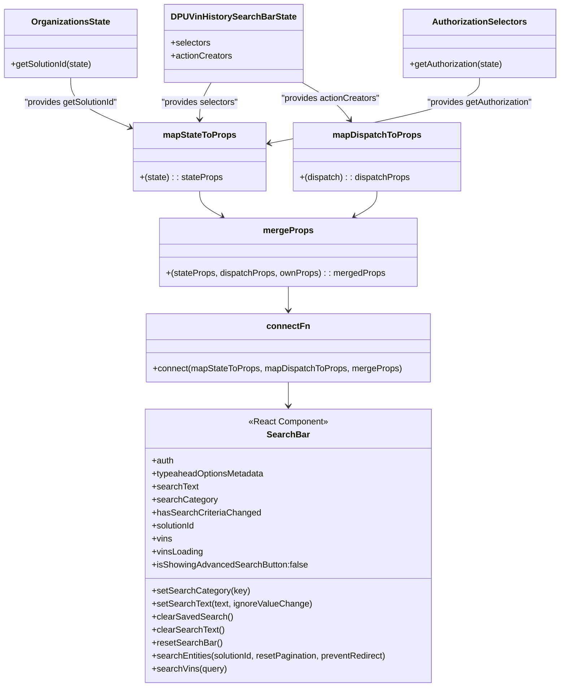

# Diagram: web/portal/src/pages/administration/internal-tools/dpu-admin-tool/components/DPU.VinHistory.SearchBar.container.js


> Auto-generated by Obscura crawlers

## Diagram 1

```mermaid
graph LR
  subgraph StateSelectors
    DPUSelect[DPUVinHistorySearchBarState.selectors]
    OrgGet[getSolutionId(state)]
    AuthGet[getAuthorization(state)]
  end
  subgraph ActionCreators
    DPUActions[DPUVinHistorySearchBarState.actionCreators]
  end
  DPUSelect -->|getSearchText, getSearchCategory, getTypeaheadOptionsMetadata, getHasSearchCriteriaChanged, getVins, getVinsLoading| mapState[mapStateToProps(state)]
  OrgGet --> mapState
  AuthGet --> mapState
  DPUActions --> mapDispatch[mapDispatchToProps(dispatch)]
  mapState --> merge[mergeProps(stateProps, dispatchProps, ownProps)]
  mapDispatch --> merge
  merge --> connectFn[connect(mapStateToProps, mapDispatchToProps, mergeProps)]
  connectFn --> SearchBarComp[SearchBar Component]
  style DPUSelect fill:#f9f,stroke:#333,stroke-width:1px
  style DPUActions fill:#ff9,stroke:#333,stroke-width:1px
  style mapState fill:#9f9,stroke:#333,stroke-width:1px
  style mapDispatch fill:#9cf,stroke:#333,stroke-width:1px
  style merge fill:#fc9,stroke:#333,stroke-width:1px
  style connectFn fill:#c9f,stroke:#333,stroke-width:1px
  style SearchBarComp fill:#fff,stroke:#333,stroke-width:1px
```

> SVG rendering failed for this diagram.

## Diagram 2



### SVG

<svg id="container" width="1036.958984375" xmlns="http://www.w3.org/2000/svg" class="classDiagram" height="1290" viewBox="0 0 1036.958984375 1290" role="graphics-document document" aria-roledescription="class"><style>#container{font-family:"trebuchet ms",verdana,arial,sans-serif;font-size:16px;fill:#333;}@keyframes edge-animation-frame{from{stroke-dashoffset:0;}}@keyframes dash{to{stroke-dashoffset:0;}}#container .edge-animation-slow{stroke-dasharray:9,5!important;stroke-dashoffset:900;animation:dash 50s linear infinite;stroke-linecap:round;}#container .edge-animation-fast{stroke-dasharray:9,5!important;stroke-dashoffset:900;animation:dash 20s linear infinite;stroke-linecap:round;}#container .error-icon{fill:#552222;}#container .error-text{fill:#552222;stroke:#552222;}#container .edge-thickness-normal{stroke-width:1px;}#container .edge-thickness-thick{stroke-width:3.5px;}#container .edge-pattern-solid{stroke-dasharray:0;}#container .edge-thickness-invisible{stroke-width:0;fill:none;}#container .edge-pattern-dashed{stroke-dasharray:3;}#container .edge-pattern-dotted{stroke-dasharray:2;}#container .marker{fill:#333333;stroke:#333333;}#container .marker.cross{stroke:#333333;}#container svg{font-family:"trebuchet ms",verdana,arial,sans-serif;font-size:16px;}#container p{margin:0;}#container g.classGroup text{fill:#9370DB;stroke:none;font-family:"trebuchet ms",verdana,arial,sans-serif;font-size:10px;}#container g.classGroup text .title{font-weight:bolder;}#container .nodeLabel,#container .edgeLabel{color:#131300;}#container .edgeLabel .label rect{fill:#ECECFF;}#container .label text{fill:#131300;}#container .labelBkg{background:#ECECFF;}#container .edgeLabel .label span{background:#ECECFF;}#container .classTitle{font-weight:bolder;}#container .node rect,#container .node circle,#container .node ellipse,#container .node polygon,#container .node path{fill:#ECECFF;stroke:#9370DB;stroke-width:1px;}#container .divider{stroke:#9370DB;stroke-width:1;}#container g.clickable{cursor:pointer;}#container g.classGroup rect{fill:#ECECFF;stroke:#9370DB;}#container g.classGroup line{stroke:#9370DB;stroke-width:1;}#container .classLabel .box{stroke:none;stroke-width:0;fill:#ECECFF;opacity:0.5;}#container .classLabel .label{fill:#9370DB;font-size:10px;}#container .relation{stroke:#333333;stroke-width:1;fill:none;}#container .dashed-line{stroke-dasharray:3;}#container .dotted-line{stroke-dasharray:1 2;}#container #compositionStart,#container .composition{fill:#333333!important;stroke:#333333!important;stroke-width:1;}#container #compositionEnd,#container .composition{fill:#333333!important;stroke:#333333!important;stroke-width:1;}#container #dependencyStart,#container .dependency{fill:#333333!important;stroke:#333333!important;stroke-width:1;}#container #dependencyStart,#container .dependency{fill:#333333!important;stroke:#333333!important;stroke-width:1;}#container #extensionStart,#container .extension{fill:transparent!important;stroke:#333333!important;stroke-width:1;}#container #extensionEnd,#container .extension{fill:transparent!important;stroke:#333333!important;stroke-width:1;}#container #aggregationStart,#container .aggregation{fill:transparent!important;stroke:#333333!important;stroke-width:1;}#container #aggregationEnd,#container .aggregation{fill:transparent!important;stroke:#333333!important;stroke-width:1;}#container #lollipopStart,#container .lollipop{fill:#ECECFF!important;stroke:#333333!important;stroke-width:1;}#container #lollipopEnd,#container .lollipop{fill:#ECECFF!important;stroke:#333333!important;stroke-width:1;}#container .edgeTerminals{font-size:11px;line-height:initial;}#container .classTitleText{text-anchor:middle;font-size:18px;fill:#333;}#container .label-icon{display:inline-block;height:1em;overflow:visible;vertical-align:-0.125em;}#container .node .label-icon path{fill:currentColor;stroke:revert;stroke-width:revert;}#container :root{--mermaid-font-family:"trebuchet ms",verdana,arial,sans-serif;}</style><g><defs><marker id="container_class-aggregationStart" class="marker aggregation class" refX="18" refY="7" markerWidth="190" markerHeight="240" orient="auto"><path d="M 18,7 L9,13 L1,7 L9,1 Z"></path></marker></defs><defs><marker id="container_class-aggregationEnd" class="marker aggregation class" refX="1" refY="7" markerWidth="20" markerHeight="28" orient="auto"><path d="M 18,7 L9,13 L1,7 L9,1 Z"></path></marker></defs><defs><marker id="container_class-extensionStart" class="marker extension class" refX="18" refY="7" markerWidth="190" markerHeight="240" orient="auto"><path d="M 1,7 L18,13 V 1 Z"></path></marker></defs><defs><marker id="container_class-extensionEnd" class="marker extension class" refX="1" refY="7" markerWidth="20" markerHeight="28" orient="auto"><path d="M 1,1 V 13 L18,7 Z"></path></marker></defs><defs><marker id="container_class-compositionStart" class="marker composition class" refX="18" refY="7" markerWidth="190" markerHeight="240" orient="auto"><path d="M 18,7 L9,13 L1,7 L9,1 Z"></path></marker></defs><defs><marker id="container_class-compositionEnd" class="marker composition class" refX="1" refY="7" markerWidth="20" markerHeight="28" orient="auto"><path d="M 18,7 L9,13 L1,7 L9,1 Z"></path></marker></defs><defs><marker id="container_class-dependencyStart" class="marker dependency class" refX="6" refY="7" markerWidth="190" markerHeight="240" orient="auto"><path d="M 5,7 L9,13 L1,7 L9,1 Z"></path></marker></defs><defs><marker id="container_class-dependencyEnd" class="marker dependency class" refX="13" refY="7" markerWidth="20" markerHeight="28" orient="auto"><path d="M 18,7 L9,13 L14,7 L9,1 Z"></path></marker></defs><defs><marker id="container_class-lollipopStart" class="marker lollipop class" refX="13" refY="7" markerWidth="190" markerHeight="240" orient="auto"><circle stroke="black" fill="transparent" cx="7" cy="7" r="6"></circle></marker></defs><defs><marker id="container_class-lollipopEnd" class="marker lollipop class" refX="1" refY="7" markerWidth="190" markerHeight="240" orient="auto"><circle stroke="black" fill="transparent" cx="7" cy="7" r="6"></circle></marker></defs><g class="root"><g class="clusters"></g><g class="edgePaths"><path d="M393.298,152L389.409,160.167C385.519,168.333,377.74,184.667,373.85,200C369.961,215.333,369.961,229.667,369.961,236.833L369.961,244" id="id_DPUVinHistorySearchBarState_mapStateToProps_1" class="edge-thickness-normal edge-pattern-solid relation" style=";;;" data-edge="true" data-et="edge" data-id="id_DPUVinHistorySearchBarState_mapStateToProps_1" data-points="W3sieCI6MzkzLjI5ODI2MzE3MTQ4NzYzLCJ5IjoxNTJ9LHsieCI6MzY5Ljk2MDkzNzUsInkiOjIwMX0seyJ4IjozNjkuOTYwOTM3NSwieSI6MjUwfV0=" marker-end="url(#container_class-dependencyEnd)"></path><path d="M131.121,143L131.121,152.667C131.121,162.333,131.121,181.667,149.968,200.171C168.816,218.676,206.51,236.352,225.357,245.19L244.204,254.029" id="id_OrganizationsState_mapStateToProps_2" class="edge-thickness-normal edge-pattern-solid relation" style=";;;" data-edge="true" data-et="edge" data-id="id_OrganizationsState_mapStateToProps_2" data-points="W3sieCI6MTMxLjEyMTA5Mzc1LCJ5IjoxNDN9LHsieCI6MTMxLjEyMTA5Mzc1LCJ5IjoyMDF9LHsieCI6MjQ5LjYzNjcxODc1LCJ5IjoyNTYuNTc1OTQ0OTE2MDE2NTd9XQ==" marker-end="url(#container_class-dependencyEnd)"></path><path d="M887.451,143L887.451,152.667C887.451,162.333,887.451,181.667,822.234,205.448C757.017,229.23,626.583,257.459,561.366,271.574L496.149,285.689" id="id_AuthorizationSelectors_mapStateToProps_3" class="edge-thickness-normal edge-pattern-solid relation" style=";;;" data-edge="true" data-et="edge" data-id="id_AuthorizationSelectors_mapStateToProps_3" data-points="W3sieCI6ODg3LjQ1MTE3MTg3NSwieSI6MTQzfSx7IngiOjg4Ny40NTExNzE4NzUsInkiOjIwMX0seyJ4Ijo0OTAuMjg1MTU2MjUsInkiOjI4Ni45NTgzMjQ5OTg1ODQ2Nn1d" marker-end="url(#container_class-dependencyEnd)"></path><path d="M544.367,152L557.612,160.167C570.858,168.333,597.349,184.667,615.107,200.149C632.864,215.631,641.889,230.262,646.401,237.578L650.913,244.893" id="id_DPUVinHistorySearchBarState_mapDispatchToProps_4" class="edge-thickness-normal edge-pattern-solid relation" style=";;;" data-edge="true" data-et="edge" data-id="id_DPUVinHistorySearchBarState_mapDispatchToProps_4" data-points="W3sieCI6NTQ0LjM2NjcwMzI1NDEzMjMsInkiOjE1Mn0seyJ4Ijo2MjMuODM5ODQzNzUsInkiOjIwMX0seyJ4Ijo2NTQuMDYzMjMyNDIxODc1LCJ5IjoyNTB9XQ==" marker-end="url(#container_class-dependencyEnd)"></path><path d="M369.961,376L369.961,380.167C369.961,384.333,369.961,392.667,376.729,400.521C383.496,408.376,397.032,415.753,403.8,419.441L410.568,423.129" id="id_mapStateToProps_mergeProps_5" class="edge-thickness-normal edge-pattern-solid relation" style=";;;" data-edge="true" data-et="edge" data-id="id_mapStateToProps_mergeProps_5" data-points="W3sieCI6MzY5Ljk2MDkzNzUsInkiOjM3Nn0seyJ4IjozNjkuOTYwOTM3NSwieSI6NDAxfSx7IngiOjQxNS44MzYwNzA2Njc2MTM2LCJ5Ijo0MjZ9XQ==" marker-end="url(#container_class-dependencyEnd)"></path><path d="M692.922,376L692.922,380.167C692.922,384.333,692.922,392.667,686.154,400.521C679.386,408.376,665.851,415.753,659.083,419.441L652.315,423.129" id="id_mapDispatchToProps_mergeProps_6" class="edge-thickness-normal edge-pattern-solid relation" style=";;;" data-edge="true" data-et="edge" data-id="id_mapDispatchToProps_mergeProps_6" data-points="W3sieCI6NjkyLjkyMTg3NSwieSI6Mzc2fSx7IngiOjY5Mi45MjE4NzUsInkiOjQwMX0seyJ4Ijo2NDcuMDQ2NzQxODMyMzg2NCwieSI6NDI2fV0=" marker-end="url(#container_class-dependencyEnd)"></path><path d="M531.441,552L531.441,556.167C531.441,560.333,531.441,568.667,531.441,576C531.441,583.333,531.441,589.667,531.441,592.833L531.441,596" id="id_mergeProps_connectFn_7" class="edge-thickness-normal edge-pattern-solid relation" style=";;;" data-edge="true" data-et="edge" data-id="id_mergeProps_connectFn_7" data-points="W3sieCI6NTMxLjQ0MTQwNjI1LCJ5Ijo1NTJ9LHsieCI6NTMxLjQ0MTQwNjI1LCJ5Ijo1Nzd9LHsieCI6NTMxLjQ0MTQwNjI1LCJ5Ijo2MDJ9XQ==" marker-end="url(#container_class-dependencyEnd)"></path><path d="M531.441,728L531.441,732.167C531.441,736.333,531.441,744.667,531.441,752C531.441,759.333,531.441,765.667,531.441,768.833L531.441,772" id="id_connectFn_SearchBar_8" class="edge-thickness-normal edge-pattern-solid relation" style=";;;" data-edge="true" data-et="edge" data-id="id_connectFn_SearchBar_8" data-points="W3sieCI6NTMxLjQ0MTQwNjI1LCJ5Ijo3Mjh9LHsieCI6NTMxLjQ0MTQwNjI1LCJ5Ijo3NTN9LHsieCI6NTMxLjQ0MTQwNjI1LCJ5Ijo3Nzh9XQ==" marker-end="url(#container_class-dependencyEnd)"></path></g><g class="edgeLabels"><g class="edgeLabel" transform="translate(369.9609375, 201)"><g class="label" data-id="id_DPUVinHistorySearchBarState_mapStateToProps_1" transform="translate(-72.4296875, -12)"><foreignObject width="144.859375" height="24"><div xmlns="http://www.w3.org/1999/xhtml" class="labelBkg" style="display: table-cell; white-space: nowrap; line-height: 1.5; max-width: 200px; text-align: center;"><span class="edgeLabel"><p>"provides selectors"</p></span></div></foreignObject></g></g><g class="edgeLabel" transform="translate(131.12109375, 201)"><g class="label" data-id="id_OrganizationsState_mapStateToProps_2" transform="translate(-88.78125, -12)"><foreignObject width="177.5625" height="24"><div xmlns="http://www.w3.org/1999/xhtml" class="labelBkg" style="display: table-cell; white-space: nowrap; line-height: 1.5; max-width: 200px; text-align: center;"><span class="edgeLabel"><p>"provides getSolutionId"</p></span></div></foreignObject></g></g><g class="edgeLabel" transform="translate(887.451171875, 201)"><g class="label" data-id="id_AuthorizationSelectors_mapStateToProps_3" transform="translate(-100, -24)"><foreignObject width="200" height="48"><div xmlns="http://www.w3.org/1999/xhtml" class="labelBkg" style="display: table; white-space: break-spaces; line-height: 1.5; max-width: 200px; text-align: center; width: 200px;"><span class="edgeLabel"><p>"provides getAuthorization"</p></span></div></foreignObject></g></g><g class="edgeLabel" transform="translate(608.60594, 191.60737)"><g class="label" data-id="id_DPUVinHistorySearchBarState_mapDispatchToProps_4" transform="translate(-92.3671875, -12)"><foreignObject width="184.734375" height="24"><div xmlns="http://www.w3.org/1999/xhtml" class="labelBkg" style="display: table-cell; white-space: nowrap; line-height: 1.5; max-width: 200px; text-align: center;"><span class="edgeLabel"><p>"provides actionCreators"</p></span></div></foreignObject></g></g><g class="edgeLabel"><g class="label" data-id="id_mapStateToProps_mergeProps_5" transform="translate(0, 0)"><foreignObject width="0" height="0"><div xmlns="http://www.w3.org/1999/xhtml" class="labelBkg" style="display: table-cell; white-space: nowrap; line-height: 1.5; max-width: 200px; text-align: center;"><span class="edgeLabel"></span></div></foreignObject></g></g><g class="edgeLabel"><g class="label" data-id="id_mapDispatchToProps_mergeProps_6" transform="translate(0, 0)"><foreignObject width="0" height="0"><div xmlns="http://www.w3.org/1999/xhtml" class="labelBkg" style="display: table-cell; white-space: nowrap; line-height: 1.5; max-width: 200px; text-align: center;"><span class="edgeLabel"></span></div></foreignObject></g></g><g class="edgeLabel"><g class="label" data-id="id_mergeProps_connectFn_7" transform="translate(0, 0)"><foreignObject width="0" height="0"><div xmlns="http://www.w3.org/1999/xhtml" class="labelBkg" style="display: table-cell; white-space: nowrap; line-height: 1.5; max-width: 200px; text-align: center;"><span class="edgeLabel"></span></div></foreignObject></g></g><g class="edgeLabel"><g class="label" data-id="id_connectFn_SearchBar_8" transform="translate(0, 0)"><foreignObject width="0" height="0"><div xmlns="http://www.w3.org/1999/xhtml" class="labelBkg" style="display: table-cell; white-space: nowrap; line-height: 1.5; max-width: 200px; text-align: center;"><span class="edgeLabel"></span></div></foreignObject></g></g></g><g class="nodes"><g class="node default" id="classId-SearchBar-0" transform="translate(531.44140625, 1030)"><g class="basic label-container"><path d="M-268.36328125 -252 L268.36328125 -252 L268.36328125 252 L-268.36328125 252" stroke="none" stroke-width="0" fill="#ECECFF" style=""></path><path d="M-268.36328125 -252 C-102.33048240131495 -252, 63.702316447370094 -252, 268.36328125 -252 M-268.36328125 -252 C-68.28681940518689 -252, 131.78964243962622 -252, 268.36328125 -252 M268.36328125 -252 C268.36328125 -58.3181666933464, 268.36328125 135.3636666133072, 268.36328125 252 M268.36328125 -252 C268.36328125 -51.55796691889131, 268.36328125 148.88406616221738, 268.36328125 252 M268.36328125 252 C127.55781429024336 252, -13.247652669513286 252, -268.36328125 252 M268.36328125 252 C157.3679246216558 252, 46.37256799331158 252, -268.36328125 252 M-268.36328125 252 C-268.36328125 84.84524069477357, -268.36328125 -82.30951861045287, -268.36328125 -252 M-268.36328125 252 C-268.36328125 115.77433417609217, -268.36328125 -20.451331647815664, -268.36328125 -252" stroke="#9370DB" stroke-width="1.3" fill="none" stroke-dasharray="0 0" style=""></path></g><g class="annotation-group text" transform="translate(-73.2109375, -228)"><g class="label" style="" transform="translate(0,-12)"><foreignObject width="146.421875" height="24"><div xmlns="http://www.w3.org/1999/xhtml" style="display: table-cell; white-space: nowrap; line-height: 1.5; max-width: 196px; text-align: center;"><span class="nodeLabel markdown-node-label" style=""><p>«React Component»</p></span></div></foreignObject></g></g><g class="label-group text" transform="translate(-37.2421875, -204)"><g class="label" style="font-weight: bolder" transform="translate(0,-12)"><foreignObject width="74.484375" height="24"><div xmlns="http://www.w3.org/1999/xhtml" style="display: table-cell; white-space: nowrap; line-height: 1.5; max-width: 124px; text-align: center;"><span class="nodeLabel markdown-node-label" style=""><p>SearchBar</p></span></div></foreignObject></g></g><g class="members-group text" transform="translate(-256.36328125, -156)"><g class="label" style="" transform="translate(0,-12)"><foreignObject width="40.921875" height="24"><div xmlns="http://www.w3.org/1999/xhtml" style="display: table-cell; white-space: nowrap; line-height: 1.5; max-width: 98px; text-align: center;"><span class="nodeLabel markdown-node-label" style=""><p>+auth</p></span></div></foreignObject></g><g class="label" style="" transform="translate(0,12)"><foreignObject width="209.6875" height="24"><div xmlns="http://www.w3.org/1999/xhtml" style="display: table-cell; white-space: nowrap; line-height: 1.5; max-width: 267px; text-align: center;"><span class="nodeLabel markdown-node-label" style=""><p>+typeaheadOptionsMetadata</p></span></div></foreignObject></g><g class="label" style="" transform="translate(0,36)"><foreignObject width="84.953125" height="24"><div xmlns="http://www.w3.org/1999/xhtml" style="display: table-cell; white-space: nowrap; line-height: 1.5; max-width: 143px; text-align: center;"><span class="nodeLabel markdown-node-label" style=""><p>+searchText</p></span></div></foreignObject></g><g class="label" style="" transform="translate(0,60)"><foreignObject width="118.65625" height="24"><div xmlns="http://www.w3.org/1999/xhtml" style="display: table-cell; white-space: nowrap; line-height: 1.5; max-width: 176px; text-align: center;"><span class="nodeLabel markdown-node-label" style=""><p>+searchCategory</p></span></div></foreignObject></g><g class="label" style="" transform="translate(0,84)"><foreignObject width="197.75" height="24"><div xmlns="http://www.w3.org/1999/xhtml" style="display: table-cell; white-space: nowrap; line-height: 1.5; max-width: 255px; text-align: center;"><span class="nodeLabel markdown-node-label" style=""><p>+hasSearchCriteriaChanged</p></span></div></foreignObject></g><g class="label" style="" transform="translate(0,108)"><foreignObject width="82.109375" height="24"><div xmlns="http://www.w3.org/1999/xhtml" style="display: table-cell; white-space: nowrap; line-height: 1.5; max-width: 139px; text-align: center;"><span class="nodeLabel markdown-node-label" style=""><p>+solutionId</p></span></div></foreignObject></g><g class="label" style="" transform="translate(0,132)"><foreignObject width="37.0625" height="24"><div xmlns="http://www.w3.org/1999/xhtml" style="display: table-cell; white-space: nowrap; line-height: 1.5; max-width: 94px; text-align: center;"><span class="nodeLabel markdown-node-label" style=""><p>+vins</p></span></div></foreignObject></g><g class="label" style="" transform="translate(0,156)"><foreignObject width="94.296875" height="24"><div xmlns="http://www.w3.org/1999/xhtml" style="display: table-cell; white-space: nowrap; line-height: 1.5; max-width: 152px; text-align: center;"><span class="nodeLabel markdown-node-label" style=""><p>+vinsLoading</p></span></div></foreignObject></g><g class="label" style="" transform="translate(0,180)"><foreignObject width="287.25" height="24"><div xmlns="http://www.w3.org/1999/xhtml" style="display: table-cell; white-space: nowrap; line-height: 1.5; max-width: 345px; text-align: center;"><span class="nodeLabel markdown-node-label" style=""><p>+isShowingAdvancedSearchButton:false</p></span></div></foreignObject></g></g><g class="methods-group text" transform="translate(-256.36328125, 84)"><g class="label" style="" transform="translate(0,-12)"><foreignObject width="176.828125" height="24"><div xmlns="http://www.w3.org/1999/xhtml" style="display: table-cell; white-space: nowrap; line-height: 1.5; max-width: 234px; text-align: center;"><span class="nodeLabel markdown-node-label" style=""><p>+setSearchCategory(key)</p></span></div></foreignObject></g><g class="label" style="" transform="translate(0,12)"><foreignObject width="292.859375" height="24"><div xmlns="http://www.w3.org/1999/xhtml" style="display: table-cell; white-space: nowrap; line-height: 1.5; max-width: 350px; text-align: center;"><span class="nodeLabel markdown-node-label" style=""><p>+setSearchText(text, ignoreValueChange)</p></span></div></foreignObject></g><g class="label" style="" transform="translate(0,36)"><foreignObject width="146.046875" height="24"><div xmlns="http://www.w3.org/1999/xhtml" style="display: table-cell; white-space: nowrap; line-height: 1.5; max-width: 203px; text-align: center;"><span class="nodeLabel markdown-node-label" style=""><p>+clearSavedSearch()</p></span></div></foreignObject></g><g class="label" style="" transform="translate(0,60)"><foreignObject width="132.265625" height="24"><div xmlns="http://www.w3.org/1999/xhtml" style="display: table-cell; white-space: nowrap; line-height: 1.5; max-width: 190px; text-align: center;"><span class="nodeLabel markdown-node-label" style=""><p>+clearSearchText()</p></span></div></foreignObject></g><g class="label" style="" transform="translate(0,84)"><foreignObject width="128.0625" height="24"><div xmlns="http://www.w3.org/1999/xhtml" style="display: table-cell; white-space: nowrap; line-height: 1.5; max-width: 185px; text-align: center;"><span class="nodeLabel markdown-node-label" style=""><p>+resetSearchBar()</p></span></div></foreignObject></g><g class="label" style="" transform="translate(0,108)"><foreignObject width="439.515625" height="24"><div xmlns="http://www.w3.org/1999/xhtml" style="display: table-cell; white-space: nowrap; line-height: 1.5; max-width: 497px; text-align: center;"><span class="nodeLabel markdown-node-label" style=""><p>+searchEntities(solutionId, resetPagination, preventRedirect)</p></span></div></foreignObject></g><g class="label" style="" transform="translate(0,132)"><foreignObject width="137.71875" height="24"><div xmlns="http://www.w3.org/1999/xhtml" style="display: table-cell; white-space: nowrap; line-height: 1.5; max-width: 195px; text-align: center;"><span class="nodeLabel markdown-node-label" style=""><p>+searchVins(query)</p></span></div></foreignObject></g></g><g class="divider" style=""><path d="M-268.36328125 -180 C-140.19774976356513 -180, -12.032218277130255 -180, 268.36328125 -180 M-268.36328125 -180 C-92.8790072912486 -180, 82.6052666675028 -180, 268.36328125 -180" stroke="#9370DB" stroke-width="1.3" fill="none" stroke-dasharray="0 0" style=""></path></g><g class="divider" style=""><path d="M-268.36328125 60 C-144.35483732793443 60, -20.346393405868895 60, 268.36328125 60 M-268.36328125 60 C-89.31080852862269 60, 89.74166419275463 60, 268.36328125 60" stroke="#9370DB" stroke-width="1.3" fill="none" stroke-dasharray="0 0" style=""></path></g></g><g class="node default" id="classId-DPUVinHistorySearchBarState-1" transform="translate(427.58984375, 80)"><g class="basic label-container"><path d="M-123.34765625 -72 L123.34765625 -72 L123.34765625 72 L-123.34765625 72" stroke="none" stroke-width="0" fill="#ECECFF" style=""></path><path d="M-123.34765625 -72 C-52.40740142968383 -72, 18.53285339063234 -72, 123.34765625 -72 M-123.34765625 -72 C-33.72468105737509 -72, 55.89829413524981 -72, 123.34765625 -72 M123.34765625 -72 C123.34765625 -37.69731514038826, 123.34765625 -3.394630280776525, 123.34765625 72 M123.34765625 -72 C123.34765625 -38.68622986413838, 123.34765625 -5.372459728276766, 123.34765625 72 M123.34765625 72 C67.21591904205283 72, 11.08418183410565 72, -123.34765625 72 M123.34765625 72 C65.3260838676269 72, 7.304511485253812 72, -123.34765625 72 M-123.34765625 72 C-123.34765625 30.536725133584987, -123.34765625 -10.926549732830026, -123.34765625 -72 M-123.34765625 72 C-123.34765625 38.5683530696139, -123.34765625 5.1367061392277975, -123.34765625 -72" stroke="#9370DB" stroke-width="1.3" fill="none" stroke-dasharray="0 0" style=""></path></g><g class="annotation-group text" transform="translate(0, -48)"></g><g class="label-group text" transform="translate(-109.6171875, -48)"><g class="label" style="font-weight: bolder" transform="translate(0,-12)"><foreignObject width="219.234375" height="24"><div xmlns="http://www.w3.org/1999/xhtml" style="display: table-cell; white-space: nowrap; line-height: 1.5; max-width: 265px; text-align: center;"><span class="nodeLabel markdown-node-label" style=""><p>DPUVinHistorySearchBarState</p></span></div></foreignObject></g></g><g class="members-group text" transform="translate(-111.34765625, 0)"><g class="label" style="" transform="translate(0,-12)"><foreignObject width="73.453125" height="24"><div xmlns="http://www.w3.org/1999/xhtml" style="display: table-cell; white-space: nowrap; line-height: 1.5; max-width: 131px; text-align: center;"><span class="nodeLabel markdown-node-label" style=""><p>+selectors</p></span></div></foreignObject></g><g class="label" style="" transform="translate(0,12)"><foreignObject width="113.078125" height="24"><div xmlns="http://www.w3.org/1999/xhtml" style="display: table-cell; white-space: nowrap; line-height: 1.5; max-width: 170px; text-align: center;"><span class="nodeLabel markdown-node-label" style=""><p>+actionCreators</p></span></div></foreignObject></g></g><g class="methods-group text" transform="translate(-111.34765625, 72)"></g><g class="divider" style=""><path d="M-123.34765625 -24 C-44.27509941848602 -24, 34.797457413027956 -24, 123.34765625 -24 M-123.34765625 -24 C-31.546655597599184 -24, 60.25434505480163 -24, 123.34765625 -24" stroke="#9370DB" stroke-width="1.3" fill="none" stroke-dasharray="0 0" style=""></path></g><g class="divider" style=""><path d="M-123.34765625 48 C-34.84312588987301 48, 53.661404470253984 48, 123.34765625 48 M-123.34765625 48 C-49.0203983198828 48, 25.306859610234397 48, 123.34765625 48" stroke="#9370DB" stroke-width="1.3" fill="none" stroke-dasharray="0 0" style=""></path></g></g><g class="node default" id="classId-OrganizationsState-2" transform="translate(131.12109375, 80)"><g class="basic label-container"><path d="M-123.12109375 -63 L123.12109375 -63 L123.12109375 63 L-123.12109375 63" stroke="none" stroke-width="0" fill="#ECECFF" style=""></path><path d="M-123.12109375 -63 C-24.654002739625113 -63, 73.81308827074977 -63, 123.12109375 -63 M-123.12109375 -63 C-57.32060513152369 -63, 8.479883486952616 -63, 123.12109375 -63 M123.12109375 -63 C123.12109375 -24.591945074108565, 123.12109375 13.816109851782869, 123.12109375 63 M123.12109375 -63 C123.12109375 -22.791054297779056, 123.12109375 17.41789140444189, 123.12109375 63 M123.12109375 63 C43.51292023952823 63, -36.095253270943545 63, -123.12109375 63 M123.12109375 63 C32.15361080117185 63, -58.8138721476563 63, -123.12109375 63 M-123.12109375 63 C-123.12109375 23.13491711483225, -123.12109375 -16.730165770335503, -123.12109375 -63 M-123.12109375 63 C-123.12109375 18.481616714978315, -123.12109375 -26.03676657004337, -123.12109375 -63" stroke="#9370DB" stroke-width="1.3" fill="none" stroke-dasharray="0 0" style=""></path></g><g class="annotation-group text" transform="translate(0, -39)"></g><g class="label-group text" transform="translate(-69.8671875, -39)"><g class="label" style="font-weight: bolder" transform="translate(0,-12)"><foreignObject width="139.734375" height="24"><div xmlns="http://www.w3.org/1999/xhtml" style="display: table-cell; white-space: nowrap; line-height: 1.5; max-width: 187px; text-align: center;"><span class="nodeLabel markdown-node-label" style=""><p>OrganizationsState</p></span></div></foreignObject></g></g><g class="members-group text" transform="translate(-111.12109375, 9)"></g><g class="methods-group text" transform="translate(-111.12109375, 39)"><g class="label" style="" transform="translate(0,-12)"><foreignObject width="152.375" height="24"><div xmlns="http://www.w3.org/1999/xhtml" style="display: table-cell; white-space: nowrap; line-height: 1.5; max-width: 210px; text-align: center;"><span class="nodeLabel markdown-node-label" style=""><p>+getSolutionId(state)</p></span></div></foreignObject></g></g><g class="divider" style=""><path d="M-123.12109375 -15 C-45.449445228073174 -15, 32.22220329385365 -15, 123.12109375 -15 M-123.12109375 -15 C-49.99456454019675 -15, 23.131964669606504 -15, 123.12109375 -15" stroke="#9370DB" stroke-width="1.3" fill="none" stroke-dasharray="0 0" style=""></path></g><g class="divider" style=""><path d="M-123.12109375 9 C-41.86312715680265 9, 39.394839436394705 9, 123.12109375 9 M-123.12109375 9 C-57.80844696516942 9, 7.504199819661153 9, 123.12109375 9" stroke="#9370DB" stroke-width="1.3" fill="none" stroke-dasharray="0 0" style=""></path></g></g><g class="node default" id="classId-AuthorizationSelectors-3" transform="translate(887.451171875, 80)"><g class="basic label-container"><path d="M-141.5078125 -63 L141.5078125 -63 L141.5078125 63 L-141.5078125 63" stroke="none" stroke-width="0" fill="#ECECFF" style=""></path><path d="M-141.5078125 -63 C-49.65034500433728 -63, 42.207122491325435 -63, 141.5078125 -63 M-141.5078125 -63 C-81.23309346680028 -63, -20.958374433600568 -63, 141.5078125 -63 M141.5078125 -63 C141.5078125 -30.45325956138891, 141.5078125 2.093480877222177, 141.5078125 63 M141.5078125 -63 C141.5078125 -23.88481211390807, 141.5078125 15.230375772183862, 141.5078125 63 M141.5078125 63 C73.45535063005838 63, 5.402888760116753 63, -141.5078125 63 M141.5078125 63 C65.91877918323878 63, -9.670254133522434 63, -141.5078125 63 M-141.5078125 63 C-141.5078125 13.024112759716083, -141.5078125 -36.951774480567835, -141.5078125 -63 M-141.5078125 63 C-141.5078125 14.40740062637908, -141.5078125 -34.18519874724184, -141.5078125 -63" stroke="#9370DB" stroke-width="1.3" fill="none" stroke-dasharray="0 0" style=""></path></g><g class="annotation-group text" transform="translate(0, -39)"></g><g class="label-group text" transform="translate(-83.875, -39)"><g class="label" style="font-weight: bolder" transform="translate(0,-12)"><foreignObject width="167.75" height="24"><div xmlns="http://www.w3.org/1999/xhtml" style="display: table-cell; white-space: nowrap; line-height: 1.5; max-width: 215px; text-align: center;"><span class="nodeLabel markdown-node-label" style=""><p>AuthorizationSelectors</p></span></div></foreignObject></g></g><g class="members-group text" transform="translate(-129.5078125, 9)"></g><g class="methods-group text" transform="translate(-129.5078125, 39)"><g class="label" style="" transform="translate(0,-12)"><foreignObject width="175.140625" height="24"><div xmlns="http://www.w3.org/1999/xhtml" style="display: table-cell; white-space: nowrap; line-height: 1.5; max-width: 233px; text-align: center;"><span class="nodeLabel markdown-node-label" style=""><p>+getAuthorization(state)</p></span></div></foreignObject></g></g><g class="divider" style=""><path d="M-141.5078125 -15 C-50.92231188168908 -15, 39.663188736621834 -15, 141.5078125 -15 M-141.5078125 -15 C-60.66827533502065 -15, 20.171261829958695 -15, 141.5078125 -15" stroke="#9370DB" stroke-width="1.3" fill="none" stroke-dasharray="0 0" style=""></path></g><g class="divider" style=""><path d="M-141.5078125 9 C-65.3912625378383 9, 10.725287424323398 9, 141.5078125 9 M-141.5078125 9 C-47.50123611659504 9, 46.505340266809924 9, 141.5078125 9" stroke="#9370DB" stroke-width="1.3" fill="none" stroke-dasharray="0 0" style=""></path></g></g><g class="node default" id="classId-mapStateToProps-4" transform="translate(369.9609375, 313)"><g class="basic label-container"><path d="M-120.32421875 -63 L120.32421875 -63 L120.32421875 63 L-120.32421875 63" stroke="none" stroke-width="0" fill="#ECECFF" style=""></path><path d="M-120.32421875 -63 C-52.7089801129263 -63, 14.906258524147404 -63, 120.32421875 -63 M-120.32421875 -63 C-70.5552138280203 -63, -20.786208906040585 -63, 120.32421875 -63 M120.32421875 -63 C120.32421875 -23.06226918742164, 120.32421875 16.875461625156717, 120.32421875 63 M120.32421875 -63 C120.32421875 -17.046291452002002, 120.32421875 28.907417095995996, 120.32421875 63 M120.32421875 63 C64.93041389798316 63, 9.536609045966316 63, -120.32421875 63 M120.32421875 63 C66.2355748136246 63, 12.14693087724919 63, -120.32421875 63 M-120.32421875 63 C-120.32421875 36.83255644881939, -120.32421875 10.665112897638771, -120.32421875 -63 M-120.32421875 63 C-120.32421875 31.67958091014859, -120.32421875 0.3591618202971816, -120.32421875 -63" stroke="#9370DB" stroke-width="1.3" fill="none" stroke-dasharray="0 0" style=""></path></g><g class="annotation-group text" transform="translate(0, -39)"></g><g class="label-group text" transform="translate(-64.7109375, -39)"><g class="label" style="font-weight: bolder" transform="translate(0,-12)"><foreignObject width="129.421875" height="24"><div xmlns="http://www.w3.org/1999/xhtml" style="display: table-cell; white-space: nowrap; line-height: 1.5; max-width: 177px; text-align: center;"><span class="nodeLabel markdown-node-label" style=""><p>mapStateToProps</p></span></div></foreignObject></g></g><g class="members-group text" transform="translate(-108.32421875, 9)"></g><g class="methods-group text" transform="translate(-108.32421875, 39)"><g class="label" style="" transform="translate(0,-12)"><foreignObject width="151.9375" height="24"><div xmlns="http://www.w3.org/1999/xhtml" style="display: table-cell; white-space: nowrap; line-height: 1.5; max-width: 202px; text-align: center;"><span class="nodeLabel markdown-node-label" style=""><p>+(state) : : stateProps</p></span></div></foreignObject></g></g><g class="divider" style=""><path d="M-120.32421875 -15 C-45.58491652648284 -15, 29.154385697034314 -15, 120.32421875 -15 M-120.32421875 -15 C-32.15057867984399 -15, 56.02306139031202 -15, 120.32421875 -15" stroke="#9370DB" stroke-width="1.3" fill="none" stroke-dasharray="0 0" style=""></path></g><g class="divider" style=""><path d="M-120.32421875 9 C-34.60756743080924 9, 51.10908388838152 9, 120.32421875 9 M-120.32421875 9 C-39.00990891690623 9, 42.30440091618755 9, 120.32421875 9" stroke="#9370DB" stroke-width="1.3" fill="none" stroke-dasharray="0 0" style=""></path></g></g><g class="node default" id="classId-mapDispatchToProps-5" transform="translate(692.921875, 313)"><g class="basic label-container"><path d="M-152.63671875 -63 L152.63671875 -63 L152.63671875 63 L-152.63671875 63" stroke="none" stroke-width="0" fill="#ECECFF" style=""></path><path d="M-152.63671875 -63 C-74.88950708913151 -63, 2.8577045717369742 -63, 152.63671875 -63 M-152.63671875 -63 C-60.206183627606876 -63, 32.22435149478625 -63, 152.63671875 -63 M152.63671875 -63 C152.63671875 -27.61196197743898, 152.63671875 7.776076045122039, 152.63671875 63 M152.63671875 -63 C152.63671875 -27.38280089911261, 152.63671875 8.23439820177478, 152.63671875 63 M152.63671875 63 C67.14847729538997 63, -18.339764159220067 63, -152.63671875 63 M152.63671875 63 C69.28965216686993 63, -14.057414416260144 63, -152.63671875 63 M-152.63671875 63 C-152.63671875 20.924177930659567, -152.63671875 -21.151644138680865, -152.63671875 -63 M-152.63671875 63 C-152.63671875 16.14578511778239, -152.63671875 -30.708429764435223, -152.63671875 -63" stroke="#9370DB" stroke-width="1.3" fill="none" stroke-dasharray="0 0" style=""></path></g><g class="annotation-group text" transform="translate(0, -39)"></g><g class="label-group text" transform="translate(-77.1953125, -39)"><g class="label" style="font-weight: bolder" transform="translate(0,-12)"><foreignObject width="154.390625" height="24"><div xmlns="http://www.w3.org/1999/xhtml" style="display: table-cell; white-space: nowrap; line-height: 1.5; max-width: 203px; text-align: center;"><span class="nodeLabel markdown-node-label" style=""><p>mapDispatchToProps</p></span></div></foreignObject></g></g><g class="members-group text" transform="translate(-140.63671875, 9)"></g><g class="methods-group text" transform="translate(-140.63671875, 39)"><g class="label" style="" transform="translate(0,-12)"><foreignObject width="204.078125" height="24"><div xmlns="http://www.w3.org/1999/xhtml" style="display: table-cell; white-space: nowrap; line-height: 1.5; max-width: 254px; text-align: center;"><span class="nodeLabel markdown-node-label" style=""><p>+(dispatch) : : dispatchProps</p></span></div></foreignObject></g></g><g class="divider" style=""><path d="M-152.63671875 -15 C-31.977769397193626 -15, 88.68117995561275 -15, 152.63671875 -15 M-152.63671875 -15 C-40.69431685723042 -15, 71.24808503553916 -15, 152.63671875 -15" stroke="#9370DB" stroke-width="1.3" fill="none" stroke-dasharray="0 0" style=""></path></g><g class="divider" style=""><path d="M-152.63671875 9 C-77.08664738631659 9, -1.5365760226331702 9, 152.63671875 9 M-152.63671875 9 C-83.74719307398996 9, -14.857667397979924 9, 152.63671875 9" stroke="#9370DB" stroke-width="1.3" fill="none" stroke-dasharray="0 0" style=""></path></g></g><g class="node default" id="classId-mergeProps-6" transform="translate(531.44140625, 489)"><g class="basic label-container"><path d="M-234.9609375 -63 L234.9609375 -63 L234.9609375 63 L-234.9609375 63" stroke="none" stroke-width="0" fill="#ECECFF" style=""></path><path d="M-234.9609375 -63 C-116.76808040866443 -63, 1.424776682671137 -63, 234.9609375 -63 M-234.9609375 -63 C-50.55931833182402 -63, 133.84230083635197 -63, 234.9609375 -63 M234.9609375 -63 C234.9609375 -16.734031755088132, 234.9609375 29.531936489823735, 234.9609375 63 M234.9609375 -63 C234.9609375 -31.814484540919892, 234.9609375 -0.6289690818397844, 234.9609375 63 M234.9609375 63 C99.69611324779564 63, -35.568711004408726 63, -234.9609375 63 M234.9609375 63 C77.64041148084678 63, -79.68011453830644 63, -234.9609375 63 M-234.9609375 63 C-234.9609375 30.024548403859832, -234.9609375 -2.950903192280336, -234.9609375 -63 M-234.9609375 63 C-234.9609375 30.17755102693671, -234.9609375 -2.6448979461265765, -234.9609375 -63" stroke="#9370DB" stroke-width="1.3" fill="none" stroke-dasharray="0 0" style=""></path></g><g class="annotation-group text" transform="translate(0, -39)"></g><g class="label-group text" transform="translate(-43.859375, -39)"><g class="label" style="font-weight: bolder" transform="translate(0,-12)"><foreignObject width="87.71875" height="24"><div xmlns="http://www.w3.org/1999/xhtml" style="display: table-cell; white-space: nowrap; line-height: 1.5; max-width: 136px; text-align: center;"><span class="nodeLabel markdown-node-label" style=""><p>mergeProps</p></span></div></foreignObject></g></g><g class="members-group text" transform="translate(-222.9609375, 9)"></g><g class="methods-group text" transform="translate(-222.9609375, 39)"><g class="label" style="" transform="translate(0,-12)"><foreignObject width="402.0625" height="24"><div xmlns="http://www.w3.org/1999/xhtml" style="display: table-cell; white-space: nowrap; line-height: 1.5; max-width: 452px; text-align: center;"><span class="nodeLabel markdown-node-label" style=""><p>+(stateProps, dispatchProps, ownProps) : : mergedProps</p></span></div></foreignObject></g></g><g class="divider" style=""><path d="M-234.9609375 -15 C-59.326128876302676 -15, 116.30867974739465 -15, 234.9609375 -15 M-234.9609375 -15 C-96.5374126614571 -15, 41.886112177085806 -15, 234.9609375 -15" stroke="#9370DB" stroke-width="1.3" fill="none" stroke-dasharray="0 0" style=""></path></g><g class="divider" style=""><path d="M-234.9609375 9 C-118.08136592066921 9, -1.2017943413384273 9, 234.9609375 9 M-234.9609375 9 C-106.8530178932829 9, 21.254901713434208 9, 234.9609375 9" stroke="#9370DB" stroke-width="1.3" fill="none" stroke-dasharray="0 0" style=""></path></g></g><g class="node default" id="classId-connectFn-7" transform="translate(531.44140625, 665)"><g class="basic label-container"><path d="M-259.45703125 -63 L259.45703125 -63 L259.45703125 63 L-259.45703125 63" stroke="none" stroke-width="0" fill="#ECECFF" style=""></path><path d="M-259.45703125 -63 C-63.18347715545934 -63, 133.0900769390813 -63, 259.45703125 -63 M-259.45703125 -63 C-153.45216920381017 -63, -47.447307157620315 -63, 259.45703125 -63 M259.45703125 -63 C259.45703125 -24.155060540020912, 259.45703125 14.689878919958176, 259.45703125 63 M259.45703125 -63 C259.45703125 -27.53395384449835, 259.45703125 7.932092311003302, 259.45703125 63 M259.45703125 63 C94.38365889353773 63, -70.68971346292454 63, -259.45703125 63 M259.45703125 63 C128.89592693468373 63, -1.6651773806325423 63, -259.45703125 63 M-259.45703125 63 C-259.45703125 22.41720165702879, -259.45703125 -18.16559668594242, -259.45703125 -63 M-259.45703125 63 C-259.45703125 16.663682842502226, -259.45703125 -29.67263431499555, -259.45703125 -63" stroke="#9370DB" stroke-width="1.3" fill="none" stroke-dasharray="0 0" style=""></path></g><g class="annotation-group text" transform="translate(0, -39)"></g><g class="label-group text" transform="translate(-37.1484375, -39)"><g class="label" style="font-weight: bolder" transform="translate(0,-12)"><foreignObject width="74.296875" height="24"><div xmlns="http://www.w3.org/1999/xhtml" style="display: table-cell; white-space: nowrap; line-height: 1.5; max-width: 124px; text-align: center;"><span class="nodeLabel markdown-node-label" style=""><p>connectFn</p></span></div></foreignObject></g></g><g class="members-group text" transform="translate(-247.45703125, 9)"></g><g class="methods-group text" transform="translate(-247.45703125, 39)"><g class="label" style="" transform="translate(0,-12)"><foreignObject width="457.765625" height="24"><div xmlns="http://www.w3.org/1999/xhtml" style="display: table-cell; white-space: nowrap; line-height: 1.5; max-width: 515px; text-align: center;"><span class="nodeLabel markdown-node-label" style=""><p>+connect(mapStateToProps, mapDispatchToProps, mergeProps)</p></span></div></foreignObject></g></g><g class="divider" style=""><path d="M-259.45703125 -15 C-152.75729100416163 -15, -46.05755075832329 -15, 259.45703125 -15 M-259.45703125 -15 C-53.94110834398603 -15, 151.57481456202794 -15, 259.45703125 -15" stroke="#9370DB" stroke-width="1.3" fill="none" stroke-dasharray="0 0" style=""></path></g><g class="divider" style=""><path d="M-259.45703125 9 C-128.10983192151056 9, 3.2373674069788763 9, 259.45703125 9 M-259.45703125 9 C-129.3685535262908 9, 0.7199241974183792 9, 259.45703125 9" stroke="#9370DB" stroke-width="1.3" fill="none" stroke-dasharray="0 0" style=""></path></g></g></g></g></g></svg>
