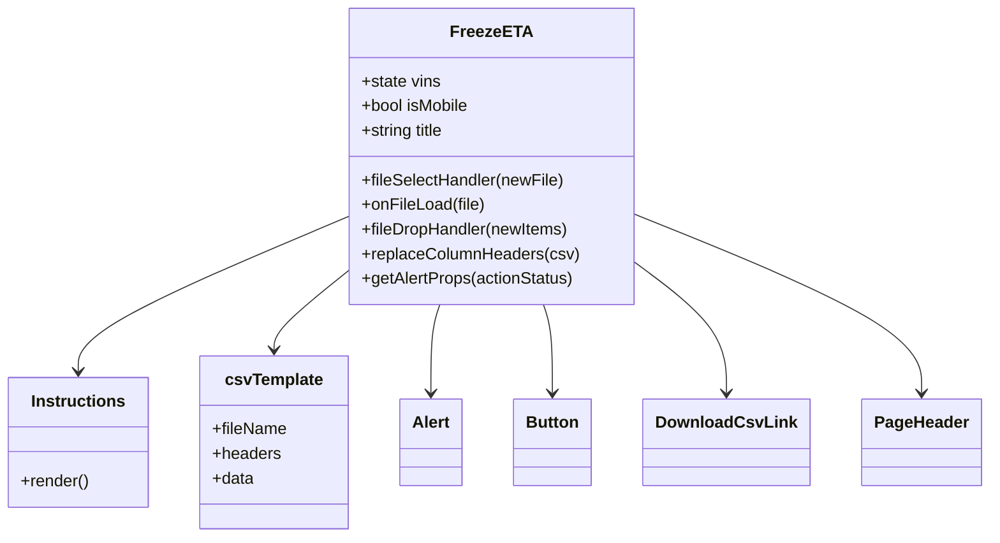

# Diagram: web/portal/src/pages/administration/internal-tools/freeze-eta/FreezeETA.page.js


> Auto-generated by Obscura crawlers

## Diagram 1



### SVG

<svg id="container" width="940.09375" xmlns="http://www.w3.org/2000/svg" class="classDiagram" height="522" viewBox="0 0 940.09375 522" role="graphics-document document" aria-roledescription="class"><style>#container{font-family:"trebuchet ms",verdana,arial,sans-serif;font-size:16px;fill:#333;}@keyframes edge-animation-frame{from{stroke-dashoffset:0;}}@keyframes dash{to{stroke-dashoffset:0;}}#container .edge-animation-slow{stroke-dasharray:9,5!important;stroke-dashoffset:900;animation:dash 50s linear infinite;stroke-linecap:round;}#container .edge-animation-fast{stroke-dasharray:9,5!important;stroke-dashoffset:900;animation:dash 20s linear infinite;stroke-linecap:round;}#container .error-icon{fill:#552222;}#container .error-text{fill:#552222;stroke:#552222;}#container .edge-thickness-normal{stroke-width:1px;}#container .edge-thickness-thick{stroke-width:3.5px;}#container .edge-pattern-solid{stroke-dasharray:0;}#container .edge-thickness-invisible{stroke-width:0;fill:none;}#container .edge-pattern-dashed{stroke-dasharray:3;}#container .edge-pattern-dotted{stroke-dasharray:2;}#container .marker{fill:#333333;stroke:#333333;}#container .marker.cross{stroke:#333333;}#container svg{font-family:"trebuchet ms",verdana,arial,sans-serif;font-size:16px;}#container p{margin:0;}#container g.classGroup text{fill:#9370DB;stroke:none;font-family:"trebuchet ms",verdana,arial,sans-serif;font-size:10px;}#container g.classGroup text .title{font-weight:bolder;}#container .nodeLabel,#container .edgeLabel{color:#131300;}#container .edgeLabel .label rect{fill:#ECECFF;}#container .label text{fill:#131300;}#container .labelBkg{background:#ECECFF;}#container .edgeLabel .label span{background:#ECECFF;}#container .classTitle{font-weight:bolder;}#container .node rect,#container .node circle,#container .node ellipse,#container .node polygon,#container .node path{fill:#ECECFF;stroke:#9370DB;stroke-width:1px;}#container .divider{stroke:#9370DB;stroke-width:1;}#container g.clickable{cursor:pointer;}#container g.classGroup rect{fill:#ECECFF;stroke:#9370DB;}#container g.classGroup line{stroke:#9370DB;stroke-width:1;}#container .classLabel .box{stroke:none;stroke-width:0;fill:#ECECFF;opacity:0.5;}#container .classLabel .label{fill:#9370DB;font-size:10px;}#container .relation{stroke:#333333;stroke-width:1;fill:none;}#container .dashed-line{stroke-dasharray:3;}#container .dotted-line{stroke-dasharray:1 2;}#container #compositionStart,#container .composition{fill:#333333!important;stroke:#333333!important;stroke-width:1;}#container #compositionEnd,#container .composition{fill:#333333!important;stroke:#333333!important;stroke-width:1;}#container #dependencyStart,#container .dependency{fill:#333333!important;stroke:#333333!important;stroke-width:1;}#container #dependencyStart,#container .dependency{fill:#333333!important;stroke:#333333!important;stroke-width:1;}#container #extensionStart,#container .extension{fill:transparent!important;stroke:#333333!important;stroke-width:1;}#container #extensionEnd,#container .extension{fill:transparent!important;stroke:#333333!important;stroke-width:1;}#container #aggregationStart,#container .aggregation{fill:transparent!important;stroke:#333333!important;stroke-width:1;}#container #aggregationEnd,#container .aggregation{fill:transparent!important;stroke:#333333!important;stroke-width:1;}#container #lollipopStart,#container .lollipop{fill:#ECECFF!important;stroke:#333333!important;stroke-width:1;}#container #lollipopEnd,#container .lollipop{fill:#ECECFF!important;stroke:#333333!important;stroke-width:1;}#container .edgeTerminals{font-size:11px;line-height:initial;}#container .classTitleText{text-anchor:middle;font-size:18px;fill:#333;}#container .label-icon{display:inline-block;height:1em;overflow:visible;vertical-align:-0.125em;}#container .node .label-icon path{fill:currentColor;stroke:revert;stroke-width:revert;}#container :root{--mermaid-font-family:"trebuchet ms",verdana,arial,sans-serif;}</style><g><defs><marker id="container_class-aggregationStart" class="marker aggregation class" refX="18" refY="7" markerWidth="190" markerHeight="240" orient="auto"><path d="M 18,7 L9,13 L1,7 L9,1 Z"></path></marker></defs><defs><marker id="container_class-aggregationEnd" class="marker aggregation class" refX="1" refY="7" markerWidth="20" markerHeight="28" orient="auto"><path d="M 18,7 L9,13 L1,7 L9,1 Z"></path></marker></defs><defs><marker id="container_class-extensionStart" class="marker extension class" refX="18" refY="7" markerWidth="190" markerHeight="240" orient="auto"><path d="M 1,7 L18,13 V 1 Z"></path></marker></defs><defs><marker id="container_class-extensionEnd" class="marker extension class" refX="1" refY="7" markerWidth="20" markerHeight="28" orient="auto"><path d="M 1,1 V 13 L18,7 Z"></path></marker></defs><defs><marker id="container_class-compositionStart" class="marker composition class" refX="18" refY="7" markerWidth="190" markerHeight="240" orient="auto"><path d="M 18,7 L9,13 L1,7 L9,1 Z"></path></marker></defs><defs><marker id="container_class-compositionEnd" class="marker composition class" refX="1" refY="7" markerWidth="20" markerHeight="28" orient="auto"><path d="M 18,7 L9,13 L1,7 L9,1 Z"></path></marker></defs><defs><marker id="container_class-dependencyStart" class="marker dependency class" refX="6" refY="7" markerWidth="190" markerHeight="240" orient="auto"><path d="M 5,7 L9,13 L1,7 L9,1 Z"></path></marker></defs><defs><marker id="container_class-dependencyEnd" class="marker dependency class" refX="13" refY="7" markerWidth="20" markerHeight="28" orient="auto"><path d="M 18,7 L9,13 L14,7 L9,1 Z"></path></marker></defs><defs><marker id="container_class-lollipopStart" class="marker lollipop class" refX="13" refY="7" markerWidth="190" markerHeight="240" orient="auto"><circle stroke="black" fill="transparent" cx="7" cy="7" r="6"></circle></marker></defs><defs><marker id="container_class-lollipopEnd" class="marker lollipop class" refX="1" refY="7" markerWidth="190" markerHeight="240" orient="auto"><circle stroke="black" fill="transparent" cx="7" cy="7" r="6"></circle></marker></defs><g class="root"><g class="clusters"></g><g class="edgePaths"><path d="M337.887,209.313L294.126,227.928C250.365,246.542,162.842,283.771,119.081,309.052C75.32,334.333,75.32,347.667,75.32,354.333L75.32,361" id="id_FreezeETA_Instructions_1" class="edge-thickness-normal edge-pattern-solid relation" style=";;;" data-edge="true" data-et="edge" data-id="id_FreezeETA_Instructions_1" data-points="W3sieCI6MzM3Ljg4NjcxODc1LCJ5IjoyMDkuMzEzMTE1NzIxMTY4MDN9LHsieCI6NzUuMzIwMzEyNSwieSI6MzIxfSx7IngiOjc1LjMyMDMxMjUsInkiOjM2N31d" marker-end="url(#container_class-dependencyEnd)"></path><path d="M337.887,260.935L325.505,270.946C313.122,280.957,288.358,300.978,275.976,314.156C263.594,327.333,263.594,333.667,263.594,336.833L263.594,340" id="id_FreezeETA_csvTemplate_2" class="edge-thickness-normal edge-pattern-solid relation" style=";;;" data-edge="true" data-et="edge" data-id="id_FreezeETA_csvTemplate_2" data-points="W3sieCI6MzM3Ljg4NjcxODc1LCJ5IjoyNjAuOTM0NzYyMjk2MzA3NH0seyJ4IjoyNjMuNTkzNzUsInkiOjMyMX0seyJ4IjoyNjMuNTkzNzUsInkiOjM0Nn1d" marker-end="url(#container_class-dependencyEnd)"></path><path d="M422.945,296L421.508,300.167C420.07,304.333,417.195,312.667,415.758,327C414.32,341.333,414.32,361.667,414.32,371.833L414.32,382" id="id_FreezeETA_Alert_3" class="edge-thickness-normal edge-pattern-solid relation" style=";;;" data-edge="true" data-et="edge" data-id="id_FreezeETA_Alert_3" data-points="W3sieCI6NDIyLjk0NTI2NjI3MjE4OTQsInkiOjI5Nn0seyJ4Ijo0MTQuMzIwMzEyNSwieSI6MzIxfSx7IngiOjQxNC4zMjAzMTI1LCJ5IjozODh9XQ==" marker-end="url(#container_class-dependencyEnd)"></path><path d="M522.305,296L523.742,300.167C525.18,304.333,528.055,312.667,529.492,327C530.93,341.333,530.93,361.667,530.93,371.833L530.93,382" id="id_FreezeETA_Button_4" class="edge-thickness-normal edge-pattern-solid relation" style=";;;" data-edge="true" data-et="edge" data-id="id_FreezeETA_Button_4" data-points="W3sieCI6NTIyLjMwNDczMzcyNzgxMDcsInkiOjI5Nn0seyJ4Ijo1MzAuOTI5Njg3NSwieSI6MzIxfSx7IngiOjUzMC45Mjk2ODc1LCJ5IjozODh9XQ==" marker-end="url(#container_class-dependencyEnd)"></path><path d="M607.363,254.806L621.822,265.838C636.281,276.871,665.199,298.935,679.658,320.134C694.117,341.333,694.117,361.667,694.117,371.833L694.117,382" id="id_FreezeETA_DownloadCsvLink_5" class="edge-thickness-normal edge-pattern-solid relation" style=";;;" data-edge="true" data-et="edge" data-id="id_FreezeETA_DownloadCsvLink_5" data-points="W3sieCI6NjA3LjM2MzI4MTI1LCJ5IjoyNTQuODA2MTk3MzEyMjY0MTJ9LHsieCI6Njk0LjExNzE4NzUsInkiOjMyMX0seyJ4Ijo2OTQuMTE3MTg3NSwieSI6Mzg4fV0=" marker-end="url(#container_class-dependencyEnd)"></path><path d="M607.363,208.411L652.183,227.176C697.003,245.941,786.642,283.47,831.462,312.402C876.281,341.333,876.281,361.667,876.281,371.833L876.281,382" id="id_FreezeETA_PageHeader_6" class="edge-thickness-normal edge-pattern-solid relation" style=";;;" data-edge="true" data-et="edge" data-id="id_FreezeETA_PageHeader_6" data-points="W3sieCI6NjA3LjM2MzI4MTI1LCJ5IjoyMDguNDExMjg5Mzg2MDgwMzd9LHsieCI6ODc2LjI4MTI1LCJ5IjozMjF9LHsieCI6ODc2LjI4MTI1LCJ5IjozODh9XQ==" marker-end="url(#container_class-dependencyEnd)"></path></g><g class="edgeLabels"><g class="edgeLabel"><g class="label" data-id="id_FreezeETA_Instructions_1" transform="translate(0, 0)"><foreignObject width="0" height="0"><div xmlns="http://www.w3.org/1999/xhtml" class="labelBkg" style="display: table-cell; white-space: nowrap; line-height: 1.5; max-width: 200px; text-align: center;"><span class="edgeLabel"></span></div></foreignObject></g></g><g class="edgeLabel"><g class="label" data-id="id_FreezeETA_csvTemplate_2" transform="translate(0, 0)"><foreignObject width="0" height="0"><div xmlns="http://www.w3.org/1999/xhtml" class="labelBkg" style="display: table-cell; white-space: nowrap; line-height: 1.5; max-width: 200px; text-align: center;"><span class="edgeLabel"></span></div></foreignObject></g></g><g class="edgeLabel"><g class="label" data-id="id_FreezeETA_Alert_3" transform="translate(0, 0)"><foreignObject width="0" height="0"><div xmlns="http://www.w3.org/1999/xhtml" class="labelBkg" style="display: table-cell; white-space: nowrap; line-height: 1.5; max-width: 200px; text-align: center;"><span class="edgeLabel"></span></div></foreignObject></g></g><g class="edgeLabel"><g class="label" data-id="id_FreezeETA_Button_4" transform="translate(0, 0)"><foreignObject width="0" height="0"><div xmlns="http://www.w3.org/1999/xhtml" class="labelBkg" style="display: table-cell; white-space: nowrap; line-height: 1.5; max-width: 200px; text-align: center;"><span class="edgeLabel"></span></div></foreignObject></g></g><g class="edgeLabel"><g class="label" data-id="id_FreezeETA_DownloadCsvLink_5" transform="translate(0, 0)"><foreignObject width="0" height="0"><div xmlns="http://www.w3.org/1999/xhtml" class="labelBkg" style="display: table-cell; white-space: nowrap; line-height: 1.5; max-width: 200px; text-align: center;"><span class="edgeLabel"></span></div></foreignObject></g></g><g class="edgeLabel"><g class="label" data-id="id_FreezeETA_PageHeader_6" transform="translate(0, 0)"><foreignObject width="0" height="0"><div xmlns="http://www.w3.org/1999/xhtml" class="labelBkg" style="display: table-cell; white-space: nowrap; line-height: 1.5; max-width: 200px; text-align: center;"><span class="edgeLabel"></span></div></foreignObject></g></g></g><g class="nodes"><g class="node default" id="classId-FreezeETA-0" transform="translate(472.625, 152)"><g class="basic label-container"><path d="M-134.73828125 -144 L134.73828125 -144 L134.73828125 144 L-134.73828125 144" stroke="none" stroke-width="0" fill="#ECECFF" style=""></path><path d="M-134.73828125 -144 C-34.45353781269672 -144, 65.83120562460655 -144, 134.73828125 -144 M-134.73828125 -144 C-54.07687926722714 -144, 26.584522715545717 -144, 134.73828125 -144 M134.73828125 -144 C134.73828125 -43.34912148208011, 134.73828125 57.301757035839785, 134.73828125 144 M134.73828125 -144 C134.73828125 -43.407722576947265, 134.73828125 57.18455484610547, 134.73828125 144 M134.73828125 144 C27.203210261656025 144, -80.33186072668795 144, -134.73828125 144 M134.73828125 144 C49.885186830022235 144, -34.96790758995553 144, -134.73828125 144 M-134.73828125 144 C-134.73828125 37.720447187550974, -134.73828125 -68.55910562489805, -134.73828125 -144 M-134.73828125 144 C-134.73828125 45.331195320552666, -134.73828125 -53.33760935889467, -134.73828125 -144" stroke="#9370DB" stroke-width="1.3" fill="none" stroke-dasharray="0 0" style=""></path></g><g class="annotation-group text" transform="translate(0, -120)"></g><g class="label-group text" transform="translate(-36.2109375, -120)"><g class="label" style="font-weight: bolder" transform="translate(0,-12)"><foreignObject width="72.421875" height="24"><div xmlns="http://www.w3.org/1999/xhtml" style="display: table-cell; white-space: nowrap; line-height: 1.5; max-width: 122px; text-align: center;"><span class="nodeLabel markdown-node-label" style=""><p>FreezeETA</p></span></div></foreignObject></g></g><g class="members-group text" transform="translate(-122.73828125, -72)"><g class="label" style="" transform="translate(0,-12)"><foreignObject width="77.5625" height="24"><div xmlns="http://www.w3.org/1999/xhtml" style="display: table-cell; white-space: nowrap; line-height: 1.5; max-width: 135px; text-align: center;"><span class="nodeLabel markdown-node-label" style=""><p>+state vins</p></span></div></foreignObject></g><g class="label" style="" transform="translate(0,12)"><foreignObject width="106.234375" height="24"><div xmlns="http://www.w3.org/1999/xhtml" style="display: table-cell; white-space: nowrap; line-height: 1.5; max-width: 164px; text-align: center;"><span class="nodeLabel markdown-node-label" style=""><p>+bool isMobile</p></span></div></foreignObject></g><g class="label" style="" transform="translate(0,36)"><foreignObject width="83.09375" height="24"><div xmlns="http://www.w3.org/1999/xhtml" style="display: table-cell; white-space: nowrap; line-height: 1.5; max-width: 140px; text-align: center;"><span class="nodeLabel markdown-node-label" style=""><p>+string title</p></span></div></foreignObject></g></g><g class="methods-group text" transform="translate(-122.73828125, 24)"><g class="label" style="" transform="translate(0,-12)"><foreignObject width="197.578125" height="24"><div xmlns="http://www.w3.org/1999/xhtml" style="display: table-cell; white-space: nowrap; line-height: 1.5; max-width: 255px; text-align: center;"><span class="nodeLabel markdown-node-label" style=""><p>+fileSelectHandler(newFile)</p></span></div></foreignObject></g><g class="label" style="" transform="translate(0,12)"><foreignObject width="119.765625" height="24"><div xmlns="http://www.w3.org/1999/xhtml" style="display: table-cell; white-space: nowrap; line-height: 1.5; max-width: 177px; text-align: center;"><span class="nodeLabel markdown-node-label" style=""><p>+onFileLoad(file)</p></span></div></foreignObject></g><g class="label" style="" transform="translate(0,36)"><foreignObject width="203.25" height="24"><div xmlns="http://www.w3.org/1999/xhtml" style="display: table-cell; white-space: nowrap; line-height: 1.5; max-width: 261px; text-align: center;"><span class="nodeLabel markdown-node-label" style=""><p>+fileDropHandler(newItems)</p></span></div></foreignObject></g><g class="label" style="" transform="translate(0,60)"><foreignObject width="209.265625" height="24"><div xmlns="http://www.w3.org/1999/xhtml" style="display: table-cell; white-space: nowrap; line-height: 1.5; max-width: 267px; text-align: center;"><span class="nodeLabel markdown-node-label" style=""><p>+replaceColumnHeaders(csv)</p></span></div></foreignObject></g><g class="label" style="" transform="translate(0,84)"><foreignObject width="207.375" height="24"><div xmlns="http://www.w3.org/1999/xhtml" style="display: table-cell; white-space: nowrap; line-height: 1.5; max-width: 265px; text-align: center;"><span class="nodeLabel markdown-node-label" style=""><p>+getAlertProps(actionStatus)</p></span></div></foreignObject></g></g><g class="divider" style=""><path d="M-134.73828125 -96 C-35.32277060693683 -96, 64.09274003612634 -96, 134.73828125 -96 M-134.73828125 -96 C-73.03509520662764 -96, -11.33190916325529 -96, 134.73828125 -96" stroke="#9370DB" stroke-width="1.3" fill="none" stroke-dasharray="0 0" style=""></path></g><g class="divider" style=""><path d="M-134.73828125 0 C-46.44981186414665 0, 41.83865752170669 0, 134.73828125 0 M-134.73828125 0 C-30.365154414939568 0, 74.00797242012086 0, 134.73828125 0" stroke="#9370DB" stroke-width="1.3" fill="none" stroke-dasharray="0 0" style=""></path></g></g><g class="node default" id="classId-Instructions-1" transform="translate(75.3203125, 430)"><g class="basic label-container"><path d="M-67.3203125 -63 L67.3203125 -63 L67.3203125 63 L-67.3203125 63" stroke="none" stroke-width="0" fill="#ECECFF" style=""></path><path d="M-67.3203125 -63 C-24.231196882231295 -63, 18.85791873553741 -63, 67.3203125 -63 M-67.3203125 -63 C-31.611873335012945 -63, 4.096565829974111 -63, 67.3203125 -63 M67.3203125 -63 C67.3203125 -33.84842070916807, 67.3203125 -4.696841418336135, 67.3203125 63 M67.3203125 -63 C67.3203125 -21.04325886407527, 67.3203125 20.91348227184946, 67.3203125 63 M67.3203125 63 C28.387770547675423 63, -10.544771404649154 63, -67.3203125 63 M67.3203125 63 C23.444383833998728 63, -20.431544832002544 63, -67.3203125 63 M-67.3203125 63 C-67.3203125 31.211786817280966, -67.3203125 -0.576426365438067, -67.3203125 -63 M-67.3203125 63 C-67.3203125 14.347740788364803, -67.3203125 -34.304518423270395, -67.3203125 -63" stroke="#9370DB" stroke-width="1.3" fill="none" stroke-dasharray="0 0" style=""></path></g><g class="annotation-group text" transform="translate(0, -39)"></g><g class="label-group text" transform="translate(-44.03125, -39)"><g class="label" style="font-weight: bolder" transform="translate(0,-12)"><foreignObject width="88.0625" height="24"><div xmlns="http://www.w3.org/1999/xhtml" style="display: table-cell; white-space: nowrap; line-height: 1.5; max-width: 137px; text-align: center;"><span class="nodeLabel markdown-node-label" style=""><p>Instructions</p></span></div></foreignObject></g></g><g class="members-group text" transform="translate(-55.3203125, 9)"></g><g class="methods-group text" transform="translate(-55.3203125, 39)"><g class="label" style="" transform="translate(0,-12)"><foreignObject width="66.609375" height="24"><div xmlns="http://www.w3.org/1999/xhtml" style="display: table-cell; white-space: nowrap; line-height: 1.5; max-width: 124px; text-align: center;"><span class="nodeLabel markdown-node-label" style=""><p>+render()</p></span></div></foreignObject></g></g><g class="divider" style=""><path d="M-67.3203125 -15 C-16.955739233105007 -15, 33.40883403378999 -15, 67.3203125 -15 M-67.3203125 -15 C-36.79236741734982 -15, -6.2644223346996455 -15, 67.3203125 -15" stroke="#9370DB" stroke-width="1.3" fill="none" stroke-dasharray="0 0" style=""></path></g><g class="divider" style=""><path d="M-67.3203125 9 C-22.698744621098115 9, 21.92282325780377 9, 67.3203125 9 M-67.3203125 9 C-16.075623331727165 9, 35.16906583654567 9, 67.3203125 9" stroke="#9370DB" stroke-width="1.3" fill="none" stroke-dasharray="0 0" style=""></path></g></g><g class="node default" id="classId-csvTemplate-2" transform="translate(263.59375, 430)"><g class="basic label-container"><path d="M-70.953125 -84 L70.953125 -84 L70.953125 84 L-70.953125 84" stroke="none" stroke-width="0" fill="#ECECFF" style=""></path><path d="M-70.953125 -84 C-38.692110990351374 -84, -6.431096980702748 -84, 70.953125 -84 M-70.953125 -84 C-39.73266094213 -84, -8.512196884260007 -84, 70.953125 -84 M70.953125 -84 C70.953125 -39.34420914512323, 70.953125 5.31158170975354, 70.953125 84 M70.953125 -84 C70.953125 -37.8253567746845, 70.953125 8.349286450630999, 70.953125 84 M70.953125 84 C41.53496058384543 84, 12.116796167690865 84, -70.953125 84 M70.953125 84 C34.6521180734323 84, -1.6488888531354036 84, -70.953125 84 M-70.953125 84 C-70.953125 34.23581054923044, -70.953125 -15.528378901539114, -70.953125 -84 M-70.953125 84 C-70.953125 45.56715290249678, -70.953125 7.134305804993559, -70.953125 -84" stroke="#9370DB" stroke-width="1.3" fill="none" stroke-dasharray="0 0" style=""></path></g><g class="annotation-group text" transform="translate(0, -60)"></g><g class="label-group text" transform="translate(-45.5625, -60)"><g class="label" style="font-weight: bolder" transform="translate(0,-12)"><foreignObject width="91.125" height="24"><div xmlns="http://www.w3.org/1999/xhtml" style="display: table-cell; white-space: nowrap; line-height: 1.5; max-width: 140px; text-align: center;"><span class="nodeLabel markdown-node-label" style=""><p>csvTemplate</p></span></div></foreignObject></g></g><g class="members-group text" transform="translate(-58.953125, -12)"><g class="label" style="" transform="translate(0,-12)"><foreignObject width="72.34375" height="24"><div xmlns="http://www.w3.org/1999/xhtml" style="display: table-cell; white-space: nowrap; line-height: 1.5; max-width: 130px; text-align: center;"><span class="nodeLabel markdown-node-label" style=""><p>+fileName</p></span></div></foreignObject></g><g class="label" style="" transform="translate(0,12)"><foreignObject width="66.328125" height="24"><div xmlns="http://www.w3.org/1999/xhtml" style="display: table-cell; white-space: nowrap; line-height: 1.5; max-width: 124px; text-align: center;"><span class="nodeLabel markdown-node-label" style=""><p>+headers</p></span></div></foreignObject></g><g class="label" style="" transform="translate(0,36)"><foreignObject width="40.625" height="24"><div xmlns="http://www.w3.org/1999/xhtml" style="display: table-cell; white-space: nowrap; line-height: 1.5; max-width: 98px; text-align: center;"><span class="nodeLabel markdown-node-label" style=""><p>+data</p></span></div></foreignObject></g></g><g class="methods-group text" transform="translate(-58.953125, 84)"></g><g class="divider" style=""><path d="M-70.953125 -36 C-25.81438011303033 -36, 19.324364773939337 -36, 70.953125 -36 M-70.953125 -36 C-16.455820386037615 -36, 38.04148422792477 -36, 70.953125 -36" stroke="#9370DB" stroke-width="1.3" fill="none" stroke-dasharray="0 0" style=""></path></g><g class="divider" style=""><path d="M-70.953125 60 C-20.288196653493173 60, 30.376731693013653 60, 70.953125 60 M-70.953125 60 C-39.685686722593815 60, -8.418248445187636 60, 70.953125 60" stroke="#9370DB" stroke-width="1.3" fill="none" stroke-dasharray="0 0" style=""></path></g></g><g class="node default" id="classId-Alert-3" transform="translate(414.3203125, 430)"><g class="basic label-container"><path d="M-29.7734375 -42 L29.7734375 -42 L29.7734375 42 L-29.7734375 42" stroke="none" stroke-width="0" fill="#ECECFF" style=""></path><path d="M-29.7734375 -42 C-9.099461715961873 -42, 11.574514068076255 -42, 29.7734375 -42 M-29.7734375 -42 C-13.787246419566532 -42, 2.1989446608669354 -42, 29.7734375 -42 M29.7734375 -42 C29.7734375 -22.31738737689222, 29.7734375 -2.6347747537844413, 29.7734375 42 M29.7734375 -42 C29.7734375 -9.733633535959235, 29.7734375 22.53273292808153, 29.7734375 42 M29.7734375 42 C8.097103319208106 42, -13.579230861583788 42, -29.7734375 42 M29.7734375 42 C6.1884857307382894 42, -17.39646603852342 42, -29.7734375 42 M-29.7734375 42 C-29.7734375 24.718250719245592, -29.7734375 7.4365014384911845, -29.7734375 -42 M-29.7734375 42 C-29.7734375 24.01573679091865, -29.7734375 6.031473581837297, -29.7734375 -42" stroke="#9370DB" stroke-width="1.3" fill="none" stroke-dasharray="0 0" style=""></path></g><g class="annotation-group text" transform="translate(0, -18)"></g><g class="label-group text" transform="translate(-17.7734375, -18)"><g class="label" style="font-weight: bolder" transform="translate(0,-12)"><foreignObject width="35.546875" height="24"><div xmlns="http://www.w3.org/1999/xhtml" style="display: table-cell; white-space: nowrap; line-height: 1.5; max-width: 85px; text-align: center;"><span class="nodeLabel markdown-node-label" style=""><p>Alert</p></span></div></foreignObject></g></g><g class="members-group text" transform="translate(-17.7734375, 30)"></g><g class="methods-group text" transform="translate(-17.7734375, 60)"></g><g class="divider" style=""><path d="M-29.7734375 6 C-7.656178936089553 6, 14.461079627820894 6, 29.7734375 6 M-29.7734375 6 C-16.547884590066477 6, -3.3223316801329545 6, 29.7734375 6" stroke="#9370DB" stroke-width="1.3" fill="none" stroke-dasharray="0 0" style=""></path></g><g class="divider" style=""><path d="M-29.7734375 24 C-9.662440697476978 24, 10.448556105046045 24, 29.7734375 24 M-29.7734375 24 C-14.595269720558306 24, 0.5828980588833872 24, 29.7734375 24" stroke="#9370DB" stroke-width="1.3" fill="none" stroke-dasharray="0 0" style=""></path></g></g><g class="node default" id="classId-Button-4" transform="translate(530.9296875, 430)"><g class="basic label-container"><path d="M-36.8359375 -42 L36.8359375 -42 L36.8359375 42 L-36.8359375 42" stroke="none" stroke-width="0" fill="#ECECFF" style=""></path><path d="M-36.8359375 -42 C-18.839589811574275 -42, -0.8432421231485492 -42, 36.8359375 -42 M-36.8359375 -42 C-11.158732065663727 -42, 14.518473368672545 -42, 36.8359375 -42 M36.8359375 -42 C36.8359375 -12.977286710046094, 36.8359375 16.04542657990781, 36.8359375 42 M36.8359375 -42 C36.8359375 -15.770697683812859, 36.8359375 10.458604632374282, 36.8359375 42 M36.8359375 42 C16.647182152867842 42, -3.5415731942643163 42, -36.8359375 42 M36.8359375 42 C17.671688441672703 42, -1.4925606166545933 42, -36.8359375 42 M-36.8359375 42 C-36.8359375 25.109080496920072, -36.8359375 8.218160993840144, -36.8359375 -42 M-36.8359375 42 C-36.8359375 9.901895873359692, -36.8359375 -22.196208253280616, -36.8359375 -42" stroke="#9370DB" stroke-width="1.3" fill="none" stroke-dasharray="0 0" style=""></path></g><g class="annotation-group text" transform="translate(0, -18)"></g><g class="label-group text" transform="translate(-24.8359375, -18)"><g class="label" style="font-weight: bolder" transform="translate(0,-12)"><foreignObject width="49.671875" height="24"><div xmlns="http://www.w3.org/1999/xhtml" style="display: table-cell; white-space: nowrap; line-height: 1.5; max-width: 99px; text-align: center;"><span class="nodeLabel markdown-node-label" style=""><p>Button</p></span></div></foreignObject></g></g><g class="members-group text" transform="translate(-24.8359375, 30)"></g><g class="methods-group text" transform="translate(-24.8359375, 60)"></g><g class="divider" style=""><path d="M-36.8359375 6 C-8.69390046111451 6, 19.44813657777098 6, 36.8359375 6 M-36.8359375 6 C-16.782985684371504 6, 3.269966131256993 6, 36.8359375 6" stroke="#9370DB" stroke-width="1.3" fill="none" stroke-dasharray="0 0" style=""></path></g><g class="divider" style=""><path d="M-36.8359375 24 C-8.009231596188446 24, 20.817474307623108 24, 36.8359375 24 M-36.8359375 24 C-16.692309836508954 24, 3.451317826982091 24, 36.8359375 24" stroke="#9370DB" stroke-width="1.3" fill="none" stroke-dasharray="0 0" style=""></path></g></g><g class="node default" id="classId-DownloadCsvLink-5" transform="translate(694.1171875, 430)"><g class="basic label-container"><path d="M-76.3515625 -42 L76.3515625 -42 L76.3515625 42 L-76.3515625 42" stroke="none" stroke-width="0" fill="#ECECFF" style=""></path><path d="M-76.3515625 -42 C-35.21806746083994 -42, 5.91542757832012 -42, 76.3515625 -42 M-76.3515625 -42 C-38.97781247802846 -42, -1.6040624560569228 -42, 76.3515625 -42 M76.3515625 -42 C76.3515625 -8.886803125434277, 76.3515625 24.226393749131446, 76.3515625 42 M76.3515625 -42 C76.3515625 -10.463588740916936, 76.3515625 21.072822518166127, 76.3515625 42 M76.3515625 42 C39.42541590754736 42, 2.499269315094722 42, -76.3515625 42 M76.3515625 42 C37.005346629142 42, -2.340869241716007 42, -76.3515625 42 M-76.3515625 42 C-76.3515625 24.531295070218956, -76.3515625 7.062590140437912, -76.3515625 -42 M-76.3515625 42 C-76.3515625 8.640183192086376, -76.3515625 -24.71963361582725, -76.3515625 -42" stroke="#9370DB" stroke-width="1.3" fill="none" stroke-dasharray="0 0" style=""></path></g><g class="annotation-group text" transform="translate(0, -18)"></g><g class="label-group text" transform="translate(-64.3515625, -18)"><g class="label" style="font-weight: bolder" transform="translate(0,-12)"><foreignObject width="128.703125" height="24"><div xmlns="http://www.w3.org/1999/xhtml" style="display: table-cell; white-space: nowrap; line-height: 1.5; max-width: 177px; text-align: center;"><span class="nodeLabel markdown-node-label" style=""><p>DownloadCsvLink</p></span></div></foreignObject></g></g><g class="members-group text" transform="translate(-64.3515625, 30)"></g><g class="methods-group text" transform="translate(-64.3515625, 60)"></g><g class="divider" style=""><path d="M-76.3515625 6 C-25.770482836467643 6, 24.810596827064714 6, 76.3515625 6 M-76.3515625 6 C-17.95282558214251 6, 40.44591133571498 6, 76.3515625 6" stroke="#9370DB" stroke-width="1.3" fill="none" stroke-dasharray="0 0" style=""></path></g><g class="divider" style=""><path d="M-76.3515625 24 C-32.872756194529025 24, 10.60605011094195 24, 76.3515625 24 M-76.3515625 24 C-38.3042925551314 24, -0.25702261026279416 24, 76.3515625 24" stroke="#9370DB" stroke-width="1.3" fill="none" stroke-dasharray="0 0" style=""></path></g></g><g class="node default" id="classId-PageHeader-6" transform="translate(876.28125, 430)"><g class="basic label-container"><path d="M-55.8125 -42 L55.8125 -42 L55.8125 42 L-55.8125 42" stroke="none" stroke-width="0" fill="#ECECFF" style=""></path><path d="M-55.8125 -42 C-27.829722996561383 -42, 0.15305400687723392 -42, 55.8125 -42 M-55.8125 -42 C-30.604913267312728 -42, -5.397326534625456 -42, 55.8125 -42 M55.8125 -42 C55.8125 -16.56453775279281, 55.8125 8.870924494414382, 55.8125 42 M55.8125 -42 C55.8125 -20.48684652769659, 55.8125 1.026306944606823, 55.8125 42 M55.8125 42 C16.36621065123341 42, -23.08007869753318 42, -55.8125 42 M55.8125 42 C20.512017859173675 42, -14.78846428165265 42, -55.8125 42 M-55.8125 42 C-55.8125 18.24574297138196, -55.8125 -5.508514057236077, -55.8125 -42 M-55.8125 42 C-55.8125 20.88555805325693, -55.8125 -0.2288838934861417, -55.8125 -42" stroke="#9370DB" stroke-width="1.3" fill="none" stroke-dasharray="0 0" style=""></path></g><g class="annotation-group text" transform="translate(0, -18)"></g><g class="label-group text" transform="translate(-43.8125, -18)"><g class="label" style="font-weight: bolder" transform="translate(0,-12)"><foreignObject width="87.625" height="24"><div xmlns="http://www.w3.org/1999/xhtml" style="display: table-cell; white-space: nowrap; line-height: 1.5; max-width: 137px; text-align: center;"><span class="nodeLabel markdown-node-label" style=""><p>PageHeader</p></span></div></foreignObject></g></g><g class="members-group text" transform="translate(-43.8125, 30)"></g><g class="methods-group text" transform="translate(-43.8125, 60)"></g><g class="divider" style=""><path d="M-55.8125 6 C-27.31192706619793 6, 1.1886458676041372 6, 55.8125 6 M-55.8125 6 C-32.952631631257276 6, -10.092763262514545 6, 55.8125 6" stroke="#9370DB" stroke-width="1.3" fill="none" stroke-dasharray="0 0" style=""></path></g><g class="divider" style=""><path d="M-55.8125 24 C-25.39485428466125 24, 5.022791430677501 24, 55.8125 24 M-55.8125 24 C-14.276088777478627 24, 27.260322445042746 24, 55.8125 24" stroke="#9370DB" stroke-width="1.3" fill="none" stroke-dasharray="0 0" style=""></path></g></g></g></g></g></svg>

## Diagram 2

```mermaid
flowchart LR
    A[User selects CSV file] --> B{fileSelectHandler}
    B --> C[FileReader.readAsText]
    C --> D[onFileLoad]
    D --> E{lines.length > 1}
    E -->|true| F[clearActionStatus() if actionStatus]
    F --> G[setVins.importCsv = csv]
    E -->|false| H[no state change]
    A --> I[User drops file]
    I --> J{fileDropHandler}
    J --> K[items[0].getAsFile()]
    K --> C
    G --> L[Upload button enabled]
    L --> M[replaceColumnHeaders(vins.importCsv)]
    M --> N[freezeEtas(csv)]
    N --> O{actionStatus}
    O -->|FREEZE_ETAS_SUCCEEDED| P[Alert Success shown]
    O -->|FREEZE_ETAS_FAILED| Q[Alert Danger shown]
```

> SVG rendering failed for this diagram.
