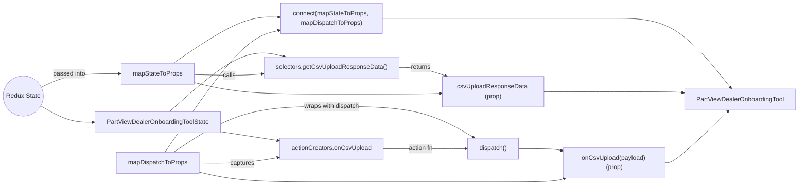

# Diagram: web/portal/src/pages/administration/internal-tools/partview-dealer-onboarding-tool/PartViewDealerOnboardingTool.page.container.js

> Auto-generated by Obscura crawlers

## Mermaid

### SVG

<svg id="container" width="2048.40625" xmlns="http://www.w3.org/2000/svg" class="flowchart" height="474" viewBox="0 0 2048.40625 474" role="graphics-document document" aria-roledescription="flowchart-v2"><g><marker id="container_flowchart-v2-pointEnd" class="marker flowchart-v2" viewBox="0 0 10 10" refX="5" refY="5" markerUnits="userSpaceOnUse" markerWidth="8" markerHeight="8" orient="auto"><path d="M 0 0 L 10 5 L 0 10 z" class="arrowMarkerPath" style="stroke-width: 1; stroke-dasharray: 1, 0;"></path></marker><marker id="container_flowchart-v2-pointStart" class="marker flowchart-v2" viewBox="0 0 10 10" refX="4.5" refY="5" markerUnits="userSpaceOnUse" markerWidth="8" markerHeight="8" orient="auto"><path d="M 0 5 L 10 10 L 10 0 z" class="arrowMarkerPath" style="stroke-width: 1; stroke-dasharray: 1, 0;"></path></marker><marker id="container_flowchart-v2-circleEnd" class="marker flowchart-v2" viewBox="0 0 10 10" refX="11" refY="5" markerUnits="userSpaceOnUse" markerWidth="11" markerHeight="11" orient="auto"><circle cx="5" cy="5" r="5" class="arrowMarkerPath" style="stroke-width: 1; stroke-dasharray: 1, 0;"></circle></marker><marker id="container_flowchart-v2-circleStart" class="marker flowchart-v2" viewBox="0 0 10 10" refX="-1" refY="5" markerUnits="userSpaceOnUse" markerWidth="11" markerHeight="11" orient="auto"><circle cx="5" cy="5" r="5" class="arrowMarkerPath" style="stroke-width: 1; stroke-dasharray: 1, 0;"></circle></marker><marker id="container_flowchart-v2-crossEnd" class="marker cross flowchart-v2" viewBox="0 0 11 11" refX="12" refY="5.2" markerUnits="userSpaceOnUse" markerWidth="11" markerHeight="11" orient="auto"><path d="M 1,1 l 9,9 M 10,1 l -9,9" class="arrowMarkerPath" style="stroke-width: 2; stroke-dasharray: 1, 0;"></path></marker><marker id="container_flowchart-v2-crossStart" class="marker cross flowchart-v2" viewBox="0 0 11 11" refX="-1" refY="5.2" markerUnits="userSpaceOnUse" markerWidth="11" markerHeight="11" orient="auto"><path d="M 1,1 l 9,9 M 10,1 l -9,9" class="arrowMarkerPath" style="stroke-width: 2; stroke-dasharray: 1, 0;"></path></marker><g class="root"><g class="clusters"></g><g class="edgePaths"><path d="M102.751,271.083L115.021,278.069C127.292,285.055,151.834,299.028,174.602,306.014C197.37,313,218.365,313,228.862,313L239.359,313" id="L_ReduxState_PVState_0" class="edge-thickness-normal edge-pattern-solid edge-thickness-normal edge-pattern-solid flowchart-link" style=";" data-edge="true" data-et="edge" data-id="L_ReduxState_PVState_0" data-points="W3sieCI6MTAyLjc1MDcxMTg4ODA5NzcsInkiOjI3MS4wODI1OTM0NTA5OTQyNH0seyJ4IjoxNzYuMzc1LCJ5IjozMTN9LHsieCI6MjQzLjM1OTM3NSwieSI6MzEzfV0=" marker-end="url(#container_flowchart-v2-pointEnd)"></path><path d="M435.344,286L466.573,258.333C497.802,230.667,560.26,175.333,609.401,151.848C658.541,128.364,694.363,136.727,712.275,140.909L730.186,145.091" id="L_PVState_Selectors_0" class="edge-thickness-normal edge-pattern-solid edge-thickness-normal edge-pattern-solid flowchart-link" style=";" data-edge="true" data-et="edge" data-id="L_PVState_Selectors_0" data-points="W3sieCI6NDM1LjM0MzgzMDk1ODU0OTIzLCJ5IjoyODZ9LHsieCI6NjIyLjcxODc1LCJ5IjoxMjB9LHsieCI6NzM0LjA4MTA3MzExMzIwNzYsInkiOjE0Nn1d" marker-end="url(#container_flowchart-v2-pointEnd)"></path><path d="M566.375,337.465L575.766,338.888C585.156,340.31,603.938,343.155,628.527,346.921C653.117,350.687,683.516,355.374,698.715,357.717L713.914,360.06" id="L_PVState_ActionCreators_0" class="edge-thickness-normal edge-pattern-solid edge-thickness-normal edge-pattern-solid flowchart-link" style=";" data-edge="true" data-et="edge" data-id="L_PVState_ActionCreators_0" data-points="W3sieCI6NTY2LjM3NSwieSI6MzM3LjQ2NTA4ODc1NzM5NjV9LHsieCI6NjIyLjcxODc1LCJ5IjozNDZ9LHsieCI6NzE3Ljg2NzE4NzUsInkiOjM2MC42Njk5NTkwNDYwMTN9XQ==" marker-end="url(#container_flowchart-v2-pointEnd)"></path><path d="M104.32,223.901L116.329,218.084C128.339,212.267,152.357,200.634,186.198,194.817C220.039,189,263.703,189,285.535,189L307.367,189" id="L_ReduxState_mapState_0" class="edge-thickness-normal edge-pattern-solid edge-thickness-normal edge-pattern-solid flowchart-link" style=";" data-edge="true" data-et="edge" data-id="L_ReduxState_mapState_0" data-points="W3sieCI6MTA0LjMyMDMxNDA2NDE4MDY5LCJ5IjoyMjMuOTAwODE1ODEyNzY4ODh9LHsieCI6MTc2LjM3NSwieSI6MTg5fSx7IngiOjMxMS4zNjcxODc1LCJ5IjoxODl9XQ==" marker-end="url(#container_flowchart-v2-pointEnd)"></path><path d="M498.367,191.146L519.092,191.622C539.818,192.097,581.268,193.049,610.72,192.717C640.172,192.385,657.626,190.771,666.353,189.964L675.08,189.156" id="L_mapState_Selectors_0" class="edge-thickness-normal edge-pattern-solid edge-thickness-normal edge-pattern-solid flowchart-link" style=";" data-edge="true" data-et="edge" data-id="L_mapState_Selectors_0" data-points="W3sieCI6NDk4LjM2NzE4NzUsInkiOjE5MS4xNDU5NTY2MDc0OTUwN30seyJ4Ijo2MjIuNzE4NzUsInkiOjE5NH0seyJ4Ijo2NzkuMDYyNSwieSI6MTg4Ljc4Nzc2MTk4NTA2Mzg0fV0=" marker-end="url(#container_flowchart-v2-pointEnd)"></path><path d="M1020.391,173L1029.919,173C1039.448,173,1058.505,173,1078.973,176.624C1099.442,180.247,1121.321,187.495,1132.261,191.119L1143.2,194.742" id="L_Selectors_PropCSV_0" class="edge-thickness-normal edge-pattern-solid edge-thickness-normal edge-pattern-solid flowchart-link" style=";" data-edge="true" data-et="edge" data-id="L_Selectors_PropCSV_0" data-points="W3sieCI6MTAyMC4zOTA2MjUsInkiOjE3M30seyJ4IjoxMDc3LjU2MjUsInkiOjE3M30seyJ4IjoxMTQ2Ljk5NzIyNzgyMjU4MDcsInkiOjE5Nn1d" marker-end="url(#container_flowchart-v2-pointEnd)"></path><path d="M498.367,211.318L519.092,216.265C539.818,221.212,581.268,231.106,639.828,236.053C698.388,241,774.057,241,849.865,241C925.672,241,1001.617,241,1048.452,240.716C1095.287,240.432,1113.012,239.864,1121.874,239.58L1130.736,239.295" id="L_mapState_PropCSV_0" class="edge-thickness-normal edge-pattern-solid edge-thickness-normal edge-pattern-solid flowchart-link" style=";" data-edge="true" data-et="edge" data-id="L_mapState_PropCSV_0" data-points="W3sieCI6NDk4LjM2NzE4NzUsInkiOjIxMS4zMTc5NDg3MTc5NDg3Mn0seyJ4Ijo2MjIuNzE4NzUsInkiOjI0MX0seyJ4Ijo4NDkuNzI2NTYyNSwieSI6MjQxfSx7IngiOjEwNzcuNTYyNSwieSI6MjQxfSx7IngiOjExMzQuNzM0Mzc1LCJ5IjoyMzkuMTY3MjkyNzYyMzM0MDl9XQ==" marker-end="url(#container_flowchart-v2-pointEnd)"></path><path d="M511.141,417.976L529.737,418.146C548.333,418.317,585.526,418.659,619.323,416.285C653.12,413.911,683.521,408.822,698.722,406.278L713.922,403.733" id="L_mapDispatch_ActionCreators_0" class="edge-thickness-normal edge-pattern-solid edge-thickness-normal edge-pattern-solid flowchart-link" style=";" data-edge="true" data-et="edge" data-id="L_mapDispatch_ActionCreators_0" data-points="W3sieCI6NTExLjE0MDYyNSwieSI6NDE3Ljk3NTY0OTk5MTAzNDYzfSx7IngiOjYyMi43MTg3NSwieSI6NDE5fSx7IngiOjcxNy44NjcxODc1LCJ5Ijo0MDMuMDcyNjE1ODkyOTAwMTZ9XQ==" marker-end="url(#container_flowchart-v2-pointEnd)"></path><path d="M445.714,390L475.215,370.5C504.716,351,563.717,312,631.053,292.5C698.388,273,774.057,273,849.865,273C925.672,273,1001.617,273,1062.409,286.167C1123.201,299.334,1168.839,325.667,1191.658,338.834L1214.477,352.001" id="L_mapDispatch_Dispatch_0" class="edge-thickness-normal edge-pattern-solid edge-thickness-normal edge-pattern-solid flowchart-link" style=";" data-edge="true" data-et="edge" data-id="L_mapDispatch_Dispatch_0" data-points="W3sieCI6NDQ1LjcxNDM1NTQ2ODc1LCJ5IjozOTB9LHsieCI6NjIyLjcxODc1LCJ5IjoyNzN9LHsieCI6ODQ5LjcyNjU2MjUsInkiOjI3M30seyJ4IjoxMDc3LjU2MjUsInkiOjI3M30seyJ4IjoxMjE3Ljk0MTQwNjI1LCJ5IjozNTR9XQ==" marker-end="url(#container_flowchart-v2-pointEnd)"></path><path d="M981.586,381L997.582,381C1013.578,381,1045.57,381,1081.051,381C1116.531,381,1155.5,381,1174.984,381L1194.469,381" id="L_ActionCreators_Dispatch_0" class="edge-thickness-normal edge-pattern-solid edge-thickness-normal edge-pattern-solid flowchart-link" style=";" data-edge="true" data-et="edge" data-id="L_ActionCreators_Dispatch_0" data-points="W3sieCI6OTgxLjU4NTkzNzUsInkiOjM4MX0seyJ4IjoxMDc3LjU2MjUsInkiOjM4MX0seyJ4IjoxMTk4LjQ2ODc1LCJ5IjozODF9XQ==" marker-end="url(#container_flowchart-v2-pointEnd)"></path><path d="M1331,381L1345.789,381C1360.578,381,1390.156,381,1408.463,381.817C1426.769,382.634,1433.804,384.268,1437.321,385.085L1440.838,385.902" id="L_Dispatch_PropOnCsv_0" class="edge-thickness-normal edge-pattern-solid edge-thickness-normal edge-pattern-solid flowchart-link" style=";" data-edge="true" data-et="edge" data-id="L_Dispatch_PropOnCsv_0" data-points="W3sieCI6MTMzMSwieSI6MzgxfSx7IngiOjE0MTkuNzM0Mzc1LCJ5IjozODF9LHsieCI6MTQ0NC43MzQzNzUsInkiOjM4Ni44MDY0NTE2MTI5MDMyM31d" marker-end="url(#container_flowchart-v2-pointEnd)"></path><path d="M511.141,440.903L529.737,445.086C548.333,449.269,585.526,457.634,641.957,461.817C698.388,466,774.057,466,849.865,466C925.672,466,1001.617,466,1070.785,466C1139.953,466,1202.344,466,1259.372,466C1316.401,466,1368.068,466,1398.537,464.534C1429.007,463.069,1438.28,460.137,1442.917,458.671L1447.553,457.206" id="L_mapDispatch_PropOnCsv_0" class="edge-thickness-normal edge-pattern-solid edge-thickness-normal edge-pattern-solid flowchart-link" style=";" data-edge="true" data-et="edge" data-id="L_mapDispatch_PropOnCsv_0" data-points="W3sieCI6NTExLjE0MDYyNSwieSI6NDQwLjkwMzQyNDc4MDM0Nzg1fSx7IngiOjYyMi43MTg3NSwieSI6NDY2fSx7IngiOjg0OS43MjY1NjI1LCJ5Ijo0NjZ9LHsieCI6MTA3Ny41NjI1LCJ5Ijo0NjZ9LHsieCI6MTI2NC43MzQzNzUsInkiOjQ2Nn0seyJ4IjoxNDE5LjczNDM3NSwieSI6NDY2fSx7IngiOjE0NTEuMzY3MDI4MDYxMjI0NiwieSI6NDU2fV0=" marker-end="url(#container_flowchart-v2-pointEnd)"></path><path d="M444.881,162L474.52,142C504.16,122,563.439,82,608.581,62.341C653.722,42.683,684.725,43.366,700.226,43.707L715.728,44.049" id="L_mapState_Connect_0" class="edge-thickness-normal edge-pattern-solid edge-thickness-normal edge-pattern-solid flowchart-link" style=";" data-edge="true" data-et="edge" data-id="L_mapState_Connect_0" data-points="W3sieCI6NDQ0Ljg4MDczOTc5NTkxODQsInkiOjE2Mn0seyJ4Ijo2MjIuNzE4NzUsInkiOjQyfSx7IngiOjcxOS43MjY1NjI1LCJ5Ijo0NC4xMzY2NjI0MjIxMzU4fV0=" marker-end="url(#container_flowchart-v2-pointEnd)"></path><path d="M423.422,390L456.638,341.667C489.854,293.333,556.287,196.667,605.021,144.71C653.756,92.754,684.794,85.507,700.313,81.884L715.831,78.261" id="L_mapDispatch_Connect_0" class="edge-thickness-normal edge-pattern-solid edge-thickness-normal edge-pattern-solid flowchart-link" style=";" data-edge="true" data-et="edge" data-id="L_mapDispatch_Connect_0" data-points="W3sieCI6NDIzLjQyMjM2NzkwMjIwODIsInkiOjM5MH0seyJ4Ijo2MjIuNzE4NzUsInkiOjEwMH0seyJ4Ijo3MTkuNzI2NTYyNSwieSI6NzcuMzUxMzc4MzI1MzYwNX1d" marker-end="url(#container_flowchart-v2-pointEnd)"></path><path d="M979.727,47L996.033,47C1012.339,47,1044.951,47,1092.452,47C1139.953,47,1202.344,47,1259.372,47C1316.401,47,1368.068,47,1419.734,47C1471.401,47,1523.068,47,1574.734,47C1626.401,47,1678.068,47,1727.824,76.648C1777.58,106.296,1825.426,165.591,1849.349,195.239L1873.272,224.887" id="L_Connect_Component_0" class="edge-thickness-normal edge-pattern-solid edge-thickness-normal edge-pattern-solid flowchart-link" style=";" data-edge="true" data-et="edge" data-id="L_Connect_Component_0" data-points="W3sieCI6OTc5LjcyNjU2MjUsInkiOjQ3fSx7IngiOjEwNzcuNTYyNSwieSI6NDd9LHsieCI6MTI2NC43MzQzNzUsInkiOjQ3fSx7IngiOjE0MTkuNzM0Mzc1LCJ5Ijo0N30seyJ4IjoxNTc0LjczNDM3NSwieSI6NDd9LHsieCI6MTcyOS43MzQzNzUsInkiOjQ3fSx7IngiOjE4NzUuNzgzOTE2NzY2ODI3LCJ5IjoyMjh9XQ==" marker-end="url(#container_flowchart-v2-pointEnd)"></path><path d="M1394.734,235L1398.901,235C1403.068,235,1411.401,235,1441.401,235C1471.401,235,1523.068,235,1574.734,235C1626.401,235,1678.068,235,1707.406,235.418C1736.744,235.835,1743.753,236.671,1747.258,237.088L1750.762,237.506" id="L_PropCSV_Component_0" class="edge-thickness-normal edge-pattern-solid edge-thickness-normal edge-pattern-solid flowchart-link" style=";" data-edge="true" data-et="edge" data-id="L_PropCSV_Component_0" data-points="W3sieCI6MTM5NC43MzQzNzUsInkiOjIzNX0seyJ4IjoxNDE5LjczNDM3NSwieSI6MjM1fSx7IngiOjE1NzQuNzM0Mzc1LCJ5IjoyMzV9LHsieCI6MTcyOS43MzQzNzUsInkiOjIzNX0seyJ4IjoxNzU0LjczNDM3NSwieSI6MjM3Ljk3OTA5OTc1MzI5MzN9XQ==" marker-end="url(#container_flowchart-v2-pointEnd)"></path><path d="M1704.734,417L1708.901,417C1713.068,417,1721.401,417,1748.399,394.963C1775.396,372.926,1821.058,328.852,1843.889,306.815L1866.72,284.778" id="L_PropOnCsv_Component_0" class="edge-thickness-normal edge-pattern-solid edge-thickness-normal edge-pattern-solid flowchart-link" style=";" data-edge="true" data-et="edge" data-id="L_PropOnCsv_Component_0" data-points="W3sieCI6MTcwNC43MzQzNzUsInkiOjQxN30seyJ4IjoxNzI5LjczNDM3NSwieSI6NDE3fSx7IngiOjE4NjkuNTk3NjU2MjUsInkiOjI4Mn1d" marker-end="url(#container_flowchart-v2-pointEnd)"></path></g><g class="edgeLabels"><g class="edgeLabel"><g class="label" data-id="L_ReduxState_PVState_0" transform="translate(0, 0)"><foreignObject width="0" height="0">

</foreignObject></g></g><g class="edgeLabel"><g class="label" data-id="L_PVState_Selectors_0" transform="translate(0, 0)"><foreignObject width="0" height="0">

</foreignObject></g></g><g class="edgeLabel"><g class="label" data-id="L_PVState_ActionCreators_0" transform="translate(0, 0)"><foreignObject width="0" height="0">

</foreignObject></g></g><g class="edgeLabel" transform="translate(176.375, 189)"><g class="label" data-id="L_ReduxState_mapState_0" transform="translate(-41.984375, -12)"><foreignObject width="83.96875" height="24">

passed into

</foreignObject></g></g><g class="edgeLabel" transform="translate(588.82768, 193.22215)"><g class="label" data-id="L_mapState_Selectors_0" transform="translate(-16.4453125, -12)"><foreignObject width="32.890625" height="24">

calls

</foreignObject></g></g><g class="edgeLabel" transform="translate(1077.5625, 173)"><g class="label" data-id="L_Selectors_PropCSV_0" transform="translate(-26.265625, -12)"><foreignObject width="52.53125" height="24">

returns

</foreignObject></g></g><g class="edgeLabel"><g class="label" data-id="L_mapState_PropCSV_0" transform="translate(0, 0)"><foreignObject width="0" height="0">

</foreignObject></g></g><g class="edgeLabel" transform="translate(622.71875, 419)"><g class="label" data-id="L_mapDispatch_ActionCreators_0" transform="translate(-31.34375, -12)"><foreignObject width="62.6875" height="24">

captures

</foreignObject></g></g><g class="edgeLabel" transform="translate(849.7265625, 273)"><g class="label" data-id="L_mapDispatch_Dispatch_0" transform="translate(-72.2734375, -12)"><foreignObject width="144.546875" height="24">

wraps with dispatch

</foreignObject></g></g><g class="edgeLabel" transform="translate(1077.5625, 381)"><g class="label" data-id="L_ActionCreators_Dispatch_0" transform="translate(-32.171875, -12)"><foreignObject width="64.34375" height="24">

action fn

</foreignObject></g></g><g class="edgeLabel"><g class="label" data-id="L_Dispatch_PropOnCsv_0" transform="translate(0, 0)"><foreignObject width="0" height="0">

</foreignObject></g></g><g class="edgeLabel"><g class="label" data-id="L_mapDispatch_PropOnCsv_0" transform="translate(0, 0)"><foreignObject width="0" height="0">

</foreignObject></g></g><g class="edgeLabel"><g class="label" data-id="L_mapState_Connect_0" transform="translate(0, 0)"><foreignObject width="0" height="0">

</foreignObject></g></g><g class="edgeLabel"><g class="label" data-id="L_mapDispatch_Connect_0" transform="translate(0, 0)"><foreignObject width="0" height="0">

</foreignObject></g></g><g class="edgeLabel"><g class="label" data-id="L_Connect_Component_0" transform="translate(0, 0)"><foreignObject width="0" height="0">

</foreignObject></g></g><g class="edgeLabel"><g class="label" data-id="L_PropCSV_Component_0" transform="translate(0, 0)"><foreignObject width="0" height="0">

</foreignObject></g></g><g class="edgeLabel"><g class="label" data-id="L_PropOnCsv_Component_0" transform="translate(0, 0)"><foreignObject width="0" height="0">

</foreignObject></g></g></g><g class="nodes"><g class="node default" id="flowchart-ReduxState-0" transform="translate(58.6953125, 246)"><circle class="basic label-container" style="" r="50.6953125" cx="0" cy="0"></circle><g class="label" style="" transform="translate(-43.1953125, -12)"><rect></rect><foreignObject width="86.390625" height="24">

Redux State

</foreignObject></g></g><g class="node default" id="flowchart-PVState-1" transform="translate(404.8671875, 313)"><rect class="basic label-container" style="" x="-161.5078125" y="-27" width="323.015625" height="54"></rect><g class="label" style="" transform="translate(-131.5078125, -12)"><rect></rect><foreignObject width="263.015625" height="24">

PartViewDealerOnboardingToolState

</foreignObject></g></g><g class="node default" id="flowchart-Selectors-2" transform="translate(849.7265625, 173)"><rect class="basic label-container" style="" x="-170.6640625" y="-27" width="341.328125" height="54"></rect><g class="label" style="" transform="translate(-140.6640625, -12)"><rect></rect><foreignObject width="281.328125" height="24">

selectors.getCsvUploadResponseData()

</foreignObject></g></g><g class="node default" id="flowchart-ActionCreators-3" transform="translate(849.7265625, 381)"><rect class="basic label-container" style="" x="-131.859375" y="-27" width="263.71875" height="54"></rect><g class="label" style="" transform="translate(-101.859375, -12)"><rect></rect><foreignObject width="203.71875" height="24">

actionCreators.onCsvUpload

</foreignObject></g></g><g class="node default" id="flowchart-Dispatch-4" transform="translate(1264.734375, 381)"><rect class="basic label-container" style="" x="-66.265625" y="-27" width="132.53125" height="54"></rect><g class="label" style="" transform="translate(-36.265625, -12)"><rect></rect><foreignObject width="72.53125" height="24">

dispatch()

</foreignObject></g></g><g class="node default" id="flowchart-mapState-5" transform="translate(404.8671875, 189)"><rect class="basic label-container" style="" x="-93.5" y="-27" width="187" height="54"></rect><g class="label" style="" transform="translate(-63.5, -12)"><rect></rect><foreignObject width="127" height="24">

mapStateToProps

</foreignObject></g></g><g class="node default" id="flowchart-mapDispatch-6" transform="translate(404.8671875, 417)"><rect class="basic label-container" style="" x="-106.2734375" y="-27" width="212.546875" height="54"></rect><g class="label" style="" transform="translate(-76.2734375, -12)"><rect></rect><foreignObject width="152.546875" height="24">

mapDispatchToProps

</foreignObject></g></g><g class="node default" id="flowchart-Connect-7" transform="translate(849.7265625, 47)"><rect class="basic label-container" style="" x="-130" y="-39" width="260" height="78"></rect><g class="label" style="" transform="translate(-100, -24)"><rect></rect><foreignObject width="200" height="48">

connect(mapStateToProps, mapDispatchToProps)

</foreignObject></g></g><g class="node default" id="flowchart-Component-8" transform="translate(1897.5703125, 255)"><rect class="basic label-container" style="" x="-142.8359375" y="-27" width="285.671875" height="54"></rect><g class="label" style="" transform="translate(-112.8359375, -12)"><rect></rect><foreignObject width="225.671875" height="24">

PartViewDealerOnboardingTool

</foreignObject></g></g><g class="node default" id="flowchart-PropCSV-9" transform="translate(1264.734375, 235)"><rect class="basic label-container" style="" x="-130" y="-39" width="260" height="78"></rect><g class="label" style="" transform="translate(-100, -24)"><rect></rect><foreignObject width="200" height="48">

csvUploadResponseData (prop)

</foreignObject></g></g><g class="node default" id="flowchart-PropOnCsv-10" transform="translate(1574.734375, 417)"><rect class="basic label-container" style="" x="-130" y="-39" width="260" height="78"></rect><g class="label" style="" transform="translate(-100, -24)"><rect></rect><foreignObject width="200" height="48">

onCsvUpload(payload) (prop)

</foreignObject></g></g></g></g></g></svg>
