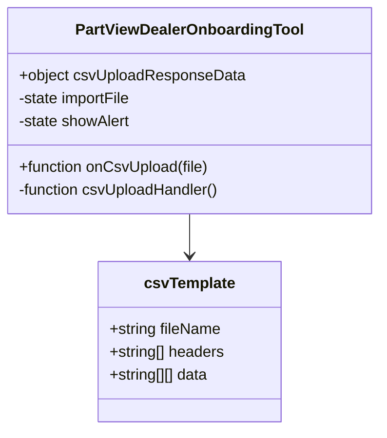
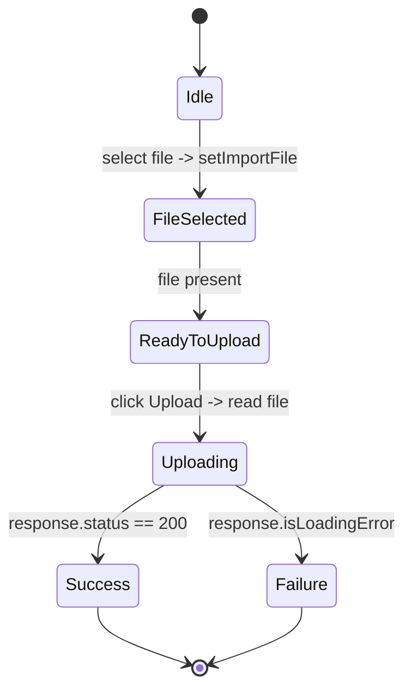
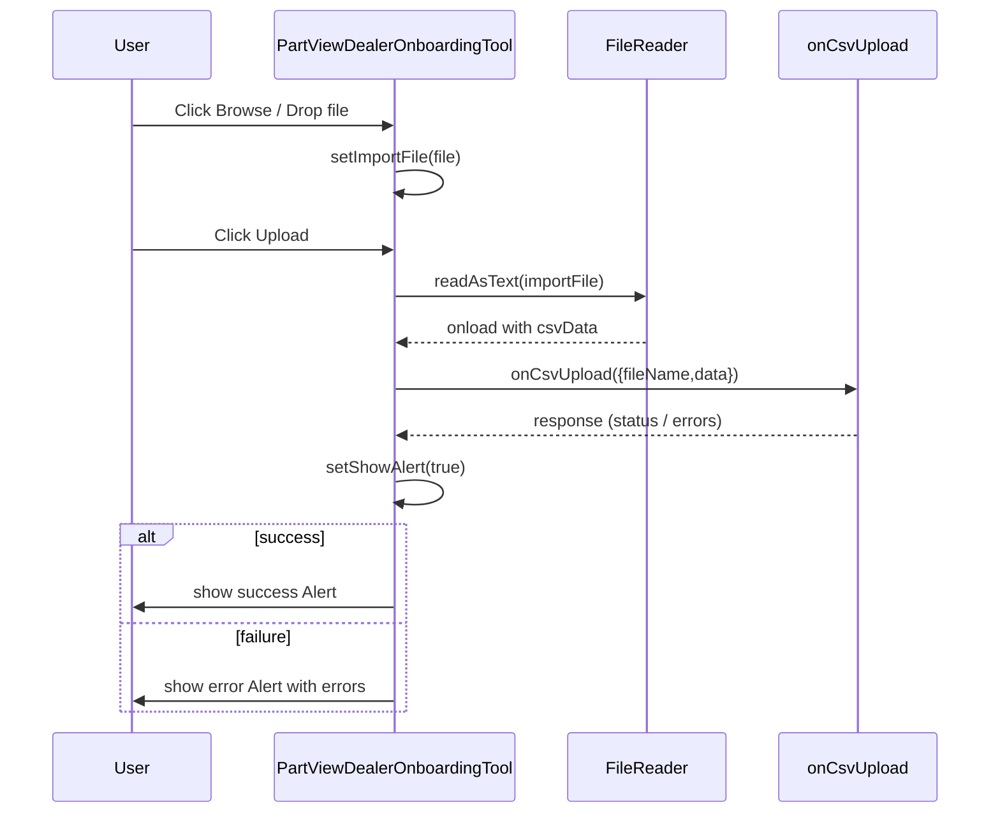
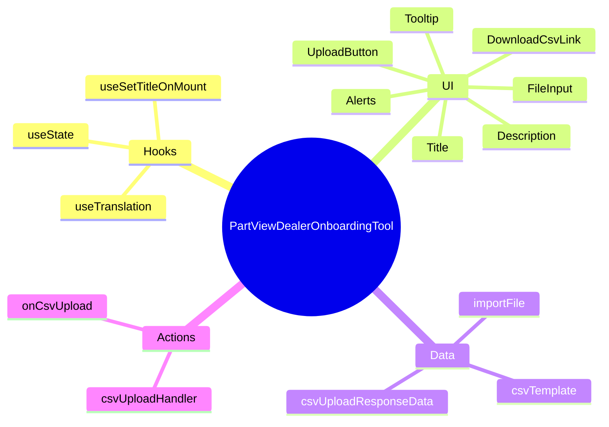

# Diagram: web/portal/src/pages/administration/internal-tools/partview-dealer-onboarding-tool/PartViewDealerOnboardingTool.page.js


> Auto-generated by Obscura crawlers

## Diagram 1

```mermaid
flowchart LR
  PV(PartViewDealerOnboardingTool) -->|uses| HT(useTranslation)
  PV -->|uses| ST(useSetTitleOnMount)
  PV --> UI[UI Container]
  UI --> Title[Text: Dealer Creation]
  UI --> Desc[Text: Upload new Dealers...]
  UI --> Template[DownloadCsvLink (csvTemplate)]
  UI --> FileInput[File Input (Browse)]
  FileInput -->|sets| importFile{{importFile state}}
  PV --> importFile
  PV --> showAlert{{showAlert state}}
  FileInput --> Tooltip[Tooltip (csvTooltip)]
  UI --> UploadButton[Button: Upload]
  UploadButton -->|click| CSVReader[FileReader.readAsText]
  CSVReader -->|onload| OnCsvUpload[onCsvUpload({fileName,data})]
  OnCsvUpload -->|triggers| setShowAlert[setShowAlert(true)]
  OnCsvUpload -->|receives| csvUploadResponseData
  csvUploadResponseData -->|status 200 & showAlert| SuccessAlert[Alert success]
  csvUploadResponseData -->|isLoadingError & showAlert| ErrorAlert[Alert danger]
  ErrorAlert -->|may show| ErrorsList[errors list]
  Template --> csvTemplateData[(csvTemplate.data & headers & fileName)]
```

> SVG rendering failed for this diagram.

## Diagram 2



### SVG

<svg id="container" width="390.484375" xmlns="http://www.w3.org/2000/svg" class="classDiagram" height="450" viewBox="0 0 390.484375 450" role="graphics-document document" aria-roledescription="class"><style>#container{font-family:"trebuchet ms",verdana,arial,sans-serif;font-size:16px;fill:#333;}@keyframes edge-animation-frame{from{stroke-dashoffset:0;}}@keyframes dash{to{stroke-dashoffset:0;}}#container .edge-animation-slow{stroke-dasharray:9,5!important;stroke-dashoffset:900;animation:dash 50s linear infinite;stroke-linecap:round;}#container .edge-animation-fast{stroke-dasharray:9,5!important;stroke-dashoffset:900;animation:dash 20s linear infinite;stroke-linecap:round;}#container .error-icon{fill:#552222;}#container .error-text{fill:#552222;stroke:#552222;}#container .edge-thickness-normal{stroke-width:1px;}#container .edge-thickness-thick{stroke-width:3.5px;}#container .edge-pattern-solid{stroke-dasharray:0;}#container .edge-thickness-invisible{stroke-width:0;fill:none;}#container .edge-pattern-dashed{stroke-dasharray:3;}#container .edge-pattern-dotted{stroke-dasharray:2;}#container .marker{fill:#333333;stroke:#333333;}#container .marker.cross{stroke:#333333;}#container svg{font-family:"trebuchet ms",verdana,arial,sans-serif;font-size:16px;}#container p{margin:0;}#container g.classGroup text{fill:#9370DB;stroke:none;font-family:"trebuchet ms",verdana,arial,sans-serif;font-size:10px;}#container g.classGroup text .title{font-weight:bolder;}#container .nodeLabel,#container .edgeLabel{color:#131300;}#container .edgeLabel .label rect{fill:#ECECFF;}#container .label text{fill:#131300;}#container .labelBkg{background:#ECECFF;}#container .edgeLabel .label span{background:#ECECFF;}#container .classTitle{font-weight:bolder;}#container .node rect,#container .node circle,#container .node ellipse,#container .node polygon,#container .node path{fill:#ECECFF;stroke:#9370DB;stroke-width:1px;}#container .divider{stroke:#9370DB;stroke-width:1;}#container g.clickable{cursor:pointer;}#container g.classGroup rect{fill:#ECECFF;stroke:#9370DB;}#container g.classGroup line{stroke:#9370DB;stroke-width:1;}#container .classLabel .box{stroke:none;stroke-width:0;fill:#ECECFF;opacity:0.5;}#container .classLabel .label{fill:#9370DB;font-size:10px;}#container .relation{stroke:#333333;stroke-width:1;fill:none;}#container .dashed-line{stroke-dasharray:3;}#container .dotted-line{stroke-dasharray:1 2;}#container #compositionStart,#container .composition{fill:#333333!important;stroke:#333333!important;stroke-width:1;}#container #compositionEnd,#container .composition{fill:#333333!important;stroke:#333333!important;stroke-width:1;}#container #dependencyStart,#container .dependency{fill:#333333!important;stroke:#333333!important;stroke-width:1;}#container #dependencyStart,#container .dependency{fill:#333333!important;stroke:#333333!important;stroke-width:1;}#container #extensionStart,#container .extension{fill:transparent!important;stroke:#333333!important;stroke-width:1;}#container #extensionEnd,#container .extension{fill:transparent!important;stroke:#333333!important;stroke-width:1;}#container #aggregationStart,#container .aggregation{fill:transparent!important;stroke:#333333!important;stroke-width:1;}#container #aggregationEnd,#container .aggregation{fill:transparent!important;stroke:#333333!important;stroke-width:1;}#container #lollipopStart,#container .lollipop{fill:#ECECFF!important;stroke:#333333!important;stroke-width:1;}#container #lollipopEnd,#container .lollipop{fill:#ECECFF!important;stroke:#333333!important;stroke-width:1;}#container .edgeTerminals{font-size:11px;line-height:initial;}#container .classTitleText{text-anchor:middle;font-size:18px;fill:#333;}#container .label-icon{display:inline-block;height:1em;overflow:visible;vertical-align:-0.125em;}#container .node .label-icon path{fill:currentColor;stroke:revert;stroke-width:revert;}#container :root{--mermaid-font-family:"trebuchet ms",verdana,arial,sans-serif;}</style><g><defs><marker id="container_class-aggregationStart" class="marker aggregation class" refX="18" refY="7" markerWidth="190" markerHeight="240" orient="auto"><path d="M 18,7 L9,13 L1,7 L9,1 Z"></path></marker></defs><defs><marker id="container_class-aggregationEnd" class="marker aggregation class" refX="1" refY="7" markerWidth="20" markerHeight="28" orient="auto"><path d="M 18,7 L9,13 L1,7 L9,1 Z"></path></marker></defs><defs><marker id="container_class-extensionStart" class="marker extension class" refX="18" refY="7" markerWidth="190" markerHeight="240" orient="auto"><path d="M 1,7 L18,13 V 1 Z"></path></marker></defs><defs><marker id="container_class-extensionEnd" class="marker extension class" refX="1" refY="7" markerWidth="20" markerHeight="28" orient="auto"><path d="M 1,1 V 13 L18,7 Z"></path></marker></defs><defs><marker id="container_class-compositionStart" class="marker composition class" refX="18" refY="7" markerWidth="190" markerHeight="240" orient="auto"><path d="M 18,7 L9,13 L1,7 L9,1 Z"></path></marker></defs><defs><marker id="container_class-compositionEnd" class="marker composition class" refX="1" refY="7" markerWidth="20" markerHeight="28" orient="auto"><path d="M 18,7 L9,13 L1,7 L9,1 Z"></path></marker></defs><defs><marker id="container_class-dependencyStart" class="marker dependency class" refX="6" refY="7" markerWidth="190" markerHeight="240" orient="auto"><path d="M 5,7 L9,13 L1,7 L9,1 Z"></path></marker></defs><defs><marker id="container_class-dependencyEnd" class="marker dependency class" refX="13" refY="7" markerWidth="20" markerHeight="28" orient="auto"><path d="M 18,7 L9,13 L14,7 L9,1 Z"></path></marker></defs><defs><marker id="container_class-lollipopStart" class="marker lollipop class" refX="13" refY="7" markerWidth="190" markerHeight="240" orient="auto"><circle stroke="black" fill="transparent" cx="7" cy="7" r="6"></circle></marker></defs><defs><marker id="container_class-lollipopEnd" class="marker lollipop class" refX="1" refY="7" markerWidth="190" markerHeight="240" orient="auto"><circle stroke="black" fill="transparent" cx="7" cy="7" r="6"></circle></marker></defs><g class="root"><g class="clusters"></g><g class="edgePaths"><path d="M195.242,224L195.242,228.167C195.242,232.333,195.242,240.667,195.242,248C195.242,255.333,195.242,261.667,195.242,264.833L195.242,268" id="id_PartViewDealerOnboardingTool_csvTemplate_1" class="edge-thickness-normal edge-pattern-solid relation" style=";;;" data-edge="true" data-et="edge" data-id="id_PartViewDealerOnboardingTool_csvTemplate_1" data-points="W3sieCI6MTk1LjI0MjE4NzUsInkiOjIyNH0seyJ4IjoxOTUuMjQyMTg3NSwieSI6MjQ5fSx7IngiOjE5NS4yNDIxODc1LCJ5IjoyNzR9XQ==" marker-end="url(#container_class-dependencyEnd)"></path></g><g class="edgeLabels"><g class="edgeLabel"><g class="label" data-id="id_PartViewDealerOnboardingTool_csvTemplate_1" transform="translate(0, 0)"><foreignObject width="0" height="0"><div xmlns="http://www.w3.org/1999/xhtml" class="labelBkg" style="display: table-cell; white-space: nowrap; line-height: 1.5; max-width: 200px; text-align: center;"><span class="edgeLabel"></span></div></foreignObject></g></g></g><g class="nodes"><g class="node default" id="classId-PartViewDealerOnboardingTool-0" transform="translate(195.2421875, 116)"><g class="basic label-container"><path d="M-187.2421875 -108 L187.2421875 -108 L187.2421875 108 L-187.2421875 108" stroke="none" stroke-width="0" fill="#ECECFF" style=""></path><path d="M-187.2421875 -108 C-100.57311789782048 -108, -13.904048295640962 -108, 187.2421875 -108 M-187.2421875 -108 C-40.904186606897525 -108, 105.43381428620495 -108, 187.2421875 -108 M187.2421875 -108 C187.2421875 -22.079383760969563, 187.2421875 63.841232478060874, 187.2421875 108 M187.2421875 -108 C187.2421875 -64.53497249987163, 187.2421875 -21.06994499974327, 187.2421875 108 M187.2421875 108 C106.0378365364311 108, 24.8334855728622 108, -187.2421875 108 M187.2421875 108 C69.81275899427813 108, -47.616669511443746 108, -187.2421875 108 M-187.2421875 108 C-187.2421875 47.321720121852366, -187.2421875 -13.356559756295269, -187.2421875 -108 M-187.2421875 108 C-187.2421875 41.65102079934513, -187.2421875 -24.697958401309734, -187.2421875 -108" stroke="#9370DB" stroke-width="1.3" fill="none" stroke-dasharray="0 0" style=""></path></g><g class="annotation-group text" transform="translate(0, -84)"></g><g class="label-group text" transform="translate(-114.640625, -84)"><g class="label" style="font-weight: bolder" transform="translate(0,-12)"><foreignObject width="229.28125" height="24"><div xmlns="http://www.w3.org/1999/xhtml" style="display: table-cell; white-space: nowrap; line-height: 1.5; max-width: 276px; text-align: center;"><span class="nodeLabel markdown-node-label" style=""><p>PartViewDealerOnboardingTool</p></span></div></foreignObject></g></g><g class="members-group text" transform="translate(-175.2421875, -36)"><g class="label" style="" transform="translate(0,-12)"><foreignObject width="235.84375" height="24"><div xmlns="http://www.w3.org/1999/xhtml" style="display: table-cell; white-space: nowrap; line-height: 1.5; max-width: 293px; text-align: center;"><span class="nodeLabel markdown-node-label" style=""><p>+object csvUploadResponseData</p></span></div></foreignObject></g><g class="label" style="" transform="translate(0,12)"><foreignObject width="120.953125" height="24"><div xmlns="http://www.w3.org/1999/xhtml" style="display: table-cell; white-space: nowrap; line-height: 1.5; max-width: 178px; text-align: center;"><span class="nodeLabel markdown-node-label" style=""><p>-state importFile</p></span></div></foreignObject></g><g class="label" style="" transform="translate(0,36)"><foreignObject width="118.90625" height="24"><div xmlns="http://www.w3.org/1999/xhtml" style="display: table-cell; white-space: nowrap; line-height: 1.5; max-width: 176px; text-align: center;"><span class="nodeLabel markdown-node-label" style=""><p>-state showAlert</p></span></div></foreignObject></g></g><g class="methods-group text" transform="translate(-175.2421875, 60)"><g class="label" style="" transform="translate(0,-12)"><foreignObject width="200.296875" height="24"><div xmlns="http://www.w3.org/1999/xhtml" style="display: table-cell; white-space: nowrap; line-height: 1.5; max-width: 258px; text-align: center;"><span class="nodeLabel markdown-node-label" style=""><p>+function onCsvUpload(file)</p></span></div></foreignObject></g><g class="label" style="" transform="translate(0,12)"><foreignObject width="214.4375" height="24"><div xmlns="http://www.w3.org/1999/xhtml" style="display: table-cell; white-space: nowrap; line-height: 1.5; max-width: 272px; text-align: center;"><span class="nodeLabel markdown-node-label" style=""><p>-function csvUploadHandler()</p></span></div></foreignObject></g></g><g class="divider" style=""><path d="M-187.2421875 -60 C-111.16582236200829 -60, -35.08945722401657 -60, 187.2421875 -60 M-187.2421875 -60 C-52.10229032552047 -60, 83.03760684895906 -60, 187.2421875 -60" stroke="#9370DB" stroke-width="1.3" fill="none" stroke-dasharray="0 0" style=""></path></g><g class="divider" style=""><path d="M-187.2421875 36 C-88.45371809476545 36, 10.334751310469102 36, 187.2421875 36 M-187.2421875 36 C-83.61868106563922 36, 20.004825368721555 36, 187.2421875 36" stroke="#9370DB" stroke-width="1.3" fill="none" stroke-dasharray="0 0" style=""></path></g></g><g class="node default" id="classId-csvTemplate-1" transform="translate(195.2421875, 358)"><g class="basic label-container"><path d="M-96.03125 -84 L96.03125 -84 L96.03125 84 L-96.03125 84" stroke="none" stroke-width="0" fill="#ECECFF" style=""></path><path d="M-96.03125 -84 C-30.97107091070957 -84, 34.08910817858086 -84, 96.03125 -84 M-96.03125 -84 C-50.64538118045596 -84, -5.259512360911927 -84, 96.03125 -84 M96.03125 -84 C96.03125 -30.413780865066784, 96.03125 23.172438269866433, 96.03125 84 M96.03125 -84 C96.03125 -20.379583426926885, 96.03125 43.24083314614623, 96.03125 84 M96.03125 84 C56.41880704558179 84, 16.806364091163573 84, -96.03125 84 M96.03125 84 C36.28537561693628 84, -23.460498766127444 84, -96.03125 84 M-96.03125 84 C-96.03125 33.66334278417984, -96.03125 -16.67331443164032, -96.03125 -84 M-96.03125 84 C-96.03125 31.215086764662956, -96.03125 -21.569826470674087, -96.03125 -84" stroke="#9370DB" stroke-width="1.3" fill="none" stroke-dasharray="0 0" style=""></path></g><g class="annotation-group text" transform="translate(0, -60)"></g><g class="label-group text" transform="translate(-45.5625, -60)"><g class="label" style="font-weight: bolder" transform="translate(0,-12)"><foreignObject width="91.125" height="24"><div xmlns="http://www.w3.org/1999/xhtml" style="display: table-cell; white-space: nowrap; line-height: 1.5; max-width: 140px; text-align: center;"><span class="nodeLabel markdown-node-label" style=""><p>csvTemplate</p></span></div></foreignObject></g></g><g class="members-group text" transform="translate(-84.03125, -12)"><g class="label" style="" transform="translate(0,-12)"><foreignObject width="118.453125" height="24"><div xmlns="http://www.w3.org/1999/xhtml" style="display: table-cell; white-space: nowrap; line-height: 1.5; max-width: 176px; text-align: center;"><span class="nodeLabel markdown-node-label" style=""><p>+string fileName</p></span></div></foreignObject></g><g class="label" style="" transform="translate(0,12)"><foreignObject width="122.5" height="24"><div xmlns="http://www.w3.org/1999/xhtml" style="display: table-cell; white-space: nowrap; line-height: 1.5; max-width: 180px; text-align: center;"><span class="nodeLabel markdown-node-label" style=""><p>+string[] headers</p></span></div></foreignObject></g><g class="label" style="" transform="translate(0,36)"><foreignObject width="107.109375" height="24"><div xmlns="http://www.w3.org/1999/xhtml" style="display: table-cell; white-space: nowrap; line-height: 1.5; max-width: 164px; text-align: center;"><span class="nodeLabel markdown-node-label" style=""><p>+string[][] data</p></span></div></foreignObject></g></g><g class="methods-group text" transform="translate(-84.03125, 84)"></g><g class="divider" style=""><path d="M-96.03125 -36 C-30.703626004004448 -36, 34.623997991991104 -36, 96.03125 -36 M-96.03125 -36 C-53.39837385486141 -36, -10.765497709722823 -36, 96.03125 -36" stroke="#9370DB" stroke-width="1.3" fill="none" stroke-dasharray="0 0" style=""></path></g><g class="divider" style=""><path d="M-96.03125 60 C-53.90094033253451 60, -11.770630665069021 60, 96.03125 60 M-96.03125 60 C-52.274922970255545 60, -8.51859594051109 60, 96.03125 60" stroke="#9370DB" stroke-width="1.3" fill="none" stroke-dasharray="0 0" style=""></path></g></g></g></g></g></svg>

## Diagram 3



### SVG

<svg id="container" width="375.71875" xmlns="http://www.w3.org/2000/svg" class="statediagram" height="640" viewBox="0 0 375.71875 640" role="graphics-document document" aria-roledescription="stateDiagram"><style>#container{font-family:"trebuchet ms",verdana,arial,sans-serif;font-size:16px;fill:#333;}@keyframes edge-animation-frame{from{stroke-dashoffset:0;}}@keyframes dash{to{stroke-dashoffset:0;}}#container .edge-animation-slow{stroke-dasharray:9,5!important;stroke-dashoffset:900;animation:dash 50s linear infinite;stroke-linecap:round;}#container .edge-animation-fast{stroke-dasharray:9,5!important;stroke-dashoffset:900;animation:dash 20s linear infinite;stroke-linecap:round;}#container .error-icon{fill:#552222;}#container .error-text{fill:#552222;stroke:#552222;}#container .edge-thickness-normal{stroke-width:1px;}#container .edge-thickness-thick{stroke-width:3.5px;}#container .edge-pattern-solid{stroke-dasharray:0;}#container .edge-thickness-invisible{stroke-width:0;fill:none;}#container .edge-pattern-dashed{stroke-dasharray:3;}#container .edge-pattern-dotted{stroke-dasharray:2;}#container .marker{fill:#333333;stroke:#333333;}#container .marker.cross{stroke:#333333;}#container svg{font-family:"trebuchet ms",verdana,arial,sans-serif;font-size:16px;}#container p{margin:0;}#container defs #statediagram-barbEnd{fill:#333333;stroke:#333333;}#container g.stateGroup text{fill:#9370DB;stroke:none;font-size:10px;}#container g.stateGroup text{fill:#333;stroke:none;font-size:10px;}#container g.stateGroup .state-title{font-weight:bolder;fill:#131300;}#container g.stateGroup rect{fill:#ECECFF;stroke:#9370DB;}#container g.stateGroup line{stroke:#333333;stroke-width:1;}#container .transition{stroke:#333333;stroke-width:1;fill:none;}#container .stateGroup .composit{fill:white;border-bottom:1px;}#container .stateGroup .alt-composit{fill:#e0e0e0;border-bottom:1px;}#container .state-note{stroke:#aaaa33;fill:#fff5ad;}#container .state-note text{fill:black;stroke:none;font-size:10px;}#container .stateLabel .box{stroke:none;stroke-width:0;fill:#ECECFF;opacity:0.5;}#container .edgeLabel .label rect{fill:#ECECFF;opacity:0.5;}#container .edgeLabel{background-color:rgba(232,232,232, 0.8);text-align:center;}#container .edgeLabel p{background-color:rgba(232,232,232, 0.8);}#container .edgeLabel rect{opacity:0.5;background-color:rgba(232,232,232, 0.8);fill:rgba(232,232,232, 0.8);}#container .edgeLabel .label text{fill:#333;}#container .label div .edgeLabel{color:#333;}#container .stateLabel text{fill:#131300;font-size:10px;font-weight:bold;}#container .node circle.state-start{fill:#333333;stroke:#333333;}#container .node .fork-join{fill:#333333;stroke:#333333;}#container .node circle.state-end{fill:#9370DB;stroke:white;stroke-width:1.5;}#container .end-state-inner{fill:white;stroke-width:1.5;}#container .node rect{fill:#ECECFF;stroke:#9370DB;stroke-width:1px;}#container .node polygon{fill:#ECECFF;stroke:#9370DB;stroke-width:1px;}#container #statediagram-barbEnd{fill:#333333;}#container .statediagram-cluster rect{fill:#ECECFF;stroke:#9370DB;stroke-width:1px;}#container .cluster-label,#container .nodeLabel{color:#131300;}#container .statediagram-cluster rect.outer{rx:5px;ry:5px;}#container .statediagram-state .divider{stroke:#9370DB;}#container .statediagram-state .title-state{rx:5px;ry:5px;}#container .statediagram-cluster.statediagram-cluster .inner{fill:white;}#container .statediagram-cluster.statediagram-cluster-alt .inner{fill:#f0f0f0;}#container .statediagram-cluster .inner{rx:0;ry:0;}#container .statediagram-state rect.basic{rx:5px;ry:5px;}#container .statediagram-state rect.divider{stroke-dasharray:10,10;fill:#f0f0f0;}#container .note-edge{stroke-dasharray:5;}#container .statediagram-note rect{fill:#fff5ad;stroke:#aaaa33;stroke-width:1px;rx:0;ry:0;}#container .statediagram-note rect{fill:#fff5ad;stroke:#aaaa33;stroke-width:1px;rx:0;ry:0;}#container .statediagram-note text{fill:black;}#container .statediagram-note .nodeLabel{color:black;}#container .statediagram .edgeLabel{color:red;}#container #dependencyStart,#container #dependencyEnd{fill:#333333;stroke:#333333;stroke-width:1;}#container .statediagramTitleText{text-anchor:middle;font-size:18px;fill:#333;}#container :root{--mermaid-font-family:"trebuchet ms",verdana,arial,sans-serif;}</style><g><defs><marker id="container_stateDiagram-barbEnd" refX="19" refY="7" markerWidth="20" markerHeight="14" markerUnits="userSpaceOnUse" orient="auto"><path d="M 19,7 L9,13 L14,7 L9,1 Z"></path></marker></defs><g class="root"><g class="clusters"></g><g class="edgePaths"><path d="M185.289,22L185.289,26.167C185.289,30.333,185.289,38.667,185.372,47.083C185.456,55.5,185.622,64,185.706,68.25L185.789,72.5" id="edge0" class="edge-thickness-normal edge-pattern-solid transition" style="fill:none;;;fill:none" data-edge="true" data-et="edge" data-id="edge0" data-points="W3sieCI6MTg1LjI4OTA2MjUsInkiOjIyfSx7IngiOjE4NS4yODkwNjI1LCJ5Ijo0N30seyJ4IjoxODUuNzg5MDYyNSwieSI6NzIuNX1d" marker-end="url(#container_stateDiagram-barbEnd)"></path><path d="M185.789,112.5L185.706,118.583C185.622,124.667,185.456,136.833,185.456,149.167C185.456,161.5,185.622,174,185.706,180.25L185.789,186.5" id="edge1" class="edge-thickness-normal edge-pattern-solid transition" style="fill:none;;;fill:none" data-edge="true" data-et="edge" data-id="edge1" data-points="W3sieCI6MTg1Ljc4OTA2MjUsInkiOjExMi41fSx7IngiOjE4NS4yODkwNjI1LCJ5IjoxNDl9LHsieCI6MTg1Ljc4OTA2MjUsInkiOjE4Ni41fV0=" marker-end="url(#container_stateDiagram-barbEnd)"></path><path d="M185.789,226.5L185.706,232.583C185.622,238.667,185.456,250.833,185.456,263.167C185.456,275.5,185.622,288,185.706,294.25L185.789,300.5" id="edge2" class="edge-thickness-normal edge-pattern-solid transition" style="fill:none;;;fill:none" data-edge="true" data-et="edge" data-id="edge2" data-points="W3sieCI6MTg1Ljc4OTA2MjUsInkiOjIyNi41fSx7IngiOjE4NS4yODkwNjI1LCJ5IjoyNjN9LHsieCI6MTg1Ljc4OTA2MjUsInkiOjMwMC41fV0=" marker-end="url(#container_stateDiagram-barbEnd)"></path><path d="M185.789,340.5L185.706,346.583C185.622,352.667,185.456,364.833,185.456,377.167C185.456,389.5,185.622,402,185.706,408.25L185.789,414.5" id="edge3" class="edge-thickness-normal edge-pattern-solid transition" style="fill:none;;;fill:none" data-edge="true" data-et="edge" data-id="edge3" data-points="W3sieCI6MTg1Ljc4OTA2MjUsInkiOjM0MC41fSx7IngiOjE4NS4yODkwNjI1LCJ5IjozNzd9LHsieCI6MTg1Ljc4OTA2MjUsInkiOjQxNC41fV0=" marker-end="url(#container_stateDiagram-barbEnd)"></path><path d="M152.48,454.5L142.127,460.583C131.773,466.667,111.066,478.833,100.796,491.167C90.526,503.5,90.693,516,90.776,522.25L90.859,528.5" id="edge4" class="edge-thickness-normal edge-pattern-solid transition" style="fill:none;;;fill:none" data-edge="true" data-et="edge" data-id="edge4" data-points="W3sieCI6MTUyLjQ4MDQwMDIxOTI5ODI1LCJ5Ijo0NTQuNX0seyJ4Ijo5MC4zNTkzNzUsInkiOjQ5MX0seyJ4Ijo5MC44NTkzNzUsInkiOjUyOC41fV0=" marker-end="url(#container_stateDiagram-barbEnd)"></path><path d="M219.098,454.5L229.285,460.583C239.471,466.667,259.845,478.833,270.115,491.167C280.385,503.5,280.552,516,280.635,522.25L280.719,528.5" id="edge5" class="edge-thickness-normal edge-pattern-solid transition" style="fill:none;;;fill:none" data-edge="true" data-et="edge" data-id="edge5" data-points="W3sieCI6MjE5LjA5NzcyNDc4MDcwMTc1LCJ5Ijo0NTQuNX0seyJ4IjoyODAuMjE4NzUsInkiOjQ5MX0seyJ4IjoyODAuNzE4NzUsInkiOjUyOC41fV0=" marker-end="url(#container_stateDiagram-barbEnd)"></path><path d="M90.859,568.5L90.776,572.583C90.693,576.667,90.526,584.833,105.159,593.877C119.792,602.921,149.224,612.843,163.94,617.803L178.656,622.764" id="edge6" class="edge-thickness-normal edge-pattern-solid transition" style="fill:none;;;fill:none" data-edge="true" data-et="edge" data-id="edge6" data-points="W3sieCI6OTAuODU5Mzc1LCJ5Ijo1NjguNX0seyJ4Ijo5MC4zNTkzNzUsInkiOjU5M30seyJ4IjoxNzguNjU1Nzk2MTg1OTQ5NTMsInkiOjYyMi43NjM5ODE2NjIyMjExfV0=" marker-end="url(#container_stateDiagram-barbEnd)"></path><path d="M280.719,568.5L280.635,572.583C280.552,576.667,280.385,584.833,265.586,593.877C250.787,602.921,221.354,612.843,206.638,617.803L191.922,622.764" id="edge7" class="edge-thickness-normal edge-pattern-solid transition" style="fill:none;;;fill:none" data-edge="true" data-et="edge" data-id="edge7" data-points="W3sieCI6MjgwLjcxODc1LCJ5Ijo1NjguNX0seyJ4IjoyODAuMjE4NzUsInkiOjU5M30seyJ4IjoxOTEuOTIyMzI4ODE0MDUwNDcsInkiOjYyMi43NjM5ODE2NjIyMjExfV0=" marker-end="url(#container_stateDiagram-barbEnd)"></path></g><g class="edgeLabels"><g class="edgeLabel"><g class="label" data-id="edge0" transform="translate(0, 0)"><foreignObject width="0" height="0"><div xmlns="http://www.w3.org/1999/xhtml" class="labelBkg" style="display: table-cell; white-space: nowrap; line-height: 1.5; max-width: 200px; text-align: center;"><span class="edgeLabel"></span></div></foreignObject></g></g><g class="edgeLabel" transform="translate(185.2890625, 149)"><g class="label" data-id="edge1" transform="translate(-94.4921875, -12)"><foreignObject width="188.984375" height="24"><div xmlns="http://www.w3.org/1999/xhtml" class="labelBkg" style="display: table-cell; white-space: nowrap; line-height: 1.5; max-width: 200px; text-align: center;"><span class="edgeLabel"><p>select file -&gt; setImportFile</p></span></div></foreignObject></g></g><g class="edgeLabel" transform="translate(185.2890625, 263)"><g class="label" data-id="edge2" transform="translate(-41.0234375, -12)"><foreignObject width="82.046875" height="24"><div xmlns="http://www.w3.org/1999/xhtml" class="labelBkg" style="display: table-cell; white-space: nowrap; line-height: 1.5; max-width: 200px; text-align: center;"><span class="edgeLabel"><p>file present</p></span></div></foreignObject></g></g><g class="edgeLabel" transform="translate(185.2890625, 377)"><g class="label" data-id="edge3" transform="translate(-85.65625, -12)"><foreignObject width="171.3125" height="24"><div xmlns="http://www.w3.org/1999/xhtml" class="labelBkg" style="display: table-cell; white-space: nowrap; line-height: 1.5; max-width: 200px; text-align: center;"><span class="edgeLabel"><p>click Upload -&gt; read file</p></span></div></foreignObject></g></g><g class="edgeLabel" transform="translate(90.359375, 491)"><g class="label" data-id="edge4" transform="translate(-82.359375, -12)"><foreignObject width="164.71875" height="24"><div xmlns="http://www.w3.org/1999/xhtml" class="labelBkg" style="display: table-cell; white-space: nowrap; line-height: 1.5; max-width: 200px; text-align: center;"><span class="edgeLabel"><p>response.status == 200</p></span></div></foreignObject></g></g><g class="edgeLabel" transform="translate(280.21875, 491)"><g class="label" data-id="edge5" transform="translate(-87.5, -12)"><foreignObject width="175" height="24"><div xmlns="http://www.w3.org/1999/xhtml" class="labelBkg" style="display: table-cell; white-space: nowrap; line-height: 1.5; max-width: 200px; text-align: center;"><span class="edgeLabel"><p>response.isLoadingError</p></span></div></foreignObject></g></g><g class="edgeLabel"><g class="label" data-id="edge6" transform="translate(0, 0)"><foreignObject width="0" height="0"><div xmlns="http://www.w3.org/1999/xhtml" class="labelBkg" style="display: table-cell; white-space: nowrap; line-height: 1.5; max-width: 200px; text-align: center;"><span class="edgeLabel"></span></div></foreignObject></g></g><g class="edgeLabel"><g class="label" data-id="edge7" transform="translate(0, 0)"><foreignObject width="0" height="0"><div xmlns="http://www.w3.org/1999/xhtml" class="labelBkg" style="display: table-cell; white-space: nowrap; line-height: 1.5; max-width: 200px; text-align: center;"><span class="edgeLabel"></span></div></foreignObject></g></g></g><g class="nodes"><g class="node default" id="state-root_start-0" transform="translate(185.2890625, 15)"><circle class="state-start" r="7" width="14" height="14"></circle></g><g class="node  statediagram-state" id="state-Idle-1" transform="translate(185.2890625, 92)"><g class="basic label-container outer-path"><path d="M-16.8125 -20 C-8.1184253655742 -20, 0.5756492688515991 -20, 16.8125 -20 C16.8125 -20, 16.8125 -20, 16.8125 -20 C16.932323212799478 -19.995044075259507, 17.05214642559896 -19.990088150519018, 17.225396727361662 -19.982922465033347 C17.3250689735426 -19.970498332503603, 17.424741219723536 -19.958074199973858, 17.63547295140367 -19.931806517013612 C17.79350200944907 -19.89867130801167, 17.95153106749447 -19.865536099009734, 18.039927435703998 -19.847001329696653 C18.14708537821404 -19.815099027985003, 18.254243320724086 -19.783196726273356, 18.435997346023417 -19.729086208503173 C18.520228336173332 -19.696219174156564, 18.604459326323244 -19.663352139809952, 18.820977123264846 -19.578866633275286 C18.945334808322553 -19.5180718655459, 19.069692493380256 -19.45727709781651, 19.19223696518537 -19.397368756032446 C19.328781931919597 -19.31600561621551, 19.465326898653824 -19.234642476398577, 19.547240790612136 -19.185832391312644 C19.665249134230812 -19.10157605343845, 19.783257477849492 -19.017319715564252, 19.88356356344834 -18.94570254698197 C19.9920230403144 -18.853842055905673, 20.10048251718046 -18.761981564829377, 20.198907858128706 -18.678619553365657 C20.29163419377553 -18.585893217718834, 20.384360529422356 -18.493166882072007, 20.491119553365657 -18.386407858128706 C20.571171673949152 -18.291890497958125, 20.651223794532648 -18.197373137787544, 20.75820254698197 -18.07106356344834 C20.850592985098086 -17.941662703603637, 20.9429834232142 -17.812261843758936, 20.998332391312644 -17.734740790612136 C21.074800049186027 -17.606411502631634, 21.15126770705941 -17.47808221465113, 21.209868756032446 -17.37973696518537 C21.255197965046257 -17.287014586122318, 21.30052717406007 -17.194292207059263, 21.391366633275286 -17.008477123264846 C21.439622646084878 -16.884807561333165, 21.48787865889447 -16.76113799940148, 21.541586208503173 -16.623497346023417 C21.584129518725348 -16.480596885981992, 21.626672828947523 -16.33769642594057, 21.659501329696653 -16.227427435703994 C21.67728078542554 -16.142633323156474, 21.69506024115443 -16.057839210608954, 21.744306517013612 -15.82297295140367 C21.763976976720365 -15.665167253686775, 21.783647436427113 -15.50736155596988, 21.795422465033347 -15.412896727361662 C21.799819044177994 -15.306597244212798, 21.804215623322644 -15.200297761063931, 21.8125 -15 C21.8125 -15, 21.8125 -15, 21.8125 -15 C21.8125 -7.508488342610739, 21.8125 -0.01697668522147744, 21.8125 15 C21.8125 15, 21.8125 15, 21.8125 15 C21.806593679556038 15.142801662348981, 21.80068735911208 15.285603324697963, 21.795422465033347 15.412896727361662 C21.776508942878788 15.564629915318605, 21.757595420724233 15.716363103275546, 21.744306517013612 15.822972951403669 C21.71048113732302 15.984293584396191, 21.676655757632428 16.145614217388715, 21.659501329696653 16.227427435703994 C21.615139770575876 16.376435286137067, 21.5707782114551 16.52544313657014, 21.541586208503173 16.623497346023417 C21.49613602841626 16.73997617495699, 21.450685848329343 16.856455003890563, 21.391366633275286 17.008477123264846 C21.330890899048867 17.13218221486152, 21.270415164822452 17.255887306458188, 21.209868756032446 17.379736965185366 C21.157139142930934 17.468228673876233, 21.104409529829425 17.5567203825671, 20.998332391312644 17.734740790612133 C20.93125953054647 17.82868217710582, 20.8641866697803 17.922623563599505, 20.75820254698197 18.07106356344834 C20.688878414230413 18.152914412320705, 20.61955428147886 18.23476526119307, 20.491119553365657 18.386407858128706 C20.43128209745916 18.446245314035203, 20.371444641552664 18.5060827699417, 20.198907858128706 18.678619553365657 C20.075691143134353 18.782978787572247, 19.95247442814 18.887338021778834, 19.88356356344834 18.94570254698197 C19.783967104703315 19.016813051729077, 19.684370645958293 19.087923556476184, 19.547240790612136 19.185832391312644 C19.405659581081565 19.27019648046218, 19.264078371550994 19.354560569611714, 19.19223696518537 19.397368756032446 C19.101408719228967 19.44177197979481, 19.01058047327256 19.486175203557178, 18.820977123264846 19.578866633275286 C18.692617764664064 19.628952610423745, 18.56425840606328 19.679038587572204, 18.435997346023417 19.729086208503173 C18.346572288639862 19.755709201576824, 18.257147231256305 19.782332194650476, 18.039927435703998 19.847001329696653 C17.957277289121084 19.864331243036254, 17.874627142538174 19.881661156375856, 17.63547295140367 19.931806517013612 C17.55225720835162 19.942179348567574, 17.469041465299572 19.952552180121536, 17.225396727361662 19.982922465033347 C17.089846091182224 19.988528880816535, 16.954295455002786 19.99413529659972, 16.8125 20 C16.8125 20, 16.8125 20, 16.8125 20 C5.5681717243813225 20, -5.676156551237355 20, -16.8125 20 C-16.8125 20, -16.8125 20, -16.8125 20 C-16.972336827786542 19.993389099901748, -17.132173655573084 19.986778199803496, -17.225396727361662 19.982922465033347 C-17.341595267234275 19.96843833214324, -17.45779380710689 19.953954199253133, -17.63547295140367 19.931806517013612 C-17.752114265517562 19.907349405332834, -17.86875557963145 19.882892293652056, -18.039927435703994 19.847001329696653 C-18.19818282798606 19.799886658083725, -18.35643822026812 19.752771986470798, -18.435997346023417 19.729086208503173 C-18.54142801068367 19.68794703549325, -18.646858675343925 19.646807862483325, -18.820977123264846 19.578866633275286 C-18.941722773844994 19.519837681602958, -19.062468424425145 19.46080872993063, -19.19223696518537 19.397368756032446 C-19.333383062594784 19.313263937430897, -19.4745291600042 19.229159118829344, -19.547240790612133 19.185832391312644 C-19.67605151472836 19.093863302008025, -19.804862238844585 19.0018942127034, -19.88356356344834 18.94570254698197 C-19.96804547557449 18.874150017325608, -20.052527387700636 18.802597487669246, -20.198907858128706 18.67861955336566 C-20.27782941887885 18.599697992615514, -20.356750979628995 18.52077643186537, -20.491119553365657 18.386407858128706 C-20.567770280466657 18.29590651565414, -20.644421007567658 18.20540517317957, -20.758202546981966 18.07106356344834 C-20.835858889051686 17.962299089103205, -20.91351523112141 17.85353461475807, -20.998332391312644 17.734740790612133 C-21.05737325107006 17.635657443414917, -21.11641411082748 17.536574096217706, -21.209868756032446 17.37973696518537 C-21.247890491981686 17.301962261191605, -21.285912227930925 17.22418755719784, -21.391366633275286 17.00847712326485 C-21.444157260317503 16.873186341032792, -21.49694788735972 16.73789555880073, -21.541586208503173 16.623497346023417 C-21.58601035623988 16.474279264135323, -21.63043450397658 16.32506118224723, -21.659501329696653 16.227427435703994 C-21.68150451183899 16.122489448207027, -21.703507693981326 16.01755146071006, -21.744306517013612 15.82297295140367 C-21.75825128788305 15.711101427841944, -21.772196058752485 15.59922990428022, -21.795422465033347 15.412896727361664 C-21.799765528261304 15.30789113978421, -21.80410859148926 15.202885552206759, -21.8125 15 C-21.8125 15, -21.8125 15, -21.8125 15 C-21.8125 5.813283223457464, -21.8125 -3.3734335530850714, -21.8125 -15 C-21.8125 -15, -21.8125 -15, -21.8125 -15 C-21.80761968679657 -15.117995094381595, -21.802739373593145 -15.235990188763191, -21.795422465033347 -15.41289672736166 C-21.777315439261447 -15.558159821265468, -21.759208413489542 -15.703422915169277, -21.744306517013612 -15.822972951403669 C-21.71874760314161 -15.944869001119853, -21.6931886892696 -16.06676505083604, -21.659501329696653 -16.227427435703994 C-21.628251459825382 -16.332393898292782, -21.59700158995411 -16.437360360881566, -21.541586208503173 -16.623497346023417 C-21.51129271565183 -16.701132914570877, -21.480999222800488 -16.778768483118338, -21.39136663327529 -17.008477123264846 C-21.33263011164562 -17.128624598631816, -21.273893590015952 -17.248772073998786, -21.209868756032446 -17.379736965185366 C-21.131173313249356 -17.511804958641978, -21.052477870466266 -17.64387295209859, -20.998332391312644 -17.734740790612133 C-20.943004757104354 -17.812231963786655, -20.88767712289607 -17.889723136961173, -20.75820254698197 -18.07106356344834 C-20.666221819917237 -18.179665002677698, -20.5742410928525 -18.28826644190705, -20.49111955336566 -18.386407858128706 C-20.39298539694775 -18.484542014546612, -20.294851240529844 -18.58267617096452, -20.198907858128706 -18.678619553365657 C-20.08925570372874 -18.771490190785325, -19.979603549328772 -18.86436082820499, -19.88356356344834 -18.945702546981966 C-19.795508398504495 -19.008572726340223, -19.707453233560646 -19.07144290569848, -19.547240790612136 -19.185832391312644 C-19.446018196470693 -19.24614796556441, -19.344795602329246 -19.306463539816175, -19.192236965185366 -19.397368756032446 C-19.105759068663847 -19.439645223548805, -19.01928117214233 -19.481921691065164, -18.82097712326485 -19.578866633275286 C-18.732439452498948 -19.61341413961295, -18.643901781733042 -19.647961645950613, -18.43599734602342 -19.729086208503173 C-18.293518964460702 -19.77150386051786, -18.151040582897984 -19.813921512532552, -18.039927435703994 -19.847001329696653 C-17.913205099466946 -19.87357220943462, -17.786482763229895 -19.900143089172587, -17.635472951403674 -19.931806517013612 C-17.506200312964417 -19.947920334590506, -17.376927674525156 -19.964034152167404, -17.225396727361662 -19.982922465033347 C-17.111457588868905 -19.98763502266032, -16.997518450376152 -19.992347580287294, -16.8125 -20 C-16.8125 -20, -16.8125 -20, -16.8125 -20" stroke="none" stroke-width="0" fill="#ECECFF" style=""></path><path d="M-16.8125 -20 C-9.29714967581986 -20, -1.7817993516397177 -20, 16.8125 -20 M-16.8125 -20 C-9.635827252425763 -20, -2.4591545048515258 -20, 16.8125 -20 M16.8125 -20 C16.8125 -20, 16.8125 -20, 16.8125 -20 M16.8125 -20 C16.8125 -20, 16.8125 -20, 16.8125 -20 M16.8125 -20 C16.94168413547233 -19.994656904633846, 17.07086827094466 -19.989313809267696, 17.225396727361662 -19.982922465033347 M16.8125 -20 C16.92024236587025 -19.995543742784555, 17.027984731740506 -19.99108748556911, 17.225396727361662 -19.982922465033347 M17.225396727361662 -19.982922465033347 C17.380034203623534 -19.963646923719118, 17.534671679885406 -19.94437138240489, 17.63547295140367 -19.931806517013612 M17.225396727361662 -19.982922465033347 C17.3088604990077 -19.972518716747388, 17.392324270653738 -19.962114968461428, 17.63547295140367 -19.931806517013612 M17.63547295140367 -19.931806517013612 C17.774090949456554 -19.902741379286898, 17.912708947509437 -19.87367624156018, 18.039927435703998 -19.847001329696653 M17.63547295140367 -19.931806517013612 C17.72699567830367 -19.912616219217952, 17.81851840520367 -19.893425921422292, 18.039927435703998 -19.847001329696653 M18.039927435703998 -19.847001329696653 C18.13301597667072 -19.81928767030515, 18.22610451763744 -19.79157401091365, 18.435997346023417 -19.729086208503173 M18.039927435703998 -19.847001329696653 C18.18847118511739 -19.802777939435856, 18.337014934530785 -19.75855454917506, 18.435997346023417 -19.729086208503173 M18.435997346023417 -19.729086208503173 C18.53795752549733 -19.689301223015157, 18.639917704971243 -19.649516237527138, 18.820977123264846 -19.578866633275286 M18.435997346023417 -19.729086208503173 C18.581425565568807 -19.672339941146493, 18.726853785114198 -19.615593673789817, 18.820977123264846 -19.578866633275286 M18.820977123264846 -19.578866633275286 C18.960525605715745 -19.51064553721955, 19.10007408816664 -19.442424441163812, 19.19223696518537 -19.397368756032446 M18.820977123264846 -19.578866633275286 C18.933968623380814 -19.523628454776244, 19.046960123496778 -19.4683902762772, 19.19223696518537 -19.397368756032446 M19.19223696518537 -19.397368756032446 C19.30905101957283 -19.32776268803135, 19.42586507396029 -19.258156620030256, 19.547240790612136 -19.185832391312644 M19.19223696518537 -19.397368756032446 C19.32404291536924 -19.31882945714794, 19.45584886555311 -19.240290158263438, 19.547240790612136 -19.185832391312644 M19.547240790612136 -19.185832391312644 C19.66545934667269 -19.101425964639766, 19.783677902733245 -19.01701953796689, 19.88356356344834 -18.94570254698197 M19.547240790612136 -19.185832391312644 C19.643024423110376 -19.117444192181, 19.738808055608615 -19.049055993049357, 19.88356356344834 -18.94570254698197 M19.88356356344834 -18.94570254698197 C19.95236796846035 -18.887428188528066, 20.021172373472364 -18.829153830074162, 20.198907858128706 -18.678619553365657 M19.88356356344834 -18.94570254698197 C19.982080434227502 -18.862263013705874, 20.080597305006663 -18.778823480429775, 20.198907858128706 -18.678619553365657 M20.198907858128706 -18.678619553365657 C20.307008363379953 -18.57051904811441, 20.415108868631197 -18.462418542863166, 20.491119553365657 -18.386407858128706 M20.198907858128706 -18.678619553365657 C20.29220824021029 -18.585319171284073, 20.385508622291873 -18.49201878920249, 20.491119553365657 -18.386407858128706 M20.491119553365657 -18.386407858128706 C20.574655179679397 -18.287777530514393, 20.658190805993133 -18.18914720290008, 20.75820254698197 -18.07106356344834 M20.491119553365657 -18.386407858128706 C20.563839586366598 -18.300547477408404, 20.636559619367535 -18.214687096688106, 20.75820254698197 -18.07106356344834 M20.75820254698197 -18.07106356344834 C20.827406909125504 -17.974136823528323, 20.896611271269034 -17.877210083608304, 20.998332391312644 -17.734740790612136 M20.75820254698197 -18.07106356344834 C20.81510228319605 -17.99137052441561, 20.87200201941013 -17.91167748538288, 20.998332391312644 -17.734740790612136 M20.998332391312644 -17.734740790612136 C21.075675774577064 -17.604941845798617, 21.153019157841488 -17.475142900985094, 21.209868756032446 -17.37973696518537 M20.998332391312644 -17.734740790612136 C21.051914384493823 -17.644818603575853, 21.105496377675003 -17.55489641653957, 21.209868756032446 -17.37973696518537 M21.209868756032446 -17.37973696518537 C21.271812694907705 -17.253028612976966, 21.333756633782965 -17.126320260768562, 21.391366633275286 -17.008477123264846 M21.209868756032446 -17.37973696518537 C21.252382005787698 -17.29277472285267, 21.294895255542947 -17.205812480519974, 21.391366633275286 -17.008477123264846 M21.391366633275286 -17.008477123264846 C21.4322476852931 -16.903707966013954, 21.473128737310912 -16.798938808763058, 21.541586208503173 -16.623497346023417 M21.391366633275286 -17.008477123264846 C21.44131427660483 -16.88047228385845, 21.491261919934377 -16.75246744445205, 21.541586208503173 -16.623497346023417 M21.541586208503173 -16.623497346023417 C21.576823835315725 -16.505136243984467, 21.612061462128278 -16.386775141945517, 21.659501329696653 -16.227427435703994 M21.541586208503173 -16.623497346023417 C21.56802420855586 -16.534693669243815, 21.59446220860855 -16.445889992464217, 21.659501329696653 -16.227427435703994 M21.659501329696653 -16.227427435703994 C21.6769270497097 -16.14432036614353, 21.694352769722748 -16.061213296583066, 21.744306517013612 -15.82297295140367 M21.659501329696653 -16.227427435703994 C21.67928057772015 -16.133095876370344, 21.699059825743646 -16.03876431703669, 21.744306517013612 -15.82297295140367 M21.744306517013612 -15.82297295140367 C21.759724707136556 -15.699280964223133, 21.775142897259496 -15.575588977042596, 21.795422465033347 -15.412896727361662 M21.744306517013612 -15.82297295140367 C21.755483042419236 -15.733309597522828, 21.766659567824863 -15.643646243641987, 21.795422465033347 -15.412896727361662 M21.795422465033347 -15.412896727361662 C21.800571705331418 -15.288399575306416, 21.80572094562949 -15.163902423251168, 21.8125 -15 M21.795422465033347 -15.412896727361662 C21.800976375617417 -15.278615549855655, 21.80653028620149 -15.144334372349645, 21.8125 -15 M21.8125 -15 C21.8125 -15, 21.8125 -15, 21.8125 -15 M21.8125 -15 C21.8125 -15, 21.8125 -15, 21.8125 -15 M21.8125 -15 C21.8125 -3.035681097582966, 21.8125 8.928637804834068, 21.8125 15 M21.8125 -15 C21.8125 -6.492485308031071, 21.8125 2.0150293839378577, 21.8125 15 M21.8125 15 C21.8125 15, 21.8125 15, 21.8125 15 M21.8125 15 C21.8125 15, 21.8125 15, 21.8125 15 M21.8125 15 C21.807412577648 15.123002531919731, 21.802325155296007 15.246005063839464, 21.795422465033347 15.412896727361662 M21.8125 15 C21.808109249083873 15.1061585695751, 21.803718498167747 15.212317139150201, 21.795422465033347 15.412896727361662 M21.795422465033347 15.412896727361662 C21.78262759247921 15.515543224734149, 21.76983271992507 15.618189722106635, 21.744306517013612 15.822972951403669 M21.795422465033347 15.412896727361662 C21.779845351261994 15.537863674944496, 21.76426823749064 15.662830622527332, 21.744306517013612 15.822972951403669 M21.744306517013612 15.822972951403669 C21.720646853183325 15.935811062325264, 21.696987189353038 16.04864917324686, 21.659501329696653 16.227427435703994 M21.744306517013612 15.822972951403669 C21.716598804403887 15.955117092219297, 21.68889109179416 16.087261233034926, 21.659501329696653 16.227427435703994 M21.659501329696653 16.227427435703994 C21.621969226616557 16.35349554766939, 21.58443712353646 16.47956365963479, 21.541586208503173 16.623497346023417 M21.659501329696653 16.227427435703994 C21.613019097318155 16.383558502044412, 21.56653686493966 16.53968956838483, 21.541586208503173 16.623497346023417 M21.541586208503173 16.623497346023417 C21.509483405536457 16.705769779001628, 21.477380602569742 16.788042211979842, 21.391366633275286 17.008477123264846 M21.541586208503173 16.623497346023417 C21.483038970227167 16.773541058471707, 21.424491731951164 16.923584770919994, 21.391366633275286 17.008477123264846 M21.391366633275286 17.008477123264846 C21.324114369594678 17.146043827416726, 21.256862105914067 17.283610531568605, 21.209868756032446 17.379736965185366 M21.391366633275286 17.008477123264846 C21.3212293404416 17.15194524887453, 21.251092047607916 17.295413374484216, 21.209868756032446 17.379736965185366 M21.209868756032446 17.379736965185366 C21.160922222411713 17.46187984733121, 21.111975688790984 17.54402272947706, 20.998332391312644 17.734740790612133 M21.209868756032446 17.379736965185366 C21.15904322971618 17.465033203945556, 21.108217703399916 17.55032944270575, 20.998332391312644 17.734740790612133 M20.998332391312644 17.734740790612133 C20.904556921659072 17.86608150782209, 20.810781452005504 17.99742222503205, 20.75820254698197 18.07106356344834 M20.998332391312644 17.734740790612133 C20.908862457079504 17.86005123026463, 20.819392522846368 17.985361669917125, 20.75820254698197 18.07106356344834 M20.75820254698197 18.07106356344834 C20.662805541614702 18.18369859484752, 20.56740853624743 18.296333626246703, 20.491119553365657 18.386407858128706 M20.75820254698197 18.07106356344834 C20.69129244487154 18.150064171728612, 20.62438234276111 18.229064780008883, 20.491119553365657 18.386407858128706 M20.491119553365657 18.386407858128706 C20.420359952957135 18.457167458537228, 20.349600352548613 18.52792705894575, 20.198907858128706 18.678619553365657 M20.491119553365657 18.386407858128706 C20.41899427958423 18.458533131910134, 20.346869005802798 18.530658405691565, 20.198907858128706 18.678619553365657 M20.198907858128706 18.678619553365657 C20.099083893462012 18.76316613869346, 19.99925992879532 18.847712724021264, 19.88356356344834 18.94570254698197 M20.198907858128706 18.678619553365657 C20.10510485329872 18.758066645838323, 20.011301848468733 18.837513738310985, 19.88356356344834 18.94570254698197 M19.88356356344834 18.94570254698197 C19.785456663562957 19.01574952714503, 19.68734976367757 19.085796507308086, 19.547240790612136 19.185832391312644 M19.88356356344834 18.94570254698197 C19.787433820512813 19.014337864216042, 19.691304077577286 19.082973181450114, 19.547240790612136 19.185832391312644 M19.547240790612136 19.185832391312644 C19.40635342147119 19.2697830413294, 19.26546605233025 19.353733691346154, 19.19223696518537 19.397368756032446 M19.547240790612136 19.185832391312644 C19.441197572343558 19.249020434057694, 19.335154354074984 19.312208476802745, 19.19223696518537 19.397368756032446 M19.19223696518537 19.397368756032446 C19.069072182907473 19.457580349128204, 18.94590740062958 19.517791942223965, 18.820977123264846 19.578866633275286 M19.19223696518537 19.397368756032446 C19.077035676483376 19.45368723434373, 18.96183438778138 19.510005712655012, 18.820977123264846 19.578866633275286 M18.820977123264846 19.578866633275286 C18.718367329435925 19.618905099071206, 18.615757535607003 19.658943564867123, 18.435997346023417 19.729086208503173 M18.820977123264846 19.578866633275286 C18.70740222584137 19.62318369577077, 18.593827328417895 19.66750075826625, 18.435997346023417 19.729086208503173 M18.435997346023417 19.729086208503173 C18.348287264218957 19.75519863122552, 18.260577182414497 19.781311053947867, 18.039927435703998 19.847001329696653 M18.435997346023417 19.729086208503173 C18.314783211987148 19.765173219742483, 18.193569077950883 19.801260230981793, 18.039927435703998 19.847001329696653 M18.039927435703998 19.847001329696653 C17.899525579320503 19.876440503182017, 17.75912372293701 19.905879676667382, 17.63547295140367 19.931806517013612 M18.039927435703998 19.847001329696653 C17.946158474794466 19.866662613235654, 17.852389513884933 19.886323896774655, 17.63547295140367 19.931806517013612 M17.63547295140367 19.931806517013612 C17.511477780606384 19.947262498934972, 17.387482609809098 19.962718480856328, 17.225396727361662 19.982922465033347 M17.63547295140367 19.931806517013612 C17.497147141843204 19.949048811193915, 17.358821332282737 19.96629110537422, 17.225396727361662 19.982922465033347 M17.225396727361662 19.982922465033347 C17.06167469944734 19.989694058197536, 16.897952671533016 19.996465651361724, 16.8125 20 M17.225396727361662 19.982922465033347 C17.072986795146555 19.989226186458556, 16.92057686293145 19.995529907883768, 16.8125 20 M16.8125 20 C16.8125 20, 16.8125 20, 16.8125 20 M16.8125 20 C16.8125 20, 16.8125 20, 16.8125 20 M16.8125 20 C8.59430882231665 20, 0.37611764463330033 20, -16.8125 20 M16.8125 20 C6.140979884570143 20, -4.530540230859714 20, -16.8125 20 M-16.8125 20 C-16.8125 20, -16.8125 20, -16.8125 20 M-16.8125 20 C-16.8125 20, -16.8125 20, -16.8125 20 M-16.8125 20 C-16.977528813134917 19.993174357799287, -17.142557626269838 19.98634871559857, -17.225396727361662 19.982922465033347 M-16.8125 20 C-16.97682870597805 19.993203314445488, -17.1411574119561 19.986406628890972, -17.225396727361662 19.982922465033347 M-17.225396727361662 19.982922465033347 C-17.32086541093981 19.971022306035607, -17.416334094517957 19.959122147037867, -17.63547295140367 19.931806517013612 M-17.225396727361662 19.982922465033347 C-17.316919913528366 19.971514111775054, -17.408443099695067 19.960105758516764, -17.63547295140367 19.931806517013612 M-17.63547295140367 19.931806517013612 C-17.749125900521193 19.907975999580458, -17.862778849638715 19.884145482147304, -18.039927435703994 19.847001329696653 M-17.63547295140367 19.931806517013612 C-17.73740186975051 19.910434270323424, -17.839330788097353 19.889062023633237, -18.039927435703994 19.847001329696653 M-18.039927435703994 19.847001329696653 C-18.140539450319487 19.8170478351549, -18.241151464934976 19.787094340613145, -18.435997346023417 19.729086208503173 M-18.039927435703994 19.847001329696653 C-18.154004830038023 19.813039017923245, -18.268082224372048 19.77907670614984, -18.435997346023417 19.729086208503173 M-18.435997346023417 19.729086208503173 C-18.55259905899129 19.683588078917282, -18.669200771959165 19.63808994933139, -18.820977123264846 19.578866633275286 M-18.435997346023417 19.729086208503173 C-18.589663348170564 19.669125548400668, -18.74332935031771 19.60916488829816, -18.820977123264846 19.578866633275286 M-18.820977123264846 19.578866633275286 C-18.92604330775926 19.52750290549612, -19.031109492253677 19.47613917771696, -19.19223696518537 19.397368756032446 M-18.820977123264846 19.578866633275286 C-18.925632658317536 19.527703659775334, -19.030288193370225 19.476540686275378, -19.19223696518537 19.397368756032446 M-19.19223696518537 19.397368756032446 C-19.313175799619177 19.32530485261162, -19.434114634052982 19.253240949190797, -19.547240790612133 19.185832391312644 M-19.19223696518537 19.397368756032446 C-19.26881269014549 19.351739528053354, -19.345388415105614 19.306110300074263, -19.547240790612133 19.185832391312644 M-19.547240790612133 19.185832391312644 C-19.65679753594928 19.10761037862724, -19.766354281286425 19.029388365941834, -19.88356356344834 18.94570254698197 M-19.547240790612133 19.185832391312644 C-19.631371063810757 19.125764530797824, -19.715501337009382 19.065696670283007, -19.88356356344834 18.94570254698197 M-19.88356356344834 18.94570254698197 C-20.005763001616977 18.842204902296842, -20.127962439785616 18.738707257611715, -20.198907858128706 18.67861955336566 M-19.88356356344834 18.94570254698197 C-19.99570726164028 18.85072167961392, -20.107850959832223 18.755740812245868, -20.198907858128706 18.67861955336566 M-20.198907858128706 18.67861955336566 C-20.313187582852485 18.564339828641877, -20.42746730757627 18.450060103918094, -20.491119553365657 18.386407858128706 M-20.198907858128706 18.67861955336566 C-20.299061519896306 18.578465891598057, -20.39921518166391 18.478312229830458, -20.491119553365657 18.386407858128706 M-20.491119553365657 18.386407858128706 C-20.57347611802744 18.28916964597628, -20.65583268268922 18.191931433823857, -20.758202546981966 18.07106356344834 M-20.491119553365657 18.386407858128706 C-20.552837015536966 18.31353818823938, -20.61455447770827 18.240668518350056, -20.758202546981966 18.07106356344834 M-20.758202546981966 18.07106356344834 C-20.84237117896035 17.953178059579784, -20.92653981093873 17.835292555711227, -20.998332391312644 17.734740790612133 M-20.758202546981966 18.07106356344834 C-20.83776412350684 17.959630642219203, -20.91732570003171 17.848197720990065, -20.998332391312644 17.734740790612133 M-20.998332391312644 17.734740790612133 C-21.055826099224905 17.638253899226545, -21.113319807137167 17.541767007840956, -21.209868756032446 17.37973696518537 M-20.998332391312644 17.734740790612133 C-21.072138626304 17.61087794652391, -21.145944861295355 17.487015102435688, -21.209868756032446 17.37973696518537 M-21.209868756032446 17.37973696518537 C-21.252424950332145 17.292686878382945, -21.294981144631844 17.20563679158052, -21.391366633275286 17.00847712326485 M-21.209868756032446 17.37973696518537 C-21.259874367637718 17.277448851727865, -21.309879979242986 17.17516073827036, -21.391366633275286 17.00847712326485 M-21.391366633275286 17.00847712326485 C-21.4354395960124 16.89552779990826, -21.479512558749516 16.782578476551663, -21.541586208503173 16.623497346023417 M-21.391366633275286 17.00847712326485 C-21.428824499206467 16.912480840089042, -21.466282365137648 16.816484556913238, -21.541586208503173 16.623497346023417 M-21.541586208503173 16.623497346023417 C-21.57130791756272 16.52366388511861, -21.601029626622267 16.4238304242138, -21.659501329696653 16.227427435703994 M-21.541586208503173 16.623497346023417 C-21.583045686136774 16.484237415473146, -21.624505163770376 16.34497748492287, -21.659501329696653 16.227427435703994 M-21.659501329696653 16.227427435703994 C-21.681731371067958 16.121407506932396, -21.703961412439263 16.015387578160798, -21.744306517013612 15.82297295140367 M-21.659501329696653 16.227427435703994 C-21.67672988526954 16.145260686476398, -21.69395844084243 16.063093937248798, -21.744306517013612 15.82297295140367 M-21.744306517013612 15.82297295140367 C-21.757113113847346 15.720232396335058, -21.76991971068108 15.617491841266444, -21.795422465033347 15.412896727361664 M-21.744306517013612 15.82297295140367 C-21.762512608017897 15.676915109519964, -21.78071869902218 15.530857267636256, -21.795422465033347 15.412896727361664 M-21.795422465033347 15.412896727361664 C-21.801190173562357 15.273446392131534, -21.806957882091368 15.133996056901404, -21.8125 15 M-21.795422465033347 15.412896727361664 C-21.80174261526986 15.260089583111315, -21.80806276550637 15.107282438860965, -21.8125 15 M-21.8125 15 C-21.8125 15, -21.8125 15, -21.8125 15 M-21.8125 15 C-21.8125 15, -21.8125 15, -21.8125 15 M-21.8125 15 C-21.8125 7.415461043757711, -21.8125 -0.16907791248457826, -21.8125 -15 M-21.8125 15 C-21.8125 7.766538534254009, -21.8125 0.5330770685080175, -21.8125 -15 M-21.8125 -15 C-21.8125 -15, -21.8125 -15, -21.8125 -15 M-21.8125 -15 C-21.8125 -15, -21.8125 -15, -21.8125 -15 M-21.8125 -15 C-21.809051304919546 -15.083381759438229, -21.805602609839095 -15.166763518876458, -21.795422465033347 -15.41289672736166 M-21.8125 -15 C-21.808169815285385 -15.104694213832817, -21.80383963057077 -15.209388427665633, -21.795422465033347 -15.41289672736166 M-21.795422465033347 -15.41289672736166 C-21.775167216425103 -15.575393877235381, -21.754911967816863 -15.737891027109102, -21.744306517013612 -15.822972951403669 M-21.795422465033347 -15.41289672736166 C-21.77753988822363 -15.556359185916463, -21.75965731141391 -15.699821644471264, -21.744306517013612 -15.822972951403669 M-21.744306517013612 -15.822972951403669 C-21.715157073239553 -15.961993023433164, -21.686007629465493 -16.101013095462662, -21.659501329696653 -16.227427435703994 M-21.744306517013612 -15.822972951403669 C-21.712158722619105 -15.976292813249238, -21.680010928224593 -16.12961267509481, -21.659501329696653 -16.227427435703994 M-21.659501329696653 -16.227427435703994 C-21.62829748587142 -16.332239299529345, -21.59709364204619 -16.437051163354692, -21.541586208503173 -16.623497346023417 M-21.659501329696653 -16.227427435703994 C-21.625492239778257 -16.3416619550573, -21.59148314985986 -16.455896474410604, -21.541586208503173 -16.623497346023417 M-21.541586208503173 -16.623497346023417 C-21.493756303758204 -16.7460748865754, -21.44592639901323 -16.868652427127383, -21.39136663327529 -17.008477123264846 M-21.541586208503173 -16.623497346023417 C-21.488229225013498 -16.76023957543638, -21.434872241523827 -16.896981804849343, -21.39136663327529 -17.008477123264846 M-21.39136663327529 -17.008477123264846 C-21.351022091978226 -17.091003201541028, -21.310677550681163 -17.17352927981721, -21.209868756032446 -17.379736965185366 M-21.39136663327529 -17.008477123264846 C-21.320491665590144 -17.153454186901254, -21.249616697905 -17.29843125053766, -21.209868756032446 -17.379736965185366 M-21.209868756032446 -17.379736965185366 C-21.149584118339135 -17.48090764108282, -21.08929948064582 -17.58207831698027, -20.998332391312644 -17.734740790612133 M-21.209868756032446 -17.379736965185366 C-21.148479835521638 -17.482760866768544, -21.08709091501083 -17.585784768351726, -20.998332391312644 -17.734740790612133 M-20.998332391312644 -17.734740790612133 C-20.925435863315066 -17.836838730560473, -20.852539335317488 -17.938936670508813, -20.75820254698197 -18.07106356344834 M-20.998332391312644 -17.734740790612133 C-20.936249113064584 -17.821693831977523, -20.874165834816523 -17.90864687334291, -20.75820254698197 -18.07106356344834 M-20.75820254698197 -18.07106356344834 C-20.65811944683406 -18.18923145649999, -20.558036346686155 -18.30739934955164, -20.49111955336566 -18.386407858128706 M-20.75820254698197 -18.07106356344834 C-20.684168590811442 -18.158475290323512, -20.610134634640914 -18.245887017198683, -20.49111955336566 -18.386407858128706 M-20.49111955336566 -18.386407858128706 C-20.406387133434535 -18.47114027805983, -20.321654713503406 -18.555872697990957, -20.198907858128706 -18.678619553365657 M-20.49111955336566 -18.386407858128706 C-20.413389999978982 -18.464137411515384, -20.335660446592303 -18.541866964902063, -20.198907858128706 -18.678619553365657 M-20.198907858128706 -18.678619553365657 C-20.092420737713997 -18.768809543740364, -19.98593361729929 -18.85899953411507, -19.88356356344834 -18.945702546981966 M-20.198907858128706 -18.678619553365657 C-20.089186185629735 -18.771549069611755, -19.979464513130768 -18.86447858585785, -19.88356356344834 -18.945702546981966 M-19.88356356344834 -18.945702546981966 C-19.75965007286563 -19.0341750787501, -19.63573658228292 -19.12264761051823, -19.547240790612136 -19.185832391312644 M-19.88356356344834 -18.945702546981966 C-19.7741438998654 -19.02382668517609, -19.66472423628246 -19.101950823370213, -19.547240790612136 -19.185832391312644 M-19.547240790612136 -19.185832391312644 C-19.476153260762587 -19.228191364834146, -19.405065730913034 -19.270550338355648, -19.192236965185366 -19.397368756032446 M-19.547240790612136 -19.185832391312644 C-19.45759937512048 -19.239247080967456, -19.36795795962882 -19.29266177062227, -19.192236965185366 -19.397368756032446 M-19.192236965185366 -19.397368756032446 C-19.06496280048767 -19.459589303778714, -18.937688635789975 -19.52180985152498, -18.82097712326485 -19.578866633275286 M-19.192236965185366 -19.397368756032446 C-19.051554526919176 -19.46614420930683, -18.91087208865299 -19.534919662581217, -18.82097712326485 -19.578866633275286 M-18.82097712326485 -19.578866633275286 C-18.711833960953896 -19.621454427363748, -18.602690798642943 -19.66404222145221, -18.43599734602342 -19.729086208503173 M-18.82097712326485 -19.578866633275286 C-18.70106348482692 -19.6256570801898, -18.581149846388993 -19.67244752710431, -18.43599734602342 -19.729086208503173 M-18.43599734602342 -19.729086208503173 C-18.31794936562149 -19.764230614965438, -18.199901385219558 -19.799375021427704, -18.039927435703994 -19.847001329696653 M-18.43599734602342 -19.729086208503173 C-18.30551642402166 -19.76793206205177, -18.1750355020199 -19.806777915600367, -18.039927435703994 -19.847001329696653 M-18.039927435703994 -19.847001329696653 C-17.93786990565823 -19.868400543424276, -17.83581237561246 -19.889799757151895, -17.635472951403674 -19.931806517013612 M-18.039927435703994 -19.847001329696653 C-17.955810589472126 -19.86463877761257, -17.871693743240254 -19.882276225528486, -17.635472951403674 -19.931806517013612 M-17.635472951403674 -19.931806517013612 C-17.54964333333567 -19.942505167748525, -17.46381371526767 -19.95320381848344, -17.225396727361662 -19.982922465033347 M-17.635472951403674 -19.931806517013612 C-17.474184567016184 -19.951911093161126, -17.312896182628695 -19.972015669308643, -17.225396727361662 -19.982922465033347 M-17.225396727361662 -19.982922465033347 C-17.12407972364343 -19.987112967304387, -17.022762719925193 -19.99130346957543, -16.8125 -20 M-17.225396727361662 -19.982922465033347 C-17.123160911489613 -19.987150969656174, -17.02092509561756 -19.991379474279004, -16.8125 -20 M-16.8125 -20 C-16.8125 -20, -16.8125 -20, -16.8125 -20 M-16.8125 -20 C-16.8125 -20, -16.8125 -20, -16.8125 -20" stroke="#9370DB" stroke-width="1.3" fill="none" stroke-dasharray="0 0" style=""></path></g><g class="label" style="" transform="translate(-13.8125, -12)"><rect></rect><foreignObject width="27.625" height="24"><div xmlns="http://www.w3.org/1999/xhtml" style="display: table-cell; white-space: nowrap; line-height: 1.5; max-width: 200px; text-align: center;"><span class="nodeLabel"><p>Idle</p></span></div></foreignObject></g></g><g class="node  statediagram-state" id="state-FileSelected-2" transform="translate(185.2890625, 206)"><g class="basic label-container outer-path"><path d="M-46.6953125 -20 C-20.00647409677853 -20, 6.682364306442942 -20, 46.6953125 -20 C46.6953125 -20, 46.6953125 -20, 46.6953125 -20 C46.85056906667757 -19.993578540902515, 47.005825633355144 -19.987157081805027, 47.10820922736166 -19.982922465033347 C47.25596794675986 -19.964504359867984, 47.403726666158065 -19.94608625470262, 47.51828545140367 -19.931806517013612 C47.64751396082493 -19.904710148018914, 47.77674247024619 -19.87761377902422, 47.922739935703994 -19.847001329696653 C48.05914549188339 -19.806391636131732, 48.195551048062796 -19.765781942566807, 48.31880984602342 -19.729086208503173 C48.44063542641537 -19.68154971952315, 48.56246100680731 -19.634013230543125, 48.703789623264846 -19.578866633275286 C48.79308988934719 -19.5352103933563, 48.88239015542954 -19.491554153437317, 49.075049465185366 -19.397368756032446 C49.16747902925476 -19.3422926904369, 49.25990859332415 -19.287216624841353, 49.430053290612136 -19.185832391312644 C49.54244114887997 -19.105589002847072, 49.65482900714781 -19.0253456143815, 49.76637606344834 -18.94570254698197 C49.864594109998414 -18.862516104917656, 49.96281215654849 -18.779329662853346, 50.081720358128706 -18.678619553365657 C50.186104012404364 -18.574235899090002, 50.290487666680015 -18.469852244814348, 50.37393205336566 -18.386407858128706 C50.45712096215503 -18.28818689912186, 50.5403098709444 -18.189965940115012, 50.64101504698197 -18.07106356344834 C50.72215749867465 -17.957416488783064, 50.803299950367325 -17.843769414117787, 50.881144891312644 -17.734740790612136 C50.964542626553346 -17.594781332191857, 51.04794036179405 -17.454821873771582, 51.09268125603245 -17.37973696518537 C51.13581388034299 -17.29150777194957, 51.17894650465352 -17.203278578713764, 51.27417913327529 -17.008477123264846 C51.331464789453506 -16.861666568640636, 51.38875044563172 -16.714856014016426, 51.424398708503176 -16.623497346023417 C51.4527435929941 -16.52828855732264, 51.48108847748503 -16.433079768621866, 51.54231382969665 -16.227427435703994 C51.56042147753491 -16.141068103214796, 51.578529125373166 -16.054708770725593, 51.62711901701361 -15.82297295140367 C51.641667029166385 -15.706261941982033, 51.656215041319165 -15.589550932560396, 51.67823496503335 -15.412896727361662 C51.68179487834868 -15.326825958924434, 51.68535479166402 -15.240755190487207, 51.6953125 -15 C51.6953125 -15, 51.6953125 -15, 51.6953125 -15 C51.6953125 -7.784016908273451, 51.6953125 -0.5680338165469028, 51.6953125 15 C51.6953125 15, 51.6953125 15, 51.6953125 15 C51.689557439775385 15.139144527424731, 51.68380237955076 15.278289054849461, 51.67823496503335 15.412896727361662 C51.66043911207998 15.555663446271144, 51.64264325912661 15.698430165180625, 51.62711901701361 15.822972951403669 C51.59436260376395 15.979195449667895, 51.56160619051428 16.135417947932122, 51.54231382969665 16.227427435703994 C51.51441611287712 16.3211342146734, 51.48651839605759 16.4148409936428, 51.424398708503176 16.623497346023417 C51.38285853500105 16.729955686869868, 51.34131836149892 16.83641402771632, 51.27417913327529 17.008477123264846 C51.21388378181898 17.131813236007705, 51.15358843036267 17.255149348750564, 51.09268125603245 17.379736965185366 C51.012880241668896 17.513660347151024, 50.93307922730534 17.647583729116686, 50.881144891312644 17.734740790612133 C50.79286089967939 17.85839021430583, 50.70457690804613 17.982039637999534, 50.64101504698197 18.07106356344834 C50.57919839500814 18.144050346516202, 50.517381743034306 18.217037129584067, 50.37393205336566 18.386407858128706 C50.28992193203619 18.470417979458176, 50.205911810706716 18.554428100787643, 50.081720358128706 18.678619553365657 C49.99456744655109 18.752434304160886, 49.90741453497347 18.826249054956115, 49.76637606344834 18.94570254698197 C49.6368945031205 19.038150604135566, 49.507412942792655 19.130598661289163, 49.430053290612136 19.185832391312644 C49.35007233336289 19.233490697312522, 49.27009137611364 19.281149003312397, 49.075049465185366 19.397368756032446 C48.99591909476615 19.436053236913093, 48.916788724346944 19.47473771779374, 48.703789623264846 19.578866633275286 C48.603606865688086 19.617958066586866, 48.503424108111325 19.65704949989844, 48.31880984602342 19.729086208503173 C48.21216617172049 19.76083540593604, 48.10552249741755 19.7925846033689, 47.922739935703994 19.847001329696653 C47.77420862580159 19.878145070334114, 47.62567731589919 19.90928881097157, 47.51828545140367 19.931806517013612 C47.40644900477283 19.945746915548174, 47.294612558142 19.959687314082736, 47.10820922736166 19.982922465033347 C46.94959334069295 19.989482866633427, 46.79097745402424 19.99604326823351, 46.6953125 20 C46.6953125 20, 46.6953125 20, 46.6953125 20 C9.95802822433189 20, -26.77925605133622 20, -46.6953125 20 C-46.6953125 20, -46.6953125 20, -46.6953125 20 C-46.8146101688213 19.995065811919233, -46.933907837642586 19.990131623838465, -47.10820922736166 19.982922465033347 C-47.22573773032299 19.96827255241712, -47.34326623328431 19.95362263980089, -47.51828545140367 19.931806517013612 C-47.678490760814476 19.89821499608572, -47.83869607022528 19.864623475157824, -47.922739935703994 19.847001329696653 C-48.00379259207893 19.822870908398563, -48.084845248453874 19.798740487100474, -48.31880984602342 19.729086208503173 C-48.404771835845814 19.6955437359884, -48.4907338256682 19.662001263473627, -48.703789623264846 19.578866633275286 C-48.81969743822551 19.522202755322873, -48.93560525318617 19.465538877370463, -49.075049465185366 19.397368756032446 C-49.20518236164353 19.319826380780217, -49.3353152581017 19.242284005527992, -49.430053290612136 19.185832391312644 C-49.49926168755582 19.13641854566575, -49.568470084499516 19.087004700018856, -49.76637606344834 18.94570254698197 C-49.885823211672125 18.844535972971567, -50.00527035989591 18.74336939896116, -50.081720358128706 18.67861955336566 C-50.17359554197089 18.586744369523473, -50.26547072581308 18.494869185681285, -50.37393205336566 18.386407858128706 C-50.45858192433291 18.28646194433795, -50.543231795300166 18.1865160305472, -50.64101504698197 18.07106356344834 C-50.69798318223448 17.991274725601727, -50.75495131748699 17.91148588775511, -50.881144891312644 17.734740790612133 C-50.93284226238655 17.647981407562064, -50.98453963346046 17.561222024511995, -51.09268125603244 17.37973696518537 C-51.15955533535609 17.24294384950029, -51.22642941467973 17.106150733815213, -51.27417913327528 17.00847712326485 C-51.317484075276 16.897496068368394, -51.360789017276716 16.786515013471934, -51.424398708503176 16.623497346023417 C-51.455344178563365 16.519553344376497, -51.486289648623554 16.415609342729578, -51.54231382969665 16.227427435703994 C-51.5670934332441 16.109248087352416, -51.59187303679156 15.99106873900084, -51.62711901701361 15.82297295140367 C-51.63939311690171 15.724504337778791, -51.651667216789804 15.626035724153914, -51.67823496503335 15.412896727361664 C-51.68267276741316 15.305600558278666, -51.68711056979297 15.198304389195668, -51.6953125 15 C-51.6953125 15, -51.6953125 15, -51.6953125 15 C-51.6953125 4.781514640410823, -51.6953125 -5.436970719178355, -51.6953125 -15 C-51.6953125 -15, -51.6953125 -15, -51.6953125 -15 C-51.69000284847818 -15.128375537867234, -51.68469319695636 -15.256751075734467, -51.67823496503335 -15.41289672736166 C-51.66118186550999 -15.54970472822377, -51.64412876598663 -15.686512729085878, -51.62711901701361 -15.822972951403669 C-51.60720737243875 -15.917935938844483, -51.58729572786389 -16.012898926285295, -51.54231382969665 -16.227427435703994 C-51.497772605787084 -16.37703876952466, -51.45323138187751 -16.52665010334533, -51.424398708503176 -16.623497346023417 C-51.37773556324624 -16.74308473827338, -51.3310724179893 -16.862672130523347, -51.27417913327529 -17.008477123264846 C-51.23623199682895 -17.086099231536426, -51.19828486038261 -17.163721339808006, -51.09268125603245 -17.379736965185366 C-51.00959513446033 -17.519173468393912, -50.926509012888204 -17.65860997160246, -50.881144891312644 -17.734740790612133 C-50.826389569243624 -17.8114303907621, -50.771634247174596 -17.888119990912067, -50.64101504698197 -18.07106356344834 C-50.5496893117634 -18.178891655266266, -50.458363576544826 -18.286719747084188, -50.37393205336566 -18.386407858128706 C-50.25946892902578 -18.500870982468584, -50.1450058046859 -18.615334106808465, -50.081720358128706 -18.678619553365657 C-49.970303379947424 -18.77298492028153, -49.85888640176614 -18.867350287197404, -49.76637606344834 -18.945702546981966 C-49.66873816665342 -19.015414665374728, -49.5711002698585 -19.08512678376749, -49.430053290612136 -19.185832391312644 C-49.28817628766888 -19.270372735079018, -49.14629928472562 -19.354913078845392, -49.075049465185366 -19.397368756032446 C-48.968123569363456 -19.449641641280618, -48.861197673541554 -19.501914526528786, -48.703789623264846 -19.578866633275286 C-48.605244180353786 -19.617319184421785, -48.50669873744272 -19.655771735568283, -48.31880984602342 -19.729086208503173 C-48.17845750051626 -19.77087091216046, -48.0381051550091 -19.81265561581775, -47.922739935703994 -19.847001329696653 C-47.8348563224686 -19.865428585597677, -47.74697270923322 -19.883855841498697, -47.51828545140367 -19.931806517013612 C-47.40631628547007 -19.945763458992012, -47.294347119536475 -19.959720400970408, -47.10820922736166 -19.982922465033347 C-46.98208853157631 -19.98813885559681, -46.855967835790956 -19.993355246160267, -46.6953125 -20 C-46.6953125 -20, -46.6953125 -20, -46.6953125 -20" stroke="none" stroke-width="0" fill="#ECECFF" style=""></path><path d="M-46.6953125 -20 C-14.002648487454273 -20, 18.690015525091454 -20, 46.6953125 -20 M-46.6953125 -20 C-21.038317628530056 -20, 4.618677242939889 -20, 46.6953125 -20 M46.6953125 -20 C46.6953125 -20, 46.6953125 -20, 46.6953125 -20 M46.6953125 -20 C46.6953125 -20, 46.6953125 -20, 46.6953125 -20 M46.6953125 -20 C46.781377066908725 -19.99644034318178, 46.86744163381745 -19.99288068636356, 47.10820922736166 -19.982922465033347 M46.6953125 -20 C46.8118760678204 -19.995178895173108, 46.92843963564079 -19.99035779034622, 47.10820922736166 -19.982922465033347 M47.10820922736166 -19.982922465033347 C47.25925594443055 -19.96409451138575, 47.410302661499436 -19.94526655773815, 47.51828545140367 -19.931806517013612 M47.10820922736166 -19.982922465033347 C47.223344619622296 -19.968570853354873, 47.338480011882936 -19.954219241676395, 47.51828545140367 -19.931806517013612 M47.51828545140367 -19.931806517013612 C47.66090044830207 -19.90190329676103, 47.80351544520048 -19.87200007650845, 47.922739935703994 -19.847001329696653 M47.51828545140367 -19.931806517013612 C47.62858483774898 -19.908679167749227, 47.73888422409429 -19.885551818484846, 47.922739935703994 -19.847001329696653 M47.922739935703994 -19.847001329696653 C48.05408022108567 -19.80789963258496, 48.185420506467345 -19.768797935473263, 48.31880984602342 -19.729086208503173 M47.922739935703994 -19.847001329696653 C48.05728238248056 -19.806946307833133, 48.19182482925713 -19.766891285969617, 48.31880984602342 -19.729086208503173 M48.31880984602342 -19.729086208503173 C48.432355656757075 -19.684780495669276, 48.54590146749074 -19.64047478283538, 48.703789623264846 -19.578866633275286 M48.31880984602342 -19.729086208503173 C48.412351820541296 -19.692586016782087, 48.50589379505917 -19.656085825061, 48.703789623264846 -19.578866633275286 M48.703789623264846 -19.578866633275286 C48.84785095846431 -19.5084393379443, 48.99191229366378 -19.43801204261331, 49.075049465185366 -19.397368756032446 M48.703789623264846 -19.578866633275286 C48.80592791928966 -19.528934262949942, 48.90806621531447 -19.4790018926246, 49.075049465185366 -19.397368756032446 M49.075049465185366 -19.397368756032446 C49.16901830085083 -19.341375483650864, 49.262987136516294 -19.28538221126928, 49.430053290612136 -19.185832391312644 M49.075049465185366 -19.397368756032446 C49.198358982704264 -19.323892232110648, 49.321668500223154 -19.25041570818885, 49.430053290612136 -19.185832391312644 M49.430053290612136 -19.185832391312644 C49.540779184685896 -19.106775622473933, 49.651505078759655 -19.027718853635218, 49.76637606344834 -18.94570254698197 M49.430053290612136 -19.185832391312644 C49.562606283083355 -19.09119137375901, 49.695159275554566 -18.99655035620538, 49.76637606344834 -18.94570254698197 M49.76637606344834 -18.94570254698197 C49.8661997046427 -18.86115623562126, 49.96602334583706 -18.776609924260544, 50.081720358128706 -18.678619553365657 M49.76637606344834 -18.94570254698197 C49.87012868713744 -18.857828557194022, 49.973881310826535 -18.76995456740607, 50.081720358128706 -18.678619553365657 M50.081720358128706 -18.678619553365657 C50.15086211871521 -18.60947779277915, 50.22000387930172 -18.54033603219264, 50.37393205336566 -18.386407858128706 M50.081720358128706 -18.678619553365657 C50.16298442993884 -18.597355481555525, 50.24424850174897 -18.516091409745393, 50.37393205336566 -18.386407858128706 M50.37393205336566 -18.386407858128706 C50.43879038215433 -18.309829774031765, 50.50364871094301 -18.233251689934825, 50.64101504698197 -18.07106356344834 M50.37393205336566 -18.386407858128706 C50.46073065545921 -18.28392494229111, 50.54752925755276 -18.18144202645352, 50.64101504698197 -18.07106356344834 M50.64101504698197 -18.07106356344834 C50.7047704404266 -17.981768579035517, 50.76852583387123 -17.892473594622693, 50.881144891312644 -17.734740790612136 M50.64101504698197 -18.07106356344834 C50.727263115659 -17.950265627273104, 50.81351118433603 -17.829467691097868, 50.881144891312644 -17.734740790612136 M50.881144891312644 -17.734740790612136 C50.96041741913919 -17.6017043234924, 51.039689946965744 -17.468667856372665, 51.09268125603245 -17.37973696518537 M50.881144891312644 -17.734740790612136 C50.942232243591164 -17.63222298582338, 51.00331959586969 -17.529705181034622, 51.09268125603245 -17.37973696518537 M51.09268125603245 -17.37973696518537 C51.13809168449756 -17.286848449079237, 51.18350211296267 -17.193959932973105, 51.27417913327529 -17.008477123264846 M51.09268125603245 -17.37973696518537 C51.13103408928228 -17.301284990838116, 51.16938692253211 -17.222833016490863, 51.27417913327529 -17.008477123264846 M51.27417913327529 -17.008477123264846 C51.31239143347994 -16.910547390749283, 51.350603733684586 -16.812617658233716, 51.424398708503176 -16.623497346023417 M51.27417913327529 -17.008477123264846 C51.310004272013835 -16.916665161273297, 51.34582941075239 -16.824853199281748, 51.424398708503176 -16.623497346023417 M51.424398708503176 -16.623497346023417 C51.45330131308393 -16.52641520856361, 51.48220391766467 -16.429333071103805, 51.54231382969665 -16.227427435703994 M51.424398708503176 -16.623497346023417 C51.45827357058881 -16.509713690012724, 51.49214843267443 -16.395930034002028, 51.54231382969665 -16.227427435703994 M51.54231382969665 -16.227427435703994 C51.56600163767688 -16.114455099176528, 51.5896894456571 -16.001482762649065, 51.62711901701361 -15.82297295140367 M51.54231382969665 -16.227427435703994 C51.56386237073893 -16.124657731038337, 51.58541091178121 -16.021888026372675, 51.62711901701361 -15.82297295140367 M51.62711901701361 -15.82297295140367 C51.638070743176904 -15.735113042984258, 51.649022469340196 -15.647253134564846, 51.67823496503335 -15.412896727361662 M51.62711901701361 -15.82297295140367 C51.64488171386337 -15.680472226382616, 51.66264441071312 -15.537971501361561, 51.67823496503335 -15.412896727361662 M51.67823496503335 -15.412896727361662 C51.68215810296398 -15.31804399740324, 51.686081240894616 -15.223191267444818, 51.6953125 -15 M51.67823496503335 -15.412896727361662 C51.68462553337049 -15.258387030409416, 51.69101610170764 -15.10387733345717, 51.6953125 -15 M51.6953125 -15 C51.6953125 -15, 51.6953125 -15, 51.6953125 -15 M51.6953125 -15 C51.6953125 -15, 51.6953125 -15, 51.6953125 -15 M51.6953125 -15 C51.6953125 -6.701085342798992, 51.6953125 1.5978293144020164, 51.6953125 15 M51.6953125 -15 C51.6953125 -6.856330771844675, 51.6953125 1.2873384563106498, 51.6953125 15 M51.6953125 15 C51.6953125 15, 51.6953125 15, 51.6953125 15 M51.6953125 15 C51.6953125 15, 51.6953125 15, 51.6953125 15 M51.6953125 15 C51.68968824353927 15.13598198399306, 51.684063987078545 15.271963967986121, 51.67823496503335 15.412896727361662 M51.6953125 15 C51.690616646236265 15.11353527631492, 51.68592079247252 15.227070552629842, 51.67823496503335 15.412896727361662 M51.67823496503335 15.412896727361662 C51.667706610600675 15.497360148238828, 51.657178256168 15.581823569115993, 51.62711901701361 15.822972951403669 M51.67823496503335 15.412896727361662 C51.661955547725036 15.543497884887282, 51.645676130416724 15.674099042412902, 51.62711901701361 15.822972951403669 M51.62711901701361 15.822972951403669 C51.59698922171622 15.966668534240311, 51.56685942641883 16.11036411707695, 51.54231382969665 16.227427435703994 M51.62711901701361 15.822972951403669 C51.595884051487445 15.97193933275022, 51.56464908596128 16.12090571409677, 51.54231382969665 16.227427435703994 M51.54231382969665 16.227427435703994 C51.5061581216219 16.34887231834297, 51.47000241354715 16.470317200981945, 51.424398708503176 16.623497346023417 M51.54231382969665 16.227427435703994 C51.495437554133815 16.38488206976927, 51.44856127857098 16.542336703834543, 51.424398708503176 16.623497346023417 M51.424398708503176 16.623497346023417 C51.3857492627671 16.722547386521857, 51.347099817031015 16.8215974270203, 51.27417913327529 17.008477123264846 M51.424398708503176 16.623497346023417 C51.364498678328054 16.77700796698337, 51.30459864815293 16.93051858794332, 51.27417913327529 17.008477123264846 M51.27417913327529 17.008477123264846 C51.2287504224435 17.101403036549762, 51.183321711611704 17.194328949834677, 51.09268125603245 17.379736965185366 M51.27417913327529 17.008477123264846 C51.23387485803625 17.09092083600285, 51.193570582797214 17.173364548740857, 51.09268125603245 17.379736965185366 M51.09268125603245 17.379736965185366 C51.01701618379282 17.50671934068303, 50.94135111155319 17.633701716180695, 50.881144891312644 17.734740790612133 M51.09268125603245 17.379736965185366 C51.01795846613554 17.505137986873052, 50.943235676238636 17.63053900856074, 50.881144891312644 17.734740790612133 M50.881144891312644 17.734740790612133 C50.81694366927609 17.82466019681918, 50.75274244723955 17.914579603026226, 50.64101504698197 18.07106356344834 M50.881144891312644 17.734740790612133 C50.79324544271028 17.857851628280493, 50.70534599410791 17.98096246594885, 50.64101504698197 18.07106356344834 M50.64101504698197 18.07106356344834 C50.55378946472128 18.17405061381665, 50.466563882460584 18.27703766418496, 50.37393205336566 18.386407858128706 M50.64101504698197 18.07106356344834 C50.569751856493646 18.15520385346432, 50.49848866600532 18.239344143480302, 50.37393205336566 18.386407858128706 M50.37393205336566 18.386407858128706 C50.29416752910906 18.466172382385302, 50.214403004852464 18.545936906641895, 50.081720358128706 18.678619553365657 M50.37393205336566 18.386407858128706 C50.27543917189586 18.484900739598498, 50.17694629042607 18.583393621068293, 50.081720358128706 18.678619553365657 M50.081720358128706 18.678619553365657 C49.977874594907945 18.766572428312976, 49.87402883168718 18.854525303260292, 49.76637606344834 18.94570254698197 M50.081720358128706 18.678619553365657 C49.95563339805312 18.78540976115141, 49.829546437977534 18.892199968937163, 49.76637606344834 18.94570254698197 M49.76637606344834 18.94570254698197 C49.6361205807197 19.03870317410893, 49.505865097991055 19.131703801235894, 49.430053290612136 19.185832391312644 M49.76637606344834 18.94570254698197 C49.67306013309759 19.012328840645438, 49.579744202746845 19.078955134308906, 49.430053290612136 19.185832391312644 M49.430053290612136 19.185832391312644 C49.34783245822693 19.23482537319416, 49.26561162584172 19.283818355075674, 49.075049465185366 19.397368756032446 M49.430053290612136 19.185832391312644 C49.331896714837214 19.244321015168484, 49.23374013906229 19.30280963902432, 49.075049465185366 19.397368756032446 M49.075049465185366 19.397368756032446 C48.9674640396516 19.449964065709988, 48.85987861411785 19.50255937538753, 48.703789623264846 19.578866633275286 M49.075049465185366 19.397368756032446 C48.93937132442289 19.46369775733045, 48.80369318366043 19.530026758628455, 48.703789623264846 19.578866633275286 M48.703789623264846 19.578866633275286 C48.60850706628718 19.616046002379747, 48.51322450930951 19.653225371484208, 48.31880984602342 19.729086208503173 M48.703789623264846 19.578866633275286 C48.58401547250618 19.625602651928453, 48.464241321747515 19.67233867058162, 48.31880984602342 19.729086208503173 M48.31880984602342 19.729086208503173 C48.18572760366666 19.76870650867579, 48.0526453613099 19.80832680884841, 47.922739935703994 19.847001329696653 M48.31880984602342 19.729086208503173 C48.200545240323315 19.764295107110947, 48.08228063462321 19.799504005718724, 47.922739935703994 19.847001329696653 M47.922739935703994 19.847001329696653 C47.82352699071035 19.867804096660674, 47.7243140457167 19.888606863624698, 47.51828545140367 19.931806517013612 M47.922739935703994 19.847001329696653 C47.79839382702858 19.8730739669097, 47.67404771835318 19.89914660412275, 47.51828545140367 19.931806517013612 M47.51828545140367 19.931806517013612 C47.380872229532415 19.948935057257085, 47.24345900766116 19.96606359750056, 47.10820922736166 19.982922465033347 M47.51828545140367 19.931806517013612 C47.371676281394166 19.950081330997108, 47.22506711138466 19.968356144980607, 47.10820922736166 19.982922465033347 M47.10820922736166 19.982922465033347 C47.01895985990072 19.986613846176777, 46.929710492439774 19.990305227320203, 46.6953125 20 M47.10820922736166 19.982922465033347 C47.008526494340906 19.987045373368346, 46.90884376132015 19.991168281703345, 46.6953125 20 M46.6953125 20 C46.6953125 20, 46.6953125 20, 46.6953125 20 M46.6953125 20 C46.6953125 20, 46.6953125 20, 46.6953125 20 M46.6953125 20 C26.165205619130884 20, 5.635098738261767 20, -46.6953125 20 M46.6953125 20 C10.357920185846133 20, -25.979472128307734 20, -46.6953125 20 M-46.6953125 20 C-46.6953125 20, -46.6953125 20, -46.6953125 20 M-46.6953125 20 C-46.6953125 20, -46.6953125 20, -46.6953125 20 M-46.6953125 20 C-46.851710624772615 19.99353132571045, -47.00810874954522 19.987062651420903, -47.10820922736166 19.982922465033347 M-46.6953125 20 C-46.858402842601826 19.993254533533594, -47.02149318520366 19.986509067067193, -47.10820922736166 19.982922465033347 M-47.10820922736166 19.982922465033347 C-47.2682338837453 19.962975412417236, -47.428258540128944 19.943028359801126, -47.51828545140367 19.931806517013612 M-47.10820922736166 19.982922465033347 C-47.2290353495163 19.96786150461334, -47.34986147167094 19.952800544193334, -47.51828545140367 19.931806517013612 M-47.51828545140367 19.931806517013612 C-47.648531567781895 19.90449677827782, -47.77877768416012 19.877187039542026, -47.922739935703994 19.847001329696653 M-47.51828545140367 19.931806517013612 C-47.66806171123311 19.900401737827043, -47.817837971062545 19.868996958640476, -47.922739935703994 19.847001329696653 M-47.922739935703994 19.847001329696653 C-48.04571364779095 19.81039046937492, -48.16868735987791 19.77377960905319, -48.31880984602342 19.729086208503173 M-47.922739935703994 19.847001329696653 C-48.03233954033045 19.81437211367804, -48.1419391449569 19.781742897659424, -48.31880984602342 19.729086208503173 M-48.31880984602342 19.729086208503173 C-48.43502586005969 19.683738579107413, -48.55124187409595 19.638390949711656, -48.703789623264846 19.578866633275286 M-48.31880984602342 19.729086208503173 C-48.466769309859544 19.671352246559323, -48.614728773695674 19.61361828461547, -48.703789623264846 19.578866633275286 M-48.703789623264846 19.578866633275286 C-48.8286319849409 19.517834921585237, -48.95347434661694 19.45680320989519, -49.075049465185366 19.397368756032446 M-48.703789623264846 19.578866633275286 C-48.84477970843519 19.50994078059396, -48.98576979360554 19.44101492791264, -49.075049465185366 19.397368756032446 M-49.075049465185366 19.397368756032446 C-49.18956812825013 19.329130444379974, -49.30408679131489 19.260892132727506, -49.430053290612136 19.185832391312644 M-49.075049465185366 19.397368756032446 C-49.15674601052104 19.34868818142258, -49.23844255585672 19.300007606812716, -49.430053290612136 19.185832391312644 M-49.430053290612136 19.185832391312644 C-49.55258845610355 19.098343964744465, -49.67512362159496 19.010855538176287, -49.76637606344834 18.94570254698197 M-49.430053290612136 19.185832391312644 C-49.519695305922525 19.121829222569577, -49.60933732123292 19.057826053826506, -49.76637606344834 18.94570254698197 M-49.76637606344834 18.94570254698197 C-49.8420306834719 18.88162635236657, -49.917685303495446 18.81755015775117, -50.081720358128706 18.67861955336566 M-49.76637606344834 18.94570254698197 C-49.858245959618124 18.86789271402743, -49.950115855787914 18.79008288107289, -50.081720358128706 18.67861955336566 M-50.081720358128706 18.67861955336566 C-50.14846461034203 18.61187530115233, -50.215208862555365 18.545131048939, -50.37393205336566 18.386407858128706 M-50.081720358128706 18.67861955336566 C-50.17193959762104 18.58840031387333, -50.26215883711337 18.498181074380994, -50.37393205336566 18.386407858128706 M-50.37393205336566 18.386407858128706 C-50.43164773940444 18.318263076390792, -50.489363425443216 18.25011829465288, -50.64101504698197 18.07106356344834 M-50.37393205336566 18.386407858128706 C-50.449789689706435 18.29684291614529, -50.52564732604721 18.207277974161876, -50.64101504698197 18.07106356344834 M-50.64101504698197 18.07106356344834 C-50.73370174774074 17.941247761955122, -50.8263884484995 17.811431960461903, -50.881144891312644 17.734740790612133 M-50.64101504698197 18.07106356344834 C-50.70502260028063 17.981415407185757, -50.76903015357929 17.891767250923177, -50.881144891312644 17.734740790612133 M-50.881144891312644 17.734740790612133 C-50.928824320575835 17.654724383953074, -50.976503749839026 17.57470797729402, -51.09268125603244 17.37973696518537 M-50.881144891312644 17.734740790612133 C-50.962341627569494 17.59847508508423, -51.04353836382635 17.46220937955633, -51.09268125603244 17.37973696518537 M-51.09268125603244 17.37973696518537 C-51.134756717173325 17.293670233776737, -51.1768321783142 17.20760350236811, -51.27417913327528 17.00847712326485 M-51.09268125603244 17.37973696518537 C-51.144772282919995 17.27318306658591, -51.19686330980755 17.16662916798645, -51.27417913327528 17.00847712326485 M-51.27417913327528 17.00847712326485 C-51.311380411210855 16.913138418765083, -51.34858168914643 16.817799714265313, -51.424398708503176 16.623497346023417 M-51.27417913327528 17.00847712326485 C-51.32209039363297 16.885691086146338, -51.37000165399066 16.762905049027825, -51.424398708503176 16.623497346023417 M-51.424398708503176 16.623497346023417 C-51.463340570060375 16.492693938805413, -51.50228243161757 16.361890531587413, -51.54231382969665 16.227427435703994 M-51.424398708503176 16.623497346023417 C-51.466359726934165 16.482552769631003, -51.50832074536516 16.341608193238592, -51.54231382969665 16.227427435703994 M-51.54231382969665 16.227427435703994 C-51.56326416333345 16.127510712976633, -51.58421449697025 16.027593990249272, -51.62711901701361 15.82297295140367 M-51.54231382969665 16.227427435703994 C-51.55931035523302 16.146367288463036, -51.576306880769394 16.065307141222082, -51.62711901701361 15.82297295140367 M-51.62711901701361 15.82297295140367 C-51.64448008764418 15.683694261184257, -51.66184115827476 15.544415570964842, -51.67823496503335 15.412896727361664 M-51.62711901701361 15.82297295140367 C-51.63814677213325 15.734503102866912, -51.649174527252875 15.64603325433015, -51.67823496503335 15.412896727361664 M-51.67823496503335 15.412896727361664 C-51.68198782282472 15.322160991593133, -51.68574068061609 15.231425255824602, -51.6953125 15 M-51.67823496503335 15.412896727361664 C-51.68172258373778 15.328573881461542, -51.68521020244222 15.24425103556142, -51.6953125 15 M-51.6953125 15 C-51.6953125 15, -51.6953125 15, -51.6953125 15 M-51.6953125 15 C-51.6953125 15, -51.6953125 15, -51.6953125 15 M-51.6953125 15 C-51.6953125 4.536890613263832, -51.6953125 -5.9262187734723355, -51.6953125 -15 M-51.6953125 15 C-51.6953125 7.808309006409511, -51.6953125 0.6166180128190213, -51.6953125 -15 M-51.6953125 -15 C-51.6953125 -15, -51.6953125 -15, -51.6953125 -15 M-51.6953125 -15 C-51.6953125 -15, -51.6953125 -15, -51.6953125 -15 M-51.6953125 -15 C-51.68943783454775 -15.14203631521262, -51.6835631690955 -15.284072630425241, -51.67823496503335 -15.41289672736166 M-51.6953125 -15 C-51.691048108089106 -15.10310349049981, -51.68678371617822 -15.20620698099962, -51.67823496503335 -15.41289672736166 M-51.67823496503335 -15.41289672736166 C-51.658985348557856 -15.567326222349783, -51.639735732082364 -15.721755717337905, -51.62711901701361 -15.822972951403669 M-51.67823496503335 -15.41289672736166 C-51.66461935456576 -15.52212757105883, -51.65100374409817 -15.631358414755997, -51.62711901701361 -15.822972951403669 M-51.62711901701361 -15.822972951403669 C-51.607246763819674 -15.917748072734389, -51.587374510625736 -16.012523194065107, -51.54231382969665 -16.227427435703994 M-51.62711901701361 -15.822972951403669 C-51.60200676000799 -15.94273879684501, -51.576894503002364 -16.062504642286353, -51.54231382969665 -16.227427435703994 M-51.54231382969665 -16.227427435703994 C-51.51232630828916 -16.328153744546764, -51.48233878688167 -16.428880053389534, -51.424398708503176 -16.623497346023417 M-51.54231382969665 -16.227427435703994 C-51.50252099135226 -16.361089223563745, -51.462728153007866 -16.494751011423492, -51.424398708503176 -16.623497346023417 M-51.424398708503176 -16.623497346023417 C-51.38217547403265 -16.73170622210509, -51.33995223956212 -16.839915098186758, -51.27417913327529 -17.008477123264846 M-51.424398708503176 -16.623497346023417 C-51.38372118263975 -16.727744910442876, -51.34304365677633 -16.83199247486234, -51.27417913327529 -17.008477123264846 M-51.27417913327529 -17.008477123264846 C-51.227713632671396 -17.10352382392613, -51.18124813206751 -17.19857052458741, -51.09268125603245 -17.379736965185366 M-51.27417913327529 -17.008477123264846 C-51.205234141825244 -17.149506357412346, -51.136289150375205 -17.29053559155985, -51.09268125603245 -17.379736965185366 M-51.09268125603245 -17.379736965185366 C-51.030013028606504 -17.484907820789285, -50.96734480118056 -17.590078676393208, -50.881144891312644 -17.734740790612133 M-51.09268125603245 -17.379736965185366 C-51.020076291961324 -17.501583816549964, -50.9474713278902 -17.623430667914565, -50.881144891312644 -17.734740790612133 M-50.881144891312644 -17.734740790612133 C-50.80553145717182 -17.840643994375892, -50.72991802303099 -17.94654719813965, -50.64101504698197 -18.07106356344834 M-50.881144891312644 -17.734740790612133 C-50.81652147953333 -17.825251510345183, -50.75189806775402 -17.915762230078233, -50.64101504698197 -18.07106356344834 M-50.64101504698197 -18.07106356344834 C-50.58355194491425 -18.138910119855158, -50.526088842846534 -18.206756676261975, -50.37393205336566 -18.386407858128706 M-50.64101504698197 -18.07106356344834 C-50.58505171238932 -18.13713934774344, -50.52908837779667 -18.203215132038533, -50.37393205336566 -18.386407858128706 M-50.37393205336566 -18.386407858128706 C-50.30223275641932 -18.458107155075044, -50.23053345947298 -18.529806452021383, -50.081720358128706 -18.678619553365657 M-50.37393205336566 -18.386407858128706 C-50.28832833453695 -18.472011576957414, -50.20272461570824 -18.55761529578612, -50.081720358128706 -18.678619553365657 M-50.081720358128706 -18.678619553365657 C-49.99240388186862 -18.75426674997336, -49.90308740560854 -18.829913946581065, -49.76637606344834 -18.945702546981966 M-50.081720358128706 -18.678619553365657 C-50.00261247332517 -18.74562051405657, -49.92350458852164 -18.812621474747477, -49.76637606344834 -18.945702546981966 M-49.76637606344834 -18.945702546981966 C-49.64959169924071 -19.029084980353776, -49.53280733503307 -19.112467413725582, -49.430053290612136 -19.185832391312644 M-49.76637606344834 -18.945702546981966 C-49.68661437894077 -19.002651295123037, -49.6068526944332 -19.05960004326411, -49.430053290612136 -19.185832391312644 M-49.430053290612136 -19.185832391312644 C-49.32935582338283 -19.245835057843266, -49.22865835615353 -19.305837724373887, -49.075049465185366 -19.397368756032446 M-49.430053290612136 -19.185832391312644 C-49.340674244365196 -19.239090742831735, -49.25129519811826 -19.292349094350822, -49.075049465185366 -19.397368756032446 M-49.075049465185366 -19.397368756032446 C-48.99921612723031 -19.43444141595678, -48.92338278927525 -19.471514075881114, -48.703789623264846 -19.578866633275286 M-49.075049465185366 -19.397368756032446 C-48.93148140469542 -19.46755490405213, -48.78791334420547 -19.53774105207181, -48.703789623264846 -19.578866633275286 M-48.703789623264846 -19.578866633275286 C-48.604667526101224 -19.61754419560937, -48.505545428937594 -19.656221757943456, -48.31880984602342 -19.729086208503173 M-48.703789623264846 -19.578866633275286 C-48.56802955463624 -19.631840376437665, -48.432269486007634 -19.68481411960005, -48.31880984602342 -19.729086208503173 M-48.31880984602342 -19.729086208503173 C-48.16335168312897 -19.77536810884605, -48.00789352023452 -19.82165000918892, -47.922739935703994 -19.847001329696653 M-48.31880984602342 -19.729086208503173 C-48.192032719664724 -19.766829394313703, -48.06525559330603 -19.804572580124237, -47.922739935703994 -19.847001329696653 M-47.922739935703994 -19.847001329696653 C-47.82605962751553 -19.86727305856614, -47.72937931932706 -19.887544787435626, -47.51828545140367 -19.931806517013612 M-47.922739935703994 -19.847001329696653 C-47.763987583232705 -19.880288197591383, -47.60523523076141 -19.91357506548611, -47.51828545140367 -19.931806517013612 M-47.51828545140367 -19.931806517013612 C-47.35555167154155 -19.952091261519147, -47.192817891679425 -19.972376006024685, -47.10820922736166 -19.982922465033347 M-47.51828545140367 -19.931806517013612 C-47.387124447204 -19.94815571913707, -47.25596344300434 -19.964504921260524, -47.10820922736166 -19.982922465033347 M-47.10820922736166 -19.982922465033347 C-46.94630757813608 -19.989618766778037, -46.78440592891049 -19.996315068522726, -46.6953125 -20 M-47.10820922736166 -19.982922465033347 C-46.96620143595591 -19.988795950732218, -46.82419364455016 -19.994669436431085, -46.6953125 -20 M-46.6953125 -20 C-46.6953125 -20, -46.6953125 -20, -46.6953125 -20 M-46.6953125 -20 C-46.6953125 -20, -46.6953125 -20, -46.6953125 -20" stroke="#9370DB" stroke-width="1.3" fill="none" stroke-dasharray="0 0" style=""></path></g><g class="label" style="" transform="translate(-43.6953125, -12)"><rect></rect><foreignObject width="87.390625" height="24"><div xmlns="http://www.w3.org/1999/xhtml" style="display: table-cell; white-space: nowrap; line-height: 1.5; max-width: 200px; text-align: center;"><span class="nodeLabel"><p>FileSelected</p></span></div></foreignObject></g></g><g class="node  statediagram-state" id="state-ReadyToUpload-3" transform="translate(185.2890625, 320)"><g class="basic label-container outer-path"><path d="M-59.5234375 -20 C-24.262112171502935 -20, 10.99921315699413 -20, 59.5234375 -20 C59.5234375 -20, 59.5234375 -20, 59.5234375 -20 C59.63976718809046 -19.995188568510294, 59.75609687618092 -19.990377137020587, 59.93633422736166 -19.982922465033347 C60.03606532092995 -19.97049099718442, 60.135796414498245 -19.95805952933549, 60.34641045140367 -19.931806517013612 C60.43879972827741 -19.9124345227955, 60.53118900515115 -19.893062528577385, 60.750864935703994 -19.847001329696653 C60.906933904198326 -19.800537584647934, 61.06300287269266 -19.75407383959922, 61.14693484602342 -19.729086208503173 C61.26507014480376 -19.68298967187633, 61.383205443584096 -19.636893135249494, 61.531914623264846 -19.578866633275286 C61.64523787549796 -19.523466271048743, 61.758561127731085 -19.468065908822197, 61.903174465185366 -19.397368756032446 C61.99132050276071 -19.34484511820762, 62.07946654033606 -19.292321480382796, 62.258178290612136 -19.185832391312644 C62.34417416134985 -19.12443251975716, 62.43017003208756 -19.063032648201673, 62.59450106344834 -18.94570254698197 C62.718242587734494 -18.84089882197883, 62.84198411202064 -18.736095096975685, 62.909845358128706 -18.678619553365657 C63.02646949547841 -18.56199541601595, 63.14309363282812 -18.445371278666244, 63.20205705336566 -18.386407858128706 C63.28542479315527 -18.287975753758854, 63.368792532944894 -18.189543649389, 63.46914004698197 -18.07106356344834 C63.534381180485084 -17.97968767061043, 63.59962231398819 -17.888311777772522, 63.709269891312644 -17.734740790612136 C63.766146547008596 -17.63928944646009, 63.82302320270454 -17.543838102308044, 63.92080625603245 -17.37973696518537 C63.96715500865866 -17.28492907632948, 64.01350376128487 -17.19012118747359, 64.10230413327528 -17.008477123264846 C64.14398723234531 -16.901652495579906, 64.18567033141532 -16.794827867894966, 64.25252370850318 -16.623497346023417 C64.29227467628567 -16.489976198901907, 64.33202564406817 -16.3564550517804, 64.37043882969665 -16.227427435703994 C64.38956850603105 -16.136193825810032, 64.40869818236544 -16.04496021591607, 64.45524401701361 -15.82297295140367 C64.4717175323634 -15.6908146479182, 64.4881910477132 -15.55865634443273, 64.50635996503335 -15.412896727361662 C64.51102537526167 -15.300097507870518, 64.51569078548998 -15.187298288379374, 64.5234375 -15 C64.5234375 -15, 64.5234375 -15, 64.5234375 -15 C64.5234375 -7.177937569639313, 64.5234375 0.6441248607213748, 64.5234375 15 C64.5234375 15, 64.5234375 15, 64.5234375 15 C64.51995577424105 15.084180367614247, 64.51647404848212 15.168360735228491, 64.50635996503335 15.412896727361662 C64.49026056197238 15.542053725761228, 64.47416115891139 15.671210724160794, 64.45524401701361 15.822972951403669 C64.42317358829597 15.975923839417225, 64.39110315957832 16.128874727430784, 64.37043882969665 16.227427435703994 C64.34442294073588 16.314813266319092, 64.31840705177511 16.40219909693419, 64.25252370850318 16.623497346023417 C64.19727863453785 16.765078336627262, 64.14203356057254 16.906659327231107, 64.10230413327528 17.008477123264846 C64.03768808968738 17.14065135302665, 63.973072046099475 17.272825582788457, 63.92080625603245 17.379736965185366 C63.872189916476096 17.46132571019199, 63.82357357691974 17.54291445519861, 63.709269891312644 17.734740790612133 C63.62333225768241 17.85510393545181, 63.537394624052176 17.97546708029149, 63.46914004698197 18.07106356344834 C63.36454738852901 18.1945558819296, 63.259954730076046 18.318048200410853, 63.20205705336566 18.386407858128706 C63.113647948110554 18.47481696338381, 63.02523884285545 18.56322606863891, 62.909845358128706 18.678619553365657 C62.83617376743959 18.7410162078086, 62.76250217675047 18.803412862251545, 62.59450106344834 18.94570254698197 C62.51982052208378 18.99902342864922, 62.44513998071923 19.052344310316474, 62.258178290612136 19.185832391312644 C62.11752941484883 19.269640930122414, 61.976880539085535 19.353449468932183, 61.903174465185366 19.397368756032446 C61.82773133459674 19.434250655199232, 61.75228820400812 19.47113255436602, 61.531914623264846 19.578866633275286 C61.43289469333465 19.617504329831178, 61.33387476340446 19.656142026387066, 61.14693484602342 19.729086208503173 C60.99649581676387 19.773873848021314, 60.846056787504324 19.818661487539458, 60.750864935703994 19.847001329696653 C60.666622457604376 19.86466511984511, 60.58237997950476 19.882328909993564, 60.34641045140367 19.931806517013612 C60.20186578377739 19.94982399104341, 60.057321116151115 19.96784146507321, 59.93633422736166 19.982922465033347 C59.7957146080237 19.98873853551079, 59.65509498868574 19.994554605988235, 59.5234375 20 C59.5234375 20, 59.5234375 20, 59.5234375 20 C29.349079793120538 20, -0.8252779137589243 20, -59.5234375 20 C-59.5234375 20, -59.5234375 20, -59.5234375 20 C-59.62332137607638 19.99586877232668, -59.72320525215277 19.99173754465336, -59.93633422736166 19.982922465033347 C-60.091791410216125 19.96354474739891, -60.24724859307058 19.94416702976447, -60.34641045140367 19.931806517013612 C-60.49585861256704 19.90047053288289, -60.64530677373042 19.869134548752164, -60.750864935703994 19.847001329696653 C-60.86979495650021 19.8115943284316, -60.98872497729643 19.77618732716655, -61.14693484602342 19.729086208503173 C-61.23239984220121 19.695737663510304, -61.317864838379 19.66238911851743, -61.531914623264846 19.578866633275286 C-61.657417827230866 19.517511855475526, -61.782921031196885 19.456157077675762, -61.903174465185366 19.397368756032446 C-62.0169229409755 19.329589376381715, -62.13067141676563 19.26180999673098, -62.258178290612136 19.185832391312644 C-62.35501069606777 19.116695382682096, -62.45184310152341 19.047558374051548, -62.59450106344834 18.94570254698197 C-62.68719274126795 18.867196700473873, -62.779884419087566 18.78869085396578, -62.909845358128706 18.67861955336566 C-62.99985037405602 18.588614537438353, -63.08985538998332 18.498609521511042, -63.20205705336566 18.386407858128706 C-63.27475503743882 18.30057351052824, -63.34745302151198 18.21473916292777, -63.46914004698197 18.07106356344834 C-63.55892900613265 17.94530630159775, -63.64871796528333 17.81954903974716, -63.709269891312644 17.734740790612133 C-63.78936908087073 17.600317006104124, -63.869468270428804 17.46589322159611, -63.92080625603244 17.37973696518537 C-63.96104519995783 17.29742688978542, -64.00128414388323 17.21511681438547, -64.10230413327528 17.00847712326485 C-64.15835299786715 16.864836193828847, -64.21440186245904 16.721195264392843, -64.25252370850318 16.623497346023417 C-64.27982141732107 16.53180595840492, -64.30711912613899 16.44011457078642, -64.37043882969665 16.227427435703994 C-64.3894745753456 16.136641801790567, -64.40851032099455 16.04585616787714, -64.45524401701361 15.82297295140367 C-64.4663408220965 15.73394915152107, -64.47743762717938 15.64492535163847, -64.50635996503335 15.412896727361664 C-64.51001313064356 15.324571326306387, -64.51366629625377 15.23624592525111, -64.5234375 15 C-64.5234375 15, -64.5234375 15, -64.5234375 15 C-64.5234375 5.441593277902369, -64.5234375 -4.116813444195262, -64.5234375 -15 C-64.5234375 -15, -64.5234375 -15, -64.5234375 -15 C-64.51670215160284 -15.162845710241909, -64.5099668032057 -15.325691420483817, -64.50635996503335 -15.41289672736166 C-64.48653617781854 -15.571932490605791, -64.4667123906037 -15.730968253849923, -64.45524401701361 -15.822972951403669 C-64.42761098869371 -15.954760906508438, -64.39997796037382 -16.08654886161321, -64.37043882969665 -16.227427435703994 C-64.32756162247261 -16.37144943600459, -64.28468441524858 -16.515471436305184, -64.25252370850318 -16.623497346023417 C-64.22095402391821 -16.704403513682752, -64.18938433933324 -16.78530968134209, -64.10230413327528 -17.008477123264846 C-64.06394864044377 -17.086934537873397, -64.02559314761224 -17.165391952481947, -63.92080625603245 -17.379736965185366 C-63.837380520252765 -17.5197434145732, -63.75395478447309 -17.659749863961032, -63.709269891312644 -17.734740790612133 C-63.660401584424676 -17.80318511298357, -63.61153327753671 -17.871629435355008, -63.46914004698197 -18.07106356344834 C-63.37932213083352 -18.177111376654228, -63.289504214685074 -18.283159189860115, -63.20205705336566 -18.386407858128706 C-63.10968674898411 -18.478778162510253, -63.017316444602564 -18.5711484668918, -62.909845358128706 -18.678619553365657 C-62.80235136640481 -18.76966232023888, -62.69485737468091 -18.860705087112105, -62.59450106344834 -18.945702546981966 C-62.49836019206932 -19.014345809771978, -62.40221932069029 -19.082989072561986, -62.258178290612136 -19.185832391312644 C-62.16264826414527 -19.242755931491665, -62.06711823767841 -19.299679471670686, -61.903174465185366 -19.397368756032446 C-61.768463634610455 -19.463224868194988, -61.63375280403555 -19.52908098035753, -61.531914623264846 -19.578866633275286 C-61.39187040656402 -19.63351205620286, -61.25182618986319 -19.68815747913043, -61.14693484602342 -19.729086208503173 C-61.04533674042015 -19.75933327505154, -60.943738634816874 -19.78958034159991, -60.750864935703994 -19.847001329696653 C-60.60173181186816 -19.878271257446222, -60.45259868803233 -19.909541185195796, -60.34641045140367 -19.931806517013612 C-60.21191580053825 -19.9485712577606, -60.07742114967283 -19.965335998507594, -59.93633422736166 -19.982922465033347 C-59.804097054346336 -19.988391834966333, -59.67185988133101 -19.99386120489932, -59.5234375 -20 C-59.5234375 -20, -59.5234375 -20, -59.5234375 -20" stroke="none" stroke-width="0" fill="#ECECFF" style=""></path><path d="M-59.5234375 -20 C-23.325190761526187 -20, 12.873055976947626 -20, 59.5234375 -20 M-59.5234375 -20 C-12.547908956012947 -20, 34.42761958797411 -20, 59.5234375 -20 M59.5234375 -20 C59.5234375 -20, 59.5234375 -20, 59.5234375 -20 M59.5234375 -20 C59.5234375 -20, 59.5234375 -20, 59.5234375 -20 M59.5234375 -20 C59.68050014000127 -19.99350384115729, 59.837562780002536 -19.98700768231458, 59.93633422736166 -19.982922465033347 M59.5234375 -20 C59.688592209129745 -19.99316915070242, 59.853746918259496 -19.986338301404846, 59.93633422736166 -19.982922465033347 M59.93633422736166 -19.982922465033347 C60.05998096846507 -19.967509914828035, 60.18362770956848 -19.952097364622727, 60.34641045140367 -19.931806517013612 M59.93633422736166 -19.982922465033347 C60.075905567661124 -19.965524915608338, 60.21547690796058 -19.94812736618333, 60.34641045140367 -19.931806517013612 M60.34641045140367 -19.931806517013612 C60.503372424067344 -19.898895052287465, 60.66033439673102 -19.865983587561317, 60.750864935703994 -19.847001329696653 M60.34641045140367 -19.931806517013612 C60.46593075349533 -19.906745745034296, 60.58545105558699 -19.881684973054977, 60.750864935703994 -19.847001329696653 M60.750864935703994 -19.847001329696653 C60.84159379642703 -19.819990177551126, 60.93232265715006 -19.7929790254056, 61.14693484602342 -19.729086208503173 M60.750864935703994 -19.847001329696653 C60.85646684107222 -19.81556228031339, 60.962068746440444 -19.784123230930128, 61.14693484602342 -19.729086208503173 M61.14693484602342 -19.729086208503173 C61.23409087341374 -19.695077821083608, 61.32124690080406 -19.661069433664043, 61.531914623264846 -19.578866633275286 M61.14693484602342 -19.729086208503173 C61.28812173654099 -19.673994912868714, 61.429308627058546 -19.61890361723426, 61.531914623264846 -19.578866633275286 M61.531914623264846 -19.578866633275286 C61.67400693474417 -19.50940193498576, 61.816099246223494 -19.439937236696235, 61.903174465185366 -19.397368756032446 M61.531914623264846 -19.578866633275286 C61.658213416400905 -19.517122915630125, 61.78451220953697 -19.455379197984964, 61.903174465185366 -19.397368756032446 M61.903174465185366 -19.397368756032446 C61.98046301989728 -19.35131477371676, 62.0577515746092 -19.30526079140107, 62.258178290612136 -19.185832391312644 M61.903174465185366 -19.397368756032446 C62.019392136503406 -19.328118055206154, 62.13560980782144 -19.258867354379863, 62.258178290612136 -19.185832391312644 M62.258178290612136 -19.185832391312644 C62.39065603810727 -19.091245097639323, 62.5231337856024 -18.996657803966, 62.59450106344834 -18.94570254698197 M62.258178290612136 -19.185832391312644 C62.38241663092419 -19.09712792129579, 62.506654971236244 -19.008423451278937, 62.59450106344834 -18.94570254698197 M62.59450106344834 -18.94570254698197 C62.69503313688746 -18.860556224116703, 62.79556521032657 -18.775409901251436, 62.909845358128706 -18.678619553365657 M62.59450106344834 -18.94570254698197 C62.691966423353335 -18.86315359798734, 62.78943178325834 -18.780604648992703, 62.909845358128706 -18.678619553365657 M62.909845358128706 -18.678619553365657 C62.98011496998775 -18.60834994150661, 63.0503845818468 -18.538080329647567, 63.20205705336566 -18.386407858128706 M62.909845358128706 -18.678619553365657 C62.97088774551424 -18.617577165980123, 63.031930132899774 -18.556534778594592, 63.20205705336566 -18.386407858128706 M63.20205705336566 -18.386407858128706 C63.28917258920252 -18.283550739327488, 63.37628812503939 -18.180693620526267, 63.46914004698197 -18.07106356344834 M63.20205705336566 -18.386407858128706 C63.293167340612015 -18.27883414525089, 63.384277627858374 -18.171260432373074, 63.46914004698197 -18.07106356344834 M63.46914004698197 -18.07106356344834 C63.55909539745339 -17.945073256053067, 63.64905074792481 -17.819082948657794, 63.709269891312644 -17.734740790612136 M63.46914004698197 -18.07106356344834 C63.530083412874355 -17.985707068673488, 63.59102677876673 -17.900350573898635, 63.709269891312644 -17.734740790612136 M63.709269891312644 -17.734740790612136 C63.79033866812736 -17.598689828736084, 63.87140744494208 -17.46263886686003, 63.92080625603245 -17.37973696518537 M63.709269891312644 -17.734740790612136 C63.75630827974593 -17.655800189274657, 63.80334666817921 -17.57685958793718, 63.92080625603245 -17.37973696518537 M63.92080625603245 -17.37973696518537 C63.96750736214896 -17.28420832574497, 64.01420846826547 -17.18867968630457, 64.10230413327528 -17.008477123264846 M63.92080625603245 -17.37973696518537 C63.959480672225276 -17.300627182414154, 63.9981550884181 -17.221517399642934, 64.10230413327528 -17.008477123264846 M64.10230413327528 -17.008477123264846 C64.14616936169026 -16.896060177349376, 64.19003459010521 -16.783643231433906, 64.25252370850318 -16.623497346023417 M64.10230413327528 -17.008477123264846 C64.13879910062724 -16.91494853765757, 64.17529406797921 -16.821419952050288, 64.25252370850318 -16.623497346023417 M64.25252370850318 -16.623497346023417 C64.28447195983375 -16.516185061464082, 64.31642021116433 -16.408872776904747, 64.37043882969665 -16.227427435703994 M64.25252370850318 -16.623497346023417 C64.28449487849166 -16.516108079049193, 64.31646604848014 -16.408718812074966, 64.37043882969665 -16.227427435703994 M64.37043882969665 -16.227427435703994 C64.39135145525698 -16.127690551039638, 64.41226408081732 -16.027953666375282, 64.45524401701361 -15.82297295140367 M64.37043882969665 -16.227427435703994 C64.38835048210261 -16.14200284829353, 64.40626213450857 -16.05657826088306, 64.45524401701361 -15.82297295140367 M64.45524401701361 -15.82297295140367 C64.4715860050463 -15.691869822039832, 64.487927993079 -15.560766692675994, 64.50635996503335 -15.412896727361662 M64.45524401701361 -15.82297295140367 C64.47126866731054 -15.694415654905574, 64.48729331760745 -15.56585835840748, 64.50635996503335 -15.412896727361662 M64.50635996503335 -15.412896727361662 C64.5124863153494 -15.264775233181634, 64.51861266566547 -15.116653739001606, 64.5234375 -15 M64.50635996503335 -15.412896727361662 C64.51068307742682 -15.308373506488945, 64.5150061898203 -15.203850285616227, 64.5234375 -15 M64.5234375 -15 C64.5234375 -15, 64.5234375 -15, 64.5234375 -15 M64.5234375 -15 C64.5234375 -15, 64.5234375 -15, 64.5234375 -15 M64.5234375 -15 C64.5234375 -8.565277609844749, 64.5234375 -2.130555219689496, 64.5234375 15 M64.5234375 -15 C64.5234375 -8.011997436051749, 64.5234375 -1.023994872103497, 64.5234375 15 M64.5234375 15 C64.5234375 15, 64.5234375 15, 64.5234375 15 M64.5234375 15 C64.5234375 15, 64.5234375 15, 64.5234375 15 M64.5234375 15 C64.51697750750596 15.15618821831043, 64.5105175150119 15.312376436620859, 64.50635996503335 15.412896727361662 M64.5234375 15 C64.51883314477391 15.111323045637366, 64.51422878954781 15.222646091274733, 64.50635996503335 15.412896727361662 M64.50635996503335 15.412896727361662 C64.48872042798853 15.554409406387004, 64.4710808909437 15.695922085412345, 64.45524401701361 15.822972951403669 M64.50635996503335 15.412896727361662 C64.49609636882833 15.495236132965932, 64.48583277262333 15.5775755385702, 64.45524401701361 15.822972951403669 M64.45524401701361 15.822972951403669 C64.43149931185854 15.936216643000773, 64.40775460670348 16.049460334597875, 64.37043882969665 16.227427435703994 M64.45524401701361 15.822972951403669 C64.43673475296788 15.911247679415506, 64.41822548892213 15.999522407427344, 64.37043882969665 16.227427435703994 M64.37043882969665 16.227427435703994 C64.328203816605 16.36929234393831, 64.28596880351334 16.511157252172623, 64.25252370850318 16.623497346023417 M64.37043882969665 16.227427435703994 C64.32700348594082 16.373324183567554, 64.28356814218499 16.519220931431118, 64.25252370850318 16.623497346023417 M64.25252370850318 16.623497346023417 C64.20703638246125 16.740071371880976, 64.16154905641933 16.856645397738536, 64.10230413327528 17.008477123264846 M64.25252370850318 16.623497346023417 C64.2086971133846 16.735815283285586, 64.16487051826604 16.84813322054776, 64.10230413327528 17.008477123264846 M64.10230413327528 17.008477123264846 C64.05632964632545 17.102519439443213, 64.0103551593756 17.19656175562158, 63.92080625603245 17.379736965185366 M64.10230413327528 17.008477123264846 C64.05054093138557 17.114360445113096, 63.99877772949585 17.220243766961342, 63.92080625603245 17.379736965185366 M63.92080625603245 17.379736965185366 C63.86232400337867 17.477882848703636, 63.80384175072488 17.576028732221904, 63.709269891312644 17.734740790612133 M63.92080625603245 17.379736965185366 C63.852788122989985 17.49388612086574, 63.78476998994753 17.608035276546108, 63.709269891312644 17.734740790612133 M63.709269891312644 17.734740790612133 C63.62266474298408 17.856038847956658, 63.53605959465552 17.97733690530118, 63.46914004698197 18.07106356344834 M63.709269891312644 17.734740790612133 C63.61725187627529 17.86362003948063, 63.52523386123794 17.992499288349123, 63.46914004698197 18.07106356344834 M63.46914004698197 18.07106356344834 C63.39612049120057 18.15727759004727, 63.32310093541918 18.243491616646196, 63.20205705336566 18.386407858128706 M63.46914004698197 18.07106356344834 C63.36690112059022 18.191776835736277, 63.26466219419848 18.312490108024214, 63.20205705336566 18.386407858128706 M63.20205705336566 18.386407858128706 C63.11670723551998 18.47175767597438, 63.03135741767431 18.55710749382005, 62.909845358128706 18.678619553365657 M63.20205705336566 18.386407858128706 C63.136301130038 18.452163781456363, 63.07054520671035 18.517919704784017, 62.909845358128706 18.678619553365657 M62.909845358128706 18.678619553365657 C62.84322049451036 18.735047934422948, 62.77659563089202 18.791476315480235, 62.59450106344834 18.94570254698197 M62.909845358128706 18.678619553365657 C62.788791215754834 18.781147181993408, 62.66773707338097 18.883674810621155, 62.59450106344834 18.94570254698197 M62.59450106344834 18.94570254698197 C62.51952749714294 18.999232644435704, 62.444553930837536 19.052762741889435, 62.258178290612136 19.185832391312644 M62.59450106344834 18.94570254698197 C62.4972238449398 19.015157146027967, 62.399946626431266 19.084611745073964, 62.258178290612136 19.185832391312644 M62.258178290612136 19.185832391312644 C62.16534078633011 19.241151536513037, 62.07250328204809 19.29647068171343, 61.903174465185366 19.397368756032446 M62.258178290612136 19.185832391312644 C62.18425166072503 19.229883101255005, 62.110325030837934 19.27393381119737, 61.903174465185366 19.397368756032446 M61.903174465185366 19.397368756032446 C61.79675100328002 19.44939601630583, 61.69032754137468 19.501423276579214, 61.531914623264846 19.578866633275286 M61.903174465185366 19.397368756032446 C61.79452042861895 19.450486477810962, 61.68586639205254 19.50360419958948, 61.531914623264846 19.578866633275286 M61.531914623264846 19.578866633275286 C61.45063933039508 19.610580350964312, 61.36936403752531 19.64229406865334, 61.14693484602342 19.729086208503173 M61.531914623264846 19.578866633275286 C61.404371999481654 19.62863391950899, 61.276829375698455 19.678401205742695, 61.14693484602342 19.729086208503173 M61.14693484602342 19.729086208503173 C61.02686983787893 19.76483111014197, 60.906804829734426 19.800576011780763, 60.750864935703994 19.847001329696653 M61.14693484602342 19.729086208503173 C61.06387862741116 19.75381311612319, 60.98082240879889 19.778540023743208, 60.750864935703994 19.847001329696653 M60.750864935703994 19.847001329696653 C60.62737590795735 19.87289425593719, 60.503886880210715 19.898787182177728, 60.34641045140367 19.931806517013612 M60.750864935703994 19.847001329696653 C60.65630300563876 19.86682888138299, 60.561741075573536 19.886656433069327, 60.34641045140367 19.931806517013612 M60.34641045140367 19.931806517013612 C60.206065447774705 19.949300503472074, 60.06572044414574 19.966794489930535, 59.93633422736166 19.982922465033347 M60.34641045140367 19.931806517013612 C60.22158856329831 19.947365549139956, 60.09676667519295 19.962924581266297, 59.93633422736166 19.982922465033347 M59.93633422736166 19.982922465033347 C59.83157700276181 19.987255255892563, 59.72681977816196 19.991588046751783, 59.5234375 20 M59.93633422736166 19.982922465033347 C59.82743095922961 19.98742673752151, 59.71852769109756 19.991931010009676, 59.5234375 20 M59.5234375 20 C59.5234375 20, 59.5234375 20, 59.5234375 20 M59.5234375 20 C59.5234375 20, 59.5234375 20, 59.5234375 20 M59.5234375 20 C24.494500684125995 20, -10.53443613174801 20, -59.5234375 20 M59.5234375 20 C16.983061156655452 20, -25.557315186689095 20, -59.5234375 20 M-59.5234375 20 C-59.5234375 20, -59.5234375 20, -59.5234375 20 M-59.5234375 20 C-59.5234375 20, -59.5234375 20, -59.5234375 20 M-59.5234375 20 C-59.65168697754374 19.994695562371728, -59.77993645508748 19.989391124743452, -59.93633422736166 19.982922465033347 M-59.5234375 20 C-59.63423497478769 19.99541738254504, -59.74503244957537 19.990834765090078, -59.93633422736166 19.982922465033347 M-59.93633422736166 19.982922465033347 C-60.05761352694825 19.967805016105356, -60.17889282653485 19.952687567177367, -60.34641045140367 19.931806517013612 M-59.93633422736166 19.982922465033347 C-60.02913965981898 19.971354279941615, -60.121945092276306 19.95978609484988, -60.34641045140367 19.931806517013612 M-60.34641045140367 19.931806517013612 C-60.50244024895313 19.899090508854872, -60.658470046502586 19.86637450069613, -60.750864935703994 19.847001329696653 M-60.34641045140367 19.931806517013612 C-60.4357985878694 19.913063795765254, -60.52518672433512 19.894321074516895, -60.750864935703994 19.847001329696653 M-60.750864935703994 19.847001329696653 C-60.86254096909561 19.81375393405087, -60.97421700248723 19.780506538405085, -61.14693484602342 19.729086208503173 M-60.750864935703994 19.847001329696653 C-60.90173180000819 19.802086318167092, -61.052598664312384 19.757171306637527, -61.14693484602342 19.729086208503173 M-61.14693484602342 19.729086208503173 C-61.242834168982036 19.69166617656614, -61.33873349194066 19.65424614462911, -61.531914623264846 19.578866633275286 M-61.14693484602342 19.729086208503173 C-61.23862878105284 19.69330712402816, -61.33032271608226 19.657528039553146, -61.531914623264846 19.578866633275286 M-61.531914623264846 19.578866633275286 C-61.679943955127996 19.50649950257821, -61.82797328699114 19.434132371881137, -61.903174465185366 19.397368756032446 M-61.531914623264846 19.578866633275286 C-61.64884206829598 19.521704288555217, -61.76576951332711 19.464541943835147, -61.903174465185366 19.397368756032446 M-61.903174465185366 19.397368756032446 C-62.01770860654939 19.329121221315532, -62.13224274791342 19.26087368659862, -62.258178290612136 19.185832391312644 M-61.903174465185366 19.397368756032446 C-61.98060891656742 19.351227838171233, -62.05804336794947 19.305086920310025, -62.258178290612136 19.185832391312644 M-62.258178290612136 19.185832391312644 C-62.329265582804226 19.135077040243125, -62.40035287499631 19.08432168917361, -62.59450106344834 18.94570254698197 M-62.258178290612136 19.185832391312644 C-62.36599251134894 19.108854517278612, -62.47380673208575 19.031876643244576, -62.59450106344834 18.94570254698197 M-62.59450106344834 18.94570254698197 C-62.707691365893226 18.84983525102864, -62.82088166833812 18.753967955075314, -62.909845358128706 18.67861955336566 M-62.59450106344834 18.94570254698197 C-62.70431624861878 18.852693829543213, -62.81413143378922 18.759685112104453, -62.909845358128706 18.67861955336566 M-62.909845358128706 18.67861955336566 C-62.9891305897836 18.59933432171077, -63.068415821438485 18.520049090055878, -63.20205705336566 18.386407858128706 M-62.909845358128706 18.67861955336566 C-63.02092575228892 18.56753915920545, -63.13200614644913 18.456458765045237, -63.20205705336566 18.386407858128706 M-63.20205705336566 18.386407858128706 C-63.26950796540472 18.306768716772282, -63.33695887744379 18.227129575415855, -63.46914004698197 18.07106356344834 M-63.20205705336566 18.386407858128706 C-63.27828641918863 18.29640401597502, -63.3545157850116 18.206400173821333, -63.46914004698197 18.07106356344834 M-63.46914004698197 18.07106356344834 C-63.546317438869806 17.96296990057052, -63.62349483075764 17.854876237692697, -63.709269891312644 17.734740790612133 M-63.46914004698197 18.07106356344834 C-63.51787894230126 18.00280049325627, -63.56661783762054 17.9345374230642, -63.709269891312644 17.734740790612133 M-63.709269891312644 17.734740790612133 C-63.790558944986856 17.59832015646778, -63.87184799866107 17.461899522323424, -63.92080625603244 17.37973696518537 M-63.709269891312644 17.734740790612133 C-63.76849249732877 17.635352433838033, -63.8277151033449 17.535964077063934, -63.92080625603244 17.37973696518537 M-63.92080625603244 17.37973696518537 C-63.972537150939566 17.273919728326295, -64.02426804584668 17.168102491467216, -64.10230413327528 17.00847712326485 M-63.92080625603244 17.37973696518537 C-63.97505070529361 17.268778170715162, -64.02929515455477 17.157819376244955, -64.10230413327528 17.00847712326485 M-64.10230413327528 17.00847712326485 C-64.14550495080331 16.897762916522108, -64.18870576833133 16.787048709779366, -64.25252370850318 16.623497346023417 M-64.10230413327528 17.00847712326485 C-64.14925705605152 16.888147094879333, -64.19620997882777 16.76781706649382, -64.25252370850318 16.623497346023417 M-64.25252370850318 16.623497346023417 C-64.2788288053045 16.535140083395923, -64.30513390210582 16.446782820768433, -64.37043882969665 16.227427435703994 M-64.25252370850318 16.623497346023417 C-64.29667217874444 16.47520524851957, -64.34082064898573 16.32691315101572, -64.37043882969665 16.227427435703994 M-64.37043882969665 16.227427435703994 C-64.38900038747806 16.13890330743066, -64.40756194525947 16.05037917915733, -64.45524401701361 15.82297295140367 M-64.37043882969665 16.227427435703994 C-64.40210210484895 16.076418352083728, -64.43376538000123 15.925409268463461, -64.45524401701361 15.82297295140367 M-64.45524401701361 15.82297295140367 C-64.46697398136929 15.728869649450477, -64.47870394572497 15.634766347497282, -64.50635996503335 15.412896727361664 M-64.45524401701361 15.82297295140367 C-64.47115743498574 15.695308013034698, -64.48707085295787 15.567643074665723, -64.50635996503335 15.412896727361664 M-64.50635996503335 15.412896727361664 C-64.5104321382837 15.314440655592259, -64.51450431153405 15.215984583822854, -64.5234375 15 M-64.50635996503335 15.412896727361664 C-64.51033009597833 15.316907811070067, -64.51430022692331 15.220918894778467, -64.5234375 15 M-64.5234375 15 C-64.5234375 15, -64.5234375 15, -64.5234375 15 M-64.5234375 15 C-64.5234375 15, -64.5234375 15, -64.5234375 15 M-64.5234375 15 C-64.5234375 7.25889531739169, -64.5234375 -0.4822093652166206, -64.5234375 -15 M-64.5234375 15 C-64.5234375 8.609741880636683, -64.5234375 2.2194837612733647, -64.5234375 -15 M-64.5234375 -15 C-64.5234375 -15, -64.5234375 -15, -64.5234375 -15 M-64.5234375 -15 C-64.5234375 -15, -64.5234375 -15, -64.5234375 -15 M-64.5234375 -15 C-64.51942011238519 -15.097131477226366, -64.5154027247704 -15.19426295445273, -64.50635996503335 -15.41289672736166 M-64.5234375 -15 C-64.51714310673022 -15.152184398210526, -64.51084871346045 -15.304368796421052, -64.50635996503335 -15.41289672736166 M-64.50635996503335 -15.41289672736166 C-64.49026526627996 -15.542015985588803, -64.47417056752656 -15.671135243815947, -64.45524401701361 -15.822972951403669 M-64.50635996503335 -15.41289672736166 C-64.48768930774456 -15.56268153891236, -64.46901865045577 -15.712466350463057, -64.45524401701361 -15.822972951403669 M-64.45524401701361 -15.822972951403669 C-64.43618302806735 -15.913878976122476, -64.41712203912107 -16.004785000841284, -64.37043882969665 -16.227427435703994 M-64.45524401701361 -15.822972951403669 C-64.43633008979297 -15.913177606592116, -64.41741616257234 -16.003382261780565, -64.37043882969665 -16.227427435703994 M-64.37043882969665 -16.227427435703994 C-64.3330143119314 -16.35313417496701, -64.29558979416613 -16.478840914230023, -64.25252370850318 -16.623497346023417 M-64.37043882969665 -16.227427435703994 C-64.33721351900115 -16.339029287055272, -64.30398820830565 -16.45063113840655, -64.25252370850318 -16.623497346023417 M-64.25252370850318 -16.623497346023417 C-64.20832341627595 -16.736772986896646, -64.16412312404873 -16.850048627769876, -64.10230413327528 -17.008477123264846 M-64.25252370850318 -16.623497346023417 C-64.20416336446256 -16.74743428598501, -64.15580302042194 -16.8713712259466, -64.10230413327528 -17.008477123264846 M-64.10230413327528 -17.008477123264846 C-64.05904632496785 -17.096962384459143, -64.01578851666044 -17.185447645653436, -63.92080625603245 -17.379736965185366 M-64.10230413327528 -17.008477123264846 C-64.04666570255458 -17.122287352386365, -63.991027271833865 -17.23609758150788, -63.92080625603245 -17.379736965185366 M-63.92080625603245 -17.379736965185366 C-63.8376984949882 -17.519209784113876, -63.75459073394396 -17.65868260304239, -63.709269891312644 -17.734740790612133 M-63.92080625603245 -17.379736965185366 C-63.843740500574846 -17.50906999042238, -63.76667474511724 -17.638403015659396, -63.709269891312644 -17.734740790612133 M-63.709269891312644 -17.734740790612133 C-63.61880496482557 -17.86144480362377, -63.5283400383385 -17.988148816635405, -63.46914004698197 -18.07106356344834 M-63.709269891312644 -17.734740790612133 C-63.63349781242012 -17.840866190175564, -63.5577257335276 -17.946991589739, -63.46914004698197 -18.07106356344834 M-63.46914004698197 -18.07106356344834 C-63.378490428553356 -18.17809336568083, -63.28784081012474 -18.285123167913323, -63.20205705336566 -18.386407858128706 M-63.46914004698197 -18.07106356344834 C-63.406205695534574 -18.145370011790966, -63.343271344087185 -18.21967646013359, -63.20205705336566 -18.386407858128706 M-63.20205705336566 -18.386407858128706 C-63.12069273488816 -18.467772176606204, -63.03932841641066 -18.5491364950837, -62.909845358128706 -18.678619553365657 M-63.20205705336566 -18.386407858128706 C-63.095355823571076 -18.493109087923287, -62.988654593776495 -18.599810317717864, -62.909845358128706 -18.678619553365657 M-62.909845358128706 -18.678619553365657 C-62.81384701763245 -18.759926000301466, -62.71784867713619 -18.84123244723727, -62.59450106344834 -18.945702546981966 M-62.909845358128706 -18.678619553365657 C-62.80499942166488 -18.76741953183886, -62.70015348520106 -18.856219510312066, -62.59450106344834 -18.945702546981966 M-62.59450106344834 -18.945702546981966 C-62.47225200878033 -19.032986694348637, -62.35000295411231 -19.120270841715307, -62.258178290612136 -19.185832391312644 M-62.59450106344834 -18.945702546981966 C-62.51635780331633 -19.00149576232909, -62.438214543184316 -19.05728897767621, -62.258178290612136 -19.185832391312644 M-62.258178290612136 -19.185832391312644 C-62.17506809682447 -19.235355317562426, -62.09195790303681 -19.284878243812212, -61.903174465185366 -19.397368756032446 M-62.258178290612136 -19.185832391312644 C-62.1274390226933 -19.263736085528983, -61.996699754774475 -19.34163977974532, -61.903174465185366 -19.397368756032446 M-61.903174465185366 -19.397368756032446 C-61.78402516635325 -19.45561729888894, -61.66487586752113 -19.513865841745428, -61.531914623264846 -19.578866633275286 M-61.903174465185366 -19.397368756032446 C-61.814274567823716 -19.44082926761048, -61.725374670462074 -19.48428977918851, -61.531914623264846 -19.578866633275286 M-61.531914623264846 -19.578866633275286 C-61.40300359836867 -19.62916787128019, -61.274092573472494 -19.67946910928509, -61.14693484602342 -19.729086208503173 M-61.531914623264846 -19.578866633275286 C-61.40416334937811 -19.628715335032034, -61.27641207549137 -19.67856403678878, -61.14693484602342 -19.729086208503173 M-61.14693484602342 -19.729086208503173 C-61.01723520685464 -19.767699464074653, -60.887535567685866 -19.806312719646133, -60.750864935703994 -19.847001329696653 M-61.14693484602342 -19.729086208503173 C-61.02667889256176 -19.764887957025884, -60.90642293910011 -19.800689705548596, -60.750864935703994 -19.847001329696653 M-60.750864935703994 -19.847001329696653 C-60.61935427702915 -19.874576215069453, -60.48784361835432 -19.902151100442254, -60.34641045140367 -19.931806517013612 M-60.750864935703994 -19.847001329696653 C-60.59685782769428 -19.879293224458312, -60.44285071968457 -19.911585119219968, -60.34641045140367 -19.931806517013612 M-60.34641045140367 -19.931806517013612 C-60.233070774035745 -19.94593429306414, -60.11973109666782 -19.96006206911467, -59.93633422736166 -19.982922465033347 M-60.34641045140367 -19.931806517013612 C-60.227086439713666 -19.946680239559466, -60.10776242802367 -19.96155396210532, -59.93633422736166 -19.982922465033347 M-59.93633422736166 -19.982922465033347 C-59.82430368345504 -19.987556082604318, -59.712273139548415 -19.992189700175285, -59.5234375 -20 M-59.93633422736166 -19.982922465033347 C-59.77123787148459 -19.989750900822543, -59.606141515607504 -19.996579336611738, -59.5234375 -20 M-59.5234375 -20 C-59.5234375 -20, -59.5234375 -20, -59.5234375 -20 M-59.5234375 -20 C-59.5234375 -20, -59.5234375 -20, -59.5234375 -20" stroke="#9370DB" stroke-width="1.3" fill="none" stroke-dasharray="0 0" style=""></path></g><g class="label" style="" transform="translate(-56.5234375, -12)"><rect></rect><foreignObject width="113.046875" height="24"><div xmlns="http://www.w3.org/1999/xhtml" style="display: table-cell; white-space: nowrap; line-height: 1.5; max-width: 200px; text-align: center;"><span class="nodeLabel"><p>ReadyToUpload</p></span></div></foreignObject></g></g><g class="node  statediagram-state" id="state-Uploading-5" transform="translate(185.2890625, 434)"><g class="basic label-container outer-path"><path d="M-40.1875 -20 C-13.401733617644563 -20, 13.384032764710874 -20, 40.1875 -20 C40.1875 -20, 40.1875 -20, 40.1875 -20 C40.31452064703392 -19.994746387177564, 40.441541294067854 -19.98949277435513, 40.60039672736166 -19.982922465033347 C40.71346438242021 -19.96882859652832, 40.82653203747877 -19.954734728023293, 41.01047295140367 -19.931806517013612 C41.14044419480198 -19.90455441308088, 41.27041543820029 -19.87730230914815, 41.414927435703994 -19.847001329696653 C41.51842389012218 -19.816189100219354, 41.62192034454036 -19.785376870742056, 41.81099734602342 -19.729086208503173 C41.95285672406283 -19.673732507423416, 42.09471610210225 -19.61837880634366, 42.195977123264846 -19.578866633275286 C42.299640330972494 -19.52818877905385, 42.403303538680134 -19.477510924832416, 42.567236965185366 -19.397368756032446 C42.66444929178274 -19.33944278255979, 42.76166161838011 -19.281516809087133, 42.922240790612136 -19.185832391312644 C43.01091156229827 -19.12252267718858, 43.0995823339844 -19.05921296306452, 43.25856356344834 -18.94570254698197 C43.32592001237393 -18.888654544776497, 43.39327646129951 -18.831606542571024, 43.573907858128706 -18.678619553365657 C43.684381016210665 -18.5681463952837, 43.79485417429262 -18.457673237201746, 43.86611955336566 -18.386407858128706 C43.946533954196276 -18.29146275447862, 44.026948355026896 -18.196517650828536, 44.13320254698197 -18.07106356344834 C44.21331860185572 -17.9588540469722, 44.29343465672947 -17.846644530496057, 44.373332391312644 -17.734740790612136 C44.44518425407157 -17.614157806323618, 44.517036116830496 -17.4935748220351, 44.58486875603245 -17.37973696518537 C44.64043803527807 -17.26606818766702, 44.696007314523705 -17.15239941014867, 44.76636663327529 -17.008477123264846 C44.81586547864449 -16.8816224544573, 44.8653643240137 -16.75476778564975, 44.916586208503176 -16.623497346023417 C44.94673749992069 -16.522220943413846, 44.97688879133819 -16.420944540804275, 45.03450132969665 -16.227427435703994 C45.05546121317549 -16.12746516769148, 45.076421096654336 -16.027502899678968, 45.11930651701361 -15.82297295140367 C45.1323741829196 -15.718137977205414, 45.14544184882558 -15.61330300300716, 45.17042246503335 -15.412896727361662 C45.17461465472862 -15.311538925487, 45.178806844423896 -15.210181123612337, 45.1875 -15 C45.1875 -15, 45.1875 -15, 45.1875 -15 C45.1875 -7.927947856905807, 45.1875 -0.8558957138116146, 45.1875 15 C45.1875 15, 45.1875 15, 45.1875 15 C45.18290407629769 15.111119190187283, 45.17830815259537 15.222238380374568, 45.17042246503335 15.412896727361662 C45.15145862173211 15.56503361527173, 45.132494778430875 15.7171705031818, 45.11930651701361 15.822972951403669 C45.08804665793564 15.972058055542742, 45.056786798857665 16.121143159681818, 45.03450132969665 16.227427435703994 C44.98821888384364 16.382887430934684, 44.94193643799064 16.538347426165373, 44.916586208503176 16.623497346023417 C44.86843302141548 16.746903388214413, 44.820279834327785 16.87030943040541, 44.76636663327529 17.008477123264846 C44.71821090298817 17.10698124400474, 44.670055172701055 17.205485364744632, 44.58486875603245 17.379736965185366 C44.54219664533182 17.451350007027244, 44.499524534631185 17.522963048869123, 44.373332391312644 17.734740790612133 C44.286864206187836 17.855847019054288, 44.20039602106303 17.976953247496446, 44.13320254698197 18.07106356344834 C44.04067477868603 18.180310893038882, 43.948147010390095 18.289558222629427, 43.86611955336566 18.386407858128706 C43.761656750885194 18.49087066060917, 43.65719394840473 18.59533346308963, 43.573907858128706 18.678619553365657 C43.50883448809919 18.733733886383167, 43.44376111806967 18.788848219400677, 43.25856356344834 18.94570254698197 C43.160314409327306 19.015851094717082, 43.062065255206264 19.08599964245219, 42.922240790612136 19.185832391312644 C42.80221054743736 19.25735489185782, 42.68218030426259 19.328877392402994, 42.567236965185366 19.397368756032446 C42.48194838644933 19.43906380151211, 42.3966598077133 19.480758846991773, 42.195977123264846 19.578866633275286 C42.08368586068898 19.62268281989896, 41.971394598113115 19.666499006522628, 41.81099734602342 19.729086208503173 C41.66096430960216 19.77375297871647, 41.510931273180894 19.818419748929767, 41.414927435703994 19.847001329696653 C41.287124773035096 19.873798730066664, 41.1593221103662 19.900596130436675, 41.01047295140367 19.931806517013612 C40.916144010648054 19.943564607216683, 40.82181506989244 19.955322697419753, 40.60039672736166 19.982922465033347 C40.45650700371633 19.988873788025412, 40.312617280071 19.994825111017473, 40.1875 20 C40.1875 20, 40.1875 20, 40.1875 20 C10.818547287689203 20, -18.550405424621594 20, -40.1875 20 C-40.1875 20, -40.1875 20, -40.1875 20 C-40.32730679688946 19.994217548107702, -40.46711359377892 19.988435096215408, -40.60039672736166 19.982922465033347 C-40.733078859239974 19.966383654542483, -40.86576099111829 19.949844844051622, -41.01047295140367 19.931806517013612 C-41.11623934410545 19.909629636565793, -41.222005736807226 19.88745275611797, -41.414927435703994 19.847001329696653 C-41.53825340200877 19.81028559875056, -41.661579368313554 19.77356986780447, -41.81099734602342 19.729086208503173 C-41.93498393091902 19.6807064929492, -42.058970515814615 19.632326777395225, -42.195977123264846 19.578866633275286 C-42.2997112745915 19.52815409683186, -42.40344542591815 19.477441560388435, -42.567236965185366 19.397368756032446 C-42.66927740828424 19.336565849580428, -42.77131785138311 19.275762943128406, -42.922240790612136 19.185832391312644 C-43.039107084802325 19.102391461057646, -43.15597337899252 19.01895053080265, -43.25856356344834 18.94570254698197 C-43.345210020396735 18.87231674137708, -43.431856477345136 18.79893093577219, -43.573907858128706 18.67861955336566 C-43.653545224569925 18.59898218692444, -43.733182591011136 18.519344820483226, -43.86611955336566 18.386407858128706 C-43.92027709435332 18.322464170314152, -43.974434635340984 18.258520482499602, -44.13320254698197 18.07106356344834 C-44.18184698129883 18.002932794121865, -44.230491415615695 17.934802024795392, -44.373332391312644 17.734740790612133 C-44.43595529805979 17.629645992920835, -44.49857820480693 17.524551195229538, -44.58486875603244 17.37973696518537 C-44.654132636931806 17.238055432243293, -44.72339651783116 17.09637389930122, -44.76636663327528 17.00847712326485 C-44.82214128907506 16.86553893073607, -44.87791594487484 16.722600738207287, -44.916586208503176 16.623497346023417 C-44.96168599549167 16.472009831893253, -45.00678578248016 16.32052231776309, -45.03450132969665 16.227427435703994 C-45.057502768939116 16.117728541788377, -45.08050420818159 16.00802964787276, -45.11930651701361 15.82297295140367 C-45.12983287759176 15.738525526167132, -45.14035923816991 15.654078100930594, -45.17042246503335 15.412896727361664 C-45.17423626823162 15.32068746750986, -45.178050071429894 15.228478207658055, -45.1875 15 C-45.1875 15, -45.1875 15, -45.1875 15 C-45.1875 4.7238712191710714, -45.1875 -5.552257561657857, -45.1875 -15 C-45.1875 -15, -45.1875 -15, -45.1875 -15 C-45.18171455630276 -15.139879132063827, -45.17592911260552 -15.279758264127654, -45.17042246503335 -15.41289672736166 C-45.15616283007936 -15.52729423899326, -45.14190319512537 -15.641691750624862, -45.11930651701361 -15.822972951403669 C-45.099284631260005 -15.918461703134493, -45.0792627455064 -16.013950454865316, -45.03450132969665 -16.227427435703994 C-45.0032013142105 -16.332562334444045, -44.97190129872435 -16.437697233184096, -44.916586208503176 -16.623497346023417 C-44.86262368235995 -16.761791448256684, -44.80866115621673 -16.90008555048995, -44.76636663327529 -17.008477123264846 C-44.69418794827688 -17.15612098329021, -44.62200926327846 -17.303764843315573, -44.58486875603245 -17.379736965185366 C-44.5370210847081 -17.460035718453646, -44.48917341338376 -17.54033447172193, -44.373332391312644 -17.734740790612133 C-44.283496577703495 -17.860563676214888, -44.193660764094346 -17.986386561817643, -44.13320254698197 -18.07106356344834 C-44.079407126214214 -18.134579696727165, -44.02561170544646 -18.19809583000599, -43.86611955336566 -18.386407858128706 C-43.757607371652455 -18.494920039841908, -43.64909518993925 -18.603432221555106, -43.573907858128706 -18.678619553365657 C-43.48837006636344 -18.751066367458655, -43.40283227459817 -18.823513181551657, -43.25856356344834 -18.945702546981966 C-43.19100311405281 -18.99393978069483, -43.12344266465728 -19.042177014407695, -42.922240790612136 -19.185832391312644 C-42.81160028602339 -19.25175982210394, -42.70095978143464 -19.317687252895233, -42.567236965185366 -19.397368756032446 C-42.421350599886885 -19.46868825421296, -42.275464234588405 -19.54000775239347, -42.195977123264846 -19.578866633275286 C-42.08362893783448 -19.622705031265706, -41.97128075240412 -19.666543429256127, -41.81099734602342 -19.729086208503173 C-41.68929329511724 -19.765319074314075, -41.56758924421106 -19.801551940124977, -41.414927435703994 -19.847001329696653 C-41.31569299047739 -19.867808604785456, -41.21645854525078 -19.88861587987426, -41.01047295140367 -19.931806517013612 C-40.89460932848007 -19.94624890254956, -40.778745705556474 -19.96069128808551, -40.60039672736166 -19.982922465033347 C-40.47258381085617 -19.988208846363516, -40.34477089435069 -19.993495227693685, -40.1875 -20 C-40.1875 -20, -40.1875 -20, -40.1875 -20" stroke="none" stroke-width="0" fill="#ECECFF" style=""></path><path d="M-40.1875 -20 C-18.866972325975308 -20, 2.4535553480493846 -20, 40.1875 -20 M-40.1875 -20 C-11.562811141726755 -20, 17.06187771654649 -20, 40.1875 -20 M40.1875 -20 C40.1875 -20, 40.1875 -20, 40.1875 -20 M40.1875 -20 C40.1875 -20, 40.1875 -20, 40.1875 -20 M40.1875 -20 C40.280022273671456 -19.996173250454383, 40.37254454734291 -19.992346500908763, 40.60039672736166 -19.982922465033347 M40.1875 -20 C40.30939114467975 -19.99495854496427, 40.43128228935951 -19.98991708992854, 40.60039672736166 -19.982922465033347 M40.60039672736166 -19.982922465033347 C40.7271811319025 -19.967118805488436, 40.85396553644333 -19.951315145943525, 41.01047295140367 -19.931806517013612 M40.60039672736166 -19.982922465033347 C40.74249681984649 -19.965209706977152, 40.88459691233131 -19.947496948920957, 41.01047295140367 -19.931806517013612 M41.01047295140367 -19.931806517013612 C41.10795783961205 -19.91136608545458, 41.20544272782042 -19.89092565389555, 41.414927435703994 -19.847001329696653 M41.01047295140367 -19.931806517013612 C41.139897642741154 -19.904669012996806, 41.26932233407864 -19.877531508980002, 41.414927435703994 -19.847001329696653 M41.414927435703994 -19.847001329696653 C41.56409507573461 -19.802592199151565, 41.71326271576523 -19.75818306860648, 41.81099734602342 -19.729086208503173 M41.414927435703994 -19.847001329696653 C41.546967549663805 -19.807691284590184, 41.679007663623615 -19.768381239483713, 41.81099734602342 -19.729086208503173 M41.81099734602342 -19.729086208503173 C41.908445232213126 -19.691061925318312, 42.005893118402824 -19.65303764213345, 42.195977123264846 -19.578866633275286 M41.81099734602342 -19.729086208503173 C41.91250024778922 -19.68947965333055, 42.01400314955501 -19.649873098157933, 42.195977123264846 -19.578866633275286 M42.195977123264846 -19.578866633275286 C42.31786837830946 -19.51927762970673, 42.43975963335408 -19.459688626138174, 42.567236965185366 -19.397368756032446 M42.195977123264846 -19.578866633275286 C42.31892251414762 -19.51876229409714, 42.4418679050304 -19.458657954918998, 42.567236965185366 -19.397368756032446 M42.567236965185366 -19.397368756032446 C42.65387897976126 -19.345741321389024, 42.74052099433716 -19.294113886745603, 42.922240790612136 -19.185832391312644 M42.567236965185366 -19.397368756032446 C42.708917217084064 -19.31294565044138, 42.850597468982755 -19.228522544850318, 42.922240790612136 -19.185832391312644 M42.922240790612136 -19.185832391312644 C43.04169018921235 -19.100547159957728, 43.16113958781257 -19.01526192860281, 43.25856356344834 -18.94570254698197 M42.922240790612136 -19.185832391312644 C42.99576885996367 -19.133334358846916, 43.0692969293152 -19.08083632638119, 43.25856356344834 -18.94570254698197 M43.25856356344834 -18.94570254698197 C43.33052992558209 -18.884750147453573, 43.40249628771584 -18.82379774792518, 43.573907858128706 -18.678619553365657 M43.25856356344834 -18.94570254698197 C43.36793838437865 -18.853066799029325, 43.47731320530895 -18.760431051076683, 43.573907858128706 -18.678619553365657 M43.573907858128706 -18.678619553365657 C43.641497952625755 -18.61102945886861, 43.7090880471228 -18.543439364371565, 43.86611955336566 -18.386407858128706 M43.573907858128706 -18.678619553365657 C43.67216309620958 -18.580364315284783, 43.770418334290454 -18.482109077203912, 43.86611955336566 -18.386407858128706 M43.86611955336566 -18.386407858128706 C43.95632867435118 -18.27989815024449, 44.046537795336704 -18.173388442360274, 44.13320254698197 -18.07106356344834 M43.86611955336566 -18.386407858128706 C43.95598910480035 -18.280299079255546, 44.045858656235055 -18.17419030038238, 44.13320254698197 -18.07106356344834 M44.13320254698197 -18.07106356344834 C44.225081897206856 -17.942378526733503, 44.316961247431735 -17.813693490018665, 44.373332391312644 -17.734740790612136 M44.13320254698197 -18.07106356344834 C44.21043767420556 -17.96288903720152, 44.28767280142914 -17.8547145109547, 44.373332391312644 -17.734740790612136 M44.373332391312644 -17.734740790612136 C44.44273558559858 -17.618267202248358, 44.512138779884516 -17.501793613884583, 44.58486875603245 -17.37973696518537 M44.373332391312644 -17.734740790612136 C44.45629504780248 -17.595511488546414, 44.53925770429232 -17.45628218648069, 44.58486875603245 -17.37973696518537 M44.58486875603245 -17.37973696518537 C44.647444943370665 -17.251735328074805, 44.71002113070889 -17.12373369096424, 44.76636663327529 -17.008477123264846 M44.58486875603245 -17.37973696518537 C44.64255262076582 -17.26174273391609, 44.70023648549918 -17.14374850264681, 44.76636663327529 -17.008477123264846 M44.76636663327529 -17.008477123264846 C44.813391811995196 -16.887961918765942, 44.860416990715095 -16.76744671426704, 44.916586208503176 -16.623497346023417 M44.76636663327529 -17.008477123264846 C44.815131462091536 -16.883503577663905, 44.86389629090779 -16.758530032062964, 44.916586208503176 -16.623497346023417 M44.916586208503176 -16.623497346023417 C44.940284086087914 -16.543897578370657, 44.96398196367265 -16.4642978107179, 45.03450132969665 -16.227427435703994 M44.916586208503176 -16.623497346023417 C44.95049691643521 -16.509593285937072, 44.98440762436725 -16.395689225850727, 45.03450132969665 -16.227427435703994 M45.03450132969665 -16.227427435703994 C45.055136416701785 -16.12901419310411, 45.07577150370692 -16.030600950504226, 45.11930651701361 -15.82297295140367 M45.03450132969665 -16.227427435703994 C45.054001173772285 -16.13442841490035, 45.07350101784792 -16.041429394096703, 45.11930651701361 -15.82297295140367 M45.11930651701361 -15.82297295140367 C45.13901776055845 -15.66484006651774, 45.15872900410329 -15.50670718163181, 45.17042246503335 -15.412896727361662 M45.11930651701361 -15.82297295140367 C45.130630308385335 -15.732128160541865, 45.14195409975706 -15.64128336968006, 45.17042246503335 -15.412896727361662 M45.17042246503335 -15.412896727361662 C45.175345776449305 -15.293862032049848, 45.18026908786527 -15.174827336738034, 45.1875 -15 M45.17042246503335 -15.412896727361662 C45.1750608398119 -15.30075116478019, 45.17969921459045 -15.188605602198717, 45.1875 -15 M45.1875 -15 C45.1875 -15, 45.1875 -15, 45.1875 -15 M45.1875 -15 C45.1875 -15, 45.1875 -15, 45.1875 -15 M45.1875 -15 C45.1875 -4.3936285743515295, 45.1875 6.212742851296941, 45.1875 15 M45.1875 -15 C45.1875 -7.431203551360188, 45.1875 0.13759289727962454, 45.1875 15 M45.1875 15 C45.1875 15, 45.1875 15, 45.1875 15 M45.1875 15 C45.1875 15, 45.1875 15, 45.1875 15 M45.1875 15 C45.180786218844254 15.162324262420906, 45.17407243768851 15.32464852484181, 45.17042246503335 15.412896727361662 M45.1875 15 C45.18129485397303 15.150026598823603, 45.17508970794606 15.300053197647205, 45.17042246503335 15.412896727361662 M45.17042246503335 15.412896727361662 C45.157975184843906 15.512754674977284, 45.14552790465447 15.612612622592906, 45.11930651701361 15.822972951403669 M45.17042246503335 15.412896727361662 C45.15223278372542 15.558822922927925, 45.13404310241749 15.704749118494188, 45.11930651701361 15.822972951403669 M45.11930651701361 15.822972951403669 C45.08753229286487 15.97451117505137, 45.05575806871613 16.12604939869907, 45.03450132969665 16.227427435703994 M45.11930651701361 15.822972951403669 C45.101437110829366 15.908196057343996, 45.08356770464512 15.993419163284324, 45.03450132969665 16.227427435703994 M45.03450132969665 16.227427435703994 C45.004887111413574 16.326899841455198, 44.97527289313049 16.426372247206405, 44.916586208503176 16.623497346023417 M45.03450132969665 16.227427435703994 C44.99693513835447 16.35361004812336, 44.959368947012294 16.479792660542724, 44.916586208503176 16.623497346023417 M44.916586208503176 16.623497346023417 C44.87709321653233 16.72470921024597, 44.837600224561484 16.82592107446852, 44.76636663327529 17.008477123264846 M44.916586208503176 16.623497346023417 C44.86992181974476 16.743087925094553, 44.82325743098634 16.862678504165693, 44.76636663327529 17.008477123264846 M44.76636663327529 17.008477123264846 C44.722549550203475 17.098106399275025, 44.67873246713166 17.187735675285207, 44.58486875603245 17.379736965185366 M44.76636663327529 17.008477123264846 C44.69449389290513 17.155495163550338, 44.622621152534975 17.30251320383583, 44.58486875603245 17.379736965185366 M44.58486875603245 17.379736965185366 C44.529192535804945 17.4731737186828, 44.473516315577434 17.566610472180237, 44.373332391312644 17.734740790612133 M44.58486875603245 17.379736965185366 C44.5065225079983 17.51121893423971, 44.42817625996415 17.64270090329406, 44.373332391312644 17.734740790612133 M44.373332391312644 17.734740790612133 C44.30420313194212 17.831562342553813, 44.23507387257159 17.92838389449549, 44.13320254698197 18.07106356344834 M44.373332391312644 17.734740790612133 C44.28695692027088 17.85571716490152, 44.20058144922912 17.976693539190904, 44.13320254698197 18.07106356344834 M44.13320254698197 18.07106356344834 C44.04982846490207 18.16950315614618, 43.966454382822164 18.26794274884402, 43.86611955336566 18.386407858128706 M44.13320254698197 18.07106356344834 C44.0547361615142 18.16370864970568, 43.97626977604643 18.25635373596302, 43.86611955336566 18.386407858128706 M43.86611955336566 18.386407858128706 C43.80687985982997 18.44564755166439, 43.74764016629429 18.504887245200074, 43.573907858128706 18.678619553365657 M43.86611955336566 18.386407858128706 C43.78816007573967 18.464367335754698, 43.71020059811367 18.542326813380686, 43.573907858128706 18.678619553365657 M43.573907858128706 18.678619553365657 C43.46799234526325 18.768325416841595, 43.36207683239779 18.858031280317537, 43.25856356344834 18.94570254698197 M43.573907858128706 18.678619553365657 C43.453122974649446 18.7809191313426, 43.332338091170186 18.883218709319543, 43.25856356344834 18.94570254698197 M43.25856356344834 18.94570254698197 C43.17003366849792 19.008911677050033, 43.0815037735475 19.072120807118097, 42.922240790612136 19.185832391312644 M43.25856356344834 18.94570254698197 C43.12611361074311 19.040269995556738, 42.99366365803788 19.13483744413151, 42.922240790612136 19.185832391312644 M42.922240790612136 19.185832391312644 C42.8333585523761 19.23879470951304, 42.74447631414006 19.291757027713437, 42.567236965185366 19.397368756032446 M42.922240790612136 19.185832391312644 C42.79017290559486 19.264527769479916, 42.65810502057758 19.343223147647187, 42.567236965185366 19.397368756032446 M42.567236965185366 19.397368756032446 C42.446954836079975 19.456171105863625, 42.326672706974584 19.5149734556948, 42.195977123264846 19.578866633275286 M42.567236965185366 19.397368756032446 C42.425876845507744 19.466475507561405, 42.28451672583013 19.53558225909036, 42.195977123264846 19.578866633275286 M42.195977123264846 19.578866633275286 C42.06320039819322 19.630676272169385, 41.930423673121595 19.682485911063488, 41.81099734602342 19.729086208503173 M42.195977123264846 19.578866633275286 C42.10801297622038 19.6131903499624, 42.02004882917591 19.647514066649514, 41.81099734602342 19.729086208503173 M41.81099734602342 19.729086208503173 C41.70320225272581 19.761178198222865, 41.5954071594282 19.793270187942554, 41.414927435703994 19.847001329696653 M41.81099734602342 19.729086208503173 C41.70707392300033 19.760025552041604, 41.60315049997725 19.790964895580036, 41.414927435703994 19.847001329696653 M41.414927435703994 19.847001329696653 C41.32322154820631 19.866230032231037, 41.23151566070863 19.88545873476542, 41.01047295140367 19.931806517013612 M41.414927435703994 19.847001329696653 C41.3293312789182 19.86494895641759, 41.2437351221324 19.88289658313853, 41.01047295140367 19.931806517013612 M41.01047295140367 19.931806517013612 C40.904773931688254 19.94498188608099, 40.799074911972845 19.958157255148368, 40.60039672736166 19.982922465033347 M41.01047295140367 19.931806517013612 C40.8597954396759 19.950588449263435, 40.709117927948135 19.969370381513254, 40.60039672736166 19.982922465033347 M40.60039672736166 19.982922465033347 C40.517250535142296 19.98636141698156, 40.43410434292293 19.989800368929767, 40.1875 20 M40.60039672736166 19.982922465033347 C40.478463107724195 19.987965676846322, 40.35652948808673 19.9930088886593, 40.1875 20 M40.1875 20 C40.1875 20, 40.1875 20, 40.1875 20 M40.1875 20 C40.1875 20, 40.1875 20, 40.1875 20 M40.1875 20 C18.950711280608367 20, -2.2860774387832663 20, -40.1875 20 M40.1875 20 C20.141964765564243 20, 0.09642953112848573 20, -40.1875 20 M-40.1875 20 C-40.1875 20, -40.1875 20, -40.1875 20 M-40.1875 20 C-40.1875 20, -40.1875 20, -40.1875 20 M-40.1875 20 C-40.270532317806264 19.996565757932355, -40.35356463561252 19.993131515864707, -40.60039672736166 19.982922465033347 M-40.1875 20 C-40.29227723611283 19.995666381458484, -40.397054472225655 19.991332762916965, -40.60039672736166 19.982922465033347 M-40.60039672736166 19.982922465033347 C-40.71500293889246 19.968636815664055, -40.82960915042326 19.954351166294764, -41.01047295140367 19.931806517013612 M-40.60039672736166 19.982922465033347 C-40.740967053109884 19.96540039220201, -40.881537378858106 19.947878319370677, -41.01047295140367 19.931806517013612 M-41.01047295140367 19.931806517013612 C-41.160603460875954 19.900327459487986, -41.31073397034824 19.86884840196236, -41.414927435703994 19.847001329696653 M-41.01047295140367 19.931806517013612 C-41.09507394124447 19.914067554858054, -41.17967493108527 19.896328592702496, -41.414927435703994 19.847001329696653 M-41.414927435703994 19.847001329696653 C-41.55345365748341 19.805760286628217, -41.691979879262824 19.764519243559782, -41.81099734602342 19.729086208503173 M-41.414927435703994 19.847001329696653 C-41.54669647464286 19.807771987120507, -41.67846551358172 19.768542644544358, -41.81099734602342 19.729086208503173 M-41.81099734602342 19.729086208503173 C-41.962730208891685 19.669879861688003, -42.11446307175995 19.610673514872836, -42.195977123264846 19.578866633275286 M-41.81099734602342 19.729086208503173 C-41.939977073878914 19.678758162520356, -42.06895680173441 19.62843011653754, -42.195977123264846 19.578866633275286 M-42.195977123264846 19.578866633275286 C-42.306054843513174 19.525052914954845, -42.416132563761494 19.471239196634404, -42.567236965185366 19.397368756032446 M-42.195977123264846 19.578866633275286 C-42.3298356612191 19.513427181586007, -42.46369419917335 19.44798772989673, -42.567236965185366 19.397368756032446 M-42.567236965185366 19.397368756032446 C-42.65524009444378 19.344930273081133, -42.7432432237022 19.29249179012982, -42.922240790612136 19.185832391312644 M-42.567236965185366 19.397368756032446 C-42.70676911464013 19.314225641668205, -42.8463012640949 19.231082527303965, -42.922240790612136 19.185832391312644 M-42.922240790612136 19.185832391312644 C-43.02672700615075 19.111230667318747, -43.131213221689364 19.036628943324853, -43.25856356344834 18.94570254698197 M-42.922240790612136 19.185832391312644 C-43.05546190069486 19.090714346953202, -43.18868301077759 18.995596302593764, -43.25856356344834 18.94570254698197 M-43.25856356344834 18.94570254698197 C-43.326972312349625 18.887763292160123, -43.39538106125091 18.829824037338277, -43.573907858128706 18.67861955336566 M-43.25856356344834 18.94570254698197 C-43.35868239699596 18.860906220451394, -43.45880123054358 18.776109893920818, -43.573907858128706 18.67861955336566 M-43.573907858128706 18.67861955336566 C-43.640252428817526 18.61227498267684, -43.706596999506345 18.545930411988017, -43.86611955336566 18.386407858128706 M-43.573907858128706 18.67861955336566 C-43.64782363302629 18.604703778468075, -43.72173940792387 18.530788003570493, -43.86611955336566 18.386407858128706 M-43.86611955336566 18.386407858128706 C-43.94669669231241 18.291270609947986, -44.02727383125915 18.19613336176727, -44.13320254698197 18.07106356344834 M-43.86611955336566 18.386407858128706 C-43.952120154346645 18.284867140424318, -44.03812075532763 18.183326422719926, -44.13320254698197 18.07106356344834 M-44.13320254698197 18.07106356344834 C-44.218666303386534 17.951364124958722, -44.3041300597911 17.8316646864691, -44.373332391312644 17.734740790612133 M-44.13320254698197 18.07106356344834 C-44.22773581616273 17.938661481962946, -44.32226908534349 17.806259400477554, -44.373332391312644 17.734740790612133 M-44.373332391312644 17.734740790612133 C-44.417992367478284 17.659791680073752, -44.46265234364393 17.584842569535372, -44.58486875603244 17.37973696518537 M-44.373332391312644 17.734740790612133 C-44.44111817790201 17.620981562591624, -44.50890396449139 17.507222334571118, -44.58486875603244 17.37973696518537 M-44.58486875603244 17.37973696518537 C-44.64663816698662 17.25338561554568, -44.7084075779408 17.127034265905994, -44.76636663327528 17.00847712326485 M-44.58486875603244 17.37973696518537 C-44.65444266353866 17.237421262682744, -44.72401657104487 17.09510556018012, -44.76636663327528 17.00847712326485 M-44.76636663327528 17.00847712326485 C-44.81216753197789 16.891099479550725, -44.857968430680494 16.773721835836596, -44.916586208503176 16.623497346023417 M-44.76636663327528 17.00847712326485 C-44.808534705253585 16.900409616534915, -44.850702777231895 16.792342109804977, -44.916586208503176 16.623497346023417 M-44.916586208503176 16.623497346023417 C-44.95430345388492 16.496807352029084, -44.99202069926666 16.37011735803475, -45.03450132969665 16.227427435703994 M-44.916586208503176 16.623497346023417 C-44.95660000786529 16.48909336318827, -44.996613807227405 16.354689380353125, -45.03450132969665 16.227427435703994 M-45.03450132969665 16.227427435703994 C-45.0630034481278 16.091494599797947, -45.09150556655896 15.955561763891899, -45.11930651701361 15.82297295140367 M-45.03450132969665 16.227427435703994 C-45.057753446426766 16.116533006029318, -45.08100556315688 16.00563857635464, -45.11930651701361 15.82297295140367 M-45.11930651701361 15.82297295140367 C-45.13764418843901 15.67585950937289, -45.155981859864404 15.528746067342107, -45.17042246503335 15.412896727361664 M-45.11930651701361 15.82297295140367 C-45.13828566836938 15.670713255066062, -45.15726481972514 15.518453558728453, -45.17042246503335 15.412896727361664 M-45.17042246503335 15.412896727361664 C-45.17717137973927 15.249723014014846, -45.183920294445194 15.086549300668025, -45.1875 15 M-45.17042246503335 15.412896727361664 C-45.176551070640606 15.26472070526777, -45.182679676247865 15.116544683173876, -45.1875 15 M-45.1875 15 C-45.1875 15, -45.1875 15, -45.1875 15 M-45.1875 15 C-45.1875 15, -45.1875 15, -45.1875 15 M-45.1875 15 C-45.1875 5.49657478283638, -45.1875 -4.006850434327241, -45.1875 -15 M-45.1875 15 C-45.1875 5.293237419542155, -45.1875 -4.41352516091569, -45.1875 -15 M-45.1875 -15 C-45.1875 -15, -45.1875 -15, -45.1875 -15 M-45.1875 -15 C-45.1875 -15, -45.1875 -15, -45.1875 -15 M-45.1875 -15 C-45.18139730347113 -15.147549598333319, -45.17529460694225 -15.295099196666635, -45.17042246503335 -15.41289672736166 M-45.1875 -15 C-45.18205661688625 -15.131608869654247, -45.17661323377251 -15.263217739308496, -45.17042246503335 -15.41289672736166 M-45.17042246503335 -15.41289672736166 C-45.15869926356431 -15.506945774251143, -45.14697606209526 -15.600994821140626, -45.11930651701361 -15.822972951403669 M-45.17042246503335 -15.41289672736166 C-45.15798480480502 -15.512677499115762, -45.14554714457668 -15.612458270869862, -45.11930651701361 -15.822972951403669 M-45.11930651701361 -15.822972951403669 C-45.09433030021091 -15.94208999136674, -45.06935408340821 -16.06120703132981, -45.03450132969665 -16.227427435703994 M-45.11930651701361 -15.822972951403669 C-45.08608066237957 -15.981434318291797, -45.052854807745526 -16.139895685179926, -45.03450132969665 -16.227427435703994 M-45.03450132969665 -16.227427435703994 C-45.00888163825373 -16.31348246231554, -44.98326194681081 -16.399537488927088, -44.916586208503176 -16.623497346023417 M-45.03450132969665 -16.227427435703994 C-44.998457045762 -16.348498051253802, -44.96241276182735 -16.46956866680361, -44.916586208503176 -16.623497346023417 M-44.916586208503176 -16.623497346023417 C-44.87177178664471 -16.738346866254737, -44.826957364786246 -16.85319638648606, -44.76636663327529 -17.008477123264846 M-44.916586208503176 -16.623497346023417 C-44.88414290131459 -16.7066424165343, -44.851699594126 -16.78978748704518, -44.76636663327529 -17.008477123264846 M-44.76636663327529 -17.008477123264846 C-44.70433289984255 -17.135369153176388, -44.642299166409806 -17.26226118308793, -44.58486875603245 -17.379736965185366 M-44.76636663327529 -17.008477123264846 C-44.70265025818493 -17.138811051700518, -44.63893388309457 -17.269144980136193, -44.58486875603245 -17.379736965185366 M-44.58486875603245 -17.379736965185366 C-44.50841366718335 -17.50804515962146, -44.43195857833425 -17.636353354057555, -44.373332391312644 -17.734740790612133 M-44.58486875603245 -17.379736965185366 C-44.5409159581023 -17.453499277514403, -44.49696316017216 -17.527261589843445, -44.373332391312644 -17.734740790612133 M-44.373332391312644 -17.734740790612133 C-44.29958954738568 -17.838024069770846, -44.22584670345872 -17.941307348929563, -44.13320254698197 -18.07106356344834 M-44.373332391312644 -17.734740790612133 C-44.30330990353717 -17.832813386774347, -44.233287415761694 -17.93088598293656, -44.13320254698197 -18.07106356344834 M-44.13320254698197 -18.07106356344834 C-44.040353887371936 -18.1806897686975, -43.94750522776191 -18.290315973946665, -43.86611955336566 -18.386407858128706 M-44.13320254698197 -18.07106356344834 C-44.064611564541885 -18.152048783383663, -43.996020582101806 -18.233034003318984, -43.86611955336566 -18.386407858128706 M-43.86611955336566 -18.386407858128706 C-43.75903687238168 -18.493490539112685, -43.6519541913977 -18.600573220096663, -43.573907858128706 -18.678619553365657 M-43.86611955336566 -18.386407858128706 C-43.76124139336677 -18.4912860181276, -43.65636323336787 -18.596164178126493, -43.573907858128706 -18.678619553365657 M-43.573907858128706 -18.678619553365657 C-43.48148227074457 -18.756900032770943, -43.38905668336044 -18.835180512176226, -43.25856356344834 -18.945702546981966 M-43.573907858128706 -18.678619553365657 C-43.450590555915 -18.783063980601312, -43.3272732537013 -18.88750840783697, -43.25856356344834 -18.945702546981966 M-43.25856356344834 -18.945702546981966 C-43.166374451758216 -19.011524307585475, -43.0741853400681 -19.07734606818898, -42.922240790612136 -19.185832391312644 M-43.25856356344834 -18.945702546981966 C-43.167216303372925 -19.010923237085596, -43.07586904329751 -19.07614392718923, -42.922240790612136 -19.185832391312644 M-42.922240790612136 -19.185832391312644 C-42.82836026397195 -19.24177304293681, -42.73447973733177 -19.297713694560976, -42.567236965185366 -19.397368756032446 M-42.922240790612136 -19.185832391312644 C-42.83359439053702 -19.2386541804718, -42.7449479904619 -19.29147596963096, -42.567236965185366 -19.397368756032446 M-42.567236965185366 -19.397368756032446 C-42.45674631655289 -19.45138434273916, -42.34625566792042 -19.505399929445872, -42.195977123264846 -19.578866633275286 M-42.567236965185366 -19.397368756032446 C-42.42052617543213 -19.46909129077008, -42.273815385678894 -19.540813825507716, -42.195977123264846 -19.578866633275286 M-42.195977123264846 -19.578866633275286 C-42.0851210780826 -19.62212279633415, -41.974265032900355 -19.665378959393017, -41.81099734602342 -19.729086208503173 M-42.195977123264846 -19.578866633275286 C-42.112045993467845 -19.61161666174911, -42.02811486367084 -19.64436669022293, -41.81099734602342 -19.729086208503173 M-41.81099734602342 -19.729086208503173 C-41.65735862212357 -19.774826438388477, -41.503719898223714 -19.820566668273784, -41.414927435703994 -19.847001329696653 M-41.81099734602342 -19.729086208503173 C-41.6801189908149 -19.7680503830439, -41.54924063560638 -19.807014557584626, -41.414927435703994 -19.847001329696653 M-41.414927435703994 -19.847001329696653 C-41.3276272864606 -19.865306246063675, -41.2403271372172 -19.883611162430697, -41.01047295140367 -19.931806517013612 M-41.414927435703994 -19.847001329696653 C-41.31911720113602 -19.867090623312656, -41.223306966568046 -19.887179916928662, -41.01047295140367 -19.931806517013612 M-41.01047295140367 -19.931806517013612 C-40.8728535329468 -19.94896075963468, -40.73523411448993 -19.966115002255748, -40.60039672736166 -19.982922465033347 M-41.01047295140367 -19.931806517013612 C-40.881312968054594 -19.94790629214816, -40.75215298470552 -19.96400606728271, -40.60039672736166 -19.982922465033347 M-40.60039672736166 -19.982922465033347 C-40.448388360860875 -19.989209577577757, -40.29637999436009 -19.995496690122167, -40.1875 -20 M-40.60039672736166 -19.982922465033347 C-40.43636538174972 -19.989706851672143, -40.272334036137764 -19.99649123831094, -40.1875 -20 M-40.1875 -20 C-40.1875 -20, -40.1875 -20, -40.1875 -20 M-40.1875 -20 C-40.1875 -20, -40.1875 -20, -40.1875 -20" stroke="#9370DB" stroke-width="1.3" fill="none" stroke-dasharray="0 0" style=""></path></g><g class="label" style="" transform="translate(-37.1875, -12)"><rect></rect><foreignObject width="74.375" height="24"><div xmlns="http://www.w3.org/1999/xhtml" style="display: table-cell; white-space: nowrap; line-height: 1.5; max-width: 200px; text-align: center;"><span class="nodeLabel"><p>Uploading</p></span></div></foreignObject></g></g><g class="node  statediagram-state" id="state-Success-6" transform="translate(90.359375, 548)"><g class="basic label-container outer-path"><path d="M-31.1015625 -20 C-6.491788231929618 -20, 18.117986036140763 -20, 31.1015625 -20 C31.1015625 -20, 31.1015625 -20, 31.1015625 -20 C31.207356845738932 -19.99562431349317, 31.313151191477868 -19.99124862698634, 31.514459227361662 -19.982922465033347 C31.64447157273148 -19.966716443083715, 31.774483918101296 -19.95051042113408, 31.92453545140367 -19.931806517013612 C32.00684488905892 -19.91454804282366, 32.089154326714166 -19.89728956863371, 32.328989935703994 -19.847001329696653 C32.413338874627996 -19.82188956256508, 32.497687813552 -19.796777795433503, 32.72505984602342 -19.729086208503173 C32.84851096904411 -19.680915430821145, 32.9719620920648 -19.632744653139113, 33.110039623264846 -19.578866633275286 C33.185994856875055 -19.5417343821963, 33.261950090485264 -19.504602131117316, 33.481299465185366 -19.397368756032446 C33.60178169500382 -19.325576929906365, 33.722263924822286 -19.25378510378028, 33.836303290612136 -19.185832391312644 C33.937992765878334 -19.113227501492613, 34.03968224114453 -19.040622611672582, 34.17262606344834 -18.94570254698197 C34.25330916279569 -18.877367447627233, 34.33399226214304 -18.809032348272495, 34.487970358128706 -18.678619553365657 C34.561317963935494 -18.60527194755887, 34.63466556974228 -18.531924341752077, 34.78018205336566 -18.386407858128706 C34.87163830256237 -18.278425668747982, 34.96309455175908 -18.170443479367254, 35.04726504698197 -18.07106356344834 C35.10338249922422 -17.992466181289434, 35.15949995146647 -17.913868799130526, 35.287394891312644 -17.734740790612136 C35.37009469665443 -17.595952609689814, 35.452794501996216 -17.457164428767488, 35.49893125603245 -17.37973696518537 C35.56913149930138 -17.236140072402254, 35.6393317425703 -17.09254317961914, 35.68042913327529 -17.008477123264846 C35.72798506207241 -16.886601722891413, 35.77554099086954 -16.76472632251798, 35.830648708503176 -16.623497346023417 C35.87418807192794 -16.477251202250944, 35.917727435352695 -16.331005058478475, 35.94856382969665 -16.227427435703994 C35.97337616742821 -16.109091970869795, 35.998188505159774 -15.990756506035595, 36.03336901701361 -15.82297295140367 C36.05024399804623 -15.687593901014855, 36.06711897907884 -15.552214850626042, 36.08448496503335 -15.412896727361662 C36.087961727346816 -15.328836364794734, 36.09143848966029 -15.244776002227807, 36.1015625 -15 C36.1015625 -15, 36.1015625 -15, 36.1015625 -15 C36.1015625 -3.2116333523523934, 36.1015625 8.576733295295213, 36.1015625 15 C36.1015625 15, 36.1015625 15, 36.1015625 15 C36.09588825288954 15.137190646467714, 36.09021400577908 15.274381292935429, 36.08448496503335 15.412896727361662 C36.06986374726655 15.53019502671803, 36.05524252949976 15.647493326074398, 36.03336901701361 15.822972951403669 C35.99948864036159 15.984555876932486, 35.96560826370957 16.146138802461305, 35.94856382969665 16.227427435703994 C35.920657310554404 16.321163781154237, 35.89275079141215 16.41490012660448, 35.830648708503176 16.623497346023417 C35.77426705840564 16.767991131617762, 35.71788540830811 16.912484917212108, 35.68042913327529 17.008477123264846 C35.621639949452 17.128732320870633, 35.562850765628724 17.248987518476422, 35.49893125603245 17.379736965185366 C35.43396372000559 17.48876655850675, 35.368996183978744 17.597796151828135, 35.287394891312644 17.734740790612133 C35.19515246643135 17.863934345023015, 35.10291004155006 17.9931278994339, 35.04726504698197 18.07106356344834 C34.96444251134971 18.16885194648599, 34.88161997571745 18.26664032952364, 34.78018205336566 18.386407858128706 C34.68500494656601 18.481584964928356, 34.58982783976636 18.576762071728, 34.487970358128706 18.678619553365657 C34.37669266737802 18.772866949845515, 34.26541497662735 18.867114346325373, 34.17262606344834 18.94570254698197 C34.09991320440151 18.997618530477556, 34.02720034535467 19.049534513973143, 33.836303290612136 19.185832391312644 C33.73470687897794 19.246370712441546, 33.63311046734374 19.30690903357045, 33.481299465185366 19.397368756032446 C33.355530474759526 19.458853468914892, 33.229761484333686 19.52033818179734, 33.110039623264846 19.578866633275286 C33.004234383528875 19.620151965933303, 32.89842914379291 19.661437298591323, 32.72505984602342 19.729086208503173 C32.59022339561246 19.769228759040992, 32.45538694520151 19.809371309578808, 32.328989935703994 19.847001329696653 C32.22931588935532 19.867900779447744, 32.129641843006645 19.88880022919884, 31.92453545140367 19.931806517013612 C31.82679353042796 19.943990034757455, 31.72905160945225 19.956173552501294, 31.514459227361662 19.982922465033347 C31.40569367557274 19.987421041531427, 31.296928123783815 19.991919618029502, 31.1015625 20 C31.1015625 20, 31.1015625 20, 31.1015625 20 C15.332615141069738 20, -0.43633221786052445 20, -31.1015625 20 C-31.1015625 20, -31.1015625 20, -31.1015625 20 C-31.185328880321688 19.996535396882134, -31.269095260643375 19.993070793764268, -31.514459227361662 19.982922465033347 C-31.604473529290775 19.971702193999125, -31.694487831219885 19.960481922964906, -31.92453545140367 19.931806517013612 C-32.07759159806234 19.899714017878996, -32.23064774472101 19.867621518744375, -32.328989935703994 19.847001329696653 C-32.44424331590997 19.812688911760166, -32.55949669611596 19.778376493823682, -32.72505984602342 19.729086208503173 C-32.82409736757434 19.690441647675573, -32.92313488912526 19.651797086847974, -33.110039623264846 19.578866633275286 C-33.220503664791416 19.52486405399005, -33.33096770631798 19.470861474704815, -33.481299465185366 19.397368756032446 C-33.61071640447217 19.320252998654386, -33.74013334375898 19.243137241276326, -33.836303290612136 19.185832391312644 C-33.92196439547301 19.12467153799911, -34.007625500333894 19.063510684685575, -34.17262606344834 18.94570254698197 C-34.24462069355998 18.88472620569758, -34.31661532367162 18.82374986441319, -34.487970358128706 18.67861955336566 C-34.604774615721 18.561815295773364, -34.7215788733133 18.445011038181068, -34.78018205336566 18.386407858128706 C-34.87483191845303 18.274654973591065, -34.96948178354042 18.162902089053425, -35.04726504698197 18.07106356344834 C-35.119947776556884 17.96926506682217, -35.19263050613179 17.867466570196, -35.287394891312644 17.734740790612133 C-35.36702251576122 17.60110839446911, -35.4466501402098 17.467475998326087, -35.49893125603244 17.37973696518537 C-35.55360977605023 17.267890264790687, -35.60828829606801 17.156043564396004, -35.68042913327528 17.00847712326485 C-35.72887037751578 16.88433285385979, -35.77731162175628 16.760188584454724, -35.830648708503176 16.623497346023417 C-35.86108948293691 16.521248587102654, -35.891530257370654 16.418999828181896, -35.94856382969665 16.227427435703994 C-35.980497471536786 16.075128914223118, -36.01243111337691 15.922830392742242, -36.03336901701361 15.82297295140367 C-36.04785938433031 15.706724396022915, -36.062349751647005 15.59047584064216, -36.08448496503335 15.412896727361664 C-36.089451602881944 15.292814495489141, -36.09441824073054 15.172732263616618, -36.1015625 15 C-36.1015625 15, -36.1015625 15, -36.1015625 15 C-36.1015625 6.933087683879172, -36.1015625 -1.1338246322416552, -36.1015625 -15 C-36.1015625 -15, -36.1015625 -15, -36.1015625 -15 C-36.094946146072964 -15.159968689209228, -36.08832979214593 -15.319937378418455, -36.08448496503335 -15.41289672736166 C-36.07021626841824 -15.527366935909171, -36.05594757180314 -15.641837144456682, -36.03336901701361 -15.822972951403669 C-36.01050711178623 -15.932006377086754, -35.987645206558845 -16.041039802769838, -35.94856382969665 -16.227427435703994 C-35.91131623868766 -16.352539888468556, -35.87406864767867 -16.477652341233117, -35.830648708503176 -16.623497346023417 C-35.79743586606935 -16.708614566347936, -35.76422302363553 -16.79373178667246, -35.68042913327529 -17.008477123264846 C-35.64170579976198 -17.08768696801444, -35.602982466248676 -17.166896812764033, -35.49893125603245 -17.379736965185366 C-35.426502446859715 -17.501288190486438, -35.35407363768697 -17.622839415787514, -35.287394891312644 -17.734740790612133 C-35.217015921212294 -17.833312671335595, -35.146636951111944 -17.931884552059053, -35.04726504698197 -18.07106356344834 C-34.950478389375576 -18.18533935414583, -34.85369173176919 -18.299615144843326, -34.78018205336566 -18.386407858128706 C-34.69282915574149 -18.473760755752874, -34.60547625811732 -18.56111365337704, -34.487970358128706 -18.678619553365657 C-34.407229909022504 -18.747003225488427, -34.32648945991631 -18.8153868976112, -34.17262606344834 -18.945702546981966 C-34.05628929100594 -19.028765405975857, -33.93995251856353 -19.11182826496975, -33.836303290612136 -19.185832391312644 C-33.727789085816 -19.250492822437405, -33.61927488101986 -19.31515325356217, -33.481299465185366 -19.397368756032446 C-33.37505705732242 -19.449307504377924, -33.268814649459486 -19.5012462527234, -33.110039623264846 -19.578866633275286 C-33.01475696171125 -19.6160460431854, -32.91947430015765 -19.653225453095516, -32.72505984602342 -19.729086208503173 C-32.573344243844275 -19.774253900245945, -32.42162864166513 -19.819421591988718, -32.328989935703994 -19.847001329696653 C-32.200817855785004 -19.873876188718523, -32.072645775866015 -19.900751047740393, -31.924535451403674 -19.931806517013612 C-31.76835974006606 -19.95127379913007, -31.612184028728446 -19.970741081246533, -31.514459227361662 -19.982922465033347 C-31.418227741174977 -19.986902628743405, -31.321996254988296 -19.990882792453462, -31.1015625 -20 C-31.1015625 -20, -31.1015625 -20, -31.1015625 -20" stroke="none" stroke-width="0" fill="#ECECFF" style=""></path><path d="M-31.1015625 -20 C-12.413671653972958 -20, 6.274219192054083 -20, 31.1015625 -20 M-31.1015625 -20 C-9.491666826348641 -20, 12.118228847302717 -20, 31.1015625 -20 M31.1015625 -20 C31.1015625 -20, 31.1015625 -20, 31.1015625 -20 M31.1015625 -20 C31.1015625 -20, 31.1015625 -20, 31.1015625 -20 M31.1015625 -20 C31.21112729993336 -19.995468366354142, 31.320692099866722 -19.990936732708285, 31.514459227361662 -19.982922465033347 M31.1015625 -20 C31.23535464412363 -19.99446631598624, 31.369146788247257 -19.98893263197248, 31.514459227361662 -19.982922465033347 M31.514459227361662 -19.982922465033347 C31.634297009168197 -19.967984701109255, 31.75413479097473 -19.95304693718516, 31.92453545140367 -19.931806517013612 M31.514459227361662 -19.982922465033347 C31.618312375740196 -19.96997718358816, 31.72216552411873 -19.957031902142976, 31.92453545140367 -19.931806517013612 M31.92453545140367 -19.931806517013612 C32.0443899450545 -19.90667567243311, 32.16424443870533 -19.88154482785261, 32.328989935703994 -19.847001329696653 M31.92453545140367 -19.931806517013612 C32.07296171938397 -19.90068480135109, 32.22138798736427 -19.86956308568857, 32.328989935703994 -19.847001329696653 M32.328989935703994 -19.847001329696653 C32.44902996558112 -19.811263864410247, 32.56906999545825 -19.77552639912384, 32.72505984602342 -19.729086208503173 M32.328989935703994 -19.847001329696653 C32.47474061352406 -19.803609472876918, 32.62049129134414 -19.760217616057183, 32.72505984602342 -19.729086208503173 M32.72505984602342 -19.729086208503173 C32.824868001560624 -19.690140945361012, 32.92467615709783 -19.65119568221885, 33.110039623264846 -19.578866633275286 M32.72505984602342 -19.729086208503173 C32.82272628316184 -19.69097664647349, 32.92039272030027 -19.65286708444381, 33.110039623264846 -19.578866633275286 M33.110039623264846 -19.578866633275286 C33.199118065204686 -19.535318836571644, 33.28819650714453 -19.491771039868006, 33.481299465185366 -19.397368756032446 M33.110039623264846 -19.578866633275286 C33.23668727969904 -19.51695236675597, 33.363334936133235 -19.45503810023665, 33.481299465185366 -19.397368756032446 M33.481299465185366 -19.397368756032446 C33.58235713321226 -19.337151456413856, 33.68341480123915 -19.276934156795264, 33.836303290612136 -19.185832391312644 M33.481299465185366 -19.397368756032446 C33.57038015182752 -19.344288188248782, 33.65946083846967 -19.291207620465123, 33.836303290612136 -19.185832391312644 M33.836303290612136 -19.185832391312644 C33.9696735330666 -19.09060786848638, 34.10304377552105 -18.995383345660116, 34.17262606344834 -18.94570254698197 M33.836303290612136 -19.185832391312644 C33.918651666416515 -19.127036781083717, 34.001000042220895 -19.06824117085479, 34.17262606344834 -18.94570254698197 M34.17262606344834 -18.94570254698197 C34.24646861348786 -18.883161097355277, 34.32031116352738 -18.82061964772858, 34.487970358128706 -18.678619553365657 M34.17262606344834 -18.94570254698197 C34.25738189319597 -18.87391802093441, 34.3421377229436 -18.802133494886856, 34.487970358128706 -18.678619553365657 M34.487970358128706 -18.678619553365657 C34.561345417499375 -18.605244493994988, 34.634720476870044 -18.531869434624316, 34.78018205336566 -18.386407858128706 M34.487970358128706 -18.678619553365657 C34.570514053748745 -18.596075857745618, 34.653057749368784 -18.51353216212558, 34.78018205336566 -18.386407858128706 M34.78018205336566 -18.386407858128706 C34.836850349317345 -18.319499727529813, 34.89351864526904 -18.252591596930916, 35.04726504698197 -18.07106356344834 M34.78018205336566 -18.386407858128706 C34.84406147808705 -18.310985563879996, 34.90794090280845 -18.23556326963129, 35.04726504698197 -18.07106356344834 M35.04726504698197 -18.07106356344834 C35.10289255423871 -17.99315239193736, 35.158520061495445 -17.915241220426378, 35.287394891312644 -17.734740790612136 M35.04726504698197 -18.07106356344834 C35.126823339351446 -17.959635241965024, 35.20638163172093 -17.848206920481708, 35.287394891312644 -17.734740790612136 M35.287394891312644 -17.734740790612136 C35.349422209341434 -17.630645519757174, 35.411449527370216 -17.52655024890221, 35.49893125603245 -17.37973696518537 M35.287394891312644 -17.734740790612136 C35.352353492260704 -17.625726192287743, 35.417312093208764 -17.516711593963347, 35.49893125603245 -17.37973696518537 M35.49893125603245 -17.37973696518537 C35.54839046011154 -17.278566546187292, 35.59784966419064 -17.177396127189215, 35.68042913327529 -17.008477123264846 M35.49893125603245 -17.37973696518537 C35.569902785789424 -17.234562380673957, 35.640874315546405 -17.089387796162544, 35.68042913327529 -17.008477123264846 M35.68042913327529 -17.008477123264846 C35.73303196960616 -16.87366760737983, 35.78563480593702 -16.73885809149481, 35.830648708503176 -16.623497346023417 M35.68042913327529 -17.008477123264846 C35.72901540265608 -16.883961186278388, 35.777601672036866 -16.75944524929193, 35.830648708503176 -16.623497346023417 M35.830648708503176 -16.623497346023417 C35.87231677119558 -16.483536790610973, 35.91398483388799 -16.343576235198526, 35.94856382969665 -16.227427435703994 M35.830648708503176 -16.623497346023417 C35.86637052188543 -16.503509889965596, 35.902092335267675 -16.383522433907775, 35.94856382969665 -16.227427435703994 M35.94856382969665 -16.227427435703994 C35.9709992448401 -16.12042803450002, 35.99343465998354 -16.013428633296044, 36.03336901701361 -15.82297295140367 M35.94856382969665 -16.227427435703994 C35.9735899586588 -16.108072353737292, 35.99861608762094 -15.988717271770588, 36.03336901701361 -15.82297295140367 M36.03336901701361 -15.82297295140367 C36.048126651690055 -15.704580251309952, 36.0628842863665 -15.586187551216232, 36.08448496503335 -15.412896727361662 M36.03336901701361 -15.82297295140367 C36.045588076671194 -15.724945896446378, 36.057807136328776 -15.626918841489086, 36.08448496503335 -15.412896727361662 M36.08448496503335 -15.412896727361662 C36.09006083517238 -15.278084616767485, 36.09563670531141 -15.143272506173306, 36.1015625 -15 M36.08448496503335 -15.412896727361662 C36.09094489456991 -15.256710031223006, 36.097404824106476 -15.10052333508435, 36.1015625 -15 M36.1015625 -15 C36.1015625 -15, 36.1015625 -15, 36.1015625 -15 M36.1015625 -15 C36.1015625 -15, 36.1015625 -15, 36.1015625 -15 M36.1015625 -15 C36.1015625 -5.715818250192733, 36.1015625 3.5683634996145344, 36.1015625 15 M36.1015625 -15 C36.1015625 -6.499187574187481, 36.1015625 2.0016248516250386, 36.1015625 15 M36.1015625 15 C36.1015625 15, 36.1015625 15, 36.1015625 15 M36.1015625 15 C36.1015625 15, 36.1015625 15, 36.1015625 15 M36.1015625 15 C36.09524306943704 15.152789744148105, 36.08892363887408 15.305579488296212, 36.08448496503335 15.412896727361662 M36.1015625 15 C36.09701669477492 15.109907437128491, 36.09247088954985 15.219814874256985, 36.08448496503335 15.412896727361662 M36.08448496503335 15.412896727361662 C36.06497200041451 15.569438925261831, 36.045459035795666 15.725981123161999, 36.03336901701361 15.822972951403669 M36.08448496503335 15.412896727361662 C36.071092792008024 15.520335050599309, 36.05770061898269 15.627773373836956, 36.03336901701361 15.822972951403669 M36.03336901701361 15.822972951403669 C36.00075351397143 15.97852341807286, 35.96813801092925 16.13407388474205, 35.94856382969665 16.227427435703994 M36.03336901701361 15.822972951403669 C36.008953689566724 15.939414987368382, 35.98453836211983 16.055857023333097, 35.94856382969665 16.227427435703994 M35.94856382969665 16.227427435703994 C35.918939744860936 16.326932982621305, 35.88931566002522 16.426438529538615, 35.830648708503176 16.623497346023417 M35.94856382969665 16.227427435703994 C35.91331439848151 16.345828188032307, 35.87806496726637 16.464228940360616, 35.830648708503176 16.623497346023417 M35.830648708503176 16.623497346023417 C35.80052799935134 16.700690107899078, 35.77040729019949 16.77788286977474, 35.68042913327529 17.008477123264846 M35.830648708503176 16.623497346023417 C35.77451943150014 16.767344354807534, 35.7183901544971 16.911191363591655, 35.68042913327529 17.008477123264846 M35.68042913327529 17.008477123264846 C35.62034376328956 17.131383712044336, 35.56025839330384 17.25429030082383, 35.49893125603245 17.379736965185366 M35.68042913327529 17.008477123264846 C35.63517271468743 17.10105060713176, 35.58991629609956 17.19362409099868, 35.49893125603245 17.379736965185366 M35.49893125603245 17.379736965185366 C35.4332561728137 17.489953975904818, 35.36758108959496 17.600170986624267, 35.287394891312644 17.734740790612133 M35.49893125603245 17.379736965185366 C35.43977066778559 17.479021242713504, 35.38061007953872 17.578305520241646, 35.287394891312644 17.734740790612133 M35.287394891312644 17.734740790612133 C35.22289983841519 17.825071732545446, 35.15840478551773 17.915402674478763, 35.04726504698197 18.07106356344834 M35.287394891312644 17.734740790612133 C35.191523289412885 17.869017323698014, 35.09565168751313 18.003293856783895, 35.04726504698197 18.07106356344834 M35.04726504698197 18.07106356344834 C34.96500563235324 18.168187070773488, 34.88274621772451 18.265310578098635, 34.78018205336566 18.386407858128706 M35.04726504698197 18.07106356344834 C34.99205333351739 18.13625191035445, 34.93684162005281 18.201440257260558, 34.78018205336566 18.386407858128706 M34.78018205336566 18.386407858128706 C34.71377541891816 18.452814492576206, 34.64736878447066 18.519221127023705, 34.487970358128706 18.678619553365657 M34.78018205336566 18.386407858128706 C34.71716606390473 18.449423847589635, 34.6541500744438 18.512439837050565, 34.487970358128706 18.678619553365657 M34.487970358128706 18.678619553365657 C34.407116002789614 18.747099699146546, 34.326261647450515 18.81557984492743, 34.17262606344834 18.94570254698197 M34.487970358128706 18.678619553365657 C34.384191545534556 18.766515724024735, 34.280412732940405 18.854411894683814, 34.17262606344834 18.94570254698197 M34.17262606344834 18.94570254698197 C34.074855332184136 19.015509507362864, 33.97708460091993 19.085316467743763, 33.836303290612136 19.185832391312644 M34.17262606344834 18.94570254698197 C34.0978049956482 18.999123762595737, 34.02298392784806 19.052544978209504, 33.836303290612136 19.185832391312644 M33.836303290612136 19.185832391312644 C33.7596777317867 19.231491313830084, 33.683052172961276 19.27715023634752, 33.481299465185366 19.397368756032446 M33.836303290612136 19.185832391312644 C33.75673157217566 19.23324684390995, 33.677159853739184 19.280661296507258, 33.481299465185366 19.397368756032446 M33.481299465185366 19.397368756032446 C33.39769459554752 19.438240686290076, 33.314089725909675 19.479112616547702, 33.110039623264846 19.578866633275286 M33.481299465185366 19.397368756032446 C33.390410676702984 19.441801577232262, 33.299521888220596 19.486234398432078, 33.110039623264846 19.578866633275286 M33.110039623264846 19.578866633275286 C33.023046688269254 19.61281138184495, 32.936053753273654 19.646756130414612, 32.72505984602342 19.729086208503173 M33.110039623264846 19.578866633275286 C32.99368780342604 19.624267254259635, 32.87733598358724 19.66966787524398, 32.72505984602342 19.729086208503173 M32.72505984602342 19.729086208503173 C32.642793464443514 19.75357797145058, 32.56052708286361 19.778069734397985, 32.328989935703994 19.847001329696653 M32.72505984602342 19.729086208503173 C32.62188593295592 19.759802413259923, 32.51871201988842 19.790518618016677, 32.328989935703994 19.847001329696653 M32.328989935703994 19.847001329696653 C32.16983490894813 19.88037262951007, 32.01067988219227 19.913743929323484, 31.92453545140367 19.931806517013612 M32.328989935703994 19.847001329696653 C32.172852968615956 19.879739808944592, 32.016716001527925 19.912478288192535, 31.92453545140367 19.931806517013612 M31.92453545140367 19.931806517013612 C31.805844877534962 19.946601281617387, 31.68715430366625 19.961396046221157, 31.514459227361662 19.982922465033347 M31.92453545140367 19.931806517013612 C31.80775372533318 19.946363343987475, 31.690971999262683 19.960920170961337, 31.514459227361662 19.982922465033347 M31.514459227361662 19.982922465033347 C31.35881709262489 19.989359871343723, 31.20317495788812 19.9957972776541, 31.1015625 20 M31.514459227361662 19.982922465033347 C31.396516336932663 19.987800619065325, 31.278573446503668 19.9926787730973, 31.1015625 20 M31.1015625 20 C31.1015625 20, 31.1015625 20, 31.1015625 20 M31.1015625 20 C31.1015625 20, 31.1015625 20, 31.1015625 20 M31.1015625 20 C11.78528129483136 20, -7.530999910337279 20, -31.1015625 20 M31.1015625 20 C9.012831715982763 20, -13.075899068034474 20, -31.1015625 20 M-31.1015625 20 C-31.1015625 20, -31.1015625 20, -31.1015625 20 M-31.1015625 20 C-31.1015625 20, -31.1015625 20, -31.1015625 20 M-31.1015625 20 C-31.210540315338914 19.995492644216554, -31.319518130677828 19.99098528843311, -31.514459227361662 19.982922465033347 M-31.1015625 20 C-31.19873655554367 19.995980851332966, -31.29591061108734 19.991961702665932, -31.514459227361662 19.982922465033347 M-31.514459227361662 19.982922465033347 C-31.597651445275755 19.972552565884776, -31.680843663189847 19.9621826667362, -31.92453545140367 19.931806517013612 M-31.514459227361662 19.982922465033347 C-31.648306402708364 19.966238432025598, -31.782153578055066 19.94955439901785, -31.92453545140367 19.931806517013612 M-31.92453545140367 19.931806517013612 C-32.0254771823777 19.910641261748463, -32.126418913351735 19.889476006483314, -32.328989935703994 19.847001329696653 M-31.92453545140367 19.931806517013612 C-32.035398897432636 19.90856089687083, -32.1462623434616 19.885315276728047, -32.328989935703994 19.847001329696653 M-32.328989935703994 19.847001329696653 C-32.44796141029161 19.81158198710319, -32.566932884879236 19.776162644509725, -32.72505984602342 19.729086208503173 M-32.328989935703994 19.847001329696653 C-32.4135887516322 19.821815170957773, -32.49818756756041 19.79662901221889, -32.72505984602342 19.729086208503173 M-32.72505984602342 19.729086208503173 C-32.81297723818546 19.694780735627795, -32.9008946303475 19.660475262752414, -33.110039623264846 19.578866633275286 M-32.72505984602342 19.729086208503173 C-32.85094574020839 19.679965380164727, -32.976831634393356 19.630844551826286, -33.110039623264846 19.578866633275286 M-33.110039623264846 19.578866633275286 C-33.229218261391786 19.520603747311544, -33.348396899518725 19.4623408613478, -33.481299465185366 19.397368756032446 M-33.110039623264846 19.578866633275286 C-33.18543694157811 19.54200713036522, -33.260834259891375 19.505147627455155, -33.481299465185366 19.397368756032446 M-33.481299465185366 19.397368756032446 C-33.59906314454663 19.327196834368888, -33.716826823907894 19.257024912705333, -33.836303290612136 19.185832391312644 M-33.481299465185366 19.397368756032446 C-33.56418429211703 19.347980119280503, -33.64706911904868 19.29859148252856, -33.836303290612136 19.185832391312644 M-33.836303290612136 19.185832391312644 C-33.95088019655418 19.104026052848752, -34.065457102496225 19.02221971438486, -34.17262606344834 18.94570254698197 M-33.836303290612136 19.185832391312644 C-33.9584660966165 19.098609824308202, -34.08062890262086 19.011387257303763, -34.17262606344834 18.94570254698197 M-34.17262606344834 18.94570254698197 C-34.25285216968777 18.87775450104594, -34.3330782759272 18.809806455109907, -34.487970358128706 18.67861955336566 M-34.17262606344834 18.94570254698197 C-34.23942448458702 18.889127170203253, -34.30622290572569 18.83255179342454, -34.487970358128706 18.67861955336566 M-34.487970358128706 18.67861955336566 C-34.59382910475447 18.572760806739897, -34.69968785138023 18.466902060114133, -34.78018205336566 18.386407858128706 M-34.487970358128706 18.67861955336566 C-34.548768408858514 18.617821502635852, -34.60956645958832 18.557023451906044, -34.78018205336566 18.386407858128706 M-34.78018205336566 18.386407858128706 C-34.88364192377406 18.264253019964322, -34.987101794182465 18.14209818179994, -35.04726504698197 18.07106356344834 M-34.78018205336566 18.386407858128706 C-34.852488265369296 18.30103607493665, -34.92479447737294 18.215664291744595, -35.04726504698197 18.07106356344834 M-35.04726504698197 18.07106356344834 C-35.1106692705623 17.982260423032788, -35.17407349414262 17.893457282617234, -35.287394891312644 17.734740790612133 M-35.04726504698197 18.07106356344834 C-35.09654547769784 18.00204202574185, -35.145825908413705 17.93302048803536, -35.287394891312644 17.734740790612133 M-35.287394891312644 17.734740790612133 C-35.35400883649801 17.62294816621444, -35.42062278168338 17.511155541816745, -35.49893125603244 17.37973696518537 M-35.287394891312644 17.734740790612133 C-35.35247182194456 17.62552760945548, -35.41754875257648 17.516314428298827, -35.49893125603244 17.37973696518537 M-35.49893125603244 17.37973696518537 C-35.56918927100262 17.236021898498514, -35.6394472859728 17.09230683181166, -35.68042913327528 17.00847712326485 M-35.49893125603244 17.37973696518537 C-35.56083403417006 17.25311280861155, -35.62273681230768 17.126488652037732, -35.68042913327528 17.00847712326485 M-35.68042913327528 17.00847712326485 C-35.73032158935489 16.88061371665879, -35.78021404543449 16.752750310052726, -35.830648708503176 16.623497346023417 M-35.68042913327528 17.00847712326485 C-35.74004639832984 16.855691167202675, -35.7996636633844 16.7029052111405, -35.830648708503176 16.623497346023417 M-35.830648708503176 16.623497346023417 C-35.87690720014639 16.46811781156509, -35.923165691789606 16.312738277106764, -35.94856382969665 16.227427435703994 M-35.830648708503176 16.623497346023417 C-35.8775354762095 16.466007469469403, -35.92442224391583 16.308517592915393, -35.94856382969665 16.227427435703994 M-35.94856382969665 16.227427435703994 C-35.982336957420365 16.066356003768455, -36.016110085144085 15.905284571832919, -36.03336901701361 15.82297295140367 M-35.94856382969665 16.227427435703994 C-35.969531161079914 16.127429647006522, -35.990498492463175 16.02743185830905, -36.03336901701361 15.82297295140367 M-36.03336901701361 15.82297295140367 C-36.04895322802383 15.697949066426014, -36.06453743903404 15.57292518144836, -36.08448496503335 15.412896727361664 M-36.03336901701361 15.82297295140367 C-36.04894966597397 15.697977642868613, -36.06453031493433 15.572982334333556, -36.08448496503335 15.412896727361664 M-36.08448496503335 15.412896727361664 C-36.09103503551573 15.254530624089496, -36.09758510599811 15.096164520817327, -36.1015625 15 M-36.08448496503335 15.412896727361664 C-36.09004934923288 15.278362321180886, -36.095613733432415 15.143827915000106, -36.1015625 15 M-36.1015625 15 C-36.1015625 15, -36.1015625 15, -36.1015625 15 M-36.1015625 15 C-36.1015625 15, -36.1015625 15, -36.1015625 15 M-36.1015625 15 C-36.1015625 3.6588802688010595, -36.1015625 -7.682239462397881, -36.1015625 -15 M-36.1015625 15 C-36.1015625 5.751888956577879, -36.1015625 -3.4962220868442415, -36.1015625 -15 M-36.1015625 -15 C-36.1015625 -15, -36.1015625 -15, -36.1015625 -15 M-36.1015625 -15 C-36.1015625 -15, -36.1015625 -15, -36.1015625 -15 M-36.1015625 -15 C-36.097032972498134 -15.109513878066613, -36.09250344499626 -15.219027756133224, -36.08448496503335 -15.41289672736166 M-36.1015625 -15 C-36.09752526962114 -15.097611231029054, -36.09348803924228 -15.195222462058108, -36.08448496503335 -15.41289672736166 M-36.08448496503335 -15.41289672736166 C-36.065130444795194 -15.568167809771047, -36.04577592455704 -15.723438892180432, -36.03336901701361 -15.822972951403669 M-36.08448496503335 -15.41289672736166 C-36.06968437301444 -15.531634051500843, -36.054883780995524 -15.650371375640027, -36.03336901701361 -15.822972951403669 M-36.03336901701361 -15.822972951403669 C-36.0000430286615 -15.981911877891434, -35.96671704030939 -16.140850804379202, -35.94856382969665 -16.227427435703994 M-36.03336901701361 -15.822972951403669 C-36.008642158439876 -15.940900747440812, -35.98391529986615 -16.058828543477954, -35.94856382969665 -16.227427435703994 M-35.94856382969665 -16.227427435703994 C-35.90254724497595 -16.381994419132937, -35.85653066025525 -16.536561402561883, -35.830648708503176 -16.623497346023417 M-35.94856382969665 -16.227427435703994 C-35.910659029743144 -16.354747414399768, -35.87275422978963 -16.482067393095544, -35.830648708503176 -16.623497346023417 M-35.830648708503176 -16.623497346023417 C-35.78062841491732 -16.751688372079915, -35.730608121331464 -16.879879398136413, -35.68042913327529 -17.008477123264846 M-35.830648708503176 -16.623497346023417 C-35.77499571009986 -16.766123757365772, -35.71934271169654 -16.908750168708128, -35.68042913327529 -17.008477123264846 M-35.68042913327529 -17.008477123264846 C-35.61528723498682 -17.141727006009315, -35.55014533669836 -17.274976888753788, -35.49893125603245 -17.379736965185366 M-35.68042913327529 -17.008477123264846 C-35.630155714171664 -17.111313045716123, -35.57988229506804 -17.2141489681674, -35.49893125603245 -17.379736965185366 M-35.49893125603245 -17.379736965185366 C-35.41648633204131 -17.518097400010088, -35.334041408050176 -17.656457834834807, -35.287394891312644 -17.734740790612133 M-35.49893125603245 -17.379736965185366 C-35.41903947021384 -17.51381268130798, -35.33914768439523 -17.64788839743059, -35.287394891312644 -17.734740790612133 M-35.287394891312644 -17.734740790612133 C-35.215220569895656 -17.835827217308463, -35.14304624847866 -17.936913644004793, -35.04726504698197 -18.07106356344834 M-35.287394891312644 -17.734740790612133 C-35.21713943916903 -17.833139673673347, -35.14688398702542 -17.931538556734562, -35.04726504698197 -18.07106356344834 M-35.04726504698197 -18.07106356344834 C-34.94784395034335 -18.188449830433555, -34.848422853704726 -18.30583609741877, -34.78018205336566 -18.386407858128706 M-35.04726504698197 -18.07106356344834 C-34.9679861450165 -18.164667986121728, -34.88870724305103 -18.25827240879511, -34.78018205336566 -18.386407858128706 M-34.78018205336566 -18.386407858128706 C-34.67412642699098 -18.492463484503382, -34.568070800616304 -18.59851911087806, -34.487970358128706 -18.678619553365657 M-34.78018205336566 -18.386407858128706 C-34.688035572580205 -18.478554338914158, -34.59588909179475 -18.570700819699614, -34.487970358128706 -18.678619553365657 M-34.487970358128706 -18.678619553365657 C-34.38437801568539 -18.76635779186314, -34.28078567324207 -18.854096030360623, -34.17262606344834 -18.945702546981966 M-34.487970358128706 -18.678619553365657 C-34.39202766709688 -18.759878867609338, -34.29608497606506 -18.841138181853022, -34.17262606344834 -18.945702546981966 M-34.17262606344834 -18.945702546981966 C-34.04716815651953 -19.03527777082665, -33.92171024959073 -19.12485299467133, -33.836303290612136 -19.185832391312644 M-34.17262606344834 -18.945702546981966 C-34.08356378551045 -19.009291791197004, -33.994501507572565 -19.072881035412045, -33.836303290612136 -19.185832391312644 M-33.836303290612136 -19.185832391312644 C-33.74213808454212 -19.24194267505732, -33.64797287847211 -19.298052958801996, -33.481299465185366 -19.397368756032446 M-33.836303290612136 -19.185832391312644 C-33.69599754224329 -19.269436470574487, -33.555691793874445 -19.353040549836326, -33.481299465185366 -19.397368756032446 M-33.481299465185366 -19.397368756032446 C-33.39117561254678 -19.441427622884927, -33.3010517599082 -19.485486489737408, -33.110039623264846 -19.578866633275286 M-33.481299465185366 -19.397368756032446 C-33.39222733905995 -19.440913465122556, -33.303155212934534 -19.48445817421267, -33.110039623264846 -19.578866633275286 M-33.110039623264846 -19.578866633275286 C-33.021168837351595 -19.613544121546795, -32.932298051438345 -19.6482216098183, -32.72505984602342 -19.729086208503173 M-33.110039623264846 -19.578866633275286 C-33.00967622758012 -19.618028551795316, -32.90931283189539 -19.657190470315346, -32.72505984602342 -19.729086208503173 M-32.72505984602342 -19.729086208503173 C-32.57182452801074 -19.77470633925235, -32.41858920999805 -19.82032647000153, -32.328989935703994 -19.847001329696653 M-32.72505984602342 -19.729086208503173 C-32.58373468169915 -19.77116053287067, -32.44240951737488 -19.813234857238168, -32.328989935703994 -19.847001329696653 M-32.328989935703994 -19.847001329696653 C-32.21767043544292 -19.870342574356116, -32.106350935181844 -19.89368381901558, -31.924535451403674 -19.931806517013612 M-32.328989935703994 -19.847001329696653 C-32.230123119159984 -19.867731521156763, -32.131256302615974 -19.888461712616877, -31.924535451403674 -19.931806517013612 M-31.924535451403674 -19.931806517013612 C-31.79057373251387 -19.94850482785912, -31.65661201362407 -19.965203138704627, -31.514459227361662 -19.982922465033347 M-31.924535451403674 -19.931806517013612 C-31.779122918400727 -19.949932170349797, -31.633710385397777 -19.968057823685978, -31.514459227361662 -19.982922465033347 M-31.514459227361662 -19.982922465033347 C-31.398915741914752 -19.987701378941182, -31.28337225646784 -19.99248029284902, -31.1015625 -20 M-31.514459227361662 -19.982922465033347 C-31.353427722332174 -19.989582777347874, -31.192396217302687 -19.996243089662396, -31.1015625 -20 M-31.1015625 -20 C-31.1015625 -20, -31.1015625 -20, -31.1015625 -20 M-31.1015625 -20 C-31.1015625 -20, -31.1015625 -20, -31.1015625 -20" stroke="#9370DB" stroke-width="1.3" fill="none" stroke-dasharray="0 0" style=""></path></g><g class="label" style="" transform="translate(-28.1015625, -12)"><rect></rect><foreignObject width="56.203125" height="24"><div xmlns="http://www.w3.org/1999/xhtml" style="display: table-cell; white-space: nowrap; line-height: 1.5; max-width: 200px; text-align: center;"><span class="nodeLabel"><p>Success</p></span></div></foreignObject></g></g><g class="node  statediagram-state" id="state-Failure-7" transform="translate(280.21875, 548)"><g class="basic label-container outer-path"><path d="M-27.265625 -20 C-6.858749527424994 -20, 13.548125945150012 -20, 27.265625 -20 C27.265625 -20, 27.265625 -20, 27.265625 -20 C27.407279037535854 -19.994141145669417, 27.548933075071712 -19.988282291338834, 27.678521727361662 -19.982922465033347 C27.771404101822213 -19.971344689130913, 27.864286476282768 -19.959766913228478, 28.08859795140367 -19.931806517013612 C28.244828864718677 -19.89904833931335, 28.401059778033684 -19.866290161613083, 28.493052435703998 -19.847001329696653 C28.61666595931738 -19.810199989230597, 28.740279482930763 -19.77339864876454, 28.889122346023417 -19.729086208503173 C29.00664843319217 -19.683227386984832, 29.12417452036092 -19.637368565466492, 29.274102123264846 -19.578866633275286 C29.381390532187613 -19.52641652617102, 29.48867894111038 -19.473966419066755, 29.64536196518537 -19.397368756032446 C29.784286218006475 -19.31458786943816, 29.923210470827577 -19.23180698284387, 30.000365790612136 -19.185832391312644 C30.075666005060253 -19.13206907156772, 30.15096621950837 -19.078305751822796, 30.33668856344834 -18.94570254698197 C30.44101738518896 -18.857340542338154, 30.54534620692958 -18.768978537694338, 30.652032858128706 -18.678619553365657 C30.732108437047483 -18.59854397444688, 30.812184015966263 -18.5184683955281, 30.944244553365657 -18.386407858128706 C31.021379579700135 -18.295334704629685, 31.09851460603461 -18.204261551130664, 31.21132754698197 -18.07106356344834 C31.304940255499144 -17.93995080739355, 31.398552964016314 -17.808838051338757, 31.451457391312644 -17.734740790612136 C31.51656293722949 -17.62547958681111, 31.581668483146338 -17.51621838301008, 31.662993756032446 -17.37973696518537 C31.72662472919183 -17.249577729191692, 31.790255702351217 -17.119418493198012, 31.844491633275286 -17.008477123264846 C31.886873882212917 -16.899860728029754, 31.929256131150545 -16.791244332794665, 31.994711208503173 -16.623497346023417 C32.040380165652465 -16.470098023023766, 32.086049122801754 -16.316698700024116, 32.11262632969665 -16.227427435703994 C32.133747263090854 -16.126697085425228, 32.154868196485054 -16.025966735146465, 32.19743151701361 -15.82297295140367 C32.2108308117366 -15.715477494551191, 32.224230106459586 -15.607982037698712, 32.24854746503335 -15.412896727361662 C32.25469850183344 -15.264178369027224, 32.260849538633536 -15.115460010692786, 32.265625 -15 C32.265625 -15, 32.265625 -15, 32.265625 -15 C32.265625 -7.544226120894389, 32.265625 -0.08845224178877764, 32.265625 15 C32.265625 15, 32.265625 15, 32.265625 15 C32.25909331137977 15.157921670820988, 32.25256162275954 15.315843341641976, 32.24854746503335 15.412896727361662 C32.228809690140736 15.57124245922267, 32.20907191524812 15.729588191083677, 32.19743151701361 15.822972951403669 C32.1689407819216 15.95885149767596, 32.140450046829585 16.09473004394825, 32.11262632969665 16.227427435703994 C32.08417618763404 16.322989778355726, 32.05572604557144 16.41855212100746, 31.994711208503173 16.623497346023417 C31.947692544202575 16.743995855496458, 31.900673879901976 16.864494364969495, 31.844491633275286 17.008477123264846 C31.784364587311977 17.13146896161907, 31.724237541348664 17.254460799973295, 31.662993756032446 17.379736965185366 C31.584536833905997 17.51140466933161, 31.506079911779548 17.643072373477857, 31.451457391312644 17.734740790612133 C31.363179898061073 17.858381112755985, 31.274902404809506 17.982021434899835, 31.21132754698197 18.07106356344834 C31.139860879729028 18.155444098026333, 31.068394212476086 18.23982463260433, 30.944244553365657 18.386407858128706 C30.83470812801059 18.495944283483773, 30.725171702655523 18.60548070883884, 30.652032858128706 18.678619553365657 C30.5288253806368 18.782970963806765, 30.405617903144893 18.887322374247873, 30.33668856344834 18.94570254698197 C30.214983417876397 19.0325983507183, 30.093278272304453 19.119494154454628, 30.000365790612136 19.185832391312644 C29.875241961375522 19.26039001036003, 29.750118132138912 19.33494762940742, 29.64536196518537 19.397368756032446 C29.556787561229438 19.440670143580558, 29.468213157273507 19.48397153112867, 29.274102123264846 19.578866633275286 C29.190553729227755 19.611467317792158, 29.107005335190664 19.644068002309034, 28.889122346023417 19.729086208503173 C28.790085974594717 19.758570613744055, 28.69104960316602 19.788055018984934, 28.493052435703998 19.847001329696653 C28.399361559348034 19.8666462406265, 28.30567068299207 19.88629115155635, 28.08859795140367 19.931806517013612 C27.935771679143546 19.95085629198447, 27.782945406883425 19.969906066955325, 27.678521727361662 19.982922465033347 C27.57090688471034 19.987373447849443, 27.463292042059017 19.991824430665538, 27.265625 20 C27.265625 20, 27.265625 20, 27.265625 20 C10.007322251466228 20, -7.250980497067545 20, -27.265625 20 C-27.265625 20, -27.265625 20, -27.265625 20 C-27.399757518795973 19.99445223798566, -27.53389003759195 19.988904475971314, -27.678521727361662 19.982922465033347 C-27.82720258792619 19.96438941509147, -27.97588344849072 19.9458563651496, -28.08859795140367 19.931806517013612 C-28.187275082714596 19.911116098364403, -28.28595221402552 19.890425679715197, -28.493052435703994 19.847001329696653 C-28.60193611491654 19.814585253908454, -28.710819794129087 19.782169178120256, -28.889122346023417 19.729086208503173 C-29.028230860540166 19.67480589770081, -29.167339375056915 19.620525586898452, -29.274102123264846 19.578866633275286 C-29.382668727912883 19.525791654357153, -29.491235332560915 19.47271667543902, -29.64536196518537 19.397368756032446 C-29.74451861860521 19.33828421524757, -29.843675272025052 19.279199674462696, -30.000365790612133 19.185832391312644 C-30.0784061727634 19.13011262943194, -30.15644655491467 19.074392867551243, -30.33668856344834 18.94570254698197 C-30.458704848558273 18.842360025024714, -30.580721133668202 18.739017503067455, -30.652032858128706 18.67861955336566 C-30.71639303319177 18.61425937830259, -30.78075320825484 18.549899203239526, -30.944244553365657 18.386407858128706 C-31.01503956899502 18.302820341124164, -31.085834584624386 18.219232824119622, -31.211327546981966 18.07106356344834 C-31.266625248003056 17.99361431431099, -31.32192294902414 17.91616506517364, -31.451457391312644 17.734740790612133 C-31.51029284279339 17.636002162981644, -31.56912829427414 17.53726353535115, -31.662993756032446 17.37973696518537 C-31.731075039717798 17.240474473509224, -31.799156323403146 17.101211981833078, -31.844491633275286 17.00847712326485 C-31.893628172881957 16.882550964550223, -31.94276471248863 16.756624805835592, -31.994711208503173 16.623497346023417 C-32.021585484768366 16.533228243277982, -32.04845976103356 16.442959140532547, -32.11262632969665 16.227427435703994 C-32.13691336539233 16.11159725115683, -32.16120040108802 15.995767066609668, -32.19743151701361 15.82297295140367 C-32.21459087671612 15.685312481307944, -32.23175023641864 15.547652011212218, -32.24854746503335 15.412896727361664 C-32.25334176098084 15.296981338484557, -32.25813605692833 15.181065949607449, -32.265625 15 C-32.265625 15, -32.265625 15, -32.265625 15 C-32.265625 6.815748133417355, -32.265625 -1.3685037331652907, -32.265625 -15 C-32.265625 -15, -32.265625 -15, -32.265625 -15 C-32.26100197246287 -15.11177450049496, -32.25637894492574 -15.22354900098992, -32.24854746503335 -15.41289672736166 C-32.228282659812905 -15.575470544882114, -32.20801785459246 -15.738044362402567, -32.19743151701361 -15.822972951403669 C-32.17548491092199 -15.927641115342205, -32.15353830483037 -16.03230927928074, -32.11262632969665 -16.227427435703994 C-32.07456590274647 -16.355270156266887, -32.03650547579629 -16.483112876829775, -31.994711208503173 -16.623497346023417 C-31.953996526575203 -16.727840133275397, -31.913281844647233 -16.832182920527373, -31.84449163327529 -17.008477123264846 C-31.789555171240693 -17.120851452488253, -31.734618709206096 -17.233225781711663, -31.662993756032446 -17.379736965185366 C-31.591878328341906 -17.499084051963766, -31.52076290065137 -17.618431138742167, -31.451457391312644 -17.734740790612133 C-31.368921280668882 -17.850339806087277, -31.286385170025124 -17.96593882156242, -31.21132754698197 -18.07106356344834 C-31.119245635484727 -18.179784470911407, -31.027163723987485 -18.288505378374474, -30.94424455336566 -18.386407858128706 C-30.84926351238765 -18.481388899106715, -30.754282471409642 -18.576369940084724, -30.652032858128706 -18.678619553365657 C-30.572598123442365 -18.745897341786243, -30.493163388756027 -18.81317513020683, -30.33668856344834 -18.945702546981966 C-30.251244886487196 -19.00670815975893, -30.165801209526055 -19.067713772535893, -30.000365790612136 -19.185832391312644 C-29.876163309941134 -19.25984100577966, -29.751960829270136 -19.33384962024667, -29.645361965185366 -19.397368756032446 C-29.54214074967171 -19.44783053343676, -29.43891953415805 -19.498292310841077, -29.27410212326485 -19.578866633275286 C-29.19219621914064 -19.610826416239362, -29.110290315016428 -19.642786199203442, -28.88912234602342 -19.729086208503173 C-28.75607310247558 -19.768696684504725, -28.623023858927738 -19.808307160506278, -28.493052435703994 -19.847001329696653 C-28.352707331019708 -19.876428603602044, -28.212362226335422 -19.905855877507435, -28.088597951403674 -19.931806517013612 C-27.93408043966312 -19.951067104765855, -27.779562927922562 -19.970327692518094, -27.678521727361662 -19.982922465033347 C-27.536912817167455 -19.98877945288327, -27.395303906973247 -19.9946364407332, -27.265625 -20 C-27.265625 -20, -27.265625 -20, -27.265625 -20" stroke="none" stroke-width="0" fill="#ECECFF" style=""></path><path d="M-27.265625 -20 C-8.472600969767527 -20, 10.320423060464947 -20, 27.265625 -20 M-27.265625 -20 C-10.470787839897056 -20, 6.324049320205887 -20, 27.265625 -20 M27.265625 -20 C27.265625 -20, 27.265625 -20, 27.265625 -20 M27.265625 -20 C27.265625 -20, 27.265625 -20, 27.265625 -20 M27.265625 -20 C27.395002383163572 -19.994648911850216, 27.524379766327144 -19.98929782370043, 27.678521727361662 -19.982922465033347 M27.265625 -20 C27.415084624295393 -19.993818304212976, 27.56454424859079 -19.98763660842595, 27.678521727361662 -19.982922465033347 M27.678521727361662 -19.982922465033347 C27.82154255845226 -19.965094937029633, 27.96456338954286 -19.94726740902592, 28.08859795140367 -19.931806517013612 M27.678521727361662 -19.982922465033347 C27.796015888177855 -19.968276833161045, 27.91351004899405 -19.953631201288744, 28.08859795140367 -19.931806517013612 M28.08859795140367 -19.931806517013612 C28.232726262714635 -19.901585988096624, 28.376854574025604 -19.871365459179636, 28.493052435703998 -19.847001329696653 M28.08859795140367 -19.931806517013612 C28.226667040322 -19.90285647342921, 28.36473612924033 -19.87390642984481, 28.493052435703998 -19.847001329696653 M28.493052435703998 -19.847001329696653 C28.649921772698274 -19.800299304621575, 28.80679110969255 -19.753597279546497, 28.889122346023417 -19.729086208503173 M28.493052435703998 -19.847001329696653 C28.586134359117143 -19.81928964043621, 28.679216282530287 -19.791577951175768, 28.889122346023417 -19.729086208503173 M28.889122346023417 -19.729086208503173 C29.03181861803716 -19.67340595038129, 29.174514890050908 -19.617725692259405, 29.274102123264846 -19.578866633275286 M28.889122346023417 -19.729086208503173 C29.011422602080792 -19.681364500503744, 29.13372285813817 -19.633642792504315, 29.274102123264846 -19.578866633275286 M29.274102123264846 -19.578866633275286 C29.37878143702999 -19.52769203507116, 29.483460750795132 -19.47651743686703, 29.64536196518537 -19.397368756032446 M29.274102123264846 -19.578866633275286 C29.404847743977616 -19.51494899409457, 29.53559336469039 -19.451031354913855, 29.64536196518537 -19.397368756032446 M29.64536196518537 -19.397368756032446 C29.720469543758217 -19.352614353414086, 29.795577122331064 -19.307859950795727, 30.000365790612136 -19.185832391312644 M29.64536196518537 -19.397368756032446 C29.723380568065505 -19.350879759430953, 29.801399170945636 -19.304390762829463, 30.000365790612136 -19.185832391312644 M30.000365790612136 -19.185832391312644 C30.095336329141208 -19.118024730116616, 30.19030686767028 -19.050217068920585, 30.33668856344834 -18.94570254698197 M30.000365790612136 -19.185832391312644 C30.116240130142415 -19.103099703071884, 30.23211446967269 -19.020367014831127, 30.33668856344834 -18.94570254698197 M30.33668856344834 -18.94570254698197 C30.40716689998485 -18.88601044084652, 30.477645236521365 -18.826318334711065, 30.652032858128706 -18.678619553365657 M30.33668856344834 -18.94570254698197 C30.460713393144925 -18.84065887453598, 30.584738222841505 -18.735615202089985, 30.652032858128706 -18.678619553365657 M30.652032858128706 -18.678619553365657 C30.739106927205096 -18.591545484289266, 30.826180996281483 -18.50447141521288, 30.944244553365657 -18.386407858128706 M30.652032858128706 -18.678619553365657 C30.723514476385347 -18.607137935109016, 30.794996094641988 -18.535656316852375, 30.944244553365657 -18.386407858128706 M30.944244553365657 -18.386407858128706 C31.023454891841084 -18.29288438821504, 31.102665230316514 -18.199360918301373, 31.21132754698197 -18.07106356344834 M30.944244553365657 -18.386407858128706 C31.045016231794488 -18.267426962237042, 31.14578791022332 -18.148446066345382, 31.21132754698197 -18.07106356344834 M31.21132754698197 -18.07106356344834 C31.27960443437869 -17.975435832735, 31.34788132177541 -17.879808102021656, 31.451457391312644 -17.734740790612136 M31.21132754698197 -18.07106356344834 C31.280664318365595 -17.973951372848916, 31.350001089749217 -17.876839182249494, 31.451457391312644 -17.734740790612136 M31.451457391312644 -17.734740790612136 C31.514341116418105 -17.629208283238786, 31.577224841523567 -17.523675775865435, 31.662993756032446 -17.37973696518537 M31.451457391312644 -17.734740790612136 C31.49387785254668 -17.66355007106659, 31.53629831378072 -17.59235935152105, 31.662993756032446 -17.37973696518537 M31.662993756032446 -17.37973696518537 C31.70885101901963 -17.285934434455214, 31.754708282006813 -17.192131903725056, 31.844491633275286 -17.008477123264846 M31.662993756032446 -17.37973696518537 C31.734343295981194 -17.233789148467757, 31.80569283592994 -17.08784133175014, 31.844491633275286 -17.008477123264846 M31.844491633275286 -17.008477123264846 C31.889556725439515 -16.892985190096816, 31.93462181760374 -16.77749325692879, 31.994711208503173 -16.623497346023417 M31.844491633275286 -17.008477123264846 C31.881034187386426 -16.914826583245695, 31.917576741497566 -16.821176043226544, 31.994711208503173 -16.623497346023417 M31.994711208503173 -16.623497346023417 C32.02364297999809 -16.526317238625907, 32.052574751493005 -16.429137131228398, 32.11262632969665 -16.227427435703994 M31.994711208503173 -16.623497346023417 C32.028582400533175 -16.50972601751228, 32.06245359256317 -16.39595468900114, 32.11262632969665 -16.227427435703994 M32.11262632969665 -16.227427435703994 C32.14190545477719 -16.087788885164, 32.17118457985772 -15.948150334624005, 32.19743151701361 -15.82297295140367 M32.11262632969665 -16.227427435703994 C32.145360062001984 -16.07131310782336, 32.17809379430732 -15.915198779942726, 32.19743151701361 -15.82297295140367 M32.19743151701361 -15.82297295140367 C32.21350671944604 -15.694010101851243, 32.229581921878456 -15.565047252298815, 32.24854746503335 -15.412896727361662 M32.19743151701361 -15.82297295140367 C32.21627623057181 -15.671791778433674, 32.235120944129996 -15.520610605463675, 32.24854746503335 -15.412896727361662 M32.24854746503335 -15.412896727361662 C32.2546356182842 -15.265698753072055, 32.26072377153504 -15.11850077878245, 32.265625 -15 M32.24854746503335 -15.412896727361662 C32.2533070474359 -15.297820634619987, 32.25806662983845 -15.18274454187831, 32.265625 -15 M32.265625 -15 C32.265625 -15, 32.265625 -15, 32.265625 -15 M32.265625 -15 C32.265625 -15, 32.265625 -15, 32.265625 -15 M32.265625 -15 C32.265625 -6.094195121632758, 32.265625 2.8116097567344838, 32.265625 15 M32.265625 -15 C32.265625 -4.451063457859858, 32.265625 6.097873084280284, 32.265625 15 M32.265625 15 C32.265625 15, 32.265625 15, 32.265625 15 M32.265625 15 C32.265625 15, 32.265625 15, 32.265625 15 M32.265625 15 C32.25881514451283 15.164647125592085, 32.25200528902566 15.329294251184171, 32.24854746503335 15.412896727361662 M32.265625 15 C32.258921620897425 15.162072763962865, 32.25221824179485 15.324145527925731, 32.24854746503335 15.412896727361662 M32.24854746503335 15.412896727361662 C32.23490831232214 15.522316438031726, 32.22126915961093 15.631736148701789, 32.19743151701361 15.822972951403669 M32.24854746503335 15.412896727361662 C32.23824824069364 15.4955219586526, 32.227949016353946 15.578147189943536, 32.19743151701361 15.822972951403669 M32.19743151701361 15.822972951403669 C32.17584117811313 15.925941999195818, 32.15425083921266 16.028911046987968, 32.11262632969665 16.227427435703994 M32.19743151701361 15.822972951403669 C32.1802640162638 15.904848516827983, 32.163096515513985 15.986724082252298, 32.11262632969665 16.227427435703994 M32.11262632969665 16.227427435703994 C32.073920880041044 16.357436749342547, 32.03521543038543 16.487446062981103, 31.994711208503173 16.623497346023417 M32.11262632969665 16.227427435703994 C32.077857808163024 16.344212840886815, 32.0430892866294 16.460998246069632, 31.994711208503173 16.623497346023417 M31.994711208503173 16.623497346023417 C31.93795063646447 16.768962225326966, 31.881190064425773 16.914427104630516, 31.844491633275286 17.008477123264846 M31.994711208503173 16.623497346023417 C31.94104144777982 16.761041154788238, 31.88737168705647 16.89858496355306, 31.844491633275286 17.008477123264846 M31.844491633275286 17.008477123264846 C31.803526984325384 17.09227165201915, 31.76256233537548 17.176066180773454, 31.662993756032446 17.379736965185366 M31.844491633275286 17.008477123264846 C31.807567625132307 17.08400638914101, 31.770643616989332 17.159535655017173, 31.662993756032446 17.379736965185366 M31.662993756032446 17.379736965185366 C31.61573460082752 17.459048060969817, 31.568475445622592 17.538359156754264, 31.451457391312644 17.734740790612133 M31.662993756032446 17.379736965185366 C31.615787751262626 17.458958863030677, 31.568581746492804 17.53818076087599, 31.451457391312644 17.734740790612133 M31.451457391312644 17.734740790612133 C31.365975458546295 17.854465686680392, 31.280493525779942 17.97419058274865, 31.21132754698197 18.07106356344834 M31.451457391312644 17.734740790612133 C31.357727144681387 17.86601816903843, 31.26399689805013 17.997295547464727, 31.21132754698197 18.07106356344834 M31.21132754698197 18.07106356344834 C31.141113329018815 18.153965333944193, 31.07089911105566 18.236867104440044, 30.944244553365657 18.386407858128706 M31.21132754698197 18.07106356344834 C31.144896997922917 18.149497964510772, 31.07846644886386 18.227932365573206, 30.944244553365657 18.386407858128706 M30.944244553365657 18.386407858128706 C30.88530342114399 18.44534899035037, 30.826362288922326 18.504290122572037, 30.652032858128706 18.678619553365657 M30.944244553365657 18.386407858128706 C30.88142334495169 18.449229066542674, 30.81860213653772 18.512050274956643, 30.652032858128706 18.678619553365657 M30.652032858128706 18.678619553365657 C30.54166923190277 18.77209277668385, 30.43130560567683 18.86556600000204, 30.33668856344834 18.94570254698197 M30.652032858128706 18.678619553365657 C30.576529180380557 18.742567906395024, 30.50102550263241 18.80651625942439, 30.33668856344834 18.94570254698197 M30.33668856344834 18.94570254698197 C30.256689227973826 19.00282097465207, 30.17668989249931 19.059939402322172, 30.000365790612136 19.185832391312644 M30.33668856344834 18.94570254698197 C30.26558663305489 18.996468349526374, 30.19448470266144 19.047234152070782, 30.000365790612136 19.185832391312644 M30.000365790612136 19.185832391312644 C29.866422057681632 19.265645532219104, 29.732478324751128 19.345458673125563, 29.64536196518537 19.397368756032446 M30.000365790612136 19.185832391312644 C29.882527703395763 19.256048650434135, 29.764689616179385 19.32626490955563, 29.64536196518537 19.397368756032446 M29.64536196518537 19.397368756032446 C29.51094157920156 19.463082878486464, 29.37652119321775 19.528797000940482, 29.274102123264846 19.578866633275286 M29.64536196518537 19.397368756032446 C29.538080989944977 19.44981522903084, 29.430800014704587 19.502261702029234, 29.274102123264846 19.578866633275286 M29.274102123264846 19.578866633275286 C29.129981852429783 19.635102537461478, 28.985861581594722 19.691338441647673, 28.889122346023417 19.729086208503173 M29.274102123264846 19.578866633275286 C29.171905497220287 19.618743880501466, 29.06970887117573 19.65862112772765, 28.889122346023417 19.729086208503173 M28.889122346023417 19.729086208503173 C28.804279882753317 19.754344904198533, 28.71943741948322 19.779603599893893, 28.493052435703998 19.847001329696653 M28.889122346023417 19.729086208503173 C28.791503083896846 19.75814872202557, 28.693883821770275 19.787211235547968, 28.493052435703998 19.847001329696653 M28.493052435703998 19.847001329696653 C28.375626285978463 19.87162300409992, 28.258200136252928 19.896244678503184, 28.08859795140367 19.931806517013612 M28.493052435703998 19.847001329696653 C28.339919718922314 19.87910988389773, 28.186787002140626 19.911218438098807, 28.08859795140367 19.931806517013612 M28.08859795140367 19.931806517013612 C27.990322406232682 19.944056550944026, 27.892046861061694 19.956306584874444, 27.678521727361662 19.982922465033347 M28.08859795140367 19.931806517013612 C27.94374327919807 19.949862633073923, 27.798888606992467 19.96791874913424, 27.678521727361662 19.982922465033347 M27.678521727361662 19.982922465033347 C27.58582794619254 19.98675630818154, 27.493134165023417 19.990590151329734, 27.265625 20 M27.678521727361662 19.982922465033347 C27.54347023162077 19.988508236215285, 27.408418735879877 19.994094007397226, 27.265625 20 M27.265625 20 C27.265625 20, 27.265625 20, 27.265625 20 M27.265625 20 C27.265625 20, 27.265625 20, 27.265625 20 M27.265625 20 C6.414942558672042 20, -14.435739882655916 20, -27.265625 20 M27.265625 20 C7.641751171209357 20, -11.982122657581286 20, -27.265625 20 M-27.265625 20 C-27.265625 20, -27.265625 20, -27.265625 20 M-27.265625 20 C-27.265625 20, -27.265625 20, -27.265625 20 M-27.265625 20 C-27.41413862950515 19.993857430846923, -27.5626522590103 19.987714861693842, -27.678521727361662 19.982922465033347 M-27.265625 20 C-27.375871599428216 19.995440166918446, -27.48611819885643 19.990880333836888, -27.678521727361662 19.982922465033347 M-27.678521727361662 19.982922465033347 C-27.8049341839097 19.967165168757386, -27.931346640457743 19.95140787248143, -28.08859795140367 19.931806517013612 M-27.678521727361662 19.982922465033347 C-27.838140077030843 19.963026058496375, -27.997758426700027 19.943129651959406, -28.08859795140367 19.931806517013612 M-28.08859795140367 19.931806517013612 C-28.198749763641917 19.908710110785538, -28.30890157588016 19.88561370455746, -28.493052435703994 19.847001329696653 M-28.08859795140367 19.931806517013612 C-28.193524843595057 19.90980566131221, -28.298451735786443 19.887804805610806, -28.493052435703994 19.847001329696653 M-28.493052435703994 19.847001329696653 C-28.623227146865343 19.808246639065047, -28.75340185802669 19.769491948433444, -28.889122346023417 19.729086208503173 M-28.493052435703994 19.847001329696653 C-28.590539591936267 19.817978145803018, -28.688026748168536 19.788954961909383, -28.889122346023417 19.729086208503173 M-28.889122346023417 19.729086208503173 C-28.969260088891854 19.697816364202055, -29.04939783176029 19.666546519900937, -29.274102123264846 19.578866633275286 M-28.889122346023417 19.729086208503173 C-29.00597719419889 19.68348930525277, -29.12283204237437 19.637892402002368, -29.274102123264846 19.578866633275286 M-29.274102123264846 19.578866633275286 C-29.373308082529284 19.530367795040608, -29.472514041793723 19.481868956805933, -29.64536196518537 19.397368756032446 M-29.274102123264846 19.578866633275286 C-29.40157038634747 19.51655119661063, -29.529038649430095 19.454235759945977, -29.64536196518537 19.397368756032446 M-29.64536196518537 19.397368756032446 C-29.76688651732172 19.32495584061605, -29.88841106945807 19.252542925199652, -30.000365790612133 19.185832391312644 M-29.64536196518537 19.397368756032446 C-29.755551575945237 19.331709999645774, -29.865741186705105 19.266051243259103, -30.000365790612133 19.185832391312644 M-30.000365790612133 19.185832391312644 C-30.08049424486918 19.128621774603758, -30.160622699126222 19.071411157894875, -30.33668856344834 18.94570254698197 M-30.000365790612133 19.185832391312644 C-30.127345296678048 19.095170766565506, -30.25432480274396 19.004509141818367, -30.33668856344834 18.94570254698197 M-30.33668856344834 18.94570254698197 C-30.430858928424758 18.865944316336524, -30.52502929340118 18.786186085691075, -30.652032858128706 18.67861955336566 M-30.33668856344834 18.94570254698197 C-30.41014700712064 18.883486418853572, -30.48360545079294 18.821270290725177, -30.652032858128706 18.67861955336566 M-30.652032858128706 18.67861955336566 C-30.733985942504972 18.596666468989394, -30.815939026881235 18.514713384613128, -30.944244553365657 18.386407858128706 M-30.652032858128706 18.67861955336566 C-30.763413093760683 18.56723931773368, -30.874793329392663 18.4558590821017, -30.944244553365657 18.386407858128706 M-30.944244553365657 18.386407858128706 C-31.013223415361985 18.304964669666713, -31.082202277358316 18.223521481204717, -31.211327546981966 18.07106356344834 M-30.944244553365657 18.386407858128706 C-31.017761245143326 18.299606864168126, -31.091277936920996 18.212805870207546, -31.211327546981966 18.07106356344834 M-31.211327546981966 18.07106356344834 C-31.26707374033819 17.99298616171226, -31.322819933694415 17.91490875997618, -31.451457391312644 17.734740790612133 M-31.211327546981966 18.07106356344834 C-31.294765498923482 17.954201440645722, -31.378203450865 17.837339317843103, -31.451457391312644 17.734740790612133 M-31.451457391312644 17.734740790612133 C-31.51846216655876 17.622292268743376, -31.585466941804878 17.50984374687462, -31.662993756032446 17.37973696518537 M-31.451457391312644 17.734740790612133 C-31.51562741462514 17.627049596316365, -31.579797437937636 17.519358402020593, -31.662993756032446 17.37973696518537 M-31.662993756032446 17.37973696518537 C-31.70704418565416 17.289630371178173, -31.75109461527587 17.19952377717098, -31.844491633275286 17.00847712326485 M-31.662993756032446 17.37973696518537 C-31.717176799147648 17.268903778994392, -31.77135984226285 17.15807059280342, -31.844491633275286 17.00847712326485 M-31.844491633275286 17.00847712326485 C-31.901123531024666 16.863342007902943, -31.957755428774046 16.718206892541037, -31.994711208503173 16.623497346023417 M-31.844491633275286 17.00847712326485 C-31.894070340279736 16.881417786626887, -31.943649047284186 16.754358449988924, -31.994711208503173 16.623497346023417 M-31.994711208503173 16.623497346023417 C-32.035150587107175 16.487663867713366, -32.07558996571118 16.351830389403315, -32.11262632969665 16.227427435703994 M-31.994711208503173 16.623497346023417 C-32.0213902694407 16.533883960004882, -32.04806933037823 16.444270573986344, -32.11262632969665 16.227427435703994 M-32.11262632969665 16.227427435703994 C-32.14097659871183 16.092218802870548, -32.169326867727015 15.957010170037105, -32.19743151701361 15.82297295140367 M-32.11262632969665 16.227427435703994 C-32.145094107545134 16.07258150278948, -32.177561885393615 15.917735569874962, -32.19743151701361 15.82297295140367 M-32.19743151701361 15.82297295140367 C-32.21485356594163 15.683205064545364, -32.23227561486965 15.543437177687059, -32.24854746503335 15.412896727361664 M-32.19743151701361 15.82297295140367 C-32.211436987150385 15.71061446971409, -32.22544245728716 15.598255988024507, -32.24854746503335 15.412896727361664 M-32.24854746503335 15.412896727361664 C-32.253122397566464 15.30228505685341, -32.25769733009958 15.191673386345158, -32.265625 15 M-32.24854746503335 15.412896727361664 C-32.25472071272246 15.263641359241799, -32.26089396041157 15.114385991121935, -32.265625 15 M-32.265625 15 C-32.265625 15, -32.265625 15, -32.265625 15 M-32.265625 15 C-32.265625 15, -32.265625 15, -32.265625 15 M-32.265625 15 C-32.265625 5.747143633022619, -32.265625 -3.5057127339547627, -32.265625 -15 M-32.265625 15 C-32.265625 8.629773094377075, -32.265625 2.2595461887541504, -32.265625 -15 M-32.265625 -15 C-32.265625 -15, -32.265625 -15, -32.265625 -15 M-32.265625 -15 C-32.265625 -15, -32.265625 -15, -32.265625 -15 M-32.265625 -15 C-32.262200293097614 -15.082801778765454, -32.25877558619523 -15.16560355753091, -32.24854746503335 -15.41289672736166 M-32.265625 -15 C-32.2603163353647 -15.128351677151116, -32.2550076707294 -15.256703354302232, -32.24854746503335 -15.41289672736166 M-32.24854746503335 -15.41289672736166 C-32.23698234094483 -15.505677603008653, -32.22541721685631 -15.598458478655647, -32.19743151701361 -15.822972951403669 M-32.24854746503335 -15.41289672736166 C-32.23387906522544 -15.53057354328699, -32.21921066541752 -15.648250359212316, -32.19743151701361 -15.822972951403669 M-32.19743151701361 -15.822972951403669 C-32.16970584755627 -15.955202732352548, -32.141980178098926 -16.08743251330143, -32.11262632969665 -16.227427435703994 M-32.19743151701361 -15.822972951403669 C-32.17991627485645 -15.90650697164694, -32.16240103269929 -15.990040991890208, -32.11262632969665 -16.227427435703994 M-32.11262632969665 -16.227427435703994 C-32.08254008371018 -16.328485354562062, -32.05245383772371 -16.42954327342013, -31.994711208503173 -16.623497346023417 M-32.11262632969665 -16.227427435703994 C-32.087157469829535 -16.312975827983188, -32.06168860996241 -16.39852422026238, -31.994711208503173 -16.623497346023417 M-31.994711208503173 -16.623497346023417 C-31.953433315827933 -16.72928351871764, -31.91215542315269 -16.835069691411864, -31.84449163327529 -17.008477123264846 M-31.994711208503173 -16.623497346023417 C-31.940885013057503 -16.761442062622383, -31.887058817611834 -16.89938677922135, -31.84449163327529 -17.008477123264846 M-31.84449163327529 -17.008477123264846 C-31.789061593540694 -17.12186108181098, -31.7336315538061 -17.235245040357114, -31.662993756032446 -17.379736965185366 M-31.84449163327529 -17.008477123264846 C-31.790302016677607 -17.119323755729148, -31.73611240007993 -17.23017038819345, -31.662993756032446 -17.379736965185366 M-31.662993756032446 -17.379736965185366 C-31.61047208914906 -17.467879695094194, -31.55795042226567 -17.55602242500302, -31.451457391312644 -17.734740790612133 M-31.662993756032446 -17.379736965185366 C-31.583482213922835 -17.51317455002749, -31.503970671813224 -17.646612134869617, -31.451457391312644 -17.734740790612133 M-31.451457391312644 -17.734740790612133 C-31.396225199997946 -17.812098287696912, -31.34099300868325 -17.889455784781696, -31.21132754698197 -18.07106356344834 M-31.451457391312644 -17.734740790612133 C-31.39435346547106 -17.814719815012065, -31.337249539629475 -17.894698839411994, -31.21132754698197 -18.07106356344834 M-31.21132754698197 -18.07106356344834 C-31.152313760687957 -18.14074100926145, -31.093299974393943 -18.21041845507456, -30.94424455336566 -18.386407858128706 M-31.21132754698197 -18.07106356344834 C-31.124756286540528 -18.173278057504508, -31.038185026099082 -18.27549255156067, -30.94424455336566 -18.386407858128706 M-30.94424455336566 -18.386407858128706 C-30.8802956380933 -18.45035677340106, -30.816346722820946 -18.51430568867342, -30.652032858128706 -18.678619553365657 M-30.94424455336566 -18.386407858128706 C-30.834149828619307 -18.49650258287506, -30.724055103872953 -18.60659730762141, -30.652032858128706 -18.678619553365657 M-30.652032858128706 -18.678619553365657 C-30.532049303645685 -18.780240440303004, -30.412065749162668 -18.881861327240347, -30.33668856344834 -18.945702546981966 M-30.652032858128706 -18.678619553365657 C-30.588370988862266 -18.732538406218616, -30.524709119595826 -18.78645725907158, -30.33668856344834 -18.945702546981966 M-30.33668856344834 -18.945702546981966 C-30.233393722133417 -19.019453646129794, -30.130098880818494 -19.093204745277617, -30.000365790612136 -19.185832391312644 M-30.33668856344834 -18.945702546981966 C-30.21186596919932 -19.034824166291898, -30.087043374950298 -19.12394578560183, -30.000365790612136 -19.185832391312644 M-30.000365790612136 -19.185832391312644 C-29.91585019852962 -19.236192753175747, -29.831334606447097 -19.28655311503885, -29.645361965185366 -19.397368756032446 M-30.000365790612136 -19.185832391312644 C-29.9289591160161 -19.228381533825733, -29.857552441420058 -19.270930676338825, -29.645361965185366 -19.397368756032446 M-29.645361965185366 -19.397368756032446 C-29.56597690588635 -19.436177746719494, -29.486591846587338 -19.474986737406542, -29.27410212326485 -19.578866633275286 M-29.645361965185366 -19.397368756032446 C-29.541655748599375 -19.448067636013313, -29.43794953201338 -19.49876651599418, -29.27410212326485 -19.578866633275286 M-29.27410212326485 -19.578866633275286 C-29.17424758949071 -19.617829993261655, -29.074393055716577 -19.656793353248023, -28.88912234602342 -19.729086208503173 M-29.27410212326485 -19.578866633275286 C-29.170175085810282 -19.6194190891289, -29.066248048355718 -19.65997154498252, -28.88912234602342 -19.729086208503173 M-28.88912234602342 -19.729086208503173 C-28.75141005740858 -19.77008493316962, -28.61369776879374 -19.811083657836065, -28.493052435703994 -19.847001329696653 M-28.88912234602342 -19.729086208503173 C-28.764056087952522 -19.766320046756, -28.63898982988162 -19.803553885008828, -28.493052435703994 -19.847001329696653 M-28.493052435703994 -19.847001329696653 C-28.389168196394536 -19.868783564078747, -28.285283957085078 -19.89056579846084, -28.088597951403674 -19.931806517013612 M-28.493052435703994 -19.847001329696653 C-28.39566917237682 -19.86742045275888, -28.29828590904965 -19.887839575821108, -28.088597951403674 -19.931806517013612 M-28.088597951403674 -19.931806517013612 C-27.98286218875538 -19.944986466082796, -27.87712642610709 -19.958166415151982, -27.678521727361662 -19.982922465033347 M-28.088597951403674 -19.931806517013612 C-27.999952521484165 -19.94285615832978, -27.911307091564655 -19.95390579964595, -27.678521727361662 -19.982922465033347 M-27.678521727361662 -19.982922465033347 C-27.58295979202032 -19.986874935915598, -27.48739785667897 -19.990827406797845, -27.265625 -20 M-27.678521727361662 -19.982922465033347 C-27.565314246889134 -19.98760476106076, -27.452106766416605 -19.992287057088166, -27.265625 -20 M-27.265625 -20 C-27.265625 -20, -27.265625 -20, -27.265625 -20 M-27.265625 -20 C-27.265625 -20, -27.265625 -20, -27.265625 -20" stroke="#9370DB" stroke-width="1.3" fill="none" stroke-dasharray="0 0" style=""></path></g><g class="label" style="" transform="translate(-24.265625, -12)"><rect></rect><foreignObject width="48.53125" height="24"><div xmlns="http://www.w3.org/1999/xhtml" style="display: table-cell; white-space: nowrap; line-height: 1.5; max-width: 200px; text-align: center;"><span class="nodeLabel"><p>Failure</p></span></div></foreignObject></g></g><g class="node default" id="state-root_end-7" transform="translate(185.2890625, 625)"><g><path d="M7 0 C7 0.40517908122283747, 6.964012880168563 0.816513743121899, 6.893654271085456 1.2155372436685123 C6.823295662002349 1.6145607442151257, 6.716427752933756 2.013397210557766, 6.5778483455013586 2.394141003279681 C6.439268938068961 2.7748847960015954, 6.26476736710249 3.149104622578984, 6.062177826491071 3.4999999999999996 C5.859588285879653 3.8508953774210153, 5.622755194947063 4.189128084166967, 5.362311101832846 4.499513267805774 C5.10186700871863 4.809898451444582, 4.809898451444583 5.10186700871863, 4.499513267805775 5.362311101832846 C4.189128084166968 5.622755194947063, 3.8508953774210166 5.859588285879652, 3.500000000000001 6.06217782649107 C3.149104622578985 6.264767367102489, 2.7748847960015963 6.439268938068961, 2.3941410032796817 6.5778483455013586 C2.013397210557767 6.716427752933756, 1.6145607442151264 6.823295662002349, 1.2155372436685128 6.893654271085456 C0.8165137431218992 6.964012880168563, 0.4051790812228379 7, 4.286263797015736e-16 7 C-0.405179081222837 7, -0.8165137431218985 6.964012880168563, -1.2155372436685121 6.893654271085456 C-1.6145607442151257 6.823295662002349, -2.0133972105577667 6.716427752933756, -2.394141003279681 6.5778483455013586 C-2.774884796001595 6.439268938068961, -3.149104622578983 6.26476736710249, -3.4999999999999982 6.062177826491071 C-3.8508953774210135 5.859588285879653, -4.189128084166966 5.6227551949470636, -4.499513267805773 5.362311101832848 C-4.809898451444581 5.101867008718632, -5.101867008718628 4.809898451444586, -5.3623111018328435 4.499513267805779 C-5.622755194947059 4.189128084166971, -5.859588285879649 3.8508953774210206, -6.062177826491068 3.5000000000000053 C-6.264767367102486 3.14910462257899, -6.439268938068958 2.774884796001602, -6.577848345501356 2.394141003279688 C-6.716427752933754 2.0133972105577738, -6.823295662002347 1.614560744215134, -6.893654271085454 1.215537243668521 C-6.9640128801685615 0.816513743121908, -6.999999999999999 0.4051790812228472, -7 1.0183126166254463e-14 C-7.000000000000001 -0.40517908122282686, -6.964012880168565 -0.8165137431218878, -6.893654271085459 -1.215537243668501 C-6.823295662002352 -1.6145607442151142, -6.716427752933759 -2.0133972105577542, -6.577848345501363 -2.394141003279669 C-6.439268938068967 -2.7748847960015834, -6.264767367102496 -3.149104622578972, -6.062177826491078 -3.4999999999999876 C-5.859588285879661 -3.8508953774210033, -5.6227551949470715 -4.1891280841669545, -5.362311101832856 -4.499513267805763 C-5.10186700871864 -4.809898451444571, -4.809898451444594 -5.10186700871862, -4.499513267805787 -5.362311101832836 C-4.189128084166979 -5.622755194947053, -3.850895377421028 -5.859588285879643, -3.5000000000000133 -6.062177826491062 C-3.1491046225789985 -6.264767367102482, -2.774884796001611 -6.439268938068954, -2.3941410032796973 -6.577848345501353 C-2.0133972105577835 -6.716427752933752, -1.6145607442151435 -6.823295662002345, -1.2155372436685306 -6.893654271085453 C-0.8165137431219176 -6.9640128801685615, -0.40517908122285695 -6.999999999999999, -1.9937625952807352e-14 -7 C0.4051790812228171 -7.000000000000001, 0.8165137431218781 -6.964012880168565, 1.2155372436684913 -6.89365427108546 C1.6145607442151044 -6.823295662002354, 2.013397210557745 -6.716427752933763, 2.3941410032796595 -6.5778483455013665 C2.774884796001574 -6.43926893806897, 3.149104622578963 -6.2647673671025, 3.499999999999979 -6.062177826491083 C3.8508953774209953 -5.859588285879665, 4.189128084166947 -5.622755194947077, 4.499513267805756 -5.362311101832862 C4.809898451444564 -5.1018670087186475, 5.101867008718613 -4.809898451444602, 5.362311101832829 -4.499513267805796 C5.622755194947046 -4.189128084166989, 5.859588285879637 -3.8508953774210393, 6.062177826491056 -3.500000000000025 C6.2647673671024755 -3.1491046225790105, 6.439268938068949 -2.774884796001623, 6.577848345501348 -2.3941410032797092 C6.716427752933747 -2.0133972105577955, 6.823295662002342 -1.6145607442151562, 6.893654271085451 -1.2155372436685434 C6.96401288016856 -0.8165137431219307, 6.982275711847575 -0.2025895406114567, 7 -3.2800750208310675e-14 C7.017724288152425 0.2025895406113911, 7.017724288152424 -0.2025895406114242, 7 0" stroke="none" stroke-width="0" fill="#ECECFF" style=""></path><path d="M7 0 C7 0.40517908122283747, 6.964012880168563 0.816513743121899, 6.893654271085456 1.2155372436685123 C6.823295662002349 1.6145607442151257, 6.716427752933756 2.013397210557766, 6.5778483455013586 2.394141003279681 C6.439268938068961 2.7748847960015954, 6.26476736710249 3.149104622578984, 6.062177826491071 3.4999999999999996 C5.859588285879653 3.8508953774210153, 5.622755194947063 4.189128084166967, 5.362311101832846 4.499513267805774 C5.10186700871863 4.809898451444582, 4.809898451444583 5.10186700871863, 4.499513267805775 5.362311101832846 C4.189128084166968 5.622755194947063, 3.8508953774210166 5.859588285879652, 3.500000000000001 6.06217782649107 C3.149104622578985 6.264767367102489, 2.7748847960015963 6.439268938068961, 2.3941410032796817 6.5778483455013586 C2.013397210557767 6.716427752933756, 1.6145607442151264 6.823295662002349, 1.2155372436685128 6.893654271085456 C0.8165137431218992 6.964012880168563, 0.4051790812228379 7, 4.286263797015736e-16 7 C-0.405179081222837 7, -0.8165137431218985 6.964012880168563, -1.2155372436685121 6.893654271085456 C-1.6145607442151257 6.823295662002349, -2.0133972105577667 6.716427752933756, -2.394141003279681 6.5778483455013586 C-2.774884796001595 6.439268938068961, -3.149104622578983 6.26476736710249, -3.4999999999999982 6.062177826491071 C-3.8508953774210135 5.859588285879653, -4.189128084166966 5.6227551949470636, -4.499513267805773 5.362311101832848 C-4.809898451444581 5.101867008718632, -5.101867008718628 4.809898451444586, -5.3623111018328435 4.499513267805779 C-5.622755194947059 4.189128084166971, -5.859588285879649 3.8508953774210206, -6.062177826491068 3.5000000000000053 C-6.264767367102486 3.14910462257899, -6.439268938068958 2.774884796001602, -6.577848345501356 2.394141003279688 C-6.716427752933754 2.0133972105577738, -6.823295662002347 1.614560744215134, -6.893654271085454 1.215537243668521 C-6.9640128801685615 0.816513743121908, -6.999999999999999 0.4051790812228472, -7 1.0183126166254463e-14 C-7.000000000000001 -0.40517908122282686, -6.964012880168565 -0.8165137431218878, -6.893654271085459 -1.215537243668501 C-6.823295662002352 -1.6145607442151142, -6.716427752933759 -2.0133972105577542, -6.577848345501363 -2.394141003279669 C-6.439268938068967 -2.7748847960015834, -6.264767367102496 -3.149104622578972, -6.062177826491078 -3.4999999999999876 C-5.859588285879661 -3.8508953774210033, -5.6227551949470715 -4.1891280841669545, -5.362311101832856 -4.499513267805763 C-5.10186700871864 -4.809898451444571, -4.809898451444594 -5.10186700871862, -4.499513267805787 -5.362311101832836 C-4.189128084166979 -5.622755194947053, -3.850895377421028 -5.859588285879643, -3.5000000000000133 -6.062177826491062 C-3.1491046225789985 -6.264767367102482, -2.774884796001611 -6.439268938068954, -2.3941410032796973 -6.577848345501353 C-2.0133972105577835 -6.716427752933752, -1.6145607442151435 -6.823295662002345, -1.2155372436685306 -6.893654271085453 C-0.8165137431219176 -6.9640128801685615, -0.40517908122285695 -6.999999999999999, -1.9937625952807352e-14 -7 C0.4051790812228171 -7.000000000000001, 0.8165137431218781 -6.964012880168565, 1.2155372436684913 -6.89365427108546 C1.6145607442151044 -6.823295662002354, 2.013397210557745 -6.716427752933763, 2.3941410032796595 -6.5778483455013665 C2.774884796001574 -6.43926893806897, 3.149104622578963 -6.2647673671025, 3.499999999999979 -6.062177826491083 C3.8508953774209953 -5.859588285879665, 4.189128084166947 -5.622755194947077, 4.499513267805756 -5.362311101832862 C4.809898451444564 -5.1018670087186475, 5.101867008718613 -4.809898451444602, 5.362311101832829 -4.499513267805796 C5.622755194947046 -4.189128084166989, 5.859588285879637 -3.8508953774210393, 6.062177826491056 -3.500000000000025 C6.2647673671024755 -3.1491046225790105, 6.439268938068949 -2.774884796001623, 6.577848345501348 -2.3941410032797092 C6.716427752933747 -2.0133972105577955, 6.823295662002342 -1.6145607442151562, 6.893654271085451 -1.2155372436685434 C6.96401288016856 -0.8165137431219307, 6.982275711847575 -0.2025895406114567, 7 -3.2800750208310675e-14 C7.017724288152425 0.2025895406113911, 7.017724288152424 -0.2025895406114242, 7 0" stroke="#333333" stroke-width="2" fill="none" stroke-dasharray="0 0" style=""></path><g><path d="M2.5 0 C2.5 0.14470681472244193, 2.487147457203058 0.29161205111496386, 2.46201938253052 0.4341204441673258 C2.436891307857982 0.5766288372196877, 2.3987241974763416 0.7190704323420595, 2.3492315519647713 0.8550503583141718 C2.299738906453201 0.991030284286284, 2.2374169168223177 1.124680222349637, 2.165063509461097 1.2499999999999998 C2.092710102099876 1.3753197776503625, 2.0081268553382365 1.496117172916774, 1.915111107797445 1.6069690242163481 C1.8220953602566536 1.7178208755159223, 1.7178208755159226 1.8220953602566536, 1.6069690242163484 1.915111107797445 C1.4961171729167742 2.0081268553382365, 1.375319777650363 2.0927101020998755, 1.2500000000000002 2.1650635094610964 C1.1246802223496375 2.2374169168223172, 0.9910302842862845 2.2997389064532, 0.8550503583141721 2.349231551964771 C0.7190704323420597 2.3987241974763416, 0.576628837219688 2.436891307857982, 0.43412044416732604 2.46201938253052 C0.291612051114964 2.487147457203058, 0.14470681472244212 2.5, 1.5308084989341916e-16 2.5 C-0.1447068147224418 2.5, -0.2916120511149638 2.487147457203058, -0.43412044416732576 2.46201938253052 C-0.5766288372196877 2.436891307857982, -0.7190704323420595 2.3987241974763416, -0.8550503583141718 2.3492315519647713 C-0.991030284286284 2.299738906453201, -1.124680222349637 2.2374169168223177, -1.2499999999999996 2.165063509461097 C-1.375319777650362 2.092710102099876, -1.4961171729167733 2.008126855338237, -1.6069690242163475 1.9151111077974459 C-1.7178208755159217 1.8220953602566548, -1.822095360256653 1.7178208755159234, -1.9151111077974443 1.6069690242163495 C-2.0081268553382357 1.4961171729167755, -2.0927101020998746 1.3753197776503645, -2.1650635094610955 1.250000000000002 C-2.2374169168223164 1.1246802223496395, -2.2997389064531992 0.9910302842862865, -2.34923155196477 0.8550503583141743 C-2.3987241974763407 0.7190704323420621, -2.436891307857981 0.5766288372196907, -2.4620193825305194 0.434120444167329 C-2.487147457203058 0.29161205111496724, -2.5 0.14470681472244545, -2.5 3.636830773662308e-15 C-2.5 -0.14470681472243818, -2.4871474572030587 -0.2916120511149599, -2.4620193825305208 -0.4341204441673218 C-2.436891307857983 -0.5766288372196837, -2.398724197476343 -0.7190704323420553, -2.3492315519647726 -0.8550503583141675 C-2.2997389064532023 -0.9910302842862798, -2.23741691682232 -1.1246802223496328, -2.165063509461099 -1.2499999999999956 C-2.092710102099878 -1.3753197776503583, -2.00812685533824 -1.4961171729167695, -1.9151111077974488 -1.606969024216344 C-1.8220953602566576 -1.7178208755159183, -1.7178208755159263 -1.82209536025665, -1.6069690242163523 -1.9151111077974416 C-1.4961171729167784 -2.0081268553382334, -1.3753197776503672 -2.0927101020998724, -1.2500000000000047 -2.1650635094610937 C-1.1246802223496422 -2.237416916822315, -0.9910302842862897 -2.299738906453198, -0.8550503583141776 -2.3492315519647686 C-0.7190704323420656 -2.3987241974763394, -0.5766288372196942 -2.4368913078579806, -0.43412044416733236 -2.462019382530519 C-0.29161205111497057 -2.4871474572030574, -0.1447068147224489 -2.4999999999999996, -7.120580697431198e-15 -2.5 C0.14470681472243463 -2.5000000000000004, 0.29161205111495647 -2.487147457203059, 0.4341204441673183 -2.4620193825305217 C0.5766288372196802 -2.436891307857984, 0.7190704323420518 -2.3987241974763442, 0.8550503583141642 -2.349231551964774 C0.9910302842862766 -2.2997389064532037, 1.1246802223496295 -2.2374169168223212, 1.2499999999999925 -2.165063509461101 C1.3753197776503554 -2.0927101020998804, 1.4961171729167668 -2.008126855338242, 1.6069690242163412 -1.915111107797451 C1.7178208755159157 -1.82209536025666, 1.8220953602566472 -1.7178208755159294, 1.915111107797439 -1.6069690242163557 C2.0081268553382308 -1.496117172916782, 2.09271010209987 -1.3753197776503712, 2.1650635094610915 -1.2500000000000089 C2.237416916822313 -1.1246802223496466, 2.299738906453196 -0.9910302842862939, 2.3492315519647673 -0.855050358314182 C2.3987241974763385 -0.71907043234207, 2.4368913078579792 -0.5766288372196986, 2.462019382530518 -0.4341204441673369 C2.487147457203057 -0.29161205111497523, 2.4936698970884197 -0.07235340736123454, 2.5 -1.1714553645825241e-14 C2.5063301029115803 0.07235340736121111, 2.50633010291158 -0.07235340736122292, 2.5 0" stroke="none" stroke-width="0" fill="#9370DB" style=""></path><path d="M2.5 0 C2.5 0.14470681472244193, 2.487147457203058 0.29161205111496386, 2.46201938253052 0.4341204441673258 C2.436891307857982 0.5766288372196877, 2.3987241974763416 0.7190704323420595, 2.3492315519647713 0.8550503583141718 C2.299738906453201 0.991030284286284, 2.2374169168223177 1.124680222349637, 2.165063509461097 1.2499999999999998 C2.092710102099876 1.3753197776503625, 2.0081268553382365 1.496117172916774, 1.915111107797445 1.6069690242163481 C1.8220953602566536 1.7178208755159223, 1.7178208755159226 1.8220953602566536, 1.6069690242163484 1.915111107797445 C1.4961171729167742 2.0081268553382365, 1.375319777650363 2.0927101020998755, 1.2500000000000002 2.1650635094610964 C1.1246802223496375 2.2374169168223172, 0.9910302842862845 2.2997389064532, 0.8550503583141721 2.349231551964771 C0.7190704323420597 2.3987241974763416, 0.576628837219688 2.436891307857982, 0.43412044416732604 2.46201938253052 C0.291612051114964 2.487147457203058, 0.14470681472244212 2.5, 1.5308084989341916e-16 2.5 C-0.1447068147224418 2.5, -0.2916120511149638 2.487147457203058, -0.43412044416732576 2.46201938253052 C-0.5766288372196877 2.436891307857982, -0.7190704323420595 2.3987241974763416, -0.8550503583141718 2.3492315519647713 C-0.991030284286284 2.299738906453201, -1.124680222349637 2.2374169168223177, -1.2499999999999996 2.165063509461097 C-1.375319777650362 2.092710102099876, -1.4961171729167733 2.008126855338237, -1.6069690242163475 1.9151111077974459 C-1.7178208755159217 1.8220953602566548, -1.822095360256653 1.7178208755159234, -1.9151111077974443 1.6069690242163495 C-2.0081268553382357 1.4961171729167755, -2.0927101020998746 1.3753197776503645, -2.1650635094610955 1.250000000000002 C-2.2374169168223164 1.1246802223496395, -2.2997389064531992 0.9910302842862865, -2.34923155196477 0.8550503583141743 C-2.3987241974763407 0.7190704323420621, -2.436891307857981 0.5766288372196907, -2.4620193825305194 0.434120444167329 C-2.487147457203058 0.29161205111496724, -2.5 0.14470681472244545, -2.5 3.636830773662308e-15 C-2.5 -0.14470681472243818, -2.4871474572030587 -0.2916120511149599, -2.4620193825305208 -0.4341204441673218 C-2.436891307857983 -0.5766288372196837, -2.398724197476343 -0.7190704323420553, -2.3492315519647726 -0.8550503583141675 C-2.2997389064532023 -0.9910302842862798, -2.23741691682232 -1.1246802223496328, -2.165063509461099 -1.2499999999999956 C-2.092710102099878 -1.3753197776503583, -2.00812685533824 -1.4961171729167695, -1.9151111077974488 -1.606969024216344 C-1.8220953602566576 -1.7178208755159183, -1.7178208755159263 -1.82209536025665, -1.6069690242163523 -1.9151111077974416 C-1.4961171729167784 -2.0081268553382334, -1.3753197776503672 -2.0927101020998724, -1.2500000000000047 -2.1650635094610937 C-1.1246802223496422 -2.237416916822315, -0.9910302842862897 -2.299738906453198, -0.8550503583141776 -2.3492315519647686 C-0.7190704323420656 -2.3987241974763394, -0.5766288372196942 -2.4368913078579806, -0.43412044416733236 -2.462019382530519 C-0.29161205111497057 -2.4871474572030574, -0.1447068147224489 -2.4999999999999996, -7.120580697431198e-15 -2.5 C0.14470681472243463 -2.5000000000000004, 0.29161205111495647 -2.487147457203059, 0.4341204441673183 -2.4620193825305217 C0.5766288372196802 -2.436891307857984, 0.7190704323420518 -2.3987241974763442, 0.8550503583141642 -2.349231551964774 C0.9910302842862766 -2.2997389064532037, 1.1246802223496295 -2.2374169168223212, 1.2499999999999925 -2.165063509461101 C1.3753197776503554 -2.0927101020998804, 1.4961171729167668 -2.008126855338242, 1.6069690242163412 -1.915111107797451 C1.7178208755159157 -1.82209536025666, 1.8220953602566472 -1.7178208755159294, 1.915111107797439 -1.6069690242163557 C2.0081268553382308 -1.496117172916782, 2.09271010209987 -1.3753197776503712, 2.1650635094610915 -1.2500000000000089 C2.237416916822313 -1.1246802223496466, 2.299738906453196 -0.9910302842862939, 2.3492315519647673 -0.855050358314182 C2.3987241974763385 -0.71907043234207, 2.4368913078579792 -0.5766288372196986, 2.462019382530518 -0.4341204441673369 C2.487147457203057 -0.29161205111497523, 2.4936698970884197 -0.07235340736123454, 2.5 -1.1714553645825241e-14 C2.5063301029115803 0.07235340736121111, 2.50633010291158 -0.07235340736122292, 2.5 0" stroke="#9370DB" stroke-width="2" fill="none" stroke-dasharray="0 0" style=""></path></g></g></g></g></g></g></svg>

## Diagram 4



### SVG

<svg id="container" width="968" xmlns="http://www.w3.org/2000/svg" height="811" viewBox="-50 -10 968 811" role="graphics-document document" aria-roledescription="sequence"><g><rect x="718" y="725" fill="#eaeaea" stroke="#666" width="150" height="65" name="Server" rx="3" ry="3" class="actor actor-bottom"></rect><text x="793" y="757.5" dominant-baseline="central" alignment-baseline="central" class="actor actor-box" style="text-anchor: middle; font-size: 16px; font-weight: 400;"><tspan x="793" dy="0">onCsvUpload</tspan></text></g><g><rect x="518" y="725" fill="#eaeaea" stroke="#666" width="150" height="65" name="FR" rx="3" ry="3" class="actor actor-bottom"></rect><text x="593" y="757.5" dominant-baseline="central" alignment-baseline="central" class="actor actor-box" style="text-anchor: middle; font-size: 16px; font-weight: 400;"><tspan x="593" dy="0">FileReader</tspan></text></g><g><rect x="222" y="725" fill="#eaeaea" stroke="#666" width="246" height="65" name="UI" rx="3" ry="3" class="actor actor-bottom"></rect><text x="345" y="757.5" dominant-baseline="central" alignment-baseline="central" class="actor actor-box" style="text-anchor: middle; font-size: 16px; font-weight: 400;"><tspan x="345" dy="0">PartViewDealerOnboardingTool</tspan></text></g><g><rect x="0" y="725" fill="#eaeaea" stroke="#666" width="150" height="65" name="User" rx="3" ry="3" class="actor actor-bottom"></rect><text x="75" y="757.5" dominant-baseline="central" alignment-baseline="central" class="actor actor-box" style="text-anchor: middle; font-size: 16px; font-weight: 400;"><tspan x="75" dy="0">User</tspan></text></g><g><line id="actor3" x1="793" y1="65" x2="793" y2="725" class="actor-line 200" stroke-width="0.5px" stroke="#999" name="Server"></line><g id="root-3"><rect x="718" y="0" fill="#eaeaea" stroke="#666" width="150" height="65" name="Server" rx="3" ry="3" class="actor actor-top"></rect><text x="793" y="32.5" dominant-baseline="central" alignment-baseline="central" class="actor actor-box" style="text-anchor: middle; font-size: 16px; font-weight: 400;"><tspan x="793" dy="0">onCsvUpload</tspan></text></g></g><g><line id="actor2" x1="593" y1="65" x2="593" y2="725" class="actor-line 200" stroke-width="0.5px" stroke="#999" name="FR"></line><g id="root-2"><rect x="518" y="0" fill="#eaeaea" stroke="#666" width="150" height="65" name="FR" rx="3" ry="3" class="actor actor-top"></rect><text x="593" y="32.5" dominant-baseline="central" alignment-baseline="central" class="actor actor-box" style="text-anchor: middle; font-size: 16px; font-weight: 400;"><tspan x="593" dy="0">FileReader</tspan></text></g></g><g><line id="actor1" x1="345" y1="65" x2="345" y2="725" class="actor-line 200" stroke-width="0.5px" stroke="#999" name="UI"></line><g id="root-1"><rect x="222" y="0" fill="#eaeaea" stroke="#666" width="246" height="65" name="UI" rx="3" ry="3" class="actor actor-top"></rect><text x="345" y="32.5" dominant-baseline="central" alignment-baseline="central" class="actor actor-box" style="text-anchor: middle; font-size: 16px; font-weight: 400;"><tspan x="345" dy="0">PartViewDealerOnboardingTool</tspan></text></g></g><g><line id="actor0" x1="75" y1="65" x2="75" y2="725" class="actor-line 200" stroke-width="0.5px" stroke="#999" name="User"></line><g id="root-0"><rect x="0" y="0" fill="#eaeaea" stroke="#666" width="150" height="65" name="User" rx="3" ry="3" class="actor actor-top"></rect><text x="75" y="32.5" dominant-baseline="central" alignment-baseline="central" class="actor actor-box" style="text-anchor: middle; font-size: 16px; font-weight: 400;"><tspan x="75" dy="0">User</tspan></text></g></g><style>#container{font-family:"trebuchet ms",verdana,arial,sans-serif;font-size:16px;fill:#333;}@keyframes edge-animation-frame{from{stroke-dashoffset:0;}}@keyframes dash{to{stroke-dashoffset:0;}}#container .edge-animation-slow{stroke-dasharray:9,5!important;stroke-dashoffset:900;animation:dash 50s linear infinite;stroke-linecap:round;}#container .edge-animation-fast{stroke-dasharray:9,5!important;stroke-dashoffset:900;animation:dash 20s linear infinite;stroke-linecap:round;}#container .error-icon{fill:#552222;}#container .error-text{fill:#552222;stroke:#552222;}#container .edge-thickness-normal{stroke-width:1px;}#container .edge-thickness-thick{stroke-width:3.5px;}#container .edge-pattern-solid{stroke-dasharray:0;}#container .edge-thickness-invisible{stroke-width:0;fill:none;}#container .edge-pattern-dashed{stroke-dasharray:3;}#container .edge-pattern-dotted{stroke-dasharray:2;}#container .marker{fill:#333333;stroke:#333333;}#container .marker.cross{stroke:#333333;}#container svg{font-family:"trebuchet ms",verdana,arial,sans-serif;font-size:16px;}#container p{margin:0;}#container .actor{stroke:hsl(259.6261682243, 59.7765363128%, 87.9019607843%);fill:#ECECFF;}#container text.actor&gt;tspan{fill:black;stroke:none;}#container .actor-line{stroke:hsl(259.6261682243, 59.7765363128%, 87.9019607843%);}#container .innerArc{stroke-width:1.5;stroke-dasharray:none;}#container .messageLine0{stroke-width:1.5;stroke-dasharray:none;stroke:#333;}#container .messageLine1{stroke-width:1.5;stroke-dasharray:2,2;stroke:#333;}#container #arrowhead path{fill:#333;stroke:#333;}#container .sequenceNumber{fill:white;}#container #sequencenumber{fill:#333;}#container #crosshead path{fill:#333;stroke:#333;}#container .messageText{fill:#333;stroke:none;}#container .labelBox{stroke:hsl(259.6261682243, 59.7765363128%, 87.9019607843%);fill:#ECECFF;}#container .labelText,#container .labelText&gt;tspan{fill:black;stroke:none;}#container .loopText,#container .loopText&gt;tspan{fill:black;stroke:none;}#container .loopLine{stroke-width:2px;stroke-dasharray:2,2;stroke:hsl(259.6261682243, 59.7765363128%, 87.9019607843%);fill:hsl(259.6261682243, 59.7765363128%, 87.9019607843%);}#container .note{stroke:#aaaa33;fill:#fff5ad;}#container .noteText,#container .noteText&gt;tspan{fill:black;stroke:none;}#container .activation0{fill:#f4f4f4;stroke:#666;}#container .activation1{fill:#f4f4f4;stroke:#666;}#container .activation2{fill:#f4f4f4;stroke:#666;}#container .actorPopupMenu{position:absolute;}#container .actorPopupMenuPanel{position:absolute;fill:#ECECFF;box-shadow:0px 8px 16px 0px rgba(0,0,0,0.2);filter:drop-shadow(3px 5px 2px rgb(0 0 0 / 0.4));}#container .actor-man line{stroke:hsl(259.6261682243, 59.7765363128%, 87.9019607843%);fill:#ECECFF;}#container .actor-man circle,#container line{stroke:hsl(259.6261682243, 59.7765363128%, 87.9019607843%);fill:#ECECFF;stroke-width:2px;}#container :root{--mermaid-font-family:"trebuchet ms",verdana,arial,sans-serif;}</style><g></g><defs><symbol id="computer" width="24" height="24"><path transform="scale(.5)" d="M2 2v13h20v-13h-20zm18 11h-16v-9h16v9zm-10.228 6l.466-1h3.524l.467 1h-4.457zm14.228 3h-24l2-6h2.104l-1.33 4h18.45l-1.297-4h2.073l2 6zm-5-10h-14v-7h14v7z"></path></symbol></defs><defs><symbol id="database" fill-rule="evenodd" clip-rule="evenodd"><path transform="scale(.5)" d="M12.258.001l.256.004.255.005.253.008.251.01.249.012.247.015.246.016.242.019.241.02.239.023.236.024.233.027.231.028.229.031.225.032.223.034.22.036.217.038.214.04.211.041.208.043.205.045.201.046.198.048.194.05.191.051.187.053.183.054.18.056.175.057.172.059.168.06.163.061.16.063.155.064.15.066.074.033.073.033.071.034.07.034.069.035.068.035.067.035.066.035.064.036.064.036.062.036.06.036.06.037.058.037.058.037.055.038.055.038.053.038.052.038.051.039.05.039.048.039.047.039.045.04.044.04.043.04.041.04.04.041.039.041.037.041.036.041.034.041.033.042.032.042.03.042.029.042.027.042.026.043.024.043.023.043.021.043.02.043.018.044.017.043.015.044.013.044.012.044.011.045.009.044.007.045.006.045.004.045.002.045.001.045v17l-.001.045-.002.045-.004.045-.006.045-.007.045-.009.044-.011.045-.012.044-.013.044-.015.044-.017.043-.018.044-.02.043-.021.043-.023.043-.024.043-.026.043-.027.042-.029.042-.03.042-.032.042-.033.042-.034.041-.036.041-.037.041-.039.041-.04.041-.041.04-.043.04-.044.04-.045.04-.047.039-.048.039-.05.039-.051.039-.052.038-.053.038-.055.038-.055.038-.058.037-.058.037-.06.037-.06.036-.062.036-.064.036-.064.036-.066.035-.067.035-.068.035-.069.035-.07.034-.071.034-.073.033-.074.033-.15.066-.155.064-.16.063-.163.061-.168.06-.172.059-.175.057-.18.056-.183.054-.187.053-.191.051-.194.05-.198.048-.201.046-.205.045-.208.043-.211.041-.214.04-.217.038-.22.036-.223.034-.225.032-.229.031-.231.028-.233.027-.236.024-.239.023-.241.02-.242.019-.246.016-.247.015-.249.012-.251.01-.253.008-.255.005-.256.004-.258.001-.258-.001-.256-.004-.255-.005-.253-.008-.251-.01-.249-.012-.247-.015-.245-.016-.243-.019-.241-.02-.238-.023-.236-.024-.234-.027-.231-.028-.228-.031-.226-.032-.223-.034-.22-.036-.217-.038-.214-.04-.211-.041-.208-.043-.204-.045-.201-.046-.198-.048-.195-.05-.19-.051-.187-.053-.184-.054-.179-.056-.176-.057-.172-.059-.167-.06-.164-.061-.159-.063-.155-.064-.151-.066-.074-.033-.072-.033-.072-.034-.07-.034-.069-.035-.068-.035-.067-.035-.066-.035-.064-.036-.063-.036-.062-.036-.061-.036-.06-.037-.058-.037-.057-.037-.056-.038-.055-.038-.053-.038-.052-.038-.051-.039-.049-.039-.049-.039-.046-.039-.046-.04-.044-.04-.043-.04-.041-.04-.04-.041-.039-.041-.037-.041-.036-.041-.034-.041-.033-.042-.032-.042-.03-.042-.029-.042-.027-.042-.026-.043-.024-.043-.023-.043-.021-.043-.02-.043-.018-.044-.017-.043-.015-.044-.013-.044-.012-.044-.011-.045-.009-.044-.007-.045-.006-.045-.004-.045-.002-.045-.001-.045v-17l.001-.045.002-.045.004-.045.006-.045.007-.045.009-.044.011-.045.012-.044.013-.044.015-.044.017-.043.018-.044.02-.043.021-.043.023-.043.024-.043.026-.043.027-.042.029-.042.03-.042.032-.042.033-.042.034-.041.036-.041.037-.041.039-.041.04-.041.041-.04.043-.04.044-.04.046-.04.046-.039.049-.039.049-.039.051-.039.052-.038.053-.038.055-.038.056-.038.057-.037.058-.037.06-.037.061-.036.062-.036.063-.036.064-.036.066-.035.067-.035.068-.035.069-.035.07-.034.072-.034.072-.033.074-.033.151-.066.155-.064.159-.063.164-.061.167-.06.172-.059.176-.057.179-.056.184-.054.187-.053.19-.051.195-.05.198-.048.201-.046.204-.045.208-.043.211-.041.214-.04.217-.038.22-.036.223-.034.226-.032.228-.031.231-.028.234-.027.236-.024.238-.023.241-.02.243-.019.245-.016.247-.015.249-.012.251-.01.253-.008.255-.005.256-.004.258-.001.258.001zm-9.258 20.499v.01l.001.021.003.021.004.022.005.021.006.022.007.022.009.023.01.022.011.023.012.023.013.023.015.023.016.024.017.023.018.024.019.024.021.024.022.025.023.024.024.025.052.049.056.05.061.051.066.051.07.051.075.051.079.052.084.052.088.052.092.052.097.052.102.051.105.052.11.052.114.051.119.051.123.051.127.05.131.05.135.05.139.048.144.049.147.047.152.047.155.047.16.045.163.045.167.043.171.043.176.041.178.041.183.039.187.039.19.037.194.035.197.035.202.033.204.031.209.03.212.029.216.027.219.025.222.024.226.021.23.02.233.018.236.016.24.015.243.012.246.01.249.008.253.005.256.004.259.001.26-.001.257-.004.254-.005.25-.008.247-.011.244-.012.241-.014.237-.016.233-.018.231-.021.226-.021.224-.024.22-.026.216-.027.212-.028.21-.031.205-.031.202-.034.198-.034.194-.036.191-.037.187-.039.183-.04.179-.04.175-.042.172-.043.168-.044.163-.045.16-.046.155-.046.152-.047.148-.048.143-.049.139-.049.136-.05.131-.05.126-.05.123-.051.118-.052.114-.051.11-.052.106-.052.101-.052.096-.052.092-.052.088-.053.083-.051.079-.052.074-.052.07-.051.065-.051.06-.051.056-.05.051-.05.023-.024.023-.025.021-.024.02-.024.019-.024.018-.024.017-.024.015-.023.014-.024.013-.023.012-.023.01-.023.01-.022.008-.022.006-.022.006-.022.004-.022.004-.021.001-.021.001-.021v-4.127l-.077.055-.08.053-.083.054-.085.053-.087.052-.09.052-.093.051-.095.05-.097.05-.1.049-.102.049-.105.048-.106.047-.109.047-.111.046-.114.045-.115.045-.118.044-.12.043-.122.042-.124.042-.126.041-.128.04-.13.04-.132.038-.134.038-.135.037-.138.037-.139.035-.142.035-.143.034-.144.033-.147.032-.148.031-.15.03-.151.03-.153.029-.154.027-.156.027-.158.026-.159.025-.161.024-.162.023-.163.022-.165.021-.166.02-.167.019-.169.018-.169.017-.171.016-.173.015-.173.014-.175.013-.175.012-.177.011-.178.01-.179.008-.179.008-.181.006-.182.005-.182.004-.184.003-.184.002h-.37l-.184-.002-.184-.003-.182-.004-.182-.005-.181-.006-.179-.008-.179-.008-.178-.01-.176-.011-.176-.012-.175-.013-.173-.014-.172-.015-.171-.016-.17-.017-.169-.018-.167-.019-.166-.02-.165-.021-.163-.022-.162-.023-.161-.024-.159-.025-.157-.026-.156-.027-.155-.027-.153-.029-.151-.03-.15-.03-.148-.031-.146-.032-.145-.033-.143-.034-.141-.035-.14-.035-.137-.037-.136-.037-.134-.038-.132-.038-.13-.04-.128-.04-.126-.041-.124-.042-.122-.042-.12-.044-.117-.043-.116-.045-.113-.045-.112-.046-.109-.047-.106-.047-.105-.048-.102-.049-.1-.049-.097-.05-.095-.05-.093-.052-.09-.051-.087-.052-.085-.053-.083-.054-.08-.054-.077-.054v4.127zm0-5.654v.011l.001.021.003.021.004.021.005.022.006.022.007.022.009.022.01.022.011.023.012.023.013.023.015.024.016.023.017.024.018.024.019.024.021.024.022.024.023.025.024.024.052.05.056.05.061.05.066.051.07.051.075.052.079.051.084.052.088.052.092.052.097.052.102.052.105.052.11.051.114.051.119.052.123.05.127.051.131.05.135.049.139.049.144.048.147.048.152.047.155.046.16.045.163.045.167.044.171.042.176.042.178.04.183.04.187.038.19.037.194.036.197.034.202.033.204.032.209.03.212.028.216.027.219.025.222.024.226.022.23.02.233.018.236.016.24.014.243.012.246.01.249.008.253.006.256.003.259.001.26-.001.257-.003.254-.006.25-.008.247-.01.244-.012.241-.015.237-.016.233-.018.231-.02.226-.022.224-.024.22-.025.216-.027.212-.029.21-.03.205-.032.202-.033.198-.035.194-.036.191-.037.187-.039.183-.039.179-.041.175-.042.172-.043.168-.044.163-.045.16-.045.155-.047.152-.047.148-.048.143-.048.139-.05.136-.049.131-.05.126-.051.123-.051.118-.051.114-.052.11-.052.106-.052.101-.052.096-.052.092-.052.088-.052.083-.052.079-.052.074-.051.07-.052.065-.051.06-.05.056-.051.051-.049.023-.025.023-.024.021-.025.02-.024.019-.024.018-.024.017-.024.015-.023.014-.023.013-.024.012-.022.01-.023.01-.023.008-.022.006-.022.006-.022.004-.021.004-.022.001-.021.001-.021v-4.139l-.077.054-.08.054-.083.054-.085.052-.087.053-.09.051-.093.051-.095.051-.097.05-.1.049-.102.049-.105.048-.106.047-.109.047-.111.046-.114.045-.115.044-.118.044-.12.044-.122.042-.124.042-.126.041-.128.04-.13.039-.132.039-.134.038-.135.037-.138.036-.139.036-.142.035-.143.033-.144.033-.147.033-.148.031-.15.03-.151.03-.153.028-.154.028-.156.027-.158.026-.159.025-.161.024-.162.023-.163.022-.165.021-.166.02-.167.019-.169.018-.169.017-.171.016-.173.015-.173.014-.175.013-.175.012-.177.011-.178.009-.179.009-.179.007-.181.007-.182.005-.182.004-.184.003-.184.002h-.37l-.184-.002-.184-.003-.182-.004-.182-.005-.181-.007-.179-.007-.179-.009-.178-.009-.176-.011-.176-.012-.175-.013-.173-.014-.172-.015-.171-.016-.17-.017-.169-.018-.167-.019-.166-.02-.165-.021-.163-.022-.162-.023-.161-.024-.159-.025-.157-.026-.156-.027-.155-.028-.153-.028-.151-.03-.15-.03-.148-.031-.146-.033-.145-.033-.143-.033-.141-.035-.14-.036-.137-.036-.136-.037-.134-.038-.132-.039-.13-.039-.128-.04-.126-.041-.124-.042-.122-.043-.12-.043-.117-.044-.116-.044-.113-.046-.112-.046-.109-.046-.106-.047-.105-.048-.102-.049-.1-.049-.097-.05-.095-.051-.093-.051-.09-.051-.087-.053-.085-.052-.083-.054-.08-.054-.077-.054v4.139zm0-5.666v.011l.001.02.003.022.004.021.005.022.006.021.007.022.009.023.01.022.011.023.012.023.013.023.015.023.016.024.017.024.018.023.019.024.021.025.022.024.023.024.024.025.052.05.056.05.061.05.066.051.07.051.075.052.079.051.084.052.088.052.092.052.097.052.102.052.105.051.11.052.114.051.119.051.123.051.127.05.131.05.135.05.139.049.144.048.147.048.152.047.155.046.16.045.163.045.167.043.171.043.176.042.178.04.183.04.187.038.19.037.194.036.197.034.202.033.204.032.209.03.212.028.216.027.219.025.222.024.226.021.23.02.233.018.236.017.24.014.243.012.246.01.249.008.253.006.256.003.259.001.26-.001.257-.003.254-.006.25-.008.247-.01.244-.013.241-.014.237-.016.233-.018.231-.02.226-.022.224-.024.22-.025.216-.027.212-.029.21-.03.205-.032.202-.033.198-.035.194-.036.191-.037.187-.039.183-.039.179-.041.175-.042.172-.043.168-.044.163-.045.16-.045.155-.047.152-.047.148-.048.143-.049.139-.049.136-.049.131-.051.126-.05.123-.051.118-.052.114-.051.11-.052.106-.052.101-.052.096-.052.092-.052.088-.052.083-.052.079-.052.074-.052.07-.051.065-.051.06-.051.056-.05.051-.049.023-.025.023-.025.021-.024.02-.024.019-.024.018-.024.017-.024.015-.023.014-.024.013-.023.012-.023.01-.022.01-.023.008-.022.006-.022.006-.022.004-.022.004-.021.001-.021.001-.021v-4.153l-.077.054-.08.054-.083.053-.085.053-.087.053-.09.051-.093.051-.095.051-.097.05-.1.049-.102.048-.105.048-.106.048-.109.046-.111.046-.114.046-.115.044-.118.044-.12.043-.122.043-.124.042-.126.041-.128.04-.13.039-.132.039-.134.038-.135.037-.138.036-.139.036-.142.034-.143.034-.144.033-.147.032-.148.032-.15.03-.151.03-.153.028-.154.028-.156.027-.158.026-.159.024-.161.024-.162.023-.163.023-.165.021-.166.02-.167.019-.169.018-.169.017-.171.016-.173.015-.173.014-.175.013-.175.012-.177.01-.178.01-.179.009-.179.007-.181.006-.182.006-.182.004-.184.003-.184.001-.185.001-.185-.001-.184-.001-.184-.003-.182-.004-.182-.006-.181-.006-.179-.007-.179-.009-.178-.01-.176-.01-.176-.012-.175-.013-.173-.014-.172-.015-.171-.016-.17-.017-.169-.018-.167-.019-.166-.02-.165-.021-.163-.023-.162-.023-.161-.024-.159-.024-.157-.026-.156-.027-.155-.028-.153-.028-.151-.03-.15-.03-.148-.032-.146-.032-.145-.033-.143-.034-.141-.034-.14-.036-.137-.036-.136-.037-.134-.038-.132-.039-.13-.039-.128-.041-.126-.041-.124-.041-.122-.043-.12-.043-.117-.044-.116-.044-.113-.046-.112-.046-.109-.046-.106-.048-.105-.048-.102-.048-.1-.05-.097-.049-.095-.051-.093-.051-.09-.052-.087-.052-.085-.053-.083-.053-.08-.054-.077-.054v4.153zm8.74-8.179l-.257.004-.254.005-.25.008-.247.011-.244.012-.241.014-.237.016-.233.018-.231.021-.226.022-.224.023-.22.026-.216.027-.212.028-.21.031-.205.032-.202.033-.198.034-.194.036-.191.038-.187.038-.183.04-.179.041-.175.042-.172.043-.168.043-.163.045-.16.046-.155.046-.152.048-.148.048-.143.048-.139.049-.136.05-.131.05-.126.051-.123.051-.118.051-.114.052-.11.052-.106.052-.101.052-.096.052-.092.052-.088.052-.083.052-.079.052-.074.051-.07.052-.065.051-.06.05-.056.05-.051.05-.023.025-.023.024-.021.024-.02.025-.019.024-.018.024-.017.023-.015.024-.014.023-.013.023-.012.023-.01.023-.01.022-.008.022-.006.023-.006.021-.004.022-.004.021-.001.021-.001.021.001.021.001.021.004.021.004.022.006.021.006.023.008.022.01.022.01.023.012.023.013.023.014.023.015.024.017.023.018.024.019.024.02.025.021.024.023.024.023.025.051.05.056.05.06.05.065.051.07.052.074.051.079.052.083.052.088.052.092.052.096.052.101.052.106.052.11.052.114.052.118.051.123.051.126.051.131.05.136.05.139.049.143.048.148.048.152.048.155.046.16.046.163.045.168.043.172.043.175.042.179.041.183.04.187.038.191.038.194.036.198.034.202.033.205.032.21.031.212.028.216.027.22.026.224.023.226.022.231.021.233.018.237.016.241.014.244.012.247.011.25.008.254.005.257.004.26.001.26-.001.257-.004.254-.005.25-.008.247-.011.244-.012.241-.014.237-.016.233-.018.231-.021.226-.022.224-.023.22-.026.216-.027.212-.028.21-.031.205-.032.202-.033.198-.034.194-.036.191-.038.187-.038.183-.04.179-.041.175-.042.172-.043.168-.043.163-.045.16-.046.155-.046.152-.048.148-.048.143-.048.139-.049.136-.05.131-.05.126-.051.123-.051.118-.051.114-.052.11-.052.106-.052.101-.052.096-.052.092-.052.088-.052.083-.052.079-.052.074-.051.07-.052.065-.051.06-.05.056-.05.051-.05.023-.025.023-.024.021-.024.02-.025.019-.024.018-.024.017-.023.015-.024.014-.023.013-.023.012-.023.01-.023.01-.022.008-.022.006-.023.006-.021.004-.022.004-.021.001-.021.001-.021-.001-.021-.001-.021-.004-.021-.004-.022-.006-.021-.006-.023-.008-.022-.01-.022-.01-.023-.012-.023-.013-.023-.014-.023-.015-.024-.017-.023-.018-.024-.019-.024-.02-.025-.021-.024-.023-.024-.023-.025-.051-.05-.056-.05-.06-.05-.065-.051-.07-.052-.074-.051-.079-.052-.083-.052-.088-.052-.092-.052-.096-.052-.101-.052-.106-.052-.11-.052-.114-.052-.118-.051-.123-.051-.126-.051-.131-.05-.136-.05-.139-.049-.143-.048-.148-.048-.152-.048-.155-.046-.16-.046-.163-.045-.168-.043-.172-.043-.175-.042-.179-.041-.183-.04-.187-.038-.191-.038-.194-.036-.198-.034-.202-.033-.205-.032-.21-.031-.212-.028-.216-.027-.22-.026-.224-.023-.226-.022-.231-.021-.233-.018-.237-.016-.241-.014-.244-.012-.247-.011-.25-.008-.254-.005-.257-.004-.26-.001-.26.001z"></path></symbol></defs><defs><symbol id="clock" width="24" height="24"><path transform="scale(.5)" d="M12 2c5.514 0 10 4.486 10 10s-4.486 10-10 10-10-4.486-10-10 4.486-10 10-10zm0-2c-6.627 0-12 5.373-12 12s5.373 12 12 12 12-5.373 12-12-5.373-12-12-12zm5.848 12.459c.202.038.202.333.001.372-1.907.361-6.045 1.111-6.547 1.111-.719 0-1.301-.582-1.301-1.301 0-.512.77-5.447 1.125-7.445.034-.192.312-.181.343.014l.985 6.238 5.394 1.011z"></path></symbol></defs><defs><marker id="arrowhead" refX="7.9" refY="5" markerUnits="userSpaceOnUse" markerWidth="12" markerHeight="12" orient="auto-start-reverse"><path d="M -1 0 L 10 5 L 0 10 z"></path></marker></defs><defs><marker id="crosshead" markerWidth="15" markerHeight="8" orient="auto" refX="4" refY="4.5"><path fill="none" stroke="#000000" stroke-width="1pt" d="M 1,2 L 6,7 M 6,2 L 1,7" style="stroke-dasharray: 0, 0;"></path></marker></defs><defs><marker id="filled-head" refX="15.5" refY="7" markerWidth="20" markerHeight="28" orient="auto"><path d="M 18,7 L9,13 L14,7 L9,1 Z"></path></marker></defs><defs><marker id="sequencenumber" refX="15" refY="15" markerWidth="60" markerHeight="40" orient="auto"><circle cx="15" cy="15" r="6"></circle></marker></defs><g><line x1="64" y1="519" x2="356" y2="519" class="loopLine"></line><line x1="356" y1="519" x2="356" y2="705" class="loopLine"></line><line x1="64" y1="705" x2="356" y2="705" class="loopLine"></line><line x1="64" y1="519" x2="64" y2="705" class="loopLine"></line><line x1="64" y1="617" x2="356" y2="617" class="loopLine" style="stroke-dasharray: 3, 3;"></line><polygon points="64,519 114,519 114,532 105.6,539 64,539" class="labelBox"></polygon><text x="89" y="532" text-anchor="middle" dominant-baseline="middle" alignment-baseline="middle" class="labelText" style="font-size: 16px; font-weight: 400;">alt</text><text x="235" y="537" text-anchor="middle" class="loopText" style="font-size: 16px; font-weight: 400;"><tspan x="235">[success]</tspan></text><text x="210" y="635" text-anchor="middle" class="loopText" style="font-size: 16px; font-weight: 400;">[failure]</text></g><text x="209" y="80" text-anchor="middle" dominant-baseline="middle" alignment-baseline="middle" class="messageText" dy="1em" style="font-size: 16px; font-weight: 400;">Click Browse / Drop file</text><line x1="76" y1="113" x2="341" y2="113" class="messageLine0" stroke-width="2" stroke="none" marker-end="url(#arrowhead)" style="fill: none;"></line><text x="346" y="128" text-anchor="middle" dominant-baseline="middle" alignment-baseline="middle" class="messageText" dy="1em" style="font-size: 16px; font-weight: 400;">setImportFile(file)</text><path d="M 346,161 C 406,151 406,191 346,181" class="messageLine0" stroke-width="2" stroke="none" marker-end="url(#arrowhead)" style="fill: none;"></path><text x="209" y="206" text-anchor="middle" dominant-baseline="middle" alignment-baseline="middle" class="messageText" dy="1em" style="font-size: 16px; font-weight: 400;">Click Upload</text><line x1="76" y1="239" x2="341" y2="239" class="messageLine0" stroke-width="2" stroke="none" marker-end="url(#arrowhead)" style="fill: none;"></line><text x="468" y="254" text-anchor="middle" dominant-baseline="middle" alignment-baseline="middle" class="messageText" dy="1em" style="font-size: 16px; font-weight: 400;">readAsText(importFile)</text><line x1="346" y1="287" x2="589" y2="287" class="messageLine0" stroke-width="2" stroke="none" marker-end="url(#arrowhead)" style="fill: none;"></line><text x="471" y="302" text-anchor="middle" dominant-baseline="middle" alignment-baseline="middle" class="messageText" dy="1em" style="font-size: 16px; font-weight: 400;">onload with csvData</text><line x1="592" y1="335" x2="349" y2="335" class="messageLine1" stroke-width="2" stroke="none" marker-end="url(#arrowhead)" style="stroke-dasharray: 3, 3; fill: none;"></line><text x="568" y="350" text-anchor="middle" dominant-baseline="middle" alignment-baseline="middle" class="messageText" dy="1em" style="font-size: 16px; font-weight: 400;">onCsvUpload({fileName,data})</text><line x1="346" y1="383" x2="789" y2="383" class="messageLine0" stroke-width="2" stroke="none" marker-end="url(#arrowhead)" style="fill: none;"></line><text x="571" y="398" text-anchor="middle" dominant-baseline="middle" alignment-baseline="middle" class="messageText" dy="1em" style="font-size: 16px; font-weight: 400;">response (status / errors)</text><line x1="792" y1="431" x2="349" y2="431" class="messageLine1" stroke-width="2" stroke="none" marker-end="url(#arrowhead)" style="stroke-dasharray: 3, 3; fill: none;"></line><text x="346" y="446" text-anchor="middle" dominant-baseline="middle" alignment-baseline="middle" class="messageText" dy="1em" style="font-size: 16px; font-weight: 400;">setShowAlert(true)</text><path d="M 346,479 C 406,469 406,509 346,499" class="messageLine0" stroke-width="2" stroke="none" marker-end="url(#arrowhead)" style="fill: none;"></path><text x="212" y="569" text-anchor="middle" dominant-baseline="middle" alignment-baseline="middle" class="messageText" dy="1em" style="font-size: 16px; font-weight: 400;">show success Alert</text><line x1="344" y1="602" x2="79" y2="602" class="messageLine0" stroke-width="2" stroke="none" marker-end="url(#arrowhead)" style="fill: none;"></line><text x="212" y="662" text-anchor="middle" dominant-baseline="middle" alignment-baseline="middle" class="messageText" dy="1em" style="font-size: 16px; font-weight: 400;">show error Alert with errors</text><line x1="344" y1="695" x2="79" y2="695" class="messageLine0" stroke-width="2" stroke="none" marker-end="url(#arrowhead)" style="fill: none;"></line></svg>

## Diagram 5



### SVG

<svg id="container" width="100%" xmlns="http://www.w3.org/2000/svg" class="mindmapDiagram" style="max-width: 853.9851684570312px;" viewBox="5 5 853.9851684570312 580.2905883789062" role="graphics-document document" aria-roledescription="mindmap"><style>#container{font-family:"trebuchet ms",verdana,arial,sans-serif;font-size:16px;fill:#333;}@keyframes edge-animation-frame{from{stroke-dashoffset:0;}}@keyframes dash{to{stroke-dashoffset:0;}}#container .edge-animation-slow{stroke-dasharray:9,5!important;stroke-dashoffset:900;animation:dash 50s linear infinite;stroke-linecap:round;}#container .edge-animation-fast{stroke-dasharray:9,5!important;stroke-dashoffset:900;animation:dash 20s linear infinite;stroke-linecap:round;}#container .error-icon{fill:#552222;}#container .error-text{fill:#552222;stroke:#552222;}#container .edge-thickness-normal{stroke-width:1px;}#container .edge-thickness-thick{stroke-width:3.5px;}#container .edge-pattern-solid{stroke-dasharray:0;}#container .edge-thickness-invisible{stroke-width:0;fill:none;}#container .edge-pattern-dashed{stroke-dasharray:3;}#container .edge-pattern-dotted{stroke-dasharray:2;}#container .marker{fill:#333333;stroke:#333333;}#container .marker.cross{stroke:#333333;}#container svg{font-family:"trebuchet ms",verdana,arial,sans-serif;font-size:16px;}#container p{margin:0;}#container .edge{stroke-width:3;}#container .section--1 rect,#container .section--1 path,#container .section--1 circle,#container .section--1 polygon,#container .section--1 path{fill:hsl(240, 100%, 76.2745098039%);}#container .section--1 text{fill:#ffffff;}#container .node-icon--1{font-size:40px;color:#ffffff;}#container .section-edge--1{stroke:hsl(240, 100%, 76.2745098039%);}#container .edge-depth--1{stroke-width:17;}#container .section--1 line{stroke:hsl(60, 100%, 86.2745098039%);stroke-width:3;}#container .disabled,#container .disabled circle,#container .disabled text{fill:lightgray;}#container .disabled text{fill:#efefef;}#container .section-0 rect,#container .section-0 path,#container .section-0 circle,#container .section-0 polygon,#container .section-0 path{fill:hsl(60, 100%, 73.5294117647%);}#container .section-0 text{fill:black;}#container .node-icon-0{font-size:40px;color:black;}#container .section-edge-0{stroke:hsl(60, 100%, 73.5294117647%);}#container .edge-depth-0{stroke-width:14;}#container .section-0 line{stroke:hsl(240, 100%, 83.5294117647%);stroke-width:3;}#container .disabled,#container .disabled circle,#container .disabled text{fill:lightgray;}#container .disabled text{fill:#efefef;}#container .section-1 rect,#container .section-1 path,#container .section-1 circle,#container .section-1 polygon,#container .section-1 path{fill:hsl(80, 100%, 76.2745098039%);}#container .section-1 text{fill:black;}#container .node-icon-1{font-size:40px;color:black;}#container .section-edge-1{stroke:hsl(80, 100%, 76.2745098039%);}#container .edge-depth-1{stroke-width:11;}#container .section-1 line{stroke:hsl(260, 100%, 86.2745098039%);stroke-width:3;}#container .disabled,#container .disabled circle,#container .disabled text{fill:lightgray;}#container .disabled text{fill:#efefef;}#container .section-2 rect,#container .section-2 path,#container .section-2 circle,#container .section-2 polygon,#container .section-2 path{fill:hsl(270, 100%, 76.2745098039%);}#container .section-2 text{fill:#ffffff;}#container .node-icon-2{font-size:40px;color:#ffffff;}#container .section-edge-2{stroke:hsl(270, 100%, 76.2745098039%);}#container .edge-depth-2{stroke-width:8;}#container .section-2 line{stroke:hsl(90, 100%, 86.2745098039%);stroke-width:3;}#container .disabled,#container .disabled circle,#container .disabled text{fill:lightgray;}#container .disabled text{fill:#efefef;}#container .section-3 rect,#container .section-3 path,#container .section-3 circle,#container .section-3 polygon,#container .section-3 path{fill:hsl(300, 100%, 76.2745098039%);}#container .section-3 text{fill:black;}#container .node-icon-3{font-size:40px;color:black;}#container .section-edge-3{stroke:hsl(300, 100%, 76.2745098039%);}#container .edge-depth-3{stroke-width:5;}#container .section-3 line{stroke:hsl(120, 100%, 86.2745098039%);stroke-width:3;}#container .disabled,#container .disabled circle,#container .disabled text{fill:lightgray;}#container .disabled text{fill:#efefef;}#container .section-4 rect,#container .section-4 path,#container .section-4 circle,#container .section-4 polygon,#container .section-4 path{fill:hsl(330, 100%, 76.2745098039%);}#container .section-4 text{fill:black;}#container .node-icon-4{font-size:40px;color:black;}#container .section-edge-4{stroke:hsl(330, 100%, 76.2745098039%);}#container .edge-depth-4{stroke-width:2;}#container .section-4 line{stroke:hsl(150, 100%, 86.2745098039%);stroke-width:3;}#container .disabled,#container .disabled circle,#container .disabled text{fill:lightgray;}#container .disabled text{fill:#efefef;}#container .section-5 rect,#container .section-5 path,#container .section-5 circle,#container .section-5 polygon,#container .section-5 path{fill:hsl(0, 100%, 76.2745098039%);}#container .section-5 text{fill:black;}#container .node-icon-5{font-size:40px;color:black;}#container .section-edge-5{stroke:hsl(0, 100%, 76.2745098039%);}#container .edge-depth-5{stroke-width:-1;}#container .section-5 line{stroke:hsl(180, 100%, 86.2745098039%);stroke-width:3;}#container .disabled,#container .disabled circle,#container .disabled text{fill:lightgray;}#container .disabled text{fill:#efefef;}#container .section-6 rect,#container .section-6 path,#container .section-6 circle,#container .section-6 polygon,#container .section-6 path{fill:hsl(30, 100%, 76.2745098039%);}#container .section-6 text{fill:black;}#container .node-icon-6{font-size:40px;color:black;}#container .section-edge-6{stroke:hsl(30, 100%, 76.2745098039%);}#container .edge-depth-6{stroke-width:-4;}#container .section-6 line{stroke:hsl(210, 100%, 86.2745098039%);stroke-width:3;}#container .disabled,#container .disabled circle,#container .disabled text{fill:lightgray;}#container .disabled text{fill:#efefef;}#container .section-7 rect,#container .section-7 path,#container .section-7 circle,#container .section-7 polygon,#container .section-7 path{fill:hsl(90, 100%, 76.2745098039%);}#container .section-7 text{fill:black;}#container .node-icon-7{font-size:40px;color:black;}#container .section-edge-7{stroke:hsl(90, 100%, 76.2745098039%);}#container .edge-depth-7{stroke-width:-7;}#container .section-7 line{stroke:hsl(270, 100%, 86.2745098039%);stroke-width:3;}#container .disabled,#container .disabled circle,#container .disabled text{fill:lightgray;}#container .disabled text{fill:#efefef;}#container .section-8 rect,#container .section-8 path,#container .section-8 circle,#container .section-8 polygon,#container .section-8 path{fill:hsl(150, 100%, 76.2745098039%);}#container .section-8 text{fill:black;}#container .node-icon-8{font-size:40px;color:black;}#container .section-edge-8{stroke:hsl(150, 100%, 76.2745098039%);}#container .edge-depth-8{stroke-width:-10;}#container .section-8 line{stroke:hsl(330, 100%, 86.2745098039%);stroke-width:3;}#container .disabled,#container .disabled circle,#container .disabled text{fill:lightgray;}#container .disabled text{fill:#efefef;}#container .section-9 rect,#container .section-9 path,#container .section-9 circle,#container .section-9 polygon,#container .section-9 path{fill:hsl(180, 100%, 76.2745098039%);}#container .section-9 text{fill:black;}#container .node-icon-9{font-size:40px;color:black;}#container .section-edge-9{stroke:hsl(180, 100%, 76.2745098039%);}#container .edge-depth-9{stroke-width:-13;}#container .section-9 line{stroke:hsl(0, 100%, 86.2745098039%);stroke-width:3;}#container .disabled,#container .disabled circle,#container .disabled text{fill:lightgray;}#container .disabled text{fill:#efefef;}#container .section-10 rect,#container .section-10 path,#container .section-10 circle,#container .section-10 polygon,#container .section-10 path{fill:hsl(210, 100%, 76.2745098039%);}#container .section-10 text{fill:black;}#container .node-icon-10{font-size:40px;color:black;}#container .section-edge-10{stroke:hsl(210, 100%, 76.2745098039%);}#container .edge-depth-10{stroke-width:-16;}#container .section-10 line{stroke:hsl(30, 100%, 86.2745098039%);stroke-width:3;}#container .disabled,#container .disabled circle,#container .disabled text{fill:lightgray;}#container .disabled text{fill:#efefef;}#container .section-root rect,#container .section-root path,#container .section-root circle,#container .section-root polygon{fill:hsl(240, 100%, 46.2745098039%);}#container .section-root text{fill:#ffffff;}#container .section-root span{color:#ffffff;}#container .section-2 span{color:#ffffff;}#container .icon-container{height:100%;display:flex;justify-content:center;align-items:center;}#container .edge{fill:none;}#container .mindmap-node-label{dy:1em;alignment-baseline:middle;text-anchor:middle;dominant-baseline:middle;text-align:center;}#container :root{--mermaid-font-family:"trebuchet ms",verdana,arial,sans-serif;}</style><g><marker id="container_mindmap-pointEnd" class="marker mindmap" viewBox="0 0 10 10" refX="5" refY="5" markerUnits="userSpaceOnUse" markerWidth="8" markerHeight="8" orient="auto"><path d="M 0 0 L 10 5 L 0 10 z" class="arrowMarkerPath" style="stroke-width: 1; stroke-dasharray: 1, 0;"></path></marker><marker id="container_mindmap-pointStart" class="marker mindmap" viewBox="0 0 10 10" refX="4.5" refY="5" markerUnits="userSpaceOnUse" markerWidth="8" markerHeight="8" orient="auto"><path d="M 0 5 L 10 10 L 10 0 z" class="arrowMarkerPath" style="stroke-width: 1; stroke-dasharray: 1, 0;"></path></marker><g class="subgraphs"></g><g class="edgePaths"><path d="M452.611,311.037L437.631,303.455C422.65,295.873,392.689,280.71,362.728,265.546C332.767,250.383,302.806,235.219,287.825,227.637L272.844,220.055" id="edge_0_1" class="edge-thickness-normal edge-pattern-solid edge section-edge-0 edge-depth-1" style="undefined;;;undefined" data-edge="true" data-et="edge" data-id="edge_0_1" data-points="W3sieCI6NDUyLjYxMTIwMjM2NjYzNTUsInkiOjMxMS4wMzcwMzE4OTUwNzJ9LHsieCI6MzYyLjcyNzgwMjQwMDgsInkiOjI2NS41NDYxODE3NDk3NjkyfSx7IngiOjI3Mi44NDQ0MDI0MzQ5NjQ1LCJ5IjoyMjAuMDU1MzMxNjA0NDY2MzV9XQ=="></path><path d="M244.503,212.159L232.741,211.276C220.979,210.393,197.454,208.628,173.93,206.862C150.405,205.096,126.881,203.331,115.119,202.448L103.356,201.565" id="edge_1_2" class="edge-thickness-normal edge-pattern-solid edge section-edge-0 edge-depth-3" style="undefined;;;undefined" data-edge="true" data-et="edge" data-id="edge_1_2" data-points="W3sieCI6MjQ0LjUwMjkzNDY3NTQ1MTI5LCJ5IjoyMTIuMTU5MTAyMzkxNDc3OTJ9LHsieCI6MTczLjkyOTY0OTM0Mzc2OTI2LCJ5IjoyMDYuODYyMTEzMzU2NzA5NjR9LHsieCI6MTAzLjM1NjM2NDAxMjA4NzIzLCJ5IjoyMDEuNTY1MTI0MzIxOTQxMzd9XQ=="></path><path d="M253.939,199.335L252.061,194.59C250.182,189.844,246.425,180.354,242.667,170.863C238.91,161.372,235.153,151.881,233.274,147.136L231.395,142.391" id="edge_1_3" class="edge-thickness-normal edge-pattern-solid edge section-edge-0 edge-depth-3" style="undefined;;;undefined" data-edge="true" data-et="edge" data-id="edge_1_3" data-points="W3sieCI6MjUzLjkzOTM0NzIwMzY5MTEsInkiOjE5OS4zMzUwMDU1NTEyOTUyNH0seyJ4IjoyNDIuNjY3MjY4MjA5MDI3NzIsInkiOjE3MC44NjI4NzA2Mjc1NTY5Nn0seyJ4IjoyMzEuMzk1MTg5MjE0MzY0MzQsInkiOjE0Mi4zOTA3MzU3MDM4MTg2OH1d"></path><path d="M251.119,225.748L248.138,230.201C245.158,234.655,239.198,243.562,233.237,252.468C227.277,261.375,221.317,270.282,218.336,274.735L215.356,279.189" id="edge_1_4" class="edge-thickness-normal edge-pattern-solid edge section-edge-0 edge-depth-3" style="undefined;;;undefined" data-edge="true" data-et="edge" data-id="edge_1_4" data-points="W3sieCI6MjUxLjExODU1MTgwNzczMTA1LCJ5IjoyMjUuNzQ3OTgyMzU2MDE3NzZ9LHsieCI6MjMzLjIzNzQxNDUwMDczOTUzLCJ5IjoyNTIuNDY4MzU4MTM5MDc3MTd9LHsieCI6MjE1LjM1NjI3NzE5Mzc0OCwieSI6Mjc5LjE4ODczMzkyMjEzNjZ9XQ=="></path><path d="M476.463,307.067L490.362,292.802C504.261,278.537,532.06,250.006,559.858,221.476C587.656,192.946,615.455,164.416,629.354,150.15L643.253,135.885" id="edge_0_5" class="edge-thickness-normal edge-pattern-solid edge section-edge-1 edge-depth-1" style="undefined;;;undefined" data-edge="true" data-et="edge" data-id="edge_0_5" data-points="W3sieCI6NDc2LjQ2MjY1NjA0OTc2NzI1LCJ5IjozMDcuMDY3MDY5NTk0NjUyN30seyJ4Ijo1NTkuODU4MDE0ODIzNTA2OSwieSI6MjIxLjQ3NjE2NDIwNDEwMzJ9LHsieCI6NjQzLjI1MzM3MzU5NzI0NjUsInkiOjEzNS44ODUyNTg4MTM1NTM3fV0="></path><path d="M668.7,124.348L676.14,123.954C683.579,123.56,698.459,122.771,713.338,121.983C728.217,121.195,743.096,120.406,750.536,120.012L757.975,119.618" id="edge_5_6" class="edge-thickness-normal edge-pattern-solid edge section-edge-1 edge-depth-3" style="undefined;;;undefined" data-edge="true" data-et="edge" data-id="edge_5_6" data-points="W3sieCI6NjY4LjcwMDI3Mzg3NDkwNDUsInkiOjEyNC4zNDgwODA5OTEyMTY0M30seyJ4Ijo3MTMuMzM3NjcwMDA1ODM5NCwieSI6MTIxLjk4MjkyMjc4MTczNzl9LHsieCI6NzU3Ljk3NTA2NjEzNjc3NDMsInkiOjExOS42MTc3NjQ1NzIyNTkzNn1d"></path><path d="M665.986,116.506L672.438,111.963C678.891,107.42,691.795,98.334,704.7,89.248C717.604,80.162,730.509,71.077,736.961,66.534L743.413,61.991" id="edge_5_7" class="edge-thickness-normal edge-pattern-solid edge section-edge-1 edge-depth-3" style="undefined;;;undefined" data-edge="true" data-et="edge" data-id="edge_5_7" data-points="W3sieCI6NjY1Ljk4NjE2MTM4MjU0MTgsInkiOjExNi41MDYyMDE3MjAxMDU4Mn0seyJ4Ijo3MDQuNjk5Nzg5NzI4OTg5NywieSI6ODkuMjQ4Mzg1NTc5MDY1ODN9LHsieCI6NzQzLjQxMzQxODA3NTQzNzYsInkiOjYxLjk5MDU2OTQzODAyNTgyfV0="></path><path d="M638.787,126.544L627.348,127.618C615.909,128.692,593.032,130.841,570.154,132.989C547.276,135.137,524.399,137.285,512.96,138.359L501.521,139.434" id="edge_5_8" class="edge-thickness-normal edge-pattern-solid edge section-edge-1 edge-depth-3" style="undefined;;;undefined" data-edge="true" data-et="edge" data-id="edge_5_8" data-points="W3sieCI6NjM4Ljc4Njk4MjcyNDI3NzYsInkiOjEyNi41NDQxMDc3MjQxMzUxN30seyJ4Ijo1NzAuMTU0MDY3MzU4MjA0OCwieSI6MTMyLjk4ODgyNDA1MDU2Njg1fSx7IngiOjUwMS41MjExNTE5OTIxMzIsInkiOjEzOS40MzM1NDAzNzY5OTg1NH1d"></path><path d="M639.627,120.009L630.971,116.856C622.316,113.704,605.005,107.4,587.694,101.095C570.383,94.791,553.072,88.486,544.417,85.334L535.761,82.182" id="edge_5_9" class="edge-thickness-normal edge-pattern-solid edge section-edge-1 edge-depth-3" style="undefined;;;undefined" data-edge="true" data-et="edge" data-id="edge_5_9" data-points="W3sieCI6NjM5LjYyNjg5NzM0OTE1NjUsInkiOjEyMC4wMDg3MDc1MDM5NjgyMn0seyJ4Ijo1ODcuNjkzOTU5NzUyNTI2MiwieSI6MTAxLjA5NTE5NTMwNjkxNzIyfSx7IngiOjUzNS43NjEwMjIxNTU4OTYsInkiOjgyLjE4MTY4MzEwOTg2NjIxfV0="></path><path d="M650.56,139.805L649.609,144.218C648.658,148.63,646.756,157.456,644.853,166.281C642.951,175.107,641.048,183.932,640.097,188.345L639.146,192.757" id="edge_5_10" class="edge-thickness-normal edge-pattern-solid edge section-edge-1 edge-depth-3" style="undefined;;;undefined" data-edge="true" data-et="edge" data-id="edge_5_10" data-points="W3sieCI6NjUwLjU2MDQ0ODUzNzA0ODUsInkiOjEzOS44MDQ5NDY4NDEzMzI2fSx7IngiOjY0NC44NTMxNTc5MDE1NDQ2LCJ5IjoxNjYuMjgxMTgzMDcyNTI2OTd9LHsieCI6NjM5LjE0NTg2NzI2NjA0MDcsInkiOjE5Mi43NTc0MTkzMDM3MjEzNX1d"></path><path d="M667.219,131.686L675.356,135.631C683.494,139.577,699.769,147.468,716.045,155.359C732.32,163.25,748.595,171.141,756.733,175.086L764.871,179.032" id="edge_5_11" class="edge-thickness-normal edge-pattern-solid edge section-edge-1 edge-depth-3" style="undefined;;;undefined" data-edge="true" data-et="edge" data-id="edge_5_11" data-points="W3sieCI6NjY3LjIxODUxOTkyNDIxMzksInkiOjEzMS42ODU4MTQ2NjExNjQyN30seyJ4Ijo3MTYuMDQ0NjI5NzQzMjg5NCwieSI6MTU1LjM1ODg3NDY4NjMxMDl9LHsieCI6NzY0Ljg3MDczOTU2MjM2NSwieSI6MTc5LjAzMTkzNDcxMTQ1NzU1fV0="></path><path d="M649.536,110.738L647.978,105.376C646.42,100.015,643.304,89.293,640.188,78.571C637.072,67.849,633.956,57.126,632.398,51.765L630.841,46.404" id="edge_5_12" class="edge-thickness-normal edge-pattern-solid edge section-edge-1 edge-depth-3" style="undefined;;;undefined" data-edge="true" data-et="edge" data-id="edge_5_12" data-points="W3sieCI6NjQ5LjUzNTUxNzI2ODcyNzQsInkiOjExMC43Mzc2MTQ4NzQwNzE5NX0seyJ4Ijo2NDAuMTg4MDMxODM4MzU3MiwieSI6NzguNTcwODc5MDExNDU4ODN9LHsieCI6NjMwLjg0MDU0NjQwNzk4NzEsInkiOjQ2LjQwNDE0MzE0ODg0NTcwNX1d"></path><path d="M476.342,328.67L488.916,341.867C501.49,355.064,526.638,381.457,551.787,407.85C576.935,434.244,602.083,460.637,614.657,473.834L627.231,487.03" id="edge_0_13" class="edge-thickness-normal edge-pattern-solid edge section-edge-2 edge-depth-1" style="undefined;;;undefined" data-edge="true" data-et="edge" data-id="edge_0_13" data-points="W3sieCI6NDc2LjM0MjA3Nzc2MTA2NTEsInkiOjMyOC42NzAyNTE1OTgzOTMxfSx7IngiOjU1MS43ODY1MDA1ODQwMDA3LCJ5Ijo0MDcuODUwMjk2MzgzMjYwMjN9LHsieCI6NjI3LjIzMDkyMzQwNjkzNjIsInkiOjQ4Ny4wMzAzNDExNjgxMjczNH1d"></path><path d="M649.336,488.575L654.52,484.468C659.705,480.36,670.075,472.145,680.444,463.93C690.814,455.715,701.183,447.5,706.368,443.393L711.552,439.285" id="edge_13_14" class="edge-thickness-normal edge-pattern-solid edge section-edge-2 edge-depth-3" style="undefined;;;undefined" data-edge="true" data-et="edge" data-id="edge_13_14" data-points="W3sieCI6NjQ5LjMzNTY4ODM2MTA3MDMsInkiOjQ4OC41NzUzNjYxNDQxMjEyfSx7IngiOjY4MC40NDQwNTk5ODU2MjM0LCJ5Ijo0NjMuOTMwMjA0MDczMjMxOTV9LHsieCI6NzExLjU1MjQzMTYxMDE3NjUsInkiOjQzOS4yODUwNDIwMDIzNDI3fV0="></path><path d="M650.808,504.959L658.023,508.815C665.237,512.67,679.666,520.38,694.095,528.09C708.525,535.801,722.954,543.511,730.168,547.366L737.383,551.221" id="edge_13_15" class="edge-thickness-normal edge-pattern-solid edge section-edge-2 edge-depth-3" style="undefined;;;undefined" data-edge="true" data-et="edge" data-id="edge_13_15" data-points="W3sieCI6NjUwLjgwNzkyNjgxMTgwMTUsInkiOjUwNC45NTkzODI0MTc4NjgxfSx7IngiOjY5NC4wOTUzNzM2MjYyOTA0LCJ5Ijo1MjguMDkwMzExODk0MTY4Mn0seyJ4Ijo3MzcuMzgyODIwNDQwNzc5NCwieSI6NTUxLjIyMTI0MTM3MDQ2ODJ9XQ=="></path><path d="M624.176,504.627L616.643,508.413C609.109,512.2,594.042,519.773,578.975,527.347C563.909,534.92,548.842,542.493,541.308,546.28L533.775,550.067" id="edge_13_16" class="edge-thickness-normal edge-pattern-solid edge section-edge-2 edge-depth-3" style="undefined;;;undefined" data-edge="true" data-et="edge" data-id="edge_13_16" data-points="W3sieCI6NjI0LjE3NjA4NTQ1NzE3OTIsInkiOjUwNC42MjY2MjI2NDMxNDQ3fSx7IngiOjU3OC45NzU0Mjc3MzM5NDM4LCJ5Ijo1MjcuMzQ2NzI4MDQ1MzU2NH0seyJ4Ijo1MzMuNzc0NzcwMDEwNzA4NCwieSI6NTUwLjA2NjgzMzQ0NzU2ODF9XQ=="></path><path d="M453.174,325.597L438.819,334.314C424.464,343.032,395.755,360.467,367.045,377.902C338.336,395.338,309.626,412.773,295.271,421.491L280.917,430.208" id="edge_0_17" class="edge-thickness-normal edge-pattern-solid edge section-edge-3 edge-depth-1" style="undefined;;;undefined" data-edge="true" data-et="edge" data-id="edge_0_17" data-points="W3sieCI6NDUzLjE3MzgxNTU1ODA2ODQsInkiOjMyNS41OTY2OTkzMTk2ODU1fSx7IngiOjM2Ny4wNDUyNjYwMjIzNjUzNSwieSI6Mzc3LjkwMjQyODU2ODY3NTl9LHsieCI6MjgwLjkxNjcxNjQ4NjY2MjMsInkiOjQzMC4yMDgxNTc4MTc2NjYyM31d"></path><path d="M261.242,451.337L258.855,455.983C256.469,460.63,251.695,469.923,246.922,479.215C242.148,488.508,237.375,497.801,234.988,502.447L232.601,507.094" id="edge_17_18" class="edge-thickness-normal edge-pattern-solid edge section-edge-3 edge-depth-3" style="undefined;;;undefined" data-edge="true" data-et="edge" data-id="edge_17_18" data-points="W3sieCI6MjYxLjI0MjAwMjM1MTc4NjksInkiOjQ1MS4zMzY5MTA3OTYyNjV9LHsieCI6MjQ2LjkyMTUwMzgxNzU1MzY4LCJ5Ijo0NzkuMjE1Mzc0NzM4NDg2MDV9LHsieCI6MjMyLjYwMTAwNTI4MzMyMDUyLCJ5Ijo1MDcuMDkzODM4NjgwNzA3MX1d"></path><path d="M253.208,436.162L241.698,434.746C230.188,433.33,207.168,430.497,184.148,427.665C161.129,424.832,138.109,422,126.599,420.584L115.089,419.168" id="edge_17_19" class="edge-thickness-normal edge-pattern-solid edge section-edge-3 edge-depth-3" style="undefined;;;undefined" data-edge="true" data-et="edge" data-id="edge_17_19" data-points="W3sieCI6MjUzLjIwODA2NjAyNjgxMzQ3LCJ5Ijo0MzYuMTYyNDIzODY4MDc1Nn0seyJ4IjoxODQuMTQ4NDA5NzkyODk2NywieSI6NDI3LjY2NDk2NDE3NTg0Nzl9LHsieCI6MTE1LjA4ODc1MzU1ODk3OTkzLCJ5Ijo0MTkuMTY3NTA0NDgzNjIwMn1d"></path></g><g class="edgeLabels"><g class="edgeLabel"><g class="label" data-id="edge_0_1" transform="translate(0, 0)"><foreignObject width="0" height="0"><div xmlns="http://www.w3.org/1999/xhtml" class="labelBkg" style="display: table-cell; white-space: nowrap; line-height: 1.5; max-width: 200px; text-align: center;"><span class="edgeLabel"></span></div></foreignObject></g></g><g class="edgeLabel"><g class="label" data-id="edge_1_2" transform="translate(0, 0)"><foreignObject width="0" height="0"><div xmlns="http://www.w3.org/1999/xhtml" class="labelBkg" style="display: table-cell; white-space: nowrap; line-height: 1.5; max-width: 200px; text-align: center;"><span class="edgeLabel"></span></div></foreignObject></g></g><g class="edgeLabel"><g class="label" data-id="edge_1_3" transform="translate(0, 0)"><foreignObject width="0" height="0"><div xmlns="http://www.w3.org/1999/xhtml" class="labelBkg" style="display: table-cell; white-space: nowrap; line-height: 1.5; max-width: 200px; text-align: center;"><span class="edgeLabel"></span></div></foreignObject></g></g><g class="edgeLabel"><g class="label" data-id="edge_1_4" transform="translate(0, 0)"><foreignObject width="0" height="0"><div xmlns="http://www.w3.org/1999/xhtml" class="labelBkg" style="display: table-cell; white-space: nowrap; line-height: 1.5; max-width: 200px; text-align: center;"><span class="edgeLabel"></span></div></foreignObject></g></g><g class="edgeLabel"><g class="label" data-id="edge_0_5" transform="translate(0, 0)"><foreignObject width="0" height="0"><div xmlns="http://www.w3.org/1999/xhtml" class="labelBkg" style="display: table-cell; white-space: nowrap; line-height: 1.5; max-width: 200px; text-align: center;"><span class="edgeLabel"></span></div></foreignObject></g></g><g class="edgeLabel"><g class="label" data-id="edge_5_6" transform="translate(0, 0)"><foreignObject width="0" height="0"><div xmlns="http://www.w3.org/1999/xhtml" class="labelBkg" style="display: table-cell; white-space: nowrap; line-height: 1.5; max-width: 200px; text-align: center;"><span class="edgeLabel"></span></div></foreignObject></g></g><g class="edgeLabel"><g class="label" data-id="edge_5_7" transform="translate(0, 0)"><foreignObject width="0" height="0"><div xmlns="http://www.w3.org/1999/xhtml" class="labelBkg" style="display: table-cell; white-space: nowrap; line-height: 1.5; max-width: 200px; text-align: center;"><span class="edgeLabel"></span></div></foreignObject></g></g><g class="edgeLabel"><g class="label" data-id="edge_5_8" transform="translate(0, 0)"><foreignObject width="0" height="0"><div xmlns="http://www.w3.org/1999/xhtml" class="labelBkg" style="display: table-cell; white-space: nowrap; line-height: 1.5; max-width: 200px; text-align: center;"><span class="edgeLabel"></span></div></foreignObject></g></g><g class="edgeLabel"><g class="label" data-id="edge_5_9" transform="translate(0, 0)"><foreignObject width="0" height="0"><div xmlns="http://www.w3.org/1999/xhtml" class="labelBkg" style="display: table-cell; white-space: nowrap; line-height: 1.5; max-width: 200px; text-align: center;"><span class="edgeLabel"></span></div></foreignObject></g></g><g class="edgeLabel"><g class="label" data-id="edge_5_10" transform="translate(0, 0)"><foreignObject width="0" height="0"><div xmlns="http://www.w3.org/1999/xhtml" class="labelBkg" style="display: table-cell; white-space: nowrap; line-height: 1.5; max-width: 200px; text-align: center;"><span class="edgeLabel"></span></div></foreignObject></g></g><g class="edgeLabel"><g class="label" data-id="edge_5_11" transform="translate(0, 0)"><foreignObject width="0" height="0"><div xmlns="http://www.w3.org/1999/xhtml" class="labelBkg" style="display: table-cell; white-space: nowrap; line-height: 1.5; max-width: 200px; text-align: center;"><span class="edgeLabel"></span></div></foreignObject></g></g><g class="edgeLabel"><g class="label" data-id="edge_5_12" transform="translate(0, 0)"><foreignObject width="0" height="0"><div xmlns="http://www.w3.org/1999/xhtml" class="labelBkg" style="display: table-cell; white-space: nowrap; line-height: 1.5; max-width: 200px; text-align: center;"><span class="edgeLabel"></span></div></foreignObject></g></g><g class="edgeLabel"><g class="label" data-id="edge_0_13" transform="translate(0, 0)"><foreignObject width="0" height="0"><div xmlns="http://www.w3.org/1999/xhtml" class="labelBkg" style="display: table-cell; white-space: nowrap; line-height: 1.5; max-width: 200px; text-align: center;"><span class="edgeLabel"></span></div></foreignObject></g></g><g class="edgeLabel"><g class="label" data-id="edge_13_14" transform="translate(0, 0)"><foreignObject width="0" height="0"><div xmlns="http://www.w3.org/1999/xhtml" class="labelBkg" style="display: table-cell; white-space: nowrap; line-height: 1.5; max-width: 200px; text-align: center;"><span class="edgeLabel"></span></div></foreignObject></g></g><g class="edgeLabel"><g class="label" data-id="edge_13_15" transform="translate(0, 0)"><foreignObject width="0" height="0"><div xmlns="http://www.w3.org/1999/xhtml" class="labelBkg" style="display: table-cell; white-space: nowrap; line-height: 1.5; max-width: 200px; text-align: center;"><span class="edgeLabel"></span></div></foreignObject></g></g><g class="edgeLabel"><g class="label" data-id="edge_13_16" transform="translate(0, 0)"><foreignObject width="0" height="0"><div xmlns="http://www.w3.org/1999/xhtml" class="labelBkg" style="display: table-cell; white-space: nowrap; line-height: 1.5; max-width: 200px; text-align: center;"><span class="edgeLabel"></span></div></foreignObject></g></g><g class="edgeLabel"><g class="label" data-id="edge_0_17" transform="translate(0, 0)"><foreignObject width="0" height="0"><div xmlns="http://www.w3.org/1999/xhtml" class="labelBkg" style="display: table-cell; white-space: nowrap; line-height: 1.5; max-width: 200px; text-align: center;"><span class="edgeLabel"></span></div></foreignObject></g></g><g class="edgeLabel"><g class="label" data-id="edge_17_18" transform="translate(0, 0)"><foreignObject width="0" height="0"><div xmlns="http://www.w3.org/1999/xhtml" class="labelBkg" style="display: table-cell; white-space: nowrap; line-height: 1.5; max-width: 200px; text-align: center;"><span class="edgeLabel"></span></div></foreignObject></g></g><g class="edgeLabel"><g class="label" data-id="edge_17_19" transform="translate(0, 0)"><foreignObject width="0" height="0"><div xmlns="http://www.w3.org/1999/xhtml" class="labelBkg" style="display: table-cell; white-space: nowrap; line-height: 1.5; max-width: 200px; text-align: center;"><span class="edgeLabel"></span></div></foreignObject></g></g></g><g class="nodes"><g class="node mindmap-node section-root section--1" id="node_0" transform="translate(465.99474361406146, 317.81057038528877)"><circle class="basic label-container" style="" r="122.8359375" cx="0" cy="0"></circle><g class="label" style="" transform="translate(-112.8359375, -12)"><rect></rect><foreignObject width="225.671875" height="24"><div xmlns="http://www.w3.org/1999/xhtml" style="display: table; white-space: break-spaces; line-height: 1.5; max-width: 200px; text-align: center; width: 200px;"><span class="nodeLabel"><p>PartViewDealerOnboardingTool</p></span></div></foreignObject></g></g><g class="node mindmap-node section-0" id="node_1" transform="translate(259.4608611875385, 213.28179311424958)"><path id="node-1" class="node-bkg node-0" style="" d="M-42.578125 12
    v-24
    q0,-5 5,-5
    h75.15625
    q5,0 5,5
    v24
    q0,5 -5,5
    h-75.15625
    q-5,0 -5,-5
    Z"></path><line class="node-line-" x1="-42.578125" y1="17" x2="42.578125" y2="17"></line><g class="label" style="" transform="translate(-22.578125, -12)"><rect></rect><foreignObject width="45.15625" height="24"><div xmlns="http://www.w3.org/1999/xhtml" style="display: table-cell; white-space: nowrap; line-height: 1.5; max-width: 200px; text-align: center;"><span class="nodeLabel"><p>Hooks</p></span></div></foreignObject></g></g><g class="node mindmap-node section-0" id="node_2" transform="translate(88.3984375, 200.4424335991697)"><path id="node-2" class="node-bkg node-0" style="" d="M-73.3984375 12
    v-24
    q0,-5 5,-5
    h136.796875
    q5,0 5,5
    v24
    q0,5 -5,5
    h-136.796875
    q-5,0 -5,-5
    Z"></path><line class="node-line-" x1="-73.3984375" y1="17" x2="73.3984375" y2="17"></line><g class="label" style="" transform="translate(-53.3984375, -12)"><rect></rect><foreignObject width="106.796875" height="24"><div xmlns="http://www.w3.org/1999/xhtml" style="display: table-cell; white-space: nowrap; line-height: 1.5; max-width: 200px; text-align: center;"><span class="nodeLabel"><p>useTranslation</p></span></div></foreignObject></g></g><g class="node mindmap-node section-0" id="node_3" transform="translate(225.87367523051694, 128.44394814086434)"><path id="node-3" class="node-bkg node-0" style="" d="M-93.578125 12
    v-24
    q0,-5 5,-5
    h177.15625
    q5,0 5,5
    v24
    q0,5 -5,5
    h-177.15625
    q-5,0 -5,-5
    Z"></path><line class="node-line-" x1="-93.578125" y1="17" x2="93.578125" y2="17"></line><g class="label" style="" transform="translate(-73.578125, -12)"><rect></rect><foreignObject width="147.15625" height="24"><div xmlns="http://www.w3.org/1999/xhtml" style="display: table-cell; white-space: nowrap; line-height: 1.5; max-width: 200px; text-align: center;"><span class="nodeLabel"><p>useSetTitleOnMount</p></span></div></foreignObject></g></g><g class="node mindmap-node section-0" id="node_4" transform="translate(207.01396781394055, 291.65492316390475)"><path id="node-4" class="node-bkg node-0" style="" d="M-51.4296875 12
    v-24
    q0,-5 5,-5
    h92.859375
    q5,0 5,5
    v24
    q0,5 -5,5
    h-92.859375
    q-5,0 -5,-5
    Z"></path><line class="node-line-" x1="-51.4296875" y1="17" x2="51.4296875" y2="17"></line><g class="label" style="" transform="translate(-31.4296875, -12)"><rect></rect><foreignObject width="62.859375" height="24"><div xmlns="http://www.w3.org/1999/xhtml" style="display: table-cell; white-space: nowrap; line-height: 1.5; max-width: 200px; text-align: center;"><span class="nodeLabel"><p>useState</p></span></div></foreignObject></g></g><g class="node mindmap-node section-1" id="node_5" transform="translate(653.7212860329523, 125.14175802291766)"><path id="node-5" class="node-bkg node-0" style="" d="M-27.65625 12
    v-24
    q0,-5 5,-5
    h45.3125
    q5,0 5,5
    v24
    q0,5 -5,5
    h-45.3125
    q-5,0 -5,-5
    Z"></path><line class="node-line-" x1="-27.65625" y1="17" x2="27.65625" y2="17"></line><g class="label" style="" transform="translate(-7.65625, -12)"><rect></rect><foreignObject width="15.3125" height="24"><div xmlns="http://www.w3.org/1999/xhtml" style="display: table-cell; white-space: nowrap; line-height: 1.5; max-width: 200px; text-align: center;"><span class="nodeLabel"><p>UI</p></span></div></foreignObject></g></g><g class="node mindmap-node section-1" id="node_6" transform="translate(772.9540539787265, 118.82408754055814)"><path id="node-6" class="node-bkg node-0" style="" d="M-35.8671875 12
    v-24
    q0,-5 5,-5
    h61.734375
    q5,0 5,5
    v24
    q0,5 -5,5
    h-61.734375
    q-5,0 -5,-5
    Z"></path><line class="node-line-" x1="-35.8671875" y1="17" x2="35.8671875" y2="17"></line><g class="label" style="" transform="translate(-15.8671875, -12)"><rect></rect><foreignObject width="31.734375" height="24"><div xmlns="http://www.w3.org/1999/xhtml" style="display: table-cell; white-space: nowrap; line-height: 1.5; max-width: 200px; text-align: center;"><span class="nodeLabel"><p>Title</p></span></div></foreignObject></g></g><g class="node mindmap-node section-1" id="node_7" transform="translate(755.678293425027, 53.355013135213994)"><path id="node-7" class="node-bkg node-0" style="" d="M-61.6796875 12
    v-24
    q0,-5 5,-5
    h113.359375
    q5,0 5,5
    v24
    q0,5 -5,5
    h-113.359375
    q-5,0 -5,-5
    Z"></path><line class="node-line-" x1="-61.6796875" y1="17" x2="61.6796875" y2="17"></line><g class="label" style="" transform="translate(-41.6796875, -12)"><rect></rect><foreignObject width="83.359375" height="24"><div xmlns="http://www.w3.org/1999/xhtml" style="display: table-cell; white-space: nowrap; line-height: 1.5; max-width: 200px; text-align: center;"><span class="nodeLabel"><p>Description</p></span></div></foreignObject></g></g><g class="node mindmap-node section-1" id="node_8" transform="translate(486.5868486834572, 140.83589007821604)"><path id="node-8" class="node-bkg node-0" style="" d="M-83.21875 12
    v-24
    q0,-5 5,-5
    h156.4375
    q5,0 5,5
    v24
    q0,5 -5,5
    h-156.4375
    q-5,0 -5,-5
    Z"></path><line class="node-line-" x1="-83.21875" y1="17" x2="83.21875" y2="17"></line><g class="label" style="" transform="translate(-63.21875, -12)"><rect></rect><foreignObject width="126.4375" height="24"><div xmlns="http://www.w3.org/1999/xhtml" style="display: table-cell; white-space: nowrap; line-height: 1.5; max-width: 200px; text-align: center;"><span class="nodeLabel"><p>DownloadCsvLink</p></span></div></foreignObject></g></g><g class="node mindmap-node section-1" id="node_9" transform="translate(521.6666334721001, 77.04863259091678)"><path id="node-9" class="node-bkg node-0" style="" d="M-51.9140625 12
    v-24
    q0,-5 5,-5
    h93.828125
    q5,0 5,5
    v24
    q0,5 -5,5
    h-93.828125
    q-5,0 -5,-5
    Z"></path><line class="node-line-" x1="-51.9140625" y1="17" x2="51.9140625" y2="17"></line><g class="label" style="" transform="translate(-31.9140625, -12)"><rect></rect><foreignObject width="63.828125" height="24"><div xmlns="http://www.w3.org/1999/xhtml" style="display: table-cell; white-space: nowrap; line-height: 1.5; max-width: 200px; text-align: center;"><span class="nodeLabel"><p>FileInput</p></span></div></foreignObject></g></g><g class="node mindmap-node section-1" id="node_10" transform="translate(635.9850297701369, 207.4206081221363)"><path id="node-10" class="node-bkg node-0" style="" d="M-45.28125 12
    v-24
    q0,-5 5,-5
    h80.5625
    q5,0 5,5
    v24
    q0,5 -5,5
    h-80.5625
    q-5,0 -5,-5
    Z"></path><line class="node-line-" x1="-45.28125" y1="17" x2="45.28125" y2="17"></line><g class="label" style="" transform="translate(-25.28125, -12)"><rect></rect><foreignObject width="50.5625" height="24"><div xmlns="http://www.w3.org/1999/xhtml" style="display: table-cell; white-space: nowrap; line-height: 1.5; max-width: 200px; text-align: center;"><span class="nodeLabel"><p>Tooltip</p></span></div></foreignObject></g></g><g class="node mindmap-node section-1" id="node_11" transform="translate(778.3679734536265, 185.57599134970417)"><path id="node-11" class="node-bkg node-0" style="" d="M-70.6171875 12
    v-24
    q0,-5 5,-5
    h131.234375
    q5,0 5,5
    v24
    q0,5 -5,5
    h-131.234375
    q-5,0 -5,-5
    Z"></path><line class="node-line-" x1="-70.6171875" y1="17" x2="70.6171875" y2="17"></line><g class="label" style="" transform="translate(-50.6171875, -12)"><rect></rect><foreignObject width="101.234375" height="24"><div xmlns="http://www.w3.org/1999/xhtml" style="display: table-cell; white-space: nowrap; line-height: 1.5; max-width: 200px; text-align: center;"><span class="nodeLabel"><p>UploadButton</p></span></div></foreignObject></g></g><g class="node mindmap-node section-1" id="node_12" transform="translate(626.6547776437621, 32)"><path id="node-12" class="node-bkg node-0" style="" d="M-40.9609375 12
    v-24
    q0,-5 5,-5
    h71.921875
    q5,0 5,5
    v24
    q0,5 -5,5
    h-71.921875
    q-5,0 -5,-5
    Z"></path><line class="node-line-" x1="-40.9609375" y1="17" x2="40.9609375" y2="17"></line><g class="label" style="" transform="translate(-20.9609375, -12)"><rect></rect><foreignObject width="41.921875" height="24"><div xmlns="http://www.w3.org/1999/xhtml" style="display: table-cell; white-space: nowrap; line-height: 1.5; max-width: 200px; text-align: center;"><span class="nodeLabel"><p>Alerts</p></span></div></foreignObject></g></g><g class="node mindmap-node section-2" id="node_13" transform="translate(637.5782575539399, 497.8900223812317)"><path id="node-13" class="node-bkg node-0" style="" d="M-36.609375 12
    v-24
    q0,-5 5,-5
    h63.21875
    q5,0 5,5
    v24
    q0,5 -5,5
    h-63.21875
    q-5,0 -5,-5
    Z"></path><line class="node-line-" x1="-36.609375" y1="17" x2="36.609375" y2="17"></line><g class="label" style="" transform="translate(-16.609375, -12)"><rect></rect><foreignObject width="33.21875" height="24"><div xmlns="http://www.w3.org/1999/xhtml" style="display: table-cell; white-space: nowrap; line-height: 1.5; max-width: 200px; text-align: center;"><span class="nodeLabel"><p>Data</p></span></div></foreignObject></g></g><g class="node mindmap-node section-2" id="node_14" transform="translate(723.3098624173069, 429.9703857652322)"><path id="node-14" class="node-bkg node-0" style="" d="M-64.8125 12
    v-24
    q0,-5 5,-5
    h119.625
    q5,0 5,5
    v24
    q0,5 -5,5
    h-119.625
    q-5,0 -5,-5
    Z"></path><line class="node-line-" x1="-64.8125" y1="17" x2="64.8125" y2="17"></line><g class="label" style="" transform="translate(-44.8125, -12)"><rect></rect><foreignObject width="89.625" height="24"><div xmlns="http://www.w3.org/1999/xhtml" style="display: table-cell; white-space: nowrap; line-height: 1.5; max-width: 200px; text-align: center;"><span class="nodeLabel"><p>csvTemplate</p></span></div></foreignObject></g></g><g class="node mindmap-node section-2" id="node_15" transform="translate(750.612489698641, 558.2906014071046)"><path id="node-15" class="node-bkg node-0" style="" d="M-57.0859375 12
    v-24
    q0,-5 5,-5
    h104.171875
    q5,0 5,5
    v24
    q0,5 -5,5
    h-104.171875
    q-5,0 -5,-5
    Z"></path><line class="node-line-" x1="-57.0859375" y1="17" x2="57.0859375" y2="17"></line><g class="label" style="" transform="translate(-37.0859375, -12)"><rect></rect><foreignObject width="74.171875" height="24"><div xmlns="http://www.w3.org/1999/xhtml" style="display: table-cell; white-space: nowrap; line-height: 1.5; max-width: 200px; text-align: center;"><span class="nodeLabel"><p>importFile</p></span></div></foreignObject></g></g><g class="node mindmap-node section-2" id="node_16" transform="translate(520.3725979139476, 556.803433709481)"><path id="node-16" class="node-bkg node-0" style="" d="M-109.078125 12
    v-24
    q0,-5 5,-5
    h208.15625
    q5,0 5,5
    v24
    q0,5 -5,5
    h-208.15625
    q-5,0 -5,-5
    Z"></path><line class="node-line-" x1="-109.078125" y1="17" x2="109.078125" y2="17"></line><g class="label" style="" transform="translate(-89.078125, -12)"><rect></rect><foreignObject width="178.15625" height="24"><div xmlns="http://www.w3.org/1999/xhtml" style="display: table-cell; white-space: nowrap; line-height: 1.5; max-width: 200px; text-align: center;"><span class="nodeLabel"><p>csvUploadResponseData</p></span></div></foreignObject></g></g><g class="node mindmap-node section-3" id="node_17" transform="translate(268.09578843066924, 437.994286752063)"><path id="node-17" class="node-bkg node-0" style="" d="M-46.6484375 12
    v-24
    q0,-5 5,-5
    h83.296875
    q5,0 5,5
    v24
    q0,5 -5,5
    h-83.296875
    q-5,0 -5,-5
    Z"></path><line class="node-line-" x1="-46.6484375" y1="17" x2="46.6484375" y2="17"></line><g class="label" style="" transform="translate(-26.6484375, -12)"><rect></rect><foreignObject width="53.296875" height="24"><div xmlns="http://www.w3.org/1999/xhtml" style="display: table-cell; white-space: nowrap; line-height: 1.5; max-width: 200px; text-align: center;"><span class="nodeLabel"><p>Actions</p></span></div></foreignObject></g></g><g class="node mindmap-node section-3" id="node_18" transform="translate(225.74721920443812, 520.4364627249091)"><path id="node-18" class="node-bkg node-0" style="" d="M-86.4609375 12
    v-24
    q0,-5 5,-5
    h162.921875
    q5,0 5,5
    v24
    q0,5 -5,5
    h-162.921875
    q-5,0 -5,-5
    Z"></path><line class="node-line-" x1="-86.4609375" y1="17" x2="86.4609375" y2="17"></line><g class="label" style="" transform="translate(-66.4609375, -12)"><rect></rect><foreignObject width="132.921875" height="24"><div xmlns="http://www.w3.org/1999/xhtml" style="display: table-cell; white-space: nowrap; line-height: 1.5; max-width: 200px; text-align: center;"><span class="nodeLabel"><p>csvUploadHandler</p></span></div></foreignObject></g></g><g class="node mindmap-node section-3" id="node_19" transform="translate(100.20103115512416, 417.3356415996328)"><path id="node-19" class="node-bkg node-0" style="" d="M-67.359375 12
    v-24
    q0,-5 5,-5
    h124.71875
    q5,0 5,5
    v24
    q0,5 -5,5
    h-124.71875
    q-5,0 -5,-5
    Z"></path><line class="node-line-" x1="-67.359375" y1="17" x2="67.359375" y2="17"></line><g class="label" style="" transform="translate(-47.359375, -12)"><rect></rect><foreignObject width="94.71875" height="24"><div xmlns="http://www.w3.org/1999/xhtml" style="display: table-cell; white-space: nowrap; line-height: 1.5; max-width: 200px; text-align: center;"><span class="nodeLabel"><p>onCsvUpload</p></span></div></foreignObject></g></g></g></g></svg>
