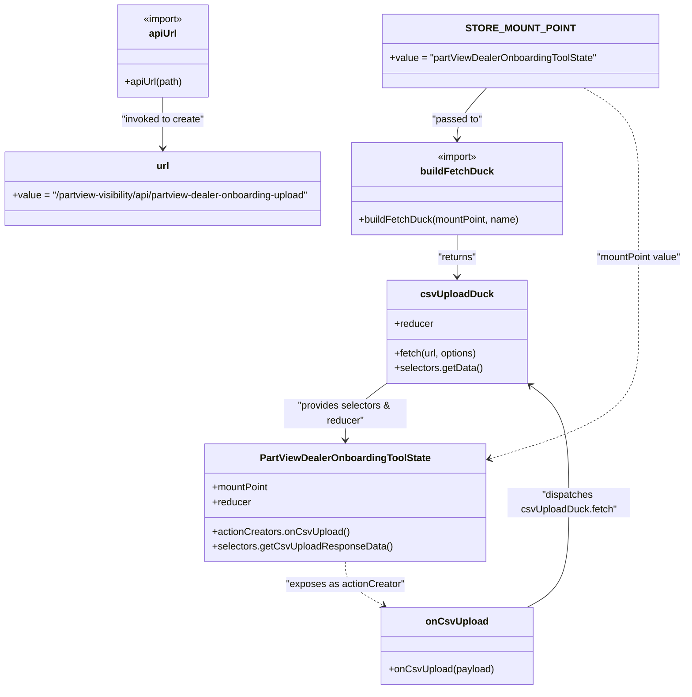

# Diagram: web/portal/src/pages/administration/internal-tools/redux/PartViewDealerOnboardingToolState.js

> Auto-generated by Obscura crawlers

## Mermaid

### SVG

<svg id="container" width="1147.6015625" xmlns="http://www.w3.org/2000/svg" class="classDiagram" height="1122" viewBox="0 0 1147.6015625 1122" role="graphics-document document" aria-roledescription="class"><g><defs><marker id="container_class-aggregationStart" class="marker aggregation class" refX="18" refY="7" markerWidth="190" markerHeight="240" orient="auto"><path d="M 18,7 L9,13 L1,7 L9,1 Z"></path></marker></defs><defs><marker id="container_class-aggregationEnd" class="marker aggregation class" refX="1" refY="7" markerWidth="20" markerHeight="28" orient="auto"><path d="M 18,7 L9,13 L1,7 L9,1 Z"></path></marker></defs><defs><marker id="container_class-extensionStart" class="marker extension class" refX="18" refY="7" markerWidth="190" markerHeight="240" orient="auto"><path d="M 1,7 L18,13 V 1 Z"></path></marker></defs><defs><marker id="container_class-extensionEnd" class="marker extension class" refX="1" refY="7" markerWidth="20" markerHeight="28" orient="auto"><path d="M 1,1 V 13 L18,7 Z"></path></marker></defs><defs><marker id="container_class-compositionStart" class="marker composition class" refX="18" refY="7" markerWidth="190" markerHeight="240" orient="auto"><path d="M 18,7 L9,13 L1,7 L9,1 Z"></path></marker></defs><defs><marker id="container_class-compositionEnd" class="marker composition class" refX="1" refY="7" markerWidth="20" markerHeight="28" orient="auto"><path d="M 18,7 L9,13 L1,7 L9,1 Z"></path></marker></defs><defs><marker id="container_class-dependencyStart" class="marker dependency class" refX="6" refY="7" markerWidth="190" markerHeight="240" orient="auto"><path d="M 5,7 L9,13 L1,7 L9,1 Z"></path></marker></defs><defs><marker id="container_class-dependencyEnd" class="marker dependency class" refX="13" refY="7" markerWidth="20" markerHeight="28" orient="auto"><path d="M 18,7 L9,13 L14,7 L9,1 Z"></path></marker></defs><defs><marker id="container_class-lollipopStart" class="marker lollipop class" refX="13" refY="7" markerWidth="190" markerHeight="240" orient="auto"><circle stroke="black" fill="transparent" cx="7" cy="7" r="6"></circle></marker></defs><defs><marker id="container_class-lollipopEnd" class="marker lollipop class" refX="1" refY="7" markerWidth="190" markerHeight="240" orient="auto"><circle stroke="black" fill="transparent" cx="7" cy="7" r="6"></circle></marker></defs><g class="root"><g class="clusters"></g><g class="edgePaths"><path d="M281.09,158L281.09,164.167C281.09,170.333,281.09,182.667,281.09,196.5C281.09,210.333,281.09,225.667,281.09,233.333L281.09,241" id="id_apiUrl_url_1" class="edge-thickness-normal edge-pattern-solid relation" style=";;;" data-edge="true" data-et="edge" data-id="id_apiUrl_url_1" data-points="W3sieCI6MjgxLjA4OTg0Mzc1LCJ5IjoxNTh9LHsieCI6MjgxLjA4OTg0Mzc1LCJ5IjoxOTV9LHsieCI6MjgxLjA4OTg0Mzc1LCJ5IjoyNDd9XQ==" marker-end="url(#container_class-dependencyEnd)"></path><path d="M824.291,143L816.28,151.667C808.27,160.333,792.248,177.667,784.237,191.5C776.227,205.333,776.227,215.667,776.227,220.833L776.227,226" id="id_STORE_MOUNT_POINT_buildFetchDuck_2" class="edge-thickness-normal edge-pattern-solid relation" style=";;;" data-edge="true" data-et="edge" data-id="id_STORE_MOUNT_POINT_buildFetchDuck_2" data-points="W3sieCI6ODI0LjI5MTAxNTYyNSwieSI6MTQzfSx7IngiOjc3Ni4yMjY1NjI1LCJ5IjoxOTV9LHsieCI6Nzc2LjIyNjU2MjUsInkiOjIzMn1d" marker-end="url(#container_class-dependencyEnd)"></path><path d="M776.227,382L776.227,388.167C776.227,394.333,776.227,406.667,776.227,418C776.227,429.333,776.227,439.667,776.227,444.833L776.227,450" id="id_buildFetchDuck_csvUploadDuck_3" class="edge-thickness-normal edge-pattern-solid relation" style=";;;" data-edge="true" data-et="edge" data-id="id_buildFetchDuck_csvUploadDuck_3" data-points="W3sieCI6Nzc2LjIyNjU2MjUsInkiOjM4Mn0seyJ4Ijo3NzYuMjI2NTYyNSwieSI6NDE5fSx7IngiOjc3Ni4yMjY1NjI1LCJ5Ijo0NTZ9XQ==" marker-end="url(#container_class-dependencyEnd)"></path><path d="M664.703,622.719L653.405,631.099C642.107,639.48,619.51,656.24,608.212,671.787C596.914,687.333,596.914,701.667,596.914,708.833L596.914,716" id="id_csvUploadDuck_PartViewDealerOnboardingToolState_4" class="edge-thickness-normal edge-pattern-solid relation" style=";;;" data-edge="true" data-et="edge" data-id="id_csvUploadDuck_PartViewDealerOnboardingToolState_4" data-points="W3sieCI6NjY0LjcwMzEyNSwieSI6NjIyLjcxOTM3MDg2MDkyNzF9LHsieCI6NTk2LjkxNDA2MjUsInkiOjY3M30seyJ4Ijo1OTYuOTE0MDYyNSwieSI6NzIyfV0=" marker-end="url(#container_class-dependencyEnd)"></path><path d="M889.193,988L900.251,981.833C911.309,975.667,933.424,963.333,944.481,935C955.539,906.667,955.539,862.333,955.539,816C955.539,769.667,955.539,721.333,945.044,689.382C934.549,657.431,913.559,641.863,903.064,634.078L892.569,626.294" id="id_onCsvUpload_csvUploadDuck_5" class="edge-thickness-normal edge-pattern-solid relation" style=";;;" data-edge="true" data-et="edge" data-id="id_onCsvUpload_csvUploadDuck_5" data-points="W3sieCI6ODg5LjE5MzQzNzUsInkiOjk4OH0seyJ4Ijo5NTUuNTM5MDYyNSwieSI6OTUxfSx7IngiOjk1NS41MzkwNjI1LCJ5Ijo4MTh9LHsieCI6OTU1LjUzOTA2MjUsInkiOjY3M30seyJ4Ijo4ODcuNzUsInkiOjYyMi43MTkzNzA4NjA5MjcxfV0=" marker-end="url(#container_class-dependencyEnd)"></path><path d="M596.914,914L596.914,920.167C596.914,926.333,596.914,938.667,607.098,950.513C617.283,962.359,637.651,973.718,647.835,979.398L658.019,985.078" id="id_PartViewDealerOnboardingToolState_onCsvUpload_6" class="edge-thickness-normal edge-pattern-dashed relation" style=";;;" data-edge="true" data-et="edge" data-id="id_PartViewDealerOnboardingToolState_onCsvUpload_6" data-points="W3sieCI6NTk2LjkxNDA2MjUsInkiOjkxNH0seyJ4Ijo1OTYuOTE0MDYyNSwieSI6OTUxfSx7IngiOjY2My4yNTk2ODc1LCJ5Ijo5ODh9XQ==" marker-end="url(#container_class-dependencyEnd)"></path><path d="M981.167,143L995.817,151.667C1010.466,160.333,1039.764,177.667,1054.413,205C1069.063,232.333,1069.063,269.667,1069.063,307C1069.063,344.333,1069.063,381.667,1069.063,420.5C1069.063,459.333,1069.063,499.667,1069.063,542C1069.063,584.333,1069.063,628.667,1028.598,663.26C988.133,697.854,907.204,722.708,866.739,735.135L826.275,747.562" id="id_STORE_MOUNT_POINT_PartViewDealerOnboardingToolState_7" class="edge-thickness-normal edge-pattern-dashed relation" style=";;;" data-edge="true" data-et="edge" data-id="id_STORE_MOUNT_POINT_PartViewDealerOnboardingToolState_7" data-points="W3sieCI6OTgxLjE2NzQxMDcxNDI4NTcsInkiOjE0M30seyJ4IjoxMDY5LjA2MjUsInkiOjE5NX0seyJ4IjoxMDY5LjA2MjUsInkiOjMwN30seyJ4IjoxMDY5LjA2MjUsInkiOjQxOX0seyJ4IjoxMDY5LjA2MjUsInkiOjU0MH0seyJ4IjoxMDY5LjA2MjUsInkiOjY3M30seyJ4Ijo4MjAuNTM5MDYyNSwieSI6NzQ5LjMyMzIzOTg0NDQ2MX1d" marker-end="url(#container_class-dependencyEnd)"></path></g><g class="edgeLabels"><g class="edgeLabel" transform="translate(281.08984375, 195)"><g class="label" data-id="id_apiUrl_url_1" transform="translate(-69.0546875, -12)"><foreignObject width="138.109375" height="24">

"invoked to create"

</foreignObject></g></g><g class="edgeLabel" transform="translate(776.2265625, 195)"><g class="label" data-id="id_STORE_MOUNT_POINT_buildFetchDuck_2" transform="translate(-41.3515625, -12)"><foreignObject width="82.703125" height="24">

"passed to"

</foreignObject></g></g><g class="edgeLabel" transform="translate(776.2265625, 419)"><g class="label" data-id="id_buildFetchDuck_csvUploadDuck_3" transform="translate(-32.53125, -12)"><foreignObject width="65.0625" height="24">

"returns"

</foreignObject></g></g><g class="edgeLabel" transform="translate(596.9140625, 673)"><g class="label" data-id="id_csvUploadDuck_PartViewDealerOnboardingToolState_4" transform="translate(-100, -24)"><foreignObject width="200" height="48">

"provides selectors &amp; reducer"

</foreignObject></g></g><g class="edgeLabel" transform="translate(955.5390625, 818)"><g class="label" data-id="id_onCsvUpload_csvUploadDuck_5" transform="translate(-100, -24)"><foreignObject width="200" height="48">

"dispatches csvUploadDuck.fetch"

</foreignObject></g></g><g class="edgeLabel" transform="translate(596.9140625, 951)"><g class="label" data-id="id_PartViewDealerOnboardingToolState_onCsvUpload_6" transform="translate(-97.0625, -12)"><foreignObject width="194.125" height="24">

"exposes as actionCreator"

</foreignObject></g></g><g class="edgeLabel" transform="translate(1069.0625, 419)"><g class="label" data-id="id_STORE_MOUNT_POINT_PartViewDealerOnboardingToolState_7" transform="translate(-70.5390625, -12)"><foreignObject width="141.078125" height="24">

"mountPoint value"

</foreignObject></g></g></g><g class="nodes"><g class="node default" id="classId-apiUrl-0" transform="translate(281.08984375, 83)"><g class="basic label-container"><path d="M-76.5703125 -75 L76.5703125 -75 L76.5703125 75 L-76.5703125 75" stroke="none" stroke-width="0" fill="#ECECFF" style=""></path><path d="M-76.5703125 -75 C-34.56736235331439 -75, 7.435587793371226 -75, 76.5703125 -75 M-76.5703125 -75 C-18.59587840375977 -75, 39.37855569248046 -75, 76.5703125 -75 M76.5703125 -75 C76.5703125 -23.651982870298347, 76.5703125 27.696034259403305, 76.5703125 75 M76.5703125 -75 C76.5703125 -31.38998129027634, 76.5703125 12.220037419447323, 76.5703125 75 M76.5703125 75 C16.14093576278738 75, -44.28844097442524 75, -76.5703125 75 M76.5703125 75 C40.82121201269836 75, 5.072111525396721 75, -76.5703125 75 M-76.5703125 75 C-76.5703125 38.40403074136914, -76.5703125 1.8080614827382817, -76.5703125 -75 M-76.5703125 75 C-76.5703125 33.70457849056225, -76.5703125 -7.590843018875503, -76.5703125 -75" stroke="#9370DB" stroke-width="1.3" fill="none" stroke-dasharray="0 0" style=""></path></g><g class="annotation-group text" transform="translate(-33.640625, -51)"><g class="label" style="" transform="translate(0,-12)"><foreignObject width="67.28125" height="24">

«import»

</foreignObject></g></g><g class="label-group text" transform="translate(-22.2109375, -27)"><g class="label" style="font-weight: bolder" transform="translate(0,-12)"><foreignObject width="44.421875" height="24">

apiUrl

</foreignObject></g></g><g class="members-group text" transform="translate(-64.5703125, 21)"></g><g class="methods-group text" transform="translate(-64.5703125, 51)"><g class="label" style="" transform="translate(0,-12)"><foreignObject width="95.5" height="24">

+apiUrl(path)

</foreignObject></g></g><g class="divider" style=""><path d="M-76.5703125 -3 C-22.78681622625681 -3, 30.99668004748638 -3, 76.5703125 -3 M-76.5703125 -3 C-36.07436289761875 -3, 4.421586704762504 -3, 76.5703125 -3" stroke="#9370DB" stroke-width="1.3" fill="none" stroke-dasharray="0 0" style=""></path></g><g class="divider" style=""><path d="M-76.5703125 21 C-21.828011241150122 21, 32.914290017699756 21, 76.5703125 21 M-76.5703125 21 C-18.736466172337174 21, 39.09738015532565 21, 76.5703125 21" stroke="#9370DB" stroke-width="1.3" fill="none" stroke-dasharray="0 0" style=""></path></g></g><g class="node default" id="classId-buildFetchDuck-1" transform="translate(776.2265625, 307)"><g class="basic label-container"><path d="M-172.046875 -75 L172.046875 -75 L172.046875 75 L-172.046875 75" stroke="none" stroke-width="0" fill="#ECECFF" style=""></path><path d="M-172.046875 -75 C-61.047697589975385 -75, 49.95147982004923 -75, 172.046875 -75 M-172.046875 -75 C-45.68962037685934 -75, 80.66763424628132 -75, 172.046875 -75 M172.046875 -75 C172.046875 -41.47426572023524, 172.046875 -7.948531440470475, 172.046875 75 M172.046875 -75 C172.046875 -29.488564047928037, 172.046875 16.022871904143926, 172.046875 75 M172.046875 75 C57.922037496006 75, -56.202800007988 75, -172.046875 75 M172.046875 75 C101.44366605697186 75, 30.840457113943728 75, -172.046875 75 M-172.046875 75 C-172.046875 32.29557958088847, -172.046875 -10.408840838223057, -172.046875 -75 M-172.046875 75 C-172.046875 29.863463078403143, -172.046875 -15.273073843193714, -172.046875 -75" stroke="#9370DB" stroke-width="1.3" fill="none" stroke-dasharray="0 0" style=""></path></g><g class="annotation-group text" transform="translate(-33.640625, -51)"><g class="label" style="" transform="translate(0,-12)"><foreignObject width="67.28125" height="24">

«import»

</foreignObject></g></g><g class="label-group text" transform="translate(-56.203125, -27)"><g class="label" style="font-weight: bolder" transform="translate(0,-12)"><foreignObject width="112.40625" height="24">

buildFetchDuck

</foreignObject></g></g><g class="members-group text" transform="translate(-160.046875, 21)"></g><g class="methods-group text" transform="translate(-160.046875, 51)"><g class="label" style="" transform="translate(0,-12)"><foreignObject width="263.890625" height="24">

+buildFetchDuck(mountPoint, name)

</foreignObject></g></g><g class="divider" style=""><path d="M-172.046875 -3 C-51.83004258399164 -3, 68.38678983201672 -3, 172.046875 -3 M-172.046875 -3 C-59.25607704195437 -3, 53.53472091609126 -3, 172.046875 -3" stroke="#9370DB" stroke-width="1.3" fill="none" stroke-dasharray="0 0" style=""></path></g><g class="divider" style=""><path d="M-172.046875 21 C-93.11572509885383 21, -14.184575197707659 21, 172.046875 21 M-172.046875 21 C-66.27458761958923 21, 39.49769976082155 21, 172.046875 21" stroke="#9370DB" stroke-width="1.3" fill="none" stroke-dasharray="0 0" style=""></path></g></g><g class="node default" id="classId-STORE_MOUNT_POINT-2" transform="translate(879.75, 83)"><g class="basic label-container"><path d="M-221.8203125 -60 L221.8203125 -60 L221.8203125 60 L-221.8203125 60" stroke="none" stroke-width="0" fill="#ECECFF" style=""></path><path d="M-221.8203125 -60 C-113.33353233638185 -60, -4.846752172763701 -60, 221.8203125 -60 M-221.8203125 -60 C-44.40147783529565 -60, 133.0173568294087 -60, 221.8203125 -60 M221.8203125 -60 C221.8203125 -27.370530373667172, 221.8203125 5.258939252665655, 221.8203125 60 M221.8203125 -60 C221.8203125 -35.40129127414714, 221.8203125 -10.802582548294282, 221.8203125 60 M221.8203125 60 C72.85004162720566 60, -76.12022924558869 60, -221.8203125 60 M221.8203125 60 C113.45948378227914 60, 5.098655064558272 60, -221.8203125 60 M-221.8203125 60 C-221.8203125 29.368124206270426, -221.8203125 -1.2637515874591472, -221.8203125 -60 M-221.8203125 60 C-221.8203125 21.53992472104384, -221.8203125 -16.920150557912322, -221.8203125 -60" stroke="#9370DB" stroke-width="1.3" fill="none" stroke-dasharray="0 0" style=""></path></g><g class="annotation-group text" transform="translate(0, -36)"></g><g class="label-group text" transform="translate(-79.90625, -36)"><g class="label" style="font-weight: bolder" transform="translate(0,-12)"><foreignObject width="159.8125" height="24">

STORE_MOUNT_POINT

</foreignObject></g></g><g class="members-group text" transform="translate(-209.8203125, 12)"><g class="label" style="" transform="translate(0,-12)"><foreignObject width="339.734375" height="24">

+value = "partViewDealerOnboardingToolState"

</foreignObject></g></g><g class="methods-group text" transform="translate(-209.8203125, 60)"></g><g class="divider" style=""><path d="M-221.8203125 -12 C-107.19725455569244 -12, 7.4258033886151225 -12, 221.8203125 -12 M-221.8203125 -12 C-95.21097036485254 -12, 31.398371770294915 -12, 221.8203125 -12" stroke="#9370DB" stroke-width="1.3" fill="none" stroke-dasharray="0 0" style=""></path></g><g class="divider" style=""><path d="M-221.8203125 36 C-77.54591328402 36, 66.72848593196 36, 221.8203125 36 M-221.8203125 36 C-117.23733012481746 36, -12.654347749634923 36, 221.8203125 36" stroke="#9370DB" stroke-width="1.3" fill="none" stroke-dasharray="0 0" style=""></path></g></g><g class="node default" id="classId-url-3" transform="translate(281.08984375, 307)"><g class="basic label-container"><path d="M-273.08984375 -60 L273.08984375 -60 L273.08984375 60 L-273.08984375 60" stroke="none" stroke-width="0" fill="#ECECFF" style=""></path><path d="M-273.08984375 -60 C-60.57379983906176 -60, 151.94224407187647 -60, 273.08984375 -60 M-273.08984375 -60 C-147.06386761656344 -60, -21.037891483126884 -60, 273.08984375 -60 M273.08984375 -60 C273.08984375 -22.490301756432785, 273.08984375 15.01939648713443, 273.08984375 60 M273.08984375 -60 C273.08984375 -21.031095498003886, 273.08984375 17.93780900399223, 273.08984375 60 M273.08984375 60 C55.8662383465973 60, -161.3573670568054 60, -273.08984375 60 M273.08984375 60 C55.37527196579731 60, -162.33929981840538 60, -273.08984375 60 M-273.08984375 60 C-273.08984375 25.826327508742345, -273.08984375 -8.34734498251531, -273.08984375 -60 M-273.08984375 60 C-273.08984375 27.79300944457374, -273.08984375 -4.413981110852518, -273.08984375 -60" stroke="#9370DB" stroke-width="1.3" fill="none" stroke-dasharray="0 0" style=""></path></g><g class="annotation-group text" transform="translate(0, -36)"></g><g class="label-group text" transform="translate(-10.1640625, -36)"><g class="label" style="font-weight: bolder" transform="translate(0,-12)"><foreignObject width="20.328125" height="24">

url

</foreignObject></g></g><g class="members-group text" transform="translate(-261.08984375, 12)"><g class="label" style="" transform="translate(0,-12)"><foreignObject width="512.015625" height="24">

+value = "/partview-visibility/api/partview-dealer-onboarding-upload"

</foreignObject></g></g><g class="methods-group text" transform="translate(-261.08984375, 60)"></g><g class="divider" style=""><path d="M-273.08984375 -12 C-144.82406069236185 -12, -16.55827763472371 -12, 273.08984375 -12 M-273.08984375 -12 C-89.00444714019883 -12, 95.08094946960233 -12, 273.08984375 -12" stroke="#9370DB" stroke-width="1.3" fill="none" stroke-dasharray="0 0" style=""></path></g><g class="divider" style=""><path d="M-273.08984375 36 C-107.61056652046122 36, 57.86871070907756 36, 273.08984375 36 M-273.08984375 36 C-140.80078961289522 36, -8.51173547579043 36, 273.08984375 36" stroke="#9370DB" stroke-width="1.3" fill="none" stroke-dasharray="0 0" style=""></path></g></g><g class="node default" id="classId-csvUploadDuck-4" transform="translate(776.2265625, 540)"><g class="basic label-container"><path d="M-111.5234375 -84 L111.5234375 -84 L111.5234375 84 L-111.5234375 84" stroke="none" stroke-width="0" fill="#ECECFF" style=""></path><path d="M-111.5234375 -84 C-33.661328399861375 -84, 44.20078070027725 -84, 111.5234375 -84 M-111.5234375 -84 C-49.8983321272201 -84, 11.726773245559798 -84, 111.5234375 -84 M111.5234375 -84 C111.5234375 -36.84800206965925, 111.5234375 10.303995860681496, 111.5234375 84 M111.5234375 -84 C111.5234375 -19.778308316309165, 111.5234375 44.44338336738167, 111.5234375 84 M111.5234375 84 C25.907289933835642 84, -59.708857632328716 84, -111.5234375 84 M111.5234375 84 C62.9942872640718 84, 14.465137028143602 84, -111.5234375 84 M-111.5234375 84 C-111.5234375 21.102111415341994, -111.5234375 -41.79577716931601, -111.5234375 -84 M-111.5234375 84 C-111.5234375 38.447946459197375, -111.5234375 -7.10410708160525, -111.5234375 -84" stroke="#9370DB" stroke-width="1.3" fill="none" stroke-dasharray="0 0" style=""></path></g><g class="annotation-group text" transform="translate(0, -60)"></g><g class="label-group text" transform="translate(-55.78125, -60)"><g class="label" style="font-weight: bolder" transform="translate(0,-12)"><foreignObject width="111.5625" height="24">

csvUploadDuck

</foreignObject></g></g><g class="members-group text" transform="translate(-99.5234375, -12)"><g class="label" style="" transform="translate(0,-12)"><foreignObject width="63.515625" height="24">

+reducer

</foreignObject></g></g><g class="methods-group text" transform="translate(-99.5234375, 36)"><g class="label" style="" transform="translate(0,-12)"><foreignObject width="138.25" height="24">

+fetch(url, options)

</foreignObject></g><g class="label" style="" transform="translate(0,12)"><foreignObject width="143.265625" height="24">

+selectors.getData()

</foreignObject></g></g><g class="divider" style=""><path d="M-111.5234375 -36 C-58.76597725717519 -36, -6.0085170143503746 -36, 111.5234375 -36 M-111.5234375 -36 C-52.5168646257451 -36, 6.4897082485098 -36, 111.5234375 -36" stroke="#9370DB" stroke-width="1.3" fill="none" stroke-dasharray="0 0" style=""></path></g><g class="divider" style=""><path d="M-111.5234375 12 C-22.493005736767543 12, 66.53742602646491 12, 111.5234375 12 M-111.5234375 12 C-44.951191678944014 12, 21.621054142111973 12, 111.5234375 12" stroke="#9370DB" stroke-width="1.3" fill="none" stroke-dasharray="0 0" style=""></path></g></g><g class="node default" id="classId-onCsvUpload-5" transform="translate(776.2265625, 1051)"><g class="basic label-container"><path d="M-121.27734375 -63 L121.27734375 -63 L121.27734375 63 L-121.27734375 63" stroke="none" stroke-width="0" fill="#ECECFF" style=""></path><path d="M-121.27734375 -63 C-47.438959025412686 -63, 26.39942569917463 -63, 121.27734375 -63 M-121.27734375 -63 C-37.81702272442385 -63, 45.6432983011523 -63, 121.27734375 -63 M121.27734375 -63 C121.27734375 -35.6200256669508, 121.27734375 -8.240051333901604, 121.27734375 63 M121.27734375 -63 C121.27734375 -27.662493098042475, 121.27734375 7.67501380391505, 121.27734375 63 M121.27734375 63 C47.55019200323575 63, -26.1769597435285 63, -121.27734375 63 M121.27734375 63 C56.12299973424955 63, -9.031344281500907 63, -121.27734375 63 M-121.27734375 63 C-121.27734375 24.343304611137157, -121.27734375 -14.313390777725687, -121.27734375 -63 M-121.27734375 63 C-121.27734375 22.48035384526669, -121.27734375 -18.039292309466617, -121.27734375 -63" stroke="#9370DB" stroke-width="1.3" fill="none" stroke-dasharray="0 0" style=""></path></g><g class="annotation-group text" transform="translate(0, -39)"></g><g class="label-group text" transform="translate(-47.7421875, -39)"><g class="label" style="font-weight: bolder" transform="translate(0,-12)"><foreignObject width="95.484375" height="24">

onCsvUpload

</foreignObject></g></g><g class="members-group text" transform="translate(-109.27734375, 9)"></g><g class="methods-group text" transform="translate(-109.27734375, 39)"><g class="label" style="" transform="translate(0,-12)"><foreignObject width="170.8125" height="24">

+onCsvUpload(payload)

</foreignObject></g></g><g class="divider" style=""><path d="M-121.27734375 -15 C-44.8608475823319 -15, 31.5556485853362 -15, 121.27734375 -15 M-121.27734375 -15 C-52.58533484242231 -15, 16.106674065155374 -15, 121.27734375 -15" stroke="#9370DB" stroke-width="1.3" fill="none" stroke-dasharray="0 0" style=""></path></g><g class="divider" style=""><path d="M-121.27734375 9 C-46.34109989568519 9, 28.59514395862962 9, 121.27734375 9 M-121.27734375 9 C-39.877965956966804 9, 41.52141183606639 9, 121.27734375 9" stroke="#9370DB" stroke-width="1.3" fill="none" stroke-dasharray="0 0" style=""></path></g></g><g class="node default" id="classId-PartViewDealerOnboardingToolState-6" transform="translate(596.9140625, 818)"><g class="basic label-container"><path d="M-223.625 -96 L223.625 -96 L223.625 96 L-223.625 96" stroke="none" stroke-width="0" fill="#ECECFF" style=""></path><path d="M-223.625 -96 C-82.01593154994427 -96, 59.59313690011146 -96, 223.625 -96 M-223.625 -96 C-90.30910981206492 -96, 43.006780375870164 -96, 223.625 -96 M223.625 -96 C223.625 -46.54636708864939, 223.625 2.90726582270122, 223.625 96 M223.625 -96 C223.625 -57.405794949340375, 223.625 -18.81158989868075, 223.625 96 M223.625 96 C120.88717087299219 96, 18.149341745984373 96, -223.625 96 M223.625 96 C47.09503852653691 96, -129.43492294692618 96, -223.625 96 M-223.625 96 C-223.625 24.248936051097076, -223.625 -47.50212789780585, -223.625 -96 M-223.625 96 C-223.625 20.876624848582594, -223.625 -54.24675030283481, -223.625 -96" stroke="#9370DB" stroke-width="1.3" fill="none" stroke-dasharray="0 0" style=""></path></g><g class="annotation-group text" transform="translate(0, -72)"></g><g class="label-group text" transform="translate(-133.953125, -72)"><g class="label" style="font-weight: bolder" transform="translate(0,-12)"><foreignObject width="267.90625" height="24">

PartViewDealerOnboardingToolState

</foreignObject></g></g><g class="members-group text" transform="translate(-211.625, -24)"><g class="label" style="" transform="translate(0,-12)"><foreignObject width="93.34375" height="24">

+mountPoint

</foreignObject></g><g class="label" style="" transform="translate(0,12)"><foreignObject width="63.515625" height="24">

+reducer

</foreignObject></g></g><g class="methods-group text" transform="translate(-211.625, 48)"><g class="label" style="" transform="translate(0,-12)"><foreignObject width="221.828125" height="24">

+actionCreators.onCsvUpload()

</foreignObject></g><g class="label" style="" transform="translate(0,12)"><foreignObject width="289.296875" height="24">

+selectors.getCsvUploadResponseData()

</foreignObject></g></g><g class="divider" style=""><path d="M-223.625 -48 C-55.18145046596359 -48, 113.26209906807281 -48, 223.625 -48 M-223.625 -48 C-92.28373586641675 -48, 39.057528267166504 -48, 223.625 -48" stroke="#9370DB" stroke-width="1.3" fill="none" stroke-dasharray="0 0" style=""></path></g><g class="divider" style=""><path d="M-223.625 24 C-45.017690669470085 24, 133.58961866105983 24, 223.625 24 M-223.625 24 C-111.88034126301436 24, -0.13568252602871667 24, 223.625 24" stroke="#9370DB" stroke-width="1.3" fill="none" stroke-dasharray="0 0" style=""></path></g></g></g></g></g></svg>
