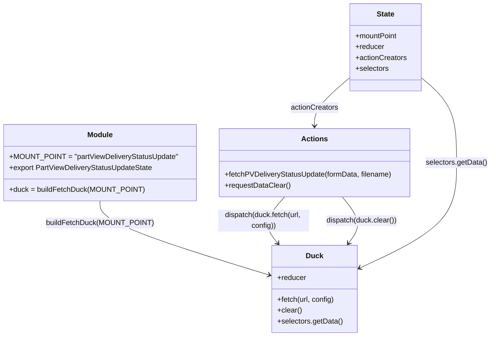

# Diagram: web/portal/src/pages/administration/internal-tools/redux/PartViewDeliveryStatusUpdateState.js

> Auto-generated by Obscura crawlers

## Mermaid

### SVG

<svg id="container" width="1069.4609375" xmlns="http://www.w3.org/2000/svg" class="classDiagram" height="740" viewBox="0 0 1069.4609375 740" role="graphics-document document" aria-roledescription="class"><g><defs><marker id="container_class-aggregationStart" class="marker aggregation class" refX="18" refY="7" markerWidth="190" markerHeight="240" orient="auto"><path d="M 18,7 L9,13 L1,7 L9,1 Z"></path></marker></defs><defs><marker id="container_class-aggregationEnd" class="marker aggregation class" refX="1" refY="7" markerWidth="20" markerHeight="28" orient="auto"><path d="M 18,7 L9,13 L1,7 L9,1 Z"></path></marker></defs><defs><marker id="container_class-extensionStart" class="marker extension class" refX="18" refY="7" markerWidth="190" markerHeight="240" orient="auto"><path d="M 1,7 L18,13 V 1 Z"></path></marker></defs><defs><marker id="container_class-extensionEnd" class="marker extension class" refX="1" refY="7" markerWidth="20" markerHeight="28" orient="auto"><path d="M 1,1 V 13 L18,7 Z"></path></marker></defs><defs><marker id="container_class-compositionStart" class="marker composition class" refX="18" refY="7" markerWidth="190" markerHeight="240" orient="auto"><path d="M 18,7 L9,13 L1,7 L9,1 Z"></path></marker></defs><defs><marker id="container_class-compositionEnd" class="marker composition class" refX="1" refY="7" markerWidth="20" markerHeight="28" orient="auto"><path d="M 18,7 L9,13 L1,7 L9,1 Z"></path></marker></defs><defs><marker id="container_class-dependencyStart" class="marker dependency class" refX="6" refY="7" markerWidth="190" markerHeight="240" orient="auto"><path d="M 5,7 L9,13 L1,7 L9,1 Z"></path></marker></defs><defs><marker id="container_class-dependencyEnd" class="marker dependency class" refX="13" refY="7" markerWidth="20" markerHeight="28" orient="auto"><path d="M 18,7 L9,13 L14,7 L9,1 Z"></path></marker></defs><defs><marker id="container_class-lollipopStart" class="marker lollipop class" refX="13" refY="7" markerWidth="190" markerHeight="240" orient="auto"><circle stroke="black" fill="transparent" cx="7" cy="7" r="6"></circle></marker></defs><defs><marker id="container_class-lollipopEnd" class="marker lollipop class" refX="1" refY="7" markerWidth="190" markerHeight="240" orient="auto"><circle stroke="black" fill="transparent" cx="7" cy="7" r="6"></circle></marker></defs><g class="root"><g class="clusters"></g><g class="edgePaths"><path d="M214.906,442L214.906,450.167C214.906,458.333,214.906,474.667,276.274,501.904C337.642,529.142,460.378,567.284,521.746,586.355L583.114,605.426" id="id_Module_Duck_1" class="edge-thickness-normal edge-pattern-solid relation" style=";;;" data-edge="true" data-et="edge" data-id="id_Module_Duck_1" data-points="W3sieCI6MjE0LjkwNjI1LCJ5Ijo0NDJ9LHsieCI6MjE0LjkwNjI1LCJ5Ijo0OTF9LHsieCI6NTg4Ljg0Mzc1LCJ5Ijo2MDcuMjA2ODUzMjQ4NzIxMn1d" marker-end="url(#container_class-dependencyEnd)"></path><path d="M615.758,433L607.285,442.667C598.812,452.333,581.866,471.667,579.332,488.721C576.798,505.775,588.677,520.549,594.616,527.937L600.555,535.324" id="id_Actions_Duck_2" class="edge-thickness-normal edge-pattern-solid relation" style=";;;" data-edge="true" data-et="edge" data-id="id_Actions_Duck_2" data-points="W3sieCI6NjE1Ljc1NzY1MDk2MzM0NTksInkiOjQzM30seyJ4Ijo1NjQuOTE5OTIxODc1LCJ5Ijo0OTF9LHsieCI6NjA0LjMxNDYyODIzMjc1ODcsInkiOjU0MH1d" marker-end="url(#container_class-dependencyEnd)"></path><path d="M741.776,433L749.545,442.667C757.315,452.333,772.854,471.667,775.196,488.695C777.538,505.724,766.684,520.447,761.257,527.809L755.829,535.171" id="id_Actions_Duck_3" class="edge-thickness-normal edge-pattern-solid relation" style=";;;" data-edge="true" data-et="edge" data-id="id_Actions_Duck_3" data-points="W3sieCI6NzQxLjc3NjA2NjE0MTkxNzMsInkiOjQzM30seyJ4Ijo3ODguMzkyNTc4MTI1LCJ5Ijo0OTF9LHsieCI6NzUyLjI2ODkzODU3NzU4NjMsInkiOjU0MH1d" marker-end="url(#container_class-dependencyEnd)"></path><path d="M759.463,170.597L746.468,181.664C733.474,192.732,707.485,214.866,694.491,232.6C681.496,250.333,681.496,263.667,681.496,270.333L681.496,277" id="id_State_Actions_4" class="edge-thickness-normal edge-pattern-solid relation" style=";;;" data-edge="true" data-et="edge" data-id="id_State_Actions_4" data-points="W3sieCI6NzU5LjQ2Mjg5MDYyNSwieSI6MTcwLjU5NzMxMDk4NzQzMDQzfSx7IngiOjY4MS40OTYwOTM3NSwieSI6MjM3fSx7IngiOjY4MS40OTYwOTM3NSwieSI6MjgzfV0=" marker-end="url(#container_class-dependencyEnd)"></path><path d="M915.854,170.597L928.848,181.664C941.842,192.732,967.831,214.866,980.826,246.1C993.82,277.333,993.82,317.667,993.82,360C993.82,402.333,993.82,446.667,958.115,485.41C922.41,524.153,851,557.306,815.296,573.882L779.591,590.459" id="id_State_Duck_5" class="edge-thickness-normal edge-pattern-solid relation" style=";;;" data-edge="true" data-et="edge" data-id="id_State_Duck_5" data-points="W3sieCI6OTE1Ljg1MzUxNTYyNSwieSI6MTcwLjU5NzMxMDk4NzQzMDQzfSx7IngiOjk5My44MjAzMTI1LCJ5IjoyMzd9LHsieCI6OTkzLjgyMDMxMjUsInkiOjM1OH0seyJ4Ijo5OTMuODIwMzEyNSwieSI6NDkxfSx7IngiOjc3NC4xNDg0Mzc1LCJ5Ijo1OTIuOTg1MTE2NjI4MTAzNH1d" marker-end="url(#container_class-dependencyEnd)"></path></g><g class="edgeLabels"><g class="edgeLabel" transform="translate(214.90625, 491)"><g class="label" data-id="id_Module_Duck_1" transform="translate(-113.4375, -12)"><foreignObject width="226.875" height="24">

buildFetchDuck(MOUNT_POINT)

</foreignObject></g></g><g class="edgeLabel" transform="translate(569.61765, 485.64043)"><g class="label" data-id="id_Actions_Duck_2" transform="translate(-100, -24)"><foreignObject width="200" height="48">

dispatch(duck.fetch(url, config))

</foreignObject></g></g><g class="edgeLabel" transform="translate(784.15282, 485.72492)"><g class="label" data-id="id_Actions_Duck_3" transform="translate(-78.53125, -12)"><foreignObject width="157.0625" height="24">

dispatch(duck.clear())

</foreignObject></g></g><g class="edgeLabel" transform="translate(681.49609375, 237)"><g class="label" data-id="id_State_Actions_4" transform="translate(-52.671875, -12)"><foreignObject width="105.34375" height="24">

actionCreators

</foreignObject></g></g><g class="edgeLabel" transform="translate(993.8203125, 358)"><g class="label" data-id="id_State_Duck_5" transform="translate(-67.640625, -12)"><foreignObject width="135.28125" height="24">

selectors.getData()

</foreignObject></g></g></g><g class="nodes"><g class="node default" id="classId-Module-0" transform="translate(214.90625, 358)"><g class="basic label-container"><path d="M-206.90625 -84 L206.90625 -84 L206.90625 84 L-206.90625 84" stroke="none" stroke-width="0" fill="#ECECFF" style=""></path><path d="M-206.90625 -84 C-97.40143611578998 -84, 12.103377768420046 -84, 206.90625 -84 M-206.90625 -84 C-50.973713885033476 -84, 104.95882222993305 -84, 206.90625 -84 M206.90625 -84 C206.90625 -32.61786912988529, 206.90625 18.764261740229415, 206.90625 84 M206.90625 -84 C206.90625 -38.969618984303786, 206.90625 6.060762031392429, 206.90625 84 M206.90625 84 C87.14500882241369 84, -32.61623235517263 84, -206.90625 84 M206.90625 84 C111.68869816829991 84, 16.471146336599816 84, -206.90625 84 M-206.90625 84 C-206.90625 28.4557657485734, -206.90625 -27.088468502853203, -206.90625 -84 M-206.90625 84 C-206.90625 34.39654013616015, -206.90625 -15.206919727679704, -206.90625 -84" stroke="#9370DB" stroke-width="1.3" fill="none" stroke-dasharray="0 0" style=""></path></g><g class="annotation-group text" transform="translate(0, -60)"></g><g class="label-group text" transform="translate(-27.09375, -60)"><g class="label" style="font-weight: bolder" transform="translate(0,-12)"><foreignObject width="54.1875" height="24">

Module

</foreignObject></g></g><g class="members-group text" transform="translate(-194.90625, -12)"><g class="label" style="" transform="translate(0,-12)"><foreignObject width="362.71875" height="24">

+MOUNT_POINT = "partViewDeliveryStatusUpdate"

</foreignObject></g><g class="label" style="" transform="translate(0,12)"><foreignObject width="316.453125" height="24">

+export PartViewDeliveryStatusUpdateState

</foreignObject></g></g><g class="methods-group text" transform="translate(-194.90625, 60)"><g class="label" style="" transform="translate(0,-12)"><foreignObject width="286.0625" height="24">

+duck = buildFetchDuck(MOUNT_POINT)

</foreignObject></g></g><g class="divider" style=""><path d="M-206.90625 -36 C-58.39468740315331 -36, 90.11687519369337 -36, 206.90625 -36 M-206.90625 -36 C-59.72099734258592 -36, 87.46425531482816 -36, 206.90625 -36" stroke="#9370DB" stroke-width="1.3" fill="none" stroke-dasharray="0 0" style=""></path></g><g class="divider" style=""><path d="M-206.90625 36 C-77.9806473513905 36, 50.944955297218996 36, 206.90625 36 M-206.90625 36 C-72.0308149725123 36, 62.844620054975394 36, 206.90625 36" stroke="#9370DB" stroke-width="1.3" fill="none" stroke-dasharray="0 0" style=""></path></g></g><g class="node default" id="classId-Duck-1" transform="translate(681.49609375, 636)"><g class="basic label-container"><path d="M-92.65234375 -96 L92.65234375 -96 L92.65234375 96 L-92.65234375 96" stroke="none" stroke-width="0" fill="#ECECFF" style=""></path><path d="M-92.65234375 -96 C-53.95408472229079 -96, -15.255825694581574 -96, 92.65234375 -96 M-92.65234375 -96 C-46.36035882042429 -96, -0.06837389084857648 -96, 92.65234375 -96 M92.65234375 -96 C92.65234375 -46.84468997796537, 92.65234375 2.3106200440692533, 92.65234375 96 M92.65234375 -96 C92.65234375 -39.442585629576755, 92.65234375 17.11482874084649, 92.65234375 96 M92.65234375 96 C39.859519079434286 96, -12.933305591131429 96, -92.65234375 96 M92.65234375 96 C23.223179258535836 96, -46.20598523292833 96, -92.65234375 96 M-92.65234375 96 C-92.65234375 21.17792172942714, -92.65234375 -53.64415654114572, -92.65234375 -96 M-92.65234375 96 C-92.65234375 51.6426376994792, -92.65234375 7.2852753989584045, -92.65234375 -96" stroke="#9370DB" stroke-width="1.3" fill="none" stroke-dasharray="0 0" style=""></path></g><g class="annotation-group text" transform="translate(0, -72)"></g><g class="label-group text" transform="translate(-18.0390625, -72)"><g class="label" style="font-weight: bolder" transform="translate(0,-12)"><foreignObject width="36.078125" height="24">

Duck

</foreignObject></g></g><g class="members-group text" transform="translate(-80.65234375, -24)"><g class="label" style="" transform="translate(0,-12)"><foreignObject width="63.515625" height="24">

+reducer

</foreignObject></g></g><g class="methods-group text" transform="translate(-80.65234375, 24)"><g class="label" style="" transform="translate(0,-12)"><foreignObject width="126.484375" height="24">

+fetch(url, config)

</foreignObject></g><g class="label" style="" transform="translate(0,12)"><foreignObject width="54.0625" height="24">

+clear()

</foreignObject></g><g class="label" style="" transform="translate(0,36)"><foreignObject width="143.265625" height="24">

+selectors.getData()

</foreignObject></g></g><g class="divider" style=""><path d="M-92.65234375 -48 C-53.63948320257423 -48, -14.626622655148466 -48, 92.65234375 -48 M-92.65234375 -48 C-43.36604583720374 -48, 5.920252075592515 -48, 92.65234375 -48" stroke="#9370DB" stroke-width="1.3" fill="none" stroke-dasharray="0 0" style=""></path></g><g class="divider" style=""><path d="M-92.65234375 0 C-33.45509182594464 0, 25.742160098110716 0, 92.65234375 0 M-92.65234375 0 C-20.706873941984796 0, 51.23859586603041 0, 92.65234375 0" stroke="#9370DB" stroke-width="1.3" fill="none" stroke-dasharray="0 0" style=""></path></g></g><g class="node default" id="classId-Actions-2" transform="translate(681.49609375, 358)"><g class="basic label-container"><path d="M-209.68359375 -75 L209.68359375 -75 L209.68359375 75 L-209.68359375 75" stroke="none" stroke-width="0" fill="#ECECFF" style=""></path><path d="M-209.68359375 -75 C-66.09415880795558 -75, 77.49527613408884 -75, 209.68359375 -75 M-209.68359375 -75 C-58.23637692169325 -75, 93.2108399066135 -75, 209.68359375 -75 M209.68359375 -75 C209.68359375 -39.05337928035234, 209.68359375 -3.1067585607046766, 209.68359375 75 M209.68359375 -75 C209.68359375 -18.707013100530126, 209.68359375 37.58597379893975, 209.68359375 75 M209.68359375 75 C64.97849025688276 75, -79.72661323623447 75, -209.68359375 75 M209.68359375 75 C49.67433505077915 75, -110.3349236484417 75, -209.68359375 75 M-209.68359375 75 C-209.68359375 21.067142475298198, -209.68359375 -32.865715049403605, -209.68359375 -75 M-209.68359375 75 C-209.68359375 44.41287180378958, -209.68359375 13.825743607579156, -209.68359375 -75" stroke="#9370DB" stroke-width="1.3" fill="none" stroke-dasharray="0 0" style=""></path></g><g class="annotation-group text" transform="translate(0, -51)"></g><g class="label-group text" transform="translate(-27.0546875, -51)"><g class="label" style="font-weight: bolder" transform="translate(0,-12)"><foreignObject width="54.109375" height="24">

Actions

</foreignObject></g></g><g class="members-group text" transform="translate(-197.68359375, -3)"></g><g class="methods-group text" transform="translate(-197.68359375, 27)"><g class="label" style="" transform="translate(0,-12)"><foreignObject width="368.3125" height="24">

+fetchPVDeliveryStatusUpdate(formData, filename)

</foreignObject></g><g class="label" style="" transform="translate(0,12)"><foreignObject width="143.6875" height="24">

+requestDataClear()

</foreignObject></g></g><g class="divider" style=""><path d="M-209.68359375 -27 C-62.1778069587786 -27, 85.3279798324428 -27, 209.68359375 -27 M-209.68359375 -27 C-76.36366697073748 -27, 56.95625980852503 -27, 209.68359375 -27" stroke="#9370DB" stroke-width="1.3" fill="none" stroke-dasharray="0 0" style=""></path></g><g class="divider" style=""><path d="M-209.68359375 -3 C-95.24604698666859 -3, 19.191499776662823 -3, 209.68359375 -3 M-209.68359375 -3 C-50.29899882325523 -3, 109.08559610348954 -3, 209.68359375 -3" stroke="#9370DB" stroke-width="1.3" fill="none" stroke-dasharray="0 0" style=""></path></g></g><g class="node default" id="classId-State-3" transform="translate(837.658203125, 104)"><g class="basic label-container"><path d="M-78.1953125 -96 L78.1953125 -96 L78.1953125 96 L-78.1953125 96" stroke="none" stroke-width="0" fill="#ECECFF" style=""></path><path d="M-78.1953125 -96 C-42.617128195070286 -96, -7.0389438901405725 -96, 78.1953125 -96 M-78.1953125 -96 C-25.02067407450371 -96, 28.15396435099258 -96, 78.1953125 -96 M78.1953125 -96 C78.1953125 -35.692054002741045, 78.1953125 24.61589199451791, 78.1953125 96 M78.1953125 -96 C78.1953125 -24.605110057874427, 78.1953125 46.789779884251146, 78.1953125 96 M78.1953125 96 C39.44800215020354 96, 0.7006918004070855 96, -78.1953125 96 M78.1953125 96 C17.21511547136175 96, -43.7650815572765 96, -78.1953125 96 M-78.1953125 96 C-78.1953125 27.03271503019417, -78.1953125 -41.93456993961166, -78.1953125 -96 M-78.1953125 96 C-78.1953125 26.527954103434638, -78.1953125 -42.944091793130724, -78.1953125 -96" stroke="#9370DB" stroke-width="1.3" fill="none" stroke-dasharray="0 0" style=""></path></g><g class="annotation-group text" transform="translate(0, -72)"></g><g class="label-group text" transform="translate(-19.3125, -72)"><g class="label" style="font-weight: bolder" transform="translate(0,-12)"><foreignObject width="38.625" height="24">

State

</foreignObject></g></g><g class="members-group text" transform="translate(-66.1953125, -24)"><g class="label" style="" transform="translate(0,-12)"><foreignObject width="93.34375" height="24">

+mountPoint

</foreignObject></g><g class="label" style="" transform="translate(0,12)"><foreignObject width="63.515625" height="24">

+reducer

</foreignObject></g><g class="label" style="" transform="translate(0,36)"><foreignObject width="113.078125" height="24">

+actionCreators

</foreignObject></g><g class="label" style="" transform="translate(0,60)"><foreignObject width="73.453125" height="24">

+selectors

</foreignObject></g></g><g class="methods-group text" transform="translate(-66.1953125, 96)"></g><g class="divider" style=""><path d="M-78.1953125 -48 C-26.56608629438275 -48, 25.0631399112345 -48, 78.1953125 -48 M-78.1953125 -48 C-35.43851969924805 -48, 7.318273101503905 -48, 78.1953125 -48" stroke="#9370DB" stroke-width="1.3" fill="none" stroke-dasharray="0 0" style=""></path></g><g class="divider" style=""><path d="M-78.1953125 72 C-16.728966297761453 72, 44.737379904477095 72, 78.1953125 72 M-78.1953125 72 C-37.96275610528648 72, 2.269800289427039 72, 78.1953125 72" stroke="#9370DB" stroke-width="1.3" fill="none" stroke-dasharray="0 0" style=""></path></g></g></g></g></g></svg>
