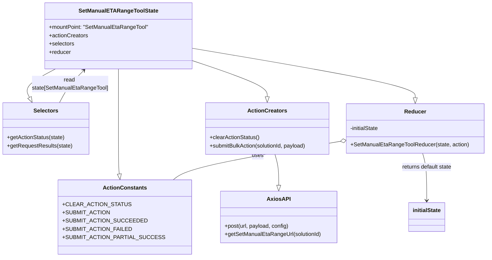

# Diagram: web/portal/src/pages/administration/internal-tools/redux/SetManualETARangeToolState.js


> Auto-generated by Obscura crawlers

## Diagram 1

```mermaid
flowchart TD
  SUBMIT_ACTION[SUBMIT_ACTION dispatched] -->|calls| POST_REQUEST[POST to /entity/solution/:solutionId/manual_eta_range]
  POST_REQUEST -->|response| CHECK_DATA{response.data.status exists or status 204?}
  CHECK_DATA -->|no| THROW_MISSING[Throw Error: "Missing data"]
  CHECK_DATA -->|yes| CHECK_FAILED{response.data.status === "FAILED"?}
  CHECK_FAILED -->|yes and failed_data missing| THROW_MISSING2[Throw Error: "Missing data"]
  CHECK_FAILED -->|yes and failed_data present| DISPATCH_PARTIAL[Dispatch SUBMIT_ACTION_PARTIAL_SUCCESS with failed_data]
  CHECK_FAILED -->|no| DISPATCH_SUCCESS[Dispatch SUBMIT_ACTION_SUCCEEDED]
  POST_REQUEST -->|error| CATCH_ERROR[Catch -> console.error -> Dispatch SUBMIT_ACTION_FAILED]
  SUBMIT_ACTION -->|sets| STATE_IN_PROGRESS[State.actionStatus = IN_PROGRESS]
  DISPATCH_SUCCESS -->|sets| STATE_SUCCESS[State.actionStatus = SUCCESS]
  DISPATCH_PARTIAL -->|sets| STATE_PARTIAL[State.actionStatus = PARTIAL_SUCCESS; State.requestResults = failed_data]
  CATCH_ERROR -->|sets| STATE_FAILED[State.actionStatus = FAILED]
  CLEAR_ACTION_STATUS[clearActionStatus dispatched] -->|sets| STATE_CLEARED[State.actionStatus = null; State.requestResults = null]
```

> SVG rendering failed for this diagram.

## Diagram 2



### SVG

<svg id="container" width="1382.4609375" xmlns="http://www.w3.org/2000/svg" class="classDiagram" height="746" viewBox="0 0 1382.4609375 746" role="graphics-document document" aria-roledescription="class"><style>#container{font-family:"trebuchet ms",verdana,arial,sans-serif;font-size:16px;fill:#333;}@keyframes edge-animation-frame{from{stroke-dashoffset:0;}}@keyframes dash{to{stroke-dashoffset:0;}}#container .edge-animation-slow{stroke-dasharray:9,5!important;stroke-dashoffset:900;animation:dash 50s linear infinite;stroke-linecap:round;}#container .edge-animation-fast{stroke-dasharray:9,5!important;stroke-dashoffset:900;animation:dash 20s linear infinite;stroke-linecap:round;}#container .error-icon{fill:#552222;}#container .error-text{fill:#552222;stroke:#552222;}#container .edge-thickness-normal{stroke-width:1px;}#container .edge-thickness-thick{stroke-width:3.5px;}#container .edge-pattern-solid{stroke-dasharray:0;}#container .edge-thickness-invisible{stroke-width:0;fill:none;}#container .edge-pattern-dashed{stroke-dasharray:3;}#container .edge-pattern-dotted{stroke-dasharray:2;}#container .marker{fill:#333333;stroke:#333333;}#container .marker.cross{stroke:#333333;}#container svg{font-family:"trebuchet ms",verdana,arial,sans-serif;font-size:16px;}#container p{margin:0;}#container g.classGroup text{fill:#9370DB;stroke:none;font-family:"trebuchet ms",verdana,arial,sans-serif;font-size:10px;}#container g.classGroup text .title{font-weight:bolder;}#container .nodeLabel,#container .edgeLabel{color:#131300;}#container .edgeLabel .label rect{fill:#ECECFF;}#container .label text{fill:#131300;}#container .labelBkg{background:#ECECFF;}#container .edgeLabel .label span{background:#ECECFF;}#container .classTitle{font-weight:bolder;}#container .node rect,#container .node circle,#container .node ellipse,#container .node polygon,#container .node path{fill:#ECECFF;stroke:#9370DB;stroke-width:1px;}#container .divider{stroke:#9370DB;stroke-width:1;}#container g.clickable{cursor:pointer;}#container g.classGroup rect{fill:#ECECFF;stroke:#9370DB;}#container g.classGroup line{stroke:#9370DB;stroke-width:1;}#container .classLabel .box{stroke:none;stroke-width:0;fill:#ECECFF;opacity:0.5;}#container .classLabel .label{fill:#9370DB;font-size:10px;}#container .relation{stroke:#333333;stroke-width:1;fill:none;}#container .dashed-line{stroke-dasharray:3;}#container .dotted-line{stroke-dasharray:1 2;}#container #compositionStart,#container .composition{fill:#333333!important;stroke:#333333!important;stroke-width:1;}#container #compositionEnd,#container .composition{fill:#333333!important;stroke:#333333!important;stroke-width:1;}#container #dependencyStart,#container .dependency{fill:#333333!important;stroke:#333333!important;stroke-width:1;}#container #dependencyStart,#container .dependency{fill:#333333!important;stroke:#333333!important;stroke-width:1;}#container #extensionStart,#container .extension{fill:transparent!important;stroke:#333333!important;stroke-width:1;}#container #extensionEnd,#container .extension{fill:transparent!important;stroke:#333333!important;stroke-width:1;}#container #aggregationStart,#container .aggregation{fill:transparent!important;stroke:#333333!important;stroke-width:1;}#container #aggregationEnd,#container .aggregation{fill:transparent!important;stroke:#333333!important;stroke-width:1;}#container #lollipopStart,#container .lollipop{fill:#ECECFF!important;stroke:#333333!important;stroke-width:1;}#container #lollipopEnd,#container .lollipop{fill:#ECECFF!important;stroke:#333333!important;stroke-width:1;}#container .edgeTerminals{font-size:11px;line-height:initial;}#container .classTitleText{text-anchor:middle;font-size:18px;fill:#333;}#container .label-icon{display:inline-block;height:1em;overflow:visible;vertical-align:-0.125em;}#container .node .label-icon path{fill:currentColor;stroke:revert;stroke-width:revert;}#container :root{--mermaid-font-family:"trebuchet ms",verdana,arial,sans-serif;}</style><g><defs><marker id="container_class-aggregationStart" class="marker aggregation class" refX="18" refY="7" markerWidth="190" markerHeight="240" orient="auto"><path d="M 18,7 L9,13 L1,7 L9,1 Z"></path></marker></defs><defs><marker id="container_class-aggregationEnd" class="marker aggregation class" refX="1" refY="7" markerWidth="20" markerHeight="28" orient="auto"><path d="M 18,7 L9,13 L1,7 L9,1 Z"></path></marker></defs><defs><marker id="container_class-extensionStart" class="marker extension class" refX="18" refY="7" markerWidth="190" markerHeight="240" orient="auto"><path d="M 1,7 L18,13 V 1 Z"></path></marker></defs><defs><marker id="container_class-extensionEnd" class="marker extension class" refX="1" refY="7" markerWidth="20" markerHeight="28" orient="auto"><path d="M 1,1 V 13 L18,7 Z"></path></marker></defs><defs><marker id="container_class-compositionStart" class="marker composition class" refX="18" refY="7" markerWidth="190" markerHeight="240" orient="auto"><path d="M 18,7 L9,13 L1,7 L9,1 Z"></path></marker></defs><defs><marker id="container_class-compositionEnd" class="marker composition class" refX="1" refY="7" markerWidth="20" markerHeight="28" orient="auto"><path d="M 18,7 L9,13 L1,7 L9,1 Z"></path></marker></defs><defs><marker id="container_class-dependencyStart" class="marker dependency class" refX="6" refY="7" markerWidth="190" markerHeight="240" orient="auto"><path d="M 5,7 L9,13 L1,7 L9,1 Z"></path></marker></defs><defs><marker id="container_class-dependencyEnd" class="marker dependency class" refX="13" refY="7" markerWidth="20" markerHeight="28" orient="auto"><path d="M 18,7 L9,13 L14,7 L9,1 Z"></path></marker></defs><defs><marker id="container_class-lollipopStart" class="marker lollipop class" refX="13" refY="7" markerWidth="190" markerHeight="240" orient="auto"><circle stroke="black" fill="transparent" cx="7" cy="7" r="6"></circle></marker></defs><defs><marker id="container_class-lollipopEnd" class="marker lollipop class" refX="1" refY="7" markerWidth="190" markerHeight="240" orient="auto"><circle stroke="black" fill="transparent" cx="7" cy="7" r="6"></circle></marker></defs><g class="root"><g class="clusters"></g><g class="edgePaths"><path d="M341.113,200L341.113,208.167C341.113,216.333,341.113,232.667,341.113,261.5C341.113,290.333,341.113,331.667,341.113,371C341.113,410.333,341.113,447.667,341.53,469.647C341.947,491.628,342.781,498.257,343.198,501.571L343.616,504.885" id="id_SetManualETARangeToolState_ActionConstants_1" class="edge-thickness-normal edge-pattern-solid relation" style=";;;" data-edge="true" data-et="edge" data-id="id_SetManualETARangeToolState_ActionConstants_1" data-points="W3sieCI6MzQxLjExMzI4MTI1LCJ5IjoyMDB9LHsieCI6MzQxLjExMzI4MTI1LCJ5IjoyNDl9LHsieCI6MzQxLjExMzI4MTI1LCJ5IjozNzN9LHsieCI6MzQxLjExMzI4MTI1LCJ5Ijo0ODV9LHsieCI6MzQ1Ljc2OTE4MTAzNDQ4Mjc2LCJ5Ijo1MjJ9XQ==" marker-end="url(#container_class-extensionEnd)"></path><path d="M551.637,179.04L584.348,190.7C617.06,202.36,682.483,225.68,715.195,242.632C747.906,259.583,747.906,270.167,747.906,275.458L747.906,280.75" id="id_SetManualETARangeToolState_ActionCreators_2" class="edge-thickness-normal edge-pattern-solid relation" style=";;;" data-edge="true" data-et="edge" data-id="id_SetManualETARangeToolState_ActionCreators_2" data-points="W3sieCI6NTUxLjYzNjcxODc1LCJ5IjoxNzkuMDQwMzc4NzI0NTg5MjN9LHsieCI6NzQ3LjkwNjI1LCJ5IjoyNDl9LHsieCI6NzQ3LjkwNjI1LCJ5IjoyOTh9XQ==" marker-end="url(#container_class-extensionEnd)"></path><path d="M159.225,200L143.752,208.167C128.279,216.333,97.333,232.667,84.814,246.455C72.294,260.243,78.202,271.486,81.155,277.108L84.109,282.73" id="id_SetManualETARangeToolState_Selectors_3" class="edge-thickness-normal edge-pattern-solid relation" style=";;;" data-edge="true" data-et="edge" data-id="id_SetManualETARangeToolState_Selectors_3" data-points="W3sieCI6MTU5LjIyNTM1MDIxNTUxNzI0LCJ5IjoyMDB9LHsieCI6NjYuMzg2NzE4NzUsInkiOjI0OX0seyJ4Ijo5Mi4xMzI0MDI5NzM3OTAzMiwieSI6Mjk4fV0=" marker-end="url(#container_class-extensionEnd)"></path><path d="M551.637,140.508L655.907,158.59C760.177,176.672,968.717,212.836,1072.988,236.71C1177.258,260.583,1177.258,272.167,1177.258,277.958L1177.258,283.75" id="id_SetManualETARangeToolState_Reducer_4" class="edge-thickness-normal edge-pattern-solid relation" style=";;;" data-edge="true" data-et="edge" data-id="id_SetManualETARangeToolState_Reducer_4" data-points="W3sieCI6NTUxLjYzNjcxODc1LCJ5IjoxNDAuNTA3OTIwOTM1NDY5MjZ9LHsieCI6MTE3Ny4yNTc4MTI1LCJ5IjoyNDl9LHsieCI6MTE3Ny4yNTc4MTI1LCJ5IjozMDF9XQ==" marker-end="url(#container_class-extensionEnd)"></path><path d="M769.578,448L771.36,454.167C773.142,460.333,776.706,472.667,778.488,487.625C780.27,502.583,780.27,520.167,780.27,528.958L780.27,537.75" id="id_ActionCreators_AxiosAPI_5" class="edge-thickness-normal edge-pattern-solid relation" style=";;;" data-edge="true" data-et="edge" data-id="id_ActionCreators_AxiosAPI_5" data-points="W3sieCI6NzY5LjU3ODA5MDEyMjc2NzksInkiOjQ0OH0seyJ4Ijo3ODAuMjY5NTMxMjUsInkiOjQ4NX0seyJ4Ijo3ODAuMjY5NTMxMjUsInkiOjU1NX1d" marker-end="url(#container_class-extensionEnd)"></path><path d="M963.061,410.375L891.782,422.813C820.503,435.25,677.945,460.125,599.18,478.729C520.414,497.333,505.442,509.667,497.956,515.833L490.469,522" id="id_Reducer_ActionConstants_6" class="edge-thickness-normal edge-pattern-solid relation" style=";;;" data-edge="true" data-et="edge" data-id="id_Reducer_ActionConstants_6" data-points="W3sieCI6OTgwLjA1NDY4NzUsInkiOjQwNy40MDk5NDY1MDY0OTA0fSx7IngiOjUzNS4zODY3MTg3NSwieSI6NDg1fSx7IngiOjQ5MC40NjkzOTY1NTE3MjQxLCJ5Ijo1MjJ9XQ==" marker-start="url(#container_class-aggregationStart)"></path><path d="M1198.063,445L1199.989,451.667C1201.916,458.333,1205.768,471.667,1207.695,494.5C1209.621,517.333,1209.621,549.667,1209.621,565.833L1209.621,582" id="id_Reducer_initialState_7" class="edge-thickness-normal edge-pattern-solid relation" style=";;;" data-edge="true" data-et="edge" data-id="id_Reducer_initialState_7" data-points="W3sieCI6MTE5OC4wNjI3NzkwMTc4NTcsInkiOjQ0NX0seyJ4IjoxMjA5LjYyMTA5Mzc1LCJ5Ijo0ODV9LHsieCI6MTIwOS42MjEwOTM3NSwieSI6NTg4fV0=" marker-end="url(#container_class-dependencyEnd)"></path><path d="M170.946,298L175.237,289.833C179.528,281.667,188.11,265.333,199.829,249.709C211.548,234.084,226.405,219.167,233.833,211.709L241.262,204.251" id="id_Selectors_SetManualETARangeToolState_8" class="edge-thickness-normal edge-pattern-solid relation" style=";;;" data-edge="true" data-et="edge" data-id="id_Selectors_SetManualETARangeToolState_8" data-points="W3sieCI6MTcwLjk0NTcyMjAyNjIwOTcsInkiOjI5OH0seyJ4IjoxOTYuNjkxNDA2MjUsInkiOjI0OX0seyJ4IjoyNDUuNDk2MDM5ODcwNjg5NjYsInkiOjIwMH1d" marker-end="url(#container_class-dependencyEnd)"></path></g><g class="edgeLabels"><g class="edgeLabel"><g class="label" data-id="id_SetManualETARangeToolState_ActionConstants_1" transform="translate(0, 0)"><foreignObject width="0" height="0"><div xmlns="http://www.w3.org/1999/xhtml" class="labelBkg" style="display: table-cell; white-space: nowrap; line-height: 1.5; max-width: 200px; text-align: center;"><span class="edgeLabel"></span></div></foreignObject></g></g><g class="edgeLabel"><g class="label" data-id="id_SetManualETARangeToolState_ActionCreators_2" transform="translate(0, 0)"><foreignObject width="0" height="0"><div xmlns="http://www.w3.org/1999/xhtml" class="labelBkg" style="display: table-cell; white-space: nowrap; line-height: 1.5; max-width: 200px; text-align: center;"><span class="edgeLabel"></span></div></foreignObject></g></g><g class="edgeLabel"><g class="label" data-id="id_SetManualETARangeToolState_Selectors_3" transform="translate(0, 0)"><foreignObject width="0" height="0"><div xmlns="http://www.w3.org/1999/xhtml" class="labelBkg" style="display: table-cell; white-space: nowrap; line-height: 1.5; max-width: 200px; text-align: center;"><span class="edgeLabel"></span></div></foreignObject></g></g><g class="edgeLabel"><g class="label" data-id="id_SetManualETARangeToolState_Reducer_4" transform="translate(0, 0)"><foreignObject width="0" height="0"><div xmlns="http://www.w3.org/1999/xhtml" class="labelBkg" style="display: table-cell; white-space: nowrap; line-height: 1.5; max-width: 200px; text-align: center;"><span class="edgeLabel"></span></div></foreignObject></g></g><g class="edgeLabel"><g class="label" data-id="id_ActionCreators_AxiosAPI_5" transform="translate(0, 0)"><foreignObject width="0" height="0"><div xmlns="http://www.w3.org/1999/xhtml" class="labelBkg" style="display: table-cell; white-space: nowrap; line-height: 1.5; max-width: 200px; text-align: center;"><span class="edgeLabel"></span></div></foreignObject></g></g><g class="edgeLabel" transform="translate(729.05669, 451.20655)"><g class="label" data-id="id_Reducer_ActionConstants_6" transform="translate(-16.4921875, -12)"><foreignObject width="32.984375" height="24"><div xmlns="http://www.w3.org/1999/xhtml" class="labelBkg" style="display: table-cell; white-space: nowrap; line-height: 1.5; max-width: 200px; text-align: center;"><span class="edgeLabel"><p>uses</p></span></div></foreignObject></g></g><g class="edgeLabel" transform="translate(1209.62109375, 485)"><g class="label" data-id="id_Reducer_initialState_7" transform="translate(-74.4453125, -12)"><foreignObject width="148.890625" height="24"><div xmlns="http://www.w3.org/1999/xhtml" class="labelBkg" style="display: table-cell; white-space: nowrap; line-height: 1.5; max-width: 200px; text-align: center;"><span class="edgeLabel"><p>returns default state</p></span></div></foreignObject></g></g><g class="edgeLabel" transform="translate(201.56298, 244.10893)"><g class="label" data-id="id_Selectors_SetManualETARangeToolState_8" transform="translate(-110.3046875, -24)"><foreignObject width="220.609375" height="48"><div xmlns="http://www.w3.org/1999/xhtml" class="labelBkg" style="display: table; white-space: break-spaces; line-height: 1.5; max-width: 200px; text-align: center; width: 200px;"><span class="edgeLabel"><p>read state[SetManualEtaRangeTool]</p></span></div></foreignObject></g></g><g class="edgeTerminals" transform="translate(508.5138390140422, 517.4512473739699)"><g class="inner" transform="translate(0, 0)"></g><foreignObject style="width: 9px; height: 12px;"><div xmlns="http://www.w3.org/1999/xhtml" style="display: inline-block; padding-right: 1px; white-space: nowrap;"><span class="edgeLabel">1</span></div></foreignObject></g></g><g class="nodes"><g class="node default" id="classId-SetManualETARangeToolState-0" transform="translate(341.11328125, 104)"><g class="basic label-container"><path d="M-210.5234375 -96 L210.5234375 -96 L210.5234375 96 L-210.5234375 96" stroke="none" stroke-width="0" fill="#ECECFF" style=""></path><path d="M-210.5234375 -96 C-64.77653834859356 -96, 80.97036080281288 -96, 210.5234375 -96 M-210.5234375 -96 C-49.13468518684806 -96, 112.25406712630388 -96, 210.5234375 -96 M210.5234375 -96 C210.5234375 -50.97971322129911, 210.5234375 -5.959426442598215, 210.5234375 96 M210.5234375 -96 C210.5234375 -44.85354573880164, 210.5234375 6.292908522396715, 210.5234375 96 M210.5234375 96 C104.97801186141406 96, -0.567413777171879 96, -210.5234375 96 M210.5234375 96 C84.78320653012265 96, -40.95702443975469 96, -210.5234375 96 M-210.5234375 96 C-210.5234375 40.96509305011876, -210.5234375 -14.06981389976248, -210.5234375 -96 M-210.5234375 96 C-210.5234375 56.2142613430632, -210.5234375 16.4285226861264, -210.5234375 -96" stroke="#9370DB" stroke-width="1.3" fill="none" stroke-dasharray="0 0" style=""></path></g><g class="annotation-group text" transform="translate(0, -72)"></g><g class="label-group text" transform="translate(-108.890625, -72)"><g class="label" style="font-weight: bolder" transform="translate(0,-12)"><foreignObject width="217.78125" height="24"><div xmlns="http://www.w3.org/1999/xhtml" style="display: table-cell; white-space: nowrap; line-height: 1.5; max-width: 264px; text-align: center;"><span class="nodeLabel markdown-node-label" style=""><p>SetManualETARangeToolState</p></span></div></foreignObject></g></g><g class="members-group text" transform="translate(-198.5234375, -24)"><g class="label" style="" transform="translate(0,-12)"><foreignObject width="288.15625" height="24"><div xmlns="http://www.w3.org/1999/xhtml" style="display: table-cell; white-space: nowrap; line-height: 1.5; max-width: 346px; text-align: center;"><span class="nodeLabel markdown-node-label" style=""><p>+mountPoint: "SetManualEtaRangeTool"</p></span></div></foreignObject></g><g class="label" style="" transform="translate(0,12)"><foreignObject width="113.078125" height="24"><div xmlns="http://www.w3.org/1999/xhtml" style="display: table-cell; white-space: nowrap; line-height: 1.5; max-width: 170px; text-align: center;"><span class="nodeLabel markdown-node-label" style=""><p>+actionCreators</p></span></div></foreignObject></g><g class="label" style="" transform="translate(0,36)"><foreignObject width="73.453125" height="24"><div xmlns="http://www.w3.org/1999/xhtml" style="display: table-cell; white-space: nowrap; line-height: 1.5; max-width: 131px; text-align: center;"><span class="nodeLabel markdown-node-label" style=""><p>+selectors</p></span></div></foreignObject></g><g class="label" style="" transform="translate(0,60)"><foreignObject width="63.515625" height="24"><div xmlns="http://www.w3.org/1999/xhtml" style="display: table-cell; white-space: nowrap; line-height: 1.5; max-width: 122px; text-align: center;"><span class="nodeLabel markdown-node-label" style=""><p>+reducer</p></span></div></foreignObject></g></g><g class="methods-group text" transform="translate(-198.5234375, 96)"></g><g class="divider" style=""><path d="M-210.5234375 -48 C-100.60459746727346 -48, 9.314242565453071 -48, 210.5234375 -48 M-210.5234375 -48 C-42.66900177450577 -48, 125.18543395098845 -48, 210.5234375 -48" stroke="#9370DB" stroke-width="1.3" fill="none" stroke-dasharray="0 0" style=""></path></g><g class="divider" style=""><path d="M-210.5234375 72 C-82.12562947649019 72, 46.27217854701962 72, 210.5234375 72 M-210.5234375 72 C-108.40453122099976 72, -6.285624941999515 72, 210.5234375 72" stroke="#9370DB" stroke-width="1.3" fill="none" stroke-dasharray="0 0" style=""></path></g></g><g class="node default" id="classId-ActionConstants-1" transform="translate(359.359375, 630)"><g class="basic label-container"><path d="M-170.87890625 -108 L170.87890625 -108 L170.87890625 108 L-170.87890625 108" stroke="none" stroke-width="0" fill="#ECECFF" style=""></path><path d="M-170.87890625 -108 C-93.12618023420949 -108, -15.37345421841897 -108, 170.87890625 -108 M-170.87890625 -108 C-92.12636706837472 -108, -13.373827886749439 -108, 170.87890625 -108 M170.87890625 -108 C170.87890625 -28.255444780910352, 170.87890625 51.489110438179296, 170.87890625 108 M170.87890625 -108 C170.87890625 -48.7367094466451, 170.87890625 10.526581106709799, 170.87890625 108 M170.87890625 108 C41.41584759369641 108, -88.04721106260718 108, -170.87890625 108 M170.87890625 108 C59.87404650239867 108, -51.13081324520266 108, -170.87890625 108 M-170.87890625 108 C-170.87890625 37.405926131723575, -170.87890625 -33.18814773655285, -170.87890625 -108 M-170.87890625 108 C-170.87890625 39.368163419493044, -170.87890625 -29.263673161013912, -170.87890625 -108" stroke="#9370DB" stroke-width="1.3" fill="none" stroke-dasharray="0 0" style=""></path></g><g class="annotation-group text" transform="translate(0, -84)"></g><g class="label-group text" transform="translate(-59.7265625, -84)"><g class="label" style="font-weight: bolder" transform="translate(0,-12)"><foreignObject width="119.453125" height="24"><div xmlns="http://www.w3.org/1999/xhtml" style="display: table-cell; white-space: nowrap; line-height: 1.5; max-width: 168px; text-align: center;"><span class="nodeLabel markdown-node-label" style=""><p>ActionConstants</p></span></div></foreignObject></g></g><g class="members-group text" transform="translate(-158.87890625, -36)"><g class="label" style="" transform="translate(0,-12)"><foreignObject width="173.125" height="24"><div xmlns="http://www.w3.org/1999/xhtml" style="display: table-cell; white-space: nowrap; line-height: 1.5; max-width: 231px; text-align: center;"><span class="nodeLabel markdown-node-label" style=""><p>+CLEAR_ACTION_STATUS</p></span></div></foreignObject></g><g class="label" style="" transform="translate(0,12)"><foreignObject width="122.15625" height="24"><div xmlns="http://www.w3.org/1999/xhtml" style="display: table-cell; white-space: nowrap; line-height: 1.5; max-width: 180px; text-align: center;"><span class="nodeLabel markdown-node-label" style=""><p>+SUBMIT_ACTION</p></span></div></foreignObject></g><g class="label" style="" transform="translate(0,36)"><foreignObject width="213.359375" height="24"><div xmlns="http://www.w3.org/1999/xhtml" style="display: table-cell; white-space: nowrap; line-height: 1.5; max-width: 271px; text-align: center;"><span class="nodeLabel markdown-node-label" style=""><p>+SUBMIT_ACTION_SUCCEEDED</p></span></div></foreignObject></g><g class="label" style="" transform="translate(0,60)"><foreignObject width="178.25" height="24"><div xmlns="http://www.w3.org/1999/xhtml" style="display: table-cell; white-space: nowrap; line-height: 1.5; max-width: 236px; text-align: center;"><span class="nodeLabel markdown-node-label" style=""><p>+SUBMIT_ACTION_FAILED</p></span></div></foreignObject></g><g class="label" style="" transform="translate(0,84)"><foreignObject width="258.03125" height="24"><div xmlns="http://www.w3.org/1999/xhtml" style="display: table-cell; white-space: nowrap; line-height: 1.5; max-width: 316px; text-align: center;"><span class="nodeLabel markdown-node-label" style=""><p>+SUBMIT_ACTION_PARTIAL_SUCCESS</p></span></div></foreignObject></g></g><g class="methods-group text" transform="translate(-158.87890625, 108)"></g><g class="divider" style=""><path d="M-170.87890625 -60 C-52.171572118498034 -60, 66.53576201300393 -60, 170.87890625 -60 M-170.87890625 -60 C-86.39055933838833 -60, -1.9022124267766571 -60, 170.87890625 -60" stroke="#9370DB" stroke-width="1.3" fill="none" stroke-dasharray="0 0" style=""></path></g><g class="divider" style=""><path d="M-170.87890625 84 C-69.72341275222462 84, 31.432080745550763 84, 170.87890625 84 M-170.87890625 84 C-74.62120543192268 84, 21.63649538615465 84, 170.87890625 84" stroke="#9370DB" stroke-width="1.3" fill="none" stroke-dasharray="0 0" style=""></path></g></g><g class="node default" id="classId-Selectors-2" transform="translate(131.5390625, 373)"><g class="basic label-container"><path d="M-123.5390625 -75 L123.5390625 -75 L123.5390625 75 L-123.5390625 75" stroke="none" stroke-width="0" fill="#ECECFF" style=""></path><path d="M-123.5390625 -75 C-68.2827906723268 -75, -13.026518844653594 -75, 123.5390625 -75 M-123.5390625 -75 C-38.95855738931493 -75, 45.621947721370134 -75, 123.5390625 -75 M123.5390625 -75 C123.5390625 -18.948244784428653, 123.5390625 37.103510431142695, 123.5390625 75 M123.5390625 -75 C123.5390625 -37.05083504392857, 123.5390625 0.8983299121428558, 123.5390625 75 M123.5390625 75 C73.26229250688476 75, 22.98552251376951 75, -123.5390625 75 M123.5390625 75 C32.07399644814984 75, -59.391069603700316 75, -123.5390625 75 M-123.5390625 75 C-123.5390625 21.19644334195314, -123.5390625 -32.60711331609372, -123.5390625 -75 M-123.5390625 75 C-123.5390625 32.26203330245883, -123.5390625 -10.475933395082336, -123.5390625 -75" stroke="#9370DB" stroke-width="1.3" fill="none" stroke-dasharray="0 0" style=""></path></g><g class="annotation-group text" transform="translate(0, -51)"></g><g class="label-group text" transform="translate(-34.171875, -51)"><g class="label" style="font-weight: bolder" transform="translate(0,-12)"><foreignObject width="68.34375" height="24"><div xmlns="http://www.w3.org/1999/xhtml" style="display: table-cell; white-space: nowrap; line-height: 1.5; max-width: 117px; text-align: center;"><span class="nodeLabel markdown-node-label" style=""><p>Selectors</p></span></div></foreignObject></g></g><g class="members-group text" transform="translate(-111.5390625, -3)"></g><g class="methods-group text" transform="translate(-111.5390625, 27)"><g class="label" style="" transform="translate(0,-12)"><foreignObject width="168.484375" height="24"><div xmlns="http://www.w3.org/1999/xhtml" style="display: table-cell; white-space: nowrap; line-height: 1.5; max-width: 226px; text-align: center;"><span class="nodeLabel markdown-node-label" style=""><p>+getActionStatus(state)</p></span></div></foreignObject></g><g class="label" style="" transform="translate(0,12)"><foreignObject width="188.90625" height="24"><div xmlns="http://www.w3.org/1999/xhtml" style="display: table-cell; white-space: nowrap; line-height: 1.5; max-width: 246px; text-align: center;"><span class="nodeLabel markdown-node-label" style=""><p>+getRequestResults(state)</p></span></div></foreignObject></g></g><g class="divider" style=""><path d="M-123.5390625 -27 C-28.536595492050367 -27, 66.46587151589927 -27, 123.5390625 -27 M-123.5390625 -27 C-46.96359791835242 -27, 29.61186666329516 -27, 123.5390625 -27" stroke="#9370DB" stroke-width="1.3" fill="none" stroke-dasharray="0 0" style=""></path></g><g class="divider" style=""><path d="M-123.5390625 -3 C-51.505331590554164 -3, 20.528399318891672 -3, 123.5390625 -3 M-123.5390625 -3 C-26.32489377825621 -3, 70.88927494348758 -3, 123.5390625 -3" stroke="#9370DB" stroke-width="1.3" fill="none" stroke-dasharray="0 0" style=""></path></g></g><g class="node default" id="classId-ActionCreators-3" transform="translate(747.90625, 373)"><g class="basic label-container"><path d="M-182.1484375 -75 L182.1484375 -75 L182.1484375 75 L-182.1484375 75" stroke="none" stroke-width="0" fill="#ECECFF" style=""></path><path d="M-182.1484375 -75 C-83.82877179418765 -75, 14.49089391162471 -75, 182.1484375 -75 M-182.1484375 -75 C-106.66420476040928 -75, -31.179972020818553 -75, 182.1484375 -75 M182.1484375 -75 C182.1484375 -42.37760366488984, 182.1484375 -9.75520732977968, 182.1484375 75 M182.1484375 -75 C182.1484375 -37.42433807199318, 182.1484375 0.15132385601363296, 182.1484375 75 M182.1484375 75 C53.61953021490493 75, -74.90937707019015 75, -182.1484375 75 M182.1484375 75 C101.57327598657932 75, 20.998114473158637 75, -182.1484375 75 M-182.1484375 75 C-182.1484375 31.390479660048385, -182.1484375 -12.21904067990323, -182.1484375 -75 M-182.1484375 75 C-182.1484375 36.16677760415185, -182.1484375 -2.666444791696307, -182.1484375 -75" stroke="#9370DB" stroke-width="1.3" fill="none" stroke-dasharray="0 0" style=""></path></g><g class="annotation-group text" transform="translate(0, -51)"></g><g class="label-group text" transform="translate(-53.96875, -51)"><g class="label" style="font-weight: bolder" transform="translate(0,-12)"><foreignObject width="107.9375" height="24"><div xmlns="http://www.w3.org/1999/xhtml" style="display: table-cell; white-space: nowrap; line-height: 1.5; max-width: 156px; text-align: center;"><span class="nodeLabel markdown-node-label" style=""><p>ActionCreators</p></span></div></foreignObject></g></g><g class="members-group text" transform="translate(-170.1484375, -3)"></g><g class="methods-group text" transform="translate(-170.1484375, 27)"><g class="label" style="" transform="translate(0,-12)"><foreignObject width="145.53125" height="24"><div xmlns="http://www.w3.org/1999/xhtml" style="display: table-cell; white-space: nowrap; line-height: 1.5; max-width: 203px; text-align: center;"><span class="nodeLabel markdown-node-label" style=""><p>+clearActionStatus()</p></span></div></foreignObject></g><g class="label" style="" transform="translate(0,12)"><foreignObject width="286.328125" height="24"><div xmlns="http://www.w3.org/1999/xhtml" style="display: table-cell; white-space: nowrap; line-height: 1.5; max-width: 344px; text-align: center;"><span class="nodeLabel markdown-node-label" style=""><p>+submitBulkAction(solutionId, payload)</p></span></div></foreignObject></g></g><g class="divider" style=""><path d="M-182.1484375 -27 C-52.633553960785974 -27, 76.88132957842805 -27, 182.1484375 -27 M-182.1484375 -27 C-51.85011441613818 -27, 78.44820866772363 -27, 182.1484375 -27" stroke="#9370DB" stroke-width="1.3" fill="none" stroke-dasharray="0 0" style=""></path></g><g class="divider" style=""><path d="M-182.1484375 -3 C-82.02740048940038 -3, 18.093636521199244 -3, 182.1484375 -3 M-182.1484375 -3 C-94.82981345976391 -3, -7.511189419527824 -3, 182.1484375 -3" stroke="#9370DB" stroke-width="1.3" fill="none" stroke-dasharray="0 0" style=""></path></g></g><g class="node default" id="classId-Reducer-4" transform="translate(1177.2578125, 373)"><g class="basic label-container"><path d="M-197.203125 -72 L197.203125 -72 L197.203125 72 L-197.203125 72" stroke="none" stroke-width="0" fill="#ECECFF" style=""></path><path d="M-197.203125 -72 C-69.65115409907443 -72, 57.900816801851136 -72, 197.203125 -72 M-197.203125 -72 C-109.65571279853884 -72, -22.108300597077687 -72, 197.203125 -72 M197.203125 -72 C197.203125 -22.7893375314287, 197.203125 26.4213249371426, 197.203125 72 M197.203125 -72 C197.203125 -27.17011788772686, 197.203125 17.65976422454628, 197.203125 72 M197.203125 72 C75.52952577006945 72, -46.14407345986109 72, -197.203125 72 M197.203125 72 C100.6792100271012 72, 4.155295054202412 72, -197.203125 72 M-197.203125 72 C-197.203125 19.683680135754514, -197.203125 -32.63263972849097, -197.203125 -72 M-197.203125 72 C-197.203125 22.07815190285359, -197.203125 -27.843696194292818, -197.203125 -72" stroke="#9370DB" stroke-width="1.3" fill="none" stroke-dasharray="0 0" style=""></path></g><g class="annotation-group text" transform="translate(0, -48)"></g><g class="label-group text" transform="translate(-29.90625, -48)"><g class="label" style="font-weight: bolder" transform="translate(0,-12)"><foreignObject width="59.8125" height="24"><div xmlns="http://www.w3.org/1999/xhtml" style="display: table-cell; white-space: nowrap; line-height: 1.5; max-width: 110px; text-align: center;"><span class="nodeLabel markdown-node-label" style=""><p>Reducer</p></span></div></foreignObject></g></g><g class="members-group text" transform="translate(-185.203125, 0)"><g class="label" style="" transform="translate(0,-12)"><foreignObject width="85.71875" height="24"><div xmlns="http://www.w3.org/1999/xhtml" style="display: table-cell; white-space: nowrap; line-height: 1.5; max-width: 143px; text-align: center;"><span class="nodeLabel markdown-node-label" style=""><p>-initialState</p></span></div></foreignObject></g></g><g class="methods-group text" transform="translate(-185.203125, 48)"><g class="label" style="" transform="translate(0,-12)"><foreignObject width="340.5" height="24"><div xmlns="http://www.w3.org/1999/xhtml" style="display: table-cell; white-space: nowrap; line-height: 1.5; max-width: 398px; text-align: center;"><span class="nodeLabel markdown-node-label" style=""><p>+SetManualEtaRangeToolReducer(state, action)</p></span></div></foreignObject></g></g><g class="divider" style=""><path d="M-197.203125 -24 C-79.01732363827685 -24, 39.1684777234463 -24, 197.203125 -24 M-197.203125 -24 C-45.171323509596704 -24, 106.86047798080659 -24, 197.203125 -24" stroke="#9370DB" stroke-width="1.3" fill="none" stroke-dasharray="0 0" style=""></path></g><g class="divider" style=""><path d="M-197.203125 24 C-114.00164153584241 24, -30.80015807168482 24, 197.203125 24 M-197.203125 24 C-74.09752869395041 24, 49.00806761209918 24, 197.203125 24" stroke="#9370DB" stroke-width="1.3" fill="none" stroke-dasharray="0 0" style=""></path></g></g><g class="node default" id="classId-AxiosAPI-5" transform="translate(780.26953125, 630)"><g class="basic label-container"><path d="M-167.66796875 -75 L167.66796875 -75 L167.66796875 75 L-167.66796875 75" stroke="none" stroke-width="0" fill="#ECECFF" style=""></path><path d="M-167.66796875 -75 C-100.47866001164185 -75, -33.2893512732837 -75, 167.66796875 -75 M-167.66796875 -75 C-87.18881695937567 -75, -6.709665168751343 -75, 167.66796875 -75 M167.66796875 -75 C167.66796875 -16.74664661986627, 167.66796875 41.50670676026746, 167.66796875 75 M167.66796875 -75 C167.66796875 -41.4250397569446, 167.66796875 -7.850079513889199, 167.66796875 75 M167.66796875 75 C91.75231865545348 75, 15.836668560906958 75, -167.66796875 75 M167.66796875 75 C57.66596214078183 75, -52.33604446843634 75, -167.66796875 75 M-167.66796875 75 C-167.66796875 33.83592343397748, -167.66796875 -7.3281531320450455, -167.66796875 -75 M-167.66796875 75 C-167.66796875 24.081032716774175, -167.66796875 -26.83793456645165, -167.66796875 -75" stroke="#9370DB" stroke-width="1.3" fill="none" stroke-dasharray="0 0" style=""></path></g><g class="annotation-group text" transform="translate(0, -51)"></g><g class="label-group text" transform="translate(-31.4765625, -51)"><g class="label" style="font-weight: bolder" transform="translate(0,-12)"><foreignObject width="62.953125" height="24"><div xmlns="http://www.w3.org/1999/xhtml" style="display: table-cell; white-space: nowrap; line-height: 1.5; max-width: 111px; text-align: center;"><span class="nodeLabel markdown-node-label" style=""><p>AxiosAPI</p></span></div></foreignObject></g></g><g class="members-group text" transform="translate(-155.66796875, -3)"></g><g class="methods-group text" transform="translate(-155.66796875, 27)"><g class="label" style="" transform="translate(0,-12)"><foreignObject width="188.171875" height="24"><div xmlns="http://www.w3.org/1999/xhtml" style="display: table-cell; white-space: nowrap; line-height: 1.5; max-width: 246px; text-align: center;"><span class="nodeLabel markdown-node-label" style=""><p>+post(url, payload, config)</p></span></div></foreignObject></g><g class="label" style="" transform="translate(0,12)"><foreignObject width="279.859375" height="24"><div xmlns="http://www.w3.org/1999/xhtml" style="display: table-cell; white-space: nowrap; line-height: 1.5; max-width: 337px; text-align: center;"><span class="nodeLabel markdown-node-label" style=""><p>+getSetManualEtaRangeUrl(solutionId)</p></span></div></foreignObject></g></g><g class="divider" style=""><path d="M-167.66796875 -27 C-61.02850958497501 -27, 45.610949580049976 -27, 167.66796875 -27 M-167.66796875 -27 C-90.93203403493439 -27, -14.196099319868779 -27, 167.66796875 -27" stroke="#9370DB" stroke-width="1.3" fill="none" stroke-dasharray="0 0" style=""></path></g><g class="divider" style=""><path d="M-167.66796875 -3 C-95.8959385229432 -3, -24.123908295886395 -3, 167.66796875 -3 M-167.66796875 -3 C-69.59654286055101 -3, 28.474883028897978 -3, 167.66796875 -3" stroke="#9370DB" stroke-width="1.3" fill="none" stroke-dasharray="0 0" style=""></path></g></g><g class="node default" id="classId-initialState-6" transform="translate(1209.62109375, 630)"><g class="basic label-container"><path d="M-52.46875 -42 L52.46875 -42 L52.46875 42 L-52.46875 42" stroke="none" stroke-width="0" fill="#ECECFF" style=""></path><path d="M-52.46875 -42 C-28.88722808694879 -42, -5.305706173897583 -42, 52.46875 -42 M-52.46875 -42 C-19.69930777458955 -42, 13.070134450820902 -42, 52.46875 -42 M52.46875 -42 C52.46875 -11.942727621112034, 52.46875 18.11454475777593, 52.46875 42 M52.46875 -42 C52.46875 -8.486520187314525, 52.46875 25.02695962537095, 52.46875 42 M52.46875 42 C18.178099205252714 42, -16.112551589494572 42, -52.46875 42 M52.46875 42 C26.57091552237922 42, 0.6730810447584403 42, -52.46875 42 M-52.46875 42 C-52.46875 18.491296549182398, -52.46875 -5.017406901635205, -52.46875 -42 M-52.46875 42 C-52.46875 13.958790706993444, -52.46875 -14.082418586013112, -52.46875 -42" stroke="#9370DB" stroke-width="1.3" fill="none" stroke-dasharray="0 0" style=""></path></g><g class="annotation-group text" transform="translate(0, -18)"></g><g class="label-group text" transform="translate(-40.46875, -18)"><g class="label" style="font-weight: bolder" transform="translate(0,-12)"><foreignObject width="80.9375" height="24"><div xmlns="http://www.w3.org/1999/xhtml" style="display: table-cell; white-space: nowrap; line-height: 1.5; max-width: 129px; text-align: center;"><span class="nodeLabel markdown-node-label" style=""><p>initialState</p></span></div></foreignObject></g></g><g class="members-group text" transform="translate(-40.46875, 30)"></g><g class="methods-group text" transform="translate(-40.46875, 60)"></g><g class="divider" style=""><path d="M-52.46875 6 C-30.07947713188316 6, -7.690204263766319 6, 52.46875 6 M-52.46875 6 C-23.184027858784553 6, 6.100694282430894 6, 52.46875 6" stroke="#9370DB" stroke-width="1.3" fill="none" stroke-dasharray="0 0" style=""></path></g><g class="divider" style=""><path d="M-52.46875 24 C-25.47595956431678 24, 1.5168308713664373 24, 52.46875 24 M-52.46875 24 C-15.670247383706162 24, 21.128255232587676 24, 52.46875 24" stroke="#9370DB" stroke-width="1.3" fill="none" stroke-dasharray="0 0" style=""></path></g></g></g></g></g></svg>
