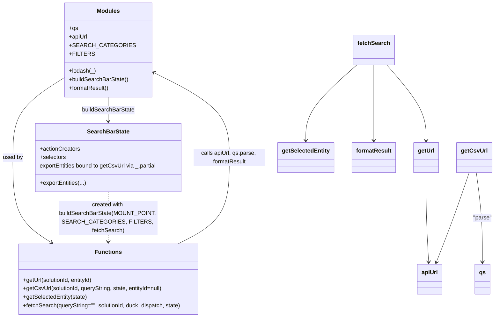

# Diagram: web/portal/src/pages/administration/internal-tools/redux/VinEtaValidatorSearchBarState.js


> Auto-generated by Obscura crawlers

## Diagram 1



### SVG

<svg id="container" width="1380.98828125" xmlns="http://www.w3.org/2000/svg" class="classDiagram" height="890" viewBox="0 0 1380.98828125 890" role="graphics-document document" aria-roledescription="class"><style>#container{font-family:"trebuchet ms",verdana,arial,sans-serif;font-size:16px;fill:#333;}@keyframes edge-animation-frame{from{stroke-dashoffset:0;}}@keyframes dash{to{stroke-dashoffset:0;}}#container .edge-animation-slow{stroke-dasharray:9,5!important;stroke-dashoffset:900;animation:dash 50s linear infinite;stroke-linecap:round;}#container .edge-animation-fast{stroke-dasharray:9,5!important;stroke-dashoffset:900;animation:dash 20s linear infinite;stroke-linecap:round;}#container .error-icon{fill:#552222;}#container .error-text{fill:#552222;stroke:#552222;}#container .edge-thickness-normal{stroke-width:1px;}#container .edge-thickness-thick{stroke-width:3.5px;}#container .edge-pattern-solid{stroke-dasharray:0;}#container .edge-thickness-invisible{stroke-width:0;fill:none;}#container .edge-pattern-dashed{stroke-dasharray:3;}#container .edge-pattern-dotted{stroke-dasharray:2;}#container .marker{fill:#333333;stroke:#333333;}#container .marker.cross{stroke:#333333;}#container svg{font-family:"trebuchet ms",verdana,arial,sans-serif;font-size:16px;}#container p{margin:0;}#container g.classGroup text{fill:#9370DB;stroke:none;font-family:"trebuchet ms",verdana,arial,sans-serif;font-size:10px;}#container g.classGroup text .title{font-weight:bolder;}#container .nodeLabel,#container .edgeLabel{color:#131300;}#container .edgeLabel .label rect{fill:#ECECFF;}#container .label text{fill:#131300;}#container .labelBkg{background:#ECECFF;}#container .edgeLabel .label span{background:#ECECFF;}#container .classTitle{font-weight:bolder;}#container .node rect,#container .node circle,#container .node ellipse,#container .node polygon,#container .node path{fill:#ECECFF;stroke:#9370DB;stroke-width:1px;}#container .divider{stroke:#9370DB;stroke-width:1;}#container g.clickable{cursor:pointer;}#container g.classGroup rect{fill:#ECECFF;stroke:#9370DB;}#container g.classGroup line{stroke:#9370DB;stroke-width:1;}#container .classLabel .box{stroke:none;stroke-width:0;fill:#ECECFF;opacity:0.5;}#container .classLabel .label{fill:#9370DB;font-size:10px;}#container .relation{stroke:#333333;stroke-width:1;fill:none;}#container .dashed-line{stroke-dasharray:3;}#container .dotted-line{stroke-dasharray:1 2;}#container #compositionStart,#container .composition{fill:#333333!important;stroke:#333333!important;stroke-width:1;}#container #compositionEnd,#container .composition{fill:#333333!important;stroke:#333333!important;stroke-width:1;}#container #dependencyStart,#container .dependency{fill:#333333!important;stroke:#333333!important;stroke-width:1;}#container #dependencyStart,#container .dependency{fill:#333333!important;stroke:#333333!important;stroke-width:1;}#container #extensionStart,#container .extension{fill:transparent!important;stroke:#333333!important;stroke-width:1;}#container #extensionEnd,#container .extension{fill:transparent!important;stroke:#333333!important;stroke-width:1;}#container #aggregationStart,#container .aggregation{fill:transparent!important;stroke:#333333!important;stroke-width:1;}#container #aggregationEnd,#container .aggregation{fill:transparent!important;stroke:#333333!important;stroke-width:1;}#container #lollipopStart,#container .lollipop{fill:#ECECFF!important;stroke:#333333!important;stroke-width:1;}#container #lollipopEnd,#container .lollipop{fill:#ECECFF!important;stroke:#333333!important;stroke-width:1;}#container .edgeTerminals{font-size:11px;line-height:initial;}#container .classTitleText{text-anchor:middle;font-size:18px;fill:#333;}#container .label-icon{display:inline-block;height:1em;overflow:visible;vertical-align:-0.125em;}#container .node .label-icon path{fill:currentColor;stroke:revert;stroke-width:revert;}#container :root{--mermaid-font-family:"trebuchet ms",verdana,arial,sans-serif;}</style><g><defs><marker id="container_class-aggregationStart" class="marker aggregation class" refX="18" refY="7" markerWidth="190" markerHeight="240" orient="auto"><path d="M 18,7 L9,13 L1,7 L9,1 Z"></path></marker></defs><defs><marker id="container_class-aggregationEnd" class="marker aggregation class" refX="1" refY="7" markerWidth="20" markerHeight="28" orient="auto"><path d="M 18,7 L9,13 L1,7 L9,1 Z"></path></marker></defs><defs><marker id="container_class-extensionStart" class="marker extension class" refX="18" refY="7" markerWidth="190" markerHeight="240" orient="auto"><path d="M 1,7 L18,13 V 1 Z"></path></marker></defs><defs><marker id="container_class-extensionEnd" class="marker extension class" refX="1" refY="7" markerWidth="20" markerHeight="28" orient="auto"><path d="M 1,1 V 13 L18,7 Z"></path></marker></defs><defs><marker id="container_class-compositionStart" class="marker composition class" refX="18" refY="7" markerWidth="190" markerHeight="240" orient="auto"><path d="M 18,7 L9,13 L1,7 L9,1 Z"></path></marker></defs><defs><marker id="container_class-compositionEnd" class="marker composition class" refX="1" refY="7" markerWidth="20" markerHeight="28" orient="auto"><path d="M 18,7 L9,13 L1,7 L9,1 Z"></path></marker></defs><defs><marker id="container_class-dependencyStart" class="marker dependency class" refX="6" refY="7" markerWidth="190" markerHeight="240" orient="auto"><path d="M 5,7 L9,13 L1,7 L9,1 Z"></path></marker></defs><defs><marker id="container_class-dependencyEnd" class="marker dependency class" refX="13" refY="7" markerWidth="20" markerHeight="28" orient="auto"><path d="M 18,7 L9,13 L14,7 L9,1 Z"></path></marker></defs><defs><marker id="container_class-lollipopStart" class="marker lollipop class" refX="13" refY="7" markerWidth="190" markerHeight="240" orient="auto"><circle stroke="black" fill="transparent" cx="7" cy="7" r="6"></circle></marker></defs><defs><marker id="container_class-lollipopEnd" class="marker lollipop class" refX="1" refY="7" markerWidth="190" markerHeight="240" orient="auto"><circle stroke="black" fill="transparent" cx="7" cy="7" r="6"></circle></marker></defs><g class="root"><g class="clusters"></g><g class="edgePaths"><path d="M196.02,209.198L169.402,225.832C142.784,242.466,89.548,275.733,62.93,314.533C36.313,353.333,36.313,397.667,36.313,448C36.313,498.333,36.313,554.667,54.599,594.463C72.885,634.26,109.458,657.52,127.744,669.15L146.03,680.78" id="id_Modules_Functions_1" class="edge-thickness-normal edge-pattern-solid relation" style=";;;" data-edge="true" data-et="edge" data-id="id_Modules_Functions_1" data-points="W3sieCI6MTk2LjAxOTUzMTI1LCJ5IjoyMDkuMTk4Mzg4MDUxOTQwNTV9LHsieCI6MzYuMzEyNSwieSI6MzA5fSx7IngiOjM2LjMxMjUsInkiOjQ0Mn0seyJ4IjozNi4zMTI1LCJ5Ijo2MTF9LHsieCI6MTUxLjA5Mjg2NDI4MDUyMzI2LCJ5Ijo2ODR9XQ==" marker-end="url(#container_class-dependencyEnd)"></path><path d="M503.677,684L527.878,671.833C552.079,659.667,600.481,635.333,624.682,595C648.883,554.667,648.883,498.333,648.883,448C648.883,397.667,648.883,353.333,611.214,312.559C573.544,271.785,498.206,234.571,460.537,215.964L422.868,197.356" id="id_Functions_Modules_2" class="edge-thickness-normal edge-pattern-solid relation" style=";;;" data-edge="true" data-et="edge" data-id="id_Functions_Modules_2" data-points="W3sieCI6NTAzLjY3NjkzOTQ5ODU0NjUsInkiOjY4NH0seyJ4Ijo2NDguODgyODEyNSwieSI6NjExfSx7IngiOjY0OC44ODI4MTI1LCJ5Ijo0NDJ9LHsieCI6NjQ4Ljg4MjgxMjUsInkiOjMwOX0seyJ4Ijo0MTcuNDg4MjgxMjUsInkiOjE5NC42OTkwMDA5NzA0ODU4M31d" marker-end="url(#container_class-dependencyEnd)"></path><path d="M1191.977,484L1191.977,505.167C1191.977,526.333,1191.977,568.667,1193.178,610.502C1194.38,652.337,1196.783,693.673,1197.985,714.342L1199.186,735.01" id="id_getUrl_apiUrl_3" class="edge-thickness-normal edge-pattern-solid relation" style=";;;" data-edge="true" data-et="edge" data-id="id_getUrl_apiUrl_3" data-points="W3sieCI6MTE5MS45NzY1NjI1LCJ5Ijo0ODR9LHsieCI6MTE5MS45NzY1NjI1LCJ5Ijo2MTF9LHsieCI6MTE5OS41MzQ3MDIwMzQ4ODM4LCJ5Ijo3NDF9XQ==" marker-end="url(#container_class-dependencyEnd)"></path><path d="M1329.156,484L1332.062,505.167C1334.967,526.333,1340.779,568.667,1343.684,610.5C1346.59,652.333,1346.59,693.667,1346.59,714.333L1346.59,735" id="id_getCsvUrl_qs_4" class="edge-thickness-normal edge-pattern-solid relation" style=";;;" data-edge="true" data-et="edge" data-id="id_getCsvUrl_qs_4" data-points="W3sieCI6MTMyOS4xNTYxMTEzMTY1NjgsInkiOjQ4NH0seyJ4IjoxMzQ2LjU4OTg0Mzc1LCJ5Ijo2MTF9LHsieCI6MTM0Ni41ODk4NDM3NSwieSI6NzQxfV0=" marker-end="url(#container_class-dependencyEnd)"></path><path d="M1309.546,484L1302.569,505.167C1295.592,526.333,1281.638,568.667,1266.741,610.566C1251.843,652.465,1236.003,693.93,1228.083,714.663L1220.162,735.395" id="id_getCsvUrl_apiUrl_5" class="edge-thickness-normal edge-pattern-solid relation" style=";;;" data-edge="true" data-et="edge" data-id="id_getCsvUrl_apiUrl_5" data-points="W3sieCI6MTMwOS41NDYyNzQwMzg0NjE0LCJ5Ijo0ODR9LHsieCI6MTI2Ny42ODM1OTM3NSwieSI6NjExfSx7IngiOjEyMTguMDIxMzAyNjg4OTUzNSwieSI6NzQxfV0=" marker-end="url(#container_class-dependencyEnd)"></path><path d="M1083.347,182L1101.452,203.167C1119.557,224.333,1155.767,266.667,1173.872,302C1191.977,337.333,1191.977,365.667,1191.977,379.833L1191.977,394" id="id_fetchSearch_getUrl_6" class="edge-thickness-normal edge-pattern-solid relation" style=";;;" data-edge="true" data-et="edge" data-id="id_fetchSearch_getUrl_6" data-points="W3sieCI6MTA4My4zNDY3MDg1Nzk4ODE2LCJ5IjoxODJ9LHsieCI6MTE5MS45NzY1NjI1LCJ5IjozMDl9LHsieCI6MTE5MS45NzY1NjI1LCJ5Ijo0MDB9XQ==" marker-end="url(#container_class-dependencyEnd)"></path><path d="M1001.003,182L977.609,203.167C954.215,224.333,907.428,266.667,884.034,302C860.641,337.333,860.641,365.667,860.641,379.833L860.641,394" id="id_fetchSearch_getSelectedEntity_7" class="edge-thickness-normal edge-pattern-solid relation" style=";;;" data-edge="true" data-et="edge" data-id="id_fetchSearch_getSelectedEntity_7" data-points="W3sieCI6MTAwMS4wMDI4NjYxMjQyNjAzLCJ5IjoxODJ9LHsieCI6ODYwLjY0MDYyNSwieSI6MzA5fSx7IngiOjg2MC42NDA2MjUsInkiOjQwMH1d" marker-end="url(#container_class-dependencyEnd)"></path><path d="M1047.422,182L1047.422,203.167C1047.422,224.333,1047.422,266.667,1047.422,302C1047.422,337.333,1047.422,365.667,1047.422,379.833L1047.422,394" id="id_fetchSearch_formatResult_8" class="edge-thickness-normal edge-pattern-solid relation" style=";;;" data-edge="true" data-et="edge" data-id="id_fetchSearch_formatResult_8" data-points="W3sieCI6MTA0Ny40MjE4NzUsInkiOjE4Mn0seyJ4IjoxMDQ3LjQyMTg3NSwieSI6MzA5fSx7IngiOjEwNDcuNDIxODc1LCJ5Ijo0MDB9XQ==" marker-end="url(#container_class-dependencyEnd)"></path><path d="M306.754,538L306.754,550.167C306.754,562.333,306.754,586.667,306.754,610C306.754,633.333,306.754,655.667,306.754,666.833L306.754,678" id="id_SearchBarState_Functions_9" class="edge-thickness-normal edge-pattern-dashed relation" style=";;;" data-edge="true" data-et="edge" data-id="id_SearchBarState_Functions_9" data-points="W3sieCI6MzA2Ljc1MzkwNjI1LCJ5Ijo1Mzh9LHsieCI6MzA2Ljc1MzkwNjI1LCJ5Ijo2MTF9LHsieCI6MzA2Ljc1MzkwNjI1LCJ5Ijo2ODR9XQ==" marker-end="url(#container_class-dependencyEnd)"></path><path d="M306.754,272L306.754,278.167C306.754,284.333,306.754,296.667,306.754,308C306.754,319.333,306.754,329.667,306.754,334.833L306.754,340" id="id_Modules_SearchBarState_10" class="edge-thickness-normal edge-pattern-solid relation" style=";;;" data-edge="true" data-et="edge" data-id="id_Modules_SearchBarState_10" data-points="W3sieCI6MzA2Ljc1MzkwNjI1LCJ5IjoyNzJ9LHsieCI6MzA2Ljc1MzkwNjI1LCJ5IjozMDl9LHsieCI6MzA2Ljc1MzkwNjI1LCJ5IjozNDZ9XQ==" marker-end="url(#container_class-dependencyEnd)"></path></g><g class="edgeLabels"><g class="edgeLabel" transform="translate(36.3125, 442)"><g class="label" data-id="id_Modules_Functions_1" transform="translate(-28.3125, -12)"><foreignObject width="56.625" height="24"><div xmlns="http://www.w3.org/1999/xhtml" class="labelBkg" style="display: table-cell; white-space: nowrap; line-height: 1.5; max-width: 200px; text-align: center;"><span class="edgeLabel"><p>used by</p></span></div></foreignObject></g></g><g class="edgeLabel" transform="translate(648.8828125, 442)"><g class="label" data-id="id_Functions_Modules_2" transform="translate(-100, -24)"><foreignObject width="200" height="48"><div xmlns="http://www.w3.org/1999/xhtml" class="labelBkg" style="display: table; white-space: break-spaces; line-height: 1.5; max-width: 200px; text-align: center; width: 200px;"><span class="edgeLabel"><p>calls apiUrl, qs.parse, formatResult</p></span></div></foreignObject></g></g><g class="edgeLabel"><g class="label" data-id="id_getUrl_apiUrl_3" transform="translate(0, 0)"><foreignObject width="0" height="0"><div xmlns="http://www.w3.org/1999/xhtml" class="labelBkg" style="display: table-cell; white-space: nowrap; line-height: 1.5; max-width: 200px; text-align: center;"><span class="edgeLabel"></span></div></foreignObject></g></g><g class="edgeLabel" transform="translate(1346.58984375, 611)"><g class="label" data-id="id_getCsvUrl_qs_4" transform="translate(-26.3984375, -12)"><foreignObject width="52.796875" height="24"><div xmlns="http://www.w3.org/1999/xhtml" class="labelBkg" style="display: table-cell; white-space: nowrap; line-height: 1.5; max-width: 200px; text-align: center;"><span class="edgeLabel"><p>"parse"</p></span></div></foreignObject></g></g><g class="edgeLabel"><g class="label" data-id="id_getCsvUrl_apiUrl_5" transform="translate(0, 0)"><foreignObject width="0" height="0"><div xmlns="http://www.w3.org/1999/xhtml" class="labelBkg" style="display: table-cell; white-space: nowrap; line-height: 1.5; max-width: 200px; text-align: center;"><span class="edgeLabel"></span></div></foreignObject></g></g><g class="edgeLabel"><g class="label" data-id="id_fetchSearch_getUrl_6" transform="translate(0, 0)"><foreignObject width="0" height="0"><div xmlns="http://www.w3.org/1999/xhtml" class="labelBkg" style="display: table-cell; white-space: nowrap; line-height: 1.5; max-width: 200px; text-align: center;"><span class="edgeLabel"></span></div></foreignObject></g></g><g class="edgeLabel"><g class="label" data-id="id_fetchSearch_getSelectedEntity_7" transform="translate(0, 0)"><foreignObject width="0" height="0"><div xmlns="http://www.w3.org/1999/xhtml" class="labelBkg" style="display: table-cell; white-space: nowrap; line-height: 1.5; max-width: 200px; text-align: center;"><span class="edgeLabel"></span></div></foreignObject></g></g><g class="edgeLabel"><g class="label" data-id="id_fetchSearch_formatResult_8" transform="translate(0, 0)"><foreignObject width="0" height="0"><div xmlns="http://www.w3.org/1999/xhtml" class="labelBkg" style="display: table-cell; white-space: nowrap; line-height: 1.5; max-width: 200px; text-align: center;"><span class="edgeLabel"></span></div></foreignObject></g></g><g class="edgeLabel" transform="translate(306.75390625, 611)"><g class="label" data-id="id_SearchBarState_Functions_9" transform="translate(-132.7109375, -48)"><foreignObject width="265.421875" height="96"><div xmlns="http://www.w3.org/1999/xhtml" class="labelBkg" style="display: table; white-space: break-spaces; line-height: 1.5; max-width: 200px; text-align: center; width: 200px;"><span class="edgeLabel"><p>created with buildSearchBarState(MOUNT_POINT, SEARCH_CATEGORIES, FILTERS, fetchSearch)</p></span></div></foreignObject></g></g><g class="edgeLabel" transform="translate(306.75390625, 309)"><g class="label" data-id="id_Modules_SearchBarState_10" transform="translate(-74.0859375, -12)"><foreignObject width="148.171875" height="24"><div xmlns="http://www.w3.org/1999/xhtml" class="labelBkg" style="display: table-cell; white-space: nowrap; line-height: 1.5; max-width: 200px; text-align: center;"><span class="edgeLabel"><p>buildSearchBarState</p></span></div></foreignObject></g></g></g><g class="nodes"><g class="node default" id="classId-Modules-0" transform="translate(306.75390625, 140)"><g class="basic label-container"><path d="M-110.734375 -132 L110.734375 -132 L110.734375 132 L-110.734375 132" stroke="none" stroke-width="0" fill="#ECECFF" style=""></path><path d="M-110.734375 -132 C-30.76150775471504 -132, 49.21135949056992 -132, 110.734375 -132 M-110.734375 -132 C-29.902862675629407 -132, 50.928649648741185 -132, 110.734375 -132 M110.734375 -132 C110.734375 -44.67067345663138, 110.734375 42.658653086737246, 110.734375 132 M110.734375 -132 C110.734375 -42.551854778957534, 110.734375 46.89629044208493, 110.734375 132 M110.734375 132 C44.6168124555542 132, -21.500750088891607 132, -110.734375 132 M110.734375 132 C61.421858539298874 132, 12.109342078597749 132, -110.734375 132 M-110.734375 132 C-110.734375 47.18649139314829, -110.734375 -37.627017213703425, -110.734375 -132 M-110.734375 132 C-110.734375 48.818553901958964, -110.734375 -34.36289219608207, -110.734375 -132" stroke="#9370DB" stroke-width="1.3" fill="none" stroke-dasharray="0 0" style=""></path></g><g class="annotation-group text" transform="translate(0, -108)"></g><g class="label-group text" transform="translate(-30.953125, -108)"><g class="label" style="font-weight: bolder" transform="translate(0,-12)"><foreignObject width="61.90625" height="24"><div xmlns="http://www.w3.org/1999/xhtml" style="display: table-cell; white-space: nowrap; line-height: 1.5; max-width: 111px; text-align: center;"><span class="nodeLabel markdown-node-label" style=""><p>Modules</p></span></div></foreignObject></g></g><g class="members-group text" transform="translate(-98.734375, -60)"><g class="label" style="" transform="translate(0,-12)"><foreignObject width="25.03125" height="24"><div xmlns="http://www.w3.org/1999/xhtml" style="display: table-cell; white-space: nowrap; line-height: 1.5; max-width: 82px; text-align: center;"><span class="nodeLabel markdown-node-label" style=""><p>+qs</p></span></div></foreignObject></g><g class="label" style="" transform="translate(0,12)"><foreignObject width="51.921875" height="24"><div xmlns="http://www.w3.org/1999/xhtml" style="display: table-cell; white-space: nowrap; line-height: 1.5; max-width: 110px; text-align: center;"><span class="nodeLabel markdown-node-label" style=""><p>+apiUrl</p></span></div></foreignObject></g><g class="label" style="" transform="translate(0,36)"><foreignObject width="157.515625" height="24"><div xmlns="http://www.w3.org/1999/xhtml" style="display: table-cell; white-space: nowrap; line-height: 1.5; max-width: 215px; text-align: center;"><span class="nodeLabel markdown-node-label" style=""><p>+SEARCH_CATEGORIES</p></span></div></foreignObject></g><g class="label" style="" transform="translate(0,60)"><foreignObject width="62.328125" height="24"><div xmlns="http://www.w3.org/1999/xhtml" style="display: table-cell; white-space: nowrap; line-height: 1.5; max-width: 120px; text-align: center;"><span class="nodeLabel markdown-node-label" style=""><p>+FILTERS</p></span></div></foreignObject></g></g><g class="methods-group text" transform="translate(-98.734375, 60)"><g class="label" style="" transform="translate(0,-12)"><foreignObject width="75.875" height="24"><div xmlns="http://www.w3.org/1999/xhtml" style="display: table-cell; white-space: nowrap; line-height: 1.5; max-width: 133px; text-align: center;"><span class="nodeLabel markdown-node-label" style=""><p>+lodash(_)</p></span></div></foreignObject></g><g class="label" style="" transform="translate(0,12)"><foreignObject width="166.515625" height="24"><div xmlns="http://www.w3.org/1999/xhtml" style="display: table-cell; white-space: nowrap; line-height: 1.5; max-width: 224px; text-align: center;"><span class="nodeLabel markdown-node-label" style=""><p>+buildSearchBarState()</p></span></div></foreignObject></g><g class="label" style="" transform="translate(0,36)"><foreignObject width="112.4375" height="24"><div xmlns="http://www.w3.org/1999/xhtml" style="display: table-cell; white-space: nowrap; line-height: 1.5; max-width: 170px; text-align: center;"><span class="nodeLabel markdown-node-label" style=""><p>+formatResult()</p></span></div></foreignObject></g></g><g class="divider" style=""><path d="M-110.734375 -84 C-43.351795940032815 -84, 24.03078311993437 -84, 110.734375 -84 M-110.734375 -84 C-41.60960905188455 -84, 27.515156896230906 -84, 110.734375 -84" stroke="#9370DB" stroke-width="1.3" fill="none" stroke-dasharray="0 0" style=""></path></g><g class="divider" style=""><path d="M-110.734375 36 C-58.23984824868819 36, -5.745321497376381 36, 110.734375 36 M-110.734375 36 C-24.405034999652045 36, 61.92430500069591 36, 110.734375 36" stroke="#9370DB" stroke-width="1.3" fill="none" stroke-dasharray="0 0" style=""></path></g></g><g class="node default" id="classId-Functions-1" transform="translate(306.75390625, 783)"><g class="basic label-container"><path d="M-252.80078125 -99 L252.80078125 -99 L252.80078125 99 L-252.80078125 99" stroke="none" stroke-width="0" fill="#ECECFF" style=""></path><path d="M-252.80078125 -99 C-57.554399342460016 -99, 137.69198256507997 -99, 252.80078125 -99 M-252.80078125 -99 C-72.98458830770892 -99, 106.83160463458216 -99, 252.80078125 -99 M252.80078125 -99 C252.80078125 -27.473124993030325, 252.80078125 44.05375001393935, 252.80078125 99 M252.80078125 -99 C252.80078125 -32.96498105709365, 252.80078125 33.070037885812695, 252.80078125 99 M252.80078125 99 C64.29300166177 99, -124.21477792645999 99, -252.80078125 99 M252.80078125 99 C85.13215819109533 99, -82.53646486780934 99, -252.80078125 99 M-252.80078125 99 C-252.80078125 50.81796407136233, -252.80078125 2.6359281427246657, -252.80078125 -99 M-252.80078125 99 C-252.80078125 33.35008092375685, -252.80078125 -32.2998381524863, -252.80078125 -99" stroke="#9370DB" stroke-width="1.3" fill="none" stroke-dasharray="0 0" style=""></path></g><g class="annotation-group text" transform="translate(0, -75)"></g><g class="label-group text" transform="translate(-35.1328125, -75)"><g class="label" style="font-weight: bolder" transform="translate(0,-12)"><foreignObject width="70.265625" height="24"><div xmlns="http://www.w3.org/1999/xhtml" style="display: table-cell; white-space: nowrap; line-height: 1.5; max-width: 120px; text-align: center;"><span class="nodeLabel markdown-node-label" style=""><p>Functions</p></span></div></foreignObject></g></g><g class="members-group text" transform="translate(-240.80078125, -27)"></g><g class="methods-group text" transform="translate(-240.80078125, 3)"><g class="label" style="" transform="translate(0,-12)"><foreignObject width="200.8125" height="24"><div xmlns="http://www.w3.org/1999/xhtml" style="display: table-cell; white-space: nowrap; line-height: 1.5; max-width: 258px; text-align: center;"><span class="nodeLabel markdown-node-label" style=""><p>+getUrl(solutionId, entityId)</p></span></div></foreignObject></g><g class="label" style="" transform="translate(0,12)"><foreignObject width="397.328125" height="24"><div xmlns="http://www.w3.org/1999/xhtml" style="display: table-cell; white-space: nowrap; line-height: 1.5; max-width: 455px; text-align: center;"><span class="nodeLabel markdown-node-label" style=""><p>+getCsvUrl(solutionId, queryString, state, entityId=null)</p></span></div></foreignObject></g><g class="label" style="" transform="translate(0,36)"><foreignObject width="180.890625" height="24"><div xmlns="http://www.w3.org/1999/xhtml" style="display: table-cell; white-space: nowrap; line-height: 1.5; max-width: 238px; text-align: center;"><span class="nodeLabel markdown-node-label" style=""><p>+getSelectedEntity(state)</p></span></div></foreignObject></g><g class="label" style="" transform="translate(0,60)"><foreignObject width="446.46875" height="24"><div xmlns="http://www.w3.org/1999/xhtml" style="display: table-cell; white-space: nowrap; line-height: 1.5; max-width: 504px; text-align: center;"><span class="nodeLabel markdown-node-label" style=""><p>+fetchSearch(queryString="", solutionId, duck, dispatch, state)</p></span></div></foreignObject></g></g><g class="divider" style=""><path d="M-252.80078125 -51 C-79.03695617863687 -51, 94.72686889272626 -51, 252.80078125 -51 M-252.80078125 -51 C-144.28721917876211 -51, -35.77365710752423 -51, 252.80078125 -51" stroke="#9370DB" stroke-width="1.3" fill="none" stroke-dasharray="0 0" style=""></path></g><g class="divider" style=""><path d="M-252.80078125 -27 C-109.90879701916774 -27, 32.98318721166453 -27, 252.80078125 -27 M-252.80078125 -27 C-114.38738881478355 -27, 24.026003620432903 -27, 252.80078125 -27" stroke="#9370DB" stroke-width="1.3" fill="none" stroke-dasharray="0 0" style=""></path></g></g><g class="node default" id="classId-SearchBarState-2" transform="translate(306.75390625, 442)"><g class="basic label-container"><path d="M-207.12890625 -96 L207.12890625 -96 L207.12890625 96 L-207.12890625 96" stroke="none" stroke-width="0" fill="#ECECFF" style=""></path><path d="M-207.12890625 -96 C-71.8279334469762 -96, 63.47303935604759 -96, 207.12890625 -96 M-207.12890625 -96 C-70.86361591480599 -96, 65.40167442038802 -96, 207.12890625 -96 M207.12890625 -96 C207.12890625 -34.22597825053783, 207.12890625 27.548043498924343, 207.12890625 96 M207.12890625 -96 C207.12890625 -38.611159797121175, 207.12890625 18.77768040575765, 207.12890625 96 M207.12890625 96 C109.3764022954925 96, 11.623898340984994 96, -207.12890625 96 M207.12890625 96 C65.27606539515432 96, -76.57677545969136 96, -207.12890625 96 M-207.12890625 96 C-207.12890625 21.317513757578496, -207.12890625 -53.36497248484301, -207.12890625 -96 M-207.12890625 96 C-207.12890625 41.7570862785106, -207.12890625 -12.485827442978803, -207.12890625 -96" stroke="#9370DB" stroke-width="1.3" fill="none" stroke-dasharray="0 0" style=""></path></g><g class="annotation-group text" transform="translate(0, -72)"></g><g class="label-group text" transform="translate(-56.5546875, -72)"><g class="label" style="font-weight: bolder" transform="translate(0,-12)"><foreignObject width="113.109375" height="24"><div xmlns="http://www.w3.org/1999/xhtml" style="display: table-cell; white-space: nowrap; line-height: 1.5; max-width: 161px; text-align: center;"><span class="nodeLabel markdown-node-label" style=""><p>SearchBarState</p></span></div></foreignObject></g></g><g class="members-group text" transform="translate(-195.12890625, -24)"><g class="label" style="" transform="translate(0,-12)"><foreignObject width="113.078125" height="24"><div xmlns="http://www.w3.org/1999/xhtml" style="display: table-cell; white-space: nowrap; line-height: 1.5; max-width: 170px; text-align: center;"><span class="nodeLabel markdown-node-label" style=""><p>+actionCreators</p></span></div></foreignObject></g><g class="label" style="" transform="translate(0,12)"><foreignObject width="73.453125" height="24"><div xmlns="http://www.w3.org/1999/xhtml" style="display: table-cell; white-space: nowrap; line-height: 1.5; max-width: 131px; text-align: center;"><span class="nodeLabel markdown-node-label" style=""><p>+selectors</p></span></div></foreignObject></g><g class="label" style="" transform="translate(0,36)"><foreignObject width="333.703125" height="24"><div xmlns="http://www.w3.org/1999/xhtml" style="display: table-cell; white-space: nowrap; line-height: 1.5; max-width: 384px; text-align: center;"><span class="nodeLabel markdown-node-label" style=""><p>exportEntities bound to getCsvUrl via _.partial</p></span></div></foreignObject></g></g><g class="methods-group text" transform="translate(-195.12890625, 72)"><g class="label" style="" transform="translate(0,-12)"><foreignObject width="131.5625" height="24"><div xmlns="http://www.w3.org/1999/xhtml" style="display: table-cell; white-space: nowrap; line-height: 1.5; max-width: 189px; text-align: center;"><span class="nodeLabel markdown-node-label" style=""><p>+exportEntities(...)</p></span></div></foreignObject></g></g><g class="divider" style=""><path d="M-207.12890625 -48 C-42.10561386405547 -48, 122.91767852188906 -48, 207.12890625 -48 M-207.12890625 -48 C-59.55447069687847 -48, 88.01996485624306 -48, 207.12890625 -48" stroke="#9370DB" stroke-width="1.3" fill="none" stroke-dasharray="0 0" style=""></path></g><g class="divider" style=""><path d="M-207.12890625 48 C-99.41222505035952 48, 8.304456149280952 48, 207.12890625 48 M-207.12890625 48 C-105.61500303645336 48, -4.101099822906718 48, 207.12890625 48" stroke="#9370DB" stroke-width="1.3" fill="none" stroke-dasharray="0 0" style=""></path></g></g><g class="node default" id="classId-getUrl-3" transform="translate(1191.9765625, 442)"><g class="basic label-container"><path d="M-34.53125 -42 L34.53125 -42 L34.53125 42 L-34.53125 42" stroke="none" stroke-width="0" fill="#ECECFF" style=""></path><path d="M-34.53125 -42 C-18.59067750086785 -42, -2.650105001735703 -42, 34.53125 -42 M-34.53125 -42 C-13.844621756453993 -42, 6.842006487092014 -42, 34.53125 -42 M34.53125 -42 C34.53125 -19.38751116115142, 34.53125 3.2249776776971615, 34.53125 42 M34.53125 -42 C34.53125 -21.249921796355604, 34.53125 -0.4998435927112084, 34.53125 42 M34.53125 42 C11.029405539106602 42, -12.472438921786797 42, -34.53125 42 M34.53125 42 C7.532295586848868 42, -19.466658826302265 42, -34.53125 42 M-34.53125 42 C-34.53125 14.408998222495253, -34.53125 -13.182003555009494, -34.53125 -42 M-34.53125 42 C-34.53125 9.149322776155195, -34.53125 -23.70135444768961, -34.53125 -42" stroke="#9370DB" stroke-width="1.3" fill="none" stroke-dasharray="0 0" style=""></path></g><g class="annotation-group text" transform="translate(0, -18)"></g><g class="label-group text" transform="translate(-22.53125, -18)"><g class="label" style="font-weight: bolder" transform="translate(0,-12)"><foreignObject width="45.0625" height="24"><div xmlns="http://www.w3.org/1999/xhtml" style="display: table-cell; white-space: nowrap; line-height: 1.5; max-width: 94px; text-align: center;"><span class="nodeLabel markdown-node-label" style=""><p>getUrl</p></span></div></foreignObject></g></g><g class="members-group text" transform="translate(-22.53125, 30)"></g><g class="methods-group text" transform="translate(-22.53125, 60)"></g><g class="divider" style=""><path d="M-34.53125 6 C-9.949154355035233 6, 14.632941289929533 6, 34.53125 6 M-34.53125 6 C-15.272456525192265 6, 3.9863369496154704 6, 34.53125 6" stroke="#9370DB" stroke-width="1.3" fill="none" stroke-dasharray="0 0" style=""></path></g><g class="divider" style=""><path d="M-34.53125 24 C-8.088508730324389 24, 18.354232539351223 24, 34.53125 24 M-34.53125 24 C-10.959721839210562 24, 12.611806321578875 24, 34.53125 24" stroke="#9370DB" stroke-width="1.3" fill="none" stroke-dasharray="0 0" style=""></path></g></g><g class="node default" id="classId-apiUrl-4" transform="translate(1201.9765625, 783)"><g class="basic label-container"><path d="M-34.2109375 -42 L34.2109375 -42 L34.2109375 42 L-34.2109375 42" stroke="none" stroke-width="0" fill="#ECECFF" style=""></path><path d="M-34.2109375 -42 C-13.885231850478053 -42, 6.440473799043893 -42, 34.2109375 -42 M-34.2109375 -42 C-9.283345025993711 -42, 15.644247448012578 -42, 34.2109375 -42 M34.2109375 -42 C34.2109375 -20.373482179992322, 34.2109375 1.253035640015355, 34.2109375 42 M34.2109375 -42 C34.2109375 -19.938099965205925, 34.2109375 2.1238000695881496, 34.2109375 42 M34.2109375 42 C16.595583180600627 42, -1.0197711387987454 42, -34.2109375 42 M34.2109375 42 C20.52427626758201 42, 6.837615035164021 42, -34.2109375 42 M-34.2109375 42 C-34.2109375 24.380543941414757, -34.2109375 6.761087882829514, -34.2109375 -42 M-34.2109375 42 C-34.2109375 20.87120805284994, -34.2109375 -0.25758389430011874, -34.2109375 -42" stroke="#9370DB" stroke-width="1.3" fill="none" stroke-dasharray="0 0" style=""></path></g><g class="annotation-group text" transform="translate(0, -18)"></g><g class="label-group text" transform="translate(-22.2109375, -18)"><g class="label" style="font-weight: bolder" transform="translate(0,-12)"><foreignObject width="44.421875" height="24"><div xmlns="http://www.w3.org/1999/xhtml" style="display: table-cell; white-space: nowrap; line-height: 1.5; max-width: 94px; text-align: center;"><span class="nodeLabel markdown-node-label" style=""><p>apiUrl</p></span></div></foreignObject></g></g><g class="members-group text" transform="translate(-22.2109375, 30)"></g><g class="methods-group text" transform="translate(-22.2109375, 60)"></g><g class="divider" style=""><path d="M-34.2109375 6 C-17.36073231251615 6, -0.5105271250322971 6, 34.2109375 6 M-34.2109375 6 C-17.994185198514995 6, -1.777432897029989 6, 34.2109375 6" stroke="#9370DB" stroke-width="1.3" fill="none" stroke-dasharray="0 0" style=""></path></g><g class="divider" style=""><path d="M-34.2109375 24 C-10.98422329643229 24, 12.24249090713542 24, 34.2109375 24 M-34.2109375 24 C-16.538160290757624 24, 1.1346169184847525 24, 34.2109375 24" stroke="#9370DB" stroke-width="1.3" fill="none" stroke-dasharray="0 0" style=""></path></g></g><g class="node default" id="classId-getCsvUrl-5" transform="translate(1323.390625, 442)"><g class="basic label-container"><path d="M-46.8828125 -42 L46.8828125 -42 L46.8828125 42 L-46.8828125 42" stroke="none" stroke-width="0" fill="#ECECFF" style=""></path><path d="M-46.8828125 -42 C-18.268609964432137 -42, 10.345592571135725 -42, 46.8828125 -42 M-46.8828125 -42 C-24.49918595701899 -42, -2.115559414037982 -42, 46.8828125 -42 M46.8828125 -42 C46.8828125 -14.48815505049157, 46.8828125 13.023689899016858, 46.8828125 42 M46.8828125 -42 C46.8828125 -17.966158098292997, 46.8828125 6.067683803414006, 46.8828125 42 M46.8828125 42 C27.18347499963184 42, 7.4841374992636815 42, -46.8828125 42 M46.8828125 42 C11.67392154272536 42, -23.53496941454928 42, -46.8828125 42 M-46.8828125 42 C-46.8828125 9.72285003042056, -46.8828125 -22.55429993915888, -46.8828125 -42 M-46.8828125 42 C-46.8828125 22.49818870144974, -46.8828125 2.9963774028994834, -46.8828125 -42" stroke="#9370DB" stroke-width="1.3" fill="none" stroke-dasharray="0 0" style=""></path></g><g class="annotation-group text" transform="translate(0, -18)"></g><g class="label-group text" transform="translate(-34.8828125, -18)"><g class="label" style="font-weight: bolder" transform="translate(0,-12)"><foreignObject width="69.765625" height="24"><div xmlns="http://www.w3.org/1999/xhtml" style="display: table-cell; white-space: nowrap; line-height: 1.5; max-width: 118px; text-align: center;"><span class="nodeLabel markdown-node-label" style=""><p>getCsvUrl</p></span></div></foreignObject></g></g><g class="members-group text" transform="translate(-34.8828125, 30)"></g><g class="methods-group text" transform="translate(-34.8828125, 60)"></g><g class="divider" style=""><path d="M-46.8828125 6 C-9.603929627279904 6, 27.674953245440193 6, 46.8828125 6 M-46.8828125 6 C-24.8569318702217 6, -2.8310512404434007 6, 46.8828125 6" stroke="#9370DB" stroke-width="1.3" fill="none" stroke-dasharray="0 0" style=""></path></g><g class="divider" style=""><path d="M-46.8828125 24 C-11.78397422571166 24, 23.31486404857668 24, 46.8828125 24 M-46.8828125 24 C-9.517330173597017 24, 27.848152152805966 24, 46.8828125 24" stroke="#9370DB" stroke-width="1.3" fill="none" stroke-dasharray="0 0" style=""></path></g></g><g class="node default" id="classId-qs-6" transform="translate(1346.58984375, 783)"><g class="basic label-container"><path d="M-20.6640625 -42 L20.6640625 -42 L20.6640625 42 L-20.6640625 42" stroke="none" stroke-width="0" fill="#ECECFF" style=""></path><path d="M-20.6640625 -42 C-12.263891879940347 -42, -3.8637212598806947 -42, 20.6640625 -42 M-20.6640625 -42 C-7.913716261443536 -42, 4.836629977112928 -42, 20.6640625 -42 M20.6640625 -42 C20.6640625 -12.170669198626921, 20.6640625 17.658661602746157, 20.6640625 42 M20.6640625 -42 C20.6640625 -15.692038338637332, 20.6640625 10.615923322725337, 20.6640625 42 M20.6640625 42 C7.315518302085559 42, -6.033025895828882 42, -20.6640625 42 M20.6640625 42 C12.339384651774763 42, 4.014706803549526 42, -20.6640625 42 M-20.6640625 42 C-20.6640625 24.459522679027774, -20.6640625 6.919045358055548, -20.6640625 -42 M-20.6640625 42 C-20.6640625 16.39474344464764, -20.6640625 -9.210513110704717, -20.6640625 -42" stroke="#9370DB" stroke-width="1.3" fill="none" stroke-dasharray="0 0" style=""></path></g><g class="annotation-group text" transform="translate(0, -18)"></g><g class="label-group text" transform="translate(-8.6640625, -18)"><g class="label" style="font-weight: bolder" transform="translate(0,-12)"><foreignObject width="17.328125" height="24"><div xmlns="http://www.w3.org/1999/xhtml" style="display: table-cell; white-space: nowrap; line-height: 1.5; max-width: 67px; text-align: center;"><span class="nodeLabel markdown-node-label" style=""><p>qs</p></span></div></foreignObject></g></g><g class="members-group text" transform="translate(-8.6640625, 30)"></g><g class="methods-group text" transform="translate(-8.6640625, 60)"></g><g class="divider" style=""><path d="M-20.6640625 6 C-4.15910305793615 6, 12.3458563841277 6, 20.6640625 6 M-20.6640625 6 C-4.3427106334082985 6, 11.978641233183403 6, 20.6640625 6" stroke="#9370DB" stroke-width="1.3" fill="none" stroke-dasharray="0 0" style=""></path></g><g class="divider" style=""><path d="M-20.6640625 24 C-10.434628155995682 24, -0.20519381199136433 24, 20.6640625 24 M-20.6640625 24 C-6.694368501956019 24, 7.275325496087962 24, 20.6640625 24" stroke="#9370DB" stroke-width="1.3" fill="none" stroke-dasharray="0 0" style=""></path></g></g><g class="node default" id="classId-fetchSearch-7" transform="translate(1047.421875, 140)"><g class="basic label-container"><path d="M-55.2890625 -42 L55.2890625 -42 L55.2890625 42 L-55.2890625 42" stroke="none" stroke-width="0" fill="#ECECFF" style=""></path><path d="M-55.2890625 -42 C-12.166095087243583 -42, 30.956872325512833 -42, 55.2890625 -42 M-55.2890625 -42 C-24.058517907027447 -42, 7.172026685945106 -42, 55.2890625 -42 M55.2890625 -42 C55.2890625 -18.3729361099637, 55.2890625 5.254127780072601, 55.2890625 42 M55.2890625 -42 C55.2890625 -23.463707013276036, 55.2890625 -4.927414026552071, 55.2890625 42 M55.2890625 42 C25.03100054137776 42, -5.227061417244478 42, -55.2890625 42 M55.2890625 42 C27.67289209925359 42, 0.05672169850718234 42, -55.2890625 42 M-55.2890625 42 C-55.2890625 9.96628266365758, -55.2890625 -22.06743467268484, -55.2890625 -42 M-55.2890625 42 C-55.2890625 11.118239717538188, -55.2890625 -19.763520564923624, -55.2890625 -42" stroke="#9370DB" stroke-width="1.3" fill="none" stroke-dasharray="0 0" style=""></path></g><g class="annotation-group text" transform="translate(0, -18)"></g><g class="label-group text" transform="translate(-43.2890625, -18)"><g class="label" style="font-weight: bolder" transform="translate(0,-12)"><foreignObject width="86.578125" height="24"><div xmlns="http://www.w3.org/1999/xhtml" style="display: table-cell; white-space: nowrap; line-height: 1.5; max-width: 135px; text-align: center;"><span class="nodeLabel markdown-node-label" style=""><p>fetchSearch</p></span></div></foreignObject></g></g><g class="members-group text" transform="translate(-43.2890625, 30)"></g><g class="methods-group text" transform="translate(-43.2890625, 60)"></g><g class="divider" style=""><path d="M-55.2890625 6 C-14.643608935961296 6, 26.001844628077407 6, 55.2890625 6 M-55.2890625 6 C-16.93503894322339 6, 21.41898461355322 6, 55.2890625 6" stroke="#9370DB" stroke-width="1.3" fill="none" stroke-dasharray="0 0" style=""></path></g><g class="divider" style=""><path d="M-55.2890625 24 C-20.79273733507747 24, 13.703587829845063 24, 55.2890625 24 M-55.2890625 24 C-12.18501783058398 24, 30.91902683883204 24, 55.2890625 24" stroke="#9370DB" stroke-width="1.3" fill="none" stroke-dasharray="0 0" style=""></path></g></g><g class="node default" id="classId-getSelectedEntity-8" transform="translate(860.640625, 442)"><g class="basic label-container"><path d="M-76.7578125 -42 L76.7578125 -42 L76.7578125 42 L-76.7578125 42" stroke="none" stroke-width="0" fill="#ECECFF" style=""></path><path d="M-76.7578125 -42 C-20.10414654776426 -42, 36.54951940447148 -42, 76.7578125 -42 M-76.7578125 -42 C-17.877894668788663 -42, 41.002023162422674 -42, 76.7578125 -42 M76.7578125 -42 C76.7578125 -10.56845117501027, 76.7578125 20.86309764997946, 76.7578125 42 M76.7578125 -42 C76.7578125 -17.19846301392496, 76.7578125 7.603073972150078, 76.7578125 42 M76.7578125 42 C20.923039395072927 42, -34.91173370985415 42, -76.7578125 42 M76.7578125 42 C41.74659995061657 42, 6.73538740123314 42, -76.7578125 42 M-76.7578125 42 C-76.7578125 8.83078287308561, -76.7578125 -24.33843425382878, -76.7578125 -42 M-76.7578125 42 C-76.7578125 18.426456066651227, -76.7578125 -5.147087866697547, -76.7578125 -42" stroke="#9370DB" stroke-width="1.3" fill="none" stroke-dasharray="0 0" style=""></path></g><g class="annotation-group text" transform="translate(0, -18)"></g><g class="label-group text" transform="translate(-64.7578125, -18)"><g class="label" style="font-weight: bolder" transform="translate(0,-12)"><foreignObject width="129.515625" height="24"><div xmlns="http://www.w3.org/1999/xhtml" style="display: table-cell; white-space: nowrap; line-height: 1.5; max-width: 177px; text-align: center;"><span class="nodeLabel markdown-node-label" style=""><p>getSelectedEntity</p></span></div></foreignObject></g></g><g class="members-group text" transform="translate(-64.7578125, 30)"></g><g class="methods-group text" transform="translate(-64.7578125, 60)"></g><g class="divider" style=""><path d="M-76.7578125 6 C-36.50094366503277 6, 3.755925169934457 6, 76.7578125 6 M-76.7578125 6 C-37.19103383482627 6, 2.3757448303474575 6, 76.7578125 6" stroke="#9370DB" stroke-width="1.3" fill="none" stroke-dasharray="0 0" style=""></path></g><g class="divider" style=""><path d="M-76.7578125 24 C-23.65501042256676 24, 29.447791654866478 24, 76.7578125 24 M-76.7578125 24 C-36.58564730060225 24, 3.586517898795506 24, 76.7578125 24" stroke="#9370DB" stroke-width="1.3" fill="none" stroke-dasharray="0 0" style=""></path></g></g><g class="node default" id="classId-formatResult-9" transform="translate(1047.421875, 442)"><g class="basic label-container"><path d="M-60.0234375 -42 L60.0234375 -42 L60.0234375 42 L-60.0234375 42" stroke="none" stroke-width="0" fill="#ECECFF" style=""></path><path d="M-60.0234375 -42 C-25.27286815833289 -42, 9.477701183334219 -42, 60.0234375 -42 M-60.0234375 -42 C-12.488760603852946 -42, 35.04591629229411 -42, 60.0234375 -42 M60.0234375 -42 C60.0234375 -10.056694087207994, 60.0234375 21.886611825584012, 60.0234375 42 M60.0234375 -42 C60.0234375 -18.575597929214535, 60.0234375 4.84880414157093, 60.0234375 42 M60.0234375 42 C26.14991306733154 42, -7.723611365336922 42, -60.0234375 42 M60.0234375 42 C32.148743519212246 42, 4.274049538424499 42, -60.0234375 42 M-60.0234375 42 C-60.0234375 24.411316800169143, -60.0234375 6.8226336003382855, -60.0234375 -42 M-60.0234375 42 C-60.0234375 15.260550366202928, -60.0234375 -11.478899267594144, -60.0234375 -42" stroke="#9370DB" stroke-width="1.3" fill="none" stroke-dasharray="0 0" style=""></path></g><g class="annotation-group text" transform="translate(0, -18)"></g><g class="label-group text" transform="translate(-48.0234375, -18)"><g class="label" style="font-weight: bolder" transform="translate(0,-12)"><foreignObject width="96.046875" height="24"><div xmlns="http://www.w3.org/1999/xhtml" style="display: table-cell; white-space: nowrap; line-height: 1.5; max-width: 145px; text-align: center;"><span class="nodeLabel markdown-node-label" style=""><p>formatResult</p></span></div></foreignObject></g></g><g class="members-group text" transform="translate(-48.0234375, 30)"></g><g class="methods-group text" transform="translate(-48.0234375, 60)"></g><g class="divider" style=""><path d="M-60.0234375 6 C-27.841108518788303 6, 4.341220462423394 6, 60.0234375 6 M-60.0234375 6 C-18.196663408595768 6, 23.630110682808464 6, 60.0234375 6" stroke="#9370DB" stroke-width="1.3" fill="none" stroke-dasharray="0 0" style=""></path></g><g class="divider" style=""><path d="M-60.0234375 24 C-13.739750715309825 24, 32.54393606938035 24, 60.0234375 24 M-60.0234375 24 C-34.27612516284917 24, -8.528812825698331 24, 60.0234375 24" stroke="#9370DB" stroke-width="1.3" fill="none" stroke-dasharray="0 0" style=""></path></g></g></g></g></g></svg>

## Diagram 2

```mermaid
flowchart LR
    A[parse queryString -> extract entityId] --> B[getUrl(solutionId, entityId)]
    B --> C[build url: apiUrl(`/eta-shipments/eta_admin/entity/${entityId}`)]
    A --> D[getCsvUrl: qs.parse(queryString) -> entityId -> apiUrl(...?queryString)]
    E[state] --> F[getSelectedEntity(state)]
    G[fetchSearch(queryString, solutionId, duck, dispatch, state)] --> A
    G --> F
    G --> B
    G --> H[dispatch( duck.fetch(url, undefined, responseHandler) )]
    H --> I[responseHandler: compute totalCount, totalPages; handle [null] case]
    I --> J[map response -> formatResult(result, entity)]
    J --> K[return { meta, data }]
```

> SVG rendering failed for this diagram.
