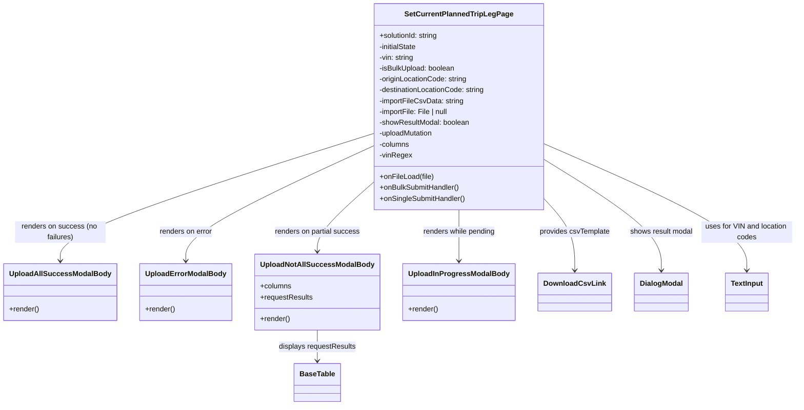

# Diagram: web/portal/src/pages/administration/internal-tools/set-current-planned-trip-leg/SetCurrentPlannedTriplegTool.page.js


> Auto-generated by Obscura crawlers

## Diagram 1



### SVG

<svg id="container" width="1691.7578125" xmlns="http://www.w3.org/2000/svg" class="classDiagram" height="896" viewBox="0 0 1691.7578125 896" role="graphics-document document" aria-roledescription="class"><style>#container{font-family:"trebuchet ms",verdana,arial,sans-serif;font-size:16px;fill:#333;}@keyframes edge-animation-frame{from{stroke-dashoffset:0;}}@keyframes dash{to{stroke-dashoffset:0;}}#container .edge-animation-slow{stroke-dasharray:9,5!important;stroke-dashoffset:900;animation:dash 50s linear infinite;stroke-linecap:round;}#container .edge-animation-fast{stroke-dasharray:9,5!important;stroke-dashoffset:900;animation:dash 20s linear infinite;stroke-linecap:round;}#container .error-icon{fill:#552222;}#container .error-text{fill:#552222;stroke:#552222;}#container .edge-thickness-normal{stroke-width:1px;}#container .edge-thickness-thick{stroke-width:3.5px;}#container .edge-pattern-solid{stroke-dasharray:0;}#container .edge-thickness-invisible{stroke-width:0;fill:none;}#container .edge-pattern-dashed{stroke-dasharray:3;}#container .edge-pattern-dotted{stroke-dasharray:2;}#container .marker{fill:#333333;stroke:#333333;}#container .marker.cross{stroke:#333333;}#container svg{font-family:"trebuchet ms",verdana,arial,sans-serif;font-size:16px;}#container p{margin:0;}#container g.classGroup text{fill:#9370DB;stroke:none;font-family:"trebuchet ms",verdana,arial,sans-serif;font-size:10px;}#container g.classGroup text .title{font-weight:bolder;}#container .nodeLabel,#container .edgeLabel{color:#131300;}#container .edgeLabel .label rect{fill:#ECECFF;}#container .label text{fill:#131300;}#container .labelBkg{background:#ECECFF;}#container .edgeLabel .label span{background:#ECECFF;}#container .classTitle{font-weight:bolder;}#container .node rect,#container .node circle,#container .node ellipse,#container .node polygon,#container .node path{fill:#ECECFF;stroke:#9370DB;stroke-width:1px;}#container .divider{stroke:#9370DB;stroke-width:1;}#container g.clickable{cursor:pointer;}#container g.classGroup rect{fill:#ECECFF;stroke:#9370DB;}#container g.classGroup line{stroke:#9370DB;stroke-width:1;}#container .classLabel .box{stroke:none;stroke-width:0;fill:#ECECFF;opacity:0.5;}#container .classLabel .label{fill:#9370DB;font-size:10px;}#container .relation{stroke:#333333;stroke-width:1;fill:none;}#container .dashed-line{stroke-dasharray:3;}#container .dotted-line{stroke-dasharray:1 2;}#container #compositionStart,#container .composition{fill:#333333!important;stroke:#333333!important;stroke-width:1;}#container #compositionEnd,#container .composition{fill:#333333!important;stroke:#333333!important;stroke-width:1;}#container #dependencyStart,#container .dependency{fill:#333333!important;stroke:#333333!important;stroke-width:1;}#container #dependencyStart,#container .dependency{fill:#333333!important;stroke:#333333!important;stroke-width:1;}#container #extensionStart,#container .extension{fill:transparent!important;stroke:#333333!important;stroke-width:1;}#container #extensionEnd,#container .extension{fill:transparent!important;stroke:#333333!important;stroke-width:1;}#container #aggregationStart,#container .aggregation{fill:transparent!important;stroke:#333333!important;stroke-width:1;}#container #aggregationEnd,#container .aggregation{fill:transparent!important;stroke:#333333!important;stroke-width:1;}#container #lollipopStart,#container .lollipop{fill:#ECECFF!important;stroke:#333333!important;stroke-width:1;}#container #lollipopEnd,#container .lollipop{fill:#ECECFF!important;stroke:#333333!important;stroke-width:1;}#container .edgeTerminals{font-size:11px;line-height:initial;}#container .classTitleText{text-anchor:middle;font-size:18px;fill:#333;}#container .label-icon{display:inline-block;height:1em;overflow:visible;vertical-align:-0.125em;}#container .node .label-icon path{fill:currentColor;stroke:revert;stroke-width:revert;}#container :root{--mermaid-font-family:"trebuchet ms",verdana,arial,sans-serif;}</style><g><defs><marker id="container_class-aggregationStart" class="marker aggregation class" refX="18" refY="7" markerWidth="190" markerHeight="240" orient="auto"><path d="M 18,7 L9,13 L1,7 L9,1 Z"></path></marker></defs><defs><marker id="container_class-aggregationEnd" class="marker aggregation class" refX="1" refY="7" markerWidth="20" markerHeight="28" orient="auto"><path d="M 18,7 L9,13 L1,7 L9,1 Z"></path></marker></defs><defs><marker id="container_class-extensionStart" class="marker extension class" refX="18" refY="7" markerWidth="190" markerHeight="240" orient="auto"><path d="M 1,7 L18,13 V 1 Z"></path></marker></defs><defs><marker id="container_class-extensionEnd" class="marker extension class" refX="1" refY="7" markerWidth="20" markerHeight="28" orient="auto"><path d="M 1,1 V 13 L18,7 Z"></path></marker></defs><defs><marker id="container_class-compositionStart" class="marker composition class" refX="18" refY="7" markerWidth="190" markerHeight="240" orient="auto"><path d="M 18,7 L9,13 L1,7 L9,1 Z"></path></marker></defs><defs><marker id="container_class-compositionEnd" class="marker composition class" refX="1" refY="7" markerWidth="20" markerHeight="28" orient="auto"><path d="M 18,7 L9,13 L1,7 L9,1 Z"></path></marker></defs><defs><marker id="container_class-dependencyStart" class="marker dependency class" refX="6" refY="7" markerWidth="190" markerHeight="240" orient="auto"><path d="M 5,7 L9,13 L1,7 L9,1 Z"></path></marker></defs><defs><marker id="container_class-dependencyEnd" class="marker dependency class" refX="13" refY="7" markerWidth="20" markerHeight="28" orient="auto"><path d="M 18,7 L9,13 L14,7 L9,1 Z"></path></marker></defs><defs><marker id="container_class-lollipopStart" class="marker lollipop class" refX="13" refY="7" markerWidth="190" markerHeight="240" orient="auto"><circle stroke="black" fill="transparent" cx="7" cy="7" r="6"></circle></marker></defs><defs><marker id="container_class-lollipopEnd" class="marker lollipop class" refX="1" refY="7" markerWidth="190" markerHeight="240" orient="auto"><circle stroke="black" fill="transparent" cx="7" cy="7" r="6"></circle></marker></defs><g class="root"><g class="clusters"></g><g class="edgePaths"><path d="M777.367,297.901L668.664,333.751C559.961,369.601,342.555,441.3,233.852,487.817C125.148,534.333,125.148,555.667,125.148,566.333L125.148,577" id="id_SetCurrentPlannedTripLegPage_UploadAllSuccessModalBody_1" class="edge-thickness-normal edge-pattern-solid relation" style=";;;" data-edge="true" data-et="edge" data-id="id_SetCurrentPlannedTripLegPage_UploadAllSuccessModalBody_1" data-points="W3sieCI6Nzc3LjM2NzE4NzUsInkiOjI5Ny45MDEwOTY2NTIzNzMyN30seyJ4IjoxMjUuMTQ4NDM3NSwieSI6NTEzfSx7IngiOjEyNS4xNDg0Mzc1LCJ5Ijo1ODN9XQ==" marker-end="url(#container_class-dependencyEnd)"></path><path d="M777.367,326.343L712.734,357.452C648.102,388.562,518.836,450.781,454.203,492.557C389.57,534.333,389.57,555.667,389.57,566.333L389.57,577" id="id_SetCurrentPlannedTripLegPage_UploadErrorModalBody_2" class="edge-thickness-normal edge-pattern-solid relation" style=";;;" data-edge="true" data-et="edge" data-id="id_SetCurrentPlannedTripLegPage_UploadErrorModalBody_2" data-points="W3sieCI6Nzc3LjM2NzE4NzUsInkiOjMyNi4zNDI4NDUxMTg5ODc4NH0seyJ4IjozODkuNTcwMzEyNSwieSI6NTEzfSx7IngiOjM4OS41NzAzMTI1LCJ5Ijo1ODN9XQ==" marker-end="url(#container_class-dependencyEnd)"></path><path d="M777.367,410.464L758.982,427.553C740.596,444.643,703.826,478.821,685.44,503.077C667.055,527.333,667.055,541.667,667.055,548.833L667.055,556" id="id_SetCurrentPlannedTripLegPage_UploadNotAllSuccessModalBody_3" class="edge-thickness-normal edge-pattern-solid relation" style=";;;" data-edge="true" data-et="edge" data-id="id_SetCurrentPlannedTripLegPage_UploadNotAllSuccessModalBody_3" data-points="W3sieCI6Nzc3LjM2NzE4NzUsInkiOjQxMC40NjM4ODc3OTY1NjU3fSx7IngiOjY2Ny4wNTQ2ODc1LCJ5Ijo1MTN9LHsieCI6NjY3LjA1NDY4NzUsInkiOjU2Mn1d" marker-end="url(#container_class-dependencyEnd)"></path><path d="M965.063,464L965.063,472.167C965.063,480.333,965.063,496.667,965.063,515.5C965.063,534.333,965.063,555.667,965.063,566.333L965.063,577" id="id_SetCurrentPlannedTripLegPage_UploadInProgressModalBody_4" class="edge-thickness-normal edge-pattern-solid relation" style=";;;" data-edge="true" data-et="edge" data-id="id_SetCurrentPlannedTripLegPage_UploadInProgressModalBody_4" data-points="W3sieCI6OTY1LjA2MjUsInkiOjQ2NH0seyJ4Ijo5NjUuMDYyNSwieSI6NTEzfSx7IngiOjk2NS4wNjI1LCJ5Ijo1ODN9XQ==" marker-end="url(#container_class-dependencyEnd)"></path><path d="M1152.758,448.951L1162.167,459.626C1171.576,470.301,1190.393,491.65,1199.802,516.492C1209.211,541.333,1209.211,569.667,1209.211,583.833L1209.211,598" id="id_SetCurrentPlannedTripLegPage_DownloadCsvLink_5" class="edge-thickness-normal edge-pattern-solid relation" style=";;;" data-edge="true" data-et="edge" data-id="id_SetCurrentPlannedTripLegPage_DownloadCsvLink_5" data-points="W3sieCI6MTE1Mi43NTc4MTI1LCJ5Ijo0NDguOTUwNzg1NTc0ODYxNn0seyJ4IjoxMjA5LjIxMDkzNzUsInkiOjUxM30seyJ4IjoxMjA5LjIxMDkzNzUsInkiOjYwNH1d" marker-end="url(#container_class-dependencyEnd)"></path><path d="M1152.758,357.44L1192.829,383.367C1232.901,409.293,1313.044,461.147,1353.116,501.24C1393.188,541.333,1393.188,569.667,1393.188,583.833L1393.188,598" id="id_SetCurrentPlannedTripLegPage_DialogModal_6" class="edge-thickness-normal edge-pattern-solid relation" style=";;;" data-edge="true" data-et="edge" data-id="id_SetCurrentPlannedTripLegPage_DialogModal_6" data-points="W3sieCI6MTE1Mi43NTc4MTI1LCJ5IjozNTcuNDQwMjM3MjI2Mjc3MzZ9LHsieCI6MTM5My4xODc1LCJ5Ijo1MTN9LHsieCI6MTM5My4xODc1LCJ5Ijo2MDR9XQ==" marker-end="url(#container_class-dependencyEnd)"></path><path d="M1152.758,320.034L1224.591,352.195C1296.424,384.356,1440.091,448.678,1511.924,495.006C1583.758,541.333,1583.758,569.667,1583.758,583.833L1583.758,598" id="id_SetCurrentPlannedTripLegPage_TextInput_7" class="edge-thickness-normal edge-pattern-solid relation" style=";;;" data-edge="true" data-et="edge" data-id="id_SetCurrentPlannedTripLegPage_TextInput_7" data-points="W3sieCI6MTE1Mi43NTc4MTI1LCJ5IjozMjAuMDM0MjU4MDc4MzY1NX0seyJ4IjoxNTgzLjc1NzgxMjUsInkiOjUxM30seyJ4IjoxNTgzLjc1NzgxMjUsInkiOjYwNH1d" marker-end="url(#container_class-dependencyEnd)"></path><path d="M667.055,730L667.055,736.167C667.055,742.333,667.055,754.667,667.055,766C667.055,777.333,667.055,787.667,667.055,792.833L667.055,798" id="id_UploadNotAllSuccessModalBody_BaseTable_8" class="edge-thickness-normal edge-pattern-solid relation" style=";;;" data-edge="true" data-et="edge" data-id="id_UploadNotAllSuccessModalBody_BaseTable_8" data-points="W3sieCI6NjY3LjA1NDY4NzUsInkiOjczMH0seyJ4Ijo2NjcuMDU0Njg3NSwieSI6NzY3fSx7IngiOjY2Ny4wNTQ2ODc1LCJ5Ijo4MDR9XQ==" marker-end="url(#container_class-dependencyEnd)"></path></g><g class="edgeLabels"><g class="edgeLabel" transform="translate(125.1484375, 513)"><g class="label" data-id="id_SetCurrentPlannedTripLegPage_UploadAllSuccessModalBody_1" transform="translate(-100, -24)"><foreignObject width="200" height="48"><div xmlns="http://www.w3.org/1999/xhtml" class="labelBkg" style="display: table; white-space: break-spaces; line-height: 1.5; max-width: 200px; text-align: center; width: 200px;"><span class="edgeLabel"><p>renders on success (no failures)</p></span></div></foreignObject></g></g><g class="edgeLabel" transform="translate(389.5703125, 513)"><g class="label" data-id="id_SetCurrentPlannedTripLegPage_UploadErrorModalBody_2" transform="translate(-59.40625, -12)"><foreignObject width="118.8125" height="24"><div xmlns="http://www.w3.org/1999/xhtml" class="labelBkg" style="display: table-cell; white-space: nowrap; line-height: 1.5; max-width: 200px; text-align: center;"><span class="edgeLabel"><p>renders on error</p></span></div></foreignObject></g></g><g class="edgeLabel" transform="translate(667.0546875, 513)"><g class="label" data-id="id_SetCurrentPlannedTripLegPage_UploadNotAllSuccessModalBody_3" transform="translate(-94.8125, -12)"><foreignObject width="189.625" height="24"><div xmlns="http://www.w3.org/1999/xhtml" class="labelBkg" style="display: table-cell; white-space: nowrap; line-height: 1.5; max-width: 200px; text-align: center;"><span class="edgeLabel"><p>renders on partial success</p></span></div></foreignObject></g></g><g class="edgeLabel" transform="translate(965.0625, 513)"><g class="label" data-id="id_SetCurrentPlannedTripLegPage_UploadInProgressModalBody_4" transform="translate(-81.0234375, -12)"><foreignObject width="162.046875" height="24"><div xmlns="http://www.w3.org/1999/xhtml" class="labelBkg" style="display: table-cell; white-space: nowrap; line-height: 1.5; max-width: 200px; text-align: center;"><span class="edgeLabel"><p>renders while pending</p></span></div></foreignObject></g></g><g class="edgeLabel" transform="translate(1209.2109375, 513)"><g class="label" data-id="id_SetCurrentPlannedTripLegPage_DownloadCsvLink_5" transform="translate(-78.2421875, -12)"><foreignObject width="156.484375" height="24"><div xmlns="http://www.w3.org/1999/xhtml" class="labelBkg" style="display: table-cell; white-space: nowrap; line-height: 1.5; max-width: 200px; text-align: center;"><span class="edgeLabel"><p>provides csvTemplate</p></span></div></foreignObject></g></g><g class="edgeLabel" transform="translate(1393.1875, 513)"><g class="label" data-id="id_SetCurrentPlannedTripLegPage_DialogModal_6" transform="translate(-70.5703125, -12)"><foreignObject width="141.140625" height="24"><div xmlns="http://www.w3.org/1999/xhtml" class="labelBkg" style="display: table-cell; white-space: nowrap; line-height: 1.5; max-width: 200px; text-align: center;"><span class="edgeLabel"><p>shows result modal</p></span></div></foreignObject></g></g><g class="edgeLabel" transform="translate(1583.7578125, 513)"><g class="label" data-id="id_SetCurrentPlannedTripLegPage_TextInput_7" transform="translate(-100, -24)"><foreignObject width="200" height="48"><div xmlns="http://www.w3.org/1999/xhtml" class="labelBkg" style="display: table; white-space: break-spaces; line-height: 1.5; max-width: 200px; text-align: center; width: 200px;"><span class="edgeLabel"><p>uses for VIN and location codes</p></span></div></foreignObject></g></g><g class="edgeLabel" transform="translate(667.0546875, 767)"><g class="label" data-id="id_UploadNotAllSuccessModalBody_BaseTable_8" transform="translate(-85.875, -12)"><foreignObject width="171.75" height="24"><div xmlns="http://www.w3.org/1999/xhtml" class="labelBkg" style="display: table-cell; white-space: nowrap; line-height: 1.5; max-width: 200px; text-align: center;"><span class="edgeLabel"><p>displays requestResults</p></span></div></foreignObject></g></g></g><g class="nodes"><g class="node default" id="classId-SetCurrentPlannedTripLegPage-0" transform="translate(965.0625, 236)"><g class="basic label-container"><path d="M-187.6953125 -228 L187.6953125 -228 L187.6953125 228 L-187.6953125 228" stroke="none" stroke-width="0" fill="#ECECFF" style=""></path><path d="M-187.6953125 -228 C-66.07821958097689 -228, 55.538873338046216 -228, 187.6953125 -228 M-187.6953125 -228 C-111.96692312384751 -228, -36.238533747695016 -228, 187.6953125 -228 M187.6953125 -228 C187.6953125 -109.66660431498269, 187.6953125 8.666791370034616, 187.6953125 228 M187.6953125 -228 C187.6953125 -116.70511274569644, 187.6953125 -5.410225491392879, 187.6953125 228 M187.6953125 228 C85.1759215697228 228, -17.343469360554394 228, -187.6953125 228 M187.6953125 228 C44.7042524297276 228, -98.2868076405448 228, -187.6953125 228 M-187.6953125 228 C-187.6953125 82.44328611608594, -187.6953125 -63.113427767828114, -187.6953125 -228 M-187.6953125 228 C-187.6953125 71.67459033852418, -187.6953125 -84.65081932295163, -187.6953125 -228" stroke="#9370DB" stroke-width="1.3" fill="none" stroke-dasharray="0 0" style=""></path></g><g class="annotation-group text" transform="translate(0, -204)"></g><g class="label-group text" transform="translate(-113.703125, -204)"><g class="label" style="font-weight: bolder" transform="translate(0,-12)"><foreignObject width="227.40625" height="24"><div xmlns="http://www.w3.org/1999/xhtml" style="display: table-cell; white-space: nowrap; line-height: 1.5; max-width: 273px; text-align: center;"><span class="nodeLabel markdown-node-label" style=""><p>SetCurrentPlannedTripLegPage</p></span></div></foreignObject></g></g><g class="members-group text" transform="translate(-175.6953125, -156)"><g class="label" style="" transform="translate(0,-12)"><foreignObject width="131.8125" height="24"><div xmlns="http://www.w3.org/1999/xhtml" style="display: table-cell; white-space: nowrap; line-height: 1.5; max-width: 190px; text-align: center;"><span class="nodeLabel markdown-node-label" style=""><p>+solutionId: string</p></span></div></foreignObject></g><g class="label" style="" transform="translate(0,12)"><foreignObject width="85.71875" height="24"><div xmlns="http://www.w3.org/1999/xhtml" style="display: table-cell; white-space: nowrap; line-height: 1.5; max-width: 143px; text-align: center;"><span class="nodeLabel markdown-node-label" style=""><p>-initialState</p></span></div></foreignObject></g><g class="label" style="" transform="translate(0,36)"><foreignObject width="77.765625" height="24"><div xmlns="http://www.w3.org/1999/xhtml" style="display: table-cell; white-space: nowrap; line-height: 1.5; max-width: 136px; text-align: center;"><span class="nodeLabel markdown-node-label" style=""><p>-vin: string</p></span></div></foreignObject></g><g class="label" style="" transform="translate(0,60)"><foreignObject width="170.046875" height="24"><div xmlns="http://www.w3.org/1999/xhtml" style="display: table-cell; white-space: nowrap; line-height: 1.5; max-width: 227px; text-align: center;"><span class="nodeLabel markdown-node-label" style=""><p>-isBulkUpload: boolean</p></span></div></foreignObject></g><g class="label" style="" transform="translate(0,84)"><foreignObject width="196.796875" height="24"><div xmlns="http://www.w3.org/1999/xhtml" style="display: table-cell; white-space: nowrap; line-height: 1.5; max-width: 255px; text-align: center;"><span class="nodeLabel markdown-node-label" style=""><p>-originLocationCode: string</p></span></div></foreignObject></g><g class="label" style="" transform="translate(0,108)"><foreignObject width="237.6875" height="24"><div xmlns="http://www.w3.org/1999/xhtml" style="display: table-cell; white-space: nowrap; line-height: 1.5; max-width: 296px; text-align: center;"><span class="nodeLabel markdown-node-label" style=""><p>-destinationLocationCode: string</p></span></div></foreignObject></g><g class="label" style="" transform="translate(0,132)"><foreignObject width="187.375" height="24"><div xmlns="http://www.w3.org/1999/xhtml" style="display: table-cell; white-space: nowrap; line-height: 1.5; max-width: 245px; text-align: center;"><span class="nodeLabel markdown-node-label" style=""><p>-importFileCsvData: string</p></span></div></foreignObject></g><g class="label" style="" transform="translate(0,156)"><foreignObject width="156.828125" height="24"><div xmlns="http://www.w3.org/1999/xhtml" style="display: table-cell; white-space: nowrap; line-height: 1.5; max-width: 214px; text-align: center;"><span class="nodeLabel markdown-node-label" style=""><p>-importFile: File | null</p></span></div></foreignObject></g><g class="label" style="" transform="translate(0,180)"><foreignObject width="201.796875" height="24"><div xmlns="http://www.w3.org/1999/xhtml" style="display: table-cell; white-space: nowrap; line-height: 1.5; max-width: 259px; text-align: center;"><span class="nodeLabel markdown-node-label" style=""><p>-showResultModal: boolean</p></span></div></foreignObject></g><g class="label" style="" transform="translate(0,204)"><foreignObject width="122.46875" height="24"><div xmlns="http://www.w3.org/1999/xhtml" style="display: table-cell; white-space: nowrap; line-height: 1.5; max-width: 180px; text-align: center;"><span class="nodeLabel markdown-node-label" style=""><p>-uploadMutation</p></span></div></foreignObject></g><g class="label" style="" transform="translate(0,228)"><foreignObject width="67.6875" height="24"><div xmlns="http://www.w3.org/1999/xhtml" style="display: table-cell; white-space: nowrap; line-height: 1.5; max-width: 125px; text-align: center;"><span class="nodeLabel markdown-node-label" style=""><p>-columns</p></span></div></foreignObject></g><g class="label" style="" transform="translate(0,252)"><foreignObject width="70.609375" height="24"><div xmlns="http://www.w3.org/1999/xhtml" style="display: table-cell; white-space: nowrap; line-height: 1.5; max-width: 128px; text-align: center;"><span class="nodeLabel markdown-node-label" style=""><p>-vinRegex</p></span></div></foreignObject></g></g><g class="methods-group text" transform="translate(-175.6953125, 156)"><g class="label" style="" transform="translate(0,-12)"><foreignObject width="119.765625" height="24"><div xmlns="http://www.w3.org/1999/xhtml" style="display: table-cell; white-space: nowrap; line-height: 1.5; max-width: 177px; text-align: center;"><span class="nodeLabel markdown-node-label" style=""><p>+onFileLoad(file)</p></span></div></foreignObject></g><g class="label" style="" transform="translate(0,12)"><foreignObject width="178.5625" height="24"><div xmlns="http://www.w3.org/1999/xhtml" style="display: table-cell; white-space: nowrap; line-height: 1.5; max-width: 236px; text-align: center;"><span class="nodeLabel markdown-node-label" style=""><p>+onBulkSubmitHandler()</p></span></div></foreignObject></g><g class="label" style="" transform="translate(0,36)"><foreignObject width="190.90625" height="24"><div xmlns="http://www.w3.org/1999/xhtml" style="display: table-cell; white-space: nowrap; line-height: 1.5; max-width: 248px; text-align: center;"><span class="nodeLabel markdown-node-label" style=""><p>+onSingleSubmitHandler()</p></span></div></foreignObject></g></g><g class="divider" style=""><path d="M-187.6953125 -180 C-94.86398380182222 -180, -2.03265510364443 -180, 187.6953125 -180 M-187.6953125 -180 C-38.574533147204875 -180, 110.54624620559025 -180, 187.6953125 -180" stroke="#9370DB" stroke-width="1.3" fill="none" stroke-dasharray="0 0" style=""></path></g><g class="divider" style=""><path d="M-187.6953125 132 C-66.33250920226997 132, 55.03029409546005 132, 187.6953125 132 M-187.6953125 132 C-109.51518176019255 132, -31.335051020385094 132, 187.6953125 132" stroke="#9370DB" stroke-width="1.3" fill="none" stroke-dasharray="0 0" style=""></path></g></g><g class="node default" id="classId-UploadAllSuccessModalBody-1" transform="translate(125.1484375, 646)"><g class="basic label-container"><path d="M-117.1484375 -63 L117.1484375 -63 L117.1484375 63 L-117.1484375 63" stroke="none" stroke-width="0" fill="#ECECFF" style=""></path><path d="M-117.1484375 -63 C-42.43047033255789 -63, 32.28749683488422 -63, 117.1484375 -63 M-117.1484375 -63 C-66.69369820109227 -63, -16.238958902184535 -63, 117.1484375 -63 M117.1484375 -63 C117.1484375 -14.686164924176069, 117.1484375 33.62767015164786, 117.1484375 63 M117.1484375 -63 C117.1484375 -20.285473209842515, 117.1484375 22.42905358031497, 117.1484375 63 M117.1484375 63 C55.539458290264115 63, -6.0695209194717705 63, -117.1484375 63 M117.1484375 63 C49.01095498999479 63, -19.126527520010427 63, -117.1484375 63 M-117.1484375 63 C-117.1484375 25.631468190567084, -117.1484375 -11.737063618865832, -117.1484375 -63 M-117.1484375 63 C-117.1484375 14.494814871239456, -117.1484375 -34.01037025752109, -117.1484375 -63" stroke="#9370DB" stroke-width="1.3" fill="none" stroke-dasharray="0 0" style=""></path></g><g class="annotation-group text" transform="translate(0, -39)"></g><g class="label-group text" transform="translate(-105.1484375, -39)"><g class="label" style="font-weight: bolder" transform="translate(0,-12)"><foreignObject width="210.296875" height="24"><div xmlns="http://www.w3.org/1999/xhtml" style="display: table-cell; white-space: nowrap; line-height: 1.5; max-width: 258px; text-align: center;"><span class="nodeLabel markdown-node-label" style=""><p>UploadAllSuccessModalBody</p></span></div></foreignObject></g></g><g class="members-group text" transform="translate(-105.1484375, 9)"></g><g class="methods-group text" transform="translate(-105.1484375, 39)"><g class="label" style="" transform="translate(0,-12)"><foreignObject width="66.609375" height="24"><div xmlns="http://www.w3.org/1999/xhtml" style="display: table-cell; white-space: nowrap; line-height: 1.5; max-width: 124px; text-align: center;"><span class="nodeLabel markdown-node-label" style=""><p>+render()</p></span></div></foreignObject></g></g><g class="divider" style=""><path d="M-117.1484375 -15 C-41.50620439292423 -15, 34.136028714151536 -15, 117.1484375 -15 M-117.1484375 -15 C-46.225906020757165 -15, 24.69662545848567 -15, 117.1484375 -15" stroke="#9370DB" stroke-width="1.3" fill="none" stroke-dasharray="0 0" style=""></path></g><g class="divider" style=""><path d="M-117.1484375 9 C-55.96636558207218 9, 5.215706335855643 9, 117.1484375 9 M-117.1484375 9 C-33.579886498914775 9, 49.98866450217045 9, 117.1484375 9" stroke="#9370DB" stroke-width="1.3" fill="none" stroke-dasharray="0 0" style=""></path></g></g><g class="node default" id="classId-UploadErrorModalBody-2" transform="translate(389.5703125, 646)"><g class="basic label-container"><path d="M-97.2734375 -63 L97.2734375 -63 L97.2734375 63 L-97.2734375 63" stroke="none" stroke-width="0" fill="#ECECFF" style=""></path><path d="M-97.2734375 -63 C-28.834388207702617 -63, 39.60466108459477 -63, 97.2734375 -63 M-97.2734375 -63 C-46.614648776097674 -63, 4.044139947804652 -63, 97.2734375 -63 M97.2734375 -63 C97.2734375 -27.256158335004024, 97.2734375 8.487683329991953, 97.2734375 63 M97.2734375 -63 C97.2734375 -29.12676611496977, 97.2734375 4.7464677700604625, 97.2734375 63 M97.2734375 63 C46.144795616288505 63, -4.98384626742299 63, -97.2734375 63 M97.2734375 63 C19.676178104894447 63, -57.921081290211106 63, -97.2734375 63 M-97.2734375 63 C-97.2734375 22.08847715819254, -97.2734375 -18.82304568361492, -97.2734375 -63 M-97.2734375 63 C-97.2734375 24.34020276104379, -97.2734375 -14.319594477912418, -97.2734375 -63" stroke="#9370DB" stroke-width="1.3" fill="none" stroke-dasharray="0 0" style=""></path></g><g class="annotation-group text" transform="translate(0, -39)"></g><g class="label-group text" transform="translate(-85.2734375, -39)"><g class="label" style="font-weight: bolder" transform="translate(0,-12)"><foreignObject width="170.546875" height="24"><div xmlns="http://www.w3.org/1999/xhtml" style="display: table-cell; white-space: nowrap; line-height: 1.5; max-width: 219px; text-align: center;"><span class="nodeLabel markdown-node-label" style=""><p>UploadErrorModalBody</p></span></div></foreignObject></g></g><g class="members-group text" transform="translate(-85.2734375, 9)"></g><g class="methods-group text" transform="translate(-85.2734375, 39)"><g class="label" style="" transform="translate(0,-12)"><foreignObject width="66.609375" height="24"><div xmlns="http://www.w3.org/1999/xhtml" style="display: table-cell; white-space: nowrap; line-height: 1.5; max-width: 124px; text-align: center;"><span class="nodeLabel markdown-node-label" style=""><p>+render()</p></span></div></foreignObject></g></g><g class="divider" style=""><path d="M-97.2734375 -15 C-19.81491739706169 -15, 57.64360270587662 -15, 97.2734375 -15 M-97.2734375 -15 C-40.37401315769737 -15, 16.52541118460526 -15, 97.2734375 -15" stroke="#9370DB" stroke-width="1.3" fill="none" stroke-dasharray="0 0" style=""></path></g><g class="divider" style=""><path d="M-97.2734375 9 C-21.92744760070623 9, 53.41854229858754 9, 97.2734375 9 M-97.2734375 9 C-29.990921207332192 9, 37.291595085335615 9, 97.2734375 9" stroke="#9370DB" stroke-width="1.3" fill="none" stroke-dasharray="0 0" style=""></path></g></g><g class="node default" id="classId-UploadNotAllSuccessModalBody-3" transform="translate(667.0546875, 646)"><g class="basic label-container"><path d="M-130.2109375 -84 L130.2109375 -84 L130.2109375 84 L-130.2109375 84" stroke="none" stroke-width="0" fill="#ECECFF" style=""></path><path d="M-130.2109375 -84 C-62.81477310405259 -84, 4.581391291894818 -84, 130.2109375 -84 M-130.2109375 -84 C-54.56107720718353 -84, 21.08878308563294 -84, 130.2109375 -84 M130.2109375 -84 C130.2109375 -19.41583564958144, 130.2109375 45.16832870083712, 130.2109375 84 M130.2109375 -84 C130.2109375 -22.5283669187493, 130.2109375 38.9432661625014, 130.2109375 84 M130.2109375 84 C64.58781010538324 84, -1.035317289233518 84, -130.2109375 84 M130.2109375 84 C74.63448185259824 84, 19.058026205196498 84, -130.2109375 84 M-130.2109375 84 C-130.2109375 29.121767625693558, -130.2109375 -25.756464748612885, -130.2109375 -84 M-130.2109375 84 C-130.2109375 43.47955564990302, -130.2109375 2.9591112998060396, -130.2109375 -84" stroke="#9370DB" stroke-width="1.3" fill="none" stroke-dasharray="0 0" style=""></path></g><g class="annotation-group text" transform="translate(0, -60)"></g><g class="label-group text" transform="translate(-118.2109375, -60)"><g class="label" style="font-weight: bolder" transform="translate(0,-12)"><foreignObject width="236.421875" height="24"><div xmlns="http://www.w3.org/1999/xhtml" style="display: table-cell; white-space: nowrap; line-height: 1.5; max-width: 284px; text-align: center;"><span class="nodeLabel markdown-node-label" style=""><p>UploadNotAllSuccessModalBody</p></span></div></foreignObject></g></g><g class="members-group text" transform="translate(-118.2109375, -12)"><g class="label" style="" transform="translate(0,-12)"><foreignObject width="69.21875" height="24"><div xmlns="http://www.w3.org/1999/xhtml" style="display: table-cell; white-space: nowrap; line-height: 1.5; max-width: 127px; text-align: center;"><span class="nodeLabel markdown-node-label" style=""><p>+columns</p></span></div></foreignObject></g><g class="label" style="" transform="translate(0,12)"><foreignObject width="116.140625" height="24"><div xmlns="http://www.w3.org/1999/xhtml" style="display: table-cell; white-space: nowrap; line-height: 1.5; max-width: 174px; text-align: center;"><span class="nodeLabel markdown-node-label" style=""><p>+requestResults</p></span></div></foreignObject></g></g><g class="methods-group text" transform="translate(-118.2109375, 60)"><g class="label" style="" transform="translate(0,-12)"><foreignObject width="66.609375" height="24"><div xmlns="http://www.w3.org/1999/xhtml" style="display: table-cell; white-space: nowrap; line-height: 1.5; max-width: 124px; text-align: center;"><span class="nodeLabel markdown-node-label" style=""><p>+render()</p></span></div></foreignObject></g></g><g class="divider" style=""><path d="M-130.2109375 -36 C-62.569903104275525 -36, 5.07113129144895 -36, 130.2109375 -36 M-130.2109375 -36 C-39.612116292287865 -36, 50.98670491542427 -36, 130.2109375 -36" stroke="#9370DB" stroke-width="1.3" fill="none" stroke-dasharray="0 0" style=""></path></g><g class="divider" style=""><path d="M-130.2109375 36 C-55.69104389968447 36, 18.828849700631054 36, 130.2109375 36 M-130.2109375 36 C-45.77777146387335 36, 38.6553945722533 36, 130.2109375 36" stroke="#9370DB" stroke-width="1.3" fill="none" stroke-dasharray="0 0" style=""></path></g></g><g class="node default" id="classId-UploadInProgressModalBody-4" transform="translate(965.0625, 646)"><g class="basic label-container"><path d="M-117.796875 -63 L117.796875 -63 L117.796875 63 L-117.796875 63" stroke="none" stroke-width="0" fill="#ECECFF" style=""></path><path d="M-117.796875 -63 C-63.907490492254965 -63, -10.01810598450993 -63, 117.796875 -63 M-117.796875 -63 C-65.99195268052438 -63, -14.18703036104877 -63, 117.796875 -63 M117.796875 -63 C117.796875 -15.921596659373293, 117.796875 31.156806681253414, 117.796875 63 M117.796875 -63 C117.796875 -37.05479352262575, 117.796875 -11.109587045251502, 117.796875 63 M117.796875 63 C46.96488762142765 63, -23.8670997571447 63, -117.796875 63 M117.796875 63 C60.026981837753475 63, 2.2570886755069495 63, -117.796875 63 M-117.796875 63 C-117.796875 21.73683526904047, -117.796875 -19.52632946191906, -117.796875 -63 M-117.796875 63 C-117.796875 24.840408804755235, -117.796875 -13.31918239048953, -117.796875 -63" stroke="#9370DB" stroke-width="1.3" fill="none" stroke-dasharray="0 0" style=""></path></g><g class="annotation-group text" transform="translate(0, -39)"></g><g class="label-group text" transform="translate(-105.796875, -39)"><g class="label" style="font-weight: bolder" transform="translate(0,-12)"><foreignObject width="211.59375" height="24"><div xmlns="http://www.w3.org/1999/xhtml" style="display: table-cell; white-space: nowrap; line-height: 1.5; max-width: 259px; text-align: center;"><span class="nodeLabel markdown-node-label" style=""><p>UploadInProgressModalBody</p></span></div></foreignObject></g></g><g class="members-group text" transform="translate(-105.796875, 9)"></g><g class="methods-group text" transform="translate(-105.796875, 39)"><g class="label" style="" transform="translate(0,-12)"><foreignObject width="66.609375" height="24"><div xmlns="http://www.w3.org/1999/xhtml" style="display: table-cell; white-space: nowrap; line-height: 1.5; max-width: 124px; text-align: center;"><span class="nodeLabel markdown-node-label" style=""><p>+render()</p></span></div></foreignObject></g></g><g class="divider" style=""><path d="M-117.796875 -15 C-64.24654222351057 -15, -10.696209447021133 -15, 117.796875 -15 M-117.796875 -15 C-35.76639694031469 -15, 46.264081119370616 -15, 117.796875 -15" stroke="#9370DB" stroke-width="1.3" fill="none" stroke-dasharray="0 0" style=""></path></g><g class="divider" style=""><path d="M-117.796875 9 C-25.741690617421142 9, 66.31349376515772 9, 117.796875 9 M-117.796875 9 C-27.16944401127654 9, 63.45798697744692 9, 117.796875 9" stroke="#9370DB" stroke-width="1.3" fill="none" stroke-dasharray="0 0" style=""></path></g></g><g class="node default" id="classId-DownloadCsvLink-5" transform="translate(1209.2109375, 646)"><g class="basic label-container"><path d="M-76.3515625 -42 L76.3515625 -42 L76.3515625 42 L-76.3515625 42" stroke="none" stroke-width="0" fill="#ECECFF" style=""></path><path d="M-76.3515625 -42 C-42.37126830638091 -42, -8.390974112761825 -42, 76.3515625 -42 M-76.3515625 -42 C-24.788163785194662 -42, 26.775234929610676 -42, 76.3515625 -42 M76.3515625 -42 C76.3515625 -24.492554895035884, 76.3515625 -6.985109790071768, 76.3515625 42 M76.3515625 -42 C76.3515625 -15.540253353117997, 76.3515625 10.919493293764006, 76.3515625 42 M76.3515625 42 C30.62085990773243 42, -15.109842684535138 42, -76.3515625 42 M76.3515625 42 C34.01016214876723 42, -8.331238202465542 42, -76.3515625 42 M-76.3515625 42 C-76.3515625 18.181403587765505, -76.3515625 -5.63719282446899, -76.3515625 -42 M-76.3515625 42 C-76.3515625 19.413706913582406, -76.3515625 -3.1725861728351887, -76.3515625 -42" stroke="#9370DB" stroke-width="1.3" fill="none" stroke-dasharray="0 0" style=""></path></g><g class="annotation-group text" transform="translate(0, -18)"></g><g class="label-group text" transform="translate(-64.3515625, -18)"><g class="label" style="font-weight: bolder" transform="translate(0,-12)"><foreignObject width="128.703125" height="24"><div xmlns="http://www.w3.org/1999/xhtml" style="display: table-cell; white-space: nowrap; line-height: 1.5; max-width: 177px; text-align: center;"><span class="nodeLabel markdown-node-label" style=""><p>DownloadCsvLink</p></span></div></foreignObject></g></g><g class="members-group text" transform="translate(-64.3515625, 30)"></g><g class="methods-group text" transform="translate(-64.3515625, 60)"></g><g class="divider" style=""><path d="M-76.3515625 6 C-22.284194453022103 6, 31.783173593955794 6, 76.3515625 6 M-76.3515625 6 C-39.93548641962394 6, -3.5194103392478837 6, 76.3515625 6" stroke="#9370DB" stroke-width="1.3" fill="none" stroke-dasharray="0 0" style=""></path></g><g class="divider" style=""><path d="M-76.3515625 24 C-44.05774976857258 24, -11.763937037145155 24, 76.3515625 24 M-76.3515625 24 C-18.627434709905202 24, 39.096693080189596 24, 76.3515625 24" stroke="#9370DB" stroke-width="1.3" fill="none" stroke-dasharray="0 0" style=""></path></g></g><g class="node default" id="classId-DialogModal-6" transform="translate(1393.1875, 646)"><g class="basic label-container"><path d="M-57.625 -42 L57.625 -42 L57.625 42 L-57.625 42" stroke="none" stroke-width="0" fill="#ECECFF" style=""></path><path d="M-57.625 -42 C-33.09171845930717 -42, -8.558436918614333 -42, 57.625 -42 M-57.625 -42 C-32.09647930465306 -42, -6.56795860930611 -42, 57.625 -42 M57.625 -42 C57.625 -15.427374605400928, 57.625 11.145250789198144, 57.625 42 M57.625 -42 C57.625 -15.152648556745081, 57.625 11.694702886509837, 57.625 42 M57.625 42 C26.990537072247193 42, -3.643925855505614 42, -57.625 42 M57.625 42 C11.734871864404894 42, -34.15525627119021 42, -57.625 42 M-57.625 42 C-57.625 9.541864450969364, -57.625 -22.916271098061273, -57.625 -42 M-57.625 42 C-57.625 14.593565187455486, -57.625 -12.812869625089029, -57.625 -42" stroke="#9370DB" stroke-width="1.3" fill="none" stroke-dasharray="0 0" style=""></path></g><g class="annotation-group text" transform="translate(0, -18)"></g><g class="label-group text" transform="translate(-45.625, -18)"><g class="label" style="font-weight: bolder" transform="translate(0,-12)"><foreignObject width="91.25" height="24"><div xmlns="http://www.w3.org/1999/xhtml" style="display: table-cell; white-space: nowrap; line-height: 1.5; max-width: 141px; text-align: center;"><span class="nodeLabel markdown-node-label" style=""><p>DialogModal</p></span></div></foreignObject></g></g><g class="members-group text" transform="translate(-45.625, 30)"></g><g class="methods-group text" transform="translate(-45.625, 60)"></g><g class="divider" style=""><path d="M-57.625 6 C-23.649578051094004 6, 10.325843897811993 6, 57.625 6 M-57.625 6 C-25.638225897057154 6, 6.348548205885692 6, 57.625 6" stroke="#9370DB" stroke-width="1.3" fill="none" stroke-dasharray="0 0" style=""></path></g><g class="divider" style=""><path d="M-57.625 24 C-16.267297455553837 24, 25.090405088892325 24, 57.625 24 M-57.625 24 C-13.290359236981708 24, 31.044281526036585 24, 57.625 24" stroke="#9370DB" stroke-width="1.3" fill="none" stroke-dasharray="0 0" style=""></path></g></g><g class="node default" id="classId-TextInput-7" transform="translate(1583.7578125, 646)"><g class="basic label-container"><path d="M-46.78125 -42 L46.78125 -42 L46.78125 42 L-46.78125 42" stroke="none" stroke-width="0" fill="#ECECFF" style=""></path><path d="M-46.78125 -42 C-12.316206136460558 -42, 22.148837727078885 -42, 46.78125 -42 M-46.78125 -42 C-13.685848289377397 -42, 19.409553421245207 -42, 46.78125 -42 M46.78125 -42 C46.78125 -12.922611630388253, 46.78125 16.154776739223493, 46.78125 42 M46.78125 -42 C46.78125 -20.135792446145132, 46.78125 1.7284151077097363, 46.78125 42 M46.78125 42 C17.44569352812556 42, -11.88986294374888 42, -46.78125 42 M46.78125 42 C27.354244012282958 42, 7.927238024565916 42, -46.78125 42 M-46.78125 42 C-46.78125 10.95583314766182, -46.78125 -20.08833370467636, -46.78125 -42 M-46.78125 42 C-46.78125 8.44530088866771, -46.78125 -25.10939822266458, -46.78125 -42" stroke="#9370DB" stroke-width="1.3" fill="none" stroke-dasharray="0 0" style=""></path></g><g class="annotation-group text" transform="translate(0, -18)"></g><g class="label-group text" transform="translate(-34.78125, -18)"><g class="label" style="font-weight: bolder" transform="translate(0,-12)"><foreignObject width="69.5625" height="24"><div xmlns="http://www.w3.org/1999/xhtml" style="display: table-cell; white-space: nowrap; line-height: 1.5; max-width: 118px; text-align: center;"><span class="nodeLabel markdown-node-label" style=""><p>TextInput</p></span></div></foreignObject></g></g><g class="members-group text" transform="translate(-34.78125, 30)"></g><g class="methods-group text" transform="translate(-34.78125, 60)"></g><g class="divider" style=""><path d="M-46.78125 6 C-24.41421905289063 6, -2.0471881057812595 6, 46.78125 6 M-46.78125 6 C-24.762115838018143 6, -2.742981676036287 6, 46.78125 6" stroke="#9370DB" stroke-width="1.3" fill="none" stroke-dasharray="0 0" style=""></path></g><g class="divider" style=""><path d="M-46.78125 24 C-20.844797415196496 24, 5.091655169607009 24, 46.78125 24 M-46.78125 24 C-15.618965106076562 24, 15.543319787846876 24, 46.78125 24" stroke="#9370DB" stroke-width="1.3" fill="none" stroke-dasharray="0 0" style=""></path></g></g><g class="node default" id="classId-BaseTable-8" transform="translate(667.0546875, 846)"><g class="basic label-container"><path d="M-49.359375 -42 L49.359375 -42 L49.359375 42 L-49.359375 42" stroke="none" stroke-width="0" fill="#ECECFF" style=""></path><path d="M-49.359375 -42 C-17.717444566494116 -42, 13.924485867011768 -42, 49.359375 -42 M-49.359375 -42 C-12.509229857774322 -42, 24.340915284451356 -42, 49.359375 -42 M49.359375 -42 C49.359375 -18.79783924949375, 49.359375 4.404321501012497, 49.359375 42 M49.359375 -42 C49.359375 -8.83431973024404, 49.359375 24.33136053951192, 49.359375 42 M49.359375 42 C14.883128741136026 42, -19.593117517727947 42, -49.359375 42 M49.359375 42 C18.10705701585645 42, -13.145260968287097 42, -49.359375 42 M-49.359375 42 C-49.359375 24.13613061322767, -49.359375 6.272261226455342, -49.359375 -42 M-49.359375 42 C-49.359375 14.938632397930643, -49.359375 -12.122735204138714, -49.359375 -42" stroke="#9370DB" stroke-width="1.3" fill="none" stroke-dasharray="0 0" style=""></path></g><g class="annotation-group text" transform="translate(0, -18)"></g><g class="label-group text" transform="translate(-37.359375, -18)"><g class="label" style="font-weight: bolder" transform="translate(0,-12)"><foreignObject width="74.71875" height="24"><div xmlns="http://www.w3.org/1999/xhtml" style="display: table-cell; white-space: nowrap; line-height: 1.5; max-width: 123px; text-align: center;"><span class="nodeLabel markdown-node-label" style=""><p>BaseTable</p></span></div></foreignObject></g></g><g class="members-group text" transform="translate(-37.359375, 30)"></g><g class="methods-group text" transform="translate(-37.359375, 60)"></g><g class="divider" style=""><path d="M-49.359375 6 C-23.450920850185266 6, 2.4575332996294676 6, 49.359375 6 M-49.359375 6 C-22.982996270482218 6, 3.393382459035564 6, 49.359375 6" stroke="#9370DB" stroke-width="1.3" fill="none" stroke-dasharray="0 0" style=""></path></g><g class="divider" style=""><path d="M-49.359375 24 C-22.85817412951414 24, 3.6430267409717203 24, 49.359375 24 M-49.359375 24 C-19.552018439502373 24, 10.255338120995255 24, 49.359375 24" stroke="#9370DB" stroke-width="1.3" fill="none" stroke-dasharray="0 0" style=""></path></g></g></g></g></g></svg>

## Diagram 2

```mermaid
flowchart TD
  Start([Start])
  InputMethod{Select input method}
  FileBrowse[Browse CSV file]
  CsvLoaded[CSV loaded -> importFileCsvData]
  ManualEntry[Enter VIN, Origin, Destination]
  ValidateVIN{vinRegex and non-empty locations}
  BulkSubmit[Click Upload (Bulk)]
  SingleSubmit[Click Submit (Single)]
  UploadMutation[uploadMutation.mutate(payload)]
  ShowModal[DialogModal: showResultModal = true]
  Pending[uploadMutation.isPending]
  SuccessAll[All Success -> UploadAllSuccessModalBody]
  SuccessPartial[Partial Success -> UploadNotAllSuccessModalBody]
  Error[Error -> UploadErrorModalBody]
  End([End])

  Start --> InputMethod
  InputMethod -->|CSV| FileBrowse --> CsvLoaded --> BulkSubmit
  InputMethod -->|Single| ManualEntry --> ValidateVIN
  ValidateVIN -->|valid| SingleSubmit
  ValidateVIN -->|invalid| ManualEntry
  BulkSubmit --> UploadMutation
  SingleSubmit --> UploadMutation
  UploadMutation --> ShowModal
  UploadMutation -->|pending| Pending
  UploadMutation -->|success (no failures)| SuccessAll
  UploadMutation -->|success (some failures)| SuccessPartial
  UploadMutation -->|error| Error
  SuccessAll --> End
  SuccessPartial --> End
  Error --> End
```

> SVG rendering failed for this diagram.
