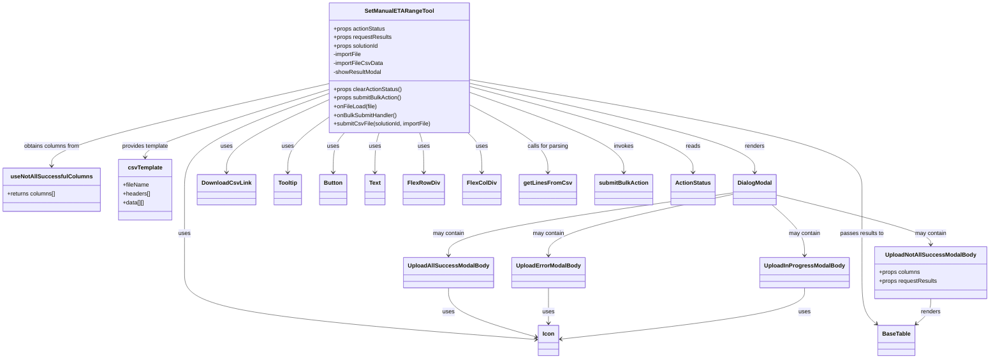

# Diagram: web/portal/src/pages/administration/internal-tools/set-manual-eta-range-tool/SetManualETARangeTool.page.js

> Auto-generated by Obscura crawlers

## Mermaid

### SVG

<svg id="container" width="2660.37890625" xmlns="http://www.w3.org/2000/svg" class="classDiagram" height="994" viewBox="0 0 2660.37890625 994" role="graphics-document document" aria-roledescription="class"><g><defs><marker id="container_class-aggregationStart" class="marker aggregation class" refX="18" refY="7" markerWidth="190" markerHeight="240" orient="auto"><path d="M 18,7 L9,13 L1,7 L9,1 Z"></path></marker></defs><defs><marker id="container_class-aggregationEnd" class="marker aggregation class" refX="1" refY="7" markerWidth="20" markerHeight="28" orient="auto"><path d="M 18,7 L9,13 L1,7 L9,1 Z"></path></marker></defs><defs><marker id="container_class-extensionStart" class="marker extension class" refX="18" refY="7" markerWidth="190" markerHeight="240" orient="auto"><path d="M 1,7 L18,13 V 1 Z"></path></marker></defs><defs><marker id="container_class-extensionEnd" class="marker extension class" refX="1" refY="7" markerWidth="20" markerHeight="28" orient="auto"><path d="M 1,1 V 13 L18,7 Z"></path></marker></defs><defs><marker id="container_class-compositionStart" class="marker composition class" refX="18" refY="7" markerWidth="190" markerHeight="240" orient="auto"><path d="M 18,7 L9,13 L1,7 L9,1 Z"></path></marker></defs><defs><marker id="container_class-compositionEnd" class="marker composition class" refX="1" refY="7" markerWidth="20" markerHeight="28" orient="auto"><path d="M 18,7 L9,13 L1,7 L9,1 Z"></path></marker></defs><defs><marker id="container_class-dependencyStart" class="marker dependency class" refX="6" refY="7" markerWidth="190" markerHeight="240" orient="auto"><path d="M 5,7 L9,13 L1,7 L9,1 Z"></path></marker></defs><defs><marker id="container_class-dependencyEnd" class="marker dependency class" refX="13" refY="7" markerWidth="20" markerHeight="28" orient="auto"><path d="M 18,7 L9,13 L14,7 L9,1 Z"></path></marker></defs><defs><marker id="container_class-lollipopStart" class="marker lollipop class" refX="13" refY="7" markerWidth="190" markerHeight="240" orient="auto"><circle stroke="black" fill="transparent" cx="7" cy="7" r="6"></circle></marker></defs><defs><marker id="container_class-lollipopEnd" class="marker lollipop class" refX="1" refY="7" markerWidth="190" markerHeight="240" orient="auto"><circle stroke="black" fill="transparent" cx="7" cy="7" r="6"></circle></marker></defs><g class="root"><g class="clusters"></g><g class="edgePaths"><path d="M1278.043,232.557L1403.027,261.298C1528.01,290.038,1777.978,347.519,1902.962,388.426C2027.945,429.333,2027.945,453.667,2027.945,465.833L2027.945,478" id="id_SetManualETARangeTool_DialogModal_1" class="edge-thickness-normal edge-pattern-solid relation" style=";;;" data-edge="true" data-et="edge" data-id="id_SetManualETARangeTool_DialogModal_1" data-points="W3sieCI6MTI3OC4wNDI5Njg3NSwieSI6MjMyLjU1NzEzNDUxOTE0Mjh9LHsieCI6MjAyNy45NDUzMTI1LCJ5Ijo0MDV9LHsieCI6MjAyNy45NDUzMTI1LCJ5Ijo0ODR9XQ==" marker-end="url(#container_class-dependencyEnd)"></path><path d="M2073.949,568L2088.371,581.167C2102.793,594.333,2131.637,620.667,2146.059,644C2160.48,667.333,2160.48,687.667,2160.48,697.833L2160.48,708" id="id_DialogModal_UploadInProgressModalBody_2" class="edge-thickness-normal edge-pattern-solid relation" style=";;;" data-edge="true" data-et="edge" data-id="id_DialogModal_UploadInProgressModalBody_2" data-points="W3sieCI6MjA3My45NDkyNTEwMzMwNTgsInkiOjU2OH0seyJ4IjoyMTYwLjQ4MDQ2ODc1LCJ5Ijo2NDd9LHsieCI6MjE2MC40ODA0Njg3NSwieSI6NzE0fV0=" marker-end="url(#container_class-dependencyEnd)"></path><path d="M1970.32,534.526L1843.62,553.272C1716.921,572.017,1463.521,609.509,1336.821,638.421C1210.121,667.333,1210.121,687.667,1210.121,697.833L1210.121,708" id="id_DialogModal_UploadAllSuccessModalBody_3" class="edge-thickness-normal edge-pattern-solid relation" style=";;;" data-edge="true" data-et="edge" data-id="id_DialogModal_UploadAllSuccessModalBody_3" data-points="W3sieCI6MTk3MC4zMjAzMTI1LCJ5Ijo1MzQuNTI1ODIzNTY5NTg5Nn0seyJ4IjoxMjEwLjEyMTA5Mzc1LCJ5Ijo2NDd9LHsieCI6MTIxMC4xMjEwOTM3NSwieSI6NzE0fV0=" marker-end="url(#container_class-dependencyEnd)"></path><path d="M2085.57,540.761L2154.697,558.467C2223.823,576.174,2362.076,611.587,2431.202,634.46C2500.328,657.333,2500.328,667.667,2500.328,672.833L2500.328,678" id="id_DialogModal_UploadNotAllSuccessModalBody_4" class="edge-thickness-normal edge-pattern-solid relation" style=";;;" data-edge="true" data-et="edge" data-id="id_DialogModal_UploadNotAllSuccessModalBody_4" data-points="W3sieCI6MjA4NS41NzAzMTI1LCJ5Ijo1NDAuNzYwNTM5MTU0ODgzfSx7IngiOjI1MDAuMzI4MTI1LCJ5Ijo2NDd9LHsieCI6MjUwMC4zMjgxMjUsInkiOjY4NH1d" marker-end="url(#container_class-dependencyEnd)"></path><path d="M1970.32,538.6L1887.691,556.666C1805.061,574.733,1639.802,610.867,1557.173,639.1C1474.543,667.333,1474.543,687.667,1474.543,697.833L1474.543,708" id="id_DialogModal_UploadErrorModalBody_5" class="edge-thickness-normal edge-pattern-solid relation" style=";;;" data-edge="true" data-et="edge" data-id="id_DialogModal_UploadErrorModalBody_5" data-points="W3sieCI6MTk3MC4zMjAzMTI1LCJ5Ijo1MzguNTk5NTU4MTMxMTYzfSx7IngiOjE0NzQuNTQyOTY4NzUsInkiOjY0N30seyJ4IjoxNDc0LjU0Mjk2ODc1LCJ5Ijo3MTR9XQ==" marker-end="url(#container_class-dependencyEnd)"></path><path d="M890.512,277.776L844.747,298.98C798.982,320.184,707.452,362.592,661.687,395.963C615.922,429.333,615.922,453.667,615.922,465.833L615.922,478" id="id_SetManualETARangeTool_DownloadCsvLink_6" class="edge-thickness-normal edge-pattern-solid relation" style=";;;" data-edge="true" data-et="edge" data-id="id_SetManualETARangeTool_DownloadCsvLink_6" data-points="W3sieCI6ODkwLjUxMTcxODc1LCJ5IjoyNzcuNzc2MTI4MjQxMjY5N30seyJ4Ijo2MTUuOTIxODc1LCJ5Ijo0MDV9LHsieCI6NjE1LjkyMTg3NSwieSI6NDg0fV0=" marker-end="url(#container_class-dependencyEnd)"></path><path d="M890.512,326.187L872.093,339.322C853.674,352.458,816.837,378.729,798.419,404.031C780,429.333,780,453.667,780,465.833L780,478" id="id_SetManualETARangeTool_Tooltip_7" class="edge-thickness-normal edge-pattern-solid relation" style=";;;" data-edge="true" data-et="edge" data-id="id_SetManualETARangeTool_Tooltip_7" data-points="W3sieCI6ODkwLjUxMTcxODc1LCJ5IjozMjYuMTg2ODkyNjExODQ5M30seyJ4Ijo3ODAsInkiOjQwNX0seyJ4Ijo3ODAsInkiOjQ4NH1d" marker-end="url(#container_class-dependencyEnd)"></path><path d="M890.512,260.532L826.188,284.61C761.865,308.688,633.217,356.844,568.894,401.089C504.57,445.333,504.57,485.667,504.57,526C504.57,566.333,504.57,606.667,504.57,645C504.57,683.333,504.57,719.667,504.57,756C504.57,792.333,504.57,828.667,660.685,859.548C816.8,890.43,1129.029,915.859,1285.143,928.574L1441.258,941.289" id="id_SetManualETARangeTool_Icon_8" class="edge-thickness-normal edge-pattern-solid relation" style=";;;" data-edge="true" data-et="edge" data-id="id_SetManualETARangeTool_Icon_8" data-points="W3sieCI6ODkwLjUxMTcxODc1LCJ5IjoyNjAuNTMxNzA3MTUyNzI0fSx7IngiOjUwNC41NzAzMTI1LCJ5Ijo0MDV9LHsieCI6NTA0LjU3MDMxMjUsInkiOjUyNn0seyJ4Ijo1MDQuNTcwMzEyNSwieSI6NjQ3fSx7IngiOjUwNC41NzAzMTI1LCJ5Ijo3NTZ9LHsieCI6NTA0LjU3MDMxMjUsInkiOjg2NX0seyJ4IjoxNDQ3LjIzODI4MTI1LCJ5Ijo5NDEuNzc2MTUzNDgzNzA4MX1d" marker-end="url(#container_class-dependencyEnd)"></path><path d="M935.205,368L930.098,374.167C924.991,380.333,914.777,392.667,909.67,411C904.563,429.333,904.563,453.667,904.563,465.833L904.563,478" id="id_SetManualETARangeTool_Button_9" class="edge-thickness-normal edge-pattern-solid relation" style=";;;" data-edge="true" data-et="edge" data-id="id_SetManualETARangeTool_Button_9" data-points="W3sieCI6OTM1LjIwNTEyMzEyNzg4MDEsInkiOjM2OH0seyJ4Ijo5MDQuNTYyNSwieSI6NDA1fSx7IngiOjkwNC41NjI1LCJ5Ijo0ODR9XQ==" marker-end="url(#container_class-dependencyEnd)"></path><path d="M1029.949,368L1028.088,374.167C1026.226,380.333,1022.504,392.667,1020.643,411C1018.781,429.333,1018.781,453.667,1018.781,465.833L1018.781,478" id="id_SetManualETARangeTool_Text_10" class="edge-thickness-normal edge-pattern-solid relation" style=";;;" data-edge="true" data-et="edge" data-id="id_SetManualETARangeTool_Text_10" data-points="W3sieCI6MTAyOS45NDg3ODY3MjIzNTAyLCJ5IjozNjh9LHsieCI6MTAxOC43ODEyNSwieSI6NDA1fSx7IngiOjEwMTguNzgxMjUsInkiOjQ4NH1d" marker-end="url(#container_class-dependencyEnd)"></path><path d="M1138.606,368L1140.467,374.167C1142.328,380.333,1146.051,392.667,1147.912,411C1149.773,429.333,1149.773,453.667,1149.773,465.833L1149.773,478" id="id_SetManualETARangeTool_FlexRowDiv_11" class="edge-thickness-normal edge-pattern-solid relation" style=";;;" data-edge="true" data-et="edge" data-id="id_SetManualETARangeTool_FlexRowDiv_11" data-points="W3sieCI6MTEzOC42MDU5MDA3Nzc2NDk4LCJ5IjozNjh9LHsieCI6MTE0OS43NzM0Mzc1LCJ5Ijo0MDV9LHsieCI6MTE0OS43NzM0Mzc1LCJ5Ijo0ODR9XQ==" marker-end="url(#container_class-dependencyEnd)"></path><path d="M1265.706,368L1271.922,374.167C1278.138,380.333,1290.569,392.667,1296.784,411C1303,429.333,1303,453.667,1303,465.833L1303,478" id="id_SetManualETARangeTool_FlexColDiv_12" class="edge-thickness-normal edge-pattern-solid relation" style=";;;" data-edge="true" data-et="edge" data-id="id_SetManualETARangeTool_FlexColDiv_12" data-points="W3sieCI6MTI2NS43MDYyNzUyMDE2MTMsInkiOjM2OH0seyJ4IjoxMzAzLCJ5Ijo0MDV9LHsieCI6MTMwMywieSI6NDg0fV0=" marker-end="url(#container_class-dependencyEnd)"></path><path d="M1278.043,222.212L1450.582,252.677C1623.121,283.142,1968.199,344.071,2140.738,394.702C2313.277,445.333,2313.277,485.667,2313.277,526C2313.277,566.333,2313.277,606.667,2313.277,645C2313.277,683.333,2313.277,719.667,2313.277,756C2313.277,792.333,2313.277,828.667,2319.874,852.406C2326.471,876.145,2339.666,887.29,2346.263,892.862L2352.86,898.435" id="id_SetManualETARangeTool_BaseTable_13" class="edge-thickness-normal edge-pattern-solid relation" style=";;;" data-edge="true" data-et="edge" data-id="id_SetManualETARangeTool_BaseTable_13" data-points="W3sieCI6MTI3OC4wNDI5Njg3NSwieSI6MjIyLjIxMjQ4MjIwMDk3NjR9LHsieCI6MjMxMy4yNzczNDM3NSwieSI6NDA1fSx7IngiOjIzMTMuMjc3MzQzNzUsInkiOjUyNn0seyJ4IjoyMzEzLjI3NzM0Mzc1LCJ5Ijo2NDd9LHsieCI6MjMxMy4yNzczNDM3NSwieSI6NzU2fSx7IngiOjIzMTMuMjc3MzQzNzUsInkiOjg2NX0seyJ4IjoyMzU3LjQ0MzM1OTM3NSwieSI6OTAyLjMwNjYwOTU4NTQ2NTF9XQ==" marker-end="url(#container_class-dependencyEnd)"></path><path d="M890.512,232.561L765.542,261.301C640.572,290.041,390.632,347.52,265.661,385.427C140.691,423.333,140.691,441.667,140.691,450.833L140.691,460" id="id_SetManualETARangeTool_useNotAllSuccessfulColumns_14" class="edge-thickness-normal edge-pattern-solid relation" style=";;;" data-edge="true" data-et="edge" data-id="id_SetManualETARangeTool_useNotAllSuccessfulColumns_14" data-points="W3sieCI6ODkwLjUxMTcxODc1LCJ5IjoyMzIuNTYxMDA4MTIyMjcyOX0seyJ4IjoxNDAuNjkxNDA2MjUsInkiOjQwNX0seyJ4IjoxNDAuNjkxNDA2MjUsInkiOjQ2Nn1d" marker-end="url(#container_class-dependencyEnd)"></path><path d="M890.512,249.133L808.173,275.111C725.833,301.088,561.155,353.044,478.816,384.189C396.477,415.333,396.477,425.667,396.477,430.833L396.477,436" id="id_SetManualETARangeTool_csvTemplate_15" class="edge-thickness-normal edge-pattern-solid relation" style=";;;" data-edge="true" data-et="edge" data-id="id_SetManualETARangeTool_csvTemplate_15" data-points="W3sieCI6ODkwLjUxMTcxODc1LCJ5IjoyNDkuMTMyNzMxNzAyNjA3Mzd9LHsieCI6Mzk2LjQ3NjU2MjUsInkiOjQwNX0seyJ4IjozOTYuNDc2NTYyNSwieSI6NDQyfV0=" marker-end="url(#container_class-dependencyEnd)"></path><path d="M1278.043,295.343L1311.033,313.619C1344.023,331.896,1410.004,368.448,1442.994,398.891C1475.984,429.333,1475.984,453.667,1475.984,465.833L1475.984,478" id="id_SetManualETARangeTool_getLinesFromCsv_16" class="edge-thickness-normal edge-pattern-solid relation" style=";;;" data-edge="true" data-et="edge" data-id="id_SetManualETARangeTool_getLinesFromCsv_16" data-points="W3sieCI6MTI3OC4wNDI5Njg3NSwieSI6Mjk1LjM0MzMzODk1MTEwNTQ3fSx7IngiOjE0NzUuOTg0Mzc1LCJ5Ijo0MDV9LHsieCI6MTQ3NS45ODQzNzUsInkiOjQ4NH1d" marker-end="url(#container_class-dependencyEnd)"></path><path d="M1278.043,259.039L1344.396,283.366C1410.75,307.693,1543.457,356.346,1609.811,392.84C1676.164,429.333,1676.164,453.667,1676.164,465.833L1676.164,478" id="id_SetManualETARangeTool_submitBulkAction_17" class="edge-thickness-normal edge-pattern-solid relation" style=";;;" data-edge="true" data-et="edge" data-id="id_SetManualETARangeTool_submitBulkAction_17" data-points="W3sieCI6MTI3OC4wNDI5Njg3NSwieSI6MjU5LjAzOTE2ODk3MTA0NzN9LHsieCI6MTY3Ni4xNjQwNjI1LCJ5Ijo0MDV9LHsieCI6MTY3Ni4xNjQwNjI1LCJ5Ijo0ODR9XQ==" marker-end="url(#container_class-dependencyEnd)"></path><path d="M2500.328,828L2500.328,834.167C2500.328,840.333,2500.328,852.667,2493.731,864.406C2487.134,876.145,2473.94,887.29,2467.343,892.862L2460.746,898.435" id="id_UploadNotAllSuccessModalBody_BaseTable_18" class="edge-thickness-normal edge-pattern-solid relation" style=";;;" data-edge="true" data-et="edge" data-id="id_UploadNotAllSuccessModalBody_BaseTable_18" data-points="W3sieCI6MjUwMC4zMjgxMjUsInkiOjgyOH0seyJ4IjoyNTAwLjMyODEyNSwieSI6ODY1fSx7IngiOjI0NTYuMTYyMTA5Mzc1LCJ5Ijo5MDIuMzA2NjA5NTg1NDY1MX1d" marker-end="url(#container_class-dependencyEnd)"></path><path d="M1210.121,798L1210.121,809.167C1210.121,820.333,1210.121,842.667,1248.682,865.354C1287.244,888.042,1364.367,911.083,1402.928,922.604L1441.489,934.125" id="id_UploadAllSuccessModalBody_Icon_19" class="edge-thickness-normal edge-pattern-solid relation" style=";;;" data-edge="true" data-et="edge" data-id="id_UploadAllSuccessModalBody_Icon_19" data-points="W3sieCI6MTIxMC4xMjEwOTM3NSwieSI6Nzk4fSx7IngiOjEyMTAuMTIxMDkzNzUsInkiOjg2NX0seyJ4IjoxNDQ3LjIzODI4MTI1LCJ5Ijo5MzUuODQyMzE1MTkyMzQxN31d" marker-end="url(#container_class-dependencyEnd)"></path><path d="M1474.543,798L1474.543,809.167C1474.543,820.333,1474.543,842.667,1474.543,859C1474.543,875.333,1474.543,885.667,1474.543,890.833L1474.543,896" id="id_UploadErrorModalBody_Icon_20" class="edge-thickness-normal edge-pattern-solid relation" style=";;;" data-edge="true" data-et="edge" data-id="id_UploadErrorModalBody_Icon_20" data-points="W3sieCI6MTQ3NC41NDI5Njg3NSwieSI6Nzk4fSx7IngiOjE0NzQuNTQyOTY4NzUsInkiOjg2NX0seyJ4IjoxNDc0LjU0Mjk2ODc1LCJ5Ijo5MDJ9XQ==" marker-end="url(#container_class-dependencyEnd)"></path><path d="M2160.48,798L2160.48,809.167C2160.48,820.333,2160.48,842.667,2051.702,866.361C1942.923,890.056,1725.366,915.113,1616.587,927.641L1507.808,940.169" id="id_UploadInProgressModalBody_Icon_21" class="edge-thickness-normal edge-pattern-solid relation" style=";;;" data-edge="true" data-et="edge" data-id="id_UploadInProgressModalBody_Icon_21" data-points="W3sieCI6MjE2MC40ODA0Njg3NSwieSI6Nzk4fSx7IngiOjIxNjAuNDgwNDY4NzUsInkiOjg2NX0seyJ4IjoxNTAxLjg0NzY1NjI1LCJ5Ijo5NDAuODU1Mjk2MTI3NTYyNn1d" marker-end="url(#container_class-dependencyEnd)"></path><path d="M1278.043,242.089L1375.311,269.241C1472.578,296.393,1667.113,350.696,1764.381,390.015C1861.648,429.333,1861.648,453.667,1861.648,465.833L1861.648,478" id="id_SetManualETARangeTool_ActionStatus_22" class="edge-thickness-normal edge-pattern-solid relation" style=";;;" data-edge="true" data-et="edge" data-id="id_SetManualETARangeTool_ActionStatus_22" data-points="W3sieCI6MTI3OC4wNDI5Njg3NSwieSI6MjQyLjA4ODg5MTM0NTUzMDU2fSx7IngiOjE4NjEuNjQ4NDM3NSwieSI6NDA1fSx7IngiOjE4NjEuNjQ4NDM3NSwieSI6NDg0fV0=" marker-end="url(#container_class-dependencyEnd)"></path></g><g class="edgeLabels"><g class="edgeLabel" transform="translate(2027.9453125, 405)"><g class="label" data-id="id_SetManualETARangeTool_DialogModal_1" transform="translate(-27.75, -12)"><foreignObject width="55.5" height="24">

renders

</foreignObject></g></g><g class="edgeLabel" transform="translate(2160.48046875, 647)"><g class="label" data-id="id_DialogModal_UploadInProgressModalBody_2" transform="translate(-44.296875, -12)"><foreignObject width="88.59375" height="24">

may contain

</foreignObject></g></g><g class="edgeLabel" transform="translate(1210.12109375, 647)"><g class="label" data-id="id_DialogModal_UploadAllSuccessModalBody_3" transform="translate(-44.296875, -12)"><foreignObject width="88.59375" height="24">

may contain

</foreignObject></g></g><g class="edgeLabel" transform="translate(2500.328125, 647)"><g class="label" data-id="id_DialogModal_UploadNotAllSuccessModalBody_4" transform="translate(-44.296875, -12)"><foreignObject width="88.59375" height="24">

may contain

</foreignObject></g></g><g class="edgeLabel" transform="translate(1474.54296875, 647)"><g class="label" data-id="id_DialogModal_UploadErrorModalBody_5" transform="translate(-44.296875, -12)"><foreignObject width="88.59375" height="24">

may contain

</foreignObject></g></g><g class="edgeLabel" transform="translate(615.921875, 405)"><g class="label" data-id="id_SetManualETARangeTool_DownloadCsvLink_6" transform="translate(-16.4921875, -12)"><foreignObject width="32.984375" height="24">

uses

</foreignObject></g></g><g class="edgeLabel" transform="translate(780, 405)"><g class="label" data-id="id_SetManualETARangeTool_Tooltip_7" transform="translate(-16.4921875, -12)"><foreignObject width="32.984375" height="24">

uses

</foreignObject></g></g><g class="edgeLabel" transform="translate(504.5703125, 647)"><g class="label" data-id="id_SetManualETARangeTool_Icon_8" transform="translate(-16.4921875, -12)"><foreignObject width="32.984375" height="24">

uses

</foreignObject></g></g><g class="edgeLabel" transform="translate(904.5625, 405)"><g class="label" data-id="id_SetManualETARangeTool_Button_9" transform="translate(-16.4921875, -12)"><foreignObject width="32.984375" height="24">

uses

</foreignObject></g></g><g class="edgeLabel" transform="translate(1018.78125, 405)"><g class="label" data-id="id_SetManualETARangeTool_Text_10" transform="translate(-16.4921875, -12)"><foreignObject width="32.984375" height="24">

uses

</foreignObject></g></g><g class="edgeLabel" transform="translate(1149.7734375, 405)"><g class="label" data-id="id_SetManualETARangeTool_FlexRowDiv_11" transform="translate(-16.4921875, -12)"><foreignObject width="32.984375" height="24">

uses

</foreignObject></g></g><g class="edgeLabel" transform="translate(1303, 405)"><g class="label" data-id="id_SetManualETARangeTool_FlexColDiv_12" transform="translate(-16.4921875, -12)"><foreignObject width="32.984375" height="24">

uses

</foreignObject></g></g><g class="edgeLabel" transform="translate(2313.27734375, 647)"><g class="label" data-id="id_SetManualETARangeTool_BaseTable_13" transform="translate(-60.6875, -12)"><foreignObject width="121.375" height="24">

passes results to

</foreignObject></g></g><g class="edgeLabel" transform="translate(140.69140625, 405)"><g class="label" data-id="id_SetManualETARangeTool_useNotAllSuccessfulColumns_14" transform="translate(-79.203125, -12)"><foreignObject width="158.40625" height="24">

obtains columns from

</foreignObject></g></g><g class="edgeLabel" transform="translate(396.4765625, 405)"><g class="label" data-id="id_SetManualETARangeTool_csvTemplate_15" transform="translate(-65.953125, -12)"><foreignObject width="131.90625" height="24">

provides template

</foreignObject></g></g><g class="edgeLabel" transform="translate(1475.984375, 405)"><g class="label" data-id="id_SetManualETARangeTool_getLinesFromCsv_16" transform="translate(-57.875, -12)"><foreignObject width="115.75" height="24">

calls for parsing

</foreignObject></g></g><g class="edgeLabel" transform="translate(1676.1640625, 405)"><g class="label" data-id="id_SetManualETARangeTool_submitBulkAction_17" transform="translate(-27.5859375, -12)"><foreignObject width="55.171875" height="24">

invokes

</foreignObject></g></g><g class="edgeLabel" transform="translate(2500.328125, 865)"><g class="label" data-id="id_UploadNotAllSuccessModalBody_BaseTable_18" transform="translate(-27.75, -12)"><foreignObject width="55.5" height="24">

renders

</foreignObject></g></g><g class="edgeLabel" transform="translate(1210.12109375, 865)"><g class="label" data-id="id_UploadAllSuccessModalBody_Icon_19" transform="translate(-16.4921875, -12)"><foreignObject width="32.984375" height="24">

uses

</foreignObject></g></g><g class="edgeLabel" transform="translate(1474.54296875, 865)"><g class="label" data-id="id_UploadErrorModalBody_Icon_20" transform="translate(-16.4921875, -12)"><foreignObject width="32.984375" height="24">

uses

</foreignObject></g></g><g class="edgeLabel" transform="translate(2160.48046875, 865)"><g class="label" data-id="id_UploadInProgressModalBody_Icon_21" transform="translate(-16.4921875, -12)"><foreignObject width="32.984375" height="24">

uses

</foreignObject></g></g><g class="edgeLabel" transform="translate(1861.6484375, 405)"><g class="label" data-id="id_SetManualETARangeTool_ActionStatus_22" transform="translate(-20.0078125, -12)"><foreignObject width="40.015625" height="24">

reads

</foreignObject></g></g></g><g class="nodes"><g class="node default" id="classId-SetManualETARangeTool-0" transform="translate(1084.27734375, 188)"><g class="basic label-container"><path d="M-193.765625 -180 L193.765625 -180 L193.765625 180 L-193.765625 180" stroke="none" stroke-width="0" fill="#ECECFF" style=""></path><path d="M-193.765625 -180 C-80.86892712362022 -180, 32.02777075275955 -180, 193.765625 -180 M-193.765625 -180 C-68.69424213024372 -180, 56.377140739512555 -180, 193.765625 -180 M193.765625 -180 C193.765625 -94.59660140249885, 193.765625 -9.193202804997696, 193.765625 180 M193.765625 -180 C193.765625 -68.17046729118826, 193.765625 43.65906541762348, 193.765625 180 M193.765625 180 C41.6505274613572 180, -110.4645700772856 180, -193.765625 180 M193.765625 180 C60.35408318542733 180, -73.05745862914534 180, -193.765625 180 M-193.765625 180 C-193.765625 45.130222879371274, -193.765625 -89.73955424125745, -193.765625 -180 M-193.765625 180 C-193.765625 47.06975142284176, -193.765625 -85.86049715431648, -193.765625 -180" stroke="#9370DB" stroke-width="1.3" fill="none" stroke-dasharray="0 0" style=""></path></g><g class="annotation-group text" transform="translate(0, -156)"></g><g class="label-group text" transform="translate(-89.578125, -156)"><g class="label" style="font-weight: bolder" transform="translate(0,-12)"><foreignObject width="179.15625" height="24">

SetManualETARangeTool

</foreignObject></g></g><g class="members-group text" transform="translate(-181.765625, -108)"><g class="label" style="" transform="translate(0,-12)"><foreignObject width="144.765625" height="24">

+props actionStatus

</foreignObject></g><g class="label" style="" transform="translate(0,12)"><foreignObject width="161.890625" height="24">

+props requestResults

</foreignObject></g><g class="label" style="" transform="translate(0,36)"><foreignObject width="127.859375" height="24">

+props solutionId

</foreignObject></g><g class="label" style="" transform="translate(0,60)"><foreignObject width="80.609375" height="24">

-importFile

</foreignObject></g><g class="label" style="" transform="translate(0,84)"><foreignObject width="137.65625" height="24">

-importFileCsvData

</foreignObject></g><g class="label" style="" transform="translate(0,108)"><foreignObject width="134.125" height="24">

-showResultModal

</foreignObject></g></g><g class="methods-group text" transform="translate(-181.765625, 60)"><g class="label" style="" transform="translate(0,-12)"><foreignObject width="191.28125" height="24">

+props clearActionStatus()

</foreignObject></g><g class="label" style="" transform="translate(0,12)"><foreignObject width="192.15625" height="24">

+props submitBulkAction()

</foreignObject></g><g class="label" style="" transform="translate(0,36)"><foreignObject width="119.765625" height="24">

+onFileLoad(file)

</foreignObject></g><g class="label" style="" transform="translate(0,60)"><foreignObject width="178.5625" height="24">

+onBulkSubmitHandler()

</foreignObject></g><g class="label" style="" transform="translate(0,84)"><foreignObject width="273.953125" height="24">

+submitCsvFile(solutionId, importFile)

</foreignObject></g></g><g class="divider" style=""><path d="M-193.765625 -132 C-100.64323814635672 -132, -7.520851292713445 -132, 193.765625 -132 M-193.765625 -132 C-88.05378628316468 -132, 17.658052433670633 -132, 193.765625 -132" stroke="#9370DB" stroke-width="1.3" fill="none" stroke-dasharray="0 0" style=""></path></g><g class="divider" style=""><path d="M-193.765625 36 C-64.86651813909143 36, 64.03258872181715 36, 193.765625 36 M-193.765625 36 C-108.33739021164662 36, -22.909155423293242 36, 193.765625 36" stroke="#9370DB" stroke-width="1.3" fill="none" stroke-dasharray="0 0" style=""></path></g></g><g class="node default" id="classId-useNotAllSuccessfulColumns-1" transform="translate(140.69140625, 526)"><g class="basic label-container"><path d="M-132.69140625 -60 L132.69140625 -60 L132.69140625 60 L-132.69140625 60" stroke="none" stroke-width="0" fill="#ECECFF" style=""></path><path d="M-132.69140625 -60 C-67.20717222339229 -60, -1.7229381967845825 -60, 132.69140625 -60 M-132.69140625 -60 C-74.19556543327155 -60, -15.699724616543108 -60, 132.69140625 -60 M132.69140625 -60 C132.69140625 -32.951275180407904, 132.69140625 -5.902550360815802, 132.69140625 60 M132.69140625 -60 C132.69140625 -32.60498978478237, 132.69140625 -5.209979569564737, 132.69140625 60 M132.69140625 60 C42.388584314227316 60, -47.91423762154537 60, -132.69140625 60 M132.69140625 60 C37.332374042918815 60, -58.02665816416237 60, -132.69140625 60 M-132.69140625 60 C-132.69140625 35.692243196154294, -132.69140625 11.384486392308581, -132.69140625 -60 M-132.69140625 60 C-132.69140625 22.75411741209328, -132.69140625 -14.491765175813441, -132.69140625 -60" stroke="#9370DB" stroke-width="1.3" fill="none" stroke-dasharray="0 0" style=""></path></g><g class="annotation-group text" transform="translate(0, -36)"></g><g class="label-group text" transform="translate(-105.0859375, -36)"><g class="label" style="font-weight: bolder" transform="translate(0,-12)"><foreignObject width="210.171875" height="24">

useNotAllSuccessfulColumns

</foreignObject></g></g><g class="members-group text" transform="translate(-120.69140625, 12)"><g class="label" style="" transform="translate(0,-12)"><foreignObject width="136.296875" height="24">

+returns columns[]

</foreignObject></g></g><g class="methods-group text" transform="translate(-120.69140625, 60)"></g><g class="divider" style=""><path d="M-132.69140625 -12 C-39.81983820272838 -12, 53.051729844543246 -12, 132.69140625 -12 M-132.69140625 -12 C-70.58222835157801 -12, -8.473050453156034 -12, 132.69140625 -12" stroke="#9370DB" stroke-width="1.3" fill="none" stroke-dasharray="0 0" style=""></path></g><g class="divider" style=""><path d="M-132.69140625 36 C-39.84510561912302 36, 53.001195011753964 36, 132.69140625 36 M-132.69140625 36 C-51.55764183953802 36, 29.576122570923957 36, 132.69140625 36" stroke="#9370DB" stroke-width="1.3" fill="none" stroke-dasharray="0 0" style=""></path></g></g><g class="node default" id="classId-csvTemplate-2" transform="translate(396.4765625, 526)"><g class="basic label-container"><path d="M-73.09375 -84 L73.09375 -84 L73.09375 84 L-73.09375 84" stroke="none" stroke-width="0" fill="#ECECFF" style=""></path><path d="M-73.09375 -84 C-34.10413461752991 -84, 4.8854807649401835 -84, 73.09375 -84 M-73.09375 -84 C-20.715404606491838 -84, 31.662940787016325 -84, 73.09375 -84 M73.09375 -84 C73.09375 -25.84527722620301, 73.09375 32.30944554759398, 73.09375 84 M73.09375 -84 C73.09375 -33.13575357200746, 73.09375 17.72849285598508, 73.09375 84 M73.09375 84 C41.82581774300126 84, 10.557885486002519 84, -73.09375 84 M73.09375 84 C37.10236040213426 84, 1.1109708042685185 84, -73.09375 84 M-73.09375 84 C-73.09375 20.22489965145038, -73.09375 -43.55020069709924, -73.09375 -84 M-73.09375 84 C-73.09375 23.023083171320557, -73.09375 -37.953833657358885, -73.09375 -84" stroke="#9370DB" stroke-width="1.3" fill="none" stroke-dasharray="0 0" style=""></path></g><g class="annotation-group text" transform="translate(0, -60)"></g><g class="label-group text" transform="translate(-45.5625, -60)"><g class="label" style="font-weight: bolder" transform="translate(0,-12)"><foreignObject width="91.125" height="24">

csvTemplate

</foreignObject></g></g><g class="members-group text" transform="translate(-61.09375, -12)"><g class="label" style="" transform="translate(0,-12)"><foreignObject width="72.34375" height="24">

+fileName

</foreignObject></g><g class="label" style="" transform="translate(0,12)"><foreignObject width="76.625" height="24">

+headers[]

</foreignObject></g><g class="label" style="" transform="translate(0,36)"><foreignObject width="61.234375" height="24">

+data[][]

</foreignObject></g></g><g class="methods-group text" transform="translate(-61.09375, 84)"></g><g class="divider" style=""><path d="M-73.09375 -36 C-19.785119315281335 -36, 33.52351136943733 -36, 73.09375 -36 M-73.09375 -36 C-24.684110883485907 -36, 23.725528233028186 -36, 73.09375 -36" stroke="#9370DB" stroke-width="1.3" fill="none" stroke-dasharray="0 0" style=""></path></g><g class="divider" style=""><path d="M-73.09375 60 C-35.09548648764833 60, 2.90277702470334 60, 73.09375 60 M-73.09375 60 C-33.23925321116951 60, 6.615243577660976 60, 73.09375 60" stroke="#9370DB" stroke-width="1.3" fill="none" stroke-dasharray="0 0" style=""></path></g></g><g class="node default" id="classId-DialogModal-3" transform="translate(2027.9453125, 526)"><g class="basic label-container"><path d="M-57.625 -42 L57.625 -42 L57.625 42 L-57.625 42" stroke="none" stroke-width="0" fill="#ECECFF" style=""></path><path d="M-57.625 -42 C-23.611485296207398 -42, 10.402029407585204 -42, 57.625 -42 M-57.625 -42 C-30.767599763583625 -42, -3.9101995271672507 -42, 57.625 -42 M57.625 -42 C57.625 -17.492157688159356, 57.625 7.015684623681288, 57.625 42 M57.625 -42 C57.625 -21.360863310357708, 57.625 -0.7217266207154154, 57.625 42 M57.625 42 C15.325268336615338 42, -26.974463326769325 42, -57.625 42 M57.625 42 C17.144468183402225 42, -23.33606363319555 42, -57.625 42 M-57.625 42 C-57.625 19.8585332927918, -57.625 -2.282933414416398, -57.625 -42 M-57.625 42 C-57.625 12.904816084661093, -57.625 -16.190367830677815, -57.625 -42" stroke="#9370DB" stroke-width="1.3" fill="none" stroke-dasharray="0 0" style=""></path></g><g class="annotation-group text" transform="translate(0, -18)"></g><g class="label-group text" transform="translate(-45.625, -18)"><g class="label" style="font-weight: bolder" transform="translate(0,-12)"><foreignObject width="91.25" height="24">

DialogModal

</foreignObject></g></g><g class="members-group text" transform="translate(-45.625, 30)"></g><g class="methods-group text" transform="translate(-45.625, 60)"></g><g class="divider" style=""><path d="M-57.625 6 C-19.846440501131504 6, 17.932118997736993 6, 57.625 6 M-57.625 6 C-17.148681377067895 6, 23.32763724586421 6, 57.625 6" stroke="#9370DB" stroke-width="1.3" fill="none" stroke-dasharray="0 0" style=""></path></g><g class="divider" style=""><path d="M-57.625 24 C-27.189419897721752 24, 3.246160204556496 24, 57.625 24 M-57.625 24 C-13.225413607077606 24, 31.17417278584479 24, 57.625 24" stroke="#9370DB" stroke-width="1.3" fill="none" stroke-dasharray="0 0" style=""></path></g></g><g class="node default" id="classId-UploadAllSuccessModalBody-4" transform="translate(1210.12109375, 756)"><g class="basic label-container"><path d="M-117.1484375 -42 L117.1484375 -42 L117.1484375 42 L-117.1484375 42" stroke="none" stroke-width="0" fill="#ECECFF" style=""></path><path d="M-117.1484375 -42 C-26.366331214198837 -42, 64.41577507160233 -42, 117.1484375 -42 M-117.1484375 -42 C-58.30951483562403 -42, 0.5294078287519426 -42, 117.1484375 -42 M117.1484375 -42 C117.1484375 -11.608581267618717, 117.1484375 18.782837464762565, 117.1484375 42 M117.1484375 -42 C117.1484375 -11.402577240020623, 117.1484375 19.194845519958754, 117.1484375 42 M117.1484375 42 C62.66626798437674 42, 8.184098468753476 42, -117.1484375 42 M117.1484375 42 C27.118360700198835 42, -62.91171609960233 42, -117.1484375 42 M-117.1484375 42 C-117.1484375 24.370129815620626, -117.1484375 6.740259631241251, -117.1484375 -42 M-117.1484375 42 C-117.1484375 22.191228404636412, -117.1484375 2.382456809272824, -117.1484375 -42" stroke="#9370DB" stroke-width="1.3" fill="none" stroke-dasharray="0 0" style=""></path></g><g class="annotation-group text" transform="translate(0, -18)"></g><g class="label-group text" transform="translate(-105.1484375, -18)"><g class="label" style="font-weight: bolder" transform="translate(0,-12)"><foreignObject width="210.296875" height="24">

UploadAllSuccessModalBody

</foreignObject></g></g><g class="members-group text" transform="translate(-105.1484375, 30)"></g><g class="methods-group text" transform="translate(-105.1484375, 60)"></g><g class="divider" style=""><path d="M-117.1484375 6 C-60.27536732547751 6, -3.4022971509550217 6, 117.1484375 6 M-117.1484375 6 C-62.07187348710969 6, -6.995309474219383 6, 117.1484375 6" stroke="#9370DB" stroke-width="1.3" fill="none" stroke-dasharray="0 0" style=""></path></g><g class="divider" style=""><path d="M-117.1484375 24 C-49.759361113485355 24, 17.62971527302929 24, 117.1484375 24 M-117.1484375 24 C-37.585613318816215 24, 41.97721086236757 24, 117.1484375 24" stroke="#9370DB" stroke-width="1.3" fill="none" stroke-dasharray="0 0" style=""></path></g></g><g class="node default" id="classId-UploadErrorModalBody-5" transform="translate(1474.54296875, 756)"><g class="basic label-container"><path d="M-97.2734375 -42 L97.2734375 -42 L97.2734375 42 L-97.2734375 42" stroke="none" stroke-width="0" fill="#ECECFF" style=""></path><path d="M-97.2734375 -42 C-57.96709635959374 -42, -18.66075521918748 -42, 97.2734375 -42 M-97.2734375 -42 C-40.368726116064266 -42, 16.535985267871467 -42, 97.2734375 -42 M97.2734375 -42 C97.2734375 -10.723180083813212, 97.2734375 20.553639832373577, 97.2734375 42 M97.2734375 -42 C97.2734375 -13.023133160635084, 97.2734375 15.953733678729833, 97.2734375 42 M97.2734375 42 C50.761988907671956 42, 4.250540315343912 42, -97.2734375 42 M97.2734375 42 C34.626191083665304 42, -28.02105533266939 42, -97.2734375 42 M-97.2734375 42 C-97.2734375 21.608332976864197, -97.2734375 1.2166659537283948, -97.2734375 -42 M-97.2734375 42 C-97.2734375 16.22495310215447, -97.2734375 -9.550093795691062, -97.2734375 -42" stroke="#9370DB" stroke-width="1.3" fill="none" stroke-dasharray="0 0" style=""></path></g><g class="annotation-group text" transform="translate(0, -18)"></g><g class="label-group text" transform="translate(-85.2734375, -18)"><g class="label" style="font-weight: bolder" transform="translate(0,-12)"><foreignObject width="170.546875" height="24">

UploadErrorModalBody

</foreignObject></g></g><g class="members-group text" transform="translate(-85.2734375, 30)"></g><g class="methods-group text" transform="translate(-85.2734375, 60)"></g><g class="divider" style=""><path d="M-97.2734375 6 C-30.256096573922022 6, 36.761244352155956 6, 97.2734375 6 M-97.2734375 6 C-30.340989602490126 6, 36.59145829501975 6, 97.2734375 6" stroke="#9370DB" stroke-width="1.3" fill="none" stroke-dasharray="0 0" style=""></path></g><g class="divider" style=""><path d="M-97.2734375 24 C-23.944966307203075 24, 49.38350488559385 24, 97.2734375 24 M-97.2734375 24 C-21.979185305249146 24, 53.31506688950171 24, 97.2734375 24" stroke="#9370DB" stroke-width="1.3" fill="none" stroke-dasharray="0 0" style=""></path></g></g><g class="node default" id="classId-UploadNotAllSuccessModalBody-6" transform="translate(2500.328125, 756)"><g class="basic label-container"><path d="M-152.05078125 -72 L152.05078125 -72 L152.05078125 72 L-152.05078125 72" stroke="none" stroke-width="0" fill="#ECECFF" style=""></path><path d="M-152.05078125 -72 C-49.467835927831615 -72, 53.11510939433677 -72, 152.05078125 -72 M-152.05078125 -72 C-38.78860262587506 -72, 74.47357599824988 -72, 152.05078125 -72 M152.05078125 -72 C152.05078125 -15.191199284148318, 152.05078125 41.61760143170336, 152.05078125 72 M152.05078125 -72 C152.05078125 -33.0821685035564, 152.05078125 5.835662992887194, 152.05078125 72 M152.05078125 72 C87.19973258637276 72, 22.348683922745522 72, -152.05078125 72 M152.05078125 72 C58.27820906705652 72, -35.494363115886955 72, -152.05078125 72 M-152.05078125 72 C-152.05078125 23.517903093341573, -152.05078125 -24.964193813316854, -152.05078125 -72 M-152.05078125 72 C-152.05078125 39.88754587150433, -152.05078125 7.775091743008659, -152.05078125 -72" stroke="#9370DB" stroke-width="1.3" fill="none" stroke-dasharray="0 0" style=""></path></g><g class="annotation-group text" transform="translate(0, -48)"></g><g class="label-group text" transform="translate(-118.2109375, -48)"><g class="label" style="font-weight: bolder" transform="translate(0,-12)"><foreignObject width="236.421875" height="24">

UploadNotAllSuccessModalBody

</foreignObject></g></g><g class="members-group text" transform="translate(-140.05078125, 0)"><g class="label" style="" transform="translate(0,-12)"><foreignObject width="114.984375" height="24">

+props columns

</foreignObject></g><g class="label" style="" transform="translate(0,12)"><foreignObject width="161.890625" height="24">

+props requestResults

</foreignObject></g></g><g class="methods-group text" transform="translate(-140.05078125, 72)"></g><g class="divider" style=""><path d="M-152.05078125 -24 C-57.51189859803185 -24, 37.0269840539363 -24, 152.05078125 -24 M-152.05078125 -24 C-55.711721538915015 -24, 40.62733817216997 -24, 152.05078125 -24" stroke="#9370DB" stroke-width="1.3" fill="none" stroke-dasharray="0 0" style=""></path></g><g class="divider" style=""><path d="M-152.05078125 48 C-52.50015780782327 48, 47.05046563435346 48, 152.05078125 48 M-152.05078125 48 C-58.9711008968449 48, 34.108579456310196 48, 152.05078125 48" stroke="#9370DB" stroke-width="1.3" fill="none" stroke-dasharray="0 0" style=""></path></g></g><g class="node default" id="classId-UploadInProgressModalBody-7" transform="translate(2160.48046875, 756)"><g class="basic label-container"><path d="M-117.796875 -42 L117.796875 -42 L117.796875 42 L-117.796875 42" stroke="none" stroke-width="0" fill="#ECECFF" style=""></path><path d="M-117.796875 -42 C-25.159055249476168 -42, 67.47876450104766 -42, 117.796875 -42 M-117.796875 -42 C-46.80515617882274 -42, 24.186562642354517 -42, 117.796875 -42 M117.796875 -42 C117.796875 -15.373745370449328, 117.796875 11.252509259101345, 117.796875 42 M117.796875 -42 C117.796875 -13.552519980110425, 117.796875 14.89496003977915, 117.796875 42 M117.796875 42 C24.609954263989763 42, -68.57696647202047 42, -117.796875 42 M117.796875 42 C65.95643014211187 42, 14.11598528422374 42, -117.796875 42 M-117.796875 42 C-117.796875 17.734992847652194, -117.796875 -6.530014304695612, -117.796875 -42 M-117.796875 42 C-117.796875 10.075109176149716, -117.796875 -21.849781647700567, -117.796875 -42" stroke="#9370DB" stroke-width="1.3" fill="none" stroke-dasharray="0 0" style=""></path></g><g class="annotation-group text" transform="translate(0, -18)"></g><g class="label-group text" transform="translate(-105.796875, -18)"><g class="label" style="font-weight: bolder" transform="translate(0,-12)"><foreignObject width="211.59375" height="24">

UploadInProgressModalBody

</foreignObject></g></g><g class="members-group text" transform="translate(-105.796875, 30)"></g><g class="methods-group text" transform="translate(-105.796875, 60)"></g><g class="divider" style=""><path d="M-117.796875 6 C-47.38337134385175 6, 23.0301323122965 6, 117.796875 6 M-117.796875 6 C-33.11573730699098 6, 51.56540038601804 6, 117.796875 6" stroke="#9370DB" stroke-width="1.3" fill="none" stroke-dasharray="0 0" style=""></path></g><g class="divider" style=""><path d="M-117.796875 24 C-46.53244690749982 24, 24.731981185000365 24, 117.796875 24 M-117.796875 24 C-35.40804570839745 24, 46.980783583205096 24, 117.796875 24" stroke="#9370DB" stroke-width="1.3" fill="none" stroke-dasharray="0 0" style=""></path></g></g><g class="node default" id="classId-BaseTable-8" transform="translate(2406.802734375, 944)"><g class="basic label-container"><path d="M-49.359375 -42 L49.359375 -42 L49.359375 42 L-49.359375 42" stroke="none" stroke-width="0" fill="#ECECFF" style=""></path><path d="M-49.359375 -42 C-20.360460264027267 -42, 8.638454471945465 -42, 49.359375 -42 M-49.359375 -42 C-20.684689630361056 -42, 7.989995739277887 -42, 49.359375 -42 M49.359375 -42 C49.359375 -14.06857433699519, 49.359375 13.862851326009618, 49.359375 42 M49.359375 -42 C49.359375 -18.50046188770568, 49.359375 4.9990762245886415, 49.359375 42 M49.359375 42 C24.427239764959932 42, -0.504895470080136 42, -49.359375 42 M49.359375 42 C21.010322158118537 42, -7.338730683762925 42, -49.359375 42 M-49.359375 42 C-49.359375 21.350613176804845, -49.359375 0.701226353609691, -49.359375 -42 M-49.359375 42 C-49.359375 19.679670551235304, -49.359375 -2.6406588975293914, -49.359375 -42" stroke="#9370DB" stroke-width="1.3" fill="none" stroke-dasharray="0 0" style=""></path></g><g class="annotation-group text" transform="translate(0, -18)"></g><g class="label-group text" transform="translate(-37.359375, -18)"><g class="label" style="font-weight: bolder" transform="translate(0,-12)"><foreignObject width="74.71875" height="24">

BaseTable

</foreignObject></g></g><g class="members-group text" transform="translate(-37.359375, 30)"></g><g class="methods-group text" transform="translate(-37.359375, 60)"></g><g class="divider" style=""><path d="M-49.359375 6 C-16.51516678173236 6, 16.329041436535277 6, 49.359375 6 M-49.359375 6 C-17.945321396977743 6, 13.468732206044514 6, 49.359375 6" stroke="#9370DB" stroke-width="1.3" fill="none" stroke-dasharray="0 0" style=""></path></g><g class="divider" style=""><path d="M-49.359375 24 C-22.96102129424171 24, 3.4373324115165786 24, 49.359375 24 M-49.359375 24 C-14.26403984673329 24, 20.83129530653342 24, 49.359375 24" stroke="#9370DB" stroke-width="1.3" fill="none" stroke-dasharray="0 0" style=""></path></g></g><g class="node default" id="classId-DownloadCsvLink-9" transform="translate(615.921875, 526)"><g class="basic label-container"><path d="M-76.3515625 -42 L76.3515625 -42 L76.3515625 42 L-76.3515625 42" stroke="none" stroke-width="0" fill="#ECECFF" style=""></path><path d="M-76.3515625 -42 C-29.222010312151262 -42, 17.907541875697476 -42, 76.3515625 -42 M-76.3515625 -42 C-39.414502056201854 -42, -2.477441612403709 -42, 76.3515625 -42 M76.3515625 -42 C76.3515625 -20.336490034294364, 76.3515625 1.3270199314112716, 76.3515625 42 M76.3515625 -42 C76.3515625 -15.13500724292117, 76.3515625 11.729985514157661, 76.3515625 42 M76.3515625 42 C35.28726024036908 42, -5.777042019261842 42, -76.3515625 42 M76.3515625 42 C33.38189858693819 42, -9.587765326123616 42, -76.3515625 42 M-76.3515625 42 C-76.3515625 19.504121084374432, -76.3515625 -2.9917578312511353, -76.3515625 -42 M-76.3515625 42 C-76.3515625 20.072502070373734, -76.3515625 -1.8549958592525329, -76.3515625 -42" stroke="#9370DB" stroke-width="1.3" fill="none" stroke-dasharray="0 0" style=""></path></g><g class="annotation-group text" transform="translate(0, -18)"></g><g class="label-group text" transform="translate(-64.3515625, -18)"><g class="label" style="font-weight: bolder" transform="translate(0,-12)"><foreignObject width="128.703125" height="24">

DownloadCsvLink

</foreignObject></g></g><g class="members-group text" transform="translate(-64.3515625, 30)"></g><g class="methods-group text" transform="translate(-64.3515625, 60)"></g><g class="divider" style=""><path d="M-76.3515625 6 C-27.033473447189913 6, 22.284615605620175 6, 76.3515625 6 M-76.3515625 6 C-38.57929395038211 6, -0.8070254007642177 6, 76.3515625 6" stroke="#9370DB" stroke-width="1.3" fill="none" stroke-dasharray="0 0" style=""></path></g><g class="divider" style=""><path d="M-76.3515625 24 C-24.78941004040665 24, 26.7727424191867 24, 76.3515625 24 M-76.3515625 24 C-38.02263527224834 24, 0.3062919555033261 24, 76.3515625 24" stroke="#9370DB" stroke-width="1.3" fill="none" stroke-dasharray="0 0" style=""></path></g></g><g class="node default" id="classId-Tooltip-10" transform="translate(780, 526)"><g class="basic label-container"><path d="M-37.7265625 -42 L37.7265625 -42 L37.7265625 42 L-37.7265625 42" stroke="none" stroke-width="0" fill="#ECECFF" style=""></path><path d="M-37.7265625 -42 C-20.257826819653587 -42, -2.7890911393071747 -42, 37.7265625 -42 M-37.7265625 -42 C-19.150967151482956 -42, -0.5753718029659112 -42, 37.7265625 -42 M37.7265625 -42 C37.7265625 -10.645818042037863, 37.7265625 20.708363915924274, 37.7265625 42 M37.7265625 -42 C37.7265625 -14.897496957313226, 37.7265625 12.205006085373547, 37.7265625 42 M37.7265625 42 C14.406857808338035 42, -8.91284688332393 42, -37.7265625 42 M37.7265625 42 C9.819231714374148 42, -18.088099071251705 42, -37.7265625 42 M-37.7265625 42 C-37.7265625 21.386013415775103, -37.7265625 0.7720268315502068, -37.7265625 -42 M-37.7265625 42 C-37.7265625 10.49775423647958, -37.7265625 -21.00449152704084, -37.7265625 -42" stroke="#9370DB" stroke-width="1.3" fill="none" stroke-dasharray="0 0" style=""></path></g><g class="annotation-group text" transform="translate(0, -18)"></g><g class="label-group text" transform="translate(-25.7265625, -18)"><g class="label" style="font-weight: bolder" transform="translate(0,-12)"><foreignObject width="51.453125" height="24">

Tooltip

</foreignObject></g></g><g class="members-group text" transform="translate(-25.7265625, 30)"></g><g class="methods-group text" transform="translate(-25.7265625, 60)"></g><g class="divider" style=""><path d="M-37.7265625 6 C-12.121239000376665 6, 13.48408449924667 6, 37.7265625 6 M-37.7265625 6 C-17.988189892575324 6, 1.7501827148493518 6, 37.7265625 6" stroke="#9370DB" stroke-width="1.3" fill="none" stroke-dasharray="0 0" style=""></path></g><g class="divider" style=""><path d="M-37.7265625 24 C-10.657079894901582 24, 16.412402710196837 24, 37.7265625 24 M-37.7265625 24 C-8.352345891221592 24, 21.021870717556816 24, 37.7265625 24" stroke="#9370DB" stroke-width="1.3" fill="none" stroke-dasharray="0 0" style=""></path></g></g><g class="node default" id="classId-Icon-11" transform="translate(1474.54296875, 944)"><g class="basic label-container"><path d="M-27.3046875 -42 L27.3046875 -42 L27.3046875 42 L-27.3046875 42" stroke="none" stroke-width="0" fill="#ECECFF" style=""></path><path d="M-27.3046875 -42 C-6.30783150016687 -42, 14.68902449966626 -42, 27.3046875 -42 M-27.3046875 -42 C-13.87461557819184 -42, -0.4445436563836793 -42, 27.3046875 -42 M27.3046875 -42 C27.3046875 -19.691385347734702, 27.3046875 2.6172293045305963, 27.3046875 42 M27.3046875 -42 C27.3046875 -11.183747565098166, 27.3046875 19.632504869803668, 27.3046875 42 M27.3046875 42 C12.921906992452058 42, -1.4608735150958836 42, -27.3046875 42 M27.3046875 42 C8.141599645301692 42, -11.021488209396615 42, -27.3046875 42 M-27.3046875 42 C-27.3046875 25.047774505054026, -27.3046875 8.095549010108051, -27.3046875 -42 M-27.3046875 42 C-27.3046875 9.72934526093755, -27.3046875 -22.5413094781249, -27.3046875 -42" stroke="#9370DB" stroke-width="1.3" fill="none" stroke-dasharray="0 0" style=""></path></g><g class="annotation-group text" transform="translate(0, -18)"></g><g class="label-group text" transform="translate(-15.3046875, -18)"><g class="label" style="font-weight: bolder" transform="translate(0,-12)"><foreignObject width="30.609375" height="24">

Icon

</foreignObject></g></g><g class="members-group text" transform="translate(-15.3046875, 30)"></g><g class="methods-group text" transform="translate(-15.3046875, 60)"></g><g class="divider" style=""><path d="M-27.3046875 6 C-14.672142863692025 6, -2.039598227384051 6, 27.3046875 6 M-27.3046875 6 C-13.369291949917434 6, 0.5661036001651318 6, 27.3046875 6" stroke="#9370DB" stroke-width="1.3" fill="none" stroke-dasharray="0 0" style=""></path></g><g class="divider" style=""><path d="M-27.3046875 24 C-10.893027654118239 24, 5.518632191763523 24, 27.3046875 24 M-27.3046875 24 C-9.207636358949493 24, 8.889414782101014 24, 27.3046875 24" stroke="#9370DB" stroke-width="1.3" fill="none" stroke-dasharray="0 0" style=""></path></g></g><g class="node default" id="classId-Button-12" transform="translate(904.5625, 526)"><g class="basic label-container"><path d="M-36.8359375 -42 L36.8359375 -42 L36.8359375 42 L-36.8359375 42" stroke="none" stroke-width="0" fill="#ECECFF" style=""></path><path d="M-36.8359375 -42 C-18.922184957114087 -42, -1.0084324142281744 -42, 36.8359375 -42 M-36.8359375 -42 C-17.078871459955764 -42, 2.6781945800884728 -42, 36.8359375 -42 M36.8359375 -42 C36.8359375 -22.97417429423757, 36.8359375 -3.9483485884751417, 36.8359375 42 M36.8359375 -42 C36.8359375 -22.037429498913788, 36.8359375 -2.074858997827576, 36.8359375 42 M36.8359375 42 C21.773470490325835 42, 6.711003480651669 42, -36.8359375 42 M36.8359375 42 C14.095862359303588 42, -8.644212781392824 42, -36.8359375 42 M-36.8359375 42 C-36.8359375 12.029059765544261, -36.8359375 -17.941880468911478, -36.8359375 -42 M-36.8359375 42 C-36.8359375 15.72733605385541, -36.8359375 -10.54532789228918, -36.8359375 -42" stroke="#9370DB" stroke-width="1.3" fill="none" stroke-dasharray="0 0" style=""></path></g><g class="annotation-group text" transform="translate(0, -18)"></g><g class="label-group text" transform="translate(-24.8359375, -18)"><g class="label" style="font-weight: bolder" transform="translate(0,-12)"><foreignObject width="49.671875" height="24">

Button

</foreignObject></g></g><g class="members-group text" transform="translate(-24.8359375, 30)"></g><g class="methods-group text" transform="translate(-24.8359375, 60)"></g><g class="divider" style=""><path d="M-36.8359375 6 C-14.332608127319265 6, 8.17072124536147 6, 36.8359375 6 M-36.8359375 6 C-15.148394625726514 6, 6.539148248546972 6, 36.8359375 6" stroke="#9370DB" stroke-width="1.3" fill="none" stroke-dasharray="0 0" style=""></path></g><g class="divider" style=""><path d="M-36.8359375 24 C-13.135670494807329 24, 10.564596510385343 24, 36.8359375 24 M-36.8359375 24 C-9.057374126119356 24, 18.721189247761288 24, 36.8359375 24" stroke="#9370DB" stroke-width="1.3" fill="none" stroke-dasharray="0 0" style=""></path></g></g><g class="node default" id="classId-Text-13" transform="translate(1018.78125, 526)"><g class="basic label-container"><path d="M-27.3828125 -42 L27.3828125 -42 L27.3828125 42 L-27.3828125 42" stroke="none" stroke-width="0" fill="#ECECFF" style=""></path><path d="M-27.3828125 -42 C-9.21671213501783 -42, 8.949388229964342 -42, 27.3828125 -42 M-27.3828125 -42 C-6.305050206523379 -42, 14.772712086953241 -42, 27.3828125 -42 M27.3828125 -42 C27.3828125 -11.317332496574675, 27.3828125 19.36533500685065, 27.3828125 42 M27.3828125 -42 C27.3828125 -22.35743369850809, 27.3828125 -2.714867397016178, 27.3828125 42 M27.3828125 42 C11.888177438120206 42, -3.6064576237595887 42, -27.3828125 42 M27.3828125 42 C6.948073101938519 42, -13.486666296122962 42, -27.3828125 42 M-27.3828125 42 C-27.3828125 16.94559986313262, -27.3828125 -8.108800273734758, -27.3828125 -42 M-27.3828125 42 C-27.3828125 24.877947136094885, -27.3828125 7.755894272189771, -27.3828125 -42" stroke="#9370DB" stroke-width="1.3" fill="none" stroke-dasharray="0 0" style=""></path></g><g class="annotation-group text" transform="translate(0, -18)"></g><g class="label-group text" transform="translate(-15.3828125, -18)"><g class="label" style="font-weight: bolder" transform="translate(0,-12)"><foreignObject width="30.765625" height="24">

Text

</foreignObject></g></g><g class="members-group text" transform="translate(-15.3828125, 30)"></g><g class="methods-group text" transform="translate(-15.3828125, 60)"></g><g class="divider" style=""><path d="M-27.3828125 6 C-9.759343829071337 6, 7.8641248418573255 6, 27.3828125 6 M-27.3828125 6 C-7.852976253628345 6, 11.67685999274331 6, 27.3828125 6" stroke="#9370DB" stroke-width="1.3" fill="none" stroke-dasharray="0 0" style=""></path></g><g class="divider" style=""><path d="M-27.3828125 24 C-12.041962975792094 24, 3.298886548415812 24, 27.3828125 24 M-27.3828125 24 C-6.865251832636066 24, 13.652308834727869 24, 27.3828125 24" stroke="#9370DB" stroke-width="1.3" fill="none" stroke-dasharray="0 0" style=""></path></g></g><g class="node default" id="classId-FlexRowDiv-14" transform="translate(1149.7734375, 526)"><g class="basic label-container"><path d="M-53.609375 -42 L53.609375 -42 L53.609375 42 L-53.609375 42" stroke="none" stroke-width="0" fill="#ECECFF" style=""></path><path d="M-53.609375 -42 C-27.794278471140622 -42, -1.9791819422812438 -42, 53.609375 -42 M-53.609375 -42 C-27.552749020086644 -42, -1.4961230401732877 -42, 53.609375 -42 M53.609375 -42 C53.609375 -12.473088768401947, 53.609375 17.053822463196106, 53.609375 42 M53.609375 -42 C53.609375 -14.827393126642551, 53.609375 12.345213746714897, 53.609375 42 M53.609375 42 C20.3075994080719 42, -12.994176183856197 42, -53.609375 42 M53.609375 42 C22.819924393518388 42, -7.969526212963224 42, -53.609375 42 M-53.609375 42 C-53.609375 19.33357963300585, -53.609375 -3.3328407339882986, -53.609375 -42 M-53.609375 42 C-53.609375 23.791321092761432, -53.609375 5.5826421855228645, -53.609375 -42" stroke="#9370DB" stroke-width="1.3" fill="none" stroke-dasharray="0 0" style=""></path></g><g class="annotation-group text" transform="translate(0, -18)"></g><g class="label-group text" transform="translate(-41.609375, -18)"><g class="label" style="font-weight: bolder" transform="translate(0,-12)"><foreignObject width="83.21875" height="24">

FlexRowDiv

</foreignObject></g></g><g class="members-group text" transform="translate(-41.609375, 30)"></g><g class="methods-group text" transform="translate(-41.609375, 60)"></g><g class="divider" style=""><path d="M-53.609375 6 C-11.62217254508792 6, 30.36502990982416 6, 53.609375 6 M-53.609375 6 C-16.316217481151163 6, 20.976940037697673 6, 53.609375 6" stroke="#9370DB" stroke-width="1.3" fill="none" stroke-dasharray="0 0" style=""></path></g><g class="divider" style=""><path d="M-53.609375 24 C-14.869445615692484 24, 23.87048376861503 24, 53.609375 24 M-53.609375 24 C-17.164468438924224 24, 19.28043812215155 24, 53.609375 24" stroke="#9370DB" stroke-width="1.3" fill="none" stroke-dasharray="0 0" style=""></path></g></g><g class="node default" id="classId-FlexColDiv-15" transform="translate(1303, 526)"><g class="basic label-container"><path d="M-49.6171875 -42 L49.6171875 -42 L49.6171875 42 L-49.6171875 42" stroke="none" stroke-width="0" fill="#ECECFF" style=""></path><path d="M-49.6171875 -42 C-20.411667067764565 -42, 8.79385336447087 -42, 49.6171875 -42 M-49.6171875 -42 C-23.026041946179657 -42, 3.565103607640687 -42, 49.6171875 -42 M49.6171875 -42 C49.6171875 -24.393829470483656, 49.6171875 -6.787658940967312, 49.6171875 42 M49.6171875 -42 C49.6171875 -16.433550677717683, 49.6171875 9.132898644564634, 49.6171875 42 M49.6171875 42 C15.302523243406156 42, -19.012141013187687 42, -49.6171875 42 M49.6171875 42 C14.423807162506101 42, -20.769573174987798 42, -49.6171875 42 M-49.6171875 42 C-49.6171875 19.61025835079837, -49.6171875 -2.7794832984032567, -49.6171875 -42 M-49.6171875 42 C-49.6171875 9.508293561267593, -49.6171875 -22.983412877464815, -49.6171875 -42" stroke="#9370DB" stroke-width="1.3" fill="none" stroke-dasharray="0 0" style=""></path></g><g class="annotation-group text" transform="translate(0, -18)"></g><g class="label-group text" transform="translate(-37.6171875, -18)"><g class="label" style="font-weight: bolder" transform="translate(0,-12)"><foreignObject width="75.234375" height="24">

FlexColDiv

</foreignObject></g></g><g class="members-group text" transform="translate(-37.6171875, 30)"></g><g class="methods-group text" transform="translate(-37.6171875, 60)"></g><g class="divider" style=""><path d="M-49.6171875 6 C-28.308977256912808 6, -7.000767013825616 6, 49.6171875 6 M-49.6171875 6 C-15.89999922561433 6, 17.81718904877134 6, 49.6171875 6" stroke="#9370DB" stroke-width="1.3" fill="none" stroke-dasharray="0 0" style=""></path></g><g class="divider" style=""><path d="M-49.6171875 24 C-16.51799854344688 24, 16.581190413106242 24, 49.6171875 24 M-49.6171875 24 C-26.750536856275783 24, -3.883886212551566 24, 49.6171875 24" stroke="#9370DB" stroke-width="1.3" fill="none" stroke-dasharray="0 0" style=""></path></g></g><g class="node default" id="classId-getLinesFromCsv-16" transform="translate(1475.984375, 526)"><g class="basic label-container"><path d="M-73.3671875 -42 L73.3671875 -42 L73.3671875 42 L-73.3671875 42" stroke="none" stroke-width="0" fill="#ECECFF" style=""></path><path d="M-73.3671875 -42 C-43.278694351330195 -42, -13.19020120266039 -42, 73.3671875 -42 M-73.3671875 -42 C-42.252572026429924 -42, -11.137956552859848 -42, 73.3671875 -42 M73.3671875 -42 C73.3671875 -9.168729195270437, 73.3671875 23.662541609459126, 73.3671875 42 M73.3671875 -42 C73.3671875 -23.039690377591835, 73.3671875 -4.079380755183671, 73.3671875 42 M73.3671875 42 C19.31920768647572 42, -34.72877212704856 42, -73.3671875 42 M73.3671875 42 C15.535854624285449 42, -42.2954782514291 42, -73.3671875 42 M-73.3671875 42 C-73.3671875 8.602171079393898, -73.3671875 -24.795657841212204, -73.3671875 -42 M-73.3671875 42 C-73.3671875 23.91705994059926, -73.3671875 5.834119881198518, -73.3671875 -42" stroke="#9370DB" stroke-width="1.3" fill="none" stroke-dasharray="0 0" style=""></path></g><g class="annotation-group text" transform="translate(0, -18)"></g><g class="label-group text" transform="translate(-61.3671875, -18)"><g class="label" style="font-weight: bolder" transform="translate(0,-12)"><foreignObject width="122.734375" height="24">

getLinesFromCsv

</foreignObject></g></g><g class="members-group text" transform="translate(-61.3671875, 30)"></g><g class="methods-group text" transform="translate(-61.3671875, 60)"></g><g class="divider" style=""><path d="M-73.3671875 6 C-31.8816759916511 6, 9.6038355166978 6, 73.3671875 6 M-73.3671875 6 C-32.01545075278733 6, 9.336285994425339 6, 73.3671875 6" stroke="#9370DB" stroke-width="1.3" fill="none" stroke-dasharray="0 0" style=""></path></g><g class="divider" style=""><path d="M-73.3671875 24 C-20.971552795877137 24, 31.424081908245725 24, 73.3671875 24 M-73.3671875 24 C-23.41877208546098 24, 26.52964332907804 24, 73.3671875 24" stroke="#9370DB" stroke-width="1.3" fill="none" stroke-dasharray="0 0" style=""></path></g></g><g class="node default" id="classId-submitBulkAction-17" transform="translate(1676.1640625, 526)"><g class="basic label-container"><path d="M-76.8125 -42 L76.8125 -42 L76.8125 42 L-76.8125 42" stroke="none" stroke-width="0" fill="#ECECFF" style=""></path><path d="M-76.8125 -42 C-34.47953341443545 -42, 7.8534331711290974 -42, 76.8125 -42 M-76.8125 -42 C-37.988195197120405 -42, 0.8361096057591908 -42, 76.8125 -42 M76.8125 -42 C76.8125 -11.173137784996445, 76.8125 19.65372443000711, 76.8125 42 M76.8125 -42 C76.8125 -19.690756785172603, 76.8125 2.6184864296547943, 76.8125 42 M76.8125 42 C39.627771643835075 42, 2.44304328767015 42, -76.8125 42 M76.8125 42 C16.681592706768996 42, -43.44931458646201 42, -76.8125 42 M-76.8125 42 C-76.8125 18.955518126975882, -76.8125 -4.088963746048236, -76.8125 -42 M-76.8125 42 C-76.8125 21.711347203211517, -76.8125 1.4226944064230338, -76.8125 -42" stroke="#9370DB" stroke-width="1.3" fill="none" stroke-dasharray="0 0" style=""></path></g><g class="annotation-group text" transform="translate(0, -18)"></g><g class="label-group text" transform="translate(-64.8125, -18)"><g class="label" style="font-weight: bolder" transform="translate(0,-12)"><foreignObject width="129.625" height="24">

submitBulkAction

</foreignObject></g></g><g class="members-group text" transform="translate(-64.8125, 30)"></g><g class="methods-group text" transform="translate(-64.8125, 60)"></g><g class="divider" style=""><path d="M-76.8125 6 C-26.350491767407107 6, 24.111516465185787 6, 76.8125 6 M-76.8125 6 C-28.21804869821254 6, 20.376402603574917 6, 76.8125 6" stroke="#9370DB" stroke-width="1.3" fill="none" stroke-dasharray="0 0" style=""></path></g><g class="divider" style=""><path d="M-76.8125 24 C-33.15269375632968 24, 10.507112487340635 24, 76.8125 24 M-76.8125 24 C-25.768992178349187 24, 25.274515643301626 24, 76.8125 24" stroke="#9370DB" stroke-width="1.3" fill="none" stroke-dasharray="0 0" style=""></path></g></g><g class="node default" id="classId-ActionStatus-18" transform="translate(1861.6484375, 526)"><g class="basic label-container"><path d="M-58.671875 -42 L58.671875 -42 L58.671875 42 L-58.671875 42" stroke="none" stroke-width="0" fill="#ECECFF" style=""></path><path d="M-58.671875 -42 C-19.469857078810946 -42, 19.732160842378107 -42, 58.671875 -42 M-58.671875 -42 C-25.386088107102616 -42, 7.899698785794769 -42, 58.671875 -42 M58.671875 -42 C58.671875 -9.82224375838841, 58.671875 22.35551248322318, 58.671875 42 M58.671875 -42 C58.671875 -11.124945696468387, 58.671875 19.750108607063225, 58.671875 42 M58.671875 42 C13.964606695688346 42, -30.742661608623308 42, -58.671875 42 M58.671875 42 C31.349132752956066 42, 4.026390505912133 42, -58.671875 42 M-58.671875 42 C-58.671875 16.270443119099298, -58.671875 -9.459113761801405, -58.671875 -42 M-58.671875 42 C-58.671875 10.297706417215995, -58.671875 -21.40458716556801, -58.671875 -42" stroke="#9370DB" stroke-width="1.3" fill="none" stroke-dasharray="0 0" style=""></path></g><g class="annotation-group text" transform="translate(0, -18)"></g><g class="label-group text" transform="translate(-46.671875, -18)"><g class="label" style="font-weight: bolder" transform="translate(0,-12)"><foreignObject width="93.34375" height="24">

ActionStatus

</foreignObject></g></g><g class="members-group text" transform="translate(-46.671875, 30)"></g><g class="methods-group text" transform="translate(-46.671875, 60)"></g><g class="divider" style=""><path d="M-58.671875 6 C-24.057737677646635 6, 10.55639964470673 6, 58.671875 6 M-58.671875 6 C-17.52676967796517 6, 23.61833564406966 6, 58.671875 6" stroke="#9370DB" stroke-width="1.3" fill="none" stroke-dasharray="0 0" style=""></path></g><g class="divider" style=""><path d="M-58.671875 24 C-33.4680172713533 24, -8.264159542706594 24, 58.671875 24 M-58.671875 24 C-28.067047505720115 24, 2.5377799885597696 24, 58.671875 24" stroke="#9370DB" stroke-width="1.3" fill="none" stroke-dasharray="0 0" style=""></path></g></g></g></g></g></svg>
