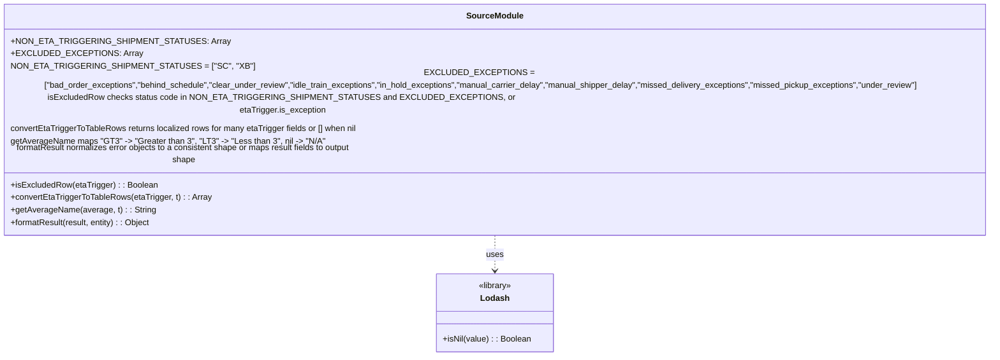

# Diagram: web/portal/src/pages/administration/internal-tools/shipment-eta-validator/ShipmentEtaTrigger.utils.js


> Auto-generated by Obscura crawlers

## Diagram 1



### SVG

<svg id="container" width="1954.5" xmlns="http://www.w3.org/2000/svg" class="classDiagram" height="624" viewBox="0 0 1954.5 624" role="graphics-document document" aria-roledescription="class"><style>#container{font-family:"trebuchet ms",verdana,arial,sans-serif;font-size:16px;fill:#333;}@keyframes edge-animation-frame{from{stroke-dashoffset:0;}}@keyframes dash{to{stroke-dashoffset:0;}}#container .edge-animation-slow{stroke-dasharray:9,5!important;stroke-dashoffset:900;animation:dash 50s linear infinite;stroke-linecap:round;}#container .edge-animation-fast{stroke-dasharray:9,5!important;stroke-dashoffset:900;animation:dash 20s linear infinite;stroke-linecap:round;}#container .error-icon{fill:#552222;}#container .error-text{fill:#552222;stroke:#552222;}#container .edge-thickness-normal{stroke-width:1px;}#container .edge-thickness-thick{stroke-width:3.5px;}#container .edge-pattern-solid{stroke-dasharray:0;}#container .edge-thickness-invisible{stroke-width:0;fill:none;}#container .edge-pattern-dashed{stroke-dasharray:3;}#container .edge-pattern-dotted{stroke-dasharray:2;}#container .marker{fill:#333333;stroke:#333333;}#container .marker.cross{stroke:#333333;}#container svg{font-family:"trebuchet ms",verdana,arial,sans-serif;font-size:16px;}#container p{margin:0;}#container g.classGroup text{fill:#9370DB;stroke:none;font-family:"trebuchet ms",verdana,arial,sans-serif;font-size:10px;}#container g.classGroup text .title{font-weight:bolder;}#container .nodeLabel,#container .edgeLabel{color:#131300;}#container .edgeLabel .label rect{fill:#ECECFF;}#container .label text{fill:#131300;}#container .labelBkg{background:#ECECFF;}#container .edgeLabel .label span{background:#ECECFF;}#container .classTitle{font-weight:bolder;}#container .node rect,#container .node circle,#container .node ellipse,#container .node polygon,#container .node path{fill:#ECECFF;stroke:#9370DB;stroke-width:1px;}#container .divider{stroke:#9370DB;stroke-width:1;}#container g.clickable{cursor:pointer;}#container g.classGroup rect{fill:#ECECFF;stroke:#9370DB;}#container g.classGroup line{stroke:#9370DB;stroke-width:1;}#container .classLabel .box{stroke:none;stroke-width:0;fill:#ECECFF;opacity:0.5;}#container .classLabel .label{fill:#9370DB;font-size:10px;}#container .relation{stroke:#333333;stroke-width:1;fill:none;}#container .dashed-line{stroke-dasharray:3;}#container .dotted-line{stroke-dasharray:1 2;}#container #compositionStart,#container .composition{fill:#333333!important;stroke:#333333!important;stroke-width:1;}#container #compositionEnd,#container .composition{fill:#333333!important;stroke:#333333!important;stroke-width:1;}#container #dependencyStart,#container .dependency{fill:#333333!important;stroke:#333333!important;stroke-width:1;}#container #dependencyStart,#container .dependency{fill:#333333!important;stroke:#333333!important;stroke-width:1;}#container #extensionStart,#container .extension{fill:transparent!important;stroke:#333333!important;stroke-width:1;}#container #extensionEnd,#container .extension{fill:transparent!important;stroke:#333333!important;stroke-width:1;}#container #aggregationStart,#container .aggregation{fill:transparent!important;stroke:#333333!important;stroke-width:1;}#container #aggregationEnd,#container .aggregation{fill:transparent!important;stroke:#333333!important;stroke-width:1;}#container #lollipopStart,#container .lollipop{fill:#ECECFF!important;stroke:#333333!important;stroke-width:1;}#container #lollipopEnd,#container .lollipop{fill:#ECECFF!important;stroke:#333333!important;stroke-width:1;}#container .edgeTerminals{font-size:11px;line-height:initial;}#container .classTitleText{text-anchor:middle;font-size:18px;fill:#333;}#container .label-icon{display:inline-block;height:1em;overflow:visible;vertical-align:-0.125em;}#container .node .label-icon path{fill:currentColor;stroke:revert;stroke-width:revert;}#container :root{--mermaid-font-family:"trebuchet ms",verdana,arial,sans-serif;}</style><g><defs><marker id="container_class-aggregationStart" class="marker aggregation class" refX="18" refY="7" markerWidth="190" markerHeight="240" orient="auto"><path d="M 18,7 L9,13 L1,7 L9,1 Z"></path></marker></defs><defs><marker id="container_class-aggregationEnd" class="marker aggregation class" refX="1" refY="7" markerWidth="20" markerHeight="28" orient="auto"><path d="M 18,7 L9,13 L1,7 L9,1 Z"></path></marker></defs><defs><marker id="container_class-extensionStart" class="marker extension class" refX="18" refY="7" markerWidth="190" markerHeight="240" orient="auto"><path d="M 1,7 L18,13 V 1 Z"></path></marker></defs><defs><marker id="container_class-extensionEnd" class="marker extension class" refX="1" refY="7" markerWidth="20" markerHeight="28" orient="auto"><path d="M 1,1 V 13 L18,7 Z"></path></marker></defs><defs><marker id="container_class-compositionStart" class="marker composition class" refX="18" refY="7" markerWidth="190" markerHeight="240" orient="auto"><path d="M 18,7 L9,13 L1,7 L9,1 Z"></path></marker></defs><defs><marker id="container_class-compositionEnd" class="marker composition class" refX="1" refY="7" markerWidth="20" markerHeight="28" orient="auto"><path d="M 18,7 L9,13 L1,7 L9,1 Z"></path></marker></defs><defs><marker id="container_class-dependencyStart" class="marker dependency class" refX="6" refY="7" markerWidth="190" markerHeight="240" orient="auto"><path d="M 5,7 L9,13 L1,7 L9,1 Z"></path></marker></defs><defs><marker id="container_class-dependencyEnd" class="marker dependency class" refX="13" refY="7" markerWidth="20" markerHeight="28" orient="auto"><path d="M 18,7 L9,13 L14,7 L9,1 Z"></path></marker></defs><defs><marker id="container_class-lollipopStart" class="marker lollipop class" refX="13" refY="7" markerWidth="190" markerHeight="240" orient="auto"><circle stroke="black" fill="transparent" cx="7" cy="7" r="6"></circle></marker></defs><defs><marker id="container_class-lollipopEnd" class="marker lollipop class" refX="1" refY="7" markerWidth="190" markerHeight="240" orient="auto"><circle stroke="black" fill="transparent" cx="7" cy="7" r="6"></circle></marker></defs><g class="root"><g class="clusters"></g><g class="edgePaths"><path d="M977.25,392L977.25,398.167C977.25,404.333,977.25,416.667,977.25,428C977.25,439.333,977.25,449.667,977.25,454.833L977.25,460" id="id_SourceModule_Lodash_1" class="edge-thickness-normal edge-pattern-dashed relation" style=";;;" data-edge="true" data-et="edge" data-id="id_SourceModule_Lodash_1" data-points="W3sieCI6OTc3LjI1LCJ5IjozOTJ9LHsieCI6OTc3LjI1LCJ5Ijo0Mjl9LHsieCI6OTc3LjI1LCJ5Ijo0NjZ9XQ==" marker-end="url(#container_class-dependencyEnd)"></path></g><g class="edgeLabels"><g class="edgeLabel" transform="translate(977.25, 429)"><g class="label" data-id="id_SourceModule_Lodash_1" transform="translate(-16.4921875, -12)"><foreignObject width="32.984375" height="24"><div xmlns="http://www.w3.org/1999/xhtml" class="labelBkg" style="display: table-cell; white-space: nowrap; line-height: 1.5; max-width: 200px; text-align: center;"><span class="edgeLabel"><p>uses</p></span></div></foreignObject></g></g></g><g class="nodes"><g class="node default" id="classId-SourceModule-0" transform="translate(977.25, 200)"><g class="basic label-container"><path d="M-969.25 -192 L969.25 -192 L969.25 192 L-969.25 192" stroke="none" stroke-width="0" fill="#ECECFF" style=""></path><path d="M-969.25 -192 C-342.7557046160416 -192, 283.7385907679168 -192, 969.25 -192 M-969.25 -192 C-506.324504113744 -192, -43.399008227488025 -192, 969.25 -192 M969.25 -192 C969.25 -107.66904642211833, 969.25 -23.338092844236655, 969.25 192 M969.25 -192 C969.25 -80.21582094893502, 969.25 31.568358102129963, 969.25 192 M969.25 192 C202.9903499461974 192, -563.2693001076052 192, -969.25 192 M969.25 192 C289.5441721403963 192, -390.1616557192074 192, -969.25 192 M-969.25 192 C-969.25 56.217332489695025, -969.25 -79.56533502060995, -969.25 -192 M-969.25 192 C-969.25 97.18401368676912, -969.25 2.36802737353824, -969.25 -192" stroke="#9370DB" stroke-width="1.3" fill="none" stroke-dasharray="0 0" style=""></path></g><g class="annotation-group text" transform="translate(0, -168)"></g><g class="label-group text" transform="translate(-51.96875, -168)"><g class="label" style="font-weight: bolder" transform="translate(0,-12)"><foreignObject width="103.9375" height="24"><div xmlns="http://www.w3.org/1999/xhtml" style="display: table-cell; white-space: nowrap; line-height: 1.5; max-width: 153px; text-align: center;"><span class="nodeLabel markdown-node-label" style=""><p>SourceModule</p></span></div></foreignObject></g></g><g class="members-group text" transform="translate(-957.25, -120)"><g class="label" style="" transform="translate(0,-12)"><foreignObject width="371.53125" height="24"><div xmlns="http://www.w3.org/1999/xhtml" style="display: table-cell; white-space: nowrap; line-height: 1.5; max-width: 429px; text-align: center;"><span class="nodeLabel markdown-node-label" style=""><p>+NON_ETA_TRIGGERING_SHIPMENT_STATUSES: Array</p></span></div></foreignObject></g><g class="label" style="" transform="translate(0,12)"><foreignObject width="221.421875" height="24"><div xmlns="http://www.w3.org/1999/xhtml" style="display: table-cell; white-space: nowrap; line-height: 1.5; max-width: 279px; text-align: center;"><span class="nodeLabel markdown-node-label" style=""><p>+EXCLUDED_EXCEPTIONS: Array</p></span></div></foreignObject></g><g class="label" style="" transform="translate(0,36)"><foreignObject width="413.171875" height="24"><div xmlns="http://www.w3.org/1999/xhtml" style="display: table-cell; white-space: nowrap; line-height: 1.5; max-width: 463px; text-align: center;"><span class="nodeLabel markdown-node-label" style=""><p>NON_ETA_TRIGGERING_SHIPMENT_STATUSES = ["SC", "XB"]</p></span></div></foreignObject></g><g class="label" style="" transform="translate(0,60)"><foreignObject width="1862.53125" height="24"><div xmlns="http://www.w3.org/1999/xhtml" style="display: table-cell; white-space: nowrap; line-height: 1.5; max-width: 1913px; text-align: center;"><span class="nodeLabel markdown-node-label" style=""><p>EXCLUDED_EXCEPTIONS = ["bad_order_exceptions","behind_schedule","clear_under_review","idle_train_exceptions","in_hold_exceptions","manual_carrier_delay","manual_shipper_delay","missed_delivery_exceptions","missed_pickup_exceptions","under_review"]</p></span></div></foreignObject></g><g class="label" style="" transform="translate(0,84)"><foreignObject width="987.359375" height="24"><div xmlns="http://www.w3.org/1999/xhtml" style="display: table-cell; white-space: nowrap; line-height: 1.5; max-width: 1037px; text-align: center;"><span class="nodeLabel markdown-node-label" style=""><p>isExcludedRow checks status code in NON_ETA_TRIGGERING_SHIPMENT_STATUSES and EXCLUDED_EXCEPTIONS, or etaTrigger.is_exception</p></span></div></foreignObject></g><g class="label" style="" transform="translate(0,108)"><foreignObject width="673.890625" height="24"><div xmlns="http://www.w3.org/1999/xhtml" style="display: table-cell; white-space: nowrap; line-height: 1.5; max-width: 724px; text-align: center;"><span class="nodeLabel markdown-node-label" style=""><p>convertEtaTriggerToTableRows returns localized rows for many etaTrigger fields or [] when nil</p></span></div></foreignObject></g><g class="label" style="" transform="translate(0,132)"><foreignObject width="593.65625" height="24"><div xmlns="http://www.w3.org/1999/xhtml" style="display: table-cell; white-space: nowrap; line-height: 1.5; max-width: 707px; text-align: center;"><span class="nodeLabel markdown-node-label" style=""><p>getAverageName maps "GT3" -&gt; "Greater than 3", "LT3" -&gt; "Less than 3", nil -&gt; "N/A"</p></span></div></foreignObject></g><g class="label" style="" transform="translate(0,156)"><foreignObject width="708.265625" height="24"><div xmlns="http://www.w3.org/1999/xhtml" style="display: table-cell; white-space: nowrap; line-height: 1.5; max-width: 758px; text-align: center;"><span class="nodeLabel markdown-node-label" style=""><p>formatResult normalizes error objects to a consistent shape or maps result fields to output shape</p></span></div></foreignObject></g></g><g class="methods-group text" transform="translate(-957.25, 96)"><g class="label" style="" transform="translate(0,-12)"><foreignObject width="279.1875" height="24"><div xmlns="http://www.w3.org/1999/xhtml" style="display: table-cell; white-space: nowrap; line-height: 1.5; max-width: 337px; text-align: center;"><span class="nodeLabel markdown-node-label" style=""><p>+isExcludedRow(etaTrigger) : : Boolean</p></span></div></foreignObject></g><g class="label" style="" transform="translate(0,12)"><foreignObject width="381.828125" height="24"><div xmlns="http://www.w3.org/1999/xhtml" style="display: table-cell; white-space: nowrap; line-height: 1.5; max-width: 439px; text-align: center;"><span class="nodeLabel markdown-node-label" style=""><p>+convertEtaTriggerToTableRows(etaTrigger, t) : : Array</p></span></div></foreignObject></g><g class="label" style="" transform="translate(0,36)"><foreignObject width="272.53125" height="24"><div xmlns="http://www.w3.org/1999/xhtml" style="display: table-cell; white-space: nowrap; line-height: 1.5; max-width: 331px; text-align: center;"><span class="nodeLabel markdown-node-label" style=""><p>+getAverageName(average, t) : : String</p></span></div></foreignObject></g><g class="label" style="" transform="translate(0,60)"><foreignObject width="271.796875" height="24"><div xmlns="http://www.w3.org/1999/xhtml" style="display: table-cell; white-space: nowrap; line-height: 1.5; max-width: 329px; text-align: center;"><span class="nodeLabel markdown-node-label" style=""><p>+formatResult(result, entity) : : Object</p></span></div></foreignObject></g></g><g class="divider" style=""><path d="M-969.25 -144 C-373.63031590097125 -144, 221.9893681980575 -144, 969.25 -144 M-969.25 -144 C-220.5428937285311 -144, 528.1642125429378 -144, 969.25 -144" stroke="#9370DB" stroke-width="1.3" fill="none" stroke-dasharray="0 0" style=""></path></g><g class="divider" style=""><path d="M-969.25 72 C-249.18578589670813 72, 470.87842820658375 72, 969.25 72 M-969.25 72 C-227.97435042192217 72, 513.3012991561557 72, 969.25 72" stroke="#9370DB" stroke-width="1.3" fill="none" stroke-dasharray="0 0" style=""></path></g></g><g class="node default" id="classId-Lodash-1" transform="translate(977.25, 541)"><g class="basic label-container"><path d="M-113.04296875 -75 L113.04296875 -75 L113.04296875 75 L-113.04296875 75" stroke="none" stroke-width="0" fill="#ECECFF" style=""></path><path d="M-113.04296875 -75 C-45.8296214454697 -75, 21.383725859060604 -75, 113.04296875 -75 M-113.04296875 -75 C-61.44175995446618 -75, -9.840551158932357 -75, 113.04296875 -75 M113.04296875 -75 C113.04296875 -18.72539413787711, 113.04296875 37.54921172424578, 113.04296875 75 M113.04296875 -75 C113.04296875 -33.635999053337756, 113.04296875 7.728001893324489, 113.04296875 75 M113.04296875 75 C41.96191588876984 75, -29.119136972460325 75, -113.04296875 75 M113.04296875 75 C65.8233829032176 75, 18.603797056435212 75, -113.04296875 75 M-113.04296875 75 C-113.04296875 25.258922429991173, -113.04296875 -24.482155140017653, -113.04296875 -75 M-113.04296875 75 C-113.04296875 40.08770205285488, -113.04296875 5.1754041057097595, -113.04296875 -75" stroke="#9370DB" stroke-width="1.3" fill="none" stroke-dasharray="0 0" style=""></path></g><g class="annotation-group text" transform="translate(-32.6640625, -51)"><g class="label" style="" transform="translate(0,-12)"><foreignObject width="65.328125" height="24"><div xmlns="http://www.w3.org/1999/xhtml" style="display: table-cell; white-space: nowrap; line-height: 1.5; max-width: 115px; text-align: center;"><span class="nodeLabel markdown-node-label" style=""><p>«library»</p></span></div></foreignObject></g></g><g class="label-group text" transform="translate(-26.1640625, -27)"><g class="label" style="font-weight: bolder" transform="translate(0,-12)"><foreignObject width="52.328125" height="24"><div xmlns="http://www.w3.org/1999/xhtml" style="display: table-cell; white-space: nowrap; line-height: 1.5; max-width: 102px; text-align: center;"><span class="nodeLabel markdown-node-label" style=""><p>Lodash</p></span></div></foreignObject></g></g><g class="members-group text" transform="translate(-101.04296875, 21)"></g><g class="methods-group text" transform="translate(-101.04296875, 51)"><g class="label" style="" transform="translate(0,-12)"><foreignObject width="169.421875" height="24"><div xmlns="http://www.w3.org/1999/xhtml" style="display: table-cell; white-space: nowrap; line-height: 1.5; max-width: 227px; text-align: center;"><span class="nodeLabel markdown-node-label" style=""><p>+isNil(value) : : Boolean</p></span></div></foreignObject></g></g><g class="divider" style=""><path d="M-113.04296875 -3 C-30.34220675285745 -3, 52.3585552442851 -3, 113.04296875 -3 M-113.04296875 -3 C-42.87633970144512 -3, 27.290289347109763 -3, 113.04296875 -3" stroke="#9370DB" stroke-width="1.3" fill="none" stroke-dasharray="0 0" style=""></path></g><g class="divider" style=""><path d="M-113.04296875 21 C-66.20738750959978 21, -19.371806269199567 21, 113.04296875 21 M-113.04296875 21 C-51.49726560961917 21, 10.04843753076166 21, 113.04296875 21" stroke="#9370DB" stroke-width="1.3" fill="none" stroke-dasharray="0 0" style=""></path></g></g></g></g></g></svg>

## Diagram 2

```mermaid
flowchart LR
  A[convertEtaTriggerToTableRows(etaTrigger, t)] --> B{_.isNil(etaTrigger)?}
  B -- yes --> C[Return []]
  B -- no --> D[Initialize rows = []]
  D --> E[Push Shipment Status Created Date UTC -> etaTrigger.shipmentStatusCreatedDateUTC]
  E --> F[Push Shipment Status Actual Event Date UTC -> etaTrigger.shipmentStatusActualEventDateUTC]
  F --> G[Push ETA Calculation Shipment Status Code -> etaTrigger.etaCalculationShipmentStatusCode]
  G --> H[Push ETA Calculation Point Of Interest -> etaTrigger.etaCalculationPointOfInterest]
  H --> I[Push ETA Calculation Latitude -> etaTrigger.etaCalculationLatitude]
  I --> J[Push ETA Calculation Longitude -> etaTrigger.etaCalculationLongitude]
  J --> K[Push ETA Calculation City -> etaTrigger.etaCalculationCity]
  K --> L[Push ETA Calculation State -> etaTrigger.etaCalculationStateOrProvince]
  L --> M[Push ETA Calculation Country -> etaTrigger.etaCalculationCountry]
  M --> N[Push Number Of Observations In Model -> etaTrigger.numberOfObservationsInModel]
  N --> O[Push Scheduled Delivery -> etaTrigger.scheduledDeliveryWindow]
  O --> P[Return rows]
```

> SVG rendering failed for this diagram.
