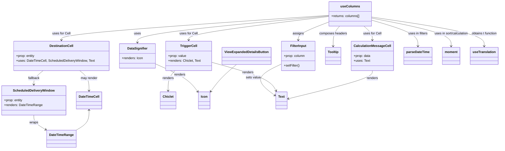
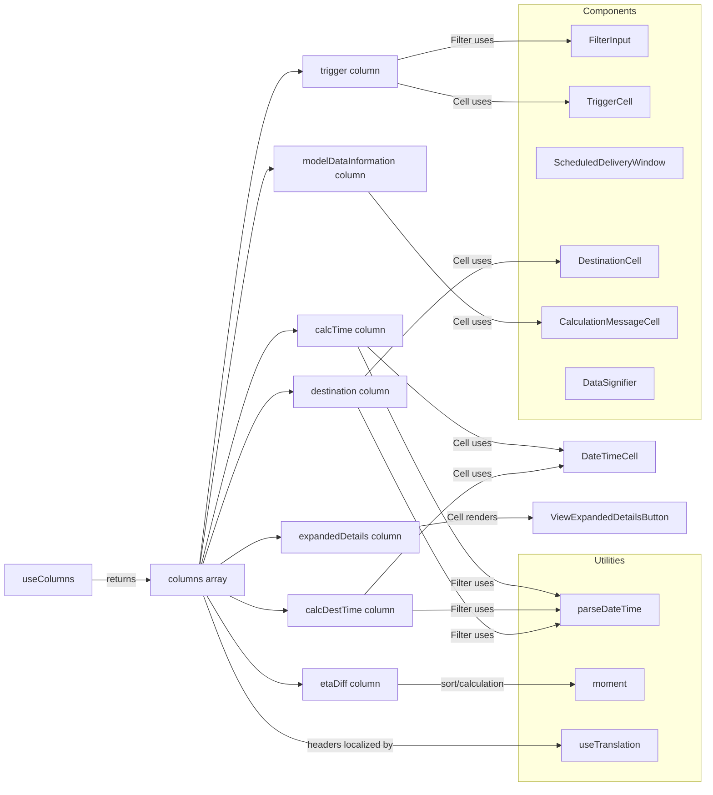

# Diagram: web/portal/src/pages/administration/internal-tools/shipment-eta-validator/ShipmentEtaValidator.columns.js

> Auto-generated by Obscura crawlers

## Diagram 1

### SVG

<svg id="container" width="2408.5703125" xmlns="http://www.w3.org/2000/svg" class="classDiagram" height="730" viewBox="0 0 2408.5703125 730" role="graphics-document document" aria-roledescription="class"><g><defs><marker id="container_class-aggregationStart" class="marker aggregation class" refX="18" refY="7" markerWidth="190" markerHeight="240" orient="auto"><path d="M 18,7 L9,13 L1,7 L9,1 Z"></path></marker></defs><defs><marker id="container_class-aggregationEnd" class="marker aggregation class" refX="1" refY="7" markerWidth="20" markerHeight="28" orient="auto"><path d="M 18,7 L9,13 L1,7 L9,1 Z"></path></marker></defs><defs><marker id="container_class-extensionStart" class="marker extension class" refX="18" refY="7" markerWidth="190" markerHeight="240" orient="auto"><path d="M 1,7 L18,13 V 1 Z"></path></marker></defs><defs><marker id="container_class-extensionEnd" class="marker extension class" refX="1" refY="7" markerWidth="20" markerHeight="28" orient="auto"><path d="M 1,1 V 13 L18,7 Z"></path></marker></defs><defs><marker id="container_class-compositionStart" class="marker composition class" refX="18" refY="7" markerWidth="190" markerHeight="240" orient="auto"><path d="M 18,7 L9,13 L1,7 L9,1 Z"></path></marker></defs><defs><marker id="container_class-compositionEnd" class="marker composition class" refX="1" refY="7" markerWidth="20" markerHeight="28" orient="auto"><path d="M 18,7 L9,13 L1,7 L9,1 Z"></path></marker></defs><defs><marker id="container_class-dependencyStart" class="marker dependency class" refX="6" refY="7" markerWidth="190" markerHeight="240" orient="auto"><path d="M 5,7 L9,13 L1,7 L9,1 Z"></path></marker></defs><defs><marker id="container_class-dependencyEnd" class="marker dependency class" refX="13" refY="7" markerWidth="20" markerHeight="28" orient="auto"><path d="M 18,7 L9,13 L14,7 L9,1 Z"></path></marker></defs><defs><marker id="container_class-lollipopStart" class="marker lollipop class" refX="13" refY="7" markerWidth="190" markerHeight="240" orient="auto"><circle stroke="black" fill="transparent" cx="7" cy="7" r="6"></circle></marker></defs><defs><marker id="container_class-lollipopEnd" class="marker lollipop class" refX="1" refY="7" markerWidth="190" markerHeight="240" orient="auto"><circle stroke="black" fill="transparent" cx="7" cy="7" r="6"></circle></marker></defs><g class="root"><g class="clusters"></g><g class="edgePaths"><path d="M1350.492,314.03L1326.638,325.525C1302.784,337.02,1255.076,360.01,1249.262,385.514C1243.448,411.019,1279.528,439.037,1297.568,453.046L1315.609,467.056" id="id_FilterInput_Text_1" class="edge-thickness-normal edge-pattern-solid relation" style=";;;" data-edge="true" data-et="edge" data-id="id_FilterInput_Text_1" data-points="W3sieCI6MTM1MC40OTIxODc1LCJ5IjozMTQuMDMwMjkwNDcwNzYyOTZ9LHsieCI6MTIwNy4zNjcxODc1LCJ5IjozODN9LHsieCI6MTMyMC4zNDc2NTYyNSwieSI6NDcwLjczNTcwMjU1NzUzNzY1fV0=" marker-end="url(#container_class-dependencyEnd)"></path><path d="M840.482,346L834.672,352.167C828.862,358.333,817.241,370.667,811.431,387C805.621,403.333,805.621,423.667,805.621,433.833L805.621,444" id="id_TriggerCell_Chiclet_2" class="edge-thickness-normal edge-pattern-solid relation" style=";;;" data-edge="true" data-et="edge" data-id="id_TriggerCell_Chiclet_2" data-points="W3sieCI6ODQwLjQ4MjI5NjQ0NDk1NDIsInkiOjM0Nn0seyJ4Ijo4MDUuNjIxMDkzNzUsInkiOjM4M30seyJ4Ijo4MDUuNjIxMDkzNzUsInkiOjQ1MH1d" marker-end="url(#container_class-dependencyEnd)"></path><path d="M1019.352,305.593L1064.693,318.494C1110.034,331.395,1200.716,357.198,1251.369,380.377C1302.022,403.557,1312.646,424.113,1317.958,434.391L1323.27,444.67" id="id_TriggerCell_Text_3" class="edge-thickness-normal edge-pattern-solid relation" style=";;;" data-edge="true" data-et="edge" data-id="id_TriggerCell_Text_3" data-points="W3sieCI6MTAxOS4zNTE1NjI1LCJ5IjozMDUuNTkyNTI3NjMzODg2N30seyJ4IjoxMjkxLjM5ODQzNzUsInkiOjM4M30seyJ4IjoxMzI2LjAyNDU0ODQ1MTgzNDgsInkiOjQ1MH1d" marker-end="url(#container_class-dependencyEnd)"></path><path d="M160.906,564L160.906,570.167C160.906,576.333,160.906,588.667,170.455,600.567C180.004,612.467,199.102,623.934,208.651,629.668L218.2,635.401" id="id_ScheduledDeliveryWindow_DateTimeRange_4" class="edge-thickness-normal edge-pattern-solid relation" style=";;;" data-edge="true" data-et="edge" data-id="id_ScheduledDeliveryWindow_DateTimeRange_4" data-points="W3sieCI6MTYwLjkwNjI1LCJ5Ijo1NjR9LHsieCI6MTYwLjkwNjI1LCJ5Ijo2MDF9LHsieCI6MjIzLjM0Mzc1LCJ5Ijo2MzguNDg5OTM1Mjc3MDAyNn1d" marker-end="url(#container_class-dependencyEnd)"></path><path d="M379.385,346L386.829,352.167C394.273,358.333,409.16,370.667,416.603,387C424.047,403.333,424.047,423.667,424.047,433.833L424.047,444" id="id_DestinationCell_DateTimeCell_5" class="edge-thickness-normal edge-pattern-solid relation" style=";;;" data-edge="true" data-et="edge" data-id="id_DestinationCell_DateTimeCell_5" data-points="W3sieCI6Mzc5LjM4NTM5Mjc3NTIyOTQsInkiOjM0Nn0seyJ4Ijo0MjQuMDQ2ODc1LCJ5IjozODN9LHsieCI6NDI0LjA0Njg3NSwieSI6NDUwfV0=" marker-end="url(#container_class-dependencyEnd)"></path><path d="M205.568,346L198.124,352.167C190.681,358.333,175.793,370.667,168.35,382C160.906,393.333,160.906,403.667,160.906,408.833L160.906,414" id="id_DestinationCell_ScheduledDeliveryWindow_6" class="edge-thickness-normal edge-pattern-solid relation" style=";;;" data-edge="true" data-et="edge" data-id="id_DestinationCell_ScheduledDeliveryWindow_6" data-points="W3sieCI6MjA1LjU2NzczMjIyNDc3MDYyLCJ5IjozNDZ9LHsieCI6MTYwLjkwNjI1LCJ5IjozODN9LHsieCI6MTYwLjkwNjI1LCJ5Ijo0MjB9XQ==" marker-end="url(#container_class-dependencyEnd)"></path><path d="M1789.789,346L1789.789,352.167C1789.789,358.333,1789.789,370.667,1721.647,393.635C1653.506,416.604,1517.222,450.208,1449.081,467.01L1380.939,483.812" id="id_CalculationMessageCell_Text_7" class="edge-thickness-normal edge-pattern-solid relation" style=";;;" data-edge="true" data-et="edge" data-id="id_CalculationMessageCell_Text_7" data-points="W3sieCI6MTc4OS43ODkwNjI1LCJ5IjozNDZ9LHsieCI6MTc4OS43ODkwNjI1LCJ5IjozODN9LHsieCI6MTM3NS4xMTMyODEyNSwieSI6NDg1LjI0ODEyMDAzNDk5MjU1fV0=" marker-end="url(#container_class-dependencyEnd)"></path><path d="M747.289,313.432L772.834,325.027C798.379,336.621,849.469,359.811,882.667,382.285C915.865,404.759,931.171,426.518,938.824,437.398L946.478,448.277" id="id_DataSignifier_Icon_8" class="edge-thickness-normal edge-pattern-solid relation" style=";;;" data-edge="true" data-et="edge" data-id="id_DataSignifier_Icon_8" data-points="W3sieCI6NzQ3LjI4OTA2MjUsInkiOjMxMy40MzE5ODI2OTI3MTQzN30seyJ4Ijo5MDAuNTU4NTkzNzUsInkiOjM4M30seyJ4Ijo5NDkuOTI5Njg3NSwieSI6NDUzLjE4NDQ3MTk1NDc2MDh9XQ==" marker-end="url(#container_class-dependencyEnd)"></path><path d="M1578.648,108.535L1554.467,117.946C1530.286,127.356,1481.924,146.178,1457.743,160.756C1433.563,175.333,1433.563,185.667,1433.563,190.833L1433.563,196" id="id_useColumns_FilterInput_9" class="edge-thickness-normal edge-pattern-solid relation" style=";;;" data-edge="true" data-et="edge" data-id="id_useColumns_FilterInput_9" data-points="W3sieCI6MTU3OC42NDg0Mzc1LCJ5IjoxMDguNTM0NjEzMjc0ODIxNzJ9LHsieCI6MTQzMy41NjI1LCJ5IjoxNjV9LHsieCI6MTQzMy41NjI1LCJ5IjoyMDJ9XQ==" marker-end="url(#container_class-dependencyEnd)"></path><path d="M1578.648,77.882L1425.609,92.401C1272.57,106.921,966.492,135.961,813.453,157.647C660.414,179.333,660.414,193.667,660.414,200.833L660.414,208" id="id_useColumns_DataSignifier_10" class="edge-thickness-normal edge-pattern-solid relation" style=";;;" data-edge="true" data-et="edge" data-id="id_useColumns_DataSignifier_10" data-points="W3sieCI6MTU3OC42NDg0Mzc1LCJ5Ijo3Ny44ODE1NjE2MDMzMjU1NX0seyJ4Ijo2NjAuNDE0MDYyNSwieSI6MTY1fSx7IngiOjY2MC40MTQwNjI1LCJ5IjoyMTR9XQ==" marker-end="url(#container_class-dependencyEnd)"></path><path d="M1578.648,81.045L1466.927,95.037C1355.206,109.03,1131.763,137.015,1020.042,156.174C908.32,175.333,908.32,185.667,908.32,190.833L908.32,196" id="id_useColumns_TriggerCell_11" class="edge-thickness-normal edge-pattern-solid relation" style=";;;" data-edge="true" data-et="edge" data-id="id_useColumns_TriggerCell_11" data-points="W3sieCI6MTU3OC42NDg0Mzc1LCJ5Ijo4MS4wNDQ1ODYzNDA2NDE2Nn0seyJ4Ijo5MDguMzIwMzEyNSwieSI6MTY1fSx7IngiOjkwOC4zMjAzMTI1LCJ5IjoyMDJ9XQ==" marker-end="url(#container_class-dependencyEnd)"></path><path d="M1578.648,75.266L1364.286,90.222C1149.924,105.178,721.201,135.089,506.839,155.211C292.477,175.333,292.477,185.667,292.477,190.833L292.477,196" id="id_useColumns_DestinationCell_12" class="edge-thickness-normal edge-pattern-solid relation" style=";;;" data-edge="true" data-et="edge" data-id="id_useColumns_DestinationCell_12" data-points="W3sieCI6MTU3OC42NDg0Mzc1LCJ5Ijo3NS4yNjY0OTAyMjQwMDkxMn0seyJ4IjoyOTIuNDc2NTYyNSwieSI6MTY1fSx7IngiOjI5Mi40NzY1NjI1LCJ5IjoyMDJ9XQ==" marker-end="url(#container_class-dependencyEnd)"></path><path d="M1748.979,128L1755.781,134.167C1762.582,140.333,1776.186,152.667,1782.987,164C1789.789,175.333,1789.789,185.667,1789.789,190.833L1789.789,196" id="id_useColumns_CalculationMessageCell_13" class="edge-thickness-normal edge-pattern-solid relation" style=";;;" data-edge="true" data-et="edge" data-id="id_useColumns_CalculationMessageCell_13" data-points="W3sieCI6MTc0OC45NzkwOTk1NDg5NjksInkiOjEyOH0seyJ4IjoxNzg5Ljc4OTA2MjUsInkiOjE2NX0seyJ4IjoxNzg5Ljc4OTA2MjUsInkiOjIwMn1d" marker-end="url(#container_class-dependencyEnd)"></path><path d="M1634.28,128L1629.293,134.167C1624.307,140.333,1614.333,152.667,1609.346,169C1604.359,185.333,1604.359,205.667,1604.359,215.833L1604.359,226" id="id_useColumns_Tooltip_14" class="edge-thickness-normal edge-pattern-solid relation" style=";;;" data-edge="true" data-et="edge" data-id="id_useColumns_Tooltip_14" data-points="W3sieCI6MTYzNC4yODAzMjM3NzU3NzMyLCJ5IjoxMjh9LHsieCI6MTYwNC4zNTkzNzUsInkiOjE2NX0seyJ4IjoxNjA0LjM1OTM3NSwieSI6MjMyfV0=" marker-end="url(#container_class-dependencyEnd)"></path><path d="M1786.953,99.395L1823.227,110.329C1859.5,121.264,1932.047,143.132,1968.32,164.233C2004.594,185.333,2004.594,205.667,2004.594,215.833L2004.594,226" id="id_useColumns_parseDateTime_15" class="edge-thickness-normal edge-pattern-solid relation" style=";;;" data-edge="true" data-et="edge" data-id="id_useColumns_parseDateTime_15" data-points="W3sieCI6MTc4Ni45NTMxMjUsInkiOjk5LjM5NTI3MDYzOTM2MTk3fSx7IngiOjIwMDQuNTkzNzUsInkiOjE2NX0seyJ4IjoyMDA0LjU5Mzc1LCJ5IjoyMzJ9XQ==" marker-end="url(#container_class-dependencyEnd)"></path><path d="M1786.953,88.995L1849.796,101.662C1912.638,114.33,2038.323,139.665,2101.165,162.499C2164.008,185.333,2164.008,205.667,2164.008,215.833L2164.008,226" id="id_useColumns_moment_16" class="edge-thickness-normal edge-pattern-solid relation" style=";;;" data-edge="true" data-et="edge" data-id="id_useColumns_moment_16" data-points="W3sieCI6MTc4Ni45NTMxMjUsInkiOjg4Ljk5NDY1ODYxMzk5OTYzfSx7IngiOjIxNjQuMDA3ODEyNSwieSI6MTY1fSx7IngiOjIxNjQuMDA3ODEyNSwieSI6MjMyfV0=" marker-end="url(#container_class-dependencyEnd)"></path><path d="M1786.953,83.503L1878.208,97.085C1969.464,110.668,2151.974,137.834,2243.229,161.584C2334.484,185.333,2334.484,205.667,2334.484,215.833L2334.484,226" id="id_useColumns_useTranslation_17" class="edge-thickness-normal edge-pattern-solid relation" style=";;;" data-edge="true" data-et="edge" data-id="id_useColumns_useTranslation_17" data-points="W3sieCI6MTc4Ni45NTMxMjUsInkiOjgzLjUwMjU4MDQ1NTY3MDcxfSx7IngiOjIzMzQuNDg0Mzc1LCJ5IjoxNjV9LHsieCI6MjMzNC40ODQzNzUsInkiOjIzMn1d" marker-end="url(#container_class-dependencyEnd)"></path><path d="M424.047,540L424.047,550.167C424.047,560.333,424.047,580.667,413.641,597.082C403.234,613.497,382.422,625.993,372.016,632.242L361.609,638.49" id="id_DateTimeCell_DateTimeRange_18" class="edge-thickness-normal edge-pattern-solid relation" style=";;;" data-edge="true" data-et="edge" data-id="id_DateTimeCell_DateTimeRange_18" data-points="W3sieCI6NDI0LjA0Njg3NSwieSI6NTM0fSx7IngiOjQyNC4wNDY4NzUsInkiOjYwMX0seyJ4IjozNjEuNjA5Mzc1LCJ5Ijo2MzguNDg5OTM1Mjc3MDAyNn1d" marker-start="url(#container_class-dependencyStart)"></path><path d="M1134.824,316L1121.504,327.167C1108.185,338.333,1081.546,360.667,1060.412,382.799C1039.278,404.932,1023.649,426.864,1015.835,437.83L1008.021,448.796" id="id_ViewExpandedDetailsButton_Icon_19" class="edge-thickness-normal edge-pattern-solid relation" style=";;;" data-edge="true" data-et="edge" data-id="id_ViewExpandedDetailsButton_Icon_19" data-points="W3sieCI6MTEzNC44MjQxMTEyMzg1MzIyLCJ5IjozMTZ9LHsieCI6MTA1NC45MDYyNSwieSI6MzgzfSx7IngiOjEwMDQuNTM5MDYyNSwieSI6NDUzLjY4MjI1NzA5MTEyODZ9XQ==" marker-end="url(#container_class-dependencyEnd)"></path></g><g class="edgeLabels"><g class="edgeLabel" transform="translate(1214.49753, 379.564)"><g class="label" data-id="id_FilterInput_Text_1" transform="translate(-36.28125, -12)"><foreignObject width="72.5625" height="24">

sets value

</foreignObject></g></g><g class="edgeLabel" transform="translate(805.62109375, 383)"><g class="label" data-id="id_TriggerCell_Chiclet_2" transform="translate(-27.75, -12)"><foreignObject width="55.5" height="24">

renders

</foreignObject></g></g><g class="edgeLabel" transform="translate(1191.64466, 354.61633)"><g class="label" data-id="id_TriggerCell_Text_3" transform="translate(-27.75, -12)"><foreignObject width="55.5" height="24">

renders

</foreignObject></g></g><g class="edgeLabel" transform="translate(160.90625, 601)"><g class="label" data-id="id_ScheduledDeliveryWindow_DateTimeRange_4" transform="translate(-21.390625, -12)"><foreignObject width="42.78125" height="24">

wraps

</foreignObject></g></g><g class="edgeLabel" transform="translate(424.046875, 383)"><g class="label" data-id="id_DestinationCell_DateTimeCell_5" transform="translate(-41.2734375, -12)"><foreignObject width="82.546875" height="24">

may render

</foreignObject></g></g><g class="edgeLabel" transform="translate(160.90625, 383)"><g class="label" data-id="id_DestinationCell_ScheduledDeliveryWindow_6" transform="translate(-28.4140625, -12)"><foreignObject width="56.828125" height="24">

fallback

</foreignObject></g></g><g class="edgeLabel" transform="translate(1789.7890625, 383)"><g class="label" data-id="id_CalculationMessageCell_Text_7" transform="translate(-27.75, -12)"><foreignObject width="55.5" height="24">

renders

</foreignObject></g></g><g class="edgeLabel" transform="translate(862.99272, 365.9491)"><g class="label" data-id="id_DataSignifier_Icon_8" transform="translate(-27.75, -12)"><foreignObject width="55.5" height="24">

renders

</foreignObject></g></g><g class="edgeLabel" transform="translate(1433.5625, 165)"><g class="label" data-id="id_useColumns_FilterInput_9" transform="translate(-26.5078125, -12)"><foreignObject width="53.015625" height="24">

assigns

</foreignObject></g></g><g class="edgeLabel" transform="translate(660.4140625, 165)"><g class="label" data-id="id_useColumns_DataSignifier_10" transform="translate(-16.4921875, -12)"><foreignObject width="32.984375" height="24">

uses

</foreignObject></g></g><g class="edgeLabel" transform="translate(908.3203125, 165)"><g class="label" data-id="id_useColumns_TriggerCell_11" transform="translate(-44.4609375, -12)"><foreignObject width="88.921875" height="24">

uses for Cell

</foreignObject></g></g><g class="edgeLabel" transform="translate(292.4765625, 165)"><g class="label" data-id="id_useColumns_DestinationCell_12" transform="translate(-44.4609375, -12)"><foreignObject width="88.921875" height="24">

uses for Cell

</foreignObject></g></g><g class="edgeLabel" transform="translate(1789.7890625, 165)"><g class="label" data-id="id_useColumns_CalculationMessageCell_13" transform="translate(-44.4609375, -12)"><foreignObject width="88.921875" height="24">

uses for Cell

</foreignObject></g></g><g class="edgeLabel" transform="translate(1604.359375, 165)"><g class="label" data-id="id_useColumns_Tooltip_14" transform="translate(-67.7421875, -12)"><foreignObject width="135.484375" height="24">

composes headers

</foreignObject></g></g><g class="edgeLabel" transform="translate(2004.59375, 165)"><g class="label" data-id="id_useColumns_parseDateTime_15" transform="translate(-48.453125, -12)"><foreignObject width="96.90625" height="24">

uses in filters

</foreignObject></g></g><g class="edgeLabel" transform="translate(2164.0078125, 165)"><g class="label" data-id="id_useColumns_moment_16" transform="translate(-85.703125, -12)"><foreignObject width="171.40625" height="24">

uses in sort/calculation

</foreignObject></g></g><g class="edgeLabel" transform="translate(2334.484375, 165)"><g class="label" data-id="id_useColumns_useTranslation_17" transform="translate(-64.7734375, -12)"><foreignObject width="129.546875" height="24">

obtains t function

</foreignObject></g></g><g class="edgeLabel"><g class="label" data-id="id_DateTimeCell_DateTimeRange_18" transform="translate(0, 0)"><foreignObject width="0" height="0">

</foreignObject></g></g><g class="edgeLabel"><g class="label" data-id="id_ViewExpandedDetailsButton_Icon_19" transform="translate(0, 0)"><foreignObject width="0" height="0">

</foreignObject></g></g></g><g class="nodes"><g class="node default" id="classId-FilterInput-0" transform="translate(1433.5625, 274)"><g class="basic label-container"><path d="M-83.0703125 -72 L83.0703125 -72 L83.0703125 72 L-83.0703125 72" stroke="none" stroke-width="0" fill="#ECECFF" style=""></path><path d="M-83.0703125 -72 C-44.88292286190857 -72, -6.695533223817137 -72, 83.0703125 -72 M-83.0703125 -72 C-29.369912172251105 -72, 24.33048815549779 -72, 83.0703125 -72 M83.0703125 -72 C83.0703125 -30.454369658430636, 83.0703125 11.091260683138728, 83.0703125 72 M83.0703125 -72 C83.0703125 -26.68516736237713, 83.0703125 18.629665275245742, 83.0703125 72 M83.0703125 72 C19.18834060754274 72, -44.69363128491452 72, -83.0703125 72 M83.0703125 72 C29.63108584772948 72, -23.80814080454104 72, -83.0703125 72 M-83.0703125 72 C-83.0703125 29.8648128561088, -83.0703125 -12.270374287782403, -83.0703125 -72 M-83.0703125 72 C-83.0703125 36.56152099908107, -83.0703125 1.1230419981621367, -83.0703125 -72" stroke="#9370DB" stroke-width="1.3" fill="none" stroke-dasharray="0 0" style=""></path></g><g class="annotation-group text" transform="translate(0, -48)"></g><g class="label-group text" transform="translate(-38.265625, -48)"><g class="label" style="font-weight: bolder" transform="translate(0,-12)"><foreignObject width="76.53125" height="24">

FilterInput

</foreignObject></g></g><g class="members-group text" transform="translate(-71.0703125, 0)"><g class="label" style="" transform="translate(0,-12)"><foreignObject width="103.875" height="24">

+prop: column

</foreignObject></g></g><g class="methods-group text" transform="translate(-71.0703125, 48)"><g class="label" style="" transform="translate(0,-12)"><foreignObject width="77.25" height="24">

+setFilter()

</foreignObject></g></g><g class="divider" style=""><path d="M-83.0703125 -24 C-23.70290919039393 -24, 35.66449411921214 -24, 83.0703125 -24 M-83.0703125 -24 C-41.78349424977688 -24, -0.49667599955375863 -24, 83.0703125 -24" stroke="#9370DB" stroke-width="1.3" fill="none" stroke-dasharray="0 0" style=""></path></g><g class="divider" style=""><path d="M-83.0703125 24 C-20.624055749109672 24, 41.822201001780655 24, 83.0703125 24 M-83.0703125 24 C-45.31491082160642 24, -7.559509143212836 24, 83.0703125 24" stroke="#9370DB" stroke-width="1.3" fill="none" stroke-dasharray="0 0" style=""></path></g></g><g class="node default" id="classId-TriggerCell-1" transform="translate(908.3203125, 274)"><g class="basic label-container"><path d="M-111.03125 -72 L111.03125 -72 L111.03125 72 L-111.03125 72" stroke="none" stroke-width="0" fill="#ECECFF" style=""></path><path d="M-111.03125 -72 C-60.866152310050076 -72, -10.701054620100152 -72, 111.03125 -72 M-111.03125 -72 C-56.46314597765053 -72, -1.8950419553010533 -72, 111.03125 -72 M111.03125 -72 C111.03125 -34.90001188012356, 111.03125 2.1999762397528855, 111.03125 72 M111.03125 -72 C111.03125 -23.2335894929533, 111.03125 25.5328210140934, 111.03125 72 M111.03125 72 C26.02285157788222 72, -58.98554684423556 72, -111.03125 72 M111.03125 72 C53.249759658942345 72, -4.53173068211531 72, -111.03125 72 M-111.03125 72 C-111.03125 30.375207362211192, -111.03125 -11.249585275577616, -111.03125 -72 M-111.03125 72 C-111.03125 22.463388608109604, -111.03125 -27.073222783780793, -111.03125 -72" stroke="#9370DB" stroke-width="1.3" fill="none" stroke-dasharray="0 0" style=""></path></g><g class="annotation-group text" transform="translate(0, -48)"></g><g class="label-group text" transform="translate(-39.421875, -48)"><g class="label" style="font-weight: bolder" transform="translate(0,-12)"><foreignObject width="78.84375" height="24">

TriggerCell

</foreignObject></g></g><g class="members-group text" transform="translate(-99.03125, 0)"><g class="label" style="" transform="translate(0,-12)"><foreignObject width="89" height="24">

+prop: value

</foreignObject></g><g class="label" style="" transform="translate(0,12)"><foreignObject width="158.640625" height="24">

+renders: Chiclet, Text

</foreignObject></g></g><g class="methods-group text" transform="translate(-99.03125, 72)"></g><g class="divider" style=""><path d="M-111.03125 -24 C-49.80651122290887 -24, 11.418227554182266 -24, 111.03125 -24 M-111.03125 -24 C-39.01422097743912 -24, 33.00280804512175 -24, 111.03125 -24" stroke="#9370DB" stroke-width="1.3" fill="none" stroke-dasharray="0 0" style=""></path></g><g class="divider" style=""><path d="M-111.03125 48 C-48.95400434504936 48, 13.123241309901275 48, 111.03125 48 M-111.03125 48 C-65.62153607018729 48, -20.211822140374565 48, 111.03125 48" stroke="#9370DB" stroke-width="1.3" fill="none" stroke-dasharray="0 0" style=""></path></g></g><g class="node default" id="classId-ScheduledDeliveryWindow-2" transform="translate(160.90625, 492)"><g class="basic label-container"><path d="M-152.90625 -72 L152.90625 -72 L152.90625 72 L-152.90625 72" stroke="none" stroke-width="0" fill="#ECECFF" style=""></path><path d="M-152.90625 -72 C-89.16419946919203 -72, -25.42214893838404 -72, 152.90625 -72 M-152.90625 -72 C-34.42353229503648 -72, 84.05918540992704 -72, 152.90625 -72 M152.90625 -72 C152.90625 -18.635496897960223, 152.90625 34.72900620407955, 152.90625 72 M152.90625 -72 C152.90625 -34.48551155033351, 152.90625 3.0289768993329744, 152.90625 72 M152.90625 72 C45.41667234817359 72, -62.07290530365282 72, -152.90625 72 M152.90625 72 C81.86303226982199 72, 10.819814539643971 72, -152.90625 72 M-152.90625 72 C-152.90625 18.591367137811396, -152.90625 -34.81726572437721, -152.90625 -72 M-152.90625 72 C-152.90625 36.0126315078931, -152.90625 0.025263015786194387, -152.90625 -72" stroke="#9370DB" stroke-width="1.3" fill="none" stroke-dasharray="0 0" style=""></path></g><g class="annotation-group text" transform="translate(0, -48)"></g><g class="label-group text" transform="translate(-97.546875, -48)"><g class="label" style="font-weight: bolder" transform="translate(0,-12)"><foreignObject width="195.09375" height="24">

ScheduledDeliveryWindow

</foreignObject></g></g><g class="members-group text" transform="translate(-140.90625, 0)"><g class="label" style="" transform="translate(0,-12)"><foreignObject width="92.078125" height="24">

+prop: entity

</foreignObject></g><g class="label" style="" transform="translate(0,12)"><foreignObject width="184.265625" height="24">

+renders: DateTimeRange

</foreignObject></g></g><g class="methods-group text" transform="translate(-140.90625, 72)"></g><g class="divider" style=""><path d="M-152.90625 -24 C-32.881243463200704 -24, 87.14376307359859 -24, 152.90625 -24 M-152.90625 -24 C-88.65374342166842 -24, -24.401236843336847 -24, 152.90625 -24" stroke="#9370DB" stroke-width="1.3" fill="none" stroke-dasharray="0 0" style=""></path></g><g class="divider" style=""><path d="M-152.90625 48 C-50.310629431590954 48, 52.28499113681809 48, 152.90625 48 M-152.90625 48 C-59.550097491261 48, 33.806055017478 48, 152.90625 48" stroke="#9370DB" stroke-width="1.3" fill="none" stroke-dasharray="0 0" style=""></path></g></g><g class="node default" id="classId-DestinationCell-3" transform="translate(292.4765625, 274)"><g class="basic label-container"><path d="M-231.0625 -72 L231.0625 -72 L231.0625 72 L-231.0625 72" stroke="none" stroke-width="0" fill="#ECECFF" style=""></path><path d="M-231.0625 -72 C-100.0498988792917 -72, 30.962702241416594 -72, 231.0625 -72 M-231.0625 -72 C-76.14443514974883 -72, 78.77362970050234 -72, 231.0625 -72 M231.0625 -72 C231.0625 -20.71396954436348, 231.0625 30.57206091127304, 231.0625 72 M231.0625 -72 C231.0625 -36.647719954006895, 231.0625 -1.2954399080137904, 231.0625 72 M231.0625 72 C61.94901528279502 72, -107.16446943440997 72, -231.0625 72 M231.0625 72 C83.07049012304932 72, -64.92151975390135 72, -231.0625 72 M-231.0625 72 C-231.0625 28.78334832503686, -231.0625 -14.433303349926277, -231.0625 -72 M-231.0625 72 C-231.0625 22.400060022383286, -231.0625 -27.199879955233428, -231.0625 -72" stroke="#9370DB" stroke-width="1.3" fill="none" stroke-dasharray="0 0" style=""></path></g><g class="annotation-group text" transform="translate(0, -48)"></g><g class="label-group text" transform="translate(-56.078125, -48)"><g class="label" style="font-weight: bolder" transform="translate(0,-12)"><foreignObject width="112.15625" height="24">

DestinationCell

</foreignObject></g></g><g class="members-group text" transform="translate(-219.0625, 0)"><g class="label" style="" transform="translate(0,-12)"><foreignObject width="92.078125" height="24">

+prop: entity

</foreignObject></g><g class="label" style="" transform="translate(0,12)"><foreignObject width="382.046875" height="24">

+uses: DateTimeCell, ScheduledDeliveryWindow, Text

</foreignObject></g></g><g class="methods-group text" transform="translate(-219.0625, 72)"></g><g class="divider" style=""><path d="M-231.0625 -24 C-82.99872623042091 -24, 65.06504753915817 -24, 231.0625 -24 M-231.0625 -24 C-127.94045342349332 -24, -24.818406846986647 -24, 231.0625 -24" stroke="#9370DB" stroke-width="1.3" fill="none" stroke-dasharray="0 0" style=""></path></g><g class="divider" style=""><path d="M-231.0625 48 C-112.92888560785676 48, 5.2047287842864876 48, 231.0625 48 M-231.0625 48 C-102.25114852166342 48, 26.56020295667315 48, 231.0625 48" stroke="#9370DB" stroke-width="1.3" fill="none" stroke-dasharray="0 0" style=""></path></g></g><g class="node default" id="classId-CalculationMessageCell-4" transform="translate(1789.7890625, 274)"><g class="basic label-container"><path d="M-97.703125 -72 L97.703125 -72 L97.703125 72 L-97.703125 72" stroke="none" stroke-width="0" fill="#ECECFF" style=""></path><path d="M-97.703125 -72 C-40.50943523360457 -72, 16.68425453279086 -72, 97.703125 -72 M-97.703125 -72 C-32.33535717984611 -72, 33.03241064030777 -72, 97.703125 -72 M97.703125 -72 C97.703125 -39.004496845129964, 97.703125 -6.008993690259928, 97.703125 72 M97.703125 -72 C97.703125 -14.683943426090558, 97.703125 42.632113147818885, 97.703125 72 M97.703125 72 C36.56869829657253 72, -24.565728406854944 72, -97.703125 72 M97.703125 72 C35.1761260188008 72, -27.350872962398398 72, -97.703125 72 M-97.703125 72 C-97.703125 31.67407560266591, -97.703125 -8.651848794668183, -97.703125 -72 M-97.703125 72 C-97.703125 22.555678388147136, -97.703125 -26.888643223705728, -97.703125 -72" stroke="#9370DB" stroke-width="1.3" fill="none" stroke-dasharray="0 0" style=""></path></g><g class="annotation-group text" transform="translate(0, -48)"></g><g class="label-group text" transform="translate(-85.703125, -48)"><g class="label" style="font-weight: bolder" transform="translate(0,-12)"><foreignObject width="171.40625" height="24">

CalculationMessageCell

</foreignObject></g></g><g class="members-group text" transform="translate(-85.703125, 0)"><g class="label" style="" transform="translate(0,-12)"><foreignObject width="82.765625" height="24">

+prop: data

</foreignObject></g><g class="label" style="" transform="translate(0,12)"><foreignObject width="78.546875" height="24">

+uses: Text

</foreignObject></g></g><g class="methods-group text" transform="translate(-85.703125, 72)"></g><g class="divider" style=""><path d="M-97.703125 -24 C-35.32512368643191 -24, 27.052877627136183 -24, 97.703125 -24 M-97.703125 -24 C-32.588164482614914 -24, 32.52679603477017 -24, 97.703125 -24" stroke="#9370DB" stroke-width="1.3" fill="none" stroke-dasharray="0 0" style=""></path></g><g class="divider" style=""><path d="M-97.703125 48 C-56.215622868918175 48, -14.728120737836349 48, 97.703125 48 M-97.703125 48 C-26.81371774622427 48, 44.07568950755146 48, 97.703125 48" stroke="#9370DB" stroke-width="1.3" fill="none" stroke-dasharray="0 0" style=""></path></g></g><g class="node default" id="classId-DataSignifier-5" transform="translate(660.4140625, 274)"><g class="basic label-container"><path d="M-86.875 -60 L86.875 -60 L86.875 60 L-86.875 60" stroke="none" stroke-width="0" fill="#ECECFF" style=""></path><path d="M-86.875 -60 C-45.14744578674795 -60, -3.419891573495903 -60, 86.875 -60 M-86.875 -60 C-27.30333559982578 -60, 32.26832880034844 -60, 86.875 -60 M86.875 -60 C86.875 -23.127279140787216, 86.875 13.745441718425568, 86.875 60 M86.875 -60 C86.875 -13.190720981142967, 86.875 33.61855803771407, 86.875 60 M86.875 60 C34.06013767425404 60, -18.754724651491927 60, -86.875 60 M86.875 60 C20.675143326327785 60, -45.52471334734443 60, -86.875 60 M-86.875 60 C-86.875 18.93120133542417, -86.875 -22.13759732915166, -86.875 -60 M-86.875 60 C-86.875 15.927168263923328, -86.875 -28.145663472153345, -86.875 -60" stroke="#9370DB" stroke-width="1.3" fill="none" stroke-dasharray="0 0" style=""></path></g><g class="annotation-group text" transform="translate(0, -36)"></g><g class="label-group text" transform="translate(-47.421875, -36)"><g class="label" style="font-weight: bolder" transform="translate(0,-12)"><foreignObject width="94.84375" height="24">

DataSignifier

</foreignObject></g></g><g class="members-group text" transform="translate(-74.875, 12)"><g class="label" style="" transform="translate(0,-12)"><foreignObject width="102.328125" height="24">

+renders: Icon

</foreignObject></g></g><g class="methods-group text" transform="translate(-74.875, 60)"></g><g class="divider" style=""><path d="M-86.875 -12 C-31.429237623876446 -12, 24.016524752247108 -12, 86.875 -12 M-86.875 -12 C-33.35061104718407 -12, 20.173777905631866 -12, 86.875 -12" stroke="#9370DB" stroke-width="1.3" fill="none" stroke-dasharray="0 0" style=""></path></g><g class="divider" style=""><path d="M-86.875 36 C-32.063836045950865 36, 22.74732790809827 36, 86.875 36 M-86.875 36 C-31.99903054080064 36, 22.87693891839872 36, 86.875 36" stroke="#9370DB" stroke-width="1.3" fill="none" stroke-dasharray="0 0" style=""></path></g></g><g class="node default" id="classId-useColumns-6" transform="translate(1682.80078125, 68)"><g class="basic label-container"><path d="M-104.15234375 -60 L104.15234375 -60 L104.15234375 60 L-104.15234375 60" stroke="none" stroke-width="0" fill="#ECECFF" style=""></path><path d="M-104.15234375 -60 C-39.13624169393603 -60, 25.879860362127943 -60, 104.15234375 -60 M-104.15234375 -60 C-52.65956981530583 -60, -1.1667958806116587 -60, 104.15234375 -60 M104.15234375 -60 C104.15234375 -31.66115431067305, 104.15234375 -3.322308621346103, 104.15234375 60 M104.15234375 -60 C104.15234375 -12.39430147433373, 104.15234375 35.21139705133254, 104.15234375 60 M104.15234375 60 C23.92068548634522 60, -56.31097277730956 60, -104.15234375 60 M104.15234375 60 C48.86345759024504 60, -6.4254285695099185 60, -104.15234375 60 M-104.15234375 60 C-104.15234375 34.0875982627806, -104.15234375 8.175196525561205, -104.15234375 -60 M-104.15234375 60 C-104.15234375 32.22603747668066, -104.15234375 4.452074953361318, -104.15234375 -60" stroke="#9370DB" stroke-width="1.3" fill="none" stroke-dasharray="0 0" style=""></path></g><g class="annotation-group text" transform="translate(0, -36)"></g><g class="label-group text" transform="translate(-44.1640625, -36)"><g class="label" style="font-weight: bolder" transform="translate(0,-12)"><foreignObject width="88.328125" height="24">

useColumns

</foreignObject></g></g><g class="members-group text" transform="translate(-92.15234375, 12)"><g class="label" style="" transform="translate(0,-12)"><foreignObject width="140.140625" height="24">

+returns: columns[]

</foreignObject></g></g><g class="methods-group text" transform="translate(-92.15234375, 60)"></g><g class="divider" style=""><path d="M-104.15234375 -12 C-29.482868292789703 -12, 45.18660716442059 -12, 104.15234375 -12 M-104.15234375 -12 C-54.0052082433824 -12, -3.8580727367647967 -12, 104.15234375 -12" stroke="#9370DB" stroke-width="1.3" fill="none" stroke-dasharray="0 0" style=""></path></g><g class="divider" style=""><path d="M-104.15234375 36 C-46.784990290239534 36, 10.582363169520931 36, 104.15234375 36 M-104.15234375 36 C-23.821983764111863 36, 56.508376221776274 36, 104.15234375 36" stroke="#9370DB" stroke-width="1.3" fill="none" stroke-dasharray="0 0" style=""></path></g></g><g class="node default" id="classId-DateTimeCell-7" transform="translate(424.046875, 492)"><g class="basic label-container"><path d="M-60.234375 -42 L60.234375 -42 L60.234375 42 L-60.234375 42" stroke="none" stroke-width="0" fill="#ECECFF" style=""></path><path d="M-60.234375 -42 C-14.773956952864971 -42, 30.686461094270058 -42, 60.234375 -42 M-60.234375 -42 C-28.723891065217078 -42, 2.786592869565844 -42, 60.234375 -42 M60.234375 -42 C60.234375 -8.913650941918675, 60.234375 24.17269811616265, 60.234375 42 M60.234375 -42 C60.234375 -10.079199027096013, 60.234375 21.841601945807973, 60.234375 42 M60.234375 42 C30.096493998929976 42, -0.04138700214004842 42, -60.234375 42 M60.234375 42 C30.126406154202265 42, 0.018437308404529062 42, -60.234375 42 M-60.234375 42 C-60.234375 23.12045159344863, -60.234375 4.240903186897263, -60.234375 -42 M-60.234375 42 C-60.234375 18.847607662866857, -60.234375 -4.304784674266287, -60.234375 -42" stroke="#9370DB" stroke-width="1.3" fill="none" stroke-dasharray="0 0" style=""></path></g><g class="annotation-group text" transform="translate(0, -18)"></g><g class="label-group text" transform="translate(-48.234375, -18)"><g class="label" style="font-weight: bolder" transform="translate(0,-12)"><foreignObject width="96.46875" height="24">

DateTimeCell

</foreignObject></g></g><g class="members-group text" transform="translate(-48.234375, 30)"></g><g class="methods-group text" transform="translate(-48.234375, 60)"></g><g class="divider" style=""><path d="M-60.234375 6 C-22.537623962228743 6, 15.159127075542514 6, 60.234375 6 M-60.234375 6 C-31.01708418013368 6, -1.7997933602673584 6, 60.234375 6" stroke="#9370DB" stroke-width="1.3" fill="none" stroke-dasharray="0 0" style=""></path></g><g class="divider" style=""><path d="M-60.234375 24 C-13.255336809442277 24, 33.72370138111545 24, 60.234375 24 M-60.234375 24 C-20.822606837033803 24, 18.589161325932395 24, 60.234375 24" stroke="#9370DB" stroke-width="1.3" fill="none" stroke-dasharray="0 0" style=""></path></g></g><g class="node default" id="classId-DateTimeRange-8" transform="translate(292.4765625, 680)"><g class="basic label-container"><path d="M-69.1328125 -42 L69.1328125 -42 L69.1328125 42 L-69.1328125 42" stroke="none" stroke-width="0" fill="#ECECFF" style=""></path><path d="M-69.1328125 -42 C-41.146679497725614 -42, -13.160546495451221 -42, 69.1328125 -42 M-69.1328125 -42 C-40.85276477582915 -42, -12.572717051658302 -42, 69.1328125 -42 M69.1328125 -42 C69.1328125 -15.76859407995379, 69.1328125 10.46281184009242, 69.1328125 42 M69.1328125 -42 C69.1328125 -19.85547172417263, 69.1328125 2.2890565516547383, 69.1328125 42 M69.1328125 42 C25.82055139215339 42, -17.49170971569322 42, -69.1328125 42 M69.1328125 42 C32.27888011378087 42, -4.575052272438256 42, -69.1328125 42 M-69.1328125 42 C-69.1328125 9.638286308654074, -69.1328125 -22.723427382691852, -69.1328125 -42 M-69.1328125 42 C-69.1328125 16.011037534329883, -69.1328125 -9.977924931340233, -69.1328125 -42" stroke="#9370DB" stroke-width="1.3" fill="none" stroke-dasharray="0 0" style=""></path></g><g class="annotation-group text" transform="translate(0, -18)"></g><g class="label-group text" transform="translate(-57.1328125, -18)"><g class="label" style="font-weight: bolder" transform="translate(0,-12)"><foreignObject width="114.265625" height="24">

DateTimeRange

</foreignObject></g></g><g class="members-group text" transform="translate(-57.1328125, 30)"></g><g class="methods-group text" transform="translate(-57.1328125, 60)"></g><g class="divider" style=""><path d="M-69.1328125 6 C-35.6907317519177 6, -2.2486510038354055 6, 69.1328125 6 M-69.1328125 6 C-38.67401516516911 6, -8.215217830338226 6, 69.1328125 6" stroke="#9370DB" stroke-width="1.3" fill="none" stroke-dasharray="0 0" style=""></path></g><g class="divider" style=""><path d="M-69.1328125 24 C-34.60271255250619 24, -0.07261260501238098 24, 69.1328125 24 M-69.1328125 24 C-19.891594749219678 24, 29.349623001560644 24, 69.1328125 24" stroke="#9370DB" stroke-width="1.3" fill="none" stroke-dasharray="0 0" style=""></path></g></g><g class="node default" id="classId-Chiclet-9" transform="translate(805.62109375, 492)"><g class="basic label-container"><path d="M-37.0703125 -42 L37.0703125 -42 L37.0703125 42 L-37.0703125 42" stroke="none" stroke-width="0" fill="#ECECFF" style=""></path><path d="M-37.0703125 -42 C-16.63306282622527 -42, 3.8041868475494596 -42, 37.0703125 -42 M-37.0703125 -42 C-10.444643503212198 -42, 16.181025493575603 -42, 37.0703125 -42 M37.0703125 -42 C37.0703125 -21.51558495931224, 37.0703125 -1.031169918624478, 37.0703125 42 M37.0703125 -42 C37.0703125 -22.944997110553555, 37.0703125 -3.8899942211071092, 37.0703125 42 M37.0703125 42 C20.777216871911623 42, 4.484121243823246 42, -37.0703125 42 M37.0703125 42 C9.66838541169987 42, -17.73354167660026 42, -37.0703125 42 M-37.0703125 42 C-37.0703125 14.063787881541696, -37.0703125 -13.872424236916608, -37.0703125 -42 M-37.0703125 42 C-37.0703125 12.378919967794676, -37.0703125 -17.242160064410648, -37.0703125 -42" stroke="#9370DB" stroke-width="1.3" fill="none" stroke-dasharray="0 0" style=""></path></g><g class="annotation-group text" transform="translate(0, -18)"></g><g class="label-group text" transform="translate(-25.0703125, -18)"><g class="label" style="font-weight: bolder" transform="translate(0,-12)"><foreignObject width="50.140625" height="24">

Chiclet

</foreignObject></g></g><g class="members-group text" transform="translate(-25.0703125, 30)"></g><g class="methods-group text" transform="translate(-25.0703125, 60)"></g><g class="divider" style=""><path d="M-37.0703125 6 C-12.870175962311677 6, 11.329960575376646 6, 37.0703125 6 M-37.0703125 6 C-21.77308750614121 6, -6.475862512282422 6, 37.0703125 6" stroke="#9370DB" stroke-width="1.3" fill="none" stroke-dasharray="0 0" style=""></path></g><g class="divider" style=""><path d="M-37.0703125 24 C-14.513455410257261 24, 8.043401679485477 24, 37.0703125 24 M-37.0703125 24 C-15.880384827025761 24, 5.309542845948478 24, 37.0703125 24" stroke="#9370DB" stroke-width="1.3" fill="none" stroke-dasharray="0 0" style=""></path></g></g><g class="node default" id="classId-Icon-10" transform="translate(977.234375, 492)"><g class="basic label-container"><path d="M-27.3046875 -42 L27.3046875 -42 L27.3046875 42 L-27.3046875 42" stroke="none" stroke-width="0" fill="#ECECFF" style=""></path><path d="M-27.3046875 -42 C-14.200330123745736 -42, -1.0959727474914729 -42, 27.3046875 -42 M-27.3046875 -42 C-11.830536322249248 -42, 3.6436148555015038 -42, 27.3046875 -42 M27.3046875 -42 C27.3046875 -22.167352543733458, 27.3046875 -2.334705087466915, 27.3046875 42 M27.3046875 -42 C27.3046875 -24.66448291298473, 27.3046875 -7.328965825969462, 27.3046875 42 M27.3046875 42 C14.05813824438065 42, 0.8115889887613008 42, -27.3046875 42 M27.3046875 42 C5.767731863779552 42, -15.769223772440895 42, -27.3046875 42 M-27.3046875 42 C-27.3046875 19.078059620813576, -27.3046875 -3.8438807583728476, -27.3046875 -42 M-27.3046875 42 C-27.3046875 21.32136215823466, -27.3046875 0.6427243164693195, -27.3046875 -42" stroke="#9370DB" stroke-width="1.3" fill="none" stroke-dasharray="0 0" style=""></path></g><g class="annotation-group text" transform="translate(0, -18)"></g><g class="label-group text" transform="translate(-15.3046875, -18)"><g class="label" style="font-weight: bolder" transform="translate(0,-12)"><foreignObject width="30.609375" height="24">

Icon

</foreignObject></g></g><g class="members-group text" transform="translate(-15.3046875, 30)"></g><g class="methods-group text" transform="translate(-15.3046875, 60)"></g><g class="divider" style=""><path d="M-27.3046875 6 C-11.907582540505024 6, 3.489522418989953 6, 27.3046875 6 M-27.3046875 6 C-9.479182465651999 6, 8.346322568696003 6, 27.3046875 6" stroke="#9370DB" stroke-width="1.3" fill="none" stroke-dasharray="0 0" style=""></path></g><g class="divider" style=""><path d="M-27.3046875 24 C-12.500444909455698 24, 2.3037976810886036 24, 27.3046875 24 M-27.3046875 24 C-8.120496301255557 24, 11.063694897488887 24, 27.3046875 24" stroke="#9370DB" stroke-width="1.3" fill="none" stroke-dasharray="0 0" style=""></path></g></g><g class="node default" id="classId-Text-11" transform="translate(1347.73046875, 492)"><g class="basic label-container"><path d="M-27.3828125 -42 L27.3828125 -42 L27.3828125 42 L-27.3828125 42" stroke="none" stroke-width="0" fill="#ECECFF" style=""></path><path d="M-27.3828125 -42 C-6.18619196998722 -42, 15.01042856002556 -42, 27.3828125 -42 M-27.3828125 -42 C-12.65670769184619 -42, 2.06939711630762 -42, 27.3828125 -42 M27.3828125 -42 C27.3828125 -17.676518799041663, 27.3828125 6.646962401916674, 27.3828125 42 M27.3828125 -42 C27.3828125 -21.765902935671765, 27.3828125 -1.5318058713435292, 27.3828125 42 M27.3828125 42 C14.17289159940743 42, 0.9629706988148605 42, -27.3828125 42 M27.3828125 42 C13.769568594409614 42, 0.1563246888192289 42, -27.3828125 42 M-27.3828125 42 C-27.3828125 17.097978775071837, -27.3828125 -7.8040424498563254, -27.3828125 -42 M-27.3828125 42 C-27.3828125 19.255120182056825, -27.3828125 -3.489759635886351, -27.3828125 -42" stroke="#9370DB" stroke-width="1.3" fill="none" stroke-dasharray="0 0" style=""></path></g><g class="annotation-group text" transform="translate(0, -18)"></g><g class="label-group text" transform="translate(-15.3828125, -18)"><g class="label" style="font-weight: bolder" transform="translate(0,-12)"><foreignObject width="30.765625" height="24">

Text

</foreignObject></g></g><g class="members-group text" transform="translate(-15.3828125, 30)"></g><g class="methods-group text" transform="translate(-15.3828125, 60)"></g><g class="divider" style=""><path d="M-27.3828125 6 C-11.280598849997652 6, 4.821614800004696 6, 27.3828125 6 M-27.3828125 6 C-7.898801960400267 6, 11.585208579199467 6, 27.3828125 6" stroke="#9370DB" stroke-width="1.3" fill="none" stroke-dasharray="0 0" style=""></path></g><g class="divider" style=""><path d="M-27.3828125 24 C-14.80801259883838 24, -2.233212697676759 24, 27.3828125 24 M-27.3828125 24 C-16.026728918100805 24, -4.670645336201609 24, 27.3828125 24" stroke="#9370DB" stroke-width="1.3" fill="none" stroke-dasharray="0 0" style=""></path></g></g><g class="node default" id="classId-Tooltip-12" transform="translate(1604.359375, 274)"><g class="basic label-container"><path d="M-37.7265625 -42 L37.7265625 -42 L37.7265625 42 L-37.7265625 42" stroke="none" stroke-width="0" fill="#ECECFF" style=""></path><path d="M-37.7265625 -42 C-12.765345752989631 -42, 12.195870994020737 -42, 37.7265625 -42 M-37.7265625 -42 C-9.557131918215415 -42, 18.61229866356917 -42, 37.7265625 -42 M37.7265625 -42 C37.7265625 -19.2461673266826, 37.7265625 3.507665346634802, 37.7265625 42 M37.7265625 -42 C37.7265625 -18.364070165694926, 37.7265625 5.271859668610148, 37.7265625 42 M37.7265625 42 C14.657481490244582 42, -8.411599519510837 42, -37.7265625 42 M37.7265625 42 C14.689739801903102 42, -8.347082896193797 42, -37.7265625 42 M-37.7265625 42 C-37.7265625 13.882221859401376, -37.7265625 -14.235556281197248, -37.7265625 -42 M-37.7265625 42 C-37.7265625 20.000993851372023, -37.7265625 -1.9980122972559542, -37.7265625 -42" stroke="#9370DB" stroke-width="1.3" fill="none" stroke-dasharray="0 0" style=""></path></g><g class="annotation-group text" transform="translate(0, -18)"></g><g class="label-group text" transform="translate(-25.7265625, -18)"><g class="label" style="font-weight: bolder" transform="translate(0,-12)"><foreignObject width="51.453125" height="24">

Tooltip

</foreignObject></g></g><g class="members-group text" transform="translate(-25.7265625, 30)"></g><g class="methods-group text" transform="translate(-25.7265625, 60)"></g><g class="divider" style=""><path d="M-37.7265625 6 C-12.668213346775442 6, 12.390135806449116 6, 37.7265625 6 M-37.7265625 6 C-16.850120319233046 6, 4.0263218615339085 6, 37.7265625 6" stroke="#9370DB" stroke-width="1.3" fill="none" stroke-dasharray="0 0" style=""></path></g><g class="divider" style=""><path d="M-37.7265625 24 C-10.329626853740987 24, 17.067308792518027 24, 37.7265625 24 M-37.7265625 24 C-8.092422750729437 24, 21.541716998541126 24, 37.7265625 24" stroke="#9370DB" stroke-width="1.3" fill="none" stroke-dasharray="0 0" style=""></path></g></g><g class="node default" id="classId-ViewExpandedDetailsButton-13" transform="translate(1184.921875, 274)"><g class="basic label-container"><path d="M-115.5703125 -42 L115.5703125 -42 L115.5703125 42 L-115.5703125 42" stroke="none" stroke-width="0" fill="#ECECFF" style=""></path><path d="M-115.5703125 -42 C-64.40145436692254 -42, -13.232596233845086 -42, 115.5703125 -42 M-115.5703125 -42 C-48.149462582536 -42, 19.271387334927994 -42, 115.5703125 -42 M115.5703125 -42 C115.5703125 -22.081763920218176, 115.5703125 -2.163527840436352, 115.5703125 42 M115.5703125 -42 C115.5703125 -15.819378561542194, 115.5703125 10.361242876915611, 115.5703125 42 M115.5703125 42 C38.69567370586179 42, -38.178965088276414 42, -115.5703125 42 M115.5703125 42 C32.43606371201962 42, -50.698185075960765 42, -115.5703125 42 M-115.5703125 42 C-115.5703125 18.17919724344062, -115.5703125 -5.641605513118762, -115.5703125 -42 M-115.5703125 42 C-115.5703125 24.182763457853458, -115.5703125 6.365526915706916, -115.5703125 -42" stroke="#9370DB" stroke-width="1.3" fill="none" stroke-dasharray="0 0" style=""></path></g><g class="annotation-group text" transform="translate(0, -18)"></g><g class="label-group text" transform="translate(-103.5703125, -18)"><g class="label" style="font-weight: bolder" transform="translate(0,-12)"><foreignObject width="207.140625" height="24">

ViewExpandedDetailsButton

</foreignObject></g></g><g class="members-group text" transform="translate(-103.5703125, 30)"></g><g class="methods-group text" transform="translate(-103.5703125, 60)"></g><g class="divider" style=""><path d="M-115.5703125 6 C-37.68631001253611 6, 40.19769247492778 6, 115.5703125 6 M-115.5703125 6 C-26.536557530457245 6, 62.49719743908551 6, 115.5703125 6" stroke="#9370DB" stroke-width="1.3" fill="none" stroke-dasharray="0 0" style=""></path></g><g class="divider" style=""><path d="M-115.5703125 24 C-43.157994269835996 24, 29.25432396032801 24, 115.5703125 24 M-115.5703125 24 C-27.011380041421077 24, 61.547552417157846 24, 115.5703125 24" stroke="#9370DB" stroke-width="1.3" fill="none" stroke-dasharray="0 0" style=""></path></g></g><g class="node default" id="classId-parseDateTime-14" transform="translate(2004.59375, 274)"><g class="basic label-container"><path d="M-67.1015625 -42 L67.1015625 -42 L67.1015625 42 L-67.1015625 42" stroke="none" stroke-width="0" fill="#ECECFF" style=""></path><path d="M-67.1015625 -42 C-38.627334111350265 -42, -10.15310572270053 -42, 67.1015625 -42 M-67.1015625 -42 C-15.599762312297344 -42, 35.90203787540531 -42, 67.1015625 -42 M67.1015625 -42 C67.1015625 -15.02607662140639, 67.1015625 11.947846757187222, 67.1015625 42 M67.1015625 -42 C67.1015625 -21.652120131209912, 67.1015625 -1.3042402624198246, 67.1015625 42 M67.1015625 42 C25.436513093889097 42, -16.228536312221806 42, -67.1015625 42 M67.1015625 42 C34.91440719391812 42, 2.727251887836246 42, -67.1015625 42 M-67.1015625 42 C-67.1015625 16.245357172229454, -67.1015625 -9.509285655541092, -67.1015625 -42 M-67.1015625 42 C-67.1015625 9.629321300522577, -67.1015625 -22.741357398954847, -67.1015625 -42" stroke="#9370DB" stroke-width="1.3" fill="none" stroke-dasharray="0 0" style=""></path></g><g class="annotation-group text" transform="translate(0, -18)"></g><g class="label-group text" transform="translate(-55.1015625, -18)"><g class="label" style="font-weight: bolder" transform="translate(0,-12)"><foreignObject width="110.203125" height="24">

parseDateTime

</foreignObject></g></g><g class="members-group text" transform="translate(-55.1015625, 30)"></g><g class="methods-group text" transform="translate(-55.1015625, 60)"></g><g class="divider" style=""><path d="M-67.1015625 6 C-27.18208261958013 6, 12.737397260839742 6, 67.1015625 6 M-67.1015625 6 C-21.540794305762873 6, 24.019973888474254 6, 67.1015625 6" stroke="#9370DB" stroke-width="1.3" fill="none" stroke-dasharray="0 0" style=""></path></g><g class="divider" style=""><path d="M-67.1015625 24 C-26.93081753057399 24, 13.239927438852021 24, 67.1015625 24 M-67.1015625 24 C-27.235308791793898 24, 12.630944916412204 24, 67.1015625 24" stroke="#9370DB" stroke-width="1.3" fill="none" stroke-dasharray="0 0" style=""></path></g></g><g class="node default" id="classId-moment-15" transform="translate(2164.0078125, 274)"><g class="basic label-container"><path d="M-42.3125 -42 L42.3125 -42 L42.3125 42 L-42.3125 42" stroke="none" stroke-width="0" fill="#ECECFF" style=""></path><path d="M-42.3125 -42 C-17.906753144723893 -42, 6.498993710552213 -42, 42.3125 -42 M-42.3125 -42 C-18.327995972832177 -42, 5.656508054335646 -42, 42.3125 -42 M42.3125 -42 C42.3125 -14.838532385350298, 42.3125 12.322935229299404, 42.3125 42 M42.3125 -42 C42.3125 -10.285101720101725, 42.3125 21.42979655979655, 42.3125 42 M42.3125 42 C16.5472996511275 42, -9.217900697745002 42, -42.3125 42 M42.3125 42 C24.61523897672269 42, 6.91797795344538 42, -42.3125 42 M-42.3125 42 C-42.3125 18.217489764639147, -42.3125 -5.565020470721706, -42.3125 -42 M-42.3125 42 C-42.3125 17.15541759411581, -42.3125 -7.689164811768379, -42.3125 -42" stroke="#9370DB" stroke-width="1.3" fill="none" stroke-dasharray="0 0" style=""></path></g><g class="annotation-group text" transform="translate(0, -18)"></g><g class="label-group text" transform="translate(-30.3125, -18)"><g class="label" style="font-weight: bolder" transform="translate(0,-12)"><foreignObject width="60.625" height="24">

moment

</foreignObject></g></g><g class="members-group text" transform="translate(-30.3125, 30)"></g><g class="methods-group text" transform="translate(-30.3125, 60)"></g><g class="divider" style=""><path d="M-42.3125 6 C-12.777137322011765 6, 16.75822535597647 6, 42.3125 6 M-42.3125 6 C-13.169605820768552 6, 15.973288358462895 6, 42.3125 6" stroke="#9370DB" stroke-width="1.3" fill="none" stroke-dasharray="0 0" style=""></path></g><g class="divider" style=""><path d="M-42.3125 24 C-11.301949249385132 24, 19.708601501229737 24, 42.3125 24 M-42.3125 24 C-14.903640701316345 24, 12.50521859736731 24, 42.3125 24" stroke="#9370DB" stroke-width="1.3" fill="none" stroke-dasharray="0 0" style=""></path></g></g><g class="node default" id="classId-useTranslation-16" transform="translate(2334.484375, 274)"><g class="basic label-container"><path d="M-66.0859375 -42 L66.0859375 -42 L66.0859375 42 L-66.0859375 42" stroke="none" stroke-width="0" fill="#ECECFF" style=""></path><path d="M-66.0859375 -42 C-16.795761480346812 -42, 32.494414539306376 -42, 66.0859375 -42 M-66.0859375 -42 C-26.45413770810613 -42, 13.177662083787737 -42, 66.0859375 -42 M66.0859375 -42 C66.0859375 -15.865517444041359, 66.0859375 10.268965111917282, 66.0859375 42 M66.0859375 -42 C66.0859375 -10.237888017590645, 66.0859375 21.52422396481871, 66.0859375 42 M66.0859375 42 C24.196271426184232 42, -17.693394647631536 42, -66.0859375 42 M66.0859375 42 C25.645041549684933 42, -14.795854400630134 42, -66.0859375 42 M-66.0859375 42 C-66.0859375 22.320640599223843, -66.0859375 2.641281198447686, -66.0859375 -42 M-66.0859375 42 C-66.0859375 20.720026182151514, -66.0859375 -0.5599476356969717, -66.0859375 -42" stroke="#9370DB" stroke-width="1.3" fill="none" stroke-dasharray="0 0" style=""></path></g><g class="annotation-group text" transform="translate(0, -18)"></g><g class="label-group text" transform="translate(-54.0859375, -18)"><g class="label" style="font-weight: bolder" transform="translate(0,-12)"><foreignObject width="108.171875" height="24">

useTranslation

</foreignObject></g></g><g class="members-group text" transform="translate(-54.0859375, 30)"></g><g class="methods-group text" transform="translate(-54.0859375, 60)"></g><g class="divider" style=""><path d="M-66.0859375 6 C-30.251399921238544 6, 5.5831376575229115 6, 66.0859375 6 M-66.0859375 6 C-13.749443022171377 6, 38.587051455657246 6, 66.0859375 6" stroke="#9370DB" stroke-width="1.3" fill="none" stroke-dasharray="0 0" style=""></path></g><g class="divider" style=""><path d="M-66.0859375 24 C-29.239553450837015 24, 7.6068305983259705 24, 66.0859375 24 M-66.0859375 24 C-23.641102137942895 24, 18.80373322411421 24, 66.0859375 24" stroke="#9370DB" stroke-width="1.3" fill="none" stroke-dasharray="0 0" style=""></path></g></g></g></g></g></svg>

## Diagram 2

### SVG

<svg id="container" width="1219.3125" xmlns="http://www.w3.org/2000/svg" class="flowchart" height="1341" viewBox="0 0 1219.3125 1341" role="graphics-document document" aria-roledescription="flowchart-v2"><g><marker id="container_flowchart-v2-pointEnd" class="marker flowchart-v2" viewBox="0 0 10 10" refX="5" refY="5" markerUnits="userSpaceOnUse" markerWidth="8" markerHeight="8" orient="auto"><path d="M 0 0 L 10 5 L 0 10 z" class="arrowMarkerPath" style="stroke-width: 1; stroke-dasharray: 1, 0;"></path></marker><marker id="container_flowchart-v2-pointStart" class="marker flowchart-v2" viewBox="0 0 10 10" refX="4.5" refY="5" markerUnits="userSpaceOnUse" markerWidth="8" markerHeight="8" orient="auto"><path d="M 0 5 L 10 10 L 10 0 z" class="arrowMarkerPath" style="stroke-width: 1; stroke-dasharray: 1, 0;"></path></marker><marker id="container_flowchart-v2-circleEnd" class="marker flowchart-v2" viewBox="0 0 10 10" refX="11" refY="5" markerUnits="userSpaceOnUse" markerWidth="11" markerHeight="11" orient="auto"><circle cx="5" cy="5" r="5" class="arrowMarkerPath" style="stroke-width: 1; stroke-dasharray: 1, 0;"></circle></marker><marker id="container_flowchart-v2-circleStart" class="marker flowchart-v2" viewBox="0 0 10 10" refX="-1" refY="5" markerUnits="userSpaceOnUse" markerWidth="11" markerHeight="11" orient="auto"><circle cx="5" cy="5" r="5" class="arrowMarkerPath" style="stroke-width: 1; stroke-dasharray: 1, 0;"></circle></marker><marker id="container_flowchart-v2-crossEnd" class="marker cross flowchart-v2" viewBox="0 0 11 11" refX="12" refY="5.2" markerUnits="userSpaceOnUse" markerWidth="11" markerHeight="11" orient="auto"><path d="M 1,1 l 9,9 M 10,1 l -9,9" class="arrowMarkerPath" style="stroke-width: 2; stroke-dasharray: 1, 0;"></path></marker><marker id="container_flowchart-v2-crossStart" class="marker cross flowchart-v2" viewBox="0 0 11 11" refX="-1" refY="5.2" markerUnits="userSpaceOnUse" markerWidth="11" markerHeight="11" orient="auto"><path d="M 1,1 l 9,9 M 10,1 l -9,9" class="arrowMarkerPath" style="stroke-width: 2; stroke-dasharray: 1, 0;"></path></marker><g class="root"><g class="clusters"><g class="cluster" id="Utilities" data-look="classic"><rect style="" x="896.96875" y="945" width="314.34375" height="388"></rect><g class="cluster-label" transform="translate(1025.859375, 945)"><foreignObject width="56.5625" height="24">

Utilities

</foreignObject></g></g><g class="cluster" id="Components" data-look="classic"><rect style="" x="896.96875" y="8" width="314.34375" height="708"></rect><g class="cluster-label" transform="translate(1008.5078125, 8)"><foreignObject width="91.265625" height="24">

Components

</foreignObject></g></g></g><g class="edgePaths"><path d="M156.063,989L164.607,989C173.151,989,190.24,989,206.661,989C223.083,989,238.839,989,246.716,989L254.594,989" id="L_UC_Columns_0" class="edge-thickness-normal edge-pattern-solid edge-thickness-normal edge-pattern-solid flowchart-link" style=";" data-edge="true" data-et="edge" data-id="L_UC_Columns_0" data-points="W3sieCI6MTU2LjA2MjUsInkiOjk4OX0seyJ4IjoyMDcuMzI4MTI1LCJ5Ijo5ODl9LHsieCI6MjU4LjU5Mzc1LCJ5Ijo5ODl9XQ==" marker-end="url(#container_flowchart-v2-pointEnd)"></path><path d="M346.494,962L363.063,895.667C379.631,829.333,412.769,696.667,439.378,630.333C465.987,564,486.068,564,496.108,564L506.148,564" id="L_Columns_ColCalcTime_0" class="edge-thickness-normal edge-pattern-solid edge-thickness-normal edge-pattern-solid flowchart-link" style=";" data-edge="true" data-et="edge" data-id="L_Columns_ColCalcTime_0" data-points="W3sieCI6MzQ2LjQ5NDA0NDExNzY0NzA0LCJ5Ijo5NjJ9LHsieCI6NDQ1LjkwNjI1LCJ5Ijo1NjR9LHsieCI6NTEwLjE0ODQzNzUsInkiOjU2NH1d" marker-end="url(#container_flowchart-v2-pointEnd)"></path><path d="M394.87,1016L403.376,1020.167C411.882,1024.333,428.894,1032.667,444.752,1036.833C460.609,1041,475.313,1041,482.664,1041L490.016,1041" id="L_Columns_ColCalcDest_0" class="edge-thickness-normal edge-pattern-solid edge-thickness-normal edge-pattern-solid flowchart-link" style=";" data-edge="true" data-et="edge" data-id="L_Columns_ColCalcDest_0" data-points="W3sieCI6Mzk0Ljg2OTU5MTM0NjE1Mzg3LCJ5IjoxMDE2fSx7IngiOjQ0NS45MDYyNSwieSI6MTA0MX0seyJ4Ijo0OTQuMDE1NjI1LCJ5IjoxMDQxfV0=" marker-end="url(#container_flowchart-v2-pointEnd)"></path><path d="M355.852,1016L370.861,1041.167C385.87,1066.333,415.888,1116.667,442.179,1141.833C468.469,1167,491.031,1167,502.313,1167L513.594,1167" id="L_Columns_ColEtaDiff_0" class="edge-thickness-normal edge-pattern-solid edge-thickness-normal edge-pattern-solid flowchart-link" style=";" data-edge="true" data-et="edge" data-id="L_Columns_ColEtaDiff_0" data-points="W3sieCI6MzU1Ljg1MjM1MjUyODA4OTksInkiOjEwMTZ9LHsieCI6NDQ1LjkwNjI1LCJ5IjoxMTY3fSx7IngiOjUxNy41OTM3NSwieSI6MTE2N31d" marker-end="url(#container_flowchart-v2-pointEnd)"></path><path d="M343.056,962L360.198,822C377.339,682,411.623,402,440.119,262C468.615,122,491.323,122,502.677,122L514.031,122" id="L_Columns_ColTrigger_0" class="edge-thickness-normal edge-pattern-solid edge-thickness-normal edge-pattern-solid flowchart-link" style=";" data-edge="true" data-et="edge" data-id="L_Columns_ColTrigger_0" data-points="W3sieCI6MzQzLjA1NTkwMzk3OTIzODc0LCJ5Ijo5NjJ9LHsieCI6NDQ1LjkwNjI1LCJ5IjoxMjJ9LHsieCI6NTE4LjAzMTI1LCJ5IjoxMjJ9XQ==" marker-end="url(#container_flowchart-v2-pointEnd)"></path><path d="M348.679,962L364.884,913C381.088,864,413.497,766,438.107,717C462.716,668,479.526,668,487.931,668L496.336,668" id="L_Columns_ColDestination_0" class="edge-thickness-normal edge-pattern-solid edge-thickness-normal edge-pattern-solid flowchart-link" style=";" data-edge="true" data-et="edge" data-id="L_Columns_ColDestination_0" data-points="W3sieCI6MzQ4LjY3OTAzMDM3MzgzMTgsInkiOjk2Mn0seyJ4Ijo0NDUuOTA2MjUsInkiOjY2OH0seyJ4Ijo1MDAuMzM1OTM3NSwieSI6NjY4fV0=" marker-end="url(#container_flowchart-v2-pointEnd)"></path><path d="M343.839,962L360.85,849.667C377.861,737.333,411.884,512.667,432.395,400.333C452.906,288,459.906,288,463.406,288L466.906,288" id="L_Columns_ColModel_0" class="edge-thickness-normal edge-pattern-solid edge-thickness-normal edge-pattern-solid flowchart-link" style=";" data-edge="true" data-et="edge" data-id="L_Columns_ColModel_0" data-points="W3sieCI6MzQzLjgzODc1NzEzMjY2NzY0LCJ5Ijo5NjJ9LHsieCI6NDQ1LjkwNjI1LCJ5IjoyODh9LHsieCI6NDcwLjkwNjI1LCJ5IjoyODh9XQ==" marker-end="url(#container_flowchart-v2-pointEnd)"></path><path d="M379.013,962L390.162,954.333C401.311,946.667,423.609,931.333,439.95,923.667C456.292,916,466.677,916,471.87,916L477.063,916" id="L_Columns_ColExpanded_0" class="edge-thickness-normal edge-pattern-solid edge-thickness-normal edge-pattern-solid flowchart-link" style=";" data-edge="true" data-et="edge" data-id="L_Columns_ColExpanded_0" data-points="W3sieCI6Mzc5LjAxMzI3MDU0Nzk0NTIsInkiOjk2Mn0seyJ4Ijo0NDUuOTA2MjUsInkiOjkxNn0seyJ4Ijo0ODEuMDYyNSwieSI6OTE2fV0=" marker-end="url(#container_flowchart-v2-pointEnd)"></path><path d="M630.709,591L661.247,618.667C691.785,646.333,752.861,701.667,797.238,729.333C841.615,757,869.292,757,895.743,758.766C922.195,760.531,947.422,764.062,960.035,765.828L972.648,767.593" id="L_ColCalcTime_DateTimeCell_0" class="edge-thickness-normal edge-pattern-solid edge-thickness-normal edge-pattern-solid flowchart-link" style=";" data-edge="true" data-et="edge" data-id="L_ColCalcTime_DateTimeCell_0" data-points="W3sieCI6NjMwLjcwODU0OTIyMjc5OCwieSI6NTkxfSx7IngiOjgxMy45Mzc1LCJ5Ijo3NTd9LHsieCI6ODk2Ljk2ODc1LCJ5Ijo3NTd9LHsieCI6OTc2LjYwOTM3NSwieSI6NzY4LjE0NzYyODk4ODk2NTJ9XQ==" marker-end="url(#container_flowchart-v2-pointEnd)"></path><path d="M614.221,591L647.507,658.5C680.793,726,747.365,861,794.49,928.5C841.615,996,869.292,996,894.642,999.223C919.992,1002.445,943.015,1008.891,954.527,1012.113L966.039,1015.336" id="L_ColCalcTime_PT_0" class="edge-thickness-normal edge-pattern-solid edge-thickness-normal edge-pattern-solid flowchart-link" style=";" data-edge="true" data-et="edge" data-id="L_ColCalcTime_PT_0" data-points="W3sieCI6NjE0LjIyMDcwMzEyNSwieSI6NTkxfSx7IngiOjgxMy45Mzc1LCJ5Ijo5OTZ9LHsieCI6ODk2Ljk2ODc1LCJ5Ijo5OTZ9LHsieCI6OTY5Ljg5MDYyNSwieSI6MTAxNi40MTQzNTUzMDM3MDgxfV0=" marker-end="url(#container_flowchart-v2-pointEnd)"></path><path d="M625.699,1014L657.072,979.833C688.445,945.667,751.191,877.333,796.403,843.167C841.615,809,869.292,809,895.749,806.591C922.206,804.183,947.443,799.366,960.062,796.957L972.68,794.549" id="L_ColCalcDest_DateTimeCell_0" class="edge-thickness-normal edge-pattern-solid edge-thickness-normal edge-pattern-solid flowchart-link" style=";" data-edge="true" data-et="edge" data-id="L_ColCalcDest_DateTimeCell_0" data-points="W3sieCI6NjI1LjY5ODY3OTk1Njg5NjUsInkiOjEwMTR9LHsieCI6ODEzLjkzNzUsInkiOjgwOX0seyJ4Ijo4OTYuOTY4NzUsInkiOjgwOX0seyJ4Ijo5NzYuNjA5Mzc1LCJ5Ijo3OTMuNzk4Njg3NzQyMzIwM31d" marker-end="url(#container_flowchart-v2-pointEnd)"></path><path d="M707.797,1040.498L725.487,1040.415C743.177,1040.332,778.557,1040.166,810.086,1040.083C841.615,1040,869.292,1040,894.617,1040C919.943,1040,942.917,1040,954.404,1040L965.891,1040" id="L_ColCalcDest_PT_0" class="edge-thickness-normal edge-pattern-solid edge-thickness-normal edge-pattern-solid flowchart-link" style=";" data-edge="true" data-et="edge" data-id="L_ColCalcDest_PT_0" data-points="W3sieCI6NzA3Ljc5Njg3NSwieSI6MTA0MC40OTgyMzk2OTQ4ODAzfSx7IngiOjgxMy45Mzc1LCJ5IjoxMDQwfSx7IngiOjg5Ni45Njg3NSwieSI6MTA0MH0seyJ4Ijo5NjkuODkwNjI1LCJ5IjoxMDQwfV0=" marker-end="url(#container_flowchart-v2-pointEnd)"></path><path d="M684.219,1167L705.839,1167C727.458,1167,770.698,1167,806.156,1167C841.615,1167,869.292,1167,898.605,1167C927.919,1167,958.87,1167,974.345,1167L989.82,1167" id="L_ColEtaDiff_MM_0" class="edge-thickness-normal edge-pattern-solid edge-thickness-normal edge-pattern-solid flowchart-link" style=";" data-edge="true" data-et="edge" data-id="L_ColEtaDiff_MM_0" data-points="W3sieCI6Njg0LjIxODc1LCJ5IjoxMTY3fSx7IngiOjgxMy45Mzc1LCJ5IjoxMTY3fSx7IngiOjg5Ni45Njg3NSwieSI6MTE2N30seyJ4Ijo5OTMuODIwMzEyNSwieSI6MTE2N31d" marker-end="url(#container_flowchart-v2-pointEnd)"></path><path d="M683.781,142.229L705.474,147.525C727.167,152.82,770.552,163.41,806.083,168.705C841.615,174,869.292,174,897.284,174C925.276,174,953.583,174,967.737,174L981.891,174" id="L_ColTrigger_TC_0" class="edge-thickness-normal edge-pattern-solid edge-thickness-normal edge-pattern-solid flowchart-link" style=";" data-edge="true" data-et="edge" data-id="L_ColTrigger_TC_0" data-points="W3sieCI6NjgzLjc4MTI1LCJ5IjoxNDIuMjI5NDI2NDMzOTE1MjJ9LHsieCI6ODEzLjkzNzUsInkiOjE3NH0seyJ4Ijo4OTYuOTY4NzUsInkiOjE3NH0seyJ4Ijo5ODUuODkwNjI1LCJ5IjoxNzR9XQ==" marker-end="url(#container_flowchart-v2-pointEnd)"></path><path d="M683.781,101.771L705.474,96.475C727.167,91.18,770.552,80.59,806.083,75.295C841.615,70,869.292,70,897.357,70C925.422,70,953.875,70,968.102,70L982.328,70" id="L_ColTrigger_FI_0" class="edge-thickness-normal edge-pattern-solid edge-thickness-normal edge-pattern-solid flowchart-link" style=";" data-edge="true" data-et="edge" data-id="L_ColTrigger_FI_0" data-points="W3sieCI6NjgzLjc4MTI1LCJ5IjoxMDEuNzcwNTczNTY2MDg0Nzl9LHsieCI6ODEzLjkzNzUsInkiOjcwfSx7IngiOjg5Ni45Njg3NSwieSI6NzB9LHsieCI6OTg2LjMyODEyNSwieSI6NzB9XQ==" marker-end="url(#container_flowchart-v2-pointEnd)"></path><path d="M626.815,641L658.002,608.5C689.189,576,751.563,511,796.589,478.5C841.615,446,869.292,446,894.441,446C919.591,446,942.214,446,953.525,446L964.836,446" id="L_ColDestination_DC_0" class="edge-thickness-normal edge-pattern-solid edge-thickness-normal edge-pattern-solid flowchart-link" style=";" data-edge="true" data-et="edge" data-id="L_ColDestination_DC_0" data-points="W3sieCI6NjI2LjgxNTQ1NjA4MTA4MSwieSI6NjQxfSx7IngiOjgxMy45Mzc1LCJ5Ijo0NDZ9LHsieCI6ODk2Ljk2ODc1LCJ5Ijo0NDZ9LHsieCI6OTY4LjgzNTkzNzUsInkiOjQ0Nn1d" marker-end="url(#container_flowchart-v2-pointEnd)"></path><path d="M614.733,695L647.934,759.833C681.134,824.667,747.536,954.333,794.575,1019.167C841.615,1084,869.292,1084,894.642,1080.777C919.992,1077.555,943.015,1071.109,954.527,1067.887L966.039,1064.664" id="L_ColDestination_PT_0" class="edge-thickness-normal edge-pattern-solid edge-thickness-normal edge-pattern-solid flowchart-link" style=";" data-edge="true" data-et="edge" data-id="L_ColDestination_PT_0" data-points="W3sieCI6NjE0LjczMjc5NzQ3NTk2MTUsInkiOjY5NX0seyJ4Ijo4MTMuOTM3NSwieSI6MTA4NH0seyJ4Ijo4OTYuOTY4NzUsInkiOjEwODR9LHsieCI6OTY5Ljg5MDYyNSwieSI6MTA2My41ODU2NDQ2OTYyOTE5fV0=" marker-end="url(#container_flowchart-v2-pointEnd)"></path><path d="M632.617,327L662.837,364.167C693.057,401.333,753.497,475.667,797.556,512.833C841.615,550,869.292,550,889.581,550C909.87,550,922.771,550,929.221,550L935.672,550" id="L_ColModel_CMC_0" class="edge-thickness-normal edge-pattern-solid edge-thickness-normal edge-pattern-solid flowchart-link" style=";" data-edge="true" data-et="edge" data-id="L_ColModel_CMC_0" data-points="W3sieCI6NjMyLjYxNzAwODU4Nzc4NjIsInkiOjMyN30seyJ4Ijo4MTMuOTM3NSwieSI6NTUwfSx7IngiOjg5Ni45Njg3NSwieSI6NTUwfSx7IngiOjkzOS42NzE4NzUsInkiOjU1MH1d" marker-end="url(#container_flowchart-v2-pointEnd)"></path><path d="M720.75,897.435L736.281,895.029C751.813,892.624,782.875,887.812,812.245,885.406C841.615,883,869.292,883,886.63,883C903.969,883,910.969,883,914.469,883L917.969,883" id="L_ColExpanded_ViewExpandedDetailsButton_0" class="edge-thickness-normal edge-pattern-solid edge-thickness-normal edge-pattern-solid flowchart-link" style=";" data-edge="true" data-et="edge" data-id="L_ColExpanded_ViewExpandedDetailsButton_0" data-points="W3sieCI6NzIwLjc1LCJ5Ijo4OTcuNDM1MzgyMTMyOTAzfSx7IngiOjgxMy45Mzc1LCJ5Ijo4ODN9LHsieCI6ODk2Ljk2ODc1LCJ5Ijo4ODN9LHsieCI6OTIxLjk2ODc1LCJ5Ijo4ODN9XQ==" marker-end="url(#container_flowchart-v2-pointEnd)"></path><path d="M349.914,1016L365.913,1058.5C381.911,1101,413.909,1186,455.741,1228.5C497.573,1271,549.24,1271,610.578,1271C671.917,1271,742.927,1271,792.271,1271C841.615,1271,869.292,1271,894.759,1271C920.227,1271,943.484,1271,955.113,1271L966.742,1271" id="L_Columns_T_0" class="edge-thickness-normal edge-pattern-solid edge-thickness-normal edge-pattern-solid flowchart-link" style=";" data-edge="true" data-et="edge" data-id="L_Columns_T_0" data-points="W3sieCI6MzQ5LjkxMzg5NjI3NjU5NTcsInkiOjEwMTZ9LHsieCI6NDQ1LjkwNjI1LCJ5IjoxMjcxfSx7IngiOjYwMC45MDYyNSwieSI6MTI3MX0seyJ4Ijo4MTMuOTM3NSwieSI6MTI3MX0seyJ4Ijo4OTYuOTY4NzUsInkiOjEyNzF9LHsieCI6OTcwLjc0MjE4NzUsInkiOjEyNzF9XQ==" marker-end="url(#container_flowchart-v2-pointEnd)"></path></g><g class="edgeLabels"><g class="edgeLabel" transform="translate(207.328125, 989)"><g class="label" data-id="L_UC_Columns_0" transform="translate(-26.265625, -12)"><foreignObject width="52.53125" height="24">

returns

</foreignObject></g></g><g class="edgeLabel"><g class="label" data-id="L_Columns_ColCalcTime_0" transform="translate(0, 0)"><foreignObject width="0" height="0">

</foreignObject></g></g><g class="edgeLabel"><g class="label" data-id="L_Columns_ColCalcDest_0" transform="translate(0, 0)"><foreignObject width="0" height="0">

</foreignObject></g></g><g class="edgeLabel"><g class="label" data-id="L_Columns_ColEtaDiff_0" transform="translate(0, 0)"><foreignObject width="0" height="0">

</foreignObject></g></g><g class="edgeLabel"><g class="label" data-id="L_Columns_ColTrigger_0" transform="translate(0, 0)"><foreignObject width="0" height="0">

</foreignObject></g></g><g class="edgeLabel"><g class="label" data-id="L_Columns_ColDestination_0" transform="translate(0, 0)"><foreignObject width="0" height="0">

</foreignObject></g></g><g class="edgeLabel"><g class="label" data-id="L_Columns_ColModel_0" transform="translate(0, 0)"><foreignObject width="0" height="0">

</foreignObject></g></g><g class="edgeLabel"><g class="label" data-id="L_Columns_ColExpanded_0" transform="translate(0, 0)"><foreignObject width="0" height="0">

</foreignObject></g></g><g class="edgeLabel" transform="translate(813.9375, 757)"><g class="label" data-id="L_ColCalcTime_DateTimeCell_0" transform="translate(-31.9765625, -12)"><foreignObject width="63.953125" height="24">

Cell uses

</foreignObject></g></g><g class="edgeLabel" transform="translate(813.9375, 996)"><g class="label" data-id="L_ColCalcTime_PT_0" transform="translate(-37.078125, -12)"><foreignObject width="74.15625" height="24">

Filter uses

</foreignObject></g></g><g class="edgeLabel" transform="translate(813.9375, 809)"><g class="label" data-id="L_ColCalcDest_DateTimeCell_0" transform="translate(-31.9765625, -12)"><foreignObject width="63.953125" height="24">

Cell uses

</foreignObject></g></g><g class="edgeLabel" transform="translate(813.9375, 1040)"><g class="label" data-id="L_ColCalcDest_PT_0" transform="translate(-37.078125, -12)"><foreignObject width="74.15625" height="24">

Filter uses

</foreignObject></g></g><g class="edgeLabel" transform="translate(813.9375, 1167)"><g class="label" data-id="L_ColEtaDiff_MM_0" transform="translate(-58.03125, -12)"><foreignObject width="116.0625" height="24">

sort/calculation

</foreignObject></g></g><g class="edgeLabel" transform="translate(813.9375, 174)"><g class="label" data-id="L_ColTrigger_TC_0" transform="translate(-31.9765625, -12)"><foreignObject width="63.953125" height="24">

Cell uses

</foreignObject></g></g><g class="edgeLabel" transform="translate(813.9375, 70)"><g class="label" data-id="L_ColTrigger_FI_0" transform="translate(-37.078125, -12)"><foreignObject width="74.15625" height="24">

Filter uses

</foreignObject></g></g><g class="edgeLabel" transform="translate(813.9375, 446)"><g class="label" data-id="L_ColDestination_DC_0" transform="translate(-31.9765625, -12)"><foreignObject width="63.953125" height="24">

Cell uses

</foreignObject></g></g><g class="edgeLabel" transform="translate(813.9375, 1084)"><g class="label" data-id="L_ColDestination_PT_0" transform="translate(-37.078125, -12)"><foreignObject width="74.15625" height="24">

Filter uses

</foreignObject></g></g><g class="edgeLabel" transform="translate(813.9375, 550)"><g class="label" data-id="L_ColModel_CMC_0" transform="translate(-31.9765625, -12)"><foreignObject width="63.953125" height="24">

Cell uses

</foreignObject></g></g><g class="edgeLabel" transform="translate(813.9375, 883)"><g class="label" data-id="L_ColExpanded_ViewExpandedDetailsButton_0" transform="translate(-43.234375, -12)"><foreignObject width="86.46875" height="24">

Cell renders

</foreignObject></g></g><g class="edgeLabel" transform="translate(600.90625, 1271)"><g class="label" data-id="L_Columns_T_0" transform="translate(-74.2421875, -12)"><foreignObject width="148.484375" height="24">

headers localized by

</foreignObject></g></g></g><g class="nodes"><g class="node default" id="flowchart-FI-0" transform="translate(1054.140625, 70)"><rect class="basic label-container" style="" x="-67.8125" y="-27" width="135.625" height="54"></rect><g class="label" style="" transform="translate(-37.8125, -12)"><rect></rect><foreignObject width="75.625" height="24">

FilterInput

</foreignObject></g></g><g class="node default" id="flowchart-TC-1" transform="translate(1054.140625, 174)"><rect class="basic label-container" style="" x="-68.25" y="-27" width="136.5" height="54"></rect><g class="label" style="" transform="translate(-38.25, -12)"><rect></rect><foreignObject width="76.5" height="24">

TriggerCell

</foreignObject></g></g><g class="node default" id="flowchart-SDW-2" transform="translate(1054.140625, 278)"><rect class="basic label-container" style="" x="-126.265625" y="-27" width="252.53125" height="54"></rect><g class="label" style="" transform="translate(-96.265625, -12)"><rect></rect><foreignObject width="192.53125" height="24">

ScheduledDeliveryWindow

</foreignObject></g></g><g class="node default" id="flowchart-DC-3" transform="translate(1054.140625, 446)"><rect class="basic label-container" style="" x="-85.3046875" y="-27" width="170.609375" height="54"></rect><g class="label" style="" transform="translate(-55.3046875, -12)"><rect></rect><foreignObject width="110.609375" height="24">

DestinationCell

</foreignObject></g></g><g class="node default" id="flowchart-CMC-4" transform="translate(1054.140625, 550)"><rect class="basic label-container" style="" x="-114.46875" y="-27" width="228.9375" height="54"></rect><g class="label" style="" transform="translate(-84.46875, -12)"><rect></rect><foreignObject width="168.9375" height="24">

CalculationMessageCell

</foreignObject></g></g><g class="node default" id="flowchart-DS-5" transform="translate(1054.140625, 654)"><rect class="basic label-container" style="" x="-76.3828125" y="-27" width="152.765625" height="54"></rect><g class="label" style="" transform="translate(-46.3828125, -12)"><rect></rect><foreignObject width="92.765625" height="24">

DataSignifier

</foreignObject></g></g><g class="node default" id="flowchart-PT-6" transform="translate(1054.140625, 1040)"><rect class="basic label-container" style="" x="-84.25" y="-27" width="168.5" height="54"></rect><g class="label" style="" transform="translate(-54.25, -12)"><rect></rect><foreignObject width="108.5" height="24">

parseDateTime

</foreignObject></g></g><g class="node default" id="flowchart-MM-7" transform="translate(1054.140625, 1167)"><rect class="basic label-container" style="" x="-60.3203125" y="-27" width="120.640625" height="54"></rect><g class="label" style="" transform="translate(-30.3203125, -12)"><rect></rect><foreignObject width="60.640625" height="24">

moment

</foreignObject></g></g><g class="node default" id="flowchart-T-8" transform="translate(1054.140625, 1271)"><rect class="basic label-container" style="" x="-83.3984375" y="-27" width="166.796875" height="54"></rect><g class="label" style="" transform="translate(-53.3984375, -12)"><rect></rect><foreignObject width="106.796875" height="24">

useTranslation

</foreignObject></g></g><g class="node default" id="flowchart-UC-9" transform="translate(82.03125, 989)"><rect class="basic label-container" style="" x="-74.03125" y="-27" width="148.0625" height="54"></rect><g class="label" style="" transform="translate(-44.03125, -12)"><rect></rect><foreignObject width="88.0625" height="24">

useColumns

</foreignObject></g></g><g class="node default" id="flowchart-Columns-10" transform="translate(339.75, 989)"><rect class="basic label-container" style="" x="-81.15625" y="-27" width="162.3125" height="54"></rect><g class="label" style="" transform="translate(-51.15625, -12)"><rect></rect><foreignObject width="102.3125" height="24">

columns array

</foreignObject></g></g><g class="node default" id="flowchart-ColCalcTime-12" transform="translate(600.90625, 564)"><rect class="basic label-container" style="" x="-90.7578125" y="-27" width="181.515625" height="54"></rect><g class="label" style="" transform="translate(-60.7578125, -12)"><rect></rect><foreignObject width="121.515625" height="24">

calcTime column

</foreignObject></g></g><g class="node default" id="flowchart-ColCalcDest-14" transform="translate(600.90625, 1041)"><rect class="basic label-container" style="" x="-106.890625" y="-27" width="213.78125" height="54"></rect><g class="label" style="" transform="translate(-76.890625, -12)"><rect></rect><foreignObject width="153.78125" height="24">

calcDestTime column

</foreignObject></g></g><g class="node default" id="flowchart-ColEtaDiff-16" transform="translate(600.90625, 1167)"><rect class="basic label-container" style="" x="-83.3125" y="-27" width="166.625" height="54"></rect><g class="label" style="" transform="translate(-53.3125, -12)"><rect></rect><foreignObject width="106.625" height="24">

etaDiff column

</foreignObject></g></g><g class="node default" id="flowchart-ColTrigger-18" transform="translate(600.90625, 122)"><rect class="basic label-container" style="" x="-82.875" y="-27" width="165.75" height="54"></rect><g class="label" style="" transform="translate(-52.875, -12)"><rect></rect><foreignObject width="105.75" height="24">

trigger column

</foreignObject></g></g><g class="node default" id="flowchart-ColDestination-20" transform="translate(600.90625, 668)"><rect class="basic label-container" style="" x="-100.5703125" y="-27" width="201.140625" height="54"></rect><g class="label" style="" transform="translate(-70.5703125, -12)"><rect></rect><foreignObject width="141.140625" height="24">

destination column

</foreignObject></g></g><g class="node default" id="flowchart-ColModel-22" transform="translate(600.90625, 288)"><rect class="basic label-container" style="" x="-130" y="-39" width="260" height="78"></rect><g class="label" style="" transform="translate(-100, -24)"><rect></rect><foreignObject width="200" height="48">

modelDataInformation column

</foreignObject></g></g><g class="node default" id="flowchart-ColExpanded-24" transform="translate(600.90625, 916)"><rect class="basic label-container" style="" x="-119.84375" y="-27" width="239.6875" height="54"></rect><g class="label" style="" transform="translate(-89.84375, -12)"><rect></rect><foreignObject width="179.6875" height="24">

expandedDetails column

</foreignObject></g></g><g class="node default" id="flowchart-DateTimeCell-26" transform="translate(1054.140625, 779)"><rect class="basic label-container" style="" x="-77.53125" y="-27" width="155.0625" height="54"></rect><g class="label" style="" transform="translate(-47.53125, -12)"><rect></rect><foreignObject width="95.0625" height="24">

DateTimeCell

</foreignObject></g></g><g class="node default" id="flowchart-ViewExpandedDetailsButton-46" transform="translate(1054.140625, 883)"><rect class="basic label-container" style="" x="-132.171875" y="-27" width="264.34375" height="54"></rect><g class="label" style="" transform="translate(-102.171875, -12)"><rect></rect><foreignObject width="204.34375" height="24">

ViewExpandedDetailsButton

</foreignObject></g></g></g></g></g></svg>
