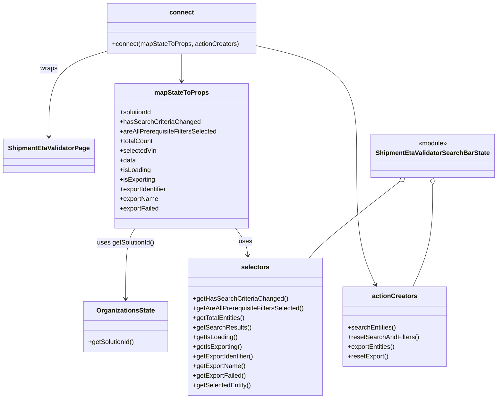

# Diagram: web/portal/src/pages/administration/internal-tools/shipment-eta-validator/ShipmentEtaValidator.page.container.js

> Auto-generated by Obscura crawlers

## Mermaid

> SVG rendering failed for this diagram.
