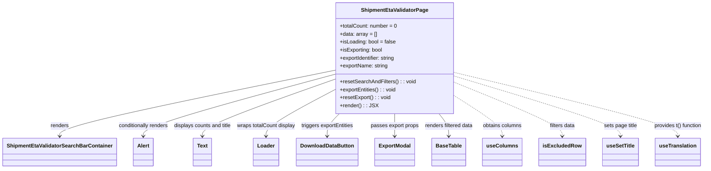

# Diagram: web/portal/src/pages/administration/internal-tools/shipment-eta-validator/ShipmentEtaValidator.page.js

> Auto-generated by Obscura crawlers

## Mermaid

### SVG

<svg id="container" width="2107.375" xmlns="http://www.w3.org/2000/svg" class="classDiagram" height="510" viewBox="0 0 2107.375 510" role="graphics-document document" aria-roledescription="class"><g><defs><marker id="container_class-aggregationStart" class="marker aggregation class" refX="18" refY="7" markerWidth="190" markerHeight="240" orient="auto"><path d="M 18,7 L9,13 L1,7 L9,1 Z"></path></marker></defs><defs><marker id="container_class-aggregationEnd" class="marker aggregation class" refX="1" refY="7" markerWidth="20" markerHeight="28" orient="auto"><path d="M 18,7 L9,13 L1,7 L9,1 Z"></path></marker></defs><defs><marker id="container_class-extensionStart" class="marker extension class" refX="18" refY="7" markerWidth="190" markerHeight="240" orient="auto"><path d="M 1,7 L18,13 V 1 Z"></path></marker></defs><defs><marker id="container_class-extensionEnd" class="marker extension class" refX="1" refY="7" markerWidth="20" markerHeight="28" orient="auto"><path d="M 1,1 V 13 L18,7 Z"></path></marker></defs><defs><marker id="container_class-compositionStart" class="marker composition class" refX="18" refY="7" markerWidth="190" markerHeight="240" orient="auto"><path d="M 18,7 L9,13 L1,7 L9,1 Z"></path></marker></defs><defs><marker id="container_class-compositionEnd" class="marker composition class" refX="1" refY="7" markerWidth="20" markerHeight="28" orient="auto"><path d="M 18,7 L9,13 L1,7 L9,1 Z"></path></marker></defs><defs><marker id="container_class-dependencyStart" class="marker dependency class" refX="6" refY="7" markerWidth="190" markerHeight="240" orient="auto"><path d="M 5,7 L9,13 L1,7 L9,1 Z"></path></marker></defs><defs><marker id="container_class-dependencyEnd" class="marker dependency class" refX="13" refY="7" markerWidth="20" markerHeight="28" orient="auto"><path d="M 18,7 L9,13 L14,7 L9,1 Z"></path></marker></defs><defs><marker id="container_class-lollipopStart" class="marker lollipop class" refX="13" refY="7" markerWidth="190" markerHeight="240" orient="auto"><circle stroke="black" fill="transparent" cx="7" cy="7" r="6"></circle></marker></defs><defs><marker id="container_class-lollipopEnd" class="marker lollipop class" refX="1" refY="7" markerWidth="190" markerHeight="240" orient="auto"><circle stroke="black" fill="transparent" cx="7" cy="7" r="6"></circle></marker></defs><g class="root"><g class="clusters"></g><g class="edgePaths"><path d="M1016.277,211.085L875.66,239.404C735.042,267.723,453.806,324.362,313.188,357.848C172.57,391.333,172.57,401.667,172.57,406.833L172.57,412" id="id_ShipmentEtaValidatorPage_ShipmentEtaValidatorSearchBarContainer_1" class="edge-thickness-normal edge-pattern-solid relation" style=";;;" data-edge="true" data-et="edge" data-id="id_ShipmentEtaValidatorPage_ShipmentEtaValidatorSearchBarContainer_1" data-points="W3sieCI6MTAxNi4yNzczNDM3NSwieSI6MjExLjA4NTI0OTUxMjY0MDY0fSx7IngiOjE3Mi41NzAzMTI1LCJ5IjozODF9LHsieCI6MTcyLjU3MDMxMjUsInkiOjQxOH1d" marker-end="url(#container_class-dependencyEnd)"></path><path d="M1016.277,222.167L916.383,248.639C816.49,275.112,616.702,328.056,516.808,359.695C416.914,391.333,416.914,401.667,416.914,406.833L416.914,412" id="id_ShipmentEtaValidatorPage_Alert_2" class="edge-thickness-normal edge-pattern-solid relation" style=";;;" data-edge="true" data-et="edge" data-id="id_ShipmentEtaValidatorPage_Alert_2" data-points="W3sieCI6MTAxNi4yNzczNDM3NSwieSI6MjIyLjE2NzMzODI2MTczMDJ9LHsieCI6NDE2LjkxNDA2MjUsInkiOjM4MX0seyJ4Ijo0MTYuOTE0MDYyNSwieSI6NDE4fV0=" marker-end="url(#container_class-dependencyEnd)"></path><path d="M1016.277,236.786L947.39,260.822C878.503,284.857,740.728,332.929,671.84,362.131C602.953,391.333,602.953,401.667,602.953,406.833L602.953,412" id="id_ShipmentEtaValidatorPage_Text_3" class="edge-thickness-normal edge-pattern-solid relation" style=";;;" data-edge="true" data-et="edge" data-id="id_ShipmentEtaValidatorPage_Text_3" data-points="W3sieCI6MTAxNi4yNzczNDM3NSwieSI6MjM2Ljc4NTgxODc2MjA1MDM4fSx7IngiOjYwMi45NTMxMjUsInkiOjM4MX0seyJ4Ijo2MDIuOTUzMTI1LCJ5Ijo0MTh9XQ==" marker-end="url(#container_class-dependencyEnd)"></path><path d="M1016.277,267.808L980.479,286.673C944.68,305.539,873.082,343.269,837.283,367.301C801.484,391.333,801.484,401.667,801.484,406.833L801.484,412" id="id_ShipmentEtaValidatorPage_Loader_4" class="edge-thickness-normal edge-pattern-solid relation" style=";;;" data-edge="true" data-et="edge" data-id="id_ShipmentEtaValidatorPage_Loader_4" data-points="W3sieCI6MTAxNi4yNzczNDM3NSwieSI6MjY3LjgwODAzNTI2NjAwMTI0fSx7IngiOjgwMS40ODQzNzUsInkiOjM4MX0seyJ4Ijo4MDEuNDg0Mzc1LCJ5Ijo0MTh9XQ==" marker-end="url(#container_class-dependencyEnd)"></path><path d="M1027.563,344L1021.582,350.167C1015.602,356.333,1003.641,368.667,997.66,380C991.68,391.333,991.68,401.667,991.68,406.833L991.68,412" id="id_ShipmentEtaValidatorPage_DownloadDataButton_5" class="edge-thickness-normal edge-pattern-solid relation" style=";;;" data-edge="true" data-et="edge" data-id="id_ShipmentEtaValidatorPage_DownloadDataButton_5" data-points="W3sieCI6MTAyNy41NjI5MTkyMDczMTcsInkiOjM0NH0seyJ4Ijo5OTEuNjc5Njg3NSwieSI6MzgxfSx7IngiOjk5MS42Nzk2ODc1LCJ5Ijo0MTh9XQ==" marker-end="url(#container_class-dependencyEnd)"></path><path d="M1190.492,344L1190.492,350.167C1190.492,356.333,1190.492,368.667,1190.492,380C1190.492,391.333,1190.492,401.667,1190.492,406.833L1190.492,412" id="id_ShipmentEtaValidatorPage_ExportModal_6" class="edge-thickness-normal edge-pattern-solid relation" style=";;;" data-edge="true" data-et="edge" data-id="id_ShipmentEtaValidatorPage_ExportModal_6" data-points="W3sieCI6MTE5MC40OTIxODc1LCJ5IjozNDR9LHsieCI6MTE5MC40OTIxODc1LCJ5IjozODF9LHsieCI6MTE5MC40OTIxODc1LCJ5Ijo0MTh9XQ==" marker-end="url(#container_class-dependencyEnd)"></path><path d="M1327.664,344L1332.7,350.167C1337.735,356.333,1347.805,368.667,1352.84,380C1357.875,391.333,1357.875,401.667,1357.875,406.833L1357.875,412" id="id_ShipmentEtaValidatorPage_BaseTable_7" class="edge-thickness-normal edge-pattern-solid relation" style=";;;" data-edge="true" data-et="edge" data-id="id_ShipmentEtaValidatorPage_BaseTable_7" data-points="W3sieCI6MTMyNy42NjQ0NDM1OTc1NjA5LCJ5IjozNDR9LHsieCI6MTM1Ny44NzUsInkiOjM4MX0seyJ4IjoxMzU3Ljg3NSwieSI6NDE4fV0=" marker-end="url(#container_class-dependencyEnd)"></path><path d="M1364.707,286.602L1389.489,302.335C1414.271,318.068,1463.835,349.534,1488.617,370.434C1513.398,391.333,1513.398,401.667,1513.398,406.833L1513.398,412" id="id_ShipmentEtaValidatorPage_useColumns_8" class="edge-thickness-normal edge-pattern-dashed relation" style=";;;" data-edge="true" data-et="edge" data-id="id_ShipmentEtaValidatorPage_useColumns_8" data-points="W3sieCI6MTM2NC43MDcwMzEyNSwieSI6Mjg2LjYwMTg5NDQxNTk0ODl9LHsieCI6MTUxMy4zOTg0Mzc1LCJ5IjozODF9LHsieCI6MTUxMy4zOTg0Mzc1LCJ5Ijo0MTh9XQ==" marker-end="url(#container_class-dependencyEnd)"></path><path d="M1364.707,248.052L1418.283,270.21C1471.859,292.368,1579.012,336.684,1632.588,364.009C1686.164,391.333,1686.164,401.667,1686.164,406.833L1686.164,412" id="id_ShipmentEtaValidatorPage_isExcludedRow_9" class="edge-thickness-normal edge-pattern-dashed relation" style=";;;" data-edge="true" data-et="edge" data-id="id_ShipmentEtaValidatorPage_isExcludedRow_9" data-points="W3sieCI6MTM2NC43MDcwMzEyNSwieSI6MjQ4LjA1MTc4NDE5NDQzMzA1fSx7IngiOjE2ODYuMTY0MDYyNSwieSI6MzgxfSx7IngiOjE2ODYuMTY0MDYyNSwieSI6NDE4fV0=" marker-end="url(#container_class-dependencyEnd)"></path><path d="M1364.707,229.661L1446.596,254.884C1528.484,280.107,1692.262,330.554,1774.15,360.944C1856.039,391.333,1856.039,401.667,1856.039,406.833L1856.039,412" id="id_ShipmentEtaValidatorPage_useSetTitle_10" class="edge-thickness-normal edge-pattern-dashed relation" style=";;;" data-edge="true" data-et="edge" data-id="id_ShipmentEtaValidatorPage_useSetTitle_10" data-points="W3sieCI6MTM2NC43MDcwMzEyNSwieSI6MjI5LjY2MTE5ODQ5NzQ3NjIyfSx7IngiOjE4NTYuMDM5MDYyNSwieSI6MzgxfSx7IngiOjE4NTYuMDM5MDYyNSwieSI6NDE4fV0=" marker-end="url(#container_class-dependencyEnd)"></path><path d="M1364.707,218.776L1474.822,245.813C1584.938,272.851,1805.168,326.925,1915.283,359.129C2025.398,391.333,2025.398,401.667,2025.398,406.833L2025.398,412" id="id_ShipmentEtaValidatorPage_useTranslation_11" class="edge-thickness-normal edge-pattern-dashed relation" style=";;;" data-edge="true" data-et="edge" data-id="id_ShipmentEtaValidatorPage_useTranslation_11" data-points="W3sieCI6MTM2NC43MDcwMzEyNSwieSI6MjE4Ljc3NjExMTY1MTc1NzN9LHsieCI6MjAyNS4zOTg0Mzc1LCJ5IjozODF9LHsieCI6MjAyNS4zOTg0Mzc1LCJ5Ijo0MTh9XQ==" marker-end="url(#container_class-dependencyEnd)"></path></g><g class="edgeLabels"><g class="edgeLabel" transform="translate(172.5703125, 381)"><g class="label" data-id="id_ShipmentEtaValidatorPage_ShipmentEtaValidatorSearchBarContainer_1" transform="translate(-27.75, -12)"><foreignObject width="55.5" height="24">

renders

</foreignObject></g></g><g class="edgeLabel" transform="translate(416.9140625, 381)"><g class="label" data-id="id_ShipmentEtaValidatorPage_Alert_2" transform="translate(-77.25, -12)"><foreignObject width="154.5" height="24">

conditionally renders

</foreignObject></g></g><g class="edgeLabel" transform="translate(602.953125, 381)"><g class="label" data-id="id_ShipmentEtaValidatorPage_Text_3" transform="translate(-88.7890625, -12)"><foreignObject width="177.578125" height="24">

displays counts and title

</foreignObject></g></g><g class="edgeLabel" transform="translate(801.484375, 381)"><g class="label" data-id="id_ShipmentEtaValidatorPage_Loader_4" transform="translate(-89.7421875, -12)"><foreignObject width="179.484375" height="24">

wraps totalCount display

</foreignObject></g></g><g class="edgeLabel" transform="translate(991.6796875, 381)"><g class="label" data-id="id_ShipmentEtaValidatorPage_DownloadDataButton_5" transform="translate(-80.453125, -12)"><foreignObject width="160.90625" height="24">

triggers exportEntities

</foreignObject></g></g><g class="edgeLabel" transform="translate(1190.4921875, 381)"><g class="label" data-id="id_ShipmentEtaValidatorPage_ExportModal_6" transform="translate(-73.0078125, -12)"><foreignObject width="146.015625" height="24">

passes export props

</foreignObject></g></g><g class="edgeLabel" transform="translate(1357.875, 381)"><g class="label" data-id="id_ShipmentEtaValidatorPage_BaseTable_7" transform="translate(-74.375, -12)"><foreignObject width="148.75" height="24">

renders filtered data

</foreignObject></g></g><g class="edgeLabel" transform="translate(1513.3984375, 381)"><g class="label" data-id="id_ShipmentEtaValidatorPage_useColumns_8" transform="translate(-60.03125, -12)"><foreignObject width="120.0625" height="24">

obtains columns

</foreignObject></g></g><g class="edgeLabel" transform="translate(1686.1640625, 381)"><g class="label" data-id="id_ShipmentEtaValidatorPage_isExcludedRow_9" transform="translate(-39.21875, -12)"><foreignObject width="78.4375" height="24">

filters data

</foreignObject></g></g><g class="edgeLabel" transform="translate(1856.0390625, 381)"><g class="label" data-id="id_ShipmentEtaValidatorPage_useSetTitle_10" transform="translate(-50.9140625, -12)"><foreignObject width="101.828125" height="24">

sets page title

</foreignObject></g></g><g class="edgeLabel" transform="translate(2025.3984375, 381)"><g class="label" data-id="id_ShipmentEtaValidatorPage_useTranslation_11" transform="translate(-73.9765625, -12)"><foreignObject width="147.953125" height="24">

provides t() function

</foreignObject></g></g></g><g class="nodes"><g class="node default" id="classId-ShipmentEtaValidatorPage-0" transform="translate(1190.4921875, 176)"><g class="basic label-container"><path d="M-174.21484375 -168 L174.21484375 -168 L174.21484375 168 L-174.21484375 168" stroke="none" stroke-width="0" fill="#ECECFF" style=""></path><path d="M-174.21484375 -168 C-78.37750844927913 -168, 17.459826851441733 -168, 174.21484375 -168 M-174.21484375 -168 C-51.7280898170587 -168, 70.7586641158826 -168, 174.21484375 -168 M174.21484375 -168 C174.21484375 -44.39716853645068, 174.21484375 79.20566292709864, 174.21484375 168 M174.21484375 -168 C174.21484375 -75.39826978640038, 174.21484375 17.203460427199246, 174.21484375 168 M174.21484375 168 C96.15875171573938 168, 18.10265968147877 168, -174.21484375 168 M174.21484375 168 C82.36157816043142 168, -9.491687429137158 168, -174.21484375 168 M-174.21484375 168 C-174.21484375 48.68946613777115, -174.21484375 -70.6210677244577, -174.21484375 -168 M-174.21484375 168 C-174.21484375 50.889679671817845, -174.21484375 -66.22064065636431, -174.21484375 -168" stroke="#9370DB" stroke-width="1.3" fill="none" stroke-dasharray="0 0" style=""></path></g><g class="annotation-group text" transform="translate(0, -144)"></g><g class="label-group text" transform="translate(-97.0703125, -144)"><g class="label" style="font-weight: bolder" transform="translate(0,-12)"><foreignObject width="194.140625" height="24">

ShipmentEtaValidatorPage

</foreignObject></g></g><g class="members-group text" transform="translate(-162.21484375, -96)"><g class="label" style="" transform="translate(0,-12)"><foreignObject width="174.484375" height="24">

+totalCount: number = 0

</foreignObject></g><g class="label" style="" transform="translate(0,12)"><foreignObject width="112.328125" height="24">

+data: array = []

</foreignObject></g><g class="label" style="" transform="translate(0,36)"><foreignObject width="169.078125" height="24">

+isLoading: bool = false

</foreignObject></g><g class="label" style="" transform="translate(0,60)"><foreignObject width="130.265625" height="24">

+isExporting: bool

</foreignObject></g><g class="label" style="" transform="translate(0,84)"><foreignObject width="171.765625" height="24">

+exportIdentifier: string

</foreignObject></g><g class="label" style="" transform="translate(0,108)"><foreignObject width="146.90625" height="24">

+exportName: string

</foreignObject></g></g><g class="methods-group text" transform="translate(-162.21484375, 72)"><g class="label" style="" transform="translate(0,-12)"><foreignObject width="227.359375" height="24">

+resetSearchAndFilters() : : void

</foreignObject></g><g class="label" style="" transform="translate(0,12)"><foreignObject width="171.671875" height="24">

+exportEntities() : : void

</foreignObject></g><g class="label" style="" transform="translate(0,36)"><foreignObject width="153.5" height="24">

+resetExport() : : void

</foreignObject></g><g class="label" style="" transform="translate(0,60)"><foreignObject width="109.140625" height="24">

+render() : : JSX

</foreignObject></g></g><g class="divider" style=""><path d="M-174.21484375 -120 C-56.990528825416405 -120, 60.23378609916719 -120, 174.21484375 -120 M-174.21484375 -120 C-64.641666928026 -120, 44.931509893948004 -120, 174.21484375 -120" stroke="#9370DB" stroke-width="1.3" fill="none" stroke-dasharray="0 0" style=""></path></g><g class="divider" style=""><path d="M-174.21484375 48 C-73.41833790742689 48, 27.378167935146223 48, 174.21484375 48 M-174.21484375 48 C-36.955181618522346 48, 100.30448051295531 48, 174.21484375 48" stroke="#9370DB" stroke-width="1.3" fill="none" stroke-dasharray="0 0" style=""></path></g></g><g class="node default" id="classId-ShipmentEtaValidatorSearchBarContainer-1" transform="translate(172.5703125, 460)"><g class="basic label-container"><path d="M-164.5703125 -42 L164.5703125 -42 L164.5703125 42 L-164.5703125 42" stroke="none" stroke-width="0" fill="#ECECFF" style=""></path><path d="M-164.5703125 -42 C-97.1207274652286 -42, -29.671142430457195 -42, 164.5703125 -42 M-164.5703125 -42 C-61.77046048340047 -42, 41.02939153319906 -42, 164.5703125 -42 M164.5703125 -42 C164.5703125 -18.95663232411929, 164.5703125 4.086735351761419, 164.5703125 42 M164.5703125 -42 C164.5703125 -12.1892541179418, 164.5703125 17.6214917641164, 164.5703125 42 M164.5703125 42 C35.014403183292416 42, -94.54150613341517 42, -164.5703125 42 M164.5703125 42 C60.21599468744533 42, -44.13832312510934 42, -164.5703125 42 M-164.5703125 42 C-164.5703125 13.46073294480287, -164.5703125 -15.078534110394259, -164.5703125 -42 M-164.5703125 42 C-164.5703125 16.059099993662628, -164.5703125 -9.881800012674745, -164.5703125 -42" stroke="#9370DB" stroke-width="1.3" fill="none" stroke-dasharray="0 0" style=""></path></g><g class="annotation-group text" transform="translate(0, -18)"></g><g class="label-group text" transform="translate(-152.5703125, -18)"><g class="label" style="font-weight: bolder" transform="translate(0,-12)"><foreignObject width="305.140625" height="24">

ShipmentEtaValidatorSearchBarContainer

</foreignObject></g></g><g class="members-group text" transform="translate(-152.5703125, 30)"></g><g class="methods-group text" transform="translate(-152.5703125, 60)"></g><g class="divider" style=""><path d="M-164.5703125 6 C-88.95334367542637 6, -13.336374850852735 6, 164.5703125 6 M-164.5703125 6 C-63.420549848161016 6, 37.72921280367797 6, 164.5703125 6" stroke="#9370DB" stroke-width="1.3" fill="none" stroke-dasharray="0 0" style=""></path></g><g class="divider" style=""><path d="M-164.5703125 24 C-57.399531839885924 24, 49.77124882022815 24, 164.5703125 24 M-164.5703125 24 C-86.96856904906502 24, -9.366825598130049 24, 164.5703125 24" stroke="#9370DB" stroke-width="1.3" fill="none" stroke-dasharray="0 0" style=""></path></g></g><g class="node default" id="classId-Alert-2" transform="translate(416.9140625, 460)"><g class="basic label-container"><path d="M-29.7734375 -42 L29.7734375 -42 L29.7734375 42 L-29.7734375 42" stroke="none" stroke-width="0" fill="#ECECFF" style=""></path><path d="M-29.7734375 -42 C-12.765435237488784 -42, 4.242567025022431 -42, 29.7734375 -42 M-29.7734375 -42 C-7.705434707455968 -42, 14.362568085088064 -42, 29.7734375 -42 M29.7734375 -42 C29.7734375 -20.611818709344117, 29.7734375 0.7763625813117656, 29.7734375 42 M29.7734375 -42 C29.7734375 -23.859285299846416, 29.7734375 -5.718570599692832, 29.7734375 42 M29.7734375 42 C10.693658839859847 42, -8.386119820280307 42, -29.7734375 42 M29.7734375 42 C6.100259210271169 42, -17.572919079457662 42, -29.7734375 42 M-29.7734375 42 C-29.7734375 24.361485122047245, -29.7734375 6.7229702440944905, -29.7734375 -42 M-29.7734375 42 C-29.7734375 11.440456083425126, -29.7734375 -19.11908783314975, -29.7734375 -42" stroke="#9370DB" stroke-width="1.3" fill="none" stroke-dasharray="0 0" style=""></path></g><g class="annotation-group text" transform="translate(0, -18)"></g><g class="label-group text" transform="translate(-17.7734375, -18)"><g class="label" style="font-weight: bolder" transform="translate(0,-12)"><foreignObject width="35.546875" height="24">

Alert

</foreignObject></g></g><g class="members-group text" transform="translate(-17.7734375, 30)"></g><g class="methods-group text" transform="translate(-17.7734375, 60)"></g><g class="divider" style=""><path d="M-29.7734375 6 C-17.276752427139613 6, -4.780067354279222 6, 29.7734375 6 M-29.7734375 6 C-10.040170386929777 6, 9.693096726140446 6, 29.7734375 6" stroke="#9370DB" stroke-width="1.3" fill="none" stroke-dasharray="0 0" style=""></path></g><g class="divider" style=""><path d="M-29.7734375 24 C-13.813483990443222 24, 2.1464695191135554 24, 29.7734375 24 M-29.7734375 24 C-13.14537648810552 24, 3.4826845237889614 24, 29.7734375 24" stroke="#9370DB" stroke-width="1.3" fill="none" stroke-dasharray="0 0" style=""></path></g></g><g class="node default" id="classId-Text-3" transform="translate(602.953125, 460)"><g class="basic label-container"><path d="M-27.3828125 -42 L27.3828125 -42 L27.3828125 42 L-27.3828125 42" stroke="none" stroke-width="0" fill="#ECECFF" style=""></path><path d="M-27.3828125 -42 C-13.954831345007076 -42, -0.5268501900141516 -42, 27.3828125 -42 M-27.3828125 -42 C-12.213025759862012 -42, 2.956760980275977 -42, 27.3828125 -42 M27.3828125 -42 C27.3828125 -19.780323110702057, 27.3828125 2.439353778595887, 27.3828125 42 M27.3828125 -42 C27.3828125 -19.36201456245015, 27.3828125 3.275970875099702, 27.3828125 42 M27.3828125 42 C16.319371485707016 42, 5.255930471414029 42, -27.3828125 42 M27.3828125 42 C12.445023001698079 42, -2.492766496603842 42, -27.3828125 42 M-27.3828125 42 C-27.3828125 11.899816821734525, -27.3828125 -18.20036635653095, -27.3828125 -42 M-27.3828125 42 C-27.3828125 18.37111911026105, -27.3828125 -5.257761779477903, -27.3828125 -42" stroke="#9370DB" stroke-width="1.3" fill="none" stroke-dasharray="0 0" style=""></path></g><g class="annotation-group text" transform="translate(0, -18)"></g><g class="label-group text" transform="translate(-15.3828125, -18)"><g class="label" style="font-weight: bolder" transform="translate(0,-12)"><foreignObject width="30.765625" height="24">

Text

</foreignObject></g></g><g class="members-group text" transform="translate(-15.3828125, 30)"></g><g class="methods-group text" transform="translate(-15.3828125, 60)"></g><g class="divider" style=""><path d="M-27.3828125 6 C-5.988720943034306 6, 15.405370613931389 6, 27.3828125 6 M-27.3828125 6 C-16.094912755570796 6, -4.807013011141596 6, 27.3828125 6" stroke="#9370DB" stroke-width="1.3" fill="none" stroke-dasharray="0 0" style=""></path></g><g class="divider" style=""><path d="M-27.3828125 24 C-6.239129665126892 24, 14.904553169746215 24, 27.3828125 24 M-27.3828125 24 C-15.02547298867071 24, -2.6681334773414207 24, 27.3828125 24" stroke="#9370DB" stroke-width="1.3" fill="none" stroke-dasharray="0 0" style=""></path></g></g><g class="node default" id="classId-Loader-4" transform="translate(801.484375, 460)"><g class="basic label-container"><path d="M-37.3046875 -42 L37.3046875 -42 L37.3046875 42 L-37.3046875 42" stroke="none" stroke-width="0" fill="#ECECFF" style=""></path><path d="M-37.3046875 -42 C-15.450248748080131 -42, 6.404190003839737 -42, 37.3046875 -42 M-37.3046875 -42 C-16.10534874661281 -42, 5.0939900067743835 -42, 37.3046875 -42 M37.3046875 -42 C37.3046875 -18.756579428594314, 37.3046875 4.486841142811372, 37.3046875 42 M37.3046875 -42 C37.3046875 -14.684106563155012, 37.3046875 12.631786873689975, 37.3046875 42 M37.3046875 42 C9.765592060845957 42, -17.773503378308085 42, -37.3046875 42 M37.3046875 42 C19.30755097176341 42, 1.3104144435268168 42, -37.3046875 42 M-37.3046875 42 C-37.3046875 11.494825396229711, -37.3046875 -19.010349207540578, -37.3046875 -42 M-37.3046875 42 C-37.3046875 24.282718151514953, -37.3046875 6.565436303029905, -37.3046875 -42" stroke="#9370DB" stroke-width="1.3" fill="none" stroke-dasharray="0 0" style=""></path></g><g class="annotation-group text" transform="translate(0, -18)"></g><g class="label-group text" transform="translate(-25.3046875, -18)"><g class="label" style="font-weight: bolder" transform="translate(0,-12)"><foreignObject width="50.609375" height="24">

Loader

</foreignObject></g></g><g class="members-group text" transform="translate(-25.3046875, 30)"></g><g class="methods-group text" transform="translate(-25.3046875, 60)"></g><g class="divider" style=""><path d="M-37.3046875 6 C-9.21283571200242 6, 18.87901607599516 6, 37.3046875 6 M-37.3046875 6 C-20.962977837596206 6, -4.621268175192412 6, 37.3046875 6" stroke="#9370DB" stroke-width="1.3" fill="none" stroke-dasharray="0 0" style=""></path></g><g class="divider" style=""><path d="M-37.3046875 24 C-14.671584594045388 24, 7.961518311909224 24, 37.3046875 24 M-37.3046875 24 C-7.777769485924502 24, 21.749148528150997 24, 37.3046875 24" stroke="#9370DB" stroke-width="1.3" fill="none" stroke-dasharray="0 0" style=""></path></g></g><g class="node default" id="classId-DownloadDataButton-5" transform="translate(991.6796875, 460)"><g class="basic label-container"><path d="M-90.3203125 -42 L90.3203125 -42 L90.3203125 42 L-90.3203125 42" stroke="none" stroke-width="0" fill="#ECECFF" style=""></path><path d="M-90.3203125 -42 C-50.691694047130234 -42, -11.063075594260468 -42, 90.3203125 -42 M-90.3203125 -42 C-48.94900979972984 -42, -7.577707099459687 -42, 90.3203125 -42 M90.3203125 -42 C90.3203125 -20.67718530092382, 90.3203125 0.6456293981523586, 90.3203125 42 M90.3203125 -42 C90.3203125 -20.569318389486842, 90.3203125 0.8613632210263162, 90.3203125 42 M90.3203125 42 C31.85772561607771 42, -26.604861267844583 42, -90.3203125 42 M90.3203125 42 C23.783396999894165 42, -42.75351850021167 42, -90.3203125 42 M-90.3203125 42 C-90.3203125 17.25287950816204, -90.3203125 -7.4942409836759225, -90.3203125 -42 M-90.3203125 42 C-90.3203125 15.021933311907627, -90.3203125 -11.956133376184745, -90.3203125 -42" stroke="#9370DB" stroke-width="1.3" fill="none" stroke-dasharray="0 0" style=""></path></g><g class="annotation-group text" transform="translate(0, -18)"></g><g class="label-group text" transform="translate(-78.3203125, -18)"><g class="label" style="font-weight: bolder" transform="translate(0,-12)"><foreignObject width="156.640625" height="24">

DownloadDataButton

</foreignObject></g></g><g class="members-group text" transform="translate(-78.3203125, 30)"></g><g class="methods-group text" transform="translate(-78.3203125, 60)"></g><g class="divider" style=""><path d="M-90.3203125 6 C-24.2886810060932 6, 41.7429504878136 6, 90.3203125 6 M-90.3203125 6 C-19.923238068957517 6, 50.47383636208497 6, 90.3203125 6" stroke="#9370DB" stroke-width="1.3" fill="none" stroke-dasharray="0 0" style=""></path></g><g class="divider" style=""><path d="M-90.3203125 24 C-44.40515018189442 24, 1.5100121362111594 24, 90.3203125 24 M-90.3203125 24 C-44.88410593549403 24, 0.5521006290119459 24, 90.3203125 24" stroke="#9370DB" stroke-width="1.3" fill="none" stroke-dasharray="0 0" style=""></path></g></g><g class="node default" id="classId-ExportModal-6" transform="translate(1190.4921875, 460)"><g class="basic label-container"><path d="M-58.4921875 -42 L58.4921875 -42 L58.4921875 42 L-58.4921875 42" stroke="none" stroke-width="0" fill="#ECECFF" style=""></path><path d="M-58.4921875 -42 C-24.817672412295487 -42, 8.856842675409027 -42, 58.4921875 -42 M-58.4921875 -42 C-16.53555074334608 -42, 25.421086013307843 -42, 58.4921875 -42 M58.4921875 -42 C58.4921875 -15.98130164899499, 58.4921875 10.037396702010021, 58.4921875 42 M58.4921875 -42 C58.4921875 -16.043180920036303, 58.4921875 9.913638159927395, 58.4921875 42 M58.4921875 42 C32.60671361068817 42, 6.721239721376335 42, -58.4921875 42 M58.4921875 42 C21.48140800101355 42, -15.529371497972903 42, -58.4921875 42 M-58.4921875 42 C-58.4921875 13.08269728744871, -58.4921875 -15.83460542510258, -58.4921875 -42 M-58.4921875 42 C-58.4921875 10.773121609541434, -58.4921875 -20.453756780917132, -58.4921875 -42" stroke="#9370DB" stroke-width="1.3" fill="none" stroke-dasharray="0 0" style=""></path></g><g class="annotation-group text" transform="translate(0, -18)"></g><g class="label-group text" transform="translate(-46.4921875, -18)"><g class="label" style="font-weight: bolder" transform="translate(0,-12)"><foreignObject width="92.984375" height="24">

ExportModal

</foreignObject></g></g><g class="members-group text" transform="translate(-46.4921875, 30)"></g><g class="methods-group text" transform="translate(-46.4921875, 60)"></g><g class="divider" style=""><path d="M-58.4921875 6 C-27.805231478888164 6, 2.8817245422236724 6, 58.4921875 6 M-58.4921875 6 C-29.31123468995658 6, -0.13028187991316287 6, 58.4921875 6" stroke="#9370DB" stroke-width="1.3" fill="none" stroke-dasharray="0 0" style=""></path></g><g class="divider" style=""><path d="M-58.4921875 24 C-23.672692727724247 24, 11.146802044551507 24, 58.4921875 24 M-58.4921875 24 C-11.803640480752371 24, 34.88490653849526 24, 58.4921875 24" stroke="#9370DB" stroke-width="1.3" fill="none" stroke-dasharray="0 0" style=""></path></g></g><g class="node default" id="classId-BaseTable-7" transform="translate(1357.875, 460)"><g class="basic label-container"><path d="M-49.359375 -42 L49.359375 -42 L49.359375 42 L-49.359375 42" stroke="none" stroke-width="0" fill="#ECECFF" style=""></path><path d="M-49.359375 -42 C-10.0695159278958 -42, 29.2203431442084 -42, 49.359375 -42 M-49.359375 -42 C-15.675564446191949 -42, 18.008246107616102 -42, 49.359375 -42 M49.359375 -42 C49.359375 -11.430219762996554, 49.359375 19.139560474006892, 49.359375 42 M49.359375 -42 C49.359375 -10.5182601449566, 49.359375 20.9634797100868, 49.359375 42 M49.359375 42 C28.103202062361856 42, 6.847029124723711 42, -49.359375 42 M49.359375 42 C21.258613102981748 42, -6.842148794036504 42, -49.359375 42 M-49.359375 42 C-49.359375 10.410346129199816, -49.359375 -21.17930774160037, -49.359375 -42 M-49.359375 42 C-49.359375 16.20433531448604, -49.359375 -9.591329371027918, -49.359375 -42" stroke="#9370DB" stroke-width="1.3" fill="none" stroke-dasharray="0 0" style=""></path></g><g class="annotation-group text" transform="translate(0, -18)"></g><g class="label-group text" transform="translate(-37.359375, -18)"><g class="label" style="font-weight: bolder" transform="translate(0,-12)"><foreignObject width="74.71875" height="24">

BaseTable

</foreignObject></g></g><g class="members-group text" transform="translate(-37.359375, 30)"></g><g class="methods-group text" transform="translate(-37.359375, 60)"></g><g class="divider" style=""><path d="M-49.359375 6 C-28.073140800152498 6, -6.786906600304995 6, 49.359375 6 M-49.359375 6 C-21.59060695647444 6, 6.178161087051123 6, 49.359375 6" stroke="#9370DB" stroke-width="1.3" fill="none" stroke-dasharray="0 0" style=""></path></g><g class="divider" style=""><path d="M-49.359375 24 C-12.384762284429335 24, 24.58985043114133 24, 49.359375 24 M-49.359375 24 C-24.28840041048313 24, 0.7825741790337375 24, 49.359375 24" stroke="#9370DB" stroke-width="1.3" fill="none" stroke-dasharray="0 0" style=""></path></g></g><g class="node default" id="classId-useColumns-8" transform="translate(1513.3984375, 460)"><g class="basic label-container"><path d="M-56.1640625 -42 L56.1640625 -42 L56.1640625 42 L-56.1640625 42" stroke="none" stroke-width="0" fill="#ECECFF" style=""></path><path d="M-56.1640625 -42 C-17.565338392642587 -42, 21.033385714714825 -42, 56.1640625 -42 M-56.1640625 -42 C-22.096463051074117 -42, 11.971136397851765 -42, 56.1640625 -42 M56.1640625 -42 C56.1640625 -14.83552644966468, 56.1640625 12.32894710067064, 56.1640625 42 M56.1640625 -42 C56.1640625 -19.56754247332968, 56.1640625 2.8649150533406385, 56.1640625 42 M56.1640625 42 C12.847081000403385 42, -30.46990049919323 42, -56.1640625 42 M56.1640625 42 C19.90030882816852 42, -16.36344484366296 42, -56.1640625 42 M-56.1640625 42 C-56.1640625 14.856568641697873, -56.1640625 -12.286862716604254, -56.1640625 -42 M-56.1640625 42 C-56.1640625 10.678138137580355, -56.1640625 -20.64372372483929, -56.1640625 -42" stroke="#9370DB" stroke-width="1.3" fill="none" stroke-dasharray="0 0" style=""></path></g><g class="annotation-group text" transform="translate(0, -18)"></g><g class="label-group text" transform="translate(-44.1640625, -18)"><g class="label" style="font-weight: bolder" transform="translate(0,-12)"><foreignObject width="88.328125" height="24">

useColumns

</foreignObject></g></g><g class="members-group text" transform="translate(-44.1640625, 30)"></g><g class="methods-group text" transform="translate(-44.1640625, 60)"></g><g class="divider" style=""><path d="M-56.1640625 6 C-25.576238831568293 6, 5.011584836863413 6, 56.1640625 6 M-56.1640625 6 C-30.394136214977397 6, -4.6242099299547945 6, 56.1640625 6" stroke="#9370DB" stroke-width="1.3" fill="none" stroke-dasharray="0 0" style=""></path></g><g class="divider" style=""><path d="M-56.1640625 24 C-22.98807703849824 24, 10.18790842300352 24, 56.1640625 24 M-56.1640625 24 C-21.847705896806183 24, 12.468650706387635 24, 56.1640625 24" stroke="#9370DB" stroke-width="1.3" fill="none" stroke-dasharray="0 0" style=""></path></g></g><g class="node default" id="classId-isExcludedRow-9" transform="translate(1686.1640625, 460)"><g class="basic label-container"><path d="M-66.6015625 -42 L66.6015625 -42 L66.6015625 42 L-66.6015625 42" stroke="none" stroke-width="0" fill="#ECECFF" style=""></path><path d="M-66.6015625 -42 C-14.626825464759797 -42, 37.347911570480406 -42, 66.6015625 -42 M-66.6015625 -42 C-16.269547923182813 -42, 34.062466653634374 -42, 66.6015625 -42 M66.6015625 -42 C66.6015625 -13.622913114481552, 66.6015625 14.754173771036896, 66.6015625 42 M66.6015625 -42 C66.6015625 -14.985335976506157, 66.6015625 12.029328046987686, 66.6015625 42 M66.6015625 42 C31.514658995191496 42, -3.5722445096170077 42, -66.6015625 42 M66.6015625 42 C36.30878937983819 42, 6.01601625967637 42, -66.6015625 42 M-66.6015625 42 C-66.6015625 22.32984849294978, -66.6015625 2.659696985899558, -66.6015625 -42 M-66.6015625 42 C-66.6015625 8.495467046001707, -66.6015625 -25.009065907996586, -66.6015625 -42" stroke="#9370DB" stroke-width="1.3" fill="none" stroke-dasharray="0 0" style=""></path></g><g class="annotation-group text" transform="translate(0, -18)"></g><g class="label-group text" transform="translate(-54.6015625, -18)"><g class="label" style="font-weight: bolder" transform="translate(0,-12)"><foreignObject width="109.203125" height="24">

isExcludedRow

</foreignObject></g></g><g class="members-group text" transform="translate(-54.6015625, 30)"></g><g class="methods-group text" transform="translate(-54.6015625, 60)"></g><g class="divider" style=""><path d="M-66.6015625 6 C-17.33040533880154 6, 31.94075182239692 6, 66.6015625 6 M-66.6015625 6 C-14.682007228460513 6, 37.237548043078974 6, 66.6015625 6" stroke="#9370DB" stroke-width="1.3" fill="none" stroke-dasharray="0 0" style=""></path></g><g class="divider" style=""><path d="M-66.6015625 24 C-29.174916567860507 24, 8.251729364278987 24, 66.6015625 24 M-66.6015625 24 C-37.117503834275325 24, -7.633445168550651 24, 66.6015625 24" stroke="#9370DB" stroke-width="1.3" fill="none" stroke-dasharray="0 0" style=""></path></g></g><g class="node default" id="classId-useSetTitle-10" transform="translate(1856.0390625, 460)"><g class="basic label-container"><path d="M-53.2734375 -42 L53.2734375 -42 L53.2734375 42 L-53.2734375 42" stroke="none" stroke-width="0" fill="#ECECFF" style=""></path><path d="M-53.2734375 -42 C-19.05929303415317 -42, 15.154851431693658 -42, 53.2734375 -42 M-53.2734375 -42 C-14.297258141890538 -42, 24.678921216218924 -42, 53.2734375 -42 M53.2734375 -42 C53.2734375 -16.734303025028034, 53.2734375 8.531393949943933, 53.2734375 42 M53.2734375 -42 C53.2734375 -18.832584357860135, 53.2734375 4.33483128427973, 53.2734375 42 M53.2734375 42 C24.94312631901861 42, -3.38718486196278 42, -53.2734375 42 M53.2734375 42 C12.74085424784709 42, -27.79172900430582 42, -53.2734375 42 M-53.2734375 42 C-53.2734375 25.091574850621814, -53.2734375 8.183149701243629, -53.2734375 -42 M-53.2734375 42 C-53.2734375 24.046237951480432, -53.2734375 6.092475902960864, -53.2734375 -42" stroke="#9370DB" stroke-width="1.3" fill="none" stroke-dasharray="0 0" style=""></path></g><g class="annotation-group text" transform="translate(0, -18)"></g><g class="label-group text" transform="translate(-41.2734375, -18)"><g class="label" style="font-weight: bolder" transform="translate(0,-12)"><foreignObject width="82.546875" height="24">

useSetTitle

</foreignObject></g></g><g class="members-group text" transform="translate(-41.2734375, 30)"></g><g class="methods-group text" transform="translate(-41.2734375, 60)"></g><g class="divider" style=""><path d="M-53.2734375 6 C-31.343575427553226 6, -9.413713355106452 6, 53.2734375 6 M-53.2734375 6 C-23.615125864716234 6, 6.043185770567533 6, 53.2734375 6" stroke="#9370DB" stroke-width="1.3" fill="none" stroke-dasharray="0 0" style=""></path></g><g class="divider" style=""><path d="M-53.2734375 24 C-31.36401012179743 24, -9.454582743594862 24, 53.2734375 24 M-53.2734375 24 C-12.196407315512467 24, 28.880622868975067 24, 53.2734375 24" stroke="#9370DB" stroke-width="1.3" fill="none" stroke-dasharray="0 0" style=""></path></g></g><g class="node default" id="classId-useTranslation-11" transform="translate(2025.3984375, 460)"><g class="basic label-container"><path d="M-66.0859375 -42 L66.0859375 -42 L66.0859375 42 L-66.0859375 42" stroke="none" stroke-width="0" fill="#ECECFF" style=""></path><path d="M-66.0859375 -42 C-38.87352589748667 -42, -11.661114294973338 -42, 66.0859375 -42 M-66.0859375 -42 C-14.07181327490963 -42, 37.94231095018074 -42, 66.0859375 -42 M66.0859375 -42 C66.0859375 -9.585382768803775, 66.0859375 22.82923446239245, 66.0859375 42 M66.0859375 -42 C66.0859375 -21.45051590115583, 66.0859375 -0.9010318023116568, 66.0859375 42 M66.0859375 42 C13.701570024008525 42, -38.68279745198295 42, -66.0859375 42 M66.0859375 42 C25.53659811538337 42, -15.01274126923326 42, -66.0859375 42 M-66.0859375 42 C-66.0859375 11.073359665859392, -66.0859375 -19.853280668281215, -66.0859375 -42 M-66.0859375 42 C-66.0859375 14.300371572527055, -66.0859375 -13.39925685494589, -66.0859375 -42" stroke="#9370DB" stroke-width="1.3" fill="none" stroke-dasharray="0 0" style=""></path></g><g class="annotation-group text" transform="translate(0, -18)"></g><g class="label-group text" transform="translate(-54.0859375, -18)"><g class="label" style="font-weight: bolder" transform="translate(0,-12)"><foreignObject width="108.171875" height="24">

useTranslation

</foreignObject></g></g><g class="members-group text" transform="translate(-54.0859375, 30)"></g><g class="methods-group text" transform="translate(-54.0859375, 60)"></g><g class="divider" style=""><path d="M-66.0859375 6 C-24.19728725657881 6, 17.69136298684238 6, 66.0859375 6 M-66.0859375 6 C-29.155815695494802 6, 7.774306109010396 6, 66.0859375 6" stroke="#9370DB" stroke-width="1.3" fill="none" stroke-dasharray="0 0" style=""></path></g><g class="divider" style=""><path d="M-66.0859375 24 C-14.167853573967612 24, 37.750230352064776 24, 66.0859375 24 M-66.0859375 24 C-33.78008260601458 24, -1.4742277120291618 24, 66.0859375 24" stroke="#9370DB" stroke-width="1.3" fill="none" stroke-dasharray="0 0" style=""></path></g></g></g></g></g></svg>
