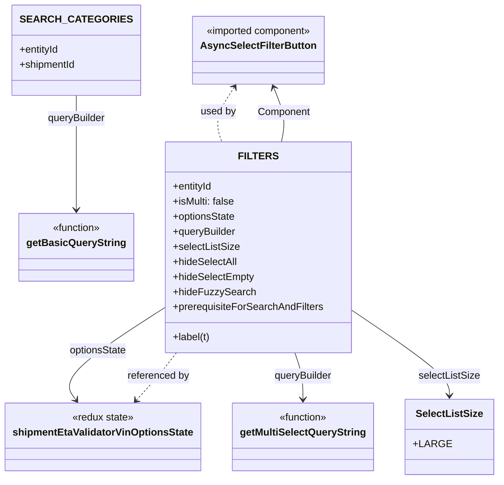
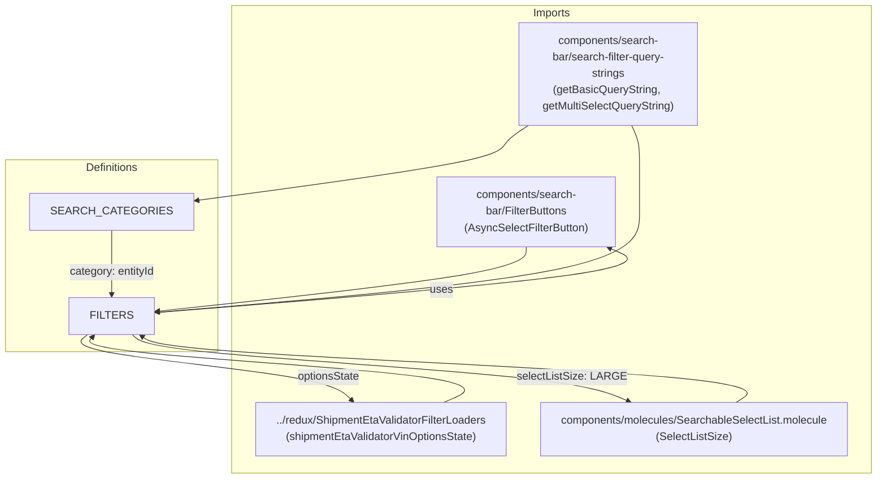

# Diagram: web/portal/src/pages/administration/internal-tools/shipment-eta-validator/ShipmentEtaValidator.searchOptions.js

> Auto-generated by Obscura crawlers

## Diagram 1

### SVG

<svg id="container" width="763.28125" xmlns="http://www.w3.org/2000/svg" class="classDiagram" height="764" viewBox="0 0 763.28125 764" role="graphics-document document" aria-roledescription="class"><g><defs><marker id="container_class-aggregationStart" class="marker aggregation class" refX="18" refY="7" markerWidth="190" markerHeight="240" orient="auto"><path d="M 18,7 L9,13 L1,7 L9,1 Z"></path></marker></defs><defs><marker id="container_class-aggregationEnd" class="marker aggregation class" refX="1" refY="7" markerWidth="20" markerHeight="28" orient="auto"><path d="M 18,7 L9,13 L1,7 L9,1 Z"></path></marker></defs><defs><marker id="container_class-extensionStart" class="marker extension class" refX="18" refY="7" markerWidth="190" markerHeight="240" orient="auto"><path d="M 1,7 L18,13 V 1 Z"></path></marker></defs><defs><marker id="container_class-extensionEnd" class="marker extension class" refX="1" refY="7" markerWidth="20" markerHeight="28" orient="auto"><path d="M 1,1 V 13 L18,7 Z"></path></marker></defs><defs><marker id="container_class-compositionStart" class="marker composition class" refX="18" refY="7" markerWidth="190" markerHeight="240" orient="auto"><path d="M 18,7 L9,13 L1,7 L9,1 Z"></path></marker></defs><defs><marker id="container_class-compositionEnd" class="marker composition class" refX="1" refY="7" markerWidth="20" markerHeight="28" orient="auto"><path d="M 18,7 L9,13 L1,7 L9,1 Z"></path></marker></defs><defs><marker id="container_class-dependencyStart" class="marker dependency class" refX="6" refY="7" markerWidth="190" markerHeight="240" orient="auto"><path d="M 5,7 L9,13 L1,7 L9,1 Z"></path></marker></defs><defs><marker id="container_class-dependencyEnd" class="marker dependency class" refX="13" refY="7" markerWidth="20" markerHeight="28" orient="auto"><path d="M 18,7 L9,13 L14,7 L9,1 Z"></path></marker></defs><defs><marker id="container_class-lollipopStart" class="marker lollipop class" refX="13" refY="7" markerWidth="190" markerHeight="240" orient="auto"><circle stroke="black" fill="transparent" cx="7" cy="7" r="6"></circle></marker></defs><defs><marker id="container_class-lollipopEnd" class="marker lollipop class" refX="1" refY="7" markerWidth="190" markerHeight="240" orient="auto"><circle stroke="black" fill="transparent" cx="7" cy="7" r="6"></circle></marker></defs><g class="root"><g class="clusters"></g><g class="edgePaths"><path d="M114.051,152L114.051,158.167C114.051,164.333,114.051,176.667,114.051,207C114.051,237.333,114.051,285.667,114.051,309.833L114.051,334" id="id_SEARCH_CATEGORIES_getBasicQueryString_1" class="edge-thickness-normal edge-pattern-solid relation" style=";;;" data-edge="true" data-et="edge" data-id="id_SEARCH_CATEGORIES_getBasicQueryString_1" data-points="W3sieCI6MTE0LjA1MDc4MTI1LCJ5IjoxNTJ9LHsieCI6MTE0LjA1MDc4MTI1LCJ5IjoxODl9LHsieCI6MTE0LjA1MDc4MTI1LCJ5IjozNDB9XQ==" marker-end="url(#container_class-dependencyEnd)"></path><path d="M433.617,226L434.974,219.833C436.33,213.667,439.044,201.333,436.99,186.924C434.936,172.515,428.114,156.029,424.703,147.787L421.292,139.544" id="id_FILTERS_AsyncSelectFilterButton_2" class="edge-thickness-normal edge-pattern-solid relation" style=";;;" data-edge="true" data-et="edge" data-id="id_FILTERS_AsyncSelectFilterButton_2" data-points="W3sieCI6NDMzLjYxNjgyNTQ1NzMxNzEsInkiOjIyNn0seyJ4Ijo0NDEuNzU3ODEyNSwieSI6MTg5fSx7IngiOjQxOC45OTgxNzIzMDUwNDU5LCJ5IjoxMzR9XQ==" marker-end="url(#container_class-dependencyEnd)"></path><path d="M250.996,490.579L223.743,508.649C196.491,526.719,141.986,562.86,119.394,587.29C96.802,611.72,106.123,624.44,110.784,630.8L115.445,637.16" id="id_FILTERS_shipmentEtaValidatorVinOptionsState_3" class="edge-thickness-normal edge-pattern-solid relation" style=";;;" data-edge="true" data-et="edge" data-id="id_FILTERS_shipmentEtaValidatorVinOptionsState_3" data-points="W3sieCI6MjUwLjk5NjA5Mzc1LCJ5Ijo0OTAuNTc5MDY3MDY0MjM0MX0seyJ4Ijo4Ny40ODA0Njg3NSwieSI6NTk5fSx7IngiOjExOC45OTEwNTk5MjI2ODA0MiwieSI6NjQyfV0=" marker-end="url(#container_class-dependencyEnd)"></path><path d="M455.231,562L457.382,568.167C459.532,574.333,463.832,586.667,465.983,599C468.133,611.333,468.133,623.667,468.133,629.833L468.133,636" id="id_FILTERS_getMultiSelectQueryString_4" class="edge-thickness-normal edge-pattern-solid relation" style=";;;" data-edge="true" data-et="edge" data-id="id_FILTERS_getMultiSelectQueryString_4" data-points="W3sieCI6NDU1LjIzMTQ1OTYwMzY1ODU1LCJ5Ijo1NjJ9LHsieCI6NDY4LjEzMjgxMjUsInkiOjU5OX0seyJ4Ijo0NjguMTMyODEyNSwieSI6NjQyfV0=" marker-end="url(#container_class-dependencyEnd)"></path><path d="M542.309,495.37L567.126,512.642C591.943,529.914,641.577,564.457,666.394,586.895C691.211,609.333,691.211,619.667,691.211,624.833L691.211,630" id="id_FILTERS_SelectListSize_5" class="edge-thickness-normal edge-pattern-solid relation" style=";;;" data-edge="true" data-et="edge" data-id="id_FILTERS_SelectListSize_5" data-points="W3sieCI6NTQyLjMwODU5Mzc1LCJ5Ijo0OTUuMzcwNDI5ODAwOTQ2ODV9LHsieCI6NjkxLjIxMDkzNzUsInkiOjU5OX0seyJ4Ijo2OTEuMjEwOTM3NSwieSI6NjM2fV0=" marker-end="url(#container_class-dependencyEnd)"></path><path d="M357.95,139.017L352.487,147.348C347.024,155.678,336.098,172.339,332.785,186.836C329.472,201.333,333.773,213.667,335.923,219.833L338.073,226" id="id_AsyncSelectFilterButton_FILTERS_6" class="edge-thickness-normal edge-pattern-dashed relation" style=";;;" data-edge="true" data-et="edge" data-id="id_AsyncSelectFilterButton_FILTERS_6" data-points="W3sieCI6MzYxLjI0MDAwMTQzMzQ4NjIsInkiOjEzNH0seyJ4IjozMjUuMTcxODc1LCJ5IjoxODl9LHsieCI6MzM4LjA3MzIyNzg5NjM0MTQ1LCJ5IjoyMjZ9XQ==" marker-start="url(#container_class-dependencyStart)"></path><path d="M208.847,637.448L214.351,631.04C219.854,624.632,230.861,611.816,241.02,599.241C251.179,586.667,260.492,574.333,265.148,568.167L269.804,562" id="id_shipmentEtaValidatorVinOptionsState_FILTERS_7" class="edge-thickness-normal edge-pattern-dashed relation" style=";;;" data-edge="true" data-et="edge" data-id="id_shipmentEtaValidatorVinOptionsState_FILTERS_7" data-points="W3sieCI6MjA0LjkzODMwNTQxMjM3MTE0LCJ5Ijo2NDJ9LHsieCI6MjQxLjg2NzE4NzUsInkiOjU5OX0seyJ4IjoyNjkuODA0MDIwNTc5MjY4MywieSI6NTYyfV0=" marker-start="url(#container_class-dependencyStart)"></path></g><g class="edgeLabels"><g class="edgeLabel" transform="translate(114.05078125, 189)"><g class="label" data-id="id_SEARCH_CATEGORIES_getBasicQueryString_1" transform="translate(-47.140625, -12)"><foreignObject width="94.28125" height="24">

queryBuilder

</foreignObject></g></g><g class="edgeLabel" transform="translate(437.62097, 179.00309)"><g class="label" data-id="id_FILTERS_AsyncSelectFilterButton_2" transform="translate(-41.8984375, -12)"><foreignObject width="83.796875" height="24">

Component

</foreignObject></g></g><g class="edgeLabel" transform="translate(87.48046875, 599)"><g class="label" data-id="id_FILTERS_shipmentEtaValidatorVinOptionsState_3" transform="translate(-46.34375, -12)"><foreignObject width="92.6875" height="24">

optionsState

</foreignObject></g></g><g class="edgeLabel" transform="translate(468.1328125, 599)"><g class="label" data-id="id_FILTERS_getMultiSelectQueryString_4" transform="translate(-47.140625, -12)"><foreignObject width="94.28125" height="24">

queryBuilder

</foreignObject></g></g><g class="edgeLabel" transform="translate(691.2109375, 599)"><g class="label" data-id="id_FILTERS_SelectListSize_5" transform="translate(-48.7578125, -12)"><foreignObject width="97.515625" height="24">

selectListSize

</foreignObject></g></g><g class="edgeLabel" transform="translate(332.46179, 177.88367)"><g class="label" data-id="id_AsyncSelectFilterButton_FILTERS_6" transform="translate(-28.3125, -12)"><foreignObject width="56.625" height="24">

used by

</foreignObject></g></g><g class="edgeLabel" transform="translate(241.8671875, 599)"><g class="label" data-id="id_shipmentEtaValidatorVinOptionsState_FILTERS_7" transform="translate(-49.6484375, -12)"><foreignObject width="99.296875" height="24">

referenced by

</foreignObject></g></g></g><g class="nodes"><g class="node default" id="classId-AsyncSelectFilterButton-0" transform="translate(396.65234375, 80)"><g class="basic label-container"><path d="M-99.390625 -54 L99.390625 -54 L99.390625 54 L-99.390625 54" stroke="none" stroke-width="0" fill="#ECECFF" style=""></path><path d="M-99.390625 -54 C-50.07290753471162 -54, -0.7551900694232359 -54, 99.390625 -54 M-99.390625 -54 C-52.413592481269184 -54, -5.436559962538368 -54, 99.390625 -54 M99.390625 -54 C99.390625 -29.816592068232083, 99.390625 -5.633184136464166, 99.390625 54 M99.390625 -54 C99.390625 -29.179508793323883, 99.390625 -4.3590175866477665, 99.390625 54 M99.390625 54 C50.21640362902516 54, 1.0421822580503175 54, -99.390625 54 M99.390625 54 C36.80858128549511 54, -25.773462429009783 54, -99.390625 54 M-99.390625 54 C-99.390625 29.356772375528756, -99.390625 4.713544751057512, -99.390625 -54 M-99.390625 54 C-99.390625 23.45950428100761, -99.390625 -7.080991437984778, -99.390625 -54" stroke="#9370DB" stroke-width="1.3" fill="none" stroke-dasharray="0 0" style=""></path></g><g class="annotation-group text" transform="translate(-86.03125, -30)"><g class="label" style="" transform="translate(0,-12)"><foreignObject width="172.0625" height="24">

«imported component»

</foreignObject></g></g><g class="label-group text" transform="translate(-87.390625, -6)"><g class="label" style="font-weight: bolder" transform="translate(0,-12)"><foreignObject width="174.78125" height="24">

AsyncSelectFilterButton

</foreignObject></g></g><g class="members-group text" transform="translate(-87.390625, 42)"></g><g class="methods-group text" transform="translate(-87.390625, 72)"></g><g class="divider" style=""><path d="M-99.390625 18 C-22.857226657082975 18, 53.67617168583405 18, 99.390625 18 M-99.390625 18 C-23.998083549914284 18, 51.39445790017143 18, 99.390625 18" stroke="#9370DB" stroke-width="1.3" fill="none" stroke-dasharray="0 0" style=""></path></g><g class="divider" style=""><path d="M-99.390625 36 C-51.558829380623806 36, -3.727033761247611 36, 99.390625 36 M-99.390625 36 C-32.979781477172864 36, 33.43106204565427 36, 99.390625 36" stroke="#9370DB" stroke-width="1.3" fill="none" stroke-dasharray="0 0" style=""></path></g></g><g class="node default" id="classId-shipmentEtaValidatorVinOptionsState-1" transform="translate(158.5625, 696)"><g class="basic label-container"><path d="M-150.5625 -54 L150.5625 -54 L150.5625 54 L-150.5625 54" stroke="none" stroke-width="0" fill="#ECECFF" style=""></path><path d="M-150.5625 -54 C-87.81422389632178 -54, -25.06594779264354 -54, 150.5625 -54 M-150.5625 -54 C-85.67790766092554 -54, -20.793315321851082 -54, 150.5625 -54 M150.5625 -54 C150.5625 -15.193360274154116, 150.5625 23.613279451691767, 150.5625 54 M150.5625 -54 C150.5625 -21.698854185926947, 150.5625 10.602291628146105, 150.5625 54 M150.5625 54 C48.33298428399421 54, -53.896531432011585 54, -150.5625 54 M150.5625 54 C43.054519089222865 54, -64.45346182155427 54, -150.5625 54 M-150.5625 54 C-150.5625 22.145201446789113, -150.5625 -9.709597106421775, -150.5625 -54 M-150.5625 54 C-150.5625 13.255627130451515, -150.5625 -27.48874573909697, -150.5625 -54" stroke="#9370DB" stroke-width="1.3" fill="none" stroke-dasharray="0 0" style=""></path></g><g class="annotation-group text" transform="translate(-49.671875, -30)"><g class="label" style="" transform="translate(0,-12)"><foreignObject width="99.34375" height="24">

«redux state»

</foreignObject></g></g><g class="label-group text" transform="translate(-138.5625, -6)"><g class="label" style="font-weight: bolder" transform="translate(0,-12)"><foreignObject width="277.125" height="24">

shipmentEtaValidatorVinOptionsState

</foreignObject></g></g><g class="members-group text" transform="translate(-138.5625, 42)"></g><g class="methods-group text" transform="translate(-138.5625, 72)"></g><g class="divider" style=""><path d="M-150.5625 18 C-48.294186695971476 18, 53.97412660805705 18, 150.5625 18 M-150.5625 18 C-76.98391556394722 18, -3.405331127894442 18, 150.5625 18" stroke="#9370DB" stroke-width="1.3" fill="none" stroke-dasharray="0 0" style=""></path></g><g class="divider" style=""><path d="M-150.5625 36 C-36.997405455727915 36, 76.56768908854417 36, 150.5625 36 M-150.5625 36 C-78.81803350029922 36, -7.073567000598445 36, 150.5625 36" stroke="#9370DB" stroke-width="1.3" fill="none" stroke-dasharray="0 0" style=""></path></g></g><g class="node default" id="classId-SelectListSize-2" transform="translate(691.2109375, 696)"><g class="basic label-container"><path d="M-64.0703125 -60 L64.0703125 -60 L64.0703125 60 L-64.0703125 60" stroke="none" stroke-width="0" fill="#ECECFF" style=""></path><path d="M-64.0703125 -60 C-37.33439804028366 -60, -10.598483580567326 -60, 64.0703125 -60 M-64.0703125 -60 C-35.37734351917284 -60, -6.684374538345686 -60, 64.0703125 -60 M64.0703125 -60 C64.0703125 -28.8236350047211, 64.0703125 2.3527299905577976, 64.0703125 60 M64.0703125 -60 C64.0703125 -35.12521523091251, 64.0703125 -10.250430461825019, 64.0703125 60 M64.0703125 60 C36.00288678282343 60, 7.935461065646862 60, -64.0703125 60 M64.0703125 60 C14.61717025432025 60, -34.8359719913595 60, -64.0703125 60 M-64.0703125 60 C-64.0703125 16.400880200299177, -64.0703125 -27.198239599401646, -64.0703125 -60 M-64.0703125 60 C-64.0703125 35.31370894755601, -64.0703125 10.627417895112025, -64.0703125 -60" stroke="#9370DB" stroke-width="1.3" fill="none" stroke-dasharray="0 0" style=""></path></g><g class="annotation-group text" transform="translate(0, -36)"></g><g class="label-group text" transform="translate(-50.828125, -36)"><g class="label" style="font-weight: bolder" transform="translate(0,-12)"><foreignObject width="101.65625" height="24">

SelectListSize

</foreignObject></g></g><g class="members-group text" transform="translate(-52.0703125, 12)"><g class="label" style="" transform="translate(0,-12)"><foreignObject width="53.3125" height="24">

+LARGE

</foreignObject></g></g><g class="methods-group text" transform="translate(-52.0703125, 60)"></g><g class="divider" style=""><path d="M-64.0703125 -12 C-25.810801132388093 -12, 12.448710235223814 -12, 64.0703125 -12 M-64.0703125 -12 C-18.264120603878773 -12, 27.542071292242454 -12, 64.0703125 -12" stroke="#9370DB" stroke-width="1.3" fill="none" stroke-dasharray="0 0" style=""></path></g><g class="divider" style=""><path d="M-64.0703125 36 C-30.409858393367273 36, 3.2505957132654544 36, 64.0703125 36 M-64.0703125 36 C-37.29659915592696 36, -10.522885811853925 36, 64.0703125 36" stroke="#9370DB" stroke-width="1.3" fill="none" stroke-dasharray="0 0" style=""></path></g></g><g class="node default" id="classId-getBasicQueryString-3" transform="translate(114.05078125, 394)"><g class="basic label-container"><path d="M-86.9453125 -54 L86.9453125 -54 L86.9453125 54 L-86.9453125 54" stroke="none" stroke-width="0" fill="#ECECFF" style=""></path><path d="M-86.9453125 -54 C-20.359359715035154 -54, 46.22659306992969 -54, 86.9453125 -54 M-86.9453125 -54 C-23.1834347089425 -54, 40.578443082115 -54, 86.9453125 -54 M86.9453125 -54 C86.9453125 -25.549409116007773, 86.9453125 2.901181767984454, 86.9453125 54 M86.9453125 -54 C86.9453125 -20.883297320524946, 86.9453125 12.233405358950108, 86.9453125 54 M86.9453125 54 C47.501364675700955 54, 8.05741685140191 54, -86.9453125 54 M86.9453125 54 C41.00562970859675 54, -4.9340530828065 54, -86.9453125 54 M-86.9453125 54 C-86.9453125 25.868880207448367, -86.9453125 -2.2622395851032664, -86.9453125 -54 M-86.9453125 54 C-86.9453125 16.912769228408735, -86.9453125 -20.17446154318253, -86.9453125 -54" stroke="#9370DB" stroke-width="1.3" fill="none" stroke-dasharray="0 0" style=""></path></g><g class="annotation-group text" transform="translate(-39.484375, -30)"><g class="label" style="" transform="translate(0,-12)"><foreignObject width="78.96875" height="24">

«function»

</foreignObject></g></g><g class="label-group text" transform="translate(-74.9453125, -6)"><g class="label" style="font-weight: bolder" transform="translate(0,-12)"><foreignObject width="149.890625" height="24">

getBasicQueryString

</foreignObject></g></g><g class="members-group text" transform="translate(-74.9453125, 42)"></g><g class="methods-group text" transform="translate(-74.9453125, 72)"></g><g class="divider" style=""><path d="M-86.9453125 18 C-43.87138702832881 18, -0.7974615566576233 18, 86.9453125 18 M-86.9453125 18 C-51.20646834096865 18, -15.467624181937296 18, 86.9453125 18" stroke="#9370DB" stroke-width="1.3" fill="none" stroke-dasharray="0 0" style=""></path></g><g class="divider" style=""><path d="M-86.9453125 36 C-22.06159999304839 36, 42.82211251390322 36, 86.9453125 36 M-86.9453125 36 C-49.94511070599009 36, -12.944908911980178 36, 86.9453125 36" stroke="#9370DB" stroke-width="1.3" fill="none" stroke-dasharray="0 0" style=""></path></g></g><g class="node default" id="classId-getMultiSelectQueryString-4" transform="translate(468.1328125, 696)"><g class="basic label-container"><path d="M-109.0078125 -54 L109.0078125 -54 L109.0078125 54 L-109.0078125 54" stroke="none" stroke-width="0" fill="#ECECFF" style=""></path><path d="M-109.0078125 -54 C-24.517361824432925 -54, 59.97308885113415 -54, 109.0078125 -54 M-109.0078125 -54 C-50.10570080190127 -54, 8.796410896197457 -54, 109.0078125 -54 M109.0078125 -54 C109.0078125 -13.48406904431939, 109.0078125 27.03186191136122, 109.0078125 54 M109.0078125 -54 C109.0078125 -28.371095500260637, 109.0078125 -2.7421910005212737, 109.0078125 54 M109.0078125 54 C38.57989800219721 54, -31.848016495605577 54, -109.0078125 54 M109.0078125 54 C45.689231938179965 54, -17.62934862364007 54, -109.0078125 54 M-109.0078125 54 C-109.0078125 28.63404565734481, -109.0078125 3.26809131468962, -109.0078125 -54 M-109.0078125 54 C-109.0078125 24.641164383432596, -109.0078125 -4.7176712331348085, -109.0078125 -54" stroke="#9370DB" stroke-width="1.3" fill="none" stroke-dasharray="0 0" style=""></path></g><g class="annotation-group text" transform="translate(-39.484375, -30)"><g class="label" style="" transform="translate(0,-12)"><foreignObject width="78.96875" height="24">

«function»

</foreignObject></g></g><g class="label-group text" transform="translate(-97.0078125, -6)"><g class="label" style="font-weight: bolder" transform="translate(0,-12)"><foreignObject width="194.015625" height="24">

getMultiSelectQueryString

</foreignObject></g></g><g class="members-group text" transform="translate(-97.0078125, 42)"></g><g class="methods-group text" transform="translate(-97.0078125, 72)"></g><g class="divider" style=""><path d="M-109.0078125 18 C-35.863496482796506 18, 37.28081953440699 18, 109.0078125 18 M-109.0078125 18 C-28.12925088429718 18, 52.74931073140564 18, 109.0078125 18" stroke="#9370DB" stroke-width="1.3" fill="none" stroke-dasharray="0 0" style=""></path></g><g class="divider" style=""><path d="M-109.0078125 36 C-46.517886550653444 36, 15.972039398693113 36, 109.0078125 36 M-109.0078125 36 C-61.46113993714181 36, -13.914467374283618 36, 109.0078125 36" stroke="#9370DB" stroke-width="1.3" fill="none" stroke-dasharray="0 0" style=""></path></g></g><g class="node default" id="classId-SEARCH_CATEGORIES-5" transform="translate(114.05078125, 80)"><g class="basic label-container"><path d="M-95.42578125 -72 L95.42578125 -72 L95.42578125 72 L-95.42578125 72" stroke="none" stroke-width="0" fill="#ECECFF" style=""></path><path d="M-95.42578125 -72 C-30.42296310791997 -72, 34.57985503416006 -72, 95.42578125 -72 M-95.42578125 -72 C-49.27789349084448 -72, -3.1300057316889536 -72, 95.42578125 -72 M95.42578125 -72 C95.42578125 -36.623413548328855, 95.42578125 -1.2468270966577109, 95.42578125 72 M95.42578125 -72 C95.42578125 -16.44816159916325, 95.42578125 39.1036768016735, 95.42578125 72 M95.42578125 72 C34.59520750484367 72, -26.235366240312658 72, -95.42578125 72 M95.42578125 72 C36.02060031186354 72, -23.38458062627292 72, -95.42578125 72 M-95.42578125 72 C-95.42578125 35.12975564169317, -95.42578125 -1.7404887166136547, -95.42578125 -72 M-95.42578125 72 C-95.42578125 33.64150323156098, -95.42578125 -4.716993536878036, -95.42578125 -72" stroke="#9370DB" stroke-width="1.3" fill="none" stroke-dasharray="0 0" style=""></path></g><g class="annotation-group text" transform="translate(0, -48)"></g><g class="label-group text" transform="translate(-76.1171875, -48)"><g class="label" style="font-weight: bolder" transform="translate(0,-12)"><foreignObject width="152.234375" height="24">

SEARCH_CATEGORIES

</foreignObject></g></g><g class="members-group text" transform="translate(-83.42578125, 0)"><g class="label" style="" transform="translate(0,-12)"><foreignObject width="64.234375" height="24">

+entityId

</foreignObject></g><g class="label" style="" transform="translate(0,12)"><foreignObject width="90.734375" height="24">

+shipmentId

</foreignObject></g></g><g class="methods-group text" transform="translate(-83.42578125, 72)"></g><g class="divider" style=""><path d="M-95.42578125 -24 C-23.68079800193253 -24, 48.06418524613494 -24, 95.42578125 -24 M-95.42578125 -24 C-26.57535889075635 -24, 42.2750634684873 -24, 95.42578125 -24" stroke="#9370DB" stroke-width="1.3" fill="none" stroke-dasharray="0 0" style=""></path></g><g class="divider" style=""><path d="M-95.42578125 48 C-24.47427356922391 48, 46.47723411155218 48, 95.42578125 48 M-95.42578125 48 C-54.19013613511655 48, -12.954491020233107 48, 95.42578125 48" stroke="#9370DB" stroke-width="1.3" fill="none" stroke-dasharray="0 0" style=""></path></g></g><g class="node default" id="classId-FILTERS-6" transform="translate(396.65234375, 394)"><g class="basic label-container"><path d="M-145.65625 -168 L145.65625 -168 L145.65625 168 L-145.65625 168" stroke="none" stroke-width="0" fill="#ECECFF" style=""></path><path d="M-145.65625 -168 C-53.611982762829754 -168, 38.43228447434049 -168, 145.65625 -168 M-145.65625 -168 C-53.893093344320306 -168, 37.87006331135939 -168, 145.65625 -168 M145.65625 -168 C145.65625 -50.62768502293301, 145.65625 66.74462995413398, 145.65625 168 M145.65625 -168 C145.65625 -87.5946826425129, 145.65625 -7.1893652850257865, 145.65625 168 M145.65625 168 C60.87312878835667 168, -23.909992423286667 168, -145.65625 168 M145.65625 168 C42.1049906738708 168, -61.4462686522584 168, -145.65625 168 M-145.65625 168 C-145.65625 59.73290480607446, -145.65625 -48.53419038785108, -145.65625 -168 M-145.65625 168 C-145.65625 79.47666277444996, -145.65625 -9.046674451100074, -145.65625 -168" stroke="#9370DB" stroke-width="1.3" fill="none" stroke-dasharray="0 0" style=""></path></g><g class="annotation-group text" transform="translate(0, -144)"></g><g class="label-group text" transform="translate(-27.5625, -144)"><g class="label" style="font-weight: bolder" transform="translate(0,-12)"><foreignObject width="55.125" height="24">

FILTERS

</foreignObject></g></g><g class="members-group text" transform="translate(-133.65625, -96)"><g class="label" style="" transform="translate(0,-12)"><foreignObject width="64.234375" height="24">

+entityId

</foreignObject></g><g class="label" style="" transform="translate(0,12)"><foreignObject width="99.21875" height="24">

+isMulti: false

</foreignObject></g><g class="label" style="" transform="translate(0,36)"><foreignObject width="100.65625" height="24">

+optionsState

</foreignObject></g><g class="label" style="" transform="translate(0,60)"><foreignObject width="102.265625" height="24">

+queryBuilder

</foreignObject></g><g class="label" style="" transform="translate(0,84)"><foreignObject width="105.5" height="24">

+selectListSize

</foreignObject></g><g class="label" style="" transform="translate(0,108)"><foreignObject width="102.90625" height="24">

+hideSelectAll

</foreignObject></g><g class="label" style="" transform="translate(0,132)"><foreignObject width="129.546875" height="24">

+hideSelectEmpty

</foreignObject></g><g class="label" style="" transform="translate(0,156)"><foreignObject width="127.296875" height="24">

+hideFuzzySearch

</foreignObject></g><g class="label" style="" transform="translate(0,180)"><foreignObject width="239.75" height="24">

+prerequisiteForSearchAndFilters

</foreignObject></g></g><g class="methods-group text" transform="translate(-133.65625, 144)"><g class="label" style="" transform="translate(0,-12)"><foreignObject width="60.359375" height="24">

+label(t)

</foreignObject></g></g><g class="divider" style=""><path d="M-145.65625 -120 C-51.23545547587722 -120, 43.18533904824557 -120, 145.65625 -120 M-145.65625 -120 C-53.71734603816624 -120, 38.22155792366752 -120, 145.65625 -120" stroke="#9370DB" stroke-width="1.3" fill="none" stroke-dasharray="0 0" style=""></path></g><g class="divider" style=""><path d="M-145.65625 120 C-63.736453010125814 120, 18.183343979748372 120, 145.65625 120 M-145.65625 120 C-68.82501617185099 120, 8.00621765629802 120, 145.65625 120" stroke="#9370DB" stroke-width="1.3" fill="none" stroke-dasharray="0 0" style=""></path></g></g></g></g></g></svg>

## Diagram 2

### SVG

<svg id="container" width="1700.671875" xmlns="http://www.w3.org/2000/svg" class="flowchart" height="626" viewBox="0 0 1700.671875 626" role="graphics-document document" aria-roledescription="flowchart-v2"><g><marker id="container_flowchart-v2-pointEnd" class="marker flowchart-v2" viewBox="0 0 10 10" refX="5" refY="5" markerUnits="userSpaceOnUse" markerWidth="8" markerHeight="8" orient="auto"><path d="M 0 0 L 10 5 L 0 10 z" class="arrowMarkerPath" style="stroke-width: 1; stroke-dasharray: 1, 0;"></path></marker><marker id="container_flowchart-v2-pointStart" class="marker flowchart-v2" viewBox="0 0 10 10" refX="4.5" refY="5" markerUnits="userSpaceOnUse" markerWidth="8" markerHeight="8" orient="auto"><path d="M 0 5 L 10 10 L 10 0 z" class="arrowMarkerPath" style="stroke-width: 1; stroke-dasharray: 1, 0;"></path></marker><marker id="container_flowchart-v2-circleEnd" class="marker flowchart-v2" viewBox="0 0 10 10" refX="11" refY="5" markerUnits="userSpaceOnUse" markerWidth="11" markerHeight="11" orient="auto"><circle cx="5" cy="5" r="5" class="arrowMarkerPath" style="stroke-width: 1; stroke-dasharray: 1, 0;"></circle></marker><marker id="container_flowchart-v2-circleStart" class="marker flowchart-v2" viewBox="0 0 10 10" refX="-1" refY="5" markerUnits="userSpaceOnUse" markerWidth="11" markerHeight="11" orient="auto"><circle cx="5" cy="5" r="5" class="arrowMarkerPath" style="stroke-width: 1; stroke-dasharray: 1, 0;"></circle></marker><marker id="container_flowchart-v2-crossEnd" class="marker cross flowchart-v2" viewBox="0 0 11 11" refX="12" refY="5.2" markerUnits="userSpaceOnUse" markerWidth="11" markerHeight="11" orient="auto"><path d="M 1,1 l 9,9 M 10,1 l -9,9" class="arrowMarkerPath" style="stroke-width: 2; stroke-dasharray: 1, 0;"></path></marker><marker id="container_flowchart-v2-crossStart" class="marker cross flowchart-v2" viewBox="0 0 11 11" refX="-1" refY="5.2" markerUnits="userSpaceOnUse" markerWidth="11" markerHeight="11" orient="auto"><path d="M 1,1 l 9,9 M 10,1 l -9,9" class="arrowMarkerPath" style="stroke-width: 2; stroke-dasharray: 1, 0;"></path></marker><g class="root"><g class="clusters"><g class="cluster" id="Definitions" data-look="classic"><rect style="" x="8" y="209" width="280.171875" height="256"></rect><g class="cluster-label" transform="translate(108.7890625, 209)"><foreignObject width="78.59375" height="24">

Definitions

</foreignObject></g></g><g class="cluster" id="Imports" data-look="classic"><rect style="" x="308.171875" y="8" width="1384.5" height="610"></rect><g class="cluster-label" transform="translate(972.0625, 8)"><foreignObject width="56.71875" height="24">

Imports

</foreignObject></g></g></g><g class="edgePaths"><path d="M963.93,312L963.93,318.167C963.93,324.333,963.93,336.667,838.149,352.7C712.368,368.734,460.807,388.468,335.026,398.335L209.246,408.202" id="L_A1_B2_0" class="edge-thickness-normal edge-pattern-solid edge-thickness-normal edge-pattern-solid flowchart-link" style=";" data-edge="true" data-et="edge" data-id="L_A1_B2_0" data-points="W3sieCI6OTYzLjkyOTY4NzUsInkiOjMxMn0seyJ4Ijo5NjMuOTI5Njg3NSwieSI6MzQ5fSx7IngiOjIwNS4yNTc4MTI1LCJ5Ijo0MDguNTE1MDcyNTg1ODk2NX1d" marker-end="url(#container_flowchart-v2-pointEnd)"></path><path d="M805.846,539L834.116,532.833C862.386,526.667,918.925,514.333,802.625,502C686.324,489.667,397.184,477.333,255.415,467.528C113.647,457.723,119.25,450.446,122.052,446.808L124.854,443.169" id="L_A2_B2_0" class="edge-thickness-normal edge-pattern-solid edge-thickness-normal edge-pattern-solid flowchart-link" style=";" data-edge="true" data-et="edge" data-id="L_A2_B2_0" data-points="W3sieCI6ODA1Ljg0NjEzMDM3MTA5MzgsInkiOjUzOX0seyJ4Ijo5NzUuNDY0ODQzNzUsInkiOjUwMn0seyJ4IjoxMDguMDQyOTY4NzUsInkiOjQ2NX0seyJ4IjoxMjcuMjk0Mzk2MDMzNjUzODQsInkiOjQ0MH1d" marker-end="url(#container_flowchart-v2-pointEnd)"></path><path d="M1429.363,539L1444.219,532.833C1459.074,526.667,1488.785,514.333,1286.913,502C1085.04,489.667,651.585,477.333,429.78,467.397C207.975,457.461,197.82,449.923,192.743,446.154L187.666,442.384" id="L_A3_B2_0" class="edge-thickness-normal edge-pattern-solid edge-thickness-normal edge-pattern-solid flowchart-link" style=";" data-edge="true" data-et="edge" data-id="L_A3_B2_0" data-points="W3sieCI6MTQyOS4zNjMyMjAyMTQ4NDM4LCJ5Ijo1Mzl9LHsieCI6MTUxOC40OTYwOTM3NSwieSI6NTAyfSx7IngiOjIxOC4xMjg5MDYyNSwieSI6NDY1fSx7IngiOjE4NC40NTQ0MDIwNDMyNjkyMywieSI6NDQwfV0=" marker-end="url(#container_flowchart-v2-pointEnd)"></path><path d="M995.555,153.955L983.208,158.962C970.862,163.97,946.169,173.985,933.823,183.159C921.477,192.333,921.477,200.667,810.757,213.996C700.037,227.325,478.598,245.649,367.878,254.812L257.158,263.974" id="L_A4_B1_0" class="edge-thickness-normal edge-pattern-solid edge-thickness-normal edge-pattern-solid flowchart-link" style=";" data-edge="true" data-et="edge" data-id="L_A4_B1_0" data-points="W3sieCI6OTk1LjU1NDY4NzUsInkiOjE1My45NTQ3NzQ1OTMxMTUzNn0seyJ4Ijo5MjEuNDc2NTYyNSwieSI6MTg0fSx7IngiOjkyMS40NzY1NjI1LCJ5IjoyMDl9LHsieCI6MjUzLjE3MTg3NSwieSI6MjY0LjMwMzg3NzAwMjY0NjYzfV0=" marker-end="url(#container_flowchart-v2-pointEnd)"></path><path d="M1175.997,159L1178.481,163.167C1180.964,167.333,1185.931,175.667,1188.415,184C1190.898,192.333,1190.898,200.667,1190.898,215.5C1190.898,230.333,1190.898,251.667,1190.898,275C1190.898,298.333,1190.898,323.667,1027.29,346.374C863.682,369.082,536.466,389.164,372.858,399.205L209.25,409.246" id="L_A4_B2_0" class="edge-thickness-normal edge-pattern-solid edge-thickness-normal edge-pattern-solid flowchart-link" style=";" data-edge="true" data-et="edge" data-id="L_A4_B2_0" data-points="W3sieCI6MTE3NS45OTY5ODE1MzQwOTEsInkiOjE1OX0seyJ4IjoxMTkwLjg5ODQzNzUsInkiOjE4NH0seyJ4IjoxMTkwLjg5ODQzNzUsInkiOjIwOX0seyJ4IjoxMTkwLjg5ODQzNzUsInkiOjI3M30seyJ4IjoxMTkwLjg5ODQzNzUsInkiOjM0OX0seyJ4IjoyMDUuMjU3ODEyNSwieSI6NDA5LjQ5MTIxOTY1ODM3NTc3fV0=" marker-end="url(#container_flowchart-v2-pointEnd)"></path><path d="M148.086,300L148.086,308.167C148.086,316.333,148.086,332.667,148.086,346.333C148.086,360,148.086,371,148.086,376.5L148.086,382" id="L_B1_B2_0" class="edge-thickness-normal edge-pattern-solid edge-thickness-normal edge-pattern-solid flowchart-link" style=";" data-edge="true" data-et="edge" data-id="L_B1_B2_0" data-points="W3sieCI6MTQ4LjA4NTkzNzUsInkiOjMwMH0seyJ4IjoxNDguMDg1OTM3NSwieSI6MzQ5fSx7IngiOjE0OC4wODU5Mzc1LCJ5IjozODZ9XQ==" marker-end="url(#container_flowchart-v2-pointEnd)"></path><path d="M205.258,409.61L375.613,399.508C545.969,389.407,886.68,369.203,1036.298,353.12C1185.917,337.036,1144.444,325.072,1123.707,319.091L1102.97,313.109" id="L_B2_A1_0" class="edge-thickness-normal edge-pattern-solid edge-thickness-normal edge-pattern-solid flowchart-link" style=";" data-edge="true" data-et="edge" data-id="L_B2_A1_0" data-points="W3sieCI6MjA1LjI1NzgxMjUsInkiOjQwOS42MDk4NTQ0MzQ2NDAzNH0seyJ4IjoxMjI3LjM5MDYyNSwieSI6MzQ5fSx7IngiOjEwOTkuMTI2NzQ3NTMyODk0OCwieSI6MzEyfV0=" marker-end="url(#container_flowchart-v2-pointEnd)"></path><path d="M116.91,440L112.099,444.167C107.288,448.333,97.665,456.667,166.229,467C234.793,477.333,381.543,489.667,469.12,501.744C556.696,513.821,585.099,525.642,599.301,531.553L613.503,537.463" id="L_B2_A2_0" class="edge-thickness-normal edge-pattern-solid edge-thickness-normal edge-pattern-solid flowchart-link" style=";" data-edge="true" data-et="edge" data-id="L_B2_A2_0" data-points="W3sieCI6MTE2LjkwOTc4MDY0OTAzODQ1LCJ5Ijo0NDB9LHsieCI6ODguMDQyOTY4NzUsInkiOjQ2NX0seyJ4Ijo1MjguMjkyOTY4NzUsInkiOjUwMn0seyJ4Ijo2MTcuMTk1NDk1NjA1NDY4OCwieSI6NTM5fV0=" marker-end="url(#container_flowchart-v2-pointEnd)"></path><path d="M174.07,440L178.08,444.167C182.089,448.333,190.109,456.667,339.585,467C489.061,477.333,779.993,489.667,953.078,501.858C1126.163,514.049,1181.4,526.098,1209.018,532.123L1236.636,538.148" id="L_B2_A3_0" class="edge-thickness-normal edge-pattern-solid edge-thickness-normal edge-pattern-solid flowchart-link" style=";" data-edge="true" data-et="edge" data-id="L_B2_A3_0" data-points="W3sieCI6MTc0LjA2OTc4NjY1ODY1Mzg0LCJ5Ijo0NDB9LHsieCI6MTk4LjEyODkwNjI1LCJ5Ijo0NjV9LHsieCI6MTA3MC45MjU3ODEyNSwieSI6NTAyfSx7IngiOjEyNDAuNTQ0NDk0NjI4OTA2MiwieSI6NTM5fV0=" marker-end="url(#container_flowchart-v2-pointEnd)"></path></g><g class="edgeLabels"><g class="edgeLabel"><g class="label" data-id="L_A1_B2_0" transform="translate(0, 0)"><foreignObject width="0" height="0">

</foreignObject></g></g><g class="edgeLabel"><g class="label" data-id="L_A2_B2_0" transform="translate(0, 0)"><foreignObject width="0" height="0">

</foreignObject></g></g><g class="edgeLabel"><g class="label" data-id="L_A3_B2_0" transform="translate(0, 0)"><foreignObject width="0" height="0">

</foreignObject></g></g><g class="edgeLabel"><g class="label" data-id="L_A4_B1_0" transform="translate(0, 0)"><foreignObject width="0" height="0">

</foreignObject></g></g><g class="edgeLabel"><g class="label" data-id="L_A4_B2_0" transform="translate(0, 0)"><foreignObject width="0" height="0">

</foreignObject></g></g><g class="edgeLabel" transform="translate(148.0859375, 349)"><g class="label" data-id="L_B1_B2_0" transform="translate(-63.1484375, -12)"><foreignObject width="126.296875" height="24">

category: entityId

</foreignObject></g></g><g class="edgeLabel" transform="translate(782.95413, 375.35394)"><g class="label" data-id="L_B2_A1_0" transform="translate(-16.4921875, -12)"><foreignObject width="32.984375" height="24">

uses

</foreignObject></g></g><g class="edgeLabel" transform="translate(528.29296875, 502)"><g class="label" data-id="L_B2_A2_0" transform="translate(-46.34375, -12)"><foreignObject width="92.6875" height="24">

optionsState

</foreignObject></g></g><g class="edgeLabel" transform="translate(1070.92578125, 502)"><g class="label" data-id="L_B2_A3_0" transform="translate(-75.4609375, -12)"><foreignObject width="150.921875" height="24">

selectListSize: LARGE

</foreignObject></g></g></g><g class="nodes"><g class="node default" id="flowchart-A1-0" transform="translate(963.9296875, 273)"><rect class="basic label-container" style="" x="-191.96875" y="-39" width="383.9375" height="78"></rect><g class="label" style="" transform="translate(-161.96875, -24)"><rect></rect><foreignObject width="323.9375" height="48">

components/search-bar/FilterButtons\n(AsyncSelectFilterButton)

</foreignObject></g></g><g class="node default" id="flowchart-A2-1" transform="translate(682.0703125, 566)"><rect class="basic label-container" style="" x="-338.8984375" y="-27" width="677.796875" height="54"></rect><g class="label" style="" transform="translate(-308.8984375, -12)"><rect></rect><foreignObject width="617.796875" height="24">

../redux/ShipmentEtaValidatorFilterLoaders\n(shipmentEtaValidatorVinOptionsState)

</foreignObject></g></g><g class="node default" id="flowchart-A3-2" transform="translate(1364.3203125, 566)"><rect class="basic label-container" style="" x="-293.3515625" y="-27" width="586.703125" height="54"></rect><g class="label" style="" transform="translate(-263.3515625, -12)"><rect></rect><foreignObject width="526.703125" height="24">

components/molecules/SearchableSelectList.molecule\n(SelectListSize)

</foreignObject></g></g><g class="node default" id="flowchart-A4-3" transform="translate(1138.4453125, 96)"><rect class="basic label-container" style="" x="-142.890625" y="-63" width="285.78125" height="126"></rect><g class="label" style="" transform="translate(-112.890625, -48)"><rect></rect><foreignObject width="225.78125" height="96">

components/search-bar/search-filter-query-strings\n(getBasicQueryString, getMultiSelectQueryString)

</foreignObject></g></g><g class="node default" id="flowchart-B1-4" transform="translate(148.0859375, 273)"><rect class="basic label-container" style="" x="-105.0859375" y="-27" width="210.171875" height="54"></rect><g class="label" style="" transform="translate(-75.0859375, -12)"><rect></rect><foreignObject width="150.171875" height="24">

SEARCH_CATEGORIES

</foreignObject></g></g><g class="node default" id="flowchart-B2-5" transform="translate(148.0859375, 413)"><rect class="basic label-container" style="" x="-57.171875" y="-27" width="114.34375" height="54"></rect><g class="label" style="" transform="translate(-27.171875, -12)"><rect></rect><foreignObject width="54.34375" height="24">

FILTERS

</foreignObject></g></g></g></g></g></svg>
