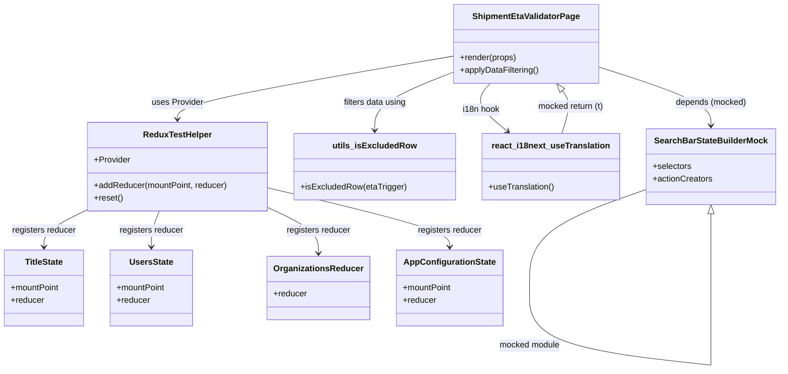

# Diagram: web/portal/src/pages/administration/internal-tools/shipment-eta-validator/tests/ShipmentEtaValidator.page.test.js


> Auto-generated by Obscura crawlers

## Diagram 1



### SVG

<svg id="container" width="1458.986328125" xmlns="http://www.w3.org/2000/svg" class="classDiagram" height="700.1499633789062" viewBox="0 0 1458.986328125 700.1499633789062" role="graphics-document document" aria-roledescription="class"><style>#container{font-family:"trebuchet ms",verdana,arial,sans-serif;font-size:16px;fill:#333;}@keyframes edge-animation-frame{from{stroke-dashoffset:0;}}@keyframes dash{to{stroke-dashoffset:0;}}#container .edge-animation-slow{stroke-dasharray:9,5!important;stroke-dashoffset:900;animation:dash 50s linear infinite;stroke-linecap:round;}#container .edge-animation-fast{stroke-dasharray:9,5!important;stroke-dashoffset:900;animation:dash 20s linear infinite;stroke-linecap:round;}#container .error-icon{fill:#552222;}#container .error-text{fill:#552222;stroke:#552222;}#container .edge-thickness-normal{stroke-width:1px;}#container .edge-thickness-thick{stroke-width:3.5px;}#container .edge-pattern-solid{stroke-dasharray:0;}#container .edge-thickness-invisible{stroke-width:0;fill:none;}#container .edge-pattern-dashed{stroke-dasharray:3;}#container .edge-pattern-dotted{stroke-dasharray:2;}#container .marker{fill:#333333;stroke:#333333;}#container .marker.cross{stroke:#333333;}#container svg{font-family:"trebuchet ms",verdana,arial,sans-serif;font-size:16px;}#container p{margin:0;}#container g.classGroup text{fill:#9370DB;stroke:none;font-family:"trebuchet ms",verdana,arial,sans-serif;font-size:10px;}#container g.classGroup text .title{font-weight:bolder;}#container .nodeLabel,#container .edgeLabel{color:#131300;}#container .edgeLabel .label rect{fill:#ECECFF;}#container .label text{fill:#131300;}#container .labelBkg{background:#ECECFF;}#container .edgeLabel .label span{background:#ECECFF;}#container .classTitle{font-weight:bolder;}#container .node rect,#container .node circle,#container .node ellipse,#container .node polygon,#container .node path{fill:#ECECFF;stroke:#9370DB;stroke-width:1px;}#container .divider{stroke:#9370DB;stroke-width:1;}#container g.clickable{cursor:pointer;}#container g.classGroup rect{fill:#ECECFF;stroke:#9370DB;}#container g.classGroup line{stroke:#9370DB;stroke-width:1;}#container .classLabel .box{stroke:none;stroke-width:0;fill:#ECECFF;opacity:0.5;}#container .classLabel .label{fill:#9370DB;font-size:10px;}#container .relation{stroke:#333333;stroke-width:1;fill:none;}#container .dashed-line{stroke-dasharray:3;}#container .dotted-line{stroke-dasharray:1 2;}#container #compositionStart,#container .composition{fill:#333333!important;stroke:#333333!important;stroke-width:1;}#container #compositionEnd,#container .composition{fill:#333333!important;stroke:#333333!important;stroke-width:1;}#container #dependencyStart,#container .dependency{fill:#333333!important;stroke:#333333!important;stroke-width:1;}#container #dependencyStart,#container .dependency{fill:#333333!important;stroke:#333333!important;stroke-width:1;}#container #extensionStart,#container .extension{fill:transparent!important;stroke:#333333!important;stroke-width:1;}#container #extensionEnd,#container .extension{fill:transparent!important;stroke:#333333!important;stroke-width:1;}#container #aggregationStart,#container .aggregation{fill:transparent!important;stroke:#333333!important;stroke-width:1;}#container #aggregationEnd,#container .aggregation{fill:transparent!important;stroke:#333333!important;stroke-width:1;}#container #lollipopStart,#container .lollipop{fill:#ECECFF!important;stroke:#333333!important;stroke-width:1;}#container #lollipopEnd,#container .lollipop{fill:#ECECFF!important;stroke:#333333!important;stroke-width:1;}#container .edgeTerminals{font-size:11px;line-height:initial;}#container .classTitleText{text-anchor:middle;font-size:18px;fill:#333;}#container .label-icon{display:inline-block;height:1em;overflow:visible;vertical-align:-0.125em;}#container .node .label-icon path{fill:currentColor;stroke:revert;stroke-width:revert;}#container :root{--mermaid-font-family:"trebuchet ms",verdana,arial,sans-serif;}</style><g><defs><marker id="container_class-aggregationStart" class="marker aggregation class" refX="18" refY="7" markerWidth="190" markerHeight="240" orient="auto"><path d="M 18,7 L9,13 L1,7 L9,1 Z"></path></marker></defs><defs><marker id="container_class-aggregationEnd" class="marker aggregation class" refX="1" refY="7" markerWidth="20" markerHeight="28" orient="auto"><path d="M 18,7 L9,13 L1,7 L9,1 Z"></path></marker></defs><defs><marker id="container_class-extensionStart" class="marker extension class" refX="18" refY="7" markerWidth="190" markerHeight="240" orient="auto"><path d="M 1,7 L18,13 V 1 Z"></path></marker></defs><defs><marker id="container_class-extensionEnd" class="marker extension class" refX="1" refY="7" markerWidth="20" markerHeight="28" orient="auto"><path d="M 1,1 V 13 L18,7 Z"></path></marker></defs><defs><marker id="container_class-compositionStart" class="marker composition class" refX="18" refY="7" markerWidth="190" markerHeight="240" orient="auto"><path d="M 18,7 L9,13 L1,7 L9,1 Z"></path></marker></defs><defs><marker id="container_class-compositionEnd" class="marker composition class" refX="1" refY="7" markerWidth="20" markerHeight="28" orient="auto"><path d="M 18,7 L9,13 L1,7 L9,1 Z"></path></marker></defs><defs><marker id="container_class-dependencyStart" class="marker dependency class" refX="6" refY="7" markerWidth="190" markerHeight="240" orient="auto"><path d="M 5,7 L9,13 L1,7 L9,1 Z"></path></marker></defs><defs><marker id="container_class-dependencyEnd" class="marker dependency class" refX="13" refY="7" markerWidth="20" markerHeight="28" orient="auto"><path d="M 18,7 L9,13 L14,7 L9,1 Z"></path></marker></defs><defs><marker id="container_class-lollipopStart" class="marker lollipop class" refX="13" refY="7" markerWidth="190" markerHeight="240" orient="auto"><circle stroke="black" fill="transparent" cx="7" cy="7" r="6"></circle></marker></defs><defs><marker id="container_class-lollipopEnd" class="marker lollipop class" refX="1" refY="7" markerWidth="190" markerHeight="240" orient="auto"><circle stroke="black" fill="transparent" cx="7" cy="7" r="6"></circle></marker></defs><g class="root"><g class="clusters"></g><g class="edgePaths"><path d="M855.119,106.25L768.708,121.042C682.298,135.833,509.476,165.417,423.065,185.375C336.654,205.333,336.654,215.667,336.654,220.833L336.654,226" id="id_ShipmentEtaValidatorPage_ReduxTestHelper_1" class="edge-thickness-normal edge-pattern-solid relation" style=";;;" data-edge="true" data-et="edge" data-id="id_ShipmentEtaValidatorPage_ReduxTestHelper_1" data-points="W3sieCI6ODU1LjExOTE0MDYyNSwieSI6MTA2LjI1MDE0MDMwMDE4Mjd9LHsieCI6MzM2LjY1NDI5Njg3NSwieSI6MTk1fSx7IngiOjMzNi42NTQyOTY4NzUsInkiOjIzMn1d" marker-end="url(#container_class-dependencyEnd)"></path><path d="M855.119,136.379L830.258,146.149C805.398,155.919,755.676,175.46,730.816,193.896C705.955,212.333,705.955,229.667,705.955,238.333L705.955,247" id="id_ShipmentEtaValidatorPage_utils_isExcludedRow_2" class="edge-thickness-normal edge-pattern-solid relation" style=";;;" data-edge="true" data-et="edge" data-id="id_ShipmentEtaValidatorPage_utils_isExcludedRow_2" data-points="W3sieCI6ODU1LjExOTE0MDYyNSwieSI6MTM2LjM3ODcyOTkzNjgxMjA4fSx7IngiOjcwNS45NTUwNzgxMjUsInkiOjE5NX0seyJ4Ijo3MDUuOTU1MDc4MTI1LCJ5IjoyNTN9XQ==" marker-end="url(#container_class-dependencyEnd)"></path><path d="M922.292,158L916.647,164.167C911.003,170.333,899.713,182.667,904.872,197.859C910.031,213.051,931.638,231.102,942.441,240.128L953.245,249.153" id="id_ShipmentEtaValidatorPage_react_i18next_useTranslation_3" class="edge-thickness-normal edge-pattern-solid relation" style=";;;" data-edge="true" data-et="edge" data-id="id_ShipmentEtaValidatorPage_react_i18next_useTranslation_3" data-points="W3sieCI6OTIyLjI5MTg4NzU1NTgwMzYsInkiOjE1OH0seyJ4Ijo4ODguNDIzODI4MTI1LCJ5IjoxOTV9LHsieCI6OTU3Ljg0OTMxODgyNzQ3OTQsInkiOjI1M31d" marker-end="url(#container_class-dependencyEnd)"></path><path d="M1126.768,127.695L1160.857,138.912C1194.946,150.13,1263.124,172.565,1297.214,190.949C1331.303,209.333,1331.303,223.667,1331.303,230.833L1331.303,238" id="id_ShipmentEtaValidatorPage_SearchBarStateBuilderMock_4" class="edge-thickness-normal edge-pattern-solid relation" style=";;;" data-edge="true" data-et="edge" data-id="id_ShipmentEtaValidatorPage_SearchBarStateBuilderMock_4" data-points="W3sieCI6MTEyNi43Njc1NzgxMjUsInkiOjEyNy42OTQ4NTM3ODUwNjE3NX0seyJ4IjoxMzMxLjMwMjczNDM3NSwieSI6MTk1fSx7IngiOjEzMzEuMzAyNzM0Mzc1LCJ5IjoyNDR9XQ==" marker-end="url(#container_class-dependencyEnd)"></path><path d="M166.299,397.746L152.665,404.289C139.031,410.831,111.764,423.915,98.13,435.624C84.496,447.333,84.496,457.667,84.496,462.833L84.496,468" id="id_ReduxTestHelper_TitleState_5" class="edge-thickness-normal edge-pattern-solid relation" style=";;;" data-edge="true" data-et="edge" data-id="id_ReduxTestHelper_TitleState_5" data-points="W3sieCI6MTY2LjI5ODgyODEyNSwieSI6Mzk3Ljc0NjM0NTk5NzQ0Mzk0fSx7IngiOjg0LjQ5NjA5Mzc1LCJ5Ijo0Mzd9LHsieCI6ODQuNDk2MDkzNzUsInkiOjQ3NH1d" marker-end="url(#container_class-dependencyEnd)"></path><path d="M303.943,400L301.542,406.167C299.141,412.333,294.338,424.667,291.937,436C289.535,447.333,289.535,457.667,289.535,462.833L289.535,468" id="id_ReduxTestHelper_UsersState_6" class="edge-thickness-normal edge-pattern-solid relation" style=";;;" data-edge="true" data-et="edge" data-id="id_ReduxTestHelper_UsersState_6" data-points="W3sieCI6MzAzLjk0MzQ4ODUwNzIzMTQsInkiOjQwMH0seyJ4IjoyODkuNTM1MTU2MjUsInkiOjQzN30seyJ4IjoyODkuNTM1MTU2MjUsInkiOjQ3NH1d" marker-end="url(#container_class-dependencyEnd)"></path><path d="M507.01,394.741L522.248,401.784C537.486,408.827,567.962,422.914,583.2,437.123C598.438,451.333,598.438,465.667,598.438,472.833L598.438,480" id="id_ReduxTestHelper_OrganizationsReducer_7" class="edge-thickness-normal edge-pattern-solid relation" style=";;;" data-edge="true" data-et="edge" data-id="id_ReduxTestHelper_OrganizationsReducer_7" data-points="W3sieCI6NTA3LjAwOTc2NTYyNSwieSI6Mzk0Ljc0MDY1NTMwMDQ0MDZ9LHsieCI6NTk4LjQzNzg5MDYyNDYyNzUsInkiOjQzN30seyJ4Ijo1OTguNDM3ODkwNjI0NjI3NSwieSI6NDg2fV0=" marker-end="url(#container_class-dependencyEnd)"></path><path d="M507.01,356.867L562.683,370.222C618.356,383.578,729.701,410.289,785.374,428.811C841.047,447.333,841.047,457.667,841.047,462.833L841.047,468" id="id_ReduxTestHelper_AppConfigurationState_8" class="edge-thickness-normal edge-pattern-solid relation" style=";;;" data-edge="true" data-et="edge" data-id="id_ReduxTestHelper_AppConfigurationState_8" data-points="W3sieCI6NTA3LjAwOTc2NTYyNSwieSI6MzU2Ljg2Njk2ODgwMzgwNTh9LHsieCI6ODQxLjA0NzI2NTYyNDYyNzUsInkiOjQzN30seyJ4Ijo4NDEuMDQ3MjY1NjI0NjI3NSwieSI6NDc0fV0=" marker-end="url(#container_class-dependencyEnd)"></path><path d="M1211.619,358.586L1174.89,371.655C1138.161,384.724,1064.704,410.862,1027.975,442.089C991.246,473.317,991.246,509.633,991.246,527.792L991.246,545.95" id="SearchBarStateBuilderMock-cyclic-special-1" class="edge-thickness-normal edge-pattern-solid relation" style=";;;" data-edge="true" data-et="edge" data-id="SearchBarStateBuilderMock-cyclic-special-1" data-points="W3sieCI6MTIxMS42MTkxNDA2MjUsInkiOjM1OC41ODYxMzU1OTc3MDYwNn0seyJ4Ijo5OTEuMjQ1NzAzMTI1MzcyNSwieSI6NDM3fSx7IngiOjk5MS4yNDU3MDMxMjUzNzI1LCJ5Ijo1NDUuOTQ5OTk5OTk5MjU0OX1d"></path><path d="M991.246,546.05L991.246,564.208C991.246,582.367,991.246,618.683,1047.914,643.016C1104.581,667.348,1217.917,679.696,1274.585,685.87L1331.253,692.045" id="SearchBarStateBuilderMock-cyclic-special-mid" class="edge-thickness-normal edge-pattern-solid relation" style=";;;" data-edge="true" data-et="edge" data-id="SearchBarStateBuilderMock-cyclic-special-mid" data-points="W3sieCI6OTkxLjI0NTcwMzEyNTM3MjUsInkiOjU0Ni4wNTAwMDAwMDA3NDUxfSx7IngiOjk5MS4yNDU3MDMxMjUzNzI1LCJ5Ijo2NTV9LHsieCI6MTMzMS4yNTI3MzQzNzQyNTUsInkiOjY5Mi4wNDQ1NTIzODUwMjk0fV0="></path><path d="M1331.303,692L1331.303,685.833C1331.303,679.667,1331.303,667.333,1331.303,643C1331.303,618.667,1331.303,582.333,1331.303,546C1331.303,509.667,1331.303,473.333,1331.303,449.875C1331.303,426.417,1331.303,415.833,1331.303,410.542L1331.303,405.25" id="SearchBarStateBuilderMock-cyclic-special-2" class="edge-thickness-normal edge-pattern-solid relation" style=";;;" data-edge="true" data-et="edge" data-id="SearchBarStateBuilderMock-cyclic-special-2" data-points="W3sieCI6MTMzMS4zMDI3MzQzNzUsInkiOjY5Mn0seyJ4IjoxMzMxLjMwMjczNDM3NSwieSI6NjU1fSx7IngiOjEzMzEuMzAyNzM0Mzc1LCJ5Ijo1NDZ9LHsieCI6MTMzMS4zMDI3MzQzNzUsInkiOjQzN30seyJ4IjoxMzMxLjMwMjczNDM3NSwieSI6Mzg4fV0=" marker-end="url(#container_class-extensionEnd)"></path><path d="M1051.252,253L1054.013,243.333C1056.774,233.667,1062.295,214.333,1062.45,200.87C1062.605,187.407,1057.394,179.815,1054.788,176.019L1052.183,172.222" id="id_react_i18next_useTranslation_ShipmentEtaValidatorPage_10" class="edge-thickness-normal edge-pattern-solid relation" style=";;;" data-edge="true" data-et="edge" data-id="id_react_i18next_useTranslation_ShipmentEtaValidatorPage_10" data-points="W3sieCI6MTA1MS4yNTIwNjYxMTU3MDI1LCJ5IjoyNTN9LHsieCI6MTA2Ny44MTY0MDYyNSwieSI6MTk1fSx7IngiOjEwNDIuNDIwODQ2MTIxNjUxNywieSI6MTU4fV0=" marker-end="url(#container_class-extensionEnd)"></path></g><g class="edgeLabels"><g class="edgeLabel" transform="translate(336.654296875, 195)"><g class="label" data-id="id_ShipmentEtaValidatorPage_ReduxTestHelper_1" transform="translate(-49.015625, -12)"><foreignObject width="98.03125" height="24"><div xmlns="http://www.w3.org/1999/xhtml" class="labelBkg" style="display: table-cell; white-space: nowrap; line-height: 1.5; max-width: 200px; text-align: center;"><span class="edgeLabel"><p>uses Provider</p></span></div></foreignObject></g></g><g class="edgeLabel" transform="translate(705.955078125, 195)"><g class="label" data-id="id_ShipmentEtaValidatorPage_utils_isExcludedRow_2" transform="translate(-60.8359375, -12)"><foreignObject width="121.671875" height="24"><div xmlns="http://www.w3.org/1999/xhtml" class="labelBkg" style="display: table-cell; white-space: nowrap; line-height: 1.5; max-width: 200px; text-align: center;"><span class="edgeLabel"><p>filters data using</p></span></div></foreignObject></g></g><g class="edgeLabel" transform="translate(903.88935, 207.92033)"><g class="label" data-id="id_ShipmentEtaValidatorPage_react_i18next_useTranslation_3" transform="translate(-35.0703125, -12)"><foreignObject width="70.140625" height="24"><div xmlns="http://www.w3.org/1999/xhtml" class="labelBkg" style="display: table-cell; white-space: nowrap; line-height: 1.5; max-width: 200px; text-align: center;"><span class="edgeLabel"><p>i18n hook</p></span></div></foreignObject></g></g><g class="edgeLabel" transform="translate(1331.302734375, 195)"><g class="label" data-id="id_ShipmentEtaValidatorPage_SearchBarStateBuilderMock_4" transform="translate(-67.2890625, -12)"><foreignObject width="134.578125" height="24"><div xmlns="http://www.w3.org/1999/xhtml" class="labelBkg" style="display: table-cell; white-space: nowrap; line-height: 1.5; max-width: 200px; text-align: center;"><span class="edgeLabel"><p>depends (mocked)</p></span></div></foreignObject></g></g><g class="edgeLabel" transform="translate(84.49609375, 437)"><g class="label" data-id="id_ReduxTestHelper_TitleState_5" transform="translate(-61.078125, -12)"><foreignObject width="122.15625" height="24"><div xmlns="http://www.w3.org/1999/xhtml" class="labelBkg" style="display: table-cell; white-space: nowrap; line-height: 1.5; max-width: 200px; text-align: center;"><span class="edgeLabel"><p>registers reducer</p></span></div></foreignObject></g></g><g class="edgeLabel" transform="translate(289.53515625, 437)"><g class="label" data-id="id_ReduxTestHelper_UsersState_6" transform="translate(-61.078125, -12)"><foreignObject width="122.15625" height="24"><div xmlns="http://www.w3.org/1999/xhtml" class="labelBkg" style="display: table-cell; white-space: nowrap; line-height: 1.5; max-width: 200px; text-align: center;"><span class="edgeLabel"><p>registers reducer</p></span></div></foreignObject></g></g><g class="edgeLabel" transform="translate(598.4378906246275, 437)"><g class="label" data-id="id_ReduxTestHelper_OrganizationsReducer_7" transform="translate(-61.078125, -12)"><foreignObject width="122.15625" height="24"><div xmlns="http://www.w3.org/1999/xhtml" class="labelBkg" style="display: table-cell; white-space: nowrap; line-height: 1.5; max-width: 200px; text-align: center;"><span class="edgeLabel"><p>registers reducer</p></span></div></foreignObject></g></g><g class="edgeLabel" transform="translate(841.0472656246275, 437)"><g class="label" data-id="id_ReduxTestHelper_AppConfigurationState_8" transform="translate(-61.078125, -12)"><foreignObject width="122.15625" height="24"><div xmlns="http://www.w3.org/1999/xhtml" class="labelBkg" style="display: table-cell; white-space: nowrap; line-height: 1.5; max-width: 200px; text-align: center;"><span class="edgeLabel"><p>registers reducer</p></span></div></foreignObject></g></g><g class="edgeLabel"><g class="label" data-id="SearchBarStateBuilderMock-cyclic-special-1" transform="translate(0, 0)"><foreignObject width="0" height="0"><div xmlns="http://www.w3.org/1999/xhtml" class="labelBkg" style="display: table-cell; white-space: nowrap; line-height: 1.5; max-width: 200px; text-align: center;"><span class="edgeLabel"></span></div></foreignObject></g></g><g class="edgeLabel" transform="translate(991.2457031253725, 655)"><g class="label" data-id="SearchBarStateBuilderMock-cyclic-special-mid" transform="translate(-58.2734375, -12)"><foreignObject width="116.546875" height="24"><div xmlns="http://www.w3.org/1999/xhtml" class="labelBkg" style="display: table-cell; white-space: nowrap; line-height: 1.5; max-width: 200px; text-align: center;"><span class="edgeLabel"><p>mocked module</p></span></div></foreignObject></g></g><g class="edgeLabel"><g class="label" data-id="SearchBarStateBuilderMock-cyclic-special-2" transform="translate(0, 0)"><foreignObject width="0" height="0"><div xmlns="http://www.w3.org/1999/xhtml" class="labelBkg" style="display: table-cell; white-space: nowrap; line-height: 1.5; max-width: 200px; text-align: center;"><span class="edgeLabel"></span></div></foreignObject></g></g><g class="edgeLabel" transform="translate(1065.69611, 202.42421)"><g class="label" data-id="id_react_i18next_useTranslation_ShipmentEtaValidatorPage_10" transform="translate(-63.3671875, -12)"><foreignObject width="126.734375" height="24"><div xmlns="http://www.w3.org/1999/xhtml" class="labelBkg" style="display: table-cell; white-space: nowrap; line-height: 1.5; max-width: 200px; text-align: center;"><span class="edgeLabel"><p>mocked return (t)</p></span></div></foreignObject></g></g></g><g class="nodes"><g class="node default" id="classId-ShipmentEtaValidatorPage-0" transform="translate(990.943359375, 83)"><g class="basic label-container"><path d="M-135.82421875 -75 L135.82421875 -75 L135.82421875 75 L-135.82421875 75" stroke="none" stroke-width="0" fill="#ECECFF" style=""></path><path d="M-135.82421875 -75 C-53.25003166341119 -75, 29.324155423177615 -75, 135.82421875 -75 M-135.82421875 -75 C-67.17477925587437 -75, 1.4746602382512606 -75, 135.82421875 -75 M135.82421875 -75 C135.82421875 -25.06252932391385, 135.82421875 24.8749413521723, 135.82421875 75 M135.82421875 -75 C135.82421875 -20.14009660647705, 135.82421875 34.7198067870459, 135.82421875 75 M135.82421875 75 C45.92332245453747 75, -43.97757384092506 75, -135.82421875 75 M135.82421875 75 C48.883147565690365 75, -38.05792361861927 75, -135.82421875 75 M-135.82421875 75 C-135.82421875 16.396863747727423, -135.82421875 -42.206272504545154, -135.82421875 -75 M-135.82421875 75 C-135.82421875 20.047735009873143, -135.82421875 -34.90452998025371, -135.82421875 -75" stroke="#9370DB" stroke-width="1.3" fill="none" stroke-dasharray="0 0" style=""></path></g><g class="annotation-group text" transform="translate(0, -51)"></g><g class="label-group text" transform="translate(-97.0703125, -51)"><g class="label" style="font-weight: bolder" transform="translate(0,-12)"><foreignObject width="194.140625" height="24"><div xmlns="http://www.w3.org/1999/xhtml" style="display: table-cell; white-space: nowrap; line-height: 1.5; max-width: 241px; text-align: center;"><span class="nodeLabel markdown-node-label" style=""><p>ShipmentEtaValidatorPage</p></span></div></foreignObject></g></g><g class="members-group text" transform="translate(-123.82421875, -3)"></g><g class="methods-group text" transform="translate(-123.82421875, 27)"><g class="label" style="" transform="translate(0,-12)"><foreignObject width="108.140625" height="24"><div xmlns="http://www.w3.org/1999/xhtml" style="display: table-cell; white-space: nowrap; line-height: 1.5; max-width: 166px; text-align: center;"><span class="nodeLabel markdown-node-label" style=""><p>+render(props)</p></span></div></foreignObject></g><g class="label" style="" transform="translate(0,12)"><foreignObject width="150.578125" height="24"><div xmlns="http://www.w3.org/1999/xhtml" style="display: table-cell; white-space: nowrap; line-height: 1.5; max-width: 208px; text-align: center;"><span class="nodeLabel markdown-node-label" style=""><p>+applyDataFiltering()</p></span></div></foreignObject></g></g><g class="divider" style=""><path d="M-135.82421875 -27 C-51.975945298071196 -27, 31.87232815385761 -27, 135.82421875 -27 M-135.82421875 -27 C-57.77162400084741 -27, 20.28097074830518 -27, 135.82421875 -27" stroke="#9370DB" stroke-width="1.3" fill="none" stroke-dasharray="0 0" style=""></path></g><g class="divider" style=""><path d="M-135.82421875 -3 C-52.01161029672883 -3, 31.800998156542335 -3, 135.82421875 -3 M-135.82421875 -3 C-67.46100325729927 -3, 0.9022122354014641 -3, 135.82421875 -3" stroke="#9370DB" stroke-width="1.3" fill="none" stroke-dasharray="0 0" style=""></path></g></g><g class="node default" id="classId-ReduxTestHelper-1" transform="translate(336.654296875, 316)"><g class="basic label-container"><path d="M-170.35546875 -84 L170.35546875 -84 L170.35546875 84 L-170.35546875 84" stroke="none" stroke-width="0" fill="#ECECFF" style=""></path><path d="M-170.35546875 -84 C-40.82974250600023 -84, 88.69598373799954 -84, 170.35546875 -84 M-170.35546875 -84 C-59.60551292001627 -84, 51.14444290996747 -84, 170.35546875 -84 M170.35546875 -84 C170.35546875 -18.75477507984425, 170.35546875 46.4904498403115, 170.35546875 84 M170.35546875 -84 C170.35546875 -40.44692034151475, 170.35546875 3.106159316970505, 170.35546875 84 M170.35546875 84 C90.97268065358041 84, 11.589892557160823 84, -170.35546875 84 M170.35546875 84 C35.17923556832699 84, -99.99699761334602 84, -170.35546875 84 M-170.35546875 84 C-170.35546875 47.4843732141437, -170.35546875 10.968746428287403, -170.35546875 -84 M-170.35546875 84 C-170.35546875 45.3629830817543, -170.35546875 6.725966163508602, -170.35546875 -84" stroke="#9370DB" stroke-width="1.3" fill="none" stroke-dasharray="0 0" style=""></path></g><g class="annotation-group text" transform="translate(0, -60)"></g><g class="label-group text" transform="translate(-62.4765625, -60)"><g class="label" style="font-weight: bolder" transform="translate(0,-12)"><foreignObject width="124.953125" height="24"><div xmlns="http://www.w3.org/1999/xhtml" style="display: table-cell; white-space: nowrap; line-height: 1.5; max-width: 174px; text-align: center;"><span class="nodeLabel markdown-node-label" style=""><p>ReduxTestHelper</p></span></div></foreignObject></g></g><g class="members-group text" transform="translate(-158.35546875, -12)"><g class="label" style="" transform="translate(0,-12)"><foreignObject width="68.796875" height="24"><div xmlns="http://www.w3.org/1999/xhtml" style="display: table-cell; white-space: nowrap; line-height: 1.5; max-width: 127px; text-align: center;"><span class="nodeLabel markdown-node-label" style=""><p>+Provider</p></span></div></foreignObject></g></g><g class="methods-group text" transform="translate(-158.35546875, 36)"><g class="label" style="" transform="translate(0,-12)"><foreignObject width="254.234375" height="24"><div xmlns="http://www.w3.org/1999/xhtml" style="display: table-cell; white-space: nowrap; line-height: 1.5; max-width: 312px; text-align: center;"><span class="nodeLabel markdown-node-label" style=""><p>+addReducer(mountPoint, reducer)</p></span></div></foreignObject></g><g class="label" style="" transform="translate(0,12)"><foreignObject width="54.75" height="24"><div xmlns="http://www.w3.org/1999/xhtml" style="display: table-cell; white-space: nowrap; line-height: 1.5; max-width: 112px; text-align: center;"><span class="nodeLabel markdown-node-label" style=""><p>+reset()</p></span></div></foreignObject></g></g><g class="divider" style=""><path d="M-170.35546875 -36 C-60.531254984809436 -36, 49.29295878038113 -36, 170.35546875 -36 M-170.35546875 -36 C-50.871836801714196 -36, 68.61179514657161 -36, 170.35546875 -36" stroke="#9370DB" stroke-width="1.3" fill="none" stroke-dasharray="0 0" style=""></path></g><g class="divider" style=""><path d="M-170.35546875 12 C-35.396139365365286 12, 99.56319001926943 12, 170.35546875 12 M-170.35546875 12 C-97.56923589377845 12, -24.78300303755691 12, 170.35546875 12" stroke="#9370DB" stroke-width="1.3" fill="none" stroke-dasharray="0 0" style=""></path></g></g><g class="node default" id="classId-utils_isExcludedRow-2" transform="translate(705.955078125, 316)"><g class="basic label-container"><path d="M-148.9453125 -63 L148.9453125 -63 L148.9453125 63 L-148.9453125 63" stroke="none" stroke-width="0" fill="#ECECFF" style=""></path><path d="M-148.9453125 -63 C-68.48070627003644 -63, 11.983899959927129 -63, 148.9453125 -63 M-148.9453125 -63 C-32.22658362807584 -63, 84.49214524384831 -63, 148.9453125 -63 M148.9453125 -63 C148.9453125 -26.401126778937794, 148.9453125 10.197746442124412, 148.9453125 63 M148.9453125 -63 C148.9453125 -25.7073094246486, 148.9453125 11.585381150702801, 148.9453125 63 M148.9453125 63 C82.27542951938428 63, 15.60554653876855 63, -148.9453125 63 M148.9453125 63 C64.24214946333669 63, -20.461013573326625 63, -148.9453125 63 M-148.9453125 63 C-148.9453125 13.48226710881378, -148.9453125 -36.03546578237244, -148.9453125 -63 M-148.9453125 63 C-148.9453125 28.57018937153604, -148.9453125 -5.859621256927923, -148.9453125 -63" stroke="#9370DB" stroke-width="1.3" fill="none" stroke-dasharray="0 0" style=""></path></g><g class="annotation-group text" transform="translate(0, -39)"></g><g class="label-group text" transform="translate(-74.765625, -39)"><g class="label" style="font-weight: bolder" transform="translate(0,-12)"><foreignObject width="149.53125" height="24"><div xmlns="http://www.w3.org/1999/xhtml" style="display: table-cell; white-space: nowrap; line-height: 1.5; max-width: 198px; text-align: center;"><span class="nodeLabel markdown-node-label" style=""><p>utils_isExcludedRow</p></span></div></foreignObject></g></g><g class="members-group text" transform="translate(-136.9453125, 9)"></g><g class="methods-group text" transform="translate(-136.9453125, 39)"><g class="label" style="" transform="translate(0,-12)"><foreignObject width="199.125" height="24"><div xmlns="http://www.w3.org/1999/xhtml" style="display: table-cell; white-space: nowrap; line-height: 1.5; max-width: 256px; text-align: center;"><span class="nodeLabel markdown-node-label" style=""><p>+isExcludedRow(etaTrigger)</p></span></div></foreignObject></g></g><g class="divider" style=""><path d="M-148.9453125 -15 C-60.998167757578855 -15, 26.94897698484229 -15, 148.9453125 -15 M-148.9453125 -15 C-61.533374364877986 -15, 25.87856377024403 -15, 148.9453125 -15" stroke="#9370DB" stroke-width="1.3" fill="none" stroke-dasharray="0 0" style=""></path></g><g class="divider" style=""><path d="M-148.9453125 9 C-33.682128216630886 9, 81.58105606673823 9, 148.9453125 9 M-148.9453125 9 C-46.56367530534641 9, 55.817961889307185 9, 148.9453125 9" stroke="#9370DB" stroke-width="1.3" fill="none" stroke-dasharray="0 0" style=""></path></g></g><g class="node default" id="classId-react_i18next_useTranslation-3" transform="translate(1033.259765625, 316)"><g class="basic label-container"><path d="M-128.359375 -63 L128.359375 -63 L128.359375 63 L-128.359375 63" stroke="none" stroke-width="0" fill="#ECECFF" style=""></path><path d="M-128.359375 -63 C-70.67797128036784 -63, -12.996567560735699 -63, 128.359375 -63 M-128.359375 -63 C-33.48350325544527 -63, 61.39236848910946 -63, 128.359375 -63 M128.359375 -63 C128.359375 -16.189358722935616, 128.359375 30.62128255412877, 128.359375 63 M128.359375 -63 C128.359375 -30.64710882006697, 128.359375 1.7057823598660633, 128.359375 63 M128.359375 63 C36.57827775642535 63, -55.2028194871493 63, -128.359375 63 M128.359375 63 C49.832735031768536 63, -28.69390493646293 63, -128.359375 63 M-128.359375 63 C-128.359375 34.31142488711971, -128.359375 5.622849774239434, -128.359375 -63 M-128.359375 63 C-128.359375 18.185684861244056, -128.359375 -26.62863027751189, -128.359375 -63" stroke="#9370DB" stroke-width="1.3" fill="none" stroke-dasharray="0 0" style=""></path></g><g class="annotation-group text" transform="translate(0, -39)"></g><g class="label-group text" transform="translate(-107.578125, -39)"><g class="label" style="font-weight: bolder" transform="translate(0,-12)"><foreignObject width="215.15625" height="24"><div xmlns="http://www.w3.org/1999/xhtml" style="display: table-cell; white-space: nowrap; line-height: 1.5; max-width: 261px; text-align: center;"><span class="nodeLabel markdown-node-label" style=""><p>react_i18next_useTranslation</p></span></div></foreignObject></g></g><g class="members-group text" transform="translate(-116.359375, 9)"></g><g class="methods-group text" transform="translate(-116.359375, 39)"><g class="label" style="" transform="translate(0,-12)"><foreignObject width="125.140625" height="24"><div xmlns="http://www.w3.org/1999/xhtml" style="display: table-cell; white-space: nowrap; line-height: 1.5; max-width: 183px; text-align: center;"><span class="nodeLabel markdown-node-label" style=""><p>+useTranslation()</p></span></div></foreignObject></g></g><g class="divider" style=""><path d="M-128.359375 -15 C-58.63457214381853 -15, 11.090230712362938 -15, 128.359375 -15 M-128.359375 -15 C-51.26068846561637 -15, 25.837998068767263 -15, 128.359375 -15" stroke="#9370DB" stroke-width="1.3" fill="none" stroke-dasharray="0 0" style=""></path></g><g class="divider" style=""><path d="M-128.359375 9 C-52.77177671430637 9, 22.81582157138726 9, 128.359375 9 M-128.359375 9 C-49.83989765221524 9, 28.679579695569515 9, 128.359375 9" stroke="#9370DB" stroke-width="1.3" fill="none" stroke-dasharray="0 0" style=""></path></g></g><g class="node default" id="classId-SearchBarStateBuilderMock-4" transform="translate(1331.302734375, 316)"><g class="basic label-container"><path d="M-119.68359375 -72 L119.68359375 -72 L119.68359375 72 L-119.68359375 72" stroke="none" stroke-width="0" fill="#ECECFF" style=""></path><path d="M-119.68359375 -72 C-66.95120000070483 -72, -14.218806251409646 -72, 119.68359375 -72 M-119.68359375 -72 C-24.63271460731015 -72, 70.4181645353797 -72, 119.68359375 -72 M119.68359375 -72 C119.68359375 -37.78310047655359, 119.68359375 -3.5662009531071845, 119.68359375 72 M119.68359375 -72 C119.68359375 -25.560294325020145, 119.68359375 20.87941134995971, 119.68359375 72 M119.68359375 72 C27.65874148931573 72, -64.36611077136854 72, -119.68359375 72 M119.68359375 72 C53.35463746014604 72, -12.974318829707926 72, -119.68359375 72 M-119.68359375 72 C-119.68359375 23.37791077838628, -119.68359375 -25.24417844322744, -119.68359375 -72 M-119.68359375 72 C-119.68359375 41.27584770190401, -119.68359375 10.551695403808019, -119.68359375 -72" stroke="#9370DB" stroke-width="1.3" fill="none" stroke-dasharray="0 0" style=""></path></g><g class="annotation-group text" transform="translate(0, -48)"></g><g class="label-group text" transform="translate(-102.2890625, -48)"><g class="label" style="font-weight: bolder" transform="translate(0,-12)"><foreignObject width="204.578125" height="24"><div xmlns="http://www.w3.org/1999/xhtml" style="display: table-cell; white-space: nowrap; line-height: 1.5; max-width: 252px; text-align: center;"><span class="nodeLabel markdown-node-label" style=""><p>SearchBarStateBuilderMock</p></span></div></foreignObject></g></g><g class="members-group text" transform="translate(-107.68359375, 0)"><g class="label" style="" transform="translate(0,-12)"><foreignObject width="73.453125" height="24"><div xmlns="http://www.w3.org/1999/xhtml" style="display: table-cell; white-space: nowrap; line-height: 1.5; max-width: 131px; text-align: center;"><span class="nodeLabel markdown-node-label" style=""><p>+selectors</p></span></div></foreignObject></g><g class="label" style="" transform="translate(0,12)"><foreignObject width="113.078125" height="24"><div xmlns="http://www.w3.org/1999/xhtml" style="display: table-cell; white-space: nowrap; line-height: 1.5; max-width: 170px; text-align: center;"><span class="nodeLabel markdown-node-label" style=""><p>+actionCreators</p></span></div></foreignObject></g></g><g class="methods-group text" transform="translate(-107.68359375, 72)"></g><g class="divider" style=""><path d="M-119.68359375 -24 C-56.154878092476935 -24, 7.373837565046131 -24, 119.68359375 -24 M-119.68359375 -24 C-64.36400893252593 -24, -9.044424115051868 -24, 119.68359375 -24" stroke="#9370DB" stroke-width="1.3" fill="none" stroke-dasharray="0 0" style=""></path></g><g class="divider" style=""><path d="M-119.68359375 48 C-43.816740689099134 48, 32.05011237180173 48, 119.68359375 48 M-119.68359375 48 C-53.27741281351214 48, 13.128768122975714 48, 119.68359375 48" stroke="#9370DB" stroke-width="1.3" fill="none" stroke-dasharray="0 0" style=""></path></g></g><g class="node default" id="classId-TitleState-5" transform="translate(84.49609375, 546)"><g class="basic label-container"><path d="M-76.49609375 -72 L76.49609375 -72 L76.49609375 72 L-76.49609375 72" stroke="none" stroke-width="0" fill="#ECECFF" style=""></path><path d="M-76.49609375 -72 C-24.87755419255069 -72, 26.74098536489862 -72, 76.49609375 -72 M-76.49609375 -72 C-32.43664437172889 -72, 11.622805006542222 -72, 76.49609375 -72 M76.49609375 -72 C76.49609375 -21.403026367727783, 76.49609375 29.193947264544434, 76.49609375 72 M76.49609375 -72 C76.49609375 -18.556562068676158, 76.49609375 34.886875862647685, 76.49609375 72 M76.49609375 72 C29.710623261848532 72, -17.074847226302936 72, -76.49609375 72 M76.49609375 72 C29.028983577999163 72, -18.438126594001673 72, -76.49609375 72 M-76.49609375 72 C-76.49609375 37.018978602508966, -76.49609375 2.037957205017932, -76.49609375 -72 M-76.49609375 72 C-76.49609375 16.35499684808987, -76.49609375 -39.29000630382026, -76.49609375 -72" stroke="#9370DB" stroke-width="1.3" fill="none" stroke-dasharray="0 0" style=""></path></g><g class="annotation-group text" transform="translate(0, -48)"></g><g class="label-group text" transform="translate(-35.6484375, -48)"><g class="label" style="font-weight: bolder" transform="translate(0,-12)"><foreignObject width="71.296875" height="24"><div xmlns="http://www.w3.org/1999/xhtml" style="display: table-cell; white-space: nowrap; line-height: 1.5; max-width: 119px; text-align: center;"><span class="nodeLabel markdown-node-label" style=""><p>TitleState</p></span></div></foreignObject></g></g><g class="members-group text" transform="translate(-64.49609375, 0)"><g class="label" style="" transform="translate(0,-12)"><foreignObject width="93.34375" height="24"><div xmlns="http://www.w3.org/1999/xhtml" style="display: table-cell; white-space: nowrap; line-height: 1.5; max-width: 151px; text-align: center;"><span class="nodeLabel markdown-node-label" style=""><p>+mountPoint</p></span></div></foreignObject></g><g class="label" style="" transform="translate(0,12)"><foreignObject width="63.515625" height="24"><div xmlns="http://www.w3.org/1999/xhtml" style="display: table-cell; white-space: nowrap; line-height: 1.5; max-width: 122px; text-align: center;"><span class="nodeLabel markdown-node-label" style=""><p>+reducer</p></span></div></foreignObject></g></g><g class="methods-group text" transform="translate(-64.49609375, 72)"></g><g class="divider" style=""><path d="M-76.49609375 -24 C-37.56365600218594 -24, 1.3687817456281266 -24, 76.49609375 -24 M-76.49609375 -24 C-28.880410538320483 -24, 18.735272673359034 -24, 76.49609375 -24" stroke="#9370DB" stroke-width="1.3" fill="none" stroke-dasharray="0 0" style=""></path></g><g class="divider" style=""><path d="M-76.49609375 48 C-32.164328191797914 48, 12.167437366404172 48, 76.49609375 48 M-76.49609375 48 C-27.173509704539576 48, 22.149074340920848 48, 76.49609375 48" stroke="#9370DB" stroke-width="1.3" fill="none" stroke-dasharray="0 0" style=""></path></g></g><g class="node default" id="classId-UsersState-6" transform="translate(289.53515625, 546)"><g class="basic label-container"><path d="M-78.54296875 -72 L78.54296875 -72 L78.54296875 72 L-78.54296875 72" stroke="none" stroke-width="0" fill="#ECECFF" style=""></path><path d="M-78.54296875 -72 C-16.190478042594798 -72, 46.162012664810405 -72, 78.54296875 -72 M-78.54296875 -72 C-37.72264188836315 -72, 3.097684973273701 -72, 78.54296875 -72 M78.54296875 -72 C78.54296875 -30.327102864737654, 78.54296875 11.345794270524692, 78.54296875 72 M78.54296875 -72 C78.54296875 -34.627757772452014, 78.54296875 2.7444844550959715, 78.54296875 72 M78.54296875 72 C24.093883558932056 72, -30.355201632135888 72, -78.54296875 72 M78.54296875 72 C15.72788303510687 72, -47.08720267978626 72, -78.54296875 72 M-78.54296875 72 C-78.54296875 32.07899325117014, -78.54296875 -7.842013497659721, -78.54296875 -72 M-78.54296875 72 C-78.54296875 35.13400187682447, -78.54296875 -1.7319962463510592, -78.54296875 -72" stroke="#9370DB" stroke-width="1.3" fill="none" stroke-dasharray="0 0" style=""></path></g><g class="annotation-group text" transform="translate(0, -48)"></g><g class="label-group text" transform="translate(-39.7421875, -48)"><g class="label" style="font-weight: bolder" transform="translate(0,-12)"><foreignObject width="79.484375" height="24"><div xmlns="http://www.w3.org/1999/xhtml" style="display: table-cell; white-space: nowrap; line-height: 1.5; max-width: 127px; text-align: center;"><span class="nodeLabel markdown-node-label" style=""><p>UsersState</p></span></div></foreignObject></g></g><g class="members-group text" transform="translate(-66.54296875, 0)"><g class="label" style="" transform="translate(0,-12)"><foreignObject width="93.34375" height="24"><div xmlns="http://www.w3.org/1999/xhtml" style="display: table-cell; white-space: nowrap; line-height: 1.5; max-width: 151px; text-align: center;"><span class="nodeLabel markdown-node-label" style=""><p>+mountPoint</p></span></div></foreignObject></g><g class="label" style="" transform="translate(0,12)"><foreignObject width="63.515625" height="24"><div xmlns="http://www.w3.org/1999/xhtml" style="display: table-cell; white-space: nowrap; line-height: 1.5; max-width: 122px; text-align: center;"><span class="nodeLabel markdown-node-label" style=""><p>+reducer</p></span></div></foreignObject></g></g><g class="methods-group text" transform="translate(-66.54296875, 72)"></g><g class="divider" style=""><path d="M-78.54296875 -24 C-37.899021342869766 -24, 2.7449260642604685 -24, 78.54296875 -24 M-78.54296875 -24 C-38.81370766694179 -24, 0.915553416116424 -24, 78.54296875 -24" stroke="#9370DB" stroke-width="1.3" fill="none" stroke-dasharray="0 0" style=""></path></g><g class="divider" style=""><path d="M-78.54296875 48 C-29.281223835723054 48, 19.980521078553892 48, 78.54296875 48 M-78.54296875 48 C-16.546681690507256 48, 45.44960536898549 48, 78.54296875 48" stroke="#9370DB" stroke-width="1.3" fill="none" stroke-dasharray="0 0" style=""></path></g></g><g class="node default" id="classId-OrganizationsReducer-7" transform="translate(598.4378906246275, 546)"><g class="basic label-container"><path d="M-92.4609375 -60 L92.4609375 -60 L92.4609375 60 L-92.4609375 60" stroke="none" stroke-width="0" fill="#ECECFF" style=""></path><path d="M-92.4609375 -60 C-37.109909537719474 -60, 18.24111842456105 -60, 92.4609375 -60 M-92.4609375 -60 C-37.954952722656856 -60, 16.55103205468629 -60, 92.4609375 -60 M92.4609375 -60 C92.4609375 -28.391701828542327, 92.4609375 3.216596342915345, 92.4609375 60 M92.4609375 -60 C92.4609375 -33.153589570495896, 92.4609375 -6.307179140991785, 92.4609375 60 M92.4609375 60 C44.38758813948707 60, -3.6857612210258566 60, -92.4609375 60 M92.4609375 60 C27.39932238957499 60, -37.66229272085002 60, -92.4609375 60 M-92.4609375 60 C-92.4609375 27.04870865228549, -92.4609375 -5.902582695429018, -92.4609375 -60 M-92.4609375 60 C-92.4609375 13.600708027162483, -92.4609375 -32.798583945675034, -92.4609375 -60" stroke="#9370DB" stroke-width="1.3" fill="none" stroke-dasharray="0 0" style=""></path></g><g class="annotation-group text" transform="translate(0, -36)"></g><g class="label-group text" transform="translate(-80.4609375, -36)"><g class="label" style="font-weight: bolder" transform="translate(0,-12)"><foreignObject width="160.921875" height="24"><div xmlns="http://www.w3.org/1999/xhtml" style="display: table-cell; white-space: nowrap; line-height: 1.5; max-width: 210px; text-align: center;"><span class="nodeLabel markdown-node-label" style=""><p>OrganizationsReducer</p></span></div></foreignObject></g></g><g class="members-group text" transform="translate(-80.4609375, 12)"><g class="label" style="" transform="translate(0,-12)"><foreignObject width="63.515625" height="24"><div xmlns="http://www.w3.org/1999/xhtml" style="display: table-cell; white-space: nowrap; line-height: 1.5; max-width: 122px; text-align: center;"><span class="nodeLabel markdown-node-label" style=""><p>+reducer</p></span></div></foreignObject></g></g><g class="methods-group text" transform="translate(-80.4609375, 60)"></g><g class="divider" style=""><path d="M-92.4609375 -12 C-43.89530843449604 -12, 4.670320631007925 -12, 92.4609375 -12 M-92.4609375 -12 C-52.754953055884485 -12, -13.04896861176897 -12, 92.4609375 -12" stroke="#9370DB" stroke-width="1.3" fill="none" stroke-dasharray="0 0" style=""></path></g><g class="divider" style=""><path d="M-92.4609375 36 C-48.76544034126415 36, -5.069943182528306 36, 92.4609375 36 M-92.4609375 36 C-41.49736876956789 36, 9.466199960864216 36, 92.4609375 36" stroke="#9370DB" stroke-width="1.3" fill="none" stroke-dasharray="0 0" style=""></path></g></g><g class="node default" id="classId-AppConfigurationState-8" transform="translate(841.0472656246275, 546)"><g class="basic label-container"><path d="M-100.1484375 -72 L100.1484375 -72 L100.1484375 72 L-100.1484375 72" stroke="none" stroke-width="0" fill="#ECECFF" style=""></path><path d="M-100.1484375 -72 C-23.69479692288985 -72, 52.7588436542203 -72, 100.1484375 -72 M-100.1484375 -72 C-27.400895907546996 -72, 45.34664568490601 -72, 100.1484375 -72 M100.1484375 -72 C100.1484375 -31.499016732715944, 100.1484375 9.001966534568112, 100.1484375 72 M100.1484375 -72 C100.1484375 -36.68853491027718, 100.1484375 -1.377069820554354, 100.1484375 72 M100.1484375 72 C43.51950167833427 72, -13.109434143331455 72, -100.1484375 72 M100.1484375 72 C47.500535481211465 72, -5.147366537577071 72, -100.1484375 72 M-100.1484375 72 C-100.1484375 25.6459938235933, -100.1484375 -20.708012352813398, -100.1484375 -72 M-100.1484375 72 C-100.1484375 28.05766448403753, -100.1484375 -15.884671031924938, -100.1484375 -72" stroke="#9370DB" stroke-width="1.3" fill="none" stroke-dasharray="0 0" style=""></path></g><g class="annotation-group text" transform="translate(0, -48)"></g><g class="label-group text" transform="translate(-82.953125, -48)"><g class="label" style="font-weight: bolder" transform="translate(0,-12)"><foreignObject width="165.90625" height="24"><div xmlns="http://www.w3.org/1999/xhtml" style="display: table-cell; white-space: nowrap; line-height: 1.5; max-width: 213px; text-align: center;"><span class="nodeLabel markdown-node-label" style=""><p>AppConfigurationState</p></span></div></foreignObject></g></g><g class="members-group text" transform="translate(-88.1484375, 0)"><g class="label" style="" transform="translate(0,-12)"><foreignObject width="93.34375" height="24"><div xmlns="http://www.w3.org/1999/xhtml" style="display: table-cell; white-space: nowrap; line-height: 1.5; max-width: 151px; text-align: center;"><span class="nodeLabel markdown-node-label" style=""><p>+mountPoint</p></span></div></foreignObject></g><g class="label" style="" transform="translate(0,12)"><foreignObject width="63.515625" height="24"><div xmlns="http://www.w3.org/1999/xhtml" style="display: table-cell; white-space: nowrap; line-height: 1.5; max-width: 122px; text-align: center;"><span class="nodeLabel markdown-node-label" style=""><p>+reducer</p></span></div></foreignObject></g></g><g class="methods-group text" transform="translate(-88.1484375, 72)"></g><g class="divider" style=""><path d="M-100.1484375 -24 C-47.23306958259406 -24, 5.682298334811875 -24, 100.1484375 -24 M-100.1484375 -24 C-41.90034509301719 -24, 16.347747313965627 -24, 100.1484375 -24" stroke="#9370DB" stroke-width="1.3" fill="none" stroke-dasharray="0 0" style=""></path></g><g class="divider" style=""><path d="M-100.1484375 48 C-41.57973824330202 48, 16.988961013395965 48, 100.1484375 48 M-100.1484375 48 C-59.14664043825179 48, -18.144843376503573 48, 100.1484375 48" stroke="#9370DB" stroke-width="1.3" fill="none" stroke-dasharray="0 0" style=""></path></g></g><g class="label edgeLabel" id="SearchBarStateBuilderMock---SearchBarStateBuilderMock---1" transform="translate(991.2457031253725, 546)"><rect width="0.1" height="0.1"></rect><g class="label" style="" transform="translate(0, 0)"><rect></rect><foreignObject width="0" height="0"><div xmlns="http://www.w3.org/1999/xhtml" style="display: table-cell; white-space: nowrap; line-height: 1.5; max-width: 10px; text-align: center;"><span class="nodeLabel"></span></div></foreignObject></g></g><g class="label edgeLabel" id="SearchBarStateBuilderMock---SearchBarStateBuilderMock---2" transform="translate(1331.302734375, 692.0500000007451)"><rect width="0.1" height="0.1"></rect><g class="label" style="" transform="translate(0, 0)"><rect></rect><foreignObject width="0" height="0"><div xmlns="http://www.w3.org/1999/xhtml" style="display: table-cell; white-space: nowrap; line-height: 1.5; max-width: 10px; text-align: center;"><span class="nodeLabel"></span></div></foreignObject></g></g></g></g></g></svg>

## Diagram 2

```mermaid
flowchart TD
    A[Test Suite: ShipmentEtaValidatorPage Tests] --> B[Global Mocks]
    B --> B1["react-i18next useTranslation mock"]
    B --> B2["SearchBarStateBuilder mock"]
    B --> B3["spyOn utils.isExcludedRow"]
    A --> C[beforeEach]
    C --> C1[reduxTestHelper.addReducer(TitleState)]
    C --> C2[reduxTestHelper.addReducer(UsersState)]
    C --> C3[reduxTestHelper.addReducer(organizations)]
    C --> C4[reduxTestHelper.addReducer(AppConfigurationState)]
    C --> C5[jest.clearAllMocks() and useTranslation.mockReturnValue]
    A --> D[Tests (skipped with xdescribe)]
    D --> D1["renders correctly and applies data filtering"]
    D --> D2["shows loading indicator when isLoading is true"]
    D1 --> E[render ShipmentEtaValidatorPage with reduxTestHelper.Provider]
    E --> F[Expect Item 1 and Item 3 present]
    E --> G[Expect Item 2 not present]
    D2 --> H[Render with isLoading true]
    H --> I[Expect Loading indicator present]
```

> SVG rendering failed for this diagram.
