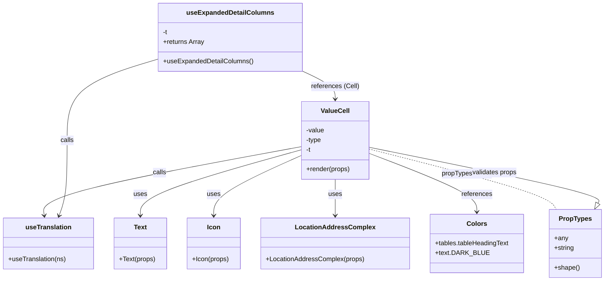

# Diagram: web/portal/src/pages/administration/internal-tools/vin-eta-validator/VinEtaValidator.ExpandedDetails.columns.js

> Auto-generated by Obscura crawlers

## Mermaid

### SVG

<svg id="container" width="1470.609375" xmlns="http://www.w3.org/2000/svg" class="classDiagram" height="692" viewBox="0 0 1470.609375 692" role="graphics-document document" aria-roledescription="class"><g><defs><marker id="container_class-aggregationStart" class="marker aggregation class" refX="18" refY="7" markerWidth="190" markerHeight="240" orient="auto"><path d="M 18,7 L9,13 L1,7 L9,1 Z"></path></marker></defs><defs><marker id="container_class-aggregationEnd" class="marker aggregation class" refX="1" refY="7" markerWidth="20" markerHeight="28" orient="auto"><path d="M 18,7 L9,13 L1,7 L9,1 Z"></path></marker></defs><defs><marker id="container_class-extensionStart" class="marker extension class" refX="18" refY="7" markerWidth="190" markerHeight="240" orient="auto"><path d="M 1,7 L18,13 V 1 Z"></path></marker></defs><defs><marker id="container_class-extensionEnd" class="marker extension class" refX="1" refY="7" markerWidth="20" markerHeight="28" orient="auto"><path d="M 1,1 V 13 L18,7 Z"></path></marker></defs><defs><marker id="container_class-compositionStart" class="marker composition class" refX="18" refY="7" markerWidth="190" markerHeight="240" orient="auto"><path d="M 18,7 L9,13 L1,7 L9,1 Z"></path></marker></defs><defs><marker id="container_class-compositionEnd" class="marker composition class" refX="1" refY="7" markerWidth="20" markerHeight="28" orient="auto"><path d="M 18,7 L9,13 L1,7 L9,1 Z"></path></marker></defs><defs><marker id="container_class-dependencyStart" class="marker dependency class" refX="6" refY="7" markerWidth="190" markerHeight="240" orient="auto"><path d="M 5,7 L9,13 L1,7 L9,1 Z"></path></marker></defs><defs><marker id="container_class-dependencyEnd" class="marker dependency class" refX="13" refY="7" markerWidth="20" markerHeight="28" orient="auto"><path d="M 18,7 L9,13 L14,7 L9,1 Z"></path></marker></defs><defs><marker id="container_class-lollipopStart" class="marker lollipop class" refX="13" refY="7" markerWidth="190" markerHeight="240" orient="auto"><circle stroke="black" fill="transparent" cx="7" cy="7" r="6"></circle></marker></defs><defs><marker id="container_class-lollipopEnd" class="marker lollipop class" refX="1" refY="7" markerWidth="190" markerHeight="240" orient="auto"><circle stroke="black" fill="transparent" cx="7" cy="7" r="6"></circle></marker></defs><g class="root"><g class="clusters"></g><g class="edgePaths"><path d="M732.023,369.301L667.028,387.584C602.033,405.867,472.042,442.434,407.046,469.383C342.051,496.333,342.051,513.667,342.051,522.333L342.051,531" id="id_ValueCell_Text_1" class="edge-thickness-normal edge-pattern-solid relation" style=";;;" data-edge="true" data-et="edge" data-id="id_ValueCell_Text_1" data-points="W3sieCI6NzMyLjAyMzQzNzUsInkiOjM2OS4zMDA2NTc2NDQ3MDY2M30seyJ4IjozNDIuMDUwNzgxMjUsInkiOjQ3OX0seyJ4IjozNDIuMDUwNzgxMjUsInkiOjUzN31d" marker-end="url(#container_class-dependencyEnd)"></path><path d="M732.023,383.491L696.854,399.409C661.684,415.327,591.344,447.164,556.174,471.748C521.004,496.333,521.004,513.667,521.004,522.333L521.004,531" id="id_ValueCell_Icon_2" class="edge-thickness-normal edge-pattern-solid relation" style=";;;" data-edge="true" data-et="edge" data-id="id_ValueCell_Icon_2" data-points="W3sieCI6NzMyLjAyMzQzNzUsInkiOjM4My40OTA1NjE3NzM4NTQ4fSx7IngiOjUyMS4wMDM5MDYyNSwieSI6NDc5fSx7IngiOjUyMS4wMDM5MDYyNSwieSI6NTM3fV0=" marker-end="url(#container_class-dependencyEnd)"></path><path d="M814.855,442L814.855,448.167C814.855,454.333,814.855,466.667,814.855,481.5C814.855,496.333,814.855,513.667,814.855,522.333L814.855,531" id="id_ValueCell_LocationAddressComplex_3" class="edge-thickness-normal edge-pattern-solid relation" style=";;;" data-edge="true" data-et="edge" data-id="id_ValueCell_LocationAddressComplex_3" data-points="W3sieCI6ODE0Ljg1NTQ2ODc1LCJ5Ijo0NDJ9LHsieCI6ODE0Ljg1NTQ2ODc1LCJ5Ijo0Nzl9LHsieCI6ODE0Ljg1NTQ2ODc1LCJ5Ijo1Mzd9XQ==" marker-end="url(#container_class-dependencyEnd)"></path><path d="M732.023,361.407L626.655,381.006C521.286,400.605,310.549,439.802,206.488,468.079C102.426,496.356,105.04,513.711,106.347,522.389L107.654,531.067" id="id_ValueCell_useTranslation_4" class="edge-thickness-normal edge-pattern-solid relation" style=";;;" data-edge="true" data-et="edge" data-id="id_ValueCell_useTranslation_4" data-points="W3sieCI6NzMyLjAyMzQzNzUsInkiOjM2MS40MDY5OTA0MDE1ODIwNX0seyJ4Ijo5OS44MTI1LCJ5Ijo0Nzl9LHsieCI6MTA4LjU0NzMyNjk2MjgwOTkyLCJ5Ijo1Mzd9XQ==" marker-end="url(#container_class-dependencyEnd)"></path><path d="M897.688,378.052L941.167,394.877C984.647,411.701,1071.607,445.351,1115.087,469.342C1158.566,493.333,1158.566,507.667,1158.566,514.833L1158.566,522" id="id_ValueCell_Colors_5" class="edge-thickness-normal edge-pattern-solid relation" style=";;;" data-edge="true" data-et="edge" data-id="id_ValueCell_Colors_5" data-points="W3sieCI6ODk3LjY4NzUsInkiOjM3OC4wNTIxMDgxOTQxMTN9LHsieCI6MTE1OC41NjY0MDYyNSwieSI6NDc5fSx7IngiOjExNTguNTY2NDA2MjUsInkiOjUyOH1d" marker-end="url(#container_class-dependencyEnd)"></path><path d="M387.004,144.75L349.654,156.125C312.304,167.5,237.604,190.25,200.254,223.792C162.904,257.333,162.904,301.667,162.904,346C162.904,390.333,162.904,434.667,159.667,465.562C156.43,496.458,149.957,513.916,146.72,522.645L143.483,531.374" id="id_useExpandedDetailColumns_useTranslation_6" class="edge-thickness-normal edge-pattern-solid relation" style=";;;" data-edge="true" data-et="edge" data-id="id_useExpandedDetailColumns_useTranslation_6" data-points="W3sieCI6Mzg3LjAwMzkwNjI1LCJ5IjoxNDQuNzQ5NjQ0ODIxNzcxODJ9LHsieCI6MTYyLjkwNDI5Njg3NSwieSI6MjEzfSx7IngiOjE2Mi45MDQyOTY4NzUsInkiOjM0Nn0seyJ4IjoxNjIuOTA0Mjk2ODc1LCJ5Ijo0Nzl9LHsieCI6MTQxLjM5Njc3NDkyMjUyMDY1LCJ5Ijo1Mzd9XQ==" marker-end="url(#container_class-dependencyEnd)"></path><path d="M733.41,174.3L746.984,180.75C760.559,187.2,787.707,200.1,801.281,211.717C814.855,223.333,814.855,233.667,814.855,238.833L814.855,244" id="id_useExpandedDetailColumns_ValueCell_7" class="edge-thickness-normal edge-pattern-solid relation" style=";;;" data-edge="true" data-et="edge" data-id="id_useExpandedDetailColumns_ValueCell_7" data-points="W3sieCI6NzMzLjQxMDE1NjI1LCJ5IjoxNzQuMzAwMDQ2MDE5MzI4MTR9LHsieCI6ODE0Ljg1NTQ2ODc1LCJ5IjoyMTN9LHsieCI6ODE0Ljg1NTQ2ODc1LCJ5IjoyNTB9XQ==" marker-end="url(#container_class-dependencyEnd)"></path><path d="M897.688,367.311L970.042,385.925C1042.396,404.54,1187.104,441.77,1262.954,466.552C1338.805,491.333,1345.797,503.667,1349.293,509.833L1352.789,516" id="id_ValueCell_PropTypes_8" class="edge-thickness-normal edge-pattern-dashed relation" style=";;;" data-edge="true" data-et="edge" data-id="id_ValueCell_PropTypes_8" data-points="W3sieCI6ODk3LjY4NzUsInkiOjM2Ny4zMTA1OTE1Nzc4MTc5fSx7IngiOjEzMzEuODEyNSwieSI6NDc5fSx7IngiOjEzNTIuNzg4NjQyODIwMjQ4LCJ5Ijo1MTZ9XQ=="></path><path d="M1456.539,500.994L1458.617,497.328C1460.695,493.663,1464.852,486.331,1371.71,463.306C1278.568,440.28,1088.128,401.561,992.908,382.201L897.688,362.841" id="id_PropTypes_ValueCell_9" class="edge-thickness-normal edge-pattern-solid relation" style=";;;" data-edge="true" data-et="edge" data-id="id_PropTypes_ValueCell_9" data-points="W3sieCI6MTQ0OC4wMzE2Njk2Nzk3NTIsInkiOjUxNn0seyJ4IjoxNDY5LjAwNzgxMjUsInkiOjQ3OX0seyJ4Ijo4OTcuNjg3NSwieSI6MzYyLjg0MTEyMzExMzc2MjR9XQ==" marker-start="url(#container_class-extensionStart)"></path></g><g class="edgeLabels"><g class="edgeLabel" transform="translate(342.05078125, 479)"><g class="label" data-id="id_ValueCell_Text_1" transform="translate(-16.4921875, -12)"><foreignObject width="32.984375" height="24">

uses

</foreignObject></g></g><g class="edgeLabel" transform="translate(521.00390625, 479)"><g class="label" data-id="id_ValueCell_Icon_2" transform="translate(-16.4921875, -12)"><foreignObject width="32.984375" height="24">

uses

</foreignObject></g></g><g class="edgeLabel" transform="translate(814.85546875, 479)"><g class="label" data-id="id_ValueCell_LocationAddressComplex_3" transform="translate(-16.4921875, -12)"><foreignObject width="32.984375" height="24">

uses

</foreignObject></g></g><g class="edgeLabel" transform="translate(387.08546, 425.56642)"><g class="label" data-id="id_ValueCell_useTranslation_4" transform="translate(-16.4453125, -12)"><foreignObject width="32.890625" height="24">

calls

</foreignObject></g></g><g class="edgeLabel" transform="translate(1158.56640625, 479)"><g class="label" data-id="id_ValueCell_Colors_5" transform="translate(-37.828125, -12)"><foreignObject width="75.65625" height="24">

references

</foreignObject></g></g><g class="edgeLabel" transform="translate(162.904296875, 346)"><g class="label" data-id="id_useExpandedDetailColumns_useTranslation_6" transform="translate(-16.4453125, -12)"><foreignObject width="32.890625" height="24">

calls

</foreignObject></g></g><g class="edgeLabel" transform="translate(814.85546875, 213)"><g class="label" data-id="id_useExpandedDetailColumns_ValueCell_7" transform="translate(-58.5, -12)"><foreignObject width="117" height="24">

references (Cell)

</foreignObject></g></g><g class="edgeLabel" transform="translate(1135.34547, 428.45399)"><g class="label" data-id="id_ValueCell_PropTypes_8" transform="translate(-61.6328125, -12)"><foreignObject width="123.265625" height="24">

propTypes shape

</foreignObject></g></g><g class="edgeLabel" transform="translate(1204.18745, 425.15764)"><g class="label" data-id="id_PropTypes_ValueCell_9" transform="translate(-55.5625, -12)"><foreignObject width="111.125" height="24">

validates props

</foreignObject></g></g></g><g class="nodes"><g class="node default" id="classId-ValueCell-0" transform="translate(814.85546875, 346)"><g class="basic label-container"><path d="M-82.83203125 -96 L82.83203125 -96 L82.83203125 96 L-82.83203125 96" stroke="none" stroke-width="0" fill="#ECECFF" style=""></path><path d="M-82.83203125 -96 C-37.9414036513955 -96, 6.949223947209006 -96, 82.83203125 -96 M-82.83203125 -96 C-41.98010377876715 -96, -1.1281763075343036 -96, 82.83203125 -96 M82.83203125 -96 C82.83203125 -49.349636441907926, 82.83203125 -2.6992728838158513, 82.83203125 96 M82.83203125 -96 C82.83203125 -27.754638699168325, 82.83203125 40.49072260166335, 82.83203125 96 M82.83203125 96 C45.84991634332861 96, 8.867801436657217 96, -82.83203125 96 M82.83203125 96 C40.6780062428476 96, -1.476018764304797 96, -82.83203125 96 M-82.83203125 96 C-82.83203125 53.666723663550734, -82.83203125 11.333447327101467, -82.83203125 -96 M-82.83203125 96 C-82.83203125 29.349203098112355, -82.83203125 -37.30159380377529, -82.83203125 -96" stroke="#9370DB" stroke-width="1.3" fill="none" stroke-dasharray="0 0" style=""></path></g><g class="annotation-group text" transform="translate(0, -72)"></g><g class="label-group text" transform="translate(-33.5234375, -72)"><g class="label" style="font-weight: bolder" transform="translate(0,-12)"><foreignObject width="67.046875" height="24">

ValueCell

</foreignObject></g></g><g class="members-group text" transform="translate(-70.83203125, -24)"><g class="label" style="" transform="translate(0,-12)"><foreignObject width="45.171875" height="24">

-value

</foreignObject></g><g class="label" style="" transform="translate(0,12)"><foreignObject width="38.171875" height="24">

-type

</foreignObject></g><g class="label" style="" transform="translate(0,36)"><foreignObject width="12.15625" height="24">

-t

</foreignObject></g></g><g class="methods-group text" transform="translate(-70.83203125, 72)"><g class="label" style="" transform="translate(0,-12)"><foreignObject width="108.140625" height="24">

+render(props)

</foreignObject></g></g><g class="divider" style=""><path d="M-82.83203125 -48 C-24.218385298183712 -48, 34.395260653632576 -48, 82.83203125 -48 M-82.83203125 -48 C-40.15056396979961 -48, 2.530903310400774 -48, 82.83203125 -48" stroke="#9370DB" stroke-width="1.3" fill="none" stroke-dasharray="0 0" style=""></path></g><g class="divider" style=""><path d="M-82.83203125 48 C-31.232772668922692 48, 20.366485912154616 48, 82.83203125 48 M-82.83203125 48 C-48.776503775249274 48, -14.720976300498549 48, 82.83203125 48" stroke="#9370DB" stroke-width="1.3" fill="none" stroke-dasharray="0 0" style=""></path></g></g><g class="node default" id="classId-useExpandedDetailColumns-1" transform="translate(560.20703125, 92)"><g class="basic label-container"><path d="M-173.203125 -84 L173.203125 -84 L173.203125 84 L-173.203125 84" stroke="none" stroke-width="0" fill="#ECECFF" style=""></path><path d="M-173.203125 -84 C-96.1658146537314 -84, -19.128504307462805 -84, 173.203125 -84 M-173.203125 -84 C-48.29662542471921 -84, 76.60987415056158 -84, 173.203125 -84 M173.203125 -84 C173.203125 -46.31875688428051, 173.203125 -8.637513768561021, 173.203125 84 M173.203125 -84 C173.203125 -35.987093080851345, 173.203125 12.02581383829731, 173.203125 84 M173.203125 84 C97.56674221033757 84, 21.93035942067513 84, -173.203125 84 M173.203125 84 C71.11039483628566 84, -30.98233532742867 84, -173.203125 84 M-173.203125 84 C-173.203125 33.05988312252697, -173.203125 -17.88023375494606, -173.203125 -84 M-173.203125 84 C-173.203125 39.94206311064118, -173.203125 -4.115873778717642, -173.203125 -84" stroke="#9370DB" stroke-width="1.3" fill="none" stroke-dasharray="0 0" style=""></path></g><g class="annotation-group text" transform="translate(0, -60)"></g><g class="label-group text" transform="translate(-101.8125, -60)"><g class="label" style="font-weight: bolder" transform="translate(0,-12)"><foreignObject width="203.625" height="24">

useExpandedDetailColumns

</foreignObject></g></g><g class="members-group text" transform="translate(-161.203125, -12)"><g class="label" style="" transform="translate(0,-12)"><foreignObject width="12.15625" height="24">

-t

</foreignObject></g><g class="label" style="" transform="translate(0,12)"><foreignObject width="102.0625" height="24">

+returns Array

</foreignObject></g></g><g class="methods-group text" transform="translate(-161.203125, 60)"><g class="label" style="" transform="translate(0,-12)"><foreignObject width="220.59375" height="24">

+useExpandedDetailColumns()

</foreignObject></g></g><g class="divider" style=""><path d="M-173.203125 -36 C-44.347976460632054 -36, 84.50717207873589 -36, 173.203125 -36 M-173.203125 -36 C-81.49912187429597 -36, 10.204881251408068 -36, 173.203125 -36" stroke="#9370DB" stroke-width="1.3" fill="none" stroke-dasharray="0 0" style=""></path></g><g class="divider" style=""><path d="M-173.203125 36 C-73.0704600077572 36, 27.06220498448559 36, 173.203125 36 M-173.203125 36 C-80.80468599186628 36, 11.593753016267442 36, 173.203125 36" stroke="#9370DB" stroke-width="1.3" fill="none" stroke-dasharray="0 0" style=""></path></g></g><g class="node default" id="classId-PropTypes-2" transform="translate(1400.41015625, 600)"><g class="basic label-container"><path d="M-62.19921875 -84 L62.19921875 -84 L62.19921875 84 L-62.19921875 84" stroke="none" stroke-width="0" fill="#ECECFF" style=""></path><path d="M-62.19921875 -84 C-33.285790387213716 -84, -4.3723620244274315 -84, 62.19921875 -84 M-62.19921875 -84 C-15.973568587376228 -84, 30.252081575247544 -84, 62.19921875 -84 M62.19921875 -84 C62.19921875 -22.440447898338903, 62.19921875 39.119104203322195, 62.19921875 84 M62.19921875 -84 C62.19921875 -20.89573626105637, 62.19921875 42.20852747788726, 62.19921875 84 M62.19921875 84 C18.62987912565132 84, -24.939460498697358 84, -62.19921875 84 M62.19921875 84 C17.19843993613489 84, -27.80233887773022 84, -62.19921875 84 M-62.19921875 84 C-62.19921875 25.96686312148023, -62.19921875 -32.06627375703954, -62.19921875 -84 M-62.19921875 84 C-62.19921875 48.363646790696585, -62.19921875 12.72729358139317, -62.19921875 -84" stroke="#9370DB" stroke-width="1.3" fill="none" stroke-dasharray="0 0" style=""></path></g><g class="annotation-group text" transform="translate(0, -60)"></g><g class="label-group text" transform="translate(-38.2578125, -60)"><g class="label" style="font-weight: bolder" transform="translate(0,-12)"><foreignObject width="76.515625" height="24">

PropTypes

</foreignObject></g></g><g class="members-group text" transform="translate(-50.19921875, -12)"><g class="label" style="" transform="translate(0,-12)"><foreignObject width="33.59375" height="24">

+any

</foreignObject></g><g class="label" style="" transform="translate(0,12)"><foreignObject width="49.625" height="24">

+string

</foreignObject></g></g><g class="methods-group text" transform="translate(-50.19921875, 60)"><g class="label" style="" transform="translate(0,-12)"><foreignObject width="62.140625" height="24">

+shape()

</foreignObject></g></g><g class="divider" style=""><path d="M-62.19921875 -36 C-23.79605077708615 -36, 14.607117195827698 -36, 62.19921875 -36 M-62.19921875 -36 C-27.61539904537667 -36, 6.968420659246661 -36, 62.19921875 -36" stroke="#9370DB" stroke-width="1.3" fill="none" stroke-dasharray="0 0" style=""></path></g><g class="divider" style=""><path d="M-62.19921875 36 C-30.15399064062011 36, 1.8912374687597833 36, 62.19921875 36 M-62.19921875 36 C-13.70733477480352 36, 34.78454920039296 36, 62.19921875 36" stroke="#9370DB" stroke-width="1.3" fill="none" stroke-dasharray="0 0" style=""></path></g></g><g class="node default" id="classId-useTranslation-3" transform="translate(118.03515625, 600)"><g class="basic label-container"><path d="M-110.03515625 -63 L110.03515625 -63 L110.03515625 63 L-110.03515625 63" stroke="none" stroke-width="0" fill="#ECECFF" style=""></path><path d="M-110.03515625 -63 C-25.005603277829024 -63, 60.02394969434195 -63, 110.03515625 -63 M-110.03515625 -63 C-53.826545632712374 -63, 2.3820649845752513 -63, 110.03515625 -63 M110.03515625 -63 C110.03515625 -23.590159525195673, 110.03515625 15.819680949608653, 110.03515625 63 M110.03515625 -63 C110.03515625 -14.200493699118802, 110.03515625 34.5990126017624, 110.03515625 63 M110.03515625 63 C53.28709463056998 63, -3.4609669888600365 63, -110.03515625 63 M110.03515625 63 C61.05512729533573 63, 12.07509834067146 63, -110.03515625 63 M-110.03515625 63 C-110.03515625 26.990502241985403, -110.03515625 -9.018995516029193, -110.03515625 -63 M-110.03515625 63 C-110.03515625 28.548067849741187, -110.03515625 -5.9038643005176255, -110.03515625 -63" stroke="#9370DB" stroke-width="1.3" fill="none" stroke-dasharray="0 0" style=""></path></g><g class="annotation-group text" transform="translate(0, -39)"></g><g class="label-group text" transform="translate(-54.0859375, -39)"><g class="label" style="font-weight: bolder" transform="translate(0,-12)"><foreignObject width="108.171875" height="24">

useTranslation

</foreignObject></g></g><g class="members-group text" transform="translate(-98.03515625, 9)"></g><g class="methods-group text" transform="translate(-98.03515625, 39)"><g class="label" style="" transform="translate(0,-12)"><foreignObject width="141.984375" height="24">

+useTranslation(ns)

</foreignObject></g></g><g class="divider" style=""><path d="M-110.03515625 -15 C-44.15524151452418 -15, 21.724673220951644 -15, 110.03515625 -15 M-110.03515625 -15 C-39.96242791483019 -15, 30.110300420339627 -15, 110.03515625 -15" stroke="#9370DB" stroke-width="1.3" fill="none" stroke-dasharray="0 0" style=""></path></g><g class="divider" style=""><path d="M-110.03515625 9 C-62.4315969622588 9, -14.828037674517603 9, 110.03515625 9 M-110.03515625 9 C-49.20613972364461 9, 11.622876802710778 9, 110.03515625 9" stroke="#9370DB" stroke-width="1.3" fill="none" stroke-dasharray="0 0" style=""></path></g></g><g class="node default" id="classId-Text-4" transform="translate(342.05078125, 600)"><g class="basic label-container"><path d="M-63.98046875 -63 L63.98046875 -63 L63.98046875 63 L-63.98046875 63" stroke="none" stroke-width="0" fill="#ECECFF" style=""></path><path d="M-63.98046875 -63 C-38.320374281623586 -63, -12.660279813247172 -63, 63.98046875 -63 M-63.98046875 -63 C-28.531027086118357 -63, 6.918414577763286 -63, 63.98046875 -63 M63.98046875 -63 C63.98046875 -21.92223727572197, 63.98046875 19.155525448556062, 63.98046875 63 M63.98046875 -63 C63.98046875 -17.30499907256796, 63.98046875 28.39000185486408, 63.98046875 63 M63.98046875 63 C24.630321580866642 63, -14.719825588266715 63, -63.98046875 63 M63.98046875 63 C14.913880893850099 63, -34.1527069622998 63, -63.98046875 63 M-63.98046875 63 C-63.98046875 34.084553986165815, -63.98046875 5.169107972331624, -63.98046875 -63 M-63.98046875 63 C-63.98046875 22.14753857438822, -63.98046875 -18.704922851223557, -63.98046875 -63" stroke="#9370DB" stroke-width="1.3" fill="none" stroke-dasharray="0 0" style=""></path></g><g class="annotation-group text" transform="translate(0, -39)"></g><g class="label-group text" transform="translate(-15.3828125, -39)"><g class="label" style="font-weight: bolder" transform="translate(0,-12)"><foreignObject width="30.765625" height="24">

Text

</foreignObject></g></g><g class="members-group text" transform="translate(-51.98046875, 9)"></g><g class="methods-group text" transform="translate(-51.98046875, 39)"><g class="label" style="" transform="translate(0,-12)"><foreignObject width="88.578125" height="24">

+Text(props)

</foreignObject></g></g><g class="divider" style=""><path d="M-63.98046875 -15 C-20.625624759255615 -15, 22.72921923148877 -15, 63.98046875 -15 M-63.98046875 -15 C-23.794261029988363 -15, 16.391946690023275 -15, 63.98046875 -15" stroke="#9370DB" stroke-width="1.3" fill="none" stroke-dasharray="0 0" style=""></path></g><g class="divider" style=""><path d="M-63.98046875 9 C-34.9144042463827 9, -5.848339742765397 9, 63.98046875 9 M-63.98046875 9 C-17.564852465398623 9, 28.850763819202754 9, 63.98046875 9" stroke="#9370DB" stroke-width="1.3" fill="none" stroke-dasharray="0 0" style=""></path></g></g><g class="node default" id="classId-LocationAddressComplex-5" transform="translate(814.85546875, 600)"><g class="basic label-container"><path d="M-178.87890625 -63 L178.87890625 -63 L178.87890625 63 L-178.87890625 63" stroke="none" stroke-width="0" fill="#ECECFF" style=""></path><path d="M-178.87890625 -63 C-91.6256317731564 -63, -4.372357296312799 -63, 178.87890625 -63 M-178.87890625 -63 C-80.08599563263103 -63, 18.70691498473795 -63, 178.87890625 -63 M178.87890625 -63 C178.87890625 -23.531229273319852, 178.87890625 15.937541453360296, 178.87890625 63 M178.87890625 -63 C178.87890625 -32.437653860324076, 178.87890625 -1.875307720648145, 178.87890625 63 M178.87890625 63 C104.83370180055212 63, 30.78849735110424 63, -178.87890625 63 M178.87890625 63 C58.0655049557205 63, -62.747896338559 63, -178.87890625 63 M-178.87890625 63 C-178.87890625 15.573836187576006, -178.87890625 -31.852327624847987, -178.87890625 -63 M-178.87890625 63 C-178.87890625 26.149320363320406, -178.87890625 -10.701359273359188, -178.87890625 -63" stroke="#9370DB" stroke-width="1.3" fill="none" stroke-dasharray="0 0" style=""></path></g><g class="annotation-group text" transform="translate(0, -39)"></g><g class="label-group text" transform="translate(-92.1171875, -39)"><g class="label" style="font-weight: bolder" transform="translate(0,-12)"><foreignObject width="184.234375" height="24">

LocationAddressComplex

</foreignObject></g></g><g class="members-group text" transform="translate(-166.87890625, 9)"></g><g class="methods-group text" transform="translate(-166.87890625, 39)"><g class="label" style="" transform="translate(0,-12)"><foreignObject width="241.640625" height="24">

+LocationAddressComplex(props)

</foreignObject></g></g><g class="divider" style=""><path d="M-178.87890625 -15 C-39.3631852007193 -15, 100.1525358485614 -15, 178.87890625 -15 M-178.87890625 -15 C-106.44059472140874 -15, -34.00228319281749 -15, 178.87890625 -15" stroke="#9370DB" stroke-width="1.3" fill="none" stroke-dasharray="0 0" style=""></path></g><g class="divider" style=""><path d="M-178.87890625 9 C-79.57690532724146 9, 19.725095595517075 9, 178.87890625 9 M-178.87890625 9 C-88.56218840529853 9, 1.754529439402944 9, 178.87890625 9" stroke="#9370DB" stroke-width="1.3" fill="none" stroke-dasharray="0 0" style=""></path></g></g><g class="node default" id="classId-Icon-6" transform="translate(521.00390625, 600)"><g class="basic label-container"><path d="M-64.97265625 -63 L64.97265625 -63 L64.97265625 63 L-64.97265625 63" stroke="none" stroke-width="0" fill="#ECECFF" style=""></path><path d="M-64.97265625 -63 C-36.92814384315777 -63, -8.883631436315532 -63, 64.97265625 -63 M-64.97265625 -63 C-29.17991944604183 -63, 6.612817357916342 -63, 64.97265625 -63 M64.97265625 -63 C64.97265625 -30.537471473252225, 64.97265625 1.92505705349555, 64.97265625 63 M64.97265625 -63 C64.97265625 -34.32064971717993, 64.97265625 -5.641299434359858, 64.97265625 63 M64.97265625 63 C21.70992673402307 63, -21.552802781953858 63, -64.97265625 63 M64.97265625 63 C24.9845906054275 63, -15.003475039145002 63, -64.97265625 63 M-64.97265625 63 C-64.97265625 17.510858229049518, -64.97265625 -27.978283541900964, -64.97265625 -63 M-64.97265625 63 C-64.97265625 36.61680894251026, -64.97265625 10.233617885020514, -64.97265625 -63" stroke="#9370DB" stroke-width="1.3" fill="none" stroke-dasharray="0 0" style=""></path></g><g class="annotation-group text" transform="translate(0, -39)"></g><g class="label-group text" transform="translate(-15.3046875, -39)"><g class="label" style="font-weight: bolder" transform="translate(0,-12)"><foreignObject width="30.609375" height="24">

Icon

</foreignObject></g></g><g class="members-group text" transform="translate(-52.97265625, 9)"></g><g class="methods-group text" transform="translate(-52.97265625, 39)"><g class="label" style="" transform="translate(0,-12)"><foreignObject width="90.640625" height="24">

+Icon(props)

</foreignObject></g></g><g class="divider" style=""><path d="M-64.97265625 -15 C-26.115020346108217 -15, 12.742615557783566 -15, 64.97265625 -15 M-64.97265625 -15 C-28.843190320743673 -15, 7.286275608512653 -15, 64.97265625 -15" stroke="#9370DB" stroke-width="1.3" fill="none" stroke-dasharray="0 0" style=""></path></g><g class="divider" style=""><path d="M-64.97265625 9 C-33.34822599303389 9, -1.7237957360677783 9, 64.97265625 9 M-64.97265625 9 C-13.772759506007908 9, 37.427137237984184 9, 64.97265625 9" stroke="#9370DB" stroke-width="1.3" fill="none" stroke-dasharray="0 0" style=""></path></g></g><g class="node default" id="classId-Colors-7" transform="translate(1158.56640625, 600)"><g class="basic label-container"><path d="M-114.83203125 -72 L114.83203125 -72 L114.83203125 72 L-114.83203125 72" stroke="none" stroke-width="0" fill="#ECECFF" style=""></path><path d="M-114.83203125 -72 C-68.42431535278104 -72, -22.01659945556206 -72, 114.83203125 -72 M-114.83203125 -72 C-25.593170612256174 -72, 63.64569002548765 -72, 114.83203125 -72 M114.83203125 -72 C114.83203125 -28.180910267134365, 114.83203125 15.63817946573127, 114.83203125 72 M114.83203125 -72 C114.83203125 -23.711099846934403, 114.83203125 24.577800306131195, 114.83203125 72 M114.83203125 72 C61.971434306563324 72, 9.110837363126649 72, -114.83203125 72 M114.83203125 72 C46.57364494526118 72, -21.68474135947764 72, -114.83203125 72 M-114.83203125 72 C-114.83203125 30.138533373436587, -114.83203125 -11.722933253126826, -114.83203125 -72 M-114.83203125 72 C-114.83203125 17.135243822873782, -114.83203125 -37.729512354252435, -114.83203125 -72" stroke="#9370DB" stroke-width="1.3" fill="none" stroke-dasharray="0 0" style=""></path></g><g class="annotation-group text" transform="translate(0, -48)"></g><g class="label-group text" transform="translate(-23.1015625, -48)"><g class="label" style="font-weight: bolder" transform="translate(0,-12)"><foreignObject width="46.203125" height="24">

Colors

</foreignObject></g></g><g class="members-group text" transform="translate(-102.83203125, 0)"><g class="label" style="" transform="translate(0,-12)"><foreignObject width="182.5625" height="24">

+tables.tableHeadingText

</foreignObject></g><g class="label" style="" transform="translate(0,12)"><foreignObject width="122.640625" height="24">

+text.DARK_BLUE

</foreignObject></g></g><g class="methods-group text" transform="translate(-102.83203125, 72)"></g><g class="divider" style=""><path d="M-114.83203125 -24 C-41.88686068140416 -24, 31.058309887191683 -24, 114.83203125 -24 M-114.83203125 -24 C-66.05616413832813 -24, -17.280297026656257 -24, 114.83203125 -24" stroke="#9370DB" stroke-width="1.3" fill="none" stroke-dasharray="0 0" style=""></path></g><g class="divider" style=""><path d="M-114.83203125 48 C-50.80905606648666 48, 13.213919117026677 48, 114.83203125 48 M-114.83203125 48 C-51.60488480398105 48, 11.622261642037898 48, 114.83203125 48" stroke="#9370DB" stroke-width="1.3" fill="none" stroke-dasharray="0 0" style=""></path></g></g></g></g></g></svg>
