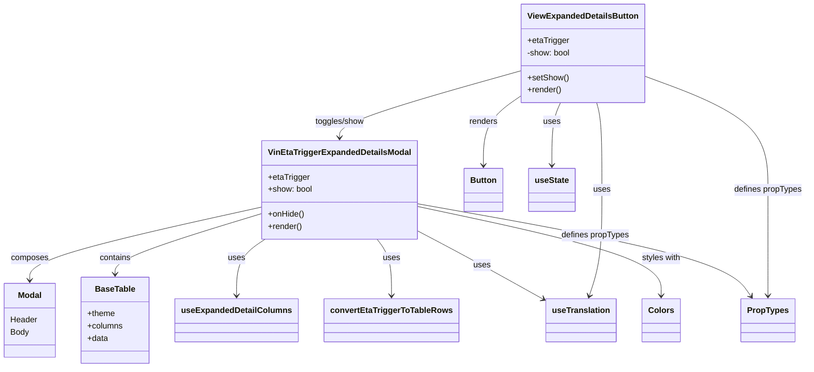

# Diagram: web/portal/src/pages/administration/internal-tools/vin-eta-validator/VinEtaValidator.ExpandedDetails.organism.js


> Auto-generated by Obscura crawlers

## Diagram 1



### SVG

<svg id="container" width="1531.1875" xmlns="http://www.w3.org/2000/svg" class="classDiagram" height="716" viewBox="0 0 1531.1875 716" role="graphics-document document" aria-roledescription="class"><style>#container{font-family:"trebuchet ms",verdana,arial,sans-serif;font-size:16px;fill:#333;}@keyframes edge-animation-frame{from{stroke-dashoffset:0;}}@keyframes dash{to{stroke-dashoffset:0;}}#container .edge-animation-slow{stroke-dasharray:9,5!important;stroke-dashoffset:900;animation:dash 50s linear infinite;stroke-linecap:round;}#container .edge-animation-fast{stroke-dasharray:9,5!important;stroke-dashoffset:900;animation:dash 20s linear infinite;stroke-linecap:round;}#container .error-icon{fill:#552222;}#container .error-text{fill:#552222;stroke:#552222;}#container .edge-thickness-normal{stroke-width:1px;}#container .edge-thickness-thick{stroke-width:3.5px;}#container .edge-pattern-solid{stroke-dasharray:0;}#container .edge-thickness-invisible{stroke-width:0;fill:none;}#container .edge-pattern-dashed{stroke-dasharray:3;}#container .edge-pattern-dotted{stroke-dasharray:2;}#container .marker{fill:#333333;stroke:#333333;}#container .marker.cross{stroke:#333333;}#container svg{font-family:"trebuchet ms",verdana,arial,sans-serif;font-size:16px;}#container p{margin:0;}#container g.classGroup text{fill:#9370DB;stroke:none;font-family:"trebuchet ms",verdana,arial,sans-serif;font-size:10px;}#container g.classGroup text .title{font-weight:bolder;}#container .nodeLabel,#container .edgeLabel{color:#131300;}#container .edgeLabel .label rect{fill:#ECECFF;}#container .label text{fill:#131300;}#container .labelBkg{background:#ECECFF;}#container .edgeLabel .label span{background:#ECECFF;}#container .classTitle{font-weight:bolder;}#container .node rect,#container .node circle,#container .node ellipse,#container .node polygon,#container .node path{fill:#ECECFF;stroke:#9370DB;stroke-width:1px;}#container .divider{stroke:#9370DB;stroke-width:1;}#container g.clickable{cursor:pointer;}#container g.classGroup rect{fill:#ECECFF;stroke:#9370DB;}#container g.classGroup line{stroke:#9370DB;stroke-width:1;}#container .classLabel .box{stroke:none;stroke-width:0;fill:#ECECFF;opacity:0.5;}#container .classLabel .label{fill:#9370DB;font-size:10px;}#container .relation{stroke:#333333;stroke-width:1;fill:none;}#container .dashed-line{stroke-dasharray:3;}#container .dotted-line{stroke-dasharray:1 2;}#container #compositionStart,#container .composition{fill:#333333!important;stroke:#333333!important;stroke-width:1;}#container #compositionEnd,#container .composition{fill:#333333!important;stroke:#333333!important;stroke-width:1;}#container #dependencyStart,#container .dependency{fill:#333333!important;stroke:#333333!important;stroke-width:1;}#container #dependencyStart,#container .dependency{fill:#333333!important;stroke:#333333!important;stroke-width:1;}#container #extensionStart,#container .extension{fill:transparent!important;stroke:#333333!important;stroke-width:1;}#container #extensionEnd,#container .extension{fill:transparent!important;stroke:#333333!important;stroke-width:1;}#container #aggregationStart,#container .aggregation{fill:transparent!important;stroke:#333333!important;stroke-width:1;}#container #aggregationEnd,#container .aggregation{fill:transparent!important;stroke:#333333!important;stroke-width:1;}#container #lollipopStart,#container .lollipop{fill:#ECECFF!important;stroke:#333333!important;stroke-width:1;}#container #lollipopEnd,#container .lollipop{fill:#ECECFF!important;stroke:#333333!important;stroke-width:1;}#container .edgeTerminals{font-size:11px;line-height:initial;}#container .classTitleText{text-anchor:middle;font-size:18px;fill:#333;}#container .label-icon{display:inline-block;height:1em;overflow:visible;vertical-align:-0.125em;}#container .node .label-icon path{fill:currentColor;stroke:revert;stroke-width:revert;}#container :root{--mermaid-font-family:"trebuchet ms",verdana,arial,sans-serif;}</style><g><defs><marker id="container_class-aggregationStart" class="marker aggregation class" refX="18" refY="7" markerWidth="190" markerHeight="240" orient="auto"><path d="M 18,7 L9,13 L1,7 L9,1 Z"></path></marker></defs><defs><marker id="container_class-aggregationEnd" class="marker aggregation class" refX="1" refY="7" markerWidth="20" markerHeight="28" orient="auto"><path d="M 18,7 L9,13 L1,7 L9,1 Z"></path></marker></defs><defs><marker id="container_class-extensionStart" class="marker extension class" refX="18" refY="7" markerWidth="190" markerHeight="240" orient="auto"><path d="M 1,7 L18,13 V 1 Z"></path></marker></defs><defs><marker id="container_class-extensionEnd" class="marker extension class" refX="1" refY="7" markerWidth="20" markerHeight="28" orient="auto"><path d="M 1,1 V 13 L18,7 Z"></path></marker></defs><defs><marker id="container_class-compositionStart" class="marker composition class" refX="18" refY="7" markerWidth="190" markerHeight="240" orient="auto"><path d="M 18,7 L9,13 L1,7 L9,1 Z"></path></marker></defs><defs><marker id="container_class-compositionEnd" class="marker composition class" refX="1" refY="7" markerWidth="20" markerHeight="28" orient="auto"><path d="M 18,7 L9,13 L1,7 L9,1 Z"></path></marker></defs><defs><marker id="container_class-dependencyStart" class="marker dependency class" refX="6" refY="7" markerWidth="190" markerHeight="240" orient="auto"><path d="M 5,7 L9,13 L1,7 L9,1 Z"></path></marker></defs><defs><marker id="container_class-dependencyEnd" class="marker dependency class" refX="13" refY="7" markerWidth="20" markerHeight="28" orient="auto"><path d="M 18,7 L9,13 L14,7 L9,1 Z"></path></marker></defs><defs><marker id="container_class-lollipopStart" class="marker lollipop class" refX="13" refY="7" markerWidth="190" markerHeight="240" orient="auto"><circle stroke="black" fill="transparent" cx="7" cy="7" r="6"></circle></marker></defs><defs><marker id="container_class-lollipopEnd" class="marker lollipop class" refX="1" refY="7" markerWidth="190" markerHeight="240" orient="auto"><circle stroke="black" fill="transparent" cx="7" cy="7" r="6"></circle></marker></defs><g class="root"><g class="clusters"></g><g class="edgePaths"><path d="M986.805,183.466L973.829,192.389C960.853,201.311,934.901,219.155,921.925,242.244C908.949,265.333,908.949,293.667,908.949,307.833L908.949,322" id="id_ViewExpandedDetailsButton_Button_1" class="edge-thickness-normal edge-pattern-solid relation" style=";;;" data-edge="true" data-et="edge" data-id="id_ViewExpandedDetailsButton_Button_1" data-points="W3sieCI6OTg2LjgwNDY4NzUsInkiOjE4My40NjY0MDU0NzY5MDY5fSx7IngiOjkwOC45NDkyMTg3NSwieSI6MjM3fSx7IngiOjkwOC45NDkyMTg3NSwieSI6MzI4fV0=" marker-end="url(#container_class-dependencyEnd)"></path><path d="M986.805,136.989L928.409,153.657C870.013,170.326,753.221,203.663,694.826,225.498C636.43,247.333,636.43,257.667,636.43,262.833L636.43,268" id="id_ViewExpandedDetailsButton_VinEtaTriggerExpandedDetailsModal_2" class="edge-thickness-normal edge-pattern-solid relation" style=";;;" data-edge="true" data-et="edge" data-id="id_ViewExpandedDetailsButton_VinEtaTriggerExpandedDetailsModal_2" data-points="W3sieCI6OTg2LjgwNDY4NzUsInkiOjEzNi45ODg1MzEzNzk0MjAxOH0seyJ4Ijo2MzYuNDI5Njg3NSwieSI6MjM3fSx7IngiOjYzNi40Mjk2ODc1LCJ5IjoyNzR9XQ==" marker-end="url(#container_class-dependencyEnd)"></path><path d="M1057.321,200L1054.427,206.167C1051.533,212.333,1045.745,224.667,1042.851,245C1039.957,265.333,1039.957,293.667,1039.957,307.833L1039.957,322" id="id_ViewExpandedDetailsButton_useState_3" class="edge-thickness-normal edge-pattern-solid relation" style=";;;" data-edge="true" data-et="edge" data-id="id_ViewExpandedDetailsButton_useState_3" data-points="W3sieCI6MTA1Ny4zMjE0Mjg1NzE0Mjg3LCJ5IjoyMDB9LHsieCI6MTAzOS45NTcwMzEyNSwieSI6MjM3fSx7IngiOjEwMzkuOTU3MDMxMjUsInkiOjMyOH1d" marker-end="url(#container_class-dependencyEnd)"></path><path d="M1126.372,200L1127.914,206.167C1129.455,212.333,1132.538,224.667,1134.08,253C1135.621,281.333,1135.621,325.667,1135.621,370C1135.621,414.333,1135.621,458.667,1131.475,493.053C1127.33,527.439,1119.038,551.879,1114.893,564.098L1110.747,576.318" id="id_ViewExpandedDetailsButton_useTranslation_4" class="edge-thickness-normal edge-pattern-solid relation" style=";;;" data-edge="true" data-et="edge" data-id="id_ViewExpandedDetailsButton_useTranslation_4" data-points="W3sieCI6MTEyNi4zNzIxODA0NTExMjc5LCJ5IjoyMDB9LHsieCI6MTEzNS42MjEwOTM3NSwieSI6MjM3fSx7IngiOjExMzUuNjIxMDkzNzUsInkiOjM3MH0seyJ4IjoxMTM1LjYyMTA5Mzc1LCJ5Ijo1MDN9LHsieCI6MTEwOC44MTkzNDQwMDgyNjQ0LCJ5Ijo1ODJ9XQ==" marker-end="url(#container_class-dependencyEnd)"></path><path d="M491.797,403.229L419.419,419.857C347.04,436.486,202.284,469.743,129.906,493.538C57.527,517.333,57.527,531.667,57.527,538.833L57.527,546" id="id_VinEtaTriggerExpandedDetailsModal_Modal_5" class="edge-thickness-normal edge-pattern-solid relation" style=";;;" data-edge="true" data-et="edge" data-id="id_VinEtaTriggerExpandedDetailsModal_Modal_5" data-points="W3sieCI6NDkxLjc5Njg3NSwieSI6NDAzLjIyODY4NTc1MzYxNTF9LHsieCI6NTcuNTI3MzQzNzUsInkiOjUwM30seyJ4Ijo1Ny41MjczNDM3NSwieSI6NTUyfV0=" marker-end="url(#container_class-dependencyEnd)"></path><path d="M491.797,416.455L446.888,430.879C401.979,445.303,312.161,474.152,267.253,493.742C222.344,513.333,222.344,523.667,222.344,528.833L222.344,534" id="id_VinEtaTriggerExpandedDetailsModal_BaseTable_6" class="edge-thickness-normal edge-pattern-solid relation" style=";;;" data-edge="true" data-et="edge" data-id="id_VinEtaTriggerExpandedDetailsModal_BaseTable_6" data-points="W3sieCI6NDkxLjc5Njg3NSwieSI6NDE2LjQ1NDUyMTQ0MjE4MjV9LHsieCI6MjIyLjM0Mzc1LCJ5Ijo1MDN9LHsieCI6MjIyLjM0Mzc1LCJ5Ijo1NDB9XQ==" marker-end="url(#container_class-dependencyEnd)"></path><path d="M781.063,446.845L798.678,456.204C816.293,465.563,851.523,484.282,891.896,506.891C932.269,529.501,977.784,556.002,1000.542,569.252L1023.299,582.503" id="id_VinEtaTriggerExpandedDetailsModal_useTranslation_7" class="edge-thickness-normal edge-pattern-solid relation" style=";;;" data-edge="true" data-et="edge" data-id="id_VinEtaTriggerExpandedDetailsModal_useTranslation_7" data-points="W3sieCI6NzgxLjA2MjUsInkiOjQ0Ni44NDQ5OTc4OTMzNTcwNn0seyJ4Ijo4ODYuNzUzOTA2MjUsInkiOjUwM30seyJ4IjoxMDI4LjQ4NDM3NSwieSI6NTg1LjUyMTgxMzQ5OTc0NjN9XQ==" marker-end="url(#container_class-dependencyEnd)"></path><path d="M502.907,466L494.33,472.167C485.753,478.333,468.599,490.667,460.022,509C451.445,527.333,451.445,551.667,451.445,563.833L451.445,576" id="id_VinEtaTriggerExpandedDetailsModal_useExpandedDetailColumns_8" class="edge-thickness-normal edge-pattern-solid relation" style=";;;" data-edge="true" data-et="edge" data-id="id_VinEtaTriggerExpandedDetailsModal_useExpandedDetailColumns_8" data-points="W3sieCI6NTAyLjkwNzEzMTEwOTAyMjU0LCJ5Ijo0NjZ9LHsieCI6NDUxLjQ0NTMxMjUsInkiOjUwM30seyJ4Ijo0NTEuNDQ1MzEyNSwieSI6NTgyfV0=" marker-end="url(#container_class-dependencyEnd)"></path><path d="M711.114,466L715.911,472.167C720.709,478.333,730.304,490.667,735.101,509C739.898,527.333,739.898,551.667,739.898,563.833L739.898,576" id="id_VinEtaTriggerExpandedDetailsModal_convertEtaTriggerToTableRows_9" class="edge-thickness-normal edge-pattern-solid relation" style=";;;" data-edge="true" data-et="edge" data-id="id_VinEtaTriggerExpandedDetailsModal_convertEtaTriggerToTableRows_9" data-points="W3sieCI6NzExLjExMzg5ODAyNjMxNTgsInkiOjQ2Nn0seyJ4Ijo3MzkuODk4NDM3NSwieSI6NTAzfSx7IngiOjczOS44OTg0Mzc1LCJ5Ijo1ODJ9XQ==" marker-end="url(#container_class-dependencyEnd)"></path><path d="M781.063,401.569L858.512,418.475C935.961,435.38,1090.859,469.19,1168.309,498.262C1245.758,527.333,1245.758,551.667,1245.758,563.833L1245.758,576" id="id_VinEtaTriggerExpandedDetailsModal_Colors_10" class="edge-thickness-normal edge-pattern-solid relation" style=";;;" data-edge="true" data-et="edge" data-id="id_VinEtaTriggerExpandedDetailsModal_Colors_10" data-points="W3sieCI6NzgxLjA2MjUsInkiOjQwMS41Njk0NjY4ODIwNjc4NH0seyJ4IjoxMjQ1Ljc1NzgxMjUsInkiOjUwM30seyJ4IjoxMjQ1Ljc1NzgxMjUsInkiOjU4Mn1d" marker-end="url(#container_class-dependencyEnd)"></path><path d="M1217.945,147.354L1257.773,162.295C1297.602,177.236,1377.258,207.118,1417.086,244.226C1456.914,281.333,1456.914,325.667,1456.914,370C1456.914,414.333,1456.914,458.667,1456.914,493C1456.914,527.333,1456.914,551.667,1456.914,563.833L1456.914,576" id="id_ViewExpandedDetailsButton_PropTypes_11" class="edge-thickness-normal edge-pattern-solid relation" style=";;;" data-edge="true" data-et="edge" data-id="id_ViewExpandedDetailsButton_PropTypes_11" data-points="W3sieCI6MTIxNy45NDUzMTI1LCJ5IjoxNDcuMzU0NDY1NTI1MjE5OH0seyJ4IjoxNDU2LjkxNDA2MjUsInkiOjIzN30seyJ4IjoxNDU2LjkxNDA2MjUsInkiOjM3MH0seyJ4IjoxNDU2LjkxNDA2MjUsInkiOjUwM30seyJ4IjoxNDU2LjkxNDA2MjUsInkiOjU4Mn1d" marker-end="url(#container_class-dependencyEnd)"></path><path d="M781.063,396.2L879.326,414C977.589,431.8,1174.115,467.4,1281.185,497.552C1388.255,527.705,1405.87,552.41,1414.677,564.762L1423.485,577.115" id="id_VinEtaTriggerExpandedDetailsModal_PropTypes_12" class="edge-thickness-normal edge-pattern-solid relation" style=";;;" data-edge="true" data-et="edge" data-id="id_VinEtaTriggerExpandedDetailsModal_PropTypes_12" data-points="W3sieCI6NzgxLjA2MjUsInkiOjM5Ni4xOTk3Nzg2NzM5NTkxfSx7IngiOjEzNzAuNjQwNjI1LCJ5Ijo1MDN9LHsieCI6MTQyNi45Njc5MTA2NDA0OTU4LCJ5Ijo1ODJ9XQ==" marker-end="url(#container_class-dependencyEnd)"></path></g><g class="edgeLabels"><g class="edgeLabel" transform="translate(908.94921875, 237)"><g class="label" data-id="id_ViewExpandedDetailsButton_Button_1" transform="translate(-27.75, -12)"><foreignObject width="55.5" height="24"><div xmlns="http://www.w3.org/1999/xhtml" class="labelBkg" style="display: table-cell; white-space: nowrap; line-height: 1.5; max-width: 200px; text-align: center;"><span class="edgeLabel"><p>renders</p></span></div></foreignObject></g></g><g class="edgeLabel" transform="translate(636.4296875, 237)"><g class="label" data-id="id_ViewExpandedDetailsButton_VinEtaTriggerExpandedDetailsModal_2" transform="translate(-48.9140625, -12)"><foreignObject width="97.828125" height="24"><div xmlns="http://www.w3.org/1999/xhtml" class="labelBkg" style="display: table-cell; white-space: nowrap; line-height: 1.5; max-width: 200px; text-align: center;"><span class="edgeLabel"><p>toggles/show</p></span></div></foreignObject></g></g><g class="edgeLabel" transform="translate(1039.95703125, 237)"><g class="label" data-id="id_ViewExpandedDetailsButton_useState_3" transform="translate(-16.4921875, -12)"><foreignObject width="32.984375" height="24"><div xmlns="http://www.w3.org/1999/xhtml" class="labelBkg" style="display: table-cell; white-space: nowrap; line-height: 1.5; max-width: 200px; text-align: center;"><span class="edgeLabel"><p>uses</p></span></div></foreignObject></g></g><g class="edgeLabel" transform="translate(1135.62109375, 370)"><g class="label" data-id="id_ViewExpandedDetailsButton_useTranslation_4" transform="translate(-16.4921875, -12)"><foreignObject width="32.984375" height="24"><div xmlns="http://www.w3.org/1999/xhtml" class="labelBkg" style="display: table-cell; white-space: nowrap; line-height: 1.5; max-width: 200px; text-align: center;"><span class="edgeLabel"><p>uses</p></span></div></foreignObject></g></g><g class="edgeLabel" transform="translate(57.52734375, 503)"><g class="label" data-id="id_VinEtaTriggerExpandedDetailsModal_Modal_5" transform="translate(-36.453125, -12)"><foreignObject width="72.90625" height="24"><div xmlns="http://www.w3.org/1999/xhtml" class="labelBkg" style="display: table-cell; white-space: nowrap; line-height: 1.5; max-width: 200px; text-align: center;"><span class="edgeLabel"><p>composes</p></span></div></foreignObject></g></g><g class="edgeLabel" transform="translate(222.34375, 503)"><g class="label" data-id="id_VinEtaTriggerExpandedDetailsModal_BaseTable_6" transform="translate(-30.890625, -12)"><foreignObject width="61.78125" height="24"><div xmlns="http://www.w3.org/1999/xhtml" class="labelBkg" style="display: table-cell; white-space: nowrap; line-height: 1.5; max-width: 200px; text-align: center;"><span class="edgeLabel"><p>contains</p></span></div></foreignObject></g></g><g class="edgeLabel" transform="translate(905.90476, 514.15048)"><g class="label" data-id="id_VinEtaTriggerExpandedDetailsModal_useTranslation_7" transform="translate(-16.4921875, -12)"><foreignObject width="32.984375" height="24"><div xmlns="http://www.w3.org/1999/xhtml" class="labelBkg" style="display: table-cell; white-space: nowrap; line-height: 1.5; max-width: 200px; text-align: center;"><span class="edgeLabel"><p>uses</p></span></div></foreignObject></g></g><g class="edgeLabel" transform="translate(451.4453125, 503)"><g class="label" data-id="id_VinEtaTriggerExpandedDetailsModal_useExpandedDetailColumns_8" transform="translate(-16.4921875, -12)"><foreignObject width="32.984375" height="24"><div xmlns="http://www.w3.org/1999/xhtml" class="labelBkg" style="display: table-cell; white-space: nowrap; line-height: 1.5; max-width: 200px; text-align: center;"><span class="edgeLabel"><p>uses</p></span></div></foreignObject></g></g><g class="edgeLabel" transform="translate(739.8984375, 503)"><g class="label" data-id="id_VinEtaTriggerExpandedDetailsModal_convertEtaTriggerToTableRows_9" transform="translate(-16.4921875, -12)"><foreignObject width="32.984375" height="24"><div xmlns="http://www.w3.org/1999/xhtml" class="labelBkg" style="display: table-cell; white-space: nowrap; line-height: 1.5; max-width: 200px; text-align: center;"><span class="edgeLabel"><p>uses</p></span></div></foreignObject></g></g><g class="edgeLabel" transform="translate(1245.7578125, 503)"><g class="label" data-id="id_VinEtaTriggerExpandedDetailsModal_Colors_10" transform="translate(-38.609375, -12)"><foreignObject width="77.21875" height="24"><div xmlns="http://www.w3.org/1999/xhtml" class="labelBkg" style="display: table-cell; white-space: nowrap; line-height: 1.5; max-width: 200px; text-align: center;"><span class="edgeLabel"><p>styles with</p></span></div></foreignObject></g></g><g class="edgeLabel" transform="translate(1456.9140625, 370)"><g class="label" data-id="id_ViewExpandedDetailsButton_PropTypes_11" transform="translate(-66.2734375, -12)"><foreignObject width="132.546875" height="24"><div xmlns="http://www.w3.org/1999/xhtml" class="labelBkg" style="display: table-cell; white-space: nowrap; line-height: 1.5; max-width: 200px; text-align: center;"><span class="edgeLabel"><p>defines propTypes</p></span></div></foreignObject></g></g><g class="edgeLabel" transform="translate(1123.58696, 458.24701)"><g class="label" data-id="id_VinEtaTriggerExpandedDetailsModal_PropTypes_12" transform="translate(-66.2734375, -12)"><foreignObject width="132.546875" height="24"><div xmlns="http://www.w3.org/1999/xhtml" class="labelBkg" style="display: table-cell; white-space: nowrap; line-height: 1.5; max-width: 200px; text-align: center;"><span class="edgeLabel"><p>defines propTypes</p></span></div></foreignObject></g></g></g><g class="nodes"><g class="node default" id="classId-ViewExpandedDetailsButton-0" transform="translate(1102.375, 104)"><g class="basic label-container"><path d="M-115.5703125 -96 L115.5703125 -96 L115.5703125 96 L-115.5703125 96" stroke="none" stroke-width="0" fill="#ECECFF" style=""></path><path d="M-115.5703125 -96 C-37.06357284149334 -96, 41.44316681701332 -96, 115.5703125 -96 M-115.5703125 -96 C-57.60969946738252 -96, 0.3509135652349613 -96, 115.5703125 -96 M115.5703125 -96 C115.5703125 -25.43892097980722, 115.5703125 45.12215804038556, 115.5703125 96 M115.5703125 -96 C115.5703125 -32.40522021877632, 115.5703125 31.189559562447357, 115.5703125 96 M115.5703125 96 C64.13902640625895 96, 12.707740312517885 96, -115.5703125 96 M115.5703125 96 C25.686401166039857 96, -64.19751016792029 96, -115.5703125 96 M-115.5703125 96 C-115.5703125 56.99282370656874, -115.5703125 17.985647413137485, -115.5703125 -96 M-115.5703125 96 C-115.5703125 33.83875168974567, -115.5703125 -28.32249662050866, -115.5703125 -96" stroke="#9370DB" stroke-width="1.3" fill="none" stroke-dasharray="0 0" style=""></path></g><g class="annotation-group text" transform="translate(0, -72)"></g><g class="label-group text" transform="translate(-103.5703125, -72)"><g class="label" style="font-weight: bolder" transform="translate(0,-12)"><foreignObject width="207.140625" height="24"><div xmlns="http://www.w3.org/1999/xhtml" style="display: table-cell; white-space: nowrap; line-height: 1.5; max-width: 254px; text-align: center;"><span class="nodeLabel markdown-node-label" style=""><p>ViewExpandedDetailsButton</p></span></div></foreignObject></g></g><g class="members-group text" transform="translate(-103.5703125, -24)"><g class="label" style="" transform="translate(0,-12)"><foreignObject width="80.84375" height="24"><div xmlns="http://www.w3.org/1999/xhtml" style="display: table-cell; white-space: nowrap; line-height: 1.5; max-width: 139px; text-align: center;"><span class="nodeLabel markdown-node-label" style=""><p>+etaTrigger</p></span></div></foreignObject></g><g class="label" style="" transform="translate(0,12)"><foreignObject width="85.140625" height="24"><div xmlns="http://www.w3.org/1999/xhtml" style="display: table-cell; white-space: nowrap; line-height: 1.5; max-width: 143px; text-align: center;"><span class="nodeLabel markdown-node-label" style=""><p>-show: bool</p></span></div></foreignObject></g></g><g class="methods-group text" transform="translate(-103.5703125, 48)"><g class="label" style="" transform="translate(0,-12)"><foreignObject width="79.234375" height="24"><div xmlns="http://www.w3.org/1999/xhtml" style="display: table-cell; white-space: nowrap; line-height: 1.5; max-width: 137px; text-align: center;"><span class="nodeLabel markdown-node-label" style=""><p>+setShow()</p></span></div></foreignObject></g><g class="label" style="" transform="translate(0,12)"><foreignObject width="66.609375" height="24"><div xmlns="http://www.w3.org/1999/xhtml" style="display: table-cell; white-space: nowrap; line-height: 1.5; max-width: 124px; text-align: center;"><span class="nodeLabel markdown-node-label" style=""><p>+render()</p></span></div></foreignObject></g></g><g class="divider" style=""><path d="M-115.5703125 -48 C-36.97135314737456 -48, 41.627606205250885 -48, 115.5703125 -48 M-115.5703125 -48 C-42.76144492105804 -48, 30.047422657883914 -48, 115.5703125 -48" stroke="#9370DB" stroke-width="1.3" fill="none" stroke-dasharray="0 0" style=""></path></g><g class="divider" style=""><path d="M-115.5703125 24 C-32.26515150157637 24, 51.04000949684726 24, 115.5703125 24 M-115.5703125 24 C-40.81797566461097 24, 33.93436117077806 24, 115.5703125 24" stroke="#9370DB" stroke-width="1.3" fill="none" stroke-dasharray="0 0" style=""></path></g></g><g class="node default" id="classId-VinEtaTriggerExpandedDetailsModal-1" transform="translate(636.4296875, 370)"><g class="basic label-container"><path d="M-144.6328125 -96 L144.6328125 -96 L144.6328125 96 L-144.6328125 96" stroke="none" stroke-width="0" fill="#ECECFF" style=""></path><path d="M-144.6328125 -96 C-85.28035033882998 -96, -25.927888177659952 -96, 144.6328125 -96 M-144.6328125 -96 C-56.612753591499626 -96, 31.40730531700075 -96, 144.6328125 -96 M144.6328125 -96 C144.6328125 -43.117030153107294, 144.6328125 9.765939693785413, 144.6328125 96 M144.6328125 -96 C144.6328125 -25.128455610215212, 144.6328125 45.743088779569575, 144.6328125 96 M144.6328125 96 C77.15756272174734 96, 9.68231294349468 96, -144.6328125 96 M144.6328125 96 C85.82615699855057 96, 27.019501497101132 96, -144.6328125 96 M-144.6328125 96 C-144.6328125 24.052217473013513, -144.6328125 -47.89556505397297, -144.6328125 -96 M-144.6328125 96 C-144.6328125 30.37292347304053, -144.6328125 -35.25415305391894, -144.6328125 -96" stroke="#9370DB" stroke-width="1.3" fill="none" stroke-dasharray="0 0" style=""></path></g><g class="annotation-group text" transform="translate(0, -72)"></g><g class="label-group text" transform="translate(-132.6328125, -72)"><g class="label" style="font-weight: bolder" transform="translate(0,-12)"><foreignObject width="265.265625" height="24"><div xmlns="http://www.w3.org/1999/xhtml" style="display: table-cell; white-space: nowrap; line-height: 1.5; max-width: 312px; text-align: center;"><span class="nodeLabel markdown-node-label" style=""><p>VinEtaTriggerExpandedDetailsModal</p></span></div></foreignObject></g></g><g class="members-group text" transform="translate(-132.6328125, -24)"><g class="label" style="" transform="translate(0,-12)"><foreignObject width="80.84375" height="24"><div xmlns="http://www.w3.org/1999/xhtml" style="display: table-cell; white-space: nowrap; line-height: 1.5; max-width: 139px; text-align: center;"><span class="nodeLabel markdown-node-label" style=""><p>+etaTrigger</p></span></div></foreignObject></g><g class="label" style="" transform="translate(0,12)"><foreignObject width="86.6875" height="24"><div xmlns="http://www.w3.org/1999/xhtml" style="display: table-cell; white-space: nowrap; line-height: 1.5; max-width: 144px; text-align: center;"><span class="nodeLabel markdown-node-label" style=""><p>+show: bool</p></span></div></foreignObject></g></g><g class="methods-group text" transform="translate(-132.6328125, 48)"><g class="label" style="" transform="translate(0,-12)"><foreignObject width="70.765625" height="24"><div xmlns="http://www.w3.org/1999/xhtml" style="display: table-cell; white-space: nowrap; line-height: 1.5; max-width: 128px; text-align: center;"><span class="nodeLabel markdown-node-label" style=""><p>+onHide()</p></span></div></foreignObject></g><g class="label" style="" transform="translate(0,12)"><foreignObject width="66.609375" height="24"><div xmlns="http://www.w3.org/1999/xhtml" style="display: table-cell; white-space: nowrap; line-height: 1.5; max-width: 124px; text-align: center;"><span class="nodeLabel markdown-node-label" style=""><p>+render()</p></span></div></foreignObject></g></g><g class="divider" style=""><path d="M-144.6328125 -48 C-42.1237831595009 -48, 60.385246180998195 -48, 144.6328125 -48 M-144.6328125 -48 C-83.94290978319452 -48, -23.253007066389046 -48, 144.6328125 -48" stroke="#9370DB" stroke-width="1.3" fill="none" stroke-dasharray="0 0" style=""></path></g><g class="divider" style=""><path d="M-144.6328125 24 C-72.94916223135417 24, -1.2655119627083309 24, 144.6328125 24 M-144.6328125 24 C-67.26806548037423 24, 10.096681539251534 24, 144.6328125 24" stroke="#9370DB" stroke-width="1.3" fill="none" stroke-dasharray="0 0" style=""></path></g></g><g class="node default" id="classId-Button-2" transform="translate(908.94921875, 370)"><g class="basic label-container"><path d="M-36.8359375 -42 L36.8359375 -42 L36.8359375 42 L-36.8359375 42" stroke="none" stroke-width="0" fill="#ECECFF" style=""></path><path d="M-36.8359375 -42 C-18.453557808645076 -42, -0.07117811729015244 -42, 36.8359375 -42 M-36.8359375 -42 C-9.665076919420308 -42, 17.505783661159384 -42, 36.8359375 -42 M36.8359375 -42 C36.8359375 -18.22495978919953, 36.8359375 5.5500804216009385, 36.8359375 42 M36.8359375 -42 C36.8359375 -13.207302483570771, 36.8359375 15.585395032858457, 36.8359375 42 M36.8359375 42 C12.569940881814173 42, -11.696055736371655 42, -36.8359375 42 M36.8359375 42 C10.176694460163812 42, -16.482548579672375 42, -36.8359375 42 M-36.8359375 42 C-36.8359375 17.55692654923849, -36.8359375 -6.88614690152302, -36.8359375 -42 M-36.8359375 42 C-36.8359375 20.552662735114417, -36.8359375 -0.8946745297711658, -36.8359375 -42" stroke="#9370DB" stroke-width="1.3" fill="none" stroke-dasharray="0 0" style=""></path></g><g class="annotation-group text" transform="translate(0, -18)"></g><g class="label-group text" transform="translate(-24.8359375, -18)"><g class="label" style="font-weight: bolder" transform="translate(0,-12)"><foreignObject width="49.671875" height="24"><div xmlns="http://www.w3.org/1999/xhtml" style="display: table-cell; white-space: nowrap; line-height: 1.5; max-width: 99px; text-align: center;"><span class="nodeLabel markdown-node-label" style=""><p>Button</p></span></div></foreignObject></g></g><g class="members-group text" transform="translate(-24.8359375, 30)"></g><g class="methods-group text" transform="translate(-24.8359375, 60)"></g><g class="divider" style=""><path d="M-36.8359375 6 C-8.208319850218391 6, 20.419297799563218 6, 36.8359375 6 M-36.8359375 6 C-19.64862751474356 6, -2.4613175294871183 6, 36.8359375 6" stroke="#9370DB" stroke-width="1.3" fill="none" stroke-dasharray="0 0" style=""></path></g><g class="divider" style=""><path d="M-36.8359375 24 C-15.10442025387147 24, 6.627096992257059 24, 36.8359375 24 M-36.8359375 24 C-21.862629864420917 24, -6.889322228841831 24, 36.8359375 24" stroke="#9370DB" stroke-width="1.3" fill="none" stroke-dasharray="0 0" style=""></path></g></g><g class="node default" id="classId-Modal-3" transform="translate(57.52734375, 624)"><g class="basic label-container"><path d="M-49.52734375 -72 L49.52734375 -72 L49.52734375 72 L-49.52734375 72" stroke="none" stroke-width="0" fill="#ECECFF" style=""></path><path d="M-49.52734375 -72 C-24.39349901059815 -72, 0.7403457288037032 -72, 49.52734375 -72 M-49.52734375 -72 C-14.331733442943495 -72, 20.86387686411301 -72, 49.52734375 -72 M49.52734375 -72 C49.52734375 -37.77775690567585, 49.52734375 -3.5555138113517017, 49.52734375 72 M49.52734375 -72 C49.52734375 -30.56973540206463, 49.52734375 10.86052919587074, 49.52734375 72 M49.52734375 72 C28.26845556942714 72, 7.009567388854279 72, -49.52734375 72 M49.52734375 72 C17.4082106023043 72, -14.710922545391398 72, -49.52734375 72 M-49.52734375 72 C-49.52734375 41.86412682143113, -49.52734375 11.728253642862263, -49.52734375 -72 M-49.52734375 72 C-49.52734375 36.70704267924566, -49.52734375 1.4140853584913202, -49.52734375 -72" stroke="#9370DB" stroke-width="1.3" fill="none" stroke-dasharray="0 0" style=""></path></g><g class="annotation-group text" transform="translate(0, -48)"></g><g class="label-group text" transform="translate(-22.4453125, -48)"><g class="label" style="font-weight: bolder" transform="translate(0,-12)"><foreignObject width="44.890625" height="24"><div xmlns="http://www.w3.org/1999/xhtml" style="display: table-cell; white-space: nowrap; line-height: 1.5; max-width: 95px; text-align: center;"><span class="nodeLabel markdown-node-label" style=""><p>Modal</p></span></div></foreignObject></g></g><g class="members-group text" transform="translate(-37.52734375, 0)"><g class="label" style="" transform="translate(0,-12)"><foreignObject width="52.609375" height="24"><div xmlns="http://www.w3.org/1999/xhtml" style="display: table-cell; white-space: nowrap; line-height: 1.5; max-width: 103px; text-align: center;"><span class="nodeLabel markdown-node-label" style=""><p>Header</p></span></div></foreignObject></g><g class="label" style="" transform="translate(0,12)"><foreignObject width="36.515625" height="24"><div xmlns="http://www.w3.org/1999/xhtml" style="display: table-cell; white-space: nowrap; line-height: 1.5; max-width: 87px; text-align: center;"><span class="nodeLabel markdown-node-label" style=""><p>Body</p></span></div></foreignObject></g></g><g class="methods-group text" transform="translate(-37.52734375, 72)"></g><g class="divider" style=""><path d="M-49.52734375 -24 C-11.663185381054483 -24, 26.200972987891035 -24, 49.52734375 -24 M-49.52734375 -24 C-25.694692173048868 -24, -1.862040596097735 -24, 49.52734375 -24" stroke="#9370DB" stroke-width="1.3" fill="none" stroke-dasharray="0 0" style=""></path></g><g class="divider" style=""><path d="M-49.52734375 48 C-14.769673617762145 48, 19.98799651447571 48, 49.52734375 48 M-49.52734375 48 C-24.529338615239443 48, 0.4686665195211148 48, 49.52734375 48" stroke="#9370DB" stroke-width="1.3" fill="none" stroke-dasharray="0 0" style=""></path></g></g><g class="node default" id="classId-BaseTable-4" transform="translate(222.34375, 624)"><g class="basic label-container"><path d="M-65.2890625 -84 L65.2890625 -84 L65.2890625 84 L-65.2890625 84" stroke="none" stroke-width="0" fill="#ECECFF" style=""></path><path d="M-65.2890625 -84 C-20.851034623695078 -84, 23.586993252609844 -84, 65.2890625 -84 M-65.2890625 -84 C-31.34230165256234 -84, 2.604459194875318 -84, 65.2890625 -84 M65.2890625 -84 C65.2890625 -22.424156626163082, 65.2890625 39.151686747673835, 65.2890625 84 M65.2890625 -84 C65.2890625 -21.371242037444745, 65.2890625 41.25751592511051, 65.2890625 84 M65.2890625 84 C15.0649381529253 84, -35.1591861941494 84, -65.2890625 84 M65.2890625 84 C21.3867379466921 84, -22.5155866066158 84, -65.2890625 84 M-65.2890625 84 C-65.2890625 28.669027257595914, -65.2890625 -26.66194548480817, -65.2890625 -84 M-65.2890625 84 C-65.2890625 16.888698390355955, -65.2890625 -50.22260321928809, -65.2890625 -84" stroke="#9370DB" stroke-width="1.3" fill="none" stroke-dasharray="0 0" style=""></path></g><g class="annotation-group text" transform="translate(0, -60)"></g><g class="label-group text" transform="translate(-37.359375, -60)"><g class="label" style="font-weight: bolder" transform="translate(0,-12)"><foreignObject width="74.71875" height="24"><div xmlns="http://www.w3.org/1999/xhtml" style="display: table-cell; white-space: nowrap; line-height: 1.5; max-width: 123px; text-align: center;"><span class="nodeLabel markdown-node-label" style=""><p>BaseTable</p></span></div></foreignObject></g></g><g class="members-group text" transform="translate(-53.2890625, -12)"><g class="label" style="" transform="translate(0,-12)"><foreignObject width="54.21875" height="24"><div xmlns="http://www.w3.org/1999/xhtml" style="display: table-cell; white-space: nowrap; line-height: 1.5; max-width: 112px; text-align: center;"><span class="nodeLabel markdown-node-label" style=""><p>+theme</p></span></div></foreignObject></g><g class="label" style="" transform="translate(0,12)"><foreignObject width="69.21875" height="24"><div xmlns="http://www.w3.org/1999/xhtml" style="display: table-cell; white-space: nowrap; line-height: 1.5; max-width: 127px; text-align: center;"><span class="nodeLabel markdown-node-label" style=""><p>+columns</p></span></div></foreignObject></g><g class="label" style="" transform="translate(0,36)"><foreignObject width="40.625" height="24"><div xmlns="http://www.w3.org/1999/xhtml" style="display: table-cell; white-space: nowrap; line-height: 1.5; max-width: 98px; text-align: center;"><span class="nodeLabel markdown-node-label" style=""><p>+data</p></span></div></foreignObject></g></g><g class="methods-group text" transform="translate(-53.2890625, 84)"></g><g class="divider" style=""><path d="M-65.2890625 -36 C-21.98680722073926 -36, 21.315448058521483 -36, 65.2890625 -36 M-65.2890625 -36 C-38.66295417077525 -36, -12.036845841550502 -36, 65.2890625 -36" stroke="#9370DB" stroke-width="1.3" fill="none" stroke-dasharray="0 0" style=""></path></g><g class="divider" style=""><path d="M-65.2890625 60 C-25.506255045177014 60, 14.276552409645973 60, 65.2890625 60 M-65.2890625 60 C-34.02562022217325 60, -2.7621779443465044 60, 65.2890625 60" stroke="#9370DB" stroke-width="1.3" fill="none" stroke-dasharray="0 0" style=""></path></g></g><g class="node default" id="classId-useTranslation-5" transform="translate(1094.5703125, 624)"><g class="basic label-container"><path d="M-66.0859375 -42 L66.0859375 -42 L66.0859375 42 L-66.0859375 42" stroke="none" stroke-width="0" fill="#ECECFF" style=""></path><path d="M-66.0859375 -42 C-33.3726631887535 -42, -0.6593888775069985 -42, 66.0859375 -42 M-66.0859375 -42 C-26.18250672548176 -42, 13.720924049036483 -42, 66.0859375 -42 M66.0859375 -42 C66.0859375 -17.02645102440058, 66.0859375 7.947097951198842, 66.0859375 42 M66.0859375 -42 C66.0859375 -14.14901970726227, 66.0859375 13.701960585475462, 66.0859375 42 M66.0859375 42 C25.578353694660116 42, -14.929230110679768 42, -66.0859375 42 M66.0859375 42 C32.391278459374256 42, -1.3033805812514885 42, -66.0859375 42 M-66.0859375 42 C-66.0859375 10.089820683198521, -66.0859375 -21.820358633602957, -66.0859375 -42 M-66.0859375 42 C-66.0859375 14.647210499377831, -66.0859375 -12.705579001244338, -66.0859375 -42" stroke="#9370DB" stroke-width="1.3" fill="none" stroke-dasharray="0 0" style=""></path></g><g class="annotation-group text" transform="translate(0, -18)"></g><g class="label-group text" transform="translate(-54.0859375, -18)"><g class="label" style="font-weight: bolder" transform="translate(0,-12)"><foreignObject width="108.171875" height="24"><div xmlns="http://www.w3.org/1999/xhtml" style="display: table-cell; white-space: nowrap; line-height: 1.5; max-width: 157px; text-align: center;"><span class="nodeLabel markdown-node-label" style=""><p>useTranslation</p></span></div></foreignObject></g></g><g class="members-group text" transform="translate(-54.0859375, 30)"></g><g class="methods-group text" transform="translate(-54.0859375, 60)"></g><g class="divider" style=""><path d="M-66.0859375 6 C-36.800649392210104 6, -7.515361284420216 6, 66.0859375 6 M-66.0859375 6 C-23.41201662718524 6, 19.261904245629523 6, 66.0859375 6" stroke="#9370DB" stroke-width="1.3" fill="none" stroke-dasharray="0 0" style=""></path></g><g class="divider" style=""><path d="M-66.0859375 24 C-37.06257180463861 24, -8.039206109277217 24, 66.0859375 24 M-66.0859375 24 C-15.415675252893053 24, 35.254586994213895 24, 66.0859375 24" stroke="#9370DB" stroke-width="1.3" fill="none" stroke-dasharray="0 0" style=""></path></g></g><g class="node default" id="classId-useState-6" transform="translate(1039.95703125, 370)"><g class="basic label-container"><path d="M-44.171875 -42 L44.171875 -42 L44.171875 42 L-44.171875 42" stroke="none" stroke-width="0" fill="#ECECFF" style=""></path><path d="M-44.171875 -42 C-25.500164738834027 -42, -6.828454477668053 -42, 44.171875 -42 M-44.171875 -42 C-11.025028827443052 -42, 22.121817345113897 -42, 44.171875 -42 M44.171875 -42 C44.171875 -20.734065343022625, 44.171875 0.5318693139547506, 44.171875 42 M44.171875 -42 C44.171875 -17.003271192433587, 44.171875 7.993457615132826, 44.171875 42 M44.171875 42 C24.703382873924063 42, 5.234890747848127 42, -44.171875 42 M44.171875 42 C15.72394608113565 42, -12.723982837728698 42, -44.171875 42 M-44.171875 42 C-44.171875 12.624933145378854, -44.171875 -16.75013370924229, -44.171875 -42 M-44.171875 42 C-44.171875 21.24561780900628, -44.171875 0.4912356180125599, -44.171875 -42" stroke="#9370DB" stroke-width="1.3" fill="none" stroke-dasharray="0 0" style=""></path></g><g class="annotation-group text" transform="translate(0, -18)"></g><g class="label-group text" transform="translate(-32.171875, -18)"><g class="label" style="font-weight: bolder" transform="translate(0,-12)"><foreignObject width="64.34375" height="24"><div xmlns="http://www.w3.org/1999/xhtml" style="display: table-cell; white-space: nowrap; line-height: 1.5; max-width: 113px; text-align: center;"><span class="nodeLabel markdown-node-label" style=""><p>useState</p></span></div></foreignObject></g></g><g class="members-group text" transform="translate(-32.171875, 30)"></g><g class="methods-group text" transform="translate(-32.171875, 60)"></g><g class="divider" style=""><path d="M-44.171875 6 C-17.292977693449963 6, 9.585919613100074 6, 44.171875 6 M-44.171875 6 C-17.45592710209088 6, 9.260020795818242 6, 44.171875 6" stroke="#9370DB" stroke-width="1.3" fill="none" stroke-dasharray="0 0" style=""></path></g><g class="divider" style=""><path d="M-44.171875 24 C-15.897292869336777 24, 12.377289261326446 24, 44.171875 24 M-44.171875 24 C-11.146528712297552 24, 21.878817575404895 24, 44.171875 24" stroke="#9370DB" stroke-width="1.3" fill="none" stroke-dasharray="0 0" style=""></path></g></g><g class="node default" id="classId-convertEtaTriggerToTableRows-7" transform="translate(739.8984375, 624)"><g class="basic label-container"><path d="M-124.640625 -42 L124.640625 -42 L124.640625 42 L-124.640625 42" stroke="none" stroke-width="0" fill="#ECECFF" style=""></path><path d="M-124.640625 -42 C-30.105386191527245 -42, 64.42985261694551 -42, 124.640625 -42 M-124.640625 -42 C-63.60398841893831 -42, -2.5673518378766147 -42, 124.640625 -42 M124.640625 -42 C124.640625 -19.022307983951777, 124.640625 3.955384032096447, 124.640625 42 M124.640625 -42 C124.640625 -23.078106380777164, 124.640625 -4.156212761554329, 124.640625 42 M124.640625 42 C72.92316025069915 42, 21.20569550139831 42, -124.640625 42 M124.640625 42 C60.44301324523242 42, -3.754598509535157 42, -124.640625 42 M-124.640625 42 C-124.640625 14.567511954194604, -124.640625 -12.864976091610792, -124.640625 -42 M-124.640625 42 C-124.640625 22.82238803119538, -124.640625 3.6447760623907612, -124.640625 -42" stroke="#9370DB" stroke-width="1.3" fill="none" stroke-dasharray="0 0" style=""></path></g><g class="annotation-group text" transform="translate(0, -18)"></g><g class="label-group text" transform="translate(-112.640625, -18)"><g class="label" style="font-weight: bolder" transform="translate(0,-12)"><foreignObject width="225.28125" height="24"><div xmlns="http://www.w3.org/1999/xhtml" style="display: table-cell; white-space: nowrap; line-height: 1.5; max-width: 270px; text-align: center;"><span class="nodeLabel markdown-node-label" style=""><p>convertEtaTriggerToTableRows</p></span></div></foreignObject></g></g><g class="members-group text" transform="translate(-112.640625, 30)"></g><g class="methods-group text" transform="translate(-112.640625, 60)"></g><g class="divider" style=""><path d="M-124.640625 6 C-56.51415319866385 6, 11.612318602672303 6, 124.640625 6 M-124.640625 6 C-50.21771592082544 6, 24.205193158349118 6, 124.640625 6" stroke="#9370DB" stroke-width="1.3" fill="none" stroke-dasharray="0 0" style=""></path></g><g class="divider" style=""><path d="M-124.640625 24 C-50.420661650424634 24, 23.799301699150732 24, 124.640625 24 M-124.640625 24 C-43.051047917900334 24, 38.53852916419933 24, 124.640625 24" stroke="#9370DB" stroke-width="1.3" fill="none" stroke-dasharray="0 0" style=""></path></g></g><g class="node default" id="classId-useExpandedDetailColumns-8" transform="translate(451.4453125, 624)"><g class="basic label-container"><path d="M-113.8125 -42 L113.8125 -42 L113.8125 42 L-113.8125 42" stroke="none" stroke-width="0" fill="#ECECFF" style=""></path><path d="M-113.8125 -42 C-66.2050333810949 -42, -18.597566762189814 -42, 113.8125 -42 M-113.8125 -42 C-52.14415479239022 -42, 9.524190415219564 -42, 113.8125 -42 M113.8125 -42 C113.8125 -25.059433923910127, 113.8125 -8.118867847820255, 113.8125 42 M113.8125 -42 C113.8125 -17.66193756279956, 113.8125 6.676124874400877, 113.8125 42 M113.8125 42 C66.4385409799763 42, 19.064581959952577 42, -113.8125 42 M113.8125 42 C24.633743883546828 42, -64.54501223290634 42, -113.8125 42 M-113.8125 42 C-113.8125 9.276895798098195, -113.8125 -23.44620840380361, -113.8125 -42 M-113.8125 42 C-113.8125 10.134315725848044, -113.8125 -21.731368548303912, -113.8125 -42" stroke="#9370DB" stroke-width="1.3" fill="none" stroke-dasharray="0 0" style=""></path></g><g class="annotation-group text" transform="translate(0, -18)"></g><g class="label-group text" transform="translate(-101.8125, -18)"><g class="label" style="font-weight: bolder" transform="translate(0,-12)"><foreignObject width="203.625" height="24"><div xmlns="http://www.w3.org/1999/xhtml" style="display: table-cell; white-space: nowrap; line-height: 1.5; max-width: 252px; text-align: center;"><span class="nodeLabel markdown-node-label" style=""><p>useExpandedDetailColumns</p></span></div></foreignObject></g></g><g class="members-group text" transform="translate(-101.8125, 30)"></g><g class="methods-group text" transform="translate(-101.8125, 60)"></g><g class="divider" style=""><path d="M-113.8125 6 C-37.83166044866904 6, 38.14917910266192 6, 113.8125 6 M-113.8125 6 C-62.004570769965504 6, -10.196641539931008 6, 113.8125 6" stroke="#9370DB" stroke-width="1.3" fill="none" stroke-dasharray="0 0" style=""></path></g><g class="divider" style=""><path d="M-113.8125 24 C-24.168587970712736 24, 65.47532405857453 24, 113.8125 24 M-113.8125 24 C-54.87826431964406 24, 4.0559713607118795 24, 113.8125 24" stroke="#9370DB" stroke-width="1.3" fill="none" stroke-dasharray="0 0" style=""></path></g></g><g class="node default" id="classId-PropTypes-9" transform="translate(1456.9140625, 624)"><g class="basic label-container"><path d="M-50.2578125 -42 L50.2578125 -42 L50.2578125 42 L-50.2578125 42" stroke="none" stroke-width="0" fill="#ECECFF" style=""></path><path d="M-50.2578125 -42 C-22.09763719040909 -42, 6.0625381191818235 -42, 50.2578125 -42 M-50.2578125 -42 C-20.281326564714067 -42, 9.695159370571865 -42, 50.2578125 -42 M50.2578125 -42 C50.2578125 -9.875403006657123, 50.2578125 22.249193986685754, 50.2578125 42 M50.2578125 -42 C50.2578125 -22.79442847022302, 50.2578125 -3.5888569404460426, 50.2578125 42 M50.2578125 42 C17.642278486160684 42, -14.973255527678631 42, -50.2578125 42 M50.2578125 42 C10.654288834911135 42, -28.94923483017773 42, -50.2578125 42 M-50.2578125 42 C-50.2578125 13.21713247392259, -50.2578125 -15.565735052154821, -50.2578125 -42 M-50.2578125 42 C-50.2578125 11.064025805548471, -50.2578125 -19.871948388903057, -50.2578125 -42" stroke="#9370DB" stroke-width="1.3" fill="none" stroke-dasharray="0 0" style=""></path></g><g class="annotation-group text" transform="translate(0, -18)"></g><g class="label-group text" transform="translate(-38.2578125, -18)"><g class="label" style="font-weight: bolder" transform="translate(0,-12)"><foreignObject width="76.515625" height="24"><div xmlns="http://www.w3.org/1999/xhtml" style="display: table-cell; white-space: nowrap; line-height: 1.5; max-width: 125px; text-align: center;"><span class="nodeLabel markdown-node-label" style=""><p>PropTypes</p></span></div></foreignObject></g></g><g class="members-group text" transform="translate(-38.2578125, 30)"></g><g class="methods-group text" transform="translate(-38.2578125, 60)"></g><g class="divider" style=""><path d="M-50.2578125 6 C-27.88524413274245 6, -5.5126757654849 6, 50.2578125 6 M-50.2578125 6 C-14.55747781990626 6, 21.14285686018748 6, 50.2578125 6" stroke="#9370DB" stroke-width="1.3" fill="none" stroke-dasharray="0 0" style=""></path></g><g class="divider" style=""><path d="M-50.2578125 24 C-12.957290781539527 24, 24.343230936920946 24, 50.2578125 24 M-50.2578125 24 C-27.363863566684103 24, -4.469914633368205 24, 50.2578125 24" stroke="#9370DB" stroke-width="1.3" fill="none" stroke-dasharray="0 0" style=""></path></g></g><g class="node default" id="classId-Colors-10" transform="translate(1245.7578125, 624)"><g class="basic label-container"><path d="M-35.1015625 -42 L35.1015625 -42 L35.1015625 42 L-35.1015625 42" stroke="none" stroke-width="0" fill="#ECECFF" style=""></path><path d="M-35.1015625 -42 C-10.719112376233866 -42, 13.663337747532267 -42, 35.1015625 -42 M-35.1015625 -42 C-18.64440484148636 -42, -2.187247182972719 -42, 35.1015625 -42 M35.1015625 -42 C35.1015625 -23.685102886773866, 35.1015625 -5.370205773547731, 35.1015625 42 M35.1015625 -42 C35.1015625 -19.254897434621473, 35.1015625 3.4902051307570545, 35.1015625 42 M35.1015625 42 C14.159933817501624 42, -6.7816948649967514 42, -35.1015625 42 M35.1015625 42 C15.99400643005253 42, -3.1135496398949414 42, -35.1015625 42 M-35.1015625 42 C-35.1015625 13.38889082584868, -35.1015625 -15.22221834830264, -35.1015625 -42 M-35.1015625 42 C-35.1015625 24.122189251128983, -35.1015625 6.244378502257966, -35.1015625 -42" stroke="#9370DB" stroke-width="1.3" fill="none" stroke-dasharray="0 0" style=""></path></g><g class="annotation-group text" transform="translate(0, -18)"></g><g class="label-group text" transform="translate(-23.1015625, -18)"><g class="label" style="font-weight: bolder" transform="translate(0,-12)"><foreignObject width="46.203125" height="24"><div xmlns="http://www.w3.org/1999/xhtml" style="display: table-cell; white-space: nowrap; line-height: 1.5; max-width: 95px; text-align: center;"><span class="nodeLabel markdown-node-label" style=""><p>Colors</p></span></div></foreignObject></g></g><g class="members-group text" transform="translate(-23.1015625, 30)"></g><g class="methods-group text" transform="translate(-23.1015625, 60)"></g><g class="divider" style=""><path d="M-35.1015625 6 C-10.961797805158866 6, 13.177966889682267 6, 35.1015625 6 M-35.1015625 6 C-16.143057050449883 6, 2.8154483991002337 6, 35.1015625 6" stroke="#9370DB" stroke-width="1.3" fill="none" stroke-dasharray="0 0" style=""></path></g><g class="divider" style=""><path d="M-35.1015625 24 C-7.947381679867334 24, 19.206799140265332 24, 35.1015625 24 M-35.1015625 24 C-13.052384844967882 24, 8.996792810064235 24, 35.1015625 24" stroke="#9370DB" stroke-width="1.3" fill="none" stroke-dasharray="0 0" style=""></path></g></g></g></g></g></svg>

## Diagram 2

```mermaid
flowchart TD
    A[User clicks "View" Button] --> B[Button onClick]
    B --> C[setShow(!show)]
    C --> D{show === true?}
    D -- yes --> E[Render VinEtaTriggerExpandedDetailsModal]
    E --> F[Modal.Header (title, closeButton)]
    E --> G[Modal.Body]
    G --> H[BaseTable(theme=LIGHT, columns, data)]
    H --> I[convertEtaTriggerToTableRows(etaTrigger, t)]
    H --> J[useExpandedDetailColumns()]
    F --> K[onHide -> setShow(false)]
    D -- no --> L[Modal hidden]
```

> SVG rendering failed for this diagram.
