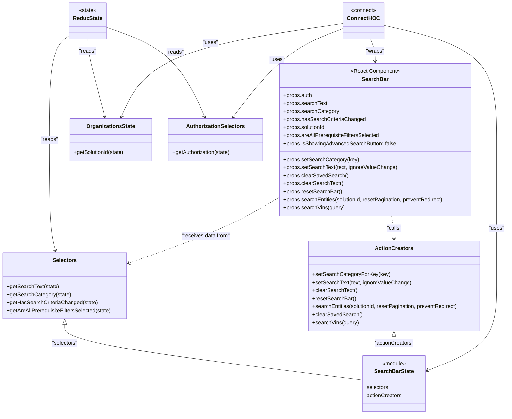

# Diagram: web/portal/src/pages/administration/internal-tools/vin-eta-validator/VinEtaValidator.SearchBar.container.js


> Auto-generated by Obscura crawlers

## Diagram 1



### SVG

<svg id="container" width="1527.154296875" xmlns="http://www.w3.org/2000/svg" class="classDiagram" height="1240" viewBox="0 0 1527.154296875 1240" role="graphics-document document" aria-roledescription="class"><style>#container{font-family:"trebuchet ms",verdana,arial,sans-serif;font-size:16px;fill:#333;}@keyframes edge-animation-frame{from{stroke-dashoffset:0;}}@keyframes dash{to{stroke-dashoffset:0;}}#container .edge-animation-slow{stroke-dasharray:9,5!important;stroke-dashoffset:900;animation:dash 50s linear infinite;stroke-linecap:round;}#container .edge-animation-fast{stroke-dasharray:9,5!important;stroke-dashoffset:900;animation:dash 20s linear infinite;stroke-linecap:round;}#container .error-icon{fill:#552222;}#container .error-text{fill:#552222;stroke:#552222;}#container .edge-thickness-normal{stroke-width:1px;}#container .edge-thickness-thick{stroke-width:3.5px;}#container .edge-pattern-solid{stroke-dasharray:0;}#container .edge-thickness-invisible{stroke-width:0;fill:none;}#container .edge-pattern-dashed{stroke-dasharray:3;}#container .edge-pattern-dotted{stroke-dasharray:2;}#container .marker{fill:#333333;stroke:#333333;}#container .marker.cross{stroke:#333333;}#container svg{font-family:"trebuchet ms",verdana,arial,sans-serif;font-size:16px;}#container p{margin:0;}#container g.classGroup text{fill:#9370DB;stroke:none;font-family:"trebuchet ms",verdana,arial,sans-serif;font-size:10px;}#container g.classGroup text .title{font-weight:bolder;}#container .nodeLabel,#container .edgeLabel{color:#131300;}#container .edgeLabel .label rect{fill:#ECECFF;}#container .label text{fill:#131300;}#container .labelBkg{background:#ECECFF;}#container .edgeLabel .label span{background:#ECECFF;}#container .classTitle{font-weight:bolder;}#container .node rect,#container .node circle,#container .node ellipse,#container .node polygon,#container .node path{fill:#ECECFF;stroke:#9370DB;stroke-width:1px;}#container .divider{stroke:#9370DB;stroke-width:1;}#container g.clickable{cursor:pointer;}#container g.classGroup rect{fill:#ECECFF;stroke:#9370DB;}#container g.classGroup line{stroke:#9370DB;stroke-width:1;}#container .classLabel .box{stroke:none;stroke-width:0;fill:#ECECFF;opacity:0.5;}#container .classLabel .label{fill:#9370DB;font-size:10px;}#container .relation{stroke:#333333;stroke-width:1;fill:none;}#container .dashed-line{stroke-dasharray:3;}#container .dotted-line{stroke-dasharray:1 2;}#container #compositionStart,#container .composition{fill:#333333!important;stroke:#333333!important;stroke-width:1;}#container #compositionEnd,#container .composition{fill:#333333!important;stroke:#333333!important;stroke-width:1;}#container #dependencyStart,#container .dependency{fill:#333333!important;stroke:#333333!important;stroke-width:1;}#container #dependencyStart,#container .dependency{fill:#333333!important;stroke:#333333!important;stroke-width:1;}#container #extensionStart,#container .extension{fill:transparent!important;stroke:#333333!important;stroke-width:1;}#container #extensionEnd,#container .extension{fill:transparent!important;stroke:#333333!important;stroke-width:1;}#container #aggregationStart,#container .aggregation{fill:transparent!important;stroke:#333333!important;stroke-width:1;}#container #aggregationEnd,#container .aggregation{fill:transparent!important;stroke:#333333!important;stroke-width:1;}#container #lollipopStart,#container .lollipop{fill:#ECECFF!important;stroke:#333333!important;stroke-width:1;}#container #lollipopEnd,#container .lollipop{fill:#ECECFF!important;stroke:#333333!important;stroke-width:1;}#container .edgeTerminals{font-size:11px;line-height:initial;}#container .classTitleText{text-anchor:middle;font-size:18px;fill:#333;}#container .label-icon{display:inline-block;height:1em;overflow:visible;vertical-align:-0.125em;}#container .node .label-icon path{fill:currentColor;stroke:revert;stroke-width:revert;}#container :root{--mermaid-font-family:"trebuchet ms",verdana,arial,sans-serif;}</style><g><defs><marker id="container_class-aggregationStart" class="marker aggregation class" refX="18" refY="7" markerWidth="190" markerHeight="240" orient="auto"><path d="M 18,7 L9,13 L1,7 L9,1 Z"></path></marker></defs><defs><marker id="container_class-aggregationEnd" class="marker aggregation class" refX="1" refY="7" markerWidth="20" markerHeight="28" orient="auto"><path d="M 18,7 L9,13 L1,7 L9,1 Z"></path></marker></defs><defs><marker id="container_class-extensionStart" class="marker extension class" refX="18" refY="7" markerWidth="190" markerHeight="240" orient="auto"><path d="M 1,7 L18,13 V 1 Z"></path></marker></defs><defs><marker id="container_class-extensionEnd" class="marker extension class" refX="1" refY="7" markerWidth="20" markerHeight="28" orient="auto"><path d="M 1,1 V 13 L18,7 Z"></path></marker></defs><defs><marker id="container_class-compositionStart" class="marker composition class" refX="18" refY="7" markerWidth="190" markerHeight="240" orient="auto"><path d="M 18,7 L9,13 L1,7 L9,1 Z"></path></marker></defs><defs><marker id="container_class-compositionEnd" class="marker composition class" refX="1" refY="7" markerWidth="20" markerHeight="28" orient="auto"><path d="M 18,7 L9,13 L1,7 L9,1 Z"></path></marker></defs><defs><marker id="container_class-dependencyStart" class="marker dependency class" refX="6" refY="7" markerWidth="190" markerHeight="240" orient="auto"><path d="M 5,7 L9,13 L1,7 L9,1 Z"></path></marker></defs><defs><marker id="container_class-dependencyEnd" class="marker dependency class" refX="13" refY="7" markerWidth="20" markerHeight="28" orient="auto"><path d="M 18,7 L9,13 L14,7 L9,1 Z"></path></marker></defs><defs><marker id="container_class-lollipopStart" class="marker lollipop class" refX="13" refY="7" markerWidth="190" markerHeight="240" orient="auto"><circle stroke="black" fill="transparent" cx="7" cy="7" r="6"></circle></marker></defs><defs><marker id="container_class-lollipopEnd" class="marker lollipop class" refX="1" refY="7" markerWidth="190" markerHeight="240" orient="auto"><circle stroke="black" fill="transparent" cx="7" cy="7" r="6"></circle></marker></defs><g class="root"><g class="clusters"></g><g class="edgePaths"><path d="M208.174,104.628L197.957,112.69C187.74,120.752,167.305,136.876,157.088,189.105C146.871,241.333,146.871,329.667,146.871,418C146.871,506.333,146.871,594.667,149.913,650.035C152.955,705.403,159.038,727.806,162.08,739.008L165.122,750.21" id="id_ReduxState_Selectors_1" class="edge-thickness-normal edge-pattern-solid relation" style=";;;" data-edge="true" data-et="edge" data-id="id_ReduxState_Selectors_1" data-points="W3sieCI6MjA4LjE3MzgyODEyNSwieSI6MTA0LjYyODA3NTkzOTUwNTgyfSx7IngiOjE0Ni44NzEwOTM3NSwieSI6MTUzfSx7IngiOjE0Ni44NzEwOTM3NSwieSI6NDE4fSx7IngiOjE0Ni44NzEwOTM3NSwieSI6NjgzfSx7IngiOjE2Ni42OTQ0MjY3ODA1MjMyNiwieSI6NzU2fV0=" marker-end="url(#container_class-dependencyEnd)"></path><path d="M262.197,116L262.197,122.167C262.197,128.333,262.197,140.667,270.719,179.532C279.24,218.398,296.283,283.796,304.805,316.495L313.327,349.194" id="id_ReduxState_OrganizationsState_2" class="edge-thickness-normal edge-pattern-solid relation" style=";;;" data-edge="true" data-et="edge" data-id="id_ReduxState_OrganizationsState_2" data-points="W3sieCI6MjYyLjE5NzI2NTYyNSwieSI6MTE2fSx7IngiOjI2Mi4xOTcyNjU2MjUsInkiOjE1M30seyJ4IjozMTQuODM5NjQ0NzUyMzU4NSwieSI6MzU1fV0=" marker-end="url(#container_class-dependencyEnd)"></path><path d="M316.221,80.844L350.698,92.87C385.175,104.896,454.13,128.948,503.788,173.733C553.446,218.519,583.808,284.037,598.988,316.797L614.169,349.556" id="id_ReduxState_AuthorizationSelectors_3" class="edge-thickness-normal edge-pattern-solid relation" style=";;;" data-edge="true" data-et="edge" data-id="id_ReduxState_AuthorizationSelectors_3" data-points="W3sieCI6MzE2LjIyMDcwMzEyNSwieSI6ODAuODQzOTM2Njk0MjY2ODR9LHsieCI6NTIzLjA4Mzk4NDM3NSwieSI6MTUzfSx7IngiOjYxNi42OTIxMDY0MjY4ODY4LCJ5IjozNTV9XQ==" marker-end="url(#container_class-dependencyEnd)"></path><path d="M193.578,971.25L193.578,980.542C193.578,989.833,193.578,1008.417,343.572,1035.987C493.565,1063.558,793.552,1100.115,943.546,1118.394L1093.539,1136.673" id="id_Selectors_SearchBarState_4" class="edge-thickness-normal edge-pattern-solid relation" style=";;;" data-edge="true" data-et="edge" data-id="id_Selectors_SearchBarState_4" data-points="W3sieCI6MTkzLjU3ODEyNSwieSI6OTU0fSx7IngiOjE5My41NzgxMjUsInkiOjEwMjd9LHsieCI6MTA5My41MzkwNjI1LCJ5IjoxMTM2LjY3MjgzNjcxMzQxNzR9XQ==" marker-start="url(#container_class-extensionStart)"></path><path d="M1186.488,1007.25L1186.488,1010.542C1186.488,1013.833,1186.488,1020.417,1186.488,1029.875C1186.488,1039.333,1186.488,1051.667,1186.488,1057.833L1186.488,1064" id="id_ActionCreators_SearchBarState_5" class="edge-thickness-normal edge-pattern-solid relation" style=";;;" data-edge="true" data-et="edge" data-id="id_ActionCreators_SearchBarState_5" data-points="W3sieCI6MTE4Ni40ODgyODEyNSwieSI6OTkwfSx7IngiOjExODYuNDg4MjgxMjUsInkiOjEwMjd9LHsieCI6MTE4Ni40ODgyODEyNSwieSI6MTA2NH1d" marker-start="url(#container_class-extensionStart)"></path><path d="M1114.155,116L1116.541,122.167C1118.927,128.333,1123.698,140.667,1126.083,152C1128.469,163.333,1128.469,173.667,1128.469,178.833L1128.469,184" id="id_ConnectHOC_SearchBar_6" class="edge-thickness-normal edge-pattern-solid relation" style=";;;" data-edge="true" data-et="edge" data-id="id_ConnectHOC_SearchBar_6" data-points="W3sieCI6MTExNC4xNTUzOTE0ODM1MTY1LCJ5IjoxMTZ9LHsieCI6MTEyOC40Njg3NSwieSI6MTUzfSx7IngiOjExMjguNDY4NzUsInkiOjE5MH1d" marker-end="url(#container_class-dependencyEnd)"></path><path d="M1150.406,74.899L1208.071,87.915C1265.736,100.932,1381.066,126.966,1438.731,184.15C1496.396,241.333,1496.396,329.667,1496.396,418C1496.396,506.333,1496.396,594.667,1496.396,667.5C1496.396,740.333,1496.396,797.667,1496.396,855C1496.396,912.333,1496.396,969.667,1461.168,1012.088C1425.94,1054.509,1355.483,1082.018,1320.255,1095.772L1285.027,1109.527" id="id_ConnectHOC_SearchBarState_7" class="edge-thickness-normal edge-pattern-solid relation" style=";;;" data-edge="true" data-et="edge" data-id="id_ConnectHOC_SearchBarState_7" data-points="W3sieCI6MTE1MC40MDYyNSwieSI6NzQuODk4NTMzNDUxNTQ4Njd9LHsieCI6MTQ5Ni4zOTY0ODQzNzUsInkiOjE1M30seyJ4IjoxNDk2LjM5NjQ4NDM3NSwieSI6NDE4fSx7IngiOjE0OTYuMzk2NDg0Mzc1LCJ5Ijo2ODN9LHsieCI6MTQ5Ni4zOTY0ODQzNzUsInkiOjg1NX0seyJ4IjoxNDk2LjM5NjQ4NDM3NSwieSI6MTAyN30seyJ4IjoxMjc5LjQzNzUsInkiOjExMTEuNzA5MDc0NjM3Nzc3MX1d" marker-end="url(#container_class-dependencyEnd)"></path><path d="M1036.125,70.135L939.114,83.946C842.104,97.757,648.082,125.378,535.89,171.948C423.699,218.519,393.337,284.037,378.156,316.797L362.975,349.556" id="id_ConnectHOC_OrganizationsState_8" class="edge-thickness-normal edge-pattern-solid relation" style=";;;" data-edge="true" data-et="edge" data-id="id_ConnectHOC_OrganizationsState_8" data-points="W3sieCI6MTAzNi4xMjUsInkiOjcwLjEzNDc4NjU1NDM0NDU0fSx7IngiOjQ1NC4wNjA1NDY4NzUsInkiOjE1M30seyJ4IjozNjAuNDUyNDI0ODIzMTEzMjMsInkiOjM1NX1d" marker-end="url(#container_class-dependencyEnd)"></path><path d="M1036.125,83.55L1005.433,95.125C974.742,106.7,913.358,129.85,857.098,174.302C800.838,218.755,749.701,284.509,724.133,317.386L698.565,350.264" id="id_ConnectHOC_AuthorizationSelectors_9" class="edge-thickness-normal edge-pattern-solid relation" style=";;;" data-edge="true" data-et="edge" data-id="id_ConnectHOC_AuthorizationSelectors_9" data-points="W3sieCI6MTAzNi4xMjUsInkiOjgzLjU0OTg5ODQxNDI5MTYyfSx7IngiOjg1MS45NzQ2MDkzNzUsInkiOjE1M30seyJ4Ijo2OTQuODgxMTk4NDA4MDE4OSwieSI6MzU1fV0=" marker-end="url(#container_class-dependencyEnd)"></path><path d="M1178.387,646L1179.738,652.167C1181.088,658.333,1183.788,670.667,1185.138,682C1186.488,693.333,1186.488,703.667,1186.488,708.833L1186.488,714" id="id_SearchBar_ActionCreators_10" class="edge-thickness-normal edge-pattern-dashed relation" style=";;;" data-edge="true" data-et="edge" data-id="id_SearchBar_ActionCreators_10" data-points="W3sieCI6MTE3OC4zODc0NDEwMzc3MzYsInkiOjY0Nn0seyJ4IjoxMTg2LjQ4ODI4MTI1LCJ5Ijo2ODN9LHsieCI6MTE4Ni40ODgyODEyNSwieSI6NzIwfV0=" marker-end="url(#container_class-dependencyEnd)"></path><path d="M837.395,591.691L811.892,606.909C786.389,622.127,735.383,652.564,659.953,685.278C584.524,717.993,484.671,752.987,434.745,770.483L384.819,787.98" id="id_SearchBar_Selectors_11" class="edge-thickness-normal edge-pattern-dashed relation" style=";;;" data-edge="true" data-et="edge" data-id="id_SearchBar_Selectors_11" data-points="W3sieCI6ODM3LjM5NDUzMTI1LCJ5Ijo1OTEuNjkwODE5MTMxMzkwOX0seyJ4Ijo2ODQuMzc2OTUzMTI1LCJ5Ijo2ODN9LHsieCI6Mzc5LjE1NjI1LCJ5Ijo3ODkuOTY0MzE1OTg2NzcyMn1d" marker-end="url(#container_class-dependencyEnd)"></path></g><g class="edgeLabels"><g class="edgeLabel" transform="translate(146.87109375, 418)"><g class="label" data-id="id_ReduxState_Selectors_1" transform="translate(-26.265625, -12)"><foreignObject width="52.53125" height="24"><div xmlns="http://www.w3.org/1999/xhtml" class="labelBkg" style="display: table-cell; white-space: nowrap; line-height: 1.5; max-width: 200px; text-align: center;"><span class="edgeLabel"><p>"reads"</p></span></div></foreignObject></g></g><g class="edgeLabel" transform="translate(262.197265625, 153)"><g class="label" data-id="id_ReduxState_OrganizationsState_2" transform="translate(-26.265625, -12)"><foreignObject width="52.53125" height="24"><div xmlns="http://www.w3.org/1999/xhtml" class="labelBkg" style="display: table-cell; white-space: nowrap; line-height: 1.5; max-width: 200px; text-align: center;"><span class="edgeLabel"><p>"reads"</p></span></div></foreignObject></g></g><g class="edgeLabel" transform="translate(523.83003, 154.60992)"><g class="label" data-id="id_ReduxState_AuthorizationSelectors_3" transform="translate(-26.265625, -12)"><foreignObject width="52.53125" height="24"><div xmlns="http://www.w3.org/1999/xhtml" class="labelBkg" style="display: table-cell; white-space: nowrap; line-height: 1.5; max-width: 200px; text-align: center;"><span class="edgeLabel"><p>"reads"</p></span></div></foreignObject></g></g><g class="edgeLabel" transform="translate(193.578125, 1027)"><g class="label" data-id="id_Selectors_SearchBarState_4" transform="translate(-38.9140625, -12)"><foreignObject width="77.828125" height="24"><div xmlns="http://www.w3.org/1999/xhtml" class="labelBkg" style="display: table-cell; white-space: nowrap; line-height: 1.5; max-width: 200px; text-align: center;"><span class="edgeLabel"><p>"selectors"</p></span></div></foreignObject></g></g><g class="edgeLabel" transform="translate(1186.48828125, 1027)"><g class="label" data-id="id_ActionCreators_SearchBarState_5" transform="translate(-58.8125, -12)"><foreignObject width="117.625" height="24"><div xmlns="http://www.w3.org/1999/xhtml" class="labelBkg" style="display: table-cell; white-space: nowrap; line-height: 1.5; max-width: 200px; text-align: center;"><span class="edgeLabel"><p>"actionCreators"</p></span></div></foreignObject></g></g><g class="edgeLabel" transform="translate(1128.46875, 153)"><g class="label" data-id="id_ConnectHOC_SearchBar_6" transform="translate(-27.6484375, -12)"><foreignObject width="55.296875" height="24"><div xmlns="http://www.w3.org/1999/xhtml" class="labelBkg" style="display: table-cell; white-space: nowrap; line-height: 1.5; max-width: 200px; text-align: center;"><span class="edgeLabel"><p>"wraps"</p></span></div></foreignObject></g></g><g class="edgeLabel" transform="translate(1496.396484375, 683)"><g class="label" data-id="id_ConnectHOC_SearchBarState_7" transform="translate(-22.7578125, -12)"><foreignObject width="45.515625" height="24"><div xmlns="http://www.w3.org/1999/xhtml" class="labelBkg" style="display: table-cell; white-space: nowrap; line-height: 1.5; max-width: 200px; text-align: center;"><span class="edgeLabel"><p>"uses"</p></span></div></foreignObject></g></g><g class="edgeLabel" transform="translate(634.88633, 127.25686)"><g class="label" data-id="id_ConnectHOC_OrganizationsState_8" transform="translate(-22.7578125, -12)"><foreignObject width="45.515625" height="24"><div xmlns="http://www.w3.org/1999/xhtml" class="labelBkg" style="display: table-cell; white-space: nowrap; line-height: 1.5; max-width: 200px; text-align: center;"><span class="edgeLabel"><p>"uses"</p></span></div></foreignObject></g></g><g class="edgeLabel" transform="translate(833.83888, 176.31999)"><g class="label" data-id="id_ConnectHOC_AuthorizationSelectors_9" transform="translate(-22.7578125, -12)"><foreignObject width="45.515625" height="24"><div xmlns="http://www.w3.org/1999/xhtml" class="labelBkg" style="display: table-cell; white-space: nowrap; line-height: 1.5; max-width: 200px; text-align: center;"><span class="edgeLabel"><p>"uses"</p></span></div></foreignObject></g></g><g class="edgeLabel" transform="translate(1186.48828125, 683)"><g class="label" data-id="id_SearchBar_ActionCreators_10" transform="translate(-22.625, -12)"><foreignObject width="45.25" height="24"><div xmlns="http://www.w3.org/1999/xhtml" class="labelBkg" style="display: table-cell; white-space: nowrap; line-height: 1.5; max-width: 200px; text-align: center;"><span class="edgeLabel"><p>"calls"</p></span></div></foreignObject></g></g><g class="edgeLabel" transform="translate(615.84797, 707.01592)"><g class="label" data-id="id_SearchBar_Selectors_11" transform="translate(-73.4140625, -12)"><foreignObject width="146.828125" height="24"><div xmlns="http://www.w3.org/1999/xhtml" class="labelBkg" style="display: table-cell; white-space: nowrap; line-height: 1.5; max-width: 200px; text-align: center;"><span class="edgeLabel"><p>"receives data from"</p></span></div></foreignObject></g></g></g><g class="nodes"><g class="node default" id="classId-ReduxState-0" transform="translate(262.197265625, 62)"><g class="basic label-container"><path d="M-54.0234375 -54 L54.0234375 -54 L54.0234375 54 L-54.0234375 54" stroke="none" stroke-width="0" fill="#ECECFF" style=""></path><path d="M-54.0234375 -54 C-27.539163731321732 -54, -1.0548899626434647 -54, 54.0234375 -54 M-54.0234375 -54 C-16.170157207925712 -54, 21.683123084148576 -54, 54.0234375 -54 M54.0234375 -54 C54.0234375 -32.37024796960242, 54.0234375 -10.740495939204827, 54.0234375 54 M54.0234375 -54 C54.0234375 -10.810379940923717, 54.0234375 32.379240118152566, 54.0234375 54 M54.0234375 54 C29.18305662622669 54, 4.342675752453381 54, -54.0234375 54 M54.0234375 54 C19.030188234207657 54, -15.963061031584687 54, -54.0234375 54 M-54.0234375 54 C-54.0234375 28.113383668629574, -54.0234375 2.2267673372591474, -54.0234375 -54 M-54.0234375 54 C-54.0234375 27.19713099859659, -54.0234375 0.39426199719318333, -54.0234375 -54" stroke="#9370DB" stroke-width="1.3" fill="none" stroke-dasharray="0 0" style=""></path></g><g class="annotation-group text" transform="translate(-27.0234375, -30)"><g class="label" style="" transform="translate(0,-12)"><foreignObject width="54.046875" height="24"><div xmlns="http://www.w3.org/1999/xhtml" style="display: table-cell; white-space: nowrap; line-height: 1.5; max-width: 104px; text-align: center;"><span class="nodeLabel markdown-node-label" style=""><p>«state»</p></span></div></foreignObject></g></g><g class="label-group text" transform="translate(-42.0234375, -6)"><g class="label" style="font-weight: bolder" transform="translate(0,-12)"><foreignObject width="84.046875" height="24"><div xmlns="http://www.w3.org/1999/xhtml" style="display: table-cell; white-space: nowrap; line-height: 1.5; max-width: 132px; text-align: center;"><span class="nodeLabel markdown-node-label" style=""><p>ReduxState</p></span></div></foreignObject></g></g><g class="members-group text" transform="translate(-42.0234375, 42)"></g><g class="methods-group text" transform="translate(-42.0234375, 72)"></g><g class="divider" style=""><path d="M-54.0234375 18 C-21.915655347037358 18, 10.192126805925284 18, 54.0234375 18 M-54.0234375 18 C-21.92127634907562 18, 10.180884801848762 18, 54.0234375 18" stroke="#9370DB" stroke-width="1.3" fill="none" stroke-dasharray="0 0" style=""></path></g><g class="divider" style=""><path d="M-54.0234375 36 C-15.509378192854179 36, 23.004681114291643 36, 54.0234375 36 M-54.0234375 36 C-24.82302303079366 36, 4.37739143841268 36, 54.0234375 36" stroke="#9370DB" stroke-width="1.3" fill="none" stroke-dasharray="0 0" style=""></path></g></g><g class="node default" id="classId-SearchBar-1" transform="translate(1128.46875, 418)"><g class="basic label-container"><path d="M-291.07421875 -228 L291.07421875 -228 L291.07421875 228 L-291.07421875 228" stroke="none" stroke-width="0" fill="#ECECFF" style=""></path><path d="M-291.07421875 -228 C-164.1085912567795 -228, -37.14296376355901 -228, 291.07421875 -228 M-291.07421875 -228 C-69.80890858713457 -228, 151.45640157573087 -228, 291.07421875 -228 M291.07421875 -228 C291.07421875 -97.50333261053831, 291.07421875 32.99333477892338, 291.07421875 228 M291.07421875 -228 C291.07421875 -83.26430598642182, 291.07421875 61.471388027156365, 291.07421875 228 M291.07421875 228 C85.73692970864292 228, -119.60035933271416 228, -291.07421875 228 M291.07421875 228 C85.44350459810042 228, -120.18720955379916 228, -291.07421875 228 M-291.07421875 228 C-291.07421875 109.56416594527236, -291.07421875 -8.871668109455271, -291.07421875 -228 M-291.07421875 228 C-291.07421875 101.3482861390663, -291.07421875 -25.303427721867394, -291.07421875 -228" stroke="#9370DB" stroke-width="1.3" fill="none" stroke-dasharray="0 0" style=""></path></g><g class="annotation-group text" transform="translate(-73.2109375, -204)"><g class="label" style="" transform="translate(0,-12)"><foreignObject width="146.421875" height="24"><div xmlns="http://www.w3.org/1999/xhtml" style="display: table-cell; white-space: nowrap; line-height: 1.5; max-width: 196px; text-align: center;"><span class="nodeLabel markdown-node-label" style=""><p>«React Component»</p></span></div></foreignObject></g></g><g class="label-group text" transform="translate(-37.2421875, -180)"><g class="label" style="font-weight: bolder" transform="translate(0,-12)"><foreignObject width="74.484375" height="24"><div xmlns="http://www.w3.org/1999/xhtml" style="display: table-cell; white-space: nowrap; line-height: 1.5; max-width: 124px; text-align: center;"><span class="nodeLabel markdown-node-label" style=""><p>SearchBar</p></span></div></foreignObject></g></g><g class="members-group text" transform="translate(-279.07421875, -132)"><g class="label" style="" transform="translate(0,-12)"><foreignObject width="86.515625" height="24"><div xmlns="http://www.w3.org/1999/xhtml" style="display: table-cell; white-space: nowrap; line-height: 1.5; max-width: 144px; text-align: center;"><span class="nodeLabel markdown-node-label" style=""><p>+props.auth</p></span></div></foreignObject></g><g class="label" style="" transform="translate(0,12)"><foreignObject width="130.375" height="24"><div xmlns="http://www.w3.org/1999/xhtml" style="display: table-cell; white-space: nowrap; line-height: 1.5; max-width: 188px; text-align: center;"><span class="nodeLabel markdown-node-label" style=""><p>+props.searchText</p></span></div></foreignObject></g><g class="label" style="" transform="translate(0,36)"><foreignObject width="164.09375" height="24"><div xmlns="http://www.w3.org/1999/xhtml" style="display: table-cell; white-space: nowrap; line-height: 1.5; max-width: 222px; text-align: center;"><span class="nodeLabel markdown-node-label" style=""><p>+props.searchCategory</p></span></div></foreignObject></g><g class="label" style="" transform="translate(0,60)"><foreignObject width="243.109375" height="24"><div xmlns="http://www.w3.org/1999/xhtml" style="display: table-cell; white-space: nowrap; line-height: 1.5; max-width: 300px; text-align: center;"><span class="nodeLabel markdown-node-label" style=""><p>+props.hasSearchCriteriaChanged</p></span></div></foreignObject></g><g class="label" style="" transform="translate(0,84)"><foreignObject width="127.53125" height="24"><div xmlns="http://www.w3.org/1999/xhtml" style="display: table-cell; white-space: nowrap; line-height: 1.5; max-width: 185px; text-align: center;"><span class="nodeLabel markdown-node-label" style=""><p>+props.solutionId</p></span></div></foreignObject></g><g class="label" style="" transform="translate(0,108)"><foreignObject width="288.859375" height="24"><div xmlns="http://www.w3.org/1999/xhtml" style="display: table-cell; white-space: nowrap; line-height: 1.5; max-width: 346px; text-align: center;"><span class="nodeLabel markdown-node-label" style=""><p>+props.areAllPrerequisiteFiltersSelected</p></span></div></foreignObject></g><g class="label" style="" transform="translate(0,132)"><foreignObject width="336.796875" height="24"><div xmlns="http://www.w3.org/1999/xhtml" style="display: table-cell; white-space: nowrap; line-height: 1.5; max-width: 394px; text-align: center;"><span class="nodeLabel markdown-node-label" style=""><p>+props.isShowingAdvancedSearchButton: false</p></span></div></foreignObject></g></g><g class="methods-group text" transform="translate(-279.07421875, 60)"><g class="label" style="" transform="translate(0,-12)"><foreignObject width="222.25" height="24"><div xmlns="http://www.w3.org/1999/xhtml" style="display: table-cell; white-space: nowrap; line-height: 1.5; max-width: 280px; text-align: center;"><span class="nodeLabel markdown-node-label" style=""><p>+props.setSearchCategory(key)</p></span></div></foreignObject></g><g class="label" style="" transform="translate(0,12)"><foreignObject width="338.28125" height="24"><div xmlns="http://www.w3.org/1999/xhtml" style="display: table-cell; white-space: nowrap; line-height: 1.5; max-width: 396px; text-align: center;"><span class="nodeLabel markdown-node-label" style=""><p>+props.setSearchText(text, ignoreValueChange)</p></span></div></foreignObject></g><g class="label" style="" transform="translate(0,36)"><foreignObject width="191.234375" height="24"><div xmlns="http://www.w3.org/1999/xhtml" style="display: table-cell; white-space: nowrap; line-height: 1.5; max-width: 249px; text-align: center;"><span class="nodeLabel markdown-node-label" style=""><p>+props.clearSavedSearch()</p></span></div></foreignObject></g><g class="label" style="" transform="translate(0,60)"><foreignObject width="177.46875" height="24"><div xmlns="http://www.w3.org/1999/xhtml" style="display: table-cell; white-space: nowrap; line-height: 1.5; max-width: 235px; text-align: center;"><span class="nodeLabel markdown-node-label" style=""><p>+props.clearSearchText()</p></span></div></foreignObject></g><g class="label" style="" transform="translate(0,84)"><foreignObject width="173.421875" height="24"><div xmlns="http://www.w3.org/1999/xhtml" style="display: table-cell; white-space: nowrap; line-height: 1.5; max-width: 231px; text-align: center;"><span class="nodeLabel markdown-node-label" style=""><p>+props.resetSearchBar()</p></span></div></foreignObject></g><g class="label" style="" transform="translate(0,108)"><foreignObject width="484.9375" height="24"><div xmlns="http://www.w3.org/1999/xhtml" style="display: table-cell; white-space: nowrap; line-height: 1.5; max-width: 542px; text-align: center;"><span class="nodeLabel markdown-node-label" style=""><p>+props.searchEntities(solutionId, resetPagination, preventRedirect)</p></span></div></foreignObject></g><g class="label" style="" transform="translate(0,132)"><foreignObject width="183.140625" height="24"><div xmlns="http://www.w3.org/1999/xhtml" style="display: table-cell; white-space: nowrap; line-height: 1.5; max-width: 241px; text-align: center;"><span class="nodeLabel markdown-node-label" style=""><p>+props.searchVins(query)</p></span></div></foreignObject></g></g><g class="divider" style=""><path d="M-291.07421875 -156 C-133.72707098979052 -156, 23.62007677041896 -156, 291.07421875 -156 M-291.07421875 -156 C-77.79490678066105 -156, 135.4844051886779 -156, 291.07421875 -156" stroke="#9370DB" stroke-width="1.3" fill="none" stroke-dasharray="0 0" style=""></path></g><g class="divider" style=""><path d="M-291.07421875 36 C-173.6533804224507 36, -56.23254209490145 36, 291.07421875 36 M-291.07421875 36 C-161.82990566633586 36, -32.58559258267172 36, 291.07421875 36" stroke="#9370DB" stroke-width="1.3" fill="none" stroke-dasharray="0 0" style=""></path></g></g><g class="node default" id="classId-ConnectHOC-2" transform="translate(1093.265625, 62)"><g class="basic label-container"><path d="M-57.140625 -54 L57.140625 -54 L57.140625 54 L-57.140625 54" stroke="none" stroke-width="0" fill="#ECECFF" style=""></path><path d="M-57.140625 -54 C-15.259727890522079 -54, 26.621169218955842 -54, 57.140625 -54 M-57.140625 -54 C-29.244669928744905 -54, -1.34871485748981 -54, 57.140625 -54 M57.140625 -54 C57.140625 -15.535395916420889, 57.140625 22.929208167158222, 57.140625 54 M57.140625 -54 C57.140625 -18.751764724133288, 57.140625 16.496470551733424, 57.140625 54 M57.140625 54 C32.62079554872279 54, 8.100966097445578 54, -57.140625 54 M57.140625 54 C31.21157288253098 54, 5.28252076506196 54, -57.140625 54 M-57.140625 54 C-57.140625 21.827968177544072, -57.140625 -10.344063644911856, -57.140625 -54 M-57.140625 54 C-57.140625 22.06026909942439, -57.140625 -9.879461801151223, -57.140625 -54" stroke="#9370DB" stroke-width="1.3" fill="none" stroke-dasharray="0 0" style=""></path></g><g class="annotation-group text" transform="translate(-37.7578125, -30)"><g class="label" style="" transform="translate(0,-12)"><foreignObject width="75.515625" height="24"><div xmlns="http://www.w3.org/1999/xhtml" style="display: table-cell; white-space: nowrap; line-height: 1.5; max-width: 126px; text-align: center;"><span class="nodeLabel markdown-node-label" style=""><p>«connect»</p></span></div></foreignObject></g></g><g class="label-group text" transform="translate(-45.140625, -6)"><g class="label" style="font-weight: bolder" transform="translate(0,-12)"><foreignObject width="90.28125" height="24"><div xmlns="http://www.w3.org/1999/xhtml" style="display: table-cell; white-space: nowrap; line-height: 1.5; max-width: 140px; text-align: center;"><span class="nodeLabel markdown-node-label" style=""><p>ConnectHOC</p></span></div></foreignObject></g></g><g class="members-group text" transform="translate(-45.140625, 42)"></g><g class="methods-group text" transform="translate(-45.140625, 72)"></g><g class="divider" style=""><path d="M-57.140625 18 C-13.073925680702274 18, 30.99277363859545 18, 57.140625 18 M-57.140625 18 C-32.4066547617968 18, -7.6726845235936025 18, 57.140625 18" stroke="#9370DB" stroke-width="1.3" fill="none" stroke-dasharray="0 0" style=""></path></g><g class="divider" style=""><path d="M-57.140625 36 C-26.951855620140144 36, 3.2369137597197124 36, 57.140625 36 M-57.140625 36 C-25.913170902560157 36, 5.314283194879685 36, 57.140625 36" stroke="#9370DB" stroke-width="1.3" fill="none" stroke-dasharray="0 0" style=""></path></g></g><g class="node default" id="classId-SearchBarState-3" transform="translate(1186.48828125, 1148)"><g class="basic label-container"><path d="M-92.94921875 -84 L92.94921875 -84 L92.94921875 84 L-92.94921875 84" stroke="none" stroke-width="0" fill="#ECECFF" style=""></path><path d="M-92.94921875 -84 C-39.15053042532777 -84, 14.648157899344454 -84, 92.94921875 -84 M-92.94921875 -84 C-35.35905392073077 -84, 22.231110908538454 -84, 92.94921875 -84 M92.94921875 -84 C92.94921875 -20.282446614836857, 92.94921875 43.435106770326286, 92.94921875 84 M92.94921875 -84 C92.94921875 -29.891372884974864, 92.94921875 24.217254230050273, 92.94921875 84 M92.94921875 84 C31.965016091985134 84, -29.01918656602973 84, -92.94921875 84 M92.94921875 84 C42.70723735668593 84, -7.53474403662814 84, -92.94921875 84 M-92.94921875 84 C-92.94921875 37.95424902865697, -92.94921875 -8.091501942686065, -92.94921875 -84 M-92.94921875 84 C-92.94921875 18.262411182519514, -92.94921875 -47.47517763496097, -92.94921875 -84" stroke="#9370DB" stroke-width="1.3" fill="none" stroke-dasharray="0 0" style=""></path></g><g class="annotation-group text" transform="translate(-36.6015625, -60)"><g class="label" style="" transform="translate(0,-12)"><foreignObject width="73.203125" height="24"><div xmlns="http://www.w3.org/1999/xhtml" style="display: table-cell; white-space: nowrap; line-height: 1.5; max-width: 123px; text-align: center;"><span class="nodeLabel markdown-node-label" style=""><p>«module»</p></span></div></foreignObject></g></g><g class="label-group text" transform="translate(-56.5546875, -36)"><g class="label" style="font-weight: bolder" transform="translate(0,-12)"><foreignObject width="113.109375" height="24"><div xmlns="http://www.w3.org/1999/xhtml" style="display: table-cell; white-space: nowrap; line-height: 1.5; max-width: 161px; text-align: center;"><span class="nodeLabel markdown-node-label" style=""><p>SearchBarState</p></span></div></foreignObject></g></g><g class="members-group text" transform="translate(-80.94921875, 12)"><g class="label" style="" transform="translate(0,-12)"><foreignObject width="65.46875" height="24"><div xmlns="http://www.w3.org/1999/xhtml" style="display: table-cell; white-space: nowrap; line-height: 1.5; max-width: 115px; text-align: center;"><span class="nodeLabel markdown-node-label" style=""><p>selectors</p></span></div></foreignObject></g><g class="label" style="" transform="translate(0,12)"><foreignObject width="105.34375" height="24"><div xmlns="http://www.w3.org/1999/xhtml" style="display: table-cell; white-space: nowrap; line-height: 1.5; max-width: 155px; text-align: center;"><span class="nodeLabel markdown-node-label" style=""><p>actionCreators</p></span></div></foreignObject></g></g><g class="methods-group text" transform="translate(-80.94921875, 84)"></g><g class="divider" style=""><path d="M-92.94921875 -12 C-30.256693448529738 -12, 32.435831852940524 -12, 92.94921875 -12 M-92.94921875 -12 C-36.579385796938276 -12, 19.79044715612345 -12, 92.94921875 -12" stroke="#9370DB" stroke-width="1.3" fill="none" stroke-dasharray="0 0" style=""></path></g><g class="divider" style=""><path d="M-92.94921875 60 C-26.913889445000464 60, 39.12143985999907 60, 92.94921875 60 M-92.94921875 60 C-26.085053678309663 60, 40.779111393380674 60, 92.94921875 60" stroke="#9370DB" stroke-width="1.3" fill="none" stroke-dasharray="0 0" style=""></path></g></g><g class="node default" id="classId-Selectors-4" transform="translate(193.578125, 855)"><g class="basic label-container"><path d="M-185.578125 -99 L185.578125 -99 L185.578125 99 L-185.578125 99" stroke="none" stroke-width="0" fill="#ECECFF" style=""></path><path d="M-185.578125 -99 C-41.66539820574798 -99, 102.24732858850405 -99, 185.578125 -99 M-185.578125 -99 C-51.24084426357484 -99, 83.09643647285031 -99, 185.578125 -99 M185.578125 -99 C185.578125 -59.1554748233579, 185.578125 -19.310949646715798, 185.578125 99 M185.578125 -99 C185.578125 -40.233852062455, 185.578125 18.53229587509, 185.578125 99 M185.578125 99 C80.70386690395407 99, -24.17039119209187 99, -185.578125 99 M185.578125 99 C86.27724411001773 99, -13.023636779964534 99, -185.578125 99 M-185.578125 99 C-185.578125 27.455391722534685, -185.578125 -44.08921655493063, -185.578125 -99 M-185.578125 99 C-185.578125 58.597440899203704, -185.578125 18.19488179840741, -185.578125 -99" stroke="#9370DB" stroke-width="1.3" fill="none" stroke-dasharray="0 0" style=""></path></g><g class="annotation-group text" transform="translate(0, -75)"></g><g class="label-group text" transform="translate(-34.171875, -75)"><g class="label" style="font-weight: bolder" transform="translate(0,-12)"><foreignObject width="68.34375" height="24"><div xmlns="http://www.w3.org/1999/xhtml" style="display: table-cell; white-space: nowrap; line-height: 1.5; max-width: 117px; text-align: center;"><span class="nodeLabel markdown-node-label" style=""><p>Selectors</p></span></div></foreignObject></g></g><g class="members-group text" transform="translate(-173.578125, -27)"></g><g class="methods-group text" transform="translate(-173.578125, 3)"><g class="label" style="" transform="translate(0,-12)"><foreignObject width="155.21875" height="24"><div xmlns="http://www.w3.org/1999/xhtml" style="display: table-cell; white-space: nowrap; line-height: 1.5; max-width: 213px; text-align: center;"><span class="nodeLabel markdown-node-label" style=""><p>+getSearchText(state)</p></span></div></foreignObject></g><g class="label" style="" transform="translate(0,12)"><foreignObject width="188.9375" height="24"><div xmlns="http://www.w3.org/1999/xhtml" style="display: table-cell; white-space: nowrap; line-height: 1.5; max-width: 246px; text-align: center;"><span class="nodeLabel markdown-node-label" style=""><p>+getSearchCategory(state)</p></span></div></foreignObject></g><g class="label" style="" transform="translate(0,36)"><foreignObject width="268.28125" height="24"><div xmlns="http://www.w3.org/1999/xhtml" style="display: table-cell; white-space: nowrap; line-height: 1.5; max-width: 326px; text-align: center;"><span class="nodeLabel markdown-node-label" style=""><p>+getHasSearchCriteriaChanged(state)</p></span></div></foreignObject></g><g class="label" style="" transform="translate(0,60)"><foreignObject width="312.984375" height="24"><div xmlns="http://www.w3.org/1999/xhtml" style="display: table-cell; white-space: nowrap; line-height: 1.5; max-width: 370px; text-align: center;"><span class="nodeLabel markdown-node-label" style=""><p>+getAreAllPrerequisiteFiltersSelected(state)</p></span></div></foreignObject></g></g><g class="divider" style=""><path d="M-185.578125 -51 C-92.98248653603558 -51, -0.38684807207116023 -51, 185.578125 -51 M-185.578125 -51 C-82.11604463766466 -51, 21.346035724670685 -51, 185.578125 -51" stroke="#9370DB" stroke-width="1.3" fill="none" stroke-dasharray="0 0" style=""></path></g><g class="divider" style=""><path d="M-185.578125 -27 C-82.93599385100184 -27, 19.70613729799632 -27, 185.578125 -27 M-185.578125 -27 C-77.35826085726745 -27, 30.861603285465094 -27, 185.578125 -27" stroke="#9370DB" stroke-width="1.3" fill="none" stroke-dasharray="0 0" style=""></path></g></g><g class="node default" id="classId-ActionCreators-5" transform="translate(1186.48828125, 855)"><g class="basic label-container"><path d="M-258.7421875 -135 L258.7421875 -135 L258.7421875 135 L-258.7421875 135" stroke="none" stroke-width="0" fill="#ECECFF" style=""></path><path d="M-258.7421875 -135 C-85.68822648721235 -135, 87.3657345255753 -135, 258.7421875 -135 M-258.7421875 -135 C-123.34194202158983 -135, 12.05830345682034 -135, 258.7421875 -135 M258.7421875 -135 C258.7421875 -50.445426183420864, 258.7421875 34.10914763315827, 258.7421875 135 M258.7421875 -135 C258.7421875 -46.17593859024964, 258.7421875 42.64812281950071, 258.7421875 135 M258.7421875 135 C54.64056227808078 135, -149.46106294383844 135, -258.7421875 135 M258.7421875 135 C145.34734800620691 135, 31.952508512413857 135, -258.7421875 135 M-258.7421875 135 C-258.7421875 62.89888048116103, -258.7421875 -9.202239037677941, -258.7421875 -135 M-258.7421875 135 C-258.7421875 29.3577068017227, -258.7421875 -76.2845863965546, -258.7421875 -135" stroke="#9370DB" stroke-width="1.3" fill="none" stroke-dasharray="0 0" style=""></path></g><g class="annotation-group text" transform="translate(0, -111)"></g><g class="label-group text" transform="translate(-53.96875, -111)"><g class="label" style="font-weight: bolder" transform="translate(0,-12)"><foreignObject width="107.9375" height="24"><div xmlns="http://www.w3.org/1999/xhtml" style="display: table-cell; white-space: nowrap; line-height: 1.5; max-width: 156px; text-align: center;"><span class="nodeLabel markdown-node-label" style=""><p>ActionCreators</p></span></div></foreignObject></g></g><g class="members-group text" transform="translate(-246.7421875, -63)"></g><g class="methods-group text" transform="translate(-246.7421875, -33)"><g class="label" style="" transform="translate(0,-12)"><foreignObject width="225.375" height="24"><div xmlns="http://www.w3.org/1999/xhtml" style="display: table-cell; white-space: nowrap; line-height: 1.5; max-width: 283px; text-align: center;"><span class="nodeLabel markdown-node-label" style=""><p>+setSearchCategoryForKey(key)</p></span></div></foreignObject></g><g class="label" style="" transform="translate(0,12)"><foreignObject width="292.859375" height="24"><div xmlns="http://www.w3.org/1999/xhtml" style="display: table-cell; white-space: nowrap; line-height: 1.5; max-width: 350px; text-align: center;"><span class="nodeLabel markdown-node-label" style=""><p>+setSearchText(text, ignoreValueChange)</p></span></div></foreignObject></g><g class="label" style="" transform="translate(0,36)"><foreignObject width="132.265625" height="24"><div xmlns="http://www.w3.org/1999/xhtml" style="display: table-cell; white-space: nowrap; line-height: 1.5; max-width: 190px; text-align: center;"><span class="nodeLabel markdown-node-label" style=""><p>+clearSearchText()</p></span></div></foreignObject></g><g class="label" style="" transform="translate(0,60)"><foreignObject width="128.0625" height="24"><div xmlns="http://www.w3.org/1999/xhtml" style="display: table-cell; white-space: nowrap; line-height: 1.5; max-width: 185px; text-align: center;"><span class="nodeLabel markdown-node-label" style=""><p>+resetSearchBar()</p></span></div></foreignObject></g><g class="label" style="" transform="translate(0,84)"><foreignObject width="439.515625" height="24"><div xmlns="http://www.w3.org/1999/xhtml" style="display: table-cell; white-space: nowrap; line-height: 1.5; max-width: 497px; text-align: center;"><span class="nodeLabel markdown-node-label" style=""><p>+searchEntities(solutionId, resetPagination, preventRedirect)</p></span></div></foreignObject></g><g class="label" style="" transform="translate(0,108)"><foreignObject width="146.046875" height="24"><div xmlns="http://www.w3.org/1999/xhtml" style="display: table-cell; white-space: nowrap; line-height: 1.5; max-width: 203px; text-align: center;"><span class="nodeLabel markdown-node-label" style=""><p>+clearSavedSearch()</p></span></div></foreignObject></g><g class="label" style="" transform="translate(0,132)"><foreignObject width="137.71875" height="24"><div xmlns="http://www.w3.org/1999/xhtml" style="display: table-cell; white-space: nowrap; line-height: 1.5; max-width: 195px; text-align: center;"><span class="nodeLabel markdown-node-label" style=""><p>+searchVins(query)</p></span></div></foreignObject></g></g><g class="divider" style=""><path d="M-258.7421875 -87 C-121.60482534459115 -87, 15.532536810817703 -87, 258.7421875 -87 M-258.7421875 -87 C-135.27946369062073 -87, -11.816739881241489 -87, 258.7421875 -87" stroke="#9370DB" stroke-width="1.3" fill="none" stroke-dasharray="0 0" style=""></path></g><g class="divider" style=""><path d="M-258.7421875 -63 C-64.62959808004692 -63, 129.48299133990616 -63, 258.7421875 -63 M-258.7421875 -63 C-106.06086286477665 -63, 46.620461770446695 -63, 258.7421875 -63" stroke="#9370DB" stroke-width="1.3" fill="none" stroke-dasharray="0 0" style=""></path></g></g><g class="node default" id="classId-OrganizationsState-6" transform="translate(331.2578125, 418)"><g class="basic label-container"><path d="M-123.12109375 -63 L123.12109375 -63 L123.12109375 63 L-123.12109375 63" stroke="none" stroke-width="0" fill="#ECECFF" style=""></path><path d="M-123.12109375 -63 C-68.21776565667159 -63, -13.314437563343162 -63, 123.12109375 -63 M-123.12109375 -63 C-59.985928096824786 -63, 3.1492375563504282 -63, 123.12109375 -63 M123.12109375 -63 C123.12109375 -28.943677327097923, 123.12109375 5.112645345804154, 123.12109375 63 M123.12109375 -63 C123.12109375 -23.867541785802082, 123.12109375 15.264916428395836, 123.12109375 63 M123.12109375 63 C30.350663346004836 63, -62.41976705799033 63, -123.12109375 63 M123.12109375 63 C36.39879781806481 63, -50.323498113870386 63, -123.12109375 63 M-123.12109375 63 C-123.12109375 22.5875649432473, -123.12109375 -17.824870113505398, -123.12109375 -63 M-123.12109375 63 C-123.12109375 24.74840079553458, -123.12109375 -13.503198408930842, -123.12109375 -63" stroke="#9370DB" stroke-width="1.3" fill="none" stroke-dasharray="0 0" style=""></path></g><g class="annotation-group text" transform="translate(0, -39)"></g><g class="label-group text" transform="translate(-69.8671875, -39)"><g class="label" style="font-weight: bolder" transform="translate(0,-12)"><foreignObject width="139.734375" height="24"><div xmlns="http://www.w3.org/1999/xhtml" style="display: table-cell; white-space: nowrap; line-height: 1.5; max-width: 187px; text-align: center;"><span class="nodeLabel markdown-node-label" style=""><p>OrganizationsState</p></span></div></foreignObject></g></g><g class="members-group text" transform="translate(-111.12109375, 9)"></g><g class="methods-group text" transform="translate(-111.12109375, 39)"><g class="label" style="" transform="translate(0,-12)"><foreignObject width="152.375" height="24"><div xmlns="http://www.w3.org/1999/xhtml" style="display: table-cell; white-space: nowrap; line-height: 1.5; max-width: 210px; text-align: center;"><span class="nodeLabel markdown-node-label" style=""><p>+getSolutionId(state)</p></span></div></foreignObject></g></g><g class="divider" style=""><path d="M-123.12109375 -15 C-36.516811501006856 -15, 50.08747074798629 -15, 123.12109375 -15 M-123.12109375 -15 C-62.13256455231675 -15, -1.1440353546335018 -15, 123.12109375 -15" stroke="#9370DB" stroke-width="1.3" fill="none" stroke-dasharray="0 0" style=""></path></g><g class="divider" style=""><path d="M-123.12109375 9 C-40.7654755565878 9, 41.590142636824396 9, 123.12109375 9 M-123.12109375 9 C-27.688311327367543 9, 67.74447109526491 9, 123.12109375 9" stroke="#9370DB" stroke-width="1.3" fill="none" stroke-dasharray="0 0" style=""></path></g></g><g class="node default" id="classId-AuthorizationSelectors-7" transform="translate(645.88671875, 418)"><g class="basic label-container"><path d="M-141.5078125 -63 L141.5078125 -63 L141.5078125 63 L-141.5078125 63" stroke="none" stroke-width="0" fill="#ECECFF" style=""></path><path d="M-141.5078125 -63 C-42.86569451902194 -63, 55.776423461956114 -63, 141.5078125 -63 M-141.5078125 -63 C-42.751187211981744 -63, 56.00543807603651 -63, 141.5078125 -63 M141.5078125 -63 C141.5078125 -14.608171632262618, 141.5078125 33.783656735474764, 141.5078125 63 M141.5078125 -63 C141.5078125 -34.818037338167684, 141.5078125 -6.636074676335369, 141.5078125 63 M141.5078125 63 C66.42717467000047 63, -8.653463159999063 63, -141.5078125 63 M141.5078125 63 C66.00334793016444 63, -9.501116639671125 63, -141.5078125 63 M-141.5078125 63 C-141.5078125 29.356948653490292, -141.5078125 -4.286102693019416, -141.5078125 -63 M-141.5078125 63 C-141.5078125 34.63926929086563, -141.5078125 6.2785385817312545, -141.5078125 -63" stroke="#9370DB" stroke-width="1.3" fill="none" stroke-dasharray="0 0" style=""></path></g><g class="annotation-group text" transform="translate(0, -39)"></g><g class="label-group text" transform="translate(-83.875, -39)"><g class="label" style="font-weight: bolder" transform="translate(0,-12)"><foreignObject width="167.75" height="24"><div xmlns="http://www.w3.org/1999/xhtml" style="display: table-cell; white-space: nowrap; line-height: 1.5; max-width: 215px; text-align: center;"><span class="nodeLabel markdown-node-label" style=""><p>AuthorizationSelectors</p></span></div></foreignObject></g></g><g class="members-group text" transform="translate(-129.5078125, 9)"></g><g class="methods-group text" transform="translate(-129.5078125, 39)"><g class="label" style="" transform="translate(0,-12)"><foreignObject width="175.140625" height="24"><div xmlns="http://www.w3.org/1999/xhtml" style="display: table-cell; white-space: nowrap; line-height: 1.5; max-width: 233px; text-align: center;"><span class="nodeLabel markdown-node-label" style=""><p>+getAuthorization(state)</p></span></div></foreignObject></g></g><g class="divider" style=""><path d="M-141.5078125 -15 C-79.79036483065694 -15, -18.07291716131388 -15, 141.5078125 -15 M-141.5078125 -15 C-65.63911201670875 -15, 10.229588466582499 -15, 141.5078125 -15" stroke="#9370DB" stroke-width="1.3" fill="none" stroke-dasharray="0 0" style=""></path></g><g class="divider" style=""><path d="M-141.5078125 9 C-79.55221394477563 9, -17.59661538955126 9, 141.5078125 9 M-141.5078125 9 C-29.500882975361463 9, 82.50604654927707 9, 141.5078125 9" stroke="#9370DB" stroke-width="1.3" fill="none" stroke-dasharray="0 0" style=""></path></g></g></g></g></g></svg>

## Diagram 2

```mermaid
flowchart LR
  subgraph Redux
    State[Application State]
  end
  subgraph SelectorsModule
    SBSelectors["SearchBarState.selectors"]
    OrgSelector["getSolutionId"]
    AuthSelector["getAuthorization"]
  end
  subgraph ActionsModule
    SBActions["SearchBarState.actionCreators"]
  end
  State -->|reads| SBSelectors
  State -->|reads| OrgSelector
  State -->|reads| AuthSelector
  SBSelectors -->|mapStateToProps| MappedState["mapStateToProps returns props"]
  OrgSelector --> MappedState
  AuthSelector --> MappedState
  SBActions -->|mapDispatchToProps| MappedDispatch["mapDispatchToProps returns action props"]
  MappedState -->|merged via mergeProps| MergedProps["mergeProps combines props"]
  MappedDispatch --> MergedProps
  MergedProps --> Connected["connect(...) HOC"]
  Connected --> SearchBarComponent["SearchBar Component"]
  Actions[Dispatch] -->|dispatch(actionCreators)| SBActions
  SearchBarComponent -->|invokes| Actions
```

> SVG rendering failed for this diagram.
