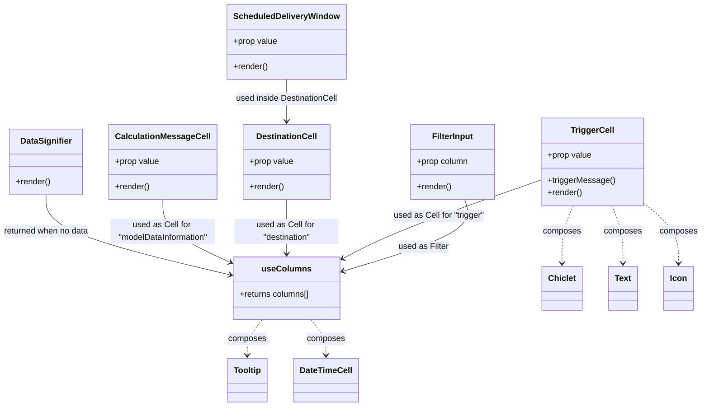

# Diagram: web/portal/src/pages/administration/internal-tools/vin-eta-validator/VinEtaValidator.columns.js


> Auto-generated by Obscura crawlers

## Diagram 1



### SVG

<svg id="container" width="1331.890625" xmlns="http://www.w3.org/2000/svg" class="classDiagram" height="778" viewBox="0 0 1331.890625 778" role="graphics-document document" aria-roledescription="class"><style>#container{font-family:"trebuchet ms",verdana,arial,sans-serif;font-size:16px;fill:#333;}@keyframes edge-animation-frame{from{stroke-dashoffset:0;}}@keyframes dash{to{stroke-dashoffset:0;}}#container .edge-animation-slow{stroke-dasharray:9,5!important;stroke-dashoffset:900;animation:dash 50s linear infinite;stroke-linecap:round;}#container .edge-animation-fast{stroke-dasharray:9,5!important;stroke-dashoffset:900;animation:dash 20s linear infinite;stroke-linecap:round;}#container .error-icon{fill:#552222;}#container .error-text{fill:#552222;stroke:#552222;}#container .edge-thickness-normal{stroke-width:1px;}#container .edge-thickness-thick{stroke-width:3.5px;}#container .edge-pattern-solid{stroke-dasharray:0;}#container .edge-thickness-invisible{stroke-width:0;fill:none;}#container .edge-pattern-dashed{stroke-dasharray:3;}#container .edge-pattern-dotted{stroke-dasharray:2;}#container .marker{fill:#333333;stroke:#333333;}#container .marker.cross{stroke:#333333;}#container svg{font-family:"trebuchet ms",verdana,arial,sans-serif;font-size:16px;}#container p{margin:0;}#container g.classGroup text{fill:#9370DB;stroke:none;font-family:"trebuchet ms",verdana,arial,sans-serif;font-size:10px;}#container g.classGroup text .title{font-weight:bolder;}#container .nodeLabel,#container .edgeLabel{color:#131300;}#container .edgeLabel .label rect{fill:#ECECFF;}#container .label text{fill:#131300;}#container .labelBkg{background:#ECECFF;}#container .edgeLabel .label span{background:#ECECFF;}#container .classTitle{font-weight:bolder;}#container .node rect,#container .node circle,#container .node ellipse,#container .node polygon,#container .node path{fill:#ECECFF;stroke:#9370DB;stroke-width:1px;}#container .divider{stroke:#9370DB;stroke-width:1;}#container g.clickable{cursor:pointer;}#container g.classGroup rect{fill:#ECECFF;stroke:#9370DB;}#container g.classGroup line{stroke:#9370DB;stroke-width:1;}#container .classLabel .box{stroke:none;stroke-width:0;fill:#ECECFF;opacity:0.5;}#container .classLabel .label{fill:#9370DB;font-size:10px;}#container .relation{stroke:#333333;stroke-width:1;fill:none;}#container .dashed-line{stroke-dasharray:3;}#container .dotted-line{stroke-dasharray:1 2;}#container #compositionStart,#container .composition{fill:#333333!important;stroke:#333333!important;stroke-width:1;}#container #compositionEnd,#container .composition{fill:#333333!important;stroke:#333333!important;stroke-width:1;}#container #dependencyStart,#container .dependency{fill:#333333!important;stroke:#333333!important;stroke-width:1;}#container #dependencyStart,#container .dependency{fill:#333333!important;stroke:#333333!important;stroke-width:1;}#container #extensionStart,#container .extension{fill:transparent!important;stroke:#333333!important;stroke-width:1;}#container #extensionEnd,#container .extension{fill:transparent!important;stroke:#333333!important;stroke-width:1;}#container #aggregationStart,#container .aggregation{fill:transparent!important;stroke:#333333!important;stroke-width:1;}#container #aggregationEnd,#container .aggregation{fill:transparent!important;stroke:#333333!important;stroke-width:1;}#container #lollipopStart,#container .lollipop{fill:#ECECFF!important;stroke:#333333!important;stroke-width:1;}#container #lollipopEnd,#container .lollipop{fill:#ECECFF!important;stroke:#333333!important;stroke-width:1;}#container .edgeTerminals{font-size:11px;line-height:initial;}#container .classTitleText{text-anchor:middle;font-size:18px;fill:#333;}#container .label-icon{display:inline-block;height:1em;overflow:visible;vertical-align:-0.125em;}#container .node .label-icon path{fill:currentColor;stroke:revert;stroke-width:revert;}#container :root{--mermaid-font-family:"trebuchet ms",verdana,arial,sans-serif;}</style><g><defs><marker id="container_class-aggregationStart" class="marker aggregation class" refX="18" refY="7" markerWidth="190" markerHeight="240" orient="auto"><path d="M 18,7 L9,13 L1,7 L9,1 Z"></path></marker></defs><defs><marker id="container_class-aggregationEnd" class="marker aggregation class" refX="1" refY="7" markerWidth="20" markerHeight="28" orient="auto"><path d="M 18,7 L9,13 L1,7 L9,1 Z"></path></marker></defs><defs><marker id="container_class-extensionStart" class="marker extension class" refX="18" refY="7" markerWidth="190" markerHeight="240" orient="auto"><path d="M 1,7 L18,13 V 1 Z"></path></marker></defs><defs><marker id="container_class-extensionEnd" class="marker extension class" refX="1" refY="7" markerWidth="20" markerHeight="28" orient="auto"><path d="M 1,1 V 13 L18,7 Z"></path></marker></defs><defs><marker id="container_class-compositionStart" class="marker composition class" refX="18" refY="7" markerWidth="190" markerHeight="240" orient="auto"><path d="M 18,7 L9,13 L1,7 L9,1 Z"></path></marker></defs><defs><marker id="container_class-compositionEnd" class="marker composition class" refX="1" refY="7" markerWidth="20" markerHeight="28" orient="auto"><path d="M 18,7 L9,13 L1,7 L9,1 Z"></path></marker></defs><defs><marker id="container_class-dependencyStart" class="marker dependency class" refX="6" refY="7" markerWidth="190" markerHeight="240" orient="auto"><path d="M 5,7 L9,13 L1,7 L9,1 Z"></path></marker></defs><defs><marker id="container_class-dependencyEnd" class="marker dependency class" refX="13" refY="7" markerWidth="20" markerHeight="28" orient="auto"><path d="M 18,7 L9,13 L14,7 L9,1 Z"></path></marker></defs><defs><marker id="container_class-lollipopStart" class="marker lollipop class" refX="13" refY="7" markerWidth="190" markerHeight="240" orient="auto"><circle stroke="black" fill="transparent" cx="7" cy="7" r="6"></circle></marker></defs><defs><marker id="container_class-lollipopEnd" class="marker lollipop class" refX="1" refY="7" markerWidth="190" markerHeight="240" orient="auto"><circle stroke="black" fill="transparent" cx="7" cy="7" r="6"></circle></marker></defs><g class="root"><g class="clusters"></g><g class="edgePaths"><path d="M883.326,382L886.56,392.167C889.793,402.333,896.26,422.667,856.74,445.618C817.22,468.57,731.713,494.14,688.959,506.925L646.206,519.71" id="id_FilterInput_useColumns_1" class="edge-thickness-normal edge-pattern-solid relation" style=";;;" data-edge="true" data-et="edge" data-id="id_FilterInput_useColumns_1" data-points="W3sieCI6ODgzLjMyNjM0ODA5NjgwNDUsInkiOjM4Mn0seyJ4Ijo5MDIuNzI2NTYyNSwieSI6NDQzfSx7IngiOjY0MC40NTcwMzEyNSwieSI6NTIxLjQyOTAyMzA2MjQxNDJ9XQ==" marker-end="url(#container_class-dependencyEnd)"></path><path d="M1030.242,343.421L982.927,360.018C935.612,376.614,840.982,409.807,776.903,435.183C712.825,460.559,679.299,478.117,662.535,486.896L645.772,495.676" id="id_TriggerCell_useColumns_2" class="edge-thickness-normal edge-pattern-solid relation" style=";;;" data-edge="true" data-et="edge" data-id="id_TriggerCell_useColumns_2" data-points="W3sieCI6MTAzMC4yNDIxODc1LCJ5IjozNDMuNDIxMjcxNjg1ODI4NX0seyJ4Ijo3NDYuMzUxNTYyNSwieSI6NDQzfSx7IngiOjY0MC40NTcwMzEyNSwieSI6NDk4LjQ1OTQ3ODIyODIyODI1fV0=" marker-end="url(#container_class-dependencyEnd)"></path><path d="M538.227,382L538.227,392.167C538.227,402.333,538.227,422.667,538.227,440C538.227,457.333,538.227,471.667,538.227,478.833L538.227,486" id="id_DestinationCell_useColumns_3" class="edge-thickness-normal edge-pattern-solid relation" style=";;;" data-edge="true" data-et="edge" data-id="id_DestinationCell_useColumns_3" data-points="W3sieCI6NTM4LjIyNjU2MjUsInkiOjM4Mn0seyJ4Ijo1MzguMjI2NTYyNSwieSI6NDQzfSx7IngiOjUzOC4yMjY1NjI1LCJ5Ijo0OTJ9XQ==" marker-end="url(#container_class-dependencyEnd)"></path><path d="M307.906,382L307.906,392.167C307.906,402.333,307.906,422.667,328.351,442.509C348.795,462.351,389.684,481.702,410.128,491.377L430.573,501.052" id="id_CalculationMessageCell_useColumns_4" class="edge-thickness-normal edge-pattern-solid relation" style=";;;" data-edge="true" data-et="edge" data-id="id_CalculationMessageCell_useColumns_4" data-points="W3sieCI6MzA3LjkwNjI1LCJ5IjozODJ9LHsieCI6MzA3LjkwNjI1LCJ5Ijo0NDN9LHsieCI6NDM1Ljk5NjA5Mzc1LCJ5Ijo1MDMuNjE5MDI1ODEzMjM1Nn1d" marker-end="url(#container_class-dependencyEnd)"></path><path d="M538.227,152L538.227,158.167C538.227,164.333,538.227,176.667,538.227,190C538.227,203.333,538.227,217.667,538.227,224.833L538.227,232" id="id_ScheduledDeliveryWindow_DestinationCell_5" class="edge-thickness-normal edge-pattern-solid relation" style=";;;" data-edge="true" data-et="edge" data-id="id_ScheduledDeliveryWindow_DestinationCell_5" data-points="W3sieCI6NTM4LjIyNjU2MjUsInkiOjE1Mn0seyJ4Ijo1MzguMjI2NTYyNSwieSI6MTg5fSx7IngiOjUzOC4yMjY1NjI1LCJ5IjoyMzh9XQ==" marker-end="url(#container_class-dependencyEnd)"></path><path d="M91.188,373L91.188,384.667C91.188,396.333,91.188,419.667,147.684,445.109C204.181,470.551,317.174,498.101,373.67,511.877L430.167,525.652" id="id_DataSignifier_useColumns_6" class="edge-thickness-normal edge-pattern-solid relation" style=";;;" data-edge="true" data-et="edge" data-id="id_DataSignifier_useColumns_6" data-points="W3sieCI6OTEuMTg3NSwieSI6MzczfSx7IngiOjkxLjE4NzUsInkiOjQ0M30seyJ4Ijo0MzUuOTk2MDkzNzUsInkiOjUyNy4wNzM0OTU3NDQ1NjkzfV0=" marker-end="url(#container_class-dependencyEnd)"></path><path d="M1089.38,394L1085.866,402.167C1082.353,410.333,1075.325,426.667,1071.811,445C1068.297,463.333,1068.297,483.667,1068.297,493.833L1068.297,504" id="id_TriggerCell_Chiclet_7" class="edge-thickness-normal edge-pattern-dashed relation" style=";;;" data-edge="true" data-et="edge" data-id="id_TriggerCell_Chiclet_7" data-points="W3sieCI6MTA4OS4zODAzNDUzOTQ3MzY5LCJ5IjozOTR9LHsieCI6MTA2OC4yOTY4NzUsInkiOjQ0M30seyJ4IjoxMDY4LjI5Njg3NSwieSI6NTEwfV0=" marker-end="url(#container_class-dependencyEnd)"></path><path d="M1161.667,394L1165.18,402.167C1168.694,410.333,1175.722,426.667,1179.236,445C1182.75,463.333,1182.75,483.667,1182.75,493.833L1182.75,504" id="id_TriggerCell_Text_8" class="edge-thickness-normal edge-pattern-dashed relation" style=";;;" data-edge="true" data-et="edge" data-id="id_TriggerCell_Text_8" data-points="W3sieCI6MTE2MS42NjY1Mjk2MDUyNjMxLCJ5IjozOTR9LHsieCI6MTE4Mi43NSwieSI6NDQzfSx7IngiOjExODIuNzUsInkiOjUxMH1d" marker-end="url(#container_class-dependencyEnd)"></path><path d="M1220.805,388.266L1231.91,397.389C1243.016,406.511,1265.227,424.755,1276.332,444.044C1287.438,463.333,1287.438,483.667,1287.438,493.833L1287.438,504" id="id_TriggerCell_Icon_9" class="edge-thickness-normal edge-pattern-dashed relation" style=";;;" data-edge="true" data-et="edge" data-id="id_TriggerCell_Icon_9" data-points="W3sieCI6MTIyMC44MDQ2ODc1LCJ5IjozODguMjY2MjQ4NDkyMTU5Mn0seyJ4IjoxMjg3LjQzNzUsInkiOjQ0M30seyJ4IjoxMjg3LjQzNzUsInkiOjUxMH1d" marker-end="url(#container_class-dependencyEnd)"></path><path d="M492.465,612L487.762,618.167C483.059,624.333,473.653,636.667,468.949,648C464.246,659.333,464.246,669.667,464.246,674.833L464.246,680" id="id_useColumns_Tooltip_10" class="edge-thickness-normal edge-pattern-dashed relation" style=";;;" data-edge="true" data-et="edge" data-id="id_useColumns_Tooltip_10" data-points="W3sieCI6NDkyLjQ2NTQ0NzgwOTI3ODQsInkiOjYxMn0seyJ4Ijo0NjQuMjQ2MDkzNzUsInkiOjY0OX0seyJ4Ijo0NjQuMjQ2MDkzNzUsInkiOjY4Nn1d" marker-end="url(#container_class-dependencyEnd)"></path><path d="M583.988,612L588.691,618.167C593.394,624.333,602.801,636.667,607.504,648C612.207,659.333,612.207,669.667,612.207,674.833L612.207,680" id="id_useColumns_DateTimeCell_11" class="edge-thickness-normal edge-pattern-dashed relation" style=";;;" data-edge="true" data-et="edge" data-id="id_useColumns_DateTimeCell_11" data-points="W3sieCI6NTgzLjk4NzY3NzE5MDcyMTcsInkiOjYxMn0seyJ4Ijo2MTIuMjA3MDMxMjUsInkiOjY0OX0seyJ4Ijo2MTIuMjA3MDMxMjUsInkiOjY4Nn1d" marker-end="url(#container_class-dependencyEnd)"></path></g><g class="edgeLabels"><g class="edgeLabel" transform="translate(802.25545, 473.04486)"><g class="label" data-id="id_FilterInput_useColumns_1" transform="translate(-48.25, -12)"><foreignObject width="96.5" height="24"><div xmlns="http://www.w3.org/1999/xhtml" class="labelBkg" style="display: table-cell; white-space: nowrap; line-height: 1.5; max-width: 200px; text-align: center;"><span class="edgeLabel"><p>used as Filter</p></span></div></foreignObject></g></g><g class="edgeLabel" transform="translate(831.89672, 412.9938)"><g class="label" data-id="id_TriggerCell_useColumns_2" transform="translate(-88.125, -12)"><foreignObject width="176.25" height="24"><div xmlns="http://www.w3.org/1999/xhtml" class="labelBkg" style="display: table-cell; white-space: nowrap; line-height: 1.5; max-width: 200px; text-align: center;"><span class="edgeLabel"><p>used as Cell for "trigger"</p></span></div></foreignObject></g></g><g class="edgeLabel" transform="translate(538.2265625, 443)"><g class="label" data-id="id_DestinationCell_useColumns_3" transform="translate(-100, -24)"><foreignObject width="200" height="48"><div xmlns="http://www.w3.org/1999/xhtml" class="labelBkg" style="display: table; white-space: break-spaces; line-height: 1.5; max-width: 200px; text-align: center; width: 200px;"><span class="edgeLabel"><p>used as Cell for "destination"</p></span></div></foreignObject></g></g><g class="edgeLabel" transform="translate(307.90625, 443)"><g class="label" data-id="id_CalculationMessageCell_useColumns_4" transform="translate(-100, -24)"><foreignObject width="200" height="48"><div xmlns="http://www.w3.org/1999/xhtml" class="labelBkg" style="display: table; white-space: break-spaces; line-height: 1.5; max-width: 200px; text-align: center; width: 200px;"><span class="edgeLabel"><p>used as Cell for "modelDataInformation"</p></span></div></foreignObject></g></g><g class="edgeLabel" transform="translate(538.2265625, 189)"><g class="label" data-id="id_ScheduledDeliveryWindow_DestinationCell_5" transform="translate(-99.1640625, -12)"><foreignObject width="198.328125" height="24"><div xmlns="http://www.w3.org/1999/xhtml" class="labelBkg" style="display: table-cell; white-space: nowrap; line-height: 1.5; max-width: 200px; text-align: center;"><span class="edgeLabel"><p>used inside DestinationCell</p></span></div></foreignObject></g></g><g class="edgeLabel" transform="translate(91.1875, 443)"><g class="label" data-id="id_DataSignifier_useColumns_6" transform="translate(-83.1875, -12)"><foreignObject width="166.375" height="24"><div xmlns="http://www.w3.org/1999/xhtml" class="labelBkg" style="display: table-cell; white-space: nowrap; line-height: 1.5; max-width: 200px; text-align: center;"><span class="edgeLabel"><p>returned when no data</p></span></div></foreignObject></g></g><g class="edgeLabel" transform="translate(1068.296875, 443)"><g class="label" data-id="id_TriggerCell_Chiclet_7" transform="translate(-36.453125, -12)"><foreignObject width="72.90625" height="24"><div xmlns="http://www.w3.org/1999/xhtml" class="labelBkg" style="display: table-cell; white-space: nowrap; line-height: 1.5; max-width: 200px; text-align: center;"><span class="edgeLabel"><p>composes</p></span></div></foreignObject></g></g><g class="edgeLabel" transform="translate(1182.75, 443)"><g class="label" data-id="id_TriggerCell_Text_8" transform="translate(-36.453125, -12)"><foreignObject width="72.90625" height="24"><div xmlns="http://www.w3.org/1999/xhtml" class="labelBkg" style="display: table-cell; white-space: nowrap; line-height: 1.5; max-width: 200px; text-align: center;"><span class="edgeLabel"><p>composes</p></span></div></foreignObject></g></g><g class="edgeLabel" transform="translate(1287.4375, 443)"><g class="label" data-id="id_TriggerCell_Icon_9" transform="translate(-36.453125, -12)"><foreignObject width="72.90625" height="24"><div xmlns="http://www.w3.org/1999/xhtml" class="labelBkg" style="display: table-cell; white-space: nowrap; line-height: 1.5; max-width: 200px; text-align: center;"><span class="edgeLabel"><p>composes</p></span></div></foreignObject></g></g><g class="edgeLabel" transform="translate(464.24609375, 649)"><g class="label" data-id="id_useColumns_Tooltip_10" transform="translate(-36.453125, -12)"><foreignObject width="72.90625" height="24"><div xmlns="http://www.w3.org/1999/xhtml" class="labelBkg" style="display: table-cell; white-space: nowrap; line-height: 1.5; max-width: 200px; text-align: center;"><span class="edgeLabel"><p>composes</p></span></div></foreignObject></g></g><g class="edgeLabel" transform="translate(612.20703125, 649)"><g class="label" data-id="id_useColumns_DateTimeCell_11" transform="translate(-36.453125, -12)"><foreignObject width="72.90625" height="24"><div xmlns="http://www.w3.org/1999/xhtml" class="labelBkg" style="display: table-cell; white-space: nowrap; line-height: 1.5; max-width: 200px; text-align: center;"><span class="edgeLabel"><p>composes</p></span></div></foreignObject></g></g></g><g class="nodes"><g class="node default" id="classId-FilterInput-0" transform="translate(860.427734375, 310)"><g class="basic label-container"><path d="M-81.15625 -72 L81.15625 -72 L81.15625 72 L-81.15625 72" stroke="none" stroke-width="0" fill="#ECECFF" style=""></path><path d="M-81.15625 -72 C-32.5823948552895 -72, 15.991460289421 -72, 81.15625 -72 M-81.15625 -72 C-40.1537928620572 -72, 0.8486642758855965 -72, 81.15625 -72 M81.15625 -72 C81.15625 -14.474844923642642, 81.15625 43.050310152714715, 81.15625 72 M81.15625 -72 C81.15625 -21.4237098254076, 81.15625 29.152580349184802, 81.15625 72 M81.15625 72 C46.38257812404836 72, 11.608906248096716 72, -81.15625 72 M81.15625 72 C32.326693429755395 72, -16.50286314048921 72, -81.15625 72 M-81.15625 72 C-81.15625 27.75123903809979, -81.15625 -16.49752192380042, -81.15625 -72 M-81.15625 72 C-81.15625 43.08808294678107, -81.15625 14.176165893562136, -81.15625 -72" stroke="#9370DB" stroke-width="1.3" fill="none" stroke-dasharray="0 0" style=""></path></g><g class="annotation-group text" transform="translate(0, -48)"></g><g class="label-group text" transform="translate(-38.265625, -48)"><g class="label" style="font-weight: bolder" transform="translate(0,-12)"><foreignObject width="76.53125" height="24"><div xmlns="http://www.w3.org/1999/xhtml" style="display: table-cell; white-space: nowrap; line-height: 1.5; max-width: 126px; text-align: center;"><span class="nodeLabel markdown-node-label" style=""><p>FilterInput</p></span></div></foreignObject></g></g><g class="members-group text" transform="translate(-69.15625, 0)"><g class="label" style="" transform="translate(0,-12)"><foreignObject width="100.046875" height="24"><div xmlns="http://www.w3.org/1999/xhtml" style="display: table-cell; white-space: nowrap; line-height: 1.5; max-width: 157px; text-align: center;"><span class="nodeLabel markdown-node-label" style=""><p>+prop column</p></span></div></foreignObject></g></g><g class="methods-group text" transform="translate(-69.15625, 48)"><g class="label" style="" transform="translate(0,-12)"><foreignObject width="66.609375" height="24"><div xmlns="http://www.w3.org/1999/xhtml" style="display: table-cell; white-space: nowrap; line-height: 1.5; max-width: 124px; text-align: center;"><span class="nodeLabel markdown-node-label" style=""><p>+render()</p></span></div></foreignObject></g></g><g class="divider" style=""><path d="M-81.15625 -24 C-34.048637918683816 -24, 13.058974162632367 -24, 81.15625 -24 M-81.15625 -24 C-36.30379577970676 -24, 8.548658440586479 -24, 81.15625 -24" stroke="#9370DB" stroke-width="1.3" fill="none" stroke-dasharray="0 0" style=""></path></g><g class="divider" style=""><path d="M-81.15625 24 C-40.85111250388864 24, -0.5459750077772867 24, 81.15625 24 M-81.15625 24 C-19.012451065900237 24, 43.131347868199526 24, 81.15625 24" stroke="#9370DB" stroke-width="1.3" fill="none" stroke-dasharray="0 0" style=""></path></g></g><g class="node default" id="classId-TriggerCell-1" transform="translate(1125.5234375, 310)"><g class="basic label-container"><path d="M-95.28125 -84 L95.28125 -84 L95.28125 84 L-95.28125 84" stroke="none" stroke-width="0" fill="#ECECFF" style=""></path><path d="M-95.28125 -84 C-34.402544178562565 -84, 26.47616164287487 -84, 95.28125 -84 M-95.28125 -84 C-26.832689415034537 -84, 41.61587116993093 -84, 95.28125 -84 M95.28125 -84 C95.28125 -35.608075979663006, 95.28125 12.783848040673988, 95.28125 84 M95.28125 -84 C95.28125 -22.326476043858378, 95.28125 39.347047912283244, 95.28125 84 M95.28125 84 C29.859532690800194 84, -35.56218461839961 84, -95.28125 84 M95.28125 84 C23.376261523300784 84, -48.52872695339843 84, -95.28125 84 M-95.28125 84 C-95.28125 47.809770781291974, -95.28125 11.619541562583947, -95.28125 -84 M-95.28125 84 C-95.28125 17.337269519920895, -95.28125 -49.32546096015821, -95.28125 -84" stroke="#9370DB" stroke-width="1.3" fill="none" stroke-dasharray="0 0" style=""></path></g><g class="annotation-group text" transform="translate(0, -60)"></g><g class="label-group text" transform="translate(-39.421875, -60)"><g class="label" style="font-weight: bolder" transform="translate(0,-12)"><foreignObject width="78.84375" height="24"><div xmlns="http://www.w3.org/1999/xhtml" style="display: table-cell; white-space: nowrap; line-height: 1.5; max-width: 127px; text-align: center;"><span class="nodeLabel markdown-node-label" style=""><p>TriggerCell</p></span></div></foreignObject></g></g><g class="members-group text" transform="translate(-83.28125, -12)"><g class="label" style="" transform="translate(0,-12)"><foreignObject width="85.15625" height="24"><div xmlns="http://www.w3.org/1999/xhtml" style="display: table-cell; white-space: nowrap; line-height: 1.5; max-width: 143px; text-align: center;"><span class="nodeLabel markdown-node-label" style=""><p>+prop value</p></span></div></foreignObject></g></g><g class="methods-group text" transform="translate(-83.28125, 36)"><g class="label" style="" transform="translate(0,-12)"><foreignObject width="127.140625" height="24"><div xmlns="http://www.w3.org/1999/xhtml" style="display: table-cell; white-space: nowrap; line-height: 1.5; max-width: 185px; text-align: center;"><span class="nodeLabel markdown-node-label" style=""><p>+triggerMessage()</p></span></div></foreignObject></g><g class="label" style="" transform="translate(0,12)"><foreignObject width="66.609375" height="24"><div xmlns="http://www.w3.org/1999/xhtml" style="display: table-cell; white-space: nowrap; line-height: 1.5; max-width: 124px; text-align: center;"><span class="nodeLabel markdown-node-label" style=""><p>+render()</p></span></div></foreignObject></g></g><g class="divider" style=""><path d="M-95.28125 -36 C-55.031926922849095 -36, -14.78260384569819 -36, 95.28125 -36 M-95.28125 -36 C-43.541196817909224 -36, 8.198856364181552 -36, 95.28125 -36" stroke="#9370DB" stroke-width="1.3" fill="none" stroke-dasharray="0 0" style=""></path></g><g class="divider" style=""><path d="M-95.28125 12 C-36.791414971921746 12, 21.698420056156507 12, 95.28125 12 M-95.28125 12 C-51.03197770884177 12, -6.782705417683545 12, 95.28125 12" stroke="#9370DB" stroke-width="1.3" fill="none" stroke-dasharray="0 0" style=""></path></g></g><g class="node default" id="classId-ScheduledDeliveryWindow-2" transform="translate(538.2265625, 80)"><g class="basic label-container"><path d="M-109.546875 -72 L109.546875 -72 L109.546875 72 L-109.546875 72" stroke="none" stroke-width="0" fill="#ECECFF" style=""></path><path d="M-109.546875 -72 C-45.544596607663635 -72, 18.45768178467273 -72, 109.546875 -72 M-109.546875 -72 C-23.52407635432361 -72, 62.49872229135278 -72, 109.546875 -72 M109.546875 -72 C109.546875 -37.23399917766805, 109.546875 -2.467998355336107, 109.546875 72 M109.546875 -72 C109.546875 -15.327254120796624, 109.546875 41.34549175840675, 109.546875 72 M109.546875 72 C47.73629753993074 72, -14.074279920138522 72, -109.546875 72 M109.546875 72 C60.71903343062725 72, 11.891191861254498 72, -109.546875 72 M-109.546875 72 C-109.546875 25.766823329891977, -109.546875 -20.466353340216045, -109.546875 -72 M-109.546875 72 C-109.546875 43.09681111467165, -109.546875 14.193622229343298, -109.546875 -72" stroke="#9370DB" stroke-width="1.3" fill="none" stroke-dasharray="0 0" style=""></path></g><g class="annotation-group text" transform="translate(0, -48)"></g><g class="label-group text" transform="translate(-97.546875, -48)"><g class="label" style="font-weight: bolder" transform="translate(0,-12)"><foreignObject width="195.09375" height="24"><div xmlns="http://www.w3.org/1999/xhtml" style="display: table-cell; white-space: nowrap; line-height: 1.5; max-width: 243px; text-align: center;"><span class="nodeLabel markdown-node-label" style=""><p>ScheduledDeliveryWindow</p></span></div></foreignObject></g></g><g class="members-group text" transform="translate(-97.546875, 0)"><g class="label" style="" transform="translate(0,-12)"><foreignObject width="85.15625" height="24"><div xmlns="http://www.w3.org/1999/xhtml" style="display: table-cell; white-space: nowrap; line-height: 1.5; max-width: 143px; text-align: center;"><span class="nodeLabel markdown-node-label" style=""><p>+prop value</p></span></div></foreignObject></g></g><g class="methods-group text" transform="translate(-97.546875, 48)"><g class="label" style="" transform="translate(0,-12)"><foreignObject width="66.609375" height="24"><div xmlns="http://www.w3.org/1999/xhtml" style="display: table-cell; white-space: nowrap; line-height: 1.5; max-width: 124px; text-align: center;"><span class="nodeLabel markdown-node-label" style=""><p>+render()</p></span></div></foreignObject></g></g><g class="divider" style=""><path d="M-109.546875 -24 C-45.60409133007919 -24, 18.338692339841614 -24, 109.546875 -24 M-109.546875 -24 C-50.31265372494139 -24, 8.921567550117217 -24, 109.546875 -24" stroke="#9370DB" stroke-width="1.3" fill="none" stroke-dasharray="0 0" style=""></path></g><g class="divider" style=""><path d="M-109.546875 24 C-27.979560301937525 24, 53.58775439612495 24, 109.546875 24 M-109.546875 24 C-46.18158139073931 24, 17.18371221852138 24, 109.546875 24" stroke="#9370DB" stroke-width="1.3" fill="none" stroke-dasharray="0 0" style=""></path></g></g><g class="node default" id="classId-DestinationCell-3" transform="translate(538.2265625, 310)"><g class="basic label-container"><path d="M-82.6171875 -72 L82.6171875 -72 L82.6171875 72 L-82.6171875 72" stroke="none" stroke-width="0" fill="#ECECFF" style=""></path><path d="M-82.6171875 -72 C-32.42241263882676 -72, 17.772362222346473 -72, 82.6171875 -72 M-82.6171875 -72 C-39.40526085947642 -72, 3.8066657810471582 -72, 82.6171875 -72 M82.6171875 -72 C82.6171875 -42.98718407749067, 82.6171875 -13.974368154981327, 82.6171875 72 M82.6171875 -72 C82.6171875 -24.874405217841783, 82.6171875 22.251189564316434, 82.6171875 72 M82.6171875 72 C43.380597762077166 72, 4.144008024154331 72, -82.6171875 72 M82.6171875 72 C44.36341376690115 72, 6.109640033802293 72, -82.6171875 72 M-82.6171875 72 C-82.6171875 38.00106854692331, -82.6171875 4.002137093846613, -82.6171875 -72 M-82.6171875 72 C-82.6171875 29.39373828316738, -82.6171875 -13.21252343366524, -82.6171875 -72" stroke="#9370DB" stroke-width="1.3" fill="none" stroke-dasharray="0 0" style=""></path></g><g class="annotation-group text" transform="translate(0, -48)"></g><g class="label-group text" transform="translate(-56.078125, -48)"><g class="label" style="font-weight: bolder" transform="translate(0,-12)"><foreignObject width="112.15625" height="24"><div xmlns="http://www.w3.org/1999/xhtml" style="display: table-cell; white-space: nowrap; line-height: 1.5; max-width: 161px; text-align: center;"><span class="nodeLabel markdown-node-label" style=""><p>DestinationCell</p></span></div></foreignObject></g></g><g class="members-group text" transform="translate(-70.6171875, 0)"><g class="label" style="" transform="translate(0,-12)"><foreignObject width="85.15625" height="24"><div xmlns="http://www.w3.org/1999/xhtml" style="display: table-cell; white-space: nowrap; line-height: 1.5; max-width: 143px; text-align: center;"><span class="nodeLabel markdown-node-label" style=""><p>+prop value</p></span></div></foreignObject></g></g><g class="methods-group text" transform="translate(-70.6171875, 48)"><g class="label" style="" transform="translate(0,-12)"><foreignObject width="66.609375" height="24"><div xmlns="http://www.w3.org/1999/xhtml" style="display: table-cell; white-space: nowrap; line-height: 1.5; max-width: 124px; text-align: center;"><span class="nodeLabel markdown-node-label" style=""><p>+render()</p></span></div></foreignObject></g></g><g class="divider" style=""><path d="M-82.6171875 -24 C-45.28890755349742 -24, -7.960627606994834 -24, 82.6171875 -24 M-82.6171875 -24 C-24.197658103561103 -24, 34.22187129287779 -24, 82.6171875 -24" stroke="#9370DB" stroke-width="1.3" fill="none" stroke-dasharray="0 0" style=""></path></g><g class="divider" style=""><path d="M-82.6171875 24 C-24.26467757889467 24, 34.08783234221066 24, 82.6171875 24 M-82.6171875 24 C-45.64388700823726 24, -8.670586516474515 24, 82.6171875 24" stroke="#9370DB" stroke-width="1.3" fill="none" stroke-dasharray="0 0" style=""></path></g></g><g class="node default" id="classId-CalculationMessageCell-4" transform="translate(307.90625, 310)"><g class="basic label-container"><path d="M-97.703125 -72 L97.703125 -72 L97.703125 72 L-97.703125 72" stroke="none" stroke-width="0" fill="#ECECFF" style=""></path><path d="M-97.703125 -72 C-28.221262294131904 -72, 41.26060041173619 -72, 97.703125 -72 M-97.703125 -72 C-38.62635533545953 -72, 20.450414329080942 -72, 97.703125 -72 M97.703125 -72 C97.703125 -38.486764093706576, 97.703125 -4.973528187413152, 97.703125 72 M97.703125 -72 C97.703125 -17.730949948303497, 97.703125 36.538100103393006, 97.703125 72 M97.703125 72 C30.92478839073202 72, -35.85354821853596 72, -97.703125 72 M97.703125 72 C24.132401754850264 72, -49.43832149029947 72, -97.703125 72 M-97.703125 72 C-97.703125 40.4578373304112, -97.703125 8.915674660822404, -97.703125 -72 M-97.703125 72 C-97.703125 26.488400031378873, -97.703125 -19.023199937242254, -97.703125 -72" stroke="#9370DB" stroke-width="1.3" fill="none" stroke-dasharray="0 0" style=""></path></g><g class="annotation-group text" transform="translate(0, -48)"></g><g class="label-group text" transform="translate(-85.703125, -48)"><g class="label" style="font-weight: bolder" transform="translate(0,-12)"><foreignObject width="171.40625" height="24"><div xmlns="http://www.w3.org/1999/xhtml" style="display: table-cell; white-space: nowrap; line-height: 1.5; max-width: 219px; text-align: center;"><span class="nodeLabel markdown-node-label" style=""><p>CalculationMessageCell</p></span></div></foreignObject></g></g><g class="members-group text" transform="translate(-85.703125, 0)"><g class="label" style="" transform="translate(0,-12)"><foreignObject width="85.15625" height="24"><div xmlns="http://www.w3.org/1999/xhtml" style="display: table-cell; white-space: nowrap; line-height: 1.5; max-width: 143px; text-align: center;"><span class="nodeLabel markdown-node-label" style=""><p>+prop value</p></span></div></foreignObject></g></g><g class="methods-group text" transform="translate(-85.703125, 48)"><g class="label" style="" transform="translate(0,-12)"><foreignObject width="66.609375" height="24"><div xmlns="http://www.w3.org/1999/xhtml" style="display: table-cell; white-space: nowrap; line-height: 1.5; max-width: 124px; text-align: center;"><span class="nodeLabel markdown-node-label" style=""><p>+render()</p></span></div></foreignObject></g></g><g class="divider" style=""><path d="M-97.703125 -24 C-35.360355915492434 -24, 26.982413169015132 -24, 97.703125 -24 M-97.703125 -24 C-54.39948247960226 -24, -11.095839959204525 -24, 97.703125 -24" stroke="#9370DB" stroke-width="1.3" fill="none" stroke-dasharray="0 0" style=""></path></g><g class="divider" style=""><path d="M-97.703125 24 C-53.63061905337382 24, -9.55811310674764 24, 97.703125 24 M-97.703125 24 C-47.65802580099075 24, 2.387073398018501 24, 97.703125 24" stroke="#9370DB" stroke-width="1.3" fill="none" stroke-dasharray="0 0" style=""></path></g></g><g class="node default" id="classId-DataSignifier-5" transform="translate(91.1875, 310)"><g class="basic label-container"><path d="M-69.015625 -63 L69.015625 -63 L69.015625 63 L-69.015625 63" stroke="none" stroke-width="0" fill="#ECECFF" style=""></path><path d="M-69.015625 -63 C-30.88277444545878 -63, 7.250076109082443 -63, 69.015625 -63 M-69.015625 -63 C-38.225704155530444 -63, -7.435783311060888 -63, 69.015625 -63 M69.015625 -63 C69.015625 -30.273777430230105, 69.015625 2.4524451395397904, 69.015625 63 M69.015625 -63 C69.015625 -36.17876733079636, 69.015625 -9.35753466159273, 69.015625 63 M69.015625 63 C30.644265998169153 63, -7.727093003661693 63, -69.015625 63 M69.015625 63 C28.70282794548701 63, -11.609969109025982 63, -69.015625 63 M-69.015625 63 C-69.015625 15.086122120659269, -69.015625 -32.82775575868146, -69.015625 -63 M-69.015625 63 C-69.015625 26.601629294101073, -69.015625 -9.796741411797854, -69.015625 -63" stroke="#9370DB" stroke-width="1.3" fill="none" stroke-dasharray="0 0" style=""></path></g><g class="annotation-group text" transform="translate(0, -39)"></g><g class="label-group text" transform="translate(-47.421875, -39)"><g class="label" style="font-weight: bolder" transform="translate(0,-12)"><foreignObject width="94.84375" height="24"><div xmlns="http://www.w3.org/1999/xhtml" style="display: table-cell; white-space: nowrap; line-height: 1.5; max-width: 144px; text-align: center;"><span class="nodeLabel markdown-node-label" style=""><p>DataSignifier</p></span></div></foreignObject></g></g><g class="members-group text" transform="translate(-57.015625, 9)"></g><g class="methods-group text" transform="translate(-57.015625, 39)"><g class="label" style="" transform="translate(0,-12)"><foreignObject width="66.609375" height="24"><div xmlns="http://www.w3.org/1999/xhtml" style="display: table-cell; white-space: nowrap; line-height: 1.5; max-width: 124px; text-align: center;"><span class="nodeLabel markdown-node-label" style=""><p>+render()</p></span></div></foreignObject></g></g><g class="divider" style=""><path d="M-69.015625 -15 C-19.5989093523894 -15, 29.817806295221203 -15, 69.015625 -15 M-69.015625 -15 C-40.87288268748051 -15, -12.730140374961032 -15, 69.015625 -15" stroke="#9370DB" stroke-width="1.3" fill="none" stroke-dasharray="0 0" style=""></path></g><g class="divider" style=""><path d="M-69.015625 9 C-18.0113729563045 9, 32.992879087391 9, 69.015625 9 M-69.015625 9 C-37.00051180822296 9, -4.98539861644592 9, 69.015625 9" stroke="#9370DB" stroke-width="1.3" fill="none" stroke-dasharray="0 0" style=""></path></g></g><g class="node default" id="classId-useColumns-6" transform="translate(538.2265625, 552)"><g class="basic label-container"><path d="M-102.23046875 -60 L102.23046875 -60 L102.23046875 60 L-102.23046875 60" stroke="none" stroke-width="0" fill="#ECECFF" style=""></path><path d="M-102.23046875 -60 C-60.73859229717892 -60, -19.246715844357837 -60, 102.23046875 -60 M-102.23046875 -60 C-25.277060708442107 -60, 51.676347333115785 -60, 102.23046875 -60 M102.23046875 -60 C102.23046875 -14.950121923525359, 102.23046875 30.099756152949283, 102.23046875 60 M102.23046875 -60 C102.23046875 -33.43271490373746, 102.23046875 -6.865429807474932, 102.23046875 60 M102.23046875 60 C39.37729326613312 60, -23.475882217733755 60, -102.23046875 60 M102.23046875 60 C51.230778973986304 60, 0.23108919797260796 60, -102.23046875 60 M-102.23046875 60 C-102.23046875 30.212975171839787, -102.23046875 0.42595034367957396, -102.23046875 -60 M-102.23046875 60 C-102.23046875 34.71959931912773, -102.23046875 9.439198638255462, -102.23046875 -60" stroke="#9370DB" stroke-width="1.3" fill="none" stroke-dasharray="0 0" style=""></path></g><g class="annotation-group text" transform="translate(0, -36)"></g><g class="label-group text" transform="translate(-44.1640625, -36)"><g class="label" style="font-weight: bolder" transform="translate(0,-12)"><foreignObject width="88.328125" height="24"><div xmlns="http://www.w3.org/1999/xhtml" style="display: table-cell; white-space: nowrap; line-height: 1.5; max-width: 138px; text-align: center;"><span class="nodeLabel markdown-node-label" style=""><p>useColumns</p></span></div></foreignObject></g></g><g class="members-group text" transform="translate(-90.23046875, 12)"><g class="label" style="" transform="translate(0,-12)"><foreignObject width="136.296875" height="24"><div xmlns="http://www.w3.org/1999/xhtml" style="display: table-cell; white-space: nowrap; line-height: 1.5; max-width: 194px; text-align: center;"><span class="nodeLabel markdown-node-label" style=""><p>+returns columns[]</p></span></div></foreignObject></g></g><g class="methods-group text" transform="translate(-90.23046875, 60)"></g><g class="divider" style=""><path d="M-102.23046875 -12 C-39.677006210993575 -12, 22.87645632801285 -12, 102.23046875 -12 M-102.23046875 -12 C-20.91337022424554 -12, 60.40372830150892 -12, 102.23046875 -12" stroke="#9370DB" stroke-width="1.3" fill="none" stroke-dasharray="0 0" style=""></path></g><g class="divider" style=""><path d="M-102.23046875 36 C-51.33195913121848 36, -0.4334495124369653 36, 102.23046875 36 M-102.23046875 36 C-23.260315957517278 36, 55.709836834965444 36, 102.23046875 36" stroke="#9370DB" stroke-width="1.3" fill="none" stroke-dasharray="0 0" style=""></path></g></g><g class="node default" id="classId-Chiclet-7" transform="translate(1068.296875, 552)"><g class="basic label-container"><path d="M-37.0703125 -42 L37.0703125 -42 L37.0703125 42 L-37.0703125 42" stroke="none" stroke-width="0" fill="#ECECFF" style=""></path><path d="M-37.0703125 -42 C-10.706229869743403 -42, 15.657852760513194 -42, 37.0703125 -42 M-37.0703125 -42 C-8.126750064488284 -42, 20.81681237102343 -42, 37.0703125 -42 M37.0703125 -42 C37.0703125 -18.081698498641064, 37.0703125 5.836603002717872, 37.0703125 42 M37.0703125 -42 C37.0703125 -24.204854910411182, 37.0703125 -6.409709820822364, 37.0703125 42 M37.0703125 42 C12.651190254262417 42, -11.767931991475166 42, -37.0703125 42 M37.0703125 42 C18.988461161224976 42, 0.9066098224499513 42, -37.0703125 42 M-37.0703125 42 C-37.0703125 16.605973248794395, -37.0703125 -8.78805350241121, -37.0703125 -42 M-37.0703125 42 C-37.0703125 10.638181838329299, -37.0703125 -20.723636323341402, -37.0703125 -42" stroke="#9370DB" stroke-width="1.3" fill="none" stroke-dasharray="0 0" style=""></path></g><g class="annotation-group text" transform="translate(0, -18)"></g><g class="label-group text" transform="translate(-25.0703125, -18)"><g class="label" style="font-weight: bolder" transform="translate(0,-12)"><foreignObject width="50.140625" height="24"><div xmlns="http://www.w3.org/1999/xhtml" style="display: table-cell; white-space: nowrap; line-height: 1.5; max-width: 100px; text-align: center;"><span class="nodeLabel markdown-node-label" style=""><p>Chiclet</p></span></div></foreignObject></g></g><g class="members-group text" transform="translate(-25.0703125, 30)"></g><g class="methods-group text" transform="translate(-25.0703125, 60)"></g><g class="divider" style=""><path d="M-37.0703125 6 C-16.780189917065737 6, 3.5099326658685257 6, 37.0703125 6 M-37.0703125 6 C-11.68904787278223 6, 13.692216754435542 6, 37.0703125 6" stroke="#9370DB" stroke-width="1.3" fill="none" stroke-dasharray="0 0" style=""></path></g><g class="divider" style=""><path d="M-37.0703125 24 C-8.245716847844307 24, 20.578878804311387 24, 37.0703125 24 M-37.0703125 24 C-7.891534029608632 24, 21.287244440782736 24, 37.0703125 24" stroke="#9370DB" stroke-width="1.3" fill="none" stroke-dasharray="0 0" style=""></path></g></g><g class="node default" id="classId-Text-8" transform="translate(1182.75, 552)"><g class="basic label-container"><path d="M-27.3828125 -42 L27.3828125 -42 L27.3828125 42 L-27.3828125 42" stroke="none" stroke-width="0" fill="#ECECFF" style=""></path><path d="M-27.3828125 -42 C-15.9730850446456 -42, -4.563357589291201 -42, 27.3828125 -42 M-27.3828125 -42 C-10.482815562229153 -42, 6.417181375541695 -42, 27.3828125 -42 M27.3828125 -42 C27.3828125 -13.3658683378235, 27.3828125 15.268263324353, 27.3828125 42 M27.3828125 -42 C27.3828125 -18.72089549342063, 27.3828125 4.558209013158738, 27.3828125 42 M27.3828125 42 C11.575076223283366 42, -4.232660053433268 42, -27.3828125 42 M27.3828125 42 C6.456683186688576 42, -14.469446126622849 42, -27.3828125 42 M-27.3828125 42 C-27.3828125 10.562495928887849, -27.3828125 -20.875008142224303, -27.3828125 -42 M-27.3828125 42 C-27.3828125 15.310948017615562, -27.3828125 -11.378103964768876, -27.3828125 -42" stroke="#9370DB" stroke-width="1.3" fill="none" stroke-dasharray="0 0" style=""></path></g><g class="annotation-group text" transform="translate(0, -18)"></g><g class="label-group text" transform="translate(-15.3828125, -18)"><g class="label" style="font-weight: bolder" transform="translate(0,-12)"><foreignObject width="30.765625" height="24"><div xmlns="http://www.w3.org/1999/xhtml" style="display: table-cell; white-space: nowrap; line-height: 1.5; max-width: 80px; text-align: center;"><span class="nodeLabel markdown-node-label" style=""><p>Text</p></span></div></foreignObject></g></g><g class="members-group text" transform="translate(-15.3828125, 30)"></g><g class="methods-group text" transform="translate(-15.3828125, 60)"></g><g class="divider" style=""><path d="M-27.3828125 6 C-6.763628473986497 6, 13.855555552027006 6, 27.3828125 6 M-27.3828125 6 C-10.239636267120307 6, 6.903539965759386 6, 27.3828125 6" stroke="#9370DB" stroke-width="1.3" fill="none" stroke-dasharray="0 0" style=""></path></g><g class="divider" style=""><path d="M-27.3828125 24 C-9.941266368130947 24, 7.5002797637381065 24, 27.3828125 24 M-27.3828125 24 C-10.315330675525313 24, 6.752151148949373 24, 27.3828125 24" stroke="#9370DB" stroke-width="1.3" fill="none" stroke-dasharray="0 0" style=""></path></g></g><g class="node default" id="classId-Icon-9" transform="translate(1287.4375, 552)"><g class="basic label-container"><path d="M-27.3046875 -42 L27.3046875 -42 L27.3046875 42 L-27.3046875 42" stroke="none" stroke-width="0" fill="#ECECFF" style=""></path><path d="M-27.3046875 -42 C-6.657202148430134 -42, 13.990283203139732 -42, 27.3046875 -42 M-27.3046875 -42 C-15.894327923719379 -42, -4.483968347438758 -42, 27.3046875 -42 M27.3046875 -42 C27.3046875 -23.93562063634699, 27.3046875 -5.871241272693979, 27.3046875 42 M27.3046875 -42 C27.3046875 -23.93410630260196, 27.3046875 -5.868212605203922, 27.3046875 42 M27.3046875 42 C11.477413666647903 42, -4.349860166704193 42, -27.3046875 42 M27.3046875 42 C13.172785006111521 42, -0.9591174877769575 42, -27.3046875 42 M-27.3046875 42 C-27.3046875 13.518759989604934, -27.3046875 -14.962480020790132, -27.3046875 -42 M-27.3046875 42 C-27.3046875 22.35648891570511, -27.3046875 2.712977831410221, -27.3046875 -42" stroke="#9370DB" stroke-width="1.3" fill="none" stroke-dasharray="0 0" style=""></path></g><g class="annotation-group text" transform="translate(0, -18)"></g><g class="label-group text" transform="translate(-15.3046875, -18)"><g class="label" style="font-weight: bolder" transform="translate(0,-12)"><foreignObject width="30.609375" height="24"><div xmlns="http://www.w3.org/1999/xhtml" style="display: table-cell; white-space: nowrap; line-height: 1.5; max-width: 81px; text-align: center;"><span class="nodeLabel markdown-node-label" style=""><p>Icon</p></span></div></foreignObject></g></g><g class="members-group text" transform="translate(-15.3046875, 30)"></g><g class="methods-group text" transform="translate(-15.3046875, 60)"></g><g class="divider" style=""><path d="M-27.3046875 6 C-11.912077283153558 6, 3.480532933692885 6, 27.3046875 6 M-27.3046875 6 C-11.629635687506454 6, 4.045416124987092 6, 27.3046875 6" stroke="#9370DB" stroke-width="1.3" fill="none" stroke-dasharray="0 0" style=""></path></g><g class="divider" style=""><path d="M-27.3046875 24 C-15.259231733189242 24, -3.213775966378485 24, 27.3046875 24 M-27.3046875 24 C-11.594180818213777 24, 4.116325863572445 24, 27.3046875 24" stroke="#9370DB" stroke-width="1.3" fill="none" stroke-dasharray="0 0" style=""></path></g></g><g class="node default" id="classId-Tooltip-10" transform="translate(464.24609375, 728)"><g class="basic label-container"><path d="M-37.7265625 -42 L37.7265625 -42 L37.7265625 42 L-37.7265625 42" stroke="none" stroke-width="0" fill="#ECECFF" style=""></path><path d="M-37.7265625 -42 C-15.301410640754295 -42, 7.123741218491411 -42, 37.7265625 -42 M-37.7265625 -42 C-21.773017798439405 -42, -5.819473096878813 -42, 37.7265625 -42 M37.7265625 -42 C37.7265625 -9.25460852904692, 37.7265625 23.49078294190616, 37.7265625 42 M37.7265625 -42 C37.7265625 -24.417864676665534, 37.7265625 -6.835729353331068, 37.7265625 42 M37.7265625 42 C22.24475078260317 42, 6.762939065206343 42, -37.7265625 42 M37.7265625 42 C14.887604047284245 42, -7.951354405431509 42, -37.7265625 42 M-37.7265625 42 C-37.7265625 14.324831895503802, -37.7265625 -13.350336208992395, -37.7265625 -42 M-37.7265625 42 C-37.7265625 22.765748224182005, -37.7265625 3.5314964483640097, -37.7265625 -42" stroke="#9370DB" stroke-width="1.3" fill="none" stroke-dasharray="0 0" style=""></path></g><g class="annotation-group text" transform="translate(0, -18)"></g><g class="label-group text" transform="translate(-25.7265625, -18)"><g class="label" style="font-weight: bolder" transform="translate(0,-12)"><foreignObject width="51.453125" height="24"><div xmlns="http://www.w3.org/1999/xhtml" style="display: table-cell; white-space: nowrap; line-height: 1.5; max-width: 101px; text-align: center;"><span class="nodeLabel markdown-node-label" style=""><p>Tooltip</p></span></div></foreignObject></g></g><g class="members-group text" transform="translate(-25.7265625, 30)"></g><g class="methods-group text" transform="translate(-25.7265625, 60)"></g><g class="divider" style=""><path d="M-37.7265625 6 C-19.697791083893947 6, -1.669019667787893 6, 37.7265625 6 M-37.7265625 6 C-10.566792869155059 6, 16.592976761689883 6, 37.7265625 6" stroke="#9370DB" stroke-width="1.3" fill="none" stroke-dasharray="0 0" style=""></path></g><g class="divider" style=""><path d="M-37.7265625 24 C-18.04387144222629 24, 1.638819615547419 24, 37.7265625 24 M-37.7265625 24 C-9.119315111535194 24, 19.487932276929612 24, 37.7265625 24" stroke="#9370DB" stroke-width="1.3" fill="none" stroke-dasharray="0 0" style=""></path></g></g><g class="node default" id="classId-DateTimeCell-11" transform="translate(612.20703125, 728)"><g class="basic label-container"><path d="M-60.234375 -42 L60.234375 -42 L60.234375 42 L-60.234375 42" stroke="none" stroke-width="0" fill="#ECECFF" style=""></path><path d="M-60.234375 -42 C-31.8115772294413 -42, -3.3887794588826026 -42, 60.234375 -42 M-60.234375 -42 C-18.88609949848341 -42, 22.46217600303318 -42, 60.234375 -42 M60.234375 -42 C60.234375 -25.181631106799937, 60.234375 -8.363262213599874, 60.234375 42 M60.234375 -42 C60.234375 -13.06405134452526, 60.234375 15.871897310949478, 60.234375 42 M60.234375 42 C13.424253711706235 42, -33.38586757658753 42, -60.234375 42 M60.234375 42 C20.230842675551713 42, -19.772689648896574 42, -60.234375 42 M-60.234375 42 C-60.234375 11.112446140422904, -60.234375 -19.775107719154192, -60.234375 -42 M-60.234375 42 C-60.234375 21.286472798119657, -60.234375 0.5729455962393146, -60.234375 -42" stroke="#9370DB" stroke-width="1.3" fill="none" stroke-dasharray="0 0" style=""></path></g><g class="annotation-group text" transform="translate(0, -18)"></g><g class="label-group text" transform="translate(-48.234375, -18)"><g class="label" style="font-weight: bolder" transform="translate(0,-12)"><foreignObject width="96.46875" height="24"><div xmlns="http://www.w3.org/1999/xhtml" style="display: table-cell; white-space: nowrap; line-height: 1.5; max-width: 145px; text-align: center;"><span class="nodeLabel markdown-node-label" style=""><p>DateTimeCell</p></span></div></foreignObject></g></g><g class="members-group text" transform="translate(-48.234375, 30)"></g><g class="methods-group text" transform="translate(-48.234375, 60)"></g><g class="divider" style=""><path d="M-60.234375 6 C-12.156234752587203 6, 35.921905494825594 6, 60.234375 6 M-60.234375 6 C-31.38590613246675 6, -2.5374372649335015 6, 60.234375 6" stroke="#9370DB" stroke-width="1.3" fill="none" stroke-dasharray="0 0" style=""></path></g><g class="divider" style=""><path d="M-60.234375 24 C-17.57459851655358 24, 25.085177966892843 24, 60.234375 24 M-60.234375 24 C-25.133283555491033 24, 9.967807889017934 24, 60.234375 24" stroke="#9370DB" stroke-width="1.3" fill="none" stroke-dasharray="0 0" style=""></path></g></g></g></g></g></svg>

## Diagram 2

```mermaid
graph LR
    Row["row (data object)"] -->|accessor: etaCalculationTime| CalcTimeAccessor[CalcTime accessor]
    Row -->|accessor: etaDate| DestTimeAccessor[DestTime accessor]
    Row -->|accessor: row (full)| TriggerAccessor[Trigger accessor]
    Row -->|accessor: row (full)| DestinationAccessor[Destination accessor]
    Row -->|accessor: row (full)| ModelDataAccessor[ModelData accessor]
    CalcTimeAccessor --> CalcTimeCell[DateTimeCell or DataSignifier]
    DestTimeAccessor --> DestTimeCell[DateTimeCell or DataSignifier]
    TriggerAccessor --> TriggerCellComp[TriggerCell or DataSignifier]
    DestinationAccessor --> DestinationCellComp[DestinationCell]
    DestinationCellComp --> ScheduledWindow[ScheduledDeliveryWindow or DateTimeCell]
    ModelDataAccessor --> ModelDataCell[CalculationMessageCell or DataSignifier or "Legacy"]
    FilterInputComp[FilterInput] -.-> CalcTimeAccessor
    FilterInputComp -.-> DestTimeAccessor
    FilterInputComp -.-> TriggerAccessor
    FilterInputComp -.-> DestinationAccessor
    FilterInputComp -.-> ModelDataAccessor
    useColumnsComp[useColumns] --> CalcTimeAccessor
    useColumnsComp --> DestTimeAccessor
    useColumnsComp --> TriggerAccessor
    useColumnsComp --> DestinationAccessor
    useColumnsComp --> ModelDataAccessor
```

> SVG rendering failed for this diagram.
