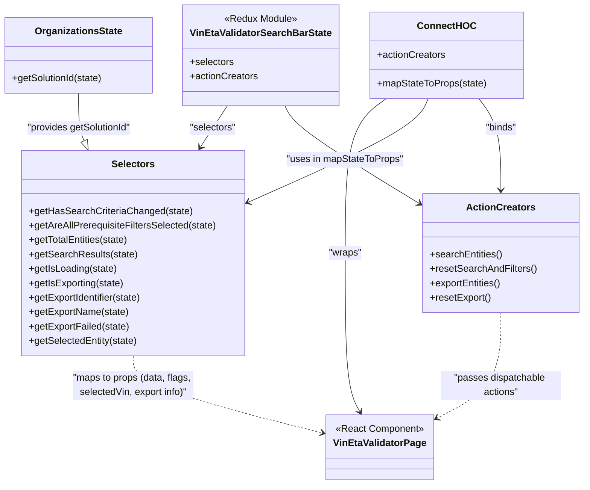

# Diagram: web/portal/src/pages/administration/internal-tools/vin-eta-validator/VinEtaValidator.page.container.js

> Auto-generated by Obscura crawlers

## Mermaid

### SVG

<svg id="container" width="972.537109375" xmlns="http://www.w3.org/2000/svg" class="classDiagram" height="830" viewBox="0 0 972.537109375 830" role="graphics-document document" aria-roledescription="class"><g><defs><marker id="container_class-aggregationStart" class="marker aggregation class" refX="18" refY="7" markerWidth="190" markerHeight="240" orient="auto"><path d="M 18,7 L9,13 L1,7 L9,1 Z"></path></marker></defs><defs><marker id="container_class-aggregationEnd" class="marker aggregation class" refX="1" refY="7" markerWidth="20" markerHeight="28" orient="auto"><path d="M 18,7 L9,13 L1,7 L9,1 Z"></path></marker></defs><defs><marker id="container_class-extensionStart" class="marker extension class" refX="18" refY="7" markerWidth="190" markerHeight="240" orient="auto"><path d="M 1,7 L18,13 V 1 Z"></path></marker></defs><defs><marker id="container_class-extensionEnd" class="marker extension class" refX="1" refY="7" markerWidth="20" markerHeight="28" orient="auto"><path d="M 1,1 V 13 L18,7 Z"></path></marker></defs><defs><marker id="container_class-compositionStart" class="marker composition class" refX="18" refY="7" markerWidth="190" markerHeight="240" orient="auto"><path d="M 18,7 L9,13 L1,7 L9,1 Z"></path></marker></defs><defs><marker id="container_class-compositionEnd" class="marker composition class" refX="1" refY="7" markerWidth="20" markerHeight="28" orient="auto"><path d="M 18,7 L9,13 L1,7 L9,1 Z"></path></marker></defs><defs><marker id="container_class-dependencyStart" class="marker dependency class" refX="6" refY="7" markerWidth="190" markerHeight="240" orient="auto"><path d="M 5,7 L9,13 L1,7 L9,1 Z"></path></marker></defs><defs><marker id="container_class-dependencyEnd" class="marker dependency class" refX="13" refY="7" markerWidth="20" markerHeight="28" orient="auto"><path d="M 18,7 L9,13 L14,7 L9,1 Z"></path></marker></defs><defs><marker id="container_class-lollipopStart" class="marker lollipop class" refX="13" refY="7" markerWidth="190" markerHeight="240" orient="auto"><circle stroke="black" fill="transparent" cx="7" cy="7" r="6"></circle></marker></defs><defs><marker id="container_class-lollipopEnd" class="marker lollipop class" refX="1" refY="7" markerWidth="190" markerHeight="240" orient="auto"><circle stroke="black" fill="transparent" cx="7" cy="7" r="6"></circle></marker></defs><g class="root"><g class="clusters"></g><g class="edgePaths"><path d="M376.926,176L373.097,182.167C369.268,188.333,361.61,200.667,354.788,212.129C347.967,223.592,341.983,234.184,338.992,239.48L336,244.776" id="id_VinEtaValidatorSearchBarState_Selectors_1" class="edge-thickness-normal edge-pattern-solid relation" style=";;;" data-edge="true" data-et="edge" data-id="id_VinEtaValidatorSearchBarState_Selectors_1" data-points="W3sieCI6Mzc2LjkyNjI2NTQ5NTg2Nzc3LCJ5IjoxNzZ9LHsieCI6MzUzLjk1MTE3MTg3NSwieSI6MjEzfSx7IngiOjMzMy4wNDgzMzk4NDM3NSwieSI6MjUwfV0=" marker-end="url(#container_class-dependencyEnd)"></path><path d="M469.95,176L472.95,182.167C475.95,188.333,481.949,200.667,521.24,228.416C560.53,256.165,633.112,299.331,669.402,320.914L705.693,342.496" id="id_VinEtaValidatorSearchBarState_ActionCreators_2" class="edge-thickness-normal edge-pattern-solid relation" style=";;;" data-edge="true" data-et="edge" data-id="id_VinEtaValidatorSearchBarState_ActionCreators_2" data-points="W3sieCI6NDY5Ljk0OTcwMjk5NTg2Nzc3LCJ5IjoxNzZ9LHsieCI6NDg3Ljk0OTIxODc1LCJ5IjoyMTN9LHsieCI6NzEwLjg0OTYwOTM3NSwieSI6MzQ1LjU2MzQyNTI3MTgyMjZ9XQ==" marker-end="url(#container_class-dependencyEnd)"></path><path d="M131.121,155L131.121,164.667C131.121,174.333,131.121,193.667,132.945,206.935C134.769,220.203,138.416,227.407,140.24,231.009L142.064,234.61" id="id_OrganizationsState_Selectors_3" class="edge-thickness-normal edge-pattern-solid relation" style=";;;" data-edge="true" data-et="edge" data-id="id_OrganizationsState_Selectors_3" data-points="W3sieCI6MTMxLjEyMTA5Mzc1LCJ5IjoxNTV9LHsieCI6MTMxLjEyMTA5Mzc1LCJ5IjoyMTN9LHsieCI6MTQ5Ljg1NjMwNDQ2MjEzOTQsInkiOjI1MH1d" marker-end="url(#container_class-extensionEnd)"></path><path d="M641.051,164L630.265,172.167C619.478,180.333,597.906,196.667,587.12,239.5C576.334,282.333,576.334,351.667,576.334,425C576.334,498.333,576.334,575.667,580.503,623.588C584.672,671.51,593.009,690.02,597.178,699.274L601.347,708.529" id="id_ConnectHOC_VinEtaValidatorPage_4" class="edge-thickness-normal edge-pattern-solid relation" style=";;;" data-edge="true" data-et="edge" data-id="id_ConnectHOC_VinEtaValidatorPage_4" data-points="W3sieCI6NjQxLjA1MDY1MjExNzc2ODUsInkiOjE2NH0seyJ4Ijo1NzYuMzMzOTg0Mzc1LCJ5IjoyMTN9LHsieCI6NTc2LjMzMzk4NDM3NSwieSI6NDIxfSx7IngiOjU3Ni4zMzM5ODQzNzUsInkiOjY1M30seyJ4Ijo2MDMuODEwOTIwNTE2MzA0MywieSI6NzE0fV0=" marker-end="url(#container_class-dependencyEnd)"></path><path d="M710.931,164L708.071,172.167C705.211,180.333,699.491,196.667,652.25,225.019C605.009,253.371,516.246,293.741,471.865,313.927L427.483,334.112" id="id_ConnectHOC_Selectors_5" class="edge-thickness-normal edge-pattern-solid relation" style=";;;" data-edge="true" data-et="edge" data-id="id_ConnectHOC_Selectors_5" data-points="W3sieCI6NzEwLjkzMDgxNzQwNzAyNDgsInkiOjE2NH0seyJ4Ijo2OTMuNzcxNDg0Mzc1LCJ5IjoyMTN9LHsieCI6NDIyLjAyMTQ4NDM3NSwieSI6MzM2LjU5NjE1OTc1OTQ3MjQ3fV0=" marker-end="url(#container_class-dependencyEnd)"></path><path d="M796.57,164L803.424,172.167C810.278,180.333,823.986,196.667,830.84,222C837.693,247.333,837.693,281.667,837.693,298.833L837.693,316" id="id_ConnectHOC_ActionCreators_6" class="edge-thickness-normal edge-pattern-solid relation" style=";;;" data-edge="true" data-et="edge" data-id="id_ConnectHOC_ActionCreators_6" data-points="W3sieCI6Nzk2LjU3MDI4MDIxNjk0MjEsInkiOjE2NH0seyJ4Ijo4MzcuNjkzMzU5Mzc1LCJ5IjoyMTN9LHsieCI6ODM3LjY5MzM1OTM3NSwieSI6MzIyfV0=" marker-end="url(#container_class-dependencyEnd)"></path><path d="M236.443,592L236.443,602.167C236.443,612.333,236.443,632.667,286.533,657.539C336.622,682.412,436.801,711.825,486.89,726.531L536.979,741.237" id="id_Selectors_VinEtaValidatorPage_7" class="edge-thickness-normal edge-pattern-dashed relation" style=";;;" data-edge="true" data-et="edge" data-id="id_Selectors_VinEtaValidatorPage_7" data-points="W3sieCI6MjM2LjQ0MzM1OTM3NSwieSI6NTkyfSx7IngiOjIzNi40NDMzNTkzNzUsInkiOjY1M30seyJ4Ijo1NDIuNzM2MzI4MTI1LCJ5Ijo3NDIuOTI3MTQ4ODgzNTQ3OX1d" marker-end="url(#container_class-dependencyEnd)"></path><path d="M837.693,520L837.693,542.167C837.693,564.333,837.693,608.667,817.877,641.708C798.06,674.75,758.427,696.499,738.61,707.374L718.793,718.249" id="id_ActionCreators_VinEtaValidatorPage_8" class="edge-thickness-normal edge-pattern-dashed relation" style=";;;" data-edge="true" data-et="edge" data-id="id_ActionCreators_VinEtaValidatorPage_8" data-points="W3sieCI6ODM3LjY5MzM1OTM3NSwieSI6NTIwfSx7IngiOjgzNy42OTMzNTkzNzUsInkiOjY1M30seyJ4Ijo3MTMuNTMzMjAzMTI1LCJ5Ijo3MjEuMTM1NjgzMjYyODEwNn1d" marker-end="url(#container_class-dependencyEnd)"></path></g><g class="edgeLabels"><g class="edgeLabel" transform="translate(354.22988, 212.55115)"><g class="label" data-id="id_VinEtaValidatorSearchBarState_Selectors_1" transform="translate(-38.9140625, -12)"><foreignObject width="77.828125" height="24">

"selectors"

</foreignObject></g></g><g class="edgeLabel" transform="translate(581.71722, 268.76575)"><g class="label" data-id="id_VinEtaValidatorSearchBarState_ActionCreators_2" transform="translate(-58.8125, -12)"><foreignObject width="117.625" height="24">

"actionCreators"

</foreignObject></g></g><g class="edgeLabel" transform="translate(131.12109375, 213)"><g class="label" data-id="id_OrganizationsState_Selectors_3" transform="translate(-88.78125, -12)"><foreignObject width="177.5625" height="24">

"provides getSolutionId"

</foreignObject></g></g><g class="edgeLabel" transform="translate(576.333984375, 421)"><g class="label" data-id="id_ConnectHOC_VinEtaValidatorPage_4" transform="translate(-27.6484375, -12)"><foreignObject width="55.296875" height="24">

"wraps"

</foreignObject></g></g><g class="edgeLabel" transform="translate(581.52612, 264.05095)"><g class="label" data-id="id_ConnectHOC_Selectors_5" transform="translate(-97.4375, -12)"><foreignObject width="194.875" height="24">

"uses in mapStateToProps"

</foreignObject></g></g><g class="edgeLabel" transform="translate(837.693359375, 213)"><g class="label" data-id="id_ConnectHOC_ActionCreators_6" transform="translate(-26.484375, -12)"><foreignObject width="52.96875" height="24">

"binds"

</foreignObject></g></g><g class="edgeLabel" transform="translate(236.443359375, 653)"><g class="label" data-id="id_Selectors_VinEtaValidatorPage_7" transform="translate(-100, -36)"><foreignObject width="200" height="72">

"maps to props (data, flags, selectedVin, export info)"

</foreignObject></g></g><g class="edgeLabel" transform="translate(837.693359375, 653)"><g class="label" data-id="id_ActionCreators_VinEtaValidatorPage_8" transform="translate(-100, -24)"><foreignObject width="200" height="48">

"passes dispatchable actions"

</foreignObject></g></g></g><g class="nodes"><g class="node default" id="classId-VinEtaValidatorPage-0" transform="translate(628.134765625, 768)"><g class="basic label-container"><path d="M-85.3984375 -54 L85.3984375 -54 L85.3984375 54 L-85.3984375 54" stroke="none" stroke-width="0" fill="#ECECFF" style=""></path><path d="M-85.3984375 -54 C-23.914413280819176 -54, 37.56961093836165 -54, 85.3984375 -54 M-85.3984375 -54 C-45.49591112760392 -54, -5.593384755207836 -54, 85.3984375 -54 M85.3984375 -54 C85.3984375 -20.1011385867941, 85.3984375 13.7977228264118, 85.3984375 54 M85.3984375 -54 C85.3984375 -27.524255054154473, 85.3984375 -1.048510108308946, 85.3984375 54 M85.3984375 54 C26.576326713033097 54, -32.245784073933805 54, -85.3984375 54 M85.3984375 54 C36.42005913172646 54, -12.558319236547078 54, -85.3984375 54 M-85.3984375 54 C-85.3984375 12.27389142150556, -85.3984375 -29.45221715698888, -85.3984375 -54 M-85.3984375 54 C-85.3984375 20.039090244496023, -85.3984375 -13.921819511007953, -85.3984375 -54" stroke="#9370DB" stroke-width="1.3" fill="none" stroke-dasharray="0 0" style=""></path></g><g class="annotation-group text" transform="translate(-73.2109375, -30)"><g class="label" style="" transform="translate(0,-12)"><foreignObject width="146.421875" height="24">

«React Component»

</foreignObject></g></g><g class="label-group text" transform="translate(-73.3984375, -6)"><g class="label" style="font-weight: bolder" transform="translate(0,-12)"><foreignObject width="146.796875" height="24">

VinEtaValidatorPage

</foreignObject></g></g><g class="members-group text" transform="translate(-73.3984375, 42)"></g><g class="methods-group text" transform="translate(-73.3984375, 72)"></g><g class="divider" style=""><path d="M-85.3984375 18 C-29.717226983443254 18, 25.963983533113492 18, 85.3984375 18 M-85.3984375 18 C-27.4887315363083 18, 30.4209744273834 18, 85.3984375 18" stroke="#9370DB" stroke-width="1.3" fill="none" stroke-dasharray="0 0" style=""></path></g><g class="divider" style=""><path d="M-85.3984375 36 C-30.744655416239354 36, 23.909126667521292 36, 85.3984375 36 M-85.3984375 36 C-23.915490470464803 36, 37.56745655907039 36, 85.3984375 36" stroke="#9370DB" stroke-width="1.3" fill="none" stroke-dasharray="0 0" style=""></path></g></g><g class="node default" id="classId-ConnectHOC-1" transform="translate(736.14453125, 92)"><g class="basic label-container"><path d="M-125.296875 -72 L125.296875 -72 L125.296875 72 L-125.296875 72" stroke="none" stroke-width="0" fill="#ECECFF" style=""></path><path d="M-125.296875 -72 C-61.91885360386958 -72, 1.4591677922608426 -72, 125.296875 -72 M-125.296875 -72 C-57.35732440393694 -72, 10.582226192126114 -72, 125.296875 -72 M125.296875 -72 C125.296875 -19.736239784989934, 125.296875 32.52752043002013, 125.296875 72 M125.296875 -72 C125.296875 -29.654227363563052, 125.296875 12.691545272873896, 125.296875 72 M125.296875 72 C38.069287163818714 72, -49.15830067236257 72, -125.296875 72 M125.296875 72 C32.77029609830336 72, -59.756282803393276 72, -125.296875 72 M-125.296875 72 C-125.296875 28.200482725339334, -125.296875 -15.599034549321331, -125.296875 -72 M-125.296875 72 C-125.296875 20.144388553729257, -125.296875 -31.711222892541485, -125.296875 -72" stroke="#9370DB" stroke-width="1.3" fill="none" stroke-dasharray="0 0" style=""></path></g><g class="annotation-group text" transform="translate(0, -48)"></g><g class="label-group text" transform="translate(-45.140625, -48)"><g class="label" style="font-weight: bolder" transform="translate(0,-12)"><foreignObject width="90.28125" height="24">

ConnectHOC

</foreignObject></g></g><g class="members-group text" transform="translate(-113.296875, 0)"><g class="label" style="" transform="translate(0,-12)"><foreignObject width="113.078125" height="24">

+actionCreators

</foreignObject></g></g><g class="methods-group text" transform="translate(-113.296875, 48)"><g class="label" style="" transform="translate(0,-12)"><foreignObject width="181.453125" height="24">

+mapStateToProps(state)

</foreignObject></g></g><g class="divider" style=""><path d="M-125.296875 -24 C-53.32635238323432 -24, 18.644170233531355 -24, 125.296875 -24 M-125.296875 -24 C-47.6059484474502 -24, 30.084978105099594 -24, 125.296875 -24" stroke="#9370DB" stroke-width="1.3" fill="none" stroke-dasharray="0 0" style=""></path></g><g class="divider" style=""><path d="M-125.296875 24 C-70.96279956136893 24, -16.62872412273785 24, 125.296875 24 M-125.296875 24 C-72.66863636721807 24, -20.04039773443614 24, 125.296875 24" stroke="#9370DB" stroke-width="1.3" fill="none" stroke-dasharray="0 0" style=""></path></g></g><g class="node default" id="classId-VinEtaValidatorSearchBarState-2" transform="translate(429.0859375, 92)"><g class="basic label-container"><path d="M-124.84375 -84 L124.84375 -84 L124.84375 84 L-124.84375 84" stroke="none" stroke-width="0" fill="#ECECFF" style=""></path><path d="M-124.84375 -84 C-44.33552952608663 -84, 36.17269094782674 -84, 124.84375 -84 M-124.84375 -84 C-38.58713516225316 -84, 47.669479675493676 -84, 124.84375 -84 M124.84375 -84 C124.84375 -19.28630710296507, 124.84375 45.42738579406986, 124.84375 84 M124.84375 -84 C124.84375 -26.19702071951083, 124.84375 31.605958560978337, 124.84375 84 M124.84375 84 C42.074522132096945 84, -40.69470573580611 84, -124.84375 84 M124.84375 84 C32.08152765020533 84, -60.68069469958934 84, -124.84375 84 M-124.84375 84 C-124.84375 42.76348258634477, -124.84375 1.5269651726895432, -124.84375 -84 M-124.84375 84 C-124.84375 45.90619432049364, -124.84375 7.81238864098728, -124.84375 -84" stroke="#9370DB" stroke-width="1.3" fill="none" stroke-dasharray="0 0" style=""></path></g><g class="annotation-group text" transform="translate(-60.4921875, -60)"><g class="label" style="" transform="translate(0,-12)"><foreignObject width="120.984375" height="24">

«Redux Module»

</foreignObject></g></g><g class="label-group text" transform="translate(-112.609375, -36)"><g class="label" style="font-weight: bolder" transform="translate(0,-12)"><foreignObject width="225.21875" height="24">

VinEtaValidatorSearchBarState

</foreignObject></g></g><g class="members-group text" transform="translate(-112.84375, 12)"><g class="label" style="" transform="translate(0,-12)"><foreignObject width="73.453125" height="24">

+selectors

</foreignObject></g><g class="label" style="" transform="translate(0,12)"><foreignObject width="113.078125" height="24">

+actionCreators

</foreignObject></g></g><g class="methods-group text" transform="translate(-112.84375, 84)"></g><g class="divider" style=""><path d="M-124.84375 -12 C-71.41443955886503 -12, -17.985129117730054 -12, 124.84375 -12 M-124.84375 -12 C-53.06192835424143 -12, 18.71989329151714 -12, 124.84375 -12" stroke="#9370DB" stroke-width="1.3" fill="none" stroke-dasharray="0 0" style=""></path></g><g class="divider" style=""><path d="M-124.84375 60 C-32.2046390311192 60, 60.4344719377616 60, 124.84375 60 M-124.84375 60 C-72.89581820808367 60, -20.947886416167336 60, 124.84375 60" stroke="#9370DB" stroke-width="1.3" fill="none" stroke-dasharray="0 0" style=""></path></g></g><g class="node default" id="classId-OrganizationsState-3" transform="translate(131.12109375, 92)"><g class="basic label-container"><path d="M-123.12109375 -63 L123.12109375 -63 L123.12109375 63 L-123.12109375 63" stroke="none" stroke-width="0" fill="#ECECFF" style=""></path><path d="M-123.12109375 -63 C-29.576470907176642 -63, 63.968151935646716 -63, 123.12109375 -63 M-123.12109375 -63 C-54.83478194832168 -63, 13.451529853356647 -63, 123.12109375 -63 M123.12109375 -63 C123.12109375 -19.559134970421113, 123.12109375 23.881730059157775, 123.12109375 63 M123.12109375 -63 C123.12109375 -34.22445742999461, 123.12109375 -5.448914859989216, 123.12109375 63 M123.12109375 63 C35.61771449485103 63, -51.88566476029794 63, -123.12109375 63 M123.12109375 63 C33.28226128935245 63, -56.556571171295104 63, -123.12109375 63 M-123.12109375 63 C-123.12109375 33.363517082224426, -123.12109375 3.7270341644488525, -123.12109375 -63 M-123.12109375 63 C-123.12109375 35.50660998351883, -123.12109375 8.013219967037656, -123.12109375 -63" stroke="#9370DB" stroke-width="1.3" fill="none" stroke-dasharray="0 0" style=""></path></g><g class="annotation-group text" transform="translate(0, -39)"></g><g class="label-group text" transform="translate(-69.8671875, -39)"><g class="label" style="font-weight: bolder" transform="translate(0,-12)"><foreignObject width="139.734375" height="24">

OrganizationsState

</foreignObject></g></g><g class="members-group text" transform="translate(-111.12109375, 9)"></g><g class="methods-group text" transform="translate(-111.12109375, 39)"><g class="label" style="" transform="translate(0,-12)"><foreignObject width="152.375" height="24">

+getSolutionId(state)

</foreignObject></g></g><g class="divider" style=""><path d="M-123.12109375 -15 C-44.77867035096837 -15, 33.56375304806326 -15, 123.12109375 -15 M-123.12109375 -15 C-61.77331642082145 -15, -0.4255390916429036 -15, 123.12109375 -15" stroke="#9370DB" stroke-width="1.3" fill="none" stroke-dasharray="0 0" style=""></path></g><g class="divider" style=""><path d="M-123.12109375 9 C-64.39587713056243 9, -5.670660511124851 9, 123.12109375 9 M-123.12109375 9 C-62.60545257584025 9, -2.0898114016805067 9, 123.12109375 9" stroke="#9370DB" stroke-width="1.3" fill="none" stroke-dasharray="0 0" style=""></path></g></g><g class="node default" id="classId-Selectors-4" transform="translate(236.443359375, 421)"><g class="basic label-container"><path d="M-185.578125 -171 L185.578125 -171 L185.578125 171 L-185.578125 171" stroke="none" stroke-width="0" fill="#ECECFF" style=""></path><path d="M-185.578125 -171 C-88.63266814074471 -171, 8.312788718510575 -171, 185.578125 -171 M-185.578125 -171 C-56.59100159830584 -171, 72.39612180338833 -171, 185.578125 -171 M185.578125 -171 C185.578125 -90.82782990166014, 185.578125 -10.655659803320276, 185.578125 171 M185.578125 -171 C185.578125 -46.92540703813559, 185.578125 77.14918592372882, 185.578125 171 M185.578125 171 C79.93739809896321 171, -25.70332880207357 171, -185.578125 171 M185.578125 171 C75.66073976584148 171, -34.25664546831703 171, -185.578125 171 M-185.578125 171 C-185.578125 58.103031303679344, -185.578125 -54.79393739264131, -185.578125 -171 M-185.578125 171 C-185.578125 78.82925275597866, -185.578125 -13.341494488042684, -185.578125 -171" stroke="#9370DB" stroke-width="1.3" fill="none" stroke-dasharray="0 0" style=""></path></g><g class="annotation-group text" transform="translate(0, -147)"></g><g class="label-group text" transform="translate(-34.171875, -147)"><g class="label" style="font-weight: bolder" transform="translate(0,-12)"><foreignObject width="68.34375" height="24">

Selectors

</foreignObject></g></g><g class="members-group text" transform="translate(-173.578125, -99)"></g><g class="methods-group text" transform="translate(-173.578125, -69)"><g class="label" style="" transform="translate(0,-12)"><foreignObject width="268.28125" height="24">

+getHasSearchCriteriaChanged(state)

</foreignObject></g><g class="label" style="" transform="translate(0,12)"><foreignObject width="312.984375" height="24">

+getAreAllPrerequisiteFiltersSelected(state)

</foreignObject></g><g class="label" style="" transform="translate(0,36)"><foreignObject width="167.1875" height="24">

+getTotalEntities(state)

</foreignObject></g><g class="label" style="" transform="translate(0,60)"><foreignObject width="178.59375" height="24">

+getSearchResults(state)

</foreignObject></g><g class="label" style="" transform="translate(0,84)"><foreignObject width="146.4375" height="24">

+getIsLoading(state)

</foreignObject></g><g class="label" style="" transform="translate(0,108)"><foreignObject width="158.53125" height="24">

+getIsExporting(state)

</foreignObject></g><g class="label" style="" transform="translate(0,132)"><foreignObject width="190.90625" height="24">

+getExportIdentifier(state)

</foreignObject></g><g class="label" style="" transform="translate(0,156)"><foreignObject width="166.203125" height="24">

+getExportName(state)

</foreignObject></g><g class="label" style="" transform="translate(0,180)"><foreignObject width="167.140625" height="24">

+getExportFailed(state)

</foreignObject></g><g class="label" style="" transform="translate(0,204)"><foreignObject width="180.890625" height="24">

+getSelectedEntity(state)

</foreignObject></g></g><g class="divider" style=""><path d="M-185.578125 -123 C-64.50687089046097 -123, 56.56438321907805 -123, 185.578125 -123 M-185.578125 -123 C-80.40581225082003 -123, 24.76650049835993 -123, 185.578125 -123" stroke="#9370DB" stroke-width="1.3" fill="none" stroke-dasharray="0 0" style=""></path></g><g class="divider" style=""><path d="M-185.578125 -99 C-99.72204343412281 -99, -13.86596186824562 -99, 185.578125 -99 M-185.578125 -99 C-93.86673506001858 -99, -2.1553451200371683 -99, 185.578125 -99" stroke="#9370DB" stroke-width="1.3" fill="none" stroke-dasharray="0 0" style=""></path></g></g><g class="node default" id="classId-ActionCreators-5" transform="translate(837.693359375, 421)"><g class="basic label-container"><path d="M-126.84375 -99 L126.84375 -99 L126.84375 99 L-126.84375 99" stroke="none" stroke-width="0" fill="#ECECFF" style=""></path><path d="M-126.84375 -99 C-28.17435014660458 -99, 70.49504970679084 -99, 126.84375 -99 M-126.84375 -99 C-46.59015070616361 -99, 33.663448587672775 -99, 126.84375 -99 M126.84375 -99 C126.84375 -48.63064218975247, 126.84375 1.7387156204950571, 126.84375 99 M126.84375 -99 C126.84375 -31.43558382137786, 126.84375 36.12883235724428, 126.84375 99 M126.84375 99 C35.044675031403116 99, -56.75439993719377 99, -126.84375 99 M126.84375 99 C35.710591883298605 99, -55.42256623340279 99, -126.84375 99 M-126.84375 99 C-126.84375 28.924196529341657, -126.84375 -41.151606941316686, -126.84375 -99 M-126.84375 99 C-126.84375 56.99884403621778, -126.84375 14.997688072435565, -126.84375 -99" stroke="#9370DB" stroke-width="1.3" fill="none" stroke-dasharray="0 0" style=""></path></g><g class="annotation-group text" transform="translate(0, -75)"></g><g class="label-group text" transform="translate(-53.96875, -75)"><g class="label" style="font-weight: bolder" transform="translate(0,-12)"><foreignObject width="107.9375" height="24">

ActionCreators

</foreignObject></g></g><g class="members-group text" transform="translate(-114.84375, -27)"></g><g class="methods-group text" transform="translate(-114.84375, 3)"><g class="label" style="" transform="translate(0,-12)"><foreignObject width="120.359375" height="24">

+searchEntities()

</foreignObject></g><g class="label" style="" transform="translate(0,12)"><foreignObject width="175.71875" height="24">

+resetSearchAndFilters()

</foreignObject></g><g class="label" style="" transform="translate(0,36)"><foreignObject width="120.046875" height="24">

+exportEntities()

</foreignObject></g><g class="label" style="" transform="translate(0,60)"><foreignObject width="101.859375" height="24">

+resetExport()

</foreignObject></g></g><g class="divider" style=""><path d="M-126.84375 -51 C-47.09508262794375 -51, 32.65358474411249 -51, 126.84375 -51 M-126.84375 -51 C-50.41636873579856 -51, 26.011012528402887 -51, 126.84375 -51" stroke="#9370DB" stroke-width="1.3" fill="none" stroke-dasharray="0 0" style=""></path></g><g class="divider" style=""><path d="M-126.84375 -27 C-43.13628083731122 -27, 40.57118832537756 -27, 126.84375 -27 M-126.84375 -27 C-74.99836488410746 -27, -23.15297976821492 -27, 126.84375 -27" stroke="#9370DB" stroke-width="1.3" fill="none" stroke-dasharray="0 0" style=""></path></g></g></g></g></g></svg>
