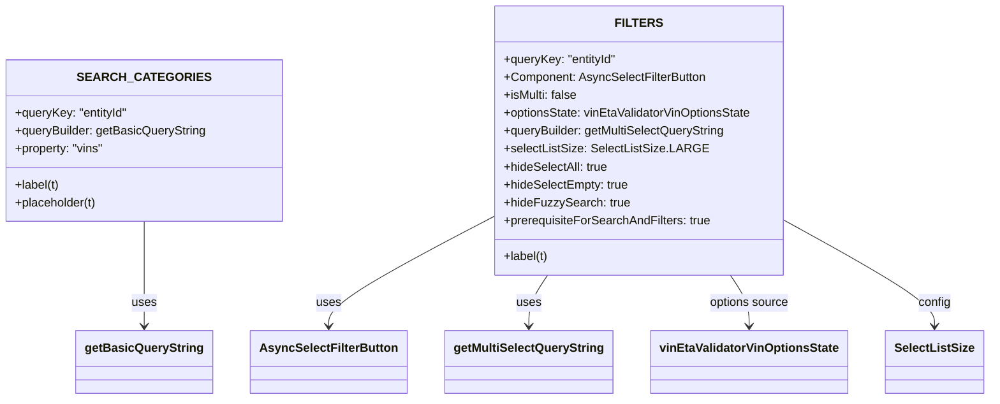

# Diagram: web/portal/src/pages/administration/internal-tools/vin-eta-validator/VinEtaValidator.searchOptions.js


> Auto-generated by Obscura crawlers

## Diagram 1



### SVG

<svg id="container" width="1278.24609375" xmlns="http://www.w3.org/2000/svg" class="classDiagram" height="534" viewBox="0 0 1278.24609375 534" role="graphics-document document" aria-roledescription="class"><style>#container{font-family:"trebuchet ms",verdana,arial,sans-serif;font-size:16px;fill:#333;}@keyframes edge-animation-frame{from{stroke-dashoffset:0;}}@keyframes dash{to{stroke-dashoffset:0;}}#container .edge-animation-slow{stroke-dasharray:9,5!important;stroke-dashoffset:900;animation:dash 50s linear infinite;stroke-linecap:round;}#container .edge-animation-fast{stroke-dasharray:9,5!important;stroke-dashoffset:900;animation:dash 20s linear infinite;stroke-linecap:round;}#container .error-icon{fill:#552222;}#container .error-text{fill:#552222;stroke:#552222;}#container .edge-thickness-normal{stroke-width:1px;}#container .edge-thickness-thick{stroke-width:3.5px;}#container .edge-pattern-solid{stroke-dasharray:0;}#container .edge-thickness-invisible{stroke-width:0;fill:none;}#container .edge-pattern-dashed{stroke-dasharray:3;}#container .edge-pattern-dotted{stroke-dasharray:2;}#container .marker{fill:#333333;stroke:#333333;}#container .marker.cross{stroke:#333333;}#container svg{font-family:"trebuchet ms",verdana,arial,sans-serif;font-size:16px;}#container p{margin:0;}#container g.classGroup text{fill:#9370DB;stroke:none;font-family:"trebuchet ms",verdana,arial,sans-serif;font-size:10px;}#container g.classGroup text .title{font-weight:bolder;}#container .nodeLabel,#container .edgeLabel{color:#131300;}#container .edgeLabel .label rect{fill:#ECECFF;}#container .label text{fill:#131300;}#container .labelBkg{background:#ECECFF;}#container .edgeLabel .label span{background:#ECECFF;}#container .classTitle{font-weight:bolder;}#container .node rect,#container .node circle,#container .node ellipse,#container .node polygon,#container .node path{fill:#ECECFF;stroke:#9370DB;stroke-width:1px;}#container .divider{stroke:#9370DB;stroke-width:1;}#container g.clickable{cursor:pointer;}#container g.classGroup rect{fill:#ECECFF;stroke:#9370DB;}#container g.classGroup line{stroke:#9370DB;stroke-width:1;}#container .classLabel .box{stroke:none;stroke-width:0;fill:#ECECFF;opacity:0.5;}#container .classLabel .label{fill:#9370DB;font-size:10px;}#container .relation{stroke:#333333;stroke-width:1;fill:none;}#container .dashed-line{stroke-dasharray:3;}#container .dotted-line{stroke-dasharray:1 2;}#container #compositionStart,#container .composition{fill:#333333!important;stroke:#333333!important;stroke-width:1;}#container #compositionEnd,#container .composition{fill:#333333!important;stroke:#333333!important;stroke-width:1;}#container #dependencyStart,#container .dependency{fill:#333333!important;stroke:#333333!important;stroke-width:1;}#container #dependencyStart,#container .dependency{fill:#333333!important;stroke:#333333!important;stroke-width:1;}#container #extensionStart,#container .extension{fill:transparent!important;stroke:#333333!important;stroke-width:1;}#container #extensionEnd,#container .extension{fill:transparent!important;stroke:#333333!important;stroke-width:1;}#container #aggregationStart,#container .aggregation{fill:transparent!important;stroke:#333333!important;stroke-width:1;}#container #aggregationEnd,#container .aggregation{fill:transparent!important;stroke:#333333!important;stroke-width:1;}#container #lollipopStart,#container .lollipop{fill:#ECECFF!important;stroke:#333333!important;stroke-width:1;}#container #lollipopEnd,#container .lollipop{fill:#ECECFF!important;stroke:#333333!important;stroke-width:1;}#container .edgeTerminals{font-size:11px;line-height:initial;}#container .classTitleText{text-anchor:middle;font-size:18px;fill:#333;}#container .label-icon{display:inline-block;height:1em;overflow:visible;vertical-align:-0.125em;}#container .node .label-icon path{fill:currentColor;stroke:revert;stroke-width:revert;}#container :root{--mermaid-font-family:"trebuchet ms",verdana,arial,sans-serif;}</style><g><defs><marker id="container_class-aggregationStart" class="marker aggregation class" refX="18" refY="7" markerWidth="190" markerHeight="240" orient="auto"><path d="M 18,7 L9,13 L1,7 L9,1 Z"></path></marker></defs><defs><marker id="container_class-aggregationEnd" class="marker aggregation class" refX="1" refY="7" markerWidth="20" markerHeight="28" orient="auto"><path d="M 18,7 L9,13 L1,7 L9,1 Z"></path></marker></defs><defs><marker id="container_class-extensionStart" class="marker extension class" refX="18" refY="7" markerWidth="190" markerHeight="240" orient="auto"><path d="M 1,7 L18,13 V 1 Z"></path></marker></defs><defs><marker id="container_class-extensionEnd" class="marker extension class" refX="1" refY="7" markerWidth="20" markerHeight="28" orient="auto"><path d="M 1,1 V 13 L18,7 Z"></path></marker></defs><defs><marker id="container_class-compositionStart" class="marker composition class" refX="18" refY="7" markerWidth="190" markerHeight="240" orient="auto"><path d="M 18,7 L9,13 L1,7 L9,1 Z"></path></marker></defs><defs><marker id="container_class-compositionEnd" class="marker composition class" refX="1" refY="7" markerWidth="20" markerHeight="28" orient="auto"><path d="M 18,7 L9,13 L1,7 L9,1 Z"></path></marker></defs><defs><marker id="container_class-dependencyStart" class="marker dependency class" refX="6" refY="7" markerWidth="190" markerHeight="240" orient="auto"><path d="M 5,7 L9,13 L1,7 L9,1 Z"></path></marker></defs><defs><marker id="container_class-dependencyEnd" class="marker dependency class" refX="13" refY="7" markerWidth="20" markerHeight="28" orient="auto"><path d="M 18,7 L9,13 L14,7 L9,1 Z"></path></marker></defs><defs><marker id="container_class-lollipopStart" class="marker lollipop class" refX="13" refY="7" markerWidth="190" markerHeight="240" orient="auto"><circle stroke="black" fill="transparent" cx="7" cy="7" r="6"></circle></marker></defs><defs><marker id="container_class-lollipopEnd" class="marker lollipop class" refX="1" refY="7" markerWidth="190" markerHeight="240" orient="auto"><circle stroke="black" fill="transparent" cx="7" cy="7" r="6"></circle></marker></defs><g class="root"><g class="clusters"></g><g class="edgePaths"><path d="M186.551,296L186.551,314.167C186.551,332.333,186.551,368.667,186.551,392C186.551,415.333,186.551,425.667,186.551,430.833L186.551,436" id="id_SEARCH_CATEGORIES_getBasicQueryString_1" class="edge-thickness-normal edge-pattern-solid relation" style=";;;" data-edge="true" data-et="edge" data-id="id_SEARCH_CATEGORIES_getBasicQueryString_1" data-points="W3sieCI6MTg2LjU1MDc4MTI1LCJ5IjoyOTZ9LHsieCI6MTg2LjU1MDc4MTI1LCJ5Ijo0MDV9LHsieCI6MTg2LjU1MDc4MTI1LCJ5Ijo0NDJ9XQ==" marker-end="url(#container_class-dependencyEnd)"></path><path d="M630.723,292.664L596.083,311.386C561.444,330.109,492.165,367.555,457.526,391.444C422.887,415.333,422.887,425.667,422.887,430.833L422.887,436" id="id_FILTERS_AsyncSelectFilterButton_2" class="edge-thickness-normal edge-pattern-solid relation" style=";;;" data-edge="true" data-et="edge" data-id="id_FILTERS_AsyncSelectFilterButton_2" data-points="W3sieCI6NjMwLjcyMjY1NjI1LCJ5IjoyOTIuNjYzNjgyODg5MzM0Mjd9LHsieCI6NDIyLjg4NjcxODc1LCJ5Ijo0MDV9LHsieCI6NDIyLjg4NjcxODc1LCJ5Ijo0NDJ9XQ==" marker-end="url(#container_class-dependencyEnd)"></path><path d="M705.681,368L701.615,374.167C697.549,380.333,689.417,392.667,685.351,404C681.285,415.333,681.285,425.667,681.285,430.833L681.285,436" id="id_FILTERS_getMultiSelectQueryString_3" class="edge-thickness-normal edge-pattern-solid relation" style=";;;" data-edge="true" data-et="edge" data-id="id_FILTERS_getMultiSelectQueryString_3" data-points="W3sieCI6NzA1LjY4MDk2NTU4MTc5NzIsInkiOjM2OH0seyJ4Ijo2ODEuMjg1MTU2MjUsInkiOjQwNX0seyJ4Ijo2ODEuMjg1MTU2MjUsInkiOjQ0Mn1d" marker-end="url(#container_class-dependencyEnd)"></path><path d="M943.046,368L947.112,374.167C951.178,380.333,959.309,392.667,963.375,404C967.441,415.333,967.441,425.667,967.441,430.833L967.441,436" id="id_FILTERS_vinEtaValidatorVinOptionsState_4" class="edge-thickness-normal edge-pattern-solid relation" style=";;;" data-edge="true" data-et="edge" data-id="id_FILTERS_vinEtaValidatorVinOptionsState_4" data-points="W3sieCI6OTQzLjA0NTU5NjkxODIwMjgsInkiOjM2OH0seyJ4Ijo5NjcuNDQxNDA2MjUsInkiOjQwNX0seyJ4Ijo5NjcuNDQxNDA2MjUsInkiOjQ0Mn1d" marker-end="url(#container_class-dependencyEnd)"></path><path d="M1018.004,297.697L1049.573,315.581C1081.142,333.465,1144.28,369.232,1175.849,392.283C1207.418,415.333,1207.418,425.667,1207.418,430.833L1207.418,436" id="id_FILTERS_SelectListSize_5" class="edge-thickness-normal edge-pattern-solid relation" style=";;;" data-edge="true" data-et="edge" data-id="id_FILTERS_SelectListSize_5" data-points="W3sieCI6MTAxOC4wMDM5MDYyNSwieSI6Mjk3LjY5NzE3MTE3NzQxODM0fSx7IngiOjEyMDcuNDE3OTY4NzUsInkiOjQwNX0seyJ4IjoxMjA3LjQxNzk2ODc1LCJ5Ijo0NDJ9XQ==" marker-end="url(#container_class-dependencyEnd)"></path></g><g class="edgeLabels"><g class="edgeLabel" transform="translate(186.55078125, 405)"><g class="label" data-id="id_SEARCH_CATEGORIES_getBasicQueryString_1" transform="translate(-16.4921875, -12)"><foreignObject width="32.984375" height="24"><div xmlns="http://www.w3.org/1999/xhtml" class="labelBkg" style="display: table-cell; white-space: nowrap; line-height: 1.5; max-width: 200px; text-align: center;"><span class="edgeLabel"><p>uses</p></span></div></foreignObject></g></g><g class="edgeLabel" transform="translate(422.88671875, 405)"><g class="label" data-id="id_FILTERS_AsyncSelectFilterButton_2" transform="translate(-16.4921875, -12)"><foreignObject width="32.984375" height="24"><div xmlns="http://www.w3.org/1999/xhtml" class="labelBkg" style="display: table-cell; white-space: nowrap; line-height: 1.5; max-width: 200px; text-align: center;"><span class="edgeLabel"><p>uses</p></span></div></foreignObject></g></g><g class="edgeLabel" transform="translate(681.28515625, 405)"><g class="label" data-id="id_FILTERS_getMultiSelectQueryString_3" transform="translate(-16.4921875, -12)"><foreignObject width="32.984375" height="24"><div xmlns="http://www.w3.org/1999/xhtml" class="labelBkg" style="display: table-cell; white-space: nowrap; line-height: 1.5; max-width: 200px; text-align: center;"><span class="edgeLabel"><p>uses</p></span></div></foreignObject></g></g><g class="edgeLabel" transform="translate(967.44140625, 405)"><g class="label" data-id="id_FILTERS_vinEtaValidatorVinOptionsState_4" transform="translate(-53.7265625, -12)"><foreignObject width="107.453125" height="24"><div xmlns="http://www.w3.org/1999/xhtml" class="labelBkg" style="display: table-cell; white-space: nowrap; line-height: 1.5; max-width: 200px; text-align: center;"><span class="edgeLabel"><p>options source</p></span></div></foreignObject></g></g><g class="edgeLabel" transform="translate(1207.41796875, 405)"><g class="label" data-id="id_FILTERS_SelectListSize_5" transform="translate(-21.7890625, -12)"><foreignObject width="43.578125" height="24"><div xmlns="http://www.w3.org/1999/xhtml" class="labelBkg" style="display: table-cell; white-space: nowrap; line-height: 1.5; max-width: 200px; text-align: center;"><span class="edgeLabel"><p>config</p></span></div></foreignObject></g></g></g><g class="nodes"><g class="node default" id="classId-SEARCH_CATEGORIES-0" transform="translate(186.55078125, 188)"><g class="basic label-container"><path d="M-178.55078125 -108 L178.55078125 -108 L178.55078125 108 L-178.55078125 108" stroke="none" stroke-width="0" fill="#ECECFF" style=""></path><path d="M-178.55078125 -108 C-60.082836795587525 -108, 58.38510765882495 -108, 178.55078125 -108 M-178.55078125 -108 C-60.47093892349791 -108, 57.60890340300418 -108, 178.55078125 -108 M178.55078125 -108 C178.55078125 -51.56323535254696, 178.55078125 4.873529294906078, 178.55078125 108 M178.55078125 -108 C178.55078125 -45.564224015933796, 178.55078125 16.871551968132408, 178.55078125 108 M178.55078125 108 C104.09726690463124 108, 29.64375255926248 108, -178.55078125 108 M178.55078125 108 C87.10772409276271 108, -4.335333064474582 108, -178.55078125 108 M-178.55078125 108 C-178.55078125 57.9998808290284, -178.55078125 7.999761658056798, -178.55078125 -108 M-178.55078125 108 C-178.55078125 22.837707387932696, -178.55078125 -62.32458522413461, -178.55078125 -108" stroke="#9370DB" stroke-width="1.3" fill="none" stroke-dasharray="0 0" style=""></path></g><g class="annotation-group text" transform="translate(0, -84)"></g><g class="label-group text" transform="translate(-76.1171875, -84)"><g class="label" style="font-weight: bolder" transform="translate(0,-12)"><foreignObject width="152.234375" height="24"><div xmlns="http://www.w3.org/1999/xhtml" style="display: table-cell; white-space: nowrap; line-height: 1.5; max-width: 200px; text-align: center;"><span class="nodeLabel markdown-node-label" style=""><p>SEARCH_CATEGORIES</p></span></div></foreignObject></g></g><g class="members-group text" transform="translate(-166.55078125, -36)"><g class="label" style="" transform="translate(0,-12)"><foreignObject width="152.359375" height="24"><div xmlns="http://www.w3.org/1999/xhtml" style="display: table-cell; white-space: nowrap; line-height: 1.5; max-width: 210px; text-align: center;"><span class="nodeLabel markdown-node-label" style=""><p>+queryKey: "entityId"</p></span></div></foreignObject></g><g class="label" style="" transform="translate(0,12)"><foreignObject width="256.984375" height="24"><div xmlns="http://www.w3.org/1999/xhtml" style="display: table-cell; white-space: nowrap; line-height: 1.5; max-width: 315px; text-align: center;"><span class="nodeLabel markdown-node-label" style=""><p>+queryBuilder: getBasicQueryString</p></span></div></foreignObject></g><g class="label" style="" transform="translate(0,36)"><foreignObject width="120.40625" height="24"><div xmlns="http://www.w3.org/1999/xhtml" style="display: table-cell; white-space: nowrap; line-height: 1.5; max-width: 178px; text-align: center;"><span class="nodeLabel markdown-node-label" style=""><p>+property: "vins"</p></span></div></foreignObject></g></g><g class="methods-group text" transform="translate(-166.55078125, 60)"><g class="label" style="" transform="translate(0,-12)"><foreignObject width="60.359375" height="24"><div xmlns="http://www.w3.org/1999/xhtml" style="display: table-cell; white-space: nowrap; line-height: 1.5; max-width: 118px; text-align: center;"><span class="nodeLabel markdown-node-label" style=""><p>+label(t)</p></span></div></foreignObject></g><g class="label" style="" transform="translate(0,12)"><foreignObject width="110.796875" height="24"><div xmlns="http://www.w3.org/1999/xhtml" style="display: table-cell; white-space: nowrap; line-height: 1.5; max-width: 168px; text-align: center;"><span class="nodeLabel markdown-node-label" style=""><p>+placeholder(t)</p></span></div></foreignObject></g></g><g class="divider" style=""><path d="M-178.55078125 -60 C-58.14040922794784 -60, 62.269962794104316 -60, 178.55078125 -60 M-178.55078125 -60 C-96.67648085686594 -60, -14.802180463731872 -60, 178.55078125 -60" stroke="#9370DB" stroke-width="1.3" fill="none" stroke-dasharray="0 0" style=""></path></g><g class="divider" style=""><path d="M-178.55078125 36 C-62.69358619336238 36, 53.16360886327524 36, 178.55078125 36 M-178.55078125 36 C-56.8277542900544 36, 64.8952726698912 36, 178.55078125 36" stroke="#9370DB" stroke-width="1.3" fill="none" stroke-dasharray="0 0" style=""></path></g></g><g class="node default" id="classId-FILTERS-1" transform="translate(824.36328125, 188)"><g class="basic label-container"><path d="M-193.640625 -180 L193.640625 -180 L193.640625 180 L-193.640625 180" stroke="none" stroke-width="0" fill="#ECECFF" style=""></path><path d="M-193.640625 -180 C-45.577850252525224 -180, 102.48492449494955 -180, 193.640625 -180 M-193.640625 -180 C-44.21952757777868 -180, 105.20156984444264 -180, 193.640625 -180 M193.640625 -180 C193.640625 -85.27272634708262, 193.640625 9.454547305834751, 193.640625 180 M193.640625 -180 C193.640625 -74.2010966545997, 193.640625 31.59780669080061, 193.640625 180 M193.640625 180 C63.80199942395038 180, -66.03662615209925 180, -193.640625 180 M193.640625 180 C82.91928755215653 180, -27.802049895686935 180, -193.640625 180 M-193.640625 180 C-193.640625 68.91360220426743, -193.640625 -42.17279559146513, -193.640625 -180 M-193.640625 180 C-193.640625 80.29906304537892, -193.640625 -19.40187390924217, -193.640625 -180" stroke="#9370DB" stroke-width="1.3" fill="none" stroke-dasharray="0 0" style=""></path></g><g class="annotation-group text" transform="translate(0, -156)"></g><g class="label-group text" transform="translate(-27.5625, -156)"><g class="label" style="font-weight: bolder" transform="translate(0,-12)"><foreignObject width="55.125" height="24"><div xmlns="http://www.w3.org/1999/xhtml" style="display: table-cell; white-space: nowrap; line-height: 1.5; max-width: 105px; text-align: center;"><span class="nodeLabel markdown-node-label" style=""><p>FILTERS</p></span></div></foreignObject></g></g><g class="members-group text" transform="translate(-181.640625, -108)"><g class="label" style="" transform="translate(0,-12)"><foreignObject width="152.359375" height="24"><div xmlns="http://www.w3.org/1999/xhtml" style="display: table-cell; white-space: nowrap; line-height: 1.5; max-width: 210px; text-align: center;"><span class="nodeLabel markdown-node-label" style=""><p>+queryKey: "entityId"</p></span></div></foreignObject></g><g class="label" style="" transform="translate(0,12)"><foreignObject width="271.390625" height="24"><div xmlns="http://www.w3.org/1999/xhtml" style="display: table-cell; white-space: nowrap; line-height: 1.5; max-width: 329px; text-align: center;"><span class="nodeLabel markdown-node-label" style=""><p>+Component: AsyncSelectFilterButton</p></span></div></foreignObject></g><g class="label" style="" transform="translate(0,36)"><foreignObject width="99.21875" height="24"><div xmlns="http://www.w3.org/1999/xhtml" style="display: table-cell; white-space: nowrap; line-height: 1.5; max-width: 157px; text-align: center;"><span class="nodeLabel markdown-node-label" style=""><p>+isMulti: false</p></span></div></foreignObject></g><g class="label" style="" transform="translate(0,60)"><foreignObject width="335.71875" height="24"><div xmlns="http://www.w3.org/1999/xhtml" style="display: table-cell; white-space: nowrap; line-height: 1.5; max-width: 393px; text-align: center;"><span class="nodeLabel markdown-node-label" style=""><p>+optionsState: vinEtaValidatorVinOptionsState</p></span></div></foreignObject></g><g class="label" style="" transform="translate(0,84)"><foreignObject width="300.015625" height="24"><div xmlns="http://www.w3.org/1999/xhtml" style="display: table-cell; white-space: nowrap; line-height: 1.5; max-width: 358px; text-align: center;"><span class="nodeLabel markdown-node-label" style=""><p>+queryBuilder: getMultiSelectQueryString</p></span></div></foreignObject></g><g class="label" style="" transform="translate(0,108)"><foreignObject width="261.34375" height="24"><div xmlns="http://www.w3.org/1999/xhtml" style="display: table-cell; white-space: nowrap; line-height: 1.5; max-width: 319px; text-align: center;"><span class="nodeLabel markdown-node-label" style=""><p>+selectListSize: SelectListSize.LARGE</p></span></div></foreignObject></g><g class="label" style="" transform="translate(0,132)"><foreignObject width="141.125" height="24"><div xmlns="http://www.w3.org/1999/xhtml" style="display: table-cell; white-space: nowrap; line-height: 1.5; max-width: 198px; text-align: center;"><span class="nodeLabel markdown-node-label" style=""><p>+hideSelectAll: true</p></span></div></foreignObject></g><g class="label" style="" transform="translate(0,156)"><foreignObject width="167.671875" height="24"><div xmlns="http://www.w3.org/1999/xhtml" style="display: table-cell; white-space: nowrap; line-height: 1.5; max-width: 225px; text-align: center;"><span class="nodeLabel markdown-node-label" style=""><p>+hideSelectEmpty: true</p></span></div></foreignObject></g><g class="label" style="" transform="translate(0,180)"><foreignObject width="165.375" height="24"><div xmlns="http://www.w3.org/1999/xhtml" style="display: table-cell; white-space: nowrap; line-height: 1.5; max-width: 223px; text-align: center;"><span class="nodeLabel markdown-node-label" style=""><p>+hideFuzzySearch: true</p></span></div></foreignObject></g><g class="label" style="" transform="translate(0,204)"><foreignObject width="277.8125" height="24"><div xmlns="http://www.w3.org/1999/xhtml" style="display: table-cell; white-space: nowrap; line-height: 1.5; max-width: 335px; text-align: center;"><span class="nodeLabel markdown-node-label" style=""><p>+prerequisiteForSearchAndFilters: true</p></span></div></foreignObject></g></g><g class="methods-group text" transform="translate(-181.640625, 156)"><g class="label" style="" transform="translate(0,-12)"><foreignObject width="60.359375" height="24"><div xmlns="http://www.w3.org/1999/xhtml" style="display: table-cell; white-space: nowrap; line-height: 1.5; max-width: 118px; text-align: center;"><span class="nodeLabel markdown-node-label" style=""><p>+label(t)</p></span></div></foreignObject></g></g><g class="divider" style=""><path d="M-193.640625 -132 C-114.99918280167739 -132, -36.357740603354785 -132, 193.640625 -132 M-193.640625 -132 C-39.565635458636734 -132, 114.50935408272653 -132, 193.640625 -132" stroke="#9370DB" stroke-width="1.3" fill="none" stroke-dasharray="0 0" style=""></path></g><g class="divider" style=""><path d="M-193.640625 132 C-59.701701709850994 132, 74.23722158029801 132, 193.640625 132 M-193.640625 132 C-85.43601940516243 132, 22.768586189675148 132, 193.640625 132" stroke="#9370DB" stroke-width="1.3" fill="none" stroke-dasharray="0 0" style=""></path></g></g><g class="node default" id="classId-AsyncSelectFilterButton-2" transform="translate(422.88671875, 484)"><g class="basic label-container"><path d="M-99.390625 -42 L99.390625 -42 L99.390625 42 L-99.390625 42" stroke="none" stroke-width="0" fill="#ECECFF" style=""></path><path d="M-99.390625 -42 C-51.17783932493027 -42, -2.965053649860536 -42, 99.390625 -42 M-99.390625 -42 C-22.86337023716976 -42, 53.66388452566048 -42, 99.390625 -42 M99.390625 -42 C99.390625 -18.423252798405393, 99.390625 5.153494403189214, 99.390625 42 M99.390625 -42 C99.390625 -11.597972886350231, 99.390625 18.804054227299538, 99.390625 42 M99.390625 42 C43.88575689433681 42, -11.619111211326384 42, -99.390625 42 M99.390625 42 C55.91868463842661 42, 12.446744276853224 42, -99.390625 42 M-99.390625 42 C-99.390625 17.962991642512744, -99.390625 -6.074016714974512, -99.390625 -42 M-99.390625 42 C-99.390625 22.53892368674167, -99.390625 3.077847373483337, -99.390625 -42" stroke="#9370DB" stroke-width="1.3" fill="none" stroke-dasharray="0 0" style=""></path></g><g class="annotation-group text" transform="translate(0, -18)"></g><g class="label-group text" transform="translate(-87.390625, -18)"><g class="label" style="font-weight: bolder" transform="translate(0,-12)"><foreignObject width="174.78125" height="24"><div xmlns="http://www.w3.org/1999/xhtml" style="display: table-cell; white-space: nowrap; line-height: 1.5; max-width: 221px; text-align: center;"><span class="nodeLabel markdown-node-label" style=""><p>AsyncSelectFilterButton</p></span></div></foreignObject></g></g><g class="members-group text" transform="translate(-87.390625, 30)"></g><g class="methods-group text" transform="translate(-87.390625, 60)"></g><g class="divider" style=""><path d="M-99.390625 6 C-30.111044243131047 6, 39.168536513737905 6, 99.390625 6 M-99.390625 6 C-50.09752031891256 6, -0.8044156378251159 6, 99.390625 6" stroke="#9370DB" stroke-width="1.3" fill="none" stroke-dasharray="0 0" style=""></path></g><g class="divider" style=""><path d="M-99.390625 24 C-51.41838033760571 24, -3.4461356752114227 24, 99.390625 24 M-99.390625 24 C-38.58482944324716 24, 22.220966113505682 24, 99.390625 24" stroke="#9370DB" stroke-width="1.3" fill="none" stroke-dasharray="0 0" style=""></path></g></g><g class="node default" id="classId-getBasicQueryString-3" transform="translate(186.55078125, 484)"><g class="basic label-container"><path d="M-86.9453125 -42 L86.9453125 -42 L86.9453125 42 L-86.9453125 42" stroke="none" stroke-width="0" fill="#ECECFF" style=""></path><path d="M-86.9453125 -42 C-51.96019723449618 -42, -16.975081968992356 -42, 86.9453125 -42 M-86.9453125 -42 C-31.431574295758566 -42, 24.08216390848287 -42, 86.9453125 -42 M86.9453125 -42 C86.9453125 -19.523627038372524, 86.9453125 2.9527459232549518, 86.9453125 42 M86.9453125 -42 C86.9453125 -23.272262223531467, 86.9453125 -4.544524447062933, 86.9453125 42 M86.9453125 42 C51.33536452603251 42, 15.725416552065013 42, -86.9453125 42 M86.9453125 42 C29.00265074412743 42, -28.940011011745142 42, -86.9453125 42 M-86.9453125 42 C-86.9453125 21.964992979784498, -86.9453125 1.9299859595689952, -86.9453125 -42 M-86.9453125 42 C-86.9453125 18.2168877381108, -86.9453125 -5.566224523778402, -86.9453125 -42" stroke="#9370DB" stroke-width="1.3" fill="none" stroke-dasharray="0 0" style=""></path></g><g class="annotation-group text" transform="translate(0, -18)"></g><g class="label-group text" transform="translate(-74.9453125, -18)"><g class="label" style="font-weight: bolder" transform="translate(0,-12)"><foreignObject width="149.890625" height="24"><div xmlns="http://www.w3.org/1999/xhtml" style="display: table-cell; white-space: nowrap; line-height: 1.5; max-width: 197px; text-align: center;"><span class="nodeLabel markdown-node-label" style=""><p>getBasicQueryString</p></span></div></foreignObject></g></g><g class="members-group text" transform="translate(-74.9453125, 30)"></g><g class="methods-group text" transform="translate(-74.9453125, 60)"></g><g class="divider" style=""><path d="M-86.9453125 6 C-26.27266834788398 6, 34.39997580423204 6, 86.9453125 6 M-86.9453125 6 C-23.18795734041897 6, 40.56939781916206 6, 86.9453125 6" stroke="#9370DB" stroke-width="1.3" fill="none" stroke-dasharray="0 0" style=""></path></g><g class="divider" style=""><path d="M-86.9453125 24 C-46.42125608657706 24, -5.89719967315412 24, 86.9453125 24 M-86.9453125 24 C-18.4654444253937 24, 50.0144236492126 24, 86.9453125 24" stroke="#9370DB" stroke-width="1.3" fill="none" stroke-dasharray="0 0" style=""></path></g></g><g class="node default" id="classId-getMultiSelectQueryString-4" transform="translate(681.28515625, 484)"><g class="basic label-container"><path d="M-109.0078125 -42 L109.0078125 -42 L109.0078125 42 L-109.0078125 42" stroke="none" stroke-width="0" fill="#ECECFF" style=""></path><path d="M-109.0078125 -42 C-51.39025739986629 -42, 6.227297700267414 -42, 109.0078125 -42 M-109.0078125 -42 C-47.335849795379325 -42, 14.33611290924135 -42, 109.0078125 -42 M109.0078125 -42 C109.0078125 -11.715959479231316, 109.0078125 18.56808104153737, 109.0078125 42 M109.0078125 -42 C109.0078125 -18.09763873097931, 109.0078125 5.804722538041382, 109.0078125 42 M109.0078125 42 C35.95169816392891 42, -37.10441617214218 42, -109.0078125 42 M109.0078125 42 C48.55404309266708 42, -11.899726314665841 42, -109.0078125 42 M-109.0078125 42 C-109.0078125 23.771629939212428, -109.0078125 5.5432598784248555, -109.0078125 -42 M-109.0078125 42 C-109.0078125 9.139496328577437, -109.0078125 -23.721007342845127, -109.0078125 -42" stroke="#9370DB" stroke-width="1.3" fill="none" stroke-dasharray="0 0" style=""></path></g><g class="annotation-group text" transform="translate(0, -18)"></g><g class="label-group text" transform="translate(-97.0078125, -18)"><g class="label" style="font-weight: bolder" transform="translate(0,-12)"><foreignObject width="194.015625" height="24"><div xmlns="http://www.w3.org/1999/xhtml" style="display: table-cell; white-space: nowrap; line-height: 1.5; max-width: 240px; text-align: center;"><span class="nodeLabel markdown-node-label" style=""><p>getMultiSelectQueryString</p></span></div></foreignObject></g></g><g class="members-group text" transform="translate(-97.0078125, 30)"></g><g class="methods-group text" transform="translate(-97.0078125, 60)"></g><g class="divider" style=""><path d="M-109.0078125 6 C-36.72757463086978 6, 35.552663238260436 6, 109.0078125 6 M-109.0078125 6 C-40.948477016431 6, 27.110858467138 6, 109.0078125 6" stroke="#9370DB" stroke-width="1.3" fill="none" stroke-dasharray="0 0" style=""></path></g><g class="divider" style=""><path d="M-109.0078125 24 C-28.659927395528072 24, 51.687957708943856 24, 109.0078125 24 M-109.0078125 24 C-63.35030604014344 24, -17.692799580286874 24, 109.0078125 24" stroke="#9370DB" stroke-width="1.3" fill="none" stroke-dasharray="0 0" style=""></path></g></g><g class="node default" id="classId-vinEtaValidatorVinOptionsState-5" transform="translate(967.44140625, 484)"><g class="basic label-container"><path d="M-127.1484375 -42 L127.1484375 -42 L127.1484375 42 L-127.1484375 42" stroke="none" stroke-width="0" fill="#ECECFF" style=""></path><path d="M-127.1484375 -42 C-35.86038840269255 -42, 55.4276606946149 -42, 127.1484375 -42 M-127.1484375 -42 C-37.48597501385447 -42, 52.17648747229106 -42, 127.1484375 -42 M127.1484375 -42 C127.1484375 -18.312124280722017, 127.1484375 5.375751438555966, 127.1484375 42 M127.1484375 -42 C127.1484375 -12.162540436525237, 127.1484375 17.674919126949526, 127.1484375 42 M127.1484375 42 C35.063724799662566 42, -57.02098790067487 42, -127.1484375 42 M127.1484375 42 C41.48681108646204 42, -44.17481532707592 42, -127.1484375 42 M-127.1484375 42 C-127.1484375 20.216024053818664, -127.1484375 -1.5679518923626716, -127.1484375 -42 M-127.1484375 42 C-127.1484375 24.33890163579749, -127.1484375 6.677803271594982, -127.1484375 -42" stroke="#9370DB" stroke-width="1.3" fill="none" stroke-dasharray="0 0" style=""></path></g><g class="annotation-group text" transform="translate(0, -18)"></g><g class="label-group text" transform="translate(-115.1484375, -18)"><g class="label" style="font-weight: bolder" transform="translate(0,-12)"><foreignObject width="230.296875" height="24"><div xmlns="http://www.w3.org/1999/xhtml" style="display: table-cell; white-space: nowrap; line-height: 1.5; max-width: 277px; text-align: center;"><span class="nodeLabel markdown-node-label" style=""><p>vinEtaValidatorVinOptionsState</p></span></div></foreignObject></g></g><g class="members-group text" transform="translate(-115.1484375, 30)"></g><g class="methods-group text" transform="translate(-115.1484375, 60)"></g><g class="divider" style=""><path d="M-127.1484375 6 C-39.34003526271189 6, 48.46836697457621 6, 127.1484375 6 M-127.1484375 6 C-28.704053151287752 6, 69.7403311974245 6, 127.1484375 6" stroke="#9370DB" stroke-width="1.3" fill="none" stroke-dasharray="0 0" style=""></path></g><g class="divider" style=""><path d="M-127.1484375 24 C-45.351273631765864 24, 36.44589023646827 24, 127.1484375 24 M-127.1484375 24 C-35.20096954623568 24, 56.746498407528634 24, 127.1484375 24" stroke="#9370DB" stroke-width="1.3" fill="none" stroke-dasharray="0 0" style=""></path></g></g><g class="node default" id="classId-SelectListSize-6" transform="translate(1207.41796875, 484)"><g class="basic label-container"><path d="M-62.828125 -42 L62.828125 -42 L62.828125 42 L-62.828125 42" stroke="none" stroke-width="0" fill="#ECECFF" style=""></path><path d="M-62.828125 -42 C-25.151949643794303 -42, 12.524225712411393 -42, 62.828125 -42 M-62.828125 -42 C-32.9338957586815 -42, -3.0396665173629955 -42, 62.828125 -42 M62.828125 -42 C62.828125 -18.750128892092192, 62.828125 4.4997422158156155, 62.828125 42 M62.828125 -42 C62.828125 -16.229891532957744, 62.828125 9.540216934084512, 62.828125 42 M62.828125 42 C28.24950745822015 42, -6.329110083559698 42, -62.828125 42 M62.828125 42 C34.01683635247548 42, 5.205547704950966 42, -62.828125 42 M-62.828125 42 C-62.828125 24.71862982843665, -62.828125 7.437259656873302, -62.828125 -42 M-62.828125 42 C-62.828125 24.54431809038119, -62.828125 7.088636180762379, -62.828125 -42" stroke="#9370DB" stroke-width="1.3" fill="none" stroke-dasharray="0 0" style=""></path></g><g class="annotation-group text" transform="translate(0, -18)"></g><g class="label-group text" transform="translate(-50.828125, -18)"><g class="label" style="font-weight: bolder" transform="translate(0,-12)"><foreignObject width="101.65625" height="24"><div xmlns="http://www.w3.org/1999/xhtml" style="display: table-cell; white-space: nowrap; line-height: 1.5; max-width: 149px; text-align: center;"><span class="nodeLabel markdown-node-label" style=""><p>SelectListSize</p></span></div></foreignObject></g></g><g class="members-group text" transform="translate(-50.828125, 30)"></g><g class="methods-group text" transform="translate(-50.828125, 60)"></g><g class="divider" style=""><path d="M-62.828125 6 C-29.201967685761147 6, 4.424189628477706 6, 62.828125 6 M-62.828125 6 C-27.905625567107897 6, 7.016873865784206 6, 62.828125 6" stroke="#9370DB" stroke-width="1.3" fill="none" stroke-dasharray="0 0" style=""></path></g><g class="divider" style=""><path d="M-62.828125 24 C-36.07880409438397 24, -9.329483188767938 24, 62.828125 24 M-62.828125 24 C-22.28721917625468 24, 18.25368664749064 24, 62.828125 24" stroke="#9370DB" stroke-width="1.3" fill="none" stroke-dasharray="0 0" style=""></path></g></g></g></g></g></svg>

## Diagram 2

```mermaid
flowchart TD
    subgraph Imports
        A1["components/search-bar/FilterButtons\n(AsyncSelectFilterButton)"]
        A2["components/search-bar/search-filter-query-strings\n(getBasicQueryString, getMultiSelectQueryString)"]
        A3["../redux/VinEtaValidatorFilterLoaders\n(vinEtaValidatorVinOptionsState)"]
        A4["components/molecules/SearchableSelectList.molecule\n(SelectListSize)"]
    end

    A1 --> B[SEARCH_CATEGORIES & FILTERS definitions]
    A2 --> B
    A3 --> B
    A4 --> B

    B --> C[SEARCH_CATEGORIES (query: entityId -> vins)]
    B --> D[FILTERS (entityId filter using AsyncSelectFilterButton)]
    C --> UI[Search UI uses SEARCH_CATEGORIES]
    D --> UI
    UI --> "User selects VIN filter"
```

> SVG rendering failed for this diagram.
