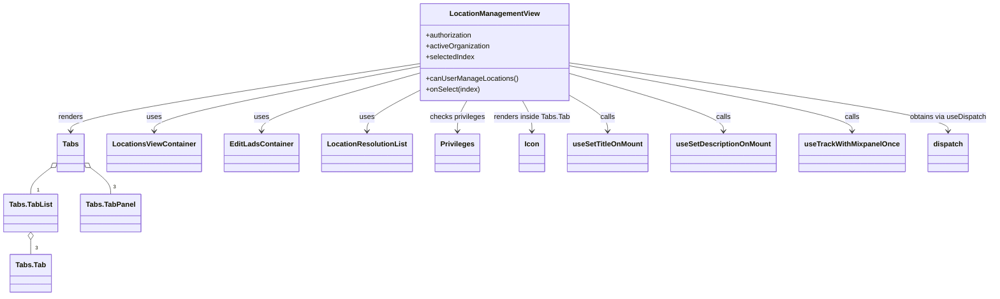
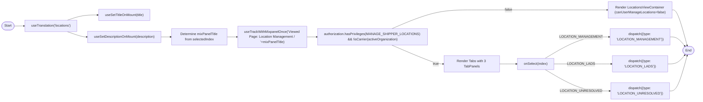

# Diagram: web/portal/src/pages/administration/location-management/LocationManagement.page.js

> Auto-generated by Obscura crawlers

## Diagram 1

### SVG

<svg id="container" width="2131.640625" xmlns="http://www.w3.org/2000/svg" class="classDiagram" height="658" viewBox="0 0 2131.640625 658" role="graphics-document document" aria-roledescription="class"><g><defs><marker id="container_class-aggregationStart" class="marker aggregation class" refX="18" refY="7" markerWidth="190" markerHeight="240" orient="auto"><path d="M 18,7 L9,13 L1,7 L9,1 Z"></path></marker></defs><defs><marker id="container_class-aggregationEnd" class="marker aggregation class" refX="1" refY="7" markerWidth="20" markerHeight="28" orient="auto"><path d="M 18,7 L9,13 L1,7 L9,1 Z"></path></marker></defs><defs><marker id="container_class-extensionStart" class="marker extension class" refX="18" refY="7" markerWidth="190" markerHeight="240" orient="auto"><path d="M 1,7 L18,13 V 1 Z"></path></marker></defs><defs><marker id="container_class-extensionEnd" class="marker extension class" refX="1" refY="7" markerWidth="20" markerHeight="28" orient="auto"><path d="M 1,1 V 13 L18,7 Z"></path></marker></defs><defs><marker id="container_class-compositionStart" class="marker composition class" refX="18" refY="7" markerWidth="190" markerHeight="240" orient="auto"><path d="M 18,7 L9,13 L1,7 L9,1 Z"></path></marker></defs><defs><marker id="container_class-compositionEnd" class="marker composition class" refX="1" refY="7" markerWidth="20" markerHeight="28" orient="auto"><path d="M 18,7 L9,13 L1,7 L9,1 Z"></path></marker></defs><defs><marker id="container_class-dependencyStart" class="marker dependency class" refX="6" refY="7" markerWidth="190" markerHeight="240" orient="auto"><path d="M 5,7 L9,13 L1,7 L9,1 Z"></path></marker></defs><defs><marker id="container_class-dependencyEnd" class="marker dependency class" refX="13" refY="7" markerWidth="20" markerHeight="28" orient="auto"><path d="M 18,7 L9,13 L14,7 L9,1 Z"></path></marker></defs><defs><marker id="container_class-lollipopStart" class="marker lollipop class" refX="13" refY="7" markerWidth="190" markerHeight="240" orient="auto"><circle stroke="black" fill="transparent" cx="7" cy="7" r="6"></circle></marker></defs><defs><marker id="container_class-lollipopEnd" class="marker lollipop class" refX="1" refY="7" markerWidth="190" markerHeight="240" orient="auto"><circle stroke="black" fill="transparent" cx="7" cy="7" r="6"></circle></marker></defs><g class="root"><g class="clusters"></g><g class="edgePaths"><path d="M898.852,141.654L774.042,161.545C649.232,181.436,399.612,221.218,274.802,246.276C149.992,271.333,149.992,281.667,149.992,286.833L149.992,292" id="id_LocationManagementView_Tabs_1" class="edge-thickness-normal edge-pattern-solid relation" style=";;;" data-edge="true" data-et="edge" data-id="id_LocationManagementView_Tabs_1" data-points="W3sieCI6ODk4Ljg1MTU2MjUsInkiOjE0MS42NTQyMjQ0NjYyMjYxN30seyJ4IjoxNDkuOTkyMTg3NSwieSI6MjYxfSx7IngiOjE0OS45OTIxODc1LCJ5IjoyOTh9XQ==" marker-end="url(#container_class-dependencyEnd)"></path><path d="M898.852,147.937L803.872,166.781C708.893,185.625,518.935,223.312,423.956,247.323C328.977,271.333,328.977,281.667,328.977,286.833L328.977,292" id="id_LocationManagementView_LocationsViewContainer_2" class="edge-thickness-normal edge-pattern-solid relation" style=";;;" data-edge="true" data-et="edge" data-id="id_LocationManagementView_LocationsViewContainer_2" data-points="W3sieCI6ODk4Ljg1MTU2MjUsInkiOjE0Ny45MzY5MzY0NTU0MjE1Mn0seyJ4IjozMjguOTc2NTYyNSwieSI6MjYxfSx7IngiOjMyOC45NzY1NjI1LCJ5IjoyOTh9XQ==" marker-end="url(#container_class-dependencyEnd)"></path><path d="M898.852,162.502L842.023,178.918C785.195,195.334,671.539,228.167,614.711,249.75C557.883,271.333,557.883,281.667,557.883,286.833L557.883,292" id="id_LocationManagementView_EditLadsContainer_3" class="edge-thickness-normal edge-pattern-solid relation" style=";;;" data-edge="true" data-et="edge" data-id="id_LocationManagementView_EditLadsContainer_3" data-points="W3sieCI6ODk4Ljg1MTU2MjUsInkiOjE2Mi41MDE1MTM2NTQwMTUyN30seyJ4Ijo1NTcuODgyODEyNSwieSI6MjYxfSx7IngiOjU1Ny44ODI4MTI1LCJ5IjoyOTh9XQ==" marker-end="url(#container_class-dependencyEnd)"></path><path d="M898.852,200.246L879.504,210.372C860.156,220.497,821.461,240.749,802.113,256.041C782.766,271.333,782.766,281.667,782.766,286.833L782.766,292" id="id_LocationManagementView_LocationResolutionList_4" class="edge-thickness-normal edge-pattern-solid relation" style=";;;" data-edge="true" data-et="edge" data-id="id_LocationManagementView_LocationResolutionList_4" data-points="W3sieCI6ODk4Ljg1MTU2MjUsInkiOjIwMC4yNDU4NDQzMTg4MDY2Nn0seyJ4Ijo3ODIuNzY1NjI1LCJ5IjoyNjF9LHsieCI6NzgyLjc2NTYyNSwieSI6Mjk4fV0=" marker-end="url(#container_class-dependencyEnd)"></path><path d="M1220.797,210.395L1235.18,218.829C1249.563,227.263,1278.328,244.132,1292.711,257.733C1307.094,271.333,1307.094,281.667,1307.094,286.833L1307.094,292" id="id_LocationManagementView_useSetTitleOnMount_5" class="edge-thickness-normal edge-pattern-solid relation" style=";;;" data-edge="true" data-et="edge" data-id="id_LocationManagementView_useSetTitleOnMount_5" data-points="W3sieCI6MTIyMC43OTY4NzUsInkiOjIxMC4zOTUxMTIyNDE1MTI3OH0seyJ4IjoxMzA3LjA5Mzc1LCJ5IjoyNjF9LHsieCI6MTMwNy4wOTM3NSwieSI6Mjk4fV0=" marker-end="url(#container_class-dependencyEnd)"></path><path d="M1220.797,163.017L1276.708,179.347C1332.62,195.678,1444.443,228.339,1500.354,249.836C1556.266,271.333,1556.266,281.667,1556.266,286.833L1556.266,292" id="id_LocationManagementView_useSetDescriptionOnMount_6" class="edge-thickness-normal edge-pattern-solid relation" style=";;;" data-edge="true" data-et="edge" data-id="id_LocationManagementView_useSetDescriptionOnMount_6" data-points="W3sieCI6MTIyMC43OTY4NzUsInkiOjE2My4wMTY2OTY5NjAzOTc4NH0seyJ4IjoxNTU2LjI2NTYyNSwieSI6MjYxfSx7IngiOjE1NTYuMjY1NjI1LCJ5IjoyOTh9XQ==" marker-end="url(#container_class-dependencyEnd)"></path><path d="M1220.797,146.252L1322.56,165.377C1424.323,184.501,1627.849,222.751,1729.612,247.042C1831.375,271.333,1831.375,281.667,1831.375,286.833L1831.375,292" id="id_LocationManagementView_useTrackWithMixpanelOnce_7" class="edge-thickness-normal edge-pattern-solid relation" style=";;;" data-edge="true" data-et="edge" data-id="id_LocationManagementView_useTrackWithMixpanelOnce_7" data-points="W3sieCI6MTIyMC43OTY4NzUsInkiOjE0Ni4yNTIxMDQ4ODIxMTE0fSx7IngiOjE4MzEuMzc1LCJ5IjoyNjF9LHsieCI6MTgzMS4zNzUsInkiOjI5OH1d" marker-end="url(#container_class-dependencyEnd)"></path><path d="M1220.797,139.877L1356.892,160.064C1492.987,180.251,1765.177,220.626,1901.272,245.98C2037.367,271.333,2037.367,281.667,2037.367,286.833L2037.367,292" id="id_LocationManagementView_dispatch_8" class="edge-thickness-normal edge-pattern-solid relation" style=";;;" data-edge="true" data-et="edge" data-id="id_LocationManagementView_dispatch_8" data-points="W3sieCI6MTIyMC43OTY4NzUsInkiOjEzOS44NzcyNDcyNDM3NjcyN30seyJ4IjoyMDM3LjM2NzE4NzUsInkiOjI2MX0seyJ4IjoyMDM3LjM2NzE4NzUsInkiOjI5OH1d" marker-end="url(#container_class-dependencyEnd)"></path><path d="M997.774,224L994.231,230.167C990.688,236.333,983.602,248.667,980.059,260C976.516,271.333,976.516,281.667,976.516,286.833L976.516,292" id="id_LocationManagementView_Privileges_9" class="edge-thickness-normal edge-pattern-solid relation" style=";;;" data-edge="true" data-et="edge" data-id="id_LocationManagementView_Privileges_9" data-points="W3sieCI6OTk3Ljc3MzY3OTk1Njg5NjYsInkiOjIyNH0seyJ4Ijo5NzYuNTE1NjI1LCJ5IjoyNjF9LHsieCI6OTc2LjUxNTYyNSwieSI6Mjk4fV0=" marker-end="url(#container_class-dependencyEnd)"></path><path d="M1121.875,224L1125.418,230.167C1128.961,236.333,1136.047,248.667,1139.59,260C1143.133,271.333,1143.133,281.667,1143.133,286.833L1143.133,292" id="id_LocationManagementView_Icon_10" class="edge-thickness-normal edge-pattern-solid relation" style=";;;" data-edge="true" data-et="edge" data-id="id_LocationManagementView_Icon_10" data-points="W3sieCI6MTEyMS44NzQ3NTc1NDMxMDM0LCJ5IjoyMjR9LHsieCI6MTE0My4xMzI4MTI1LCJ5IjoyNjF9LHsieCI6MTE0My4xMzI4MTI1LCJ5IjoyOTh9XQ==" marker-end="url(#container_class-dependencyEnd)"></path><path d="M107.487,373.421L100.369,379.018C93.252,384.614,79.016,395.807,71.899,405.57C64.781,415.333,64.781,423.667,64.781,427.833L64.781,432" id="id_Tabs_Tabs.TabList_11" class="edge-thickness-normal edge-pattern-solid relation" style=";;;" data-edge="true" data-et="edge" data-id="id_Tabs_Tabs.TabList_11" data-points="W3sieCI6MTIxLjA0Njg3NSwieSI6MzYyLjc1OTIzNzE4NzEyNzU1fSx7IngiOjY0Ljc4MTI1LCJ5Ijo0MDd9LHsieCI6NjQuNzgxMjUsInkiOjQzMn1d" marker-start="url(#container_class-aggregationStart)"></path><path d="M64.781,533.25L64.781,534.542C64.781,535.833,64.781,538.417,64.781,543.875C64.781,549.333,64.781,557.667,64.781,561.833L64.781,566" id="id_Tabs.TabList_Tabs.Tab_12" class="edge-thickness-normal edge-pattern-solid relation" style=";;;" data-edge="true" data-et="edge" data-id="id_Tabs.TabList_Tabs.Tab_12" data-points="W3sieCI6NjQuNzgxMjUsInkiOjUxNn0seyJ4Ijo2NC43ODEyNSwieSI6NTQxfSx7IngiOjY0Ljc4MTI1LCJ5Ijo1NjZ9XQ==" marker-start="url(#container_class-aggregationStart)"></path><path d="M192.498,373.421L199.615,379.018C206.733,384.614,220.968,395.807,228.086,405.57C235.203,415.333,235.203,423.667,235.203,427.833L235.203,432" id="id_Tabs_Tabs.TabPanel_13" class="edge-thickness-normal edge-pattern-solid relation" style=";;;" data-edge="true" data-et="edge" data-id="id_Tabs_Tabs.TabPanel_13" data-points="W3sieCI6MTc4LjkzNzUsInkiOjM2Mi43NTkyMzcxODcxMjc1NX0seyJ4IjoyMzUuMjAzMTI1LCJ5Ijo0MDd9LHsieCI6MjM1LjIwMzEyNSwieSI6NDMyfV0=" marker-start="url(#container_class-aggregationStart)"></path></g><g class="edgeLabels"><g class="edgeLabel" transform="translate(149.9921875, 261)"><g class="label" data-id="id_LocationManagementView_Tabs_1" transform="translate(-27.75, -12)"><foreignObject width="55.5" height="24">

renders

</foreignObject></g></g><g class="edgeLabel" transform="translate(328.9765625, 261)"><g class="label" data-id="id_LocationManagementView_LocationsViewContainer_2" transform="translate(-16.4921875, -12)"><foreignObject width="32.984375" height="24">

uses

</foreignObject></g></g><g class="edgeLabel" transform="translate(557.8828125, 261)"><g class="label" data-id="id_LocationManagementView_EditLadsContainer_3" transform="translate(-16.4921875, -12)"><foreignObject width="32.984375" height="24">

uses

</foreignObject></g></g><g class="edgeLabel" transform="translate(782.765625, 261)"><g class="label" data-id="id_LocationManagementView_LocationResolutionList_4" transform="translate(-16.4921875, -12)"><foreignObject width="32.984375" height="24">

uses

</foreignObject></g></g><g class="edgeLabel" transform="translate(1307.09375, 261)"><g class="label" data-id="id_LocationManagementView_useSetTitleOnMount_5" transform="translate(-16.4453125, -12)"><foreignObject width="32.890625" height="24">

calls

</foreignObject></g></g><g class="edgeLabel" transform="translate(1556.265625, 261)"><g class="label" data-id="id_LocationManagementView_useSetDescriptionOnMount_6" transform="translate(-16.4453125, -12)"><foreignObject width="32.890625" height="24">

calls

</foreignObject></g></g><g class="edgeLabel" transform="translate(1831.375, 261)"><g class="label" data-id="id_LocationManagementView_useTrackWithMixpanelOnce_7" transform="translate(-16.4453125, -12)"><foreignObject width="32.890625" height="24">

calls

</foreignObject></g></g><g class="edgeLabel" transform="translate(2037.3671875, 261)"><g class="label" data-id="id_LocationManagementView_dispatch_8" transform="translate(-86.2734375, -12)"><foreignObject width="172.546875" height="24">

obtains via useDispatch

</foreignObject></g></g><g class="edgeLabel" transform="translate(976.515625, 261)"><g class="label" data-id="id_LocationManagementView_Privileges_9" transform="translate(-61.6953125, -12)"><foreignObject width="123.390625" height="24">

checks privileges

</foreignObject></g></g><g class="edgeLabel" transform="translate(1143.1328125, 261)"><g class="label" data-id="id_LocationManagementView_Icon_10" transform="translate(-84.921875, -12)"><foreignObject width="169.84375" height="24">

renders inside Tabs.Tab

</foreignObject></g></g><g class="edgeLabel"><g class="label" data-id="id_Tabs_Tabs.TabList_11" transform="translate(0, 0)"><foreignObject width="0" height="0">

</foreignObject></g></g><g class="edgeLabel"><g class="label" data-id="id_Tabs.TabList_Tabs.Tab_12" transform="translate(0, 0)"><foreignObject width="0" height="0">

</foreignObject></g></g><g class="edgeLabel"><g class="label" data-id="id_Tabs_Tabs.TabPanel_13" transform="translate(0, 0)"><foreignObject width="0" height="0">

</foreignObject></g></g><g class="edgeTerminals" transform="translate(78.25664569777672, 415.0764098608809)"><g class="inner" transform="translate(0, 0)"></g><foreignObject style="width: 9px; height: 12px;">
1
</foreignObject></g><g class="edgeTerminals" transform="translate(74.78125, 543.5)"><g class="inner" transform="translate(0, 0)"></g><foreignObject style="width: 9px; height: 12px;">
3
</foreignObject></g><g class="edgeTerminals" transform="translate(240.81751375063982, 407.7426123320712)"><g class="inner" transform="translate(0, 0)"></g><foreignObject style="width: 9px; height: 12px;">
3
</foreignObject></g></g><g class="nodes"><g class="node default" id="classId-LocationManagementView-0" transform="translate(1059.82421875, 116)"><g class="basic label-container"><path d="M-160.97265625 -108 L160.97265625 -108 L160.97265625 108 L-160.97265625 108" stroke="none" stroke-width="0" fill="#ECECFF" style=""></path><path d="M-160.97265625 -108 C-56.17960218086742 -108, 48.61345188826516 -108, 160.97265625 -108 M-160.97265625 -108 C-41.84234063815137 -108, 77.28797497369726 -108, 160.97265625 -108 M160.97265625 -108 C160.97265625 -45.967638493722994, 160.97265625 16.064723012554012, 160.97265625 108 M160.97265625 -108 C160.97265625 -51.70960693438334, 160.97265625 4.5807861312333245, 160.97265625 108 M160.97265625 108 C62.58717887795747 108, -35.79829849408506 108, -160.97265625 108 M160.97265625 108 C58.942094455466204 108, -43.08846733906759 108, -160.97265625 108 M-160.97265625 108 C-160.97265625 31.107182085125814, -160.97265625 -45.78563582974837, -160.97265625 -108 M-160.97265625 108 C-160.97265625 32.00549349653501, -160.97265625 -43.98901300692998, -160.97265625 -108" stroke="#9370DB" stroke-width="1.3" fill="none" stroke-dasharray="0 0" style=""></path></g><g class="annotation-group text" transform="translate(0, -84)"></g><g class="label-group text" transform="translate(-95.6953125, -84)"><g class="label" style="font-weight: bolder" transform="translate(0,-12)"><foreignObject width="191.390625" height="24">

LocationManagementView

</foreignObject></g></g><g class="members-group text" transform="translate(-148.97265625, -36)"><g class="label" style="" transform="translate(0,-12)"><foreignObject width="105.421875" height="24">

+authorization

</foreignObject></g><g class="label" style="" transform="translate(0,12)"><foreignObject width="143" height="24">

+activeOrganization

</foreignObject></g><g class="label" style="" transform="translate(0,36)"><foreignObject width="108.984375" height="24">

+selectedIndex

</foreignObject></g></g><g class="methods-group text" transform="translate(-148.97265625, 60)"><g class="label" style="" transform="translate(0,-12)"><foreignObject width="202.25" height="24">

+canUserManageLocations()

</foreignObject></g><g class="label" style="" transform="translate(0,12)"><foreignObject width="121.0625" height="24">

+onSelect(index)

</foreignObject></g></g><g class="divider" style=""><path d="M-160.97265625 -60 C-82.45609416185455 -60, -3.9395320737091026 -60, 160.97265625 -60 M-160.97265625 -60 C-49.26181631673241 -60, 62.449023616535186 -60, 160.97265625 -60" stroke="#9370DB" stroke-width="1.3" fill="none" stroke-dasharray="0 0" style=""></path></g><g class="divider" style=""><path d="M-160.97265625 36 C-51.785981702219345 36, 57.40069284556131 36, 160.97265625 36 M-160.97265625 36 C-55.20898269895707 36, 50.554690852085855 36, 160.97265625 36" stroke="#9370DB" stroke-width="1.3" fill="none" stroke-dasharray="0 0" style=""></path></g></g><g class="node default" id="classId-Tabs-1" transform="translate(149.9921875, 340)"><g class="basic label-container"><path d="M-28.9453125 -42 L28.9453125 -42 L28.9453125 42 L-28.9453125 42" stroke="none" stroke-width="0" fill="#ECECFF" style=""></path><path d="M-28.9453125 -42 C-14.425220193574873 -42, 0.0948721128502541 -42, 28.9453125 -42 M-28.9453125 -42 C-9.639169598529286 -42, 9.666973302941429 -42, 28.9453125 -42 M28.9453125 -42 C28.9453125 -24.830021931992317, 28.9453125 -7.660043863984633, 28.9453125 42 M28.9453125 -42 C28.9453125 -14.579405617364326, 28.9453125 12.841188765271347, 28.9453125 42 M28.9453125 42 C8.648317522438433 42, -11.648677455123135 42, -28.9453125 42 M28.9453125 42 C9.83319216964981 42, -9.278928160700382 42, -28.9453125 42 M-28.9453125 42 C-28.9453125 18.13956474379803, -28.9453125 -5.720870512403941, -28.9453125 -42 M-28.9453125 42 C-28.9453125 20.430439957162534, -28.9453125 -1.1391200856749322, -28.9453125 -42" stroke="#9370DB" stroke-width="1.3" fill="none" stroke-dasharray="0 0" style=""></path></g><g class="annotation-group text" transform="translate(0, -18)"></g><g class="label-group text" transform="translate(-16.9453125, -18)"><g class="label" style="font-weight: bolder" transform="translate(0,-12)"><foreignObject width="33.890625" height="24">

Tabs

</foreignObject></g></g><g class="members-group text" transform="translate(-16.9453125, 30)"></g><g class="methods-group text" transform="translate(-16.9453125, 60)"></g><g class="divider" style=""><path d="M-28.9453125 6 C-8.668994062194589 6, 11.607324375610823 6, 28.9453125 6 M-28.9453125 6 C-15.389068933699331 6, -1.8328253673986623 6, 28.9453125 6" stroke="#9370DB" stroke-width="1.3" fill="none" stroke-dasharray="0 0" style=""></path></g><g class="divider" style=""><path d="M-28.9453125 24 C-7.838908556633292 24, 13.267495386733415 24, 28.9453125 24 M-28.9453125 24 C-8.081437169358328 24, 12.782438161283345 24, 28.9453125 24" stroke="#9370DB" stroke-width="1.3" fill="none" stroke-dasharray="0 0" style=""></path></g></g><g class="node default" id="classId-Tabs.TabList-2" transform="translate(64.78125, 474)"><g class="basic label-container"><path d="M-56.78125 -42 L56.78125 -42 L56.78125 42 L-56.78125 42" stroke="none" stroke-width="0" fill="#ECECFF" style=""></path><path d="M-56.78125 -42 C-17.316196325501174 -42, 22.14885734899765 -42, 56.78125 -42 M-56.78125 -42 C-30.10790245147465 -42, -3.4345549029493014 -42, 56.78125 -42 M56.78125 -42 C56.78125 -23.96322295674369, 56.78125 -5.9264459134873775, 56.78125 42 M56.78125 -42 C56.78125 -11.95008892872097, 56.78125 18.09982214255806, 56.78125 42 M56.78125 42 C14.366411178563276 42, -28.04842764287345 42, -56.78125 42 M56.78125 42 C23.12531438023678 42, -10.53062123952644 42, -56.78125 42 M-56.78125 42 C-56.78125 8.689867424961179, -56.78125 -24.620265150077643, -56.78125 -42 M-56.78125 42 C-56.78125 18.45640751881818, -56.78125 -5.0871849623636365, -56.78125 -42" stroke="#9370DB" stroke-width="1.3" fill="none" stroke-dasharray="0 0" style=""></path></g><g class="annotation-group text" transform="translate(0, -18)"></g><g class="label-group text" transform="translate(-44.78125, -18)"><g class="label" style="font-weight: bolder" transform="translate(0,-12)"><foreignObject width="89.5625" height="24">

Tabs.TabList

</foreignObject></g></g><g class="members-group text" transform="translate(-44.78125, 30)"></g><g class="methods-group text" transform="translate(-44.78125, 60)"></g><g class="divider" style=""><path d="M-56.78125 6 C-16.847786843461385 6, 23.08567631307723 6, 56.78125 6 M-56.78125 6 C-32.56026984924358 6, -8.339289698487164 6, 56.78125 6" stroke="#9370DB" stroke-width="1.3" fill="none" stroke-dasharray="0 0" style=""></path></g><g class="divider" style=""><path d="M-56.78125 24 C-17.86737855801733 24, 21.046492883965342 24, 56.78125 24 M-56.78125 24 C-20.387648309631466 24, 16.00595338073707 24, 56.78125 24" stroke="#9370DB" stroke-width="1.3" fill="none" stroke-dasharray="0 0" style=""></path></g></g><g class="node default" id="classId-Tabs.Tab-3" transform="translate(64.78125, 608)"><g class="basic label-container"><path d="M-43.46875 -42 L43.46875 -42 L43.46875 42 L-43.46875 42" stroke="none" stroke-width="0" fill="#ECECFF" style=""></path><path d="M-43.46875 -42 C-9.360060846567407 -42, 24.748628306865186 -42, 43.46875 -42 M-43.46875 -42 C-9.774806699452753 -42, 23.919136601094493 -42, 43.46875 -42 M43.46875 -42 C43.46875 -24.261289063355303, 43.46875 -6.522578126710606, 43.46875 42 M43.46875 -42 C43.46875 -13.961720018154502, 43.46875 14.076559963690997, 43.46875 42 M43.46875 42 C15.131729997064891 42, -13.205290005870218 42, -43.46875 42 M43.46875 42 C21.620377017440312 42, -0.22799596511937636 42, -43.46875 42 M-43.46875 42 C-43.46875 21.707803336598076, -43.46875 1.4156066731961516, -43.46875 -42 M-43.46875 42 C-43.46875 19.728898262717383, -43.46875 -2.542203474565234, -43.46875 -42" stroke="#9370DB" stroke-width="1.3" fill="none" stroke-dasharray="0 0" style=""></path></g><g class="annotation-group text" transform="translate(0, -18)"></g><g class="label-group text" transform="translate(-31.46875, -18)"><g class="label" style="font-weight: bolder" transform="translate(0,-12)"><foreignObject width="62.9375" height="24">

Tabs.Tab

</foreignObject></g></g><g class="members-group text" transform="translate(-31.46875, 30)"></g><g class="methods-group text" transform="translate(-31.46875, 60)"></g><g class="divider" style=""><path d="M-43.46875 6 C-9.308128818564768 6, 24.852492362870464 6, 43.46875 6 M-43.46875 6 C-12.01701888752562 6, 19.43471222494876 6, 43.46875 6" stroke="#9370DB" stroke-width="1.3" fill="none" stroke-dasharray="0 0" style=""></path></g><g class="divider" style=""><path d="M-43.46875 24 C-19.198649600047045 24, 5.071450799905911 24, 43.46875 24 M-43.46875 24 C-24.072233942744077 24, -4.6757178854881545 24, 43.46875 24" stroke="#9370DB" stroke-width="1.3" fill="none" stroke-dasharray="0 0" style=""></path></g></g><g class="node default" id="classId-Tabs.TabPanel-4" transform="translate(235.203125, 474)"><g class="basic label-container"><path d="M-63.640625 -42 L63.640625 -42 L63.640625 42 L-63.640625 42" stroke="none" stroke-width="0" fill="#ECECFF" style=""></path><path d="M-63.640625 -42 C-28.996360846594854 -42, 5.647903306810292 -42, 63.640625 -42 M-63.640625 -42 C-25.942133470689555 -42, 11.75635805862089 -42, 63.640625 -42 M63.640625 -42 C63.640625 -10.81663911731301, 63.640625 20.36672176537398, 63.640625 42 M63.640625 -42 C63.640625 -10.5834611485217, 63.640625 20.8330777029566, 63.640625 42 M63.640625 42 C27.993796290968056 42, -7.653032418063887 42, -63.640625 42 M63.640625 42 C15.419788293580808 42, -32.801048412838384 42, -63.640625 42 M-63.640625 42 C-63.640625 14.323848146771603, -63.640625 -13.352303706456794, -63.640625 -42 M-63.640625 42 C-63.640625 8.897406059694966, -63.640625 -24.20518788061007, -63.640625 -42" stroke="#9370DB" stroke-width="1.3" fill="none" stroke-dasharray="0 0" style=""></path></g><g class="annotation-group text" transform="translate(0, -18)"></g><g class="label-group text" transform="translate(-51.640625, -18)"><g class="label" style="font-weight: bolder" transform="translate(0,-12)"><foreignObject width="103.28125" height="24">

Tabs.TabPanel

</foreignObject></g></g><g class="members-group text" transform="translate(-51.640625, 30)"></g><g class="methods-group text" transform="translate(-51.640625, 60)"></g><g class="divider" style=""><path d="M-63.640625 6 C-38.04141425860375 6, -12.442203517207503 6, 63.640625 6 M-63.640625 6 C-27.801839659105944 6, 8.036945681788112 6, 63.640625 6" stroke="#9370DB" stroke-width="1.3" fill="none" stroke-dasharray="0 0" style=""></path></g><g class="divider" style=""><path d="M-63.640625 24 C-20.4631355402703 24, 22.7143539194594 24, 63.640625 24 M-63.640625 24 C-16.313088708402198 24, 31.014447583195604 24, 63.640625 24" stroke="#9370DB" stroke-width="1.3" fill="none" stroke-dasharray="0 0" style=""></path></g></g><g class="node default" id="classId-LocationsViewContainer-5" transform="translate(328.9765625, 340)"><g class="basic label-container"><path d="M-100.0390625 -42 L100.0390625 -42 L100.0390625 42 L-100.0390625 42" stroke="none" stroke-width="0" fill="#ECECFF" style=""></path><path d="M-100.0390625 -42 C-41.792174997227306 -42, 16.454712505545388 -42, 100.0390625 -42 M-100.0390625 -42 C-21.230741576126732 -42, 57.577579347746536 -42, 100.0390625 -42 M100.0390625 -42 C100.0390625 -22.752946706524504, 100.0390625 -3.5058934130490087, 100.0390625 42 M100.0390625 -42 C100.0390625 -13.667039538673048, 100.0390625 14.665920922653903, 100.0390625 42 M100.0390625 42 C33.529876710973824 42, -32.97930907805235 42, -100.0390625 42 M100.0390625 42 C30.425965713090037 42, -39.18713107381993 42, -100.0390625 42 M-100.0390625 42 C-100.0390625 25.03802285263746, -100.0390625 8.076045705274922, -100.0390625 -42 M-100.0390625 42 C-100.0390625 8.877270193073649, -100.0390625 -24.245459613852702, -100.0390625 -42" stroke="#9370DB" stroke-width="1.3" fill="none" stroke-dasharray="0 0" style=""></path></g><g class="annotation-group text" transform="translate(0, -18)"></g><g class="label-group text" transform="translate(-88.0390625, -18)"><g class="label" style="font-weight: bolder" transform="translate(0,-12)"><foreignObject width="176.078125" height="24">

LocationsViewContainer

</foreignObject></g></g><g class="members-group text" transform="translate(-88.0390625, 30)"></g><g class="methods-group text" transform="translate(-88.0390625, 60)"></g><g class="divider" style=""><path d="M-100.0390625 6 C-23.771222198311833 6, 52.496618103376335 6, 100.0390625 6 M-100.0390625 6 C-54.427374454409055 6, -8.81568640881811 6, 100.0390625 6" stroke="#9370DB" stroke-width="1.3" fill="none" stroke-dasharray="0 0" style=""></path></g><g class="divider" style=""><path d="M-100.0390625 24 C-46.743676241434386 24, 6.551710017131228 24, 100.0390625 24 M-100.0390625 24 C-42.19336639798715 24, 15.652329704025703 24, 100.0390625 24" stroke="#9370DB" stroke-width="1.3" fill="none" stroke-dasharray="0 0" style=""></path></g></g><g class="node default" id="classId-EditLadsContainer-6" transform="translate(557.8828125, 340)"><g class="basic label-container"><path d="M-78.8671875 -42 L78.8671875 -42 L78.8671875 42 L-78.8671875 42" stroke="none" stroke-width="0" fill="#ECECFF" style=""></path><path d="M-78.8671875 -42 C-18.820777768990105 -42, 41.22563196201979 -42, 78.8671875 -42 M-78.8671875 -42 C-35.77960960784609 -42, 7.307968284307819 -42, 78.8671875 -42 M78.8671875 -42 C78.8671875 -19.650035513411304, 78.8671875 2.6999289731773928, 78.8671875 42 M78.8671875 -42 C78.8671875 -21.82148532432459, 78.8671875 -1.6429706486491824, 78.8671875 42 M78.8671875 42 C29.436333027481908 42, -19.994521445036185 42, -78.8671875 42 M78.8671875 42 C22.28867895979358 42, -34.28982958041284 42, -78.8671875 42 M-78.8671875 42 C-78.8671875 15.192429515539235, -78.8671875 -11.61514096892153, -78.8671875 -42 M-78.8671875 42 C-78.8671875 24.37782497243152, -78.8671875 6.755649944863038, -78.8671875 -42" stroke="#9370DB" stroke-width="1.3" fill="none" stroke-dasharray="0 0" style=""></path></g><g class="annotation-group text" transform="translate(0, -18)"></g><g class="label-group text" transform="translate(-66.8671875, -18)"><g class="label" style="font-weight: bolder" transform="translate(0,-12)"><foreignObject width="133.734375" height="24">

EditLadsContainer

</foreignObject></g></g><g class="members-group text" transform="translate(-66.8671875, 30)"></g><g class="methods-group text" transform="translate(-66.8671875, 60)"></g><g class="divider" style=""><path d="M-78.8671875 6 C-26.534507829152297 6, 25.798171841695407 6, 78.8671875 6 M-78.8671875 6 C-18.792492938338796 6, 41.28220162332241 6, 78.8671875 6" stroke="#9370DB" stroke-width="1.3" fill="none" stroke-dasharray="0 0" style=""></path></g><g class="divider" style=""><path d="M-78.8671875 24 C-28.050594502035622 24, 22.765998495928756 24, 78.8671875 24 M-78.8671875 24 C-41.36196627617368 24, -3.856745052347364 24, 78.8671875 24" stroke="#9370DB" stroke-width="1.3" fill="none" stroke-dasharray="0 0" style=""></path></g></g><g class="node default" id="classId-LocationResolutionList-7" transform="translate(782.765625, 340)"><g class="basic label-container"><path d="M-96.015625 -42 L96.015625 -42 L96.015625 42 L-96.015625 42" stroke="none" stroke-width="0" fill="#ECECFF" style=""></path><path d="M-96.015625 -42 C-36.72109531536743 -42, 22.573434369265144 -42, 96.015625 -42 M-96.015625 -42 C-36.42383293961369 -42, 23.167959120772622 -42, 96.015625 -42 M96.015625 -42 C96.015625 -21.483138564817082, 96.015625 -0.9662771296341646, 96.015625 42 M96.015625 -42 C96.015625 -18.35900398711496, 96.015625 5.28199202577008, 96.015625 42 M96.015625 42 C21.876084648308776 42, -52.26345570338245 42, -96.015625 42 M96.015625 42 C47.910632348256826 42, -0.19436030348634858 42, -96.015625 42 M-96.015625 42 C-96.015625 23.375367040917006, -96.015625 4.750734081834011, -96.015625 -42 M-96.015625 42 C-96.015625 16.51622006226751, -96.015625 -8.967559875464978, -96.015625 -42" stroke="#9370DB" stroke-width="1.3" fill="none" stroke-dasharray="0 0" style=""></path></g><g class="annotation-group text" transform="translate(0, -18)"></g><g class="label-group text" transform="translate(-84.015625, -18)"><g class="label" style="font-weight: bolder" transform="translate(0,-12)"><foreignObject width="168.03125" height="24">

LocationResolutionList

</foreignObject></g></g><g class="members-group text" transform="translate(-84.015625, 30)"></g><g class="methods-group text" transform="translate(-84.015625, 60)"></g><g class="divider" style=""><path d="M-96.015625 6 C-57.569845809314295 6, -19.12406661862859 6, 96.015625 6 M-96.015625 6 C-51.298177228213504 6, -6.580729456427008 6, 96.015625 6" stroke="#9370DB" stroke-width="1.3" fill="none" stroke-dasharray="0 0" style=""></path></g><g class="divider" style=""><path d="M-96.015625 24 C-30.73068145530671 24, 34.55426208938658 24, 96.015625 24 M-96.015625 24 C-35.495563778533295 24, 25.02449744293341 24, 96.015625 24" stroke="#9370DB" stroke-width="1.3" fill="none" stroke-dasharray="0 0" style=""></path></g></g><g class="node default" id="classId-Privileges-8" transform="translate(976.515625, 340)"><g class="basic label-container"><path d="M-47.734375 -42 L47.734375 -42 L47.734375 42 L-47.734375 42" stroke="none" stroke-width="0" fill="#ECECFF" style=""></path><path d="M-47.734375 -42 C-15.937363929616684 -42, 15.859647140766633 -42, 47.734375 -42 M-47.734375 -42 C-18.89200560901182 -42, 9.950363781976357 -42, 47.734375 -42 M47.734375 -42 C47.734375 -16.197590265522678, 47.734375 9.604819468954645, 47.734375 42 M47.734375 -42 C47.734375 -18.14138194451364, 47.734375 5.7172361109727206, 47.734375 42 M47.734375 42 C16.71134389009731 42, -14.311687219805378 42, -47.734375 42 M47.734375 42 C15.052041316600928 42, -17.630292366798145 42, -47.734375 42 M-47.734375 42 C-47.734375 8.406756387762137, -47.734375 -25.186487224475727, -47.734375 -42 M-47.734375 42 C-47.734375 16.39014278311552, -47.734375 -9.219714433768956, -47.734375 -42" stroke="#9370DB" stroke-width="1.3" fill="none" stroke-dasharray="0 0" style=""></path></g><g class="annotation-group text" transform="translate(0, -18)"></g><g class="label-group text" transform="translate(-35.734375, -18)"><g class="label" style="font-weight: bolder" transform="translate(0,-12)"><foreignObject width="71.46875" height="24">

Privileges

</foreignObject></g></g><g class="members-group text" transform="translate(-35.734375, 30)"></g><g class="methods-group text" transform="translate(-35.734375, 60)"></g><g class="divider" style=""><path d="M-47.734375 6 C-28.40626484937351 6, -9.07815469874702 6, 47.734375 6 M-47.734375 6 C-25.80932740675057 6, -3.884279813501138 6, 47.734375 6" stroke="#9370DB" stroke-width="1.3" fill="none" stroke-dasharray="0 0" style=""></path></g><g class="divider" style=""><path d="M-47.734375 24 C-16.648631590815405 24, 14.437111818369189 24, 47.734375 24 M-47.734375 24 C-16.105230350091574 24, 15.523914299816852 24, 47.734375 24" stroke="#9370DB" stroke-width="1.3" fill="none" stroke-dasharray="0 0" style=""></path></g></g><g class="node default" id="classId-Icon-9" transform="translate(1143.1328125, 340)"><g class="basic label-container"><path d="M-27.3046875 -42 L27.3046875 -42 L27.3046875 42 L-27.3046875 42" stroke="none" stroke-width="0" fill="#ECECFF" style=""></path><path d="M-27.3046875 -42 C-14.062703887067011 -42, -0.8207202741340218 -42, 27.3046875 -42 M-27.3046875 -42 C-14.830206566451132 -42, -2.3557256329022636 -42, 27.3046875 -42 M27.3046875 -42 C27.3046875 -17.62733955593187, 27.3046875 6.745320888136263, 27.3046875 42 M27.3046875 -42 C27.3046875 -24.752702532025534, 27.3046875 -7.505405064051068, 27.3046875 42 M27.3046875 42 C7.322376039671955 42, -12.65993542065609 42, -27.3046875 42 M27.3046875 42 C7.568481170016213 42, -12.167725159967574 42, -27.3046875 42 M-27.3046875 42 C-27.3046875 19.169232092798723, -27.3046875 -3.661535814402555, -27.3046875 -42 M-27.3046875 42 C-27.3046875 18.98205897328705, -27.3046875 -4.035882053425901, -27.3046875 -42" stroke="#9370DB" stroke-width="1.3" fill="none" stroke-dasharray="0 0" style=""></path></g><g class="annotation-group text" transform="translate(0, -18)"></g><g class="label-group text" transform="translate(-15.3046875, -18)"><g class="label" style="font-weight: bolder" transform="translate(0,-12)"><foreignObject width="30.609375" height="24">

Icon

</foreignObject></g></g><g class="members-group text" transform="translate(-15.3046875, 30)"></g><g class="methods-group text" transform="translate(-15.3046875, 60)"></g><g class="divider" style=""><path d="M-27.3046875 6 C-9.881338364791766 6, 7.542010770416468 6, 27.3046875 6 M-27.3046875 6 C-5.718815779238394 6, 15.867055941523212 6, 27.3046875 6" stroke="#9370DB" stroke-width="1.3" fill="none" stroke-dasharray="0 0" style=""></path></g><g class="divider" style=""><path d="M-27.3046875 24 C-15.52319645417205 24, -3.7417054083440995 24, 27.3046875 24 M-27.3046875 24 C-15.717815383118918 24, -4.130943266237836 24, 27.3046875 24" stroke="#9370DB" stroke-width="1.3" fill="none" stroke-dasharray="0 0" style=""></path></g></g><g class="node default" id="classId-useSetTitleOnMount-10" transform="translate(1307.09375, 340)"><g class="basic label-container"><path d="M-86.65625 -42 L86.65625 -42 L86.65625 42 L-86.65625 42" stroke="none" stroke-width="0" fill="#ECECFF" style=""></path><path d="M-86.65625 -42 C-48.058051480802064 -42, -9.459852961604128 -42, 86.65625 -42 M-86.65625 -42 C-35.985495036863846 -42, 14.685259926272309 -42, 86.65625 -42 M86.65625 -42 C86.65625 -15.61647800253371, 86.65625 10.767043994932578, 86.65625 42 M86.65625 -42 C86.65625 -18.79916908878612, 86.65625 4.401661822427762, 86.65625 42 M86.65625 42 C45.28252706437591 42, 3.908804128751825 42, -86.65625 42 M86.65625 42 C27.342709892529662 42, -31.970830214940676 42, -86.65625 42 M-86.65625 42 C-86.65625 25.061043916032034, -86.65625 8.122087832064068, -86.65625 -42 M-86.65625 42 C-86.65625 16.36755939755359, -86.65625 -9.264881204892824, -86.65625 -42" stroke="#9370DB" stroke-width="1.3" fill="none" stroke-dasharray="0 0" style=""></path></g><g class="annotation-group text" transform="translate(0, -18)"></g><g class="label-group text" transform="translate(-74.65625, -18)"><g class="label" style="font-weight: bolder" transform="translate(0,-12)"><foreignObject width="149.3125" height="24">

useSetTitleOnMount

</foreignObject></g></g><g class="members-group text" transform="translate(-74.65625, 30)"></g><g class="methods-group text" transform="translate(-74.65625, 60)"></g><g class="divider" style=""><path d="M-86.65625 6 C-51.305978960527575 6, -15.95570792105515 6, 86.65625 6 M-86.65625 6 C-42.713535229087185 6, 1.22917954182563 6, 86.65625 6" stroke="#9370DB" stroke-width="1.3" fill="none" stroke-dasharray="0 0" style=""></path></g><g class="divider" style=""><path d="M-86.65625 24 C-48.68323767807039 24, -10.710225356140782 24, 86.65625 24 M-86.65625 24 C-35.867613626391545 24, 14.92102274721691 24, 86.65625 24" stroke="#9370DB" stroke-width="1.3" fill="none" stroke-dasharray="0 0" style=""></path></g></g><g class="node default" id="classId-useSetDescriptionOnMount-11" transform="translate(1556.265625, 340)"><g class="basic label-container"><path d="M-112.515625 -42 L112.515625 -42 L112.515625 42 L-112.515625 42" stroke="none" stroke-width="0" fill="#ECECFF" style=""></path><path d="M-112.515625 -42 C-66.55351340483855 -42, -20.591401809677095 -42, 112.515625 -42 M-112.515625 -42 C-59.76787505468575 -42, -7.020125109371506 -42, 112.515625 -42 M112.515625 -42 C112.515625 -8.406463822495489, 112.515625 25.187072355009022, 112.515625 42 M112.515625 -42 C112.515625 -16.16932192633553, 112.515625 9.661356147328938, 112.515625 42 M112.515625 42 C61.74892856725114 42, 10.982232134502283 42, -112.515625 42 M112.515625 42 C30.658137102518552 42, -51.199350794962896 42, -112.515625 42 M-112.515625 42 C-112.515625 19.312697265356896, -112.515625 -3.374605469286209, -112.515625 -42 M-112.515625 42 C-112.515625 22.435719409717084, -112.515625 2.871438819434168, -112.515625 -42" stroke="#9370DB" stroke-width="1.3" fill="none" stroke-dasharray="0 0" style=""></path></g><g class="annotation-group text" transform="translate(0, -18)"></g><g class="label-group text" transform="translate(-100.515625, -18)"><g class="label" style="font-weight: bolder" transform="translate(0,-12)"><foreignObject width="201.03125" height="24">

useSetDescriptionOnMount

</foreignObject></g></g><g class="members-group text" transform="translate(-100.515625, 30)"></g><g class="methods-group text" transform="translate(-100.515625, 60)"></g><g class="divider" style=""><path d="M-112.515625 6 C-26.279016724599003 6, 59.95759155080199 6, 112.515625 6 M-112.515625 6 C-41.88606973879659 6, 28.743485522406814 6, 112.515625 6" stroke="#9370DB" stroke-width="1.3" fill="none" stroke-dasharray="0 0" style=""></path></g><g class="divider" style=""><path d="M-112.515625 24 C-26.925130638380452 24, 58.665363723239096 24, 112.515625 24 M-112.515625 24 C-50.04600230134447 24, 12.423620397311055 24, 112.515625 24" stroke="#9370DB" stroke-width="1.3" fill="none" stroke-dasharray="0 0" style=""></path></g></g><g class="node default" id="classId-useTrackWithMixpanelOnce-12" transform="translate(1831.375, 340)"><g class="basic label-container"><path d="M-112.59375 -42 L112.59375 -42 L112.59375 42 L-112.59375 42" stroke="none" stroke-width="0" fill="#ECECFF" style=""></path><path d="M-112.59375 -42 C-46.26386578531107 -42, 20.066018429377863 -42, 112.59375 -42 M-112.59375 -42 C-54.95221451071097 -42, 2.689320978578067 -42, 112.59375 -42 M112.59375 -42 C112.59375 -16.239603143086857, 112.59375 9.520793713826286, 112.59375 42 M112.59375 -42 C112.59375 -12.747140026181146, 112.59375 16.505719947637708, 112.59375 42 M112.59375 42 C34.98556200205684 42, -42.622625995886324 42, -112.59375 42 M112.59375 42 C63.68541168675604 42, 14.777073373512081 42, -112.59375 42 M-112.59375 42 C-112.59375 21.32812493123295, -112.59375 0.6562498624658986, -112.59375 -42 M-112.59375 42 C-112.59375 11.360697722579399, -112.59375 -19.278604554841202, -112.59375 -42" stroke="#9370DB" stroke-width="1.3" fill="none" stroke-dasharray="0 0" style=""></path></g><g class="annotation-group text" transform="translate(0, -18)"></g><g class="label-group text" transform="translate(-100.59375, -18)"><g class="label" style="font-weight: bolder" transform="translate(0,-12)"><foreignObject width="201.1875" height="24">

useTrackWithMixpanelOnce

</foreignObject></g></g><g class="members-group text" transform="translate(-100.59375, 30)"></g><g class="methods-group text" transform="translate(-100.59375, 60)"></g><g class="divider" style=""><path d="M-112.59375 6 C-33.41898052298407 6, 45.75578895403186 6, 112.59375 6 M-112.59375 6 C-32.87783798180729 6, 46.83807403638542 6, 112.59375 6" stroke="#9370DB" stroke-width="1.3" fill="none" stroke-dasharray="0 0" style=""></path></g><g class="divider" style=""><path d="M-112.59375 24 C-65.77860482391485 24, -18.963459647829694 24, 112.59375 24 M-112.59375 24 C-36.14215454874852 24, 40.309440902502956 24, 112.59375 24" stroke="#9370DB" stroke-width="1.3" fill="none" stroke-dasharray="0 0" style=""></path></g></g><g class="node default" id="classId-dispatch-13" transform="translate(2037.3671875, 340)"><g class="basic label-container"><path d="M-43.3984375 -42 L43.3984375 -42 L43.3984375 42 L-43.3984375 42" stroke="none" stroke-width="0" fill="#ECECFF" style=""></path><path d="M-43.3984375 -42 C-18.018719838600255 -42, 7.36099782279949 -42, 43.3984375 -42 M-43.3984375 -42 C-22.518319207237685 -42, -1.6382009144753695 -42, 43.3984375 -42 M43.3984375 -42 C43.3984375 -22.071264072084873, 43.3984375 -2.142528144169745, 43.3984375 42 M43.3984375 -42 C43.3984375 -20.073516476288304, 43.3984375 1.852967047423391, 43.3984375 42 M43.3984375 42 C17.65391078686256 42, -8.090615926274879 42, -43.3984375 42 M43.3984375 42 C23.262350559853907 42, 3.1262636197078137 42, -43.3984375 42 M-43.3984375 42 C-43.3984375 22.90731661953432, -43.3984375 3.814633239068641, -43.3984375 -42 M-43.3984375 42 C-43.3984375 17.013228932524246, -43.3984375 -7.973542134951508, -43.3984375 -42" stroke="#9370DB" stroke-width="1.3" fill="none" stroke-dasharray="0 0" style=""></path></g><g class="annotation-group text" transform="translate(0, -18)"></g><g class="label-group text" transform="translate(-31.3984375, -18)"><g class="label" style="font-weight: bolder" transform="translate(0,-12)"><foreignObject width="62.796875" height="24">

dispatch

</foreignObject></g></g><g class="members-group text" transform="translate(-31.3984375, 30)"></g><g class="methods-group text" transform="translate(-31.3984375, 60)"></g><g class="divider" style=""><path d="M-43.3984375 6 C-20.362021961434284 6, 2.6743935771314327 6, 43.3984375 6 M-43.3984375 6 C-12.426497444613684 6, 18.545442610772632 6, 43.3984375 6" stroke="#9370DB" stroke-width="1.3" fill="none" stroke-dasharray="0 0" style=""></path></g><g class="divider" style=""><path d="M-43.3984375 24 C-16.12470124125497 24, 11.149035017490057 24, 43.3984375 24 M-43.3984375 24 C-20.082269096059377 24, 3.233899307881245 24, 43.3984375 24" stroke="#9370DB" stroke-width="1.3" fill="none" stroke-dasharray="0 0" style=""></path></g></g></g></g></g></svg>

## Diagram 2

### SVG

<svg id="container" width="3225.3037109375" xmlns="http://www.w3.org/2000/svg" class="flowchart" height="478" viewBox="0.0000019073486328125 0 3225.3037109375 478" role="graphics-document document" aria-roledescription="flowchart-v2"><g><marker id="container_flowchart-v2-pointEnd" class="marker flowchart-v2" viewBox="0 0 10 10" refX="5" refY="5" markerUnits="userSpaceOnUse" markerWidth="8" markerHeight="8" orient="auto"><path d="M 0 0 L 10 5 L 0 10 z" class="arrowMarkerPath" style="stroke-width: 1; stroke-dasharray: 1, 0;"></path></marker><marker id="container_flowchart-v2-pointStart" class="marker flowchart-v2" viewBox="0 0 10 10" refX="4.5" refY="5" markerUnits="userSpaceOnUse" markerWidth="8" markerHeight="8" orient="auto"><path d="M 0 5 L 10 10 L 10 0 z" class="arrowMarkerPath" style="stroke-width: 1; stroke-dasharray: 1, 0;"></path></marker><marker id="container_flowchart-v2-circleEnd" class="marker flowchart-v2" viewBox="0 0 10 10" refX="11" refY="5" markerUnits="userSpaceOnUse" markerWidth="11" markerHeight="11" orient="auto"><circle cx="5" cy="5" r="5" class="arrowMarkerPath" style="stroke-width: 1; stroke-dasharray: 1, 0;"></circle></marker><marker id="container_flowchart-v2-circleStart" class="marker flowchart-v2" viewBox="0 0 10 10" refX="-1" refY="5" markerUnits="userSpaceOnUse" markerWidth="11" markerHeight="11" orient="auto"><circle cx="5" cy="5" r="5" class="arrowMarkerPath" style="stroke-width: 1; stroke-dasharray: 1, 0;"></circle></marker><marker id="container_flowchart-v2-crossEnd" class="marker cross flowchart-v2" viewBox="0 0 11 11" refX="12" refY="5.2" markerUnits="userSpaceOnUse" markerWidth="11" markerHeight="11" orient="auto"><path d="M 1,1 l 9,9 M 10,1 l -9,9" class="arrowMarkerPath" style="stroke-width: 2; stroke-dasharray: 1, 0;"></path></marker><marker id="container_flowchart-v2-crossStart" class="marker cross flowchart-v2" viewBox="0 0 11 11" refX="-1" refY="5.2" markerUnits="userSpaceOnUse" markerWidth="11" markerHeight="11" orient="auto"><path d="M 1,1 l 9,9 M 10,1 l -9,9" class="arrowMarkerPath" style="stroke-width: 2; stroke-dasharray: 1, 0;"></path></marker><g class="root"><g class="clusters"></g><g class="edgePaths"><path d="M68.277,123.5L72.36,123.417C76.444,123.333,84.61,123.167,92.194,123.083C99.777,123,106.777,123,110.277,123L113.777,123" id="L_Start_Translate_0" class="edge-thickness-normal edge-pattern-solid edge-thickness-normal edge-pattern-solid flowchart-link" style=";" data-edge="true" data-et="edge" data-id="L_Start_Translate_0" data-points="W3sieCI6NjguMjc2ODM3NDMxODI3MjksInkiOjEyMy41fSx7IngiOjkyLjc3NjgzNjM5NTI2MzY3LCJ5IjoxMjN9LHsieCI6MTE3Ljc3NjgzNjM5NTI2MzY3LCJ5IjoxMjN9XQ==" marker-end="url(#container_flowchart-v2-pointEnd)"></path><path d="M321.077,96L333.118,91.833C345.159,87.667,369.241,79.333,393.531,75.167C417.821,71,442.319,71,454.567,71L466.816,71" id="L_Translate_SetTitle_0" class="edge-thickness-normal edge-pattern-solid edge-thickness-normal edge-pattern-solid flowchart-link" style=";" data-edge="true" data-et="edge" data-id="L_Translate_SetTitle_0" data-points="W3sieCI6MzIxLjA3Njg2NjQ0MzM0MDYsInkiOjk2fSx7IngiOjM5My4zMjM3MTEzOTUyNjM3LCJ5Ijo3MX0seyJ4Ijo0NzAuODE1ODk4ODk1MjYzNywieSI6NzF9XQ==" marker-end="url(#container_flowchart-v2-pointEnd)"></path><path d="M321.077,150L333.118,154.167C345.159,158.333,369.241,166.667,384.783,170.833C400.324,175,407.324,175,410.824,175L414.324,175" id="L_Translate_SetDesc_0" class="edge-thickness-normal edge-pattern-solid edge-thickness-normal edge-pattern-solid flowchart-link" style=";" data-edge="true" data-et="edge" data-id="L_Translate_SetDesc_0" data-points="W3sieCI6MzIxLjA3Njg2NjQ0MzM0MDYsInkiOjE1MH0seyJ4IjozOTMuMzIzNzExMzk1MjYzNywieSI6MTc1fSx7IngiOjQxOC4zMjM3MTEzOTUyNjM3LCJ5IjoxNzV9XQ==" marker-end="url(#container_flowchart-v2-pointEnd)"></path><path d="M770.074,175L774.24,175C778.407,175,786.74,175,794.407,175C802.074,175,809.074,175,812.574,175L816.074,175" id="L_SetDesc_DetermineTab_0" class="edge-thickness-normal edge-pattern-solid edge-thickness-normal edge-pattern-solid flowchart-link" style=";" data-edge="true" data-et="edge" data-id="L_SetDesc_DetermineTab_0" data-points="W3sieCI6NzcwLjA3MzcxMTM5NTI2MzcsInkiOjE3NX0seyJ4Ijo3OTUuMDczNzExMzk1MjYzNywieSI6MTc1fSx7IngiOjgyMC4wNzM3MTEzOTUyNjM3LCJ5IjoxNzV9XQ==" marker-end="url(#container_flowchart-v2-pointEnd)"></path><path d="M1080.074,175L1084.24,175C1088.407,175,1096.74,175,1104.407,175C1112.074,175,1119.074,175,1122.574,175L1126.074,175" id="L_DetermineTab_Track_0" class="edge-thickness-normal edge-pattern-solid edge-thickness-normal edge-pattern-solid flowchart-link" style=";" data-edge="true" data-et="edge" data-id="L_DetermineTab_Track_0" data-points="W3sieCI6MTA4MC4wNzM3MTEzOTUyNjM3LCJ5IjoxNzV9LHsieCI6MTEwNS4wNzM3MTEzOTUyNjM3LCJ5IjoxNzV9LHsieCI6MTEzMC4wNzM3MTEzOTUyNjM3LCJ5IjoxNzV9XQ==" marker-end="url(#container_flowchart-v2-pointEnd)"></path><path d="M1453.449,175L1457.615,175C1461.782,175,1470.115,175,1477.782,175C1485.449,175,1492.449,175,1495.949,175L1499.449,175" id="L_Track_CheckPrivileges_0" class="edge-thickness-normal edge-pattern-solid edge-thickness-normal edge-pattern-solid flowchart-link" style=";" data-edge="true" data-et="edge" data-id="L_Track_CheckPrivileges_0" data-points="W3sieCI6MTQ1My40NDg3MTEzOTUyNjM3LCJ5IjoxNzV9LHsieCI6MTQ3OC40NDg3MTEzOTUyNjM3LCJ5IjoxNzV9LHsieCI6MTUwMy40NDg3MTEzOTUyNjM3LCJ5IjoxNzV9XQ==" marker-end="url(#container_flowchart-v2-pointEnd)"></path><path d="M1834.1,136L1867.021,121.167C1899.943,106.333,1965.786,76.667,2027.039,61.833C2088.292,47,2144.957,47,2201.992,47C2259.027,47,2316.433,47,2366.596,47C2416.759,47,2459.678,47,2514.677,47C2569.675,47,2636.753,47,2688.742,47C2740.73,47,2777.628,47,2796.078,47L2814.527,47" id="L_CheckPrivileges_ShowLocationsOnly_0" class="edge-thickness-normal edge-pattern-solid edge-thickness-normal edge-pattern-solid flowchart-link" style=";" data-edge="true" data-et="edge" data-id="L_CheckPrivileges_ShowLocationsOnly_0" data-points="W3sieCI6MTgzNC4wOTk4OTU0NzcyOTUsInkiOjEzNn0seyJ4IjoyMDMxLjYyODM5ODg5NTI2MzcsInkiOjQ3fSx7IngiOjIyMDEuNjIwNTg2Mzk1MjYzNywieSI6NDd9LHsieCI6MjM3My44MzkzMzYzOTUyNjM3LCJ5Ijo0N30seyJ4IjoyNTAyLjU5NzE0ODg5NTI2MzcsInkiOjQ3fSx7IngiOjI3MDMuODMxNTIzODk1MjYzNywieSI6NDd9LHsieCI6MjgxOC41MjY4MzYzOTUyNjM3LCJ5Ijo0N31d" marker-end="url(#container_flowchart-v2-pointEnd)"></path><path d="M3115.214,47L3119.381,47C3123.548,47,3131.881,47,3143.602,75.189C3155.323,103.379,3170.431,159.758,3177.985,187.947L3185.539,216.136" id="L_ShowLocationsOnly_End_0" class="edge-thickness-normal edge-pattern-solid edge-thickness-normal edge-pattern-solid flowchart-link" style=";" data-edge="true" data-et="edge" data-id="L_ShowLocationsOnly_End_0" data-points="W3sieCI6MzExNS4yMTQzMzYzOTUyNjM3LCJ5Ijo0N30seyJ4IjozMTQwLjIxNDMzNjM5NTI2MzcsInkiOjQ3fSx7IngiOjMxODYuNTc0NzgwNDc5MDczNSwieSI6MjIwfV0=" marker-end="url(#container_flowchart-v2-pointEnd)"></path><path d="M1834.1,214L1867.021,228.833C1899.943,243.667,1965.786,273.333,2004.706,288.167C2043.626,303,2055.623,303,2061.622,303L2067.621,303" id="L_CheckPrivileges_RenderTabs_0" class="edge-thickness-normal edge-pattern-solid edge-thickness-normal edge-pattern-solid flowchart-link" style=";" data-edge="true" data-et="edge" data-id="L_CheckPrivileges_RenderTabs_0" data-points="W3sieCI6MTgzNC4wOTk4OTU0NzcyOTUsInkiOjIxNH0seyJ4IjoyMDMxLjYyODM5ODg5NTI2MzcsInkiOjMwM30seyJ4IjoyMDcxLjYyMDU4NjM5NTI2MzcsInkiOjMwM31d" marker-end="url(#container_flowchart-v2-pointEnd)"></path><path d="M2331.621,303L2338.657,303C2345.694,303,2359.766,303,2373.173,303C2386.579,303,2399.319,303,2405.688,303L2412.058,303" id="L_RenderTabs_OnSelect_0" class="edge-thickness-normal edge-pattern-solid edge-thickness-normal edge-pattern-solid flowchart-link" style=";" data-edge="true" data-et="edge" data-id="L_RenderTabs_OnSelect_0" data-points="W3sieCI6MjMzMS42MjA1ODYzOTUyNjM3LCJ5IjozMDN9LHsieCI6MjM3My44MzkzMzYzOTUyNjM3LCJ5IjozMDN9LHsieCI6MjQxNi4wNTgwODYzOTUyNjM3LCJ5IjozMDN9XQ==" marker-end="url(#container_flowchart-v2-pointEnd)"></path><path d="M2545.045,276L2571.509,259.167C2597.974,242.333,2650.903,208.667,2698.874,191.833C2746.845,175,2789.858,175,2811.364,175L2832.871,175" id="L_OnSelect_DispatchMgmt_0" class="edge-thickness-normal edge-pattern-solid edge-thickness-normal edge-pattern-solid flowchart-link" style=";" data-edge="true" data-et="edge" data-id="L_OnSelect_DispatchMgmt_0" data-points="W3sieCI6MjU0NS4wNDUwMjQ4NzE4MjYsInkiOjI3Nn0seyJ4IjoyNzAzLjgzMTUyMzg5NTI2MzcsInkiOjE3NX0seyJ4IjoyODM2Ljg3MDU4NjM5NTI2MzcsInkiOjE3NX1d" marker-end="url(#container_flowchart-v2-pointEnd)"></path><path d="M2589.136,303L2608.252,303C2627.368,303,2665.6,303,2706.222,303C2746.845,303,2789.858,303,2811.364,303L2832.871,303" id="L_OnSelect_DispatchLads_0" class="edge-thickness-normal edge-pattern-solid edge-thickness-normal edge-pattern-solid flowchart-link" style=";" data-edge="true" data-et="edge" data-id="L_OnSelect_DispatchLads_0" data-points="W3sieCI6MjU4OS4xMzYyMTEzOTUyNjM3LCJ5IjozMDN9LHsieCI6MjcwMy44MzE1MjM4OTUyNjM3LCJ5IjozMDN9LHsieCI6MjgzNi44NzA1ODYzOTUyNjM3LCJ5IjozMDN9XQ==" marker-end="url(#container_flowchart-v2-pointEnd)"></path><path d="M2545.045,330L2571.509,346.833C2597.974,363.667,2650.903,397.333,2698.874,414.167C2746.845,431,2789.858,431,2811.364,431L2832.871,431" id="L_OnSelect_DispatchUnres_0" class="edge-thickness-normal edge-pattern-solid edge-thickness-normal edge-pattern-solid flowchart-link" style=";" data-edge="true" data-et="edge" data-id="L_OnSelect_DispatchUnres_0" data-points="W3sieCI6MjU0NS4wNDUwMjQ4NzE4MjYsInkiOjMzMH0seyJ4IjoyNzAzLjgzMTUyMzg5NTI2MzcsInkiOjQzMX0seyJ4IjoyODM2Ljg3MDU4NjM5NTI2MzcsInkiOjQzMX1d" marker-end="url(#container_flowchart-v2-pointEnd)"></path><path d="M3096.871,175L3104.095,175C3111.319,175,3125.766,175,3138.786,182.247C3151.805,189.493,3163.396,203.986,3169.191,211.233L3174.987,218.479" id="L_DispatchMgmt_End_0" class="edge-thickness-normal edge-pattern-solid edge-thickness-normal edge-pattern-solid flowchart-link" style=";" data-edge="true" data-et="edge" data-id="L_DispatchMgmt_End_0" data-points="W3sieCI6MzA5Ni44NzA1ODYzOTUyNjM3LCJ5IjoxNzV9LHsieCI6MzE0MC4yMTQzMzYzOTUyNjM3LCJ5IjoxNzV9LHsieCI6MzE3Ny40ODQ4MjY3MDM0NTI3LCJ5IjoyMjEuNjAyOTgxMjI4Mzc2MjJ9XQ==" marker-end="url(#container_flowchart-v2-pointEnd)"></path><path d="M3096.871,303L3104.095,303C3111.319,303,3125.766,303,3138.78,295.916C3151.794,288.831,3163.374,274.663,3169.164,267.579L3174.954,260.494" id="L_DispatchLads_End_0" class="edge-thickness-normal edge-pattern-solid edge-thickness-normal edge-pattern-solid flowchart-link" style=";" data-edge="true" data-et="edge" data-id="L_DispatchLads_End_0" data-points="W3sieCI6MzA5Ni44NzA1ODYzOTUyNjM3LCJ5IjozMDN9LHsieCI6MzE0MC4yMTQzMzYzOTUyNjM3LCJ5IjozMDN9LHsieCI6MzE3Ny40ODQ4MjY3MDM0NDU0LCJ5IjoyNTcuMzk3MDE4NzcxNjMzN31d" marker-end="url(#container_flowchart-v2-pointEnd)"></path><path d="M3096.871,431L3104.095,431C3111.319,431,3125.766,431,3140.544,402.977C3155.321,374.954,3170.427,318.908,3177.981,290.885L3185.534,262.862" id="L_DispatchUnres_End_0" class="edge-thickness-normal edge-pattern-solid edge-thickness-normal edge-pattern-solid flowchart-link" style=";" data-edge="true" data-et="edge" data-id="L_DispatchUnres_End_0" data-points="W3sieCI6MzA5Ni44NzA1ODYzOTUyNjM3LCJ5Ijo0MzF9LHsieCI6MzE0MC4yMTQzMzYzOTUyNjM3LCJ5Ijo0MzF9LHsieCI6MzE4Ni41NzQ3ODA0NzkwNzM1LCJ5IjoyNTl9XQ==" marker-end="url(#container_flowchart-v2-pointEnd)"></path></g><g class="edgeLabels"><g class="edgeLabel"><g class="label" data-id="L_Start_Translate_0" transform="translate(0, 0)"><foreignObject width="0" height="0">

</foreignObject></g></g><g class="edgeLabel"><g class="label" data-id="L_Translate_SetTitle_0" transform="translate(0, 0)"><foreignObject width="0" height="0">

</foreignObject></g></g><g class="edgeLabel"><g class="label" data-id="L_Translate_SetDesc_0" transform="translate(0, 0)"><foreignObject width="0" height="0">

</foreignObject></g></g><g class="edgeLabel"><g class="label" data-id="L_SetDesc_DetermineTab_0" transform="translate(0, 0)"><foreignObject width="0" height="0">

</foreignObject></g></g><g class="edgeLabel"><g class="label" data-id="L_DetermineTab_Track_0" transform="translate(0, 0)"><foreignObject width="0" height="0">

</foreignObject></g></g><g class="edgeLabel"><g class="label" data-id="L_Track_CheckPrivileges_0" transform="translate(0, 0)"><foreignObject width="0" height="0">

</foreignObject></g></g><g class="edgeLabel" transform="translate(2373.8393363952637, 47)"><g class="label" data-id="L_CheckPrivileges_ShowLocationsOnly_0" transform="translate(-17.21875, -12)"><foreignObject width="34.4375" height="24">

false

</foreignObject></g></g><g class="edgeLabel"><g class="label" data-id="L_ShowLocationsOnly_End_0" transform="translate(0, 0)"><foreignObject width="0" height="0">

</foreignObject></g></g><g class="edgeLabel" transform="translate(2031.6283988952637, 303)"><g class="label" data-id="L_CheckPrivileges_RenderTabs_0" transform="translate(-14.9921875, -12)"><foreignObject width="29.984375" height="24">

true

</foreignObject></g></g><g class="edgeLabel"><g class="label" data-id="L_RenderTabs_OnSelect_0" transform="translate(0, 0)"><foreignObject width="0" height="0">

</foreignObject></g></g><g class="edgeLabel" transform="translate(2703.8315238952637, 175)"><g class="label" data-id="L_OnSelect_DispatchMgmt_0" transform="translate(-89.6953125, -12)"><foreignObject width="179.390625" height="24">

LOCATION_MANAGEMENT

</foreignObject></g></g><g class="edgeLabel" transform="translate(2703.8315238952637, 303)"><g class="label" data-id="L_OnSelect_DispatchLads_0" transform="translate(-57.5625, -12)"><foreignObject width="115.125" height="24">

LOCATION_LADS

</foreignObject></g></g><g class="edgeLabel" transform="translate(2703.8315238952637, 431)"><g class="label" data-id="L_OnSelect_DispatchUnres_0" transform="translate(-86.1796875, -12)"><foreignObject width="172.359375" height="24">

LOCATION_UNRESOLVED

</foreignObject></g></g><g class="edgeLabel"><g class="label" data-id="L_DispatchMgmt_End_0" transform="translate(0, 0)"><foreignObject width="0" height="0">

</foreignObject></g></g><g class="edgeLabel"><g class="label" data-id="L_DispatchLads_End_0" transform="translate(0, 0)"><foreignObject width="0" height="0">

</foreignObject></g></g><g class="edgeLabel"><g class="label" data-id="L_DispatchUnres_End_0" transform="translate(0, 0)"><foreignObject width="0" height="0">

</foreignObject></g></g></g><g class="nodes"><g class="node default" id="flowchart-Start-0" transform="translate(37.888418197631836, 123)"><g class="basic label-container outer-path"><path d="M-10.3984375 -19.5 C-3.662974488759655 -19.5, 3.0724885224806897 -19.5, 10.3984375 -19.5 C10.3984375 -19.5, 10.398437499999998 -19.5, 10.398437499999998 -19.5 C10.777259856556418 -19.487851904358223, 11.156082213112837 -19.475703808716442, 11.6478067896239 -19.45993515863156 C11.981112631961679 -19.427781544880155, 12.314418474299456 -19.395627931128754, 12.892042152847864 -19.3399052695533 C13.356238050527596 -19.26485767670939, 13.820433948207329 -19.189810083865485, 14.126030759676757 -19.140403561325776 C14.569688163554822 -19.03914165402573, 15.013345567432888 -18.937879746725688, 15.34470188623539 -18.862249829261074 C15.622054906800038 -18.7799329086132, 15.899407927364686 -18.697615987965328, 16.543047751460602 -18.50658706670804 C17.012203710045988 -18.333933337118477, 17.481359668631374 -18.161279607528915, 17.716144095147794 -18.074876768247425 C17.957558767290568 -17.968009654201627, 18.198973439433342 -17.86114254015583, 18.85917041279238 -17.568892924097174 C19.136030182561484 -17.424455359545778, 19.412889952330588 -17.280017794994386, 19.967429764076783 -16.990714730406097 C20.260506119380416 -16.813050121513196, 20.55358247468405 -16.635385512620296, 21.036368073605697 -16.342718045390892 C21.32514003951024 -16.14128322271281, 21.613912005414786 -15.939848400034728, 22.061592844578712 -15.627565626425154 C22.418982916231982 -15.342556554830896, 22.77637298788525 -15.057547483236638, 23.03889120850187 -14.848196188198123 C23.249301812019937 -14.657106845242513, 23.459712415538007 -14.4660175022869, 23.964247236767985 -14.007812326905688 C24.276655946579403 -13.685224684793312, 24.58906465639082 -13.362637042680936, 24.833858442968648 -13.10986736009568 C25.09605090351837 -12.801881176760329, 25.358243364068095 -12.493894993424979, 25.644151408126582 -12.158051136245305 C25.88247162126312 -11.838723762060404, 26.12079183439966 -11.519396387875505, 26.391796464640635 -11.156274872382312 C26.556517946141796 -10.903218442885416, 26.721239427642953 -10.65016201338852, 27.073721378604247 -10.108655082055241 C27.310405776727276 -9.68839796629361, 27.547090174850307 -9.268140850531982, 27.6871239742735 -9.019496659696287 C27.800421657427588 -8.78423159644475, 27.91371934058168 -8.548966533193212, 28.22948364880834 -7.893275190886684 C28.357438315223103 -7.577224691007039, 28.485392981637865 -7.2611741911273935, 28.698571729970325 -6.734618561215508 C28.81934159070406 -6.370878982749681, 28.940111451437797 -6.007139404283853, 29.09246063421488 -5.548287939305138 C29.21640912084953 -5.075618640153304, 29.34035760748418 -4.6029493410014695, 29.40953178754556 -4.339158212148133 C29.500737148036464 -3.8708379622871103, 29.591942508527367 -3.402517712426088, 29.648482276581777 -3.1121979531509023 C29.699062345277333 -2.71990892851248, 29.749642413972886 -2.3276199038740577, 29.808330202509367 -1.872449005199798 C29.832470105439775 -1.4964505316797534, 29.856610008370183 -1.120452058159709, 29.888418715913414 -0.6250057626472757 C29.888418715913414 -0.19078491829597827, 29.888418715913414 0.24343592605531916, 29.888418715913414 0.625005762647271 C29.863322233707414 1.0159037305215541, 29.838225751501415 1.406801698395837, 29.808330202509367 1.8724490051997846 C29.764357815447195 2.2134901559240303, 29.72038542838502 2.554531306648276, 29.648482276581777 3.1121979531508885 C29.59138303273223 3.4053905023888533, 29.534283788882682 3.6985830516268186, 29.40953178754556 4.339158212148129 C29.319832188934967 4.681221657702274, 29.230132590324377 5.023285103256419, 29.092460634214884 5.548287939305125 C28.9637653445234 5.93589764704607, 28.835070054831917 6.323507354787015, 28.69857172997033 6.734618561215495 C28.543913536557632 7.116627289057611, 28.389255343144935 7.498636016899727, 28.229483648808344 7.893275190886679 C28.09792334361598 8.166462979558206, 27.96636303842362 8.439650768229734, 27.687123974273504 9.019496659696284 C27.52958783474946 9.299218027685153, 27.372051695225416 9.578939395674023, 27.07372137860425 10.108655082055236 C26.859628215176393 10.437559673144456, 26.64553505174853 10.766464264233674, 26.39179646464064 11.156274872382301 C26.21335480587611 11.395370438757235, 26.03491314711158 11.634466005132166, 25.644151408126582 12.158051136245302 C25.38608089108936 12.461195450185638, 25.12801037405214 12.764339764125976, 24.83385844296866 13.10986736009567 C24.63786730795079 13.31224429817306, 24.441876172932922 13.51462123625045, 23.96424723676799 14.007812326905684 C23.63711676884392 14.304903562476444, 23.309986300919856 14.601994798047201, 23.038891208501887 14.848196188198111 C22.683312819732098 15.131760490903702, 22.327734430962305 15.415324793609292, 22.061592844578715 15.627565626425152 C21.77407259073944 15.828127308952247, 21.486552336900164 16.028688991479342, 21.036368073605708 16.34271804539089 C20.693303236948587 16.550685965445194, 20.35023840029147 16.758653885499502, 19.967429764076787 16.990714730406093 C19.532641799368506 17.21754333309942, 19.097853834660224 17.44437193579275, 18.859170412792388 17.56889292409717 C18.49796743813599 17.72878676627201, 18.13676446347959 17.888680608446847, 17.716144095147804 18.07487676824742 C17.346841354979794 18.210783590426356, 16.977538614811785 18.34669041260529, 16.543047751460616 18.506587066708033 C16.108102506085864 18.63567653246108, 15.673157260711113 18.764765998214123, 15.344701886235413 18.86224982926107 C15.030644985874362 18.93393126735568, 14.716588085513312 19.005612705450286, 14.126030759676766 19.140403561325773 C13.665575995537745 19.214846316711743, 13.205121231398724 19.289289072097713, 12.892042152847878 19.3399052695533 C12.54337960771942 19.37354032595378, 12.19471706259096 19.407175382354264, 11.6478067896239 19.45993515863156 C11.18591309927536 19.47474719025951, 10.724019408926823 19.489559221887458, 10.398437500000004 19.5 C10.398437500000002 19.5, 10.3984375 19.5, 10.3984375 19.5 C3.076388878281344 19.5, -4.245659743437312 19.5, -10.398437499999996 19.5 C-10.889245267685341 19.484260750189698, -11.380053035370686 19.468521500379392, -11.647806789623893 19.45993515863156 C-12.095793332834223 19.416718435590703, -12.543779876044555 19.373501712549846, -12.892042152847871 19.3399052695533 C-13.363851803475697 19.26362674417828, -13.835661454103525 19.18734821880326, -14.126030759676759 19.140403561325773 C-14.389167977194118 19.080344208558255, -14.652305194711477 19.020284855790734, -15.344701886235388 18.862249829261074 C-15.651908505364558 18.77107251726399, -15.959115124493728 18.679895205266902, -16.54304775146059 18.506587066708043 C-16.862983842239995 18.38884762784442, -17.182919933019402 18.271108188980794, -17.716144095147797 18.074876768247425 C-18.027102642413915 17.93722464363028, -18.33806118968003 17.799572519013136, -18.85917041279238 17.568892924097174 C-19.27824470012709 17.350262136824547, -19.6973189874618 17.131631349551924, -19.96742976407678 16.990714730406097 C-20.185389315893637 16.858586369222216, -20.403348867710495 16.72645800803834, -21.036368073605686 16.3427180453909 C-21.30487310555294 16.155420558499994, -21.573378137500193 15.968123071609087, -22.061592844578712 15.627565626425156 C-22.41674788457675 15.344338933099255, -22.77190292457479 15.061112239773353, -23.03889120850187 14.848196188198125 C-23.392465413113865 14.527089450630324, -23.746039617725856 14.205982713062525, -23.964247236767974 14.007812326905697 C-24.28255718904255 13.679131167449098, -24.60086714131712 13.3504500079925, -24.833858442968655 13.109867360095677 C-25.013099260035844 12.899320897277137, -25.192340077103033 12.688774434458598, -25.64415140812658 12.158051136245307 C-25.888100702645165 11.831181305828329, -26.13204999716375 11.50431147541135, -26.391796464640635 11.156274872382316 C-26.617762956769216 10.80912965997361, -26.843729448897793 10.461984447564904, -27.073721378604244 10.108655082055249 C-27.28146583060246 9.73978377112554, -27.489210282600677 9.37091246019583, -27.6871239742735 9.019496659696289 C-27.840238471944676 8.701551129156666, -27.993352969615852 8.383605598617043, -28.22948364880834 7.893275190886686 C-28.374685228286882 7.534624482293131, -28.51988680776542 7.175973773699575, -28.698571729970325 6.73461856121551 C-28.788487189450272 6.4638075233448555, -28.87840264893022 6.192996485474201, -29.09246063421488 5.5482879393051325 C-29.172178019119762 5.244291000929644, -29.251895404024648 4.940294062554156, -29.409531787545557 4.339158212148136 C-29.493674408738396 3.907103635872198, -29.577817029931236 3.4750490595962606, -29.648482276581777 3.112197953150904 C-29.689178465139324 2.7965663510699783, -29.72987465369687 2.4809347489890525, -29.808330202509364 1.872449005199809 C-29.828971282294287 1.5509475263698917, -29.849612362079213 1.2294460475399744, -29.888418715913414 0.6250057626472781 C-29.888418715913414 0.27999542390969984, -29.888418715913414 -0.06501491482787847, -29.888418715913414 -0.6250057626472687 C-29.86955485092456 -0.9188256864864774, -29.8506909859357 -1.2126456103256862, -29.808330202509367 -1.8724490051997822 C-29.755588175844355 -2.2815057489224237, -29.702846149179344 -2.690562492645065, -29.648482276581777 -3.112197953150895 C-29.578439564564423 -3.4718524758275837, -29.50839685254707 -3.8315069985042722, -29.40953178754556 -4.339158212148126 C-29.327908678805333 -4.6504225014537255, -29.2462855700651 -4.961686790759324, -29.092460634214884 -5.548287939305123 C-28.95130693397881 -5.973420394628222, -28.810153233742735 -6.398552849951321, -28.698571729970332 -6.734618561215485 C-28.536374658513743 -7.135248463580307, -28.374177587057154 -7.53587836594513, -28.229483648808344 -7.893275190886676 C-28.0813975596374 -8.200779123584866, -27.933311470466453 -8.508283056283053, -27.687123974273504 -9.019496659696282 C-27.56016406417985 -9.244926836152526, -27.433204154086198 -9.47035701260877, -27.073721378604247 -10.108655082055243 C-26.89674795633186 -10.380533782683496, -26.71977453405948 -10.652412483311752, -26.39179646464064 -11.156274872382308 C-26.1360133961567 -11.499000881833878, -25.88023032767276 -11.841726891285447, -25.644151408126586 -12.158051136245302 C-25.39762711093316 -12.447632603358596, -25.151102813739737 -12.737214070471888, -24.833858442968662 -13.10986736009567 C-24.6470607748481 -13.30275128880392, -24.46026310672754 -13.495635217512172, -23.964247236767996 -14.007812326905677 C-23.6451683105405 -14.297591365339725, -23.32608938431301 -14.587370403773773, -23.038891208501887 -14.848196188198107 C-22.808048131647553 -15.032287398997175, -22.577205054793218 -15.216378609796243, -22.06159284457872 -15.627565626425149 C-21.85323651140365 -15.772905984847784, -21.644880178228583 -15.91824634327042, -21.03636807360571 -16.342718045390885 C-20.705693066688156 -16.543175177846347, -20.375018059770603 -16.743632310301805, -19.96742976407679 -16.99071473040609 C-19.58070340121602 -17.192469626200495, -19.193977038355253 -17.394224521994904, -18.859170412792388 -17.56889292409717 C-18.625636363055204 -17.672271520374373, -18.39210231331802 -17.775650116651573, -17.716144095147804 -18.07487676824742 C-17.28648083243625 -18.232996820688935, -16.856817569724697 -18.391116873130446, -16.54304775146062 -18.506587066708033 C-16.26669007667508 -18.588608573953344, -15.990332401889539 -18.670630081198656, -15.344701886235413 -18.862249829261067 C-14.90250764481872 -18.96317777927733, -14.460313403402026 -19.064105729293594, -14.126030759676768 -19.140403561325773 C-13.73764214509838 -19.203195220532116, -13.349253530519993 -19.26598687973846, -12.89204215284788 -19.3399052695533 C-12.503181016959504 -19.37741823565851, -12.114319881071127 -19.414931201763725, -11.647806789623903 -19.45993515863156 C-11.296680982401657 -19.471195079844254, -10.945555175179411 -19.482455001056948, -10.398437500000005 -19.5 C-10.398437500000004 -19.5, -10.398437500000002 -19.5, -10.3984375 -19.5" stroke="none" stroke-width="0" fill="#ECECFF" style=""></path><path d="M-10.3984375 -19.5 C-5.71450972811252 -19.5, -1.0305819562250402 -19.5, 10.3984375 -19.5 M-10.3984375 -19.5 C-5.099159523517336 -19.5, 0.20011845296532726 -19.5, 10.3984375 -19.5 M10.3984375 -19.5 C10.3984375 -19.5, 10.3984375 -19.5, 10.398437499999998 -19.5 M10.3984375 -19.5 C10.3984375 -19.5, 10.398437499999998 -19.5, 10.398437499999998 -19.5 M10.398437499999998 -19.5 C10.660578838279719 -19.49159363750853, 10.922720176559439 -19.483187275017062, 11.6478067896239 -19.45993515863156 M10.398437499999998 -19.5 C10.670774702712475 -19.49126667598122, 10.943111905424951 -19.482533351962438, 11.6478067896239 -19.45993515863156 M11.6478067896239 -19.45993515863156 C12.138747787210892 -19.412574671037277, 12.629688784797885 -19.36521418344299, 12.892042152847864 -19.3399052695533 M11.6478067896239 -19.45993515863156 C12.0616981322064 -19.42000755858979, 12.475589474788901 -19.380079958548023, 12.892042152847864 -19.3399052695533 M12.892042152847864 -19.3399052695533 C13.2925737568065 -19.275150425994248, 13.693105360765133 -19.210395582435194, 14.126030759676757 -19.140403561325776 M12.892042152847864 -19.3399052695533 C13.312033355818315 -19.27200434893746, 13.732024558788767 -19.204103428321623, 14.126030759676757 -19.140403561325776 M14.126030759676757 -19.140403561325776 C14.377240789187066 -19.08306651138869, 14.628450818697374 -19.025729461451604, 15.34470188623539 -18.862249829261074 M14.126030759676757 -19.140403561325776 C14.463802295598077 -19.063309412416995, 14.801573831519399 -18.986215263508218, 15.34470188623539 -18.862249829261074 M15.34470188623539 -18.862249829261074 C15.75482426088755 -18.740527661240588, 16.16494663553971 -18.6188054932201, 16.543047751460602 -18.50658706670804 M15.34470188623539 -18.862249829261074 C15.763452133282248 -18.737966954002466, 16.182202380329105 -18.613684078743862, 16.543047751460602 -18.50658706670804 M16.543047751460602 -18.50658706670804 C16.92913051138881 -18.36450504214455, 17.315213271317017 -18.222423017581058, 17.716144095147794 -18.074876768247425 M16.543047751460602 -18.50658706670804 C16.90098728657107 -18.374862009030597, 17.258926821681534 -18.243136951353154, 17.716144095147794 -18.074876768247425 M17.716144095147794 -18.074876768247425 C18.143237327488144 -17.88581526356095, 18.5703305598285 -17.696753758874472, 18.85917041279238 -17.568892924097174 M17.716144095147794 -18.074876768247425 C18.045283946170226 -17.929176319786574, 18.37442379719266 -17.783475871325724, 18.85917041279238 -17.568892924097174 M18.85917041279238 -17.568892924097174 C19.22278062897253 -17.37919770721945, 19.586390845152675 -17.189502490341727, 19.967429764076783 -16.990714730406097 M18.85917041279238 -17.568892924097174 C19.221730561598328 -17.37974552669597, 19.58429071040427 -17.19059812929477, 19.967429764076783 -16.990714730406097 M19.967429764076783 -16.990714730406097 C20.258023706703458 -16.814554974666244, 20.548617649330133 -16.638395218926394, 21.036368073605697 -16.342718045390892 M19.967429764076783 -16.990714730406097 C20.28001216391295 -16.801225442687333, 20.592594563749117 -16.61173615496857, 21.036368073605697 -16.342718045390892 M21.036368073605697 -16.342718045390892 C21.39302928305457 -16.093926625294273, 21.749690492503444 -15.845135205197655, 22.061592844578712 -15.627565626425154 M21.036368073605697 -16.342718045390892 C21.316307819568646 -16.14744419700343, 21.59624756553159 -15.952170348615967, 22.061592844578712 -15.627565626425154 M22.061592844578712 -15.627565626425154 C22.313589383771216 -15.42660509232867, 22.56558592296372 -15.225644558232187, 23.03889120850187 -14.848196188198123 M22.061592844578712 -15.627565626425154 C22.424768935826613 -15.337942358176624, 22.787945027074517 -15.048319089928093, 23.03889120850187 -14.848196188198123 M23.03889120850187 -14.848196188198123 C23.247121883832982 -14.659086598344166, 23.455352559164094 -14.469977008490208, 23.964247236767985 -14.007812326905688 M23.03889120850187 -14.848196188198123 C23.385541496462032 -14.533377568536721, 23.732191784422195 -14.21855894887532, 23.964247236767985 -14.007812326905688 M23.964247236767985 -14.007812326905688 C24.257874585940726 -13.704617981631129, 24.55150193511347 -13.401423636356572, 24.833858442968648 -13.10986736009568 M23.964247236767985 -14.007812326905688 C24.263796518463522 -13.698503100101643, 24.56334580015906 -13.389193873297597, 24.833858442968648 -13.10986736009568 M24.833858442968648 -13.10986736009568 C25.155178125950954 -12.732426976856752, 25.47649780893326 -12.354986593617825, 25.644151408126582 -12.158051136245305 M24.833858442968648 -13.10986736009568 C25.12082941210108 -12.772774930642, 25.40780038123351 -12.435682501188321, 25.644151408126582 -12.158051136245305 M25.644151408126582 -12.158051136245305 C25.808071286121674 -11.938413433139974, 25.97199116411677 -11.718775730034643, 26.391796464640635 -11.156274872382312 M25.644151408126582 -12.158051136245305 C25.863244837645517 -11.864485900511974, 26.08233826716445 -11.570920664778642, 26.391796464640635 -11.156274872382312 M26.391796464640635 -11.156274872382312 C26.552601739754042 -10.909234787545664, 26.71340701486745 -10.662194702709016, 27.073721378604247 -10.108655082055241 M26.391796464640635 -11.156274872382312 C26.619897258388214 -10.805850799546594, 26.847998052135793 -10.455426726710874, 27.073721378604247 -10.108655082055241 M27.073721378604247 -10.108655082055241 C27.316372017350847 -9.67780430191909, 27.559022656097444 -9.246953521782938, 27.6871239742735 -9.019496659696287 M27.073721378604247 -10.108655082055241 C27.301214303921572 -9.704718356997688, 27.528707229238897 -9.300781631940133, 27.6871239742735 -9.019496659696287 M27.6871239742735 -9.019496659696287 C27.87231510959289 -8.63494330475005, 28.057506244912283 -8.250389949803813, 28.22948364880834 -7.893275190886684 M27.6871239742735 -9.019496659696287 C27.823091479008887 -8.737157226874707, 27.959058983744274 -8.454817794053127, 28.22948364880834 -7.893275190886684 M28.22948364880834 -7.893275190886684 C28.403745212119393 -7.46284576039026, 28.578006775430445 -7.0324163298938345, 28.698571729970325 -6.734618561215508 M28.22948364880834 -7.893275190886684 C28.32533130894134 -7.656529617269735, 28.421178969074337 -7.419784043652785, 28.698571729970325 -6.734618561215508 M28.698571729970325 -6.734618561215508 C28.824340165221095 -6.355824072719071, 28.95010860047186 -5.977029584222634, 29.09246063421488 -5.548287939305138 M28.698571729970325 -6.734618561215508 C28.779892230760577 -6.489694169497525, 28.861212731550825 -6.244769777779542, 29.09246063421488 -5.548287939305138 M29.09246063421488 -5.548287939305138 C29.19582599983083 -5.154111001378676, 29.299191365446784 -4.759934063452215, 29.40953178754556 -4.339158212148133 M29.09246063421488 -5.548287939305138 C29.172061587423045 -5.244735005451054, 29.25166254063121 -4.941182071596971, 29.40953178754556 -4.339158212148133 M29.40953178754556 -4.339158212148133 C29.47199489893407 -4.0184233367514, 29.53445801032258 -3.6976884613546686, 29.648482276581777 -3.1121979531509023 M29.40953178754556 -4.339158212148133 C29.48348429407697 -3.959427720977137, 29.55743680060838 -3.5796972298061407, 29.648482276581777 -3.1121979531509023 M29.648482276581777 -3.1121979531509023 C29.690651943097762 -2.7851383469954523, 29.73282160961375 -2.458078740840002, 29.808330202509367 -1.872449005199798 M29.648482276581777 -3.1121979531509023 C29.70272853019253 -2.6914747222803, 29.756974783803283 -2.2707514914096976, 29.808330202509367 -1.872449005199798 M29.808330202509367 -1.872449005199798 C29.826926377351022 -1.5827985714788682, 29.845522552192676 -1.2931481377579384, 29.888418715913414 -0.6250057626472757 M29.808330202509367 -1.872449005199798 C29.824455088949644 -1.6212908831184105, 29.84057997538992 -1.370132761037023, 29.888418715913414 -0.6250057626472757 M29.888418715913414 -0.6250057626472757 C29.888418715913414 -0.2918001067459666, 29.888418715913414 0.04140554915534245, 29.888418715913414 0.625005762647271 M29.888418715913414 -0.6250057626472757 C29.888418715913414 -0.37061112546642133, 29.888418715913414 -0.11621648828556697, 29.888418715913414 0.625005762647271 M29.888418715913414 0.625005762647271 C29.868791914877768 0.9307090312460846, 29.849165113842126 1.2364122998448983, 29.808330202509367 1.8724490051997846 M29.888418715913414 0.625005762647271 C29.8612510945589 1.0481633945531308, 29.83408347320438 1.4713210264589907, 29.808330202509367 1.8724490051997846 M29.808330202509367 1.8724490051997846 C29.745550050502946 2.3593594668183453, 29.682769898496524 2.8462699284369055, 29.648482276581777 3.1121979531508885 M29.808330202509367 1.8724490051997846 C29.755655054250184 2.280987053213448, 29.702979905991 2.6895251012271113, 29.648482276581777 3.1121979531508885 M29.648482276581777 3.1121979531508885 C29.56656815180957 3.532809671299785, 29.484654027037358 3.953421389448681, 29.40953178754556 4.339158212148129 M29.648482276581777 3.1121979531508885 C29.600026071846752 3.361010323242755, 29.551569867111724 3.609822693334622, 29.40953178754556 4.339158212148129 M29.40953178754556 4.339158212148129 C29.324191465679384 4.664597846153324, 29.238851143813207 4.99003748015852, 29.092460634214884 5.548287939305125 M29.40953178754556 4.339158212148129 C29.318000159681542 4.688207979252083, 29.226468531817527 5.037257746356038, 29.092460634214884 5.548287939305125 M29.092460634214884 5.548287939305125 C28.95125727770876 5.973569951401963, 28.810053921202634 6.3988519634987995, 28.69857172997033 6.734618561215495 M29.092460634214884 5.548287939305125 C29.00501117543363 5.811671775975167, 28.917561716652376 6.075055612645209, 28.69857172997033 6.734618561215495 M28.69857172997033 6.734618561215495 C28.52602758333444 7.16080593932028, 28.35348343669855 7.586993317425065, 28.229483648808344 7.893275190886679 M28.69857172997033 6.734618561215495 C28.542814037099266 7.119343073977156, 28.3870563442282 7.504067586738817, 28.229483648808344 7.893275190886679 M28.229483648808344 7.893275190886679 C28.062063228743966 8.240927275373489, 27.89464280867959 8.588579359860297, 27.687123974273504 9.019496659696284 M28.229483648808344 7.893275190886679 C28.119515445306146 8.121626518401614, 28.009547241803947 8.34997784591655, 27.687123974273504 9.019496659696284 M27.687123974273504 9.019496659696284 C27.51346090378543 9.32785302664063, 27.339797833297357 9.636209393584975, 27.07372137860425 10.108655082055236 M27.687123974273504 9.019496659696284 C27.49503256423028 9.36057440959253, 27.302941154187053 9.701652159488775, 27.07372137860425 10.108655082055236 M27.07372137860425 10.108655082055236 C26.859669732517194 10.437495891360015, 26.645618086430137 10.766336700664795, 26.39179646464064 11.156274872382301 M27.07372137860425 10.108655082055236 C26.826650821482286 10.488221805528717, 26.579580264360324 10.8677885290022, 26.39179646464064 11.156274872382301 M26.39179646464064 11.156274872382301 C26.130548262215854 11.506323663430658, 25.86930005979107 11.856372454479017, 25.644151408126582 12.158051136245302 M26.39179646464064 11.156274872382301 C26.186142827772848 11.431832010353402, 25.980489190905057 11.7073891483245, 25.644151408126582 12.158051136245302 M25.644151408126582 12.158051136245302 C25.3990545358919 12.445955868779276, 25.153957663657216 12.73386060131325, 24.83385844296866 13.10986736009567 M25.644151408126582 12.158051136245302 C25.361376270938475 12.490214902747578, 25.078601133750368 12.822378669249852, 24.83385844296866 13.10986736009567 M24.83385844296866 13.10986736009567 C24.563097803859428 13.38944994983784, 24.292337164750197 13.66903253958001, 23.96424723676799 14.007812326905684 M24.83385844296866 13.10986736009567 C24.49209953853847 13.462761487847718, 24.150340634108282 13.815655615599768, 23.96424723676799 14.007812326905684 M23.96424723676799 14.007812326905684 C23.635181559797843 14.306661068129266, 23.306115882827697 14.605509809352847, 23.038891208501887 14.848196188198111 M23.96424723676799 14.007812326905684 C23.62328167636038 14.317468227413507, 23.282316115952774 14.627124127921329, 23.038891208501887 14.848196188198111 M23.038891208501887 14.848196188198111 C22.818298686444503 15.02411285432533, 22.59770616438712 15.200029520452548, 22.061592844578715 15.627565626425152 M23.038891208501887 14.848196188198111 C22.759884626965903 15.070696512296108, 22.480878045429918 15.293196836394106, 22.061592844578715 15.627565626425152 M22.061592844578715 15.627565626425152 C21.815756433388678 15.799050464784603, 21.56992002219864 15.970535303144054, 21.036368073605708 16.34271804539089 M22.061592844578715 15.627565626425152 C21.71958752250347 15.866133733933069, 21.377582200428225 16.104701841440985, 21.036368073605708 16.34271804539089 M21.036368073605708 16.34271804539089 C20.69056936187241 16.552343256582407, 20.344770650139107 16.76196846777393, 19.967429764076787 16.990714730406093 M21.036368073605708 16.34271804539089 C20.757612055198248 16.511701581901686, 20.478856036790788 16.680685118412484, 19.967429764076787 16.990714730406093 M19.967429764076787 16.990714730406093 C19.583554988966732 17.19098195469748, 19.199680213856677 17.39124917898887, 18.859170412792388 17.56889292409717 M19.967429764076787 16.990714730406093 C19.647116426220915 17.157821993595018, 19.32680308836504 17.324929256783943, 18.859170412792388 17.56889292409717 M18.859170412792388 17.56889292409717 C18.53851003637838 17.710839760683548, 18.217849659964376 17.852786597269926, 17.716144095147804 18.07487676824742 M18.859170412792388 17.56889292409717 C18.45490394062405 17.747849699187277, 18.050637468455708 17.926806474277388, 17.716144095147804 18.07487676824742 M17.716144095147804 18.07487676824742 C17.434402766582764 18.178560181547645, 17.152661438017724 18.282243594847873, 16.543047751460616 18.506587066708033 M17.716144095147804 18.07487676824742 C17.45291073012314 18.17174907987905, 17.189677365098472 18.268621391510678, 16.543047751460616 18.506587066708033 M16.543047751460616 18.506587066708033 C16.074347304711427 18.645694899044344, 15.605646857962236 18.784802731380655, 15.344701886235413 18.86224982926107 M16.543047751460616 18.506587066708033 C16.101769119383935 18.637556248389586, 15.660490487307257 18.76852543007114, 15.344701886235413 18.86224982926107 M15.344701886235413 18.86224982926107 C14.88298211780476 18.967634353402296, 14.421262349374109 19.073018877543525, 14.126030759676766 19.140403561325773 M15.344701886235413 18.86224982926107 C14.890232185979745 18.965979572652472, 14.435762485724076 19.069709316043877, 14.126030759676766 19.140403561325773 M14.126030759676766 19.140403561325773 C13.657785770528406 19.216105779877157, 13.189540781380044 19.29180799842854, 12.892042152847878 19.3399052695533 M14.126030759676766 19.140403561325773 C13.686383192257221 19.21148237050836, 13.246735624837678 19.282561179690944, 12.892042152847878 19.3399052695533 M12.892042152847878 19.3399052695533 C12.40813128580887 19.386587568908585, 11.924220418769865 19.433269868263874, 11.6478067896239 19.45993515863156 M12.892042152847878 19.3399052695533 C12.588766759538558 19.369161882003826, 12.285491366229238 19.39841849445435, 11.6478067896239 19.45993515863156 M11.6478067896239 19.45993515863156 C11.297771094445512 19.47116012207278, 10.947735399267122 19.482385085514004, 10.398437500000004 19.5 M11.6478067896239 19.45993515863156 C11.157088590816523 19.475671536142283, 10.666370392009144 19.491407913653003, 10.398437500000004 19.5 M10.398437500000004 19.5 C10.398437500000002 19.5, 10.398437500000002 19.5, 10.3984375 19.5 M10.398437500000004 19.5 C10.398437500000004 19.5, 10.398437500000002 19.5, 10.3984375 19.5 M10.3984375 19.5 C4.222597306566017 19.5, -1.9532428868679652 19.5, -10.398437499999996 19.5 M10.3984375 19.5 C3.343628167935396 19.5, -3.711181164129208 19.5, -10.398437499999996 19.5 M-10.398437499999996 19.5 C-10.747865756095122 19.48879451594787, -11.097294012190245 19.47758903189574, -11.647806789623893 19.45993515863156 M-10.398437499999996 19.5 C-10.829709727669519 19.486169939079105, -11.260981955339041 19.47233987815821, -11.647806789623893 19.45993515863156 M-11.647806789623893 19.45993515863156 C-12.008679458725618 19.425122206256198, -12.369552127827344 19.390309253880837, -12.892042152847871 19.3399052695533 M-11.647806789623893 19.45993515863156 C-11.935400288363976 19.432191359689888, -12.222993787104059 19.40444756074822, -12.892042152847871 19.3399052695533 M-12.892042152847871 19.3399052695533 C-13.362927912384732 19.263776111724983, -13.833813671921593 19.187646953896667, -14.126030759676759 19.140403561325773 M-12.892042152847871 19.3399052695533 C-13.257971037713277 19.280744725269145, -13.623899922578685 19.22158418098499, -14.126030759676759 19.140403561325773 M-14.126030759676759 19.140403561325773 C-14.506450209206525 19.053575304439512, -14.886869658736291 18.96674704755325, -15.344701886235388 18.862249829261074 M-14.126030759676759 19.140403561325773 C-14.547242240725732 19.044264789438134, -14.968453721774702 18.948126017550496, -15.344701886235388 18.862249829261074 M-15.344701886235388 18.862249829261074 C-15.711746913805491 18.753312791736935, -16.078791941375595 18.644375754212792, -16.54304775146059 18.506587066708043 M-15.344701886235388 18.862249829261074 C-15.748986326958155 18.74226032938689, -16.153270767680922 18.622270829512708, -16.54304775146059 18.506587066708043 M-16.54304775146059 18.506587066708043 C-16.797051652313915 18.4131112832077, -17.051055553167235 18.319635499707356, -17.716144095147797 18.074876768247425 M-16.54304775146059 18.506587066708043 C-16.82536664984397 18.40269110237567, -17.10768554822735 18.2987951380433, -17.716144095147797 18.074876768247425 M-17.716144095147797 18.074876768247425 C-17.983013234637944 17.95674171658689, -18.249882374128088 17.838606664926356, -18.85917041279238 17.568892924097174 M-17.716144095147797 18.074876768247425 C-18.087178560299826 17.910630816870974, -18.45821302545185 17.746384865494523, -18.85917041279238 17.568892924097174 M-18.85917041279238 17.568892924097174 C-19.08553164169176 17.450800415971656, -19.311892870591137 17.332707907846135, -19.96742976407678 16.990714730406097 M-18.85917041279238 17.568892924097174 C-19.286444086705224 17.345984522098693, -19.713717760618064 17.123076120100215, -19.96742976407678 16.990714730406097 M-19.96742976407678 16.990714730406097 C-20.36938372274337 16.747047878518757, -20.77133768140996 16.503381026631413, -21.036368073605686 16.3427180453909 M-19.96742976407678 16.990714730406097 C-20.320040471298377 16.776960047517843, -20.67265117851997 16.56320536462959, -21.036368073605686 16.3427180453909 M-21.036368073605686 16.3427180453909 C-21.40525747543113 16.0853967676423, -21.774146877256577 15.828075489893703, -22.061592844578712 15.627565626425156 M-21.036368073605686 16.3427180453909 C-21.254833905810912 16.190325738077988, -21.473299738016134 16.037933430765076, -22.061592844578712 15.627565626425156 M-22.061592844578712 15.627565626425156 C-22.37653024698346 15.376411428843621, -22.691467649388205 15.125257231262086, -23.03889120850187 14.848196188198125 M-22.061592844578712 15.627565626425156 C-22.333897110833856 15.41041022040753, -22.606201377089 15.193254814389903, -23.03889120850187 14.848196188198125 M-23.03889120850187 14.848196188198125 C-23.34542075294471 14.56981416626245, -23.65195029738755 14.291432144326777, -23.964247236767974 14.007812326905697 M-23.03889120850187 14.848196188198125 C-23.320057325763653 14.592848559748777, -23.60122344302544 14.337500931299429, -23.964247236767974 14.007812326905697 M-23.964247236767974 14.007812326905697 C-24.166701829376148 13.798761338206582, -24.36915642198432 13.589710349507467, -24.833858442968655 13.109867360095677 M-23.964247236767974 14.007812326905697 C-24.25334540130574 13.709294736619727, -24.54244356584351 13.410777146333757, -24.833858442968655 13.109867360095677 M-24.833858442968655 13.109867360095677 C-25.054297353669718 12.850927272256852, -25.27473626437078 12.591987184418027, -25.64415140812658 12.158051136245307 M-24.833858442968655 13.109867360095677 C-25.093304224684292 12.805107582009297, -25.352750006399926 12.500347803922915, -25.64415140812658 12.158051136245307 M-25.64415140812658 12.158051136245307 C-25.931745785247884 11.772700871289507, -26.21934016236919 11.387350606333706, -26.391796464640635 11.156274872382316 M-25.64415140812658 12.158051136245307 C-25.93847897930131 11.763679004664517, -26.232806550476035 11.369306873083728, -26.391796464640635 11.156274872382316 M-26.391796464640635 11.156274872382316 C-26.53964974838646 10.929132524382938, -26.68750303213228 10.70199017638356, -27.073721378604244 10.108655082055249 M-26.391796464640635 11.156274872382316 C-26.560372601429094 10.897296657244253, -26.728948738217554 10.63831844210619, -27.073721378604244 10.108655082055249 M-27.073721378604244 10.108655082055249 C-27.30711162065464 9.69424707397005, -27.54050186270504 9.279839065884854, -27.6871239742735 9.019496659696289 M-27.073721378604244 10.108655082055249 C-27.255171196879825 9.786472555920467, -27.43662101515541 9.464290029785685, -27.6871239742735 9.019496659696289 M-27.6871239742735 9.019496659696289 C-27.900015503265834 8.577422844594713, -28.112907032258164 8.135349029493137, -28.22948364880834 7.893275190886686 M-27.6871239742735 9.019496659696289 C-27.806185338778697 8.772263188796147, -27.925246703283896 8.525029717896007, -28.22948364880834 7.893275190886686 M-28.22948364880834 7.893275190886686 C-28.32822499754525 7.649382150472415, -28.426966346282157 7.405489110058144, -28.698571729970325 6.73461856121551 M-28.22948364880834 7.893275190886686 C-28.381843699786405 7.516942919289678, -28.534203750764465 7.140610647692671, -28.698571729970325 6.73461856121551 M-28.698571729970325 6.73461856121551 C-28.799968286704715 6.4292282876789, -28.901364843439104 6.123838014142292, -29.09246063421488 5.5482879393051325 M-28.698571729970325 6.73461856121551 C-28.80655216875777 6.409398683934255, -28.914532607545212 6.084178806653001, -29.09246063421488 5.5482879393051325 M-29.09246063421488 5.5482879393051325 C-29.179381019591176 5.2168228383319954, -29.26630140496747 4.8853577373588575, -29.409531787545557 4.339158212148136 M-29.09246063421488 5.5482879393051325 C-29.21611351234401 5.076745923502375, -29.33976639047314 4.605203907699617, -29.409531787545557 4.339158212148136 M-29.409531787545557 4.339158212148136 C-29.468712028046536 4.035280184923873, -29.527892268547514 3.7314021576996095, -29.648482276581777 3.112197953150904 M-29.409531787545557 4.339158212148136 C-29.474426862933466 4.005935715610267, -29.539321938321375 3.672713219072399, -29.648482276581777 3.112197953150904 M-29.648482276581777 3.112197953150904 C-29.704780164245175 2.6755626537089636, -29.76107805190857 2.2389273542670236, -29.808330202509364 1.872449005199809 M-29.648482276581777 3.112197953150904 C-29.68236942538256 2.849375918826456, -29.71625657418334 2.586553884502008, -29.808330202509364 1.872449005199809 M-29.808330202509364 1.872449005199809 C-29.83937996771432 1.3888238492132734, -29.870429732919273 0.9051986932267378, -29.888418715913414 0.6250057626472781 M-29.808330202509364 1.872449005199809 C-29.827431492171 1.574931000436296, -29.84653278183264 1.2774129956727829, -29.888418715913414 0.6250057626472781 M-29.888418715913414 0.6250057626472781 C-29.888418715913414 0.3530857835777949, -29.888418715913414 0.08116580450831168, -29.888418715913414 -0.6250057626472687 M-29.888418715913414 0.6250057626472781 C-29.888418715913414 0.15208718224699408, -29.888418715913414 -0.32083139815329, -29.888418715913414 -0.6250057626472687 M-29.888418715913414 -0.6250057626472687 C-29.8640737646485 -1.0041980294893171, -29.83972881338358 -1.3833902963313656, -29.808330202509367 -1.8724490051997822 M-29.888418715913414 -0.6250057626472687 C-29.870576532344568 -0.902912173683389, -29.852734348775723 -1.1808185847195094, -29.808330202509367 -1.8724490051997822 M-29.808330202509367 -1.8724490051997822 C-29.7761643583183 -2.121920940881324, -29.74399851412723 -2.371392876562866, -29.648482276581777 -3.112197953150895 M-29.808330202509367 -1.8724490051997822 C-29.750083508911786 -2.32419885863201, -29.6918368153142 -2.775948712064238, -29.648482276581777 -3.112197953150895 M-29.648482276581777 -3.112197953150895 C-29.594825949586607 -3.3877118520023655, -29.54116962259144 -3.6632257508538357, -29.40953178754556 -4.339158212148126 M-29.648482276581777 -3.112197953150895 C-29.582870951325624 -3.4490982413827362, -29.51725962606947 -3.785998529614577, -29.40953178754556 -4.339158212148126 M-29.40953178754556 -4.339158212148126 C-29.32907681090888 -4.645967907471235, -29.2486218342722 -4.952777602794343, -29.092460634214884 -5.548287939305123 M-29.40953178754556 -4.339158212148126 C-29.327887165761304 -4.650504540014414, -29.246242543977047 -4.961850867880702, -29.092460634214884 -5.548287939305123 M-29.092460634214884 -5.548287939305123 C-28.99495972792747 -5.841945134383048, -28.897458821640054 -6.135602329460974, -28.698571729970332 -6.734618561215485 M-29.092460634214884 -5.548287939305123 C-28.98024359406676 -5.886267784873986, -28.86802655391864 -6.224247630442851, -28.698571729970332 -6.734618561215485 M-28.698571729970332 -6.734618561215485 C-28.561360968338217 -7.073531795236418, -28.424150206706102 -7.41244502925735, -28.229483648808344 -7.893275190886676 M-28.698571729970332 -6.734618561215485 C-28.59481671057197 -6.9908954650962825, -28.491061691173602 -7.247172368977081, -28.229483648808344 -7.893275190886676 M-28.229483648808344 -7.893275190886676 C-28.03230189140334 -8.302727329151908, -27.83512013399833 -8.71217946741714, -27.687123974273504 -9.019496659696282 M-28.229483648808344 -7.893275190886676 C-28.11413959975099 -8.132789576721562, -27.998795550693636 -8.372303962556447, -27.687123974273504 -9.019496659696282 M-27.687123974273504 -9.019496659696282 C-27.45628017063808 -9.429383208520843, -27.225436367002658 -9.839269757345406, -27.073721378604247 -10.108655082055243 M-27.687123974273504 -9.019496659696282 C-27.535954980987594 -9.287912514795874, -27.384785987701687 -9.556328369895466, -27.073721378604247 -10.108655082055243 M-27.073721378604247 -10.108655082055243 C-26.86936905717129 -10.422595124057972, -26.665016735738337 -10.736535166060701, -26.39179646464064 -11.156274872382308 M-27.073721378604247 -10.108655082055243 C-26.904250226923814 -10.369008280412528, -26.734779075243384 -10.629361478769813, -26.39179646464064 -11.156274872382308 M-26.39179646464064 -11.156274872382308 C-26.13169430254696 -11.504788073793407, -25.87159214045328 -11.853301275204503, -25.644151408126586 -12.158051136245302 M-26.39179646464064 -11.156274872382308 C-26.126095121380825 -11.512290466460131, -25.860393778121004 -11.868306060537954, -25.644151408126586 -12.158051136245302 M-25.644151408126586 -12.158051136245302 C-25.334245753062998 -12.522083952814317, -25.024340097999414 -12.886116769383332, -24.833858442968662 -13.10986736009567 M-25.644151408126586 -12.158051136245302 C-25.32324385837203 -12.535007404343872, -25.002336308617473 -12.911963672442443, -24.833858442968662 -13.10986736009567 M-24.833858442968662 -13.10986736009567 C-24.57841092451134 -13.373637895534157, -24.32296340605402 -13.637408430972645, -23.964247236767996 -14.007812326905677 M-24.833858442968662 -13.10986736009567 C-24.54220615939028 -13.41102228798815, -24.250553875811896 -13.71217721588063, -23.964247236767996 -14.007812326905677 M-23.964247236767996 -14.007812326905677 C-23.693656998137552 -14.253555222204458, -23.423066759507105 -14.499298117503237, -23.038891208501887 -14.848196188198107 M-23.964247236767996 -14.007812326905677 C-23.719026648517683 -14.230515176973386, -23.473806060267375 -14.453218027041094, -23.038891208501887 -14.848196188198107 M-23.038891208501887 -14.848196188198107 C-22.76677282830356 -15.06520335503206, -22.49465444810523 -15.282210521866013, -22.06159284457872 -15.627565626425149 M-23.038891208501887 -14.848196188198107 C-22.69594899510265 -15.121683477308432, -22.35300678170341 -15.395170766418756, -22.06159284457872 -15.627565626425149 M-22.06159284457872 -15.627565626425149 C-21.742384926689187 -15.850231251656833, -21.423177008799655 -16.072896876888517, -21.03636807360571 -16.342718045390885 M-22.06159284457872 -15.627565626425149 C-21.768460713059003 -15.832041911887847, -21.475328581539287 -16.036518197350546, -21.03636807360571 -16.342718045390885 M-21.03636807360571 -16.342718045390885 C-20.767083363353652 -16.505960019238294, -20.497798653101594 -16.669201993085704, -19.96742976407679 -16.99071473040609 M-21.03636807360571 -16.342718045390885 C-20.735041970366417 -16.52538369996328, -20.433715867127123 -16.70804935453568, -19.96742976407679 -16.99071473040609 M-19.96742976407679 -16.99071473040609 C-19.674333387970396 -17.14362292208361, -19.381237011864 -17.296531113761127, -18.859170412792388 -17.56889292409717 M-19.96742976407679 -16.99071473040609 C-19.71532299270659 -17.12223867154783, -19.463216221336385 -17.253762612689574, -18.859170412792388 -17.56889292409717 M-18.859170412792388 -17.56889292409717 C-18.455667413011785 -17.74751173260883, -18.052164413231186 -17.926130541120493, -17.716144095147804 -18.07487676824742 M-18.859170412792388 -17.56889292409717 C-18.482445511270264 -17.735657862853866, -18.10572060974814 -17.90242280161056, -17.716144095147804 -18.07487676824742 M-17.716144095147804 -18.07487676824742 C-17.434793310683993 -18.178416457708245, -17.153442526220186 -18.28195614716907, -16.54304775146062 -18.506587066708033 M-17.716144095147804 -18.07487676824742 C-17.272844455741012 -18.238015133366066, -16.82954481633422 -18.40115349848471, -16.54304775146062 -18.506587066708033 M-16.54304775146062 -18.506587066708033 C-16.28271479574307 -18.583852521449433, -16.022381840025517 -18.66111797619083, -15.344701886235413 -18.862249829261067 M-16.54304775146062 -18.506587066708033 C-16.196358125294132 -18.609482727943263, -15.849668499127642 -18.712378389178493, -15.344701886235413 -18.862249829261067 M-15.344701886235413 -18.862249829261067 C-15.045394803281688 -18.930564717784005, -14.746087720327962 -18.998879606306946, -14.126030759676768 -19.140403561325773 M-15.344701886235413 -18.862249829261067 C-15.067978962184336 -18.925410030889886, -14.791256038133259 -18.988570232518708, -14.126030759676768 -19.140403561325773 M-14.126030759676768 -19.140403561325773 C-13.696505982100616 -19.209845796349885, -13.266981204524464 -19.279288031374, -12.89204215284788 -19.3399052695533 M-14.126030759676768 -19.140403561325773 C-13.63927017992587 -19.219099236975225, -13.152509600174971 -19.297794912624678, -12.89204215284788 -19.3399052695533 M-12.89204215284788 -19.3399052695533 C-12.620491157811799 -19.366101467456577, -12.348940162775719 -19.392297665359855, -11.647806789623903 -19.45993515863156 M-12.89204215284788 -19.3399052695533 C-12.46461419301632 -19.38113873078092, -12.037186233184762 -19.422372192008538, -11.647806789623903 -19.45993515863156 M-11.647806789623903 -19.45993515863156 C-11.286791031748592 -19.471512231312076, -10.925775273873281 -19.483089303992593, -10.398437500000005 -19.5 M-11.647806789623903 -19.45993515863156 C-11.210330770249602 -19.47396416307748, -10.7728547508753 -19.487993167523395, -10.398437500000005 -19.5 M-10.398437500000005 -19.5 C-10.398437500000004 -19.5, -10.398437500000002 -19.5, -10.3984375 -19.5 M-10.398437500000005 -19.5 C-10.398437500000004 -19.5, -10.398437500000002 -19.5, -10.3984375 -19.5" stroke="#9370DB" stroke-width="1.3" fill="none" stroke-dasharray="0 0" style=""></path></g><g class="label" style="" transform="translate(-17.5234375, -12)"><rect></rect><foreignObject width="35.046875" height="24">

Start

</foreignObject></g></g><g class="node default" id="flowchart-Translate-1" transform="translate(243.05027389526367, 123)"><rect class="basic label-container" style="" x="-125.2734375" y="-27" width="250.546875" height="54"></rect><g class="label" style="" transform="translate(-95.2734375, -12)"><rect></rect><foreignObject width="190.546875" height="24">

useTranslation('locations')

</foreignObject></g></g><g class="node default" id="flowchart-SetTitle-3" transform="translate(594.1987113952637, 71)"><rect class="basic label-container" style="" x="-123.3828125" y="-27" width="246.765625" height="54"></rect><g class="label" style="" transform="translate(-93.3828125, -12)"><rect></rect><foreignObject width="186.765625" height="24">

useSetTitleOnMount(title)

</foreignObject></g></g><g class="node default" id="flowchart-SetDesc-5" transform="translate(594.1987113952637, 175)"><rect class="basic label-container" style="" x="-175.875" y="-27" width="351.75" height="54"></rect><g class="label" style="" transform="translate(-145.875, -12)"><rect></rect><foreignObject width="291.75" height="24">

useSetDescriptionOnMount(description)

</foreignObject></g></g><g class="node default" id="flowchart-DetermineTab-7" transform="translate(950.0737113952637, 175)"><rect class="basic label-container" style="" x="-130" y="-39" width="260" height="78"></rect><g class="label" style="" transform="translate(-100, -24)"><rect></rect><foreignObject width="200" height="48">

Determine mixPanelTitle from selectedIndex

</foreignObject></g></g><g class="node default" id="flowchart-Track-9" transform="translate(1291.7612113952637, 175)"><rect class="basic label-container" style="" x="-161.6875" y="-51" width="323.375" height="102"></rect><g class="label" style="" transform="translate(-131.6875, -36)"><rect></rect><foreignObject width="263.375" height="72">

useTrackWithMixpanelOnce('Viewed Page: Location Management / '+mixPanelTitle)

</foreignObject></g></g><g class="node default" id="flowchart-CheckPrivileges-11" transform="translate(1747.5424613952637, 175)"><rect class="basic label-container" style="" x="-244.09375" y="-39" width="488.1875" height="78"></rect><g class="label" style="" transform="translate(-214.09375, -24)"><rect></rect><foreignObject width="428.1875" height="48">

authorization.hasPrivileges(MANAGE_SHIPPER_LOCATIONS) &amp;&amp; !isCarrier(activeOrganization)

</foreignObject></g></g><g class="node default" id="flowchart-ShowLocationsOnly-13" transform="translate(2966.8705863952637, 47)"><rect class="basic label-container" style="" x="-148.34375" y="-39" width="296.6875" height="78"></rect><g class="label" style="" transform="translate(-118.34375, -24)"><rect></rect><foreignObject width="236.6875" height="48">

Render LocationsViewContainer (canUserManageLocations=false)

</foreignObject></g></g><g class="node default" id="flowchart-End-15" transform="translate(3191.2590045928955, 239)"><g class="basic label-container outer-path"><path d="M-6.5546875 -19.5 C-2.3724810089521453 -19.5, 1.8097254820957094 -19.5, 6.5546875 -19.5 C6.5546875 -19.5, 6.554687499999999 -19.5, 6.554687499999999 -19.5 C6.87166676504161 -19.489835091932825, 7.188646030083221 -19.479670183865654, 7.8040567896239 -19.45993515863156 C8.117784955291018 -19.429670179802972, 8.431513120958135 -19.39940520097439, 9.048292152847864 -19.3399052695533 C9.42729019804894 -19.278631804778925, 9.806288243250016 -19.217358340004555, 10.282280759676757 -19.140403561325776 C10.6856903845532 -19.048327946941548, 11.089100009429641 -18.956252332557323, 11.50095188623539 -18.862249829261074 C11.980220517169267 -18.72000541533228, 12.459489148103145 -18.577761001403488, 12.699297751460602 -18.50658706670804 C13.112693303277615 -18.35445368225279, 13.52608885509463 -18.202320297797534, 13.872394095147794 -18.074876768247425 C14.132541379060564 -17.959717282654232, 14.392688662973335 -17.844557797061043, 15.015420412792382 -17.568892924097174 C15.349116194925156 -17.394804048300855, 15.682811977057927 -17.220715172504537, 16.123679764076783 -16.990714730406097 C16.424469913726522 -16.8083739740493, 16.725260063376258 -16.626033217692505, 17.192618073605697 -16.342718045390892 C17.591976557486255 -16.06414285498595, 17.991335041366817 -15.785567664581006, 18.217842844578712 -15.627565626425154 C18.541075344653137 -15.36979630919387, 18.864307844727563 -15.112026991962587, 19.19514120850187 -14.848196188198123 C19.52016086378076 -14.553021936822676, 19.845180519059646 -14.257847685447228, 20.120497236767985 -14.007812326905688 C20.41435078016975 -13.70438441751877, 20.70820432357152 -13.400956508131852, 20.990108442968648 -13.10986736009568 C21.231442993445764 -12.826382064780319, 21.47277754392288 -12.542896769464956, 21.800401408126582 -12.158051136245305 C22.02372533921601 -11.858817413814132, 22.247049270305443 -11.559583691382958, 22.548046464640635 -11.156274872382312 C22.715919894857343 -10.898376203241595, 22.883793325074052 -10.640477534100876, 23.229971378604247 -10.108655082055241 C23.44102400994492 -9.73390976371352, 23.652076641285593 -9.359164445371798, 23.8433739742735 -9.019496659696287 C24.02038687963729 -8.651925574238948, 24.197399785001075 -8.284354488781608, 24.38573364880834 -7.893275190886684 C24.530246155053618 -7.536326506501616, 24.674758661298892 -7.179377822116547, 24.854821729970325 -6.734618561215508 C24.96010589808526 -6.417519421607453, 25.065390066200198 -6.100420281999399, 25.24871063421488 -5.548287939305138 C25.328944210994155 -5.242322537593618, 25.409177787773434 -4.936357135882098, 25.56578178754556 -4.339158212148133 C25.651108741525746 -3.9010223373179906, 25.736435695505932 -3.4628864624878477, 25.804732276581777 -3.1121979531509023 C25.848762999700185 -2.770704359494273, 25.892793722818592 -2.4292107658376434, 25.964580202509367 -1.872449005199798 C25.98176712751063 -1.604748775268998, 25.998954052511888 -1.337048545338198, 26.044668715913414 -0.6250057626472757 C26.044668715913414 -0.13705219299225313, 26.044668715913414 0.35090137666276944, 26.044668715913414 0.625005762647271 C26.01466070941278 1.0924046859215164, 25.984652702912147 1.5598036091957619, 25.964580202509367 1.8724490051997846 C25.931488911590833 2.1290985229494366, 25.898397620672295 2.3857480406990885, 25.804732276581777 3.1121979531508885 C25.753773498115407 3.3738605104340498, 25.70281471964904 3.6355230677172115, 25.56578178754556 4.339158212148129 C25.479144143701383 4.669545097118342, 25.392506499857205 4.999931982088556, 25.248710634214884 5.548287939305125 C25.13975223871189 5.876453266397384, 25.03079384320889 6.204618593489641, 24.85482172997033 6.734618561215495 C24.73962677597918 7.019152324716561, 24.62443182198803 7.303686088217629, 24.385733648808344 7.893275190886679 C24.23014057250899 8.216367542980802, 24.074547496209632 8.539459895074925, 23.843373974273504 9.019496659696284 C23.69862987340618 9.276504467715773, 23.553885772538855 9.53351227573526, 23.22997137860425 10.108655082055236 C23.061050855790366 10.368162366608948, 22.892130332976482 10.62766965116266, 22.54804646464064 11.156274872382301 C22.276621234258258 11.519959953747522, 22.00519600387587 11.883645035112743, 21.800401408126582 12.158051136245302 C21.593658560106448 12.400903049531065, 21.386915712086314 12.643754962816827, 20.99010844296866 13.10986736009567 C20.741160001491984 13.366927064967497, 20.49221156001531 13.623986769839323, 20.12049723676799 14.007812326905684 C19.76022861350921 14.334998758363886, 19.399959990250427 14.662185189822088, 19.195141208501887 14.848196188198111 C18.946481929204673 15.046495346336316, 18.69782264990746 15.244794504474521, 18.217842844578715 15.627565626425152 C17.877620118343394 15.86489027224247, 17.53739739210807 16.102214918059786, 17.192618073605708 16.34271804539089 C16.933530062081804 16.49977872054684, 16.6744420505579 16.656839395702786, 16.123679764076787 16.990714730406093 C15.79587832056223 17.161728533520794, 15.46807687704767 17.33274233663549, 15.015420412792386 17.56889292409717 C14.663771082909927 17.72455765112939, 14.312121753027466 17.88022237816161, 13.872394095147804 18.07487676824742 C13.555535035670625 18.19148383114806, 13.238675976193445 18.3080908940487, 12.699297751460616 18.506587066708033 C12.288092807743313 18.628630535544534, 11.87688786402601 18.750674004381036, 11.500951886235413 18.86224982926107 C11.124291847485619 18.948220025169253, 10.747631808735825 19.034190221077434, 10.282280759676766 19.140403561325773 C9.803953258625215 19.217735842210615, 9.325625757573665 19.295068123095458, 9.048292152847878 19.3399052695533 C8.750199588385879 19.368661900738186, 8.45210702392388 19.397418531923076, 7.804056789623901 19.45993515863156 C7.4415591474576575 19.471559752456972, 7.079061505291415 19.48318434628239, 6.5546875000000036 19.5 C6.554687500000003 19.5, 6.554687500000002 19.5, 6.5546875 19.5 C2.442476418144518 19.5, -1.6697346637109636 19.5, -6.5546874999999964 19.5 C-7.033773935192021 19.484636630508568, -7.512860370384045 19.469273261017136, -7.8040567896238935 19.45993515863156 C-8.091571369178487 19.4321989729288, -8.379085948733081 19.40446278722604, -9.048292152847871 19.3399052695533 C-9.31413754749637 19.296925447808356, -9.57998294214487 19.253945626063413, -10.282280759676759 19.140403561325773 C-10.703363682791517 19.0442941319477, -11.124446605906275 18.948184702569627, -11.500951886235388 18.862249829261074 C-11.811920573598018 18.769955955159794, -12.122889260960646 18.677662081058518, -12.699297751460593 18.506587066708043 C-12.949204443491329 18.414619093928597, -13.199111135522065 18.322651121149146, -13.872394095147797 18.074876768247425 C-14.171933616347289 17.9422795077366, -14.471473137546782 17.80968224722578, -15.01542041279238 17.568892924097174 C-15.407891340528158 17.364141092487046, -15.800362268263935 17.159389260876917, -16.12367976407678 16.990714730406097 C-16.500292086424032 16.762410127379525, -16.87690440877128 16.53410552435295, -17.192618073605686 16.3427180453909 C-17.592531845956472 16.06375550978718, -17.992445618307258 15.784792974183455, -18.217842844578712 15.627565626425156 C-18.60394226665025 15.319661611860228, -18.990041688721785 15.011757597295302, -19.19514120850187 14.848196188198125 C-19.516560402684572 14.556291780327253, -19.83797959686727 14.264387372456381, -20.120497236767974 14.007812326905697 C-20.38179868276449 13.737997130666601, -20.64310012876101 13.468181934427506, -20.990108442968655 13.109867360095677 C-21.179917439890417 12.886906911873485, -21.369726436812183 12.663946463651293, -21.80040140812658 12.158051136245307 C-22.01057242070882 11.876441126358241, -22.220743433291062 11.594831116471175, -22.548046464640635 11.156274872382316 C-22.785806620349614 10.791011425672018, -23.023566776058594 10.425747978961718, -23.229971378604244 10.108655082055249 C-23.46995548472077 9.6825390006195, -23.709939590837298 9.256422919183748, -23.8433739742735 9.019496659696289 C-24.02748479325653 8.637186604737575, -24.211595612239556 8.254876549778862, -24.38573364880834 7.893275190886686 C-24.508600484428026 7.589791731437395, -24.631467320047715 7.286308271988103, -24.854821729970325 6.73461856121551 C-24.957963112912342 6.423973149141837, -25.061104495854355 6.113327737068163, -25.24871063421488 5.5482879393051325 C-25.32639184150297 5.252055828667436, -25.404073048791062 4.955823718029739, -25.565781787545557 4.339158212148136 C-25.623621913964932 4.0421613874996885, -25.68146204038431 3.745164562851241, -25.804732276581777 3.112197953150904 C-25.85589926568659 2.7153568897188274, -25.9070662547914 2.3185158262867507, -25.964580202509364 1.872449005199809 C-25.98659468706584 1.5295556384606084, -26.008609171622314 1.1866622717214077, -26.044668715913414 0.6250057626472781 C-26.044668715913414 0.25533668403612725, -26.044668715913414 -0.11433239457502364, -26.044668715913414 -0.6250057626472687 C-26.019785944965523 -1.0125750051718665, -25.994903174017633 -1.400144247696464, -25.964580202509367 -1.8724490051997822 C-25.927684483615256 -2.1586049150587256, -25.890788764721144 -2.444760824917669, -25.804732276581777 -3.112197953150895 C-25.72882370741765 -3.5019724125269174, -25.652915138253523 -3.891746871902939, -25.56578178754556 -4.339158212148126 C-25.443559936954863 -4.805243099735589, -25.32133808636416 -5.271327987323052, -25.248710634214884 -5.548287939305123 C-25.098547751619424 -6.000554616476413, -24.948384869023965 -6.452821293647704, -24.854821729970332 -6.734618561215485 C-24.69769523761517 -7.122724035166797, -24.540568745260014 -7.5108295091181105, -24.385733648808344 -7.893275190886676 C-24.205243956183576 -8.268065899482774, -24.024754263558805 -8.642856608078871, -23.843373974273504 -9.019496659696282 C-23.703961078815244 -9.267038372668893, -23.564548183356983 -9.514580085641501, -23.229971378604247 -10.108655082055243 C-22.97896420989476 -10.49426949805539, -22.727957041185267 -10.879883914055537, -22.54804646464064 -11.156274872382308 C-22.26276832408521 -11.538521591353328, -21.97749018352978 -11.92076831032435, -21.800401408126586 -12.158051136245302 C-21.48662519152548 -12.526630534637478, -21.172848974924374 -12.895209933029653, -20.990108442968662 -13.10986736009567 C-20.722840646660497 -13.385843302878014, -20.45557285035233 -13.661819245660357, -20.120497236767996 -14.007812326905677 C-19.760223983066194 -14.335002963609716, -19.39995072936439 -14.662193600313755, -19.195141208501887 -14.848196188198107 C-18.984893333533687 -15.015863273554322, -18.774645458565487 -15.183530358910536, -18.21784284457872 -15.627565626425149 C-17.99010725186389 -15.786424117388096, -17.762371659149064 -15.945282608351043, -17.19261807360571 -16.342718045390885 C-16.83684595226532 -16.558389196096485, -16.481073830924927 -16.774060346802084, -16.12367976407679 -16.99071473040609 C-15.774533201389556 -17.172864268520975, -15.42538663870232 -17.35501380663586, -15.01542041279239 -17.56889292409717 C-14.683622150187038 -17.7157701725068, -14.351823887581686 -17.862647420916435, -13.872394095147806 -18.07487676824742 C-13.573655744894701 -18.184815242647602, -13.274917394641596 -18.29475371704778, -12.699297751460618 -18.506587066708033 C-12.314953454996107 -18.62065843643432, -11.930609158531597 -18.734729806160605, -11.500951886235413 -18.862249829261067 C-11.113919838860822 -18.950587368454176, -10.726887791486229 -19.03892490764729, -10.282280759676768 -19.140403561325773 C-9.917581405805494 -19.19936532457395, -9.552882051934219 -19.258327087822128, -9.04829215284788 -19.3399052695533 C-8.71193297340869 -19.3723534350627, -8.375573793969497 -19.4048016005721, -7.804056789623903 -19.45993515863156 C-7.475259557749724 -19.470479045892777, -7.146462325875544 -19.481022933153994, -6.554687500000006 -19.5 C-6.554687500000004 -19.5, -6.554687500000003 -19.5, -6.5546875 -19.5" stroke="none" stroke-width="0" fill="#ECECFF" style=""></path><path d="M-6.5546875 -19.5 C-1.829002726540769 -19.5, 2.896682046918462 -19.5, 6.5546875 -19.5 M-6.5546875 -19.5 C-2.7214290846899893 -19.5, 1.1118293306200213 -19.5, 6.5546875 -19.5 M6.5546875 -19.5 C6.5546875 -19.5, 6.554687499999999 -19.5, 6.554687499999999 -19.5 M6.5546875 -19.5 C6.5546875 -19.5, 6.554687499999999 -19.5, 6.554687499999999 -19.5 M6.554687499999999 -19.5 C6.887757030955915 -19.48931910842276, 7.22082656191183 -19.478638216845514, 7.8040567896239 -19.45993515863156 M6.554687499999999 -19.5 C7.010195860863913 -19.485392733460333, 7.465704221727828 -19.470785466920667, 7.8040567896239 -19.45993515863156 M7.8040567896239 -19.45993515863156 C8.220909933158534 -19.419721837214027, 8.63776307669317 -19.37950851579649, 9.048292152847864 -19.3399052695533 M7.8040567896239 -19.45993515863156 C8.08543845730353 -19.432790607561472, 8.36682012498316 -19.405646056491385, 9.048292152847864 -19.3399052695533 M9.048292152847864 -19.3399052695533 C9.470489576969724 -19.2716476642112, 9.892687001091582 -19.203390058869104, 10.282280759676757 -19.140403561325776 M9.048292152847864 -19.3399052695533 C9.529684322842838 -19.262077516760545, 10.011076492837812 -19.184249763967795, 10.282280759676757 -19.140403561325776 M10.282280759676757 -19.140403561325776 C10.75525535652508 -19.032450196042834, 11.228229953373402 -18.924496830759892, 11.50095188623539 -18.862249829261074 M10.282280759676757 -19.140403561325776 C10.533196051986108 -19.08313378323147, 10.784111344295459 -19.025864005137162, 11.50095188623539 -18.862249829261074 M11.50095188623539 -18.862249829261074 C11.896706860253884 -18.744791830332634, 12.292461834272379 -18.627333831404197, 12.699297751460602 -18.50658706670804 M11.50095188623539 -18.862249829261074 C11.80016953210382 -18.7734436025928, 12.099387177972247 -18.684637375924524, 12.699297751460602 -18.50658706670804 M12.699297751460602 -18.50658706670804 C13.139361046158669 -18.34463970635865, 13.579424340856738 -18.182692346009254, 13.872394095147794 -18.074876768247425 M12.699297751460602 -18.50658706670804 C13.034869872880686 -18.38309342403076, 13.370441994300771 -18.259599781353486, 13.872394095147794 -18.074876768247425 M13.872394095147794 -18.074876768247425 C14.294164894776445 -17.88817134663806, 14.715935694405099 -17.7014659250287, 15.015420412792382 -17.568892924097174 M13.872394095147794 -18.074876768247425 C14.246345335420521 -17.9093396470481, 14.620296575693251 -17.743802525848775, 15.015420412792382 -17.568892924097174 M15.015420412792382 -17.568892924097174 C15.316192572874382 -17.411980280836158, 15.616964732956381 -17.25506763757514, 16.123679764076783 -16.990714730406097 M15.015420412792382 -17.568892924097174 C15.281421724234633 -17.430120210299723, 15.547423035676882 -17.291347496502276, 16.123679764076783 -16.990714730406097 M16.123679764076783 -16.990714730406097 C16.450739279018954 -16.7924493304331, 16.77779879396113 -16.594183930460105, 17.192618073605697 -16.342718045390892 M16.123679764076783 -16.990714730406097 C16.439240667403293 -16.79941985636786, 16.754801570729803 -16.608124982329617, 17.192618073605697 -16.342718045390892 M17.192618073605697 -16.342718045390892 C17.49385283332161 -16.132589717255648, 17.795087593037525 -15.922461389120402, 18.217842844578712 -15.627565626425154 M17.192618073605697 -16.342718045390892 C17.53193160962023 -16.10602761131339, 17.871245145634763 -15.869337177235886, 18.217842844578712 -15.627565626425154 M18.217842844578712 -15.627565626425154 C18.51385879834911 -15.391500780608618, 18.809874752119505 -15.155435934792083, 19.19514120850187 -14.848196188198123 M18.217842844578712 -15.627565626425154 C18.468401955166886 -15.427751403389042, 18.71896106575506 -15.227937180352928, 19.19514120850187 -14.848196188198123 M19.19514120850187 -14.848196188198123 C19.387611692261313 -14.673399587337737, 19.580082176020756 -14.498602986477351, 20.120497236767985 -14.007812326905688 M19.19514120850187 -14.848196188198123 C19.402858228621614 -14.659553086416558, 19.61057524874136 -14.470909984634993, 20.120497236767985 -14.007812326905688 M20.120497236767985 -14.007812326905688 C20.4378215778026 -13.680148891974534, 20.75514591883721 -13.35248545704338, 20.990108442968648 -13.10986736009568 M20.120497236767985 -14.007812326905688 C20.364462563866148 -13.755898096750974, 20.60842789096431 -13.503983866596261, 20.990108442968648 -13.10986736009568 M20.990108442968648 -13.10986736009568 C21.200005805790596 -12.863309974226734, 21.40990316861254 -12.61675258835779, 21.800401408126582 -12.158051136245305 M20.990108442968648 -13.10986736009568 C21.19659477854887 -12.867316760917811, 21.403081114129094 -12.624766161739943, 21.800401408126582 -12.158051136245305 M21.800401408126582 -12.158051136245305 C22.01296058924748 -11.873241198083067, 22.22551977036838 -11.588431259920828, 22.548046464640635 -11.156274872382312 M21.800401408126582 -12.158051136245305 C22.06974746627604 -11.797151956255718, 22.3390935244255 -11.43625277626613, 22.548046464640635 -11.156274872382312 M22.548046464640635 -11.156274872382312 C22.761359120926855 -10.828569349858165, 22.97467177721307 -10.500863827334019, 23.229971378604247 -10.108655082055241 M22.548046464640635 -11.156274872382312 C22.76544616671386 -10.822290550003864, 22.982845868787084 -10.488306227625413, 23.229971378604247 -10.108655082055241 M23.229971378604247 -10.108655082055241 C23.446759745204456 -9.723725384954038, 23.663548111804666 -9.338795687852834, 23.8433739742735 -9.019496659696287 M23.229971378604247 -10.108655082055241 C23.465675063771418 -9.690139321454696, 23.701378748938588 -9.27162356085415, 23.8433739742735 -9.019496659696287 M23.8433739742735 -9.019496659696287 C24.020611123583574 -8.651459926886435, 24.197848272893648 -8.283423194076583, 24.38573364880834 -7.893275190886684 M23.8433739742735 -9.019496659696287 C23.97957666812233 -8.736668851648398, 24.115779361971164 -8.453841043600509, 24.38573364880834 -7.893275190886684 M24.38573364880834 -7.893275190886684 C24.524126217541756 -7.551442870476852, 24.66251878627517 -7.20961055006702, 24.854821729970325 -6.734618561215508 M24.38573364880834 -7.893275190886684 C24.567278064518078 -7.44485697416113, 24.74882248022782 -6.996438757435577, 24.854821729970325 -6.734618561215508 M24.854821729970325 -6.734618561215508 C24.98861276663023 -6.3316612755027055, 25.12240380329013 -5.928703989789904, 25.24871063421488 -5.548287939305138 M24.854821729970325 -6.734618561215508 C24.995965640119383 -6.3095155920746615, 25.137109550268445 -5.884412622933815, 25.24871063421488 -5.548287939305138 M25.24871063421488 -5.548287939305138 C25.324646762761514 -5.2587105702305275, 25.400582891308147 -4.969133201155918, 25.56578178754556 -4.339158212148133 M25.24871063421488 -5.548287939305138 C25.35284169555529 -5.1511910717266804, 25.456972756895706 -4.754094204148224, 25.56578178754556 -4.339158212148133 M25.56578178754556 -4.339158212148133 C25.643842043680195 -3.938335294937772, 25.721902299814825 -3.5375123777274107, 25.804732276581777 -3.1121979531509023 M25.56578178754556 -4.339158212148133 C25.63163018721424 -4.001040596913677, 25.697478586882912 -3.662922981679221, 25.804732276581777 -3.1121979531509023 M25.804732276581777 -3.1121979531509023 C25.86485752057094 -2.6458784338433206, 25.924982764560102 -2.179558914535739, 25.964580202509367 -1.872449005199798 M25.804732276581777 -3.1121979531509023 C25.85777067305516 -2.700842623719362, 25.910809069528547 -2.289487294287822, 25.964580202509367 -1.872449005199798 M25.964580202509367 -1.872449005199798 C25.992865163895086 -1.431887900407343, 26.0211501252808 -0.9913267956148879, 26.044668715913414 -0.6250057626472757 M25.964580202509367 -1.872449005199798 C25.9862706494906 -1.5346027852534252, 26.00796109647183 -1.1967565653070524, 26.044668715913414 -0.6250057626472757 M26.044668715913414 -0.6250057626472757 C26.044668715913414 -0.21726339390069282, 26.044668715913414 0.19047897484589005, 26.044668715913414 0.625005762647271 M26.044668715913414 -0.6250057626472757 C26.044668715913414 -0.2867316279217099, 26.044668715913414 0.05154250680385586, 26.044668715913414 0.625005762647271 M26.044668715913414 0.625005762647271 C26.016025914464247 1.0711405152712192, 25.987383113015085 1.5172752678951673, 25.964580202509367 1.8724490051997846 M26.044668715913414 0.625005762647271 C26.021352314009796 0.9881775429569919, 25.99803591210618 1.3513493232667129, 25.964580202509367 1.8724490051997846 M25.964580202509367 1.8724490051997846 C25.91696788066131 2.241720771336913, 25.869355558813254 2.610992537474041, 25.804732276581777 3.1121979531508885 M25.964580202509367 1.8724490051997846 C25.911269496785255 2.2859163114064183, 25.857958791061144 2.6993836176130515, 25.804732276581777 3.1121979531508885 M25.804732276581777 3.1121979531508885 C25.733196963890954 3.479516664824583, 25.661661651200127 3.846835376498278, 25.56578178754556 4.339158212148129 M25.804732276581777 3.1121979531508885 C25.737378503363598 3.458045343401226, 25.67002473014542 3.803892733651563, 25.56578178754556 4.339158212148129 M25.56578178754556 4.339158212148129 C25.440846950203337 4.815588894035047, 25.315912112861113 5.292019575921966, 25.248710634214884 5.548287939305125 M25.56578178754556 4.339158212148129 C25.44824744968375 4.787367582119482, 25.330713111821932 5.2355769520908355, 25.248710634214884 5.548287939305125 M25.248710634214884 5.548287939305125 C25.14676893635036 5.855320091069257, 25.044827238485833 6.162352242833389, 24.85482172997033 6.734618561215495 M25.248710634214884 5.548287939305125 C25.15265496279136 5.8375923172399204, 25.05659929136783 6.1268966951747155, 24.85482172997033 6.734618561215495 M24.85482172997033 6.734618561215495 C24.722284097582484 7.0619890756542745, 24.58974646519464 7.389359590093054, 24.385733648808344 7.893275190886679 M24.85482172997033 6.734618561215495 C24.74793875395974 6.998621578403408, 24.641055777949155 7.262624595591322, 24.385733648808344 7.893275190886679 M24.385733648808344 7.893275190886679 C24.1826735136418 8.314933906350879, 23.979613378475257 8.73659262181508, 23.843373974273504 9.019496659696284 M24.385733648808344 7.893275190886679 C24.201331718304647 8.276189745146851, 24.01692978780095 8.659104299407025, 23.843373974273504 9.019496659696284 M23.843373974273504 9.019496659696284 C23.615379376660506 9.424324154714633, 23.38738477904751 9.829151649732982, 23.22997137860425 10.108655082055236 M23.843373974273504 9.019496659696284 C23.621104978439714 9.414157768975599, 23.398835982605924 9.808818878254915, 23.22997137860425 10.108655082055236 M23.22997137860425 10.108655082055236 C23.07992896473135 10.33916052179355, 22.929886550858452 10.569665961531866, 22.54804646464064 11.156274872382301 M23.22997137860425 10.108655082055236 C23.01006157337258 10.446495596942132, 22.790151768140912 10.784336111829028, 22.54804646464064 11.156274872382301 M22.54804646464064 11.156274872382301 C22.33355482962608 11.443674122711876, 22.11906319461152 11.731073373041452, 21.800401408126582 12.158051136245302 M22.54804646464064 11.156274872382301 C22.31186073413657 11.472742234295062, 22.0756750036325 11.789209596207822, 21.800401408126582 12.158051136245302 M21.800401408126582 12.158051136245302 C21.491229549349143 12.521221993942417, 21.182057690571703 12.884392851639532, 20.99010844296866 13.10986736009567 M21.800401408126582 12.158051136245302 C21.48679438200977 12.526431793867415, 21.173187355892956 12.894812451489528, 20.99010844296866 13.10986736009567 M20.99010844296866 13.10986736009567 C20.805470363392956 13.300521336325838, 20.62083228381725 13.491175312556006, 20.12049723676799 14.007812326905684 M20.99010844296866 13.10986736009567 C20.787454354890254 13.319124344246683, 20.58480026681185 13.528381328397696, 20.12049723676799 14.007812326905684 M20.12049723676799 14.007812326905684 C19.82796598474879 14.27348147003673, 19.53543473272959 14.539150613167774, 19.195141208501887 14.848196188198111 M20.12049723676799 14.007812326905684 C19.83844470928796 14.263964969662114, 19.556392181807933 14.520117612418542, 19.195141208501887 14.848196188198111 M19.195141208501887 14.848196188198111 C18.85432624665566 15.119987050803449, 18.513511284809436 15.391777913408784, 18.217842844578715 15.627565626425152 M19.195141208501887 14.848196188198111 C18.880356491378656 15.099228623330763, 18.565571774255424 15.350261058463415, 18.217842844578715 15.627565626425152 M18.217842844578715 15.627565626425152 C17.99851394001947 15.780559975650428, 17.779185035460227 15.933554324875706, 17.192618073605708 16.34271804539089 M18.217842844578715 15.627565626425152 C17.876424938899806 15.865723977683832, 17.535007033220896 16.10388232894251, 17.192618073605708 16.34271804539089 M17.192618073605708 16.34271804539089 C16.928824573706038 16.502631215252748, 16.665031073806365 16.662544385114604, 16.123679764076787 16.990714730406093 M17.192618073605708 16.34271804539089 C16.899269904799244 16.520547429226557, 16.605921735992784 16.698376813062225, 16.123679764076787 16.990714730406093 M16.123679764076787 16.990714730406093 C15.798920033401005 17.160141673881114, 15.474160302725224 17.329568617356134, 15.015420412792386 17.56889292409717 M16.123679764076787 16.990714730406093 C15.864986634784293 17.12567477025713, 15.606293505491799 17.260634810108165, 15.015420412792386 17.56889292409717 M15.015420412792386 17.56889292409717 C14.564161592140815 17.768651817882315, 14.112902771489244 17.968410711667463, 13.872394095147804 18.07487676824742 M15.015420412792386 17.56889292409717 C14.592599992019386 17.756062981851233, 14.169779571246384 17.943233039605296, 13.872394095147804 18.07487676824742 M13.872394095147804 18.07487676824742 C13.521818329752854 18.203891890599614, 13.171242564357902 18.332907012951804, 12.699297751460616 18.506587066708033 M13.872394095147804 18.07487676824742 C13.514990985621164 18.20640441635135, 13.157587876094524 18.33793206445528, 12.699297751460616 18.506587066708033 M12.699297751460616 18.506587066708033 C12.442187438108899 18.58289605811125, 12.185077124757182 18.659205049514462, 11.500951886235413 18.86224982926107 M12.699297751460616 18.506587066708033 C12.33101108434207 18.615892616332655, 11.962724417223523 18.725198165957273, 11.500951886235413 18.86224982926107 M11.500951886235413 18.86224982926107 C11.080863205349429 18.95813232933846, 10.660774524463447 19.054014829415852, 10.282280759676766 19.140403561325773 M11.500951886235413 18.86224982926107 C11.252392596781117 18.918981865078067, 11.003833307326822 18.975713900895062, 10.282280759676766 19.140403561325773 M10.282280759676766 19.140403561325773 C9.867659373695677 19.207436331574325, 9.453037987714588 19.274469101822877, 9.048292152847878 19.3399052695533 M10.282280759676766 19.140403561325773 C9.811602236278379 19.21649921482236, 9.34092371287999 19.292594868318947, 9.048292152847878 19.3399052695533 M9.048292152847878 19.3399052695533 C8.718938344143893 19.371677635373064, 8.38958453543991 19.40345000119283, 7.804056789623901 19.45993515863156 M9.048292152847878 19.3399052695533 C8.703052901134331 19.373210084955158, 8.357813649420784 19.406514900357017, 7.804056789623901 19.45993515863156 M7.804056789623901 19.45993515863156 C7.382268146631339 19.473461099450542, 6.960479503638777 19.486987040269526, 6.5546875000000036 19.5 M7.804056789623901 19.45993515863156 C7.376702607541178 19.4736395754565, 6.9493484254584565 19.48734399228144, 6.5546875000000036 19.5 M6.5546875000000036 19.5 C6.554687500000003 19.5, 6.554687500000002 19.5, 6.5546875 19.5 M6.5546875000000036 19.5 C6.554687500000003 19.5, 6.554687500000002 19.5, 6.5546875 19.5 M6.5546875 19.5 C2.8207365854918884 19.5, -0.9132143290162231 19.5, -6.5546874999999964 19.5 M6.5546875 19.5 C2.9378870251197498 19.5, -0.6789134497605005 19.5, -6.5546874999999964 19.5 M-6.5546874999999964 19.5 C-6.994709156206651 19.485889361935648, -7.434730812413305 19.4717787238713, -7.8040567896238935 19.45993515863156 M-6.5546874999999964 19.5 C-6.843256285589624 19.490746160711208, -7.131825071179252 19.481492321422415, -7.8040567896238935 19.45993515863156 M-7.8040567896238935 19.45993515863156 C-8.2076042222433 19.42100542314356, -8.611151654862706 19.38207568765556, -9.048292152847871 19.3399052695533 M-7.8040567896238935 19.45993515863156 C-8.284074632728604 19.413628414613168, -8.764092475833314 19.367321670594773, -9.048292152847871 19.3399052695533 M-9.048292152847871 19.3399052695533 C-9.358181655872183 19.289804737933316, -9.668071158896495 19.239704206313334, -10.282280759676759 19.140403561325773 M-9.048292152847871 19.3399052695533 C-9.523177412839189 19.263129503508097, -9.998062672830505 19.18635373746289, -10.282280759676759 19.140403561325773 M-10.282280759676759 19.140403561325773 C-10.76454837764206 19.030329124615513, -11.246815995607358 18.92025468790525, -11.500951886235388 18.862249829261074 M-10.282280759676759 19.140403561325773 C-10.568389751407906 19.075101050998793, -10.854498743139054 19.009798540671813, -11.500951886235388 18.862249829261074 M-11.500951886235388 18.862249829261074 C-11.889178316374839 18.747026262637803, -12.27740474651429 18.63180269601453, -12.699297751460593 18.506587066708043 M-11.500951886235388 18.862249829261074 C-11.828361957651463 18.76507623867532, -12.155772029067538 18.667902648089562, -12.699297751460593 18.506587066708043 M-12.699297751460593 18.506587066708043 C-13.0526907697635 18.376535169243322, -13.406083788066406 18.2464832717786, -13.872394095147797 18.074876768247425 M-12.699297751460593 18.506587066708043 C-13.01539499066867 18.390260360708623, -13.331492229876748 18.273933654709204, -13.872394095147797 18.074876768247425 M-13.872394095147797 18.074876768247425 C-14.161041631035031 17.947101066535076, -14.449689166922266 17.819325364822724, -15.01542041279238 17.568892924097174 M-13.872394095147797 18.074876768247425 C-14.101984721760124 17.973243808410107, -14.33157534837245 17.87161084857279, -15.01542041279238 17.568892924097174 M-15.01542041279238 17.568892924097174 C-15.297590375641516 17.421685035217266, -15.579760338490653 17.27447714633736, -16.12367976407678 16.990714730406097 M-15.01542041279238 17.568892924097174 C-15.248809082914418 17.447134204387087, -15.482197753036454 17.325375484676997, -16.12367976407678 16.990714730406097 M-16.12367976407678 16.990714730406097 C-16.366751433625353 16.843363255878067, -16.609823103173927 16.696011781350034, -17.192618073605686 16.3427180453909 M-16.12367976407678 16.990714730406097 C-16.54975893931131 16.73242303045976, -16.975838114545844 16.474131330513423, -17.192618073605686 16.3427180453909 M-17.192618073605686 16.3427180453909 C-17.524028316393387 16.111540606540384, -17.85543855918109 15.880363167689872, -18.217842844578712 15.627565626425156 M-17.192618073605686 16.3427180453909 C-17.47488714297337 16.145819361831077, -17.757156212341055 15.948920678271255, -18.217842844578712 15.627565626425156 M-18.217842844578712 15.627565626425156 C-18.490164786344074 15.410396124658496, -18.762486728109433 15.193226622891837, -19.19514120850187 14.848196188198125 M-18.217842844578712 15.627565626425156 C-18.529656312085375 15.378902683793441, -18.841469779592042 15.130239741161727, -19.19514120850187 14.848196188198125 M-19.19514120850187 14.848196188198125 C-19.511826675646446 14.560590825975725, -19.82851214279102 14.272985463753324, -20.120497236767974 14.007812326905697 M-19.19514120850187 14.848196188198125 C-19.53482742826844 14.539702151010996, -19.87451364803501 14.231208113823866, -20.120497236767974 14.007812326905697 M-20.120497236767974 14.007812326905697 C-20.44357244248946 13.674210652030576, -20.76664764821095 13.340608977155457, -20.990108442968655 13.109867360095677 M-20.120497236767974 14.007812326905697 C-20.437910769005107 13.68005679473521, -20.75532430124224 13.352301262564723, -20.990108442968655 13.109867360095677 M-20.990108442968655 13.109867360095677 C-21.29593080441808 12.750631012551843, -21.601753165867507 12.391394665008008, -21.80040140812658 12.158051136245307 M-20.990108442968655 13.109867360095677 C-21.16645225805034 12.902723880653394, -21.342796073132025 12.69558040121111, -21.80040140812658 12.158051136245307 M-21.80040140812658 12.158051136245307 C-22.011092526892963 11.875744231454135, -22.22178364565935 11.593437326662965, -22.548046464640635 11.156274872382316 M-21.80040140812658 12.158051136245307 C-22.0344531834731 11.844443079836347, -22.268504958819623 11.53083502342739, -22.548046464640635 11.156274872382316 M-22.548046464640635 11.156274872382316 C-22.731398185336356 10.874597392562874, -22.91474990603208 10.592919912743433, -23.229971378604244 10.108655082055249 M-22.548046464640635 11.156274872382316 C-22.809695864264462 10.75431113185861, -23.07134526388829 10.352347391334908, -23.229971378604244 10.108655082055249 M-23.229971378604244 10.108655082055249 C-23.471346165418353 9.680069706219253, -23.71272095223246 9.251484330383256, -23.8433739742735 9.019496659696289 M-23.229971378604244 10.108655082055249 C-23.463865463855555 9.693352449347172, -23.697759549106866 9.278049816639095, -23.8433739742735 9.019496659696289 M-23.8433739742735 9.019496659696289 C-24.021353216377733 8.649918955321123, -24.199332458481965 8.280341250945957, -24.38573364880834 7.893275190886686 M-23.8433739742735 9.019496659696289 C-24.002973961113145 8.688083872131106, -24.162573947952787 8.356671084565923, -24.38573364880834 7.893275190886686 M-24.38573364880834 7.893275190886686 C-24.49307813780741 7.62813222769448, -24.600422626806477 7.362989264502273, -24.854821729970325 6.73461856121551 M-24.38573364880834 7.893275190886686 C-24.507830514358467 7.591693572395571, -24.62992737990859 7.290111953904456, -24.854821729970325 6.73461856121551 M-24.854821729970325 6.73461856121551 C-24.93636210685633 6.489031937729614, -25.017902483742333 6.243445314243718, -25.24871063421488 5.5482879393051325 M-24.854821729970325 6.73461856121551 C-24.968087560662873 6.393479925628912, -25.081353391355425 6.052341290042315, -25.24871063421488 5.5482879393051325 M-25.24871063421488 5.5482879393051325 C-25.372602839968206 5.075833263546077, -25.496495045721527 4.603378587787022, -25.565781787545557 4.339158212148136 M-25.24871063421488 5.5482879393051325 C-25.313817812020204 5.3000060527040755, -25.378924989825528 5.051724166103018, -25.565781787545557 4.339158212148136 M-25.565781787545557 4.339158212148136 C-25.647559243011983 3.9192482619993814, -25.72933669847841 3.499338311850627, -25.804732276581777 3.112197953150904 M-25.565781787545557 4.339158212148136 C-25.658333138698982 3.8639265847103026, -25.750884489852407 3.3886949572724694, -25.804732276581777 3.112197953150904 M-25.804732276581777 3.112197953150904 C-25.863546633117487 2.656045418068282, -25.9223609896532 2.19989288298566, -25.964580202509364 1.872449005199809 M-25.804732276581777 3.112197953150904 C-25.84096026248449 2.83122084851445, -25.877188248387203 2.5502437438779957, -25.964580202509364 1.872449005199809 M-25.964580202509364 1.872449005199809 C-25.991611904497205 1.4514084271420855, -26.018643606485043 1.0303678490843617, -26.044668715913414 0.6250057626472781 M-25.964580202509364 1.872449005199809 C-25.99421091127057 1.4109267987663958, -26.023841620031778 0.9494045923329827, -26.044668715913414 0.6250057626472781 M-26.044668715913414 0.6250057626472781 C-26.044668715913414 0.35926658179737364, -26.044668715913414 0.09352740094746914, -26.044668715913414 -0.6250057626472687 M-26.044668715913414 0.6250057626472781 C-26.044668715913414 0.15412768483119937, -26.044668715913414 -0.3167503929848794, -26.044668715913414 -0.6250057626472687 M-26.044668715913414 -0.6250057626472687 C-26.02267420356051 -0.9675880461945721, -26.00067969120761 -1.3101703297418754, -25.964580202509367 -1.8724490051997822 M-26.044668715913414 -0.6250057626472687 C-26.014203872194546 -1.0995202943478928, -25.98373902847568 -1.5740348260485166, -25.964580202509367 -1.8724490051997822 M-25.964580202509367 -1.8724490051997822 C-25.930181026472653 -2.1392422216548983, -25.89578185043594 -2.406035438110014, -25.804732276581777 -3.112197953150895 M-25.964580202509367 -1.8724490051997822 C-25.92190507807421 -2.2034288431623703, -25.87922995363905 -2.5344086811249587, -25.804732276581777 -3.112197953150895 M-25.804732276581777 -3.112197953150895 C-25.752712886113517 -3.3793065289033466, -25.700693495645254 -3.646415104655798, -25.56578178754556 -4.339158212148126 M-25.804732276581777 -3.112197953150895 C-25.710336338137168 -3.5969011464753082, -25.61594039969256 -4.081604339799721, -25.56578178754556 -4.339158212148126 M-25.56578178754556 -4.339158212148126 C-25.490909856015335 -4.6246773367732725, -25.416037924485106 -4.910196461398419, -25.248710634214884 -5.548287939305123 M-25.56578178754556 -4.339158212148126 C-25.453844320267716 -4.766024288883742, -25.341906852989876 -5.192890365619358, -25.248710634214884 -5.548287939305123 M-25.248710634214884 -5.548287939305123 C-25.105852316868454 -5.97855442977076, -24.962993999522023 -6.408820920236398, -24.854821729970332 -6.734618561215485 M-25.248710634214884 -5.548287939305123 C-25.112026902848505 -5.959957560585514, -24.97534317148213 -6.371627181865905, -24.854821729970332 -6.734618561215485 M-24.854821729970332 -6.734618561215485 C-24.678505125786096 -7.17012398240019, -24.50218852160186 -7.605629403584894, -24.385733648808344 -7.893275190886676 M-24.854821729970332 -6.734618561215485 C-24.671596054660423 -7.18718952165841, -24.48837037935051 -7.639760482101335, -24.385733648808344 -7.893275190886676 M-24.385733648808344 -7.893275190886676 C-24.26430283009658 -8.145428884144957, -24.14287201138481 -8.397582577403238, -23.843373974273504 -9.019496659696282 M-24.385733648808344 -7.893275190886676 C-24.24898189121383 -8.177243141550559, -24.112230133619317 -8.461211092214441, -23.843373974273504 -9.019496659696282 M-23.843373974273504 -9.019496659696282 C-23.602708300590994 -9.446822933361634, -23.362042626908487 -9.874149207026985, -23.229971378604247 -10.108655082055243 M-23.843373974273504 -9.019496659696282 C-23.611795194147895 -9.430688233703606, -23.38021641402229 -9.841879807710932, -23.229971378604247 -10.108655082055243 M-23.229971378604247 -10.108655082055243 C-22.998673364273472 -10.463990944280692, -22.767375349942697 -10.81932680650614, -22.54804646464064 -11.156274872382308 M-23.229971378604247 -10.108655082055243 C-22.971367563169753 -10.505939987410267, -22.71276374773526 -10.903224892765289, -22.54804646464064 -11.156274872382308 M-22.54804646464064 -11.156274872382308 C-22.304710329265397 -11.482323125407156, -22.061374193890156 -11.808371378432001, -21.800401408126586 -12.158051136245302 M-22.54804646464064 -11.156274872382308 C-22.27093062000193 -11.527584858425378, -21.993814775363223 -11.898894844468447, -21.800401408126586 -12.158051136245302 M-21.800401408126586 -12.158051136245302 C-21.57693315749647 -12.420549659139116, -21.353464906866357 -12.68304818203293, -20.990108442968662 -13.10986736009567 M-21.800401408126586 -12.158051136245302 C-21.616314867876117 -12.374289661244381, -21.432228327625648 -12.59052818624346, -20.990108442968662 -13.10986736009567 M-20.990108442968662 -13.10986736009567 C-20.798672847792183 -13.307540329270047, -20.607237252615704 -13.505213298444426, -20.120497236767996 -14.007812326905677 M-20.990108442968662 -13.10986736009567 C-20.809308771236072 -13.296557865088678, -20.62850909950348 -13.483248370081688, -20.120497236767996 -14.007812326905677 M-20.120497236767996 -14.007812326905677 C-19.89108742142141 -14.216156251352349, -19.66167760607483 -14.424500175799018, -19.195141208501887 -14.848196188198107 M-20.120497236767996 -14.007812326905677 C-19.84859404524487 -14.254747611282761, -19.576690853721743 -14.501682895659844, -19.195141208501887 -14.848196188198107 M-19.195141208501887 -14.848196188198107 C-18.927383638408326 -15.06172572501954, -18.65962606831476 -15.275255261840972, -18.21784284457872 -15.627565626425149 M-19.195141208501887 -14.848196188198107 C-18.925307344679133 -15.063381514016074, -18.655473480856376 -15.278566839834042, -18.21784284457872 -15.627565626425149 M-18.21784284457872 -15.627565626425149 C-17.999542240003503 -15.779842678095957, -17.781241635428287 -15.932119729766764, -17.19261807360571 -16.342718045390885 M-18.21784284457872 -15.627565626425149 C-17.854517572453926 -15.881005608161866, -17.491192300329136 -16.134445589898583, -17.19261807360571 -16.342718045390885 M-17.19261807360571 -16.342718045390885 C-16.8610722339892 -16.54370308174603, -16.529526394372695 -16.74468811810118, -16.12367976407679 -16.99071473040609 M-17.19261807360571 -16.342718045390885 C-16.943545723657902 -16.493707167640846, -16.694473373710096 -16.644696289890803, -16.12367976407679 -16.99071473040609 M-16.12367976407679 -16.99071473040609 C-15.891121597933694 -17.112040176722328, -15.658563431790599 -17.23336562303857, -15.01542041279239 -17.56889292409717 M-16.12367976407679 -16.99071473040609 C-15.73631349166246 -17.19280346660471, -15.34894721924813 -17.394892202803327, -15.01542041279239 -17.56889292409717 M-15.01542041279239 -17.56889292409717 C-14.722441368888202 -17.698586055919005, -14.429462324984014 -17.82827918774084, -13.872394095147806 -18.07487676824742 M-15.01542041279239 -17.56889292409717 C-14.726282564425755 -17.69688567259955, -14.437144716059121 -17.824878421101925, -13.872394095147806 -18.07487676824742 M-13.872394095147806 -18.07487676824742 C-13.624888838161139 -18.165960990732028, -13.377383581174472 -18.25704521321664, -12.699297751460618 -18.506587066708033 M-13.872394095147806 -18.07487676824742 C-13.616725630025119 -18.168965126785952, -13.361057164902434 -18.263053485324484, -12.699297751460618 -18.506587066708033 M-12.699297751460618 -18.506587066708033 C-12.28004968003313 -18.631017693629676, -11.860801608605641 -18.75544832055132, -11.500951886235413 -18.862249829261067 M-12.699297751460618 -18.506587066708033 C-12.253355019090396 -18.638940528874347, -11.807412286720176 -18.771293991040658, -11.500951886235413 -18.862249829261067 M-11.500951886235413 -18.862249829261067 C-11.015311427594337 -18.973094094845735, -10.529670968953262 -19.0839383604304, -10.282280759676768 -19.140403561325773 M-11.500951886235413 -18.862249829261067 C-11.022508915685329 -18.971451315156962, -10.544065945135246 -19.08065280105286, -10.282280759676768 -19.140403561325773 M-10.282280759676768 -19.140403561325773 C-9.8069248834392 -19.217255412955986, -9.331569007201631 -19.2941072645862, -9.04829215284788 -19.3399052695533 M-10.282280759676768 -19.140403561325773 C-9.90096307201141 -19.202052047904676, -9.51964538434605 -19.26370053448358, -9.04829215284788 -19.3399052695533 M-9.04829215284788 -19.3399052695533 C-8.733089215330278 -19.370312517848628, -8.417886277812677 -19.400719766143954, -7.804056789623903 -19.45993515863156 M-9.04829215284788 -19.3399052695533 C-8.708982477914153 -19.372638065814566, -8.369672802980425 -19.405370862075834, -7.804056789623903 -19.45993515863156 M-7.804056789623903 -19.45993515863156 C-7.531342404255702 -19.46868057816397, -7.258628018887501 -19.477425997696376, -6.554687500000006 -19.5 M-7.804056789623903 -19.45993515863156 C-7.39583274193716 -19.473026109280966, -6.987608694250417 -19.486117059930375, -6.554687500000006 -19.5 M-6.554687500000006 -19.5 C-6.554687500000004 -19.5, -6.554687500000003 -19.5, -6.5546875 -19.5 M-6.554687500000006 -19.5 C-6.554687500000004 -19.5, -6.554687500000003 -19.5, -6.5546875 -19.5" stroke="#9370DB" stroke-width="1.3" fill="none" stroke-dasharray="0 0" style=""></path></g><g class="label" style="" transform="translate(-13.6796875, -12)"><rect></rect><foreignObject width="27.359375" height="24">

End

</foreignObject></g></g><g class="node default" id="flowchart-RenderTabs-17" transform="translate(2201.6205863952637, 303)"><rect class="basic label-container" style="" x="-130" y="-39" width="260" height="78"></rect><g class="label" style="" transform="translate(-100, -24)"><rect></rect><foreignObject width="200" height="48">

Render Tabs with 3 TabPanels

</foreignObject></g></g><g class="node default" id="flowchart-OnSelect-19" transform="translate(2502.5971488952637, 303)"><rect class="basic label-container" style="" x="-86.5390625" y="-27" width="173.078125" height="54"></rect><g class="label" style="" transform="translate(-56.5390625, -12)"><rect></rect><foreignObject width="113.078125" height="24">

onSelect(index)

</foreignObject></g></g><g class="node default" id="flowchart-DispatchMgmt-21" transform="translate(2966.8705863952637, 175)"><rect class="basic label-container" style="" x="-130" y="-39" width="260" height="78"></rect><g class="label" style="" transform="translate(-100, -24)"><rect></rect><foreignObject width="200" height="48">

dispatch({type: 'LOCATION_MANAGEMENT'})

</foreignObject></g></g><g class="node default" id="flowchart-DispatchLads-23" transform="translate(2966.8705863952637, 303)"><rect class="basic label-container" style="" x="-130" y="-39" width="260" height="78"></rect><g class="label" style="" transform="translate(-100, -24)"><rect></rect><foreignObject width="200" height="48">

dispatch({type: 'LOCATION_LADS'})

</foreignObject></g></g><g class="node default" id="flowchart-DispatchUnres-25" transform="translate(2966.8705863952637, 431)"><rect class="basic label-container" style="" x="-130" y="-39" width="260" height="78"></rect><g class="label" style="" transform="translate(-100, -24)"><rect></rect><foreignObject width="200" height="48">

dispatch({type: 'LOCATION_UNRESOLVED'})

</foreignObject></g></g></g></g></g></svg>
