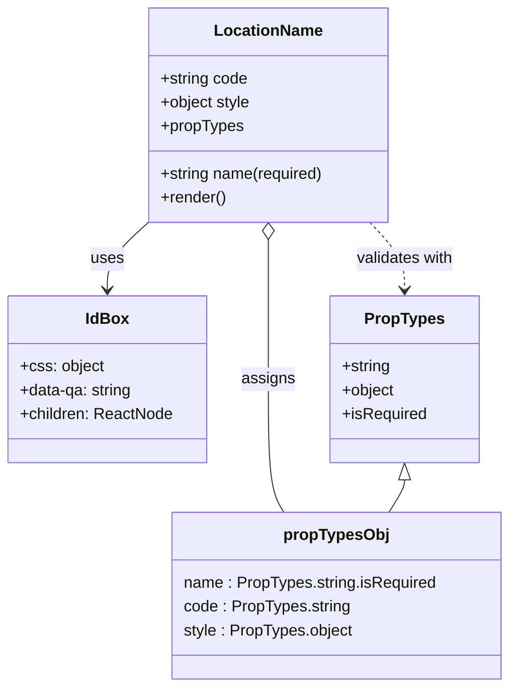

# Diagram: web/portal/src/pages/administration/location-management/components/LocationName.js

> Auto-generated by Obscura crawlers

## Mermaid

### SVG

<svg id="container" width="508.919921875" xmlns="http://www.w3.org/2000/svg" class="classDiagram" height="692" viewBox="0 0 508.919921875 692" role="graphics-document document" aria-roledescription="class"><g><defs><marker id="container_class-aggregationStart" class="marker aggregation class" refX="18" refY="7" markerWidth="190" markerHeight="240" orient="auto"><path d="M 18,7 L9,13 L1,7 L9,1 Z"></path></marker></defs><defs><marker id="container_class-aggregationEnd" class="marker aggregation class" refX="1" refY="7" markerWidth="20" markerHeight="28" orient="auto"><path d="M 18,7 L9,13 L1,7 L9,1 Z"></path></marker></defs><defs><marker id="container_class-extensionStart" class="marker extension class" refX="18" refY="7" markerWidth="190" markerHeight="240" orient="auto"><path d="M 1,7 L18,13 V 1 Z"></path></marker></defs><defs><marker id="container_class-extensionEnd" class="marker extension class" refX="1" refY="7" markerWidth="20" markerHeight="28" orient="auto"><path d="M 1,1 V 13 L18,7 Z"></path></marker></defs><defs><marker id="container_class-compositionStart" class="marker composition class" refX="18" refY="7" markerWidth="190" markerHeight="240" orient="auto"><path d="M 18,7 L9,13 L1,7 L9,1 Z"></path></marker></defs><defs><marker id="container_class-compositionEnd" class="marker composition class" refX="1" refY="7" markerWidth="20" markerHeight="28" orient="auto"><path d="M 18,7 L9,13 L1,7 L9,1 Z"></path></marker></defs><defs><marker id="container_class-dependencyStart" class="marker dependency class" refX="6" refY="7" markerWidth="190" markerHeight="240" orient="auto"><path d="M 5,7 L9,13 L1,7 L9,1 Z"></path></marker></defs><defs><marker id="container_class-dependencyEnd" class="marker dependency class" refX="13" refY="7" markerWidth="20" markerHeight="28" orient="auto"><path d="M 18,7 L9,13 L14,7 L9,1 Z"></path></marker></defs><defs><marker id="container_class-lollipopStart" class="marker lollipop class" refX="13" refY="7" markerWidth="190" markerHeight="240" orient="auto"><circle stroke="black" fill="transparent" cx="7" cy="7" r="6"></circle></marker></defs><defs><marker id="container_class-lollipopEnd" class="marker lollipop class" refX="1" refY="7" markerWidth="190" markerHeight="240" orient="auto"><circle stroke="black" fill="transparent" cx="7" cy="7" r="6"></circle></marker></defs><g class="root"><g class="clusters"></g><g class="edgePaths"><path d="M148.595,224L141.747,230.167C134.899,236.333,121.203,248.667,114.356,260C107.508,271.333,107.508,281.667,107.508,286.833L107.508,292" id="id_LocationName_IdBox_1" class="edge-thickness-normal edge-pattern-solid relation" style=";;;" data-edge="true" data-et="edge" data-id="id_LocationName_IdBox_1" data-points="W3sieCI6MTQ4LjU5NDU1ODE4OTY1NTE3LCJ5IjoyMjR9LHsieCI6MTA3LjUwNzgxMjUsInkiOjI2MX0seyJ4IjoxMDcuNTA3ODEyNSwieSI6Mjk4fV0=" marker-end="url(#container_class-dependencyEnd)"></path><path d="M369.369,224L375.127,230.167C380.885,236.333,392.402,248.667,398.16,260C403.918,271.333,403.918,281.667,403.918,286.833L403.918,292" id="id_LocationName_PropTypes_2" class="edge-thickness-normal edge-pattern-dashed relation" style=";;;" data-edge="true" data-et="edge" data-id="id_LocationName_PropTypes_2" data-points="W3sieCI6MzY5LjM2OTAxOTM5NjU1MTcsInkiOjIyNH0seyJ4Ijo0MDMuOTE3OTY4NzUsInkiOjI2MX0seyJ4Ijo0MDMuOTE3OTY4NzUsInkiOjI5OH1d" marker-end="url(#container_class-dependencyEnd)"></path><path d="M268.523,241.25L268.523,244.542C268.523,247.833,268.523,254.417,268.523,277.875C268.523,301.333,268.523,341.667,268.523,380C268.523,418.333,268.523,454.667,271.111,477C273.699,499.333,278.875,507.667,281.463,511.833L284.05,516" id="id_LocationName_propTypesObj_3" class="edge-thickness-normal edge-pattern-solid relation" style=";;;" data-edge="true" data-et="edge" data-id="id_LocationName_propTypesObj_3" data-points="W3sieCI6MjY4LjUyMzQzNzUsInkiOjIyNH0seyJ4IjoyNjguNTIzNDM3NSwieSI6MjYxfSx7IngiOjI2OC41MjM0Mzc1LCJ5IjozODJ9LHsieCI6MjY4LjUyMzQzNzUsInkiOjQ5MX0seyJ4IjoyODQuMDUwMzMzMjg1NTUwNDQsInkiOjUxNn1d" marker-start="url(#container_class-aggregationStart)"></path><path d="M403.918,483.25L403.918,484.542C403.918,485.833,403.918,488.417,401.33,493.875C398.742,499.333,393.567,507.667,390.979,511.833L388.391,516" id="id_PropTypes_propTypesObj_4" class="edge-thickness-normal edge-pattern-solid relation" style=";;;" data-edge="true" data-et="edge" data-id="id_PropTypes_propTypesObj_4" data-points="W3sieCI6NDAzLjkxNzk2ODc1LCJ5Ijo0NjZ9LHsieCI6NDAzLjkxNzk2ODc1LCJ5Ijo0OTF9LHsieCI6Mzg4LjM5MTA3Mjk2NDQ0OTU2LCJ5Ijo1MTZ9XQ==" marker-start="url(#container_class-extensionStart)"></path></g><g class="edgeLabels"><g class="edgeLabel" transform="translate(107.5078125, 261)"><g class="label" data-id="id_LocationName_IdBox_1" transform="translate(-16.4921875, -12)"><foreignObject width="32.984375" height="24">

uses

</foreignObject></g></g><g class="edgeLabel" transform="translate(403.91796875, 261)"><g class="label" data-id="id_LocationName_PropTypes_2" transform="translate(-50.375, -12)"><foreignObject width="100.75" height="24">

validates with

</foreignObject></g></g><g class="edgeLabel" transform="translate(268.5234375, 382)"><g class="label" data-id="id_LocationName_propTypesObj_3" transform="translate(-26.5078125, -12)"><foreignObject width="53.015625" height="24">

assigns

</foreignObject></g></g><g class="edgeLabel"><g class="label" data-id="id_PropTypes_propTypesObj_4" transform="translate(0, 0)"><foreignObject width="0" height="0">

</foreignObject></g></g></g><g class="nodes"><g class="node default" id="classId-LocationName-0" transform="translate(268.5234375, 116)"><g class="basic label-container"><path d="M-121.37109375 -108 L121.37109375 -108 L121.37109375 108 L-121.37109375 108" stroke="none" stroke-width="0" fill="#ECECFF" style=""></path><path d="M-121.37109375 -108 C-28.385257637637693 -108, 64.60057847472461 -108, 121.37109375 -108 M-121.37109375 -108 C-26.11581279748785 -108, 69.1394681550243 -108, 121.37109375 -108 M121.37109375 -108 C121.37109375 -37.900373363854854, 121.37109375 32.19925327229029, 121.37109375 108 M121.37109375 -108 C121.37109375 -51.01127790099247, 121.37109375 5.977444198015064, 121.37109375 108 M121.37109375 108 C61.32014541820034 108, 1.2691970864006805 108, -121.37109375 108 M121.37109375 108 C39.679995578052356 108, -42.01110259389529 108, -121.37109375 108 M-121.37109375 108 C-121.37109375 22.419728731621305, -121.37109375 -63.16054253675739, -121.37109375 -108 M-121.37109375 108 C-121.37109375 55.972651483401954, -121.37109375 3.945302966803908, -121.37109375 -108" stroke="#9370DB" stroke-width="1.3" fill="none" stroke-dasharray="0 0" style=""></path></g><g class="annotation-group text" transform="translate(0, -84)"></g><g class="label-group text" transform="translate(-52.2109375, -84)"><g class="label" style="font-weight: bolder" transform="translate(0,-12)"><foreignObject width="104.421875" height="24">

LocationName

</foreignObject></g></g><g class="members-group text" transform="translate(-109.37109375, -36)"><g class="label" style="" transform="translate(0,-12)"><foreignObject width="88.828125" height="24">

+string code

</foreignObject></g><g class="label" style="" transform="translate(0,12)"><foreignObject width="92.078125" height="24">

+object style

</foreignObject></g><g class="label" style="" transform="translate(0,36)"><foreignObject width="83.234375" height="24">

+propTypes

</foreignObject></g></g><g class="methods-group text" transform="translate(-109.37109375, 60)"><g class="label" style="" transform="translate(0,-12)"><foreignObject width="166.53125" height="24">

+string name(required)

</foreignObject></g><g class="label" style="" transform="translate(0,12)"><foreignObject width="66.609375" height="24">

+render()

</foreignObject></g></g><g class="divider" style=""><path d="M-121.37109375 -60 C-29.547535067204706 -60, 62.27602361559059 -60, 121.37109375 -60 M-121.37109375 -60 C-36.400634868433954 -60, 48.56982401313209 -60, 121.37109375 -60" stroke="#9370DB" stroke-width="1.3" fill="none" stroke-dasharray="0 0" style=""></path></g><g class="divider" style=""><path d="M-121.37109375 36 C-61.700647719897304 36, -2.030201689794609 36, 121.37109375 36 M-121.37109375 36 C-49.66471533783992 36, 22.041663074320155 36, 121.37109375 36" stroke="#9370DB" stroke-width="1.3" fill="none" stroke-dasharray="0 0" style=""></path></g></g><g class="node default" id="classId-IdBox-1" transform="translate(107.5078125, 382)"><g class="basic label-container"><path d="M-99.5078125 -84 L99.5078125 -84 L99.5078125 84 L-99.5078125 84" stroke="none" stroke-width="0" fill="#ECECFF" style=""></path><path d="M-99.5078125 -84 C-38.65128717391619 -84, 22.205238152167624 -84, 99.5078125 -84 M-99.5078125 -84 C-45.10297712197308 -84, 9.301858256053833 -84, 99.5078125 -84 M99.5078125 -84 C99.5078125 -39.15642039067746, 99.5078125 5.687159218645078, 99.5078125 84 M99.5078125 -84 C99.5078125 -22.970363717524357, 99.5078125 38.059272564951286, 99.5078125 84 M99.5078125 84 C31.488558961226616 84, -36.53069457754677 84, -99.5078125 84 M99.5078125 84 C59.152156990048354 84, 18.79650148009671 84, -99.5078125 84 M-99.5078125 84 C-99.5078125 46.288457951282744, -99.5078125 8.576915902565489, -99.5078125 -84 M-99.5078125 84 C-99.5078125 34.6585877396275, -99.5078125 -14.682824520745001, -99.5078125 -84" stroke="#9370DB" stroke-width="1.3" fill="none" stroke-dasharray="0 0" style=""></path></g><g class="annotation-group text" transform="translate(0, -60)"></g><g class="label-group text" transform="translate(-20.75, -60)"><g class="label" style="font-weight: bolder" transform="translate(0,-12)"><foreignObject width="41.5" height="24">

IdBox

</foreignObject></g></g><g class="members-group text" transform="translate(-87.5078125, -12)"><g class="label" style="" transform="translate(0,-12)"><foreignObject width="83.96875" height="24">

+css: object

</foreignObject></g><g class="label" style="" transform="translate(0,12)"><foreignObject width="114.90625" height="24">

+data-qa: string

</foreignObject></g><g class="label" style="" transform="translate(0,36)"><foreignObject width="154.265625" height="24">

+children: ReactNode

</foreignObject></g></g><g class="methods-group text" transform="translate(-87.5078125, 84)"></g><g class="divider" style=""><path d="M-99.5078125 -36 C-32.46866269944836 -36, 34.57048710110328 -36, 99.5078125 -36 M-99.5078125 -36 C-34.81889400496951 -36, 29.870024490060985 -36, 99.5078125 -36" stroke="#9370DB" stroke-width="1.3" fill="none" stroke-dasharray="0 0" style=""></path></g><g class="divider" style=""><path d="M-99.5078125 60 C-22.639288232288663 60, 54.22923603542267 60, 99.5078125 60 M-99.5078125 60 C-57.80283154914604 60, -16.097850598292084 60, 99.5078125 60" stroke="#9370DB" stroke-width="1.3" fill="none" stroke-dasharray="0 0" style=""></path></g></g><g class="node default" id="classId-PropTypes-2" transform="translate(403.91796875, 382)"><g class="basic label-container"><path d="M-73.88671875 -84 L73.88671875 -84 L73.88671875 84 L-73.88671875 84" stroke="none" stroke-width="0" fill="#ECECFF" style=""></path><path d="M-73.88671875 -84 C-18.43964990774576 -84, 37.00741893450848 -84, 73.88671875 -84 M-73.88671875 -84 C-20.264181579039537 -84, 33.358355591920926 -84, 73.88671875 -84 M73.88671875 -84 C73.88671875 -17.833786227420816, 73.88671875 48.33242754515837, 73.88671875 84 M73.88671875 -84 C73.88671875 -45.3833246329583, 73.88671875 -6.766649265916598, 73.88671875 84 M73.88671875 84 C41.2635684306756 84, 8.640418111351195 84, -73.88671875 84 M73.88671875 84 C25.087227492179004 84, -23.712263765641993 84, -73.88671875 84 M-73.88671875 84 C-73.88671875 41.644183721288734, -73.88671875 -0.7116325574225328, -73.88671875 -84 M-73.88671875 84 C-73.88671875 23.49770950158021, -73.88671875 -37.00458099683958, -73.88671875 -84" stroke="#9370DB" stroke-width="1.3" fill="none" stroke-dasharray="0 0" style=""></path></g><g class="annotation-group text" transform="translate(0, -60)"></g><g class="label-group text" transform="translate(-38.2578125, -60)"><g class="label" style="font-weight: bolder" transform="translate(0,-12)"><foreignObject width="76.515625" height="24">

PropTypes

</foreignObject></g></g><g class="members-group text" transform="translate(-61.88671875, -12)"><g class="label" style="" transform="translate(0,-12)"><foreignObject width="49.625" height="24">

+string

</foreignObject></g><g class="label" style="" transform="translate(0,12)"><foreignObject width="53.46875" height="24">

+object

</foreignObject></g><g class="label" style="" transform="translate(0,36)"><foreignObject width="85.515625" height="24">

+isRequired

</foreignObject></g></g><g class="methods-group text" transform="translate(-61.88671875, 84)"></g><g class="divider" style=""><path d="M-73.88671875 -36 C-34.483632947657355 -36, 4.919452854685289 -36, 73.88671875 -36 M-73.88671875 -36 C-17.881567738178845 -36, 38.12358327364231 -36, 73.88671875 -36" stroke="#9370DB" stroke-width="1.3" fill="none" stroke-dasharray="0 0" style=""></path></g><g class="divider" style=""><path d="M-73.88671875 60 C-25.71806364381949 60, 22.450591462361018 60, 73.88671875 60 M-73.88671875 60 C-38.153838752200954 60, -2.4209587544019087 60, 73.88671875 60" stroke="#9370DB" stroke-width="1.3" fill="none" stroke-dasharray="0 0" style=""></path></g></g><g class="node default" id="classId-propTypesObj-3" transform="translate(336.220703125, 600)"><g class="basic label-container"><path d="M-164.69921875 -84 L164.69921875 -84 L164.69921875 84 L-164.69921875 84" stroke="none" stroke-width="0" fill="#ECECFF" style=""></path><path d="M-164.69921875 -84 C-67.37217885170209 -84, 29.954861046595823 -84, 164.69921875 -84 M-164.69921875 -84 C-37.460548270930104 -84, 89.77812220813979 -84, 164.69921875 -84 M164.69921875 -84 C164.69921875 -19.135702088107834, 164.69921875 45.72859582378433, 164.69921875 84 M164.69921875 -84 C164.69921875 -46.91159030326097, 164.69921875 -9.823180606521944, 164.69921875 84 M164.69921875 84 C63.66620431291639 84, -37.366810124167216 84, -164.69921875 84 M164.69921875 84 C82.48204624275708 84, 0.2648737355141577 84, -164.69921875 84 M-164.69921875 84 C-164.69921875 22.14965189796869, -164.69921875 -39.70069620406262, -164.69921875 -84 M-164.69921875 84 C-164.69921875 20.401814795430873, -164.69921875 -43.196370409138254, -164.69921875 -84" stroke="#9370DB" stroke-width="1.3" fill="none" stroke-dasharray="0 0" style=""></path></g><g class="annotation-group text" transform="translate(0, -60)"></g><g class="label-group text" transform="translate(-50.9453125, -60)"><g class="label" style="font-weight: bolder" transform="translate(0,-12)"><foreignObject width="101.890625" height="24">

propTypesObj

</foreignObject></g></g><g class="members-group text" transform="translate(-152.69921875, -12)"><g class="label" style="" transform="translate(0,-12)"><foreignObject width="254.453125" height="24">

name : PropTypes.string.isRequired

</foreignObject></g><g class="label" style="" transform="translate(0,12)"><foreignObject width="167.546875" height="24">

code : PropTypes.string

</foreignObject></g><g class="label" style="" transform="translate(0,36)"><foreignObject width="170.5625" height="24">

style : PropTypes.object

</foreignObject></g></g><g class="methods-group text" transform="translate(-152.69921875, 84)"></g><g class="divider" style=""><path d="M-164.69921875 -36 C-54.92356767094262 -36, 54.852083408114765 -36, 164.69921875 -36 M-164.69921875 -36 C-58.569173878296155 -36, 47.56087099340769 -36, 164.69921875 -36" stroke="#9370DB" stroke-width="1.3" fill="none" stroke-dasharray="0 0" style=""></path></g><g class="divider" style=""><path d="M-164.69921875 60 C-79.86745175776572 60, 4.9643152344685575 60, 164.69921875 60 M-164.69921875 60 C-33.09631693396204 60, 98.50658488207591 60, 164.69921875 60" stroke="#9370DB" stroke-width="1.3" fill="none" stroke-dasharray="0 0" style=""></path></g></g></g></g></g></svg>
