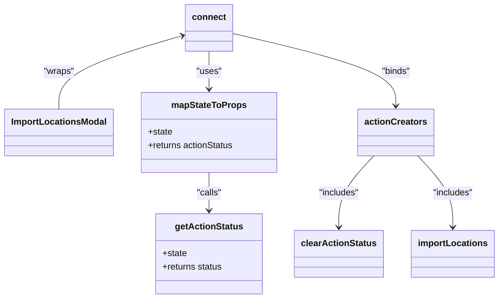

# Diagram: web/portal/src/pages/administration/location-management/components/modals/ImportLocationsModal.container.js

> Auto-generated by Obscura crawlers

## Mermaid

### SVG

<svg id="container" width="878.150390625" xmlns="http://www.w3.org/2000/svg" class="classDiagram" height="536" viewBox="0 0 878.150390625 536" role="graphics-document document" aria-roledescription="class"><g><defs><marker id="container_class-aggregationStart" class="marker aggregation class" refX="18" refY="7" markerWidth="190" markerHeight="240" orient="auto"><path d="M 18,7 L9,13 L1,7 L9,1 Z"></path></marker></defs><defs><marker id="container_class-aggregationEnd" class="marker aggregation class" refX="1" refY="7" markerWidth="20" markerHeight="28" orient="auto"><path d="M 18,7 L9,13 L1,7 L9,1 Z"></path></marker></defs><defs><marker id="container_class-extensionStart" class="marker extension class" refX="18" refY="7" markerWidth="190" markerHeight="240" orient="auto"><path d="M 1,7 L18,13 V 1 Z"></path></marker></defs><defs><marker id="container_class-extensionEnd" class="marker extension class" refX="1" refY="7" markerWidth="20" markerHeight="28" orient="auto"><path d="M 1,1 V 13 L18,7 Z"></path></marker></defs><defs><marker id="container_class-compositionStart" class="marker composition class" refX="18" refY="7" markerWidth="190" markerHeight="240" orient="auto"><path d="M 18,7 L9,13 L1,7 L9,1 Z"></path></marker></defs><defs><marker id="container_class-compositionEnd" class="marker composition class" refX="1" refY="7" markerWidth="20" markerHeight="28" orient="auto"><path d="M 18,7 L9,13 L1,7 L9,1 Z"></path></marker></defs><defs><marker id="container_class-dependencyStart" class="marker dependency class" refX="6" refY="7" markerWidth="190" markerHeight="240" orient="auto"><path d="M 5,7 L9,13 L1,7 L9,1 Z"></path></marker></defs><defs><marker id="container_class-dependencyEnd" class="marker dependency class" refX="13" refY="7" markerWidth="20" markerHeight="28" orient="auto"><path d="M 18,7 L9,13 L14,7 L9,1 Z"></path></marker></defs><defs><marker id="container_class-lollipopStart" class="marker lollipop class" refX="13" refY="7" markerWidth="190" markerHeight="240" orient="auto"><circle stroke="black" fill="transparent" cx="7" cy="7" r="6"></circle></marker></defs><defs><marker id="container_class-lollipopEnd" class="marker lollipop class" refX="1" refY="7" markerWidth="190" markerHeight="240" orient="auto"><circle stroke="black" fill="transparent" cx="7" cy="7" r="6"></circle></marker></defs><g class="root"><g class="clusters"></g><g class="edgePaths"><path d="M322.571,63.821L285.893,74.685C249.214,85.548,175.857,107.274,139.179,129.304C102.5,151.333,102.5,173.667,102.5,184.833L102.5,196" id="id_connect_ImportLocationsModal_1" class="edge-thickness-normal edge-pattern-solid relation" style=";;;" data-edge="true" data-et="edge" data-id="id_connect_ImportLocationsModal_1" data-points="W3sieCI6MzI4LjMyNDIxODc1LCJ5Ijo2Mi4xMTc1MzY3OTQzMTc5M30seyJ4IjoxMDIuNSwieSI6MTI5fSx7IngiOjEwMi41LCJ5IjoxOTZ9XQ==" marker-start="url(#container_class-dependencyStart)"></path><path d="M369.238,92L369.238,98.167C369.238,104.333,369.238,116.667,369.238,128C369.238,139.333,369.238,149.667,369.238,154.833L369.238,160" id="id_connect_mapStateToProps_2" class="edge-thickness-normal edge-pattern-solid relation" style=";;;" data-edge="true" data-et="edge" data-id="id_connect_mapStateToProps_2" data-points="W3sieCI6MzY5LjIzODI4MTI1LCJ5Ijo5Mn0seyJ4IjozNjkuMjM4MjgxMjUsInkiOjEyOX0seyJ4IjozNjkuMjM4MjgxMjUsInkiOjE2Nn1d" marker-end="url(#container_class-dependencyEnd)"></path><path d="M410.152,59.807L458.263,71.339C506.373,82.871,602.594,105.936,650.704,127.635C698.814,149.333,698.814,169.667,698.814,179.833L698.814,190" id="id_connect_actionCreators_3" class="edge-thickness-normal edge-pattern-solid relation" style=";;;" data-edge="true" data-et="edge" data-id="id_connect_actionCreators_3" data-points="W3sieCI6NDEwLjE1MjM0Mzc1LCJ5Ijo1OS44MDcxNzQyMjM1MjMzNX0seyJ4Ijo2OTguODE0NDUzMTI1LCJ5IjoxMjl9LHsieCI6Njk4LjgxNDQ1MzEyNSwieSI6MTk2fV0=" marker-end="url(#container_class-dependencyEnd)"></path><path d="M369.238,310L369.238,316.167C369.238,322.333,369.238,334.667,369.238,346C369.238,357.333,369.238,367.667,369.238,372.833L369.238,378" id="id_mapStateToProps_getActionStatus_4" class="edge-thickness-normal edge-pattern-solid relation" style=";;;" data-edge="true" data-et="edge" data-id="id_mapStateToProps_getActionStatus_4" data-points="W3sieCI6MzY5LjIzODI4MTI1LCJ5IjozMTB9LHsieCI6MzY5LjIzODI4MTI1LCJ5IjozNDd9LHsieCI6MzY5LjIzODI4MTI1LCJ5IjozODR9XQ==" marker-end="url(#container_class-dependencyEnd)"></path><path d="M660.526,280L650.346,291.167C640.167,302.333,619.807,324.667,609.627,346C599.447,367.333,599.447,387.667,599.447,397.833L599.447,408" id="id_actionCreators_clearActionStatus_5" class="edge-thickness-normal edge-pattern-solid relation" style=";;;" data-edge="true" data-et="edge" data-id="id_actionCreators_clearActionStatus_5" data-points="W3sieCI6NjYwLjUyNjE3OTA0MjQzMTIsInkiOjI4MH0seyJ4Ijo1OTkuNDQ3MjY1NjI1LCJ5IjozNDd9LHsieCI6NTk5LjQ0NzI2NTYyNSwieSI6NDE0fV0=" marker-end="url(#container_class-dependencyEnd)"></path><path d="M737.103,280L747.283,291.167C757.462,302.333,777.822,324.667,788.002,346C798.182,367.333,798.182,387.667,798.182,397.833L798.182,408" id="id_actionCreators_importLocations_6" class="edge-thickness-normal edge-pattern-solid relation" style=";;;" data-edge="true" data-et="edge" data-id="id_actionCreators_importLocations_6" data-points="W3sieCI6NzM3LjEwMjcyNzIwNzU2ODgsInkiOjI4MH0seyJ4Ijo3OTguMTgxNjQwNjI1LCJ5IjozNDd9LHsieCI6Nzk4LjE4MTY0MDYyNSwieSI6NDE0fV0=" marker-end="url(#container_class-dependencyEnd)"></path></g><g class="edgeLabels"><g class="edgeLabel" transform="translate(102.5, 129)"><g class="label" data-id="id_connect_ImportLocationsModal_1" transform="translate(-27.6484375, -12)"><foreignObject width="55.296875" height="24">

"wraps"

</foreignObject></g></g><g class="edgeLabel" transform="translate(369.23828125, 129)"><g class="label" data-id="id_connect_mapStateToProps_2" transform="translate(-22.7578125, -12)"><foreignObject width="45.515625" height="24">

"uses"

</foreignObject></g></g><g class="edgeLabel" transform="translate(698.814453125, 129)"><g class="label" data-id="id_connect_actionCreators_3" transform="translate(-26.484375, -12)"><foreignObject width="52.96875" height="24">

"binds"

</foreignObject></g></g><g class="edgeLabel" transform="translate(369.23828125, 347)"><g class="label" data-id="id_mapStateToProps_getActionStatus_4" transform="translate(-22.625, -12)"><foreignObject width="45.25" height="24">

"calls"

</foreignObject></g></g><g class="edgeLabel" transform="translate(599.447265625, 347)"><g class="label" data-id="id_actionCreators_clearActionStatus_5" transform="translate(-36.9140625, -12)"><foreignObject width="73.828125" height="24">

"includes"

</foreignObject></g></g><g class="edgeLabel" transform="translate(798.181640625, 347)"><g class="label" data-id="id_actionCreators_importLocations_6" transform="translate(-36.9140625, -12)"><foreignObject width="73.828125" height="24">

"includes"

</foreignObject></g></g></g><g class="nodes"><g class="node default" id="classId-ImportLocationsModal-0" transform="translate(102.5, 238)"><g class="basic label-container"><path d="M-94.5 -42 L94.5 -42 L94.5 42 L-94.5 42" stroke="none" stroke-width="0" fill="#ECECFF" style=""></path><path d="M-94.5 -42 C-25.594437245958048 -42, 43.311125508083904 -42, 94.5 -42 M-94.5 -42 C-28.920689145855178 -42, 36.658621708289644 -42, 94.5 -42 M94.5 -42 C94.5 -17.319868678365523, 94.5 7.360262643268953, 94.5 42 M94.5 -42 C94.5 -9.578498343397456, 94.5 22.843003313205088, 94.5 42 M94.5 42 C34.18026312383816 42, -26.13947375232368 42, -94.5 42 M94.5 42 C21.592440803324322 42, -51.315118393351355 42, -94.5 42 M-94.5 42 C-94.5 13.115224984994374, -94.5 -15.769550030011253, -94.5 -42 M-94.5 42 C-94.5 17.720111450432146, -94.5 -6.559777099135708, -94.5 -42" stroke="#9370DB" stroke-width="1.3" fill="none" stroke-dasharray="0 0" style=""></path></g><g class="annotation-group text" transform="translate(0, -18)"></g><g class="label-group text" transform="translate(-82.5, -18)"><g class="label" style="font-weight: bolder" transform="translate(0,-12)"><foreignObject width="165" height="24">

ImportLocationsModal

</foreignObject></g></g><g class="members-group text" transform="translate(-82.5, 30)"></g><g class="methods-group text" transform="translate(-82.5, 60)"></g><g class="divider" style=""><path d="M-94.5 6 C-34.36143832245396 6, 25.777123355092087 6, 94.5 6 M-94.5 6 C-51.320486366417946 6, -8.140972732835891 6, 94.5 6" stroke="#9370DB" stroke-width="1.3" fill="none" stroke-dasharray="0 0" style=""></path></g><g class="divider" style=""><path d="M-94.5 24 C-25.66899922342074 24, 43.16200155315852 24, 94.5 24 M-94.5 24 C-30.29183515760647 24, 33.91632968478706 24, 94.5 24" stroke="#9370DB" stroke-width="1.3" fill="none" stroke-dasharray="0 0" style=""></path></g></g><g class="node default" id="classId-connect-1" transform="translate(369.23828125, 50)"><g class="basic label-container"><path d="M-40.9140625 -42 L40.9140625 -42 L40.9140625 42 L-40.9140625 42" stroke="none" stroke-width="0" fill="#ECECFF" style=""></path><path d="M-40.9140625 -42 C-9.551734311046417 -42, 21.810593877907166 -42, 40.9140625 -42 M-40.9140625 -42 C-14.46583308536701 -42, 11.982396329265981 -42, 40.9140625 -42 M40.9140625 -42 C40.9140625 -13.895027708287206, 40.9140625 14.209944583425589, 40.9140625 42 M40.9140625 -42 C40.9140625 -19.368741307628856, 40.9140625 3.2625173847422886, 40.9140625 42 M40.9140625 42 C9.905101220362425 42, -21.10386005927515 42, -40.9140625 42 M40.9140625 42 C12.659330565959035 42, -15.59540136808193 42, -40.9140625 42 M-40.9140625 42 C-40.9140625 21.094140415430914, -40.9140625 0.188280830861828, -40.9140625 -42 M-40.9140625 42 C-40.9140625 17.314550037426248, -40.9140625 -7.370899925147505, -40.9140625 -42" stroke="#9370DB" stroke-width="1.3" fill="none" stroke-dasharray="0 0" style=""></path></g><g class="annotation-group text" transform="translate(0, -18)"></g><g class="label-group text" transform="translate(-28.9140625, -18)"><g class="label" style="font-weight: bolder" transform="translate(0,-12)"><foreignObject width="57.828125" height="24">

connect

</foreignObject></g></g><g class="members-group text" transform="translate(-28.9140625, 30)"></g><g class="methods-group text" transform="translate(-28.9140625, 60)"></g><g class="divider" style=""><path d="M-40.9140625 6 C-14.67685711837711 6, 11.560348263245778 6, 40.9140625 6 M-40.9140625 6 C-23.68103992096662 6, -6.448017341933237 6, 40.9140625 6" stroke="#9370DB" stroke-width="1.3" fill="none" stroke-dasharray="0 0" style=""></path></g><g class="divider" style=""><path d="M-40.9140625 24 C-13.206869618394503 24, 14.500323263210994 24, 40.9140625 24 M-40.9140625 24 C-21.922972867158144 24, -2.931883234316288 24, 40.9140625 24" stroke="#9370DB" stroke-width="1.3" fill="none" stroke-dasharray="0 0" style=""></path></g></g><g class="node default" id="classId-mapStateToProps-2" transform="translate(369.23828125, 238)"><g class="basic label-container"><path d="M-122.23828125 -72 L122.23828125 -72 L122.23828125 72 L-122.23828125 72" stroke="none" stroke-width="0" fill="#ECECFF" style=""></path><path d="M-122.23828125 -72 C-34.960985326561 -72, 52.316310596878 -72, 122.23828125 -72 M-122.23828125 -72 C-53.2452956157521 -72, 15.747690018495803 -72, 122.23828125 -72 M122.23828125 -72 C122.23828125 -24.360535249362307, 122.23828125 23.278929501275385, 122.23828125 72 M122.23828125 -72 C122.23828125 -37.885121960765915, 122.23828125 -3.7702439215318293, 122.23828125 72 M122.23828125 72 C64.00332152745179 72, 5.768361804903577 72, -122.23828125 72 M122.23828125 72 C53.40551807208928 72, -15.427245105821441 72, -122.23828125 72 M-122.23828125 72 C-122.23828125 18.607382676533845, -122.23828125 -34.78523464693231, -122.23828125 -72 M-122.23828125 72 C-122.23828125 42.1960332919868, -122.23828125 12.392066583973602, -122.23828125 -72" stroke="#9370DB" stroke-width="1.3" fill="none" stroke-dasharray="0 0" style=""></path></g><g class="annotation-group text" transform="translate(0, -48)"></g><g class="label-group text" transform="translate(-64.7109375, -48)"><g class="label" style="font-weight: bolder" transform="translate(0,-12)"><foreignObject width="129.421875" height="24">

mapStateToProps

</foreignObject></g></g><g class="members-group text" transform="translate(-110.23828125, 0)"><g class="label" style="" transform="translate(0,-12)"><foreignObject width="44.09375" height="24">

+state

</foreignObject></g><g class="label" style="" transform="translate(0,12)"><foreignObject width="155.765625" height="24">

+returns actionStatus

</foreignObject></g></g><g class="methods-group text" transform="translate(-110.23828125, 72)"></g><g class="divider" style=""><path d="M-122.23828125 -24 C-51.477416808850904 -24, 19.28344763229819 -24, 122.23828125 -24 M-122.23828125 -24 C-31.967860238122313 -24, 58.302560773755374 -24, 122.23828125 -24" stroke="#9370DB" stroke-width="1.3" fill="none" stroke-dasharray="0 0" style=""></path></g><g class="divider" style=""><path d="M-122.23828125 48 C-70.89304879230171 48, -19.547816334603425 48, 122.23828125 48 M-122.23828125 48 C-41.20604937366991 48, 39.826182502660174 48, 122.23828125 48" stroke="#9370DB" stroke-width="1.3" fill="none" stroke-dasharray="0 0" style=""></path></g></g><g class="node default" id="classId-actionCreators-3" transform="translate(698.814453125, 238)"><g class="basic label-container"><path d="M-65.6328125 -42 L65.6328125 -42 L65.6328125 42 L-65.6328125 42" stroke="none" stroke-width="0" fill="#ECECFF" style=""></path><path d="M-65.6328125 -42 C-25.13051759963887 -42, 15.371777300722258 -42, 65.6328125 -42 M-65.6328125 -42 C-24.730479529595428 -42, 16.171853440809144 -42, 65.6328125 -42 M65.6328125 -42 C65.6328125 -19.855014953474104, 65.6328125 2.2899700930517923, 65.6328125 42 M65.6328125 -42 C65.6328125 -21.169246784754545, 65.6328125 -0.33849356950909026, 65.6328125 42 M65.6328125 42 C20.873625163122483 42, -23.885562173755034 42, -65.6328125 42 M65.6328125 42 C20.381382561003356 42, -24.870047377993288 42, -65.6328125 42 M-65.6328125 42 C-65.6328125 15.936459170245094, -65.6328125 -10.127081659509813, -65.6328125 -42 M-65.6328125 42 C-65.6328125 10.479395077270947, -65.6328125 -21.041209845458106, -65.6328125 -42" stroke="#9370DB" stroke-width="1.3" fill="none" stroke-dasharray="0 0" style=""></path></g><g class="annotation-group text" transform="translate(0, -18)"></g><g class="label-group text" transform="translate(-53.6328125, -18)"><g class="label" style="font-weight: bolder" transform="translate(0,-12)"><foreignObject width="107.265625" height="24">

actionCreators

</foreignObject></g></g><g class="members-group text" transform="translate(-53.6328125, 30)"></g><g class="methods-group text" transform="translate(-53.6328125, 60)"></g><g class="divider" style=""><path d="M-65.6328125 6 C-30.167607755876936 6, 5.297596988246127 6, 65.6328125 6 M-65.6328125 6 C-29.865461410305592 6, 5.901889679388816 6, 65.6328125 6" stroke="#9370DB" stroke-width="1.3" fill="none" stroke-dasharray="0 0" style=""></path></g><g class="divider" style=""><path d="M-65.6328125 24 C-39.18926964674459 24, -12.745726793489176 24, 65.6328125 24 M-65.6328125 24 C-30.993746673341917 24, 3.6453191533161657 24, 65.6328125 24" stroke="#9370DB" stroke-width="1.3" fill="none" stroke-dasharray="0 0" style=""></path></g></g><g class="node default" id="classId-getActionStatus-4" transform="translate(369.23828125, 456)"><g class="basic label-container"><path d="M-95.78125 -72 L95.78125 -72 L95.78125 72 L-95.78125 72" stroke="none" stroke-width="0" fill="#ECECFF" style=""></path><path d="M-95.78125 -72 C-48.69960597771487 -72, -1.6179619554297346 -72, 95.78125 -72 M-95.78125 -72 C-25.37696608558126 -72, 45.02731782883748 -72, 95.78125 -72 M95.78125 -72 C95.78125 -40.13939148384822, 95.78125 -8.278782967696444, 95.78125 72 M95.78125 -72 C95.78125 -18.360736207523473, 95.78125 35.27852758495305, 95.78125 72 M95.78125 72 C46.540145331985144 72, -2.7009593360297117 72, -95.78125 72 M95.78125 72 C28.78847994341264 72, -38.20429011317472 72, -95.78125 72 M-95.78125 72 C-95.78125 33.65847220022341, -95.78125 -4.683055599553185, -95.78125 -72 M-95.78125 72 C-95.78125 19.914620081506428, -95.78125 -32.170759836987145, -95.78125 -72" stroke="#9370DB" stroke-width="1.3" fill="none" stroke-dasharray="0 0" style=""></path></g><g class="annotation-group text" transform="translate(0, -48)"></g><g class="label-group text" transform="translate(-58.40625, -48)"><g class="label" style="font-weight: bolder" transform="translate(0,-12)"><foreignObject width="116.8125" height="24">

getActionStatus

</foreignObject></g></g><g class="members-group text" transform="translate(-83.78125, 0)"><g class="label" style="" transform="translate(0,-12)"><foreignObject width="44.09375" height="24">

+state

</foreignObject></g><g class="label" style="" transform="translate(0,12)"><foreignObject width="109.15625" height="24">

+returns status

</foreignObject></g></g><g class="methods-group text" transform="translate(-83.78125, 72)"></g><g class="divider" style=""><path d="M-95.78125 -24 C-44.88766695840645 -24, 6.005916083187103 -24, 95.78125 -24 M-95.78125 -24 C-51.54280048197487 -24, -7.304350963949744 -24, 95.78125 -24" stroke="#9370DB" stroke-width="1.3" fill="none" stroke-dasharray="0 0" style=""></path></g><g class="divider" style=""><path d="M-95.78125 48 C-47.369526960456724 48, 1.0421960790865512 48, 95.78125 48 M-95.78125 48 C-40.986561127129384 48, 13.808127745741231 48, 95.78125 48" stroke="#9370DB" stroke-width="1.3" fill="none" stroke-dasharray="0 0" style=""></path></g></g><g class="node default" id="classId-clearActionStatus-5" transform="translate(599.447265625, 456)"><g class="basic label-container"><path d="M-76.765625 -42 L76.765625 -42 L76.765625 42 L-76.765625 42" stroke="none" stroke-width="0" fill="#ECECFF" style=""></path><path d="M-76.765625 -42 C-37.35601208654369 -42, 2.0536008269126143 -42, 76.765625 -42 M-76.765625 -42 C-36.623467820375375 -42, 3.518689359249251 -42, 76.765625 -42 M76.765625 -42 C76.765625 -18.447976236584495, 76.765625 5.10404752683101, 76.765625 42 M76.765625 -42 C76.765625 -25.097245612340405, 76.765625 -8.19449122468081, 76.765625 42 M76.765625 42 C34.331587976607494 42, -8.102449046785011 42, -76.765625 42 M76.765625 42 C43.848089404129645 42, 10.93055380825929 42, -76.765625 42 M-76.765625 42 C-76.765625 8.950194954485106, -76.765625 -24.09961009102979, -76.765625 -42 M-76.765625 42 C-76.765625 13.076587007699533, -76.765625 -15.846825984600933, -76.765625 -42" stroke="#9370DB" stroke-width="1.3" fill="none" stroke-dasharray="0 0" style=""></path></g><g class="annotation-group text" transform="translate(0, -18)"></g><g class="label-group text" transform="translate(-64.765625, -18)"><g class="label" style="font-weight: bolder" transform="translate(0,-12)"><foreignObject width="129.53125" height="24">

clearActionStatus

</foreignObject></g></g><g class="members-group text" transform="translate(-64.765625, 30)"></g><g class="methods-group text" transform="translate(-64.765625, 60)"></g><g class="divider" style=""><path d="M-76.765625 6 C-21.68095430032183 6, 33.40371639935634 6, 76.765625 6 M-76.765625 6 C-20.505159676272072 6, 35.755305647455856 6, 76.765625 6" stroke="#9370DB" stroke-width="1.3" fill="none" stroke-dasharray="0 0" style=""></path></g><g class="divider" style=""><path d="M-76.765625 24 C-30.849449212059888 24, 15.066726575880224 24, 76.765625 24 M-76.765625 24 C-25.080931236439895 24, 26.60376252712021 24, 76.765625 24" stroke="#9370DB" stroke-width="1.3" fill="none" stroke-dasharray="0 0" style=""></path></g></g><g class="node default" id="classId-importLocations-6" transform="translate(798.181640625, 456)"><g class="basic label-container"><path d="M-71.96875 -42 L71.96875 -42 L71.96875 42 L-71.96875 42" stroke="none" stroke-width="0" fill="#ECECFF" style=""></path><path d="M-71.96875 -42 C-18.41097835191561 -42, 35.14679329616878 -42, 71.96875 -42 M-71.96875 -42 C-31.55208956827947 -42, 8.86457086344106 -42, 71.96875 -42 M71.96875 -42 C71.96875 -16.147309738218198, 71.96875 9.705380523563605, 71.96875 42 M71.96875 -42 C71.96875 -19.83426710357399, 71.96875 2.331465792852022, 71.96875 42 M71.96875 42 C42.73455952715062 42, 13.500369054301252 42, -71.96875 42 M71.96875 42 C17.462549452450773 42, -37.043651095098454 42, -71.96875 42 M-71.96875 42 C-71.96875 8.681028181350186, -71.96875 -24.637943637299628, -71.96875 -42 M-71.96875 42 C-71.96875 9.84729674598782, -71.96875 -22.30540650802436, -71.96875 -42" stroke="#9370DB" stroke-width="1.3" fill="none" stroke-dasharray="0 0" style=""></path></g><g class="annotation-group text" transform="translate(0, -18)"></g><g class="label-group text" transform="translate(-59.96875, -18)"><g class="label" style="font-weight: bolder" transform="translate(0,-12)"><foreignObject width="119.9375" height="24">

importLocations

</foreignObject></g></g><g class="members-group text" transform="translate(-59.96875, 30)"></g><g class="methods-group text" transform="translate(-59.96875, 60)"></g><g class="divider" style=""><path d="M-71.96875 6 C-31.01288639484396 6, 9.94297721031208 6, 71.96875 6 M-71.96875 6 C-23.172241844504185 6, 25.62426631099163 6, 71.96875 6" stroke="#9370DB" stroke-width="1.3" fill="none" stroke-dasharray="0 0" style=""></path></g><g class="divider" style=""><path d="M-71.96875 24 C-23.16500404739285 24, 25.638741905214303 24, 71.96875 24 M-71.96875 24 C-38.499658258807955 24, -5.03056651761591 24, 71.96875 24" stroke="#9370DB" stroke-width="1.3" fill="none" stroke-dasharray="0 0" style=""></path></g></g></g></g></g></svg>
