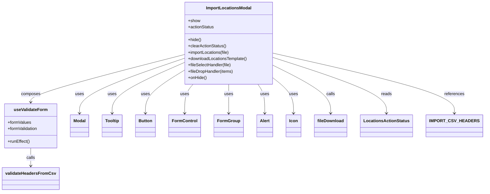
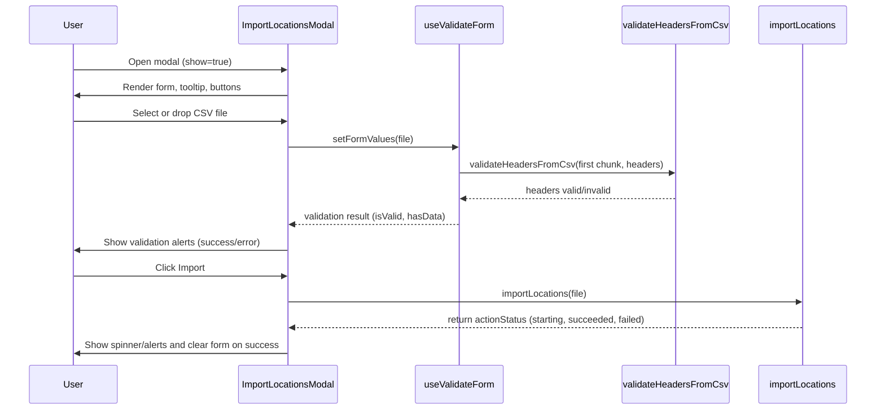

# Diagram: web/portal/src/pages/administration/location-management/components/modals/ImportLocationsModal.js

> Auto-generated by Obscura crawlers

## Diagram 1

### SVG

<svg id="container" width="1765.14453125" xmlns="http://www.w3.org/2000/svg" class="classDiagram" height="728" viewBox="0 0 1765.14453125 728" role="graphics-document document" aria-roledescription="class"><g><defs><marker id="container_class-aggregationStart" class="marker aggregation class" refX="18" refY="7" markerWidth="190" markerHeight="240" orient="auto"><path d="M 18,7 L9,13 L1,7 L9,1 Z"></path></marker></defs><defs><marker id="container_class-aggregationEnd" class="marker aggregation class" refX="1" refY="7" markerWidth="20" markerHeight="28" orient="auto"><path d="M 18,7 L9,13 L1,7 L9,1 Z"></path></marker></defs><defs><marker id="container_class-extensionStart" class="marker extension class" refX="18" refY="7" markerWidth="190" markerHeight="240" orient="auto"><path d="M 1,7 L18,13 V 1 Z"></path></marker></defs><defs><marker id="container_class-extensionEnd" class="marker extension class" refX="1" refY="7" markerWidth="20" markerHeight="28" orient="auto"><path d="M 1,1 V 13 L18,7 Z"></path></marker></defs><defs><marker id="container_class-compositionStart" class="marker composition class" refX="18" refY="7" markerWidth="190" markerHeight="240" orient="auto"><path d="M 18,7 L9,13 L1,7 L9,1 Z"></path></marker></defs><defs><marker id="container_class-compositionEnd" class="marker composition class" refX="1" refY="7" markerWidth="20" markerHeight="28" orient="auto"><path d="M 18,7 L9,13 L1,7 L9,1 Z"></path></marker></defs><defs><marker id="container_class-dependencyStart" class="marker dependency class" refX="6" refY="7" markerWidth="190" markerHeight="240" orient="auto"><path d="M 5,7 L9,13 L1,7 L9,1 Z"></path></marker></defs><defs><marker id="container_class-dependencyEnd" class="marker dependency class" refX="13" refY="7" markerWidth="20" markerHeight="28" orient="auto"><path d="M 18,7 L9,13 L14,7 L9,1 Z"></path></marker></defs><defs><marker id="container_class-lollipopStart" class="marker lollipop class" refX="13" refY="7" markerWidth="190" markerHeight="240" orient="auto"><circle stroke="black" fill="transparent" cx="7" cy="7" r="6"></circle></marker></defs><defs><marker id="container_class-lollipopEnd" class="marker lollipop class" refX="1" refY="7" markerWidth="190" markerHeight="240" orient="auto"><circle stroke="black" fill="transparent" cx="7" cy="7" r="6"></circle></marker></defs><g class="root"><g class="clusters"></g><g class="edgePaths"><path d="M678.207,222.438L614.276,244.865C550.345,267.292,422.483,312.146,358.552,346.74C294.621,381.333,294.621,405.667,294.621,417.833L294.621,430" id="id_ImportLocationsModal_Modal_1" class="edge-thickness-normal edge-pattern-solid relation" style=";;;" data-edge="true" data-et="edge" data-id="id_ImportLocationsModal_Modal_1" data-points="W3sieCI6Njc4LjIwNzAzMTI1LCJ5IjoyMjIuNDM4MjU3OTMwNzYwMjd9LHsieCI6Mjk0LjYyMTA5Mzc1LCJ5IjozNTd9LHsieCI6Mjk0LjYyMTA5Mzc1LCJ5Ijo0MzZ9XQ==" marker-end="url(#container_class-dependencyEnd)"></path><path d="M678.207,239.119L634.638,258.766C591.069,278.413,503.931,317.706,460.362,349.52C416.793,381.333,416.793,405.667,416.793,417.833L416.793,430" id="id_ImportLocationsModal_Tooltip_2" class="edge-thickness-normal edge-pattern-solid relation" style=";;;" data-edge="true" data-et="edge" data-id="id_ImportLocationsModal_Tooltip_2" data-points="W3sieCI6Njc4LjIwNzAzMTI1LCJ5IjoyMzkuMTE5MzU5NjY3MDU2MDd9LHsieCI6NDE2Ljc5Mjk2ODc1LCJ5IjozNTd9LHsieCI6NDE2Ljc5Mjk2ODc1LCJ5Ijo0MzZ9XQ==" marker-end="url(#container_class-dependencyEnd)"></path><path d="M678.207,269.956L655.398,284.464C632.59,298.971,586.973,327.985,564.164,354.659C541.355,381.333,541.355,405.667,541.355,417.833L541.355,430" id="id_ImportLocationsModal_Button_3" class="edge-thickness-normal edge-pattern-solid relation" style=";;;" data-edge="true" data-et="edge" data-id="id_ImportLocationsModal_Button_3" data-points="W3sieCI6Njc4LjIwNzAzMTI1LCJ5IjoyNjkuOTU2MjA0OTQzMzU3MzZ9LHsieCI6NTQxLjM1NTQ2ODc1LCJ5IjozNTd9LHsieCI6NTQxLjM1NTQ2ODc1LCJ5Ijo0MzZ9XQ==" marker-end="url(#container_class-dependencyEnd)"></path><path d="M844.793,320L844.793,326.167C844.793,332.333,844.793,344.667,844.793,363C844.793,381.333,844.793,405.667,844.793,417.833L844.793,430" id="id_ImportLocationsModal_FormGroup_4" class="edge-thickness-normal edge-pattern-solid relation" style=";;;" data-edge="true" data-et="edge" data-id="id_ImportLocationsModal_FormGroup_4" data-points="W3sieCI6ODQ0Ljc5Mjk2ODc1LCJ5IjozMjB9LHsieCI6ODQ0Ljc5Mjk2ODc1LCJ5IjozNTd9LHsieCI6ODQ0Ljc5Mjk2ODc1LCJ5Ijo0MzZ9XQ==" marker-end="url(#container_class-dependencyEnd)"></path><path d="M715.864,320L710.768,326.167C705.671,332.333,695.478,344.667,690.382,363C685.285,381.333,685.285,405.667,685.285,417.833L685.285,430" id="id_ImportLocationsModal_FormControl_5" class="edge-thickness-normal edge-pattern-solid relation" style=";;;" data-edge="true" data-et="edge" data-id="id_ImportLocationsModal_FormControl_5" data-points="W3sieCI6NzE1Ljg2NDM3NDE5MDQxNDUsInkiOjMyMH0seyJ4Ijo2ODUuMjg1MTU2MjUsInkiOjM1N30seyJ4Ijo2ODUuMjg1MTU2MjUsInkiOjQzNn1d" marker-end="url(#container_class-dependencyEnd)"></path><path d="M951.639,320L955.862,326.167C960.086,332.333,968.533,344.667,972.757,363C976.98,381.333,976.98,405.667,976.98,417.833L976.98,430" id="id_ImportLocationsModal_Alert_6" class="edge-thickness-normal edge-pattern-solid relation" style=";;;" data-edge="true" data-et="edge" data-id="id_ImportLocationsModal_Alert_6" data-points="W3sieCI6OTUxLjYzODgyMzY3MjI3OTgsInkiOjMyMH0seyJ4Ijo5NzYuOTgwNDY4NzUsInkiOjM1N30seyJ4Ijo5NzYuOTgwNDY4NzUsInkiOjQzNn1d" marker-end="url(#container_class-dependencyEnd)"></path><path d="M1011.379,298.374L1023.492,308.145C1035.605,317.916,1059.832,337.458,1071.945,359.396C1084.059,381.333,1084.059,405.667,1084.059,417.833L1084.059,430" id="id_ImportLocationsModal_Icon_7" class="edge-thickness-normal edge-pattern-solid relation" style=";;;" data-edge="true" data-et="edge" data-id="id_ImportLocationsModal_Icon_7" data-points="W3sieCI6MTAxMS4zNzg5MDYyNSwieSI6Mjk4LjM3NDAyODYwMzE0NzZ9LHsieCI6MTA4NC4wNTg1OTM3NSwieSI6MzU3fSx7IngiOjEwODQuMDU4NTkzNzUsInkiOjQzNn1d" marker-end="url(#container_class-dependencyEnd)"></path><path d="M678.207,207.757L583.51,232.631C488.813,257.504,299.418,307.252,204.721,337.293C110.023,367.333,110.023,377.667,110.023,382.833L110.023,388" id="id_ImportLocationsModal_useValidateForm_8" class="edge-thickness-normal edge-pattern-solid relation" style=";;;" data-edge="true" data-et="edge" data-id="id_ImportLocationsModal_useValidateForm_8" data-points="W3sieCI6Njc4LjIwNzAzMTI1LCJ5IjoyMDcuNzU2Njk0NTQxNzYyMTN9LHsieCI6MTEwLjAyMzQzNzUsInkiOjM1N30seyJ4IjoxMTAuMDIzNDM3NSwieSI6Mzk0fV0=" marker-end="url(#container_class-dependencyEnd)"></path><path d="M110.023,562L110.023,568.167C110.023,574.333,110.023,586.667,110.023,598C110.023,609.333,110.023,619.667,110.023,624.833L110.023,630" id="id_useValidateForm_validateHeadersFromCsv_9" class="edge-thickness-normal edge-pattern-solid relation" style=";;;" data-edge="true" data-et="edge" data-id="id_useValidateForm_validateHeadersFromCsv_9" data-points="W3sieCI6MTEwLjAyMzQzNzUsInkiOjU2Mn0seyJ4IjoxMTAuMDIzNDM3NSwieSI6NTk5fSx7IngiOjExMC4wMjM0Mzc1LCJ5Ijo2MzZ9XQ==" marker-end="url(#container_class-dependencyEnd)"></path><path d="M1011.379,249.345L1046.401,267.288C1081.423,285.23,1151.467,321.115,1186.49,351.224C1221.512,381.333,1221.512,405.667,1221.512,417.833L1221.512,430" id="id_ImportLocationsModal_fileDownload_10" class="edge-thickness-normal edge-pattern-solid relation" style=";;;" data-edge="true" data-et="edge" data-id="id_ImportLocationsModal_fileDownload_10" data-points="W3sieCI6MTAxMS4zNzg5MDYyNSwieSI6MjQ5LjM0NTA2NDI4ODY3Njl9LHsieCI6MTIyMS41MTE3MTg3NSwieSI6MzU3fSx7IngiOjEyMjEuNTExNzE4NzUsInkiOjQzNn1d" marker-end="url(#container_class-dependencyEnd)"></path><path d="M1011.379,219.362L1080.405,242.302C1149.431,265.241,1287.483,311.121,1356.509,346.227C1425.535,381.333,1425.535,405.667,1425.535,417.833L1425.535,430" id="id_ImportLocationsModal_LocationsActionStatus_11" class="edge-thickness-normal edge-pattern-solid relation" style=";;;" data-edge="true" data-et="edge" data-id="id_ImportLocationsModal_LocationsActionStatus_11" data-points="W3sieCI6MTAxMS4zNzg5MDYyNSwieSI6MjE5LjM2MjA2MzYzMDg2MDN9LHsieCI6MTQyNS41MzUxNTYyNSwieSI6MzU3fSx7IngiOjE0MjUuNTM1MTU2MjUsInkiOjQzNn1d" marker-end="url(#container_class-dependencyEnd)"></path><path d="M1011.379,203.281L1120.029,228.901C1228.678,254.521,1445.978,305.76,1554.628,343.547C1663.277,381.333,1663.277,405.667,1663.277,417.833L1663.277,430" id="id_ImportLocationsModal_IMPORT_CSV_HEADERS_12" class="edge-thickness-normal edge-pattern-solid relation" style=";;;" data-edge="true" data-et="edge" data-id="id_ImportLocationsModal_IMPORT_CSV_HEADERS_12" data-points="W3sieCI6MTAxMS4zNzg5MDYyNSwieSI6MjAzLjI4MTI0NTgyNDAyNjg4fSx7IngiOjE2NjMuMjc3MzQzNzUsInkiOjM1N30seyJ4IjoxNjYzLjI3NzM0Mzc1LCJ5Ijo0MzZ9XQ==" marker-end="url(#container_class-dependencyEnd)"></path></g><g class="edgeLabels"><g class="edgeLabel" transform="translate(294.62109375, 357)"><g class="label" data-id="id_ImportLocationsModal_Modal_1" transform="translate(-16.4921875, -12)"><foreignObject width="32.984375" height="24">

uses

</foreignObject></g></g><g class="edgeLabel" transform="translate(416.79296875, 357)"><g class="label" data-id="id_ImportLocationsModal_Tooltip_2" transform="translate(-16.4921875, -12)"><foreignObject width="32.984375" height="24">

uses

</foreignObject></g></g><g class="edgeLabel" transform="translate(541.35546875, 357)"><g class="label" data-id="id_ImportLocationsModal_Button_3" transform="translate(-16.4921875, -12)"><foreignObject width="32.984375" height="24">

uses

</foreignObject></g></g><g class="edgeLabel" transform="translate(844.79296875, 357)"><g class="label" data-id="id_ImportLocationsModal_FormGroup_4" transform="translate(-16.4921875, -12)"><foreignObject width="32.984375" height="24">

uses

</foreignObject></g></g><g class="edgeLabel" transform="translate(685.28515625, 357)"><g class="label" data-id="id_ImportLocationsModal_FormControl_5" transform="translate(-16.4921875, -12)"><foreignObject width="32.984375" height="24">

uses

</foreignObject></g></g><g class="edgeLabel" transform="translate(976.98046875, 357)"><g class="label" data-id="id_ImportLocationsModal_Alert_6" transform="translate(-16.4921875, -12)"><foreignObject width="32.984375" height="24">

uses

</foreignObject></g></g><g class="edgeLabel" transform="translate(1084.05859375, 357)"><g class="label" data-id="id_ImportLocationsModal_Icon_7" transform="translate(-16.4921875, -12)"><foreignObject width="32.984375" height="24">

uses

</foreignObject></g></g><g class="edgeLabel" transform="translate(110.0234375, 357)"><g class="label" data-id="id_ImportLocationsModal_useValidateForm_8" transform="translate(-36.453125, -12)"><foreignObject width="72.90625" height="24">

composes

</foreignObject></g></g><g class="edgeLabel" transform="translate(110.0234375, 599)"><g class="label" data-id="id_useValidateForm_validateHeadersFromCsv_9" transform="translate(-16.4453125, -12)"><foreignObject width="32.890625" height="24">

calls

</foreignObject></g></g><g class="edgeLabel" transform="translate(1221.51171875, 357)"><g class="label" data-id="id_ImportLocationsModal_fileDownload_10" transform="translate(-16.4453125, -12)"><foreignObject width="32.890625" height="24">

calls

</foreignObject></g></g><g class="edgeLabel" transform="translate(1425.53515625, 357)"><g class="label" data-id="id_ImportLocationsModal_LocationsActionStatus_11" transform="translate(-20.0078125, -12)"><foreignObject width="40.015625" height="24">

reads

</foreignObject></g></g><g class="edgeLabel" transform="translate(1663.27734375, 357)"><g class="label" data-id="id_ImportLocationsModal_IMPORT_CSV_HEADERS_12" transform="translate(-37.828125, -12)"><foreignObject width="75.65625" height="24">

references

</foreignObject></g></g></g><g class="nodes"><g class="node default" id="classId-ImportLocationsModal-0" transform="translate(844.79296875, 164)"><g class="basic label-container"><path d="M-166.5859375 -156 L166.5859375 -156 L166.5859375 156 L-166.5859375 156" stroke="none" stroke-width="0" fill="#ECECFF" style=""></path><path d="M-166.5859375 -156 C-63.115894110523925 -156, 40.35414927895215 -156, 166.5859375 -156 M-166.5859375 -156 C-59.93025177623768 -156, 46.725433947524635 -156, 166.5859375 -156 M166.5859375 -156 C166.5859375 -42.717192432633624, 166.5859375 70.56561513473275, 166.5859375 156 M166.5859375 -156 C166.5859375 -33.53587036464671, 166.5859375 88.92825927070658, 166.5859375 156 M166.5859375 156 C97.98475495890197 156, 29.383572417803947 156, -166.5859375 156 M166.5859375 156 C98.34318544196671 156, 30.10043338393342 156, -166.5859375 156 M-166.5859375 156 C-166.5859375 48.505445189254345, -166.5859375 -58.98910962149131, -166.5859375 -156 M-166.5859375 156 C-166.5859375 77.92912326581657, -166.5859375 -0.14175346836685776, -166.5859375 -156" stroke="#9370DB" stroke-width="1.3" fill="none" stroke-dasharray="0 0" style=""></path></g><g class="annotation-group text" transform="translate(0, -132)"></g><g class="label-group text" transform="translate(-82.5, -132)"><g class="label" style="font-weight: bolder" transform="translate(0,-12)"><foreignObject width="165" height="24">

ImportLocationsModal

</foreignObject></g></g><g class="members-group text" transform="translate(-154.5859375, -84)"><g class="label" style="" transform="translate(0,-12)"><foreignObject width="45.65625" height="24">

+show

</foreignObject></g><g class="label" style="" transform="translate(0,12)"><foreignObject width="98.765625" height="24">

+actionStatus

</foreignObject></g></g><g class="methods-group text" transform="translate(-154.5859375, -12)"><g class="label" style="" transform="translate(0,-12)"><foreignObject width="50.53125" height="24">

+hide()

</foreignObject></g><g class="label" style="" transform="translate(0,12)"><foreignObject width="145.53125" height="24">

+clearActionStatus()

</foreignObject></g><g class="label" style="" transform="translate(0,36)"><foreignObject width="159.5" height="24">

+importLocations(file)

</foreignObject></g><g class="label" style="" transform="translate(0,60)"><foreignObject width="226.671875" height="24">

+downloadLocationsTemplate()

</foreignObject></g><g class="label" style="" transform="translate(0,84)"><foreignObject width="165.40625" height="24">

+fileSelectHandler(file)

</foreignObject></g><g class="label" style="" transform="translate(0,108)"><foreignObject width="173.484375" height="24">

+fileDropHandler(items)

</foreignObject></g><g class="label" style="" transform="translate(0,132)"><foreignObject width="70.765625" height="24">

+onHide()

</foreignObject></g></g><g class="divider" style=""><path d="M-166.5859375 -108 C-99.35883742434548 -108, -32.13173734869096 -108, 166.5859375 -108 M-166.5859375 -108 C-80.22019086551319 -108, 6.145555768973622 -108, 166.5859375 -108" stroke="#9370DB" stroke-width="1.3" fill="none" stroke-dasharray="0 0" style=""></path></g><g class="divider" style=""><path d="M-166.5859375 -36 C-54.459403882031836 -36, 57.66712973593633 -36, 166.5859375 -36 M-166.5859375 -36 C-62.68936691369974 -36, 41.207203672600514 -36, 166.5859375 -36" stroke="#9370DB" stroke-width="1.3" fill="none" stroke-dasharray="0 0" style=""></path></g></g><g class="node default" id="classId-useValidateForm-1" transform="translate(110.0234375, 478)"><g class="basic label-container"><path d="M-100.15234375 -84 L100.15234375 -84 L100.15234375 84 L-100.15234375 84" stroke="none" stroke-width="0" fill="#ECECFF" style=""></path><path d="M-100.15234375 -84 C-58.74805109885655 -84, -17.3437584477131 -84, 100.15234375 -84 M-100.15234375 -84 C-58.63306341017125 -84, -17.113783070342507 -84, 100.15234375 -84 M100.15234375 -84 C100.15234375 -43.71058037637542, 100.15234375 -3.4211607527508363, 100.15234375 84 M100.15234375 -84 C100.15234375 -19.155535642953453, 100.15234375 45.688928714093095, 100.15234375 84 M100.15234375 84 C28.19424728968218 84, -43.76384917063564 84, -100.15234375 84 M100.15234375 84 C41.508313505465225 84, -17.13571673906955 84, -100.15234375 84 M-100.15234375 84 C-100.15234375 19.542459903493636, -100.15234375 -44.91508019301273, -100.15234375 -84 M-100.15234375 84 C-100.15234375 45.511186211990854, -100.15234375 7.022372423981707, -100.15234375 -84" stroke="#9370DB" stroke-width="1.3" fill="none" stroke-dasharray="0 0" style=""></path></g><g class="annotation-group text" transform="translate(0, -60)"></g><g class="label-group text" transform="translate(-60.8359375, -60)"><g class="label" style="font-weight: bolder" transform="translate(0,-12)"><foreignObject width="121.671875" height="24">

useValidateForm

</foreignObject></g></g><g class="members-group text" transform="translate(-88.15234375, -12)"><g class="label" style="" transform="translate(0,-12)"><foreignObject width="89.171875" height="24">

+formValues

</foreignObject></g><g class="label" style="" transform="translate(0,12)"><foreignObject width="115.46875" height="24">

+formValidation

</foreignObject></g></g><g class="methods-group text" transform="translate(-88.15234375, 60)"><g class="label" style="" transform="translate(0,-12)"><foreignObject width="84.171875" height="24">

+runEffect()

</foreignObject></g></g><g class="divider" style=""><path d="M-100.15234375 -36 C-30.769014607517505 -36, 38.61431453496499 -36, 100.15234375 -36 M-100.15234375 -36 C-43.962862347063876 -36, 12.226619055872249 -36, 100.15234375 -36" stroke="#9370DB" stroke-width="1.3" fill="none" stroke-dasharray="0 0" style=""></path></g><g class="divider" style=""><path d="M-100.15234375 36 C-58.607770781522404 36, -17.06319781304481 36, 100.15234375 36 M-100.15234375 36 C-30.603071809774306 36, 38.94620013045139 36, 100.15234375 36" stroke="#9370DB" stroke-width="1.3" fill="none" stroke-dasharray="0 0" style=""></path></g></g><g class="node default" id="classId-Modal-2" transform="translate(294.62109375, 478)"><g class="basic label-container"><path d="M-34.4453125 -42 L34.4453125 -42 L34.4453125 42 L-34.4453125 42" stroke="none" stroke-width="0" fill="#ECECFF" style=""></path><path d="M-34.4453125 -42 C-16.07469303619847 -42, 2.2959264276030567 -42, 34.4453125 -42 M-34.4453125 -42 C-15.69675262538835 -42, 3.0518072492233017 -42, 34.4453125 -42 M34.4453125 -42 C34.4453125 -24.794375527256342, 34.4453125 -7.588751054512684, 34.4453125 42 M34.4453125 -42 C34.4453125 -9.372950199917227, 34.4453125 23.254099600165546, 34.4453125 42 M34.4453125 42 C18.464191496269834 42, 2.483070492539671 42, -34.4453125 42 M34.4453125 42 C7.6160467315414415 42, -19.213219036917117 42, -34.4453125 42 M-34.4453125 42 C-34.4453125 15.036924831505061, -34.4453125 -11.926150336989878, -34.4453125 -42 M-34.4453125 42 C-34.4453125 24.78308138212709, -34.4453125 7.56616276425418, -34.4453125 -42" stroke="#9370DB" stroke-width="1.3" fill="none" stroke-dasharray="0 0" style=""></path></g><g class="annotation-group text" transform="translate(0, -18)"></g><g class="label-group text" transform="translate(-22.4453125, -18)"><g class="label" style="font-weight: bolder" transform="translate(0,-12)"><foreignObject width="44.890625" height="24">

Modal

</foreignObject></g></g><g class="members-group text" transform="translate(-22.4453125, 30)"></g><g class="methods-group text" transform="translate(-22.4453125, 60)"></g><g class="divider" style=""><path d="M-34.4453125 6 C-20.02040556823653 6, -5.59549863647306 6, 34.4453125 6 M-34.4453125 6 C-17.456954174281808 6, -0.46859584856361636 6, 34.4453125 6" stroke="#9370DB" stroke-width="1.3" fill="none" stroke-dasharray="0 0" style=""></path></g><g class="divider" style=""><path d="M-34.4453125 24 C-8.510158403687427 24, 17.424995692625146 24, 34.4453125 24 M-34.4453125 24 C-8.371072496809106 24, 17.70316750638179 24, 34.4453125 24" stroke="#9370DB" stroke-width="1.3" fill="none" stroke-dasharray="0 0" style=""></path></g></g><g class="node default" id="classId-Tooltip-3" transform="translate(416.79296875, 478)"><g class="basic label-container"><path d="M-37.7265625 -42 L37.7265625 -42 L37.7265625 42 L-37.7265625 42" stroke="none" stroke-width="0" fill="#ECECFF" style=""></path><path d="M-37.7265625 -42 C-9.736792133164805 -42, 18.25297823367039 -42, 37.7265625 -42 M-37.7265625 -42 C-14.748881442100718 -42, 8.228799615798565 -42, 37.7265625 -42 M37.7265625 -42 C37.7265625 -16.36452428419431, 37.7265625 9.27095143161138, 37.7265625 42 M37.7265625 -42 C37.7265625 -10.692528923383978, 37.7265625 20.614942153232043, 37.7265625 42 M37.7265625 42 C13.207587091768517 42, -11.311388316462967 42, -37.7265625 42 M37.7265625 42 C16.05514153179062 42, -5.616279436418758 42, -37.7265625 42 M-37.7265625 42 C-37.7265625 12.518762732811098, -37.7265625 -16.962474534377805, -37.7265625 -42 M-37.7265625 42 C-37.7265625 10.390853284077675, -37.7265625 -21.21829343184465, -37.7265625 -42" stroke="#9370DB" stroke-width="1.3" fill="none" stroke-dasharray="0 0" style=""></path></g><g class="annotation-group text" transform="translate(0, -18)"></g><g class="label-group text" transform="translate(-25.7265625, -18)"><g class="label" style="font-weight: bolder" transform="translate(0,-12)"><foreignObject width="51.453125" height="24">

Tooltip

</foreignObject></g></g><g class="members-group text" transform="translate(-25.7265625, 30)"></g><g class="methods-group text" transform="translate(-25.7265625, 60)"></g><g class="divider" style=""><path d="M-37.7265625 6 C-11.11560628407522 6, 15.49534993184956 6, 37.7265625 6 M-37.7265625 6 C-20.41599884407969 6, -3.105435188159383 6, 37.7265625 6" stroke="#9370DB" stroke-width="1.3" fill="none" stroke-dasharray="0 0" style=""></path></g><g class="divider" style=""><path d="M-37.7265625 24 C-21.05852427005474 24, -4.390486040109479 24, 37.7265625 24 M-37.7265625 24 C-16.565363052141596 24, 4.595836395716809 24, 37.7265625 24" stroke="#9370DB" stroke-width="1.3" fill="none" stroke-dasharray="0 0" style=""></path></g></g><g class="node default" id="classId-Button-4" transform="translate(541.35546875, 478)"><g class="basic label-container"><path d="M-36.8359375 -42 L36.8359375 -42 L36.8359375 42 L-36.8359375 42" stroke="none" stroke-width="0" fill="#ECECFF" style=""></path><path d="M-36.8359375 -42 C-17.967216913543698 -42, 0.9015036729126038 -42, 36.8359375 -42 M-36.8359375 -42 C-19.555034146783363 -42, -2.2741307935667265 -42, 36.8359375 -42 M36.8359375 -42 C36.8359375 -23.27071764793921, 36.8359375 -4.541435295878422, 36.8359375 42 M36.8359375 -42 C36.8359375 -10.708760779447672, 36.8359375 20.582478441104655, 36.8359375 42 M36.8359375 42 C18.37396292191188 42, -0.08801165617624207 42, -36.8359375 42 M36.8359375 42 C12.286996967789506 42, -12.261943564420989 42, -36.8359375 42 M-36.8359375 42 C-36.8359375 14.008635363474106, -36.8359375 -13.982729273051788, -36.8359375 -42 M-36.8359375 42 C-36.8359375 13.559617455357312, -36.8359375 -14.880765089285376, -36.8359375 -42" stroke="#9370DB" stroke-width="1.3" fill="none" stroke-dasharray="0 0" style=""></path></g><g class="annotation-group text" transform="translate(0, -18)"></g><g class="label-group text" transform="translate(-24.8359375, -18)"><g class="label" style="font-weight: bolder" transform="translate(0,-12)"><foreignObject width="49.671875" height="24">

Button

</foreignObject></g></g><g class="members-group text" transform="translate(-24.8359375, 30)"></g><g class="methods-group text" transform="translate(-24.8359375, 60)"></g><g class="divider" style=""><path d="M-36.8359375 6 C-11.463841984969857 6, 13.908253530060286 6, 36.8359375 6 M-36.8359375 6 C-7.66680089835247 6, 21.50233570329506 6, 36.8359375 6" stroke="#9370DB" stroke-width="1.3" fill="none" stroke-dasharray="0 0" style=""></path></g><g class="divider" style=""><path d="M-36.8359375 24 C-17.48227240617832 24, 1.8713926876433575 24, 36.8359375 24 M-36.8359375 24 C-9.229957345961775 24, 18.37602280807645 24, 36.8359375 24" stroke="#9370DB" stroke-width="1.3" fill="none" stroke-dasharray="0 0" style=""></path></g></g><g class="node default" id="classId-FormControl-5" transform="translate(685.28515625, 478)"><g class="basic label-container"><path d="M-57.09375 -42 L57.09375 -42 L57.09375 42 L-57.09375 42" stroke="none" stroke-width="0" fill="#ECECFF" style=""></path><path d="M-57.09375 -42 C-24.690507082637957 -42, 7.712735834724086 -42, 57.09375 -42 M-57.09375 -42 C-21.431736828178522 -42, 14.230276343642956 -42, 57.09375 -42 M57.09375 -42 C57.09375 -22.059013314390715, 57.09375 -2.118026628781429, 57.09375 42 M57.09375 -42 C57.09375 -24.75497268241619, 57.09375 -7.509945364832383, 57.09375 42 M57.09375 42 C26.29075415891737 42, -4.512241682165261 42, -57.09375 42 M57.09375 42 C16.277255010459363 42, -24.539239979081273 42, -57.09375 42 M-57.09375 42 C-57.09375 15.817012060886658, -57.09375 -10.365975878226685, -57.09375 -42 M-57.09375 42 C-57.09375 14.809175791478015, -57.09375 -12.38164841704397, -57.09375 -42" stroke="#9370DB" stroke-width="1.3" fill="none" stroke-dasharray="0 0" style=""></path></g><g class="annotation-group text" transform="translate(0, -18)"></g><g class="label-group text" transform="translate(-45.09375, -18)"><g class="label" style="font-weight: bolder" transform="translate(0,-12)"><foreignObject width="90.1875" height="24">

FormControl

</foreignObject></g></g><g class="members-group text" transform="translate(-45.09375, 30)"></g><g class="methods-group text" transform="translate(-45.09375, 60)"></g><g class="divider" style=""><path d="M-57.09375 6 C-23.51653711498156 6, 10.06067577003688 6, 57.09375 6 M-57.09375 6 C-16.334359431026684 6, 24.425031137946632 6, 57.09375 6" stroke="#9370DB" stroke-width="1.3" fill="none" stroke-dasharray="0 0" style=""></path></g><g class="divider" style=""><path d="M-57.09375 24 C-24.52950964466499 24, 8.034730710670019 24, 57.09375 24 M-57.09375 24 C-29.181778596253107 24, -1.2698071925062138 24, 57.09375 24" stroke="#9370DB" stroke-width="1.3" fill="none" stroke-dasharray="0 0" style=""></path></g></g><g class="node default" id="classId-FormGroup-6" transform="translate(844.79296875, 478)"><g class="basic label-container"><path d="M-52.4140625 -42 L52.4140625 -42 L52.4140625 42 L-52.4140625 42" stroke="none" stroke-width="0" fill="#ECECFF" style=""></path><path d="M-52.4140625 -42 C-14.660666094648285 -42, 23.09273031070343 -42, 52.4140625 -42 M-52.4140625 -42 C-22.758031442251887 -42, 6.897999615496225 -42, 52.4140625 -42 M52.4140625 -42 C52.4140625 -15.424929875757037, 52.4140625 11.150140248485926, 52.4140625 42 M52.4140625 -42 C52.4140625 -9.09355216372991, 52.4140625 23.81289567254018, 52.4140625 42 M52.4140625 42 C21.30081851598166 42, -9.812425468036679 42, -52.4140625 42 M52.4140625 42 C10.562956853082575 42, -31.28814879383485 42, -52.4140625 42 M-52.4140625 42 C-52.4140625 20.767705142740542, -52.4140625 -0.4645897145189153, -52.4140625 -42 M-52.4140625 42 C-52.4140625 21.87589372057017, -52.4140625 1.751787441140337, -52.4140625 -42" stroke="#9370DB" stroke-width="1.3" fill="none" stroke-dasharray="0 0" style=""></path></g><g class="annotation-group text" transform="translate(0, -18)"></g><g class="label-group text" transform="translate(-40.4140625, -18)"><g class="label" style="font-weight: bolder" transform="translate(0,-12)"><foreignObject width="80.828125" height="24">

FormGroup

</foreignObject></g></g><g class="members-group text" transform="translate(-40.4140625, 30)"></g><g class="methods-group text" transform="translate(-40.4140625, 60)"></g><g class="divider" style=""><path d="M-52.4140625 6 C-20.80066512638308 6, 10.81273224723384 6, 52.4140625 6 M-52.4140625 6 C-14.436889757363083 6, 23.540282985273834 6, 52.4140625 6" stroke="#9370DB" stroke-width="1.3" fill="none" stroke-dasharray="0 0" style=""></path></g><g class="divider" style=""><path d="M-52.4140625 24 C-20.27294321498234 24, 11.868176070035318 24, 52.4140625 24 M-52.4140625 24 C-19.885490598482377 24, 12.643081303035245 24, 52.4140625 24" stroke="#9370DB" stroke-width="1.3" fill="none" stroke-dasharray="0 0" style=""></path></g></g><g class="node default" id="classId-Alert-7" transform="translate(976.98046875, 478)"><g class="basic label-container"><path d="M-29.7734375 -42 L29.7734375 -42 L29.7734375 42 L-29.7734375 42" stroke="none" stroke-width="0" fill="#ECECFF" style=""></path><path d="M-29.7734375 -42 C-16.036385930356097 -42, -2.299334360712198 -42, 29.7734375 -42 M-29.7734375 -42 C-17.84404873158652 -42, -5.914659963173033 -42, 29.7734375 -42 M29.7734375 -42 C29.7734375 -24.717439279849934, 29.7734375 -7.434878559699868, 29.7734375 42 M29.7734375 -42 C29.7734375 -23.92172404758279, 29.7734375 -5.843448095165577, 29.7734375 42 M29.7734375 42 C10.466755250911518 42, -8.839926998176963 42, -29.7734375 42 M29.7734375 42 C6.1416200996274775 42, -17.490197300745045 42, -29.7734375 42 M-29.7734375 42 C-29.7734375 8.422866522597602, -29.7734375 -25.154266954804797, -29.7734375 -42 M-29.7734375 42 C-29.7734375 13.884201092451125, -29.7734375 -14.23159781509775, -29.7734375 -42" stroke="#9370DB" stroke-width="1.3" fill="none" stroke-dasharray="0 0" style=""></path></g><g class="annotation-group text" transform="translate(0, -18)"></g><g class="label-group text" transform="translate(-17.7734375, -18)"><g class="label" style="font-weight: bolder" transform="translate(0,-12)"><foreignObject width="35.546875" height="24">

Alert

</foreignObject></g></g><g class="members-group text" transform="translate(-17.7734375, 30)"></g><g class="methods-group text" transform="translate(-17.7734375, 60)"></g><g class="divider" style=""><path d="M-29.7734375 6 C-15.425501736851892 6, -1.0775659737037842 6, 29.7734375 6 M-29.7734375 6 C-16.312725210982904 6, -2.8520129219658124 6, 29.7734375 6" stroke="#9370DB" stroke-width="1.3" fill="none" stroke-dasharray="0 0" style=""></path></g><g class="divider" style=""><path d="M-29.7734375 24 C-16.45563332691879 24, -3.137829153837579 24, 29.7734375 24 M-29.7734375 24 C-12.429422116897044 24, 4.914593266205912 24, 29.7734375 24" stroke="#9370DB" stroke-width="1.3" fill="none" stroke-dasharray="0 0" style=""></path></g></g><g class="node default" id="classId-Icon-8" transform="translate(1084.05859375, 478)"><g class="basic label-container"><path d="M-27.3046875 -42 L27.3046875 -42 L27.3046875 42 L-27.3046875 42" stroke="none" stroke-width="0" fill="#ECECFF" style=""></path><path d="M-27.3046875 -42 C-12.015055734146094 -42, 3.274576031707813 -42, 27.3046875 -42 M-27.3046875 -42 C-14.33632201540294 -42, -1.3679565308058805 -42, 27.3046875 -42 M27.3046875 -42 C27.3046875 -18.00157185589443, 27.3046875 5.996856288211141, 27.3046875 42 M27.3046875 -42 C27.3046875 -17.777736484633625, 27.3046875 6.4445270307327505, 27.3046875 42 M27.3046875 42 C12.64486574518299 42, -2.0149560096340196 42, -27.3046875 42 M27.3046875 42 C5.860872402789152 42, -15.582942694421696 42, -27.3046875 42 M-27.3046875 42 C-27.3046875 14.904432481410126, -27.3046875 -12.191135037179748, -27.3046875 -42 M-27.3046875 42 C-27.3046875 11.909749867540238, -27.3046875 -18.180500264919523, -27.3046875 -42" stroke="#9370DB" stroke-width="1.3" fill="none" stroke-dasharray="0 0" style=""></path></g><g class="annotation-group text" transform="translate(0, -18)"></g><g class="label-group text" transform="translate(-15.3046875, -18)"><g class="label" style="font-weight: bolder" transform="translate(0,-12)"><foreignObject width="30.609375" height="24">

Icon

</foreignObject></g></g><g class="members-group text" transform="translate(-15.3046875, 30)"></g><g class="methods-group text" transform="translate(-15.3046875, 60)"></g><g class="divider" style=""><path d="M-27.3046875 6 C-11.78991642896547 6, 3.7248546420690616 6, 27.3046875 6 M-27.3046875 6 C-15.714593723158691 6, -4.124499946317382 6, 27.3046875 6" stroke="#9370DB" stroke-width="1.3" fill="none" stroke-dasharray="0 0" style=""></path></g><g class="divider" style=""><path d="M-27.3046875 24 C-9.56695860922888 24, 8.17077028154224 24, 27.3046875 24 M-27.3046875 24 C-7.651050384372137 24, 12.002586731255725 24, 27.3046875 24" stroke="#9370DB" stroke-width="1.3" fill="none" stroke-dasharray="0 0" style=""></path></g></g><g class="node default" id="classId-validateHeadersFromCsv-9" transform="translate(110.0234375, 678)"><g class="basic label-container"><path d="M-102.0234375 -42 L102.0234375 -42 L102.0234375 42 L-102.0234375 42" stroke="none" stroke-width="0" fill="#ECECFF" style=""></path><path d="M-102.0234375 -42 C-55.52219931300138 -42, -9.02096112600276 -42, 102.0234375 -42 M-102.0234375 -42 C-38.84357340929501 -42, 24.336290681409977 -42, 102.0234375 -42 M102.0234375 -42 C102.0234375 -8.508063281453815, 102.0234375 24.98387343709237, 102.0234375 42 M102.0234375 -42 C102.0234375 -14.00299217944556, 102.0234375 13.99401564110888, 102.0234375 42 M102.0234375 42 C57.69321940426171 42, 13.363001308523422 42, -102.0234375 42 M102.0234375 42 C51.76561364184178 42, 1.5077897836835632 42, -102.0234375 42 M-102.0234375 42 C-102.0234375 22.956310961901682, -102.0234375 3.912621923803364, -102.0234375 -42 M-102.0234375 42 C-102.0234375 10.243808120959255, -102.0234375 -21.51238375808149, -102.0234375 -42" stroke="#9370DB" stroke-width="1.3" fill="none" stroke-dasharray="0 0" style=""></path></g><g class="annotation-group text" transform="translate(0, -18)"></g><g class="label-group text" transform="translate(-90.0234375, -18)"><g class="label" style="font-weight: bolder" transform="translate(0,-12)"><foreignObject width="180.046875" height="24">

validateHeadersFromCsv

</foreignObject></g></g><g class="members-group text" transform="translate(-90.0234375, 30)"></g><g class="methods-group text" transform="translate(-90.0234375, 60)"></g><g class="divider" style=""><path d="M-102.0234375 6 C-36.603276260636235 6, 28.81688497872753 6, 102.0234375 6 M-102.0234375 6 C-56.10340639850475 6, -10.183375297009505 6, 102.0234375 6" stroke="#9370DB" stroke-width="1.3" fill="none" stroke-dasharray="0 0" style=""></path></g><g class="divider" style=""><path d="M-102.0234375 24 C-55.0909483901646 24, -8.158459280329197 24, 102.0234375 24 M-102.0234375 24 C-41.305491357477464 24, 19.41245478504507 24, 102.0234375 24" stroke="#9370DB" stroke-width="1.3" fill="none" stroke-dasharray="0 0" style=""></path></g></g><g class="node default" id="classId-fileDownload-10" transform="translate(1221.51171875, 478)"><g class="basic label-container"><path d="M-60.1484375 -42 L60.1484375 -42 L60.1484375 42 L-60.1484375 42" stroke="none" stroke-width="0" fill="#ECECFF" style=""></path><path d="M-60.1484375 -42 C-27.27616989975529 -42, 5.596097700489423 -42, 60.1484375 -42 M-60.1484375 -42 C-32.77044499046301 -42, -5.392452480926025 -42, 60.1484375 -42 M60.1484375 -42 C60.1484375 -24.667712101131173, 60.1484375 -7.335424202262345, 60.1484375 42 M60.1484375 -42 C60.1484375 -17.796655143789664, 60.1484375 6.406689712420672, 60.1484375 42 M60.1484375 42 C12.089518541690481 42, -35.96940041661904 42, -60.1484375 42 M60.1484375 42 C18.009482354153953 42, -24.129472791692095 42, -60.1484375 42 M-60.1484375 42 C-60.1484375 12.263501310021649, -60.1484375 -17.472997379956702, -60.1484375 -42 M-60.1484375 42 C-60.1484375 12.705818175260667, -60.1484375 -16.588363649478666, -60.1484375 -42" stroke="#9370DB" stroke-width="1.3" fill="none" stroke-dasharray="0 0" style=""></path></g><g class="annotation-group text" transform="translate(0, -18)"></g><g class="label-group text" transform="translate(-48.1484375, -18)"><g class="label" style="font-weight: bolder" transform="translate(0,-12)"><foreignObject width="96.296875" height="24">

fileDownload

</foreignObject></g></g><g class="members-group text" transform="translate(-48.1484375, 30)"></g><g class="methods-group text" transform="translate(-48.1484375, 60)"></g><g class="divider" style=""><path d="M-60.1484375 6 C-21.71682933112711 6, 16.714778837745783 6, 60.1484375 6 M-60.1484375 6 C-12.623136012056477 6, 34.902165475887045 6, 60.1484375 6" stroke="#9370DB" stroke-width="1.3" fill="none" stroke-dasharray="0 0" style=""></path></g><g class="divider" style=""><path d="M-60.1484375 24 C-26.907116836223572 24, 6.334203827552855 24, 60.1484375 24 M-60.1484375 24 C-33.37600577949403 24, -6.603574058988059 24, 60.1484375 24" stroke="#9370DB" stroke-width="1.3" fill="none" stroke-dasharray="0 0" style=""></path></g></g><g class="node default" id="classId-LocationsActionStatus-11" transform="translate(1425.53515625, 478)"><g class="basic label-container"><path d="M-93.875 -42 L93.875 -42 L93.875 42 L-93.875 42" stroke="none" stroke-width="0" fill="#ECECFF" style=""></path><path d="M-93.875 -42 C-43.21119453284672 -42, 7.452610934306563 -42, 93.875 -42 M-93.875 -42 C-20.476699006510472 -42, 52.921601986979056 -42, 93.875 -42 M93.875 -42 C93.875 -23.543968894814103, 93.875 -5.0879377896282065, 93.875 42 M93.875 -42 C93.875 -23.77872715950372, 93.875 -5.557454319007441, 93.875 42 M93.875 42 C39.93266526031468 42, -14.009669479370643 42, -93.875 42 M93.875 42 C49.52265498479686 42, 5.170309969593717 42, -93.875 42 M-93.875 42 C-93.875 22.24652644029528, -93.875 2.493052880590561, -93.875 -42 M-93.875 42 C-93.875 8.557461120615613, -93.875 -24.885077758768773, -93.875 -42" stroke="#9370DB" stroke-width="1.3" fill="none" stroke-dasharray="0 0" style=""></path></g><g class="annotation-group text" transform="translate(0, -18)"></g><g class="label-group text" transform="translate(-81.875, -18)"><g class="label" style="font-weight: bolder" transform="translate(0,-12)"><foreignObject width="163.75" height="24">

LocationsActionStatus

</foreignObject></g></g><g class="members-group text" transform="translate(-81.875, 30)"></g><g class="methods-group text" transform="translate(-81.875, 60)"></g><g class="divider" style=""><path d="M-93.875 6 C-47.37155193710224 6, -0.8681038742044791 6, 93.875 6 M-93.875 6 C-53.04969409001286 6, -12.224388180025727 6, 93.875 6" stroke="#9370DB" stroke-width="1.3" fill="none" stroke-dasharray="0 0" style=""></path></g><g class="divider" style=""><path d="M-93.875 24 C-38.5070759239219 24, 16.860848152156194 24, 93.875 24 M-93.875 24 C-39.10127157252295 24, 15.672456854954106 24, 93.875 24" stroke="#9370DB" stroke-width="1.3" fill="none" stroke-dasharray="0 0" style=""></path></g></g><g class="node default" id="classId-IMPORT_CSV_HEADERS-12" transform="translate(1663.27734375, 478)"><g class="basic label-container"><path d="M-93.8671875 -42 L93.8671875 -42 L93.8671875 42 L-93.8671875 42" stroke="none" stroke-width="0" fill="#ECECFF" style=""></path><path d="M-93.8671875 -42 C-45.54892414533546 -42, 2.7693392093290754 -42, 93.8671875 -42 M-93.8671875 -42 C-19.992067119185762 -42, 53.883053261628476 -42, 93.8671875 -42 M93.8671875 -42 C93.8671875 -22.067427276016836, 93.8671875 -2.134854552033673, 93.8671875 42 M93.8671875 -42 C93.8671875 -12.574751448690272, 93.8671875 16.850497102619457, 93.8671875 42 M93.8671875 42 C45.33228912657613 42, -3.202609246847743 42, -93.8671875 42 M93.8671875 42 C28.989890881804428 42, -35.887405736391145 42, -93.8671875 42 M-93.8671875 42 C-93.8671875 19.751521417447798, -93.8671875 -2.496957165104405, -93.8671875 -42 M-93.8671875 42 C-93.8671875 18.151079218675328, -93.8671875 -5.697841562649344, -93.8671875 -42" stroke="#9370DB" stroke-width="1.3" fill="none" stroke-dasharray="0 0" style=""></path></g><g class="annotation-group text" transform="translate(0, -18)"></g><g class="label-group text" transform="translate(-81.8671875, -18)"><g class="label" style="font-weight: bolder" transform="translate(0,-12)"><foreignObject width="163.734375" height="24">

IMPORT_CSV_HEADERS

</foreignObject></g></g><g class="members-group text" transform="translate(-81.8671875, 30)"></g><g class="methods-group text" transform="translate(-81.8671875, 60)"></g><g class="divider" style=""><path d="M-93.8671875 6 C-34.87606201147825 6, 24.115063477043506 6, 93.8671875 6 M-93.8671875 6 C-52.18351592411921 6, -10.499844348238426 6, 93.8671875 6" stroke="#9370DB" stroke-width="1.3" fill="none" stroke-dasharray="0 0" style=""></path></g><g class="divider" style=""><path d="M-93.8671875 24 C-38.88239347629359 24, 16.102400547412813 24, 93.8671875 24 M-93.8671875 24 C-41.940663384085276 24, 9.985860731829447 24, 93.8671875 24" stroke="#9370DB" stroke-width="1.3" fill="none" stroke-dasharray="0 0" style=""></path></g></g></g></g></g></svg>

## Diagram 2

### SVG

<svg id="container" width="1601" xmlns="http://www.w3.org/2000/svg" height="747" viewBox="-50 -10 1601 747" role="graphics-document document" aria-roledescription="sequence"><g><rect x="1351" y="661" fill="#eaeaea" stroke="#666" width="150" height="65" name="Server" rx="3" ry="3" class="actor actor-bottom"></rect><text x="1426" y="693.5" dominant-baseline="central" alignment-baseline="central" class="actor actor-box" style="text-anchor: middle; font-size: 16px; font-weight: 400;"><tspan x="1426" dy="0">importLocations</tspan></text></g><g><rect x="1103" y="661" fill="#eaeaea" stroke="#666" width="198" height="65" name="CSVUtil" rx="3" ry="3" class="actor actor-bottom"></rect><text x="1202" y="693.5" dominant-baseline="central" alignment-baseline="central" class="actor actor-box" style="text-anchor: middle; font-size: 16px; font-weight: 400;"><tspan x="1202" dy="0">validateHeadersFromCsv</tspan></text></g><g><rect x="726" y="661" fill="#eaeaea" stroke="#666" width="150" height="65" name="Validator" rx="3" ry="3" class="actor actor-bottom"></rect><text x="801" y="693.5" dominant-baseline="central" alignment-baseline="central" class="actor actor-box" style="text-anchor: middle; font-size: 16px; font-weight: 400;"><tspan x="801" dy="0">useValidateForm</tspan></text></g><g><rect x="392" y="661" fill="#eaeaea" stroke="#666" width="184" height="65" name="UI" rx="3" ry="3" class="actor actor-bottom"></rect><text x="484" y="693.5" dominant-baseline="central" alignment-baseline="central" class="actor actor-box" style="text-anchor: middle; font-size: 16px; font-weight: 400;"><tspan x="484" dy="0">ImportLocationsModal</tspan></text></g><g><rect x="0" y="661" fill="#eaeaea" stroke="#666" width="150" height="65" name="User" rx="3" ry="3" class="actor actor-bottom"></rect><text x="75" y="693.5" dominant-baseline="central" alignment-baseline="central" class="actor actor-box" style="text-anchor: middle; font-size: 16px; font-weight: 400;"><tspan x="75" dy="0">User</tspan></text></g><g><line id="actor4" x1="1426" y1="65" x2="1426" y2="661" class="actor-line 200" stroke-width="0.5px" stroke="#999" name="Server"></line><g id="root-4"><rect x="1351" y="0" fill="#eaeaea" stroke="#666" width="150" height="65" name="Server" rx="3" ry="3" class="actor actor-top"></rect><text x="1426" y="32.5" dominant-baseline="central" alignment-baseline="central" class="actor actor-box" style="text-anchor: middle; font-size: 16px; font-weight: 400;"><tspan x="1426" dy="0">importLocations</tspan></text></g></g><g><line id="actor3" x1="1202" y1="65" x2="1202" y2="661" class="actor-line 200" stroke-width="0.5px" stroke="#999" name="CSVUtil"></line><g id="root-3"><rect x="1103" y="0" fill="#eaeaea" stroke="#666" width="198" height="65" name="CSVUtil" rx="3" ry="3" class="actor actor-top"></rect><text x="1202" y="32.5" dominant-baseline="central" alignment-baseline="central" class="actor actor-box" style="text-anchor: middle; font-size: 16px; font-weight: 400;"><tspan x="1202" dy="0">validateHeadersFromCsv</tspan></text></g></g><g><line id="actor2" x1="801" y1="65" x2="801" y2="661" class="actor-line 200" stroke-width="0.5px" stroke="#999" name="Validator"></line><g id="root-2"><rect x="726" y="0" fill="#eaeaea" stroke="#666" width="150" height="65" name="Validator" rx="3" ry="3" class="actor actor-top"></rect><text x="801" y="32.5" dominant-baseline="central" alignment-baseline="central" class="actor actor-box" style="text-anchor: middle; font-size: 16px; font-weight: 400;"><tspan x="801" dy="0">useValidateForm</tspan></text></g></g><g><line id="actor1" x1="484" y1="65" x2="484" y2="661" class="actor-line 200" stroke-width="0.5px" stroke="#999" name="UI"></line><g id="root-1"><rect x="392" y="0" fill="#eaeaea" stroke="#666" width="184" height="65" name="UI" rx="3" ry="3" class="actor actor-top"></rect><text x="484" y="32.5" dominant-baseline="central" alignment-baseline="central" class="actor actor-box" style="text-anchor: middle; font-size: 16px; font-weight: 400;"><tspan x="484" dy="0">ImportLocationsModal</tspan></text></g></g><g><line id="actor0" x1="75" y1="65" x2="75" y2="661" class="actor-line 200" stroke-width="0.5px" stroke="#999" name="User"></line><g id="root-0"><rect x="0" y="0" fill="#eaeaea" stroke="#666" width="150" height="65" name="User" rx="3" ry="3" class="actor actor-top"></rect><text x="75" y="32.5" dominant-baseline="central" alignment-baseline="central" class="actor actor-box" style="text-anchor: middle; font-size: 16px; font-weight: 400;"><tspan x="75" dy="0">User</tspan></text></g></g><g></g><defs><symbol id="computer" width="24" height="24"><path transform="scale(.5)" d="M2 2v13h20v-13h-20zm18 11h-16v-9h16v9zm-10.228 6l.466-1h3.524l.467 1h-4.457zm14.228 3h-24l2-6h2.104l-1.33 4h18.45l-1.297-4h2.073l2 6zm-5-10h-14v-7h14v7z"></path></symbol></defs><defs><symbol id="database" fill-rule="evenodd" clip-rule="evenodd"><path transform="scale(.5)" d="M12.258.001l.256.004.255.005.253.008.251.01.249.012.247.015.246.016.242.019.241.02.239.023.236.024.233.027.231.028.229.031.225.032.223.034.22.036.217.038.214.04.211.041.208.043.205.045.201.046.198.048.194.05.191.051.187.053.183.054.18.056.175.057.172.059.168.06.163.061.16.063.155.064.15.066.074.033.073.033.071.034.07.034.069.035.068.035.067.035.066.035.064.036.064.036.062.036.06.036.06.037.058.037.058.037.055.038.055.038.053.038.052.038.051.039.05.039.048.039.047.039.045.04.044.04.043.04.041.04.04.041.039.041.037.041.036.041.034.041.033.042.032.042.03.042.029.042.027.042.026.043.024.043.023.043.021.043.02.043.018.044.017.043.015.044.013.044.012.044.011.045.009.044.007.045.006.045.004.045.002.045.001.045v17l-.001.045-.002.045-.004.045-.006.045-.007.045-.009.044-.011.045-.012.044-.013.044-.015.044-.017.043-.018.044-.02.043-.021.043-.023.043-.024.043-.026.043-.027.042-.029.042-.03.042-.032.042-.033.042-.034.041-.036.041-.037.041-.039.041-.04.041-.041.04-.043.04-.044.04-.045.04-.047.039-.048.039-.05.039-.051.039-.052.038-.053.038-.055.038-.055.038-.058.037-.058.037-.06.037-.06.036-.062.036-.064.036-.064.036-.066.035-.067.035-.068.035-.069.035-.07.034-.071.034-.073.033-.074.033-.15.066-.155.064-.16.063-.163.061-.168.06-.172.059-.175.057-.18.056-.183.054-.187.053-.191.051-.194.05-.198.048-.201.046-.205.045-.208.043-.211.041-.214.04-.217.038-.22.036-.223.034-.225.032-.229.031-.231.028-.233.027-.236.024-.239.023-.241.02-.242.019-.246.016-.247.015-.249.012-.251.01-.253.008-.255.005-.256.004-.258.001-.258-.001-.256-.004-.255-.005-.253-.008-.251-.01-.249-.012-.247-.015-.245-.016-.243-.019-.241-.02-.238-.023-.236-.024-.234-.027-.231-.028-.228-.031-.226-.032-.223-.034-.22-.036-.217-.038-.214-.04-.211-.041-.208-.043-.204-.045-.201-.046-.198-.048-.195-.05-.19-.051-.187-.053-.184-.054-.179-.056-.176-.057-.172-.059-.167-.06-.164-.061-.159-.063-.155-.064-.151-.066-.074-.033-.072-.033-.072-.034-.07-.034-.069-.035-.068-.035-.067-.035-.066-.035-.064-.036-.063-.036-.062-.036-.061-.036-.06-.037-.058-.037-.057-.037-.056-.038-.055-.038-.053-.038-.052-.038-.051-.039-.049-.039-.049-.039-.046-.039-.046-.04-.044-.04-.043-.04-.041-.04-.04-.041-.039-.041-.037-.041-.036-.041-.034-.041-.033-.042-.032-.042-.03-.042-.029-.042-.027-.042-.026-.043-.024-.043-.023-.043-.021-.043-.02-.043-.018-.044-.017-.043-.015-.044-.013-.044-.012-.044-.011-.045-.009-.044-.007-.045-.006-.045-.004-.045-.002-.045-.001-.045v-17l.001-.045.002-.045.004-.045.006-.045.007-.045.009-.044.011-.045.012-.044.013-.044.015-.044.017-.043.018-.044.02-.043.021-.043.023-.043.024-.043.026-.043.027-.042.029-.042.03-.042.032-.042.033-.042.034-.041.036-.041.037-.041.039-.041.04-.041.041-.04.043-.04.044-.04.046-.04.046-.039.049-.039.049-.039.051-.039.052-.038.053-.038.055-.038.056-.038.057-.037.058-.037.06-.037.061-.036.062-.036.063-.036.064-.036.066-.035.067-.035.068-.035.069-.035.07-.034.072-.034.072-.033.074-.033.151-.066.155-.064.159-.063.164-.061.167-.06.172-.059.176-.057.179-.056.184-.054.187-.053.19-.051.195-.05.198-.048.201-.046.204-.045.208-.043.211-.041.214-.04.217-.038.22-.036.223-.034.226-.032.228-.031.231-.028.234-.027.236-.024.238-.023.241-.02.243-.019.245-.016.247-.015.249-.012.251-.01.253-.008.255-.005.256-.004.258-.001.258.001zm-9.258 20.499v.01l.001.021.003.021.004.022.005.021.006.022.007.022.009.023.01.022.011.023.012.023.013.023.015.023.016.024.017.023.018.024.019.024.021.024.022.025.023.024.024.025.052.049.056.05.061.051.066.051.07.051.075.051.079.052.084.052.088.052.092.052.097.052.102.051.105.052.11.052.114.051.119.051.123.051.127.05.131.05.135.05.139.048.144.049.147.047.152.047.155.047.16.045.163.045.167.043.171.043.176.041.178.041.183.039.187.039.19.037.194.035.197.035.202.033.204.031.209.03.212.029.216.027.219.025.222.024.226.021.23.02.233.018.236.016.24.015.243.012.246.01.249.008.253.005.256.004.259.001.26-.001.257-.004.254-.005.25-.008.247-.011.244-.012.241-.014.237-.016.233-.018.231-.021.226-.021.224-.024.22-.026.216-.027.212-.028.21-.031.205-.031.202-.034.198-.034.194-.036.191-.037.187-.039.183-.04.179-.04.175-.042.172-.043.168-.044.163-.045.16-.046.155-.046.152-.047.148-.048.143-.049.139-.049.136-.05.131-.05.126-.05.123-.051.118-.052.114-.051.11-.052.106-.052.101-.052.096-.052.092-.052.088-.053.083-.051.079-.052.074-.052.07-.051.065-.051.06-.051.056-.05.051-.05.023-.024.023-.025.021-.024.02-.024.019-.024.018-.024.017-.024.015-.023.014-.024.013-.023.012-.023.01-.023.01-.022.008-.022.006-.022.006-.022.004-.022.004-.021.001-.021.001-.021v-4.127l-.077.055-.08.053-.083.054-.085.053-.087.052-.09.052-.093.051-.095.05-.097.05-.1.049-.102.049-.105.048-.106.047-.109.047-.111.046-.114.045-.115.045-.118.044-.12.043-.122.042-.124.042-.126.041-.128.04-.13.04-.132.038-.134.038-.135.037-.138.037-.139.035-.142.035-.143.034-.144.033-.147.032-.148.031-.15.03-.151.03-.153.029-.154.027-.156.027-.158.026-.159.025-.161.024-.162.023-.163.022-.165.021-.166.02-.167.019-.169.018-.169.017-.171.016-.173.015-.173.014-.175.013-.175.012-.177.011-.178.01-.179.008-.179.008-.181.006-.182.005-.182.004-.184.003-.184.002h-.37l-.184-.002-.184-.003-.182-.004-.182-.005-.181-.006-.179-.008-.179-.008-.178-.01-.176-.011-.176-.012-.175-.013-.173-.014-.172-.015-.171-.016-.17-.017-.169-.018-.167-.019-.166-.02-.165-.021-.163-.022-.162-.023-.161-.024-.159-.025-.157-.026-.156-.027-.155-.027-.153-.029-.151-.03-.15-.03-.148-.031-.146-.032-.145-.033-.143-.034-.141-.035-.14-.035-.137-.037-.136-.037-.134-.038-.132-.038-.13-.04-.128-.04-.126-.041-.124-.042-.122-.042-.12-.044-.117-.043-.116-.045-.113-.045-.112-.046-.109-.047-.106-.047-.105-.048-.102-.049-.1-.049-.097-.05-.095-.05-.093-.052-.09-.051-.087-.052-.085-.053-.083-.054-.08-.054-.077-.054v4.127zm0-5.654v.011l.001.021.003.021.004.021.005.022.006.022.007.022.009.022.01.022.011.023.012.023.013.023.015.024.016.023.017.024.018.024.019.024.021.024.022.024.023.025.024.024.052.05.056.05.061.05.066.051.07.051.075.052.079.051.084.052.088.052.092.052.097.052.102.052.105.052.11.051.114.051.119.052.123.05.127.051.131.05.135.049.139.049.144.048.147.048.152.047.155.046.16.045.163.045.167.044.171.042.176.042.178.04.183.04.187.038.19.037.194.036.197.034.202.033.204.032.209.03.212.028.216.027.219.025.222.024.226.022.23.02.233.018.236.016.24.014.243.012.246.01.249.008.253.006.256.003.259.001.26-.001.257-.003.254-.006.25-.008.247-.01.244-.012.241-.015.237-.016.233-.018.231-.02.226-.022.224-.024.22-.025.216-.027.212-.029.21-.03.205-.032.202-.033.198-.035.194-.036.191-.037.187-.039.183-.039.179-.041.175-.042.172-.043.168-.044.163-.045.16-.045.155-.047.152-.047.148-.048.143-.048.139-.05.136-.049.131-.05.126-.051.123-.051.118-.051.114-.052.11-.052.106-.052.101-.052.096-.052.092-.052.088-.052.083-.052.079-.052.074-.051.07-.052.065-.051.06-.05.056-.051.051-.049.023-.025.023-.024.021-.025.02-.024.019-.024.018-.024.017-.024.015-.023.014-.023.013-.024.012-.022.01-.023.01-.023.008-.022.006-.022.006-.022.004-.021.004-.022.001-.021.001-.021v-4.139l-.077.054-.08.054-.083.054-.085.052-.087.053-.09.051-.093.051-.095.051-.097.05-.1.049-.102.049-.105.048-.106.047-.109.047-.111.046-.114.045-.115.044-.118.044-.12.044-.122.042-.124.042-.126.041-.128.04-.13.039-.132.039-.134.038-.135.037-.138.036-.139.036-.142.035-.143.033-.144.033-.147.033-.148.031-.15.03-.151.03-.153.028-.154.028-.156.027-.158.026-.159.025-.161.024-.162.023-.163.022-.165.021-.166.02-.167.019-.169.018-.169.017-.171.016-.173.015-.173.014-.175.013-.175.012-.177.011-.178.009-.179.009-.179.007-.181.007-.182.005-.182.004-.184.003-.184.002h-.37l-.184-.002-.184-.003-.182-.004-.182-.005-.181-.007-.179-.007-.179-.009-.178-.009-.176-.011-.176-.012-.175-.013-.173-.014-.172-.015-.171-.016-.17-.017-.169-.018-.167-.019-.166-.02-.165-.021-.163-.022-.162-.023-.161-.024-.159-.025-.157-.026-.156-.027-.155-.028-.153-.028-.151-.03-.15-.03-.148-.031-.146-.033-.145-.033-.143-.033-.141-.035-.14-.036-.137-.036-.136-.037-.134-.038-.132-.039-.13-.039-.128-.04-.126-.041-.124-.042-.122-.043-.12-.043-.117-.044-.116-.044-.113-.046-.112-.046-.109-.046-.106-.047-.105-.048-.102-.049-.1-.049-.097-.05-.095-.051-.093-.051-.09-.051-.087-.053-.085-.052-.083-.054-.08-.054-.077-.054v4.139zm0-5.666v.011l.001.02.003.022.004.021.005.022.006.021.007.022.009.023.01.022.011.023.012.023.013.023.015.023.016.024.017.024.018.023.019.024.021.025.022.024.023.024.024.025.052.05.056.05.061.05.066.051.07.051.075.052.079.051.084.052.088.052.092.052.097.052.102.052.105.051.11.052.114.051.119.051.123.051.127.05.131.05.135.05.139.049.144.048.147.048.152.047.155.046.16.045.163.045.167.043.171.043.176.042.178.04.183.04.187.038.19.037.194.036.197.034.202.033.204.032.209.03.212.028.216.027.219.025.222.024.226.021.23.02.233.018.236.017.24.014.243.012.246.01.249.008.253.006.256.003.259.001.26-.001.257-.003.254-.006.25-.008.247-.01.244-.013.241-.014.237-.016.233-.018.231-.02.226-.022.224-.024.22-.025.216-.027.212-.029.21-.03.205-.032.202-.033.198-.035.194-.036.191-.037.187-.039.183-.039.179-.041.175-.042.172-.043.168-.044.163-.045.16-.045.155-.047.152-.047.148-.048.143-.049.139-.049.136-.049.131-.051.126-.05.123-.051.118-.052.114-.051.11-.052.106-.052.101-.052.096-.052.092-.052.088-.052.083-.052.079-.052.074-.052.07-.051.065-.051.06-.051.056-.05.051-.049.023-.025.023-.025.021-.024.02-.024.019-.024.018-.024.017-.024.015-.023.014-.024.013-.023.012-.023.01-.022.01-.023.008-.022.006-.022.006-.022.004-.022.004-.021.001-.021.001-.021v-4.153l-.077.054-.08.054-.083.053-.085.053-.087.053-.09.051-.093.051-.095.051-.097.05-.1.049-.102.048-.105.048-.106.048-.109.046-.111.046-.114.046-.115.044-.118.044-.12.043-.122.043-.124.042-.126.041-.128.04-.13.039-.132.039-.134.038-.135.037-.138.036-.139.036-.142.034-.143.034-.144.033-.147.032-.148.032-.15.03-.151.03-.153.028-.154.028-.156.027-.158.026-.159.024-.161.024-.162.023-.163.023-.165.021-.166.02-.167.019-.169.018-.169.017-.171.016-.173.015-.173.014-.175.013-.175.012-.177.01-.178.01-.179.009-.179.007-.181.006-.182.006-.182.004-.184.003-.184.001-.185.001-.185-.001-.184-.001-.184-.003-.182-.004-.182-.006-.181-.006-.179-.007-.179-.009-.178-.01-.176-.01-.176-.012-.175-.013-.173-.014-.172-.015-.171-.016-.17-.017-.169-.018-.167-.019-.166-.02-.165-.021-.163-.023-.162-.023-.161-.024-.159-.024-.157-.026-.156-.027-.155-.028-.153-.028-.151-.03-.15-.03-.148-.032-.146-.032-.145-.033-.143-.034-.141-.034-.14-.036-.137-.036-.136-.037-.134-.038-.132-.039-.13-.039-.128-.041-.126-.041-.124-.041-.122-.043-.12-.043-.117-.044-.116-.044-.113-.046-.112-.046-.109-.046-.106-.048-.105-.048-.102-.048-.1-.05-.097-.049-.095-.051-.093-.051-.09-.052-.087-.052-.085-.053-.083-.053-.08-.054-.077-.054v4.153zm8.74-8.179l-.257.004-.254.005-.25.008-.247.011-.244.012-.241.014-.237.016-.233.018-.231.021-.226.022-.224.023-.22.026-.216.027-.212.028-.21.031-.205.032-.202.033-.198.034-.194.036-.191.038-.187.038-.183.04-.179.041-.175.042-.172.043-.168.043-.163.045-.16.046-.155.046-.152.048-.148.048-.143.048-.139.049-.136.05-.131.05-.126.051-.123.051-.118.051-.114.052-.11.052-.106.052-.101.052-.096.052-.092.052-.088.052-.083.052-.079.052-.074.051-.07.052-.065.051-.06.05-.056.05-.051.05-.023.025-.023.024-.021.024-.02.025-.019.024-.018.024-.017.023-.015.024-.014.023-.013.023-.012.023-.01.023-.01.022-.008.022-.006.023-.006.021-.004.022-.004.021-.001.021-.001.021.001.021.001.021.004.021.004.022.006.021.006.023.008.022.01.022.01.023.012.023.013.023.014.023.015.024.017.023.018.024.019.024.02.025.021.024.023.024.023.025.051.05.056.05.06.05.065.051.07.052.074.051.079.052.083.052.088.052.092.052.096.052.101.052.106.052.11.052.114.052.118.051.123.051.126.051.131.05.136.05.139.049.143.048.148.048.152.048.155.046.16.046.163.045.168.043.172.043.175.042.179.041.183.04.187.038.191.038.194.036.198.034.202.033.205.032.21.031.212.028.216.027.22.026.224.023.226.022.231.021.233.018.237.016.241.014.244.012.247.011.25.008.254.005.257.004.26.001.26-.001.257-.004.254-.005.25-.008.247-.011.244-.012.241-.014.237-.016.233-.018.231-.021.226-.022.224-.023.22-.026.216-.027.212-.028.21-.031.205-.032.202-.033.198-.034.194-.036.191-.038.187-.038.183-.04.179-.041.175-.042.172-.043.168-.043.163-.045.16-.046.155-.046.152-.048.148-.048.143-.048.139-.049.136-.05.131-.05.126-.051.123-.051.118-.051.114-.052.11-.052.106-.052.101-.052.096-.052.092-.052.088-.052.083-.052.079-.052.074-.051.07-.052.065-.051.06-.05.056-.05.051-.05.023-.025.023-.024.021-.024.02-.025.019-.024.018-.024.017-.023.015-.024.014-.023.013-.023.012-.023.01-.023.01-.022.008-.022.006-.023.006-.021.004-.022.004-.021.001-.021.001-.021-.001-.021-.001-.021-.004-.021-.004-.022-.006-.021-.006-.023-.008-.022-.01-.022-.01-.023-.012-.023-.013-.023-.014-.023-.015-.024-.017-.023-.018-.024-.019-.024-.02-.025-.021-.024-.023-.024-.023-.025-.051-.05-.056-.05-.06-.05-.065-.051-.07-.052-.074-.051-.079-.052-.083-.052-.088-.052-.092-.052-.096-.052-.101-.052-.106-.052-.11-.052-.114-.052-.118-.051-.123-.051-.126-.051-.131-.05-.136-.05-.139-.049-.143-.048-.148-.048-.152-.048-.155-.046-.16-.046-.163-.045-.168-.043-.172-.043-.175-.042-.179-.041-.183-.04-.187-.038-.191-.038-.194-.036-.198-.034-.202-.033-.205-.032-.21-.031-.212-.028-.216-.027-.22-.026-.224-.023-.226-.022-.231-.021-.233-.018-.237-.016-.241-.014-.244-.012-.247-.011-.25-.008-.254-.005-.257-.004-.26-.001-.26.001z"></path></symbol></defs><defs><symbol id="clock" width="24" height="24"><path transform="scale(.5)" d="M12 2c5.514 0 10 4.486 10 10s-4.486 10-10 10-10-4.486-10-10 4.486-10 10-10zm0-2c-6.627 0-12 5.373-12 12s5.373 12 12 12 12-5.373 12-12-5.373-12-12-12zm5.848 12.459c.202.038.202.333.001.372-1.907.361-6.045 1.111-6.547 1.111-.719 0-1.301-.582-1.301-1.301 0-.512.77-5.447 1.125-7.445.034-.192.312-.181.343.014l.985 6.238 5.394 1.011z"></path></symbol></defs><defs><marker id="arrowhead" refX="7.9" refY="5" markerUnits="userSpaceOnUse" markerWidth="12" markerHeight="12" orient="auto-start-reverse"><path d="M -1 0 L 10 5 L 0 10 z"></path></marker></defs><defs><marker id="crosshead" markerWidth="15" markerHeight="8" orient="auto" refX="4" refY="4.5"><path fill="none" stroke="#000000" stroke-width="1pt" d="M 1,2 L 6,7 M 6,2 L 1,7" style="stroke-dasharray: 0, 0;"></path></marker></defs><defs><marker id="filled-head" refX="15.5" refY="7" markerWidth="20" markerHeight="28" orient="auto"><path d="M 18,7 L9,13 L14,7 L9,1 Z"></path></marker></defs><defs><marker id="sequencenumber" refX="15" refY="15" markerWidth="60" markerHeight="40" orient="auto"><circle cx="15" cy="15" r="6"></circle></marker></defs><text x="278" y="80" text-anchor="middle" dominant-baseline="middle" alignment-baseline="middle" class="messageText" dy="1em" style="font-size: 16px; font-weight: 400;">Open modal (show=true)</text><line x1="76" y1="113" x2="480" y2="113" class="messageLine0" stroke-width="2" stroke="none" marker-end="url(#arrowhead)" style="fill: none;"></line><text x="281" y="128" text-anchor="middle" dominant-baseline="middle" alignment-baseline="middle" class="messageText" dy="1em" style="font-size: 16px; font-weight: 400;">Render form, tooltip, buttons</text><line x1="483" y1="161" x2="79" y2="161" class="messageLine0" stroke-width="2" stroke="none" marker-end="url(#arrowhead)" style="fill: none;"></line><text x="278" y="176" text-anchor="middle" dominant-baseline="middle" alignment-baseline="middle" class="messageText" dy="1em" style="font-size: 16px; font-weight: 400;">Select or drop CSV file</text><line x1="76" y1="209" x2="480" y2="209" class="messageLine0" stroke-width="2" stroke="none" marker-end="url(#arrowhead)" style="fill: none;"></line><text x="641" y="224" text-anchor="middle" dominant-baseline="middle" alignment-baseline="middle" class="messageText" dy="1em" style="font-size: 16px; font-weight: 400;">setFormValues(file)</text><line x1="485" y1="257" x2="797" y2="257" class="messageLine0" stroke-width="2" stroke="none" marker-end="url(#arrowhead)" style="fill: none;"></line><text x="1000" y="272" text-anchor="middle" dominant-baseline="middle" alignment-baseline="middle" class="messageText" dy="1em" style="font-size: 16px; font-weight: 400;">validateHeadersFromCsv(first chunk, headers)</text><line x1="802" y1="305" x2="1198" y2="305" class="messageLine0" stroke-width="2" stroke="none" marker-end="url(#arrowhead)" style="fill: none;"></line><text x="1003" y="320" text-anchor="middle" dominant-baseline="middle" alignment-baseline="middle" class="messageText" dy="1em" style="font-size: 16px; font-weight: 400;">headers valid/invalid</text><line x1="1201" y1="353" x2="805" y2="353" class="messageLine1" stroke-width="2" stroke="none" marker-end="url(#arrowhead)" style="stroke-dasharray: 3, 3; fill: none;"></line><text x="644" y="368" text-anchor="middle" dominant-baseline="middle" alignment-baseline="middle" class="messageText" dy="1em" style="font-size: 16px; font-weight: 400;">validation result (isValid, hasData)</text><line x1="800" y1="401" x2="488" y2="401" class="messageLine1" stroke-width="2" stroke="none" marker-end="url(#arrowhead)" style="stroke-dasharray: 3, 3; fill: none;"></line><text x="281" y="416" text-anchor="middle" dominant-baseline="middle" alignment-baseline="middle" class="messageText" dy="1em" style="font-size: 16px; font-weight: 400;">Show validation alerts (success/error)</text><line x1="483" y1="449" x2="79" y2="449" class="messageLine0" stroke-width="2" stroke="none" marker-end="url(#arrowhead)" style="fill: none;"></line><text x="278" y="464" text-anchor="middle" dominant-baseline="middle" alignment-baseline="middle" class="messageText" dy="1em" style="font-size: 16px; font-weight: 400;">Click Import</text><line x1="76" y1="497" x2="480" y2="497" class="messageLine0" stroke-width="2" stroke="none" marker-end="url(#arrowhead)" style="fill: none;"></line><text x="954" y="512" text-anchor="middle" dominant-baseline="middle" alignment-baseline="middle" class="messageText" dy="1em" style="font-size: 16px; font-weight: 400;">importLocations(file)</text><line x1="485" y1="545" x2="1422" y2="545" class="messageLine0" stroke-width="2" stroke="none" marker-end="url(#arrowhead)" style="fill: none;"></line><text x="957" y="560" text-anchor="middle" dominant-baseline="middle" alignment-baseline="middle" class="messageText" dy="1em" style="font-size: 16px; font-weight: 400;">return actionStatus (starting, succeeded, failed)</text><line x1="1425" y1="593" x2="488" y2="593" class="messageLine1" stroke-width="2" stroke="none" marker-end="url(#arrowhead)" style="stroke-dasharray: 3, 3; fill: none;"></line><text x="281" y="608" text-anchor="middle" dominant-baseline="middle" alignment-baseline="middle" class="messageText" dy="1em" style="font-size: 16px; font-weight: 400;">Show spinner/alerts and clear form on success</text><line x1="483" y1="641" x2="79" y2="641" class="messageLine0" stroke-width="2" stroke="none" marker-end="url(#arrowhead)" style="fill: none;"></line></svg>
