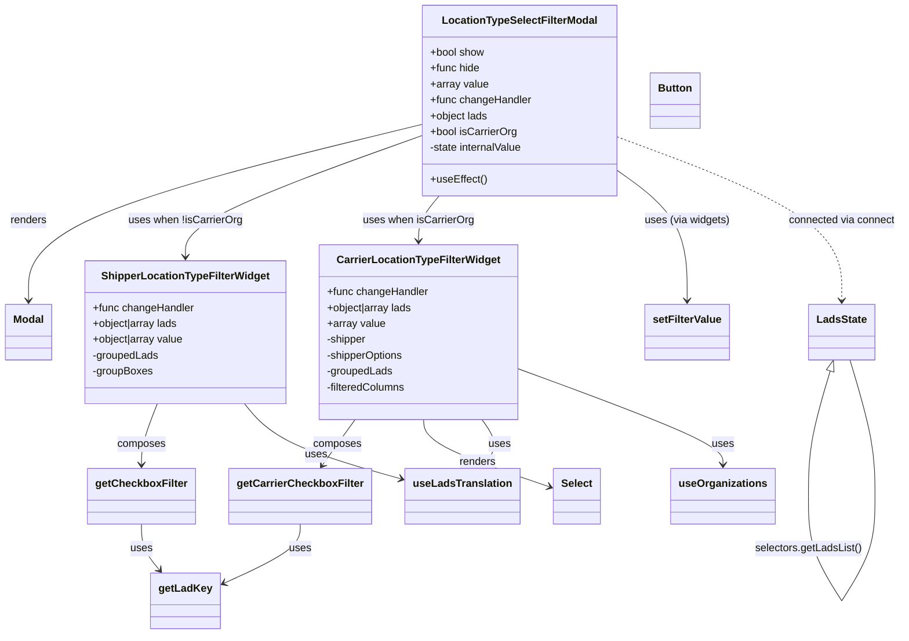

# Diagram: web/portal/src/pages/administration/location-management/components/modals/LocationTypeSelectFilterModal.js


> Auto-generated by Obscura crawlers

## Diagram 1



### SVG

<svg id="container" width="1335.389892578125" xmlns="http://www.w3.org/2000/svg" class="classDiagram" height="958" viewBox="0 0 1335.389892578125 958" role="graphics-document document" aria-roledescription="class"><style>#container{font-family:"trebuchet ms",verdana,arial,sans-serif;font-size:16px;fill:#333;}@keyframes edge-animation-frame{from{stroke-dashoffset:0;}}@keyframes dash{to{stroke-dashoffset:0;}}#container .edge-animation-slow{stroke-dasharray:9,5!important;stroke-dashoffset:900;animation:dash 50s linear infinite;stroke-linecap:round;}#container .edge-animation-fast{stroke-dasharray:9,5!important;stroke-dashoffset:900;animation:dash 20s linear infinite;stroke-linecap:round;}#container .error-icon{fill:#552222;}#container .error-text{fill:#552222;stroke:#552222;}#container .edge-thickness-normal{stroke-width:1px;}#container .edge-thickness-thick{stroke-width:3.5px;}#container .edge-pattern-solid{stroke-dasharray:0;}#container .edge-thickness-invisible{stroke-width:0;fill:none;}#container .edge-pattern-dashed{stroke-dasharray:3;}#container .edge-pattern-dotted{stroke-dasharray:2;}#container .marker{fill:#333333;stroke:#333333;}#container .marker.cross{stroke:#333333;}#container svg{font-family:"trebuchet ms",verdana,arial,sans-serif;font-size:16px;}#container p{margin:0;}#container g.classGroup text{fill:#9370DB;stroke:none;font-family:"trebuchet ms",verdana,arial,sans-serif;font-size:10px;}#container g.classGroup text .title{font-weight:bolder;}#container .nodeLabel,#container .edgeLabel{color:#131300;}#container .edgeLabel .label rect{fill:#ECECFF;}#container .label text{fill:#131300;}#container .labelBkg{background:#ECECFF;}#container .edgeLabel .label span{background:#ECECFF;}#container .classTitle{font-weight:bolder;}#container .node rect,#container .node circle,#container .node ellipse,#container .node polygon,#container .node path{fill:#ECECFF;stroke:#9370DB;stroke-width:1px;}#container .divider{stroke:#9370DB;stroke-width:1;}#container g.clickable{cursor:pointer;}#container g.classGroup rect{fill:#ECECFF;stroke:#9370DB;}#container g.classGroup line{stroke:#9370DB;stroke-width:1;}#container .classLabel .box{stroke:none;stroke-width:0;fill:#ECECFF;opacity:0.5;}#container .classLabel .label{fill:#9370DB;font-size:10px;}#container .relation{stroke:#333333;stroke-width:1;fill:none;}#container .dashed-line{stroke-dasharray:3;}#container .dotted-line{stroke-dasharray:1 2;}#container #compositionStart,#container .composition{fill:#333333!important;stroke:#333333!important;stroke-width:1;}#container #compositionEnd,#container .composition{fill:#333333!important;stroke:#333333!important;stroke-width:1;}#container #dependencyStart,#container .dependency{fill:#333333!important;stroke:#333333!important;stroke-width:1;}#container #dependencyStart,#container .dependency{fill:#333333!important;stroke:#333333!important;stroke-width:1;}#container #extensionStart,#container .extension{fill:transparent!important;stroke:#333333!important;stroke-width:1;}#container #extensionEnd,#container .extension{fill:transparent!important;stroke:#333333!important;stroke-width:1;}#container #aggregationStart,#container .aggregation{fill:transparent!important;stroke:#333333!important;stroke-width:1;}#container #aggregationEnd,#container .aggregation{fill:transparent!important;stroke:#333333!important;stroke-width:1;}#container #lollipopStart,#container .lollipop{fill:#ECECFF!important;stroke:#333333!important;stroke-width:1;}#container #lollipopEnd,#container .lollipop{fill:#ECECFF!important;stroke:#333333!important;stroke-width:1;}#container .edgeTerminals{font-size:11px;line-height:initial;}#container .classTitleText{text-anchor:middle;font-size:18px;fill:#333;}#container .label-icon{display:inline-block;height:1em;overflow:visible;vertical-align:-0.125em;}#container .node .label-icon path{fill:currentColor;stroke:revert;stroke-width:revert;}#container :root{--mermaid-font-family:"trebuchet ms",verdana,arial,sans-serif;}</style><g><defs><marker id="container_class-aggregationStart" class="marker aggregation class" refX="18" refY="7" markerWidth="190" markerHeight="240" orient="auto"><path d="M 18,7 L9,13 L1,7 L9,1 Z"></path></marker></defs><defs><marker id="container_class-aggregationEnd" class="marker aggregation class" refX="1" refY="7" markerWidth="20" markerHeight="28" orient="auto"><path d="M 18,7 L9,13 L1,7 L9,1 Z"></path></marker></defs><defs><marker id="container_class-extensionStart" class="marker extension class" refX="18" refY="7" markerWidth="190" markerHeight="240" orient="auto"><path d="M 1,7 L18,13 V 1 Z"></path></marker></defs><defs><marker id="container_class-extensionEnd" class="marker extension class" refX="1" refY="7" markerWidth="20" markerHeight="28" orient="auto"><path d="M 1,1 V 13 L18,7 Z"></path></marker></defs><defs><marker id="container_class-compositionStart" class="marker composition class" refX="18" refY="7" markerWidth="190" markerHeight="240" orient="auto"><path d="M 18,7 L9,13 L1,7 L9,1 Z"></path></marker></defs><defs><marker id="container_class-compositionEnd" class="marker composition class" refX="1" refY="7" markerWidth="20" markerHeight="28" orient="auto"><path d="M 18,7 L9,13 L1,7 L9,1 Z"></path></marker></defs><defs><marker id="container_class-dependencyStart" class="marker dependency class" refX="6" refY="7" markerWidth="190" markerHeight="240" orient="auto"><path d="M 5,7 L9,13 L1,7 L9,1 Z"></path></marker></defs><defs><marker id="container_class-dependencyEnd" class="marker dependency class" refX="13" refY="7" markerWidth="20" markerHeight="28" orient="auto"><path d="M 18,7 L9,13 L14,7 L9,1 Z"></path></marker></defs><defs><marker id="container_class-lollipopStart" class="marker lollipop class" refX="13" refY="7" markerWidth="190" markerHeight="240" orient="auto"><circle stroke="black" fill="transparent" cx="7" cy="7" r="6"></circle></marker></defs><defs><marker id="container_class-lollipopEnd" class="marker lollipop class" refX="1" refY="7" markerWidth="190" markerHeight="240" orient="auto"><circle stroke="black" fill="transparent" cx="7" cy="7" r="6"></circle></marker></defs><g class="root"><g class="clusters"></g><g class="edgePaths"><path d="M622.713,188.212L526.002,212.344C429.29,236.475,235.868,284.737,139.157,329.035C42.445,373.333,42.445,413.667,42.445,433.833L42.445,454" id="id_LocationTypeSelectFilterModal_Modal_1" class="edge-thickness-normal edge-pattern-solid relation" style=";;;" data-edge="true" data-et="edge" data-id="id_LocationTypeSelectFilterModal_Modal_1" data-points="W3sieCI6NjIyLjcxMjg5MDYyNSwieSI6MTg4LjIxMjM3ODQ2NzU5NDV9LHsieCI6NDIuNDQ1MzEyNSwieSI6MzMzfSx7IngiOjQyLjQ0NTMxMjUsInkiOjQ2MH1d" marker-end="url(#container_class-dependencyEnd)"></path><path d="M622.713,205.47L565.022,226.725C507.331,247.98,391.949,290.49,334.257,320.912C276.566,351.333,276.566,369.667,276.566,378.833L276.566,388" id="id_LocationTypeSelectFilterModal_ShipperLocationTypeFilterWidget_2" class="edge-thickness-normal edge-pattern-solid relation" style=";;;" data-edge="true" data-et="edge" data-id="id_LocationTypeSelectFilterModal_ShipperLocationTypeFilterWidget_2" data-points="W3sieCI6NjIyLjcxMjg5MDYyNSwieSI6MjA1LjQ2OTY2Nzk5NTg0OTQ1fSx7IngiOjI3Ni41NjY0MDYyNSwieSI6MzMzfSx7IngiOjI3Ni41NjY0MDYyNSwieSI6Mzk0fV0=" marker-end="url(#container_class-dependencyEnd)"></path><path d="M653.566,296L648.672,302.167C643.778,308.333,633.991,320.667,629.097,332C624.203,343.333,624.203,353.667,624.203,358.833L624.203,364" id="id_LocationTypeSelectFilterModal_CarrierLocationTypeFilterWidget_3" class="edge-thickness-normal edge-pattern-solid relation" style=";;;" data-edge="true" data-et="edge" data-id="id_LocationTypeSelectFilterModal_CarrierLocationTypeFilterWidget_3" data-points="W3sieCI6NjUzLjU2NTcyNjQzMzAxMSwieSI6Mjk2fSx7IngiOjYyNC4yMDMxMjUsInkiOjMzM30seyJ4Ijo2MjQuMjAzMTI1LCJ5IjozNzB9XQ==" marker-end="url(#container_class-dependencyEnd)"></path><path d="M238.397,610L234.804,620.167C231.21,630.333,224.024,650.667,220.431,666C216.838,681.333,216.838,691.667,216.838,696.833L216.838,702" id="id_ShipperLocationTypeFilterWidget_getCheckboxFilter_4" class="edge-thickness-normal edge-pattern-solid relation" style=";;;" data-edge="true" data-et="edge" data-id="id_ShipperLocationTypeFilterWidget_getCheckboxFilter_4" data-points="W3sieCI6MjM4LjM5NjcwMzk1NzEwMDU4LCJ5Ijo2MTB9LHsieCI6MjE2LjgzNzg5MDYyNSwieSI6NjcxfSx7IngiOjIxNi44Mzc4OTA2MjUsInkiOjcwOH1d" marker-end="url(#container_class-dependencyEnd)"></path><path d="M531.958,634L527.649,640.167C523.339,646.333,514.72,658.667,506.449,670.196C498.177,681.725,490.252,692.45,486.29,697.812L482.328,703.174" id="id_CarrierLocationTypeFilterWidget_getCarrierCheckboxFilter_5" class="edge-thickness-normal edge-pattern-solid relation" style=";;;" data-edge="true" data-et="edge" data-id="id_CarrierLocationTypeFilterWidget_getCarrierCheckboxFilter_5" data-points="W3sieCI6NTMxLjk1ODExNzYwMzU1MDIsInkiOjYzNH0seyJ4Ijo1MDYuMTAxNTYyNSwieSI6NjcxfSx7IngiOjQ3OC43NjIyODczODEzMjkxLCJ5Ijo3MDh9XQ==" marker-end="url(#container_class-dependencyEnd)"></path><path d="M631.999,634L632.363,640.167C632.727,646.333,633.455,658.667,663.364,675.561C693.272,692.455,752.36,713.91,781.904,724.638L811.448,735.366" id="id_CarrierLocationTypeFilterWidget_Select_6" class="edge-thickness-normal edge-pattern-solid relation" style=";;;" data-edge="true" data-et="edge" data-id="id_CarrierLocationTypeFilterWidget_Select_6" data-points="W3sieCI6NjMxLjk5ODUyMDcxMDA1OTIsInkiOjYzNH0seyJ4Ijo2MzQuMTgzNTkzNzUsInkiOjY3MX0seyJ4Ijo4MTcuMDg3ODkwNjI1LCJ5Ijo3MzcuNDEzMzMwOTM5NDQ5N31d" marker-end="url(#container_class-dependencyEnd)"></path><path d="M364.338,610L372.6,620.167C380.862,630.333,397.387,650.667,435.834,669.664C474.28,688.662,534.649,706.324,564.833,715.155L595.017,723.986" id="id_ShipperLocationTypeFilterWidget_useLadsTranslation_7" class="edge-thickness-normal edge-pattern-solid relation" style=";;;" data-edge="true" data-et="edge" data-id="id_ShipperLocationTypeFilterWidget_useLadsTranslation_7" data-points="W3sieCI6MzY0LjMzNzYyNDgxNTA4ODc2LCJ5Ijo2MTB9LHsieCI6NDEzLjkxMjEwOTM3NSwieSI6NjcxfSx7IngiOjYwMC43NzUzOTA2MjUsInkiOjcyNS42NzA4NTcxNDI4NTcxfV0=" marker-end="url(#container_class-dependencyEnd)"></path><path d="M716.448,634L720.758,640.167C725.067,646.333,733.686,658.667,734.033,670.196C734.38,681.725,726.456,692.45,722.493,697.812L718.531,703.174" id="id_CarrierLocationTypeFilterWidget_useLadsTranslation_8" class="edge-thickness-normal edge-pattern-solid relation" style=";;;" data-edge="true" data-et="edge" data-id="id_CarrierLocationTypeFilterWidget_useLadsTranslation_8" data-points="W3sieCI6NzE2LjQ0ODEzMjM5NjQ0OTgsInkiOjYzNH0seyJ4Ijo3NDIuMzA0Njg3NSwieSI6NjcxfSx7IngiOjcxNC45NjU0MTIzODEzMjkxLCJ5Ijo3MDh9XQ==" marker-end="url(#container_class-dependencyEnd)"></path><path d="M772.164,558.066L821.837,576.888C871.51,595.711,970.857,633.355,1020.53,657.344C1070.203,681.333,1070.203,691.667,1070.203,696.833L1070.203,702" id="id_CarrierLocationTypeFilterWidget_useOrganizations_9" class="edge-thickness-normal edge-pattern-solid relation" style=";;;" data-edge="true" data-et="edge" data-id="id_CarrierLocationTypeFilterWidget_useOrganizations_9" data-points="W3sieCI6NzcyLjE2NDA2MjUsInkiOjU1OC4wNjU5MTU3NzkxNDh9LHsieCI6MTA3MC4yMDMxMjUsInkiOjY3MX0seyJ4IjoxMDcwLjIwMzEyNSwieSI6NzA4fV0=" marker-end="url(#container_class-dependencyEnd)"></path><path d="M912.971,257.758L930.18,270.298C947.389,282.838,981.806,307.919,999.015,340.626C1016.224,373.333,1016.224,413.667,1016.224,433.833L1016.224,454" id="id_LocationTypeSelectFilterModal_setFilterValue_10" class="edge-thickness-normal edge-pattern-solid relation" style=";;;" data-edge="true" data-et="edge" data-id="id_LocationTypeSelectFilterModal_setFilterValue_10" data-points="W3sieCI6OTEyLjk3MDcwMzEyNSwieSI6MjU3Ljc1NzYxMjkyOTc1MTkzfSx7IngiOjEwMTYuMjI0MjE4NzUwMzcyNSwieSI6MzMzfSx7IngiOjEwMTYuMjI0MjE4NzUwMzcyNSwieSI6NDYwfV0=" marker-end="url(#container_class-dependencyEnd)"></path><path d="M216.838,792L216.838,798.167C216.838,804.333,216.838,816.667,220.897,828.202C224.956,839.738,233.075,850.476,237.134,855.845L241.193,861.214" id="id_getCheckboxFilter_getLadKey_11" class="edge-thickness-normal edge-pattern-solid relation" style=";;;" data-edge="true" data-et="edge" data-id="id_getCheckboxFilter_getLadKey_11" data-points="W3sieCI6MjE2LjgzNzg5MDYyNSwieSI6NzkyfSx7IngiOjIxNi44Mzc4OTA2MjUsInkiOjgyOX0seyJ4IjoyNDQuODEyMDA1NTM3OTc0NywieSI6ODY2fV0=" marker-end="url(#container_class-dependencyEnd)"></path><path d="M447.729,792L447.729,798.167C447.729,804.333,447.729,816.667,428.504,831.706C409.279,846.746,370.83,864.492,351.606,873.365L332.381,882.239" id="id_getCarrierCheckboxFilter_getLadKey_12" class="edge-thickness-normal edge-pattern-solid relation" style=";;;" data-edge="true" data-et="edge" data-id="id_getCarrierCheckboxFilter_getLadKey_12" data-points="W3sieCI6NDQ3LjcyODUxNTYyNSwieSI6NzkyfSx7IngiOjQ0Ny43Mjg1MTU2MjUsInkiOjgyOX0seyJ4IjozMjYuOTMzNTkzNzUsInkiOjg4NC43NTI5ODY4MjAzMzQ0fV0=" marker-end="url(#container_class-dependencyEnd)"></path><path d="M912.971,206.936L968.477,227.946C1023.983,248.957,1134.995,290.979,1190.501,332.156C1246.007,373.333,1246.007,413.667,1246.007,433.833L1246.007,454" id="id_LocationTypeSelectFilterModal_LadsState_13" class="edge-thickness-normal edge-pattern-dashed relation" style=";;;" data-edge="true" data-et="edge" data-id="id_LocationTypeSelectFilterModal_LadsState_13" data-points="W3sieCI6OTEyLjk3MDcwMzEyNSwieSI6MjA2LjkzNTY3OTQzMjExOTA2fSx7IngiOjEyNDYuMDA3MDMxMjUwNzQ1LCJ5IjozMzN9LHsieCI6MTI0Ni4wMDcwMzEyNTA3NDUsInkiOjQ2MH1d" marker-end="url(#container_class-dependencyEnd)"></path><path d="M1228.572,560.532L1223.088,578.943C1217.604,597.355,1206.635,634.177,1201.151,665.747C1195.667,697.317,1195.667,723.633,1195.667,736.792L1195.667,749.95" id="LadsState-cyclic-special-1" class="edge-thickness-normal edge-pattern-solid relation" style=";;;" data-edge="true" data-et="edge" data-id="LadsState-cyclic-special-1" data-points="W3sieCI6MTIzMy40OTY1Mzc1Mzc3Mjc0LCJ5Ijo1NDR9LHsieCI6MTE5NS42NjcxODc1MDA3NDUsInkiOjY3MX0seyJ4IjoxMTk1LjY2NzE4NzUwMDc0NSwieSI6NzQ5Ljk0OTk5OTk5OTI1NDl9XQ==" marker-start="url(#container_class-extensionStart)"></path><path d="M1195.667,750.05L1195.667,763.208C1195.667,776.367,1195.667,802.683,1204.052,829C1212.437,855.317,1229.206,881.633,1237.591,894.792L1245.975,907.95" id="LadsState-cyclic-special-mid" class="edge-thickness-normal edge-pattern-solid relation" style=";;;" data-edge="true" data-et="edge" data-id="LadsState-cyclic-special-mid" data-points="W3sieCI6MTE5NS42NjcxODc1MDA3NDUsInkiOjc1MC4wNTAwMDAwMDA3NDUxfSx7IngiOjExOTUuNjY3MTg3NTAwNzQ1LCJ5Ijo4Mjl9LHsieCI6MTI0NS45NzUxNzA1ODk2NjksInkiOjkwNy45NDk5OTk5OTkyNTQ5fV0="></path><path d="M1246.039,907.95L1254.424,894.792C1262.808,881.633,1279.578,855.317,1287.962,828.992C1296.347,802.667,1296.347,776.333,1296.347,750C1296.347,723.667,1296.347,697.333,1290.042,663C1283.737,628.667,1271.127,586.333,1264.822,565.167L1258.518,544" id="LadsState-cyclic-special-2" class="edge-thickness-normal edge-pattern-solid relation" style=";;;" data-edge="true" data-et="edge" data-id="LadsState-cyclic-special-2" data-points="W3sieCI6MTI0Ni4wMzg4OTE5MTE4MjEsInkiOjkwNy45NDk5OTk5OTkyNTQ5fSx7IngiOjEyOTYuMzQ2ODc1MDAwNzQ1LCJ5Ijo4Mjl9LHsieCI6MTI5Ni4zNDY4NzUwMDA3NDUsInkiOjc1MH0seyJ4IjoxMjk2LjM0Njg3NTAwMDc0NSwieSI6NjcxfSx7IngiOjEyNTguNTE3NTI0OTYzNzYyOCwieSI6NTQ0fV0="></path></g><g class="edgeLabels"><g class="edgeLabel" transform="translate(42.4453125, 333)"><g class="label" data-id="id_LocationTypeSelectFilterModal_Modal_1" transform="translate(-27.75, -12)"><foreignObject width="55.5" height="24"><div xmlns="http://www.w3.org/1999/xhtml" class="labelBkg" style="display: table-cell; white-space: nowrap; line-height: 1.5; max-width: 200px; text-align: center;"><span class="edgeLabel"><p>renders</p></span></div></foreignObject></g></g><g class="edgeLabel" transform="translate(276.56640625, 333)"><g class="label" data-id="id_LocationTypeSelectFilterModal_ShipperLocationTypeFilterWidget_2" transform="translate(-85.421875, -12)"><foreignObject width="170.84375" height="24"><div xmlns="http://www.w3.org/1999/xhtml" class="labelBkg" style="display: table-cell; white-space: nowrap; line-height: 1.5; max-width: 200px; text-align: center;"><span class="edgeLabel"><p>uses when !isCarrierOrg</p></span></div></foreignObject></g></g><g class="edgeLabel" transform="translate(624.203125, 333)"><g class="label" data-id="id_LocationTypeSelectFilterModal_CarrierLocationTypeFilterWidget_3" transform="translate(-83.4921875, -12)"><foreignObject width="166.984375" height="24"><div xmlns="http://www.w3.org/1999/xhtml" class="labelBkg" style="display: table-cell; white-space: nowrap; line-height: 1.5; max-width: 200px; text-align: center;"><span class="edgeLabel"><p>uses when isCarrierOrg</p></span></div></foreignObject></g></g><g class="edgeLabel" transform="translate(216.837890625, 671)"><g class="label" data-id="id_ShipperLocationTypeFilterWidget_getCheckboxFilter_4" transform="translate(-36.453125, -12)"><foreignObject width="72.90625" height="24"><div xmlns="http://www.w3.org/1999/xhtml" class="labelBkg" style="display: table-cell; white-space: nowrap; line-height: 1.5; max-width: 200px; text-align: center;"><span class="edgeLabel"><p>composes</p></span></div></foreignObject></g></g><g class="edgeLabel" transform="translate(506.1015625, 671)"><g class="label" data-id="id_CarrierLocationTypeFilterWidget_getCarrierCheckboxFilter_5" transform="translate(-36.453125, -12)"><foreignObject width="72.90625" height="24"><div xmlns="http://www.w3.org/1999/xhtml" class="labelBkg" style="display: table-cell; white-space: nowrap; line-height: 1.5; max-width: 200px; text-align: center;"><span class="edgeLabel"><p>composes</p></span></div></foreignObject></g></g><g class="edgeLabel" transform="translate(634.18359375, 671)"><g class="label" data-id="id_CarrierLocationTypeFilterWidget_Select_6" transform="translate(-27.75, -12)"><foreignObject width="55.5" height="24"><div xmlns="http://www.w3.org/1999/xhtml" class="labelBkg" style="display: table-cell; white-space: nowrap; line-height: 1.5; max-width: 200px; text-align: center;"><span class="edgeLabel"><p>renders</p></span></div></foreignObject></g></g><g class="edgeLabel" transform="translate(469.62289, 687.29938)"><g class="label" data-id="id_ShipperLocationTypeFilterWidget_useLadsTranslation_7" transform="translate(-16.4921875, -12)"><foreignObject width="32.984375" height="24"><div xmlns="http://www.w3.org/1999/xhtml" class="labelBkg" style="display: table-cell; white-space: nowrap; line-height: 1.5; max-width: 200px; text-align: center;"><span class="edgeLabel"><p>uses</p></span></div></foreignObject></g></g><g class="edgeLabel" transform="translate(742.04755, 671.348)"><g class="label" data-id="id_CarrierLocationTypeFilterWidget_useLadsTranslation_8" transform="translate(-16.4921875, -12)"><foreignObject width="32.984375" height="24"><div xmlns="http://www.w3.org/1999/xhtml" class="labelBkg" style="display: table-cell; white-space: nowrap; line-height: 1.5; max-width: 200px; text-align: center;"><span class="edgeLabel"><p>uses</p></span></div></foreignObject></g></g><g class="edgeLabel" transform="translate(1070.203125, 671)"><g class="label" data-id="id_CarrierLocationTypeFilterWidget_useOrganizations_9" transform="translate(-16.4921875, -12)"><foreignObject width="32.984375" height="24"><div xmlns="http://www.w3.org/1999/xhtml" class="labelBkg" style="display: table-cell; white-space: nowrap; line-height: 1.5; max-width: 200px; text-align: center;"><span class="edgeLabel"><p>uses</p></span></div></foreignObject></g></g><g class="edgeLabel" transform="translate(1016.2242187503725, 333)"><g class="label" data-id="id_LocationTypeSelectFilterModal_setFilterValue_10" transform="translate(-64.25, -12)"><foreignObject width="128.5" height="24"><div xmlns="http://www.w3.org/1999/xhtml" class="labelBkg" style="display: table-cell; white-space: nowrap; line-height: 1.5; max-width: 200px; text-align: center;"><span class="edgeLabel"><p>uses (via widgets)</p></span></div></foreignObject></g></g><g class="edgeLabel" transform="translate(216.837890625, 829)"><g class="label" data-id="id_getCheckboxFilter_getLadKey_11" transform="translate(-16.4921875, -12)"><foreignObject width="32.984375" height="24"><div xmlns="http://www.w3.org/1999/xhtml" class="labelBkg" style="display: table-cell; white-space: nowrap; line-height: 1.5; max-width: 200px; text-align: center;"><span class="edgeLabel"><p>uses</p></span></div></foreignObject></g></g><g class="edgeLabel" transform="translate(447.728515625, 829)"><g class="label" data-id="id_getCarrierCheckboxFilter_getLadKey_12" transform="translate(-16.4921875, -12)"><foreignObject width="32.984375" height="24"><div xmlns="http://www.w3.org/1999/xhtml" class="labelBkg" style="display: table-cell; white-space: nowrap; line-height: 1.5; max-width: 200px; text-align: center;"><span class="edgeLabel"><p>uses</p></span></div></foreignObject></g></g><g class="edgeLabel" transform="translate(1246.007031250745, 333)"><g class="label" data-id="id_LocationTypeSelectFilterModal_LadsState_13" transform="translate(-81.3828125, -12)"><foreignObject width="162.765625" height="24"><div xmlns="http://www.w3.org/1999/xhtml" class="labelBkg" style="display: table-cell; white-space: nowrap; line-height: 1.5; max-width: 200px; text-align: center;"><span class="edgeLabel"><p>connected via connect</p></span></div></foreignObject></g></g><g class="edgeLabel"><g class="label" data-id="LadsState-cyclic-special-1" transform="translate(0, 0)"><foreignObject width="0" height="0"><div xmlns="http://www.w3.org/1999/xhtml" class="labelBkg" style="display: table-cell; white-space: nowrap; line-height: 1.5; max-width: 200px; text-align: center;"><span class="edgeLabel"></span></div></foreignObject></g></g><g class="edgeLabel" transform="translate(1195.667187500745, 829)"><g class="label" data-id="LadsState-cyclic-special-mid" transform="translate(-80.6796875, -12)"><foreignObject width="161.359375" height="24"><div xmlns="http://www.w3.org/1999/xhtml" class="labelBkg" style="display: table-cell; white-space: nowrap; line-height: 1.5; max-width: 200px; text-align: center;"><span class="edgeLabel"><p>selectors.getLadsList()</p></span></div></foreignObject></g></g><g class="edgeLabel"><g class="label" data-id="LadsState-cyclic-special-2" transform="translate(0, 0)"><foreignObject width="0" height="0"><div xmlns="http://www.w3.org/1999/xhtml" class="labelBkg" style="display: table-cell; white-space: nowrap; line-height: 1.5; max-width: 200px; text-align: center;"><span class="edgeLabel"></span></div></foreignObject></g></g></g><g class="nodes"><g class="node default" id="classId-LocationTypeSelectFilterModal-0" transform="translate(767.841796875, 152)"><g class="basic label-container"><path d="M-145.12890625 -144 L145.12890625 -144 L145.12890625 144 L-145.12890625 144" stroke="none" stroke-width="0" fill="#ECECFF" style=""></path><path d="M-145.12890625 -144 C-68.59037537877873 -144, 7.948155492442538 -144, 145.12890625 -144 M-145.12890625 -144 C-80.45971325195305 -144, -15.790520253906095 -144, 145.12890625 -144 M145.12890625 -144 C145.12890625 -39.126475557917615, 145.12890625 65.74704888416477, 145.12890625 144 M145.12890625 -144 C145.12890625 -29.933747302873115, 145.12890625 84.13250539425377, 145.12890625 144 M145.12890625 144 C55.08169888882462 144, -34.96550847235076 144, -145.12890625 144 M145.12890625 144 C60.924525822540005 144, -23.27985460491999 144, -145.12890625 144 M-145.12890625 144 C-145.12890625 62.24387198148577, -145.12890625 -19.512256037028465, -145.12890625 -144 M-145.12890625 144 C-145.12890625 59.37384893686736, -145.12890625 -25.252302126265278, -145.12890625 -144" stroke="#9370DB" stroke-width="1.3" fill="none" stroke-dasharray="0 0" style=""></path></g><g class="annotation-group text" transform="translate(0, -120)"></g><g class="label-group text" transform="translate(-112.6484375, -120)"><g class="label" style="font-weight: bolder" transform="translate(0,-12)"><foreignObject width="225.296875" height="24"><div xmlns="http://www.w3.org/1999/xhtml" style="display: table-cell; white-space: nowrap; line-height: 1.5; max-width: 272px; text-align: center;"><span class="nodeLabel markdown-node-label" style=""><p>LocationTypeSelectFilterModal</p></span></div></foreignObject></g></g><g class="members-group text" transform="translate(-133.12890625, -72)"><g class="label" style="" transform="translate(0,-12)"><foreignObject width="82.78125" height="24"><div xmlns="http://www.w3.org/1999/xhtml" style="display: table-cell; white-space: nowrap; line-height: 1.5; max-width: 141px; text-align: center;"><span class="nodeLabel markdown-node-label" style=""><p>+bool show</p></span></div></foreignObject></g><g class="label" style="" transform="translate(0,12)"><foreignObject width="75.859375" height="24"><div xmlns="http://www.w3.org/1999/xhtml" style="display: table-cell; white-space: nowrap; line-height: 1.5; max-width: 133px; text-align: center;"><span class="nodeLabel markdown-node-label" style=""><p>+func hide</p></span></div></foreignObject></g><g class="label" style="" transform="translate(0,36)"><foreignObject width="87.703125" height="24"><div xmlns="http://www.w3.org/1999/xhtml" style="display: table-cell; white-space: nowrap; line-height: 1.5; max-width: 145px; text-align: center;"><span class="nodeLabel markdown-node-label" style=""><p>+array value</p></span></div></foreignObject></g><g class="label" style="" transform="translate(0,60)"><foreignObject width="153.609375" height="24"><div xmlns="http://www.w3.org/1999/xhtml" style="display: table-cell; white-space: nowrap; line-height: 1.5; max-width: 212px; text-align: center;"><span class="nodeLabel markdown-node-label" style=""><p>+func changeHandler</p></span></div></foreignObject></g><g class="label" style="" transform="translate(0,84)"><foreignObject width="88.0625" height="24"><div xmlns="http://www.w3.org/1999/xhtml" style="display: table-cell; white-space: nowrap; line-height: 1.5; max-width: 145px; text-align: center;"><span class="nodeLabel markdown-node-label" style=""><p>+object lads</p></span></div></foreignObject></g><g class="label" style="" transform="translate(0,108)"><foreignObject width="131.6875" height="24"><div xmlns="http://www.w3.org/1999/xhtml" style="display: table-cell; white-space: nowrap; line-height: 1.5; max-width: 190px; text-align: center;"><span class="nodeLabel markdown-node-label" style=""><p>+bool isCarrierOrg</p></span></div></foreignObject></g><g class="label" style="" transform="translate(0,132)"><foreignObject width="143.234375" height="24"><div xmlns="http://www.w3.org/1999/xhtml" style="display: table-cell; white-space: nowrap; line-height: 1.5; max-width: 201px; text-align: center;"><span class="nodeLabel markdown-node-label" style=""><p>-state internalValue</p></span></div></foreignObject></g></g><g class="methods-group text" transform="translate(-133.12890625, 120)"><g class="label" style="" transform="translate(0,-12)"><foreignObject width="84.8125" height="24"><div xmlns="http://www.w3.org/1999/xhtml" style="display: table-cell; white-space: nowrap; line-height: 1.5; max-width: 142px; text-align: center;"><span class="nodeLabel markdown-node-label" style=""><p>+useEffect()</p></span></div></foreignObject></g></g><g class="divider" style=""><path d="M-145.12890625 -96 C-69.14824651590385 -96, 6.8324132181923005 -96, 145.12890625 -96 M-145.12890625 -96 C-84.61846833076712 -96, -24.10803041153423 -96, 145.12890625 -96" stroke="#9370DB" stroke-width="1.3" fill="none" stroke-dasharray="0 0" style=""></path></g><g class="divider" style=""><path d="M-145.12890625 96 C-66.82731413326805 96, 11.474277983463907 96, 145.12890625 96 M-145.12890625 96 C-58.23905294245782 96, 28.650800365084365 96, 145.12890625 96" stroke="#9370DB" stroke-width="1.3" fill="none" stroke-dasharray="0 0" style=""></path></g></g><g class="node default" id="classId-ShipperLocationTypeFilterWidget-1" transform="translate(276.56640625, 502)"><g class="basic label-container"><path d="M-149.67578125 -108 L149.67578125 -108 L149.67578125 108 L-149.67578125 108" stroke="none" stroke-width="0" fill="#ECECFF" style=""></path><path d="M-149.67578125 -108 C-34.87582706192728 -108, 79.92412712614544 -108, 149.67578125 -108 M-149.67578125 -108 C-52.826948826552155 -108, 44.02188359689569 -108, 149.67578125 -108 M149.67578125 -108 C149.67578125 -36.083724320071084, 149.67578125 35.83255135985783, 149.67578125 108 M149.67578125 -108 C149.67578125 -34.237340307451106, 149.67578125 39.52531938509779, 149.67578125 108 M149.67578125 108 C31.20001308004923 108, -87.27575508990154 108, -149.67578125 108 M149.67578125 108 C59.674178523573914 108, -30.32742420285217 108, -149.67578125 108 M-149.67578125 108 C-149.67578125 29.50206381420216, -149.67578125 -48.99587237159568, -149.67578125 -108 M-149.67578125 108 C-149.67578125 51.237883859496506, -149.67578125 -5.524232281006988, -149.67578125 -108" stroke="#9370DB" stroke-width="1.3" fill="none" stroke-dasharray="0 0" style=""></path></g><g class="annotation-group text" transform="translate(0, -84)"></g><g class="label-group text" transform="translate(-121.7421875, -84)"><g class="label" style="font-weight: bolder" transform="translate(0,-12)"><foreignObject width="243.484375" height="24"><div xmlns="http://www.w3.org/1999/xhtml" style="display: table-cell; white-space: nowrap; line-height: 1.5; max-width: 289px; text-align: center;"><span class="nodeLabel markdown-node-label" style=""><p>ShipperLocationTypeFilterWidget</p></span></div></foreignObject></g></g><g class="members-group text" transform="translate(-137.67578125, -36)"><g class="label" style="" transform="translate(0,-12)"><foreignObject width="153.609375" height="24"><div xmlns="http://www.w3.org/1999/xhtml" style="display: table-cell; white-space: nowrap; line-height: 1.5; max-width: 212px; text-align: center;"><span class="nodeLabel markdown-node-label" style=""><p>+func changeHandler</p></span></div></foreignObject></g><g class="label" style="" transform="translate(0,12)"><foreignObject width="131.34375" height="24"><div xmlns="http://www.w3.org/1999/xhtml" style="display: table-cell; white-space: nowrap; line-height: 1.5; max-width: 189px; text-align: center;"><span class="nodeLabel markdown-node-label" style=""><p>+object|array lads</p></span></div></foreignObject></g><g class="label" style="" transform="translate(0,36)"><foreignObject width="139.859375" height="24"><div xmlns="http://www.w3.org/1999/xhtml" style="display: table-cell; white-space: nowrap; line-height: 1.5; max-width: 197px; text-align: center;"><span class="nodeLabel markdown-node-label" style=""><p>+object|array value</p></span></div></foreignObject></g><g class="label" style="" transform="translate(0,60)"><foreignObject width="100.46875" height="24"><div xmlns="http://www.w3.org/1999/xhtml" style="display: table-cell; white-space: nowrap; line-height: 1.5; max-width: 158px; text-align: center;"><span class="nodeLabel markdown-node-label" style=""><p>-groupedLads</p></span></div></foreignObject></g><g class="label" style="" transform="translate(0,84)"><foreignObject width="91.375" height="24"><div xmlns="http://www.w3.org/1999/xhtml" style="display: table-cell; white-space: nowrap; line-height: 1.5; max-width: 149px; text-align: center;"><span class="nodeLabel markdown-node-label" style=""><p>-groupBoxes</p></span></div></foreignObject></g></g><g class="methods-group text" transform="translate(-137.67578125, 108)"></g><g class="divider" style=""><path d="M-149.67578125 -60 C-86.45318805877491 -60, -23.23059486754981 -60, 149.67578125 -60 M-149.67578125 -60 C-51.793103040681416 -60, 46.08957516863717 -60, 149.67578125 -60" stroke="#9370DB" stroke-width="1.3" fill="none" stroke-dasharray="0 0" style=""></path></g><g class="divider" style=""><path d="M-149.67578125 84 C-58.37955854639314 84, 32.91666415721372 84, 149.67578125 84 M-149.67578125 84 C-61.19987020238575 84, 27.276040845228493 84, 149.67578125 84" stroke="#9370DB" stroke-width="1.3" fill="none" stroke-dasharray="0 0" style=""></path></g></g><g class="node default" id="classId-CarrierLocationTypeFilterWidget-2" transform="translate(624.203125, 502)"><g class="basic label-container"><path d="M-147.9609375 -132 L147.9609375 -132 L147.9609375 132 L-147.9609375 132" stroke="none" stroke-width="0" fill="#ECECFF" style=""></path><path d="M-147.9609375 -132 C-82.08469926368525 -132, -16.208461027370504 -132, 147.9609375 -132 M-147.9609375 -132 C-61.118220857380095 -132, 25.72449578523981 -132, 147.9609375 -132 M147.9609375 -132 C147.9609375 -31.097679895618185, 147.9609375 69.80464020876363, 147.9609375 132 M147.9609375 -132 C147.9609375 -38.22322866448597, 147.9609375 55.553542671028055, 147.9609375 132 M147.9609375 132 C41.38344927858802 132, -65.19403894282397 132, -147.9609375 132 M147.9609375 132 C82.88424965227756 132, 17.80756180455512 132, -147.9609375 132 M-147.9609375 132 C-147.9609375 46.301279896334975, -147.9609375 -39.39744020733005, -147.9609375 -132 M-147.9609375 132 C-147.9609375 62.89282892648362, -147.9609375 -6.214342147032767, -147.9609375 -132" stroke="#9370DB" stroke-width="1.3" fill="none" stroke-dasharray="0 0" style=""></path></g><g class="annotation-group text" transform="translate(0, -108)"></g><g class="label-group text" transform="translate(-118.3125, -108)"><g class="label" style="font-weight: bolder" transform="translate(0,-12)"><foreignObject width="236.625" height="24"><div xmlns="http://www.w3.org/1999/xhtml" style="display: table-cell; white-space: nowrap; line-height: 1.5; max-width: 282px; text-align: center;"><span class="nodeLabel markdown-node-label" style=""><p>CarrierLocationTypeFilterWidget</p></span></div></foreignObject></g></g><g class="members-group text" transform="translate(-135.9609375, -60)"><g class="label" style="" transform="translate(0,-12)"><foreignObject width="153.609375" height="24"><div xmlns="http://www.w3.org/1999/xhtml" style="display: table-cell; white-space: nowrap; line-height: 1.5; max-width: 212px; text-align: center;"><span class="nodeLabel markdown-node-label" style=""><p>+func changeHandler</p></span></div></foreignObject></g><g class="label" style="" transform="translate(0,12)"><foreignObject width="131.34375" height="24"><div xmlns="http://www.w3.org/1999/xhtml" style="display: table-cell; white-space: nowrap; line-height: 1.5; max-width: 189px; text-align: center;"><span class="nodeLabel markdown-node-label" style=""><p>+object|array lads</p></span></div></foreignObject></g><g class="label" style="" transform="translate(0,36)"><foreignObject width="87.703125" height="24"><div xmlns="http://www.w3.org/1999/xhtml" style="display: table-cell; white-space: nowrap; line-height: 1.5; max-width: 145px; text-align: center;"><span class="nodeLabel markdown-node-label" style=""><p>+array value</p></span></div></foreignObject></g><g class="label" style="" transform="translate(0,60)"><foreignObject width="61.71875" height="24"><div xmlns="http://www.w3.org/1999/xhtml" style="display: table-cell; white-space: nowrap; line-height: 1.5; max-width: 120px; text-align: center;"><span class="nodeLabel markdown-node-label" style=""><p>-shipper</p></span></div></foreignObject></g><g class="label" style="" transform="translate(0,84)"><foreignObject width="118.78125" height="24"><div xmlns="http://www.w3.org/1999/xhtml" style="display: table-cell; white-space: nowrap; line-height: 1.5; max-width: 176px; text-align: center;"><span class="nodeLabel markdown-node-label" style=""><p>-shipperOptions</p></span></div></foreignObject></g><g class="label" style="" transform="translate(0,108)"><foreignObject width="100.46875" height="24"><div xmlns="http://www.w3.org/1999/xhtml" style="display: table-cell; white-space: nowrap; line-height: 1.5; max-width: 158px; text-align: center;"><span class="nodeLabel markdown-node-label" style=""><p>-groupedLads</p></span></div></foreignObject></g><g class="label" style="" transform="translate(0,132)"><foreignObject width="120.890625" height="24"><div xmlns="http://www.w3.org/1999/xhtml" style="display: table-cell; white-space: nowrap; line-height: 1.5; max-width: 178px; text-align: center;"><span class="nodeLabel markdown-node-label" style=""><p>-filteredColumns</p></span></div></foreignObject></g></g><g class="methods-group text" transform="translate(-135.9609375, 132)"></g><g class="divider" style=""><path d="M-147.9609375 -84 C-46.05742799494983 -84, 55.84608151010033 -84, 147.9609375 -84 M-147.9609375 -84 C-70.42954769075749 -84, 7.101842118485024 -84, 147.9609375 -84" stroke="#9370DB" stroke-width="1.3" fill="none" stroke-dasharray="0 0" style=""></path></g><g class="divider" style=""><path d="M-147.9609375 108 C-74.12247916200285 108, -0.28402082400569384 108, 147.9609375 108 M-147.9609375 108 C-57.812393735537455 108, 32.33615002892509 108, 147.9609375 108" stroke="#9370DB" stroke-width="1.3" fill="none" stroke-dasharray="0 0" style=""></path></g></g><g class="node default" id="classId-Modal-3" transform="translate(42.4453125, 502)"><g class="basic label-container"><path d="M-34.4453125 -42 L34.4453125 -42 L34.4453125 42 L-34.4453125 42" stroke="none" stroke-width="0" fill="#ECECFF" style=""></path><path d="M-34.4453125 -42 C-19.318616985725086 -42, -4.191921471450172 -42, 34.4453125 -42 M-34.4453125 -42 C-12.88369465169162 -42, 8.67792319661676 -42, 34.4453125 -42 M34.4453125 -42 C34.4453125 -9.515039676890751, 34.4453125 22.969920646218497, 34.4453125 42 M34.4453125 -42 C34.4453125 -18.078832012485673, 34.4453125 5.842335975028654, 34.4453125 42 M34.4453125 42 C10.488454672254527 42, -13.468403155490947 42, -34.4453125 42 M34.4453125 42 C11.42582728962174 42, -11.59365792075652 42, -34.4453125 42 M-34.4453125 42 C-34.4453125 17.825732188579916, -34.4453125 -6.348535622840167, -34.4453125 -42 M-34.4453125 42 C-34.4453125 23.437831758365764, -34.4453125 4.875663516731528, -34.4453125 -42" stroke="#9370DB" stroke-width="1.3" fill="none" stroke-dasharray="0 0" style=""></path></g><g class="annotation-group text" transform="translate(0, -18)"></g><g class="label-group text" transform="translate(-22.4453125, -18)"><g class="label" style="font-weight: bolder" transform="translate(0,-12)"><foreignObject width="44.890625" height="24"><div xmlns="http://www.w3.org/1999/xhtml" style="display: table-cell; white-space: nowrap; line-height: 1.5; max-width: 95px; text-align: center;"><span class="nodeLabel markdown-node-label" style=""><p>Modal</p></span></div></foreignObject></g></g><g class="members-group text" transform="translate(-22.4453125, 30)"></g><g class="methods-group text" transform="translate(-22.4453125, 60)"></g><g class="divider" style=""><path d="M-34.4453125 6 C-13.690624678829423 6, 7.064063142341155 6, 34.4453125 6 M-34.4453125 6 C-16.546355957176964 6, 1.3526005856460728 6, 34.4453125 6" stroke="#9370DB" stroke-width="1.3" fill="none" stroke-dasharray="0 0" style=""></path></g><g class="divider" style=""><path d="M-34.4453125 24 C-10.193372841273895 24, 14.05856681745221 24, 34.4453125 24 M-34.4453125 24 C-17.915227494061533 24, -1.3851424881230656 24, 34.4453125 24" stroke="#9370DB" stroke-width="1.3" fill="none" stroke-dasharray="0 0" style=""></path></g></g><g class="node default" id="classId-Button-4" transform="translate(999.806640625, 152)"><g class="basic label-container"><path d="M-36.8359375 -42 L36.8359375 -42 L36.8359375 42 L-36.8359375 42" stroke="none" stroke-width="0" fill="#ECECFF" style=""></path><path d="M-36.8359375 -42 C-7.397679233888617 -42, 22.040579032222766 -42, 36.8359375 -42 M-36.8359375 -42 C-15.3554666749626 -42, 6.125004150074801 -42, 36.8359375 -42 M36.8359375 -42 C36.8359375 -16.08277501479165, 36.8359375 9.8344499704167, 36.8359375 42 M36.8359375 -42 C36.8359375 -13.270085101436628, 36.8359375 15.459829797126744, 36.8359375 42 M36.8359375 42 C8.598813528789844 42, -19.638310442420313 42, -36.8359375 42 M36.8359375 42 C13.588285454337914 42, -9.659366591324172 42, -36.8359375 42 M-36.8359375 42 C-36.8359375 20.729449633753152, -36.8359375 -0.5411007324936961, -36.8359375 -42 M-36.8359375 42 C-36.8359375 8.787577216646767, -36.8359375 -24.424845566706466, -36.8359375 -42" stroke="#9370DB" stroke-width="1.3" fill="none" stroke-dasharray="0 0" style=""></path></g><g class="annotation-group text" transform="translate(0, -18)"></g><g class="label-group text" transform="translate(-24.8359375, -18)"><g class="label" style="font-weight: bolder" transform="translate(0,-12)"><foreignObject width="49.671875" height="24"><div xmlns="http://www.w3.org/1999/xhtml" style="display: table-cell; white-space: nowrap; line-height: 1.5; max-width: 99px; text-align: center;"><span class="nodeLabel markdown-node-label" style=""><p>Button</p></span></div></foreignObject></g></g><g class="members-group text" transform="translate(-24.8359375, 30)"></g><g class="methods-group text" transform="translate(-24.8359375, 60)"></g><g class="divider" style=""><path d="M-36.8359375 6 C-17.150638010771978 6, 2.5346614784560444 6, 36.8359375 6 M-36.8359375 6 C-12.04627604706447 6, 12.74338540587106 6, 36.8359375 6" stroke="#9370DB" stroke-width="1.3" fill="none" stroke-dasharray="0 0" style=""></path></g><g class="divider" style=""><path d="M-36.8359375 24 C-17.583284280090304 24, 1.6693689398193925 24, 36.8359375 24 M-36.8359375 24 C-12.865495059091408 24, 11.104947381817183 24, 36.8359375 24" stroke="#9370DB" stroke-width="1.3" fill="none" stroke-dasharray="0 0" style=""></path></g></g><g class="node default" id="classId-Select-5" transform="translate(851.751953125, 750)"><g class="basic label-container"><path d="M-34.6640625 -42 L34.6640625 -42 L34.6640625 42 L-34.6640625 42" stroke="none" stroke-width="0" fill="#ECECFF" style=""></path><path d="M-34.6640625 -42 C-16.051884153636074 -42, 2.560294192727852 -42, 34.6640625 -42 M-34.6640625 -42 C-17.168987060376274 -42, 0.3260883792474516 -42, 34.6640625 -42 M34.6640625 -42 C34.6640625 -18.364466076641598, 34.6640625 5.271067846716804, 34.6640625 42 M34.6640625 -42 C34.6640625 -12.503563529052933, 34.6640625 16.992872941894134, 34.6640625 42 M34.6640625 42 C16.40127058397935 42, -1.861521332041299 42, -34.6640625 42 M34.6640625 42 C9.741690143740264 42, -15.180682212519471 42, -34.6640625 42 M-34.6640625 42 C-34.6640625 23.83161904313473, -34.6640625 5.663238086269459, -34.6640625 -42 M-34.6640625 42 C-34.6640625 23.48137383158788, -34.6640625 4.962747663175762, -34.6640625 -42" stroke="#9370DB" stroke-width="1.3" fill="none" stroke-dasharray="0 0" style=""></path></g><g class="annotation-group text" transform="translate(0, -18)"></g><g class="label-group text" transform="translate(-22.6640625, -18)"><g class="label" style="font-weight: bolder" transform="translate(0,-12)"><foreignObject width="45.328125" height="24"><div xmlns="http://www.w3.org/1999/xhtml" style="display: table-cell; white-space: nowrap; line-height: 1.5; max-width: 94px; text-align: center;"><span class="nodeLabel markdown-node-label" style=""><p>Select</p></span></div></foreignObject></g></g><g class="members-group text" transform="translate(-22.6640625, 30)"></g><g class="methods-group text" transform="translate(-22.6640625, 60)"></g><g class="divider" style=""><path d="M-34.6640625 6 C-13.25356753077438 6, 8.156927438451241 6, 34.6640625 6 M-34.6640625 6 C-10.52277930475044 6, 13.61850389049912 6, 34.6640625 6" stroke="#9370DB" stroke-width="1.3" fill="none" stroke-dasharray="0 0" style=""></path></g><g class="divider" style=""><path d="M-34.6640625 24 C-16.74816180333374 24, 1.167738893332519 24, 34.6640625 24 M-34.6640625 24 C-9.653893523238825 24, 15.35627545352235 24, 34.6640625 24" stroke="#9370DB" stroke-width="1.3" fill="none" stroke-dasharray="0 0" style=""></path></g></g><g class="node default" id="classId-useLadsTranslation-6" transform="translate(683.931640625, 750)"><g class="basic label-container"><path d="M-83.15625 -42 L83.15625 -42 L83.15625 42 L-83.15625 42" stroke="none" stroke-width="0" fill="#ECECFF" style=""></path><path d="M-83.15625 -42 C-39.107465092059286 -42, 4.941319815881428 -42, 83.15625 -42 M-83.15625 -42 C-30.514091746533303 -42, 22.128066506933393 -42, 83.15625 -42 M83.15625 -42 C83.15625 -21.43623660197083, 83.15625 -0.8724732039416594, 83.15625 42 M83.15625 -42 C83.15625 -21.011591269431584, 83.15625 -0.02318253886316768, 83.15625 42 M83.15625 42 C34.35165610266999 42, -14.452937794660016 42, -83.15625 42 M83.15625 42 C39.42342961742272 42, -4.309390765154561 42, -83.15625 42 M-83.15625 42 C-83.15625 14.62585731057965, -83.15625 -12.748285378840698, -83.15625 -42 M-83.15625 42 C-83.15625 14.458133809957356, -83.15625 -13.083732380085287, -83.15625 -42" stroke="#9370DB" stroke-width="1.3" fill="none" stroke-dasharray="0 0" style=""></path></g><g class="annotation-group text" transform="translate(0, -18)"></g><g class="label-group text" transform="translate(-71.15625, -18)"><g class="label" style="font-weight: bolder" transform="translate(0,-12)"><foreignObject width="142.3125" height="24"><div xmlns="http://www.w3.org/1999/xhtml" style="display: table-cell; white-space: nowrap; line-height: 1.5; max-width: 190px; text-align: center;"><span class="nodeLabel markdown-node-label" style=""><p>useLadsTranslation</p></span></div></foreignObject></g></g><g class="members-group text" transform="translate(-71.15625, 30)"></g><g class="methods-group text" transform="translate(-71.15625, 60)"></g><g class="divider" style=""><path d="M-83.15625 6 C-22.302169129543252 6, 38.551911740913496 6, 83.15625 6 M-83.15625 6 C-25.420361731508862 6, 32.315526536982276 6, 83.15625 6" stroke="#9370DB" stroke-width="1.3" fill="none" stroke-dasharray="0 0" style=""></path></g><g class="divider" style=""><path d="M-83.15625 24 C-18.45892448589028 24, 46.23840102821944 24, 83.15625 24 M-83.15625 24 C-48.23962633640803 24, -13.32300267281606 24, 83.15625 24" stroke="#9370DB" stroke-width="1.3" fill="none" stroke-dasharray="0 0" style=""></path></g></g><g class="node default" id="classId-useOrganizations-7" transform="translate(1070.203125, 750)"><g class="basic label-container"><path d="M-75.4140625 -42 L75.4140625 -42 L75.4140625 42 L-75.4140625 42" stroke="none" stroke-width="0" fill="#ECECFF" style=""></path><path d="M-75.4140625 -42 C-42.73860648941084 -42, -10.063150478821683 -42, 75.4140625 -42 M-75.4140625 -42 C-16.584602219567238 -42, 42.244858060865525 -42, 75.4140625 -42 M75.4140625 -42 C75.4140625 -9.319480611925137, 75.4140625 23.361038776149726, 75.4140625 42 M75.4140625 -42 C75.4140625 -12.648127790826479, 75.4140625 16.703744418347043, 75.4140625 42 M75.4140625 42 C19.03312184653072 42, -37.34781880693856 42, -75.4140625 42 M75.4140625 42 C30.45335956630452 42, -14.507343367390959 42, -75.4140625 42 M-75.4140625 42 C-75.4140625 20.878557798141514, -75.4140625 -0.24288440371697106, -75.4140625 -42 M-75.4140625 42 C-75.4140625 12.135056620944738, -75.4140625 -17.729886758110524, -75.4140625 -42" stroke="#9370DB" stroke-width="1.3" fill="none" stroke-dasharray="0 0" style=""></path></g><g class="annotation-group text" transform="translate(0, -18)"></g><g class="label-group text" transform="translate(-63.4140625, -18)"><g class="label" style="font-weight: bolder" transform="translate(0,-12)"><foreignObject width="126.828125" height="24"><div xmlns="http://www.w3.org/1999/xhtml" style="display: table-cell; white-space: nowrap; line-height: 1.5; max-width: 175px; text-align: center;"><span class="nodeLabel markdown-node-label" style=""><p>useOrganizations</p></span></div></foreignObject></g></g><g class="members-group text" transform="translate(-63.4140625, 30)"></g><g class="methods-group text" transform="translate(-63.4140625, 60)"></g><g class="divider" style=""><path d="M-75.4140625 6 C-40.95073670784754 6, -6.487410915695079 6, 75.4140625 6 M-75.4140625 6 C-16.427032260283944 6, 42.55999797943211 6, 75.4140625 6" stroke="#9370DB" stroke-width="1.3" fill="none" stroke-dasharray="0 0" style=""></path></g><g class="divider" style=""><path d="M-75.4140625 24 C-23.50517975898515 24, 28.4037029820297 24, 75.4140625 24 M-75.4140625 24 C-42.36726924401238 24, -9.320475988024754 24, 75.4140625 24" stroke="#9370DB" stroke-width="1.3" fill="none" stroke-dasharray="0 0" style=""></path></g></g><g class="node default" id="classId-LadsState-8" transform="translate(1246.007031250745, 502)"><g class="basic label-container"><path d="M-48.390625 -42 L48.390625 -42 L48.390625 42 L-48.390625 42" stroke="none" stroke-width="0" fill="#ECECFF" style=""></path><path d="M-48.390625 -42 C-10.219950882519932 -42, 27.950723234960137 -42, 48.390625 -42 M-48.390625 -42 C-17.69511162937569 -42, 13.000401741248623 -42, 48.390625 -42 M48.390625 -42 C48.390625 -22.129383726298872, 48.390625 -2.258767452597745, 48.390625 42 M48.390625 -42 C48.390625 -10.234569185124094, 48.390625 21.53086162975181, 48.390625 42 M48.390625 42 C20.309951733883185 42, -7.77072153223363 42, -48.390625 42 M48.390625 42 C19.230003881142128 42, -9.930617237715744 42, -48.390625 42 M-48.390625 42 C-48.390625 20.248038807484217, -48.390625 -1.503922385031565, -48.390625 -42 M-48.390625 42 C-48.390625 12.715992318890152, -48.390625 -16.568015362219697, -48.390625 -42" stroke="#9370DB" stroke-width="1.3" fill="none" stroke-dasharray="0 0" style=""></path></g><g class="annotation-group text" transform="translate(0, -18)"></g><g class="label-group text" transform="translate(-36.390625, -18)"><g class="label" style="font-weight: bolder" transform="translate(0,-12)"><foreignObject width="72.78125" height="24"><div xmlns="http://www.w3.org/1999/xhtml" style="display: table-cell; white-space: nowrap; line-height: 1.5; max-width: 121px; text-align: center;"><span class="nodeLabel markdown-node-label" style=""><p>LadsState</p></span></div></foreignObject></g></g><g class="members-group text" transform="translate(-36.390625, 30)"></g><g class="methods-group text" transform="translate(-36.390625, 60)"></g><g class="divider" style=""><path d="M-48.390625 6 C-28.899159294044484 6, -9.407693588088968 6, 48.390625 6 M-48.390625 6 C-27.51324920865266 6, -6.635873417305319 6, 48.390625 6" stroke="#9370DB" stroke-width="1.3" fill="none" stroke-dasharray="0 0" style=""></path></g><g class="divider" style=""><path d="M-48.390625 24 C-17.82459135222373 24, 12.741442295552538 24, 48.390625 24 M-48.390625 24 C-10.59007058497626 24, 27.21048383004748 24, 48.390625 24" stroke="#9370DB" stroke-width="1.3" fill="none" stroke-dasharray="0 0" style=""></path></g></g><g class="node default" id="classId-getLadKey-9" transform="translate(276.56640625, 908)"><g class="basic label-container"><path d="M-50.3671875 -42 L50.3671875 -42 L50.3671875 42 L-50.3671875 42" stroke="none" stroke-width="0" fill="#ECECFF" style=""></path><path d="M-50.3671875 -42 C-23.65662011614677 -42, 3.0539472677064623 -42, 50.3671875 -42 M-50.3671875 -42 C-26.220996650931287 -42, -2.074805801862574 -42, 50.3671875 -42 M50.3671875 -42 C50.3671875 -11.298829316090409, 50.3671875 19.402341367819183, 50.3671875 42 M50.3671875 -42 C50.3671875 -18.05185537950894, 50.3671875 5.896289240982121, 50.3671875 42 M50.3671875 42 C21.80579290204033 42, -6.755601695919339 42, -50.3671875 42 M50.3671875 42 C18.521184266929332 42, -13.324818966141336 42, -50.3671875 42 M-50.3671875 42 C-50.3671875 19.553252368202255, -50.3671875 -2.89349526359549, -50.3671875 -42 M-50.3671875 42 C-50.3671875 21.973874551086883, -50.3671875 1.9477491021737663, -50.3671875 -42" stroke="#9370DB" stroke-width="1.3" fill="none" stroke-dasharray="0 0" style=""></path></g><g class="annotation-group text" transform="translate(0, -18)"></g><g class="label-group text" transform="translate(-38.3671875, -18)"><g class="label" style="font-weight: bolder" transform="translate(0,-12)"><foreignObject width="76.734375" height="24"><div xmlns="http://www.w3.org/1999/xhtml" style="display: table-cell; white-space: nowrap; line-height: 1.5; max-width: 124px; text-align: center;"><span class="nodeLabel markdown-node-label" style=""><p>getLadKey</p></span></div></foreignObject></g></g><g class="members-group text" transform="translate(-38.3671875, 30)"></g><g class="methods-group text" transform="translate(-38.3671875, 60)"></g><g class="divider" style=""><path d="M-50.3671875 6 C-17.873321179558296 6, 14.620545140883408 6, 50.3671875 6 M-50.3671875 6 C-19.9497051516192 6, 10.467777196761602 6, 50.3671875 6" stroke="#9370DB" stroke-width="1.3" fill="none" stroke-dasharray="0 0" style=""></path></g><g class="divider" style=""><path d="M-50.3671875 24 C-17.286328322440916 24, 15.794530855118168 24, 50.3671875 24 M-50.3671875 24 C-30.150854307486473 24, -9.934521114972945 24, 50.3671875 24" stroke="#9370DB" stroke-width="1.3" fill="none" stroke-dasharray="0 0" style=""></path></g></g><g class="node default" id="classId-setFilterValue-10" transform="translate(1016.2242187503725, 502)"><g class="basic label-container"><path d="M-62.1484375 -42 L62.1484375 -42 L62.1484375 42 L-62.1484375 42" stroke="none" stroke-width="0" fill="#ECECFF" style=""></path><path d="M-62.1484375 -42 C-25.635689639235068 -42, 10.877058221529865 -42, 62.1484375 -42 M-62.1484375 -42 C-12.65594036463628 -42, 36.83655677072744 -42, 62.1484375 -42 M62.1484375 -42 C62.1484375 -15.037567610984322, 62.1484375 11.924864778031356, 62.1484375 42 M62.1484375 -42 C62.1484375 -15.407561371147548, 62.1484375 11.184877257704905, 62.1484375 42 M62.1484375 42 C25.92273406925242 42, -10.302969361495158 42, -62.1484375 42 M62.1484375 42 C35.41567959049064 42, 8.682921680981273 42, -62.1484375 42 M-62.1484375 42 C-62.1484375 13.230720227546612, -62.1484375 -15.538559544906775, -62.1484375 -42 M-62.1484375 42 C-62.1484375 17.596432901355705, -62.1484375 -6.80713419728859, -62.1484375 -42" stroke="#9370DB" stroke-width="1.3" fill="none" stroke-dasharray="0 0" style=""></path></g><g class="annotation-group text" transform="translate(0, -18)"></g><g class="label-group text" transform="translate(-50.1484375, -18)"><g class="label" style="font-weight: bolder" transform="translate(0,-12)"><foreignObject width="100.296875" height="24"><div xmlns="http://www.w3.org/1999/xhtml" style="display: table-cell; white-space: nowrap; line-height: 1.5; max-width: 148px; text-align: center;"><span class="nodeLabel markdown-node-label" style=""><p>setFilterValue</p></span></div></foreignObject></g></g><g class="members-group text" transform="translate(-50.1484375, 30)"></g><g class="methods-group text" transform="translate(-50.1484375, 60)"></g><g class="divider" style=""><path d="M-62.1484375 6 C-26.19344383466038 6, 9.761549830679243 6, 62.1484375 6 M-62.1484375 6 C-24.31107434597306 6, 13.526288808053877 6, 62.1484375 6" stroke="#9370DB" stroke-width="1.3" fill="none" stroke-dasharray="0 0" style=""></path></g><g class="divider" style=""><path d="M-62.1484375 24 C-16.399773452094017 24, 29.348890595811966 24, 62.1484375 24 M-62.1484375 24 C-25.323037730746 24, 11.502362038507997 24, 62.1484375 24" stroke="#9370DB" stroke-width="1.3" fill="none" stroke-dasharray="0 0" style=""></path></g></g><g class="node default" id="classId-getCheckboxFilter-11" transform="translate(216.837890625, 750)"><g class="basic label-container"><path d="M-77.84375 -42 L77.84375 -42 L77.84375 42 L-77.84375 42" stroke="none" stroke-width="0" fill="#ECECFF" style=""></path><path d="M-77.84375 -42 C-26.75015942954969 -42, 24.34343114090062 -42, 77.84375 -42 M-77.84375 -42 C-27.287825718740706 -42, 23.26809856251859 -42, 77.84375 -42 M77.84375 -42 C77.84375 -21.476852972849425, 77.84375 -0.9537059456988501, 77.84375 42 M77.84375 -42 C77.84375 -11.226876655506544, 77.84375 19.546246688986912, 77.84375 42 M77.84375 42 C45.3943402922804 42, 12.944930584560794 42, -77.84375 42 M77.84375 42 C46.2357681683854 42, 14.627786336770797 42, -77.84375 42 M-77.84375 42 C-77.84375 16.626334276513667, -77.84375 -8.747331446972666, -77.84375 -42 M-77.84375 42 C-77.84375 15.846147532958707, -77.84375 -10.307704934082587, -77.84375 -42" stroke="#9370DB" stroke-width="1.3" fill="none" stroke-dasharray="0 0" style=""></path></g><g class="annotation-group text" transform="translate(0, -18)"></g><g class="label-group text" transform="translate(-65.84375, -18)"><g class="label" style="font-weight: bolder" transform="translate(0,-12)"><foreignObject width="131.6875" height="24"><div xmlns="http://www.w3.org/1999/xhtml" style="display: table-cell; white-space: nowrap; line-height: 1.5; max-width: 180px; text-align: center;"><span class="nodeLabel markdown-node-label" style=""><p>getCheckboxFilter</p></span></div></foreignObject></g></g><g class="members-group text" transform="translate(-65.84375, 30)"></g><g class="methods-group text" transform="translate(-65.84375, 60)"></g><g class="divider" style=""><path d="M-77.84375 6 C-16.01484561283965 6, 45.8140587743207 6, 77.84375 6 M-77.84375 6 C-42.348743522555864 6, -6.853737045111728 6, 77.84375 6" stroke="#9370DB" stroke-width="1.3" fill="none" stroke-dasharray="0 0" style=""></path></g><g class="divider" style=""><path d="M-77.84375 24 C-38.6902682385738 24, 0.46321352285239925 24, 77.84375 24 M-77.84375 24 C-34.712978820886306 24, 8.417792358227388 24, 77.84375 24" stroke="#9370DB" stroke-width="1.3" fill="none" stroke-dasharray="0 0" style=""></path></g></g><g class="node default" id="classId-getCarrierCheckboxFilter-12" transform="translate(447.728515625, 750)"><g class="basic label-container"><path d="M-103.046875 -42 L103.046875 -42 L103.046875 42 L-103.046875 42" stroke="none" stroke-width="0" fill="#ECECFF" style=""></path><path d="M-103.046875 -42 C-48.80152884949565 -42, 5.443817301008707 -42, 103.046875 -42 M-103.046875 -42 C-39.85273972830574 -42, 23.341395543388515 -42, 103.046875 -42 M103.046875 -42 C103.046875 -19.435962306727088, 103.046875 3.1280753865458237, 103.046875 42 M103.046875 -42 C103.046875 -14.359061336744006, 103.046875 13.281877326511989, 103.046875 42 M103.046875 42 C29.30384855605459 42, -44.43917788789082 42, -103.046875 42 M103.046875 42 C40.68599058141092 42, -21.67489383717816 42, -103.046875 42 M-103.046875 42 C-103.046875 20.997326395748463, -103.046875 -0.005347208503074796, -103.046875 -42 M-103.046875 42 C-103.046875 9.960105535917073, -103.046875 -22.079788928165854, -103.046875 -42" stroke="#9370DB" stroke-width="1.3" fill="none" stroke-dasharray="0 0" style=""></path></g><g class="annotation-group text" transform="translate(0, -18)"></g><g class="label-group text" transform="translate(-91.046875, -18)"><g class="label" style="font-weight: bolder" transform="translate(0,-12)"><foreignObject width="182.09375" height="24"><div xmlns="http://www.w3.org/1999/xhtml" style="display: table-cell; white-space: nowrap; line-height: 1.5; max-width: 229px; text-align: center;"><span class="nodeLabel markdown-node-label" style=""><p>getCarrierCheckboxFilter</p></span></div></foreignObject></g></g><g class="members-group text" transform="translate(-91.046875, 30)"></g><g class="methods-group text" transform="translate(-91.046875, 60)"></g><g class="divider" style=""><path d="M-103.046875 6 C-29.640726913934117 6, 43.76542117213177 6, 103.046875 6 M-103.046875 6 C-54.69415636662884 6, -6.341437733257678 6, 103.046875 6" stroke="#9370DB" stroke-width="1.3" fill="none" stroke-dasharray="0 0" style=""></path></g><g class="divider" style=""><path d="M-103.046875 24 C-35.01642788090132 24, 33.01401923819736 24, 103.046875 24 M-103.046875 24 C-46.310350967421236 24, 10.426173065157528 24, 103.046875 24" stroke="#9370DB" stroke-width="1.3" fill="none" stroke-dasharray="0 0" style=""></path></g></g><g class="label edgeLabel" id="LadsState---LadsState---1" transform="translate(1195.667187500745, 750)"><rect width="0.1" height="0.1"></rect><g class="label" style="" transform="translate(0, 0)"><rect></rect><foreignObject width="0" height="0"><div xmlns="http://www.w3.org/1999/xhtml" style="display: table-cell; white-space: nowrap; line-height: 1.5; max-width: 10px; text-align: center;"><span class="nodeLabel"></span></div></foreignObject></g></g><g class="label edgeLabel" id="LadsState---LadsState---2" transform="translate(1246.007031250745, 908)"><rect width="0.1" height="0.1"></rect><g class="label" style="" transform="translate(0, 0)"><rect></rect><foreignObject width="0" height="0"><div xmlns="http://www.w3.org/1999/xhtml" style="display: table-cell; white-space: nowrap; line-height: 1.5; max-width: 10px; text-align: center;"><span class="nodeLabel"></span></div></foreignObject></g></g></g></g></g></svg>

## Diagram 2

```mermaid
flowchart LR
  A[Open LocationTypeSelectFilterModal (show=true)] --> B{isCarrierOrg?}
  B -- No --> C[Render ShipperLocationTypeFilterWidget]
  B -- Yes --> D[Render CarrierLocationTypeFilterWidget]
  C --> E[groupLads by lob_name]
  D --> F[Select shipper (Select component)]
  F --> G[compute shipperOptions via useOrganizations]
  E --> H[Render groups as FlexColDiv with BoldText]
  G --> I[groupLads for selected shipper]
  I --> H
  H --> J[Checkboxes (FormCheck) via getCheckboxFilter / getCarrierCheckboxFilter]
  J --> K[onChange -> setFilterValue(currentFilters, key, checked)]
  K --> L[update internalValue via changeHandler]
  L --> M[User clicks Apply Button]
  M --> N[call props.changeHandler(internalValue) and hide modal]
```

> SVG rendering failed for this diagram.
