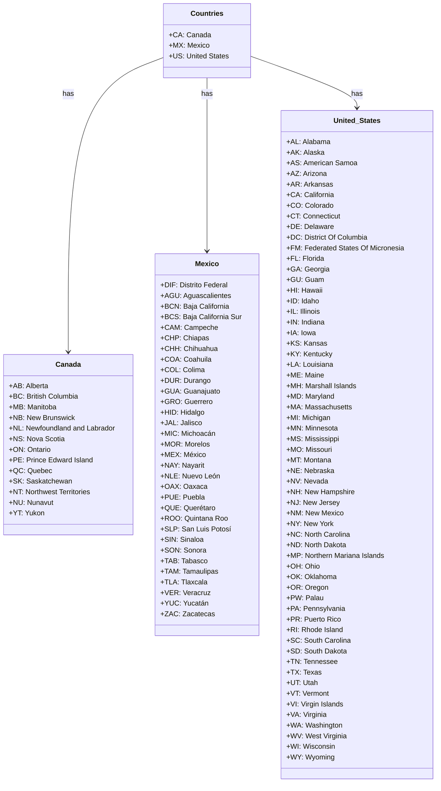

# Diagram: web/portal/src/pages/administration/location-management/constant/LocationManagement.const.js

> Auto-generated by Obscura crawlers

## Mermaid

### SVG

<svg id="container" width="972.75" xmlns="http://www.w3.org/2000/svg" class="classDiagram" height="1770" viewBox="0 0 972.75 1770" role="graphics-document document" aria-roledescription="class"><g><defs><marker id="container_class-aggregationStart" class="marker aggregation class" refX="18" refY="7" markerWidth="190" markerHeight="240" orient="auto"><path d="M 18,7 L9,13 L1,7 L9,1 Z"></path></marker></defs><defs><marker id="container_class-aggregationEnd" class="marker aggregation class" refX="1" refY="7" markerWidth="20" markerHeight="28" orient="auto"><path d="M 18,7 L9,13 L1,7 L9,1 Z"></path></marker></defs><defs><marker id="container_class-extensionStart" class="marker extension class" refX="18" refY="7" markerWidth="190" markerHeight="240" orient="auto"><path d="M 1,7 L18,13 V 1 Z"></path></marker></defs><defs><marker id="container_class-extensionEnd" class="marker extension class" refX="1" refY="7" markerWidth="20" markerHeight="28" orient="auto"><path d="M 1,1 V 13 L18,7 Z"></path></marker></defs><defs><marker id="container_class-compositionStart" class="marker composition class" refX="18" refY="7" markerWidth="190" markerHeight="240" orient="auto"><path d="M 18,7 L9,13 L1,7 L9,1 Z"></path></marker></defs><defs><marker id="container_class-compositionEnd" class="marker composition class" refX="1" refY="7" markerWidth="20" markerHeight="28" orient="auto"><path d="M 18,7 L9,13 L1,7 L9,1 Z"></path></marker></defs><defs><marker id="container_class-dependencyStart" class="marker dependency class" refX="6" refY="7" markerWidth="190" markerHeight="240" orient="auto"><path d="M 5,7 L9,13 L1,7 L9,1 Z"></path></marker></defs><defs><marker id="container_class-dependencyEnd" class="marker dependency class" refX="13" refY="7" markerWidth="20" markerHeight="28" orient="auto"><path d="M 18,7 L9,13 L14,7 L9,1 Z"></path></marker></defs><defs><marker id="container_class-lollipopStart" class="marker lollipop class" refX="13" refY="7" markerWidth="190" markerHeight="240" orient="auto"><circle stroke="black" fill="transparent" cx="7" cy="7" r="6"></circle></marker></defs><defs><marker id="container_class-lollipopEnd" class="marker lollipop class" refX="1" refY="7" markerWidth="190" markerHeight="240" orient="auto"><circle stroke="black" fill="transparent" cx="7" cy="7" r="6"></circle></marker></defs><g class="root"><g class="clusters"></g><g class="edgePaths"><path d="M369.219,129.401L333.499,143.334C297.779,157.267,226.339,185.134,190.618,296.233C154.898,407.333,154.898,601.667,154.898,698.833L154.898,796" id="id_Countries_Canada_1" class="edge-thickness-normal edge-pattern-solid relation" style=";;;" data-edge="true" data-et="edge" data-id="id_Countries_Canada_1" data-points="W3sieCI6MzY5LjIxODc1LCJ5IjoxMjkuNDAwNzIwMjk0MTYyMDh9LHsieCI6MTU0Ljg5ODQzNzUsInkiOjIxM30seyJ4IjoxNTQuODk4NDM3NSwieSI6ODAyfV0=" marker-end="url(#container_class-dependencyEnd)"></path><path d="M465.102,176L465.102,182.167C465.102,188.333,465.102,200.667,465.102,266C465.102,331.333,465.102,449.667,465.102,508.833L465.102,568" id="id_Countries_Mexico_2" class="edge-thickness-normal edge-pattern-solid relation" style=";;;" data-edge="true" data-et="edge" data-id="id_Countries_Mexico_2" data-points="W3sieCI6NDY1LjEwMTU2MjUsInkiOjE3Nn0seyJ4Ijo0NjUuMTAxNTYyNSwieSI6MjEzfSx7IngiOjQ2NS4xMDE1NjI1LCJ5Ijo1NzR9XQ==" marker-end="url(#container_class-dependencyEnd)"></path><path d="M560.984,127L600.25,141.334C639.516,155.667,718.047,184.333,757.313,203.833C796.578,223.333,796.578,233.667,796.578,238.833L796.578,244" id="id_Countries_United_States_3" class="edge-thickness-normal edge-pattern-solid relation" style=";;;" data-edge="true" data-et="edge" data-id="id_Countries_United_States_3" data-points="W3sieCI6NTYwLjk4NDM3NSwieSI6MTI3LjAwMDQyNDIzODEzOX0seyJ4Ijo3OTYuNTc4MTI1LCJ5IjoyMTN9LHsieCI6Nzk2LjU3ODEyNSwieSI6MjUwfV0=" marker-end="url(#container_class-dependencyEnd)"></path></g><g class="edgeLabels"><g class="edgeLabel" transform="translate(154.8984375, 213)"><g class="label" data-id="id_Countries_Canada_1" transform="translate(-12.703125, -12)"><foreignObject width="25.40625" height="24">

has

</foreignObject></g></g><g class="edgeLabel" transform="translate(465.1015625, 213)"><g class="label" data-id="id_Countries_Mexico_2" transform="translate(-12.703125, -12)"><foreignObject width="25.40625" height="24">

has

</foreignObject></g></g><g class="edgeLabel" transform="translate(796.578125, 213)"><g class="label" data-id="id_Countries_United_States_3" transform="translate(-12.703125, -12)"><foreignObject width="25.40625" height="24">

has

</foreignObject></g></g></g><g class="nodes"><g class="node default" id="classId-Countries-0" transform="translate(465.1015625, 92)"><g class="basic label-container"><path d="M-95.8828125 -84 L95.8828125 -84 L95.8828125 84 L-95.8828125 84" stroke="none" stroke-width="0" fill="#ECECFF" style=""></path><path d="M-95.8828125 -84 C-31.806431556063643 -84, 32.269949387872714 -84, 95.8828125 -84 M-95.8828125 -84 C-38.71095811573971 -84, 18.460896268520585 -84, 95.8828125 -84 M95.8828125 -84 C95.8828125 -20.56788539972392, 95.8828125 42.86422920055216, 95.8828125 84 M95.8828125 -84 C95.8828125 -31.941225697201432, 95.8828125 20.117548605597136, 95.8828125 84 M95.8828125 84 C48.01606002690937 84, 0.14930755381874405 84, -95.8828125 84 M95.8828125 84 C57.08131599235882 84, 18.279819484717635 84, -95.8828125 84 M-95.8828125 84 C-95.8828125 49.757090513603146, -95.8828125 15.514181027206291, -95.8828125 -84 M-95.8828125 84 C-95.8828125 29.167337258148308, -95.8828125 -25.665325483703384, -95.8828125 -84" stroke="#9370DB" stroke-width="1.3" fill="none" stroke-dasharray="0 0" style=""></path></g><g class="annotation-group text" transform="translate(0, -60)"></g><g class="label-group text" transform="translate(-35.140625, -60)"><g class="label" style="font-weight: bolder" transform="translate(0,-12)"><foreignObject width="70.28125" height="24">

Countries

</foreignObject></g></g><g class="members-group text" transform="translate(-83.8828125, -12)"><g class="label" style="" transform="translate(0,-12)"><foreignObject width="88.125" height="24">

+CA: Canada

</foreignObject></g><g class="label" style="" transform="translate(0,12)"><foreignObject width="87.125" height="24">

+MX: Mexico

</foreignObject></g><g class="label" style="" transform="translate(0,36)"><foreignObject width="132.625" height="24">

+US: United States

</foreignObject></g></g><g class="methods-group text" transform="translate(-83.8828125, 84)"></g><g class="divider" style=""><path d="M-95.8828125 -36 C-40.78498223151933 -36, 14.312848036961341 -36, 95.8828125 -36 M-95.8828125 -36 C-48.42837414972116 -36, -0.9739357994423159 -36, 95.8828125 -36" stroke="#9370DB" stroke-width="1.3" fill="none" stroke-dasharray="0 0" style=""></path></g><g class="divider" style=""><path d="M-95.8828125 60 C-29.46794041993671 60, 36.94693166012658 60, 95.8828125 60 M-95.8828125 60 C-23.4550954857105 60, 48.972621528579 60, 95.8828125 60" stroke="#9370DB" stroke-width="1.3" fill="none" stroke-dasharray="0 0" style=""></path></g></g><g class="node default" id="classId-Canada-1" transform="translate(154.8984375, 1006)"><g class="basic label-container"><path d="M-146.8984375 -204 L146.8984375 -204 L146.8984375 204 L-146.8984375 204" stroke="none" stroke-width="0" fill="#ECECFF" style=""></path><path d="M-146.8984375 -204 C-85.85408189007264 -204, -24.80972628014527 -204, 146.8984375 -204 M-146.8984375 -204 C-65.92940347403169 -204, 15.039630551936625 -204, 146.8984375 -204 M146.8984375 -204 C146.8984375 -71.16998729472712, 146.8984375 61.66002541054576, 146.8984375 204 M146.8984375 -204 C146.8984375 -79.52556710948615, 146.8984375 44.948865781027706, 146.8984375 204 M146.8984375 204 C71.58393856292311 204, -3.7305603741537823 204, -146.8984375 204 M146.8984375 204 C30.492788578552947 204, -85.9128603428941 204, -146.8984375 204 M-146.8984375 204 C-146.8984375 63.10742028256095, -146.8984375 -77.7851594348781, -146.8984375 -204 M-146.8984375 204 C-146.8984375 117.79212203950277, -146.8984375 31.584244079005543, -146.8984375 -204" stroke="#9370DB" stroke-width="1.3" fill="none" stroke-dasharray="0 0" style=""></path></g><g class="annotation-group text" transform="translate(0, -180)"></g><g class="label-group text" transform="translate(-27.09375, -180)"><g class="label" style="font-weight: bolder" transform="translate(0,-12)"><foreignObject width="54.1875" height="24">

Canada

</foreignObject></g></g><g class="members-group text" transform="translate(-134.8984375, -132)"><g class="label" style="" transform="translate(0,-12)"><foreignObject width="87.4375" height="24">

+AB: Alberta

</foreignObject></g><g class="label" style="" transform="translate(0,12)"><foreignObject width="154.96875" height="24">

+BC: British Columbia

</foreignObject></g><g class="label" style="" transform="translate(0,36)"><foreignObject width="106.21875" height="24">

+MB: Manitoba

</foreignObject></g><g class="label" style="" transform="translate(0,60)"><foreignObject width="145.859375" height="24">

+NB: New Brunswick

</foreignObject></g><g class="label" style="" transform="translate(0,84)"><foreignObject width="242.703125" height="24">

+NL: Newfoundland and Labrador

</foreignObject></g><g class="label" style="" transform="translate(0,108)"><foreignObject width="120.875" height="24">

+NS: Nova Scotia

</foreignObject></g><g class="label" style="" transform="translate(0,132)"><foreignObject width="92.921875" height="24">

+ON: Ontario

</foreignObject></g><g class="label" style="" transform="translate(0,156)"><foreignObject width="185" height="24">

+PE: Prince Edward Island

</foreignObject></g><g class="label" style="" transform="translate(0,180)"><foreignObject width="91.046875" height="24">

+QC: Quebec

</foreignObject></g><g class="label" style="" transform="translate(0,204)"><foreignObject width="135.609375" height="24">

+SK: Saskatchewan

</foreignObject></g><g class="label" style="" transform="translate(0,228)"><foreignObject width="188.640625" height="24">

+NT: Northwest Territories

</foreignObject></g><g class="label" style="" transform="translate(0,252)"><foreignObject width="98.625" height="24">

+NU: Nunavut

</foreignObject></g><g class="label" style="" transform="translate(0,276)"><foreignObject width="75.734375" height="24">

+YT: Yukon

</foreignObject></g></g><g class="methods-group text" transform="translate(-134.8984375, 204)"></g><g class="divider" style=""><path d="M-146.8984375 -156 C-63.751637706132186 -156, 19.395162087735628 -156, 146.8984375 -156 M-146.8984375 -156 C-56.273773028309094 -156, 34.35089144338181 -156, 146.8984375 -156" stroke="#9370DB" stroke-width="1.3" fill="none" stroke-dasharray="0 0" style=""></path></g><g class="divider" style=""><path d="M-146.8984375 180 C-69.05789929870089 180, 8.782638902598222 180, 146.8984375 180 M-146.8984375 180 C-38.367956767603374 180, 70.16252396479325 180, 146.8984375 180" stroke="#9370DB" stroke-width="1.3" fill="none" stroke-dasharray="0 0" style=""></path></g></g><g class="node default" id="classId-Mexico-2" transform="translate(465.1015625, 1006)"><g class="basic label-container"><path d="M-113.3046875 -432 L113.3046875 -432 L113.3046875 432 L-113.3046875 432" stroke="none" stroke-width="0" fill="#ECECFF" style=""></path><path d="M-113.3046875 -432 C-62.43701791925582 -432, -11.569348338511645 -432, 113.3046875 -432 M-113.3046875 -432 C-36.46599578013246 -432, 40.37269593973508 -432, 113.3046875 -432 M113.3046875 -432 C113.3046875 -257.0381991742107, 113.3046875 -82.07639834842138, 113.3046875 432 M113.3046875 -432 C113.3046875 -143.8298699100353, 113.3046875 144.34026017992937, 113.3046875 432 M113.3046875 432 C38.091530835842065 432, -37.12162582831587 432, -113.3046875 432 M113.3046875 432 C31.289469399895182 432, -50.725748700209635 432, -113.3046875 432 M-113.3046875 432 C-113.3046875 189.02502694335794, -113.3046875 -53.94994611328411, -113.3046875 -432 M-113.3046875 432 C-113.3046875 254.4686590657745, -113.3046875 76.93731813154898, -113.3046875 -432" stroke="#9370DB" stroke-width="1.3" fill="none" stroke-dasharray="0 0" style=""></path></g><g class="annotation-group text" transform="translate(0, -408)"></g><g class="label-group text" transform="translate(-25.296875, -408)"><g class="label" style="font-weight: bolder" transform="translate(0,-12)"><foreignObject width="50.59375" height="24">

Mexico

</foreignObject></g></g><g class="members-group text" transform="translate(-101.3046875, -360)"><g class="label" style="" transform="translate(0,-12)"><foreignObject width="149.65625" height="24">

+DIF: Distrito Federal

</foreignObject></g><g class="label" style="" transform="translate(0,12)"><foreignObject width="153.3125" height="24">

+AGU: Aguascalientes

</foreignObject></g><g class="label" style="" transform="translate(0,36)"><foreignObject width="151.234375" height="24">

+BCN: Baja California

</foreignObject></g><g class="label" style="" transform="translate(0,60)"><foreignObject width="177.3125" height="24">

+BCS: Baja California Sur

</foreignObject></g><g class="label" style="" transform="translate(0,84)"><foreignObject width="121.828125" height="24">

+CAM: Campeche

</foreignObject></g><g class="label" style="" transform="translate(0,108)"><foreignObject width="101.875" height="24">

+CHP: Chiapas

</foreignObject></g><g class="label" style="" transform="translate(0,132)"><foreignObject width="124.265625" height="24">

+CHH: Chihuahua

</foreignObject></g><g class="label" style="" transform="translate(0,156)"><foreignObject width="107.890625" height="24">

+COA: Coahuila

</foreignObject></g><g class="label" style="" transform="translate(0,180)"><foreignObject width="93.359375" height="24">

+COL: Colima

</foreignObject></g><g class="label" style="" transform="translate(0,204)"><foreignObject width="107.375" height="24">

+DUR: Durango

</foreignObject></g><g class="label" style="" transform="translate(0,228)"><foreignObject width="129.234375" height="24">

+GUA: Guanajuato

</foreignObject></g><g class="label" style="" transform="translate(0,252)"><foreignObject width="110.53125" height="24">

+GRO: Guerrero

</foreignObject></g><g class="label" style="" transform="translate(0,276)"><foreignObject width="97.578125" height="24">

+HID: Hidalgo

</foreignObject></g><g class="label" style="" transform="translate(0,300)"><foreignObject width="84.71875" height="24">

+JAL: Jalisco

</foreignObject></g><g class="label" style="" transform="translate(0,324)"><foreignObject width="119.640625" height="24">

+MIC: Michoacán

</foreignObject></g><g class="label" style="" transform="translate(0,348)"><foreignObject width="106.75" height="24">

+MOR: Morelos

</foreignObject></g><g class="label" style="" transform="translate(0,372)"><foreignObject width="95.6875" height="24">

+MEX: México

</foreignObject></g><g class="label" style="" transform="translate(0,396)"><foreignObject width="95.5" height="24">

+NAY: Nayarit

</foreignObject></g><g class="label" style="" transform="translate(0,420)"><foreignObject width="128.828125" height="24">

+NLE: Nuevo León

</foreignObject></g><g class="label" style="" transform="translate(0,444)"><foreignObject width="96.828125" height="24">

+OAX: Oaxaca

</foreignObject></g><g class="label" style="" transform="translate(0,468)"><foreignObject width="94.234375" height="24">

+PUE: Puebla

</foreignObject></g><g class="label" style="" transform="translate(0,492)"><foreignObject width="119.1875" height="24">

+QUE: Querétaro

</foreignObject></g><g class="label" style="" transform="translate(0,516)"><foreignObject width="146.828125" height="24">

+ROO: Quintana Roo

</foreignObject></g><g class="label" style="" transform="translate(0,540)"><foreignObject width="150.671875" height="24">

+SLP: San Luis Potosí

</foreignObject></g><g class="label" style="" transform="translate(0,564)"><foreignObject width="93.453125" height="24">

+SIN: Sinaloa

</foreignObject></g><g class="label" style="" transform="translate(0,588)"><foreignObject width="97.25" height="24">

+SON: Sonora

</foreignObject></g><g class="label" style="" transform="translate(0,612)"><foreignObject width="99.84375" height="24">

+TAB: Tabasco

</foreignObject></g><g class="label" style="" transform="translate(0,636)"><foreignObject width="126.828125" height="24">

+TAM: Tamaulipas

</foreignObject></g><g class="label" style="" transform="translate(0,660)"><foreignObject width="99.125" height="24">

+TLA: Tlaxcala

</foreignObject></g><g class="label" style="" transform="translate(0,684)"><foreignObject width="104.46875" height="24">

+VER: Veracruz

</foreignObject></g><g class="label" style="" transform="translate(0,708)"><foreignObject width="100.828125" height="24">

+YUC: Yucatán

</foreignObject></g><g class="label" style="" transform="translate(0,732)"><foreignObject width="112.6875" height="24">

+ZAC: Zacatecas

</foreignObject></g></g><g class="methods-group text" transform="translate(-101.3046875, 432)"></g><g class="divider" style=""><path d="M-113.3046875 -384 C-54.42980540585842 -384, 4.445076688283166 -384, 113.3046875 -384 M-113.3046875 -384 C-58.67748204057775 -384, -4.050276581155501 -384, 113.3046875 -384" stroke="#9370DB" stroke-width="1.3" fill="none" stroke-dasharray="0 0" style=""></path></g><g class="divider" style=""><path d="M-113.3046875 408 C-64.94276393468937 408, -16.58084036937875 408, 113.3046875 408 M-113.3046875 408 C-29.908478267211308 408, 53.487730965577384 408, 113.3046875 408" stroke="#9370DB" stroke-width="1.3" fill="none" stroke-dasharray="0 0" style=""></path></g></g><g class="node default" id="classId-United_States-3" transform="translate(796.578125, 1006)"><g class="basic label-container"><path d="M-168.171875 -756 L168.171875 -756 L168.171875 756 L-168.171875 756" stroke="none" stroke-width="0" fill="#ECECFF" style=""></path><path d="M-168.171875 -756 C-38.93628409972058 -756, 90.29930680055884 -756, 168.171875 -756 M-168.171875 -756 C-75.17870982877616 -756, 17.814455342447673 -756, 168.171875 -756 M168.171875 -756 C168.171875 -439.1183933518231, 168.171875 -122.2367867036462, 168.171875 756 M168.171875 -756 C168.171875 -317.2346896420236, 168.171875 121.53062071595275, 168.171875 756 M168.171875 756 C94.00986458814113 756, 19.847854176282254 756, -168.171875 756 M168.171875 756 C72.51035696970948 756, -23.151161060581046 756, -168.171875 756 M-168.171875 756 C-168.171875 264.78339441566015, -168.171875 -226.4332111686797, -168.171875 -756 M-168.171875 756 C-168.171875 376.8908218181545, -168.171875 -2.2183563636909867, -168.171875 -756" stroke="#9370DB" stroke-width="1.3" fill="none" stroke-dasharray="0 0" style=""></path></g><g class="annotation-group text" transform="translate(0, -732)"></g><g class="label-group text" transform="translate(-51.421875, -732)"><g class="label" style="font-weight: bolder" transform="translate(0,-12)"><foreignObject width="102.84375" height="24">

United_States

</foreignObject></g></g><g class="members-group text" transform="translate(-156.171875, -684)"><g class="label" style="" transform="translate(0,-12)"><foreignObject width="95.984375" height="24">

+AL: Alabama

</foreignObject></g><g class="label" style="" transform="translate(0,12)"><foreignObject width="80.953125" height="24">

+AK: Alaska

</foreignObject></g><g class="label" style="" transform="translate(0,36)"><foreignObject width="154.921875" height="24">

+AS: American Samoa

</foreignObject></g><g class="label" style="" transform="translate(0,60)"><foreignObject width="87.59375" height="24">

+AZ: Arizona

</foreignObject></g><g class="label" style="" transform="translate(0,84)"><foreignObject width="99.46875" height="24">

+AR: Arkansas

</foreignObject></g><g class="label" style="" transform="translate(0,108)"><foreignObject width="104.125" height="24">

+CA: California

</foreignObject></g><g class="label" style="" transform="translate(0,132)"><foreignObject width="100.953125" height="24">

+CO: Colorado

</foreignObject></g><g class="label" style="" transform="translate(0,156)"><foreignObject width="118.46875" height="24">

+CT: Connecticut

</foreignObject></g><g class="label" style="" transform="translate(0,180)"><foreignObject width="101.59375" height="24">

+DE: Delaware

</foreignObject></g><g class="label" style="" transform="translate(0,204)"><foreignObject width="180.84375" height="24">

+DC: District Of Columbia

</foreignObject></g><g class="label" style="" transform="translate(0,228)"><foreignObject width="260.921875" height="24">

+FM: Federated States Of Micronesia

</foreignObject></g><g class="label" style="" transform="translate(0,252)"><foreignObject width="82.5" height="24">

+FL: Florida

</foreignObject></g><g class="label" style="" transform="translate(0,276)"><foreignObject width="91.03125" height="24">

+GA: Georgia

</foreignObject></g><g class="label" style="" transform="translate(0,300)"><foreignObject width="78.578125" height="24">

+GU: Guam

</foreignObject></g><g class="label" style="" transform="translate(0,324)"><foreignObject width="80.1875" height="24">

+HI: Hawaii

</foreignObject></g><g class="label" style="" transform="translate(0,348)"><foreignObject width="72.8125" height="24">

+ID: Idaho

</foreignObject></g><g class="label" style="" transform="translate(0,372)"><foreignObject width="78.078125" height="24">

+IL: Illinois

</foreignObject></g><g class="label" style="" transform="translate(0,396)"><foreignObject width="86.6875" height="24">

+IN: Indiana

</foreignObject></g><g class="label" style="" transform="translate(0,420)"><foreignObject width="64.078125" height="24">

+IA: Iowa

</foreignObject></g><g class="label" style="" transform="translate(0,444)"><foreignObject width="84.78125" height="24">

+KS: Kansas

</foreignObject></g><g class="label" style="" transform="translate(0,468)"><foreignObject width="99.53125" height="24">

+KY: Kentucky

</foreignObject></g><g class="label" style="" transform="translate(0,492)"><foreignObject width="102.78125" height="24">

+LA: Louisiana

</foreignObject></g><g class="label" style="" transform="translate(0,516)"><foreignObject width="80.84375" height="24">

+ME: Maine

</foreignObject></g><g class="label" style="" transform="translate(0,540)"><foreignObject width="157.421875" height="24">

+MH: Marshall Islands

</foreignObject></g><g class="label" style="" transform="translate(0,564)"><foreignObject width="106.28125" height="24">

+MD: Maryland

</foreignObject></g><g class="label" style="" transform="translate(0,588)"><foreignObject width="143.625" height="24">

+MA: Massachusetts

</foreignObject></g><g class="label" style="" transform="translate(0,612)"><foreignObject width="97.828125" height="24">

+MI: Michigan

</foreignObject></g><g class="label" style="" transform="translate(0,636)"><foreignObject width="115.0625" height="24">

+MN: Minnesota

</foreignObject></g><g class="label" style="" transform="translate(0,660)"><foreignObject width="116.078125" height="24">

+MS: Mississippi

</foreignObject></g><g class="label" style="" transform="translate(0,684)"><foreignObject width="100.515625" height="24">

+MO: Missouri

</foreignObject></g><g class="label" style="" transform="translate(0,708)"><foreignObject width="99.546875" height="24">

+MT: Montana

</foreignObject></g><g class="label" style="" transform="translate(0,732)"><foreignObject width="103" height="24">

+NE: Nebraska

</foreignObject></g><g class="label" style="" transform="translate(0,756)"><foreignObject width="89.90625" height="24">

+NV: Nevada

</foreignObject></g><g class="label" style="" transform="translate(0,780)"><foreignObject width="151.8125" height="24">

+NH: New Hampshire

</foreignObject></g><g class="label" style="" transform="translate(0,804)"><foreignObject width="110.78125" height="24">

+NJ: New Jersey

</foreignObject></g><g class="label" style="" transform="translate(0,828)"><foreignObject width="124.78125" height="24">

+NM: New Mexico

</foreignObject></g><g class="label" style="" transform="translate(0,852)"><foreignObject width="101.859375" height="24">

+NY: New York

</foreignObject></g><g class="label" style="" transform="translate(0,876)"><foreignObject width="141.625" height="24">

+NC: North Carolina

</foreignObject></g><g class="label" style="" transform="translate(0,900)"><foreignObject width="133.75" height="24">

+ND: North Dakota

</foreignObject></g><g class="label" style="" transform="translate(0,924)"><foreignObject width="222.625" height="24">

+MP: Northern Mariana Islands

</foreignObject></g><g class="label" style="" transform="translate(0,948)"><foreignObject width="72.328125" height="24">

+OH: Ohio

</foreignObject></g><g class="label" style="" transform="translate(0,972)"><foreignObject width="110.28125" height="24">

+OK: Oklahoma

</foreignObject></g><g class="label" style="" transform="translate(0,996)"><foreignObject width="89.09375" height="24">

+OR: Oregon

</foreignObject></g><g class="label" style="" transform="translate(0,1020)"><foreignObject width="78.015625" height="24">

+PW: Palau

</foreignObject></g><g class="label" style="" transform="translate(0,1044)"><foreignObject width="128.4375" height="24">

+PA: Pennsylvania

</foreignObject></g><g class="label" style="" transform="translate(0,1068)"><foreignObject width="118.109375" height="24">

+PR: Puerto Rico

</foreignObject></g><g class="label" style="" transform="translate(0,1092)"><foreignObject width="125.84375" height="24">

+RI: Rhode Island

</foreignObject></g><g class="label" style="" transform="translate(0,1116)"><foreignObject width="139.703125" height="24">

+SC: South Carolina

</foreignObject></g><g class="label" style="" transform="translate(0,1140)"><foreignObject width="131.828125" height="24">

+SD: South Dakota

</foreignObject></g><g class="label" style="" transform="translate(0,1164)"><foreignObject width="110.28125" height="24">

+TN: Tennessee

</foreignObject></g><g class="label" style="" transform="translate(0,1188)"><foreignObject width="71.6875" height="24">

+TX: Texas

</foreignObject></g><g class="label" style="" transform="translate(0,1212)"><foreignObject width="68.625" height="24">

+UT: Utah

</foreignObject></g><g class="label" style="" transform="translate(0,1236)"><foreignObject width="93.796875" height="24">

+VT: Vermont

</foreignObject></g><g class="label" style="" transform="translate(0,1260)"><foreignObject width="127" height="24">

+VI: Virgin Islands

</foreignObject></g><g class="label" style="" transform="translate(0,1284)"><foreignObject width="88.34375" height="24">

+VA: Virginia

</foreignObject></g><g class="label" style="" transform="translate(0,1308)"><foreignObject width="123.109375" height="24">

+WA: Washington

</foreignObject></g><g class="label" style="" transform="translate(0,1332)"><foreignObject width="132.0625" height="24">

+WV: West Virginia

</foreignObject></g><g class="label" style="" transform="translate(0,1356)"><foreignObject width="106.609375" height="24">

+WI: Wisconsin

</foreignObject></g><g class="label" style="" transform="translate(0,1380)"><foreignObject width="103.515625" height="24">

+WY: Wyoming

</foreignObject></g></g><g class="methods-group text" transform="translate(-156.171875, 756)"></g><g class="divider" style=""><path d="M-168.171875 -708 C-49.99518639000269 -708, 68.18150221999463 -708, 168.171875 -708 M-168.171875 -708 C-71.53510484283369 -708, 25.10166531433262 -708, 168.171875 -708" stroke="#9370DB" stroke-width="1.3" fill="none" stroke-dasharray="0 0" style=""></path></g><g class="divider" style=""><path d="M-168.171875 732 C-68.11605677232161 732, 31.939761455356773 732, 168.171875 732 M-168.171875 732 C-51.2600398320791 732, 65.6517953358418 732, 168.171875 732" stroke="#9370DB" stroke-width="1.3" fill="none" stroke-dasharray="0 0" style=""></path></g></g></g></g></g></svg>
