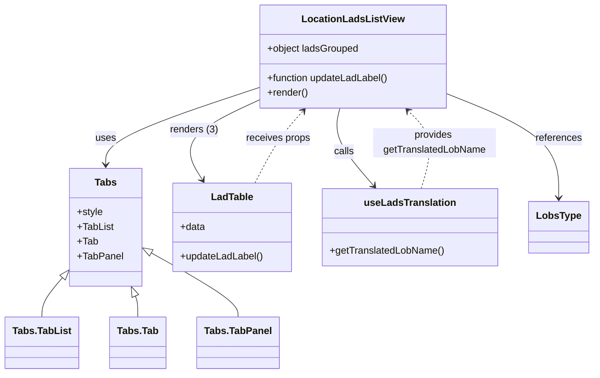

# Diagram: web/portal/src/pages/administration/location-management/lads/LocationManagement.Lads.page.js


> Auto-generated by Obscura crawlers

## Diagram 1



### SVG

<svg id="container" width="995.91015625" xmlns="http://www.w3.org/2000/svg" class="classDiagram" height="608" viewBox="0 0 995.91015625 608" role="graphics-document document" aria-roledescription="class"><style>#container{font-family:"trebuchet ms",verdana,arial,sans-serif;font-size:16px;fill:#333;}@keyframes edge-animation-frame{from{stroke-dashoffset:0;}}@keyframes dash{to{stroke-dashoffset:0;}}#container .edge-animation-slow{stroke-dasharray:9,5!important;stroke-dashoffset:900;animation:dash 50s linear infinite;stroke-linecap:round;}#container .edge-animation-fast{stroke-dasharray:9,5!important;stroke-dashoffset:900;animation:dash 20s linear infinite;stroke-linecap:round;}#container .error-icon{fill:#552222;}#container .error-text{fill:#552222;stroke:#552222;}#container .edge-thickness-normal{stroke-width:1px;}#container .edge-thickness-thick{stroke-width:3.5px;}#container .edge-pattern-solid{stroke-dasharray:0;}#container .edge-thickness-invisible{stroke-width:0;fill:none;}#container .edge-pattern-dashed{stroke-dasharray:3;}#container .edge-pattern-dotted{stroke-dasharray:2;}#container .marker{fill:#333333;stroke:#333333;}#container .marker.cross{stroke:#333333;}#container svg{font-family:"trebuchet ms",verdana,arial,sans-serif;font-size:16px;}#container p{margin:0;}#container g.classGroup text{fill:#9370DB;stroke:none;font-family:"trebuchet ms",verdana,arial,sans-serif;font-size:10px;}#container g.classGroup text .title{font-weight:bolder;}#container .nodeLabel,#container .edgeLabel{color:#131300;}#container .edgeLabel .label rect{fill:#ECECFF;}#container .label text{fill:#131300;}#container .labelBkg{background:#ECECFF;}#container .edgeLabel .label span{background:#ECECFF;}#container .classTitle{font-weight:bolder;}#container .node rect,#container .node circle,#container .node ellipse,#container .node polygon,#container .node path{fill:#ECECFF;stroke:#9370DB;stroke-width:1px;}#container .divider{stroke:#9370DB;stroke-width:1;}#container g.clickable{cursor:pointer;}#container g.classGroup rect{fill:#ECECFF;stroke:#9370DB;}#container g.classGroup line{stroke:#9370DB;stroke-width:1;}#container .classLabel .box{stroke:none;stroke-width:0;fill:#ECECFF;opacity:0.5;}#container .classLabel .label{fill:#9370DB;font-size:10px;}#container .relation{stroke:#333333;stroke-width:1;fill:none;}#container .dashed-line{stroke-dasharray:3;}#container .dotted-line{stroke-dasharray:1 2;}#container #compositionStart,#container .composition{fill:#333333!important;stroke:#333333!important;stroke-width:1;}#container #compositionEnd,#container .composition{fill:#333333!important;stroke:#333333!important;stroke-width:1;}#container #dependencyStart,#container .dependency{fill:#333333!important;stroke:#333333!important;stroke-width:1;}#container #dependencyStart,#container .dependency{fill:#333333!important;stroke:#333333!important;stroke-width:1;}#container #extensionStart,#container .extension{fill:transparent!important;stroke:#333333!important;stroke-width:1;}#container #extensionEnd,#container .extension{fill:transparent!important;stroke:#333333!important;stroke-width:1;}#container #aggregationStart,#container .aggregation{fill:transparent!important;stroke:#333333!important;stroke-width:1;}#container #aggregationEnd,#container .aggregation{fill:transparent!important;stroke:#333333!important;stroke-width:1;}#container #lollipopStart,#container .lollipop{fill:#ECECFF!important;stroke:#333333!important;stroke-width:1;}#container #lollipopEnd,#container .lollipop{fill:#ECECFF!important;stroke:#333333!important;stroke-width:1;}#container .edgeTerminals{font-size:11px;line-height:initial;}#container .classTitleText{text-anchor:middle;font-size:18px;fill:#333;}#container .label-icon{display:inline-block;height:1em;overflow:visible;vertical-align:-0.125em;}#container .node .label-icon path{fill:currentColor;stroke:revert;stroke-width:revert;}#container :root{--mermaid-font-family:"trebuchet ms",verdana,arial,sans-serif;}</style><g><defs><marker id="container_class-aggregationStart" class="marker aggregation class" refX="18" refY="7" markerWidth="190" markerHeight="240" orient="auto"><path d="M 18,7 L9,13 L1,7 L9,1 Z"></path></marker></defs><defs><marker id="container_class-aggregationEnd" class="marker aggregation class" refX="1" refY="7" markerWidth="20" markerHeight="28" orient="auto"><path d="M 18,7 L9,13 L1,7 L9,1 Z"></path></marker></defs><defs><marker id="container_class-extensionStart" class="marker extension class" refX="18" refY="7" markerWidth="190" markerHeight="240" orient="auto"><path d="M 1,7 L18,13 V 1 Z"></path></marker></defs><defs><marker id="container_class-extensionEnd" class="marker extension class" refX="1" refY="7" markerWidth="20" markerHeight="28" orient="auto"><path d="M 1,1 V 13 L18,7 Z"></path></marker></defs><defs><marker id="container_class-compositionStart" class="marker composition class" refX="18" refY="7" markerWidth="190" markerHeight="240" orient="auto"><path d="M 18,7 L9,13 L1,7 L9,1 Z"></path></marker></defs><defs><marker id="container_class-compositionEnd" class="marker composition class" refX="1" refY="7" markerWidth="20" markerHeight="28" orient="auto"><path d="M 18,7 L9,13 L1,7 L9,1 Z"></path></marker></defs><defs><marker id="container_class-dependencyStart" class="marker dependency class" refX="6" refY="7" markerWidth="190" markerHeight="240" orient="auto"><path d="M 5,7 L9,13 L1,7 L9,1 Z"></path></marker></defs><defs><marker id="container_class-dependencyEnd" class="marker dependency class" refX="13" refY="7" markerWidth="20" markerHeight="28" orient="auto"><path d="M 18,7 L9,13 L14,7 L9,1 Z"></path></marker></defs><defs><marker id="container_class-lollipopStart" class="marker lollipop class" refX="13" refY="7" markerWidth="190" markerHeight="240" orient="auto"><circle stroke="black" fill="transparent" cx="7" cy="7" r="6"></circle></marker></defs><defs><marker id="container_class-lollipopEnd" class="marker lollipop class" refX="1" refY="7" markerWidth="190" markerHeight="240" orient="auto"><circle stroke="black" fill="transparent" cx="7" cy="7" r="6"></circle></marker></defs><g class="root"><g class="clusters"></g><g class="edgePaths"><path d="M409.816,150.172L377.352,162.644C344.888,175.115,279.96,200.057,247.495,219.695C215.031,239.333,215.031,253.667,215.031,260.833L215.031,268" id="id_LocationLadsListView_Tabs_1" class="edge-thickness-normal edge-pattern-solid relation" style=";;;" data-edge="true" data-et="edge" data-id="id_LocationLadsListView_Tabs_1" data-points="W3sieCI6NDA5LjgxNjQwNjI1LCJ5IjoxNTAuMTcyNDAwMTc2MDEwNjV9LHsieCI6MjE1LjAzMTI1LCJ5IjoyMjV9LHsieCI6MjE1LjAzMTI1LCJ5IjoyNzR9XQ==" marker-end="url(#container_class-dependencyEnd)"></path><path d="M409.816,166.407L389.942,176.172C370.068,185.938,330.319,205.469,320.478,226.65C310.638,247.831,330.706,270.662,340.739,282.078L350.773,293.493" id="id_LocationLadsListView_LadTable_2" class="edge-thickness-normal edge-pattern-solid relation" style=";;;" data-edge="true" data-et="edge" data-id="id_LocationLadsListView_LadTable_2" data-points="W3sieCI6NDA5LjgxNjQwNjI1LCJ5IjoxNjYuNDA2OTA5Nzg4ODY3NTV9LHsieCI6MjkwLjU3MDMxMjUsInkiOjIyNX0seyJ4IjozNTQuNzM0NDAxOTM5NjU1MiwieSI6Mjk4fV0=" marker-end="url(#container_class-dependencyEnd)"></path><path d="M541.847,176L539.961,184.167C538.075,192.333,534.303,208.667,548.044,229.86C561.784,251.053,593.037,277.105,608.663,290.132L624.289,303.158" id="id_LocationLadsListView_useLadsTranslation_3" class="edge-thickness-normal edge-pattern-solid relation" style=";;;" data-edge="true" data-et="edge" data-id="id_LocationLadsListView_useLadsTranslation_3" data-points="W3sieCI6NTQxLjg0NzI0NTA2NTc4OTUsInkiOjE3Nn0seyJ4Ijo1MzAuNTMxMjUsInkiOjIyNX0seyJ4Ijo2MjguODk4MTE0MjI0MTM3OSwieSI6MzA3fV0=" marker-end="url(#container_class-dependencyEnd)"></path><path d="M712.676,144.985L750.789,158.321C788.902,171.657,865.129,198.328,903.242,227.831C941.355,257.333,941.355,289.667,941.355,305.833L941.355,322" id="id_LocationLadsListView_LobsType_4" class="edge-thickness-normal edge-pattern-solid relation" style=";;;" data-edge="true" data-et="edge" data-id="id_LocationLadsListView_LobsType_4" data-points="W3sieCI6NzEyLjY3NTc4MTI1LCJ5IjoxNDQuOTg1MTM5OTY3OTM2ODV9LHsieCI6OTQxLjM1NTQ2ODc1LCJ5IjoyMjV9LHsieCI6OTQxLjM1NTQ2ODc1LCJ5IjozMjh9XQ==" marker-end="url(#container_class-dependencyEnd)"></path><path d="M144.733,426.613L131.408,437.344C118.082,448.075,91.432,469.538,78.107,484.435C64.781,499.333,64.781,507.667,64.781,511.833L64.781,516" id="id_Tabs_Tabs.TabList_5" class="edge-thickness-normal edge-pattern-solid relation" style=";;;" data-edge="true" data-et="edge" data-id="id_Tabs_Tabs.TabList_5" data-points="W3sieCI6MTU4LjE2Nzk2ODc1LCJ5Ijo0MTUuNzkzMzkxMjIyOTYxNzZ9LHsieCI6NjQuNzgxMjUsInkiOjQ5MX0seyJ4Ijo2NC43ODEyNSwieSI6NTE2fV0=" marker-start="url(#container_class-extensionStart)"></path><path d="M215.031,483.25L215.031,484.542C215.031,485.833,215.031,488.417,215.031,493.875C215.031,499.333,215.031,507.667,215.031,511.833L215.031,516" id="id_Tabs_Tabs.Tab_6" class="edge-thickness-normal edge-pattern-solid relation" style=";;;" data-edge="true" data-et="edge" data-id="id_Tabs_Tabs.Tab_6" data-points="W3sieCI6MjE1LjAzMTI1LCJ5Ijo0NjZ9LHsieCI6MjE1LjAzMTI1LCJ5Ijo0OTF9LHsieCI6MjE1LjAzMTI1LCJ5Ijo1MTZ9XQ==" marker-start="url(#container_class-extensionStart)"></path><path d="M285.561,424.32L299.991,435.433C314.421,446.546,343.281,468.773,357.711,484.053C372.141,499.333,372.141,507.667,372.141,511.833L372.141,516" id="id_Tabs_Tabs.TabPanel_7" class="edge-thickness-normal edge-pattern-solid relation" style=";;;" data-edge="true" data-et="edge" data-id="id_Tabs_Tabs.TabPanel_7" data-points="W3sieCI6MjcxLjg5NDUzMTI1LCJ5Ijo0MTMuNzk0MDU3NjgyNzQ0OX0seyJ4IjozNzIuMTQwNjI1LCJ5Ijo0OTF9LHsieCI6MzcyLjE0MDYyNSwieSI6NTE2fV0=" marker-start="url(#container_class-extensionStart)"></path><path d="M429.784,298L431.771,285.833C433.759,273.667,437.735,249.333,446.394,229.744C455.054,210.154,468.397,195.308,475.068,187.885L481.739,180.463" id="id_LadTable_LocationLadsListView_8" class="edge-thickness-normal edge-pattern-dashed relation" style=";;;" data-edge="true" data-et="edge" data-id="id_LadTable_LocationLadsListView_8" data-points="W3sieCI6NDI5Ljc4MzUzOTg3MDY4OTY1LCJ5IjoyOTh9LHsieCI6NDQxLjcxMDkzNzUsInkiOjIyNX0seyJ4Ijo0ODUuNzUwMjA1NTkyMTA1MjYsInkiOjE3Nn1d" marker-end="url(#container_class-dependencyEnd)"></path><path d="M704.473,307L704.473,293.333C704.473,279.667,704.473,252.333,696.411,231.18C688.349,210.028,672.225,195.055,664.164,187.569L656.102,180.083" id="id_useLadsTranslation_LocationLadsListView_9" class="edge-thickness-normal edge-pattern-dashed relation" style=";;;" data-edge="true" data-et="edge" data-id="id_useLadsTranslation_LocationLadsListView_9" data-points="W3sieCI6NzA0LjQ3MjY1NjI1LCJ5IjozMDd9LHsieCI6NzA0LjQ3MjY1NjI1LCJ5IjoyMjV9LHsieCI6NjUxLjcwNDk3NTMyODk0NzQsInkiOjE3Nn1d" marker-end="url(#container_class-dependencyEnd)"></path></g><g class="edgeLabels"><g class="edgeLabel" transform="translate(215.03125, 225)"><g class="label" data-id="id_LocationLadsListView_Tabs_1" transform="translate(-16.4921875, -12)"><foreignObject width="32.984375" height="24"><div xmlns="http://www.w3.org/1999/xhtml" class="labelBkg" style="display: table-cell; white-space: nowrap; line-height: 1.5; max-width: 200px; text-align: center;"><span class="edgeLabel"><p>uses</p></span></div></foreignObject></g></g><g class="edgeLabel" transform="translate(306.57872, 217.13406)"><g class="label" data-id="id_LocationLadsListView_LadTable_2" transform="translate(-39.046875, -12)"><foreignObject width="78.09375" height="24"><div xmlns="http://www.w3.org/1999/xhtml" class="labelBkg" style="display: table-cell; white-space: nowrap; line-height: 1.5; max-width: 200px; text-align: center;"><span class="edgeLabel"><p>renders (3)</p></span></div></foreignObject></g></g><g class="edgeLabel" transform="translate(560.40055, 249.89947)"><g class="label" data-id="id_LocationLadsListView_useLadsTranslation_3" transform="translate(-16.4453125, -12)"><foreignObject width="32.890625" height="24"><div xmlns="http://www.w3.org/1999/xhtml" class="labelBkg" style="display: table-cell; white-space: nowrap; line-height: 1.5; max-width: 200px; text-align: center;"><span class="edgeLabel"><p>calls</p></span></div></foreignObject></g></g><g class="edgeLabel" transform="translate(941.35546875, 225)"><g class="label" data-id="id_LocationLadsListView_LobsType_4" transform="translate(-37.828125, -12)"><foreignObject width="75.65625" height="24"><div xmlns="http://www.w3.org/1999/xhtml" class="labelBkg" style="display: table-cell; white-space: nowrap; line-height: 1.5; max-width: 200px; text-align: center;"><span class="edgeLabel"><p>references</p></span></div></foreignObject></g></g><g class="edgeLabel"><g class="label" data-id="id_Tabs_Tabs.TabList_5" transform="translate(0, 0)"><foreignObject width="0" height="0"><div xmlns="http://www.w3.org/1999/xhtml" class="labelBkg" style="display: table-cell; white-space: nowrap; line-height: 1.5; max-width: 200px; text-align: center;"><span class="edgeLabel"></span></div></foreignObject></g></g><g class="edgeLabel"><g class="label" data-id="id_Tabs_Tabs.Tab_6" transform="translate(0, 0)"><foreignObject width="0" height="0"><div xmlns="http://www.w3.org/1999/xhtml" class="labelBkg" style="display: table-cell; white-space: nowrap; line-height: 1.5; max-width: 200px; text-align: center;"><span class="edgeLabel"></span></div></foreignObject></g></g><g class="edgeLabel"><g class="label" data-id="id_Tabs_Tabs.TabPanel_7" transform="translate(0, 0)"><foreignObject width="0" height="0"><div xmlns="http://www.w3.org/1999/xhtml" class="labelBkg" style="display: table-cell; white-space: nowrap; line-height: 1.5; max-width: 200px; text-align: center;"><span class="edgeLabel"></span></div></foreignObject></g></g><g class="edgeLabel" transform="translate(441.05901, 228.99001)"><g class="label" data-id="id_LadTable_LocationLadsListView_8" transform="translate(-52.375, -12)"><foreignObject width="104.75" height="24"><div xmlns="http://www.w3.org/1999/xhtml" class="labelBkg" style="display: table-cell; white-space: nowrap; line-height: 1.5; max-width: 200px; text-align: center;"><span class="edgeLabel"><p>receives props</p></span></div></foreignObject></g></g><g class="edgeLabel" transform="translate(704.47265625, 225)"><g class="label" data-id="id_useLadsTranslation_LocationLadsListView_9" transform="translate(-100, -24)"><foreignObject width="200" height="48"><div xmlns="http://www.w3.org/1999/xhtml" class="labelBkg" style="display: table; white-space: break-spaces; line-height: 1.5; max-width: 200px; text-align: center; width: 200px;"><span class="edgeLabel"><p>provides getTranslatedLobName</p></span></div></foreignObject></g></g></g><g class="nodes"><g class="node default" id="classId-LocationLadsListView-0" transform="translate(561.24609375, 92)"><g class="basic label-container"><path d="M-151.4296875 -84 L151.4296875 -84 L151.4296875 84 L-151.4296875 84" stroke="none" stroke-width="0" fill="#ECECFF" style=""></path><path d="M-151.4296875 -84 C-47.388105239260355 -84, 56.65347702147929 -84, 151.4296875 -84 M-151.4296875 -84 C-30.7010772987541 -84, 90.0275329024918 -84, 151.4296875 -84 M151.4296875 -84 C151.4296875 -39.140213900588364, 151.4296875 5.719572198823272, 151.4296875 84 M151.4296875 -84 C151.4296875 -30.631130721783883, 151.4296875 22.737738556432234, 151.4296875 84 M151.4296875 84 C42.079225229447374 84, -67.27123704110525 84, -151.4296875 84 M151.4296875 84 C79.28477598073064 84, 7.139864461461286 84, -151.4296875 84 M-151.4296875 84 C-151.4296875 31.70398058102127, -151.4296875 -20.59203883795746, -151.4296875 -84 M-151.4296875 84 C-151.4296875 27.688545264347994, -151.4296875 -28.622909471304013, -151.4296875 -84" stroke="#9370DB" stroke-width="1.3" fill="none" stroke-dasharray="0 0" style=""></path></g><g class="annotation-group text" transform="translate(0, -60)"></g><g class="label-group text" transform="translate(-78.953125, -60)"><g class="label" style="font-weight: bolder" transform="translate(0,-12)"><foreignObject width="157.90625" height="24"><div xmlns="http://www.w3.org/1999/xhtml" style="display: table-cell; white-space: nowrap; line-height: 1.5; max-width: 206px; text-align: center;"><span class="nodeLabel markdown-node-label" style=""><p>LocationLadsListView</p></span></div></foreignObject></g></g><g class="members-group text" transform="translate(-139.4296875, -12)"><g class="label" style="" transform="translate(0,-12)"><foreignObject width="150.296875" height="24"><div xmlns="http://www.w3.org/1999/xhtml" style="display: table-cell; white-space: nowrap; line-height: 1.5; max-width: 208px; text-align: center;"><span class="nodeLabel markdown-node-label" style=""><p>+object ladsGrouped</p></span></div></foreignObject></g></g><g class="methods-group text" transform="translate(-139.4296875, 36)"><g class="label" style="" transform="translate(0,-12)"><foreignObject width="199.90625" height="24"><div xmlns="http://www.w3.org/1999/xhtml" style="display: table-cell; white-space: nowrap; line-height: 1.5; max-width: 257px; text-align: center;"><span class="nodeLabel markdown-node-label" style=""><p>+function updateLadLabel()</p></span></div></foreignObject></g><g class="label" style="" transform="translate(0,12)"><foreignObject width="66.609375" height="24"><div xmlns="http://www.w3.org/1999/xhtml" style="display: table-cell; white-space: nowrap; line-height: 1.5; max-width: 124px; text-align: center;"><span class="nodeLabel markdown-node-label" style=""><p>+render()</p></span></div></foreignObject></g></g><g class="divider" style=""><path d="M-151.4296875 -36 C-57.860765337770715 -36, 35.70815682445857 -36, 151.4296875 -36 M-151.4296875 -36 C-77.41550139670385 -36, -3.4013152934076913 -36, 151.4296875 -36" stroke="#9370DB" stroke-width="1.3" fill="none" stroke-dasharray="0 0" style=""></path></g><g class="divider" style=""><path d="M-151.4296875 12 C-49.07774542122141 12, 53.274196657557184 12, 151.4296875 12 M-151.4296875 12 C-84.80070308757455 12, -18.171718675149094 12, 151.4296875 12" stroke="#9370DB" stroke-width="1.3" fill="none" stroke-dasharray="0 0" style=""></path></g></g><g class="node default" id="classId-Tabs-1" transform="translate(215.03125, 370)"><g class="basic label-container"><path d="M-56.86328125 -96 L56.86328125 -96 L56.86328125 96 L-56.86328125 96" stroke="none" stroke-width="0" fill="#ECECFF" style=""></path><path d="M-56.86328125 -96 C-22.146336765832196 -96, 12.570607718335609 -96, 56.86328125 -96 M-56.86328125 -96 C-13.59865020787776 -96, 29.66598083424448 -96, 56.86328125 -96 M56.86328125 -96 C56.86328125 -20.231819935032064, 56.86328125 55.53636012993587, 56.86328125 96 M56.86328125 -96 C56.86328125 -37.33029008102485, 56.86328125 21.339419837950302, 56.86328125 96 M56.86328125 96 C27.3537466312233 96, -2.1557879875534027 96, -56.86328125 96 M56.86328125 96 C20.887014497077658 96, -15.089252255844684 96, -56.86328125 96 M-56.86328125 96 C-56.86328125 24.106816509144295, -56.86328125 -47.78636698171141, -56.86328125 -96 M-56.86328125 96 C-56.86328125 31.010408582302745, -56.86328125 -33.97918283539451, -56.86328125 -96" stroke="#9370DB" stroke-width="1.3" fill="none" stroke-dasharray="0 0" style=""></path></g><g class="annotation-group text" transform="translate(0, -72)"></g><g class="label-group text" transform="translate(-16.9453125, -72)"><g class="label" style="font-weight: bolder" transform="translate(0,-12)"><foreignObject width="33.890625" height="24"><div xmlns="http://www.w3.org/1999/xhtml" style="display: table-cell; white-space: nowrap; line-height: 1.5; max-width: 83px; text-align: center;"><span class="nodeLabel markdown-node-label" style=""><p>Tabs</p></span></div></foreignObject></g></g><g class="members-group text" transform="translate(-44.86328125, -24)"><g class="label" style="" transform="translate(0,-12)"><foreignObject width="42.359375" height="24"><div xmlns="http://www.w3.org/1999/xhtml" style="display: table-cell; white-space: nowrap; line-height: 1.5; max-width: 100px; text-align: center;"><span class="nodeLabel markdown-node-label" style=""><p>+style</p></span></div></foreignObject></g><g class="label" style="" transform="translate(0,12)"><foreignObject width="58.59375" height="24"><div xmlns="http://www.w3.org/1999/xhtml" style="display: table-cell; white-space: nowrap; line-height: 1.5; max-width: 116px; text-align: center;"><span class="nodeLabel markdown-node-label" style=""><p>+TabList</p></span></div></foreignObject></g><g class="label" style="" transform="translate(0,36)"><foreignObject width="32.875" height="24"><div xmlns="http://www.w3.org/1999/xhtml" style="display: table-cell; white-space: nowrap; line-height: 1.5; max-width: 90px; text-align: center;"><span class="nodeLabel markdown-node-label" style=""><p>+Tab</p></span></div></foreignObject></g><g class="label" style="" transform="translate(0,60)"><foreignObject width="72.78125" height="24"><div xmlns="http://www.w3.org/1999/xhtml" style="display: table-cell; white-space: nowrap; line-height: 1.5; max-width: 130px; text-align: center;"><span class="nodeLabel markdown-node-label" style=""><p>+TabPanel</p></span></div></foreignObject></g></g><g class="methods-group text" transform="translate(-44.86328125, 96)"></g><g class="divider" style=""><path d="M-56.86328125 -48 C-13.902450525905174 -48, 29.058380198189653 -48, 56.86328125 -48 M-56.86328125 -48 C-14.446060449958026 -48, 27.97116035008395 -48, 56.86328125 -48" stroke="#9370DB" stroke-width="1.3" fill="none" stroke-dasharray="0 0" style=""></path></g><g class="divider" style=""><path d="M-56.86328125 72 C-29.545377077275415 72, -2.2274729045508295 72, 56.86328125 72 M-56.86328125 72 C-18.290058038538675 72, 20.28316517292265 72, 56.86328125 72" stroke="#9370DB" stroke-width="1.3" fill="none" stroke-dasharray="0 0" style=""></path></g></g><g class="node default" id="classId-LadTable-2" transform="translate(418.01953125, 370)"><g class="basic label-container"><path d="M-96.125 -72 L96.125 -72 L96.125 72 L-96.125 72" stroke="none" stroke-width="0" fill="#ECECFF" style=""></path><path d="M-96.125 -72 C-47.8022994522867 -72, 0.5204010954266067 -72, 96.125 -72 M-96.125 -72 C-55.55316149001917 -72, -14.981322980038343 -72, 96.125 -72 M96.125 -72 C96.125 -38.34091342011522, 96.125 -4.681826840230443, 96.125 72 M96.125 -72 C96.125 -41.9101201357157, 96.125 -11.820240271431402, 96.125 72 M96.125 72 C47.623915703088635 72, -0.8771685938227307 72, -96.125 72 M96.125 72 C32.21190175187446 72, -31.701196496251086 72, -96.125 72 M-96.125 72 C-96.125 43.19036945834359, -96.125 14.380738916687179, -96.125 -72 M-96.125 72 C-96.125 29.385530910301583, -96.125 -13.228938179396835, -96.125 -72" stroke="#9370DB" stroke-width="1.3" fill="none" stroke-dasharray="0 0" style=""></path></g><g class="annotation-group text" transform="translate(0, -48)"></g><g class="label-group text" transform="translate(-33.046875, -48)"><g class="label" style="font-weight: bolder" transform="translate(0,-12)"><foreignObject width="66.09375" height="24"><div xmlns="http://www.w3.org/1999/xhtml" style="display: table-cell; white-space: nowrap; line-height: 1.5; max-width: 115px; text-align: center;"><span class="nodeLabel markdown-node-label" style=""><p>LadTable</p></span></div></foreignObject></g></g><g class="members-group text" transform="translate(-84.125, 0)"><g class="label" style="" transform="translate(0,-12)"><foreignObject width="40.625" height="24"><div xmlns="http://www.w3.org/1999/xhtml" style="display: table-cell; white-space: nowrap; line-height: 1.5; max-width: 98px; text-align: center;"><span class="nodeLabel markdown-node-label" style=""><p>+data</p></span></div></foreignObject></g></g><g class="methods-group text" transform="translate(-84.125, 48)"><g class="label" style="" transform="translate(0,-12)"><foreignObject width="135.203125" height="24"><div xmlns="http://www.w3.org/1999/xhtml" style="display: table-cell; white-space: nowrap; line-height: 1.5; max-width: 193px; text-align: center;"><span class="nodeLabel markdown-node-label" style=""><p>+updateLadLabel()</p></span></div></foreignObject></g></g><g class="divider" style=""><path d="M-96.125 -24 C-22.671942345743048 -24, 50.781115308513904 -24, 96.125 -24 M-96.125 -24 C-44.947996719613194 -24, 6.2290065607736125 -24, 96.125 -24" stroke="#9370DB" stroke-width="1.3" fill="none" stroke-dasharray="0 0" style=""></path></g><g class="divider" style=""><path d="M-96.125 24 C-47.1385509408694 24, 1.8478981182611989 24, 96.125 24 M-96.125 24 C-51.32060920595351 24, -6.516218411907019 24, 96.125 24" stroke="#9370DB" stroke-width="1.3" fill="none" stroke-dasharray="0 0" style=""></path></g></g><g class="node default" id="classId-useLadsTranslation-3" transform="translate(704.47265625, 370)"><g class="basic label-container"><path d="M-140.328125 -63 L140.328125 -63 L140.328125 63 L-140.328125 63" stroke="none" stroke-width="0" fill="#ECECFF" style=""></path><path d="M-140.328125 -63 C-60.54946847659468 -63, 19.229188046810634 -63, 140.328125 -63 M-140.328125 -63 C-67.90462130443325 -63, 4.518882391133502 -63, 140.328125 -63 M140.328125 -63 C140.328125 -28.620070983842325, 140.328125 5.75985803231535, 140.328125 63 M140.328125 -63 C140.328125 -33.02812493854654, 140.328125 -3.0562498770930873, 140.328125 63 M140.328125 63 C59.4289740141448 63, -21.4701769717104 63, -140.328125 63 M140.328125 63 C65.83084433185374 63, -8.66643633629252 63, -140.328125 63 M-140.328125 63 C-140.328125 14.667961535503558, -140.328125 -33.664076928992884, -140.328125 -63 M-140.328125 63 C-140.328125 13.857714165588554, -140.328125 -35.28457166882289, -140.328125 -63" stroke="#9370DB" stroke-width="1.3" fill="none" stroke-dasharray="0 0" style=""></path></g><g class="annotation-group text" transform="translate(0, -39)"></g><g class="label-group text" transform="translate(-71.15625, -39)"><g class="label" style="font-weight: bolder" transform="translate(0,-12)"><foreignObject width="142.3125" height="24"><div xmlns="http://www.w3.org/1999/xhtml" style="display: table-cell; white-space: nowrap; line-height: 1.5; max-width: 190px; text-align: center;"><span class="nodeLabel markdown-node-label" style=""><p>useLadsTranslation</p></span></div></foreignObject></g></g><g class="members-group text" transform="translate(-128.328125, 9)"></g><g class="methods-group text" transform="translate(-128.328125, 39)"><g class="label" style="" transform="translate(0,-12)"><foreignObject width="185.5" height="24"><div xmlns="http://www.w3.org/1999/xhtml" style="display: table-cell; white-space: nowrap; line-height: 1.5; max-width: 243px; text-align: center;"><span class="nodeLabel markdown-node-label" style=""><p>+getTranslatedLobName()</p></span></div></foreignObject></g></g><g class="divider" style=""><path d="M-140.328125 -15 C-53.54467119052363 -15, 33.23878261895274 -15, 140.328125 -15 M-140.328125 -15 C-74.94365752136444 -15, -9.559190042728886 -15, 140.328125 -15" stroke="#9370DB" stroke-width="1.3" fill="none" stroke-dasharray="0 0" style=""></path></g><g class="divider" style=""><path d="M-140.328125 9 C-39.332130277880054 9, 61.66386444423989 9, 140.328125 9 M-140.328125 9 C-73.57798220435127 9, -6.827839408702545 9, 140.328125 9" stroke="#9370DB" stroke-width="1.3" fill="none" stroke-dasharray="0 0" style=""></path></g></g><g class="node default" id="classId-LobsType-4" transform="translate(941.35546875, 370)"><g class="basic label-container"><path d="M-46.5546875 -42 L46.5546875 -42 L46.5546875 42 L-46.5546875 42" stroke="none" stroke-width="0" fill="#ECECFF" style=""></path><path d="M-46.5546875 -42 C-23.81213779853341 -42, -1.06958809706682 -42, 46.5546875 -42 M-46.5546875 -42 C-10.938436202034183 -42, 24.677815095931635 -42, 46.5546875 -42 M46.5546875 -42 C46.5546875 -19.43472756775064, 46.5546875 3.1305448644987166, 46.5546875 42 M46.5546875 -42 C46.5546875 -21.030429815193862, 46.5546875 -0.060859630387724906, 46.5546875 42 M46.5546875 42 C19.36171523003226 42, -7.83125703993548 42, -46.5546875 42 M46.5546875 42 C14.158763580688671 42, -18.237160338622658 42, -46.5546875 42 M-46.5546875 42 C-46.5546875 14.527715169810108, -46.5546875 -12.944569660379784, -46.5546875 -42 M-46.5546875 42 C-46.5546875 12.760144204321143, -46.5546875 -16.479711591357713, -46.5546875 -42" stroke="#9370DB" stroke-width="1.3" fill="none" stroke-dasharray="0 0" style=""></path></g><g class="annotation-group text" transform="translate(0, -18)"></g><g class="label-group text" transform="translate(-34.5546875, -18)"><g class="label" style="font-weight: bolder" transform="translate(0,-12)"><foreignObject width="69.109375" height="24"><div xmlns="http://www.w3.org/1999/xhtml" style="display: table-cell; white-space: nowrap; line-height: 1.5; max-width: 118px; text-align: center;"><span class="nodeLabel markdown-node-label" style=""><p>LobsType</p></span></div></foreignObject></g></g><g class="members-group text" transform="translate(-34.5546875, 30)"></g><g class="methods-group text" transform="translate(-34.5546875, 60)"></g><g class="divider" style=""><path d="M-46.5546875 6 C-16.721650176934407 6, 13.111387146131186 6, 46.5546875 6 M-46.5546875 6 C-17.427286441905704 6, 11.700114616188593 6, 46.5546875 6" stroke="#9370DB" stroke-width="1.3" fill="none" stroke-dasharray="0 0" style=""></path></g><g class="divider" style=""><path d="M-46.5546875 24 C-15.460172757688625 24, 15.63434198462275 24, 46.5546875 24 M-46.5546875 24 C-15.194316877273202 24, 16.166053745453596 24, 46.5546875 24" stroke="#9370DB" stroke-width="1.3" fill="none" stroke-dasharray="0 0" style=""></path></g></g><g class="node default" id="classId-Tabs.TabList-5" transform="translate(64.78125, 558)"><g class="basic label-container"><path d="M-56.78125 -42 L56.78125 -42 L56.78125 42 L-56.78125 42" stroke="none" stroke-width="0" fill="#ECECFF" style=""></path><path d="M-56.78125 -42 C-16.198273927382772 -42, 24.384702145234456 -42, 56.78125 -42 M-56.78125 -42 C-25.11380289694278 -42, 6.553644206114441 -42, 56.78125 -42 M56.78125 -42 C56.78125 -20.22741867101852, 56.78125 1.5451626579629618, 56.78125 42 M56.78125 -42 C56.78125 -11.613593511569452, 56.78125 18.772812976861097, 56.78125 42 M56.78125 42 C14.060637251014576 42, -28.659975497970848 42, -56.78125 42 M56.78125 42 C11.656808987485249 42, -33.4676320250295 42, -56.78125 42 M-56.78125 42 C-56.78125 14.57096138654309, -56.78125 -12.85807722691382, -56.78125 -42 M-56.78125 42 C-56.78125 11.327219393708965, -56.78125 -19.34556121258207, -56.78125 -42" stroke="#9370DB" stroke-width="1.3" fill="none" stroke-dasharray="0 0" style=""></path></g><g class="annotation-group text" transform="translate(0, -18)"></g><g class="label-group text" transform="translate(-44.78125, -18)"><g class="label" style="font-weight: bolder" transform="translate(0,-12)"><foreignObject width="89.5625" height="24"><div xmlns="http://www.w3.org/1999/xhtml" style="display: table-cell; white-space: nowrap; line-height: 1.5; max-width: 138px; text-align: center;"><span class="nodeLabel markdown-node-label" style=""><p>Tabs.TabList</p></span></div></foreignObject></g></g><g class="members-group text" transform="translate(-44.78125, 30)"></g><g class="methods-group text" transform="translate(-44.78125, 60)"></g><g class="divider" style=""><path d="M-56.78125 6 C-27.57982265622753 6, 1.621604687544938 6, 56.78125 6 M-56.78125 6 C-15.024646713982712 6, 26.731956572034576 6, 56.78125 6" stroke="#9370DB" stroke-width="1.3" fill="none" stroke-dasharray="0 0" style=""></path></g><g class="divider" style=""><path d="M-56.78125 24 C-29.58252727586205 24, -2.383804551724097 24, 56.78125 24 M-56.78125 24 C-26.701076808106055 24, 3.379096383787889 24, 56.78125 24" stroke="#9370DB" stroke-width="1.3" fill="none" stroke-dasharray="0 0" style=""></path></g></g><g class="node default" id="classId-Tabs.Tab-6" transform="translate(215.03125, 558)"><g class="basic label-container"><path d="M-43.46875 -42 L43.46875 -42 L43.46875 42 L-43.46875 42" stroke="none" stroke-width="0" fill="#ECECFF" style=""></path><path d="M-43.46875 -42 C-10.189471127317155 -42, 23.08980774536569 -42, 43.46875 -42 M-43.46875 -42 C-14.385801019957949 -42, 14.697147960084102 -42, 43.46875 -42 M43.46875 -42 C43.46875 -10.426729995501674, 43.46875 21.146540008996652, 43.46875 42 M43.46875 -42 C43.46875 -9.064017284137478, 43.46875 23.871965431725044, 43.46875 42 M43.46875 42 C18.5150772192927 42, -6.438595561414601 42, -43.46875 42 M43.46875 42 C11.013022459430452 42, -21.442705081139096 42, -43.46875 42 M-43.46875 42 C-43.46875 13.083471626341524, -43.46875 -15.833056747316952, -43.46875 -42 M-43.46875 42 C-43.46875 15.591038452700584, -43.46875 -10.817923094598832, -43.46875 -42" stroke="#9370DB" stroke-width="1.3" fill="none" stroke-dasharray="0 0" style=""></path></g><g class="annotation-group text" transform="translate(0, -18)"></g><g class="label-group text" transform="translate(-31.46875, -18)"><g class="label" style="font-weight: bolder" transform="translate(0,-12)"><foreignObject width="62.9375" height="24"><div xmlns="http://www.w3.org/1999/xhtml" style="display: table-cell; white-space: nowrap; line-height: 1.5; max-width: 112px; text-align: center;"><span class="nodeLabel markdown-node-label" style=""><p>Tabs.Tab</p></span></div></foreignObject></g></g><g class="members-group text" transform="translate(-31.46875, 30)"></g><g class="methods-group text" transform="translate(-31.46875, 60)"></g><g class="divider" style=""><path d="M-43.46875 6 C-10.744799658125068 6, 21.979150683749864 6, 43.46875 6 M-43.46875 6 C-24.541647980142926 6, -5.614545960285852 6, 43.46875 6" stroke="#9370DB" stroke-width="1.3" fill="none" stroke-dasharray="0 0" style=""></path></g><g class="divider" style=""><path d="M-43.46875 24 C-17.317586397420598 24, 8.833577205158804 24, 43.46875 24 M-43.46875 24 C-13.756311087700041 24, 15.956127824599918 24, 43.46875 24" stroke="#9370DB" stroke-width="1.3" fill="none" stroke-dasharray="0 0" style=""></path></g></g><g class="node default" id="classId-Tabs.TabPanel-7" transform="translate(372.140625, 558)"><g class="basic label-container"><path d="M-63.640625 -42 L63.640625 -42 L63.640625 42 L-63.640625 42" stroke="none" stroke-width="0" fill="#ECECFF" style=""></path><path d="M-63.640625 -42 C-32.442403899254145 -42, -1.244182798508291 -42, 63.640625 -42 M-63.640625 -42 C-19.586043464220502 -42, 24.468538071558996 -42, 63.640625 -42 M63.640625 -42 C63.640625 -12.793940387431007, 63.640625 16.412119225137985, 63.640625 42 M63.640625 -42 C63.640625 -22.667015796965877, 63.640625 -3.334031593931755, 63.640625 42 M63.640625 42 C34.68521082579855 42, 5.729796651597091 42, -63.640625 42 M63.640625 42 C35.94584572717051 42, 8.251066454341021 42, -63.640625 42 M-63.640625 42 C-63.640625 12.290588159055215, -63.640625 -17.41882368188957, -63.640625 -42 M-63.640625 42 C-63.640625 17.43512059219369, -63.640625 -7.129758815612618, -63.640625 -42" stroke="#9370DB" stroke-width="1.3" fill="none" stroke-dasharray="0 0" style=""></path></g><g class="annotation-group text" transform="translate(0, -18)"></g><g class="label-group text" transform="translate(-51.640625, -18)"><g class="label" style="font-weight: bolder" transform="translate(0,-12)"><foreignObject width="103.28125" height="24"><div xmlns="http://www.w3.org/1999/xhtml" style="display: table-cell; white-space: nowrap; line-height: 1.5; max-width: 152px; text-align: center;"><span class="nodeLabel markdown-node-label" style=""><p>Tabs.TabPanel</p></span></div></foreignObject></g></g><g class="members-group text" transform="translate(-51.640625, 30)"></g><g class="methods-group text" transform="translate(-51.640625, 60)"></g><g class="divider" style=""><path d="M-63.640625 6 C-18.84381128374291 6, 25.953002432514182 6, 63.640625 6 M-63.640625 6 C-36.67626747959977 6, -9.711909959199545 6, 63.640625 6" stroke="#9370DB" stroke-width="1.3" fill="none" stroke-dasharray="0 0" style=""></path></g><g class="divider" style=""><path d="M-63.640625 24 C-30.019485260840433 24, 3.6016544783191335 24, 63.640625 24 M-63.640625 24 C-35.16172862585891 24, -6.682832251717819 24, 63.640625 24" stroke="#9370DB" stroke-width="1.3" fill="none" stroke-dasharray="0 0" style=""></path></g></g></g></g></g></svg>

## Diagram 2

```mermaid
flowchart TD
    LL(LocationLadsListView) --> T(Tabs)
    T --> TL(Tabs.TabList)
    TL --> TabA[Tab: ASSEMBLY]
    TL --> TabB[Tab: FINISHED_PRODUCT]
    TL --> TabC[Tab: AFTERMARKET_PARTS]
    T --> Panel1(Tabs.TabPanel 1)
    T --> Panel2(Tabs.TabPanel 2)
    T --> Panel3(Tabs.TabPanel 3)
    Panel1 --> LT1[LadTable: data = ladsGrouped[LobsType.ASSEMBLY]]
    Panel2 --> LT2[LadTable: data = ladsGrouped[LobsType.FINISHED_PRODUCT]]
    Panel3 --> LT3[LadTable: data = ladsGrouped[LobsType.AFTERMARKET_PARTS]]
    LL -->|prop| PG[ladsGrouped]
    LL -->|prop| UL(updateLadLabel)
    LL -->|calls| GT[getTranslatedLobName(LobsType.*)]
```

> SVG rendering failed for this diagram.
