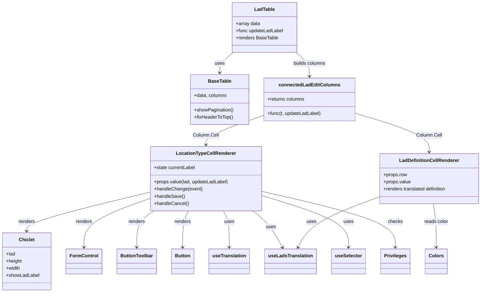

# Diagram: web/portal/src/pages/administration/location-management/lads/components/LadTable.js


> Auto-generated by Obscura crawlers

## Diagram 1



### SVG

<svg id="container" width="1580.998046875" xmlns="http://www.w3.org/2000/svg" class="classDiagram" height="982" viewBox="0 0 1580.998046875 982" role="graphics-document document" aria-roledescription="class"><style>#container{font-family:"trebuchet ms",verdana,arial,sans-serif;font-size:16px;fill:#333;}@keyframes edge-animation-frame{from{stroke-dashoffset:0;}}@keyframes dash{to{stroke-dashoffset:0;}}#container .edge-animation-slow{stroke-dasharray:9,5!important;stroke-dashoffset:900;animation:dash 50s linear infinite;stroke-linecap:round;}#container .edge-animation-fast{stroke-dasharray:9,5!important;stroke-dashoffset:900;animation:dash 20s linear infinite;stroke-linecap:round;}#container .error-icon{fill:#552222;}#container .error-text{fill:#552222;stroke:#552222;}#container .edge-thickness-normal{stroke-width:1px;}#container .edge-thickness-thick{stroke-width:3.5px;}#container .edge-pattern-solid{stroke-dasharray:0;}#container .edge-thickness-invisible{stroke-width:0;fill:none;}#container .edge-pattern-dashed{stroke-dasharray:3;}#container .edge-pattern-dotted{stroke-dasharray:2;}#container .marker{fill:#333333;stroke:#333333;}#container .marker.cross{stroke:#333333;}#container svg{font-family:"trebuchet ms",verdana,arial,sans-serif;font-size:16px;}#container p{margin:0;}#container g.classGroup text{fill:#9370DB;stroke:none;font-family:"trebuchet ms",verdana,arial,sans-serif;font-size:10px;}#container g.classGroup text .title{font-weight:bolder;}#container .nodeLabel,#container .edgeLabel{color:#131300;}#container .edgeLabel .label rect{fill:#ECECFF;}#container .label text{fill:#131300;}#container .labelBkg{background:#ECECFF;}#container .edgeLabel .label span{background:#ECECFF;}#container .classTitle{font-weight:bolder;}#container .node rect,#container .node circle,#container .node ellipse,#container .node polygon,#container .node path{fill:#ECECFF;stroke:#9370DB;stroke-width:1px;}#container .divider{stroke:#9370DB;stroke-width:1;}#container g.clickable{cursor:pointer;}#container g.classGroup rect{fill:#ECECFF;stroke:#9370DB;}#container g.classGroup line{stroke:#9370DB;stroke-width:1;}#container .classLabel .box{stroke:none;stroke-width:0;fill:#ECECFF;opacity:0.5;}#container .classLabel .label{fill:#9370DB;font-size:10px;}#container .relation{stroke:#333333;stroke-width:1;fill:none;}#container .dashed-line{stroke-dasharray:3;}#container .dotted-line{stroke-dasharray:1 2;}#container #compositionStart,#container .composition{fill:#333333!important;stroke:#333333!important;stroke-width:1;}#container #compositionEnd,#container .composition{fill:#333333!important;stroke:#333333!important;stroke-width:1;}#container #dependencyStart,#container .dependency{fill:#333333!important;stroke:#333333!important;stroke-width:1;}#container #dependencyStart,#container .dependency{fill:#333333!important;stroke:#333333!important;stroke-width:1;}#container #extensionStart,#container .extension{fill:transparent!important;stroke:#333333!important;stroke-width:1;}#container #extensionEnd,#container .extension{fill:transparent!important;stroke:#333333!important;stroke-width:1;}#container #aggregationStart,#container .aggregation{fill:transparent!important;stroke:#333333!important;stroke-width:1;}#container #aggregationEnd,#container .aggregation{fill:transparent!important;stroke:#333333!important;stroke-width:1;}#container #lollipopStart,#container .lollipop{fill:#ECECFF!important;stroke:#333333!important;stroke-width:1;}#container #lollipopEnd,#container .lollipop{fill:#ECECFF!important;stroke:#333333!important;stroke-width:1;}#container .edgeTerminals{font-size:11px;line-height:initial;}#container .classTitleText{text-anchor:middle;font-size:18px;fill:#333;}#container .label-icon{display:inline-block;height:1em;overflow:visible;vertical-align:-0.125em;}#container .node .label-icon path{fill:currentColor;stroke:revert;stroke-width:revert;}#container :root{--mermaid-font-family:"trebuchet ms",verdana,arial,sans-serif;}</style><g><defs><marker id="container_class-aggregationStart" class="marker aggregation class" refX="18" refY="7" markerWidth="190" markerHeight="240" orient="auto"><path d="M 18,7 L9,13 L1,7 L9,1 Z"></path></marker></defs><defs><marker id="container_class-aggregationEnd" class="marker aggregation class" refX="1" refY="7" markerWidth="20" markerHeight="28" orient="auto"><path d="M 18,7 L9,13 L1,7 L9,1 Z"></path></marker></defs><defs><marker id="container_class-extensionStart" class="marker extension class" refX="18" refY="7" markerWidth="190" markerHeight="240" orient="auto"><path d="M 1,7 L18,13 V 1 Z"></path></marker></defs><defs><marker id="container_class-extensionEnd" class="marker extension class" refX="1" refY="7" markerWidth="20" markerHeight="28" orient="auto"><path d="M 1,1 V 13 L18,7 Z"></path></marker></defs><defs><marker id="container_class-compositionStart" class="marker composition class" refX="18" refY="7" markerWidth="190" markerHeight="240" orient="auto"><path d="M 18,7 L9,13 L1,7 L9,1 Z"></path></marker></defs><defs><marker id="container_class-compositionEnd" class="marker composition class" refX="1" refY="7" markerWidth="20" markerHeight="28" orient="auto"><path d="M 18,7 L9,13 L1,7 L9,1 Z"></path></marker></defs><defs><marker id="container_class-dependencyStart" class="marker dependency class" refX="6" refY="7" markerWidth="190" markerHeight="240" orient="auto"><path d="M 5,7 L9,13 L1,7 L9,1 Z"></path></marker></defs><defs><marker id="container_class-dependencyEnd" class="marker dependency class" refX="13" refY="7" markerWidth="20" markerHeight="28" orient="auto"><path d="M 18,7 L9,13 L14,7 L9,1 Z"></path></marker></defs><defs><marker id="container_class-lollipopStart" class="marker lollipop class" refX="13" refY="7" markerWidth="190" markerHeight="240" orient="auto"><circle stroke="black" fill="transparent" cx="7" cy="7" r="6"></circle></marker></defs><defs><marker id="container_class-lollipopEnd" class="marker lollipop class" refX="1" refY="7" markerWidth="190" markerHeight="240" orient="auto"><circle stroke="black" fill="transparent" cx="7" cy="7" r="6"></circle></marker></defs><g class="root"><g class="clusters"></g><g class="edgePaths"><path d="M759.663,176L752.076,182.167C744.488,188.333,729.312,200.667,721.725,212C714.137,223.333,714.137,233.667,714.137,238.833L714.137,244" id="id_LadTable_BaseTable_1" class="edge-thickness-normal edge-pattern-solid relation" style=";;;" data-edge="true" data-et="edge" data-id="id_LadTable_BaseTable_1" data-points="W3sieCI6NzU5LjY2MzQ2NTI2MzQyOTgsInkiOjE3Nn0seyJ4Ijo3MTQuMTM2NzE4NzUsInkiOjIxM30seyJ4Ijo3MTQuMTM2NzE4NzUsInkiOjI1MH1d" marker-end="url(#container_class-dependencyEnd)"></path><path d="M966.38,176L973.967,182.167C981.555,188.333,996.731,200.667,1004.318,214C1011.906,227.333,1011.906,241.667,1011.906,248.833L1011.906,256" id="id_LadTable_connectedLadEditColumns_2" class="edge-thickness-normal edge-pattern-solid relation" style=";;;" data-edge="true" data-et="edge" data-id="id_LadTable_connectedLadEditColumns_2" data-points="W3sieCI6OTY2LjM3OTUwMzQ4NjU3MDIsInkiOjE3Nn0seyJ4IjoxMDExLjkwNjI1LCJ5IjoyMTN9LHsieCI6MTAxMS45MDYyNSwieSI6MjYyfV0=" marker-end="url(#container_class-dependencyEnd)"></path><path d="M861.27,388.128L830.252,399.273C799.234,410.418,737.199,432.709,706.182,449.021C675.164,465.333,675.164,475.667,675.164,480.833L675.164,486" id="id_connectedLadEditColumns_LocationTypeCellRenderer_3" class="edge-thickness-normal edge-pattern-solid relation" style=";;;" data-edge="true" data-et="edge" data-id="id_connectedLadEditColumns_LocationTypeCellRenderer_3" data-points="W3sieCI6ODYxLjI2OTUzMTI1LCJ5IjozODguMTI3NTg5NzI2OTMzMTR9LHsieCI6Njc1LjE2NDA2MjUsInkiOjQ1NX0seyJ4Ijo2NzUuMTY0MDYyNSwieSI6NDkyfV0=" marker-end="url(#container_class-dependencyEnd)"></path><path d="M1162.543,380.417L1202.884,392.847C1243.225,405.278,1323.906,430.139,1364.247,451.736C1404.588,473.333,1404.588,491.667,1404.588,500.833L1404.588,510" id="id_connectedLadEditColumns_LadDefinitionCellRenderer_4" class="edge-thickness-normal edge-pattern-solid relation" style=";;;" data-edge="true" data-et="edge" data-id="id_connectedLadEditColumns_LadDefinitionCellRenderer_4" data-points="W3sieCI6MTE2Mi41NDI5Njg3NSwieSI6MzgwLjQxNjg0NTMwOTQ0NTc2fSx7IngiOjE0MDQuNTg3ODkwNjI1LCJ5Ijo0NTV9LHsieCI6MTQwNC41ODc4OTA2MjUsInkiOjUxNn1d" marker-end="url(#container_class-dependencyEnd)"></path><path d="M490.309,645.659L423.276,662.216C356.243,678.773,222.178,711.886,155.146,733.61C88.113,755.333,88.113,765.667,88.113,770.833L88.113,776" id="id_LocationTypeCellRenderer_Chiclet_5" class="edge-thickness-normal edge-pattern-solid relation" style=";;;" data-edge="true" data-et="edge" data-id="id_LocationTypeCellRenderer_Chiclet_5" data-points="W3sieCI6NDkwLjMwODU5Mzc1LCJ5Ijo2NDUuNjU4ODE0OTE4MzIxOH0seyJ4Ijo4OC4xMTMyODEyNSwieSI6NzQ1fSx7IngiOjg4LjExMzI4MTI1LCJ5Ijo3ODJ9XQ==" marker-end="url(#container_class-dependencyEnd)"></path><path d="M490.309,667.036L454.477,680.03C418.646,693.024,346.983,719.012,311.152,746.173C275.32,773.333,275.32,801.667,275.32,815.833L275.32,830" id="id_LocationTypeCellRenderer_FormControl_6" class="edge-thickness-normal edge-pattern-solid relation" style=";;;" data-edge="true" data-et="edge" data-id="id_LocationTypeCellRenderer_FormControl_6" data-points="W3sieCI6NDkwLjMwODU5Mzc1LCJ5Ijo2NjcuMDM2MjkzNDc0MDEzM30seyJ4IjoyNzUuMzIwMzEyNSwieSI6NzQ1fSx7IngiOjI3NS4zMjAzMTI1LCJ5Ijo4MzZ9XQ==" marker-end="url(#container_class-dependencyEnd)"></path><path d="M505.326,708L495.628,714.167C485.931,720.333,466.536,732.667,456.838,753C447.141,773.333,447.141,801.667,447.141,815.833L447.141,830" id="id_LocationTypeCellRenderer_ButtonToolbar_7" class="edge-thickness-normal edge-pattern-solid relation" style=";;;" data-edge="true" data-et="edge" data-id="id_LocationTypeCellRenderer_ButtonToolbar_7" data-points="W3sieCI6NTA1LjMyNTkxNTk0ODI3NTg1LCJ5Ijo3MDh9LHsieCI6NDQ3LjE0MDYyNSwieSI6NzQ1fSx7IngiOjQ0Ny4xNDA2MjUsInkiOjgzNn1d" marker-end="url(#container_class-dependencyEnd)"></path><path d="M618.214,708L614.962,714.167C611.71,720.333,605.207,732.667,601.955,753C598.703,773.333,598.703,801.667,598.703,815.833L598.703,830" id="id_LocationTypeCellRenderer_Button_8" class="edge-thickness-normal edge-pattern-solid relation" style=";;;" data-edge="true" data-et="edge" data-id="id_LocationTypeCellRenderer_Button_8" data-points="W3sieCI6NjE4LjIxMzg0Njk4Mjc1ODYsInkiOjcwOH0seyJ4Ijo1OTguNzAzMTI1LCJ5Ijo3NDV9LHsieCI6NTk4LjcwMzEyNSwieSI6ODM2fV0=" marker-end="url(#container_class-dependencyEnd)"></path><path d="M732.114,708L735.366,714.167C738.618,720.333,745.121,732.667,748.373,753C751.625,773.333,751.625,801.667,751.625,815.833L751.625,830" id="id_LocationTypeCellRenderer_useTranslation_9" class="edge-thickness-normal edge-pattern-solid relation" style=";;;" data-edge="true" data-et="edge" data-id="id_LocationTypeCellRenderer_useTranslation_9" data-points="W3sieCI6NzMyLjExNDI3ODAxNzI0MTQsInkiOjcwOH0seyJ4Ijo3NTEuNjI1LCJ5Ijo3NDV9LHsieCI6NzUxLjYyNSwieSI6ODM2fV0=" marker-end="url(#container_class-dependencyEnd)"></path><path d="M826.047,708L834.662,714.167C843.277,720.333,860.508,732.667,876.981,753.124C893.453,773.581,909.168,802.162,917.026,816.452L924.883,830.742" id="id_LocationTypeCellRenderer_useLadsTranslation_10" class="edge-thickness-normal edge-pattern-solid relation" style=";;;" data-edge="true" data-et="edge" data-id="id_LocationTypeCellRenderer_useLadsTranslation_10" data-points="W3sieCI6ODI2LjA0NjkyODg3OTMxMDQsInkiOjcwOH0seyJ4Ijo4NzcuNzM4MjgxMjUsInkiOjc0NX0seyJ4Ijo5MjcuNzczODQ4Njg0MjEwNSwieSI6ODM2fV0=" marker-end="url(#container_class-dependencyEnd)"></path><path d="M860.02,657.753L906.563,672.294C953.107,686.835,1046.194,715.918,1092.738,744.625C1139.281,773.333,1139.281,801.667,1139.281,815.833L1139.281,830" id="id_LocationTypeCellRenderer_useSelector_11" class="edge-thickness-normal edge-pattern-solid relation" style=";;;" data-edge="true" data-et="edge" data-id="id_LocationTypeCellRenderer_useSelector_11" data-points="W3sieCI6ODYwLjAxOTUzMTI1LCJ5Ijo2NTcuNzUyNzQ3OTkyNjYwOH0seyJ4IjoxMTM5LjI4MTI1LCJ5Ijo3NDV9LHsieCI6MTEzOS4yODEyNSwieSI6ODM2fV0=" marker-end="url(#container_class-dependencyEnd)"></path><path d="M1236.178,663.262L1199.912,676.885C1163.646,690.508,1091.114,717.754,1047.58,745.653C1004.046,773.551,989.509,802.102,982.241,816.378L974.973,830.653" id="id_LadDefinitionCellRenderer_useLadsTranslation_12" class="edge-thickness-normal edge-pattern-solid relation" style=";;;" data-edge="true" data-et="edge" data-id="id_LadDefinitionCellRenderer_useLadsTranslation_12" data-points="W3sieCI6MTIzNi4xNzc3MzQzNzUsInkiOjY2My4yNjE5MjIyMzAzNzQxfSx7IngiOjEwMTguNTgyMDMxMjUsInkiOjc0NX0seyJ4Ijo5NzIuMjUwODIyMzY4NDIxLCJ5Ijo4MzZ9XQ==" marker-end="url(#container_class-dependencyEnd)"></path><path d="M860.02,643.435L932.062,660.362C1004.104,677.29,1148.189,711.145,1220.231,742.239C1292.273,773.333,1292.273,801.667,1292.273,815.833L1292.273,830" id="id_LocationTypeCellRenderer_Privileges_13" class="edge-thickness-normal edge-pattern-solid relation" style=";;;" data-edge="true" data-et="edge" data-id="id_LocationTypeCellRenderer_Privileges_13" data-points="W3sieCI6ODYwLjAxOTUzMTI1LCJ5Ijo2NDMuNDM0ODMzNTIzMjMwN30seyJ4IjoxMjkyLjI3MzQzNzUsInkiOjc0NX0seyJ4IjoxMjkyLjI3MzQzNzUsInkiOjgzNn1d" marker-end="url(#container_class-dependencyEnd)"></path><path d="M1416.476,684L1417.915,694.167C1419.354,704.333,1422.232,724.667,1423.671,749C1425.109,773.333,1425.109,801.667,1425.109,815.833L1425.109,830" id="id_LadDefinitionCellRenderer_Colors_14" class="edge-thickness-normal edge-pattern-solid relation" style=";;;" data-edge="true" data-et="edge" data-id="id_LadDefinitionCellRenderer_Colors_14" data-points="W3sieCI6MTQxNi40NzYxOTg4MTQ2NTUyLCJ5Ijo2ODR9LHsieCI6MTQyNS4xMDkzNzUsInkiOjc0NX0seyJ4IjoxNDI1LjEwOTM3NSwieSI6ODM2fV0=" marker-end="url(#container_class-dependencyEnd)"></path></g><g class="edgeLabels"><g class="edgeLabel" transform="translate(714.13671875, 213)"><g class="label" data-id="id_LadTable_BaseTable_1" transform="translate(-16.4921875, -12)"><foreignObject width="32.984375" height="24"><div xmlns="http://www.w3.org/1999/xhtml" class="labelBkg" style="display: table-cell; white-space: nowrap; line-height: 1.5; max-width: 200px; text-align: center;"><span class="edgeLabel"><p>uses</p></span></div></foreignObject></g></g><g class="edgeLabel" transform="translate(1011.90625, 213)"><g class="label" data-id="id_LadTable_connectedLadEditColumns_2" transform="translate(-55.2265625, -12)"><foreignObject width="110.453125" height="24"><div xmlns="http://www.w3.org/1999/xhtml" class="labelBkg" style="display: table-cell; white-space: nowrap; line-height: 1.5; max-width: 200px; text-align: center;"><span class="edgeLabel"><p>builds columns</p></span></div></foreignObject></g></g><g class="edgeLabel" transform="translate(675.1640625, 455)"><g class="label" data-id="id_connectedLadEditColumns_LocationTypeCellRenderer_3" transform="translate(-42.671875, -12)"><foreignObject width="85.34375" height="24"><div xmlns="http://www.w3.org/1999/xhtml" class="labelBkg" style="display: table-cell; white-space: nowrap; line-height: 1.5; max-width: 200px; text-align: center;"><span class="edgeLabel"><p>Column.Cell</p></span></div></foreignObject></g></g><g class="edgeLabel" transform="translate(1404.587890625, 455)"><g class="label" data-id="id_connectedLadEditColumns_LadDefinitionCellRenderer_4" transform="translate(-42.671875, -12)"><foreignObject width="85.34375" height="24"><div xmlns="http://www.w3.org/1999/xhtml" class="labelBkg" style="display: table-cell; white-space: nowrap; line-height: 1.5; max-width: 200px; text-align: center;"><span class="edgeLabel"><p>Column.Cell</p></span></div></foreignObject></g></g><g class="edgeLabel" transform="translate(88.11328125, 745)"><g class="label" data-id="id_LocationTypeCellRenderer_Chiclet_5" transform="translate(-27.75, -12)"><foreignObject width="55.5" height="24"><div xmlns="http://www.w3.org/1999/xhtml" class="labelBkg" style="display: table-cell; white-space: nowrap; line-height: 1.5; max-width: 200px; text-align: center;"><span class="edgeLabel"><p>renders</p></span></div></foreignObject></g></g><g class="edgeLabel" transform="translate(275.3203125, 745)"><g class="label" data-id="id_LocationTypeCellRenderer_FormControl_6" transform="translate(-27.75, -12)"><foreignObject width="55.5" height="24"><div xmlns="http://www.w3.org/1999/xhtml" class="labelBkg" style="display: table-cell; white-space: nowrap; line-height: 1.5; max-width: 200px; text-align: center;"><span class="edgeLabel"><p>renders</p></span></div></foreignObject></g></g><g class="edgeLabel" transform="translate(447.140625, 745)"><g class="label" data-id="id_LocationTypeCellRenderer_ButtonToolbar_7" transform="translate(-27.75, -12)"><foreignObject width="55.5" height="24"><div xmlns="http://www.w3.org/1999/xhtml" class="labelBkg" style="display: table-cell; white-space: nowrap; line-height: 1.5; max-width: 200px; text-align: center;"><span class="edgeLabel"><p>renders</p></span></div></foreignObject></g></g><g class="edgeLabel" transform="translate(598.703125, 745)"><g class="label" data-id="id_LocationTypeCellRenderer_Button_8" transform="translate(-27.75, -12)"><foreignObject width="55.5" height="24"><div xmlns="http://www.w3.org/1999/xhtml" class="labelBkg" style="display: table-cell; white-space: nowrap; line-height: 1.5; max-width: 200px; text-align: center;"><span class="edgeLabel"><p>renders</p></span></div></foreignObject></g></g><g class="edgeLabel" transform="translate(751.625, 745)"><g class="label" data-id="id_LocationTypeCellRenderer_useTranslation_9" transform="translate(-16.4921875, -12)"><foreignObject width="32.984375" height="24"><div xmlns="http://www.w3.org/1999/xhtml" class="labelBkg" style="display: table-cell; white-space: nowrap; line-height: 1.5; max-width: 200px; text-align: center;"><span class="edgeLabel"><p>uses</p></span></div></foreignObject></g></g><g class="edgeLabel" transform="translate(887.44195, 762.64813)"><g class="label" data-id="id_LocationTypeCellRenderer_useLadsTranslation_10" transform="translate(-16.4921875, -12)"><foreignObject width="32.984375" height="24"><div xmlns="http://www.w3.org/1999/xhtml" class="labelBkg" style="display: table-cell; white-space: nowrap; line-height: 1.5; max-width: 200px; text-align: center;"><span class="edgeLabel"><p>uses</p></span></div></foreignObject></g></g><g class="edgeLabel" transform="translate(1139.28125, 745)"><g class="label" data-id="id_LocationTypeCellRenderer_useSelector_11" transform="translate(-16.4921875, -12)"><foreignObject width="32.984375" height="24"><div xmlns="http://www.w3.org/1999/xhtml" class="labelBkg" style="display: table-cell; white-space: nowrap; line-height: 1.5; max-width: 200px; text-align: center;"><span class="edgeLabel"><p>uses</p></span></div></foreignObject></g></g><g class="edgeLabel" transform="translate(1079.5831, 722.08544)"><g class="label" data-id="id_LadDefinitionCellRenderer_useLadsTranslation_12" transform="translate(-16.4921875, -12)"><foreignObject width="32.984375" height="24"><div xmlns="http://www.w3.org/1999/xhtml" class="labelBkg" style="display: table-cell; white-space: nowrap; line-height: 1.5; max-width: 200px; text-align: center;"><span class="edgeLabel"><p>uses</p></span></div></foreignObject></g></g><g class="edgeLabel" transform="translate(1292.2734375, 745)"><g class="label" data-id="id_LocationTypeCellRenderer_Privileges_13" transform="translate(-24.4921875, -12)"><foreignObject width="48.984375" height="24"><div xmlns="http://www.w3.org/1999/xhtml" class="labelBkg" style="display: table-cell; white-space: nowrap; line-height: 1.5; max-width: 200px; text-align: center;"><span class="edgeLabel"><p>checks</p></span></div></foreignObject></g></g><g class="edgeLabel" transform="translate(1425.109375, 745)"><g class="label" data-id="id_LadDefinitionCellRenderer_Colors_14" transform="translate(-40.5234375, -12)"><foreignObject width="81.046875" height="24"><div xmlns="http://www.w3.org/1999/xhtml" class="labelBkg" style="display: table-cell; white-space: nowrap; line-height: 1.5; max-width: 200px; text-align: center;"><span class="edgeLabel"><p>reads color</p></span></div></foreignObject></g></g></g><g class="nodes"><g class="node default" id="classId-LadTable-0" transform="translate(863.021484375, 92)"><g class="basic label-container"><path d="M-108.7890625 -84 L108.7890625 -84 L108.7890625 84 L-108.7890625 84" stroke="none" stroke-width="0" fill="#ECECFF" style=""></path><path d="M-108.7890625 -84 C-25.806359729577963 -84, 57.176343040844074 -84, 108.7890625 -84 M-108.7890625 -84 C-60.4146185099471 -84, -12.040174519894194 -84, 108.7890625 -84 M108.7890625 -84 C108.7890625 -28.223058573947036, 108.7890625 27.55388285210593, 108.7890625 84 M108.7890625 -84 C108.7890625 -18.851519806730437, 108.7890625 46.296960386539126, 108.7890625 84 M108.7890625 84 C60.72337097325457 84, 12.657679446509135 84, -108.7890625 84 M108.7890625 84 C45.42539983737525 84, -17.938262825249495 84, -108.7890625 84 M-108.7890625 84 C-108.7890625 48.88056412053886, -108.7890625 13.761128241077714, -108.7890625 -84 M-108.7890625 84 C-108.7890625 22.190361752802424, -108.7890625 -39.61927649439515, -108.7890625 -84" stroke="#9370DB" stroke-width="1.3" fill="none" stroke-dasharray="0 0" style=""></path></g><g class="annotation-group text" transform="translate(0, -60)"></g><g class="label-group text" transform="translate(-33.046875, -60)"><g class="label" style="font-weight: bolder" transform="translate(0,-12)"><foreignObject width="66.09375" height="24"><div xmlns="http://www.w3.org/1999/xhtml" style="display: table-cell; white-space: nowrap; line-height: 1.5; max-width: 115px; text-align: center;"><span class="nodeLabel markdown-node-label" style=""><p>LadTable</p></span></div></foreignObject></g></g><g class="members-group text" transform="translate(-96.7890625, -12)"><g class="label" style="" transform="translate(0,-12)"><foreignObject width="81.46875" height="24"><div xmlns="http://www.w3.org/1999/xhtml" style="display: table-cell; white-space: nowrap; line-height: 1.5; max-width: 139px; text-align: center;"><span class="nodeLabel markdown-node-label" style=""><p>+array data</p></span></div></foreignObject></g><g class="label" style="" transform="translate(0,12)"><foreignObject width="160.53125" height="24"><div xmlns="http://www.w3.org/1999/xhtml" style="display: table-cell; white-space: nowrap; line-height: 1.5; max-width: 218px; text-align: center;"><span class="nodeLabel markdown-node-label" style=""><p>+func updateLadLabel</p></span></div></foreignObject></g><g class="label" style="" transform="translate(0,36)"><foreignObject width="141.1875" height="24"><div xmlns="http://www.w3.org/1999/xhtml" style="display: table-cell; white-space: nowrap; line-height: 1.5; max-width: 199px; text-align: center;"><span class="nodeLabel markdown-node-label" style=""><p>+renders BaseTable</p></span></div></foreignObject></g></g><g class="methods-group text" transform="translate(-96.7890625, 84)"></g><g class="divider" style=""><path d="M-108.7890625 -36 C-56.0646253910862 -36, -3.340188282172406 -36, 108.7890625 -36 M-108.7890625 -36 C-64.92012835945596 -36, -21.05119421891193 -36, 108.7890625 -36" stroke="#9370DB" stroke-width="1.3" fill="none" stroke-dasharray="0 0" style=""></path></g><g class="divider" style=""><path d="M-108.7890625 60 C-29.57932012790984 60, 49.63042224418032 60, 108.7890625 60 M-108.7890625 60 C-32.48680938262419 60, 43.815443734751625 60, 108.7890625 60" stroke="#9370DB" stroke-width="1.3" fill="none" stroke-dasharray="0 0" style=""></path></g></g><g class="node default" id="classId-BaseTable-1" transform="translate(714.13671875, 334)"><g class="basic label-container"><path d="M-97.1328125 -84 L97.1328125 -84 L97.1328125 84 L-97.1328125 84" stroke="none" stroke-width="0" fill="#ECECFF" style=""></path><path d="M-97.1328125 -84 C-26.1195322954798 -84, 44.8937479090404 -84, 97.1328125 -84 M-97.1328125 -84 C-38.048801771731775 -84, 21.03520895653645 -84, 97.1328125 -84 M97.1328125 -84 C97.1328125 -23.37722936794605, 97.1328125 37.2455412641079, 97.1328125 84 M97.1328125 -84 C97.1328125 -45.700208858701146, 97.1328125 -7.400417717402291, 97.1328125 84 M97.1328125 84 C52.32537783997553 84, 7.517943179951061 84, -97.1328125 84 M97.1328125 84 C56.7770013514718 84, 16.421190202943606 84, -97.1328125 84 M-97.1328125 84 C-97.1328125 35.08729429221743, -97.1328125 -13.825411415565142, -97.1328125 -84 M-97.1328125 84 C-97.1328125 44.6209139994711, -97.1328125 5.241827998942199, -97.1328125 -84" stroke="#9370DB" stroke-width="1.3" fill="none" stroke-dasharray="0 0" style=""></path></g><g class="annotation-group text" transform="translate(0, -60)"></g><g class="label-group text" transform="translate(-37.359375, -60)"><g class="label" style="font-weight: bolder" transform="translate(0,-12)"><foreignObject width="74.71875" height="24"><div xmlns="http://www.w3.org/1999/xhtml" style="display: table-cell; white-space: nowrap; line-height: 1.5; max-width: 123px; text-align: center;"><span class="nodeLabel markdown-node-label" style=""><p>BaseTable</p></span></div></foreignObject></g></g><g class="members-group text" transform="translate(-85.1328125, -12)"><g class="label" style="" transform="translate(0,-12)"><foreignObject width="109.9375" height="24"><div xmlns="http://www.w3.org/1999/xhtml" style="display: table-cell; white-space: nowrap; line-height: 1.5; max-width: 167px; text-align: center;"><span class="nodeLabel markdown-node-label" style=""><p>+data, columns</p></span></div></foreignObject></g></g><g class="methods-group text" transform="translate(-85.1328125, 36)"><g class="label" style="" transform="translate(0,-12)"><foreignObject width="132.90625" height="24"><div xmlns="http://www.w3.org/1999/xhtml" style="display: table-cell; white-space: nowrap; line-height: 1.5; max-width: 190px; text-align: center;"><span class="nodeLabel markdown-node-label" style=""><p>+showPagination()</p></span></div></foreignObject></g><g class="label" style="" transform="translate(0,12)"><foreignObject width="130.65625" height="24"><div xmlns="http://www.w3.org/1999/xhtml" style="display: table-cell; white-space: nowrap; line-height: 1.5; max-width: 188px; text-align: center;"><span class="nodeLabel markdown-node-label" style=""><p>+fixHeaderToTop()</p></span></div></foreignObject></g></g><g class="divider" style=""><path d="M-97.1328125 -36 C-25.79186691644324 -36, 45.54907866711352 -36, 97.1328125 -36 M-97.1328125 -36 C-37.94694271774916 -36, 21.23892706450168 -36, 97.1328125 -36" stroke="#9370DB" stroke-width="1.3" fill="none" stroke-dasharray="0 0" style=""></path></g><g class="divider" style=""><path d="M-97.1328125 12 C-44.40774556851901 12, 8.317321362961977 12, 97.1328125 12 M-97.1328125 12 C-26.711946043226604 12, 43.70892041354679 12, 97.1328125 12" stroke="#9370DB" stroke-width="1.3" fill="none" stroke-dasharray="0 0" style=""></path></g></g><g class="node default" id="classId-connectedLadEditColumns-2" transform="translate(1011.90625, 334)"><g class="basic label-container"><path d="M-150.63671875 -72 L150.63671875 -72 L150.63671875 72 L-150.63671875 72" stroke="none" stroke-width="0" fill="#ECECFF" style=""></path><path d="M-150.63671875 -72 C-61.872905635848326 -72, 26.890907478303347 -72, 150.63671875 -72 M-150.63671875 -72 C-52.33738867502295 -72, 45.9619413999541 -72, 150.63671875 -72 M150.63671875 -72 C150.63671875 -23.757260194969476, 150.63671875 24.48547961006105, 150.63671875 72 M150.63671875 -72 C150.63671875 -29.338493229735903, 150.63671875 13.323013540528194, 150.63671875 72 M150.63671875 72 C50.20495088800074 72, -50.226816973998524 72, -150.63671875 72 M150.63671875 72 C30.197038411095562 72, -90.24264192780888 72, -150.63671875 72 M-150.63671875 72 C-150.63671875 15.645360874224231, -150.63671875 -40.70927825155154, -150.63671875 -72 M-150.63671875 72 C-150.63671875 37.83374135886593, -150.63671875 3.6674827177318576, -150.63671875 -72" stroke="#9370DB" stroke-width="1.3" fill="none" stroke-dasharray="0 0" style=""></path></g><g class="annotation-group text" transform="translate(0, -48)"></g><g class="label-group text" transform="translate(-96.6953125, -48)"><g class="label" style="font-weight: bolder" transform="translate(0,-12)"><foreignObject width="193.390625" height="24"><div xmlns="http://www.w3.org/1999/xhtml" style="display: table-cell; white-space: nowrap; line-height: 1.5; max-width: 242px; text-align: center;"><span class="nodeLabel markdown-node-label" style=""><p>connectedLadEditColumns</p></span></div></foreignObject></g></g><g class="members-group text" transform="translate(-138.63671875, 0)"><g class="label" style="" transform="translate(0,-12)"><foreignObject width="125.984375" height="24"><div xmlns="http://www.w3.org/1999/xhtml" style="display: table-cell; white-space: nowrap; line-height: 1.5; max-width: 183px; text-align: center;"><span class="nodeLabel markdown-node-label" style=""><p>+returns columns</p></span></div></foreignObject></g></g><g class="methods-group text" transform="translate(-138.63671875, 48)"><g class="label" style="" transform="translate(0,-12)"><foreignObject width="180.578125" height="24"><div xmlns="http://www.w3.org/1999/xhtml" style="display: table-cell; white-space: nowrap; line-height: 1.5; max-width: 238px; text-align: center;"><span class="nodeLabel markdown-node-label" style=""><p>+func(t, updateLadLabel)</p></span></div></foreignObject></g></g><g class="divider" style=""><path d="M-150.63671875 -24 C-89.67082455771629 -24, -28.70493036543256 -24, 150.63671875 -24 M-150.63671875 -24 C-35.32805173693016 -24, 79.98061527613967 -24, 150.63671875 -24" stroke="#9370DB" stroke-width="1.3" fill="none" stroke-dasharray="0 0" style=""></path></g><g class="divider" style=""><path d="M-150.63671875 24 C-78.0920412075201 24, -5.547363665040194 24, 150.63671875 24 M-150.63671875 24 C-40.70259466065538 24, 69.23152942868924 24, 150.63671875 24" stroke="#9370DB" stroke-width="1.3" fill="none" stroke-dasharray="0 0" style=""></path></g></g><g class="node default" id="classId-LocationTypeCellRenderer-3" transform="translate(675.1640625, 600)"><g class="basic label-container"><path d="M-184.85546875 -108 L184.85546875 -108 L184.85546875 108 L-184.85546875 108" stroke="none" stroke-width="0" fill="#ECECFF" style=""></path><path d="M-184.85546875 -108 C-72.3201968429448 -108, 40.21507506411041 -108, 184.85546875 -108 M-184.85546875 -108 C-84.41561929061012 -108, 16.024230168779752 -108, 184.85546875 -108 M184.85546875 -108 C184.85546875 -25.13179458711393, 184.85546875 57.73641082577214, 184.85546875 108 M184.85546875 -108 C184.85546875 -44.112967462203606, 184.85546875 19.774065075592787, 184.85546875 108 M184.85546875 108 C38.316451937310944 108, -108.22256487537811 108, -184.85546875 108 M184.85546875 108 C67.19755216808474 108, -50.46036441383052 108, -184.85546875 108 M-184.85546875 108 C-184.85546875 21.845211809353728, -184.85546875 -64.30957638129254, -184.85546875 -108 M-184.85546875 108 C-184.85546875 36.35049046085797, -184.85546875 -35.29901907828406, -184.85546875 -108" stroke="#9370DB" stroke-width="1.3" fill="none" stroke-dasharray="0 0" style=""></path></g><g class="annotation-group text" transform="translate(0, -84)"></g><g class="label-group text" transform="translate(-95.9453125, -84)"><g class="label" style="font-weight: bolder" transform="translate(0,-12)"><foreignObject width="191.890625" height="24"><div xmlns="http://www.w3.org/1999/xhtml" style="display: table-cell; white-space: nowrap; line-height: 1.5; max-width: 240px; text-align: center;"><span class="nodeLabel markdown-node-label" style=""><p>LocationTypeCellRenderer</p></span></div></foreignObject></g></g><g class="members-group text" transform="translate(-172.85546875, -36)"><g class="label" style="" transform="translate(0,-12)"><foreignObject width="140.296875" height="24"><div xmlns="http://www.w3.org/1999/xhtml" style="display: table-cell; white-space: nowrap; line-height: 1.5; max-width: 198px; text-align: center;"><span class="nodeLabel markdown-node-label" style=""><p>+state currentLabel</p></span></div></foreignObject></g></g><g class="methods-group text" transform="translate(-172.85546875, 12)"><g class="label" style="" transform="translate(0,-12)"><foreignObject width="249.765625" height="24"><div xmlns="http://www.w3.org/1999/xhtml" style="display: table-cell; white-space: nowrap; line-height: 1.5; max-width: 307px; text-align: center;"><span class="nodeLabel markdown-node-label" style=""><p>+props.value(lad, updateLadLabel)</p></span></div></foreignObject></g><g class="label" style="" transform="translate(0,12)"><foreignObject width="162.09375" height="24"><div xmlns="http://www.w3.org/1999/xhtml" style="display: table-cell; white-space: nowrap; line-height: 1.5; max-width: 219px; text-align: center;"><span class="nodeLabel markdown-node-label" style=""><p>+handleChange(event)</p></span></div></foreignObject></g><g class="label" style="" transform="translate(0,36)"><foreignObject width="102.421875" height="24"><div xmlns="http://www.w3.org/1999/xhtml" style="display: table-cell; white-space: nowrap; line-height: 1.5; max-width: 160px; text-align: center;"><span class="nodeLabel markdown-node-label" style=""><p>+handleSave()</p></span></div></foreignObject></g><g class="label" style="" transform="translate(0,60)"><foreignObject width="116.328125" height="24"><div xmlns="http://www.w3.org/1999/xhtml" style="display: table-cell; white-space: nowrap; line-height: 1.5; max-width: 174px; text-align: center;"><span class="nodeLabel markdown-node-label" style=""><p>+handleCancel()</p></span></div></foreignObject></g></g><g class="divider" style=""><path d="M-184.85546875 -60 C-89.01065188499089 -60, 6.834164980018215 -60, 184.85546875 -60 M-184.85546875 -60 C-84.55083213043353 -60, 15.753804489132932 -60, 184.85546875 -60" stroke="#9370DB" stroke-width="1.3" fill="none" stroke-dasharray="0 0" style=""></path></g><g class="divider" style=""><path d="M-184.85546875 -12 C-40.77582372930587 -12, 103.30382129138826 -12, 184.85546875 -12 M-184.85546875 -12 C-105.57755782706403 -12, -26.299646904128053 -12, 184.85546875 -12" stroke="#9370DB" stroke-width="1.3" fill="none" stroke-dasharray="0 0" style=""></path></g></g><g class="node default" id="classId-LadDefinitionCellRenderer-4" transform="translate(1404.587890625, 600)"><g class="basic label-container"><path d="M-168.41015625 -84 L168.41015625 -84 L168.41015625 84 L-168.41015625 84" stroke="none" stroke-width="0" fill="#ECECFF" style=""></path><path d="M-168.41015625 -84 C-47.860400911241484 -84, 72.68935442751703 -84, 168.41015625 -84 M-168.41015625 -84 C-43.600729588335994 -84, 81.20869707332801 -84, 168.41015625 -84 M168.41015625 -84 C168.41015625 -20.17861854301146, 168.41015625 43.64276291397708, 168.41015625 84 M168.41015625 -84 C168.41015625 -40.496579093255576, 168.41015625 3.0068418134888475, 168.41015625 84 M168.41015625 84 C71.89393344470672 84, -24.622289360586564 84, -168.41015625 84 M168.41015625 84 C100.05526993753607 84, 31.700383625072135 84, -168.41015625 84 M-168.41015625 84 C-168.41015625 41.62707225631328, -168.41015625 -0.7458554873734471, -168.41015625 -84 M-168.41015625 84 C-168.41015625 20.281825217608898, -168.41015625 -43.436349564782205, -168.41015625 -84" stroke="#9370DB" stroke-width="1.3" fill="none" stroke-dasharray="0 0" style=""></path></g><g class="annotation-group text" transform="translate(0, -60)"></g><g class="label-group text" transform="translate(-96.3984375, -60)"><g class="label" style="font-weight: bolder" transform="translate(0,-12)"><foreignObject width="192.796875" height="24"><div xmlns="http://www.w3.org/1999/xhtml" style="display: table-cell; white-space: nowrap; line-height: 1.5; max-width: 241px; text-align: center;"><span class="nodeLabel markdown-node-label" style=""><p>LadDefinitionCellRenderer</p></span></div></foreignObject></g></g><g class="members-group text" transform="translate(-156.41015625, -12)"><g class="label" style="" transform="translate(0,-12)"><foreignObject width="79.859375" height="24"><div xmlns="http://www.w3.org/1999/xhtml" style="display: table-cell; white-space: nowrap; line-height: 1.5; max-width: 138px; text-align: center;"><span class="nodeLabel markdown-node-label" style=""><p>+props.row</p></span></div></foreignObject></g><g class="label" style="" transform="translate(0,12)"><foreignObject width="91.59375" height="24"><div xmlns="http://www.w3.org/1999/xhtml" style="display: table-cell; white-space: nowrap; line-height: 1.5; max-width: 149px; text-align: center;"><span class="nodeLabel markdown-node-label" style=""><p>+props.value</p></span></div></foreignObject></g><g class="label" style="" transform="translate(0,36)"><foreignObject width="216.421875" height="24"><div xmlns="http://www.w3.org/1999/xhtml" style="display: table-cell; white-space: nowrap; line-height: 1.5; max-width: 274px; text-align: center;"><span class="nodeLabel markdown-node-label" style=""><p>+renders translated definition</p></span></div></foreignObject></g></g><g class="methods-group text" transform="translate(-156.41015625, 84)"></g><g class="divider" style=""><path d="M-168.41015625 -36 C-96.11654417229893 -36, -23.82293209459786 -36, 168.41015625 -36 M-168.41015625 -36 C-98.23526008680342 -36, -28.060363923606843 -36, 168.41015625 -36" stroke="#9370DB" stroke-width="1.3" fill="none" stroke-dasharray="0 0" style=""></path></g><g class="divider" style=""><path d="M-168.41015625 60 C-99.44038668147569 60, -30.470617112951373 60, 168.41015625 60 M-168.41015625 60 C-92.02692009967939 60, -15.643683949358774 60, 168.41015625 60" stroke="#9370DB" stroke-width="1.3" fill="none" stroke-dasharray="0 0" style=""></path></g></g><g class="node default" id="classId-Chiclet-5" transform="translate(88.11328125, 878)"><g class="basic label-container"><path d="M-80.11328125 -96 L80.11328125 -96 L80.11328125 96 L-80.11328125 96" stroke="none" stroke-width="0" fill="#ECECFF" style=""></path><path d="M-80.11328125 -96 C-21.205453756378333 -96, 37.702373737243335 -96, 80.11328125 -96 M-80.11328125 -96 C-28.65339699737295 -96, 22.806487255254098 -96, 80.11328125 -96 M80.11328125 -96 C80.11328125 -33.86244868930797, 80.11328125 28.275102621384065, 80.11328125 96 M80.11328125 -96 C80.11328125 -39.17370529585857, 80.11328125 17.652589408282864, 80.11328125 96 M80.11328125 96 C27.902347215504818 96, -24.308586818990364 96, -80.11328125 96 M80.11328125 96 C23.251142450270564 96, -33.61099634945887 96, -80.11328125 96 M-80.11328125 96 C-80.11328125 50.41148174871876, -80.11328125 4.822963497437513, -80.11328125 -96 M-80.11328125 96 C-80.11328125 54.62925528755936, -80.11328125 13.25851057511872, -80.11328125 -96" stroke="#9370DB" stroke-width="1.3" fill="none" stroke-dasharray="0 0" style=""></path></g><g class="annotation-group text" transform="translate(0, -72)"></g><g class="label-group text" transform="translate(-25.0703125, -72)"><g class="label" style="font-weight: bolder" transform="translate(0,-12)"><foreignObject width="50.140625" height="24"><div xmlns="http://www.w3.org/1999/xhtml" style="display: table-cell; white-space: nowrap; line-height: 1.5; max-width: 100px; text-align: center;"><span class="nodeLabel markdown-node-label" style=""><p>Chiclet</p></span></div></foreignObject></g></g><g class="members-group text" transform="translate(-68.11328125, -24)"><g class="label" style="" transform="translate(0,-12)"><foreignObject width="30.875" height="24"><div xmlns="http://www.w3.org/1999/xhtml" style="display: table-cell; white-space: nowrap; line-height: 1.5; max-width: 88px; text-align: center;"><span class="nodeLabel markdown-node-label" style=""><p>+lad</p></span></div></foreignObject></g><g class="label" style="" transform="translate(0,12)"><foreignObject width="54.078125" height="24"><div xmlns="http://www.w3.org/1999/xhtml" style="display: table-cell; white-space: nowrap; line-height: 1.5; max-width: 112px; text-align: center;"><span class="nodeLabel markdown-node-label" style=""><p>+height</p></span></div></foreignObject></g><g class="label" style="" transform="translate(0,36)"><foreignObject width="48.703125" height="24"><div xmlns="http://www.w3.org/1999/xhtml" style="display: table-cell; white-space: nowrap; line-height: 1.5; max-width: 106px; text-align: center;"><span class="nodeLabel markdown-node-label" style=""><p>+width</p></span></div></foreignObject></g><g class="label" style="" transform="translate(0,60)"><foreignObject width="111.15625" height="24"><div xmlns="http://www.w3.org/1999/xhtml" style="display: table-cell; white-space: nowrap; line-height: 1.5; max-width: 169px; text-align: center;"><span class="nodeLabel markdown-node-label" style=""><p>+showLadLabel</p></span></div></foreignObject></g></g><g class="methods-group text" transform="translate(-68.11328125, 96)"></g><g class="divider" style=""><path d="M-80.11328125 -48 C-16.181291918921204 -48, 47.75069741215759 -48, 80.11328125 -48 M-80.11328125 -48 C-32.77253236207314 -48, 14.568216525853714 -48, 80.11328125 -48" stroke="#9370DB" stroke-width="1.3" fill="none" stroke-dasharray="0 0" style=""></path></g><g class="divider" style=""><path d="M-80.11328125 72 C-40.43888311798313 72, -0.7644849859662628 72, 80.11328125 72 M-80.11328125 72 C-37.868939949941804 72, 4.375401350116391 72, 80.11328125 72" stroke="#9370DB" stroke-width="1.3" fill="none" stroke-dasharray="0 0" style=""></path></g></g><g class="node default" id="classId-FormControl-6" transform="translate(275.3203125, 878)"><g class="basic label-container"><path d="M-57.09375 -42 L57.09375 -42 L57.09375 42 L-57.09375 42" stroke="none" stroke-width="0" fill="#ECECFF" style=""></path><path d="M-57.09375 -42 C-20.282391336874426 -42, 16.52896732625115 -42, 57.09375 -42 M-57.09375 -42 C-14.186349666707912 -42, 28.721050666584176 -42, 57.09375 -42 M57.09375 -42 C57.09375 -20.054834971994715, 57.09375 1.8903300560105691, 57.09375 42 M57.09375 -42 C57.09375 -13.647570733280503, 57.09375 14.704858533438994, 57.09375 42 M57.09375 42 C16.461339202912498 42, -24.171071594175004 42, -57.09375 42 M57.09375 42 C23.03649470625256 42, -11.020760587494877 42, -57.09375 42 M-57.09375 42 C-57.09375 17.24683389542254, -57.09375 -7.50633220915492, -57.09375 -42 M-57.09375 42 C-57.09375 23.642669716799993, -57.09375 5.285339433599987, -57.09375 -42" stroke="#9370DB" stroke-width="1.3" fill="none" stroke-dasharray="0 0" style=""></path></g><g class="annotation-group text" transform="translate(0, -18)"></g><g class="label-group text" transform="translate(-45.09375, -18)"><g class="label" style="font-weight: bolder" transform="translate(0,-12)"><foreignObject width="90.1875" height="24"><div xmlns="http://www.w3.org/1999/xhtml" style="display: table-cell; white-space: nowrap; line-height: 1.5; max-width: 140px; text-align: center;"><span class="nodeLabel markdown-node-label" style=""><p>FormControl</p></span></div></foreignObject></g></g><g class="members-group text" transform="translate(-45.09375, 30)"></g><g class="methods-group text" transform="translate(-45.09375, 60)"></g><g class="divider" style=""><path d="M-57.09375 6 C-23.370993152854055 6, 10.35176369429189 6, 57.09375 6 M-57.09375 6 C-28.79178090934122 6, -0.4898118186824405 6, 57.09375 6" stroke="#9370DB" stroke-width="1.3" fill="none" stroke-dasharray="0 0" style=""></path></g><g class="divider" style=""><path d="M-57.09375 24 C-20.86529101770946 24, 15.36316796458108 24, 57.09375 24 M-57.09375 24 C-16.409639731758148 24, 24.274470536483705 24, 57.09375 24" stroke="#9370DB" stroke-width="1.3" fill="none" stroke-dasharray="0 0" style=""></path></g></g><g class="node default" id="classId-ButtonToolbar-7" transform="translate(447.140625, 878)"><g class="basic label-container"><path d="M-64.7265625 -42 L64.7265625 -42 L64.7265625 42 L-64.7265625 42" stroke="none" stroke-width="0" fill="#ECECFF" style=""></path><path d="M-64.7265625 -42 C-17.78464173924599 -42, 29.157279021508018 -42, 64.7265625 -42 M-64.7265625 -42 C-37.54481264181925 -42, -10.363062783638505 -42, 64.7265625 -42 M64.7265625 -42 C64.7265625 -15.0321980127054, 64.7265625 11.935603974589199, 64.7265625 42 M64.7265625 -42 C64.7265625 -8.558573394408619, 64.7265625 24.882853211182763, 64.7265625 42 M64.7265625 42 C22.150377246176717 42, -20.425808007646566 42, -64.7265625 42 M64.7265625 42 C34.87169108481356 42, 5.016819669627132 42, -64.7265625 42 M-64.7265625 42 C-64.7265625 18.27950295735984, -64.7265625 -5.440994085280323, -64.7265625 -42 M-64.7265625 42 C-64.7265625 23.608292520391274, -64.7265625 5.216585040782547, -64.7265625 -42" stroke="#9370DB" stroke-width="1.3" fill="none" stroke-dasharray="0 0" style=""></path></g><g class="annotation-group text" transform="translate(0, -18)"></g><g class="label-group text" transform="translate(-52.7265625, -18)"><g class="label" style="font-weight: bolder" transform="translate(0,-12)"><foreignObject width="105.453125" height="24"><div xmlns="http://www.w3.org/1999/xhtml" style="display: table-cell; white-space: nowrap; line-height: 1.5; max-width: 155px; text-align: center;"><span class="nodeLabel markdown-node-label" style=""><p>ButtonToolbar</p></span></div></foreignObject></g></g><g class="members-group text" transform="translate(-52.7265625, 30)"></g><g class="methods-group text" transform="translate(-52.7265625, 60)"></g><g class="divider" style=""><path d="M-64.7265625 6 C-25.76841314812458 6, 13.18973620375084 6, 64.7265625 6 M-64.7265625 6 C-32.313775564139334 6, 0.0990113717213319 6, 64.7265625 6" stroke="#9370DB" stroke-width="1.3" fill="none" stroke-dasharray="0 0" style=""></path></g><g class="divider" style=""><path d="M-64.7265625 24 C-30.762401915864565 24, 3.2017586682708696 24, 64.7265625 24 M-64.7265625 24 C-20.300758228443186 24, 24.125046043113628 24, 64.7265625 24" stroke="#9370DB" stroke-width="1.3" fill="none" stroke-dasharray="0 0" style=""></path></g></g><g class="node default" id="classId-Button-8" transform="translate(598.703125, 878)"><g class="basic label-container"><path d="M-36.8359375 -42 L36.8359375 -42 L36.8359375 42 L-36.8359375 42" stroke="none" stroke-width="0" fill="#ECECFF" style=""></path><path d="M-36.8359375 -42 C-7.936693866544221 -42, 20.962549766911557 -42, 36.8359375 -42 M-36.8359375 -42 C-21.136604342586907 -42, -5.43727118517381 -42, 36.8359375 -42 M36.8359375 -42 C36.8359375 -17.336206254918874, 36.8359375 7.3275874901622515, 36.8359375 42 M36.8359375 -42 C36.8359375 -11.814335323190544, 36.8359375 18.37132935361891, 36.8359375 42 M36.8359375 42 C8.453963992830154 42, -19.928009514339692 42, -36.8359375 42 M36.8359375 42 C21.533989391809143 42, 6.23204128361829 42, -36.8359375 42 M-36.8359375 42 C-36.8359375 14.64059260505298, -36.8359375 -12.71881478989404, -36.8359375 -42 M-36.8359375 42 C-36.8359375 19.790650194351326, -36.8359375 -2.418699611297349, -36.8359375 -42" stroke="#9370DB" stroke-width="1.3" fill="none" stroke-dasharray="0 0" style=""></path></g><g class="annotation-group text" transform="translate(0, -18)"></g><g class="label-group text" transform="translate(-24.8359375, -18)"><g class="label" style="font-weight: bolder" transform="translate(0,-12)"><foreignObject width="49.671875" height="24"><div xmlns="http://www.w3.org/1999/xhtml" style="display: table-cell; white-space: nowrap; line-height: 1.5; max-width: 99px; text-align: center;"><span class="nodeLabel markdown-node-label" style=""><p>Button</p></span></div></foreignObject></g></g><g class="members-group text" transform="translate(-24.8359375, 30)"></g><g class="methods-group text" transform="translate(-24.8359375, 60)"></g><g class="divider" style=""><path d="M-36.8359375 6 C-18.443476458994994 6, -0.0510154179899871 6, 36.8359375 6 M-36.8359375 6 C-21.894179619403968 6, -6.952421738807935 6, 36.8359375 6" stroke="#9370DB" stroke-width="1.3" fill="none" stroke-dasharray="0 0" style=""></path></g><g class="divider" style=""><path d="M-36.8359375 24 C-13.944220023288175 24, 8.94749745342365 24, 36.8359375 24 M-36.8359375 24 C-14.711317334147882 24, 7.413302831704236 24, 36.8359375 24" stroke="#9370DB" stroke-width="1.3" fill="none" stroke-dasharray="0 0" style=""></path></g></g><g class="node default" id="classId-useTranslation-9" transform="translate(751.625, 878)"><g class="basic label-container"><path d="M-66.0859375 -42 L66.0859375 -42 L66.0859375 42 L-66.0859375 42" stroke="none" stroke-width="0" fill="#ECECFF" style=""></path><path d="M-66.0859375 -42 C-39.31801121457916 -42, -12.55008492915831 -42, 66.0859375 -42 M-66.0859375 -42 C-24.665498631402897 -42, 16.754940237194205 -42, 66.0859375 -42 M66.0859375 -42 C66.0859375 -20.95670384971093, 66.0859375 0.08659230057813971, 66.0859375 42 M66.0859375 -42 C66.0859375 -24.276575206738194, 66.0859375 -6.553150413476388, 66.0859375 42 M66.0859375 42 C39.02503201287048 42, 11.964126525740973 42, -66.0859375 42 M66.0859375 42 C17.788634360193655 42, -30.50866877961269 42, -66.0859375 42 M-66.0859375 42 C-66.0859375 15.980586548454855, -66.0859375 -10.038826903090289, -66.0859375 -42 M-66.0859375 42 C-66.0859375 9.970109534899024, -66.0859375 -22.059780930201953, -66.0859375 -42" stroke="#9370DB" stroke-width="1.3" fill="none" stroke-dasharray="0 0" style=""></path></g><g class="annotation-group text" transform="translate(0, -18)"></g><g class="label-group text" transform="translate(-54.0859375, -18)"><g class="label" style="font-weight: bolder" transform="translate(0,-12)"><foreignObject width="108.171875" height="24"><div xmlns="http://www.w3.org/1999/xhtml" style="display: table-cell; white-space: nowrap; line-height: 1.5; max-width: 157px; text-align: center;"><span class="nodeLabel markdown-node-label" style=""><p>useTranslation</p></span></div></foreignObject></g></g><g class="members-group text" transform="translate(-54.0859375, 30)"></g><g class="methods-group text" transform="translate(-54.0859375, 60)"></g><g class="divider" style=""><path d="M-66.0859375 6 C-22.98023793350589 6, 20.12546163298822 6, 66.0859375 6 M-66.0859375 6 C-24.485761521035236 6, 17.114414457929527 6, 66.0859375 6" stroke="#9370DB" stroke-width="1.3" fill="none" stroke-dasharray="0 0" style=""></path></g><g class="divider" style=""><path d="M-66.0859375 24 C-25.650302348361905 24, 14.78533280327619 24, 66.0859375 24 M-66.0859375 24 C-35.17469019255428 24, -4.263442885108567 24, 66.0859375 24" stroke="#9370DB" stroke-width="1.3" fill="none" stroke-dasharray="0 0" style=""></path></g></g><g class="node default" id="classId-useLadsTranslation-10" transform="translate(950.8671875, 878)"><g class="basic label-container"><path d="M-83.15625 -42 L83.15625 -42 L83.15625 42 L-83.15625 42" stroke="none" stroke-width="0" fill="#ECECFF" style=""></path><path d="M-83.15625 -42 C-33.397093317643076 -42, 16.362063364713848 -42, 83.15625 -42 M-83.15625 -42 C-42.17794543870074 -42, -1.1996408774014782 -42, 83.15625 -42 M83.15625 -42 C83.15625 -8.679337864900873, 83.15625 24.641324270198254, 83.15625 42 M83.15625 -42 C83.15625 -10.54299960057904, 83.15625 20.91400079884192, 83.15625 42 M83.15625 42 C26.041657803471523 42, -31.072934393056954 42, -83.15625 42 M83.15625 42 C37.15859378358533 42, -8.839062432829337 42, -83.15625 42 M-83.15625 42 C-83.15625 19.544376208159576, -83.15625 -2.911247583680847, -83.15625 -42 M-83.15625 42 C-83.15625 14.330316182462603, -83.15625 -13.339367635074794, -83.15625 -42" stroke="#9370DB" stroke-width="1.3" fill="none" stroke-dasharray="0 0" style=""></path></g><g class="annotation-group text" transform="translate(0, -18)"></g><g class="label-group text" transform="translate(-71.15625, -18)"><g class="label" style="font-weight: bolder" transform="translate(0,-12)"><foreignObject width="142.3125" height="24"><div xmlns="http://www.w3.org/1999/xhtml" style="display: table-cell; white-space: nowrap; line-height: 1.5; max-width: 190px; text-align: center;"><span class="nodeLabel markdown-node-label" style=""><p>useLadsTranslation</p></span></div></foreignObject></g></g><g class="members-group text" transform="translate(-71.15625, 30)"></g><g class="methods-group text" transform="translate(-71.15625, 60)"></g><g class="divider" style=""><path d="M-83.15625 6 C-39.65701703898319 6, 3.842215922033617 6, 83.15625 6 M-83.15625 6 C-41.83135793945488 6, -0.5064658789097649 6, 83.15625 6" stroke="#9370DB" stroke-width="1.3" fill="none" stroke-dasharray="0 0" style=""></path></g><g class="divider" style=""><path d="M-83.15625 24 C-48.67007908836163 24, -14.183908176723264 24, 83.15625 24 M-83.15625 24 C-45.011763233584446 24, -6.867276467168892 24, 83.15625 24" stroke="#9370DB" stroke-width="1.3" fill="none" stroke-dasharray="0 0" style=""></path></g></g><g class="node default" id="classId-useSelector-11" transform="translate(1139.28125, 878)"><g class="basic label-container"><path d="M-55.2578125 -42 L55.2578125 -42 L55.2578125 42 L-55.2578125 42" stroke="none" stroke-width="0" fill="#ECECFF" style=""></path><path d="M-55.2578125 -42 C-17.916761401568422 -42, 19.424289696863156 -42, 55.2578125 -42 M-55.2578125 -42 C-29.036206814595662 -42, -2.814601129191324 -42, 55.2578125 -42 M55.2578125 -42 C55.2578125 -21.110148827170818, 55.2578125 -0.2202976543416355, 55.2578125 42 M55.2578125 -42 C55.2578125 -10.63121612760812, 55.2578125 20.73756774478376, 55.2578125 42 M55.2578125 42 C11.417234950820877 42, -32.423342598358246 42, -55.2578125 42 M55.2578125 42 C14.435848414147678 42, -26.386115671704644 42, -55.2578125 42 M-55.2578125 42 C-55.2578125 9.430990174258767, -55.2578125 -23.138019651482466, -55.2578125 -42 M-55.2578125 42 C-55.2578125 14.672774293741298, -55.2578125 -12.654451412517403, -55.2578125 -42" stroke="#9370DB" stroke-width="1.3" fill="none" stroke-dasharray="0 0" style=""></path></g><g class="annotation-group text" transform="translate(0, -18)"></g><g class="label-group text" transform="translate(-43.2578125, -18)"><g class="label" style="font-weight: bolder" transform="translate(0,-12)"><foreignObject width="86.515625" height="24"><div xmlns="http://www.w3.org/1999/xhtml" style="display: table-cell; white-space: nowrap; line-height: 1.5; max-width: 136px; text-align: center;"><span class="nodeLabel markdown-node-label" style=""><p>useSelector</p></span></div></foreignObject></g></g><g class="members-group text" transform="translate(-43.2578125, 30)"></g><g class="methods-group text" transform="translate(-43.2578125, 60)"></g><g class="divider" style=""><path d="M-55.2578125 6 C-25.161629828598407 6, 4.9345528428031855 6, 55.2578125 6 M-55.2578125 6 C-17.789752059924382 6, 19.678308380151236 6, 55.2578125 6" stroke="#9370DB" stroke-width="1.3" fill="none" stroke-dasharray="0 0" style=""></path></g><g class="divider" style=""><path d="M-55.2578125 24 C-32.48355547505625 24, -9.709298450112506 24, 55.2578125 24 M-55.2578125 24 C-19.079834870740513 24, 17.098142758518975 24, 55.2578125 24" stroke="#9370DB" stroke-width="1.3" fill="none" stroke-dasharray="0 0" style=""></path></g></g><g class="node default" id="classId-Privileges-12" transform="translate(1292.2734375, 878)"><g class="basic label-container"><path d="M-47.734375 -42 L47.734375 -42 L47.734375 42 L-47.734375 42" stroke="none" stroke-width="0" fill="#ECECFF" style=""></path><path d="M-47.734375 -42 C-15.671058826078202 -42, 16.392257347843596 -42, 47.734375 -42 M-47.734375 -42 C-25.951666745832416 -42, -4.1689584916648315 -42, 47.734375 -42 M47.734375 -42 C47.734375 -20.88245987727156, 47.734375 0.2350802454568779, 47.734375 42 M47.734375 -42 C47.734375 -22.756109554765512, 47.734375 -3.5122191095310242, 47.734375 42 M47.734375 42 C9.615681525217894 42, -28.50301194956421 42, -47.734375 42 M47.734375 42 C11.508882339785167 42, -24.716610320429666 42, -47.734375 42 M-47.734375 42 C-47.734375 21.265619752367517, -47.734375 0.5312395047350336, -47.734375 -42 M-47.734375 42 C-47.734375 24.9698953462948, -47.734375 7.939790692589597, -47.734375 -42" stroke="#9370DB" stroke-width="1.3" fill="none" stroke-dasharray="0 0" style=""></path></g><g class="annotation-group text" transform="translate(0, -18)"></g><g class="label-group text" transform="translate(-35.734375, -18)"><g class="label" style="font-weight: bolder" transform="translate(0,-12)"><foreignObject width="71.46875" height="24"><div xmlns="http://www.w3.org/1999/xhtml" style="display: table-cell; white-space: nowrap; line-height: 1.5; max-width: 120px; text-align: center;"><span class="nodeLabel markdown-node-label" style=""><p>Privileges</p></span></div></foreignObject></g></g><g class="members-group text" transform="translate(-35.734375, 30)"></g><g class="methods-group text" transform="translate(-35.734375, 60)"></g><g class="divider" style=""><path d="M-47.734375 6 C-9.831430588208072 6, 28.071513823583857 6, 47.734375 6 M-47.734375 6 C-18.640122576665178 6, 10.454129846669645 6, 47.734375 6" stroke="#9370DB" stroke-width="1.3" fill="none" stroke-dasharray="0 0" style=""></path></g><g class="divider" style=""><path d="M-47.734375 24 C-20.348989673936874 24, 7.036395652126252 24, 47.734375 24 M-47.734375 24 C-23.80001218046326 24, 0.13435063907348166 24, 47.734375 24" stroke="#9370DB" stroke-width="1.3" fill="none" stroke-dasharray="0 0" style=""></path></g></g><g class="node default" id="classId-Colors-13" transform="translate(1425.109375, 878)"><g class="basic label-container"><path d="M-35.1015625 -42 L35.1015625 -42 L35.1015625 42 L-35.1015625 42" stroke="none" stroke-width="0" fill="#ECECFF" style=""></path><path d="M-35.1015625 -42 C-9.09389490745395 -42, 16.9137726850921 -42, 35.1015625 -42 M-35.1015625 -42 C-9.728347688689698 -42, 15.644867122620603 -42, 35.1015625 -42 M35.1015625 -42 C35.1015625 -15.761795687716468, 35.1015625 10.476408624567064, 35.1015625 42 M35.1015625 -42 C35.1015625 -15.686177140235735, 35.1015625 10.62764571952853, 35.1015625 42 M35.1015625 42 C8.639165731258373 42, -17.823231037483254 42, -35.1015625 42 M35.1015625 42 C14.276198868018998 42, -6.549164763962004 42, -35.1015625 42 M-35.1015625 42 C-35.1015625 24.917854911721776, -35.1015625 7.835709823443551, -35.1015625 -42 M-35.1015625 42 C-35.1015625 21.535831853230764, -35.1015625 1.0716637064615284, -35.1015625 -42" stroke="#9370DB" stroke-width="1.3" fill="none" stroke-dasharray="0 0" style=""></path></g><g class="annotation-group text" transform="translate(0, -18)"></g><g class="label-group text" transform="translate(-23.1015625, -18)"><g class="label" style="font-weight: bolder" transform="translate(0,-12)"><foreignObject width="46.203125" height="24"><div xmlns="http://www.w3.org/1999/xhtml" style="display: table-cell; white-space: nowrap; line-height: 1.5; max-width: 95px; text-align: center;"><span class="nodeLabel markdown-node-label" style=""><p>Colors</p></span></div></foreignObject></g></g><g class="members-group text" transform="translate(-23.1015625, 30)"></g><g class="methods-group text" transform="translate(-23.1015625, 60)"></g><g class="divider" style=""><path d="M-35.1015625 6 C-18.4051233712163 6, -1.7086842424325965 6, 35.1015625 6 M-35.1015625 6 C-13.206954190286808 6, 8.687654119426384 6, 35.1015625 6" stroke="#9370DB" stroke-width="1.3" fill="none" stroke-dasharray="0 0" style=""></path></g><g class="divider" style=""><path d="M-35.1015625 24 C-10.198556604723763 24, 14.704449290552475 24, 35.1015625 24 M-35.1015625 24 C-20.177519322006525 24, -5.253476144013053 24, 35.1015625 24" stroke="#9370DB" stroke-width="1.3" fill="none" stroke-dasharray="0 0" style=""></path></g></g></g></g></g></svg>

## Diagram 2

```mermaid
graph LR
subgraph TableFlow
  A[LadTable] --> B[connectedLadEditColumns]
  B --> C[columns: chiclet, definition]
  A --> D[BaseTable]
  D --> E[Cell Renderer: LocationTypeCellRenderer]
  D --> F[Cell Renderer: LadDefinitionCellRenderer]
end

subgraph LocationTypeRenderer
  E --> G[Chiclet visual]
  E --> H[FormControl input]
  H --> I{isDirty?}
  I -- yes --> J[Show ButtonToolbar]
  J --> K[Cancel Button]
  J --> L[Save Button]
  L --> M[call updateLadLabel(lad, currentLabel)]
  E --> N[useSelector(getAuthorization) -> readOnly check]
  E --> O[useLadsTranslation & getLadName]
end

D --> M
M --> P[External updateLadLabel handler]
P --> Q[Persist label / update store]
```

> SVG rendering failed for this diagram.
