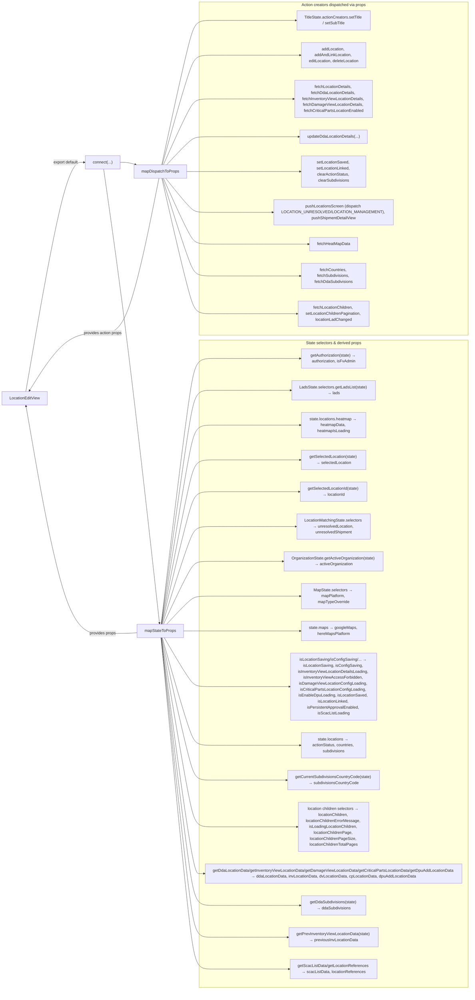

# Diagram: web/portal/src/pages/administration/location-management/location-neworedit/LocationManagement.LocationNewOrEdit.page.container.js

> Auto-generated by Obscura crawlers

## Mermaid

### SVG

<svg id="container" width="1925.421875" xmlns="http://www.w3.org/2000/svg" class="flowchart" height="4004" viewBox="0 0 1925.421875 4004" role="graphics-document document" aria-roledescription="flowchart-v2"><g><marker id="container_flowchart-v2-pointEnd" class="marker flowchart-v2" viewBox="0 0 10 10" refX="5" refY="5" markerUnits="userSpaceOnUse" markerWidth="8" markerHeight="8" orient="auto"><path d="M 0 0 L 10 5 L 0 10 z" class="arrowMarkerPath" style="stroke-width: 1; stroke-dasharray: 1, 0;"></path></marker><marker id="container_flowchart-v2-pointStart" class="marker flowchart-v2" viewBox="0 0 10 10" refX="4.5" refY="5" markerUnits="userSpaceOnUse" markerWidth="8" markerHeight="8" orient="auto"><path d="M 0 5 L 10 10 L 10 0 z" class="arrowMarkerPath" style="stroke-width: 1; stroke-dasharray: 1, 0;"></path></marker><marker id="container_flowchart-v2-circleEnd" class="marker flowchart-v2" viewBox="0 0 10 10" refX="11" refY="5" markerUnits="userSpaceOnUse" markerWidth="11" markerHeight="11" orient="auto"><circle cx="5" cy="5" r="5" class="arrowMarkerPath" style="stroke-width: 1; stroke-dasharray: 1, 0;"></circle></marker><marker id="container_flowchart-v2-circleStart" class="marker flowchart-v2" viewBox="0 0 10 10" refX="-1" refY="5" markerUnits="userSpaceOnUse" markerWidth="11" markerHeight="11" orient="auto"><circle cx="5" cy="5" r="5" class="arrowMarkerPath" style="stroke-width: 1; stroke-dasharray: 1, 0;"></circle></marker><marker id="container_flowchart-v2-crossEnd" class="marker cross flowchart-v2" viewBox="0 0 11 11" refX="12" refY="5.2" markerUnits="userSpaceOnUse" markerWidth="11" markerHeight="11" orient="auto"><path d="M 1,1 l 9,9 M 10,1 l -9,9" class="arrowMarkerPath" style="stroke-width: 2; stroke-dasharray: 1, 0;"></path></marker><marker id="container_flowchart-v2-crossStart" class="marker cross flowchart-v2" viewBox="0 0 11 11" refX="-1" refY="5.2" markerUnits="userSpaceOnUse" markerWidth="11" markerHeight="11" orient="auto"><path d="M 1,1 l 9,9 M 10,1 l -9,9" class="arrowMarkerPath" style="stroke-width: 2; stroke-dasharray: 1, 0;"></path></marker><g class="root"><g class="clusters"><g class="cluster" id="ActionCreators" data-look="classic"><rect style="" x="815.5" y="8" width="1101.921875" height="1364"></rect><g class="cluster-label" transform="translate(1266.4609375, 8)"><foreignObject width="200" height="48">

Action creators dispatched via props

</foreignObject></g></g><g class="cluster" id="StateSelectors" data-look="classic"><rect style="" x="815.5" y="1392" width="1101.921875" height="2604"></rect><g class="cluster-label" transform="translate(1266.4609375, 1392)"><foreignObject width="200" height="48">

State selectors &amp; derived props

</foreignObject></g></g></g><g class="edgePaths"><path d="M104.7,1599L131.982,1445.333C159.263,1291.667,213.827,984.333,254.748,830.667C295.669,677,322.948,677,336.587,677L350.227,677" id="L_LocationEditView_Connect_0" class="edge-thickness-normal edge-pattern-solid edge-thickness-normal edge-pattern-solid flowchart-link" style=";" data-edge="true" data-et="edge" data-id="L_LocationEditView_Connect_0" data-points="W3sieCI6MTA0LjY5OTc5OTEzMDY2Mzg2LCJ5IjoxNTk5fSx7IngiOjI2OC4zOTA2MjUsInkiOjY3N30seyJ4IjozNTQuMjI2NTYyNSwieSI6Njc3fV0=" marker-end="url(#container_flowchart-v2-pointEnd)"></path><path d="M427.921,704L444.593,817.667C461.265,931.333,494.609,1158.667,532.584,1463.171C570.558,1767.675,613.164,2149.35,634.466,2340.187L655.769,2531.025" id="L_Connect_MapState_0" class="edge-thickness-normal edge-pattern-solid edge-thickness-normal edge-pattern-solid flowchart-link" style=";" data-edge="true" data-et="edge" data-id="L_Connect_MapState_0" data-points="W3sieCI6NDI3LjkyMTE0Nzc0MzMwMDQsInkiOjcwNH0seyJ4Ijo1MjcuOTUzMTI1LCJ5IjoxMzg2fSx7IngiOjY1Ni4yMTI2MzE1MzY5ODk4LCJ5IjoyNTM1fV0=" marker-end="url(#container_flowchart-v2-pointEnd)"></path><path d="M493.695,677L499.405,677C505.115,677,516.534,677,527.515,678.486C538.496,679.972,549.039,682.943,554.311,684.429L559.582,685.915" id="L_Connect_MapDispatch_0" class="edge-thickness-normal edge-pattern-solid edge-thickness-normal edge-pattern-solid flowchart-link" style=";" data-edge="true" data-et="edge" data-id="L_Connect_MapDispatch_0" data-points="W3sieCI6NDkzLjY5NTMxMjUsInkiOjY3N30seyJ4Ijo1MjcuOTUzMTI1LCJ5Ijo2Nzd9LHsieCI6NTYzLjQzMjQzMjQzMjQzMjQsInkiOjY4N31d" marker-end="url(#container_flowchart-v2-pointEnd)"></path><path d="M662.46,2535L683.8,2356.833C705.14,2178.667,747.82,1822.333,773.327,1644.167C798.833,1466,807.167,1466,880.827,1466C954.487,1466,1093.474,1466,1162.967,1466L1232.461,1466" id="L_MapState_auth_0" class="edge-thickness-normal edge-pattern-solid edge-thickness-normal edge-pattern-solid flowchart-link" style=";" data-edge="true" data-et="edge" data-id="L_MapState_auth_0" data-points="W3sieCI6NjYyLjQ2MDQ4ODQyMzgxMzksInkiOjI1MzV9LHsieCI6NzkwLjUsInkiOjE0NjZ9LHsieCI6ODE1LjUsInkiOjE0NjZ9LHsieCI6MTIzNi40NjA5Mzc1LCJ5IjoxNDY2fV0=" marker-end="url(#container_flowchart-v2-pointEnd)"></path><path d="M662.888,2535L684.157,2378.167C705.425,2221.333,747.963,1907.667,773.398,1750.833C798.833,1594,807.167,1594,874.466,1594C941.766,1594,1068.031,1594,1131.164,1594L1194.297,1594" id="L_MapState_lads_0" class="edge-thickness-normal edge-pattern-solid edge-thickness-normal edge-pattern-solid flowchart-link" style=";" data-edge="true" data-et="edge" data-id="L_MapState_lads_0" data-points="W3sieCI6NjYyLjg4ODExNDk5MjI1MjEsInkiOjI1MzV9LHsieCI6NzkwLjUsInkiOjE1OTR9LHsieCI6ODE1LjUsInkiOjE1OTR9LHsieCI6MTE5OC4yOTY4NzUsInkiOjE1OTR9XQ==" marker-end="url(#container_flowchart-v2-pointEnd)"></path><path d="M663.507,2535L684.673,2401.5C705.838,2268,748.169,2001,773.501,1867.5C798.833,1734,807.167,1734,880.827,1734C954.487,1734,1093.474,1734,1162.967,1734L1232.461,1734" id="L_MapState_heatmap_0" class="edge-thickness-normal edge-pattern-solid edge-thickness-normal edge-pattern-solid flowchart-link" style=";" data-edge="true" data-et="edge" data-id="L_MapState_heatmap_0" data-points="W3sieCI6NjYzLjUwNzIxODA3MDY1MjEsInkiOjI1MzV9LHsieCI6NzkwLjUsInkiOjE3MzR9LHsieCI6ODE1LjUsInkiOjE3MzR9LHsieCI6MTIzNi40NjA5Mzc1LCJ5IjoxNzM0fV0=" marker-end="url(#container_flowchart-v2-pointEnd)"></path><path d="M664.378,2535L685.399,2424.833C706.419,2314.667,748.459,2094.333,773.646,1984.167C798.833,1874,807.167,1874,880.827,1874C954.487,1874,1093.474,1874,1162.967,1874L1232.461,1874" id="L_MapState_selected_0" class="edge-thickness-normal edge-pattern-solid edge-thickness-normal edge-pattern-solid flowchart-link" style=";" data-edge="true" data-et="edge" data-id="L_MapState_selected_0" data-points="W3sieCI6NjY0LjM3ODI4MTcwNDIxNTIsInkiOjI1MzV9LHsieCI6NzkwLjUsInkiOjE4NzR9LHsieCI6ODE1LjUsInkiOjE4NzR9LHsieCI6MTIzNi40NjA5Mzc1LCJ5IjoxODc0fV0=" marker-end="url(#container_flowchart-v2-pointEnd)"></path><path d="M665.556,2535L686.38,2446.167C707.204,2357.333,748.852,2179.667,773.843,2090.833C798.833,2002,807.167,2002,879.835,2002C952.503,2002,1089.505,2002,1158.007,2002L1226.508,2002" id="L_MapState_selectedId_0" class="edge-thickness-normal edge-pattern-solid edge-thickness-normal edge-pattern-solid flowchart-link" style=";" data-edge="true" data-et="edge" data-id="L_MapState_selectedId_0" data-points="W3sieCI6NjY1LjU1NTgxNzUyMjMyMTQsInkiOjI1MzV9LHsieCI6NzkwLjUsInkiOjIwMDJ9LHsieCI6ODE1LjUsInkiOjIwMDJ9LHsieCI6MTIzMC41MDc4MTI1LCJ5IjoyMDAyfV0=" marker-end="url(#container_flowchart-v2-pointEnd)"></path><path d="M667.666,2535L688.138,2469.5C708.61,2404,749.555,2273,774.194,2207.5C798.833,2142,807.167,2142,877.591,2142C948.016,2142,1080.531,2142,1146.789,2142L1213.047,2142" id="L_MapState_unresolved_0" class="edge-thickness-normal edge-pattern-solid edge-thickness-normal edge-pattern-solid flowchart-link" style=";" data-edge="true" data-et="edge" data-id="L_MapState_unresolved_0" data-points="W3sieCI6NjY3LjY2NTU2OTE5NjQyODYsInkiOjI1MzV9LHsieCI6NzkwLjUsInkiOjIxNDJ9LHsieCI6ODE1LjUsInkiOjIxNDJ9LHsieCI6MTIxNy4wNDY4NzUsInkiOjIxNDJ9XQ==" marker-end="url(#container_flowchart-v2-pointEnd)"></path><path d="M671.885,2535L691.654,2492.833C711.423,2450.667,750.962,2366.333,774.898,2324.167C798.833,2282,807.167,2282,869,2282C930.833,2282,1046.167,2282,1103.833,2282L1161.5,2282" id="L_MapState_org_0" class="edge-thickness-normal edge-pattern-solid edge-thickness-normal edge-pattern-solid flowchart-link" style=";" data-edge="true" data-et="edge" data-id="L_MapState_org_0" data-points="W3sieCI6NjcxLjg4NTA3MjU0NDY0MjksInkiOjI1MzV9LHsieCI6NzkwLjUsInkiOjIyODJ9LHsieCI6ODE1LjUsInkiOjIyODJ9LHsieCI6MTE2NS41LCJ5IjoyMjgyfV0=" marker-end="url(#container_flowchart-v2-pointEnd)"></path><path d="M684.544,2535L702.203,2516.167C719.862,2497.333,755.181,2459.667,777.007,2440.833C798.833,2422,807.167,2422,880.827,2422C954.487,2422,1093.474,2422,1162.967,2422L1232.461,2422" id="L_MapState_mapstate_0" class="edge-thickness-normal edge-pattern-solid edge-thickness-normal edge-pattern-solid flowchart-link" style=";" data-edge="true" data-et="edge" data-id="L_MapState_mapstate_0" data-points="W3sieCI6Njg0LjU0MzU4MjU4OTI4NTcsInkiOjI1MzV9LHsieCI6NzkwLjUsInkiOjI0MjJ9LHsieCI6ODE1LjUsInkiOjI0MjJ9LHsieCI6MTIzNi40NjA5Mzc1LCJ5IjoyNDIyfV0=" marker-end="url(#container_flowchart-v2-pointEnd)"></path><path d="M752.727,2562L759.022,2562C765.318,2562,777.909,2562,788.371,2562C798.833,2562,807.167,2562,880.827,2562C954.487,2562,1093.474,2562,1162.967,2562L1232.461,2562" id="L_MapState_maps_0" class="edge-thickness-normal edge-pattern-solid edge-thickness-normal edge-pattern-solid flowchart-link" style=";" data-edge="true" data-et="edge" data-id="L_MapState_maps_0" data-points="W3sieCI6NzUyLjcyNjU2MjUsInkiOjI1NjJ9LHsieCI6NzkwLjUsInkiOjI1NjJ9LHsieCI6ODE1LjUsInkiOjI1NjJ9LHsieCI6MTIzNi40NjA5Mzc1LCJ5IjoyNTYyfV0=" marker-end="url(#container_flowchart-v2-pointEnd)"></path><path d="M675.05,2589L694.291,2621.833C713.533,2654.667,752.017,2720.333,775.425,2753.167C798.833,2786,807.167,2786,873.169,2786C939.172,2786,1062.844,2786,1124.68,2786L1186.516,2786" id="L_MapState_flags_0" class="edge-thickness-normal edge-pattern-solid edge-thickness-normal edge-pattern-solid flowchart-link" style=";" data-edge="true" data-et="edge" data-id="L_MapState_flags_0" data-points="W3sieCI6Njc1LjA0OTcwMDA1NTgwMzYsInkiOjI1ODl9LHsieCI6NzkwLjUsInkiOjI3ODZ9LHsieCI6ODE1LjUsInkiOjI3ODZ9LHsieCI6MTE5MC41MTU2MjUsInkiOjI3ODZ9XQ==" marker-end="url(#container_flowchart-v2-pointEnd)"></path><path d="M666.932,2589L687.526,2661.167C708.121,2733.333,749.311,2877.667,774.072,2949.833C798.833,3022,807.167,3022,880.827,3022C954.487,3022,1093.474,3022,1162.967,3022L1232.461,3022" id="L_MapState_lists_0" class="edge-thickness-normal edge-pattern-solid edge-thickness-normal edge-pattern-solid flowchart-link" style=";" data-edge="true" data-et="edge" data-id="L_MapState_lists_0" data-points="W3sieCI6NjY2LjkzMTc0MjUyNzE3MzksInkiOjI1ODl9LHsieCI6NzkwLjUsInkiOjMwMjJ9LHsieCI6ODE1LjUsInkiOjMwMjJ9LHsieCI6MTIzNi40NjA5Mzc1LCJ5IjozMDIyfV0=" marker-end="url(#container_flowchart-v2-pointEnd)"></path><path d="M665.134,2589L686.028,2684.5C706.923,2780,748.711,2971,773.772,3066.5C798.833,3162,807.167,3162,871.497,3162C935.828,3162,1056.156,3162,1116.32,3162L1176.484,3162" id="L_MapState_subdivisionsCode_0" class="edge-thickness-normal edge-pattern-solid edge-thickness-normal edge-pattern-solid flowchart-link" style=";" data-edge="true" data-et="edge" data-id="L_MapState_subdivisionsCode_0" data-points="W3sieCI6NjY1LjEzMzg2NzE4NzUsInkiOjI1ODl9LHsieCI6NzkwLjUsInkiOjMxNjJ9LHsieCI6ODE1LjUsInkiOjMxNjJ9LHsieCI6MTE4MC40ODQzNzUsInkiOjMxNjJ9XQ==" marker-end="url(#container_flowchart-v2-pointEnd)"></path><path d="M663.725,2589L684.854,2715.833C705.983,2842.667,748.242,3096.333,773.537,3223.167C798.833,3350,807.167,3350,878.773,3350C950.38,3350,1085.26,3350,1152.701,3350L1220.141,3350" id="L_MapState_children_0" class="edge-thickness-normal edge-pattern-solid edge-thickness-normal edge-pattern-solid flowchart-link" style=";" data-edge="true" data-et="edge" data-id="L_MapState_children_0" data-points="W3sieCI6NjYzLjcyNDUxMDIzMTU5OSwieSI6MjU4OX0seyJ4Ijo3OTAuNSwieSI6MzM1MH0seyJ4Ijo4MTUuNSwieSI6MzM1MH0seyJ4IjoxMjI0LjE0MDYyNSwieSI6MzM1MH1d" marker-end="url(#container_flowchart-v2-pointEnd)"></path><path d="M662.858,2589L684.132,2747.167C705.405,2905.333,747.953,3221.667,773.393,3379.833C798.833,3538,807.167,3538,814.833,3538C822.5,3538,829.5,3538,833,3538L836.5,3538" id="L_MapState_ddaInvDvCpDpu_0" class="edge-thickness-normal edge-pattern-solid edge-thickness-normal edge-pattern-solid flowchart-link" style=";" data-edge="true" data-et="edge" data-id="L_MapState_ddaInvDvCpDpu_0" data-points="W3sieCI6NjYyLjg1ODEwMjI2NjkwNTcsInkiOjI1ODl9LHsieCI6NzkwLjUsInkiOjM1Mzh9LHsieCI6ODE1LjUsInkiOjM1Mzh9LHsieCI6ODQwLjUsInkiOjM1Mzh9XQ==" marker-end="url(#container_flowchart-v2-pointEnd)"></path><path d="M662.437,2589L683.781,2768.5C705.125,2948,747.812,3307,773.323,3486.5C798.833,3666,807.167,3666,880.827,3666C954.487,3666,1093.474,3666,1162.967,3666L1232.461,3666" id="L_MapState_ddaSubdivisions_0" class="edge-thickness-normal edge-pattern-solid edge-thickness-normal edge-pattern-solid flowchart-link" style=";" data-edge="true" data-et="edge" data-id="L_MapState_ddaSubdivisions_0" data-points="W3sieCI6NjYyLjQzNzA1NDE3Nzk4OTEsInkiOjI1ODl9LHsieCI6NzkwLjUsInkiOjM2NjZ9LHsieCI6ODE1LjUsInkiOjM2NjZ9LHsieCI6MTIzNi40NjA5Mzc1LCJ5IjozNjY2fV0=" marker-end="url(#container_flowchart-v2-pointEnd)"></path><path d="M662.103,2589L683.503,2789.833C704.902,2990.667,747.701,3392.333,773.267,3593.167C798.833,3794,807.167,3794,872.309,3794C937.451,3794,1059.401,3794,1120.376,3794L1181.352,3794" id="L_MapState_prevInv_0" class="edge-thickness-normal edge-pattern-solid edge-thickness-normal edge-pattern-solid flowchart-link" style=";" data-edge="true" data-et="edge" data-id="L_MapState_prevInv_0" data-points="W3sieCI6NjYyLjEwMzQ5NjYwMTA1NTIsInkiOjI1ODl9LHsieCI6NzkwLjUsInkiOjM3OTR9LHsieCI6ODE1LjUsInkiOjM3OTR9LHsieCI6MTE4NS4zNTE1NjI1LCJ5IjozNzk0fV0=" marker-end="url(#container_flowchart-v2-pointEnd)"></path><path d="M661.833,2589L683.277,2811.167C704.722,3033.333,747.611,3477.667,773.222,3699.833C798.833,3922,807.167,3922,873.309,3922C939.451,3922,1063.401,3922,1125.376,3922L1187.352,3922" id="L_MapState_scacRefs_0" class="edge-thickness-normal edge-pattern-solid edge-thickness-normal edge-pattern-solid flowchart-link" style=";" data-edge="true" data-et="edge" data-id="L_MapState_scacRefs_0" data-points="W3sieCI6NjYxLjgzMjcyNjMzMjcyMDUsInkiOjI1ODl9LHsieCI6NzkwLjUsInkiOjM5MjJ9LHsieCI6ODE1LjUsInkiOjM5MjJ9LHsieCI6MTE5MS4zNTE1NjI1LCJ5IjozOTIyfV0=" marker-end="url(#container_flowchart-v2-pointEnd)"></path><path d="M664.835,687L685.779,586.167C706.723,485.333,748.612,283.667,773.722,182.833C798.833,82,807.167,82,877.5,82C947.833,82,1080.167,82,1146.333,82L1212.5,82" id="L_MapDispatch_title_0" class="edge-thickness-normal edge-pattern-solid edge-thickness-normal edge-pattern-solid flowchart-link" style=";" data-edge="true" data-et="edge" data-id="L_MapDispatch_title_0" data-points="W3sieCI6NjY0LjgzNDc2MzE1MjY4OTksInkiOjY4N30seyJ4Ijo3OTAuNSwieSI6ODJ9LHsieCI6ODE1LjUsInkiOjgyfSx7IngiOjEyMTYuNSwieSI6ODJ9XQ==" marker-end="url(#container_flowchart-v2-pointEnd)"></path><path d="M666.611,687L687.259,611.5C707.907,536,749.204,385,774.018,309.5C798.833,234,807.167,234,880.827,234C954.487,234,1093.474,234,1162.967,234L1232.461,234" id="L_MapDispatch_addLoc_0" class="edge-thickness-normal edge-pattern-solid edge-thickness-normal edge-pattern-solid flowchart-link" style=";" data-edge="true" data-et="edge" data-id="L_MapDispatch_addLoc_0" data-points="W3sieCI6NjY2LjYxMDY5MzM1OTM3NSwieSI6Njg3fSx7IngiOjc5MC41LCJ5IjoyMzR9LHsieCI6ODE1LjUsInkiOjIzNH0seyJ4IjoxMjM2LjQ2MDkzNzUsInkiOjIzNH1d" marker-end="url(#container_flowchart-v2-pointEnd)"></path><path d="M671.365,687L691.221,642.833C711.077,598.667,750.788,510.333,774.811,466.167C798.833,422,807.167,422,875.898,422C944.63,422,1073.76,422,1138.326,422L1202.891,422" id="L_MapDispatch_fetchDetails_0" class="edge-thickness-normal edge-pattern-solid edge-thickness-normal edge-pattern-solid flowchart-link" style=";" data-edge="true" data-et="edge" data-id="L_MapDispatch_fetchDetails_0" data-points="W3sieCI6NjcxLjM2NDg1OTgwMzA4MjEsInkiOjY4N30seyJ4Ijo3OTAuNSwieSI6NDIyfSx7IngiOjgxNS41LCJ5Ijo0MjJ9LHsieCI6MTIwNi44OTA2MjUsInkiOjQyMn1d" marker-end="url(#container_flowchart-v2-pointEnd)"></path><path d="M684.544,687L702.203,668.167C719.862,649.333,755.181,611.667,777.007,592.833C798.833,574,807.167,574,879.66,574C952.154,574,1088.807,574,1157.134,574L1225.461,574" id="L_MapDispatch_updateDda_0" class="edge-thickness-normal edge-pattern-solid edge-thickness-normal edge-pattern-solid flowchart-link" style=";" data-edge="true" data-et="edge" data-id="L_MapDispatch_updateDda_0" data-points="W3sieCI6Njg0LjU0MzU4MjU4OTI4NTcsInkiOjY4N30seyJ4Ijo3OTAuNSwieSI6NTc0fSx7IngiOjgxNS41LCJ5Ijo1NzR9LHsieCI6MTIyOS40NjA5Mzc1LCJ5Ijo1NzR9XQ==" marker-end="url(#container_flowchart-v2-pointEnd)"></path><path d="M765.5,714L769.667,714C773.833,714,782.167,714,790.5,714C798.833,714,807.167,714,880.827,714C954.487,714,1093.474,714,1162.967,714L1232.461,714" id="L_MapDispatch_setFlags_0" class="edge-thickness-normal edge-pattern-solid edge-thickness-normal edge-pattern-solid flowchart-link" style=";" data-edge="true" data-et="edge" data-id="L_MapDispatch_setFlags_0" data-points="W3sieCI6NzY1LjUsInkiOjcxNH0seyJ4Ijo3OTAuNSwieSI6NzE0fSx7IngiOjgxNS41LCJ5Ijo3MTR9LHsieCI6MTIzNi40NjA5Mzc1LCJ5Ijo3MTR9XQ==" marker-end="url(#container_flowchart-v2-pointEnd)"></path><path d="M680.839,741L699.116,763.833C717.392,786.667,753.946,832.333,776.39,855.167C798.833,878,807.167,878,866.384,878C925.602,878,1035.703,878,1090.754,878L1145.805,878" id="L_MapDispatch_navigation_0" class="edge-thickness-normal edge-pattern-solid edge-thickness-normal edge-pattern-solid flowchart-link" style=";" data-edge="true" data-et="edge" data-id="L_MapDispatch_navigation_0" data-points="W3sieCI6NjgwLjgzODY1MjgyMDEyMiwieSI6NzQxfSx7IngiOjc5MC41LCJ5Ijo4Nzh9LHsieCI6ODE1LjUsInkiOjg3OH0seyJ4IjoxMTQ5LjgwNDY4NzUsInkiOjg3OH1d" marker-end="url(#container_flowchart-v2-pointEnd)"></path><path d="M671.365,741L691.221,785.167C711.077,829.333,750.788,917.667,774.811,961.833C798.833,1006,807.167,1006,886.303,1006C965.44,1006,1115.38,1006,1190.35,1006L1265.32,1006" id="L_MapDispatch_heatmapFetch_0" class="edge-thickness-normal edge-pattern-solid edge-thickness-normal edge-pattern-solid flowchart-link" style=";" data-edge="true" data-et="edge" data-id="L_MapDispatch_heatmapFetch_0" data-points="W3sieCI6NjcxLjM2NDg1OTgwMzA4MjEsInkiOjc0MX0seyJ4Ijo3OTAuNSwieSI6MTAwNn0seyJ4Ijo4MTUuNSwieSI6MTAwNn0seyJ4IjoxMjY5LjMyMDMxMjUsInkiOjEwMDZ9XQ==" marker-end="url(#container_flowchart-v2-pointEnd)"></path><path d="M667.666,741L688.138,806.5C708.61,872,749.555,1003,774.194,1068.5C798.833,1134,807.167,1134,880.827,1134C954.487,1134,1093.474,1134,1162.967,1134L1232.461,1134" id="L_MapDispatch_countriesSubdivs_0" class="edge-thickness-normal edge-pattern-solid edge-thickness-normal edge-pattern-solid flowchart-link" style=";" data-edge="true" data-et="edge" data-id="L_MapDispatch_countriesSubdivs_0" data-points="W3sieCI6NjY3LjY2NTU2OTE5NjQyODYsInkiOjc0MX0seyJ4Ijo3OTAuNSwieSI6MTEzNH0seyJ4Ijo4MTUuNSwieSI6MTEzNH0seyJ4IjoxMjM2LjQ2MDkzNzUsInkiOjExMzR9XQ==" marker-end="url(#container_flowchart-v2-pointEnd)"></path><path d="M665.423,741L686.269,831.833C707.115,922.667,748.808,1104.333,773.821,1195.167C798.833,1286,807.167,1286,878.353,1286C949.539,1286,1083.578,1286,1150.598,1286L1217.617,1286" id="L_MapDispatch_childrenActions_0" class="edge-thickness-normal edge-pattern-solid edge-thickness-normal edge-pattern-solid flowchart-link" style=";" data-edge="true" data-et="edge" data-id="L_MapDispatch_childrenActions_0" data-points="W3sieCI6NjY1LjQyMzAzNTk0ODQyNjYsInkiOjc0MX0seyJ4Ijo3OTAuNSwieSI6MTI4Nn0seyJ4Ijo4MTUuNSwieSI6MTI4Nn0seyJ4IjoxMjIxLjYxNzE4NzUsInkiOjEyODZ9XQ==" marker-end="url(#container_flowchart-v2-pointEnd)"></path><path d="M565.727,2569.123L559.431,2569.602C553.135,2570.082,540.544,2571.041,516.917,2571.52C493.289,2572,458.625,2572,415.365,2572C372.104,2572,320.247,2572,267.157,2419.49C214.066,2266.979,159.741,1961.959,132.579,1809.448L105.416,1656.938" id="L_MapState_LocationEditView_0" class="edge-thickness-normal edge-pattern-solid edge-thickness-normal edge-pattern-solid flowchart-link" style=";" data-edge="true" data-et="edge" data-id="L_MapState_LocationEditView_0" data-points="W3sieCI6NTY1LjcyNjU2MjUsInkiOjI1NjkuMTIyNTM3NjQyMDg3NX0seyJ4Ijo1MjcuOTUzMTI1LCJ5IjoyNTcyfSx7IngiOjQyMy45NjA5Mzc1LCJ5IjoyNTcyfSx7IngiOjI2OC4zOTA2MjUsInkiOjI1NzJ9LHsieCI6MTA0LjcxNTAwMDY2MDY3NjU0LCJ5IjoxNjUzfV0=" marker-end="url(#container_flowchart-v2-pointEnd)"></path><path d="M653.774,741L632.804,844.833C611.833,948.667,569.893,1156.333,531.591,1260.167C493.289,1364,458.625,1364,415.365,1364C372.104,1364,320.247,1364,269.493,1402.606C218.738,1441.212,169.085,1518.424,144.259,1557.03L119.433,1595.636" id="L_MapDispatch_LocationEditView_0" class="edge-thickness-normal edge-pattern-solid edge-thickness-normal edge-pattern-solid flowchart-link" style=";" data-edge="true" data-et="edge" data-id="L_MapDispatch_LocationEditView_0" data-points="W3sieCI6NjUzLjc3MzY2NTg2NTM4NDYsInkiOjc0MX0seyJ4Ijo1MjcuOTUzMTI1LCJ5IjoxMzY0fSx7IngiOjQyMy45NjA5Mzc1LCJ5IjoxMzY0fSx7IngiOjI2OC4zOTA2MjUsInkiOjEzNjR9LHsieCI6MTE3LjI2OTE0MzYwNjg3MDIzLCJ5IjoxNTk5fV0=" marker-end="url(#container_flowchart-v2-pointEnd)"></path></g><g class="edgeLabels"><g class="edgeLabel" transform="translate(268.390625, 677)"><g class="label" data-id="L_LocationEditView_Connect_0" transform="translate(-51.578125, -12)"><foreignObject width="103.15625" height="24">

export default

</foreignObject></g></g><g class="edgeLabel"><g class="label" data-id="L_Connect_MapState_0" transform="translate(0, 0)"><foreignObject width="0" height="0">

</foreignObject></g></g><g class="edgeLabel"><g class="label" data-id="L_Connect_MapDispatch_0" transform="translate(0, 0)"><foreignObject width="0" height="0">

</foreignObject></g></g><g class="edgeLabel"><g class="label" data-id="L_MapState_auth_0" transform="translate(0, 0)"><foreignObject width="0" height="0">

</foreignObject></g></g><g class="edgeLabel"><g class="label" data-id="L_MapState_lads_0" transform="translate(0, 0)"><foreignObject width="0" height="0">

</foreignObject></g></g><g class="edgeLabel"><g class="label" data-id="L_MapState_heatmap_0" transform="translate(0, 0)"><foreignObject width="0" height="0">

</foreignObject></g></g><g class="edgeLabel"><g class="label" data-id="L_MapState_selected_0" transform="translate(0, 0)"><foreignObject width="0" height="0">

</foreignObject></g></g><g class="edgeLabel"><g class="label" data-id="L_MapState_selectedId_0" transform="translate(0, 0)"><foreignObject width="0" height="0">

</foreignObject></g></g><g class="edgeLabel"><g class="label" data-id="L_MapState_unresolved_0" transform="translate(0, 0)"><foreignObject width="0" height="0">

</foreignObject></g></g><g class="edgeLabel"><g class="label" data-id="L_MapState_org_0" transform="translate(0, 0)"><foreignObject width="0" height="0">

</foreignObject></g></g><g class="edgeLabel"><g class="label" data-id="L_MapState_mapstate_0" transform="translate(0, 0)"><foreignObject width="0" height="0">

</foreignObject></g></g><g class="edgeLabel"><g class="label" data-id="L_MapState_maps_0" transform="translate(0, 0)"><foreignObject width="0" height="0">

</foreignObject></g></g><g class="edgeLabel"><g class="label" data-id="L_MapState_flags_0" transform="translate(0, 0)"><foreignObject width="0" height="0">

</foreignObject></g></g><g class="edgeLabel"><g class="label" data-id="L_MapState_lists_0" transform="translate(0, 0)"><foreignObject width="0" height="0">

</foreignObject></g></g><g class="edgeLabel"><g class="label" data-id="L_MapState_subdivisionsCode_0" transform="translate(0, 0)"><foreignObject width="0" height="0">

</foreignObject></g></g><g class="edgeLabel"><g class="label" data-id="L_MapState_children_0" transform="translate(0, 0)"><foreignObject width="0" height="0">

</foreignObject></g></g><g class="edgeLabel"><g class="label" data-id="L_MapState_ddaInvDvCpDpu_0" transform="translate(0, 0)"><foreignObject width="0" height="0">

</foreignObject></g></g><g class="edgeLabel"><g class="label" data-id="L_MapState_ddaSubdivisions_0" transform="translate(0, 0)"><foreignObject width="0" height="0">

</foreignObject></g></g><g class="edgeLabel"><g class="label" data-id="L_MapState_prevInv_0" transform="translate(0, 0)"><foreignObject width="0" height="0">

</foreignObject></g></g><g class="edgeLabel"><g class="label" data-id="L_MapState_scacRefs_0" transform="translate(0, 0)"><foreignObject width="0" height="0">

</foreignObject></g></g><g class="edgeLabel"><g class="label" data-id="L_MapDispatch_title_0" transform="translate(0, 0)"><foreignObject width="0" height="0">

</foreignObject></g></g><g class="edgeLabel"><g class="label" data-id="L_MapDispatch_addLoc_0" transform="translate(0, 0)"><foreignObject width="0" height="0">

</foreignObject></g></g><g class="edgeLabel"><g class="label" data-id="L_MapDispatch_fetchDetails_0" transform="translate(0, 0)"><foreignObject width="0" height="0">

</foreignObject></g></g><g class="edgeLabel"><g class="label" data-id="L_MapDispatch_updateDda_0" transform="translate(0, 0)"><foreignObject width="0" height="0">

</foreignObject></g></g><g class="edgeLabel"><g class="label" data-id="L_MapDispatch_setFlags_0" transform="translate(0, 0)"><foreignObject width="0" height="0">

</foreignObject></g></g><g class="edgeLabel"><g class="label" data-id="L_MapDispatch_navigation_0" transform="translate(0, 0)"><foreignObject width="0" height="0">

</foreignObject></g></g><g class="edgeLabel"><g class="label" data-id="L_MapDispatch_heatmapFetch_0" transform="translate(0, 0)"><foreignObject width="0" height="0">

</foreignObject></g></g><g class="edgeLabel"><g class="label" data-id="L_MapDispatch_countriesSubdivs_0" transform="translate(0, 0)"><foreignObject width="0" height="0">

</foreignObject></g></g><g class="edgeLabel"><g class="label" data-id="L_MapDispatch_childrenActions_0" transform="translate(0, 0)"><foreignObject width="0" height="0">

</foreignObject></g></g><g class="edgeLabel" transform="translate(423.9609375, 2572)"><g class="label" data-id="L_MapState_LocationEditView_0" transform="translate(-54.1953125, -12)"><foreignObject width="108.390625" height="24">

provides props

</foreignObject></g></g><g class="edgeLabel" transform="translate(423.9609375, 1364)"><g class="label" data-id="L_MapDispatch_LocationEditView_0" transform="translate(-78.9921875, -12)"><foreignObject width="157.984375" height="24">

provides action props

</foreignObject></g></g></g><g class="nodes"><g class="node default" id="flowchart-LocationEditView-0" transform="translate(99.90625, 1626)"><rect class="basic label-container" style="" x="-91.90625" y="-27" width="183.8125" height="54"></rect><g class="label" style="" transform="translate(-61.90625, -12)"><rect></rect><foreignObject width="123.8125" height="24">

LocationEditView

</foreignObject></g></g><g class="node default" id="flowchart-Connect-1" transform="translate(423.9609375, 677)"><rect class="basic label-container" style="" x="-69.734375" y="-27" width="139.46875" height="54"></rect><g class="label" style="" transform="translate(-39.734375, -12)"><rect></rect><foreignObject width="79.46875" height="24">

connect(...)

</foreignObject></g></g><g class="node default" id="flowchart-MapState-2" transform="translate(659.2265625, 2562)"><rect class="basic label-container" style="" x="-93.5" y="-27" width="187" height="54"></rect><g class="label" style="" transform="translate(-63.5, -12)"><rect></rect><foreignObject width="127" height="24">

mapStateToProps

</foreignObject></g></g><g class="node default" id="flowchart-MapDispatch-3" transform="translate(659.2265625, 714)"><rect class="basic label-container" style="" x="-106.2734375" y="-27" width="212.546875" height="54"></rect><g class="label" style="" transform="translate(-76.2734375, -12)"><rect></rect><foreignObject width="152.546875" height="24">

mapDispatchToProps

</foreignObject></g></g><g class="node default" id="flowchart-auth-10" transform="translate(1366.4609375, 1466)"><rect class="basic label-container" style="" x="-130" y="-39" width="260" height="78"></rect><g class="label" style="" transform="translate(-100, -24)"><rect></rect><foreignObject width="200" height="48">

getAuthorization(state) → authorization, isFvAdmin

</foreignObject></g></g><g class="node default" id="flowchart-lads-11" transform="translate(1366.4609375, 1594)"><rect class="basic label-container" style="" x="-168.1640625" y="-39" width="336.328125" height="78"></rect><g class="label" style="" transform="translate(-138.1640625, -24)"><rect></rect><foreignObject width="276.328125" height="48">

LadsState.selectors.getLadsList(state) → lads

</foreignObject></g></g><g class="node default" id="flowchart-heatmap-12" transform="translate(1366.4609375, 1734)"><rect class="basic label-container" style="" x="-130" y="-51" width="260" height="102"></rect><g class="label" style="" transform="translate(-100, -36)"><rect></rect><foreignObject width="200" height="72">

state.locations.heatmap → heatmapData, heatmapIsLoading

</foreignObject></g></g><g class="node default" id="flowchart-selected-13" transform="translate(1366.4609375, 1874)"><rect class="basic label-container" style="" x="-130" y="-39" width="260" height="78"></rect><g class="label" style="" transform="translate(-100, -24)"><rect></rect><foreignObject width="200" height="48">

getSelectedLocation(state) → selectedLocation

</foreignObject></g></g><g class="node default" id="flowchart-selectedId-14" transform="translate(1366.4609375, 2002)"><rect class="basic label-container" style="" x="-135.953125" y="-39" width="271.90625" height="78"></rect><g class="label" style="" transform="translate(-105.953125, -24)"><rect></rect><foreignObject width="211.90625" height="48">

getSelectedLocationId(state) → locationId

</foreignObject></g></g><g class="node default" id="flowchart-unresolved-15" transform="translate(1366.4609375, 2142)"><rect class="basic label-container" style="" x="-149.4140625" y="-51" width="298.828125" height="102"></rect><g class="label" style="" transform="translate(-119.4140625, -36)"><rect></rect><foreignObject width="238.828125" height="72">

LocationMatchingState.selectors → unresolvedLocation, unresolvedShipment

</foreignObject></g></g><g class="node default" id="flowchart-org-16" transform="translate(1366.4609375, 2282)"><rect class="basic label-container" style="" x="-200.9609375" y="-39" width="401.921875" height="78"></rect><g class="label" style="" transform="translate(-170.9609375, -24)"><rect></rect><foreignObject width="341.921875" height="48">

OrganizationState.getActiveOrganization(state) → activeOrganization

</foreignObject></g></g><g class="node default" id="flowchart-mapstate-17" transform="translate(1366.4609375, 2422)"><rect class="basic label-container" style="" x="-130" y="-51" width="260" height="102"></rect><g class="label" style="" transform="translate(-100, -36)"><rect></rect><foreignObject width="200" height="72">

MapState.selectors → mapPlatform, mapTypeOverride

</foreignObject></g></g><g class="node default" id="flowchart-maps-18" transform="translate(1366.4609375, 2562)"><rect class="basic label-container" style="" x="-130" y="-39" width="260" height="78"></rect><g class="label" style="" transform="translate(-100, -24)"><rect></rect><foreignObject width="200" height="48">

state.maps → googleMaps, hereMapsPlatform

</foreignObject></g></g><g class="node default" id="flowchart-flags-19" transform="translate(1366.4609375, 2786)"><rect class="basic label-container" style="" x="-175.9453125" y="-135" width="351.890625" height="270"></rect><g class="label" style="" transform="translate(-145.9453125, -120)"><rect></rect><foreignObject width="291.890625" height="240">

isLocationSaving/isConfigSaving/... → isLocationSaving, isConfigSaving, isInventoryViewLocationDetailsLoading, isInventoryViewAccessForbidden, isDamageViewLocationConfigLoading, isCriticalPartsLocationConfigLoading, isEnableDpuLoading, isLocationSaved, isLocationLinked, isPersistentApprovalEnabled, isScacListLoading

</foreignObject></g></g><g class="node default" id="flowchart-lists-20" transform="translate(1366.4609375, 3022)"><rect class="basic label-container" style="" x="-130" y="-51" width="260" height="102"></rect><g class="label" style="" transform="translate(-100, -36)"><rect></rect><foreignObject width="200" height="72">

state.locations → actionStatus, countries, subdivisions

</foreignObject></g></g><g class="node default" id="flowchart-subdivisionsCode-21" transform="translate(1366.4609375, 3162)"><rect class="basic label-container" style="" x="-185.9765625" y="-39" width="371.953125" height="78"></rect><g class="label" style="" transform="translate(-155.9765625, -24)"><rect></rect><foreignObject width="311.953125" height="48">

getCurrentSubdivisionsCountryCode(state) → subdivisionsCountryCode

</foreignObject></g></g><g class="node default" id="flowchart-children-22" transform="translate(1366.4609375, 3350)"><rect class="basic label-container" style="" x="-142.3203125" y="-99" width="284.640625" height="198"></rect><g class="label" style="" transform="translate(-112.3203125, -84)"><rect></rect><foreignObject width="224.640625" height="168">

location children selectors → locationChildren, locationChildrenErrorMessage, isLoadingLocationChildren, locationChildrenPage, locationChildrenPageSize, locationChildrenTotalPages

</foreignObject></g></g><g class="node default" id="flowchart-ddaInvDvCpDpu-23" transform="translate(1366.4609375, 3538)"><rect class="basic label-container" style="" x="-525.9609375" y="-39" width="1051.921875" height="78"></rect><g class="label" style="" transform="translate(-495.9609375, -24)"><rect></rect><foreignObject width="991.921875" height="48">

getDdaLocationData/getInventoryViewLocationData/getDamageViewLocationData/getCriticalPartsLocationData/getDpuAddLocationData → ddaLocationData, invLocationData, dvLocationData, cpLocationData, dpuAddLocationData

</foreignObject></g></g><g class="node default" id="flowchart-ddaSubdivisions-24" transform="translate(1366.4609375, 3666)"><rect class="basic label-container" style="" x="-130" y="-39" width="260" height="78"></rect><g class="label" style="" transform="translate(-100, -24)"><rect></rect><foreignObject width="200" height="48">

getDdaSubdivisions(state) → ddaSubdivisions

</foreignObject></g></g><g class="node default" id="flowchart-prevInv-25" transform="translate(1366.4609375, 3794)"><rect class="basic label-container" style="" x="-181.109375" y="-39" width="362.21875" height="78"></rect><g class="label" style="" transform="translate(-151.109375, -24)"><rect></rect><foreignObject width="302.21875" height="48">

getPrevInventoryViewLocationData(state) → previousInvLocationData

</foreignObject></g></g><g class="node default" id="flowchart-scacRefs-26" transform="translate(1366.4609375, 3922)"><rect class="basic label-container" style="" x="-175.109375" y="-39" width="350.21875" height="78"></rect><g class="label" style="" transform="translate(-145.109375, -24)"><rect></rect><foreignObject width="290.21875" height="48">

getScacListData/getLocationReferences → scacListData, locationReferences

</foreignObject></g></g><g class="node default" id="flowchart-title-61" transform="translate(1366.4609375, 82)"><rect class="basic label-container" style="" x="-149.9609375" y="-39" width="299.921875" height="78"></rect><g class="label" style="" transform="translate(-119.9609375, -24)"><rect></rect><foreignObject width="239.921875" height="48">

TitleState.actionCreators.setTitle / setSubTitle

</foreignObject></g></g><g class="node default" id="flowchart-addLoc-62" transform="translate(1366.4609375, 234)"><rect class="basic label-container" style="" x="-130" y="-63" width="260" height="126"></rect><g class="label" style="" transform="translate(-100, -48)"><rect></rect><foreignObject width="200" height="96">

addLocation, addAndLinkLocation, editLocation, deleteLocation

</foreignObject></g></g><g class="node default" id="flowchart-fetchDetails-63" transform="translate(1366.4609375, 422)"><rect class="basic label-container" style="" x="-159.5703125" y="-75" width="319.140625" height="150"></rect><g class="label" style="" transform="translate(-129.5703125, -60)"><rect></rect><foreignObject width="259.140625" height="120">

fetchLocationDetails, fetchDdaLocationDetails, fetchInventoryViewLocationDetails, fetchDamageViewLocationDetails, fetchCriticalPartsLocationEnabled

</foreignObject></g></g><g class="node default" id="flowchart-updateDda-64" transform="translate(1366.4609375, 574)"><rect class="basic label-container" style="" x="-137" y="-27" width="274" height="54"></rect><g class="label" style="" transform="translate(-107, -12)"><rect></rect><foreignObject width="214" height="24">

updateDdaLocationDetails(...)

</foreignObject></g></g><g class="node default" id="flowchart-setFlags-65" transform="translate(1366.4609375, 714)"><rect class="basic label-container" style="" x="-130" y="-63" width="260" height="126"></rect><g class="label" style="" transform="translate(-100, -48)"><rect></rect><foreignObject width="200" height="96">

setLocationSaved, setLocationLinked, clearActionStatus, clearSubdivisions

</foreignObject></g></g><g class="node default" id="flowchart-navigation-66" transform="translate(1366.4609375, 878)"><rect class="basic label-container" style="" x="-216.65625" y="-51" width="433.3125" height="102"></rect><g class="label" style="" transform="translate(-186.65625, -36)"><rect></rect><foreignObject width="373.3125" height="72">

pushLocationsScreen (dispatch LOCATION_UNRESOLVED/LOCATION_MANAGEMENT), pushShipmentDetailView

</foreignObject></g></g><g class="node default" id="flowchart-heatmapFetch-67" transform="translate(1366.4609375, 1006)"><rect class="basic label-container" style="" x="-97.140625" y="-27" width="194.28125" height="54"></rect><g class="label" style="" transform="translate(-67.140625, -12)"><rect></rect><foreignObject width="134.28125" height="24">

fetchHeatMapData

</foreignObject></g></g><g class="node default" id="flowchart-countriesSubdivs-68" transform="translate(1366.4609375, 1134)"><rect class="basic label-container" style="" x="-130" y="-51" width="260" height="102"></rect><g class="label" style="" transform="translate(-100, -36)"><rect></rect><foreignObject width="200" height="72">

fetchCountries, fetchSubdivisions, fetchDdaSubdivisions

</foreignObject></g></g><g class="node default" id="flowchart-childrenActions-69" transform="translate(1366.4609375, 1286)"><rect class="basic label-container" style="" x="-144.84375" y="-51" width="289.6875" height="102"></rect><g class="label" style="" transform="translate(-114.84375, -36)"><rect></rect><foreignObject width="229.6875" height="72">

fetchLocationChildren, setLocationChildrenPagination, locationLadChanged

</foreignObject></g></g></g></g></g></svg>
