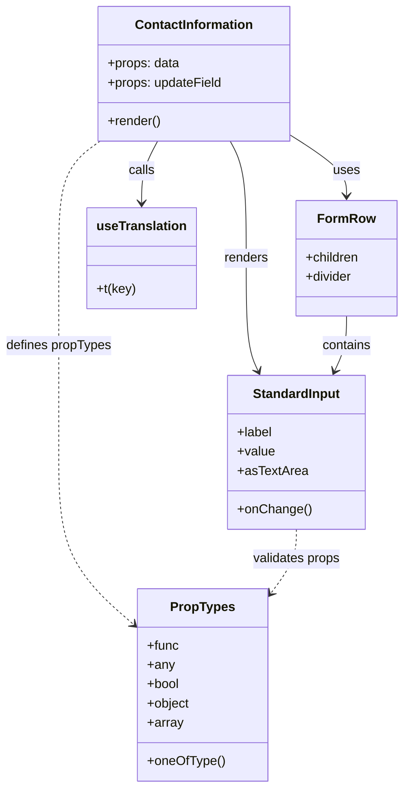

# Diagram: web/portal/src/pages/administration/location-management/location-neworedit/components/ContactInformationForm.js

> Auto-generated by Obscura crawlers

## Mermaid

### SVG

<svg id="container" width="500.1875" xmlns="http://www.w3.org/2000/svg" class="classDiagram" height="982" viewBox="0 0 500.1875 982" role="graphics-document document" aria-roledescription="class"><g><defs><marker id="container_class-aggregationStart" class="marker aggregation class" refX="18" refY="7" markerWidth="190" markerHeight="240" orient="auto"><path d="M 18,7 L9,13 L1,7 L9,1 Z"></path></marker></defs><defs><marker id="container_class-aggregationEnd" class="marker aggregation class" refX="1" refY="7" markerWidth="20" markerHeight="28" orient="auto"><path d="M 18,7 L9,13 L1,7 L9,1 Z"></path></marker></defs><defs><marker id="container_class-extensionStart" class="marker extension class" refX="18" refY="7" markerWidth="190" markerHeight="240" orient="auto"><path d="M 1,7 L18,13 V 1 Z"></path></marker></defs><defs><marker id="container_class-extensionEnd" class="marker extension class" refX="1" refY="7" markerWidth="20" markerHeight="28" orient="auto"><path d="M 1,1 V 13 L18,7 Z"></path></marker></defs><defs><marker id="container_class-compositionStart" class="marker composition class" refX="18" refY="7" markerWidth="190" markerHeight="240" orient="auto"><path d="M 18,7 L9,13 L1,7 L9,1 Z"></path></marker></defs><defs><marker id="container_class-compositionEnd" class="marker composition class" refX="1" refY="7" markerWidth="20" markerHeight="28" orient="auto"><path d="M 18,7 L9,13 L1,7 L9,1 Z"></path></marker></defs><defs><marker id="container_class-dependencyStart" class="marker dependency class" refX="6" refY="7" markerWidth="190" markerHeight="240" orient="auto"><path d="M 5,7 L9,13 L1,7 L9,1 Z"></path></marker></defs><defs><marker id="container_class-dependencyEnd" class="marker dependency class" refX="13" refY="7" markerWidth="20" markerHeight="28" orient="auto"><path d="M 18,7 L9,13 L14,7 L9,1 Z"></path></marker></defs><defs><marker id="container_class-lollipopStart" class="marker lollipop class" refX="13" refY="7" markerWidth="190" markerHeight="240" orient="auto"><circle stroke="black" fill="transparent" cx="7" cy="7" r="6"></circle></marker></defs><defs><marker id="container_class-lollipopEnd" class="marker lollipop class" refX="1" refY="7" markerWidth="190" markerHeight="240" orient="auto"><circle stroke="black" fill="transparent" cx="7" cy="7" r="6"></circle></marker></defs><g class="root"><g class="clusters"></g><g class="edgePaths"><path d="M359.305,168.205L371.015,175.671C382.725,183.136,406.146,198.068,417.856,210.701C429.566,223.333,429.566,233.667,429.566,238.833L429.566,244" id="id_ContactInformation_FormRow_1" class="edge-thickness-normal edge-pattern-solid relation" style=";;;" data-edge="true" data-et="edge" data-id="id_ContactInformation_FormRow_1" data-points="W3sieCI6MzU5LjMwNDY4NzUsInkiOjE2OC4yMDQ2NDc0MjkzMDA2Mn0seyJ4Ijo0MjkuNTY2NDA2MjUsInkiOjIxM30seyJ4Ijo0MjkuNTY2NDA2MjUsInkiOjI1MH1d" marker-end="url(#container_class-dependencyEnd)"></path><path d="M284.497,176L287.78,182.167C291.063,188.333,297.629,200.667,300.912,225C304.195,249.333,304.195,285.667,304.195,322C304.195,358.333,304.195,394.667,306.675,418.095C309.156,441.524,314.116,452.048,316.596,457.311L319.076,462.573" id="id_ContactInformation_StandardInput_2" class="edge-thickness-normal edge-pattern-solid relation" style=";;;" data-edge="true" data-et="edge" data-id="id_ContactInformation_StandardInput_2" data-points="W3sieCI6Mjg0LjQ5NzI1NTk0MDA4MjY1LCJ5IjoxNzZ9LHsieCI6MzA0LjE5NTMxMjUsInkiOjIxM30seyJ4IjozMDQuMTk1MzEyNSwieSI6MzIyfSx7IngiOjMwNC4xOTUzMTI1LCJ5Ijo0MzF9LHsieCI6MzIxLjYzNDE0ODg0ODY4NDIsInkiOjQ2OH1d" marker-end="url(#container_class-dependencyEnd)"></path><path d="M195.057,176L191.774,182.167C188.491,188.333,181.925,200.667,178.642,213.5C175.359,226.333,175.359,239.667,175.359,246.333L175.359,253" id="id_ContactInformation_useTranslation_3" class="edge-thickness-normal edge-pattern-solid relation" style=";;;" data-edge="true" data-et="edge" data-id="id_ContactInformation_useTranslation_3" data-points="W3sieCI6MTk1LjA1NzQzMTU1OTkxNzM1LCJ5IjoxNzZ9LHsieCI6MTc1LjM1OTM3NSwieSI6MjEzfSx7IngiOjE3NS4zNTkzNzUsInkiOjI1OX1d" marker-end="url(#container_class-dependencyEnd)"></path><path d="M124.882,176L116.447,182.167C108.013,188.333,91.143,200.667,82.708,225C74.273,249.333,74.273,285.667,74.273,322C74.273,358.333,74.273,394.667,74.273,435C74.273,475.333,74.273,519.667,74.273,564C74.273,608.333,74.273,652.667,89.948,688.686C105.622,724.705,136.97,752.41,152.644,766.263L168.319,780.115" id="id_ContactInformation_PropTypes_4" class="edge-thickness-normal edge-pattern-dashed relation" style=";;;" data-edge="true" data-et="edge" data-id="id_ContactInformation_PropTypes_4" data-points="W3sieCI6MTI0Ljg4MjA2OTk4OTY2OTQyLCJ5IjoxNzZ9LHsieCI6NzQuMjczNDM3NSwieSI6MjEzfSx7IngiOjc0LjI3MzQzNzUsInkiOjMyMn0seyJ4Ijo3NC4yNzM0Mzc1LCJ5Ijo0MzF9LHsieCI6NzQuMjczNDM3NSwieSI6NTY0fSx7IngiOjc0LjI3MzQzNzUsInkiOjY5N30seyJ4IjoxNzIuODE0NDUzMTI1LCJ5Ijo3ODQuMDg4MzUxMzgyNTUxOH1d" marker-end="url(#container_class-dependencyEnd)"></path><path d="M429.566,394L429.566,400.167C429.566,406.333,429.566,418.667,427.086,430.095C424.606,441.524,419.646,452.048,417.166,457.311L414.686,462.573" id="id_FormRow_StandardInput_5" class="edge-thickness-normal edge-pattern-solid relation" style=";;;" data-edge="true" data-et="edge" data-id="id_FormRow_StandardInput_5" data-points="W3sieCI6NDI5LjU2NjQwNjI1LCJ5IjozOTR9LHsieCI6NDI5LjU2NjQwNjI1LCJ5Ijo0MzF9LHsieCI6NDEyLjEyNzU2OTkwMTMxNTgsInkiOjQ2OH1d" marker-end="url(#container_class-dependencyEnd)"></path><path d="M366.881,660L366.881,666.167C366.881,672.333,366.881,684.667,361.496,698.188C356.111,711.709,345.34,726.417,339.955,733.772L334.57,741.126" id="id_StandardInput_PropTypes_6" class="edge-thickness-normal edge-pattern-dashed relation" style=";;;" data-edge="true" data-et="edge" data-id="id_StandardInput_PropTypes_6" data-points="W3sieCI6MzY2Ljg4MDg1OTM3NSwieSI6NjYwfSx7IngiOjM2Ni44ODA4NTkzNzUsInkiOjY5N30seyJ4IjozMzEuMDI1MzkwNjI1LCJ5Ijo3NDUuOTY3MTQyMzcxNzI5Nn1d" marker-end="url(#container_class-dependencyEnd)"></path></g><g class="edgeLabels"><g class="edgeLabel" transform="translate(429.56640625, 213)"><g class="label" data-id="id_ContactInformation_FormRow_1" transform="translate(-16.4921875, -12)"><foreignObject width="32.984375" height="24">

uses

</foreignObject></g></g><g class="edgeLabel" transform="translate(304.1953125, 322)"><g class="label" data-id="id_ContactInformation_StandardInput_2" transform="translate(-27.75, -12)"><foreignObject width="55.5" height="24">

renders

</foreignObject></g></g><g class="edgeLabel" transform="translate(175.359375, 213)"><g class="label" data-id="id_ContactInformation_useTranslation_3" transform="translate(-16.4453125, -12)"><foreignObject width="32.890625" height="24">

calls

</foreignObject></g></g><g class="edgeLabel" transform="translate(74.2734375, 431)"><g class="label" data-id="id_ContactInformation_PropTypes_4" transform="translate(-66.2734375, -12)"><foreignObject width="132.546875" height="24">

defines propTypes

</foreignObject></g></g><g class="edgeLabel" transform="translate(429.56640625, 431)"><g class="label" data-id="id_FormRow_StandardInput_5" transform="translate(-30.890625, -12)"><foreignObject width="61.78125" height="24">

contains

</foreignObject></g></g><g class="edgeLabel" transform="translate(366.880859375, 697)"><g class="label" data-id="id_StandardInput_PropTypes_6" transform="translate(-55.5625, -12)"><foreignObject width="111.125" height="24">

validates props

</foreignObject></g></g></g><g class="nodes"><g class="node default" id="classId-ContactInformation-0" transform="translate(239.77734375, 92)"><g class="basic label-container"><path d="M-119.52734375 -84 L119.52734375 -84 L119.52734375 84 L-119.52734375 84" stroke="none" stroke-width="0" fill="#ECECFF" style=""></path><path d="M-119.52734375 -84 C-37.36988855216704 -84, 44.78756664566592 -84, 119.52734375 -84 M-119.52734375 -84 C-35.398135001371074 -84, 48.73107374725785 -84, 119.52734375 -84 M119.52734375 -84 C119.52734375 -31.342160765041214, 119.52734375 21.31567846991757, 119.52734375 84 M119.52734375 -84 C119.52734375 -35.07723616613799, 119.52734375 13.845527667724014, 119.52734375 84 M119.52734375 84 C41.91092570338847 84, -35.70549234322306 84, -119.52734375 84 M119.52734375 84 C51.69397705760012 84, -16.139389634799755 84, -119.52734375 84 M-119.52734375 84 C-119.52734375 42.54752460936907, -119.52734375 1.09504921873814, -119.52734375 -84 M-119.52734375 84 C-119.52734375 44.77868507885447, -119.52734375 5.557370157708945, -119.52734375 -84" stroke="#9370DB" stroke-width="1.3" fill="none" stroke-dasharray="0 0" style=""></path></g><g class="annotation-group text" transform="translate(0, -60)"></g><g class="label-group text" transform="translate(-71.4140625, -60)"><g class="label" style="font-weight: bolder" transform="translate(0,-12)"><foreignObject width="142.828125" height="24">

ContactInformation

</foreignObject></g></g><g class="members-group text" transform="translate(-107.52734375, -12)"><g class="label" style="" transform="translate(0,-12)"><foreignObject width="90.234375" height="24">

+props: data

</foreignObject></g><g class="label" style="" transform="translate(0,12)"><foreignObject width="143.640625" height="24">

+props: updateField

</foreignObject></g></g><g class="methods-group text" transform="translate(-107.52734375, 60)"><g class="label" style="" transform="translate(0,-12)"><foreignObject width="66.609375" height="24">

+render()

</foreignObject></g></g><g class="divider" style=""><path d="M-119.52734375 -36 C-54.14784201958841 -36, 11.23165971082318 -36, 119.52734375 -36 M-119.52734375 -36 C-48.126126161359664 -36, 23.27509142728067 -36, 119.52734375 -36" stroke="#9370DB" stroke-width="1.3" fill="none" stroke-dasharray="0 0" style=""></path></g><g class="divider" style=""><path d="M-119.52734375 36 C-68.54425979267702 36, -17.56117583535405 36, 119.52734375 36 M-119.52734375 36 C-70.43693683519356 36, -21.346529920387113 36, 119.52734375 36" stroke="#9370DB" stroke-width="1.3" fill="none" stroke-dasharray="0 0" style=""></path></g></g><g class="node default" id="classId-FormRow-1" transform="translate(429.56640625, 322)"><g class="basic label-container"><path d="M-62.62109375 -72 L62.62109375 -72 L62.62109375 72 L-62.62109375 72" stroke="none" stroke-width="0" fill="#ECECFF" style=""></path><path d="M-62.62109375 -72 C-36.65924081754359 -72, -10.697387885087181 -72, 62.62109375 -72 M-62.62109375 -72 C-36.17680923026066 -72, -9.732524710521318 -72, 62.62109375 -72 M62.62109375 -72 C62.62109375 -18.07357278830662, 62.62109375 35.85285442338676, 62.62109375 72 M62.62109375 -72 C62.62109375 -35.60020332427298, 62.62109375 0.7995933514540354, 62.62109375 72 M62.62109375 72 C30.248444075135033 72, -2.124205599729933 72, -62.62109375 72 M62.62109375 72 C22.03243866811995 72, -18.556216413760097 72, -62.62109375 72 M-62.62109375 72 C-62.62109375 22.452802436481825, -62.62109375 -27.09439512703635, -62.62109375 -72 M-62.62109375 72 C-62.62109375 41.65579227013542, -62.62109375 11.311584540270836, -62.62109375 -72" stroke="#9370DB" stroke-width="1.3" fill="none" stroke-dasharray="0 0" style=""></path></g><g class="annotation-group text" transform="translate(0, -48)"></g><g class="label-group text" transform="translate(-33.7421875, -48)"><g class="label" style="font-weight: bolder" transform="translate(0,-12)"><foreignObject width="67.484375" height="24">

FormRow

</foreignObject></g></g><g class="members-group text" transform="translate(-50.62109375, 0)"><g class="label" style="" transform="translate(0,-12)"><foreignObject width="67.5" height="24">

+children

</foreignObject></g><g class="label" style="" transform="translate(0,12)"><foreignObject width="58.921875" height="24">

+divider

</foreignObject></g></g><g class="methods-group text" transform="translate(-50.62109375, 72)"></g><g class="divider" style=""><path d="M-62.62109375 -24 C-33.492169671602944 -24, -4.363245593205889 -24, 62.62109375 -24 M-62.62109375 -24 C-30.068739001914913 -24, 2.483615746170173 -24, 62.62109375 -24" stroke="#9370DB" stroke-width="1.3" fill="none" stroke-dasharray="0 0" style=""></path></g><g class="divider" style=""><path d="M-62.62109375 48 C-19.944817550415678 48, 22.731458649168644 48, 62.62109375 48 M-62.62109375 48 C-24.450440893049738 48, 13.720211963900525 48, 62.62109375 48" stroke="#9370DB" stroke-width="1.3" fill="none" stroke-dasharray="0 0" style=""></path></g></g><g class="node default" id="classId-StandardInput-2" transform="translate(366.880859375, 564)"><g class="basic label-container"><path d="M-83.5234375 -96 L83.5234375 -96 L83.5234375 96 L-83.5234375 96" stroke="none" stroke-width="0" fill="#ECECFF" style=""></path><path d="M-83.5234375 -96 C-48.55981332694871 -96, -13.596189153897427 -96, 83.5234375 -96 M-83.5234375 -96 C-19.174072984598524 -96, 45.17529153080295 -96, 83.5234375 -96 M83.5234375 -96 C83.5234375 -25.59222598162455, 83.5234375 44.8155480367509, 83.5234375 96 M83.5234375 -96 C83.5234375 -40.74468076167954, 83.5234375 14.51063847664092, 83.5234375 96 M83.5234375 96 C21.789328441121626 96, -39.94478061775675 96, -83.5234375 96 M83.5234375 96 C30.53245089234813 96, -22.45853571530374 96, -83.5234375 96 M-83.5234375 96 C-83.5234375 50.70090448231496, -83.5234375 5.401808964629922, -83.5234375 -96 M-83.5234375 96 C-83.5234375 21.65112610664137, -83.5234375 -52.69774778671726, -83.5234375 -96" stroke="#9370DB" stroke-width="1.3" fill="none" stroke-dasharray="0 0" style=""></path></g><g class="annotation-group text" transform="translate(0, -72)"></g><g class="label-group text" transform="translate(-52.921875, -72)"><g class="label" style="font-weight: bolder" transform="translate(0,-12)"><foreignObject width="105.84375" height="24">

StandardInput

</foreignObject></g></g><g class="members-group text" transform="translate(-71.5234375, -24)"><g class="label" style="" transform="translate(0,-12)"><foreignObject width="44.21875" height="24">

+label

</foreignObject></g><g class="label" style="" transform="translate(0,12)"><foreignObject width="46.71875" height="24">

+value

</foreignObject></g><g class="label" style="" transform="translate(0,36)"><foreignObject width="85.40625" height="24">

+asTextArea

</foreignObject></g></g><g class="methods-group text" transform="translate(-71.5234375, 72)"><g class="label" style="" transform="translate(0,-12)"><foreignObject width="90.125" height="24">

+onChange()

</foreignObject></g></g><g class="divider" style=""><path d="M-83.5234375 -48 C-29.303901825779427 -48, 24.915633848441146 -48, 83.5234375 -48 M-83.5234375 -48 C-36.530800673935104 -48, 10.461836152129791 -48, 83.5234375 -48" stroke="#9370DB" stroke-width="1.3" fill="none" stroke-dasharray="0 0" style=""></path></g><g class="divider" style=""><path d="M-83.5234375 48 C-44.53875020171404 48, -5.5540629034280755 48, 83.5234375 48 M-83.5234375 48 C-35.158844123890894 48, 13.205749252218212 48, 83.5234375 48" stroke="#9370DB" stroke-width="1.3" fill="none" stroke-dasharray="0 0" style=""></path></g></g><g class="node default" id="classId-useTranslation-3" transform="translate(175.359375, 322)"><g class="basic label-container"><path d="M-66.0859375 -63 L66.0859375 -63 L66.0859375 63 L-66.0859375 63" stroke="none" stroke-width="0" fill="#ECECFF" style=""></path><path d="M-66.0859375 -63 C-34.81800372167024 -63, -3.5500699433404677 -63, 66.0859375 -63 M-66.0859375 -63 C-28.237172036542482 -63, 9.611593426915036 -63, 66.0859375 -63 M66.0859375 -63 C66.0859375 -18.682173765190804, 66.0859375 25.635652469618393, 66.0859375 63 M66.0859375 -63 C66.0859375 -26.468004664574472, 66.0859375 10.063990670851055, 66.0859375 63 M66.0859375 63 C38.89450877648488 63, 11.703080052969753 63, -66.0859375 63 M66.0859375 63 C28.552764277896863 63, -8.980408944206275 63, -66.0859375 63 M-66.0859375 63 C-66.0859375 24.539914421767037, -66.0859375 -13.920171156465926, -66.0859375 -63 M-66.0859375 63 C-66.0859375 19.717171253621217, -66.0859375 -23.565657492757566, -66.0859375 -63" stroke="#9370DB" stroke-width="1.3" fill="none" stroke-dasharray="0 0" style=""></path></g><g class="annotation-group text" transform="translate(0, -39)"></g><g class="label-group text" transform="translate(-54.0859375, -39)"><g class="label" style="font-weight: bolder" transform="translate(0,-12)"><foreignObject width="108.171875" height="24">

useTranslation

</foreignObject></g></g><g class="members-group text" transform="translate(-54.0859375, 9)"></g><g class="methods-group text" transform="translate(-54.0859375, 39)"><g class="label" style="" transform="translate(0,-12)"><foreignObject width="48.625" height="24">

+t(key)

</foreignObject></g></g><g class="divider" style=""><path d="M-66.0859375 -15 C-24.629165079616747 -15, 16.827607340766505 -15, 66.0859375 -15 M-66.0859375 -15 C-15.89399199730913 -15, 34.29795350538174 -15, 66.0859375 -15" stroke="#9370DB" stroke-width="1.3" fill="none" stroke-dasharray="0 0" style=""></path></g><g class="divider" style=""><path d="M-66.0859375 9 C-16.861287275421148 9, 32.363362949157704 9, 66.0859375 9 M-66.0859375 9 C-16.144294678291637 9, 33.79734814341673 9, 66.0859375 9" stroke="#9370DB" stroke-width="1.3" fill="none" stroke-dasharray="0 0" style=""></path></g></g><g class="node default" id="classId-PropTypes-4" transform="translate(251.919921875, 854)"><g class="basic label-container"><path d="M-79.10546875 -120 L79.10546875 -120 L79.10546875 120 L-79.10546875 120" stroke="none" stroke-width="0" fill="#ECECFF" style=""></path><path d="M-79.10546875 -120 C-22.508180484117062 -120, 34.089107781765875 -120, 79.10546875 -120 M-79.10546875 -120 C-19.58810425525543 -120, 39.92926023948914 -120, 79.10546875 -120 M79.10546875 -120 C79.10546875 -25.472926727812464, 79.10546875 69.05414654437507, 79.10546875 120 M79.10546875 -120 C79.10546875 -48.56061062732627, 79.10546875 22.87877874534746, 79.10546875 120 M79.10546875 120 C32.00054497968756 120, -15.104378790624878 120, -79.10546875 120 M79.10546875 120 C32.645282444732196 120, -13.814903860535608 120, -79.10546875 120 M-79.10546875 120 C-79.10546875 32.75583927421846, -79.10546875 -54.48832145156308, -79.10546875 -120 M-79.10546875 120 C-79.10546875 39.02994242683468, -79.10546875 -41.94011514633064, -79.10546875 -120" stroke="#9370DB" stroke-width="1.3" fill="none" stroke-dasharray="0 0" style=""></path></g><g class="annotation-group text" transform="translate(0, -96)"></g><g class="label-group text" transform="translate(-38.2578125, -96)"><g class="label" style="font-weight: bolder" transform="translate(0,-12)"><foreignObject width="76.515625" height="24">

PropTypes

</foreignObject></g></g><g class="members-group text" transform="translate(-67.10546875, -48)"><g class="label" style="" transform="translate(0,-12)"><foreignObject width="39.453125" height="24">

+func

</foreignObject></g><g class="label" style="" transform="translate(0,12)"><foreignObject width="33.59375" height="24">

+any

</foreignObject></g><g class="label" style="" transform="translate(0,36)"><foreignObject width="40.875" height="24">

+bool

</foreignObject></g><g class="label" style="" transform="translate(0,60)"><foreignObject width="53.46875" height="24">

+object

</foreignObject></g><g class="label" style="" transform="translate(0,84)"><foreignObject width="44.578125" height="24">

+array

</foreignObject></g></g><g class="methods-group text" transform="translate(-67.10546875, 96)"><g class="label" style="" transform="translate(0,-12)"><foreignObject width="95.953125" height="24">

+oneOfType()

</foreignObject></g></g><g class="divider" style=""><path d="M-79.10546875 -72 C-37.72890928166784 -72, 3.647650186664322 -72, 79.10546875 -72 M-79.10546875 -72 C-18.306771060485183 -72, 42.491926629029635 -72, 79.10546875 -72" stroke="#9370DB" stroke-width="1.3" fill="none" stroke-dasharray="0 0" style=""></path></g><g class="divider" style=""><path d="M-79.10546875 72 C-27.032434828521716 72, 25.04059909295657 72, 79.10546875 72 M-79.10546875 72 C-25.751835188650126 72, 27.601798372699747 72, 79.10546875 72" stroke="#9370DB" stroke-width="1.3" fill="none" stroke-dasharray="0 0" style=""></path></g></g></g></g></g></svg>
