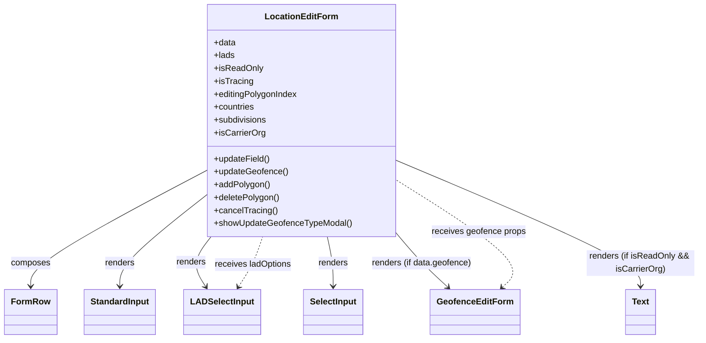

# Diagram: web/portal/src/pages/administration/location-management/location-neworedit/components/LocationNewOrEditForm.js


> Auto-generated by Obscura crawlers

## Diagram 1



### SVG

<svg id="container" width="1285.9140625" xmlns="http://www.w3.org/2000/svg" class="classDiagram" height="630" viewBox="0 0 1285.9140625 630" role="graphics-document document" aria-roledescription="class"><style>#container{font-family:"trebuchet ms",verdana,arial,sans-serif;font-size:16px;fill:#333;}@keyframes edge-animation-frame{from{stroke-dashoffset:0;}}@keyframes dash{to{stroke-dashoffset:0;}}#container .edge-animation-slow{stroke-dasharray:9,5!important;stroke-dashoffset:900;animation:dash 50s linear infinite;stroke-linecap:round;}#container .edge-animation-fast{stroke-dasharray:9,5!important;stroke-dashoffset:900;animation:dash 20s linear infinite;stroke-linecap:round;}#container .error-icon{fill:#552222;}#container .error-text{fill:#552222;stroke:#552222;}#container .edge-thickness-normal{stroke-width:1px;}#container .edge-thickness-thick{stroke-width:3.5px;}#container .edge-pattern-solid{stroke-dasharray:0;}#container .edge-thickness-invisible{stroke-width:0;fill:none;}#container .edge-pattern-dashed{stroke-dasharray:3;}#container .edge-pattern-dotted{stroke-dasharray:2;}#container .marker{fill:#333333;stroke:#333333;}#container .marker.cross{stroke:#333333;}#container svg{font-family:"trebuchet ms",verdana,arial,sans-serif;font-size:16px;}#container p{margin:0;}#container g.classGroup text{fill:#9370DB;stroke:none;font-family:"trebuchet ms",verdana,arial,sans-serif;font-size:10px;}#container g.classGroup text .title{font-weight:bolder;}#container .nodeLabel,#container .edgeLabel{color:#131300;}#container .edgeLabel .label rect{fill:#ECECFF;}#container .label text{fill:#131300;}#container .labelBkg{background:#ECECFF;}#container .edgeLabel .label span{background:#ECECFF;}#container .classTitle{font-weight:bolder;}#container .node rect,#container .node circle,#container .node ellipse,#container .node polygon,#container .node path{fill:#ECECFF;stroke:#9370DB;stroke-width:1px;}#container .divider{stroke:#9370DB;stroke-width:1;}#container g.clickable{cursor:pointer;}#container g.classGroup rect{fill:#ECECFF;stroke:#9370DB;}#container g.classGroup line{stroke:#9370DB;stroke-width:1;}#container .classLabel .box{stroke:none;stroke-width:0;fill:#ECECFF;opacity:0.5;}#container .classLabel .label{fill:#9370DB;font-size:10px;}#container .relation{stroke:#333333;stroke-width:1;fill:none;}#container .dashed-line{stroke-dasharray:3;}#container .dotted-line{stroke-dasharray:1 2;}#container #compositionStart,#container .composition{fill:#333333!important;stroke:#333333!important;stroke-width:1;}#container #compositionEnd,#container .composition{fill:#333333!important;stroke:#333333!important;stroke-width:1;}#container #dependencyStart,#container .dependency{fill:#333333!important;stroke:#333333!important;stroke-width:1;}#container #dependencyStart,#container .dependency{fill:#333333!important;stroke:#333333!important;stroke-width:1;}#container #extensionStart,#container .extension{fill:transparent!important;stroke:#333333!important;stroke-width:1;}#container #extensionEnd,#container .extension{fill:transparent!important;stroke:#333333!important;stroke-width:1;}#container #aggregationStart,#container .aggregation{fill:transparent!important;stroke:#333333!important;stroke-width:1;}#container #aggregationEnd,#container .aggregation{fill:transparent!important;stroke:#333333!important;stroke-width:1;}#container #lollipopStart,#container .lollipop{fill:#ECECFF!important;stroke:#333333!important;stroke-width:1;}#container #lollipopEnd,#container .lollipop{fill:#ECECFF!important;stroke:#333333!important;stroke-width:1;}#container .edgeTerminals{font-size:11px;line-height:initial;}#container .classTitleText{text-anchor:middle;font-size:18px;fill:#333;}#container .label-icon{display:inline-block;height:1em;overflow:visible;vertical-align:-0.125em;}#container .node .label-icon path{fill:currentColor;stroke:revert;stroke-width:revert;}#container :root{--mermaid-font-family:"trebuchet ms",verdana,arial,sans-serif;}</style><g><defs><marker id="container_class-aggregationStart" class="marker aggregation class" refX="18" refY="7" markerWidth="190" markerHeight="240" orient="auto"><path d="M 18,7 L9,13 L1,7 L9,1 Z"></path></marker></defs><defs><marker id="container_class-aggregationEnd" class="marker aggregation class" refX="1" refY="7" markerWidth="20" markerHeight="28" orient="auto"><path d="M 18,7 L9,13 L1,7 L9,1 Z"></path></marker></defs><defs><marker id="container_class-extensionStart" class="marker extension class" refX="18" refY="7" markerWidth="190" markerHeight="240" orient="auto"><path d="M 1,7 L18,13 V 1 Z"></path></marker></defs><defs><marker id="container_class-extensionEnd" class="marker extension class" refX="1" refY="7" markerWidth="20" markerHeight="28" orient="auto"><path d="M 1,1 V 13 L18,7 Z"></path></marker></defs><defs><marker id="container_class-compositionStart" class="marker composition class" refX="18" refY="7" markerWidth="190" markerHeight="240" orient="auto"><path d="M 18,7 L9,13 L1,7 L9,1 Z"></path></marker></defs><defs><marker id="container_class-compositionEnd" class="marker composition class" refX="1" refY="7" markerWidth="20" markerHeight="28" orient="auto"><path d="M 18,7 L9,13 L1,7 L9,1 Z"></path></marker></defs><defs><marker id="container_class-dependencyStart" class="marker dependency class" refX="6" refY="7" markerWidth="190" markerHeight="240" orient="auto"><path d="M 5,7 L9,13 L1,7 L9,1 Z"></path></marker></defs><defs><marker id="container_class-dependencyEnd" class="marker dependency class" refX="13" refY="7" markerWidth="20" markerHeight="28" orient="auto"><path d="M 18,7 L9,13 L14,7 L9,1 Z"></path></marker></defs><defs><marker id="container_class-lollipopStart" class="marker lollipop class" refX="13" refY="7" markerWidth="190" markerHeight="240" orient="auto"><circle stroke="black" fill="transparent" cx="7" cy="7" r="6"></circle></marker></defs><defs><marker id="container_class-lollipopEnd" class="marker lollipop class" refX="1" refY="7" markerWidth="190" markerHeight="240" orient="auto"><circle stroke="black" fill="transparent" cx="7" cy="7" r="6"></circle></marker></defs><g class="root"><g class="clusters"></g><g class="edgePaths"><path d="M377.949,315.554L323.915,344.461C269.88,373.369,161.811,431.185,107.777,467.259C53.742,503.333,53.742,517.667,53.742,524.833L53.742,532" id="id_LocationEditForm_FormRow_1" class="edge-thickness-normal edge-pattern-solid relation" style=";;;" data-edge="true" data-et="edge" data-id="id_LocationEditForm_FormRow_1" data-points="W3sieCI6Mzc3Ljk0OTIxODc1LCJ5IjozMTUuNTUzNjk5NzE2ODkyNn0seyJ4Ijo1My43NDIxODc1LCJ5Ijo0ODl9LHsieCI6NTMuNzQyMTg3NSwieSI6NTM4fV0=" marker-end="url(#container_class-dependencyEnd)"></path><path d="M377.949,359.505L350.692,381.087C323.435,402.67,268.921,445.835,241.663,474.584C214.406,503.333,214.406,517.667,214.406,524.833L214.406,532" id="id_LocationEditForm_StandardInput_2" class="edge-thickness-normal edge-pattern-solid relation" style=";;;" data-edge="true" data-et="edge" data-id="id_LocationEditForm_StandardInput_2" data-points="W3sieCI6Mzc3Ljk0OTIxODc1LCJ5IjozNTkuNTA0ODYxMjgxMzI0MDV9LHsieCI6MjE0LjQwNjI1LCJ5Ijo0ODl9LHsieCI6MjE0LjQwNjI1LCJ5Ijo1Mzh9XQ==" marker-end="url(#container_class-dependencyEnd)"></path><path d="M381.65,440L375.32,448.167C368.989,456.333,356.329,472.667,354.805,488.164C353.28,503.661,362.893,518.322,367.699,525.652L372.505,532.982" id="id_LocationEditForm_LADSelectInput_3" class="edge-thickness-normal edge-pattern-solid relation" style=";;;" data-edge="true" data-et="edge" data-id="id_LocationEditForm_LADSelectInput_3" data-points="W3sieCI6MzgxLjY1MDE5MTYyNzM1ODUsInkiOjQ0MH0seyJ4IjozNDMuNjY3OTY4NzUsInkiOjQ4OX0seyJ4IjozNzUuNzk0NzcxNjM0NjE1MzYsInkiOjUzOH1d" marker-end="url(#container_class-dependencyEnd)"></path><path d="M597.714,440L599.553,448.167C601.391,456.333,605.069,472.667,606.907,488C608.746,503.333,608.746,517.667,608.746,524.833L608.746,532" id="id_LocationEditForm_SelectInput_4" class="edge-thickness-normal edge-pattern-solid relation" style=";;;" data-edge="true" data-et="edge" data-id="id_LocationEditForm_SelectInput_4" data-points="W3sieCI6NTk3LjcxMzg3MDg3MjY0MTYsInkiOjQ0MH0seyJ4Ijo2MDguNzQ2MDkzNzUsInkiOjQ4OX0seyJ4Ijo2MDguNzQ2MDkzNzUsInkiOjUzOH1d" marker-end="url(#container_class-dependencyEnd)"></path><path d="M720.215,428.861L728.588,438.884C736.961,448.907,753.707,468.954,770.325,486.471C786.943,503.988,803.433,518.976,811.678,526.47L819.922,533.964" id="id_LocationEditForm_GeofenceEditForm_5" class="edge-thickness-normal edge-pattern-solid relation" style=";;;" data-edge="true" data-et="edge" data-id="id_LocationEditForm_GeofenceEditForm_5" data-points="W3sieCI6NzIwLjIxNDg0Mzc1LCJ5Ijo0MjguODYwNTEwNjY2ODMxNH0seyJ4Ijo3NzAuNDUzMTI1LCJ5Ijo0ODl9LHsieCI6ODI0LjM2MjM3OTgwNzY5MjMsInkiOjUzOH1d" marker-end="url(#container_class-dependencyEnd)"></path><path d="M720.215,296.118L796.498,328.265C872.781,360.412,1025.348,424.706,1101.631,464.02C1177.914,503.333,1177.914,517.667,1177.914,524.833L1177.914,532" id="id_LocationEditForm_Text_6" class="edge-thickness-normal edge-pattern-solid relation" style=";;;" data-edge="true" data-et="edge" data-id="id_LocationEditForm_Text_6" data-points="W3sieCI6NzIwLjIxNDg0Mzc1LCJ5IjoyOTYuMTE4MTM4MTY1MzczNn0seyJ4IjoxMTc3LjkxNDA2MjUsInkiOjQ4OX0seyJ4IjoxMTc3LjkxNDA2MjUsInkiOjUzOH1d" marker-end="url(#container_class-dependencyEnd)"></path><path d="M434.159,532.982L438.965,525.652C443.771,518.322,453.384,503.661,460.843,488.164C468.302,472.667,473.608,456.333,476.261,448.167L478.914,440" id="id_LADSelectInput_LocationEditForm_7" class="edge-thickness-normal edge-pattern-dashed relation" style=";;;" data-edge="true" data-et="edge" data-id="id_LADSelectInput_LocationEditForm_7" data-points="W3sieCI6NDMwLjg2OTI5MDg2NTM4NDY0LCJ5Ijo1Mzh9LHsieCI6NDYyLjk5NjA5Mzc1LCJ5Ijo0ODl9LHsieCI6NDc4LjkxMzg3MDg3MjY0MTUsInkiOjQ0MH1d" marker-start="url(#container_class-dependencyStart)"></path><path d="M921.218,533.964L929.463,526.47C937.708,518.976,954.198,503.988,920.697,470.255C887.197,436.522,803.706,384.044,761.96,357.805L720.215,331.565" id="id_GeofenceEditForm_LocationEditForm_8" class="edge-thickness-normal edge-pattern-dashed relation" style=";;;" data-edge="true" data-et="edge" data-id="id_GeofenceEditForm_LocationEditForm_8" data-points="W3sieCI6OTE2Ljc3ODI0NTE5MjMwNzcsInkiOjUzOH0seyJ4Ijo5NzAuNjg3NSwieSI6NDg5fSx7IngiOjcyMC4yMTQ4NDM3NSwieSI6MzMxLjU2NTQ4MTY1MDMxMzY0fV0=" marker-start="url(#container_class-dependencyStart)"></path></g><g class="edgeLabels"><g class="edgeLabel" transform="translate(53.7421875, 489)"><g class="label" data-id="id_LocationEditForm_FormRow_1" transform="translate(-36.453125, -12)"><foreignObject width="72.90625" height="24"><div xmlns="http://www.w3.org/1999/xhtml" class="labelBkg" style="display: table-cell; white-space: nowrap; line-height: 1.5; max-width: 200px; text-align: center;"><span class="edgeLabel"><p>composes</p></span></div></foreignObject></g></g><g class="edgeLabel" transform="translate(214.40625, 489)"><g class="label" data-id="id_LocationEditForm_StandardInput_2" transform="translate(-27.75, -12)"><foreignObject width="55.5" height="24"><div xmlns="http://www.w3.org/1999/xhtml" class="labelBkg" style="display: table-cell; white-space: nowrap; line-height: 1.5; max-width: 200px; text-align: center;"><span class="edgeLabel"><p>renders</p></span></div></foreignObject></g></g><g class="edgeLabel" transform="translate(344.71076, 487.65471)"><g class="label" data-id="id_LocationEditForm_LADSelectInput_3" transform="translate(-27.75, -12)"><foreignObject width="55.5" height="24"><div xmlns="http://www.w3.org/1999/xhtml" class="labelBkg" style="display: table-cell; white-space: nowrap; line-height: 1.5; max-width: 200px; text-align: center;"><span class="edgeLabel"><p>renders</p></span></div></foreignObject></g></g><g class="edgeLabel" transform="translate(608.74609375, 489)"><g class="label" data-id="id_LocationEditForm_SelectInput_4" transform="translate(-27.75, -12)"><foreignObject width="55.5" height="24"><div xmlns="http://www.w3.org/1999/xhtml" class="labelBkg" style="display: table-cell; white-space: nowrap; line-height: 1.5; max-width: 200px; text-align: center;"><span class="edgeLabel"><p>renders</p></span></div></foreignObject></g></g><g class="edgeLabel" transform="translate(770.453125, 489)"><g class="label" data-id="id_LocationEditForm_GeofenceEditForm_5" transform="translate(-93.0078125, -12)"><foreignObject width="186.015625" height="24"><div xmlns="http://www.w3.org/1999/xhtml" class="labelBkg" style="display: table-cell; white-space: nowrap; line-height: 1.5; max-width: 200px; text-align: center;"><span class="edgeLabel"><p>renders (if data.geofence)</p></span></div></foreignObject></g></g><g class="edgeLabel" transform="translate(1177.9140625, 489)"><g class="label" data-id="id_LocationEditForm_Text_6" transform="translate(-100, -24)"><foreignObject width="200" height="48"><div xmlns="http://www.w3.org/1999/xhtml" class="labelBkg" style="display: table; white-space: break-spaces; line-height: 1.5; max-width: 200px; text-align: center; width: 200px;"><span class="edgeLabel"><p>renders (if isReadOnly &amp;&amp; isCarrierOrg)</p></span></div></foreignObject></g></g><g class="edgeLabel" transform="translate(461.05721, 491.9572)"><g class="label" data-id="id_LADSelectInput_LocationEditForm_7" transform="translate(-71.578125, -12)"><foreignObject width="143.15625" height="24"><div xmlns="http://www.w3.org/1999/xhtml" class="labelBkg" style="display: table-cell; white-space: nowrap; line-height: 1.5; max-width: 200px; text-align: center;"><span class="edgeLabel"><p>receives ladOptions</p></span></div></foreignObject></g></g><g class="edgeLabel" transform="translate(876.29046, 429.66677)"><g class="label" data-id="id_GeofenceEditForm_LocationEditForm_8" transform="translate(-87.2265625, -12)"><foreignObject width="174.453125" height="24"><div xmlns="http://www.w3.org/1999/xhtml" class="labelBkg" style="display: table-cell; white-space: nowrap; line-height: 1.5; max-width: 200px; text-align: center;"><span class="edgeLabel"><p>receives geofence props</p></span></div></foreignObject></g></g></g><g class="nodes"><g class="node default" id="classId-LocationEditForm-0" transform="translate(549.08203125, 224)"><g class="basic label-container"><path d="M-171.1328125 -216 L171.1328125 -216 L171.1328125 216 L-171.1328125 216" stroke="none" stroke-width="0" fill="#ECECFF" style=""></path><path d="M-171.1328125 -216 C-49.618548653076516 -216, 71.89571519384697 -216, 171.1328125 -216 M-171.1328125 -216 C-102.12178263647857 -216, -33.11075277295714 -216, 171.1328125 -216 M171.1328125 -216 C171.1328125 -43.99535972666712, 171.1328125 128.00928054666576, 171.1328125 216 M171.1328125 -216 C171.1328125 -92.3513018226465, 171.1328125 31.29739635470699, 171.1328125 216 M171.1328125 216 C67.26755140694686 216, -36.59770968610627 216, -171.1328125 216 M171.1328125 216 C52.10938961157221 216, -66.91403327685558 216, -171.1328125 216 M-171.1328125 216 C-171.1328125 83.21243607350223, -171.1328125 -49.575127852995536, -171.1328125 -216 M-171.1328125 216 C-171.1328125 100.03179049917685, -171.1328125 -15.9364190016463, -171.1328125 -216" stroke="#9370DB" stroke-width="1.3" fill="none" stroke-dasharray="0 0" style=""></path></g><g class="annotation-group text" transform="translate(0, -192)"></g><g class="label-group text" transform="translate(-63.796875, -192)"><g class="label" style="font-weight: bolder" transform="translate(0,-12)"><foreignObject width="127.59375" height="24"><div xmlns="http://www.w3.org/1999/xhtml" style="display: table-cell; white-space: nowrap; line-height: 1.5; max-width: 177px; text-align: center;"><span class="nodeLabel markdown-node-label" style=""><p>LocationEditForm</p></span></div></foreignObject></g></g><g class="members-group text" transform="translate(-159.1328125, -144)"><g class="label" style="" transform="translate(0,-12)"><foreignObject width="40.625" height="24"><div xmlns="http://www.w3.org/1999/xhtml" style="display: table-cell; white-space: nowrap; line-height: 1.5; max-width: 98px; text-align: center;"><span class="nodeLabel markdown-node-label" style=""><p>+data</p></span></div></foreignObject></g><g class="label" style="" transform="translate(0,12)"><foreignObject width="38.34375" height="24"><div xmlns="http://www.w3.org/1999/xhtml" style="display: table-cell; white-space: nowrap; line-height: 1.5; max-width: 96px; text-align: center;"><span class="nodeLabel markdown-node-label" style=""><p>+lads</p></span></div></foreignObject></g><g class="label" style="" transform="translate(0,36)"><foreignObject width="89.09375" height="24"><div xmlns="http://www.w3.org/1999/xhtml" style="display: table-cell; white-space: nowrap; line-height: 1.5; max-width: 147px; text-align: center;"><span class="nodeLabel markdown-node-label" style=""><p>+isReadOnly</p></span></div></foreignObject></g><g class="label" style="" transform="translate(0,60)"><foreignObject width="71.9375" height="24"><div xmlns="http://www.w3.org/1999/xhtml" style="display: table-cell; white-space: nowrap; line-height: 1.5; max-width: 130px; text-align: center;"><span class="nodeLabel markdown-node-label" style=""><p>+isTracing</p></span></div></foreignObject></g><g class="label" style="" transform="translate(0,84)"><foreignObject width="156.09375" height="24"><div xmlns="http://www.w3.org/1999/xhtml" style="display: table-cell; white-space: nowrap; line-height: 1.5; max-width: 214px; text-align: center;"><span class="nodeLabel markdown-node-label" style=""><p>+editingPolygonIndex</p></span></div></foreignObject></g><g class="label" style="" transform="translate(0,108)"><foreignObject width="76.015625" height="24"><div xmlns="http://www.w3.org/1999/xhtml" style="display: table-cell; white-space: nowrap; line-height: 1.5; max-width: 133px; text-align: center;"><span class="nodeLabel markdown-node-label" style=""><p>+countries</p></span></div></foreignObject></g><g class="label" style="" transform="translate(0,132)"><foreignObject width="98.921875" height="24"><div xmlns="http://www.w3.org/1999/xhtml" style="display: table-cell; white-space: nowrap; line-height: 1.5; max-width: 156px; text-align: center;"><span class="nodeLabel markdown-node-label" style=""><p>+subdivisions</p></span></div></foreignObject></g><g class="label" style="" transform="translate(0,156)"><foreignObject width="94.5625" height="24"><div xmlns="http://www.w3.org/1999/xhtml" style="display: table-cell; white-space: nowrap; line-height: 1.5; max-width: 153px; text-align: center;"><span class="nodeLabel markdown-node-label" style=""><p>+isCarrierOrg</p></span></div></foreignObject></g></g><g class="methods-group text" transform="translate(-159.1328125, 72)"><g class="label" style="" transform="translate(0,-12)"><foreignObject width="104.40625" height="24"><div xmlns="http://www.w3.org/1999/xhtml" style="display: table-cell; white-space: nowrap; line-height: 1.5; max-width: 162px; text-align: center;"><span class="nodeLabel markdown-node-label" style=""><p>+updateField()</p></span></div></foreignObject></g><g class="label" style="" transform="translate(0,12)"><foreignObject width="137.203125" height="24"><div xmlns="http://www.w3.org/1999/xhtml" style="display: table-cell; white-space: nowrap; line-height: 1.5; max-width: 195px; text-align: center;"><span class="nodeLabel markdown-node-label" style=""><p>+updateGeofence()</p></span></div></foreignObject></g><g class="label" style="" transform="translate(0,36)"><foreignObject width="103.265625" height="24"><div xmlns="http://www.w3.org/1999/xhtml" style="display: table-cell; white-space: nowrap; line-height: 1.5; max-width: 161px; text-align: center;"><span class="nodeLabel markdown-node-label" style=""><p>+addPolygon()</p></span></div></foreignObject></g><g class="label" style="" transform="translate(0,60)"><foreignObject width="121.546875" height="24"><div xmlns="http://www.w3.org/1999/xhtml" style="display: table-cell; white-space: nowrap; line-height: 1.5; max-width: 179px; text-align: center;"><span class="nodeLabel markdown-node-label" style=""><p>+deletePolygon()</p></span></div></foreignObject></g><g class="label" style="" transform="translate(0,84)"><foreignObject width="116.625" height="24"><div xmlns="http://www.w3.org/1999/xhtml" style="display: table-cell; white-space: nowrap; line-height: 1.5; max-width: 174px; text-align: center;"><span class="nodeLabel markdown-node-label" style=""><p>+cancelTracing()</p></span></div></foreignObject></g><g class="label" style="" transform="translate(0,108)"><foreignObject width="254.46875" height="24"><div xmlns="http://www.w3.org/1999/xhtml" style="display: table-cell; white-space: nowrap; line-height: 1.5; max-width: 312px; text-align: center;"><span class="nodeLabel markdown-node-label" style=""><p>+showUpdateGeofenceTypeModal()</p></span></div></foreignObject></g></g><g class="divider" style=""><path d="M-171.1328125 -168 C-43.16327992374718 -168, 84.80625265250563 -168, 171.1328125 -168 M-171.1328125 -168 C-47.473932773352246 -168, 76.18494695329551 -168, 171.1328125 -168" stroke="#9370DB" stroke-width="1.3" fill="none" stroke-dasharray="0 0" style=""></path></g><g class="divider" style=""><path d="M-171.1328125 48 C-63.85759803000195 48, 43.417616439996095 48, 171.1328125 48 M-171.1328125 48 C-47.72604581344157 48, 75.68072087311685 48, 171.1328125 48" stroke="#9370DB" stroke-width="1.3" fill="none" stroke-dasharray="0 0" style=""></path></g></g><g class="node default" id="classId-FormRow-1" transform="translate(53.7421875, 580)"><g class="basic label-container"><path d="M-45.7421875 -42 L45.7421875 -42 L45.7421875 42 L-45.7421875 42" stroke="none" stroke-width="0" fill="#ECECFF" style=""></path><path d="M-45.7421875 -42 C-21.96691646400317 -42, 1.808354571993661 -42, 45.7421875 -42 M-45.7421875 -42 C-24.829864243934686 -42, -3.9175409878693728 -42, 45.7421875 -42 M45.7421875 -42 C45.7421875 -9.10608927411117, 45.7421875 23.78782145177766, 45.7421875 42 M45.7421875 -42 C45.7421875 -9.9815081212341, 45.7421875 22.0369837575318, 45.7421875 42 M45.7421875 42 C11.883993317954506 42, -21.97420086409099 42, -45.7421875 42 M45.7421875 42 C9.5001038733703 42, -26.7419797532594 42, -45.7421875 42 M-45.7421875 42 C-45.7421875 15.817774035073423, -45.7421875 -10.364451929853153, -45.7421875 -42 M-45.7421875 42 C-45.7421875 17.42793215080771, -45.7421875 -7.144135698384581, -45.7421875 -42" stroke="#9370DB" stroke-width="1.3" fill="none" stroke-dasharray="0 0" style=""></path></g><g class="annotation-group text" transform="translate(0, -18)"></g><g class="label-group text" transform="translate(-33.7421875, -18)"><g class="label" style="font-weight: bolder" transform="translate(0,-12)"><foreignObject width="67.484375" height="24"><div xmlns="http://www.w3.org/1999/xhtml" style="display: table-cell; white-space: nowrap; line-height: 1.5; max-width: 117px; text-align: center;"><span class="nodeLabel markdown-node-label" style=""><p>FormRow</p></span></div></foreignObject></g></g><g class="members-group text" transform="translate(-33.7421875, 30)"></g><g class="methods-group text" transform="translate(-33.7421875, 60)"></g><g class="divider" style=""><path d="M-45.7421875 6 C-11.11795565021486 6, 23.50627619957028 6, 45.7421875 6 M-45.7421875 6 C-13.237186628018186 6, 19.267814243963628 6, 45.7421875 6" stroke="#9370DB" stroke-width="1.3" fill="none" stroke-dasharray="0 0" style=""></path></g><g class="divider" style=""><path d="M-45.7421875 24 C-26.8079864486111 24, -7.8737853972222 24, 45.7421875 24 M-45.7421875 24 C-25.05700773724827 24, -4.37182797449654 24, 45.7421875 24" stroke="#9370DB" stroke-width="1.3" fill="none" stroke-dasharray="0 0" style=""></path></g></g><g class="node default" id="classId-StandardInput-2" transform="translate(214.40625, 580)"><g class="basic label-container"><path d="M-64.921875 -42 L64.921875 -42 L64.921875 42 L-64.921875 42" stroke="none" stroke-width="0" fill="#ECECFF" style=""></path><path d="M-64.921875 -42 C-24.41813325294386 -42, 16.08560849411228 -42, 64.921875 -42 M-64.921875 -42 C-36.65351034259419 -42, -8.385145685188377 -42, 64.921875 -42 M64.921875 -42 C64.921875 -25.193591825671536, 64.921875 -8.387183651343072, 64.921875 42 M64.921875 -42 C64.921875 -20.336200780645047, 64.921875 1.3275984387099058, 64.921875 42 M64.921875 42 C34.43198123915816 42, 3.9420874783163313 42, -64.921875 42 M64.921875 42 C20.327171164318962 42, -24.267532671362076 42, -64.921875 42 M-64.921875 42 C-64.921875 20.677933771196386, -64.921875 -0.6441324576072276, -64.921875 -42 M-64.921875 42 C-64.921875 19.326194452252373, -64.921875 -3.347611095495253, -64.921875 -42" stroke="#9370DB" stroke-width="1.3" fill="none" stroke-dasharray="0 0" style=""></path></g><g class="annotation-group text" transform="translate(0, -18)"></g><g class="label-group text" transform="translate(-52.921875, -18)"><g class="label" style="font-weight: bolder" transform="translate(0,-12)"><foreignObject width="105.84375" height="24"><div xmlns="http://www.w3.org/1999/xhtml" style="display: table-cell; white-space: nowrap; line-height: 1.5; max-width: 155px; text-align: center;"><span class="nodeLabel markdown-node-label" style=""><p>StandardInput</p></span></div></foreignObject></g></g><g class="members-group text" transform="translate(-52.921875, 30)"></g><g class="methods-group text" transform="translate(-52.921875, 60)"></g><g class="divider" style=""><path d="M-64.921875 6 C-18.434252642901214 6, 28.053369714197572 6, 64.921875 6 M-64.921875 6 C-20.321986404526776 6, 24.27790219094645 6, 64.921875 6" stroke="#9370DB" stroke-width="1.3" fill="none" stroke-dasharray="0 0" style=""></path></g><g class="divider" style=""><path d="M-64.921875 24 C-23.57402216857657 24, 17.773830662846862 24, 64.921875 24 M-64.921875 24 C-26.951931854878744 24, 11.018011290242512 24, 64.921875 24" stroke="#9370DB" stroke-width="1.3" fill="none" stroke-dasharray="0 0" style=""></path></g></g><g class="node default" id="classId-LADSelectInput-3" transform="translate(403.33203125, 580)"><g class="basic label-container"><path d="M-68.1015625 -42 L68.1015625 -42 L68.1015625 42 L-68.1015625 42" stroke="none" stroke-width="0" fill="#ECECFF" style=""></path><path d="M-68.1015625 -42 C-23.353767401062434 -42, 21.39402769787513 -42, 68.1015625 -42 M-68.1015625 -42 C-29.60036432666083 -42, 8.900833846678339 -42, 68.1015625 -42 M68.1015625 -42 C68.1015625 -13.05643507454296, 68.1015625 15.887129850914079, 68.1015625 42 M68.1015625 -42 C68.1015625 -9.80812182877304, 68.1015625 22.38375634245392, 68.1015625 42 M68.1015625 42 C13.883191107679721 42, -40.33518028464056 42, -68.1015625 42 M68.1015625 42 C34.26951984932909 42, 0.43747719865818624 42, -68.1015625 42 M-68.1015625 42 C-68.1015625 15.740273074695661, -68.1015625 -10.519453850608677, -68.1015625 -42 M-68.1015625 42 C-68.1015625 19.952083154611728, -68.1015625 -2.0958336907765442, -68.1015625 -42" stroke="#9370DB" stroke-width="1.3" fill="none" stroke-dasharray="0 0" style=""></path></g><g class="annotation-group text" transform="translate(0, -18)"></g><g class="label-group text" transform="translate(-56.1015625, -18)"><g class="label" style="font-weight: bolder" transform="translate(0,-12)"><foreignObject width="112.203125" height="24"><div xmlns="http://www.w3.org/1999/xhtml" style="display: table-cell; white-space: nowrap; line-height: 1.5; max-width: 161px; text-align: center;"><span class="nodeLabel markdown-node-label" style=""><p>LADSelectInput</p></span></div></foreignObject></g></g><g class="members-group text" transform="translate(-56.1015625, 30)"></g><g class="methods-group text" transform="translate(-56.1015625, 60)"></g><g class="divider" style=""><path d="M-68.1015625 6 C-28.357503036678438 6, 11.386556426643125 6, 68.1015625 6 M-68.1015625 6 C-36.472696688574956 6, -4.843830877149912 6, 68.1015625 6" stroke="#9370DB" stroke-width="1.3" fill="none" stroke-dasharray="0 0" style=""></path></g><g class="divider" style=""><path d="M-68.1015625 24 C-15.653370888171821 24, 36.79482072365636 24, 68.1015625 24 M-68.1015625 24 C-22.800631232971085 24, 22.50030003405783 24, 68.1015625 24" stroke="#9370DB" stroke-width="1.3" fill="none" stroke-dasharray="0 0" style=""></path></g></g><g class="node default" id="classId-SelectInput-4" transform="translate(608.74609375, 580)"><g class="basic label-container"><path d="M-54.0703125 -42 L54.0703125 -42 L54.0703125 42 L-54.0703125 42" stroke="none" stroke-width="0" fill="#ECECFF" style=""></path><path d="M-54.0703125 -42 C-20.801312518459973 -42, 12.467687463080054 -42, 54.0703125 -42 M-54.0703125 -42 C-22.857867849984565 -42, 8.35457680003087 -42, 54.0703125 -42 M54.0703125 -42 C54.0703125 -22.906329030514673, 54.0703125 -3.812658061029346, 54.0703125 42 M54.0703125 -42 C54.0703125 -12.530598737837753, 54.0703125 16.938802524324494, 54.0703125 42 M54.0703125 42 C21.14893120506344 42, -11.772450089873118 42, -54.0703125 42 M54.0703125 42 C19.84307826013469 42, -14.384155979730622 42, -54.0703125 42 M-54.0703125 42 C-54.0703125 19.091128464014627, -54.0703125 -3.817743071970746, -54.0703125 -42 M-54.0703125 42 C-54.0703125 16.573502097358666, -54.0703125 -8.852995805282667, -54.0703125 -42" stroke="#9370DB" stroke-width="1.3" fill="none" stroke-dasharray="0 0" style=""></path></g><g class="annotation-group text" transform="translate(0, -18)"></g><g class="label-group text" transform="translate(-42.0703125, -18)"><g class="label" style="font-weight: bolder" transform="translate(0,-12)"><foreignObject width="84.140625" height="24"><div xmlns="http://www.w3.org/1999/xhtml" style="display: table-cell; white-space: nowrap; line-height: 1.5; max-width: 133px; text-align: center;"><span class="nodeLabel markdown-node-label" style=""><p>SelectInput</p></span></div></foreignObject></g></g><g class="members-group text" transform="translate(-42.0703125, 30)"></g><g class="methods-group text" transform="translate(-42.0703125, 60)"></g><g class="divider" style=""><path d="M-54.0703125 6 C-19.901839276339757 6, 14.266633947320486 6, 54.0703125 6 M-54.0703125 6 C-21.495191024713165 6, 11.07993045057367 6, 54.0703125 6" stroke="#9370DB" stroke-width="1.3" fill="none" stroke-dasharray="0 0" style=""></path></g><g class="divider" style=""><path d="M-54.0703125 24 C-25.474433502300155 24, 3.1214454953996906 24, 54.0703125 24 M-54.0703125 24 C-12.723728241327748 24, 28.622856017344503 24, 54.0703125 24" stroke="#9370DB" stroke-width="1.3" fill="none" stroke-dasharray="0 0" style=""></path></g></g><g class="node default" id="classId-GeofenceEditForm-5" transform="translate(870.5703125, 580)"><g class="basic label-container"><path d="M-78.5859375 -42 L78.5859375 -42 L78.5859375 42 L-78.5859375 42" stroke="none" stroke-width="0" fill="#ECECFF" style=""></path><path d="M-78.5859375 -42 C-39.88641368980582 -42, -1.1868898796116412 -42, 78.5859375 -42 M-78.5859375 -42 C-23.49725592851859 -42, 31.591425642962818 -42, 78.5859375 -42 M78.5859375 -42 C78.5859375 -16.380904652900846, 78.5859375 9.238190694198309, 78.5859375 42 M78.5859375 -42 C78.5859375 -16.906069101107114, 78.5859375 8.187861797785772, 78.5859375 42 M78.5859375 42 C26.688376636587556 42, -25.20918422682489 42, -78.5859375 42 M78.5859375 42 C43.52864488665019 42, 8.471352273300383 42, -78.5859375 42 M-78.5859375 42 C-78.5859375 12.4272759341155, -78.5859375 -17.145448131769, -78.5859375 -42 M-78.5859375 42 C-78.5859375 12.543432770243115, -78.5859375 -16.91313445951377, -78.5859375 -42" stroke="#9370DB" stroke-width="1.3" fill="none" stroke-dasharray="0 0" style=""></path></g><g class="annotation-group text" transform="translate(0, -18)"></g><g class="label-group text" transform="translate(-66.5859375, -18)"><g class="label" style="font-weight: bolder" transform="translate(0,-12)"><foreignObject width="133.171875" height="24"><div xmlns="http://www.w3.org/1999/xhtml" style="display: table-cell; white-space: nowrap; line-height: 1.5; max-width: 182px; text-align: center;"><span class="nodeLabel markdown-node-label" style=""><p>GeofenceEditForm</p></span></div></foreignObject></g></g><g class="members-group text" transform="translate(-66.5859375, 30)"></g><g class="methods-group text" transform="translate(-66.5859375, 60)"></g><g class="divider" style=""><path d="M-78.5859375 6 C-36.734504717704475 6, 5.11692806459105 6, 78.5859375 6 M-78.5859375 6 C-28.257307867782295 6, 22.07132176443541 6, 78.5859375 6" stroke="#9370DB" stroke-width="1.3" fill="none" stroke-dasharray="0 0" style=""></path></g><g class="divider" style=""><path d="M-78.5859375 24 C-27.30237714345062 24, 23.98118321309876 24, 78.5859375 24 M-78.5859375 24 C-26.022220007806588 24, 26.541497484386824 24, 78.5859375 24" stroke="#9370DB" stroke-width="1.3" fill="none" stroke-dasharray="0 0" style=""></path></g></g><g class="node default" id="classId-Text-6" transform="translate(1177.9140625, 580)"><g class="basic label-container"><path d="M-27.3828125 -42 L27.3828125 -42 L27.3828125 42 L-27.3828125 42" stroke="none" stroke-width="0" fill="#ECECFF" style=""></path><path d="M-27.3828125 -42 C-15.006826126145404 -42, -2.6308397522908074 -42, 27.3828125 -42 M-27.3828125 -42 C-6.988672987164797 -42, 13.405466525670406 -42, 27.3828125 -42 M27.3828125 -42 C27.3828125 -12.8640367213773, 27.3828125 16.2719265572454, 27.3828125 42 M27.3828125 -42 C27.3828125 -9.264997619501145, 27.3828125 23.47000476099771, 27.3828125 42 M27.3828125 42 C8.358605462700705 42, -10.66560157459859 42, -27.3828125 42 M27.3828125 42 C8.237518691461833 42, -10.907775117076334 42, -27.3828125 42 M-27.3828125 42 C-27.3828125 12.192080661524507, -27.3828125 -17.615838676950986, -27.3828125 -42 M-27.3828125 42 C-27.3828125 9.991621822975723, -27.3828125 -22.016756354048553, -27.3828125 -42" stroke="#9370DB" stroke-width="1.3" fill="none" stroke-dasharray="0 0" style=""></path></g><g class="annotation-group text" transform="translate(0, -18)"></g><g class="label-group text" transform="translate(-15.3828125, -18)"><g class="label" style="font-weight: bolder" transform="translate(0,-12)"><foreignObject width="30.765625" height="24"><div xmlns="http://www.w3.org/1999/xhtml" style="display: table-cell; white-space: nowrap; line-height: 1.5; max-width: 80px; text-align: center;"><span class="nodeLabel markdown-node-label" style=""><p>Text</p></span></div></foreignObject></g></g><g class="members-group text" transform="translate(-15.3828125, 30)"></g><g class="methods-group text" transform="translate(-15.3828125, 60)"></g><g class="divider" style=""><path d="M-27.3828125 6 C-15.63357501949445 6, -3.8843375389888983 6, 27.3828125 6 M-27.3828125 6 C-12.176109435297251 6, 3.030593629405498 6, 27.3828125 6" stroke="#9370DB" stroke-width="1.3" fill="none" stroke-dasharray="0 0" style=""></path></g><g class="divider" style=""><path d="M-27.3828125 24 C-7.036224228556822 24, 13.310364042886356 24, 27.3828125 24 M-27.3828125 24 C-16.18994251228267 24, -4.99707252456534 24, 27.3828125 24" stroke="#9370DB" stroke-width="1.3" fill="none" stroke-dasharray="0 0" style=""></path></g></g></g></g></g></svg>

## Diagram 2

```mermaid
flowchart LR
  subgraph Inputs
    A[data] --> B[customer_id]
    C[lads]
    D[countries]
    E[subdivisions]
    F[isCarrierOrg]
    G[isReadOnly]
  end
  subgraph Transforms
    T1[getTranslatedLadLobLabel()]
    T2[useGetShipperNameById()]
    T3[map countryOptions]
    T4[map subdivisionOptions]
    T5[build ladOptions]
  end
  subgraph UI
    U1[LocationEditForm Container]
    U2[FormRow groups]
    U3[StandardInput fields]
    U4[LADSelectInput field]
    U5[SelectInput state/country]
    U6[GeofenceEditForm]
    U7[Text (shipper name)]
  end
  B --> T2 --> U7
  C --> T1 --> T5 --> U4
  D --> T3 --> U5
  E --> T4 --> U5
  A --> U3
  A --> U6
  F --> T5
  G --> U7
  T5 --> U4
  U1 --> U2 --> U3
  U2 --> U4
  U2 --> U5
  U2 --> U6
```

> SVG rendering failed for this diagram.
