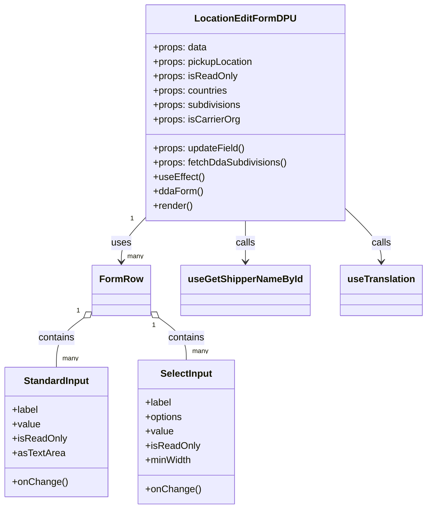

# Diagram: web/portal/src/pages/administration/location-management/location-neworedit/components/LocationNewOrEditFormDPU.js


> Auto-generated by Obscura crawlers

## Diagram 1



### SVG

<svg id="container" width="689.716796875" xmlns="http://www.w3.org/2000/svg" class="classDiagram" height="848" viewBox="0 0 689.716796875 848" role="graphics-document document" aria-roledescription="class"><style>#container{font-family:"trebuchet ms",verdana,arial,sans-serif;font-size:16px;fill:#333;}@keyframes edge-animation-frame{from{stroke-dashoffset:0;}}@keyframes dash{to{stroke-dashoffset:0;}}#container .edge-animation-slow{stroke-dasharray:9,5!important;stroke-dashoffset:900;animation:dash 50s linear infinite;stroke-linecap:round;}#container .edge-animation-fast{stroke-dasharray:9,5!important;stroke-dashoffset:900;animation:dash 20s linear infinite;stroke-linecap:round;}#container .error-icon{fill:#552222;}#container .error-text{fill:#552222;stroke:#552222;}#container .edge-thickness-normal{stroke-width:1px;}#container .edge-thickness-thick{stroke-width:3.5px;}#container .edge-pattern-solid{stroke-dasharray:0;}#container .edge-thickness-invisible{stroke-width:0;fill:none;}#container .edge-pattern-dashed{stroke-dasharray:3;}#container .edge-pattern-dotted{stroke-dasharray:2;}#container .marker{fill:#333333;stroke:#333333;}#container .marker.cross{stroke:#333333;}#container svg{font-family:"trebuchet ms",verdana,arial,sans-serif;font-size:16px;}#container p{margin:0;}#container g.classGroup text{fill:#9370DB;stroke:none;font-family:"trebuchet ms",verdana,arial,sans-serif;font-size:10px;}#container g.classGroup text .title{font-weight:bolder;}#container .nodeLabel,#container .edgeLabel{color:#131300;}#container .edgeLabel .label rect{fill:#ECECFF;}#container .label text{fill:#131300;}#container .labelBkg{background:#ECECFF;}#container .edgeLabel .label span{background:#ECECFF;}#container .classTitle{font-weight:bolder;}#container .node rect,#container .node circle,#container .node ellipse,#container .node polygon,#container .node path{fill:#ECECFF;stroke:#9370DB;stroke-width:1px;}#container .divider{stroke:#9370DB;stroke-width:1;}#container g.clickable{cursor:pointer;}#container g.classGroup rect{fill:#ECECFF;stroke:#9370DB;}#container g.classGroup line{stroke:#9370DB;stroke-width:1;}#container .classLabel .box{stroke:none;stroke-width:0;fill:#ECECFF;opacity:0.5;}#container .classLabel .label{fill:#9370DB;font-size:10px;}#container .relation{stroke:#333333;stroke-width:1;fill:none;}#container .dashed-line{stroke-dasharray:3;}#container .dotted-line{stroke-dasharray:1 2;}#container #compositionStart,#container .composition{fill:#333333!important;stroke:#333333!important;stroke-width:1;}#container #compositionEnd,#container .composition{fill:#333333!important;stroke:#333333!important;stroke-width:1;}#container #dependencyStart,#container .dependency{fill:#333333!important;stroke:#333333!important;stroke-width:1;}#container #dependencyStart,#container .dependency{fill:#333333!important;stroke:#333333!important;stroke-width:1;}#container #extensionStart,#container .extension{fill:transparent!important;stroke:#333333!important;stroke-width:1;}#container #extensionEnd,#container .extension{fill:transparent!important;stroke:#333333!important;stroke-width:1;}#container #aggregationStart,#container .aggregation{fill:transparent!important;stroke:#333333!important;stroke-width:1;}#container #aggregationEnd,#container .aggregation{fill:transparent!important;stroke:#333333!important;stroke-width:1;}#container #lollipopStart,#container .lollipop{fill:#ECECFF!important;stroke:#333333!important;stroke-width:1;}#container #lollipopEnd,#container .lollipop{fill:#ECECFF!important;stroke:#333333!important;stroke-width:1;}#container .edgeTerminals{font-size:11px;line-height:initial;}#container .classTitleText{text-anchor:middle;font-size:18px;fill:#333;}#container .label-icon{display:inline-block;height:1em;overflow:visible;vertical-align:-0.125em;}#container .node .label-icon path{fill:currentColor;stroke:revert;stroke-width:revert;}#container :root{--mermaid-font-family:"trebuchet ms",verdana,arial,sans-serif;}</style><g><defs><marker id="container_class-aggregationStart" class="marker aggregation class" refX="18" refY="7" markerWidth="190" markerHeight="240" orient="auto"><path d="M 18,7 L9,13 L1,7 L9,1 Z"></path></marker></defs><defs><marker id="container_class-aggregationEnd" class="marker aggregation class" refX="1" refY="7" markerWidth="20" markerHeight="28" orient="auto"><path d="M 18,7 L9,13 L1,7 L9,1 Z"></path></marker></defs><defs><marker id="container_class-extensionStart" class="marker extension class" refX="18" refY="7" markerWidth="190" markerHeight="240" orient="auto"><path d="M 1,7 L18,13 V 1 Z"></path></marker></defs><defs><marker id="container_class-extensionEnd" class="marker extension class" refX="1" refY="7" markerWidth="20" markerHeight="28" orient="auto"><path d="M 1,1 V 13 L18,7 Z"></path></marker></defs><defs><marker id="container_class-compositionStart" class="marker composition class" refX="18" refY="7" markerWidth="190" markerHeight="240" orient="auto"><path d="M 18,7 L9,13 L1,7 L9,1 Z"></path></marker></defs><defs><marker id="container_class-compositionEnd" class="marker composition class" refX="1" refY="7" markerWidth="20" markerHeight="28" orient="auto"><path d="M 18,7 L9,13 L1,7 L9,1 Z"></path></marker></defs><defs><marker id="container_class-dependencyStart" class="marker dependency class" refX="6" refY="7" markerWidth="190" markerHeight="240" orient="auto"><path d="M 5,7 L9,13 L1,7 L9,1 Z"></path></marker></defs><defs><marker id="container_class-dependencyEnd" class="marker dependency class" refX="13" refY="7" markerWidth="20" markerHeight="28" orient="auto"><path d="M 18,7 L9,13 L14,7 L9,1 Z"></path></marker></defs><defs><marker id="container_class-lollipopStart" class="marker lollipop class" refX="13" refY="7" markerWidth="190" markerHeight="240" orient="auto"><circle stroke="black" fill="transparent" cx="7" cy="7" r="6"></circle></marker></defs><defs><marker id="container_class-lollipopEnd" class="marker lollipop class" refX="1" refY="7" markerWidth="190" markerHeight="240" orient="auto"><circle stroke="black" fill="transparent" cx="7" cy="7" r="6"></circle></marker></defs><g class="root"><g class="clusters"></g><g class="edgePaths"><path d="M232.209,366.966L226.396,373.305C220.584,379.644,208.959,392.322,203.146,403.828C197.334,415.333,197.334,425.667,197.334,430.833L197.334,436" id="id_LocationEditFormDPU_FormRow_1" class="edge-thickness-normal edge-pattern-solid relation" style=";;;" data-edge="true" data-et="edge" data-id="id_LocationEditFormDPU_FormRow_1" data-points="W3sieCI6MjMyLjIwODk4NDM3NSwieSI6MzY2Ljk2NTk5Nzg3OTc3NTR9LHsieCI6MTk3LjMzMzk4NDM3NSwieSI6NDA1fSx7IngiOjE5Ny4zMzM5ODQzNzUsInkiOjQ0Mn1d" marker-end="url(#container_class-dependencyEnd)"></path><path d="M137.769,528.472L130.062,534.227C122.354,539.981,106.939,551.491,99.231,565.412C91.523,579.333,91.523,595.667,91.523,603.833L91.523,612" id="id_FormRow_StandardInput_2" class="edge-thickness-normal edge-pattern-solid relation" style=";;;" data-edge="true" data-et="edge" data-id="id_FormRow_StandardInput_2" data-points="W3sieCI6MTUxLjU5MTc5Njg3NSwieSI6NTE4LjE1MTkxNTA4OTk4NjF9LHsieCI6OTEuNTIzNDM3NSwieSI6NTYzfSx7IngiOjkxLjUyMzQzNzUsInkiOjYxMn1d" marker-start="url(#container_class-aggregationStart)"></path><path d="M256.899,528.472L264.606,534.227C272.314,539.981,287.729,551.491,295.437,563.412C303.145,575.333,303.145,587.667,303.145,593.833L303.145,600" id="id_FormRow_SelectInput_3" class="edge-thickness-normal edge-pattern-solid relation" style=";;;" data-edge="true" data-et="edge" data-id="id_FormRow_SelectInput_3" data-points="W3sieCI6MjQzLjA3NjE3MTg3NSwieSI6NTE4LjE1MTkxNTA4OTk4NjF9LHsieCI6MzAzLjE0NDUzMTI1LCJ5Ijo1NjN9LHsieCI6MzAzLjE0NDUzMTI1LCJ5Ijo2MDB9XQ==" marker-start="url(#container_class-aggregationStart)"></path><path d="M396.311,368L396.311,374.167C396.311,380.333,396.311,392.667,396.311,404C396.311,415.333,396.311,425.667,396.311,430.833L396.311,436" id="id_LocationEditFormDPU_useGetShipperNameById_4" class="edge-thickness-normal edge-pattern-solid relation" style=";;;" data-edge="true" data-et="edge" data-id="id_LocationEditFormDPU_useGetShipperNameById_4" data-points="W3sieCI6Mzk2LjMxMDU0Njg3NSwieSI6MzY4fSx7IngiOjM5Ni4zMTA1NDY4NzUsInkiOjQwNX0seyJ4IjozOTYuMzEwNTQ2ODc1LCJ5Ijo0NDJ9XQ==" marker-end="url(#container_class-dependencyEnd)"></path><path d="M560.412,350.365L569.615,359.471C578.818,368.577,597.225,386.788,606.428,401.061C615.631,415.333,615.631,425.667,615.631,430.833L615.631,436" id="id_LocationEditFormDPU_useTranslation_5" class="edge-thickness-normal edge-pattern-solid relation" style=";;;" data-edge="true" data-et="edge" data-id="id_LocationEditFormDPU_useTranslation_5" data-points="W3sieCI6NTYwLjQxMjEwOTM3NSwieSI6MzUwLjM2NTQ0MDEwMjU4OTd9LHsieCI6NjE1LjYzMDg1OTM3NSwieSI6NDA1fSx7IngiOjYxNS42MzA4NTkzNzUsInkiOjQ0Mn1d" marker-end="url(#container_class-dependencyEnd)"></path></g><g class="edgeLabels"><g class="edgeLabel" transform="translate(197.333984375, 405)"><g class="label" data-id="id_LocationEditFormDPU_FormRow_1" transform="translate(-16.4921875, -12)"><foreignObject width="32.984375" height="24"><div xmlns="http://www.w3.org/1999/xhtml" class="labelBkg" style="display: table-cell; white-space: nowrap; line-height: 1.5; max-width: 200px; text-align: center;"><span class="edgeLabel"><p>uses</p></span></div></foreignObject></g></g><g class="edgeLabel" transform="translate(91.5234375, 563)"><g class="label" data-id="id_FormRow_StandardInput_2" transform="translate(-30.890625, -12)"><foreignObject width="61.78125" height="24"><div xmlns="http://www.w3.org/1999/xhtml" class="labelBkg" style="display: table-cell; white-space: nowrap; line-height: 1.5; max-width: 200px; text-align: center;"><span class="edgeLabel"><p>contains</p></span></div></foreignObject></g></g><g class="edgeLabel" transform="translate(303.14453125, 563)"><g class="label" data-id="id_FormRow_SelectInput_3" transform="translate(-30.890625, -12)"><foreignObject width="61.78125" height="24"><div xmlns="http://www.w3.org/1999/xhtml" class="labelBkg" style="display: table-cell; white-space: nowrap; line-height: 1.5; max-width: 200px; text-align: center;"><span class="edgeLabel"><p>contains</p></span></div></foreignObject></g></g><g class="edgeLabel" transform="translate(396.310546875, 405)"><g class="label" data-id="id_LocationEditFormDPU_useGetShipperNameById_4" transform="translate(-16.4453125, -12)"><foreignObject width="32.890625" height="24"><div xmlns="http://www.w3.org/1999/xhtml" class="labelBkg" style="display: table-cell; white-space: nowrap; line-height: 1.5; max-width: 200px; text-align: center;"><span class="edgeLabel"><p>calls</p></span></div></foreignObject></g></g><g class="edgeLabel" transform="translate(615.630859375, 405)"><g class="label" data-id="id_LocationEditFormDPU_useTranslation_5" transform="translate(-16.4453125, -12)"><foreignObject width="32.890625" height="24"><div xmlns="http://www.w3.org/1999/xhtml" class="labelBkg" style="display: table-cell; white-space: nowrap; line-height: 1.5; max-width: 200px; text-align: center;"><span class="edgeLabel"><p>calls</p></span></div></foreignObject></g></g><g class="edgeTerminals" transform="translate(209.32607515081594, 369.72689650754046)"><g class="inner" transform="translate(0, 0)"><foreignObject style="width: 9px; height: 12px;"><div xmlns="http://www.w3.org/1999/xhtml" style="display: inline-block; padding-right: 1px; white-space: nowrap;"><span class="edgeLabel">1</span></div></foreignObject></g></g><g class="edgeTerminals" transform="translate(128.59510477959546, 516.6020456172486)"><g class="inner" transform="translate(0, 0)"><foreignObject style="width: 9px; height: 12px;"><div xmlns="http://www.w3.org/1999/xhtml" style="display: inline-block; padding-right: 1px; white-space: nowrap;"><span class="edgeLabel">1</span></div></foreignObject></g></g><g class="edgeTerminals" transform="translate(248.12494753641067, 540.6410196644802)"><g class="inner" transform="translate(0, 0)"><foreignObject style="width: 9px; height: 12px;"><div xmlns="http://www.w3.org/1999/xhtml" style="display: inline-block; padding-right: 1px; white-space: nowrap;"><span class="edgeLabel">1</span></div></foreignObject></g></g><g class="edgeTerminals" transform="translate(207.33398218749988, 419.499998125)"><g class="inner" transform="translate(0, 0)"></g><foreignObject style="width: 36px; height: 12px;"><div xmlns="http://www.w3.org/1999/xhtml" style="display: inline-block; padding-right: 1px; white-space: nowrap;"><span class="edgeLabel">many</span></div></foreignObject></g><g class="edgeTerminals" transform="translate(101.52343874999995, 589.5000010714285)"><g class="inner" transform="translate(0, 0)"></g><foreignObject style="width: 36px; height: 12px;"><div xmlns="http://www.w3.org/1999/xhtml" style="display: inline-block; padding-right: 1px; white-space: nowrap;"><span class="edgeLabel">many</span></div></foreignObject></g><g class="edgeTerminals" transform="translate(313.144530625, 577.4999994642857)"><g class="inner" transform="translate(0, 0)"></g><foreignObject style="width: 36px; height: 12px;"><div xmlns="http://www.w3.org/1999/xhtml" style="display: inline-block; padding-right: 1px; white-space: nowrap;"><span class="edgeLabel">many</span></div></foreignObject></g></g><g class="nodes"><g class="node default" id="classId-LocationEditFormDPU-0" transform="translate(396.310546875, 188)"><g class="basic label-container"><path d="M-164.1015625 -180 L164.1015625 -180 L164.1015625 180 L-164.1015625 180" stroke="none" stroke-width="0" fill="#ECECFF" style=""></path><path d="M-164.1015625 -180 C-87.12823483288007 -180, -10.154907165760136 -180, 164.1015625 -180 M-164.1015625 -180 C-38.01096284671536 -180, 88.07963680656928 -180, 164.1015625 -180 M164.1015625 -180 C164.1015625 -49.55586142156005, 164.1015625 80.8882771568799, 164.1015625 180 M164.1015625 -180 C164.1015625 -51.9483722315143, 164.1015625 76.1032555369714, 164.1015625 180 M164.1015625 180 C38.94680610905104 180, -86.20795028189792 180, -164.1015625 180 M164.1015625 180 C67.8730453098886 180, -28.355471880222808 180, -164.1015625 180 M-164.1015625 180 C-164.1015625 64.72701398648235, -164.1015625 -50.545972027035305, -164.1015625 -180 M-164.1015625 180 C-164.1015625 43.47147467549712, -164.1015625 -93.05705064900576, -164.1015625 -180" stroke="#9370DB" stroke-width="1.3" fill="none" stroke-dasharray="0 0" style=""></path></g><g class="annotation-group text" transform="translate(0, -156)"></g><g class="label-group text" transform="translate(-79.015625, -156)"><g class="label" style="font-weight: bolder" transform="translate(0,-12)"><foreignObject width="158.03125" height="24"><div xmlns="http://www.w3.org/1999/xhtml" style="display: table-cell; white-space: nowrap; line-height: 1.5; max-width: 207px; text-align: center;"><span class="nodeLabel markdown-node-label" style=""><p>LocationEditFormDPU</p></span></div></foreignObject></g></g><g class="members-group text" transform="translate(-152.1015625, -108)"><g class="label" style="" transform="translate(0,-12)"><foreignObject width="90.234375" height="24"><div xmlns="http://www.w3.org/1999/xhtml" style="display: table-cell; white-space: nowrap; line-height: 1.5; max-width: 148px; text-align: center;"><span class="nodeLabel markdown-node-label" style=""><p>+props: data</p></span></div></foreignObject></g><g class="label" style="" transform="translate(0,12)"><foreignObject width="168.265625" height="24"><div xmlns="http://www.w3.org/1999/xhtml" style="display: table-cell; white-space: nowrap; line-height: 1.5; max-width: 226px; text-align: center;"><span class="nodeLabel markdown-node-label" style=""><p>+props: pickupLocation</p></span></div></foreignObject></g><g class="label" style="" transform="translate(0,36)"><foreignObject width="138.703125" height="24"><div xmlns="http://www.w3.org/1999/xhtml" style="display: table-cell; white-space: nowrap; line-height: 1.5; max-width: 196px; text-align: center;"><span class="nodeLabel markdown-node-label" style=""><p>+props: isReadOnly</p></span></div></foreignObject></g><g class="label" style="" transform="translate(0,60)"><foreignObject width="125.609375" height="24"><div xmlns="http://www.w3.org/1999/xhtml" style="display: table-cell; white-space: nowrap; line-height: 1.5; max-width: 183px; text-align: center;"><span class="nodeLabel markdown-node-label" style=""><p>+props: countries</p></span></div></foreignObject></g><g class="label" style="" transform="translate(0,84)"><foreignObject width="148.515625" height="24"><div xmlns="http://www.w3.org/1999/xhtml" style="display: table-cell; white-space: nowrap; line-height: 1.5; max-width: 206px; text-align: center;"><span class="nodeLabel markdown-node-label" style=""><p>+props: subdivisions</p></span></div></foreignObject></g><g class="label" style="" transform="translate(0,108)"><foreignObject width="144.171875" height="24"><div xmlns="http://www.w3.org/1999/xhtml" style="display: table-cell; white-space: nowrap; line-height: 1.5; max-width: 202px; text-align: center;"><span class="nodeLabel markdown-node-label" style=""><p>+props: isCarrierOrg</p></span></div></foreignObject></g></g><g class="methods-group text" transform="translate(-152.1015625, 60)"><g class="label" style="" transform="translate(0,-12)"><foreignObject width="154.015625" height="24"><div xmlns="http://www.w3.org/1999/xhtml" style="display: table-cell; white-space: nowrap; line-height: 1.5; max-width: 211px; text-align: center;"><span class="nodeLabel markdown-node-label" style=""><p>+props: updateField()</p></span></div></foreignObject></g><g class="label" style="" transform="translate(0,12)"><foreignObject width="225.1875" height="24"><div xmlns="http://www.w3.org/1999/xhtml" style="display: table-cell; white-space: nowrap; line-height: 1.5; max-width: 283px; text-align: center;"><span class="nodeLabel markdown-node-label" style=""><p>+props: fetchDdaSubdivisions()</p></span></div></foreignObject></g><g class="label" style="" transform="translate(0,36)"><foreignObject width="84.8125" height="24"><div xmlns="http://www.w3.org/1999/xhtml" style="display: table-cell; white-space: nowrap; line-height: 1.5; max-width: 142px; text-align: center;"><span class="nodeLabel markdown-node-label" style=""><p>+useEffect()</p></span></div></foreignObject></g><g class="label" style="" transform="translate(0,60)"><foreignObject width="82.734375" height="24"><div xmlns="http://www.w3.org/1999/xhtml" style="display: table-cell; white-space: nowrap; line-height: 1.5; max-width: 140px; text-align: center;"><span class="nodeLabel markdown-node-label" style=""><p>+ddaForm()</p></span></div></foreignObject></g><g class="label" style="" transform="translate(0,84)"><foreignObject width="66.609375" height="24"><div xmlns="http://www.w3.org/1999/xhtml" style="display: table-cell; white-space: nowrap; line-height: 1.5; max-width: 124px; text-align: center;"><span class="nodeLabel markdown-node-label" style=""><p>+render()</p></span></div></foreignObject></g></g><g class="divider" style=""><path d="M-164.1015625 -132 C-51.32172740839552 -132, 61.458107683208965 -132, 164.1015625 -132 M-164.1015625 -132 C-55.96011789713553 -132, 52.181326705728935 -132, 164.1015625 -132" stroke="#9370DB" stroke-width="1.3" fill="none" stroke-dasharray="0 0" style=""></path></g><g class="divider" style=""><path d="M-164.1015625 36 C-74.7673749030038 36, 14.566812693992404 36, 164.1015625 36 M-164.1015625 36 C-58.918294765518795 36, 46.26497296896241 36, 164.1015625 36" stroke="#9370DB" stroke-width="1.3" fill="none" stroke-dasharray="0 0" style=""></path></g></g><g class="node default" id="classId-FormRow-1" transform="translate(197.333984375, 484)"><g class="basic label-container"><path d="M-45.7421875 -42 L45.7421875 -42 L45.7421875 42 L-45.7421875 42" stroke="none" stroke-width="0" fill="#ECECFF" style=""></path><path d="M-45.7421875 -42 C-13.12384066458118 -42, 19.49450617083764 -42, 45.7421875 -42 M-45.7421875 -42 C-9.17170391784608 -42, 27.39877966430784 -42, 45.7421875 -42 M45.7421875 -42 C45.7421875 -20.569321843890084, 45.7421875 0.8613563122198329, 45.7421875 42 M45.7421875 -42 C45.7421875 -19.713584406667323, 45.7421875 2.572831186665354, 45.7421875 42 M45.7421875 42 C22.62230179998443 42, -0.49758390003113817 42, -45.7421875 42 M45.7421875 42 C26.529115742149802 42, 7.316043984299604 42, -45.7421875 42 M-45.7421875 42 C-45.7421875 17.606271903854157, -45.7421875 -6.787456192291685, -45.7421875 -42 M-45.7421875 42 C-45.7421875 23.1897020636733, -45.7421875 4.3794041273465965, -45.7421875 -42" stroke="#9370DB" stroke-width="1.3" fill="none" stroke-dasharray="0 0" style=""></path></g><g class="annotation-group text" transform="translate(0, -18)"></g><g class="label-group text" transform="translate(-33.7421875, -18)"><g class="label" style="font-weight: bolder" transform="translate(0,-12)"><foreignObject width="67.484375" height="24"><div xmlns="http://www.w3.org/1999/xhtml" style="display: table-cell; white-space: nowrap; line-height: 1.5; max-width: 117px; text-align: center;"><span class="nodeLabel markdown-node-label" style=""><p>FormRow</p></span></div></foreignObject></g></g><g class="members-group text" transform="translate(-33.7421875, 30)"></g><g class="methods-group text" transform="translate(-33.7421875, 60)"></g><g class="divider" style=""><path d="M-45.7421875 6 C-14.982047752536435 6, 15.77809199492713 6, 45.7421875 6 M-45.7421875 6 C-14.461889700216318 6, 16.818408099567364 6, 45.7421875 6" stroke="#9370DB" stroke-width="1.3" fill="none" stroke-dasharray="0 0" style=""></path></g><g class="divider" style=""><path d="M-45.7421875 24 C-17.473854038158454 24, 10.794479423683093 24, 45.7421875 24 M-45.7421875 24 C-24.16893685030392 24, -2.5956862006078367 24, 45.7421875 24" stroke="#9370DB" stroke-width="1.3" fill="none" stroke-dasharray="0 0" style=""></path></g></g><g class="node default" id="classId-StandardInput-2" transform="translate(91.5234375, 720)"><g class="basic label-container"><path d="M-83.5234375 -108 L83.5234375 -108 L83.5234375 108 L-83.5234375 108" stroke="none" stroke-width="0" fill="#ECECFF" style=""></path><path d="M-83.5234375 -108 C-28.836772172425775 -108, 25.84989315514845 -108, 83.5234375 -108 M-83.5234375 -108 C-39.44206967437109 -108, 4.639298151257819 -108, 83.5234375 -108 M83.5234375 -108 C83.5234375 -53.72077198716303, 83.5234375 0.5584560256739337, 83.5234375 108 M83.5234375 -108 C83.5234375 -54.40838597835908, 83.5234375 -0.8167719567181564, 83.5234375 108 M83.5234375 108 C39.2184423981148 108, -5.086552703770394 108, -83.5234375 108 M83.5234375 108 C28.453602323196364 108, -26.616232853607272 108, -83.5234375 108 M-83.5234375 108 C-83.5234375 47.71306763705784, -83.5234375 -12.57386472588432, -83.5234375 -108 M-83.5234375 108 C-83.5234375 47.49927916323475, -83.5234375 -13.001441673530493, -83.5234375 -108" stroke="#9370DB" stroke-width="1.3" fill="none" stroke-dasharray="0 0" style=""></path></g><g class="annotation-group text" transform="translate(0, -84)"></g><g class="label-group text" transform="translate(-52.921875, -84)"><g class="label" style="font-weight: bolder" transform="translate(0,-12)"><foreignObject width="105.84375" height="24"><div xmlns="http://www.w3.org/1999/xhtml" style="display: table-cell; white-space: nowrap; line-height: 1.5; max-width: 155px; text-align: center;"><span class="nodeLabel markdown-node-label" style=""><p>StandardInput</p></span></div></foreignObject></g></g><g class="members-group text" transform="translate(-71.5234375, -36)"><g class="label" style="" transform="translate(0,-12)"><foreignObject width="44.21875" height="24"><div xmlns="http://www.w3.org/1999/xhtml" style="display: table-cell; white-space: nowrap; line-height: 1.5; max-width: 102px; text-align: center;"><span class="nodeLabel markdown-node-label" style=""><p>+label</p></span></div></foreignObject></g><g class="label" style="" transform="translate(0,12)"><foreignObject width="46.71875" height="24"><div xmlns="http://www.w3.org/1999/xhtml" style="display: table-cell; white-space: nowrap; line-height: 1.5; max-width: 104px; text-align: center;"><span class="nodeLabel markdown-node-label" style=""><p>+value</p></span></div></foreignObject></g><g class="label" style="" transform="translate(0,36)"><foreignObject width="89.09375" height="24"><div xmlns="http://www.w3.org/1999/xhtml" style="display: table-cell; white-space: nowrap; line-height: 1.5; max-width: 147px; text-align: center;"><span class="nodeLabel markdown-node-label" style=""><p>+isReadOnly</p></span></div></foreignObject></g><g class="label" style="" transform="translate(0,60)"><foreignObject width="85.40625" height="24"><div xmlns="http://www.w3.org/1999/xhtml" style="display: table-cell; white-space: nowrap; line-height: 1.5; max-width: 143px; text-align: center;"><span class="nodeLabel markdown-node-label" style=""><p>+asTextArea</p></span></div></foreignObject></g></g><g class="methods-group text" transform="translate(-71.5234375, 84)"><g class="label" style="" transform="translate(0,-12)"><foreignObject width="90.125" height="24"><div xmlns="http://www.w3.org/1999/xhtml" style="display: table-cell; white-space: nowrap; line-height: 1.5; max-width: 147px; text-align: center;"><span class="nodeLabel markdown-node-label" style=""><p>+onChange()</p></span></div></foreignObject></g></g><g class="divider" style=""><path d="M-83.5234375 -60 C-49.51468311801114 -60, -15.505928736022284 -60, 83.5234375 -60 M-83.5234375 -60 C-21.79250445097172 -60, 39.93842859805656 -60, 83.5234375 -60" stroke="#9370DB" stroke-width="1.3" fill="none" stroke-dasharray="0 0" style=""></path></g><g class="divider" style=""><path d="M-83.5234375 60 C-24.81828215186487 60, 33.88687319627026 60, 83.5234375 60 M-83.5234375 60 C-45.733295043481434 60, -7.943152586962867 60, 83.5234375 60" stroke="#9370DB" stroke-width="1.3" fill="none" stroke-dasharray="0 0" style=""></path></g></g><g class="node default" id="classId-SelectInput-3" transform="translate(303.14453125, 720)"><g class="basic label-container"><path d="M-78.09765625 -120 L78.09765625 -120 L78.09765625 120 L-78.09765625 120" stroke="none" stroke-width="0" fill="#ECECFF" style=""></path><path d="M-78.09765625 -120 C-15.797575773889236 -120, 46.50250470222153 -120, 78.09765625 -120 M-78.09765625 -120 C-34.14726903076899 -120, 9.803118188462022 -120, 78.09765625 -120 M78.09765625 -120 C78.09765625 -47.86453059865359, 78.09765625 24.270938802692825, 78.09765625 120 M78.09765625 -120 C78.09765625 -24.749232342908613, 78.09765625 70.50153531418277, 78.09765625 120 M78.09765625 120 C44.67280487744094 120, 11.247953504881878 120, -78.09765625 120 M78.09765625 120 C41.08845627440639 120, 4.07925629881278 120, -78.09765625 120 M-78.09765625 120 C-78.09765625 47.21908004927006, -78.09765625 -25.561839901459877, -78.09765625 -120 M-78.09765625 120 C-78.09765625 54.92922362662861, -78.09765625 -10.141552746742775, -78.09765625 -120" stroke="#9370DB" stroke-width="1.3" fill="none" stroke-dasharray="0 0" style=""></path></g><g class="annotation-group text" transform="translate(0, -96)"></g><g class="label-group text" transform="translate(-42.0703125, -96)"><g class="label" style="font-weight: bolder" transform="translate(0,-12)"><foreignObject width="84.140625" height="24"><div xmlns="http://www.w3.org/1999/xhtml" style="display: table-cell; white-space: nowrap; line-height: 1.5; max-width: 133px; text-align: center;"><span class="nodeLabel markdown-node-label" style=""><p>SelectInput</p></span></div></foreignObject></g></g><g class="members-group text" transform="translate(-66.09765625, -48)"><g class="label" style="" transform="translate(0,-12)"><foreignObject width="44.21875" height="24"><div xmlns="http://www.w3.org/1999/xhtml" style="display: table-cell; white-space: nowrap; line-height: 1.5; max-width: 102px; text-align: center;"><span class="nodeLabel markdown-node-label" style=""><p>+label</p></span></div></foreignObject></g><g class="label" style="" transform="translate(0,12)"><foreignObject width="63.3125" height="24"><div xmlns="http://www.w3.org/1999/xhtml" style="display: table-cell; white-space: nowrap; line-height: 1.5; max-width: 121px; text-align: center;"><span class="nodeLabel markdown-node-label" style=""><p>+options</p></span></div></foreignObject></g><g class="label" style="" transform="translate(0,36)"><foreignObject width="46.71875" height="24"><div xmlns="http://www.w3.org/1999/xhtml" style="display: table-cell; white-space: nowrap; line-height: 1.5; max-width: 104px; text-align: center;"><span class="nodeLabel markdown-node-label" style=""><p>+value</p></span></div></foreignObject></g><g class="label" style="" transform="translate(0,60)"><foreignObject width="89.09375" height="24"><div xmlns="http://www.w3.org/1999/xhtml" style="display: table-cell; white-space: nowrap; line-height: 1.5; max-width: 147px; text-align: center;"><span class="nodeLabel markdown-node-label" style=""><p>+isReadOnly</p></span></div></foreignObject></g><g class="label" style="" transform="translate(0,84)"><foreignObject width="78.046875" height="24"><div xmlns="http://www.w3.org/1999/xhtml" style="display: table-cell; white-space: nowrap; line-height: 1.5; max-width: 135px; text-align: center;"><span class="nodeLabel markdown-node-label" style=""><p>+minWidth</p></span></div></foreignObject></g></g><g class="methods-group text" transform="translate(-66.09765625, 96)"><g class="label" style="" transform="translate(0,-12)"><foreignObject width="90.125" height="24"><div xmlns="http://www.w3.org/1999/xhtml" style="display: table-cell; white-space: nowrap; line-height: 1.5; max-width: 147px; text-align: center;"><span class="nodeLabel markdown-node-label" style=""><p>+onChange()</p></span></div></foreignObject></g></g><g class="divider" style=""><path d="M-78.09765625 -72 C-31.940381554805704 -72, 14.216893140388592 -72, 78.09765625 -72 M-78.09765625 -72 C-45.179955258976534 -72, -12.262254267953068 -72, 78.09765625 -72" stroke="#9370DB" stroke-width="1.3" fill="none" stroke-dasharray="0 0" style=""></path></g><g class="divider" style=""><path d="M-78.09765625 72 C-29.601335530643794 72, 18.89498518871241 72, 78.09765625 72 M-78.09765625 72 C-24.82456917729595 72, 28.448517895408102 72, 78.09765625 72" stroke="#9370DB" stroke-width="1.3" fill="none" stroke-dasharray="0 0" style=""></path></g></g><g class="node default" id="classId-useGetShipperNameById-4" transform="translate(396.310546875, 484)"><g class="basic label-container"><path d="M-103.234375 -42 L103.234375 -42 L103.234375 42 L-103.234375 42" stroke="none" stroke-width="0" fill="#ECECFF" style=""></path><path d="M-103.234375 -42 C-61.32110303836022 -42, -19.40783107672044 -42, 103.234375 -42 M-103.234375 -42 C-50.80730534198406 -42, 1.6197643160318762 -42, 103.234375 -42 M103.234375 -42 C103.234375 -23.01298494334374, 103.234375 -4.025969886687477, 103.234375 42 M103.234375 -42 C103.234375 -19.296800022545895, 103.234375 3.40639995490821, 103.234375 42 M103.234375 42 C55.36661873134356 42, 7.498862462687114 42, -103.234375 42 M103.234375 42 C38.201584521850705 42, -26.83120595629859 42, -103.234375 42 M-103.234375 42 C-103.234375 18.9952695292043, -103.234375 -4.009460941591399, -103.234375 -42 M-103.234375 42 C-103.234375 22.78864942633591, -103.234375 3.5772988526718166, -103.234375 -42" stroke="#9370DB" stroke-width="1.3" fill="none" stroke-dasharray="0 0" style=""></path></g><g class="annotation-group text" transform="translate(0, -18)"></g><g class="label-group text" transform="translate(-91.234375, -18)"><g class="label" style="font-weight: bolder" transform="translate(0,-12)"><foreignObject width="182.46875" height="24"><div xmlns="http://www.w3.org/1999/xhtml" style="display: table-cell; white-space: nowrap; line-height: 1.5; max-width: 231px; text-align: center;"><span class="nodeLabel markdown-node-label" style=""><p>useGetShipperNameById</p></span></div></foreignObject></g></g><g class="members-group text" transform="translate(-91.234375, 30)"></g><g class="methods-group text" transform="translate(-91.234375, 60)"></g><g class="divider" style=""><path d="M-103.234375 6 C-42.203889876992235 6, 18.82659524601553 6, 103.234375 6 M-103.234375 6 C-29.0056931991478 6, 45.2229886017044 6, 103.234375 6" stroke="#9370DB" stroke-width="1.3" fill="none" stroke-dasharray="0 0" style=""></path></g><g class="divider" style=""><path d="M-103.234375 24 C-37.66225268585397 24, 27.909869628292057 24, 103.234375 24 M-103.234375 24 C-39.64470375223338 24, 23.944967495533234 24, 103.234375 24" stroke="#9370DB" stroke-width="1.3" fill="none" stroke-dasharray="0 0" style=""></path></g></g><g class="node default" id="classId-useTranslation-5" transform="translate(615.630859375, 484)"><g class="basic label-container"><path d="M-66.0859375 -42 L66.0859375 -42 L66.0859375 42 L-66.0859375 42" stroke="none" stroke-width="0" fill="#ECECFF" style=""></path><path d="M-66.0859375 -42 C-25.44689222398852 -42, 15.19215305202296 -42, 66.0859375 -42 M-66.0859375 -42 C-19.808968914279625 -42, 26.46799967144075 -42, 66.0859375 -42 M66.0859375 -42 C66.0859375 -9.908966526778357, 66.0859375 22.182066946443285, 66.0859375 42 M66.0859375 -42 C66.0859375 -20.310369994480805, 66.0859375 1.3792600110383901, 66.0859375 42 M66.0859375 42 C26.642918101168704 42, -12.800101297662593 42, -66.0859375 42 M66.0859375 42 C33.6963141556295 42, 1.3066908112590028 42, -66.0859375 42 M-66.0859375 42 C-66.0859375 12.933706437966869, -66.0859375 -16.132587124066262, -66.0859375 -42 M-66.0859375 42 C-66.0859375 24.274215065891376, -66.0859375 6.548430131782752, -66.0859375 -42" stroke="#9370DB" stroke-width="1.3" fill="none" stroke-dasharray="0 0" style=""></path></g><g class="annotation-group text" transform="translate(0, -18)"></g><g class="label-group text" transform="translate(-54.0859375, -18)"><g class="label" style="font-weight: bolder" transform="translate(0,-12)"><foreignObject width="108.171875" height="24"><div xmlns="http://www.w3.org/1999/xhtml" style="display: table-cell; white-space: nowrap; line-height: 1.5; max-width: 157px; text-align: center;"><span class="nodeLabel markdown-node-label" style=""><p>useTranslation</p></span></div></foreignObject></g></g><g class="members-group text" transform="translate(-54.0859375, 30)"></g><g class="methods-group text" transform="translate(-54.0859375, 60)"></g><g class="divider" style=""><path d="M-66.0859375 6 C-38.13108076256867 6, -10.176224025137344 6, 66.0859375 6 M-66.0859375 6 C-24.09709834702489 6, 17.89174080595022 6, 66.0859375 6" stroke="#9370DB" stroke-width="1.3" fill="none" stroke-dasharray="0 0" style=""></path></g><g class="divider" style=""><path d="M-66.0859375 24 C-34.0827881470172 24, -2.0796387940343948 24, 66.0859375 24 M-66.0859375 24 C-22.570372628141847 24, 20.945192243716306 24, 66.0859375 24" stroke="#9370DB" stroke-width="1.3" fill="none" stroke-dasharray="0 0" style=""></path></g></g></g></g></g></svg>

## Diagram 2

```mermaid
flowchart TD
    A[Component Mount] --> B{pickupLocation.country set?}
    B -- yes --> C[fetchDdaSubdivisions(country)]
    B -- no --> D[no fetch]
    C --> E[populate subdivisionOptions]
    E --> F[SelectInput (State/Subdivision)]
    G[Countries prop] --> H[map to countryOptions]
    H --> I[SelectInput (Country)]
    I -->|onChange| J[fetchDdaSubdivisions(newCountry)]
    I -->|onChange| K[updateField("country", newCountry)]
    L[Form Inputs] --> M[StandardInput: address, city, postalCode, specialInstructions]
    M --> N[onChange -> updateField(field, value)]
    O[isCarrierOrg & isReadOnly] --> P[Display shipperName via useGetShipperNameById]
    A --> L
    A --> G
    P --> Q[data.customer_id -> useGetShipperNameById]
```

> SVG rendering failed for this diagram.
