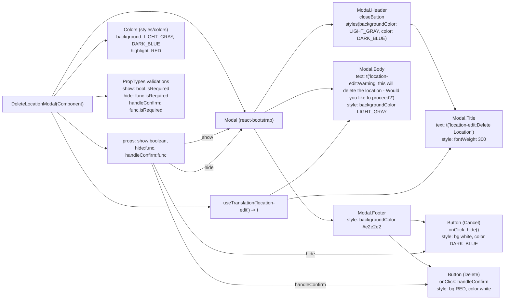

# Diagram: web/portal/src/pages/administration/location-management/location-neworedit/modals/DeleteLocationModal.js

> Auto-generated by Obscura crawlers

## Mermaid

### SVG

<svg id="container" width="1954.546875" xmlns="http://www.w3.org/2000/svg" class="flowchart" height="921" viewBox="0 -17 1954.546875 921" role="graphics-document document" aria-roledescription="flowchart-v2"><g><marker id="container_flowchart-v2-pointEnd" class="marker flowchart-v2" viewBox="0 0 10 10" refX="5" refY="5" markerUnits="userSpaceOnUse" markerWidth="8" markerHeight="8" orient="auto"><path d="M 0 0 L 10 5 L 0 10 z" class="arrowMarkerPath" style="stroke-width: 1; stroke-dasharray: 1, 0;"></path></marker><marker id="container_flowchart-v2-pointStart" class="marker flowchart-v2" viewBox="0 0 10 10" refX="4.5" refY="5" markerUnits="userSpaceOnUse" markerWidth="8" markerHeight="8" orient="auto"><path d="M 0 5 L 10 10 L 10 0 z" class="arrowMarkerPath" style="stroke-width: 1; stroke-dasharray: 1, 0;"></path></marker><marker id="container_flowchart-v2-circleEnd" class="marker flowchart-v2" viewBox="0 0 10 10" refX="11" refY="5" markerUnits="userSpaceOnUse" markerWidth="11" markerHeight="11" orient="auto"><circle cx="5" cy="5" r="5" class="arrowMarkerPath" style="stroke-width: 1; stroke-dasharray: 1, 0;"></circle></marker><marker id="container_flowchart-v2-circleStart" class="marker flowchart-v2" viewBox="0 0 10 10" refX="-1" refY="5" markerUnits="userSpaceOnUse" markerWidth="11" markerHeight="11" orient="auto"><circle cx="5" cy="5" r="5" class="arrowMarkerPath" style="stroke-width: 1; stroke-dasharray: 1, 0;"></circle></marker><marker id="container_flowchart-v2-crossEnd" class="marker cross flowchart-v2" viewBox="0 0 11 11" refX="12" refY="5.2" markerUnits="userSpaceOnUse" markerWidth="11" markerHeight="11" orient="auto"><path d="M 1,1 l 9,9 M 10,1 l -9,9" class="arrowMarkerPath" style="stroke-width: 2; stroke-dasharray: 1, 0;"></path></marker><marker id="container_flowchart-v2-crossStart" class="marker cross flowchart-v2" viewBox="0 0 11 11" refX="-1" refY="5.2" markerUnits="userSpaceOnUse" markerWidth="11" markerHeight="11" orient="auto"><path d="M 1,1 l 9,9 M 10,1 l -9,9" class="arrowMarkerPath" style="stroke-width: 2; stroke-dasharray: 1, 0;"></path></marker><g class="root"><g class="clusters"></g><g class="edgePaths"><path d="M194.132,307L218.524,327.333C242.916,347.667,291.7,388.333,323.409,408.667C355.117,429,369.75,429,377.066,429L384.383,429" id="L_DeleteLocationModal_Props_0" class="edge-thickness-normal edge-pattern-solid edge-thickness-normal edge-pattern-solid flowchart-link" style=";" data-edge="true" data-et="edge" data-id="L_DeleteLocationModal_Props_0" data-points="W3sieCI6MTk0LjEzMTcxMTQwOTM5NTk2LCJ5IjozMDd9LHsieCI6MzQwLjQ4NDM3NSwieSI6NDI5fSx7IngiOjM4OC4zODI4MTI1LCJ5Ijo0Mjl9XQ==" marker-end="url(#container_flowchart-v2-pointEnd)"></path><path d="M176.411,307L203.757,357.333C231.102,407.667,285.793,508.333,342.789,558.667C399.784,609,459.083,609,521.522,609C583.961,609,649.539,609,688.967,609C728.396,609,741.674,609,748.314,609L754.953,609" id="L_DeleteLocationModal_useTranslation_0" class="edge-thickness-normal edge-pattern-solid edge-thickness-normal edge-pattern-solid flowchart-link" style=";" data-edge="true" data-et="edge" data-id="L_DeleteLocationModal_useTranslation_0" data-points="W3sieCI6MTc2LjQxMDk5OTI0MDEyMTU4LCJ5IjozMDd9LHsieCI6MzQwLjQ4NDM3NSwieSI6NjA5fSx7IngiOjUxOC4zODI4MTI1LCJ5Ijo2MDl9LHsieCI6NzE1LjExNzE4NzUsInkiOjYwOX0seyJ4Ijo3NTguOTUzMTI1LCJ5Ijo2MDl9XQ==" marker-end="url(#container_flowchart-v2-pointEnd)"></path><path d="M178.441,253L205.448,209.333C232.456,165.667,286.47,78.333,343.127,34.667C399.784,-9,459.083,-9,521.522,-9C583.961,-9,649.539,-9,708.681,42.24C767.824,93.481,820.531,195.962,846.884,247.202L873.237,298.443" id="L_DeleteLocationModal_ModalComp_0" class="edge-thickness-normal edge-pattern-solid edge-thickness-normal edge-pattern-solid flowchart-link" style=";" data-edge="true" data-et="edge" data-id="L_DeleteLocationModal_ModalComp_0" data-points="W3sieCI6MTc4LjQ0MTI4NDYwMjA3NjEsInkiOjI1M30seyJ4IjozNDAuNDg0Mzc1LCJ5IjotOX0seyJ4Ijo1MTguMzgyODEyNSwieSI6LTl9LHsieCI6NzE1LjExNzE4NzUsInkiOi05fSx7IngiOjg3NS4wNjY4MjIzMDAyOTU4LCJ5IjozMDJ9XQ==" marker-end="url(#container_flowchart-v2-pointEnd)"></path><path d="M187.009,253L212.589,225.667C238.168,198.333,289.326,143.667,320.978,116.333C352.63,89,364.776,89,370.849,89L376.922,89" id="L_DeleteLocationModal_Colors_0" class="edge-thickness-normal edge-pattern-solid edge-thickness-normal edge-pattern-solid flowchart-link" style=";" data-edge="true" data-et="edge" data-id="L_DeleteLocationModal_Colors_0" data-points="W3sieCI6MTg3LjAwOTQwNzcyMjUxMzEsInkiOjI1M30seyJ4IjozNDAuNDg0Mzc1LCJ5Ijo4OX0seyJ4IjozODAuOTIxODc1LCJ5Ijo4OX1d" marker-end="url(#container_flowchart-v2-pointEnd)"></path><path d="M315.484,267.098L319.651,266.748C323.818,266.399,332.151,265.699,339.818,265.35C347.484,265,354.484,265,357.984,265L361.484,265" id="L_DeleteLocationModal_PropTypes_0" class="edge-thickness-normal edge-pattern-solid edge-thickness-normal edge-pattern-solid flowchart-link" style=";" data-edge="true" data-et="edge" data-id="L_DeleteLocationModal_PropTypes_0" data-points="W3sieCI6MzE1LjQ4NDM3NSwieSI6MjY3LjA5Nzk5Mzc5MzQzNX0seyJ4IjozNDAuNDg0Mzc1LCJ5IjoyNjV9LHsieCI6MzY1LjQ4NDM3NSwieSI6MjY1fV0=" marker-end="url(#container_flowchart-v2-pointEnd)"></path><path d="M908.907,302L940.316,259.5C971.724,217,1034.542,132,1078.352,89.5C1122.161,47,1146.964,47,1159.365,47L1171.766,47" id="L_ModalComp_Header_0" class="edge-thickness-normal edge-pattern-solid edge-thickness-normal edge-pattern-solid flowchart-link" style=";" data-edge="true" data-et="edge" data-id="L_ModalComp_Header_0" data-points="W3sieCI6OTA4LjkwNjkxNDg5MzYxNywieSI6MzAyfSx7IngiOjEwOTcuMzU5Mzc1LCJ5Ijo0N30seyJ4IjoxMTc1Ljc2NTYyNSwieSI6NDd9XQ==" marker-end="url(#container_flowchart-v2-pointEnd)"></path><path d="M943.059,302L968.775,289.167C994.492,276.333,1045.926,250.667,1100.776,238.777C1155.626,226.887,1213.892,228.774,1243.025,229.717L1272.158,230.661" id="L_ModalComp_Body_0" class="edge-thickness-normal edge-pattern-solid edge-thickness-normal edge-pattern-solid flowchart-link" style=";" data-edge="true" data-et="edge" data-id="L_ModalComp_Body_0" data-points="W3sieCI6OTQzLjA1ODU5Mzc1LCJ5IjozMDJ9LHsieCI6MTA5Ny4zNTkzNzUsInkiOjIyNX0seyJ4IjoxMjc2LjE1NjI1LCJ5IjoyMzAuNzkwMTEyODM3MTE5ODZ9XQ==" marker-end="url(#container_flowchart-v2-pointEnd)"></path><path d="M906.593,356L938.387,404.667C970.181,453.333,1033.77,550.667,1094.698,599.333C1155.625,648,1213.891,648,1243.023,648L1272.156,648" id="L_ModalComp_Footer_0" class="edge-thickness-normal edge-pattern-solid edge-thickness-normal edge-pattern-solid flowchart-link" style=";" data-edge="true" data-et="edge" data-id="L_ModalComp_Footer_0" data-points="W3sieCI6OTA2LjU5MjUyNTQ3MDIxOTUsInkiOjM1Nn0seyJ4IjoxMDk3LjM1OTM3NSwieSI6NjQ4fSx7IngiOjEyNzYuMTU2MjUsInkiOjY0OH1d" marker-end="url(#container_flowchart-v2-pointEnd)"></path><path d="M1636.547,47L1640.714,47C1644.88,47,1653.214,47,1677.87,89.566C1702.527,132.132,1743.506,217.264,1763.996,259.83L1784.486,302.396" id="L_Header_Title_0" class="edge-thickness-normal edge-pattern-solid edge-thickness-normal edge-pattern-solid flowchart-link" style=";" data-edge="true" data-et="edge" data-id="L_Header_Title_0" data-points="W3sieCI6MTYzNi41NDY4NzUsInkiOjQ3fSx7IngiOjE2NjEuNTQ2ODc1LCJ5Ijo0N30seyJ4IjoxNzg2LjIyMDc4ODA0MzQ3ODMsInkiOjMwNn1d" marker-end="url(#container_flowchart-v2-pointEnd)"></path><path d="M1536.156,648L1557.055,648C1577.953,648,1619.75,648,1644.175,649.024C1668.6,650.048,1675.653,652.095,1679.179,653.119L1682.705,654.143" id="L_Footer_CancelBtn_0" class="edge-thickness-normal edge-pattern-solid edge-thickness-normal edge-pattern-solid flowchart-link" style=";" data-edge="true" data-et="edge" data-id="L_Footer_CancelBtn_0" data-points="W3sieCI6MTUzNi4xNTYyNSwieSI6NjQ4fSx7IngiOjE2NjEuNTQ2ODc1LCJ5Ijo2NDh9LHsieCI6MTY4Ni41NDY4NzUsInkiOjY1NS4yNTgwNjQ1MTYxMjl9XQ==" marker-end="url(#container_flowchart-v2-pointEnd)"></path><path d="M1482.189,687L1512.082,702.333C1541.975,717.667,1601.761,748.333,1636.912,765.905C1672.063,783.478,1682.578,787.955,1687.836,790.194L1693.094,792.433" id="L_Footer_DeleteBtn_0" class="edge-thickness-normal edge-pattern-solid edge-thickness-normal edge-pattern-solid flowchart-link" style=";" data-edge="true" data-et="edge" data-id="L_Footer_DeleteBtn_0" data-points="W3sieCI6MTQ4Mi4xODg1NzM0NzMyODI1LCJ5Ijo2ODd9LHsieCI6MTY2MS41NDY4NzUsInkiOjc3OX0seyJ4IjoxNjk2Ljc3NDE0NzcyNzI3MjcsInkiOjc5NH1d" marker-end="url(#container_flowchart-v2-pointEnd)"></path><path d="M648.383,414.463L659.505,413.219C670.628,411.975,692.872,409.488,722.33,400.017C751.788,390.546,788.459,374.092,806.794,365.865L825.13,357.638" id="L_Props_ModalComp_0" class="edge-thickness-normal edge-pattern-solid edge-thickness-normal edge-pattern-solid flowchart-link" style=";" data-edge="true" data-et="edge" data-id="L_Props_ModalComp_0" data-points="W3sieCI6NjQ4LjM4MjgxMjUsInkiOjQxNC40NjI2MzIwMzg3NTc4fSx7IngiOjcxNS4xMTcxODc1LCJ5Ijo0MDd9LHsieCI6ODI4Ljc3OTE0NjYzNDYxNTQsInkiOjM1Nn1d" marker-end="url(#container_flowchart-v2-pointEnd)"></path><path d="M548.973,480L576.663,526.167C604.354,572.333,659.736,664.667,716.399,710.833C773.063,757,831.008,757,894.715,757C958.422,757,1027.891,757,1114.091,757C1200.292,757,1303.224,757,1397.255,757C1491.286,757,1576.417,757,1623.613,755.088C1670.809,753.176,1680.072,749.351,1684.703,747.439L1689.334,745.527" id="L_Props_CancelBtn_0" class="edge-thickness-normal edge-pattern-solid edge-thickness-normal edge-pattern-solid flowchart-link" style=";" data-edge="true" data-et="edge" data-id="L_Props_CancelBtn_0" data-points="W3sieCI6NTQ4Ljk3MjYwODYxMjgwNDgsInkiOjQ4MH0seyJ4Ijo3MTUuMTE3MTg3NSwieSI6NzU3fSx7IngiOjg4OC45NTMxMjUsInkiOjc1N30seyJ4IjoxMDk3LjM1OTM3NSwieSI6NzU3fSx7IngiOjE0MDYuMTU2MjUsInkiOjc1N30seyJ4IjoxNjYxLjU0Njg3NSwieSI6NzU3fSx7IngiOjE2OTMuMDMxMjUsInkiOjc0NH1d" marker-end="url(#container_flowchart-v2-pointEnd)"></path><path d="M625.122,480L640.121,487.167C655.12,494.333,685.119,508.667,724.613,488.497C764.108,468.326,813.099,413.653,837.595,386.316L862.09,358.979" id="L_Props_ModalComp_2" class="edge-thickness-normal edge-pattern-solid edge-thickness-normal edge-pattern-solid flowchart-link" style=";" data-edge="true" data-et="edge" data-id="L_Props_ModalComp_2" data-points="W3sieCI6NjI1LjEyMTY3NTUzMTkxNDksInkiOjQ4MH0seyJ4Ijo3MTUuMTE3MTg3NSwieSI6NTIzfSx7IngiOjg2NC43NTk0NjM1OTUzNjA4LCJ5IjozNTZ9XQ==" marker-end="url(#container_flowchart-v2-pointEnd)"></path><path d="M541.936,480L570.799,542.5C599.663,605,657.39,730,715.226,792.5C773.063,855,831.008,855,894.715,855C958.422,855,1027.891,855,1114.091,855C1200.292,855,1303.224,855,1397.255,855C1491.286,855,1576.417,855,1622.483,854.774C1668.55,854.548,1675.552,854.096,1679.054,853.871L1682.555,853.645" id="L_Props_DeleteBtn_0" class="edge-thickness-normal edge-pattern-solid edge-thickness-normal edge-pattern-solid flowchart-link" style=";" data-edge="true" data-et="edge" data-id="L_Props_DeleteBtn_0" data-points="W3sieCI6NTQxLjkzNTUxOTM2NjE5NzIsInkiOjQ4MH0seyJ4Ijo3MTUuMTE3MTg3NSwieSI6ODU1fSx7IngiOjg4OC45NTMxMjUsInkiOjg1NX0seyJ4IjoxMDk3LjM1OTM3NSwieSI6ODU1fSx7IngiOjE0MDYuMTU2MjUsInkiOjg1NX0seyJ4IjoxNjYxLjU0Njg3NSwieSI6ODU1fSx7IngiOjE2ODYuNTQ2ODc1LCJ5Ijo4NTMuMzg3MDk2Nzc0MTkzNX1d" marker-end="url(#container_flowchart-v2-pointEnd)"></path><path d="M1018.953,587.168L1032.021,584.973C1045.089,582.778,1071.224,578.389,1135.758,576.195C1200.292,574,1303.224,574,1397.255,574C1491.286,574,1576.417,574,1636.474,550.865C1696.531,527.73,1731.516,481.46,1749.008,458.326L1766.5,435.191" id="L_useTranslation_Title_0" class="edge-thickness-normal edge-pattern-solid edge-thickness-normal edge-pattern-solid flowchart-link" style=";" data-edge="true" data-et="edge" data-id="L_useTranslation_Title_0" data-points="W3sieCI6MTAxOC45NTMxMjUsInkiOjU4Ny4xNjc2NDEzMjU1MzZ9LHsieCI6MTA5Ny4zNTkzNzUsInkiOjU3NH0seyJ4IjoxNDA2LjE1NjI1LCJ5Ijo1NzR9LHsieCI6MTY2MS41NDY4NzUsInkiOjU3NH0seyJ4IjoxNzY4LjkxMjcyODY1ODUzNjUsInkiOjQzMn1d" marker-end="url(#container_flowchart-v2-pointEnd)"></path><path d="M961.523,570L984.163,557.833C1006.802,545.667,1052.081,521.333,1106.231,482.431C1160.381,443.529,1223.402,390.059,1254.913,363.323L1286.423,336.588" id="L_useTranslation_Body_0" class="edge-thickness-normal edge-pattern-solid edge-thickness-normal edge-pattern-solid flowchart-link" style=";" data-edge="true" data-et="edge" data-id="L_useTranslation_Body_0" data-points="W3sieCI6OTYxLjUyMzE1ODQ4MjE0MjksInkiOjU3MH0seyJ4IjoxMDk3LjM1OTM3NSwieSI6NDk3fSx7IngiOjEyODkuNDczNDYxMzU0OTYxNywieSI6MzM0fV0=" marker-end="url(#container_flowchart-v2-pointEnd)"></path></g><g class="edgeLabels"><g class="edgeLabel"><g class="label" data-id="L_DeleteLocationModal_Props_0" transform="translate(0, 0)"><foreignObject width="0" height="0">

</foreignObject></g></g><g class="edgeLabel"><g class="label" data-id="L_DeleteLocationModal_useTranslation_0" transform="translate(0, 0)"><foreignObject width="0" height="0">

</foreignObject></g></g><g class="edgeLabel"><g class="label" data-id="L_DeleteLocationModal_ModalComp_0" transform="translate(0, 0)"><foreignObject width="0" height="0">

</foreignObject></g></g><g class="edgeLabel"><g class="label" data-id="L_DeleteLocationModal_Colors_0" transform="translate(0, 0)"><foreignObject width="0" height="0">

</foreignObject></g></g><g class="edgeLabel"><g class="label" data-id="L_DeleteLocationModal_PropTypes_0" transform="translate(0, 0)"><foreignObject width="0" height="0">

</foreignObject></g></g><g class="edgeLabel"><g class="label" data-id="L_ModalComp_Header_0" transform="translate(0, 0)"><foreignObject width="0" height="0">

</foreignObject></g></g><g class="edgeLabel"><g class="label" data-id="L_ModalComp_Body_0" transform="translate(0, 0)"><foreignObject width="0" height="0">

</foreignObject></g></g><g class="edgeLabel"><g class="label" data-id="L_ModalComp_Footer_0" transform="translate(0, 0)"><foreignObject width="0" height="0">

</foreignObject></g></g><g class="edgeLabel"><g class="label" data-id="L_Header_Title_0" transform="translate(0, 0)"><foreignObject width="0" height="0">

</foreignObject></g></g><g class="edgeLabel"><g class="label" data-id="L_Footer_CancelBtn_0" transform="translate(0, 0)"><foreignObject width="0" height="0">

</foreignObject></g></g><g class="edgeLabel"><g class="label" data-id="L_Footer_DeleteBtn_0" transform="translate(0, 0)"><foreignObject width="0" height="0">

</foreignObject></g></g><g class="edgeLabel" transform="translate(741.31535, 395.24491)"><g class="label" data-id="L_Props_ModalComp_0" transform="translate(-18.8359375, -12)"><foreignObject width="37.671875" height="24">

show

</foreignObject></g></g><g class="edgeLabel" transform="translate(1097.359375, 757)"><g class="label" data-id="L_Props_CancelBtn_0" transform="translate(-16.09375, -12)"><foreignObject width="32.1875" height="24">

hide

</foreignObject></g></g><g class="edgeLabel" transform="translate(756.65774, 476.64096)"><g class="label" data-id="L_Props_ModalComp_2" transform="translate(-16.09375, -12)"><foreignObject width="32.1875" height="24">

hide

</foreignObject></g></g><g class="edgeLabel" transform="translate(1097.359375, 855)"><g class="label" data-id="L_Props_DeleteBtn_0" transform="translate(-53.40625, -12)"><foreignObject width="106.8125" height="24">

handleConfirm

</foreignObject></g></g><g class="edgeLabel"><g class="label" data-id="L_useTranslation_Title_0" transform="translate(0, 0)"><foreignObject width="0" height="0">

</foreignObject></g></g><g class="edgeLabel"><g class="label" data-id="L_useTranslation_Body_0" transform="translate(0, 0)"><foreignObject width="0" height="0">

</foreignObject></g></g></g><g class="nodes"><g class="node default" id="flowchart-DeleteLocationModal-0" transform="translate(161.7421875, 280)"><rect class="basic label-container" style="" x="-153.7421875" y="-27" width="307.484375" height="54"></rect><g class="label" style="" transform="translate(-123.7421875, -12)"><rect></rect><foreignObject width="247.484375" height="24">

DeleteLocationModal(Component)

</foreignObject></g></g><g class="node default" id="flowchart-Props-1" transform="translate(518.3828125, 429)"><rect class="basic label-container" style="" x="-130" y="-51" width="260" height="102"></rect><g class="label" style="" transform="translate(-100, -36)"><rect></rect><foreignObject width="200" height="72">

props: show:boolean, hide:func, handleConfirm:func

</foreignObject></g></g><g class="node default" id="flowchart-useTranslation-2" transform="translate(888.953125, 609)"><rect class="basic label-container" style="" x="-130" y="-39" width="260" height="78"></rect><g class="label" style="" transform="translate(-100, -24)"><rect></rect><foreignObject width="200" height="48">

useTranslation('location-edit') -&gt; t

</foreignObject></g></g><g class="node default" id="flowchart-ModalComp-3" transform="translate(888.953125, 329)"><rect class="basic label-container" style="" x="-116.21875" y="-27" width="232.4375" height="54"></rect><g class="label" style="" transform="translate(-86.21875, -12)"><rect></rect><foreignObject width="172.4375" height="24">

Modal (react-bootstrap)

</foreignObject></g></g><g class="node default" id="flowchart-Header-4" transform="translate(1406.15625, 47)"><rect class="basic label-container" style="" x="-230.390625" y="-39" width="460.78125" height="78"></rect><g class="label" style="" transform="translate(-200.390625, -24)"><rect></rect><foreignObject width="400.78125" height="48">

Modal.Header\ncloseButton\nstyles(backgroundColor: LIGHT_GRAY, color: DARK_BLUE)

</foreignObject></g></g><g class="node default" id="flowchart-Title-5" transform="translate(1816.546875, 369)"><rect class="basic label-container" style="" x="-130" y="-63" width="260" height="126"></rect><g class="label" style="" transform="translate(-100, -48)"><rect></rect><foreignObject width="200" height="96">

Modal.Title\ntext: t('location-edit:Delete Location')\nstyle: fontWeight 300

</foreignObject></g></g><g class="node default" id="flowchart-Body-6" transform="translate(1406.15625, 235)"><rect class="basic label-container" style="" x="-130" y="-99" width="260" height="198"></rect><g class="label" style="" transform="translate(-100, -84)"><rect></rect><foreignObject width="200" height="168">

Modal.Body\ntext: t('location-edit:Warning, this will delete the location - Would you like to proceed?')\nstyle: backgroundColor LIGHT_GRAY

</foreignObject></g></g><g class="node default" id="flowchart-Footer-7" transform="translate(1406.15625, 648)"><rect class="basic label-container" style="" x="-130" y="-39" width="260" height="78"></rect><g class="label" style="" transform="translate(-100, -24)"><rect></rect><foreignObject width="200" height="48">

Modal.Footer\nstyle: backgroundColor #e2e2e2

</foreignObject></g></g><g class="node default" id="flowchart-CancelBtn-8" transform="translate(1816.546875, 693)"><rect class="basic label-container" style="" x="-130" y="-51" width="260" height="102"></rect><g class="label" style="" transform="translate(-100, -36)"><rect></rect><foreignObject width="200" height="72">

Button (Cancel)\nonClick: hide()\nstyle: bg white, color DARK_BLUE

</foreignObject></g></g><g class="node default" id="flowchart-DeleteBtn-9" transform="translate(1816.546875, 845)"><rect class="basic label-container" style="" x="-130" y="-51" width="260" height="102"></rect><g class="label" style="" transform="translate(-100, -36)"><rect></rect><foreignObject width="200" height="72">

Button (Delete)\nonClick: handleConfirm\nstyle: bg RED, color white

</foreignObject></g></g><g class="node default" id="flowchart-Colors-10" transform="translate(518.3828125, 89)"><rect class="basic label-container" style="" x="-137.4609375" y="-63" width="274.921875" height="126"></rect><g class="label" style="" transform="translate(-107.4609375, -48)"><rect></rect><foreignObject width="214.921875" height="96">

Colors (styles/colors)\nbackground: LIGHT_GRAY, DARK_BLUE\nhighlight: RED

</foreignObject></g></g><g class="node default" id="flowchart-PropTypes-11" transform="translate(518.3828125, 265)"><rect class="basic label-container" style="" x="-152.8984375" y="-63" width="305.796875" height="126"></rect><g class="label" style="" transform="translate(-122.8984375, -48)"><rect></rect><foreignObject width="245.796875" height="96">

PropTypes validations\nshow: bool.isRequired\nhide: func.isRequired\nhandleConfirm: func.isRequired

</foreignObject></g></g></g></g></g></svg>
