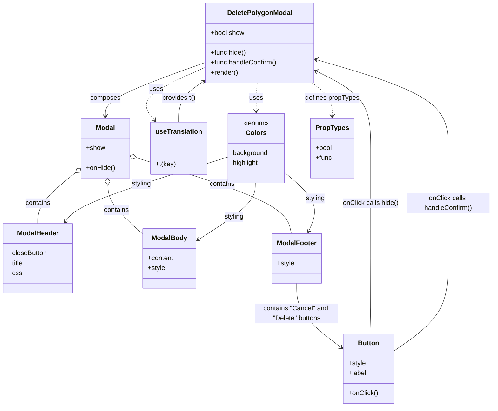

# Diagram: web/portal/src/pages/administration/location-management/location-neworedit/modals/DeletePolygonModal.js

> Auto-generated by Obscura crawlers

## Mermaid

### SVG

<svg id="container" width="1190.27734375" xmlns="http://www.w3.org/2000/svg" class="classDiagram" height="982" viewBox="0 0 1190.27734375 982" role="graphics-document document" aria-roledescription="class"><g><defs><marker id="container_class-aggregationStart" class="marker aggregation class" refX="18" refY="7" markerWidth="190" markerHeight="240" orient="auto"><path d="M 18,7 L9,13 L1,7 L9,1 Z"></path></marker></defs><defs><marker id="container_class-aggregationEnd" class="marker aggregation class" refX="1" refY="7" markerWidth="20" markerHeight="28" orient="auto"><path d="M 18,7 L9,13 L1,7 L9,1 Z"></path></marker></defs><defs><marker id="container_class-extensionStart" class="marker extension class" refX="18" refY="7" markerWidth="190" markerHeight="240" orient="auto"><path d="M 1,7 L18,13 V 1 Z"></path></marker></defs><defs><marker id="container_class-extensionEnd" class="marker extension class" refX="1" refY="7" markerWidth="20" markerHeight="28" orient="auto"><path d="M 1,1 V 13 L18,7 Z"></path></marker></defs><defs><marker id="container_class-compositionStart" class="marker composition class" refX="18" refY="7" markerWidth="190" markerHeight="240" orient="auto"><path d="M 18,7 L9,13 L1,7 L9,1 Z"></path></marker></defs><defs><marker id="container_class-compositionEnd" class="marker composition class" refX="1" refY="7" markerWidth="20" markerHeight="28" orient="auto"><path d="M 18,7 L9,13 L1,7 L9,1 Z"></path></marker></defs><defs><marker id="container_class-dependencyStart" class="marker dependency class" refX="6" refY="7" markerWidth="190" markerHeight="240" orient="auto"><path d="M 5,7 L9,13 L1,7 L9,1 Z"></path></marker></defs><defs><marker id="container_class-dependencyEnd" class="marker dependency class" refX="13" refY="7" markerWidth="20" markerHeight="28" orient="auto"><path d="M 18,7 L9,13 L14,7 L9,1 Z"></path></marker></defs><defs><marker id="container_class-lollipopStart" class="marker lollipop class" refX="13" refY="7" markerWidth="190" markerHeight="240" orient="auto"><circle stroke="black" fill="transparent" cx="7" cy="7" r="6"></circle></marker></defs><defs><marker id="container_class-lollipopEnd" class="marker lollipop class" refX="1" refY="7" markerWidth="190" markerHeight="240" orient="auto"><circle stroke="black" fill="transparent" cx="7" cy="7" r="6"></circle></marker></defs><g class="root"><g class="clusters"></g><g class="edgePaths"><path d="M495.945,151.13L456.438,165.441C416.93,179.753,337.915,208.377,298.408,229.855C258.9,251.333,258.9,265.667,258.9,272.833L258.9,280" id="id_DeletePolygonModal_Modal_1" class="edge-thickness-normal edge-pattern-solid relation" style=";;;" data-edge="true" data-et="edge" data-id="id_DeletePolygonModal_Modal_1" data-points="W3sieCI6NDk1Ljk0NTMxMjUsInkiOjE1MS4xMjk3MTEyOTc1Mzg1Nn0seyJ4IjoyNTguOTAwMzkwNjI1LCJ5IjoyMzd9LHsieCI6MjU4LjkwMDM5MDYyNSwieSI6Mjg2fV0=" marker-end="url(#container_class-dependencyEnd)"></path><path d="M186.801,415.416L170.982,428.013C155.163,440.611,123.525,465.805,107.706,486.569C91.887,507.333,91.887,523.667,91.887,531.833L91.887,540" id="id_Modal_ModalHeader_2" class="edge-thickness-normal edge-pattern-solid relation" style=";;;" data-edge="true" data-et="edge" data-id="id_Modal_ModalHeader_2" data-points="W3sieCI6MjAwLjI5NDkyMTg3NSwieSI6NDA0LjY2OTk5NTY3MzA3MTN9LHsieCI6OTEuODg2NzE4NzUsInkiOjQ5MX0seyJ4Ijo5MS44ODY3MTg3NSwieSI6NTQwfV0=" marker-start="url(#container_class-aggregationStart)"></path><path d="M263.53,447.227L263.908,454.522C264.287,461.818,265.044,476.409,278.501,495.894C291.958,515.38,318.115,539.76,331.193,551.95L344.271,564.14" id="id_Modal_ModalBody_3" class="edge-thickness-normal edge-pattern-solid relation" style=";;;" data-edge="true" data-et="edge" data-id="id_Modal_ModalBody_3" data-points="W3sieCI6MjYyLjYzNTk0MDQzNzAzMDA2LCJ5Ijo0MzB9LHsieCI6MjY1LjgwMDc4MTI1LCJ5Ijo0OTF9LHsieCI6MzQ0LjI3MTQ4NDM3NSwieSI6NTY0LjE0MDA3ODU2NjYzOH1d" marker-start="url(#container_class-aggregationStart)"></path><path d="M333.982,381.275L392.977,399.562C451.971,417.85,569.959,454.425,631.166,484.879C692.374,515.333,696.801,539.667,699.014,551.833L701.227,564" id="id_Modal_ModalFooter_4" class="edge-thickness-normal edge-pattern-solid relation" style=";;;" data-edge="true" data-et="edge" data-id="id_Modal_ModalFooter_4" data-points="W3sieCI6MzE3LjUwNTg1OTM3NSwieSI6Mzc2LjE2NzA3NjM2ODQwMzh9LHsieCI6Njg3Ljk0NzI2NTYyNSwieSI6NDkxfSx7IngiOjcwMS4yMjczOTk1NTM1NzE0LCJ5Ijo1NjR9XQ==" marker-start="url(#container_class-aggregationStart)"></path><path d="M712.143,684L712.143,696.167C712.143,708.333,712.143,732.667,731.029,758.945C749.915,785.223,787.687,813.445,806.573,827.557L825.459,841.668" id="id_ModalFooter_Button_5" class="edge-thickness-normal edge-pattern-solid relation" style=";;;" data-edge="true" data-et="edge" data-id="id_ModalFooter_Button_5" data-points="W3sieCI6NzEyLjE0MjU3ODEyNSwieSI6Njg0fSx7IngiOjcxMi4xNDI1NzgxMjUsInkiOjc1N30seyJ4Ijo4MzAuMjY1NjI1LCJ5Ijo4NDUuMjU5NTEwNDA3NDA4Nn1d" marker-end="url(#container_class-dependencyEnd)"></path><path d="M495.945,162.815L468.595,175.179C441.245,187.543,386.546,212.272,366.681,233.537C346.815,254.803,361.785,272.605,369.27,281.506L376.755,290.408" id="id_DeletePolygonModal_useTranslation_6" class="edge-thickness-normal edge-pattern-dashed relation" style=";;;" data-edge="true" data-et="edge" data-id="id_DeletePolygonModal_useTranslation_6" data-points="W3sieCI6NDk1Ljk0NTMxMjUsInkiOjE2Mi44MTUyMjM5NTc4ODM4M30seyJ4IjozMzEuODQ1NzAzMTI1LCJ5IjoyMzd9LHsieCI6MzgwLjYxNjU1Nzk4MDM3MTksInkiOjI5NX1d" marker-end="url(#container_class-dependencyEnd)"></path><path d="M621.066,200L620.746,206.167C620.426,212.333,619.786,224.667,619.466,236C619.146,247.333,619.146,257.667,619.146,262.833L619.146,268" id="id_DeletePolygonModal_Colors_7" class="edge-thickness-normal edge-pattern-dashed relation" style=";;;" data-edge="true" data-et="edge" data-id="id_DeletePolygonModal_Colors_7" data-points="W3sieCI6NjIxLjA2NjE0MTkxNzI5MzIsInkiOjIwMH0seyJ4Ijo2MTkuMTQ2NDg0Mzc1LCJ5IjoyMzd9LHsieCI6NjE5LjE0NjQ4NDM3NSwieSI6Mjc0fV0=" marker-end="url(#container_class-dependencyEnd)"></path><path d="M754.19,200L762.421,206.167C770.653,212.333,787.115,224.667,795.347,238C803.578,251.333,803.578,265.667,803.578,272.833L803.578,280" id="id_DeletePolygonModal_PropTypes_8" class="edge-thickness-normal edge-pattern-dashed relation" style=";;;" data-edge="true" data-et="edge" data-id="id_DeletePolygonModal_PropTypes_8" data-points="W3sieCI6NzU0LjE4OTczMjE0Mjg1NzEsInkiOjIwMH0seyJ4Ijo4MDMuNTc4MTI1LCJ5IjoyMzd9LHsieCI6ODAzLjU3ODEyNSwieSI6Mjg2fV0=" marker-end="url(#container_class-dependencyEnd)"></path><path d="M892.607,806L892.846,797.833C893.085,789.667,893.564,773.333,893.804,743C894.043,712.667,894.043,668.333,894.043,624C894.043,579.667,894.043,535.333,894.043,491C894.043,446.667,894.043,402.333,894.043,360C894.043,317.667,894.043,277.333,871.956,246.206C849.87,215.078,805.696,193.156,783.61,182.195L761.523,171.234" id="id_Button_DeletePolygonModal_9" class="edge-thickness-normal edge-pattern-solid relation" style=";;;" data-edge="true" data-et="edge" data-id="id_Button_DeletePolygonModal_9" data-points="W3sieCI6ODkyLjYwNjcwMjMwMjYzMTYsInkiOjgwNn0seyJ4Ijo4OTQuMDQyOTY4NzUsInkiOjc1N30seyJ4Ijo4OTQuMDQyOTY4NzUsInkiOjYyNH0seyJ4Ijo4OTQuMDQyOTY4NzUsInkiOjQ5MX0seyJ4Ijo4OTQuMDQyOTY4NzUsInkiOjM1OH0seyJ4Ijo4OTQuMDQyOTY4NzUsInkiOjIzN30seyJ4Ijo3NTYuMTQ4NDM3NSwieSI6MTY4LjU2NjI2ODc0ODA4Njk0fV0=" marker-end="url(#container_class-dependencyEnd)"></path><path d="M950.023,848.55L972.066,833.292C994.108,818.033,1038.193,787.517,1060.235,750.092C1082.277,712.667,1082.277,668.333,1082.277,624C1082.277,579.667,1082.277,535.333,1082.277,491C1082.277,446.667,1082.277,402.333,1082.277,360C1082.277,317.667,1082.277,277.333,1028.883,241.601C975.488,205.869,868.698,174.738,815.303,159.172L761.909,143.606" id="id_Button_DeletePolygonModal_10" class="edge-thickness-normal edge-pattern-solid relation" style=";;;" data-edge="true" data-et="edge" data-id="id_Button_DeletePolygonModal_10" data-points="W3sieCI6OTUwLjAyMzQzNzUsInkiOjg0OC41NTAwNTQ4OTM2Njl9LHsieCI6MTA4Mi4yNzczNDM3NSwieSI6NzU3fSx7IngiOjEwODIuMjc3MzQzNzUsInkiOjYyNH0seyJ4IjoxMDgyLjI3NzM0Mzc1LCJ5Ijo0OTF9LHsieCI6MTA4Mi4yNzczNDM3NSwieSI6MzU4fSx7IngiOjEwODIuMjc3MzQzNzUsInkiOjIzN30seyJ4Ijo3NTYuMTQ4NDM3NSwieSI6MTQxLjkyNzEyMDE2NzgxNTQyfV0=" marker-end="url(#container_class-dependencyEnd)"></path><path d="M433.592,295L433.592,285.333C433.592,275.667,433.592,256.333,443.161,240.053C452.731,223.773,471.87,210.547,481.44,203.934L491.009,197.32" id="id_useTranslation_DeletePolygonModal_11" class="edge-thickness-normal edge-pattern-solid relation" style=";;;" data-edge="true" data-et="edge" data-id="id_useTranslation_DeletePolygonModal_11" data-points="W3sieCI6NDMzLjU5MTc5Njg3NSwieSI6Mjk1fSx7IngiOjQzMy41OTE3OTY4NzUsInkiOjIzN30seyJ4Ijo0OTUuOTQ1MzEyNSwieSI6MTkzLjkwOTMzMzU0OTgzNDA2fV0=" marker-end="url(#container_class-dependencyEnd)"></path><path d="M549.678,379.577L489.888,398.147C430.099,416.718,310.52,453.859,245.246,479.794C179.971,505.729,169.001,520.459,163.516,527.823L158.031,535.188" id="id_Colors_ModalHeader_12" class="edge-thickness-normal edge-pattern-solid relation" style=";;;" data-edge="true" data-et="edge" data-id="id_Colors_ModalHeader_12" data-points="W3sieCI6NTQ5LjY3NzczNDM3NSwieSI6Mzc5LjU3NjkxMzA3NzM4OTc1fSx7IngiOjE5MC45NDE0MDYyNSwieSI6NDkxfSx7IngiOjE1NC40NDc1NzQwMTMxNTc5LCJ5Ijo1NDB9XQ==" marker-end="url(#container_class-dependencyEnd)"></path><path d="M615.32,442L614.948,450.167C614.576,458.333,613.832,474.667,590.903,497.497C567.974,520.327,522.861,549.654,500.304,564.317L477.747,578.981" id="id_Colors_ModalBody_13" class="edge-thickness-normal edge-pattern-solid relation" style=";;;" data-edge="true" data-et="edge" data-id="id_Colors_ModalBody_13" data-points="W3sieCI6NjE1LjMyMDAwNDExMTg0MjEsInkiOjQ0Mn0seyJ4Ijo2MTMuMDg3ODkwNjI1LCJ5Ijo0OTF9LHsieCI6NDcyLjcxNjc5Njg3NSwieSI6NTgyLjI1MDg1OTE3MjEzOTl9XQ==" marker-end="url(#container_class-dependencyEnd)"></path><path d="M688.615,417.649L702.853,429.874C717.091,442.099,745.567,466.55,754.564,490.035C763.562,513.52,753.081,536.04,747.84,547.3L742.599,558.56" id="id_Colors_ModalFooter_14" class="edge-thickness-normal edge-pattern-solid relation" style=";;;" data-edge="true" data-et="edge" data-id="id_Colors_ModalFooter_14" data-points="W3sieCI6Njg4LjYxNTIzNDM3NSwieSI6NDE3LjY0ODUwNTE3NjA4Nzg0fSx7IngiOjc3NC4wNDI5Njg3NSwieSI6NDkxfSx7IngiOjc0MC4wNjc1NjYzNzY4Nzk3LCJ5Ijo1NjR9XQ==" marker-end="url(#container_class-dependencyEnd)"></path></g><g class="edgeLabels"><g class="edgeLabel" transform="translate(258.900390625, 237)"><g class="label" data-id="id_DeletePolygonModal_Modal_1" transform="translate(-36.453125, -12)"><foreignObject width="72.90625" height="24">

composes

</foreignObject></g></g><g class="edgeLabel" transform="translate(91.88671875, 491)"><g class="label" data-id="id_Modal_ModalHeader_2" transform="translate(-30.890625, -12)"><foreignObject width="61.78125" height="24">

contains

</foreignObject></g></g><g class="edgeLabel" transform="translate(282.69487, 506.74645)"><g class="label" data-id="id_Modal_ModalBody_3" transform="translate(-30.890625, -12)"><foreignObject width="61.78125" height="24">

contains

</foreignObject></g></g><g class="edgeLabel" transform="translate(538.16211, 444.56818)"><g class="label" data-id="id_Modal_ModalFooter_4" transform="translate(-30.890625, -12)"><foreignObject width="61.78125" height="24">

contains

</foreignObject></g></g><g class="edgeLabel" transform="translate(712.142578125, 757)"><g class="label" data-id="id_ModalFooter_Button_5" transform="translate(-100, -24)"><foreignObject width="200" height="48">

contains "Cancel" and "Delete" buttons

</foreignObject></g></g><g class="edgeLabel" transform="translate(379.36966, 215.51577)"><g class="label" data-id="id_DeletePolygonModal_useTranslation_6" transform="translate(-16.4921875, -12)"><foreignObject width="32.984375" height="24">

uses

</foreignObject></g></g><g class="edgeLabel" transform="translate(619.146484375, 237)"><g class="label" data-id="id_DeletePolygonModal_Colors_7" transform="translate(-16.4921875, -12)"><foreignObject width="32.984375" height="24">

uses

</foreignObject></g></g><g class="edgeLabel" transform="translate(803.578125, 237)"><g class="label" data-id="id_DeletePolygonModal_PropTypes_8" transform="translate(-66.2734375, -12)"><foreignObject width="132.546875" height="24">

defines propTypes

</foreignObject></g></g><g class="edgeLabel" transform="translate(894.04296875, 491)"><g class="label" data-id="id_Button_DeletePolygonModal_9" transform="translate(-68.234375, -12)"><foreignObject width="136.46875" height="24">

onClick calls hide()

</foreignObject></g></g><g class="edgeLabel" transform="translate(1082.27734375, 491)"><g class="label" data-id="id_Button_DeletePolygonModal_10" transform="translate(-100, -24)"><foreignObject width="200" height="48">

onClick calls handleConfirm()

</foreignObject></g></g><g class="edgeLabel" transform="translate(433.591796875, 237)"><g class="label" data-id="id_useTranslation_DeletePolygonModal_11" transform="translate(-41.5078125, -12)"><foreignObject width="83.015625" height="24">

provides t()

</foreignObject></g></g><g class="edgeLabel" transform="translate(341.13606, 444.34971)"><g class="label" data-id="id_Colors_ModalHeader_12" transform="translate(-23.96875, -12)"><foreignObject width="47.9375" height="24">

styling

</foreignObject></g></g><g class="edgeLabel" transform="translate(563.46487, 523.25837)"><g class="label" data-id="id_Colors_ModalBody_13" transform="translate(-23.96875, -12)"><foreignObject width="47.9375" height="24">

styling

</foreignObject></g></g><g class="edgeLabel" transform="translate(761.87386, 480.55114)"><g class="label" data-id="id_Colors_ModalFooter_14" transform="translate(-23.96875, -12)"><foreignObject width="47.9375" height="24">

styling

</foreignObject></g></g></g><g class="nodes"><g class="node default" id="classId-DeletePolygonModal-0" transform="translate(626.046875, 104)"><g class="basic label-container"><path d="M-130.1015625 -96 L130.1015625 -96 L130.1015625 96 L-130.1015625 96" stroke="none" stroke-width="0" fill="#ECECFF" style=""></path><path d="M-130.1015625 -96 C-60.6910970320199 -96, 8.719368435960206 -96, 130.1015625 -96 M-130.1015625 -96 C-28.1211327012046 -96, 73.8592970975908 -96, 130.1015625 -96 M130.1015625 -96 C130.1015625 -46.613252714681586, 130.1015625 2.773494570636828, 130.1015625 96 M130.1015625 -96 C130.1015625 -25.59788548373993, 130.1015625 44.80422903252014, 130.1015625 96 M130.1015625 96 C65.65952800738488 96, 1.2174935147697568 96, -130.1015625 96 M130.1015625 96 C76.91627020416897 96, 23.73097790833792 96, -130.1015625 96 M-130.1015625 96 C-130.1015625 52.24749639743719, -130.1015625 8.494992794874378, -130.1015625 -96 M-130.1015625 96 C-130.1015625 39.28670301386994, -130.1015625 -17.42659397226012, -130.1015625 -96" stroke="#9370DB" stroke-width="1.3" fill="none" stroke-dasharray="0 0" style=""></path></g><g class="annotation-group text" transform="translate(0, -72)"></g><g class="label-group text" transform="translate(-75.34375, -72)"><g class="label" style="font-weight: bolder" transform="translate(0,-12)"><foreignObject width="150.6875" height="24">

DeletePolygonModal

</foreignObject></g></g><g class="members-group text" transform="translate(-118.1015625, -24)"><g class="label" style="" transform="translate(0,-12)"><foreignObject width="82.78125" height="24">

+bool show

</foreignObject></g></g><g class="methods-group text" transform="translate(-118.1015625, 24)"><g class="label" style="" transform="translate(0,-12)"><foreignObject width="86.234375" height="24">

+func hide()

</foreignObject></g><g class="label" style="" transform="translate(0,12)"><foreignObject width="160.859375" height="24">

+func handleConfirm()

</foreignObject></g><g class="label" style="" transform="translate(0,36)"><foreignObject width="66.609375" height="24">

+render()

</foreignObject></g></g><g class="divider" style=""><path d="M-130.1015625 -48 C-41.67280904086114 -48, 46.75594441827772 -48, 130.1015625 -48 M-130.1015625 -48 C-57.185040867972646 -48, 15.731480764054709 -48, 130.1015625 -48" stroke="#9370DB" stroke-width="1.3" fill="none" stroke-dasharray="0 0" style=""></path></g><g class="divider" style=""><path d="M-130.1015625 0 C-37.32162030764704 0, 55.458321884705924 0, 130.1015625 0 M-130.1015625 0 C-59.04840345164516 0, 12.004755596709686 0, 130.1015625 0" stroke="#9370DB" stroke-width="1.3" fill="none" stroke-dasharray="0 0" style=""></path></g></g><g class="node default" id="classId-Modal-1" transform="translate(258.900390625, 358)"><g class="basic label-container"><path d="M-58.60546875 -72 L58.60546875 -72 L58.60546875 72 L-58.60546875 72" stroke="none" stroke-width="0" fill="#ECECFF" style=""></path><path d="M-58.60546875 -72 C-20.538799284630947 -72, 17.527870180738105 -72, 58.60546875 -72 M-58.60546875 -72 C-24.934436850898734 -72, 8.736595048202531 -72, 58.60546875 -72 M58.60546875 -72 C58.60546875 -27.907568933421942, 58.60546875 16.184862133156116, 58.60546875 72 M58.60546875 -72 C58.60546875 -24.394333474805514, 58.60546875 23.211333050388973, 58.60546875 72 M58.60546875 72 C17.439576466380323 72, -23.726315817239353 72, -58.60546875 72 M58.60546875 72 C14.484695866990556 72, -29.636077016018888 72, -58.60546875 72 M-58.60546875 72 C-58.60546875 38.95516148596769, -58.60546875 5.910322971935386, -58.60546875 -72 M-58.60546875 72 C-58.60546875 21.03006246909016, -58.60546875 -29.939875061819677, -58.60546875 -72" stroke="#9370DB" stroke-width="1.3" fill="none" stroke-dasharray="0 0" style=""></path></g><g class="annotation-group text" transform="translate(0, -48)"></g><g class="label-group text" transform="translate(-22.4453125, -48)"><g class="label" style="font-weight: bolder" transform="translate(0,-12)"><foreignObject width="44.890625" height="24">

Modal

</foreignObject></g></g><g class="members-group text" transform="translate(-46.60546875, 0)"><g class="label" style="" transform="translate(0,-12)"><foreignObject width="45.65625" height="24">

+show

</foreignObject></g></g><g class="methods-group text" transform="translate(-46.60546875, 48)"><g class="label" style="" transform="translate(0,-12)"><foreignObject width="70.765625" height="24">

+onHide()

</foreignObject></g></g><g class="divider" style=""><path d="M-58.60546875 -24 C-19.25067230449514 -24, 20.10412414100972 -24, 58.60546875 -24 M-58.60546875 -24 C-30.798331146656324 -24, -2.9911935433126473 -24, 58.60546875 -24" stroke="#9370DB" stroke-width="1.3" fill="none" stroke-dasharray="0 0" style=""></path></g><g class="divider" style=""><path d="M-58.60546875 24 C-28.825384977417688 24, 0.9546987951646244 24, 58.60546875 24 M-58.60546875 24 C-20.849457399404606 24, 16.906553951190787 24, 58.60546875 24" stroke="#9370DB" stroke-width="1.3" fill="none" stroke-dasharray="0 0" style=""></path></g></g><g class="node default" id="classId-ModalHeader-2" transform="translate(91.88671875, 624)"><g class="basic label-container"><path d="M-83.88671875 -84 L83.88671875 -84 L83.88671875 84 L-83.88671875 84" stroke="none" stroke-width="0" fill="#ECECFF" style=""></path><path d="M-83.88671875 -84 C-17.02460740139948 -84, 49.83750394720104 -84, 83.88671875 -84 M-83.88671875 -84 C-20.917877571356556 -84, 42.05096360728689 -84, 83.88671875 -84 M83.88671875 -84 C83.88671875 -33.66639328318848, 83.88671875 16.667213433623047, 83.88671875 84 M83.88671875 -84 C83.88671875 -19.897543295592243, 83.88671875 44.204913408815514, 83.88671875 84 M83.88671875 84 C20.76516643620863 84, -42.35638587758274 84, -83.88671875 84 M83.88671875 84 C44.96834593352137 84, 6.0499731170427395 84, -83.88671875 84 M-83.88671875 84 C-83.88671875 17.795646205011323, -83.88671875 -48.408707589977354, -83.88671875 -84 M-83.88671875 84 C-83.88671875 47.436808889101854, -83.88671875 10.873617778203709, -83.88671875 -84" stroke="#9370DB" stroke-width="1.3" fill="none" stroke-dasharray="0 0" style=""></path></g><g class="annotation-group text" transform="translate(0, -60)"></g><g class="label-group text" transform="translate(-48.9140625, -60)"><g class="label" style="font-weight: bolder" transform="translate(0,-12)"><foreignObject width="97.828125" height="24">

ModalHeader

</foreignObject></g></g><g class="members-group text" transform="translate(-71.88671875, -12)"><g class="label" style="" transform="translate(0,-12)"><foreignObject width="94.859375" height="24">

+closeButton

</foreignObject></g><g class="label" style="" transform="translate(0,12)"><foreignObject width="37.140625" height="24">

+title

</foreignObject></g><g class="label" style="" transform="translate(0,36)"><foreignObject width="30.421875" height="24">

+css

</foreignObject></g></g><g class="methods-group text" transform="translate(-71.88671875, 84)"></g><g class="divider" style=""><path d="M-83.88671875 -36 C-21.45322285141365 -36, 40.9802730471727 -36, 83.88671875 -36 M-83.88671875 -36 C-28.6539784396383 -36, 26.578761870723397 -36, 83.88671875 -36" stroke="#9370DB" stroke-width="1.3" fill="none" stroke-dasharray="0 0" style=""></path></g><g class="divider" style=""><path d="M-83.88671875 60 C-39.67566360265204 60, 4.535391544695926 60, 83.88671875 60 M-83.88671875 60 C-43.66876240816899 60, -3.450806066337975 60, 83.88671875 60" stroke="#9370DB" stroke-width="1.3" fill="none" stroke-dasharray="0 0" style=""></path></g></g><g class="node default" id="classId-ModalBody-3" transform="translate(408.494140625, 624)"><g class="basic label-container"><path d="M-64.22265625 -72 L64.22265625 -72 L64.22265625 72 L-64.22265625 72" stroke="none" stroke-width="0" fill="#ECECFF" style=""></path><path d="M-64.22265625 -72 C-15.868460811527605 -72, 32.48573462694479 -72, 64.22265625 -72 M-64.22265625 -72 C-24.735387299125065 -72, 14.75188165174987 -72, 64.22265625 -72 M64.22265625 -72 C64.22265625 -24.611369186255168, 64.22265625 22.777261627489665, 64.22265625 72 M64.22265625 -72 C64.22265625 -22.66624409641807, 64.22265625 26.667511807163862, 64.22265625 72 M64.22265625 72 C26.522591912175763 72, -11.177472425648475 72, -64.22265625 72 M64.22265625 72 C14.97270645356457 72, -34.27724334287086 72, -64.22265625 72 M-64.22265625 72 C-64.22265625 21.92686535145357, -64.22265625 -28.146269297092857, -64.22265625 -72 M-64.22265625 72 C-64.22265625 22.192996810433065, -64.22265625 -27.61400637913387, -64.22265625 -72" stroke="#9370DB" stroke-width="1.3" fill="none" stroke-dasharray="0 0" style=""></path></g><g class="annotation-group text" transform="translate(0, -48)"></g><g class="label-group text" transform="translate(-40.9921875, -48)"><g class="label" style="font-weight: bolder" transform="translate(0,-12)"><foreignObject width="81.984375" height="24">

ModalBody

</foreignObject></g></g><g class="members-group text" transform="translate(-52.22265625, 0)"><g class="label" style="" transform="translate(0,-12)"><foreignObject width="63.453125" height="24">

+content

</foreignObject></g><g class="label" style="" transform="translate(0,12)"><foreignObject width="42.359375" height="24">

+style

</foreignObject></g></g><g class="methods-group text" transform="translate(-52.22265625, 72)"></g><g class="divider" style=""><path d="M-64.22265625 -24 C-24.601014912145374 -24, 15.020626425709253 -24, 64.22265625 -24 M-64.22265625 -24 C-19.364808128523315 -24, 25.49303999295337 -24, 64.22265625 -24" stroke="#9370DB" stroke-width="1.3" fill="none" stroke-dasharray="0 0" style=""></path></g><g class="divider" style=""><path d="M-64.22265625 48 C-25.978994835905887 48, 12.264666578188226 48, 64.22265625 48 M-64.22265625 48 C-35.25856972844079 48, -6.294483206881573 48, 64.22265625 48" stroke="#9370DB" stroke-width="1.3" fill="none" stroke-dasharray="0 0" style=""></path></g></g><g class="node default" id="classId-ModalFooter-4" transform="translate(712.142578125, 624)"><g class="basic label-container"><path d="M-57.96875 -60 L57.96875 -60 L57.96875 60 L-57.96875 60" stroke="none" stroke-width="0" fill="#ECECFF" style=""></path><path d="M-57.96875 -60 C-26.68773650438712 -60, 4.593276991225757 -60, 57.96875 -60 M-57.96875 -60 C-33.282689917281175 -60, -8.596629834562343 -60, 57.96875 -60 M57.96875 -60 C57.96875 -19.88151179439548, 57.96875 20.236976411209042, 57.96875 60 M57.96875 -60 C57.96875 -34.131108499707736, 57.96875 -8.262216999415465, 57.96875 60 M57.96875 60 C25.145694230619938 60, -7.677361538760124 60, -57.96875 60 M57.96875 60 C27.50562139342649 60, -2.957507213147018 60, -57.96875 60 M-57.96875 60 C-57.96875 17.499859355259275, -57.96875 -25.00028128948145, -57.96875 -60 M-57.96875 60 C-57.96875 32.874129879811235, -57.96875 5.748259759622471, -57.96875 -60" stroke="#9370DB" stroke-width="1.3" fill="none" stroke-dasharray="0 0" style=""></path></g><g class="annotation-group text" transform="translate(0, -36)"></g><g class="label-group text" transform="translate(-45.96875, -36)"><g class="label" style="font-weight: bolder" transform="translate(0,-12)"><foreignObject width="91.9375" height="24">

ModalFooter

</foreignObject></g></g><g class="members-group text" transform="translate(-45.96875, 12)"><g class="label" style="" transform="translate(0,-12)"><foreignObject width="42.359375" height="24">

+style

</foreignObject></g></g><g class="methods-group text" transform="translate(-45.96875, 60)"></g><g class="divider" style=""><path d="M-57.96875 -12 C-21.869533500316045 -12, 14.22968299936791 -12, 57.96875 -12 M-57.96875 -12 C-16.166219846584802 -12, 25.636310306830396 -12, 57.96875 -12" stroke="#9370DB" stroke-width="1.3" fill="none" stroke-dasharray="0 0" style=""></path></g><g class="divider" style=""><path d="M-57.96875 36 C-15.988862180065837 36, 25.991025639868326 36, 57.96875 36 M-57.96875 36 C-28.20206275635412 36, 1.5646244872917592 36, 57.96875 36" stroke="#9370DB" stroke-width="1.3" fill="none" stroke-dasharray="0 0" style=""></path></g></g><g class="node default" id="classId-Button-5" transform="translate(890.14453125, 890)"><g class="basic label-container"><path d="M-59.87890625 -84 L59.87890625 -84 L59.87890625 84 L-59.87890625 84" stroke="none" stroke-width="0" fill="#ECECFF" style=""></path><path d="M-59.87890625 -84 C-17.968337330829414 -84, 23.942231588341173 -84, 59.87890625 -84 M-59.87890625 -84 C-13.609721156387451 -84, 32.6594639372251 -84, 59.87890625 -84 M59.87890625 -84 C59.87890625 -49.55497596454712, 59.87890625 -15.109951929094237, 59.87890625 84 M59.87890625 -84 C59.87890625 -37.760670941732755, 59.87890625 8.47865811653449, 59.87890625 84 M59.87890625 84 C20.204351653815074 84, -19.470202942369852 84, -59.87890625 84 M59.87890625 84 C25.734646860517778 84, -8.409612528964445 84, -59.87890625 84 M-59.87890625 84 C-59.87890625 32.69015154687804, -59.87890625 -18.619696906243917, -59.87890625 -84 M-59.87890625 84 C-59.87890625 49.16118595988987, -59.87890625 14.32237191977974, -59.87890625 -84" stroke="#9370DB" stroke-width="1.3" fill="none" stroke-dasharray="0 0" style=""></path></g><g class="annotation-group text" transform="translate(0, -60)"></g><g class="label-group text" transform="translate(-24.8359375, -60)"><g class="label" style="font-weight: bolder" transform="translate(0,-12)"><foreignObject width="49.671875" height="24">

Button

</foreignObject></g></g><g class="members-group text" transform="translate(-47.87890625, -12)"><g class="label" style="" transform="translate(0,-12)"><foreignObject width="42.359375" height="24">

+style

</foreignObject></g><g class="label" style="" transform="translate(0,12)"><foreignObject width="44.21875" height="24">

+label

</foreignObject></g></g><g class="methods-group text" transform="translate(-47.87890625, 60)"><g class="label" style="" transform="translate(0,-12)"><foreignObject width="70.921875" height="24">

+onClick()

</foreignObject></g></g><g class="divider" style=""><path d="M-59.87890625 -36 C-30.831970432020338 -36, -1.7850346140406756 -36, 59.87890625 -36 M-59.87890625 -36 C-23.337696765048904 -36, 13.203512719902193 -36, 59.87890625 -36" stroke="#9370DB" stroke-width="1.3" fill="none" stroke-dasharray="0 0" style=""></path></g><g class="divider" style=""><path d="M-59.87890625 36 C-27.441800088771494 36, 4.995306072457012 36, 59.87890625 36 M-59.87890625 36 C-24.30711755703608 36, 11.264671135927841 36, 59.87890625 36" stroke="#9370DB" stroke-width="1.3" fill="none" stroke-dasharray="0 0" style=""></path></g></g><g class="node default" id="classId-useTranslation-6" transform="translate(433.591796875, 358)"><g class="basic label-container"><path d="M-66.0859375 -63 L66.0859375 -63 L66.0859375 63 L-66.0859375 63" stroke="none" stroke-width="0" fill="#ECECFF" style=""></path><path d="M-66.0859375 -63 C-34.85949403050972 -63, -3.633050561019452 -63, 66.0859375 -63 M-66.0859375 -63 C-17.161839293958124 -63, 31.76225891208375 -63, 66.0859375 -63 M66.0859375 -63 C66.0859375 -18.896130662159813, 66.0859375 25.207738675680375, 66.0859375 63 M66.0859375 -63 C66.0859375 -33.151549655500645, 66.0859375 -3.303099311001297, 66.0859375 63 M66.0859375 63 C25.10207630037862 63, -15.88178489924276 63, -66.0859375 63 M66.0859375 63 C28.814237303747703 63, -8.457462892504594 63, -66.0859375 63 M-66.0859375 63 C-66.0859375 36.01018372622802, -66.0859375 9.020367452456036, -66.0859375 -63 M-66.0859375 63 C-66.0859375 18.261649571903668, -66.0859375 -26.476700856192664, -66.0859375 -63" stroke="#9370DB" stroke-width="1.3" fill="none" stroke-dasharray="0 0" style=""></path></g><g class="annotation-group text" transform="translate(0, -39)"></g><g class="label-group text" transform="translate(-54.0859375, -39)"><g class="label" style="font-weight: bolder" transform="translate(0,-12)"><foreignObject width="108.171875" height="24">

useTranslation

</foreignObject></g></g><g class="members-group text" transform="translate(-54.0859375, 9)"></g><g class="methods-group text" transform="translate(-54.0859375, 39)"><g class="label" style="" transform="translate(0,-12)"><foreignObject width="48.625" height="24">

+t(key)

</foreignObject></g></g><g class="divider" style=""><path d="M-66.0859375 -15 C-21.692075260282934 -15, 22.701786979434132 -15, 66.0859375 -15 M-66.0859375 -15 C-39.10004161667278 -15, -12.114145733345559 -15, 66.0859375 -15" stroke="#9370DB" stroke-width="1.3" fill="none" stroke-dasharray="0 0" style=""></path></g><g class="divider" style=""><path d="M-66.0859375 9 C-19.014033574601854 9, 28.057870350796293 9, 66.0859375 9 M-66.0859375 9 C-35.56841646894675 9, -5.0508954378934945 9, 66.0859375 9" stroke="#9370DB" stroke-width="1.3" fill="none" stroke-dasharray="0 0" style=""></path></g></g><g class="node default" id="classId-Colors-7" transform="translate(619.146484375, 358)"><g class="basic label-container"><path d="M-69.46875 -84 L69.46875 -84 L69.46875 84 L-69.46875 84" stroke="none" stroke-width="0" fill="#ECECFF" style=""></path><path d="M-69.46875 -84 C-33.23803805569499 -84, 2.992673888610014 -84, 69.46875 -84 M-69.46875 -84 C-35.02649288882759 -84, -0.5842357776551808 -84, 69.46875 -84 M69.46875 -84 C69.46875 -50.3266966173803, 69.46875 -16.6533932347606, 69.46875 84 M69.46875 -84 C69.46875 -26.607253926207477, 69.46875 30.785492147585046, 69.46875 84 M69.46875 84 C23.640620450254467 84, -22.187509099491066 84, -69.46875 84 M69.46875 84 C37.35741380651095 84, 5.246077613021896 84, -69.46875 84 M-69.46875 84 C-69.46875 43.88148215566628, -69.46875 3.762964311332567, -69.46875 -84 M-69.46875 84 C-69.46875 34.743120135963125, -69.46875 -14.513759728073751, -69.46875 -84" stroke="#9370DB" stroke-width="1.3" fill="none" stroke-dasharray="0 0" style=""></path></g><g class="annotation-group text" transform="translate(-29.53125, -60)"><g class="label" style="" transform="translate(0,-12)"><foreignObject width="59.0625" height="24">

«enum»

</foreignObject></g></g><g class="label-group text" transform="translate(-23.1015625, -36)"><g class="label" style="font-weight: bolder" transform="translate(0,-12)"><foreignObject width="46.203125" height="24">

Colors

</foreignObject></g></g><g class="members-group text" transform="translate(-57.46875, 12)"><g class="label" style="" transform="translate(0,-12)"><foreignObject width="85.40625" height="24">

background

</foreignObject></g><g class="label" style="" transform="translate(0,12)"><foreignObject width="64.265625" height="24">

highlight

</foreignObject></g></g><g class="methods-group text" transform="translate(-57.46875, 84)"></g><g class="divider" style=""><path d="M-69.46875 -12 C-27.463901952690478 -12, 14.540946094619045 -12, 69.46875 -12 M-69.46875 -12 C-34.15265501095922 -12, 1.1634399780815556 -12, 69.46875 -12" stroke="#9370DB" stroke-width="1.3" fill="none" stroke-dasharray="0 0" style=""></path></g><g class="divider" style=""><path d="M-69.46875 60 C-37.63056125836839 60, -5.792372516736769 60, 69.46875 60 M-69.46875 60 C-23.85703735705306 60, 21.75467528589388 60, 69.46875 60" stroke="#9370DB" stroke-width="1.3" fill="none" stroke-dasharray="0 0" style=""></path></g></g><g class="node default" id="classId-PropTypes-8" transform="translate(803.578125, 358)"><g class="basic label-container"><path d="M-51.56640625 -72 L51.56640625 -72 L51.56640625 72 L-51.56640625 72" stroke="none" stroke-width="0" fill="#ECECFF" style=""></path><path d="M-51.56640625 -72 C-28.162671972798446 -72, -4.758937695596892 -72, 51.56640625 -72 M-51.56640625 -72 C-18.10678495542262 -72, 15.352836339154763 -72, 51.56640625 -72 M51.56640625 -72 C51.56640625 -36.6080687085899, 51.56640625 -1.2161374171797945, 51.56640625 72 M51.56640625 -72 C51.56640625 -38.65161003532642, 51.56640625 -5.303220070652841, 51.56640625 72 M51.56640625 72 C15.594909294785793 72, -20.376587660428413 72, -51.56640625 72 M51.56640625 72 C30.669560755650362 72, 9.772715261300725 72, -51.56640625 72 M-51.56640625 72 C-51.56640625 18.569096068684942, -51.56640625 -34.861807862630116, -51.56640625 -72 M-51.56640625 72 C-51.56640625 41.523756883091295, -51.56640625 11.047513766182597, -51.56640625 -72" stroke="#9370DB" stroke-width="1.3" fill="none" stroke-dasharray="0 0" style=""></path></g><g class="annotation-group text" transform="translate(0, -48)"></g><g class="label-group text" transform="translate(-38.2578125, -48)"><g class="label" style="font-weight: bolder" transform="translate(0,-12)"><foreignObject width="76.515625" height="24">

PropTypes

</foreignObject></g></g><g class="members-group text" transform="translate(-39.56640625, 0)"><g class="label" style="" transform="translate(0,-12)"><foreignObject width="40.875" height="24">

+bool

</foreignObject></g><g class="label" style="" transform="translate(0,12)"><foreignObject width="39.453125" height="24">

+func

</foreignObject></g></g><g class="methods-group text" transform="translate(-39.56640625, 72)"></g><g class="divider" style=""><path d="M-51.56640625 -24 C-17.127204370755997 -24, 17.311997508488005 -24, 51.56640625 -24 M-51.56640625 -24 C-25.50643811379089 -24, 0.5535300224182222 -24, 51.56640625 -24" stroke="#9370DB" stroke-width="1.3" fill="none" stroke-dasharray="0 0" style=""></path></g><g class="divider" style=""><path d="M-51.56640625 48 C-12.546258449902993 48, 26.473889350194014 48, 51.56640625 48 M-51.56640625 48 C-18.24735660276641 48, 15.071693044467182 48, 51.56640625 48" stroke="#9370DB" stroke-width="1.3" fill="none" stroke-dasharray="0 0" style=""></path></g></g></g></g></g></svg>
