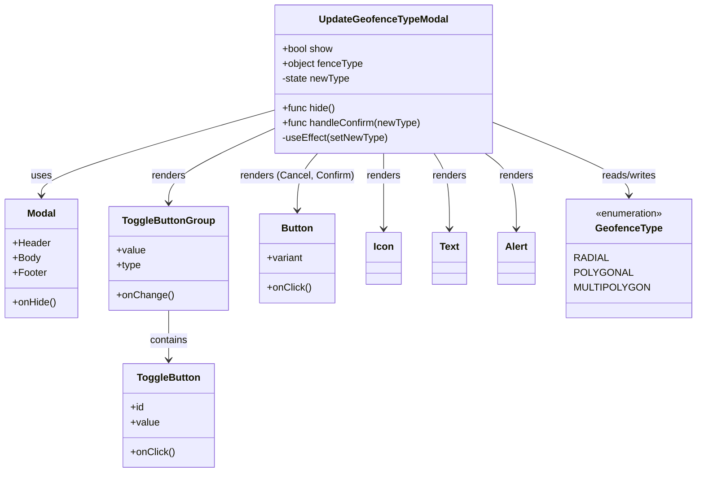
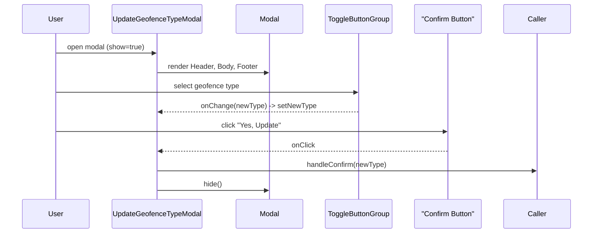

# Diagram: web/portal/src/pages/administration/location-management/location-neworedit/modals/UpdateGeofenceTypeModal.js

> Auto-generated by Obscura crawlers

## Diagram 1

### SVG

<svg id="container" width="1098.37109375" xmlns="http://www.w3.org/2000/svg" class="classDiagram" height="764" viewBox="0 0 1098.37109375 764" role="graphics-document document" aria-roledescription="class"><g><defs><marker id="container_class-aggregationStart" class="marker aggregation class" refX="18" refY="7" markerWidth="190" markerHeight="240" orient="auto"><path d="M 18,7 L9,13 L1,7 L9,1 Z"></path></marker></defs><defs><marker id="container_class-aggregationEnd" class="marker aggregation class" refX="1" refY="7" markerWidth="20" markerHeight="28" orient="auto"><path d="M 18,7 L9,13 L1,7 L9,1 Z"></path></marker></defs><defs><marker id="container_class-extensionStart" class="marker extension class" refX="18" refY="7" markerWidth="190" markerHeight="240" orient="auto"><path d="M 1,7 L18,13 V 1 Z"></path></marker></defs><defs><marker id="container_class-extensionEnd" class="marker extension class" refX="1" refY="7" markerWidth="20" markerHeight="28" orient="auto"><path d="M 1,1 V 13 L18,7 Z"></path></marker></defs><defs><marker id="container_class-compositionStart" class="marker composition class" refX="18" refY="7" markerWidth="190" markerHeight="240" orient="auto"><path d="M 18,7 L9,13 L1,7 L9,1 Z"></path></marker></defs><defs><marker id="container_class-compositionEnd" class="marker composition class" refX="1" refY="7" markerWidth="20" markerHeight="28" orient="auto"><path d="M 18,7 L9,13 L1,7 L9,1 Z"></path></marker></defs><defs><marker id="container_class-dependencyStart" class="marker dependency class" refX="6" refY="7" markerWidth="190" markerHeight="240" orient="auto"><path d="M 5,7 L9,13 L1,7 L9,1 Z"></path></marker></defs><defs><marker id="container_class-dependencyEnd" class="marker dependency class" refX="13" refY="7" markerWidth="20" markerHeight="28" orient="auto"><path d="M 18,7 L9,13 L14,7 L9,1 Z"></path></marker></defs><defs><marker id="container_class-lollipopStart" class="marker lollipop class" refX="13" refY="7" markerWidth="190" markerHeight="240" orient="auto"><circle stroke="black" fill="transparent" cx="7" cy="7" r="6"></circle></marker></defs><defs><marker id="container_class-lollipopEnd" class="marker lollipop class" refX="1" refY="7" markerWidth="190" markerHeight="240" orient="auto"><circle stroke="black" fill="transparent" cx="7" cy="7" r="6"></circle></marker></defs><g class="root"><g class="clusters"></g><g class="edgePaths"><path d="M434.93,178.431L373.542,196.193C312.155,213.954,189.38,249.477,127.993,272.405C66.605,295.333,66.605,305.667,66.605,310.833L66.605,316" id="id_UpdateGeofenceTypeModal_Modal_1" class="edge-thickness-normal edge-pattern-solid relation" style=";;;" data-edge="true" data-et="edge" data-id="id_UpdateGeofenceTypeModal_Modal_1" data-points="W3sieCI6NDM0LjkyOTY4NzUsInkiOjE3OC40MzExODY2NTA1NDEzNX0seyJ4Ijo2Ni42MDU0Njg3NSwieSI6Mjg1fSx7IngiOjY2LjYwNTQ2ODc1LCJ5IjozMjJ9XQ==" marker-end="url(#container_class-dependencyEnd)"></path><path d="M434.93,208.155L407.079,220.963C379.229,233.77,323.529,259.385,295.678,279.359C267.828,299.333,267.828,313.667,267.828,320.833L267.828,328" id="id_UpdateGeofenceTypeModal_ToggleButtonGroup_2" class="edge-thickness-normal edge-pattern-solid relation" style=";;;" data-edge="true" data-et="edge" data-id="id_UpdateGeofenceTypeModal_ToggleButtonGroup_2" data-points="W3sieCI6NDM0LjkyOTY4NzUsInkiOjIwOC4xNTUzNDUwMjY4MzA5Nn0seyJ4IjoyNjcuODI4MTI1LCJ5IjoyODV9LHsieCI6MjY3LjgyODEyNSwieSI6MzM0fV0=" marker-end="url(#container_class-dependencyEnd)"></path><path d="M267.828,502L267.828,510.167C267.828,518.333,267.828,534.667,267.828,548C267.828,561.333,267.828,571.667,267.828,576.833L267.828,582" id="id_ToggleButtonGroup_ToggleButton_3" class="edge-thickness-normal edge-pattern-solid relation" style=";;;" data-edge="true" data-et="edge" data-id="id_ToggleButtonGroup_ToggleButton_3" data-points="W3sieCI6MjY3LjgyODEyNSwieSI6NTAyfSx7IngiOjI2Ny44MjgxMjUsInkiOjU1MX0seyJ4IjoyNjcuODI4MTI1LCJ5Ijo1ODh9XQ==" marker-end="url(#container_class-dependencyEnd)"></path><path d="M503.06,248L497.604,254.167C492.148,260.333,481.236,272.667,475.78,288C470.324,303.333,470.324,321.667,470.324,330.833L470.324,340" id="id_UpdateGeofenceTypeModal_Button_4" class="edge-thickness-normal edge-pattern-solid relation" style=";;;" data-edge="true" data-et="edge" data-id="id_UpdateGeofenceTypeModal_Button_4" data-points="W3sieCI6NTAzLjA2MDA4NjU4NDM5NDksInkiOjI0OH0seyJ4Ijo0NzAuMzI0MjE4NzUsInkiOjI4NX0seyJ4Ijo0NzAuMzI0MjE4NzUsInkiOjM0Nn1d" marker-end="url(#container_class-dependencyEnd)"></path><path d="M609.23,248L609.23,254.167C609.23,260.333,609.23,272.667,609.23,293C609.23,313.333,609.23,341.667,609.23,355.833L609.23,370" id="id_UpdateGeofenceTypeModal_Icon_5" class="edge-thickness-normal edge-pattern-solid relation" style=";;;" data-edge="true" data-et="edge" data-id="id_UpdateGeofenceTypeModal_Icon_5" data-points="W3sieCI6NjA5LjIzMDQ2ODc1LCJ5IjoyNDh9LHsieCI6NjA5LjIzMDQ2ODc1LCJ5IjoyODV9LHsieCI6NjA5LjIzMDQ2ODc1LCJ5IjozNzZ9XQ==" marker-end="url(#container_class-dependencyEnd)"></path><path d="M689.246,248L693.358,254.167C697.47,260.333,705.694,272.667,709.806,293C713.918,313.333,713.918,341.667,713.918,355.833L713.918,370" id="id_UpdateGeofenceTypeModal_Text_6" class="edge-thickness-normal edge-pattern-solid relation" style=";;;" data-edge="true" data-et="edge" data-id="id_UpdateGeofenceTypeModal_Text_6" data-points="W3sieCI6Njg5LjI0NjM5MjMxNjg3OSwieSI6MjQ4fSx7IngiOjcxMy45MTc5Njg3NSwieSI6Mjg1fSx7IngiOjcxMy45MTc5Njg3NSwieSI6Mzc2fV0=" marker-end="url(#container_class-dependencyEnd)"></path><path d="M771.149,248L779.47,254.167C787.791,260.333,804.433,272.667,812.753,293C821.074,313.333,821.074,341.667,821.074,355.833L821.074,370" id="id_UpdateGeofenceTypeModal_Alert_7" class="edge-thickness-normal edge-pattern-solid relation" style=";;;" data-edge="true" data-et="edge" data-id="id_UpdateGeofenceTypeModal_Alert_7" data-points="W3sieCI6NzcxLjE0OTI1ODU1ODkxNzIsInkiOjI0OH0seyJ4Ijo4MjEuMDc0MjE4NzUsInkiOjI4NX0seyJ4Ijo4MjEuMDc0MjE4NzUsInkiOjM3Nn1d" marker-end="url(#container_class-dependencyEnd)"></path><path d="M783.531,198.825L818.878,213.187C854.224,227.55,924.917,256.275,960.263,275.804C995.609,295.333,995.609,305.667,995.609,310.833L995.609,316" id="id_UpdateGeofenceTypeModal_GeofenceType_8" class="edge-thickness-normal edge-pattern-solid relation" style=";;;" data-edge="true" data-et="edge" data-id="id_UpdateGeofenceTypeModal_GeofenceType_8" data-points="W3sieCI6NzgzLjUzMTI1LCJ5IjoxOTguODI0ODM1OTY2OTYwODV9LHsieCI6OTk1LjYwOTM3NSwieSI6Mjg1fSx7IngiOjk5NS42MDkzNzUsInkiOjMyMn1d" marker-end="url(#container_class-dependencyEnd)"></path></g><g class="edgeLabels"><g class="edgeLabel" transform="translate(66.60546875, 285)"><g class="label" data-id="id_UpdateGeofenceTypeModal_Modal_1" transform="translate(-16.4921875, -12)"><foreignObject width="32.984375" height="24">

uses

</foreignObject></g></g><g class="edgeLabel" transform="translate(267.828125, 285)"><g class="label" data-id="id_UpdateGeofenceTypeModal_ToggleButtonGroup_2" transform="translate(-27.75, -12)"><foreignObject width="55.5" height="24">

renders

</foreignObject></g></g><g class="edgeLabel" transform="translate(267.828125, 551)"><g class="label" data-id="id_ToggleButtonGroup_ToggleButton_3" transform="translate(-30.890625, -12)"><foreignObject width="61.78125" height="24">

contains

</foreignObject></g></g><g class="edgeLabel" transform="translate(470.32421875, 285)"><g class="label" data-id="id_UpdateGeofenceTypeModal_Button_4" transform="translate(-91.15625, -12)"><foreignObject width="182.3125" height="24">

renders (Cancel, Confirm)

</foreignObject></g></g><g class="edgeLabel" transform="translate(609.23046875, 285)"><g class="label" data-id="id_UpdateGeofenceTypeModal_Icon_5" transform="translate(-27.75, -12)"><foreignObject width="55.5" height="24">

renders

</foreignObject></g></g><g class="edgeLabel" transform="translate(713.91796875, 285)"><g class="label" data-id="id_UpdateGeofenceTypeModal_Text_6" transform="translate(-27.75, -12)"><foreignObject width="55.5" height="24">

renders

</foreignObject></g></g><g class="edgeLabel" transform="translate(821.07421875, 285)"><g class="label" data-id="id_UpdateGeofenceTypeModal_Alert_7" transform="translate(-27.75, -12)"><foreignObject width="55.5" height="24">

renders

</foreignObject></g></g><g class="edgeLabel" transform="translate(995.609375, 285)"><g class="label" data-id="id_UpdateGeofenceTypeModal_GeofenceType_8" transform="translate(-45.9453125, -12)"><foreignObject width="91.890625" height="24">

reads/writes

</foreignObject></g></g></g><g class="nodes"><g class="node default" id="classId-UpdateGeofenceTypeModal-0" transform="translate(609.23046875, 128)"><g class="basic label-container"><path d="M-174.30078125 -120 L174.30078125 -120 L174.30078125 120 L-174.30078125 120" stroke="none" stroke-width="0" fill="#ECECFF" style=""></path><path d="M-174.30078125 -120 C-77.96785317139243 -120, 18.36507490721513 -120, 174.30078125 -120 M-174.30078125 -120 C-42.01051086767191 -120, 90.27975951465618 -120, 174.30078125 -120 M174.30078125 -120 C174.30078125 -63.525978464934745, 174.30078125 -7.05195692986949, 174.30078125 120 M174.30078125 -120 C174.30078125 -31.707931682901943, 174.30078125 56.58413663419611, 174.30078125 120 M174.30078125 120 C98.07774231063121 120, 21.854703371262417 120, -174.30078125 120 M174.30078125 120 C46.6074463406504 120, -81.0858885686992 120, -174.30078125 120 M-174.30078125 120 C-174.30078125 59.71001793390903, -174.30078125 -0.5799641321819422, -174.30078125 -120 M-174.30078125 120 C-174.30078125 36.3882019794827, -174.30078125 -47.2235960410346, -174.30078125 -120" stroke="#9370DB" stroke-width="1.3" fill="none" stroke-dasharray="0 0" style=""></path></g><g class="annotation-group text" transform="translate(0, -96)"></g><g class="label-group text" transform="translate(-100.4453125, -96)"><g class="label" style="font-weight: bolder" transform="translate(0,-12)"><foreignObject width="200.890625" height="24">

UpdateGeofenceTypeModal

</foreignObject></g></g><g class="members-group text" transform="translate(-162.30078125, -48)"><g class="label" style="" transform="translate(0,-12)"><foreignObject width="82.78125" height="24">

+bool show

</foreignObject></g><g class="label" style="" transform="translate(0,12)"><foreignObject width="130.78125" height="24">

+object fenceType

</foreignObject></g><g class="label" style="" transform="translate(0,36)"><foreignObject width="110.09375" height="24">

-state newType

</foreignObject></g></g><g class="methods-group text" transform="translate(-162.30078125, 48)"><g class="label" style="" transform="translate(0,-12)"><foreignObject width="86.234375" height="24">

+func hide()

</foreignObject></g><g class="label" style="" transform="translate(0,12)"><foreignObject width="224.15625" height="24">

+func handleConfirm(newType)

</foreignObject></g><g class="label" style="" transform="translate(0,36)"><foreignObject width="170.09375" height="24">

-useEffect(setNewType)

</foreignObject></g></g><g class="divider" style=""><path d="M-174.30078125 -72 C-42.220978893890674 -72, 89.85882346221865 -72, 174.30078125 -72 M-174.30078125 -72 C-59.527666434596355 -72, 55.24544838080729 -72, 174.30078125 -72" stroke="#9370DB" stroke-width="1.3" fill="none" stroke-dasharray="0 0" style=""></path></g><g class="divider" style=""><path d="M-174.30078125 24 C-46.40202277728355 24, 81.4967356954329 24, 174.30078125 24 M-174.30078125 24 C-90.24642736910631 24, -6.192073488212628 24, 174.30078125 24" stroke="#9370DB" stroke-width="1.3" fill="none" stroke-dasharray="0 0" style=""></path></g></g><g class="node default" id="classId-Modal-1" transform="translate(66.60546875, 418)"><g class="basic label-container"><path d="M-58.60546875 -96 L58.60546875 -96 L58.60546875 96 L-58.60546875 96" stroke="none" stroke-width="0" fill="#ECECFF" style=""></path><path d="M-58.60546875 -96 C-26.095542879252832 -96, 6.414382991494335 -96, 58.60546875 -96 M-58.60546875 -96 C-25.040571096653608 -96, 8.524326556692785 -96, 58.60546875 -96 M58.60546875 -96 C58.60546875 -39.302232934927545, 58.60546875 17.39553413014491, 58.60546875 96 M58.60546875 -96 C58.60546875 -43.85470853389848, 58.60546875 8.290582932203037, 58.60546875 96 M58.60546875 96 C14.360704070539178 96, -29.884060608921644 96, -58.60546875 96 M58.60546875 96 C25.387154471748154 96, -7.831159806503692 96, -58.60546875 96 M-58.60546875 96 C-58.60546875 42.70120187421071, -58.60546875 -10.59759625157858, -58.60546875 -96 M-58.60546875 96 C-58.60546875 54.83040169679516, -58.60546875 13.660803393590314, -58.60546875 -96" stroke="#9370DB" stroke-width="1.3" fill="none" stroke-dasharray="0 0" style=""></path></g><g class="annotation-group text" transform="translate(0, -72)"></g><g class="label-group text" transform="translate(-22.4453125, -72)"><g class="label" style="font-weight: bolder" transform="translate(0,-12)"><foreignObject width="44.890625" height="24">

Modal

</foreignObject></g></g><g class="members-group text" transform="translate(-46.60546875, -24)"><g class="label" style="" transform="translate(0,-12)"><foreignObject width="60.59375" height="24">

+Header

</foreignObject></g><g class="label" style="" transform="translate(0,12)"><foreignObject width="44.5" height="24">

+Body

</foreignObject></g><g class="label" style="" transform="translate(0,36)"><foreignObject width="54.40625" height="24">

+Footer

</foreignObject></g></g><g class="methods-group text" transform="translate(-46.60546875, 72)"><g class="label" style="" transform="translate(0,-12)"><foreignObject width="70.765625" height="24">

+onHide()

</foreignObject></g></g><g class="divider" style=""><path d="M-58.60546875 -48 C-17.742807675703375 -48, 23.11985339859325 -48, 58.60546875 -48 M-58.60546875 -48 C-28.730894685525314 -48, 1.143679378949372 -48, 58.60546875 -48" stroke="#9370DB" stroke-width="1.3" fill="none" stroke-dasharray="0 0" style=""></path></g><g class="divider" style=""><path d="M-58.60546875 48 C-24.231417500828343 48, 10.142633748343314 48, 58.60546875 48 M-58.60546875 48 C-22.540267311357674 48, 13.524934127284652 48, 58.60546875 48" stroke="#9370DB" stroke-width="1.3" fill="none" stroke-dasharray="0 0" style=""></path></g></g><g class="node default" id="classId-ToggleButtonGroup-2" transform="translate(267.828125, 418)"><g class="basic label-container"><path d="M-92.6171875 -84 L92.6171875 -84 L92.6171875 84 L-92.6171875 84" stroke="none" stroke-width="0" fill="#ECECFF" style=""></path><path d="M-92.6171875 -84 C-48.68150799925362 -84, -4.745828498507237 -84, 92.6171875 -84 M-92.6171875 -84 C-24.1374727401885 -84, 44.342242019623 -84, 92.6171875 -84 M92.6171875 -84 C92.6171875 -23.82785050186535, 92.6171875 36.3442989962693, 92.6171875 84 M92.6171875 -84 C92.6171875 -34.8524316399456, 92.6171875 14.2951367201088, 92.6171875 84 M92.6171875 84 C45.06524840502193 84, -2.4866906899561343 84, -92.6171875 84 M92.6171875 84 C51.92232560421125 84, 11.227463708422505 84, -92.6171875 84 M-92.6171875 84 C-92.6171875 20.31370125879797, -92.6171875 -43.37259748240406, -92.6171875 -84 M-92.6171875 84 C-92.6171875 31.352760204721257, -92.6171875 -21.294479590557486, -92.6171875 -84" stroke="#9370DB" stroke-width="1.3" fill="none" stroke-dasharray="0 0" style=""></path></g><g class="annotation-group text" transform="translate(0, -60)"></g><g class="label-group text" transform="translate(-71.109375, -60)"><g class="label" style="font-weight: bolder" transform="translate(0,-12)"><foreignObject width="142.21875" height="24">

ToggleButtonGroup

</foreignObject></g></g><g class="members-group text" transform="translate(-80.6171875, -12)"><g class="label" style="" transform="translate(0,-12)"><foreignObject width="46.71875" height="24">

+value

</foreignObject></g><g class="label" style="" transform="translate(0,12)"><foreignObject width="39.703125" height="24">

+type

</foreignObject></g></g><g class="methods-group text" transform="translate(-80.6171875, 60)"><g class="label" style="" transform="translate(0,-12)"><foreignObject width="90.125" height="24">

+onChange()

</foreignObject></g></g><g class="divider" style=""><path d="M-92.6171875 -36 C-26.61637218452161 -36, 39.38444313095678 -36, 92.6171875 -36 M-92.6171875 -36 C-43.87946128766298 -36, 4.858264924674046 -36, 92.6171875 -36" stroke="#9370DB" stroke-width="1.3" fill="none" stroke-dasharray="0 0" style=""></path></g><g class="divider" style=""><path d="M-92.6171875 36 C-19.552299190351036 36, 53.51258911929793 36, 92.6171875 36 M-92.6171875 36 C-36.88025585437054 36, 18.856675791258922 36, 92.6171875 36" stroke="#9370DB" stroke-width="1.3" fill="none" stroke-dasharray="0 0" style=""></path></g></g><g class="node default" id="classId-ToggleButton-3" transform="translate(267.828125, 672)"><g class="basic label-container"><path d="M-71.9375 -84 L71.9375 -84 L71.9375 84 L-71.9375 84" stroke="none" stroke-width="0" fill="#ECECFF" style=""></path><path d="M-71.9375 -84 C-30.05431034767934 -84, 11.828879304641319 -84, 71.9375 -84 M-71.9375 -84 C-22.460006547780637 -84, 27.017486904438726 -84, 71.9375 -84 M71.9375 -84 C71.9375 -37.555206881896524, 71.9375 8.889586236206952, 71.9375 84 M71.9375 -84 C71.9375 -36.81943368861288, 71.9375 10.361132622774235, 71.9375 84 M71.9375 84 C16.95498297146277 84, -38.02753405707446 84, -71.9375 84 M71.9375 84 C38.760405684404475 84, 5.58331136880895 84, -71.9375 84 M-71.9375 84 C-71.9375 38.824482781672785, -71.9375 -6.35103443665443, -71.9375 -84 M-71.9375 84 C-71.9375 41.67473085278541, -71.9375 -0.6505382944291824, -71.9375 -84" stroke="#9370DB" stroke-width="1.3" fill="none" stroke-dasharray="0 0" style=""></path></g><g class="annotation-group text" transform="translate(0, -60)"></g><g class="label-group text" transform="translate(-48.953125, -60)"><g class="label" style="font-weight: bolder" transform="translate(0,-12)"><foreignObject width="97.90625" height="24">

ToggleButton

</foreignObject></g></g><g class="members-group text" transform="translate(-59.9375, -12)"><g class="label" style="" transform="translate(0,-12)"><foreignObject width="22.078125" height="24">

+id

</foreignObject></g><g class="label" style="" transform="translate(0,12)"><foreignObject width="46.71875" height="24">

+value

</foreignObject></g></g><g class="methods-group text" transform="translate(-59.9375, 60)"><g class="label" style="" transform="translate(0,-12)"><foreignObject width="70.921875" height="24">

+onClick()

</foreignObject></g></g><g class="divider" style=""><path d="M-71.9375 -36 C-30.50639463450107 -36, 10.924710730997859 -36, 71.9375 -36 M-71.9375 -36 C-25.783085111540544 -36, 20.371329776918913 -36, 71.9375 -36" stroke="#9370DB" stroke-width="1.3" fill="none" stroke-dasharray="0 0" style=""></path></g><g class="divider" style=""><path d="M-71.9375 36 C-24.343515691582738 36, 23.250468616834524 36, 71.9375 36 M-71.9375 36 C-17.045253339336135 36, 37.84699332132773 36, 71.9375 36" stroke="#9370DB" stroke-width="1.3" fill="none" stroke-dasharray="0 0" style=""></path></g></g><g class="node default" id="classId-Button-4" transform="translate(470.32421875, 418)"><g class="basic label-container"><path d="M-59.87890625 -72 L59.87890625 -72 L59.87890625 72 L-59.87890625 72" stroke="none" stroke-width="0" fill="#ECECFF" style=""></path><path d="M-59.87890625 -72 C-22.18360109406322 -72, 15.511704061873559 -72, 59.87890625 -72 M-59.87890625 -72 C-32.66016543401936 -72, -5.441424618038717 -72, 59.87890625 -72 M59.87890625 -72 C59.87890625 -33.20624712430413, 59.87890625 5.587505751391745, 59.87890625 72 M59.87890625 -72 C59.87890625 -43.10912403061233, 59.87890625 -14.218248061224656, 59.87890625 72 M59.87890625 72 C16.82520832868385 72, -26.2284895926323 72, -59.87890625 72 M59.87890625 72 C15.107533568165948 72, -29.663839113668104 72, -59.87890625 72 M-59.87890625 72 C-59.87890625 20.830088481403287, -59.87890625 -30.339823037193426, -59.87890625 -72 M-59.87890625 72 C-59.87890625 35.282038737148646, -59.87890625 -1.4359225257027077, -59.87890625 -72" stroke="#9370DB" stroke-width="1.3" fill="none" stroke-dasharray="0 0" style=""></path></g><g class="annotation-group text" transform="translate(0, -48)"></g><g class="label-group text" transform="translate(-24.8359375, -48)"><g class="label" style="font-weight: bolder" transform="translate(0,-12)"><foreignObject width="49.671875" height="24">

Button

</foreignObject></g></g><g class="members-group text" transform="translate(-47.87890625, 0)"><g class="label" style="" transform="translate(0,-12)"><foreignObject width="58.703125" height="24">

+variant

</foreignObject></g></g><g class="methods-group text" transform="translate(-47.87890625, 48)"><g class="label" style="" transform="translate(0,-12)"><foreignObject width="70.921875" height="24">

+onClick()

</foreignObject></g></g><g class="divider" style=""><path d="M-59.87890625 -24 C-20.67987627218971 -24, 18.51915370562058 -24, 59.87890625 -24 M-59.87890625 -24 C-27.373463040152437 -24, 5.131980169695126 -24, 59.87890625 -24" stroke="#9370DB" stroke-width="1.3" fill="none" stroke-dasharray="0 0" style=""></path></g><g class="divider" style=""><path d="M-59.87890625 24 C-25.436561445851602 24, 9.005783358296796 24, 59.87890625 24 M-59.87890625 24 C-26.6740006311152 24, 6.530904987769603 24, 59.87890625 24" stroke="#9370DB" stroke-width="1.3" fill="none" stroke-dasharray="0 0" style=""></path></g></g><g class="node default" id="classId-Icon-5" transform="translate(609.23046875, 418)"><g class="basic label-container"><path d="M-27.3046875 -42 L27.3046875 -42 L27.3046875 42 L-27.3046875 42" stroke="none" stroke-width="0" fill="#ECECFF" style=""></path><path d="M-27.3046875 -42 C-9.299607247358814 -42, 8.705473005282371 -42, 27.3046875 -42 M-27.3046875 -42 C-10.962461623717225 -42, 5.3797642525655505 -42, 27.3046875 -42 M27.3046875 -42 C27.3046875 -10.224896932723055, 27.3046875 21.55020613455389, 27.3046875 42 M27.3046875 -42 C27.3046875 -16.07962385142246, 27.3046875 9.840752297155078, 27.3046875 42 M27.3046875 42 C8.116676649505159 42, -11.071334200989682 42, -27.3046875 42 M27.3046875 42 C15.630617446021699 42, 3.9565473920433973 42, -27.3046875 42 M-27.3046875 42 C-27.3046875 10.148445198508195, -27.3046875 -21.70310960298361, -27.3046875 -42 M-27.3046875 42 C-27.3046875 19.93409593013891, -27.3046875 -2.1318081397221817, -27.3046875 -42" stroke="#9370DB" stroke-width="1.3" fill="none" stroke-dasharray="0 0" style=""></path></g><g class="annotation-group text" transform="translate(0, -18)"></g><g class="label-group text" transform="translate(-15.3046875, -18)"><g class="label" style="font-weight: bolder" transform="translate(0,-12)"><foreignObject width="30.609375" height="24">

Icon

</foreignObject></g></g><g class="members-group text" transform="translate(-15.3046875, 30)"></g><g class="methods-group text" transform="translate(-15.3046875, 60)"></g><g class="divider" style=""><path d="M-27.3046875 6 C-10.277187500172012 6, 6.750312499655976 6, 27.3046875 6 M-27.3046875 6 C-5.4841208410791715 6, 16.336445817841657 6, 27.3046875 6" stroke="#9370DB" stroke-width="1.3" fill="none" stroke-dasharray="0 0" style=""></path></g><g class="divider" style=""><path d="M-27.3046875 24 C-11.728627886197625 24, 3.84743172760475 24, 27.3046875 24 M-27.3046875 24 C-6.547814462587301 24, 14.209058574825399 24, 27.3046875 24" stroke="#9370DB" stroke-width="1.3" fill="none" stroke-dasharray="0 0" style=""></path></g></g><g class="node default" id="classId-Text-6" transform="translate(713.91796875, 418)"><g class="basic label-container"><path d="M-27.3828125 -42 L27.3828125 -42 L27.3828125 42 L-27.3828125 42" stroke="none" stroke-width="0" fill="#ECECFF" style=""></path><path d="M-27.3828125 -42 C-7.564858502345796 -42, 12.253095495308408 -42, 27.3828125 -42 M-27.3828125 -42 C-9.954411677396777 -42, 7.4739891452064455 -42, 27.3828125 -42 M27.3828125 -42 C27.3828125 -18.825103930503566, 27.3828125 4.349792138992868, 27.3828125 42 M27.3828125 -42 C27.3828125 -23.719680549945206, 27.3828125 -5.439361099890412, 27.3828125 42 M27.3828125 42 C11.9457363662506 42, -3.4913397674988005 42, -27.3828125 42 M27.3828125 42 C6.2050743971198585 42, -14.972663705760283 42, -27.3828125 42 M-27.3828125 42 C-27.3828125 13.570657247896435, -27.3828125 -14.85868550420713, -27.3828125 -42 M-27.3828125 42 C-27.3828125 16.660998942097745, -27.3828125 -8.67800211580451, -27.3828125 -42" stroke="#9370DB" stroke-width="1.3" fill="none" stroke-dasharray="0 0" style=""></path></g><g class="annotation-group text" transform="translate(0, -18)"></g><g class="label-group text" transform="translate(-15.3828125, -18)"><g class="label" style="font-weight: bolder" transform="translate(0,-12)"><foreignObject width="30.765625" height="24">

Text

</foreignObject></g></g><g class="members-group text" transform="translate(-15.3828125, 30)"></g><g class="methods-group text" transform="translate(-15.3828125, 60)"></g><g class="divider" style=""><path d="M-27.3828125 6 C-7.170412085802411 6, 13.041988328395178 6, 27.3828125 6 M-27.3828125 6 C-13.966258410701316 6, -0.5497043214026327 6, 27.3828125 6" stroke="#9370DB" stroke-width="1.3" fill="none" stroke-dasharray="0 0" style=""></path></g><g class="divider" style=""><path d="M-27.3828125 24 C-7.434958839606683 24, 12.512894820786634 24, 27.3828125 24 M-27.3828125 24 C-10.994777478952876 24, 5.393257542094247 24, 27.3828125 24" stroke="#9370DB" stroke-width="1.3" fill="none" stroke-dasharray="0 0" style=""></path></g></g><g class="node default" id="classId-Alert-7" transform="translate(821.07421875, 418)"><g class="basic label-container"><path d="M-29.7734375 -42 L29.7734375 -42 L29.7734375 42 L-29.7734375 42" stroke="none" stroke-width="0" fill="#ECECFF" style=""></path><path d="M-29.7734375 -42 C-9.663075142639158 -42, 10.447287214721683 -42, 29.7734375 -42 M-29.7734375 -42 C-17.165499015519153 -42, -4.557560531038302 -42, 29.7734375 -42 M29.7734375 -42 C29.7734375 -12.710378405411163, 29.7734375 16.579243189177674, 29.7734375 42 M29.7734375 -42 C29.7734375 -13.455170006606412, 29.7734375 15.089659986787176, 29.7734375 42 M29.7734375 42 C17.488359537249465 42, 5.203281574498931 42, -29.7734375 42 M29.7734375 42 C7.089647202970543 42, -15.594143094058914 42, -29.7734375 42 M-29.7734375 42 C-29.7734375 8.706884919572389, -29.7734375 -24.586230160855223, -29.7734375 -42 M-29.7734375 42 C-29.7734375 8.452731425091443, -29.7734375 -25.094537149817114, -29.7734375 -42" stroke="#9370DB" stroke-width="1.3" fill="none" stroke-dasharray="0 0" style=""></path></g><g class="annotation-group text" transform="translate(0, -18)"></g><g class="label-group text" transform="translate(-17.7734375, -18)"><g class="label" style="font-weight: bolder" transform="translate(0,-12)"><foreignObject width="35.546875" height="24">

Alert

</foreignObject></g></g><g class="members-group text" transform="translate(-17.7734375, 30)"></g><g class="methods-group text" transform="translate(-17.7734375, 60)"></g><g class="divider" style=""><path d="M-29.7734375 6 C-15.932283372753698 6, -2.091129245507396 6, 29.7734375 6 M-29.7734375 6 C-16.132308188310347 6, -2.4911788766206904 6, 29.7734375 6" stroke="#9370DB" stroke-width="1.3" fill="none" stroke-dasharray="0 0" style=""></path></g><g class="divider" style=""><path d="M-29.7734375 24 C-10.716211288577572 24, 8.341014922844856 24, 29.7734375 24 M-29.7734375 24 C-16.796006134526262 24, -3.8185747690525247 24, 29.7734375 24" stroke="#9370DB" stroke-width="1.3" fill="none" stroke-dasharray="0 0" style=""></path></g></g><g class="node default" id="classId-GeofenceType-8" transform="translate(995.609375, 418)"><g class="basic label-container"><path d="M-94.76171875 -96 L94.76171875 -96 L94.76171875 96 L-94.76171875 96" stroke="none" stroke-width="0" fill="#ECECFF" style=""></path><path d="M-94.76171875 -96 C-39.24877300197766 -96, 16.26417274604468 -96, 94.76171875 -96 M-94.76171875 -96 C-52.628275024555876 -96, -10.494831299111752 -96, 94.76171875 -96 M94.76171875 -96 C94.76171875 -33.32487868519233, 94.76171875 29.350242629615337, 94.76171875 96 M94.76171875 -96 C94.76171875 -24.514356449124108, 94.76171875 46.971287101751784, 94.76171875 96 M94.76171875 96 C19.464820746140006 96, -55.83207725771999 96, -94.76171875 96 M94.76171875 96 C26.40619647985767 96, -41.94932579028466 96, -94.76171875 96 M-94.76171875 96 C-94.76171875 29.793985156122886, -94.76171875 -36.41202968775423, -94.76171875 -96 M-94.76171875 96 C-94.76171875 20.542138470696088, -94.76171875 -54.915723058607824, -94.76171875 -96" stroke="#9370DB" stroke-width="1.3" fill="none" stroke-dasharray="0 0" style=""></path></g><g class="annotation-group text" transform="translate(-55.5546875, -72)"><g class="label" style="" transform="translate(0,-12)"><foreignObject width="111.109375" height="24">

«enumeration»

</foreignObject></g></g><g class="label-group text" transform="translate(-51.4765625, -48)"><g class="label" style="font-weight: bolder" transform="translate(0,-12)"><foreignObject width="102.953125" height="24">

GeofenceType

</foreignObject></g></g><g class="members-group text" transform="translate(-82.76171875, 0)"><g class="label" style="" transform="translate(0,-12)"><foreignObject width="51.015625" height="24">

RADIAL

</foreignObject></g><g class="label" style="" transform="translate(0,12)"><foreignObject width="84.4375" height="24">

POLYGONAL

</foreignObject></g><g class="label" style="" transform="translate(0,36)"><foreignObject width="109.96875" height="24">

MULTIPOLYGON

</foreignObject></g></g><g class="methods-group text" transform="translate(-82.76171875, 96)"></g><g class="divider" style=""><path d="M-94.76171875 -24 C-19.596517140477758 -24, 55.568684469044484 -24, 94.76171875 -24 M-94.76171875 -24 C-28.019107433453613 -24, 38.723503883092775 -24, 94.76171875 -24" stroke="#9370DB" stroke-width="1.3" fill="none" stroke-dasharray="0 0" style=""></path></g><g class="divider" style=""><path d="M-94.76171875 72 C-29.790819244236218 72, 35.180080261527564 72, 94.76171875 72 M-94.76171875 72 C-53.544463794668545 72, -12.32720883933709 72, 94.76171875 72" stroke="#9370DB" stroke-width="1.3" fill="none" stroke-dasharray="0 0" style=""></path></g></g></g></g></g></svg>

## Diagram 2

### SVG

<svg id="container" width="1380" xmlns="http://www.w3.org/2000/svg" height="555" viewBox="-50 -10 1380 555" role="graphics-document document" aria-roledescription="sequence"><g><rect x="1130" y="469" fill="#eaeaea" stroke="#666" width="150" height="65" name="App" rx="3" ry="3" class="actor actor-bottom"></rect><text x="1205" y="501.5" dominant-baseline="central" alignment-baseline="central" class="actor actor-box" style="text-anchor: middle; font-size: 16px; font-weight: 400;"><tspan x="1205" dy="0">Caller</tspan></text></g><g><rect x="930" y="469" fill="#eaeaea" stroke="#666" width="150" height="65" name="ConfirmBtn" rx="3" ry="3" class="actor actor-bottom"></rect><text x="1005" y="501.5" dominant-baseline="central" alignment-baseline="central" class="actor actor-box" style="text-anchor: middle; font-size: 16px; font-weight: 400;"><tspan x="1005" dy="0">"Confirm Button"</tspan></text></g><g><rect x="720" y="469" fill="#eaeaea" stroke="#666" width="160" height="65" name="TogGroup" rx="3" ry="3" class="actor actor-bottom"></rect><text x="800" y="501.5" dominant-baseline="central" alignment-baseline="central" class="actor actor-box" style="text-anchor: middle; font-size: 16px; font-weight: 400;"><tspan x="800" dy="0">ToggleButtonGroup</tspan></text></g><g><rect x="520" y="469" fill="#eaeaea" stroke="#666" width="150" height="65" name="Modal" rx="3" ry="3" class="actor actor-bottom"></rect><text x="595" y="501.5" dominant-baseline="central" alignment-baseline="central" class="actor actor-box" style="text-anchor: middle; font-size: 16px; font-weight: 400;"><tspan x="595" dy="0">Modal</tspan></text></g><g><rect x="212.5" y="469" fill="#eaeaea" stroke="#666" width="219" height="65" name="UI" rx="3" ry="3" class="actor actor-bottom"></rect><text x="322" y="501.5" dominant-baseline="central" alignment-baseline="central" class="actor actor-box" style="text-anchor: middle; font-size: 16px; font-weight: 400;"><tspan x="322" dy="0">UpdateGeofenceTypeModal</tspan></text></g><g><rect x="0" y="469" fill="#eaeaea" stroke="#666" width="150" height="65" name="User" rx="3" ry="3" class="actor actor-bottom"></rect><text x="75" y="501.5" dominant-baseline="central" alignment-baseline="central" class="actor actor-box" style="text-anchor: middle; font-size: 16px; font-weight: 400;"><tspan x="75" dy="0">User</tspan></text></g><g><line id="actor5" x1="1205" y1="65" x2="1205" y2="469" class="actor-line 200" stroke-width="0.5px" stroke="#999" name="App"></line><g id="root-5"><rect x="1130" y="0" fill="#eaeaea" stroke="#666" width="150" height="65" name="App" rx="3" ry="3" class="actor actor-top"></rect><text x="1205" y="32.5" dominant-baseline="central" alignment-baseline="central" class="actor actor-box" style="text-anchor: middle; font-size: 16px; font-weight: 400;"><tspan x="1205" dy="0">Caller</tspan></text></g></g><g><line id="actor4" x1="1005" y1="65" x2="1005" y2="469" class="actor-line 200" stroke-width="0.5px" stroke="#999" name="ConfirmBtn"></line><g id="root-4"><rect x="930" y="0" fill="#eaeaea" stroke="#666" width="150" height="65" name="ConfirmBtn" rx="3" ry="3" class="actor actor-top"></rect><text x="1005" y="32.5" dominant-baseline="central" alignment-baseline="central" class="actor actor-box" style="text-anchor: middle; font-size: 16px; font-weight: 400;"><tspan x="1005" dy="0">"Confirm Button"</tspan></text></g></g><g><line id="actor3" x1="800" y1="65" x2="800" y2="469" class="actor-line 200" stroke-width="0.5px" stroke="#999" name="TogGroup"></line><g id="root-3"><rect x="720" y="0" fill="#eaeaea" stroke="#666" width="160" height="65" name="TogGroup" rx="3" ry="3" class="actor actor-top"></rect><text x="800" y="32.5" dominant-baseline="central" alignment-baseline="central" class="actor actor-box" style="text-anchor: middle; font-size: 16px; font-weight: 400;"><tspan x="800" dy="0">ToggleButtonGroup</tspan></text></g></g><g><line id="actor2" x1="595" y1="65" x2="595" y2="469" class="actor-line 200" stroke-width="0.5px" stroke="#999" name="Modal"></line><g id="root-2"><rect x="520" y="0" fill="#eaeaea" stroke="#666" width="150" height="65" name="Modal" rx="3" ry="3" class="actor actor-top"></rect><text x="595" y="32.5" dominant-baseline="central" alignment-baseline="central" class="actor actor-box" style="text-anchor: middle; font-size: 16px; font-weight: 400;"><tspan x="595" dy="0">Modal</tspan></text></g></g><g><line id="actor1" x1="322" y1="65" x2="322" y2="469" class="actor-line 200" stroke-width="0.5px" stroke="#999" name="UI"></line><g id="root-1"><rect x="212.5" y="0" fill="#eaeaea" stroke="#666" width="219" height="65" name="UI" rx="3" ry="3" class="actor actor-top"></rect><text x="322" y="32.5" dominant-baseline="central" alignment-baseline="central" class="actor actor-box" style="text-anchor: middle; font-size: 16px; font-weight: 400;"><tspan x="322" dy="0">UpdateGeofenceTypeModal</tspan></text></g></g><g><line id="actor0" x1="75" y1="65" x2="75" y2="469" class="actor-line 200" stroke-width="0.5px" stroke="#999" name="User"></line><g id="root-0"><rect x="0" y="0" fill="#eaeaea" stroke="#666" width="150" height="65" name="User" rx="3" ry="3" class="actor actor-top"></rect><text x="75" y="32.5" dominant-baseline="central" alignment-baseline="central" class="actor actor-box" style="text-anchor: middle; font-size: 16px; font-weight: 400;"><tspan x="75" dy="0">User</tspan></text></g></g><g></g><defs><symbol id="computer" width="24" height="24"><path transform="scale(.5)" d="M2 2v13h20v-13h-20zm18 11h-16v-9h16v9zm-10.228 6l.466-1h3.524l.467 1h-4.457zm14.228 3h-24l2-6h2.104l-1.33 4h18.45l-1.297-4h2.073l2 6zm-5-10h-14v-7h14v7z"></path></symbol></defs><defs><symbol id="database" fill-rule="evenodd" clip-rule="evenodd"><path transform="scale(.5)" d="M12.258.001l.256.004.255.005.253.008.251.01.249.012.247.015.246.016.242.019.241.02.239.023.236.024.233.027.231.028.229.031.225.032.223.034.22.036.217.038.214.04.211.041.208.043.205.045.201.046.198.048.194.05.191.051.187.053.183.054.18.056.175.057.172.059.168.06.163.061.16.063.155.064.15.066.074.033.073.033.071.034.07.034.069.035.068.035.067.035.066.035.064.036.064.036.062.036.06.036.06.037.058.037.058.037.055.038.055.038.053.038.052.038.051.039.05.039.048.039.047.039.045.04.044.04.043.04.041.04.04.041.039.041.037.041.036.041.034.041.033.042.032.042.03.042.029.042.027.042.026.043.024.043.023.043.021.043.02.043.018.044.017.043.015.044.013.044.012.044.011.045.009.044.007.045.006.045.004.045.002.045.001.045v17l-.001.045-.002.045-.004.045-.006.045-.007.045-.009.044-.011.045-.012.044-.013.044-.015.044-.017.043-.018.044-.02.043-.021.043-.023.043-.024.043-.026.043-.027.042-.029.042-.03.042-.032.042-.033.042-.034.041-.036.041-.037.041-.039.041-.04.041-.041.04-.043.04-.044.04-.045.04-.047.039-.048.039-.05.039-.051.039-.052.038-.053.038-.055.038-.055.038-.058.037-.058.037-.06.037-.06.036-.062.036-.064.036-.064.036-.066.035-.067.035-.068.035-.069.035-.07.034-.071.034-.073.033-.074.033-.15.066-.155.064-.16.063-.163.061-.168.06-.172.059-.175.057-.18.056-.183.054-.187.053-.191.051-.194.05-.198.048-.201.046-.205.045-.208.043-.211.041-.214.04-.217.038-.22.036-.223.034-.225.032-.229.031-.231.028-.233.027-.236.024-.239.023-.241.02-.242.019-.246.016-.247.015-.249.012-.251.01-.253.008-.255.005-.256.004-.258.001-.258-.001-.256-.004-.255-.005-.253-.008-.251-.01-.249-.012-.247-.015-.245-.016-.243-.019-.241-.02-.238-.023-.236-.024-.234-.027-.231-.028-.228-.031-.226-.032-.223-.034-.22-.036-.217-.038-.214-.04-.211-.041-.208-.043-.204-.045-.201-.046-.198-.048-.195-.05-.19-.051-.187-.053-.184-.054-.179-.056-.176-.057-.172-.059-.167-.06-.164-.061-.159-.063-.155-.064-.151-.066-.074-.033-.072-.033-.072-.034-.07-.034-.069-.035-.068-.035-.067-.035-.066-.035-.064-.036-.063-.036-.062-.036-.061-.036-.06-.037-.058-.037-.057-.037-.056-.038-.055-.038-.053-.038-.052-.038-.051-.039-.049-.039-.049-.039-.046-.039-.046-.04-.044-.04-.043-.04-.041-.04-.04-.041-.039-.041-.037-.041-.036-.041-.034-.041-.033-.042-.032-.042-.03-.042-.029-.042-.027-.042-.026-.043-.024-.043-.023-.043-.021-.043-.02-.043-.018-.044-.017-.043-.015-.044-.013-.044-.012-.044-.011-.045-.009-.044-.007-.045-.006-.045-.004-.045-.002-.045-.001-.045v-17l.001-.045.002-.045.004-.045.006-.045.007-.045.009-.044.011-.045.012-.044.013-.044.015-.044.017-.043.018-.044.02-.043.021-.043.023-.043.024-.043.026-.043.027-.042.029-.042.03-.042.032-.042.033-.042.034-.041.036-.041.037-.041.039-.041.04-.041.041-.04.043-.04.044-.04.046-.04.046-.039.049-.039.049-.039.051-.039.052-.038.053-.038.055-.038.056-.038.057-.037.058-.037.06-.037.061-.036.062-.036.063-.036.064-.036.066-.035.067-.035.068-.035.069-.035.07-.034.072-.034.072-.033.074-.033.151-.066.155-.064.159-.063.164-.061.167-.06.172-.059.176-.057.179-.056.184-.054.187-.053.19-.051.195-.05.198-.048.201-.046.204-.045.208-.043.211-.041.214-.04.217-.038.22-.036.223-.034.226-.032.228-.031.231-.028.234-.027.236-.024.238-.023.241-.02.243-.019.245-.016.247-.015.249-.012.251-.01.253-.008.255-.005.256-.004.258-.001.258.001zm-9.258 20.499v.01l.001.021.003.021.004.022.005.021.006.022.007.022.009.023.01.022.011.023.012.023.013.023.015.023.016.024.017.023.018.024.019.024.021.024.022.025.023.024.024.025.052.049.056.05.061.051.066.051.07.051.075.051.079.052.084.052.088.052.092.052.097.052.102.051.105.052.11.052.114.051.119.051.123.051.127.05.131.05.135.05.139.048.144.049.147.047.152.047.155.047.16.045.163.045.167.043.171.043.176.041.178.041.183.039.187.039.19.037.194.035.197.035.202.033.204.031.209.03.212.029.216.027.219.025.222.024.226.021.23.02.233.018.236.016.24.015.243.012.246.01.249.008.253.005.256.004.259.001.26-.001.257-.004.254-.005.25-.008.247-.011.244-.012.241-.014.237-.016.233-.018.231-.021.226-.021.224-.024.22-.026.216-.027.212-.028.21-.031.205-.031.202-.034.198-.034.194-.036.191-.037.187-.039.183-.04.179-.04.175-.042.172-.043.168-.044.163-.045.16-.046.155-.046.152-.047.148-.048.143-.049.139-.049.136-.05.131-.05.126-.05.123-.051.118-.052.114-.051.11-.052.106-.052.101-.052.096-.052.092-.052.088-.053.083-.051.079-.052.074-.052.07-.051.065-.051.06-.051.056-.05.051-.05.023-.024.023-.025.021-.024.02-.024.019-.024.018-.024.017-.024.015-.023.014-.024.013-.023.012-.023.01-.023.01-.022.008-.022.006-.022.006-.022.004-.022.004-.021.001-.021.001-.021v-4.127l-.077.055-.08.053-.083.054-.085.053-.087.052-.09.052-.093.051-.095.05-.097.05-.1.049-.102.049-.105.048-.106.047-.109.047-.111.046-.114.045-.115.045-.118.044-.12.043-.122.042-.124.042-.126.041-.128.04-.13.04-.132.038-.134.038-.135.037-.138.037-.139.035-.142.035-.143.034-.144.033-.147.032-.148.031-.15.03-.151.03-.153.029-.154.027-.156.027-.158.026-.159.025-.161.024-.162.023-.163.022-.165.021-.166.02-.167.019-.169.018-.169.017-.171.016-.173.015-.173.014-.175.013-.175.012-.177.011-.178.01-.179.008-.179.008-.181.006-.182.005-.182.004-.184.003-.184.002h-.37l-.184-.002-.184-.003-.182-.004-.182-.005-.181-.006-.179-.008-.179-.008-.178-.01-.176-.011-.176-.012-.175-.013-.173-.014-.172-.015-.171-.016-.17-.017-.169-.018-.167-.019-.166-.02-.165-.021-.163-.022-.162-.023-.161-.024-.159-.025-.157-.026-.156-.027-.155-.027-.153-.029-.151-.03-.15-.03-.148-.031-.146-.032-.145-.033-.143-.034-.141-.035-.14-.035-.137-.037-.136-.037-.134-.038-.132-.038-.13-.04-.128-.04-.126-.041-.124-.042-.122-.042-.12-.044-.117-.043-.116-.045-.113-.045-.112-.046-.109-.047-.106-.047-.105-.048-.102-.049-.1-.049-.097-.05-.095-.05-.093-.052-.09-.051-.087-.052-.085-.053-.083-.054-.08-.054-.077-.054v4.127zm0-5.654v.011l.001.021.003.021.004.021.005.022.006.022.007.022.009.022.01.022.011.023.012.023.013.023.015.024.016.023.017.024.018.024.019.024.021.024.022.024.023.025.024.024.052.05.056.05.061.05.066.051.07.051.075.052.079.051.084.052.088.052.092.052.097.052.102.052.105.052.11.051.114.051.119.052.123.05.127.051.131.05.135.049.139.049.144.048.147.048.152.047.155.046.16.045.163.045.167.044.171.042.176.042.178.04.183.04.187.038.19.037.194.036.197.034.202.033.204.032.209.03.212.028.216.027.219.025.222.024.226.022.23.02.233.018.236.016.24.014.243.012.246.01.249.008.253.006.256.003.259.001.26-.001.257-.003.254-.006.25-.008.247-.01.244-.012.241-.015.237-.016.233-.018.231-.02.226-.022.224-.024.22-.025.216-.027.212-.029.21-.03.205-.032.202-.033.198-.035.194-.036.191-.037.187-.039.183-.039.179-.041.175-.042.172-.043.168-.044.163-.045.16-.045.155-.047.152-.047.148-.048.143-.048.139-.05.136-.049.131-.05.126-.051.123-.051.118-.051.114-.052.11-.052.106-.052.101-.052.096-.052.092-.052.088-.052.083-.052.079-.052.074-.051.07-.052.065-.051.06-.05.056-.051.051-.049.023-.025.023-.024.021-.025.02-.024.019-.024.018-.024.017-.024.015-.023.014-.023.013-.024.012-.022.01-.023.01-.023.008-.022.006-.022.006-.022.004-.021.004-.022.001-.021.001-.021v-4.139l-.077.054-.08.054-.083.054-.085.052-.087.053-.09.051-.093.051-.095.051-.097.05-.1.049-.102.049-.105.048-.106.047-.109.047-.111.046-.114.045-.115.044-.118.044-.12.044-.122.042-.124.042-.126.041-.128.04-.13.039-.132.039-.134.038-.135.037-.138.036-.139.036-.142.035-.143.033-.144.033-.147.033-.148.031-.15.03-.151.03-.153.028-.154.028-.156.027-.158.026-.159.025-.161.024-.162.023-.163.022-.165.021-.166.02-.167.019-.169.018-.169.017-.171.016-.173.015-.173.014-.175.013-.175.012-.177.011-.178.009-.179.009-.179.007-.181.007-.182.005-.182.004-.184.003-.184.002h-.37l-.184-.002-.184-.003-.182-.004-.182-.005-.181-.007-.179-.007-.179-.009-.178-.009-.176-.011-.176-.012-.175-.013-.173-.014-.172-.015-.171-.016-.17-.017-.169-.018-.167-.019-.166-.02-.165-.021-.163-.022-.162-.023-.161-.024-.159-.025-.157-.026-.156-.027-.155-.028-.153-.028-.151-.03-.15-.03-.148-.031-.146-.033-.145-.033-.143-.033-.141-.035-.14-.036-.137-.036-.136-.037-.134-.038-.132-.039-.13-.039-.128-.04-.126-.041-.124-.042-.122-.043-.12-.043-.117-.044-.116-.044-.113-.046-.112-.046-.109-.046-.106-.047-.105-.048-.102-.049-.1-.049-.097-.05-.095-.051-.093-.051-.09-.051-.087-.053-.085-.052-.083-.054-.08-.054-.077-.054v4.139zm0-5.666v.011l.001.02.003.022.004.021.005.022.006.021.007.022.009.023.01.022.011.023.012.023.013.023.015.023.016.024.017.024.018.023.019.024.021.025.022.024.023.024.024.025.052.05.056.05.061.05.066.051.07.051.075.052.079.051.084.052.088.052.092.052.097.052.102.052.105.051.11.052.114.051.119.051.123.051.127.05.131.05.135.05.139.049.144.048.147.048.152.047.155.046.16.045.163.045.167.043.171.043.176.042.178.04.183.04.187.038.19.037.194.036.197.034.202.033.204.032.209.03.212.028.216.027.219.025.222.024.226.021.23.02.233.018.236.017.24.014.243.012.246.01.249.008.253.006.256.003.259.001.26-.001.257-.003.254-.006.25-.008.247-.01.244-.013.241-.014.237-.016.233-.018.231-.02.226-.022.224-.024.22-.025.216-.027.212-.029.21-.03.205-.032.202-.033.198-.035.194-.036.191-.037.187-.039.183-.039.179-.041.175-.042.172-.043.168-.044.163-.045.16-.045.155-.047.152-.047.148-.048.143-.049.139-.049.136-.049.131-.051.126-.05.123-.051.118-.052.114-.051.11-.052.106-.052.101-.052.096-.052.092-.052.088-.052.083-.052.079-.052.074-.052.07-.051.065-.051.06-.051.056-.05.051-.049.023-.025.023-.025.021-.024.02-.024.019-.024.018-.024.017-.024.015-.023.014-.024.013-.023.012-.023.01-.022.01-.023.008-.022.006-.022.006-.022.004-.022.004-.021.001-.021.001-.021v-4.153l-.077.054-.08.054-.083.053-.085.053-.087.053-.09.051-.093.051-.095.051-.097.05-.1.049-.102.048-.105.048-.106.048-.109.046-.111.046-.114.046-.115.044-.118.044-.12.043-.122.043-.124.042-.126.041-.128.04-.13.039-.132.039-.134.038-.135.037-.138.036-.139.036-.142.034-.143.034-.144.033-.147.032-.148.032-.15.03-.151.03-.153.028-.154.028-.156.027-.158.026-.159.024-.161.024-.162.023-.163.023-.165.021-.166.02-.167.019-.169.018-.169.017-.171.016-.173.015-.173.014-.175.013-.175.012-.177.01-.178.01-.179.009-.179.007-.181.006-.182.006-.182.004-.184.003-.184.001-.185.001-.185-.001-.184-.001-.184-.003-.182-.004-.182-.006-.181-.006-.179-.007-.179-.009-.178-.01-.176-.01-.176-.012-.175-.013-.173-.014-.172-.015-.171-.016-.17-.017-.169-.018-.167-.019-.166-.02-.165-.021-.163-.023-.162-.023-.161-.024-.159-.024-.157-.026-.156-.027-.155-.028-.153-.028-.151-.03-.15-.03-.148-.032-.146-.032-.145-.033-.143-.034-.141-.034-.14-.036-.137-.036-.136-.037-.134-.038-.132-.039-.13-.039-.128-.041-.126-.041-.124-.041-.122-.043-.12-.043-.117-.044-.116-.044-.113-.046-.112-.046-.109-.046-.106-.048-.105-.048-.102-.048-.1-.05-.097-.049-.095-.051-.093-.051-.09-.052-.087-.052-.085-.053-.083-.053-.08-.054-.077-.054v4.153zm8.74-8.179l-.257.004-.254.005-.25.008-.247.011-.244.012-.241.014-.237.016-.233.018-.231.021-.226.022-.224.023-.22.026-.216.027-.212.028-.21.031-.205.032-.202.033-.198.034-.194.036-.191.038-.187.038-.183.04-.179.041-.175.042-.172.043-.168.043-.163.045-.16.046-.155.046-.152.048-.148.048-.143.048-.139.049-.136.05-.131.05-.126.051-.123.051-.118.051-.114.052-.11.052-.106.052-.101.052-.096.052-.092.052-.088.052-.083.052-.079.052-.074.051-.07.052-.065.051-.06.05-.056.05-.051.05-.023.025-.023.024-.021.024-.02.025-.019.024-.018.024-.017.023-.015.024-.014.023-.013.023-.012.023-.01.023-.01.022-.008.022-.006.023-.006.021-.004.022-.004.021-.001.021-.001.021.001.021.001.021.004.021.004.022.006.021.006.023.008.022.01.022.01.023.012.023.013.023.014.023.015.024.017.023.018.024.019.024.02.025.021.024.023.024.023.025.051.05.056.05.06.05.065.051.07.052.074.051.079.052.083.052.088.052.092.052.096.052.101.052.106.052.11.052.114.052.118.051.123.051.126.051.131.05.136.05.139.049.143.048.148.048.152.048.155.046.16.046.163.045.168.043.172.043.175.042.179.041.183.04.187.038.191.038.194.036.198.034.202.033.205.032.21.031.212.028.216.027.22.026.224.023.226.022.231.021.233.018.237.016.241.014.244.012.247.011.25.008.254.005.257.004.26.001.26-.001.257-.004.254-.005.25-.008.247-.011.244-.012.241-.014.237-.016.233-.018.231-.021.226-.022.224-.023.22-.026.216-.027.212-.028.21-.031.205-.032.202-.033.198-.034.194-.036.191-.038.187-.038.183-.04.179-.041.175-.042.172-.043.168-.043.163-.045.16-.046.155-.046.152-.048.148-.048.143-.048.139-.049.136-.05.131-.05.126-.051.123-.051.118-.051.114-.052.11-.052.106-.052.101-.052.096-.052.092-.052.088-.052.083-.052.079-.052.074-.051.07-.052.065-.051.06-.05.056-.05.051-.05.023-.025.023-.024.021-.024.02-.025.019-.024.018-.024.017-.023.015-.024.014-.023.013-.023.012-.023.01-.023.01-.022.008-.022.006-.023.006-.021.004-.022.004-.021.001-.021.001-.021-.001-.021-.001-.021-.004-.021-.004-.022-.006-.021-.006-.023-.008-.022-.01-.022-.01-.023-.012-.023-.013-.023-.014-.023-.015-.024-.017-.023-.018-.024-.019-.024-.02-.025-.021-.024-.023-.024-.023-.025-.051-.05-.056-.05-.06-.05-.065-.051-.07-.052-.074-.051-.079-.052-.083-.052-.088-.052-.092-.052-.096-.052-.101-.052-.106-.052-.11-.052-.114-.052-.118-.051-.123-.051-.126-.051-.131-.05-.136-.05-.139-.049-.143-.048-.148-.048-.152-.048-.155-.046-.16-.046-.163-.045-.168-.043-.172-.043-.175-.042-.179-.041-.183-.04-.187-.038-.191-.038-.194-.036-.198-.034-.202-.033-.205-.032-.21-.031-.212-.028-.216-.027-.22-.026-.224-.023-.226-.022-.231-.021-.233-.018-.237-.016-.241-.014-.244-.012-.247-.011-.25-.008-.254-.005-.257-.004-.26-.001-.26.001z"></path></symbol></defs><defs><symbol id="clock" width="24" height="24"><path transform="scale(.5)" d="M12 2c5.514 0 10 4.486 10 10s-4.486 10-10 10-10-4.486-10-10 4.486-10 10-10zm0-2c-6.627 0-12 5.373-12 12s5.373 12 12 12 12-5.373 12-12-5.373-12-12-12zm5.848 12.459c.202.038.202.333.001.372-1.907.361-6.045 1.111-6.547 1.111-.719 0-1.301-.582-1.301-1.301 0-.512.77-5.447 1.125-7.445.034-.192.312-.181.343.014l.985 6.238 5.394 1.011z"></path></symbol></defs><defs><marker id="arrowhead" refX="7.9" refY="5" markerUnits="userSpaceOnUse" markerWidth="12" markerHeight="12" orient="auto-start-reverse"><path d="M -1 0 L 10 5 L 0 10 z"></path></marker></defs><defs><marker id="crosshead" markerWidth="15" markerHeight="8" orient="auto" refX="4" refY="4.5"><path fill="none" stroke="#000000" stroke-width="1pt" d="M 1,2 L 6,7 M 6,2 L 1,7" style="stroke-dasharray: 0, 0;"></path></marker></defs><defs><marker id="filled-head" refX="15.5" refY="7" markerWidth="20" markerHeight="28" orient="auto"><path d="M 18,7 L9,13 L14,7 L9,1 Z"></path></marker></defs><defs><marker id="sequencenumber" refX="15" refY="15" markerWidth="60" markerHeight="40" orient="auto"><circle cx="15" cy="15" r="6"></circle></marker></defs><text x="197" y="80" text-anchor="middle" dominant-baseline="middle" alignment-baseline="middle" class="messageText" dy="1em" style="font-size: 16px; font-weight: 400;">open modal (show=true)</text><line x1="76" y1="113" x2="318" y2="113" class="messageLine0" stroke-width="2" stroke="none" marker-end="url(#arrowhead)" style="fill: none;"></line><text x="457" y="128" text-anchor="middle" dominant-baseline="middle" alignment-baseline="middle" class="messageText" dy="1em" style="font-size: 16px; font-weight: 400;">render Header, Body, Footer</text><line x1="323" y1="161" x2="591" y2="161" class="messageLine0" stroke-width="2" stroke="none" marker-end="url(#arrowhead)" style="fill: none;"></line><text x="436" y="176" text-anchor="middle" dominant-baseline="middle" alignment-baseline="middle" class="messageText" dy="1em" style="font-size: 16px; font-weight: 400;">select geofence type</text><line x1="76" y1="209" x2="796" y2="209" class="messageLine0" stroke-width="2" stroke="none" marker-end="url(#arrowhead)" style="fill: none;"></line><text x="563" y="224" text-anchor="middle" dominant-baseline="middle" alignment-baseline="middle" class="messageText" dy="1em" style="font-size: 16px; font-weight: 400;">onChange(newType) -&gt; setNewType</text><line x1="799" y1="257" x2="326" y2="257" class="messageLine1" stroke-width="2" stroke="none" marker-end="url(#arrowhead)" style="stroke-dasharray: 3, 3; fill: none;"></line><text x="539" y="272" text-anchor="middle" dominant-baseline="middle" alignment-baseline="middle" class="messageText" dy="1em" style="font-size: 16px; font-weight: 400;">click "Yes, Update"</text><line x1="76" y1="305" x2="1001" y2="305" class="messageLine0" stroke-width="2" stroke="none" marker-end="url(#arrowhead)" style="fill: none;"></line><text x="665" y="320" text-anchor="middle" dominant-baseline="middle" alignment-baseline="middle" class="messageText" dy="1em" style="font-size: 16px; font-weight: 400;">onClick</text><line x1="1004" y1="353" x2="326" y2="353" class="messageLine1" stroke-width="2" stroke="none" marker-end="url(#arrowhead)" style="stroke-dasharray: 3, 3; fill: none;"></line><text x="762" y="368" text-anchor="middle" dominant-baseline="middle" alignment-baseline="middle" class="messageText" dy="1em" style="font-size: 16px; font-weight: 400;">handleConfirm(newType)</text><line x1="323" y1="401" x2="1201" y2="401" class="messageLine0" stroke-width="2" stroke="none" marker-end="url(#arrowhead)" style="fill: none;"></line><text x="457" y="416" text-anchor="middle" dominant-baseline="middle" alignment-baseline="middle" class="messageText" dy="1em" style="font-size: 16px; font-weight: 400;">hide()</text><line x1="323" y1="449" x2="591" y2="449" class="messageLine0" stroke-width="2" stroke="none" marker-end="url(#arrowhead)" style="fill: none;"></line></svg>
