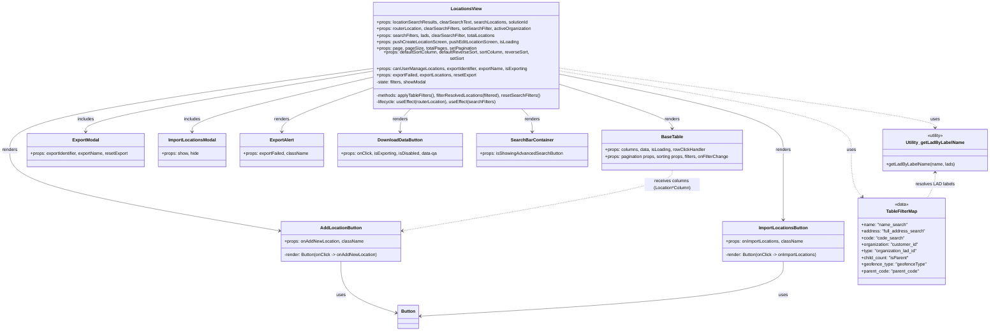

# Diagram: web/portal/src/pages/administration/location-management/locations/LocationManagement.Locations.page.js

> Auto-generated by Obscura crawlers

## Mermaid

> SVG rendering failed for this diagram.
