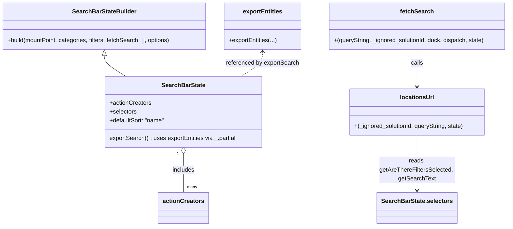

# Diagram: web/portal/src/pages/administration/location-management/locations/redux/Location.SearchBar.state.js


> Auto-generated by Obscura crawlers

## Diagram 1

```mermaid
flowchart TD
    A[User/SearchBarState action] -->|calls| B[SearchBarState.fetchSearch]
    B --> C{build queryString}
    C --> D[locationsUrl(_ignored_solutionId, queryString, state)]
    D --> E{checks state}
    E -->|hasFilter or searchText| F[append includeChildLocations=true]
    E -->|else| G[leave queryString]
    F --> H[/apiUrl("/location/locations?verbose=false&{queryString}")/]
    G --> H
    H --> I[duck.fetch(url)]
    I --> J[dispatch(duck.fetch(url))]
    J --> K[network request -> location search results]
```

> SVG rendering failed for this diagram.

## Diagram 2



### SVG

<svg id="container" width="1388.173828125" xmlns="http://www.w3.org/2000/svg" class="classDiagram" height="614" viewBox="0 0 1388.173828125 614" role="graphics-document document" aria-roledescription="class"><style>#container{font-family:"trebuchet ms",verdana,arial,sans-serif;font-size:16px;fill:#333;}@keyframes edge-animation-frame{from{stroke-dashoffset:0;}}@keyframes dash{to{stroke-dashoffset:0;}}#container .edge-animation-slow{stroke-dasharray:9,5!important;stroke-dashoffset:900;animation:dash 50s linear infinite;stroke-linecap:round;}#container .edge-animation-fast{stroke-dasharray:9,5!important;stroke-dashoffset:900;animation:dash 20s linear infinite;stroke-linecap:round;}#container .error-icon{fill:#552222;}#container .error-text{fill:#552222;stroke:#552222;}#container .edge-thickness-normal{stroke-width:1px;}#container .edge-thickness-thick{stroke-width:3.5px;}#container .edge-pattern-solid{stroke-dasharray:0;}#container .edge-thickness-invisible{stroke-width:0;fill:none;}#container .edge-pattern-dashed{stroke-dasharray:3;}#container .edge-pattern-dotted{stroke-dasharray:2;}#container .marker{fill:#333333;stroke:#333333;}#container .marker.cross{stroke:#333333;}#container svg{font-family:"trebuchet ms",verdana,arial,sans-serif;font-size:16px;}#container p{margin:0;}#container g.classGroup text{fill:#9370DB;stroke:none;font-family:"trebuchet ms",verdana,arial,sans-serif;font-size:10px;}#container g.classGroup text .title{font-weight:bolder;}#container .nodeLabel,#container .edgeLabel{color:#131300;}#container .edgeLabel .label rect{fill:#ECECFF;}#container .label text{fill:#131300;}#container .labelBkg{background:#ECECFF;}#container .edgeLabel .label span{background:#ECECFF;}#container .classTitle{font-weight:bolder;}#container .node rect,#container .node circle,#container .node ellipse,#container .node polygon,#container .node path{fill:#ECECFF;stroke:#9370DB;stroke-width:1px;}#container .divider{stroke:#9370DB;stroke-width:1;}#container g.clickable{cursor:pointer;}#container g.classGroup rect{fill:#ECECFF;stroke:#9370DB;}#container g.classGroup line{stroke:#9370DB;stroke-width:1;}#container .classLabel .box{stroke:none;stroke-width:0;fill:#ECECFF;opacity:0.5;}#container .classLabel .label{fill:#9370DB;font-size:10px;}#container .relation{stroke:#333333;stroke-width:1;fill:none;}#container .dashed-line{stroke-dasharray:3;}#container .dotted-line{stroke-dasharray:1 2;}#container #compositionStart,#container .composition{fill:#333333!important;stroke:#333333!important;stroke-width:1;}#container #compositionEnd,#container .composition{fill:#333333!important;stroke:#333333!important;stroke-width:1;}#container #dependencyStart,#container .dependency{fill:#333333!important;stroke:#333333!important;stroke-width:1;}#container #dependencyStart,#container .dependency{fill:#333333!important;stroke:#333333!important;stroke-width:1;}#container #extensionStart,#container .extension{fill:transparent!important;stroke:#333333!important;stroke-width:1;}#container #extensionEnd,#container .extension{fill:transparent!important;stroke:#333333!important;stroke-width:1;}#container #aggregationStart,#container .aggregation{fill:transparent!important;stroke:#333333!important;stroke-width:1;}#container #aggregationEnd,#container .aggregation{fill:transparent!important;stroke:#333333!important;stroke-width:1;}#container #lollipopStart,#container .lollipop{fill:#ECECFF!important;stroke:#333333!important;stroke-width:1;}#container #lollipopEnd,#container .lollipop{fill:#ECECFF!important;stroke:#333333!important;stroke-width:1;}#container .edgeTerminals{font-size:11px;line-height:initial;}#container .classTitleText{text-anchor:middle;font-size:18px;fill:#333;}#container .label-icon{display:inline-block;height:1em;overflow:visible;vertical-align:-0.125em;}#container .node .label-icon path{fill:currentColor;stroke:revert;stroke-width:revert;}#container :root{--mermaid-font-family:"trebuchet ms",verdana,arial,sans-serif;}</style><g><defs><marker id="container_class-aggregationStart" class="marker aggregation class" refX="18" refY="7" markerWidth="190" markerHeight="240" orient="auto"><path d="M 18,7 L9,13 L1,7 L9,1 Z"></path></marker></defs><defs><marker id="container_class-aggregationEnd" class="marker aggregation class" refX="1" refY="7" markerWidth="20" markerHeight="28" orient="auto"><path d="M 18,7 L9,13 L1,7 L9,1 Z"></path></marker></defs><defs><marker id="container_class-extensionStart" class="marker extension class" refX="18" refY="7" markerWidth="190" markerHeight="240" orient="auto"><path d="M 1,7 L18,13 V 1 Z"></path></marker></defs><defs><marker id="container_class-extensionEnd" class="marker extension class" refX="1" refY="7" markerWidth="20" markerHeight="28" orient="auto"><path d="M 1,1 V 13 L18,7 Z"></path></marker></defs><defs><marker id="container_class-compositionStart" class="marker composition class" refX="18" refY="7" markerWidth="190" markerHeight="240" orient="auto"><path d="M 18,7 L9,13 L1,7 L9,1 Z"></path></marker></defs><defs><marker id="container_class-compositionEnd" class="marker composition class" refX="1" refY="7" markerWidth="20" markerHeight="28" orient="auto"><path d="M 18,7 L9,13 L1,7 L9,1 Z"></path></marker></defs><defs><marker id="container_class-dependencyStart" class="marker dependency class" refX="6" refY="7" markerWidth="190" markerHeight="240" orient="auto"><path d="M 5,7 L9,13 L1,7 L9,1 Z"></path></marker></defs><defs><marker id="container_class-dependencyEnd" class="marker dependency class" refX="13" refY="7" markerWidth="20" markerHeight="28" orient="auto"><path d="M 18,7 L9,13 L14,7 L9,1 Z"></path></marker></defs><defs><marker id="container_class-lollipopStart" class="marker lollipop class" refX="13" refY="7" markerWidth="190" markerHeight="240" orient="auto"><circle stroke="black" fill="transparent" cx="7" cy="7" r="6"></circle></marker></defs><defs><marker id="container_class-lollipopEnd" class="marker lollipop class" refX="1" refY="7" markerWidth="190" markerHeight="240" orient="auto"><circle stroke="black" fill="transparent" cx="7" cy="7" r="6"></circle></marker></defs><g class="root"><g class="clusters"></g><g class="edgePaths"><path d="M285.934,151.25L285.934,154.542C285.934,157.833,285.934,164.417,295.94,173.875C305.947,183.333,325.961,195.667,335.968,201.833L345.975,208" id="id_SearchBarStateBuilder_SearchBarState_1" class="edge-thickness-normal edge-pattern-solid relation" style=";;;" data-edge="true" data-et="edge" data-id="id_SearchBarStateBuilder_SearchBarState_1" data-points="W3sieCI6Mjg1LjkzMzU5Mzc1LCJ5IjoxMzR9LHsieCI6Mjg1LjkzMzU5Mzc1LCJ5IjoxNzF9LHsieCI6MzQ1Ljk3NDkxNzc2MzE1NzksInkiOjIwOH1d" marker-start="url(#container_class-extensionStart)"></path><path d="M501.758,417.25L501.758,424.542C501.758,431.833,501.758,446.417,501.758,463.875C501.758,481.333,501.758,501.667,501.758,511.833L501.758,522" id="id_SearchBarState_actionCreators_2" class="edge-thickness-normal edge-pattern-solid relation" style=";;;" data-edge="true" data-et="edge" data-id="id_SearchBarState_actionCreators_2" data-points="W3sieCI6NTAxLjc1NzgxMjUsInkiOjQwMH0seyJ4Ijo1MDEuNzU3ODEyNSwieSI6NDYxfSx7IngiOjUwMS43NTc4MTI1LCJ5Ijo1MjJ9XQ==" marker-start="url(#container_class-aggregationStart)"></path><path d="M1139.264,134L1139.264,140.167C1139.264,146.333,1139.264,158.667,1139.264,175.5C1139.264,192.333,1139.264,213.667,1139.264,224.333L1139.264,235" id="id_fetchSearch_locationsUrl_3" class="edge-thickness-normal edge-pattern-solid relation" style=";;;" data-edge="true" data-et="edge" data-id="id_fetchSearch_locationsUrl_3" data-points="W3sieCI6MTEzOS4yNjM2NzE4NzUsInkiOjEzNH0seyJ4IjoxMTM5LjI2MzY3MTg3NSwieSI6MTcxfSx7IngiOjExMzkuMjYzNjcxODc1LCJ5IjoyNDF9XQ==" marker-end="url(#container_class-dependencyEnd)"></path><path d="M1139.264,367L1139.264,382.667C1139.264,398.333,1139.264,429.667,1139.264,454.5C1139.264,479.333,1139.264,497.667,1139.264,506.833L1139.264,516" id="id_locationsUrl_SearchBarState.selectors_4" class="edge-thickness-normal edge-pattern-solid relation" style=";;;" data-edge="true" data-et="edge" data-id="id_locationsUrl_SearchBarState.selectors_4" data-points="W3sieCI6MTEzOS4yNjM2NzE4NzUsInkiOjM2N30seyJ4IjoxMTM5LjI2MzY3MTg3NSwieSI6NDYxfSx7IngiOjExMzkuMjYzNjcxODc1LCJ5Ijo1MjJ9XQ==" marker-end="url(#container_class-dependencyEnd)"></path><path d="M717.582,140L717.582,145.167C717.582,150.333,717.582,160.667,707.575,172C697.568,183.333,677.554,195.667,667.548,201.833L657.541,208" id="id_exportEntities_SearchBarState_5" class="edge-thickness-normal edge-pattern-dashed relation" style=";;;" data-edge="true" data-et="edge" data-id="id_exportEntities_SearchBarState_5" data-points="W3sieCI6NzE3LjU4MjAzMTI1LCJ5IjoxMzR9LHsieCI6NzE3LjU4MjAzMTI1LCJ5IjoxNzF9LHsieCI6NjU3LjU0MDcwNzIzNjg0MjEsInkiOjIwOH1d" marker-start="url(#container_class-dependencyStart)"></path></g><g class="edgeLabels"><g class="edgeLabel"><g class="label" data-id="id_SearchBarStateBuilder_SearchBarState_1" transform="translate(0, 0)"><foreignObject width="0" height="0"><div xmlns="http://www.w3.org/1999/xhtml" class="labelBkg" style="display: table-cell; white-space: nowrap; line-height: 1.5; max-width: 200px; text-align: center;"><span class="edgeLabel"></span></div></foreignObject></g></g><g class="edgeLabel" transform="translate(501.7578125, 461)"><g class="label" data-id="id_SearchBarState_actionCreators_2" transform="translate(-30.6484375, -12)"><foreignObject width="61.296875" height="24"><div xmlns="http://www.w3.org/1999/xhtml" class="labelBkg" style="display: table-cell; white-space: nowrap; line-height: 1.5; max-width: 200px; text-align: center;"><span class="edgeLabel"><p>includes</p></span></div></foreignObject></g></g><g class="edgeLabel" transform="translate(1139.263671875, 171)"><g class="label" data-id="id_fetchSearch_locationsUrl_3" transform="translate(-16.4453125, -12)"><foreignObject width="32.890625" height="24"><div xmlns="http://www.w3.org/1999/xhtml" class="labelBkg" style="display: table-cell; white-space: nowrap; line-height: 1.5; max-width: 200px; text-align: center;"><span class="edgeLabel"><p>calls</p></span></div></foreignObject></g></g><g class="edgeLabel" transform="translate(1139.263671875, 461)"><g class="label" data-id="id_locationsUrl_SearchBarState.selectors_4" transform="translate(-100.703125, -36)"><foreignObject width="201.40625" height="72"><div xmlns="http://www.w3.org/1999/xhtml" class="labelBkg" style="display: table; white-space: break-spaces; line-height: 1.5; max-width: 200px; text-align: center; width: 200px;"><span class="edgeLabel"><p>reads getAreThereFiltersSelected, getSearchText</p></span></div></foreignObject></g></g><g class="edgeLabel" transform="translate(717.58203125, 171)"><g class="label" data-id="id_exportEntities_SearchBarState_5" transform="translate(-99.6953125, -12)"><foreignObject width="199.390625" height="24"><div xmlns="http://www.w3.org/1999/xhtml" class="labelBkg" style="display: table-cell; white-space: nowrap; line-height: 1.5; max-width: 200px; text-align: center;"><span class="edgeLabel"><p>referenced by exportSearch</p></span></div></foreignObject></g></g><g class="edgeTerminals" transform="translate(486.7578112500001, 417.4999989285714)"><g class="inner" transform="translate(0, 0)"><foreignObject style="width: 9px; height: 12px;"><div xmlns="http://www.w3.org/1999/xhtml" style="display: inline-block; padding-right: 1px; white-space: nowrap;"><span class="edgeLabel">1</span></div></foreignObject></g></g><g class="edgeTerminals" transform="translate(511.75781125000003, 499.4999989285714)"><g class="inner" transform="translate(0, 0)"></g><foreignObject style="width: 36px; height: 12px;"><div xmlns="http://www.w3.org/1999/xhtml" style="display: inline-block; padding-right: 1px; white-space: nowrap;"><span class="edgeLabel">many</span></div></foreignObject></g></g><g class="nodes"><g class="node default" id="classId-SearchBarState-0" transform="translate(501.7578125, 304)"><g class="basic label-container"><path d="M-213.73046875 -96 L213.73046875 -96 L213.73046875 96 L-213.73046875 96" stroke="none" stroke-width="0" fill="#ECECFF" style=""></path><path d="M-213.73046875 -96 C-66.02858659032117 -96, 81.67329556935766 -96, 213.73046875 -96 M-213.73046875 -96 C-89.87634688107248 -96, 33.97777498785504 -96, 213.73046875 -96 M213.73046875 -96 C213.73046875 -42.5291426598958, 213.73046875 10.941714680208406, 213.73046875 96 M213.73046875 -96 C213.73046875 -33.70641986275652, 213.73046875 28.587160274486962, 213.73046875 96 M213.73046875 96 C88.4163231016309 96, -36.89782254673821 96, -213.73046875 96 M213.73046875 96 C120.73323129332994 96, 27.735993836659873 96, -213.73046875 96 M-213.73046875 96 C-213.73046875 22.383913379079104, -213.73046875 -51.23217324184179, -213.73046875 -96 M-213.73046875 96 C-213.73046875 26.751634407611732, -213.73046875 -42.496731184776536, -213.73046875 -96" stroke="#9370DB" stroke-width="1.3" fill="none" stroke-dasharray="0 0" style=""></path></g><g class="annotation-group text" transform="translate(0, -72)"></g><g class="label-group text" transform="translate(-56.5546875, -72)"><g class="label" style="font-weight: bolder" transform="translate(0,-12)"><foreignObject width="113.109375" height="24"><div xmlns="http://www.w3.org/1999/xhtml" style="display: table-cell; white-space: nowrap; line-height: 1.5; max-width: 161px; text-align: center;"><span class="nodeLabel markdown-node-label" style=""><p>SearchBarState</p></span></div></foreignObject></g></g><g class="members-group text" transform="translate(-201.73046875, -24)"><g class="label" style="" transform="translate(0,-12)"><foreignObject width="113.078125" height="24"><div xmlns="http://www.w3.org/1999/xhtml" style="display: table-cell; white-space: nowrap; line-height: 1.5; max-width: 170px; text-align: center;"><span class="nodeLabel markdown-node-label" style=""><p>+actionCreators</p></span></div></foreignObject></g><g class="label" style="" transform="translate(0,12)"><foreignObject width="73.453125" height="24"><div xmlns="http://www.w3.org/1999/xhtml" style="display: table-cell; white-space: nowrap; line-height: 1.5; max-width: 131px; text-align: center;"><span class="nodeLabel markdown-node-label" style=""><p>+selectors</p></span></div></foreignObject></g><g class="label" style="" transform="translate(0,36)"><foreignObject width="151.046875" height="24"><div xmlns="http://www.w3.org/1999/xhtml" style="display: table-cell; white-space: nowrap; line-height: 1.5; max-width: 208px; text-align: center;"><span class="nodeLabel markdown-node-label" style=""><p>+defaultSort: "name"</p></span></div></foreignObject></g></g><g class="methods-group text" transform="translate(-201.73046875, 72)"><g class="label" style="" transform="translate(0,-12)"><foreignObject width="346.90625" height="24"><div xmlns="http://www.w3.org/1999/xhtml" style="display: table-cell; white-space: nowrap; line-height: 1.5; max-width: 397px; text-align: center;"><span class="nodeLabel markdown-node-label" style=""><p>exportSearch() : uses exportEntities via _.partial</p></span></div></foreignObject></g></g><g class="divider" style=""><path d="M-213.73046875 -48 C-99.68557447735117 -48, 14.359319795297665 -48, 213.73046875 -48 M-213.73046875 -48 C-51.61957058078241 -48, 110.49132758843518 -48, 213.73046875 -48" stroke="#9370DB" stroke-width="1.3" fill="none" stroke-dasharray="0 0" style=""></path></g><g class="divider" style=""><path d="M-213.73046875 48 C-107.80540367539194 48, -1.8803386007838867 48, 213.73046875 48 M-213.73046875 48 C-72.44516185799688 48, 68.84014503400624 48, 213.73046875 48" stroke="#9370DB" stroke-width="1.3" fill="none" stroke-dasharray="0 0" style=""></path></g></g><g class="node default" id="classId-SearchBarStateBuilder-1" transform="translate(285.93359375, 71)"><g class="basic label-container"><path d="M-277.93359375 -63 L277.93359375 -63 L277.93359375 63 L-277.93359375 63" stroke="none" stroke-width="0" fill="#ECECFF" style=""></path><path d="M-277.93359375 -63 C-72.87800822930535 -63, 132.1775772913893 -63, 277.93359375 -63 M-277.93359375 -63 C-97.30446645047286 -63, 83.32466084905428 -63, 277.93359375 -63 M277.93359375 -63 C277.93359375 -22.14293270238116, 277.93359375 18.71413459523768, 277.93359375 63 M277.93359375 -63 C277.93359375 -16.14860137744929, 277.93359375 30.702797245101422, 277.93359375 63 M277.93359375 63 C79.73987273236503 63, -118.45384828526994 63, -277.93359375 63 M277.93359375 63 C85.52089729823217 63, -106.89179915353566 63, -277.93359375 63 M-277.93359375 63 C-277.93359375 25.613924438472182, -277.93359375 -11.772151123055636, -277.93359375 -63 M-277.93359375 63 C-277.93359375 12.931748573818403, -277.93359375 -37.13650285236319, -277.93359375 -63" stroke="#9370DB" stroke-width="1.3" fill="none" stroke-dasharray="0 0" style=""></path></g><g class="annotation-group text" transform="translate(0, -39)"></g><g class="label-group text" transform="translate(-83.0859375, -39)"><g class="label" style="font-weight: bolder" transform="translate(0,-12)"><foreignObject width="166.171875" height="24"><div xmlns="http://www.w3.org/1999/xhtml" style="display: table-cell; white-space: nowrap; line-height: 1.5; max-width: 214px; text-align: center;"><span class="nodeLabel markdown-node-label" style=""><p>SearchBarStateBuilder</p></span></div></foreignObject></g></g><g class="members-group text" transform="translate(-265.93359375, 9)"></g><g class="methods-group text" transform="translate(-265.93359375, 39)"><g class="label" style="" transform="translate(0,-12)"><foreignObject width="448.78125" height="24"><div xmlns="http://www.w3.org/1999/xhtml" style="display: table-cell; white-space: nowrap; line-height: 1.5; max-width: 506px; text-align: center;"><span class="nodeLabel markdown-node-label" style=""><p>+build(mountPoint, categories, filters, fetchSearch, [], options)</p></span></div></foreignObject></g></g><g class="divider" style=""><path d="M-277.93359375 -15 C-135.22006949353872 -15, 7.493454762922568 -15, 277.93359375 -15 M-277.93359375 -15 C-73.94282307253897 -15, 130.04794760492206 -15, 277.93359375 -15" stroke="#9370DB" stroke-width="1.3" fill="none" stroke-dasharray="0 0" style=""></path></g><g class="divider" style=""><path d="M-277.93359375 9 C-79.13870995754638 9, 119.65617383490724 9, 277.93359375 9 M-277.93359375 9 C-105.61760432617712 9, 66.69838509764577 9, 277.93359375 9" stroke="#9370DB" stroke-width="1.3" fill="none" stroke-dasharray="0 0" style=""></path></g></g><g class="node default" id="classId-locationsUrl-2" transform="translate(1139.263671875, 304)"><g class="basic label-container"><path d="M-185.0078125 -63 L185.0078125 -63 L185.0078125 63 L-185.0078125 63" stroke="none" stroke-width="0" fill="#ECECFF" style=""></path><path d="M-185.0078125 -63 C-99.96218888885976 -63, -14.916565277719513 -63, 185.0078125 -63 M-185.0078125 -63 C-104.16742063345066 -63, -23.32702876690132 -63, 185.0078125 -63 M185.0078125 -63 C185.0078125 -28.879250619032796, 185.0078125 5.241498761934409, 185.0078125 63 M185.0078125 -63 C185.0078125 -17.18056026406579, 185.0078125 28.63887947186842, 185.0078125 63 M185.0078125 63 C106.88383942142094 63, 28.75986634284189 63, -185.0078125 63 M185.0078125 63 C88.56087147256488 63, -7.886069554870232 63, -185.0078125 63 M-185.0078125 63 C-185.0078125 15.169906428667474, -185.0078125 -32.66018714266505, -185.0078125 -63 M-185.0078125 63 C-185.0078125 24.144661889120172, -185.0078125 -14.710676221759655, -185.0078125 -63" stroke="#9370DB" stroke-width="1.3" fill="none" stroke-dasharray="0 0" style=""></path></g><g class="annotation-group text" transform="translate(0, -39)"></g><g class="label-group text" transform="translate(-44.4375, -39)"><g class="label" style="font-weight: bolder" transform="translate(0,-12)"><foreignObject width="88.875" height="24"><div xmlns="http://www.w3.org/1999/xhtml" style="display: table-cell; white-space: nowrap; line-height: 1.5; max-width: 138px; text-align: center;"><span class="nodeLabel markdown-node-label" style=""><p>locationsUrl</p></span></div></foreignObject></g></g><g class="members-group text" transform="translate(-173.0078125, 9)"></g><g class="methods-group text" transform="translate(-173.0078125, 39)"><g class="label" style="" transform="translate(0,-12)"><foreignObject width="301.578125" height="24"><div xmlns="http://www.w3.org/1999/xhtml" style="display: table-cell; white-space: nowrap; line-height: 1.5; max-width: 352px; text-align: center;"><span class="nodeLabel markdown-node-label" style=""><p>+(_ignored_solutionId, queryString, state)</p></span></div></foreignObject></g></g><g class="divider" style=""><path d="M-185.0078125 -15 C-58.94057444531799 -15, 67.12666360936402 -15, 185.0078125 -15 M-185.0078125 -15 C-96.17112637243858 -15, -7.3344402448771575 -15, 185.0078125 -15" stroke="#9370DB" stroke-width="1.3" fill="none" stroke-dasharray="0 0" style=""></path></g><g class="divider" style=""><path d="M-185.0078125 9 C-63.821861468481984 9, 57.36408956303603 9, 185.0078125 9 M-185.0078125 9 C-59.05825012163888 9, 66.89131225672224 9, 185.0078125 9" stroke="#9370DB" stroke-width="1.3" fill="none" stroke-dasharray="0 0" style=""></path></g></g><g class="node default" id="classId-fetchSearch-3" transform="translate(1139.263671875, 71)"><g class="basic label-container"><path d="M-240.91015625 -63 L240.91015625 -63 L240.91015625 63 L-240.91015625 63" stroke="none" stroke-width="0" fill="#ECECFF" style=""></path><path d="M-240.91015625 -63 C-49.6559346053437 -63, 141.5982870393126 -63, 240.91015625 -63 M-240.91015625 -63 C-55.24857496840062 -63, 130.41300631319876 -63, 240.91015625 -63 M240.91015625 -63 C240.91015625 -29.161829333447706, 240.91015625 4.676341333104588, 240.91015625 63 M240.91015625 -63 C240.91015625 -30.167986157695466, 240.91015625 2.664027684609067, 240.91015625 63 M240.91015625 63 C142.77906685385526 63, 44.64797745771051 63, -240.91015625 63 M240.91015625 63 C73.48561788000276 63, -93.93892048999447 63, -240.91015625 63 M-240.91015625 63 C-240.91015625 25.880315417002926, -240.91015625 -11.239369165994148, -240.91015625 -63 M-240.91015625 63 C-240.91015625 35.594738799101336, -240.91015625 8.189477598202672, -240.91015625 -63" stroke="#9370DB" stroke-width="1.3" fill="none" stroke-dasharray="0 0" style=""></path></g><g class="annotation-group text" transform="translate(0, -39)"></g><g class="label-group text" transform="translate(-43.2890625, -39)"><g class="label" style="font-weight: bolder" transform="translate(0,-12)"><foreignObject width="86.578125" height="24"><div xmlns="http://www.w3.org/1999/xhtml" style="display: table-cell; white-space: nowrap; line-height: 1.5; max-width: 135px; text-align: center;"><span class="nodeLabel markdown-node-label" style=""><p>fetchSearch</p></span></div></foreignObject></g></g><g class="members-group text" transform="translate(-228.91015625, 9)"></g><g class="methods-group text" transform="translate(-228.91015625, 39)"><g class="label" style="" transform="translate(0,-12)"><foreignObject width="414.53125" height="24"><div xmlns="http://www.w3.org/1999/xhtml" style="display: table-cell; white-space: nowrap; line-height: 1.5; max-width: 465px; text-align: center;"><span class="nodeLabel markdown-node-label" style=""><p>+(queryString, _ignored_solutionId, duck, dispatch, state)</p></span></div></foreignObject></g></g><g class="divider" style=""><path d="M-240.91015625 -15 C-106.86983119790705 -15, 27.170493854185906 -15, 240.91015625 -15 M-240.91015625 -15 C-109.00139474790905 -15, 22.907366754181908 -15, 240.91015625 -15" stroke="#9370DB" stroke-width="1.3" fill="none" stroke-dasharray="0 0" style=""></path></g><g class="divider" style=""><path d="M-240.91015625 9 C-95.46181781114669 9, 49.986520627706625 9, 240.91015625 9 M-240.91015625 9 C-122.52259425240818 9, -4.135032254816366 9, 240.91015625 9" stroke="#9370DB" stroke-width="1.3" fill="none" stroke-dasharray="0 0" style=""></path></g></g><g class="node default" id="classId-exportEntities-4" transform="translate(717.58203125, 71)"><g class="basic label-container"><path d="M-103.71484375 -63 L103.71484375 -63 L103.71484375 63 L-103.71484375 63" stroke="none" stroke-width="0" fill="#ECECFF" style=""></path><path d="M-103.71484375 -63 C-43.3830851129836 -63, 16.9486735240328 -63, 103.71484375 -63 M-103.71484375 -63 C-49.19894991707647 -63, 5.316943915847062 -63, 103.71484375 -63 M103.71484375 -63 C103.71484375 -24.17883446164094, 103.71484375 14.642331076718122, 103.71484375 63 M103.71484375 -63 C103.71484375 -30.678687769396397, 103.71484375 1.6426244612072054, 103.71484375 63 M103.71484375 63 C43.57495460092944 63, -16.564934548141125 63, -103.71484375 63 M103.71484375 63 C20.877227168712352 63, -61.960389412575296 63, -103.71484375 63 M-103.71484375 63 C-103.71484375 13.820346776497118, -103.71484375 -35.359306447005764, -103.71484375 -63 M-103.71484375 63 C-103.71484375 14.20794561698169, -103.71484375 -34.58410876603662, -103.71484375 -63" stroke="#9370DB" stroke-width="1.3" fill="none" stroke-dasharray="0 0" style=""></path></g><g class="annotation-group text" transform="translate(0, -39)"></g><g class="label-group text" transform="translate(-51.8671875, -39)"><g class="label" style="font-weight: bolder" transform="translate(0,-12)"><foreignObject width="103.734375" height="24"><div xmlns="http://www.w3.org/1999/xhtml" style="display: table-cell; white-space: nowrap; line-height: 1.5; max-width: 152px; text-align: center;"><span class="nodeLabel markdown-node-label" style=""><p>exportEntities</p></span></div></foreignObject></g></g><g class="members-group text" transform="translate(-91.71484375, 9)"></g><g class="methods-group text" transform="translate(-91.71484375, 39)"><g class="label" style="" transform="translate(0,-12)"><foreignObject width="131.5625" height="24"><div xmlns="http://www.w3.org/1999/xhtml" style="display: table-cell; white-space: nowrap; line-height: 1.5; max-width: 189px; text-align: center;"><span class="nodeLabel markdown-node-label" style=""><p>+exportEntities(...)</p></span></div></foreignObject></g></g><g class="divider" style=""><path d="M-103.71484375 -15 C-39.54680152418392 -15, 24.62124070163216 -15, 103.71484375 -15 M-103.71484375 -15 C-21.932180945986474 -15, 59.85048185802705 -15, 103.71484375 -15" stroke="#9370DB" stroke-width="1.3" fill="none" stroke-dasharray="0 0" style=""></path></g><g class="divider" style=""><path d="M-103.71484375 9 C-25.77852289636084 9, 52.15779795727832 9, 103.71484375 9 M-103.71484375 9 C-29.071965807208485 9, 45.57091213558303 9, 103.71484375 9" stroke="#9370DB" stroke-width="1.3" fill="none" stroke-dasharray="0 0" style=""></path></g></g><g class="node default" id="classId-actionCreators-5" transform="translate(501.7578125, 564)"><g class="basic label-container"><path d="M-65.6328125 -42 L65.6328125 -42 L65.6328125 42 L-65.6328125 42" stroke="none" stroke-width="0" fill="#ECECFF" style=""></path><path d="M-65.6328125 -42 C-14.179619405722946 -42, 37.27357368855411 -42, 65.6328125 -42 M-65.6328125 -42 C-30.12708375386017 -42, 5.378644992279661 -42, 65.6328125 -42 M65.6328125 -42 C65.6328125 -16.259204688464134, 65.6328125 9.481590623071732, 65.6328125 42 M65.6328125 -42 C65.6328125 -20.95401466469626, 65.6328125 0.09197067060748054, 65.6328125 42 M65.6328125 42 C21.663531304129123 42, -22.305749891741755 42, -65.6328125 42 M65.6328125 42 C18.000178657491453 42, -29.632455185017093 42, -65.6328125 42 M-65.6328125 42 C-65.6328125 11.424871809788076, -65.6328125 -19.150256380423848, -65.6328125 -42 M-65.6328125 42 C-65.6328125 12.102167667703277, -65.6328125 -17.795664664593446, -65.6328125 -42" stroke="#9370DB" stroke-width="1.3" fill="none" stroke-dasharray="0 0" style=""></path></g><g class="annotation-group text" transform="translate(0, -18)"></g><g class="label-group text" transform="translate(-53.6328125, -18)"><g class="label" style="font-weight: bolder" transform="translate(0,-12)"><foreignObject width="107.265625" height="24"><div xmlns="http://www.w3.org/1999/xhtml" style="display: table-cell; white-space: nowrap; line-height: 1.5; max-width: 155px; text-align: center;"><span class="nodeLabel markdown-node-label" style=""><p>actionCreators</p></span></div></foreignObject></g></g><g class="members-group text" transform="translate(-53.6328125, 30)"></g><g class="methods-group text" transform="translate(-53.6328125, 60)"></g><g class="divider" style=""><path d="M-65.6328125 6 C-34.21327053255877 6, -2.79372856511754 6, 65.6328125 6 M-65.6328125 6 C-13.170543972468188 6, 39.291724555063624 6, 65.6328125 6" stroke="#9370DB" stroke-width="1.3" fill="none" stroke-dasharray="0 0" style=""></path></g><g class="divider" style=""><path d="M-65.6328125 24 C-18.219953578926194 24, 29.19290534214761 24, 65.6328125 24 M-65.6328125 24 C-26.58382267213822 24, 12.465167155723563 24, 65.6328125 24" stroke="#9370DB" stroke-width="1.3" fill="none" stroke-dasharray="0 0" style=""></path></g></g><g class="node default" id="classId-SearchBarState.selectors-6" transform="translate(1139.263671875, 564)"><g class="basic label-container"><path d="M-103.9140625 -42 L103.9140625 -42 L103.9140625 42 L-103.9140625 42" stroke="none" stroke-width="0" fill="#ECECFF" style=""></path><path d="M-103.9140625 -42 C-48.677028090833495 -42, 6.560006318333009 -42, 103.9140625 -42 M-103.9140625 -42 C-35.918592294871615 -42, 32.07687791025677 -42, 103.9140625 -42 M103.9140625 -42 C103.9140625 -18.879066403457514, 103.9140625 4.241867193084971, 103.9140625 42 M103.9140625 -42 C103.9140625 -9.751672940517459, 103.9140625 22.496654118965083, 103.9140625 42 M103.9140625 42 C47.25889025854571 42, -9.396281982908576 42, -103.9140625 42 M103.9140625 42 C43.69931158727908 42, -16.515439325441847 42, -103.9140625 42 M-103.9140625 42 C-103.9140625 24.578250736878545, -103.9140625 7.156501473757089, -103.9140625 -42 M-103.9140625 42 C-103.9140625 11.862134413560543, -103.9140625 -18.275731172878913, -103.9140625 -42" stroke="#9370DB" stroke-width="1.3" fill="none" stroke-dasharray="0 0" style=""></path></g><g class="annotation-group text" transform="translate(0, -18)"></g><g class="label-group text" transform="translate(-91.9140625, -18)"><g class="label" style="font-weight: bolder" transform="translate(0,-12)"><foreignObject width="183.828125" height="24"><div xmlns="http://www.w3.org/1999/xhtml" style="display: table-cell; white-space: nowrap; line-height: 1.5; max-width: 230px; text-align: center;"><span class="nodeLabel markdown-node-label" style=""><p>SearchBarState.selectors</p></span></div></foreignObject></g></g><g class="members-group text" transform="translate(-91.9140625, 30)"></g><g class="methods-group text" transform="translate(-91.9140625, 60)"></g><g class="divider" style=""><path d="M-103.9140625 6 C-51.02611191282066 6, 1.8618386743586797 6, 103.9140625 6 M-103.9140625 6 C-30.722781428902678 6, 42.468499642194644 6, 103.9140625 6" stroke="#9370DB" stroke-width="1.3" fill="none" stroke-dasharray="0 0" style=""></path></g><g class="divider" style=""><path d="M-103.9140625 24 C-40.783575572891536 24, 22.346911354216928 24, 103.9140625 24 M-103.9140625 24 C-25.869142207506016 24, 52.17577808498797 24, 103.9140625 24" stroke="#9370DB" stroke-width="1.3" fill="none" stroke-dasharray="0 0" style=""></path></g></g></g></g></g></svg>

## Diagram 3

```mermaid
flowchart LR
    subgraph constants
        SC[SEARCH_CATEGORIES]
        FL[FILTERS]
        MP[STORE_MOUNT_POINT = "fvLocationsSearch"]
    end
    subgraph utils
        LB[buildSearchBarState]
        AU[apiUrl]
        LD[lodash (_.partial)]
    end
    MP --> LB
    SC --> LB
    FL --> LB
    LB --> SearchBarState
    SearchBarState -->|uses| fetchSearch
    fetchSearch --> locationsUrl
    locationsUrl --> AU
    SearchBarState.actionCreators -->|exportSearch uses| LD
    LD --> exportEntities
```

> SVG rendering failed for this diagram.
