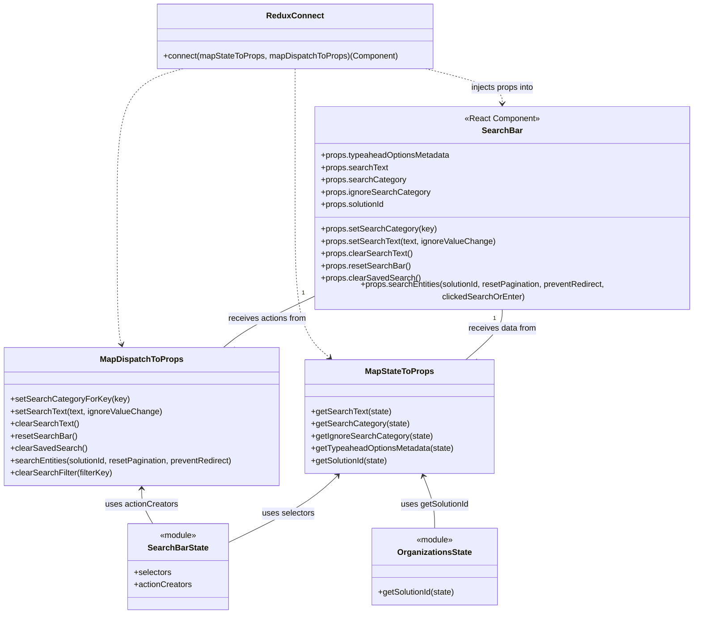

# Diagram: web/portal/src/pages/administration/location-management/locations/search/LocationSearchBarContainer.js


> Auto-generated by Obscura crawlers

## Diagram 1

```mermaid
flowchart LR
  subgraph Selectors
    S_getSearchText[getSearchText]
    S_getSearchCategory[getSearchCategory]
    S_getIgnoreSearchCategory[getIgnoreSearchCategory]
    S_getTypeahead[getTypeaheadOptionsMetadata]
  end

  subgraph ActionCreators
    A_setSearchCategoryForKey[setSearchCategoryForKey]
    A_setSearchText[setSearchText]
    A_clearSearchText[clearSearchText]
    A_resetSearchBar[resetSearchBar]
    A_clearSavedSearch[clearSavedSearch]
    A_searchEntities[searchEntities]
    A_clearSearchFilter[clearSearchFilter]
  end

  Organizations[getSolutionId]

  Selectors -->|calls| mapStateToProps
  Organizations -->|calls| mapStateToProps

  ActionCreators -->|wrapped by| mapDispatchToProps

  mapStateToProps[mapStateToProps(state)]
  mapDispatchToProps[mapDispatchToProps(dispatch)]

  mapStateToProps -->|provides props| Connect[connect]
  mapDispatchToProps -->|provides props| Connect

  Connect -->|injects props into| SearchBarComponent[SearchBar]

  A_searchEntities -->|used in| mapDispatchToProps
  A_clearSearchFilter -->|conditionally dispatched| mapDispatchToProps

  style Connect fill:#f9f,stroke:#333,stroke-width:2px
  style SearchBarComponent fill:#bbf,stroke:#333,stroke-width:1px
```

> SVG rendering failed for this diagram.

## Diagram 2



### SVG

<svg id="container" width="1367.314453125" xmlns="http://www.w3.org/2000/svg" class="classDiagram" height="1186" viewBox="0 0 1367.314453125 1186" role="graphics-document document" aria-roledescription="class"><style>#container{font-family:"trebuchet ms",verdana,arial,sans-serif;font-size:16px;fill:#333;}@keyframes edge-animation-frame{from{stroke-dashoffset:0;}}@keyframes dash{to{stroke-dashoffset:0;}}#container .edge-animation-slow{stroke-dasharray:9,5!important;stroke-dashoffset:900;animation:dash 50s linear infinite;stroke-linecap:round;}#container .edge-animation-fast{stroke-dasharray:9,5!important;stroke-dashoffset:900;animation:dash 20s linear infinite;stroke-linecap:round;}#container .error-icon{fill:#552222;}#container .error-text{fill:#552222;stroke:#552222;}#container .edge-thickness-normal{stroke-width:1px;}#container .edge-thickness-thick{stroke-width:3.5px;}#container .edge-pattern-solid{stroke-dasharray:0;}#container .edge-thickness-invisible{stroke-width:0;fill:none;}#container .edge-pattern-dashed{stroke-dasharray:3;}#container .edge-pattern-dotted{stroke-dasharray:2;}#container .marker{fill:#333333;stroke:#333333;}#container .marker.cross{stroke:#333333;}#container svg{font-family:"trebuchet ms",verdana,arial,sans-serif;font-size:16px;}#container p{margin:0;}#container g.classGroup text{fill:#9370DB;stroke:none;font-family:"trebuchet ms",verdana,arial,sans-serif;font-size:10px;}#container g.classGroup text .title{font-weight:bolder;}#container .nodeLabel,#container .edgeLabel{color:#131300;}#container .edgeLabel .label rect{fill:#ECECFF;}#container .label text{fill:#131300;}#container .labelBkg{background:#ECECFF;}#container .edgeLabel .label span{background:#ECECFF;}#container .classTitle{font-weight:bolder;}#container .node rect,#container .node circle,#container .node ellipse,#container .node polygon,#container .node path{fill:#ECECFF;stroke:#9370DB;stroke-width:1px;}#container .divider{stroke:#9370DB;stroke-width:1;}#container g.clickable{cursor:pointer;}#container g.classGroup rect{fill:#ECECFF;stroke:#9370DB;}#container g.classGroup line{stroke:#9370DB;stroke-width:1;}#container .classLabel .box{stroke:none;stroke-width:0;fill:#ECECFF;opacity:0.5;}#container .classLabel .label{fill:#9370DB;font-size:10px;}#container .relation{stroke:#333333;stroke-width:1;fill:none;}#container .dashed-line{stroke-dasharray:3;}#container .dotted-line{stroke-dasharray:1 2;}#container #compositionStart,#container .composition{fill:#333333!important;stroke:#333333!important;stroke-width:1;}#container #compositionEnd,#container .composition{fill:#333333!important;stroke:#333333!important;stroke-width:1;}#container #dependencyStart,#container .dependency{fill:#333333!important;stroke:#333333!important;stroke-width:1;}#container #dependencyStart,#container .dependency{fill:#333333!important;stroke:#333333!important;stroke-width:1;}#container #extensionStart,#container .extension{fill:transparent!important;stroke:#333333!important;stroke-width:1;}#container #extensionEnd,#container .extension{fill:transparent!important;stroke:#333333!important;stroke-width:1;}#container #aggregationStart,#container .aggregation{fill:transparent!important;stroke:#333333!important;stroke-width:1;}#container #aggregationEnd,#container .aggregation{fill:transparent!important;stroke:#333333!important;stroke-width:1;}#container #lollipopStart,#container .lollipop{fill:#ECECFF!important;stroke:#333333!important;stroke-width:1;}#container #lollipopEnd,#container .lollipop{fill:#ECECFF!important;stroke:#333333!important;stroke-width:1;}#container .edgeTerminals{font-size:11px;line-height:initial;}#container .classTitleText{text-anchor:middle;font-size:18px;fill:#333;}#container .label-icon{display:inline-block;height:1em;overflow:visible;vertical-align:-0.125em;}#container .node .label-icon path{fill:currentColor;stroke:revert;stroke-width:revert;}#container :root{--mermaid-font-family:"trebuchet ms",verdana,arial,sans-serif;}</style><g><defs><marker id="container_class-aggregationStart" class="marker aggregation class" refX="18" refY="7" markerWidth="190" markerHeight="240" orient="auto"><path d="M 18,7 L9,13 L1,7 L9,1 Z"></path></marker></defs><defs><marker id="container_class-aggregationEnd" class="marker aggregation class" refX="1" refY="7" markerWidth="20" markerHeight="28" orient="auto"><path d="M 18,7 L9,13 L1,7 L9,1 Z"></path></marker></defs><defs><marker id="container_class-extensionStart" class="marker extension class" refX="18" refY="7" markerWidth="190" markerHeight="240" orient="auto"><path d="M 1,7 L18,13 V 1 Z"></path></marker></defs><defs><marker id="container_class-extensionEnd" class="marker extension class" refX="1" refY="7" markerWidth="20" markerHeight="28" orient="auto"><path d="M 1,1 V 13 L18,7 Z"></path></marker></defs><defs><marker id="container_class-compositionStart" class="marker composition class" refX="18" refY="7" markerWidth="190" markerHeight="240" orient="auto"><path d="M 18,7 L9,13 L1,7 L9,1 Z"></path></marker></defs><defs><marker id="container_class-compositionEnd" class="marker composition class" refX="1" refY="7" markerWidth="20" markerHeight="28" orient="auto"><path d="M 18,7 L9,13 L1,7 L9,1 Z"></path></marker></defs><defs><marker id="container_class-dependencyStart" class="marker dependency class" refX="6" refY="7" markerWidth="190" markerHeight="240" orient="auto"><path d="M 5,7 L9,13 L1,7 L9,1 Z"></path></marker></defs><defs><marker id="container_class-dependencyEnd" class="marker dependency class" refX="13" refY="7" markerWidth="20" markerHeight="28" orient="auto"><path d="M 18,7 L9,13 L14,7 L9,1 Z"></path></marker></defs><defs><marker id="container_class-lollipopStart" class="marker lollipop class" refX="13" refY="7" markerWidth="190" markerHeight="240" orient="auto"><circle stroke="black" fill="transparent" cx="7" cy="7" r="6"></circle></marker></defs><defs><marker id="container_class-lollipopEnd" class="marker lollipop class" refX="1" refY="7" markerWidth="190" markerHeight="240" orient="auto"><circle stroke="black" fill="transparent" cx="7" cy="7" r="6"></circle></marker></defs><g class="root"><g class="clusters"></g><g class="edgePaths"><path d="M986.67,592L986.67,598.167C986.67,604.333,986.67,616.667,974.622,633C962.575,649.333,938.479,669.667,926.432,679.833L914.384,690" id="id_SearchBar_MapStateToProps_1" class="edge-thickness-normal edge-pattern-solid relation" style=";;;" data-edge="true" data-et="edge" data-id="id_SearchBar_MapStateToProps_1" data-points="W3sieCI6OTg2LjY2OTkyMTg3NSwieSI6NTkyfSx7IngiOjk4Ni42Njk5MjE4NzUsInkiOjYyOX0seyJ4Ijo5MTQuMzg0MTE4MzY4NDU5MywieSI6NjkwfV0="></path><path d="M614.025,569.032L591.992,579.027C569.958,589.022,525.89,609.011,496.553,625.172C467.216,641.333,452.609,653.667,445.306,659.833L438.003,666" id="id_SearchBar_MapDispatchToProps_2" class="edge-thickness-normal edge-pattern-solid relation" style=";;;" data-edge="true" data-et="edge" data-id="id_SearchBar_MapDispatchToProps_2" data-points="W3sieCI6NjE0LjAyNTM5MDYyNSwieSI6NTY5LjAzMjM3MzYyNzU2NH0seyJ4Ijo0ODEuODIyMjY1NjI1LCJ5Ijo2Mjl9LHsieCI6NDM4LjAwMjgyNzQ4OTA5ODksInkiOjY2Nn1d"></path><path d="M661.614,916.132L651.634,925.61C641.654,935.088,621.693,954.044,585.798,975.95C549.904,997.856,498.075,1022.712,472.16,1035.14L446.246,1047.569" id="id_MapStateToProps_SearchBarState_3" class="edge-thickness-normal edge-pattern-solid relation" style=";;;" data-edge="true" data-et="edge" data-id="id_MapStateToProps_SearchBarState_3" data-points="W3sieCI6NjY1Ljk2NTE1MDM0NTIwMzUsInkiOjkxMn0seyJ4Ijo2MDEuNzMyNDIxODc1LCJ5Ijo5NzN9LHsieCI6NDQ2LjI0NjA5Mzc1LCJ5IjoxMDQ3LjU2ODUzNjY4MTY1ODh9XQ==" marker-start="url(#container_class-dependencyStart)"></path><path d="M278.121,942L278.121,947.167C278.121,952.333,278.121,962.667,281.755,974C285.389,985.333,292.658,997.667,296.292,1003.833L299.926,1010" id="id_MapDispatchToProps_SearchBarState_4" class="edge-thickness-normal edge-pattern-solid relation" style=";;;" data-edge="true" data-et="edge" data-id="id_MapDispatchToProps_SearchBarState_4" data-points="W3sieCI6Mjc4LjEyMTA5Mzc1LCJ5Ijo5MzZ9LHsieCI6Mjc4LjEyMTA5Mzc1LCJ5Ijo5NzN9LHsieCI6Mjk5LjkyNjIwMDkyOTc1MjA0LCJ5IjoxMDEwfV0=" marker-start="url(#container_class-dependencyStart)"></path><path d="M829.918,917.564L833.649,926.803C837.38,936.042,844.843,954.521,848.574,971.427C852.305,988.333,852.305,1003.667,852.305,1011.333L852.305,1019" id="id_MapStateToProps_OrganizationsState_5" class="edge-thickness-normal edge-pattern-solid relation" style=";;;" data-edge="true" data-et="edge" data-id="id_MapStateToProps_OrganizationsState_5" data-points="W3sieCI6ODI3LjY3MTY3MDYwMzE5NzYsInkiOjkxMn0seyJ4Ijo4NTIuMzA0Njg3NSwieSI6OTczfSx7IngiOjg1Mi4zMDQ2ODc1LCJ5IjoxMDE5fV0=" marker-start="url(#container_class-dependencyStart)"></path><path d="M835.841,134L860.98,140.167C886.118,146.333,936.394,158.667,961.532,170C986.67,181.333,986.67,191.667,986.67,196.833L986.67,202" id="id_ReduxConnect_SearchBar_6" class="edge-thickness-normal edge-pattern-dashed relation" style=";;;" data-edge="true" data-et="edge" data-id="id_ReduxConnect_SearchBar_6" data-points="W3sieCI6ODM1Ljg0MTQ0NTMxMjUsInkiOjEzNH0seyJ4Ijo5ODYuNjY5OTIxODc1LCJ5IjoxNzF9LHsieCI6OTg2LjY2OTkyMTg3NSwieSI6MjA4fV0=" marker-end="url(#container_class-dependencyEnd)"></path><path d="M579.025,134L579.025,140.167C579.025,146.333,579.025,158.667,579.025,203C579.025,247.333,579.025,323.667,579.025,400C579.025,476.333,579.025,552.667,590.309,600.355C601.592,648.043,624.159,667.087,635.442,676.609L646.726,686.13" id="id_ReduxConnect_MapStateToProps_7" class="edge-thickness-normal edge-pattern-dashed relation" style=";;;" data-edge="true" data-et="edge" data-id="id_ReduxConnect_MapStateToProps_7" data-points="W3sieCI6NTc5LjAyNTM5MDYyNSwieSI6MTM0fSx7IngiOjU3OS4wMjUzOTA2MjUsInkiOjE3MX0seyJ4Ijo1NzkuMDI1MzkwNjI1LCJ5Ijo0MDB9LHsieCI6NTc5LjAyNTM5MDYyNSwieSI6NjI5fSx7IngiOjY1MS4zMTExOTQxMzE1NDA3LCJ5Ijo2OTB9XQ==" marker-end="url(#container_class-dependencyEnd)"></path><path d="M358.837,134L337.284,140.167C315.731,146.333,272.625,158.667,251.072,203C229.52,247.333,229.52,323.667,229.52,400C229.52,476.333,229.52,552.667,230.99,596.038C232.461,639.409,235.402,649.817,236.872,655.022L238.343,660.226" id="id_ReduxConnect_MapDispatchToProps_8" class="edge-thickness-normal edge-pattern-dashed relation" style=";;;" data-edge="true" data-et="edge" data-id="id_ReduxConnect_MapDispatchToProps_8" data-points="W3sieCI6MzU4LjgzNjY5OTIxODc1LCJ5IjoxMzR9LHsieCI6MjI5LjUxOTUzMTI1LCJ5IjoxNzF9LHsieCI6MjI5LjUxOTUzMTI1LCJ5Ijo0MDB9LHsieCI6MjI5LjUxOTUzMTI1LCJ5Ijo2Mjl9LHsieCI6MjM5Ljk3NDUxODUzMTk3Njc0LCJ5Ijo2NjZ9XQ==" marker-end="url(#container_class-dependencyEnd)"></path></g><g class="edgeLabels"><g class="edgeLabel" transform="translate(986.669921875, 629)"><g class="label" data-id="id_SearchBar_MapStateToProps_1" transform="translate(-67.109375, -12)"><foreignObject width="134.21875" height="24"><div xmlns="http://www.w3.org/1999/xhtml" class="labelBkg" style="display: table-cell; white-space: nowrap; line-height: 1.5; max-width: 200px; text-align: center;"><span class="edgeLabel"><p>receives data from</p></span></div></foreignObject></g></g><g class="edgeLabel" transform="translate(521.80932, 610.86179)"><g class="label" data-id="id_SearchBar_MapDispatchToProps_2" transform="translate(-77.203125, -12)"><foreignObject width="154.40625" height="24"><div xmlns="http://www.w3.org/1999/xhtml" class="labelBkg" style="display: table-cell; white-space: nowrap; line-height: 1.5; max-width: 200px; text-align: center;"><span class="edgeLabel"><p>receives actions from</p></span></div></foreignObject></g></g><g class="edgeLabel" transform="translate(563.9253, 991.13164)"><g class="label" data-id="id_MapStateToProps_SearchBarState_3" transform="translate(-51.34375, -12)"><foreignObject width="102.6875" height="24"><div xmlns="http://www.w3.org/1999/xhtml" class="labelBkg" style="display: table-cell; white-space: nowrap; line-height: 1.5; max-width: 200px; text-align: center;"><span class="edgeLabel"><p>uses selectors</p></span></div></foreignObject></g></g><g class="edgeLabel" transform="translate(278.12109375, 973)"><g class="label" data-id="id_MapDispatchToProps_SearchBarState_4" transform="translate(-71.2734375, -12)"><foreignObject width="142.546875" height="24"><div xmlns="http://www.w3.org/1999/xhtml" class="labelBkg" style="display: table-cell; white-space: nowrap; line-height: 1.5; max-width: 200px; text-align: center;"><span class="edgeLabel"><p>uses actionCreators</p></span></div></foreignObject></g></g><g class="edgeLabel" transform="translate(852.3046875, 973)"><g class="label" data-id="id_MapStateToProps_OrganizationsState_5" transform="translate(-67.5703125, -12)"><foreignObject width="135.140625" height="24"><div xmlns="http://www.w3.org/1999/xhtml" class="labelBkg" style="display: table-cell; white-space: nowrap; line-height: 1.5; max-width: 200px; text-align: center;"><span class="edgeLabel"><p>uses getSolutionId</p></span></div></foreignObject></g></g><g class="edgeLabel" transform="translate(986.669921875, 171)"><g class="label" data-id="id_ReduxConnect_SearchBar_6" transform="translate(-63.3828125, -12)"><foreignObject width="126.765625" height="24"><div xmlns="http://www.w3.org/1999/xhtml" class="labelBkg" style="display: table-cell; white-space: nowrap; line-height: 1.5; max-width: 200px; text-align: center;"><span class="edgeLabel"><p>injects props into</p></span></div></foreignObject></g></g><g class="edgeLabel"><g class="label" data-id="id_ReduxConnect_MapStateToProps_7" transform="translate(0, 0)"><foreignObject width="0" height="0"><div xmlns="http://www.w3.org/1999/xhtml" class="labelBkg" style="display: table-cell; white-space: nowrap; line-height: 1.5; max-width: 200px; text-align: center;"><span class="edgeLabel"></span></div></foreignObject></g></g><g class="edgeLabel"><g class="label" data-id="id_ReduxConnect_MapDispatchToProps_8" transform="translate(0, 0)"><foreignObject width="0" height="0"><div xmlns="http://www.w3.org/1999/xhtml" class="labelBkg" style="display: table-cell; white-space: nowrap; line-height: 1.5; max-width: 200px; text-align: center;"><span class="edgeLabel"></span></div></foreignObject></g></g><g class="edgeTerminals" transform="translate(971.6699209375, 609.4999991964286)"><g class="inner" transform="translate(0, 0)"><foreignObject style="width: 9px; height: 12px;"><div xmlns="http://www.w3.org/1999/xhtml" style="display: inline-block; padding-right: 1px; white-space: nowrap;"><span class="edgeLabel">1</span></div></foreignObject></g></g><g class="edgeTerminals" transform="translate(591.89195826292, 562.6011141845844)"><g class="inner" transform="translate(0, 0)"><foreignObject style="width: 9px; height: 12px;"><div xmlns="http://www.w3.org/1999/xhtml" style="display: inline-block; padding-right: 1px; white-space: nowrap;"><span class="edgeLabel">1</span></div></foreignObject></g></g><g class="edgeTerminals" transform="translate(932.4322983347778, 685.1774802747535)"><g class="inner" transform="translate(0, 0)"></g><foreignObject style="width: 9px; height: 12px;"><div xmlns="http://www.w3.org/1999/xhtml" style="display: inline-block; padding-right: 1px; white-space: nowrap;"><span class="edgeLabel">1</span></div></foreignObject></g><g class="edgeTerminals" transform="translate(456.0510556446329, 661.1707309202308)"><g class="inner" transform="translate(0, 0)"></g><foreignObject style="width: 9px; height: 12px;"><div xmlns="http://www.w3.org/1999/xhtml" style="display: inline-block; padding-right: 1px; white-space: nowrap;"><span class="edgeLabel">1</span></div></foreignObject></g></g><g class="nodes"><g class="node default" id="classId-SearchBar-0" transform="translate(986.669921875, 400)"><g class="basic label-container"><path d="M-372.64453125 -192 L372.64453125 -192 L372.64453125 192 L-372.64453125 192" stroke="none" stroke-width="0" fill="#ECECFF" style=""></path><path d="M-372.64453125 -192 C-192.79033970736438 -192, -12.936148164728763 -192, 372.64453125 -192 M-372.64453125 -192 C-218.7402505956954 -192, -64.83596994139077 -192, 372.64453125 -192 M372.64453125 -192 C372.64453125 -111.55951298009728, 372.64453125 -31.119025960194563, 372.64453125 192 M372.64453125 -192 C372.64453125 -72.53013465482074, 372.64453125 46.939730690358516, 372.64453125 192 M372.64453125 192 C161.28807736082848 192, -50.06837652834304 192, -372.64453125 192 M372.64453125 192 C168.4444627647669 192, -35.75560572046618 192, -372.64453125 192 M-372.64453125 192 C-372.64453125 91.65240194367723, -372.64453125 -8.695196112645533, -372.64453125 -192 M-372.64453125 192 C-372.64453125 92.67939120246038, -372.64453125 -6.64121759507924, -372.64453125 -192" stroke="#9370DB" stroke-width="1.3" fill="none" stroke-dasharray="0 0" style=""></path></g><g class="annotation-group text" transform="translate(-73.2109375, -168)"><g class="label" style="" transform="translate(0,-12)"><foreignObject width="146.421875" height="24"><div xmlns="http://www.w3.org/1999/xhtml" style="display: table-cell; white-space: nowrap; line-height: 1.5; max-width: 196px; text-align: center;"><span class="nodeLabel markdown-node-label" style=""><p>«React Component»</p></span></div></foreignObject></g></g><g class="label-group text" transform="translate(-37.2421875, -144)"><g class="label" style="font-weight: bolder" transform="translate(0,-12)"><foreignObject width="74.484375" height="24"><div xmlns="http://www.w3.org/1999/xhtml" style="display: table-cell; white-space: nowrap; line-height: 1.5; max-width: 124px; text-align: center;"><span class="nodeLabel markdown-node-label" style=""><p>SearchBar</p></span></div></foreignObject></g></g><g class="members-group text" transform="translate(-360.64453125, -96)"><g class="label" style="" transform="translate(0,-12)"><foreignObject width="254.640625" height="24"><div xmlns="http://www.w3.org/1999/xhtml" style="display: table-cell; white-space: nowrap; line-height: 1.5; max-width: 312px; text-align: center;"><span class="nodeLabel markdown-node-label" style=""><p>+props.typeaheadOptionsMetadata</p></span></div></foreignObject></g><g class="label" style="" transform="translate(0,12)"><foreignObject width="130.375" height="24"><div xmlns="http://www.w3.org/1999/xhtml" style="display: table-cell; white-space: nowrap; line-height: 1.5; max-width: 188px; text-align: center;"><span class="nodeLabel markdown-node-label" style=""><p>+props.searchText</p></span></div></foreignObject></g><g class="label" style="" transform="translate(0,36)"><foreignObject width="164.09375" height="24"><div xmlns="http://www.w3.org/1999/xhtml" style="display: table-cell; white-space: nowrap; line-height: 1.5; max-width: 222px; text-align: center;"><span class="nodeLabel markdown-node-label" style=""><p>+props.searchCategory</p></span></div></foreignObject></g><g class="label" style="" transform="translate(0,60)"><foreignObject width="211.234375" height="24"><div xmlns="http://www.w3.org/1999/xhtml" style="display: table-cell; white-space: nowrap; line-height: 1.5; max-width: 269px; text-align: center;"><span class="nodeLabel markdown-node-label" style=""><p>+props.ignoreSearchCategory</p></span></div></foreignObject></g><g class="label" style="" transform="translate(0,84)"><foreignObject width="127.53125" height="24"><div xmlns="http://www.w3.org/1999/xhtml" style="display: table-cell; white-space: nowrap; line-height: 1.5; max-width: 185px; text-align: center;"><span class="nodeLabel markdown-node-label" style=""><p>+props.solutionId</p></span></div></foreignObject></g></g><g class="methods-group text" transform="translate(-360.64453125, 48)"><g class="label" style="" transform="translate(0,-12)"><foreignObject width="222.25" height="24"><div xmlns="http://www.w3.org/1999/xhtml" style="display: table-cell; white-space: nowrap; line-height: 1.5; max-width: 280px; text-align: center;"><span class="nodeLabel markdown-node-label" style=""><p>+props.setSearchCategory(key)</p></span></div></foreignObject></g><g class="label" style="" transform="translate(0,12)"><foreignObject width="338.28125" height="24"><div xmlns="http://www.w3.org/1999/xhtml" style="display: table-cell; white-space: nowrap; line-height: 1.5; max-width: 396px; text-align: center;"><span class="nodeLabel markdown-node-label" style=""><p>+props.setSearchText(text, ignoreValueChange)</p></span></div></foreignObject></g><g class="label" style="" transform="translate(0,36)"><foreignObject width="177.46875" height="24"><div xmlns="http://www.w3.org/1999/xhtml" style="display: table-cell; white-space: nowrap; line-height: 1.5; max-width: 235px; text-align: center;"><span class="nodeLabel markdown-node-label" style=""><p>+props.clearSearchText()</p></span></div></foreignObject></g><g class="label" style="" transform="translate(0,60)"><foreignObject width="173.421875" height="24"><div xmlns="http://www.w3.org/1999/xhtml" style="display: table-cell; white-space: nowrap; line-height: 1.5; max-width: 231px; text-align: center;"><span class="nodeLabel markdown-node-label" style=""><p>+props.resetSearchBar()</p></span></div></foreignObject></g><g class="label" style="" transform="translate(0,84)"><foreignObject width="191.234375" height="24"><div xmlns="http://www.w3.org/1999/xhtml" style="display: table-cell; white-space: nowrap; line-height: 1.5; max-width: 249px; text-align: center;"><span class="nodeLabel markdown-node-label" style=""><p>+props.clearSavedSearch()</p></span></div></foreignObject></g><g class="label" style="" transform="translate(0,108)"><foreignObject width="648.078125" height="24"><div xmlns="http://www.w3.org/1999/xhtml" style="display: table-cell; white-space: nowrap; line-height: 1.5; max-width: 705px; text-align: center;"><span class="nodeLabel markdown-node-label" style=""><p>+props.searchEntities(solutionId, resetPagination, preventRedirect, clickedSearchOrEnter)</p></span></div></foreignObject></g></g><g class="divider" style=""><path d="M-372.64453125 -120 C-152.5549868335526 -120, 67.53455758289482 -120, 372.64453125 -120 M-372.64453125 -120 C-174.56937484104967 -120, 23.50578156790067 -120, 372.64453125 -120" stroke="#9370DB" stroke-width="1.3" fill="none" stroke-dasharray="0 0" style=""></path></g><g class="divider" style=""><path d="M-372.64453125 24 C-194.68573588688784 24, -16.72694052377568 24, 372.64453125 24 M-372.64453125 24 C-153.1287879888349 24, 66.38695527233023 24, 372.64453125 24" stroke="#9370DB" stroke-width="1.3" fill="none" stroke-dasharray="0 0" style=""></path></g></g><g class="node default" id="classId-MapStateToProps-1" transform="translate(782.84765625, 801)"><g class="basic label-container"><path d="M-184.484375 -111 L184.484375 -111 L184.484375 111 L-184.484375 111" stroke="none" stroke-width="0" fill="#ECECFF" style=""></path><path d="M-184.484375 -111 C-46.212393307210846 -111, 92.05958838557831 -111, 184.484375 -111 M-184.484375 -111 C-57.56330762094228 -111, 69.35775975811544 -111, 184.484375 -111 M184.484375 -111 C184.484375 -65.5529695335193, 184.484375 -20.10593906703862, 184.484375 111 M184.484375 -111 C184.484375 -40.75108901672536, 184.484375 29.49782196654928, 184.484375 111 M184.484375 111 C73.65058215600092 111, -37.183210687998155 111, -184.484375 111 M184.484375 111 C100.63055618283681 111, 16.776737365673625 111, -184.484375 111 M-184.484375 111 C-184.484375 44.38090527517468, -184.484375 -22.238189449650633, -184.484375 -111 M-184.484375 111 C-184.484375 60.491339592232734, -184.484375 9.982679184465468, -184.484375 -111" stroke="#9370DB" stroke-width="1.3" fill="none" stroke-dasharray="0 0" style=""></path></g><g class="annotation-group text" transform="translate(0, -87)"></g><g class="label-group text" transform="translate(-64.234375, -87)"><g class="label" style="font-weight: bolder" transform="translate(0,-12)"><foreignObject width="128.46875" height="24"><div xmlns="http://www.w3.org/1999/xhtml" style="display: table-cell; white-space: nowrap; line-height: 1.5; max-width: 176px; text-align: center;"><span class="nodeLabel markdown-node-label" style=""><p>MapStateToProps</p></span></div></foreignObject></g></g><g class="members-group text" transform="translate(-172.484375, -39)"></g><g class="methods-group text" transform="translate(-172.484375, -9)"><g class="label" style="" transform="translate(0,-12)"><foreignObject width="155.21875" height="24"><div xmlns="http://www.w3.org/1999/xhtml" style="display: table-cell; white-space: nowrap; line-height: 1.5; max-width: 213px; text-align: center;"><span class="nodeLabel markdown-node-label" style=""><p>+getSearchText(state)</p></span></div></foreignObject></g><g class="label" style="" transform="translate(0,12)"><foreignObject width="188.9375" height="24"><div xmlns="http://www.w3.org/1999/xhtml" style="display: table-cell; white-space: nowrap; line-height: 1.5; max-width: 246px; text-align: center;"><span class="nodeLabel markdown-node-label" style=""><p>+getSearchCategory(state)</p></span></div></foreignObject></g><g class="label" style="" transform="translate(0,36)"><foreignObject width="235.109375" height="24"><div xmlns="http://www.w3.org/1999/xhtml" style="display: table-cell; white-space: nowrap; line-height: 1.5; max-width: 292px; text-align: center;"><span class="nodeLabel markdown-node-label" style=""><p>+getIgnoreSearchCategory(state)</p></span></div></foreignObject></g><g class="label" style="" transform="translate(0,60)"><foreignObject width="280.734375" height="24"><div xmlns="http://www.w3.org/1999/xhtml" style="display: table-cell; white-space: nowrap; line-height: 1.5; max-width: 338px; text-align: center;"><span class="nodeLabel markdown-node-label" style=""><p>+getTypeaheadOptionsMetadata(state)</p></span></div></foreignObject></g><g class="label" style="" transform="translate(0,84)"><foreignObject width="152.375" height="24"><div xmlns="http://www.w3.org/1999/xhtml" style="display: table-cell; white-space: nowrap; line-height: 1.5; max-width: 210px; text-align: center;"><span class="nodeLabel markdown-node-label" style=""><p>+getSolutionId(state)</p></span></div></foreignObject></g></g><g class="divider" style=""><path d="M-184.484375 -63 C-102.09932757708778 -63, -19.714280154175555 -63, 184.484375 -63 M-184.484375 -63 C-101.04059991768432 -63, -17.596824835368636 -63, 184.484375 -63" stroke="#9370DB" stroke-width="1.3" fill="none" stroke-dasharray="0 0" style=""></path></g><g class="divider" style=""><path d="M-184.484375 -39 C-53.38982196627549 -39, 77.70473106744902 -39, 184.484375 -39 M-184.484375 -39 C-44.579453025263604 -39, 95.32546894947279 -39, 184.484375 -39" stroke="#9370DB" stroke-width="1.3" fill="none" stroke-dasharray="0 0" style=""></path></g></g><g class="node default" id="classId-MapDispatchToProps-2" transform="translate(278.12109375, 801)"><g class="basic label-container"><path d="M-270.12109375 -135 L270.12109375 -135 L270.12109375 135 L-270.12109375 135" stroke="none" stroke-width="0" fill="#ECECFF" style=""></path><path d="M-270.12109375 -135 C-76.97955103581873 -135, 116.16199167836254 -135, 270.12109375 -135 M-270.12109375 -135 C-58.480200020969164 -135, 153.16069370806167 -135, 270.12109375 -135 M270.12109375 -135 C270.12109375 -66.69267244415876, 270.12109375 1.614655111682481, 270.12109375 135 M270.12109375 -135 C270.12109375 -73.07032051595576, 270.12109375 -11.140641031911514, 270.12109375 135 M270.12109375 135 C66.0297286467212 135, -138.0616364565576 135, -270.12109375 135 M270.12109375 135 C151.92820019813797 135, 33.735306646275916 135, -270.12109375 135 M-270.12109375 135 C-270.12109375 60.739912888053965, -270.12109375 -13.52017422389207, -270.12109375 -135 M-270.12109375 135 C-270.12109375 71.29928752104604, -270.12109375 7.598575042092094, -270.12109375 -135" stroke="#9370DB" stroke-width="1.3" fill="none" stroke-dasharray="0 0" style=""></path></g><g class="annotation-group text" transform="translate(0, -111)"></g><g class="label-group text" transform="translate(-76.7265625, -111)"><g class="label" style="font-weight: bolder" transform="translate(0,-12)"><foreignObject width="153.453125" height="24"><div xmlns="http://www.w3.org/1999/xhtml" style="display: table-cell; white-space: nowrap; line-height: 1.5; max-width: 201px; text-align: center;"><span class="nodeLabel markdown-node-label" style=""><p>MapDispatchToProps</p></span></div></foreignObject></g></g><g class="members-group text" transform="translate(-258.12109375, -63)"></g><g class="methods-group text" transform="translate(-258.12109375, -33)"><g class="label" style="" transform="translate(0,-12)"><foreignObject width="225.375" height="24"><div xmlns="http://www.w3.org/1999/xhtml" style="display: table-cell; white-space: nowrap; line-height: 1.5; max-width: 283px; text-align: center;"><span class="nodeLabel markdown-node-label" style=""><p>+setSearchCategoryForKey(key)</p></span></div></foreignObject></g><g class="label" style="" transform="translate(0,12)"><foreignObject width="292.859375" height="24"><div xmlns="http://www.w3.org/1999/xhtml" style="display: table-cell; white-space: nowrap; line-height: 1.5; max-width: 350px; text-align: center;"><span class="nodeLabel markdown-node-label" style=""><p>+setSearchText(text, ignoreValueChange)</p></span></div></foreignObject></g><g class="label" style="" transform="translate(0,36)"><foreignObject width="132.265625" height="24"><div xmlns="http://www.w3.org/1999/xhtml" style="display: table-cell; white-space: nowrap; line-height: 1.5; max-width: 190px; text-align: center;"><span class="nodeLabel markdown-node-label" style=""><p>+clearSearchText()</p></span></div></foreignObject></g><g class="label" style="" transform="translate(0,60)"><foreignObject width="128.0625" height="24"><div xmlns="http://www.w3.org/1999/xhtml" style="display: table-cell; white-space: nowrap; line-height: 1.5; max-width: 185px; text-align: center;"><span class="nodeLabel markdown-node-label" style=""><p>+resetSearchBar()</p></span></div></foreignObject></g><g class="label" style="" transform="translate(0,84)"><foreignObject width="146.046875" height="24"><div xmlns="http://www.w3.org/1999/xhtml" style="display: table-cell; white-space: nowrap; line-height: 1.5; max-width: 203px; text-align: center;"><span class="nodeLabel markdown-node-label" style=""><p>+clearSavedSearch()</p></span></div></foreignObject></g><g class="label" style="" transform="translate(0,108)"><foreignObject width="439.515625" height="24"><div xmlns="http://www.w3.org/1999/xhtml" style="display: table-cell; white-space: nowrap; line-height: 1.5; max-width: 497px; text-align: center;"><span class="nodeLabel markdown-node-label" style=""><p>+searchEntities(solutionId, resetPagination, preventRedirect)</p></span></div></foreignObject></g><g class="label" style="" transform="translate(0,132)"><foreignObject width="199.734375" height="24"><div xmlns="http://www.w3.org/1999/xhtml" style="display: table-cell; white-space: nowrap; line-height: 1.5; max-width: 257px; text-align: center;"><span class="nodeLabel markdown-node-label" style=""><p>+clearSearchFilter(filterKey)</p></span></div></foreignObject></g></g><g class="divider" style=""><path d="M-270.12109375 -87 C-140.0127248843276 -87, -9.904356018655221 -87, 270.12109375 -87 M-270.12109375 -87 C-120.24209847491838 -87, 29.636896800163242 -87, 270.12109375 -87" stroke="#9370DB" stroke-width="1.3" fill="none" stroke-dasharray="0 0" style=""></path></g><g class="divider" style=""><path d="M-270.12109375 -63 C-78.34020568416923 -63, 113.44068238166153 -63, 270.12109375 -63 M-270.12109375 -63 C-96.04669716652819 -63, 78.02769941694362 -63, 270.12109375 -63" stroke="#9370DB" stroke-width="1.3" fill="none" stroke-dasharray="0 0" style=""></path></g></g><g class="node default" id="classId-SearchBarState-3" transform="translate(349.4296875, 1094)"><g class="basic label-container"><path d="M-96.81640625 -84 L96.81640625 -84 L96.81640625 84 L-96.81640625 84" stroke="none" stroke-width="0" fill="#ECECFF" style=""></path><path d="M-96.81640625 -84 C-53.756849600453265 -84, -10.69729295090653 -84, 96.81640625 -84 M-96.81640625 -84 C-39.05649289363824 -84, 18.703420462723514 -84, 96.81640625 -84 M96.81640625 -84 C96.81640625 -30.948136680731118, 96.81640625 22.103726638537765, 96.81640625 84 M96.81640625 -84 C96.81640625 -46.33528588056217, 96.81640625 -8.670571761124336, 96.81640625 84 M96.81640625 84 C24.450493479332934 84, -47.91541929133413 84, -96.81640625 84 M96.81640625 84 C31.362661943367826 84, -34.09108236326435 84, -96.81640625 84 M-96.81640625 84 C-96.81640625 46.540675207831235, -96.81640625 9.08135041566247, -96.81640625 -84 M-96.81640625 84 C-96.81640625 44.255795609711804, -96.81640625 4.511591219423607, -96.81640625 -84" stroke="#9370DB" stroke-width="1.3" fill="none" stroke-dasharray="0 0" style=""></path></g><g class="annotation-group text" transform="translate(-36.6015625, -60)"><g class="label" style="" transform="translate(0,-12)"><foreignObject width="73.203125" height="24"><div xmlns="http://www.w3.org/1999/xhtml" style="display: table-cell; white-space: nowrap; line-height: 1.5; max-width: 123px; text-align: center;"><span class="nodeLabel markdown-node-label" style=""><p>«module»</p></span></div></foreignObject></g></g><g class="label-group text" transform="translate(-56.5546875, -36)"><g class="label" style="font-weight: bolder" transform="translate(0,-12)"><foreignObject width="113.109375" height="24"><div xmlns="http://www.w3.org/1999/xhtml" style="display: table-cell; white-space: nowrap; line-height: 1.5; max-width: 161px; text-align: center;"><span class="nodeLabel markdown-node-label" style=""><p>SearchBarState</p></span></div></foreignObject></g></g><g class="members-group text" transform="translate(-84.81640625, 12)"><g class="label" style="" transform="translate(0,-12)"><foreignObject width="73.453125" height="24"><div xmlns="http://www.w3.org/1999/xhtml" style="display: table-cell; white-space: nowrap; line-height: 1.5; max-width: 131px; text-align: center;"><span class="nodeLabel markdown-node-label" style=""><p>+selectors</p></span></div></foreignObject></g><g class="label" style="" transform="translate(0,12)"><foreignObject width="113.078125" height="24"><div xmlns="http://www.w3.org/1999/xhtml" style="display: table-cell; white-space: nowrap; line-height: 1.5; max-width: 170px; text-align: center;"><span class="nodeLabel markdown-node-label" style=""><p>+actionCreators</p></span></div></foreignObject></g></g><g class="methods-group text" transform="translate(-84.81640625, 84)"></g><g class="divider" style=""><path d="M-96.81640625 -12 C-33.99541872756297 -12, 28.82556879487406 -12, 96.81640625 -12 M-96.81640625 -12 C-36.08855099798042 -12, 24.63930425403916 -12, 96.81640625 -12" stroke="#9370DB" stroke-width="1.3" fill="none" stroke-dasharray="0 0" style=""></path></g><g class="divider" style=""><path d="M-96.81640625 60 C-54.18599008271222 60, -11.555573915424446 60, 96.81640625 60 M-96.81640625 60 C-34.966214440149955 60, 26.88397736970009 60, 96.81640625 60" stroke="#9370DB" stroke-width="1.3" fill="none" stroke-dasharray="0 0" style=""></path></g></g><g class="node default" id="classId-OrganizationsState-4" transform="translate(852.3046875, 1094)"><g class="basic label-container"><path d="M-123.12109375 -75 L123.12109375 -75 L123.12109375 75 L-123.12109375 75" stroke="none" stroke-width="0" fill="#ECECFF" style=""></path><path d="M-123.12109375 -75 C-57.2927299207593 -75, 8.535633908481401 -75, 123.12109375 -75 M-123.12109375 -75 C-48.93177465227703 -75, 25.257544445445944 -75, 123.12109375 -75 M123.12109375 -75 C123.12109375 -18.310170779362572, 123.12109375 38.379658441274856, 123.12109375 75 M123.12109375 -75 C123.12109375 -43.02455790962494, 123.12109375 -11.049115819249877, 123.12109375 75 M123.12109375 75 C72.70508300566505 75, 22.289072261330077 75, -123.12109375 75 M123.12109375 75 C45.86369127472247 75, -31.39371120055506 75, -123.12109375 75 M-123.12109375 75 C-123.12109375 34.7752627939746, -123.12109375 -5.4494744120508045, -123.12109375 -75 M-123.12109375 75 C-123.12109375 30.162531669937522, -123.12109375 -14.674936660124956, -123.12109375 -75" stroke="#9370DB" stroke-width="1.3" fill="none" stroke-dasharray="0 0" style=""></path></g><g class="annotation-group text" transform="translate(-36.6015625, -51)"><g class="label" style="" transform="translate(0,-12)"><foreignObject width="73.203125" height="24"><div xmlns="http://www.w3.org/1999/xhtml" style="display: table-cell; white-space: nowrap; line-height: 1.5; max-width: 123px; text-align: center;"><span class="nodeLabel markdown-node-label" style=""><p>«module»</p></span></div></foreignObject></g></g><g class="label-group text" transform="translate(-69.8671875, -27)"><g class="label" style="font-weight: bolder" transform="translate(0,-12)"><foreignObject width="139.734375" height="24"><div xmlns="http://www.w3.org/1999/xhtml" style="display: table-cell; white-space: nowrap; line-height: 1.5; max-width: 187px; text-align: center;"><span class="nodeLabel markdown-node-label" style=""><p>OrganizationsState</p></span></div></foreignObject></g></g><g class="members-group text" transform="translate(-111.12109375, 21)"></g><g class="methods-group text" transform="translate(-111.12109375, 51)"><g class="label" style="" transform="translate(0,-12)"><foreignObject width="152.375" height="24"><div xmlns="http://www.w3.org/1999/xhtml" style="display: table-cell; white-space: nowrap; line-height: 1.5; max-width: 210px; text-align: center;"><span class="nodeLabel markdown-node-label" style=""><p>+getSolutionId(state)</p></span></div></foreignObject></g></g><g class="divider" style=""><path d="M-123.12109375 -3 C-55.431218069822464 -3, 12.258657610355073 -3, 123.12109375 -3 M-123.12109375 -3 C-66.50140672759952 -3, -9.881719705199032 -3, 123.12109375 -3" stroke="#9370DB" stroke-width="1.3" fill="none" stroke-dasharray="0 0" style=""></path></g><g class="divider" style=""><path d="M-123.12109375 21 C-62.52196773970088 21, -1.9228417294017532 21, 123.12109375 21 M-123.12109375 21 C-44.98510468883532 21, 33.15088437232936 21, 123.12109375 21" stroke="#9370DB" stroke-width="1.3" fill="none" stroke-dasharray="0 0" style=""></path></g></g><g class="node default" id="classId-ReduxConnect-5" transform="translate(579.025390625, 71)"><g class="basic label-container"><path d="M-267.046875 -63 L267.046875 -63 L267.046875 63 L-267.046875 63" stroke="none" stroke-width="0" fill="#ECECFF" style=""></path><path d="M-267.046875 -63 C-99.24719543436888 -63, 68.55248413126225 -63, 267.046875 -63 M-267.046875 -63 C-93.97174849276132 -63, 79.10337801447736 -63, 267.046875 -63 M267.046875 -63 C267.046875 -23.234686918132148, 267.046875 16.530626163735704, 267.046875 63 M267.046875 -63 C267.046875 -20.754099500119217, 267.046875 21.491800999761566, 267.046875 63 M267.046875 63 C126.54222139446455 63, -13.962432211070904 63, -267.046875 63 M267.046875 63 C152.1554395044559 63, 37.264004008911826 63, -267.046875 63 M-267.046875 63 C-267.046875 20.41469128041087, -267.046875 -22.170617439178258, -267.046875 -63 M-267.046875 63 C-267.046875 19.462844175577978, -267.046875 -24.074311648844045, -267.046875 -63" stroke="#9370DB" stroke-width="1.3" fill="none" stroke-dasharray="0 0" style=""></path></g><g class="annotation-group text" transform="translate(0, -39)"></g><g class="label-group text" transform="translate(-52.390625, -39)"><g class="label" style="font-weight: bolder" transform="translate(0,-12)"><foreignObject width="104.78125" height="24"><div xmlns="http://www.w3.org/1999/xhtml" style="display: table-cell; white-space: nowrap; line-height: 1.5; max-width: 154px; text-align: center;"><span class="nodeLabel markdown-node-label" style=""><p>ReduxConnect</p></span></div></foreignObject></g></g><g class="members-group text" transform="translate(-255.046875, 9)"></g><g class="methods-group text" transform="translate(-255.046875, 39)"><g class="label" style="" transform="translate(0,-12)"><foreignObject width="457.703125" height="24"><div xmlns="http://www.w3.org/1999/xhtml" style="display: table-cell; white-space: nowrap; line-height: 1.5; max-width: 515px; text-align: center;"><span class="nodeLabel markdown-node-label" style=""><p>+connect(mapStateToProps, mapDispatchToProps)(Component)</p></span></div></foreignObject></g></g><g class="divider" style=""><path d="M-267.046875 -15 C-83.90378854615707 -15, 99.23929790768585 -15, 267.046875 -15 M-267.046875 -15 C-111.63776118442095 -15, 43.771352631158095 -15, 267.046875 -15" stroke="#9370DB" stroke-width="1.3" fill="none" stroke-dasharray="0 0" style=""></path></g><g class="divider" style=""><path d="M-267.046875 9 C-106.19959590440058 9, 54.64768319119884 9, 267.046875 9 M-267.046875 9 C-94.93613098174853 9, 77.17461303650293 9, 267.046875 9" stroke="#9370DB" stroke-width="1.3" fill="none" stroke-dasharray="0 0" style=""></path></g></g></g></g></g></svg>
