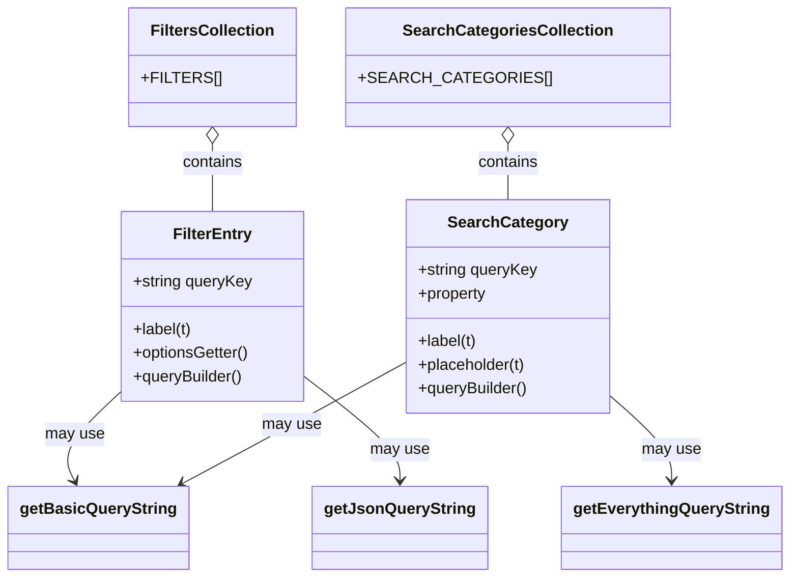

# Diagram: web/portal/src/pages/administration/location-management/locations/search/Locations.searchOptions.js

> Auto-generated by Obscura crawlers

## Mermaid

### SVG

<svg id="container" width="753.7109375" xmlns="http://www.w3.org/2000/svg" class="classDiagram" height="584" viewBox="0 0 753.7109375 584" role="graphics-document document" aria-roledescription="class"><g><defs><marker id="container_class-aggregationStart" class="marker aggregation class" refX="18" refY="7" markerWidth="190" markerHeight="240" orient="auto"><path d="M 18,7 L9,13 L1,7 L9,1 Z"></path></marker></defs><defs><marker id="container_class-aggregationEnd" class="marker aggregation class" refX="1" refY="7" markerWidth="20" markerHeight="28" orient="auto"><path d="M 18,7 L9,13 L1,7 L9,1 Z"></path></marker></defs><defs><marker id="container_class-extensionStart" class="marker extension class" refX="18" refY="7" markerWidth="190" markerHeight="240" orient="auto"><path d="M 1,7 L18,13 V 1 Z"></path></marker></defs><defs><marker id="container_class-extensionEnd" class="marker extension class" refX="1" refY="7" markerWidth="20" markerHeight="28" orient="auto"><path d="M 1,1 V 13 L18,7 Z"></path></marker></defs><defs><marker id="container_class-compositionStart" class="marker composition class" refX="18" refY="7" markerWidth="190" markerHeight="240" orient="auto"><path d="M 18,7 L9,13 L1,7 L9,1 Z"></path></marker></defs><defs><marker id="container_class-compositionEnd" class="marker composition class" refX="1" refY="7" markerWidth="20" markerHeight="28" orient="auto"><path d="M 18,7 L9,13 L1,7 L9,1 Z"></path></marker></defs><defs><marker id="container_class-dependencyStart" class="marker dependency class" refX="6" refY="7" markerWidth="190" markerHeight="240" orient="auto"><path d="M 5,7 L9,13 L1,7 L9,1 Z"></path></marker></defs><defs><marker id="container_class-dependencyEnd" class="marker dependency class" refX="13" refY="7" markerWidth="20" markerHeight="28" orient="auto"><path d="M 18,7 L9,13 L14,7 L9,1 Z"></path></marker></defs><defs><marker id="container_class-lollipopStart" class="marker lollipop class" refX="13" refY="7" markerWidth="190" markerHeight="240" orient="auto"><circle stroke="black" fill="transparent" cx="7" cy="7" r="6"></circle></marker></defs><defs><marker id="container_class-lollipopEnd" class="marker lollipop class" refX="1" refY="7" markerWidth="190" markerHeight="240" orient="auto"><circle stroke="black" fill="transparent" cx="7" cy="7" r="6"></circle></marker></defs><g class="root"><g class="clusters"></g><g class="edgePaths"><path d="M205.141,145.25L205.141,148.542C205.141,151.833,205.141,158.417,205.141,169.875C205.141,181.333,205.141,197.667,205.141,205.833L205.141,214" id="id_FiltersCollection_FilterEntry_1" class="edge-thickness-normal edge-pattern-solid relation" style=";;;" data-edge="true" data-et="edge" data-id="id_FiltersCollection_FilterEntry_1" data-points="W3sieCI6MjA1LjE0MDYyNSwieSI6MTI4fSx7IngiOjIwNS4xNDA2MjUsInkiOjE2NX0seyJ4IjoyMDUuMTQwNjI1LCJ5IjoyMTR9XQ==" marker-start="url(#container_class-aggregationStart)"></path><path d="M479.199,145.25L479.199,148.542C479.199,151.833,479.199,158.417,479.199,167.875C479.199,177.333,479.199,189.667,479.199,195.833L479.199,202" id="id_SearchCategoriesCollection_SearchCategory_2" class="edge-thickness-normal edge-pattern-solid relation" style=";;;" data-edge="true" data-et="edge" data-id="id_SearchCategoriesCollection_SearchCategory_2" data-points="W3sieCI6NDc5LjE5OTIxODc1LCJ5IjoxMjh9LHsieCI6NDc5LjE5OTIxODc1LCJ5IjoxNjV9LHsieCI6NDc5LjE5OTIxODc1LCJ5IjoyMDJ9XQ==" marker-start="url(#container_class-aggregationStart)"></path><path d="M113.496,398.534L103.755,407.945C94.013,417.356,74.53,436.178,67.452,450.863C60.374,465.548,65.701,476.096,68.365,481.37L71.029,486.644" id="id_FilterEntry_getBasicQueryString_3" class="edge-thickness-normal edge-pattern-solid relation" style=";;;" data-edge="true" data-et="edge" data-id="id_FilterEntry_getBasicQueryString_3" data-points="W3sieCI6MTEzLjQ5NjA5Mzc1LCJ5IjozOTguNTM0Mzc5NTU0NDQ1MTR9LHsieCI6NTUuMDQ2ODc1LCJ5Ijo0NTV9LHsieCI6NzMuNzMzNDg0OTY4MzU0NDMsInkiOjQ5Mn1d" marker-end="url(#container_class-dependencyEnd)"></path><path d="M296.785,385.107L310.999,396.756C325.213,408.404,353.641,431.702,367.854,448.518C382.068,465.333,382.068,475.667,382.068,480.833L382.068,486" id="id_FilterEntry_getJsonQueryString_4" class="edge-thickness-normal edge-pattern-solid relation" style=";;;" data-edge="true" data-et="edge" data-id="id_FilterEntry_getJsonQueryString_4" data-points="W3sieCI6Mjk2Ljc4NTE1NjI1LCJ5IjozODUuMTA2NjkzMDEzMzQ2M30seyJ4IjozODIuMDY4MzU5Mzc1LCJ5Ijo0NTV9LHsieCI6MzgyLjA2ODM1OTM3NSwieSI6NDkyfV0=" marker-end="url(#container_class-dependencyEnd)"></path><path d="M377.965,369.375L353.633,383.646C329.301,397.917,280.638,426.458,246.476,446.396C212.315,466.334,192.654,477.669,182.824,483.336L172.994,489.003" id="id_SearchCategory_getBasicQueryString_5" class="edge-thickness-normal edge-pattern-solid relation" style=";;;" data-edge="true" data-et="edge" data-id="id_SearchCategory_getBasicQueryString_5" data-points="W3sieCI6Mzc3Ljk2NDg0Mzc1LCJ5IjozNjkuMzc1MDkzODE0OTI5OH0seyJ4IjoyMzEuOTc0NjA5Mzc1LCJ5Ijo0NTV9LHsieCI6MTY3Ljc5NjMzMTA5MTc3MjE1LCJ5Ijo0OTJ9XQ==" marker-end="url(#container_class-dependencyEnd)"></path><path d="M580.434,401.791L590.214,410.659C599.995,419.527,619.556,437.264,629.337,451.298C639.117,465.333,639.117,475.667,639.117,480.833L639.117,486" id="id_SearchCategory_getEverythingQueryString_6" class="edge-thickness-normal edge-pattern-solid relation" style=";;;" data-edge="true" data-et="edge" data-id="id_SearchCategory_getEverythingQueryString_6" data-points="W3sieCI6NTgwLjQzMzU5Mzc1LCJ5Ijo0MDEuNzkwNzEzMDEyMDQyM30seyJ4Ijo2MzkuMTE3MTg3NSwieSI6NDU1fSx7IngiOjYzOS4xMTcxODc1LCJ5Ijo0OTJ9XQ==" marker-end="url(#container_class-dependencyEnd)"></path></g><g class="edgeLabels"><g class="edgeLabel" transform="translate(205.140625, 165)"><g class="label" data-id="id_FiltersCollection_FilterEntry_1" transform="translate(-30.890625, -12)"><foreignObject width="61.78125" height="24">

contains

</foreignObject></g></g><g class="edgeLabel" transform="translate(479.19921875, 165)"><g class="label" data-id="id_SearchCategoriesCollection_SearchCategory_2" transform="translate(-30.890625, -12)"><foreignObject width="61.78125" height="24">

contains

</foreignObject></g></g><g class="edgeLabel" transform="translate(69.36558, 441.16723)"><g class="label" data-id="id_FilterEntry_getBasicQueryString_3" transform="translate(-29.8984375, -12)"><foreignObject width="59.796875" height="24">

may use

</foreignObject></g></g><g class="edgeLabel" transform="translate(382.068359375, 455)"><g class="label" data-id="id_FilterEntry_getJsonQueryString_4" transform="translate(-29.8984375, -12)"><foreignObject width="59.796875" height="24">

may use

</foreignObject></g></g><g class="edgeLabel" transform="translate(273.01962, 430.92664)"><g class="label" data-id="id_SearchCategory_getBasicQueryString_5" transform="translate(-29.8984375, -12)"><foreignObject width="59.796875" height="24">

may use

</foreignObject></g></g><g class="edgeLabel" transform="translate(639.1171875, 455)"><g class="label" data-id="id_SearchCategory_getEverythingQueryString_6" transform="translate(-29.8984375, -12)"><foreignObject width="59.796875" height="24">

may use

</foreignObject></g></g></g><g class="nodes"><g class="node default" id="classId-getBasicQueryString-0" transform="translate(94.9453125, 534)"><g class="basic label-container"><path d="M-86.9453125 -42 L86.9453125 -42 L86.9453125 42 L-86.9453125 42" stroke="none" stroke-width="0" fill="#ECECFF" style=""></path><path d="M-86.9453125 -42 C-35.570722563368825 -42, 15.80386737326235 -42, 86.9453125 -42 M-86.9453125 -42 C-33.273773221470634 -42, 20.397766057058732 -42, 86.9453125 -42 M86.9453125 -42 C86.9453125 -24.340076539804894, 86.9453125 -6.680153079609788, 86.9453125 42 M86.9453125 -42 C86.9453125 -17.886997397703542, 86.9453125 6.226005204592916, 86.9453125 42 M86.9453125 42 C30.63899921061188 42, -25.667314078776243 42, -86.9453125 42 M86.9453125 42 C20.162885671662337 42, -46.619541156675325 42, -86.9453125 42 M-86.9453125 42 C-86.9453125 21.770550402181414, -86.9453125 1.5411008043628271, -86.9453125 -42 M-86.9453125 42 C-86.9453125 16.987186856524257, -86.9453125 -8.025626286951486, -86.9453125 -42" stroke="#9370DB" stroke-width="1.3" fill="none" stroke-dasharray="0 0" style=""></path></g><g class="annotation-group text" transform="translate(0, -18)"></g><g class="label-group text" transform="translate(-74.9453125, -18)"><g class="label" style="font-weight: bolder" transform="translate(0,-12)"><foreignObject width="149.890625" height="24">

getBasicQueryString

</foreignObject></g></g><g class="members-group text" transform="translate(-74.9453125, 30)"></g><g class="methods-group text" transform="translate(-74.9453125, 60)"></g><g class="divider" style=""><path d="M-86.9453125 6 C-22.030770470636654 6, 42.88377155872669 6, 86.9453125 6 M-86.9453125 6 C-46.77317812271367 6, -6.601043745427333 6, 86.9453125 6" stroke="#9370DB" stroke-width="1.3" fill="none" stroke-dasharray="0 0" style=""></path></g><g class="divider" style=""><path d="M-86.9453125 24 C-45.83954822556018 24, -4.733783951120358 24, 86.9453125 24 M-86.9453125 24 C-48.383028602689635 24, -9.82074470537927 24, 86.9453125 24" stroke="#9370DB" stroke-width="1.3" fill="none" stroke-dasharray="0 0" style=""></path></g></g><g class="node default" id="classId-getJsonQueryString-1" transform="translate(382.068359375, 534)"><g class="basic label-container"><path d="M-83.4453125 -42 L83.4453125 -42 L83.4453125 42 L-83.4453125 42" stroke="none" stroke-width="0" fill="#ECECFF" style=""></path><path d="M-83.4453125 -42 C-30.90506570541674 -42, 21.635181089166522 -42, 83.4453125 -42 M-83.4453125 -42 C-32.875423588255266 -42, 17.694465323489467 -42, 83.4453125 -42 M83.4453125 -42 C83.4453125 -14.175030445971409, 83.4453125 13.649939108057183, 83.4453125 42 M83.4453125 -42 C83.4453125 -11.717495917233862, 83.4453125 18.565008165532277, 83.4453125 42 M83.4453125 42 C40.217134600518655 42, -3.01104329896269 42, -83.4453125 42 M83.4453125 42 C28.150946797892402 42, -27.143418904215196 42, -83.4453125 42 M-83.4453125 42 C-83.4453125 23.298734838984917, -83.4453125 4.597469677969833, -83.4453125 -42 M-83.4453125 42 C-83.4453125 17.306142190946993, -83.4453125 -7.387715618106014, -83.4453125 -42" stroke="#9370DB" stroke-width="1.3" fill="none" stroke-dasharray="0 0" style=""></path></g><g class="annotation-group text" transform="translate(0, -18)"></g><g class="label-group text" transform="translate(-71.4453125, -18)"><g class="label" style="font-weight: bolder" transform="translate(0,-12)"><foreignObject width="142.890625" height="24">

getJsonQueryString

</foreignObject></g></g><g class="members-group text" transform="translate(-71.4453125, 30)"></g><g class="methods-group text" transform="translate(-71.4453125, 60)"></g><g class="divider" style=""><path d="M-83.4453125 6 C-49.3159954847004 6, -15.186678469400803 6, 83.4453125 6 M-83.4453125 6 C-25.781377110412095 6, 31.88255827917581 6, 83.4453125 6" stroke="#9370DB" stroke-width="1.3" fill="none" stroke-dasharray="0 0" style=""></path></g><g class="divider" style=""><path d="M-83.4453125 24 C-43.688715794598274 24, -3.932119089196547 24, 83.4453125 24 M-83.4453125 24 C-44.17982200257707 24, -4.914331505154138 24, 83.4453125 24" stroke="#9370DB" stroke-width="1.3" fill="none" stroke-dasharray="0 0" style=""></path></g></g><g class="node default" id="classId-getEverythingQueryString-2" transform="translate(639.1171875, 534)"><g class="basic label-container"><path d="M-106.59375 -42 L106.59375 -42 L106.59375 42 L-106.59375 42" stroke="none" stroke-width="0" fill="#ECECFF" style=""></path><path d="M-106.59375 -42 C-45.836731848884504 -42, 14.920286302230991 -42, 106.59375 -42 M-106.59375 -42 C-32.38739224782489 -42, 41.81896550435022 -42, 106.59375 -42 M106.59375 -42 C106.59375 -23.33210846760804, 106.59375 -4.664216935216082, 106.59375 42 M106.59375 -42 C106.59375 -11.145683316221909, 106.59375 19.708633367556182, 106.59375 42 M106.59375 42 C32.77069158727487 42, -41.052366825450264 42, -106.59375 42 M106.59375 42 C48.902307952092116 42, -8.789134095815768 42, -106.59375 42 M-106.59375 42 C-106.59375 20.591855217072652, -106.59375 -0.8162895658546958, -106.59375 -42 M-106.59375 42 C-106.59375 12.407482387680933, -106.59375 -17.185035224638135, -106.59375 -42" stroke="#9370DB" stroke-width="1.3" fill="none" stroke-dasharray="0 0" style=""></path></g><g class="annotation-group text" transform="translate(0, -18)"></g><g class="label-group text" transform="translate(-94.59375, -18)"><g class="label" style="font-weight: bolder" transform="translate(0,-12)"><foreignObject width="189.1875" height="24">

getEverythingQueryString

</foreignObject></g></g><g class="members-group text" transform="translate(-94.59375, 30)"></g><g class="methods-group text" transform="translate(-94.59375, 60)"></g><g class="divider" style=""><path d="M-106.59375 6 C-28.234296450539716 6, 50.12515709892057 6, 106.59375 6 M-106.59375 6 C-48.10841349599695 6, 10.376923008006102 6, 106.59375 6" stroke="#9370DB" stroke-width="1.3" fill="none" stroke-dasharray="0 0" style=""></path></g><g class="divider" style=""><path d="M-106.59375 24 C-49.50198704653151 24, 7.589775906936978 24, 106.59375 24 M-106.59375 24 C-35.96062209601929 24, 34.672505807961414 24, 106.59375 24" stroke="#9370DB" stroke-width="1.3" fill="none" stroke-dasharray="0 0" style=""></path></g></g><g class="node default" id="classId-FilterEntry-3" transform="translate(205.140625, 310)"><g class="basic label-container"><path d="M-91.64453125 -96 L91.64453125 -96 L91.64453125 96 L-91.64453125 96" stroke="none" stroke-width="0" fill="#ECECFF" style=""></path><path d="M-91.64453125 -96 C-44.38892919235234 -96, 2.866672865295314 -96, 91.64453125 -96 M-91.64453125 -96 C-52.561287637857376 -96, -13.478044025714752 -96, 91.64453125 -96 M91.64453125 -96 C91.64453125 -30.268498809464674, 91.64453125 35.46300238107065, 91.64453125 96 M91.64453125 -96 C91.64453125 -30.51294290806365, 91.64453125 34.9741141838727, 91.64453125 96 M91.64453125 96 C32.7811560053014 96, -26.082219239397205 96, -91.64453125 96 M91.64453125 96 C36.953391200912854 96, -17.73774884817429 96, -91.64453125 96 M-91.64453125 96 C-91.64453125 48.40053439183363, -91.64453125 0.8010687836672616, -91.64453125 -96 M-91.64453125 96 C-91.64453125 48.61904939721184, -91.64453125 1.2380987944236779, -91.64453125 -96" stroke="#9370DB" stroke-width="1.3" fill="none" stroke-dasharray="0 0" style=""></path></g><g class="annotation-group text" transform="translate(0, -72)"></g><g class="label-group text" transform="translate(-38.0546875, -72)"><g class="label" style="font-weight: bolder" transform="translate(0,-12)"><foreignObject width="76.109375" height="24">

FilterEntry

</foreignObject></g></g><g class="members-group text" transform="translate(-79.64453125, -24)"><g class="label" style="" transform="translate(0,-12)"><foreignObject width="121.234375" height="24">

+string queryKey

</foreignObject></g></g><g class="methods-group text" transform="translate(-79.64453125, 24)"><g class="label" style="" transform="translate(0,-12)"><foreignObject width="60.359375" height="24">

+label(t)

</foreignObject></g><g class="label" style="" transform="translate(0,12)"><foreignObject width="118.71875" height="24">

+optionsGetter()

</foreignObject></g><g class="label" style="" transform="translate(0,36)"><foreignObject width="112.625" height="24">

+queryBuilder()

</foreignObject></g></g><g class="divider" style=""><path d="M-91.64453125 -48 C-33.338473963095296 -48, 24.967583323809407 -48, 91.64453125 -48 M-91.64453125 -48 C-44.03437661777052 -48, 3.5757780144589617 -48, 91.64453125 -48" stroke="#9370DB" stroke-width="1.3" fill="none" stroke-dasharray="0 0" style=""></path></g><g class="divider" style=""><path d="M-91.64453125 0 C-26.975106110892554 0, 37.69431902821489 0, 91.64453125 0 M-91.64453125 0 C-33.81722110850521 0, 24.010089032989583 0, 91.64453125 0" stroke="#9370DB" stroke-width="1.3" fill="none" stroke-dasharray="0 0" style=""></path></g></g><g class="node default" id="classId-FiltersCollection-4" transform="translate(205.140625, 68)"><g class="basic label-container"><path d="M-77.984375 -60 L77.984375 -60 L77.984375 60 L-77.984375 60" stroke="none" stroke-width="0" fill="#ECECFF" style=""></path><path d="M-77.984375 -60 C-46.509908700646676 -60, -15.035442401293345 -60, 77.984375 -60 M-77.984375 -60 C-16.798557356495884 -60, 44.38726028700823 -60, 77.984375 -60 M77.984375 -60 C77.984375 -14.616019707762483, 77.984375 30.767960584475034, 77.984375 60 M77.984375 -60 C77.984375 -31.8139644321089, 77.984375 -3.6279288642178003, 77.984375 60 M77.984375 60 C45.62444146471958 60, 13.264507929439162 60, -77.984375 60 M77.984375 60 C29.522709543291377 60, -18.938955913417246 60, -77.984375 60 M-77.984375 60 C-77.984375 33.89257168367971, -77.984375 7.785143367359424, -77.984375 -60 M-77.984375 60 C-77.984375 29.87207163189403, -77.984375 -0.25585673621193905, -77.984375 -60" stroke="#9370DB" stroke-width="1.3" fill="none" stroke-dasharray="0 0" style=""></path></g><g class="annotation-group text" transform="translate(0, -36)"></g><g class="label-group text" transform="translate(-59.34375, -36)"><g class="label" style="font-weight: bolder" transform="translate(0,-12)"><foreignObject width="118.6875" height="24">

FiltersCollection

</foreignObject></g></g><g class="members-group text" transform="translate(-65.984375, 12)"><g class="label" style="" transform="translate(0,-12)"><foreignObject width="72.625" height="24">

+FILTERS[]

</foreignObject></g></g><g class="methods-group text" transform="translate(-65.984375, 60)"></g><g class="divider" style=""><path d="M-77.984375 -12 C-35.55792472738179 -12, 6.868525545236423 -12, 77.984375 -12 M-77.984375 -12 C-37.808123418200175 -12, 2.36812816359965 -12, 77.984375 -12" stroke="#9370DB" stroke-width="1.3" fill="none" stroke-dasharray="0 0" style=""></path></g><g class="divider" style=""><path d="M-77.984375 36 C-30.204630625693774 36, 17.575113748612452 36, 77.984375 36 M-77.984375 36 C-31.325313818446453 36, 15.333747363107094 36, 77.984375 36" stroke="#9370DB" stroke-width="1.3" fill="none" stroke-dasharray="0 0" style=""></path></g></g><g class="node default" id="classId-SearchCategory-5" transform="translate(479.19921875, 310)"><g class="basic label-container"><path d="M-101.234375 -108 L101.234375 -108 L101.234375 108 L-101.234375 108" stroke="none" stroke-width="0" fill="#ECECFF" style=""></path><path d="M-101.234375 -108 C-31.89449871107317 -108, 37.44537757785366 -108, 101.234375 -108 M-101.234375 -108 C-21.83327606337741 -108, 57.56782287324518 -108, 101.234375 -108 M101.234375 -108 C101.234375 -51.000139215374176, 101.234375 5.999721569251648, 101.234375 108 M101.234375 -108 C101.234375 -30.562271573339984, 101.234375 46.87545685332003, 101.234375 108 M101.234375 108 C27.697539229378705 108, -45.83929654124259 108, -101.234375 108 M101.234375 108 C58.68389967293749 108, 16.133424345874985 108, -101.234375 108 M-101.234375 108 C-101.234375 30.156636744098535, -101.234375 -47.68672651180293, -101.234375 -108 M-101.234375 108 C-101.234375 30.57095214784914, -101.234375 -46.85809570430172, -101.234375 -108" stroke="#9370DB" stroke-width="1.3" fill="none" stroke-dasharray="0 0" style=""></path></g><g class="annotation-group text" transform="translate(0, -84)"></g><g class="label-group text" transform="translate(-57.234375, -84)"><g class="label" style="font-weight: bolder" transform="translate(0,-12)"><foreignObject width="114.46875" height="24">

SearchCategory

</foreignObject></g></g><g class="members-group text" transform="translate(-89.234375, -36)"><g class="label" style="" transform="translate(0,-12)"><foreignObject width="121.234375" height="24">

+string queryKey

</foreignObject></g><g class="label" style="" transform="translate(0,12)"><foreignObject width="70.5" height="24">

+property

</foreignObject></g></g><g class="methods-group text" transform="translate(-89.234375, 36)"><g class="label" style="" transform="translate(0,-12)"><foreignObject width="60.359375" height="24">

+label(t)

</foreignObject></g><g class="label" style="" transform="translate(0,12)"><foreignObject width="110.796875" height="24">

+placeholder(t)

</foreignObject></g><g class="label" style="" transform="translate(0,36)"><foreignObject width="112.625" height="24">

+queryBuilder()

</foreignObject></g></g><g class="divider" style=""><path d="M-101.234375 -60 C-52.33014928823519 -60, -3.4259235764703817 -60, 101.234375 -60 M-101.234375 -60 C-34.9067179888807 -60, 31.4209390222386 -60, 101.234375 -60" stroke="#9370DB" stroke-width="1.3" fill="none" stroke-dasharray="0 0" style=""></path></g><g class="divider" style=""><path d="M-101.234375 12 C-25.384118781677415 12, 50.46613743664517 12, 101.234375 12 M-101.234375 12 C-29.245577576692327 12, 42.74321984661535 12, 101.234375 12" stroke="#9370DB" stroke-width="1.3" fill="none" stroke-dasharray="0 0" style=""></path></g></g><g class="node default" id="classId-SearchCategoriesCollection-6" transform="translate(479.19921875, 68)"><g class="basic label-container"><path d="M-146.07421875 -60 L146.07421875 -60 L146.07421875 60 L-146.07421875 60" stroke="none" stroke-width="0" fill="#ECECFF" style=""></path><path d="M-146.07421875 -60 C-76.37989648608229 -60, -6.6855742221645755 -60, 146.07421875 -60 M-146.07421875 -60 C-85.17636143285256 -60, -24.278504115705132 -60, 146.07421875 -60 M146.07421875 -60 C146.07421875 -15.075828839024759, 146.07421875 29.848342321950483, 146.07421875 60 M146.07421875 -60 C146.07421875 -23.539340009135643, 146.07421875 12.921319981728715, 146.07421875 60 M146.07421875 60 C45.3464911291273 60, -55.3812364917454 60, -146.07421875 60 M146.07421875 60 C38.79454655569849 60, -68.48512563860302 60, -146.07421875 60 M-146.07421875 60 C-146.07421875 25.87255294138975, -146.07421875 -8.254894117220502, -146.07421875 -60 M-146.07421875 60 C-146.07421875 15.192217686766213, -146.07421875 -29.615564626467574, -146.07421875 -60" stroke="#9370DB" stroke-width="1.3" fill="none" stroke-dasharray="0 0" style=""></path></g><g class="annotation-group text" transform="translate(0, -36)"></g><g class="label-group text" transform="translate(-100.3359375, -36)"><g class="label" style="font-weight: bolder" transform="translate(0,-12)"><foreignObject width="200.671875" height="24">

SearchCategoriesCollection

</foreignObject></g></g><g class="members-group text" transform="translate(-134.07421875, 12)"><g class="label" style="" transform="translate(0,-12)"><foreignObject width="167.8125" height="24">

+SEARCH_CATEGORIES[]

</foreignObject></g></g><g class="methods-group text" transform="translate(-134.07421875, 60)"></g><g class="divider" style=""><path d="M-146.07421875 -12 C-29.450328655860602 -12, 87.1735614382788 -12, 146.07421875 -12 M-146.07421875 -12 C-68.68198517029684 -12, 8.710248409406319 -12, 146.07421875 -12" stroke="#9370DB" stroke-width="1.3" fill="none" stroke-dasharray="0 0" style=""></path></g><g class="divider" style=""><path d="M-146.07421875 36 C-69.66625842427226 36, 6.741701901455485 36, 146.07421875 36 M-146.07421875 36 C-56.67327647551198 36, 32.727665798976034 36, 146.07421875 36" stroke="#9370DB" stroke-width="1.3" fill="none" stroke-dasharray="0 0" style=""></path></g></g></g></g></g></svg>
