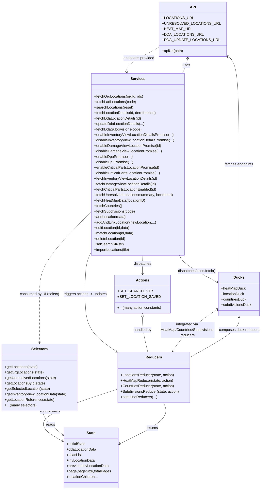

# Diagram: web/portal/src/pages/administration/location-management/redux/Locations.state.js

> Auto-generated by Obscura crawlers

## Mermaid

### SVG

<svg id="container" width="1163.28515625" xmlns="http://www.w3.org/2000/svg" class="classDiagram" height="2148" viewBox="0 0 1163.28515625 2148" role="graphics-document document" aria-roledescription="class"><g><defs><marker id="container_class-aggregationStart" class="marker aggregation class" refX="18" refY="7" markerWidth="190" markerHeight="240" orient="auto"><path d="M 18,7 L9,13 L1,7 L9,1 Z"></path></marker></defs><defs><marker id="container_class-aggregationEnd" class="marker aggregation class" refX="1" refY="7" markerWidth="20" markerHeight="28" orient="auto"><path d="M 18,7 L9,13 L1,7 L9,1 Z"></path></marker></defs><defs><marker id="container_class-extensionStart" class="marker extension class" refX="18" refY="7" markerWidth="190" markerHeight="240" orient="auto"><path d="M 1,7 L18,13 V 1 Z"></path></marker></defs><defs><marker id="container_class-extensionEnd" class="marker extension class" refX="1" refY="7" markerWidth="20" markerHeight="28" orient="auto"><path d="M 1,1 V 13 L18,7 Z"></path></marker></defs><defs><marker id="container_class-compositionStart" class="marker composition class" refX="18" refY="7" markerWidth="190" markerHeight="240" orient="auto"><path d="M 18,7 L9,13 L1,7 L9,1 Z"></path></marker></defs><defs><marker id="container_class-compositionEnd" class="marker composition class" refX="1" refY="7" markerWidth="20" markerHeight="28" orient="auto"><path d="M 18,7 L9,13 L1,7 L9,1 Z"></path></marker></defs><defs><marker id="container_class-dependencyStart" class="marker dependency class" refX="6" refY="7" markerWidth="190" markerHeight="240" orient="auto"><path d="M 5,7 L9,13 L1,7 L9,1 Z"></path></marker></defs><defs><marker id="container_class-dependencyEnd" class="marker dependency class" refX="13" refY="7" markerWidth="20" markerHeight="28" orient="auto"><path d="M 18,7 L9,13 L14,7 L9,1 Z"></path></marker></defs><defs><marker id="container_class-lollipopStart" class="marker lollipop class" refX="13" refY="7" markerWidth="190" markerHeight="240" orient="auto"><circle stroke="black" fill="transparent" cx="7" cy="7" r="6"></circle></marker></defs><defs><marker id="container_class-lollipopEnd" class="marker lollipop class" refX="1" refY="7" markerWidth="190" markerHeight="240" orient="auto"><circle stroke="black" fill="transparent" cx="7" cy="7" r="6"></circle></marker></defs><g class="root"><g class="clusters"></g><g class="edgePaths"><path d="M807.67,322L810.773,315.833C813.877,309.667,820.084,297.333,824.194,285.982C828.304,274.63,830.316,264.26,831.323,259.075L832.329,253.89" id="id_Services_API_1" class="edge-thickness-normal edge-pattern-solid relation" style=";;;" data-edge="true" data-et="edge" data-id="id_Services_API_1" data-points="W3sieCI6ODA3LjY2OTUyMzE4NjYzOTksInkiOjMyMn0seyJ4Ijo4MjYuMjkxMDE1NjI1LCJ5IjoyODV9LHsieCI6ODMzLjQ3MjAwOTM1NTA5NTYsInkiOjI0OH1d" marker-end="url(#container_class-dependencyEnd)"></path><path d="M791.34,1120L794.191,1126.167C797.042,1132.333,802.745,1144.667,832.475,1164.759C862.206,1184.851,915.965,1212.702,942.844,1226.627L969.723,1240.553" id="id_Services_Ducks_2" class="edge-thickness-normal edge-pattern-solid relation" style=";;;" data-edge="true" data-et="edge" data-id="id_Services_Ducks_2" data-points="W3sieCI6NzkxLjM0MDAzNjM3NDcxMzIsInkiOjExMjB9LHsieCI6ODA4LjQ0NzI2NTYyNSwieSI6MTE1N30seyJ4Ijo5NzUuMDUwNzgxMjUsInkiOjEyNDMuMzEyNzQxMDc3NzQ1OH1d" marker-end="url(#container_class-dependencyEnd)"></path><path d="M629.899,1120L630.255,1126.167C630.611,1132.333,631.323,1144.667,631.679,1158C632.035,1171.333,632.035,1185.667,632.035,1192.833L632.035,1200" id="id_Services_Actions_3" class="edge-thickness-normal edge-pattern-solid relation" style=";;;" data-edge="true" data-et="edge" data-id="id_Services_Actions_3" data-points="W3sieCI6NjI5Ljg5ODY3OTQwMDgwMjcsInkiOjExMjB9LHsieCI6NjMyLjAzNTE1NjI1LCJ5IjoxMTU3fSx7IngiOjYzMi4wMzUxNTYyNSwieSI6MTIwNn1d" marker-end="url(#container_class-dependencyEnd)"></path><path d="M401.688,1112.073L397.759,1119.561C393.831,1127.049,385.974,1142.024,382.046,1171.679C378.117,1201.333,378.117,1245.667,378.117,1294C378.117,1342.333,378.117,1394.667,401.683,1436.933C425.248,1479.2,472.379,1511.399,495.945,1527.499L519.511,1543.599" id="id_Services_Reducers_4" class="edge-thickness-normal edge-pattern-solid relation" style=";;;" data-edge="true" data-et="edge" data-id="id_Services_Reducers_4" data-points="W3sieCI6NDAxLjY4NzUsInkiOjExMTIuMDczMTkyMzkwNDUwNX0seyJ4IjozNzguMTE3MTg3NSwieSI6MTE1N30seyJ4IjozNzguMTE3MTg3NSwieSI6MTI5MH0seyJ4IjozNzguMTE3MTg3NSwieSI6MTQ0N30seyJ4Ijo1MjQuNDY0ODQzNzUsInkiOjE1NDYuOTgzNTc3MTEwNTk4fV0=" marker-end="url(#container_class-dependencyEnd)"></path><path d="M524.465,1705.354L454.527,1727.629C384.589,1749.903,244.712,1794.451,204.36,1833.481C164.008,1872.51,223.18,1906.021,252.765,1922.776L282.351,1939.531" id="id_Reducers_State_5" class="edge-thickness-normal edge-pattern-solid relation" style=";;;" data-edge="true" data-et="edge" data-id="id_Reducers_State_5" data-points="W3sieCI6NTI0LjQ2NDg0Mzc1LCJ5IjoxNzA1LjM1NDI5MzQ0MTUxNDV9LHsieCI6MTA0LjgzNTkzNzUsInkiOjE4Mzl9LHsieCI6Mjg3LjU3MjI2NTYyNSwieSI6MTk0Mi40ODc4NzU0MzYwNTg5fV0=" marker-end="url(#container_class-dependencyEnd)"></path><path d="M840.676,1569.046L878.091,1548.705C915.507,1528.364,990.337,1487.682,1027.753,1458.174C1065.168,1428.667,1065.168,1410.333,1065.168,1401.167L1065.168,1392" id="id_Reducers_Ducks_6" class="edge-thickness-normal edge-pattern-solid relation" style=";;;" data-edge="true" data-et="edge" data-id="id_Reducers_Ducks_6" data-points="W3sieCI6ODQwLjY3NTc4MTI1LCJ5IjoxNTY5LjA0NTYzNzg1Nzk4MTV9LHsieCI6MTA2NS4xNjc5Njg3NSwieSI6MTQ0N30seyJ4IjoxMDY1LjE2Nzk2ODc1LCJ5IjoxMzg2fV0=" marker-end="url(#container_class-dependencyEnd)"></path><path d="M187.507,1802L188.054,1808.167C188.601,1814.333,189.695,1826.667,205.59,1845.042C221.485,1863.416,252.181,1887.833,267.529,1900.041L282.877,1912.249" id="id_Selectors_State_7" class="edge-thickness-normal edge-pattern-solid relation" style=";;;" data-edge="true" data-et="edge" data-id="id_Selectors_State_7" data-points="W3sieCI6MTg3LjUwNzI2MDUyOTg5MTMsInkiOjE4MDJ9LHsieCI6MTkwLjc4OTA2MjUsInkiOjE4Mzl9LHsieCI6Mjg3LjU3MjI2NTYyNSwieSI6MTkxNS45ODQ1NTYxMjY1Mjk1fV0=" marker-end="url(#container_class-dependencyEnd)"></path><path d="M1065.168,1194L1065.168,1187.833C1065.168,1181.667,1065.168,1169.333,1065.168,1090.5C1065.168,1011.667,1065.168,866.333,1065.168,721C1065.168,575.667,1065.168,430.333,1052.93,348.447C1040.691,266.561,1016.214,248.122,1003.976,238.902L991.738,229.682" id="id_Ducks_API_8" class="edge-thickness-normal edge-pattern-solid relation" style=";;;" data-edge="true" data-et="edge" data-id="id_Ducks_API_8" data-points="W3sieCI6MTA2NS4xNjc5Njg3NSwieSI6MTE5NH0seyJ4IjoxMDY1LjE2Nzk2ODc1LCJ5IjoxMTU3fSx7IngiOjEwNjUuMTY3OTY4NzUsInkiOjcyMX0seyJ4IjoxMDY1LjE2Nzk2ODc1LCJ5IjoyODV9LHsieCI6OTg2Ljk0NTMxMjUsInkiOjIyNi4wNzIwMzEwMzkxMzYzfV0=" marker-end="url(#container_class-dependencyEnd)"></path><path d="M632.035,1391.25L632.035,1400.542C632.035,1409.833,632.035,1428.417,635.963,1453.875C639.891,1479.333,647.746,1511.667,651.674,1527.833L655.602,1544" id="id_Actions_Reducers_9" class="edge-thickness-normal edge-pattern-solid relation" style=";;;" data-edge="true" data-et="edge" data-id="id_Actions_Reducers_9" data-points="W3sieCI6NjMyLjAzNTE1NjI1LCJ5IjoxMzc0fSx7IngiOjYzMi4wMzUxNTYyNSwieSI6MTQ0N30seyJ4Ijo2NTUuNjAyMDMyMDAxMjAxOSwieSI6MTU0NH1d" marker-start="url(#container_class-extensionStart)"></path><path d="M524.346,1950.182L563.156,1931.651C601.965,1913.121,679.584,1876.061,713.459,1845.364C747.333,1814.667,737.463,1790.333,732.528,1778.167L727.593,1766" id="id_State_Reducers_10" class="edge-thickness-normal edge-pattern-solid relation" style=";;;" data-edge="true" data-et="edge" data-id="id_State_Reducers_10" data-points="W3sieCI6NTE4LjkzMTY0MDYyNSwieSI6MTk1Mi43NjY3NjgwMTUwOTczfSx7IngiOjc1Ny4yMDMxMjUsInkiOjE4Mzl9LHsieCI6NzI3LjU5MzM2Nzg2Njg0NzksInkiOjE3NjZ9XQ==" marker-start="url(#container_class-dependencyStart)"></path><path d="M401.688,927.885L363.818,966.07C325.948,1004.256,250.208,1080.628,212.339,1140.981C174.469,1201.333,174.469,1245.667,174.469,1294C174.469,1342.333,174.469,1394.667,174.469,1430C174.469,1465.333,174.469,1483.667,174.469,1492.833L174.469,1502" id="id_Services_Selectors_11" class="edge-thickness-normal edge-pattern-dashed relation" style=";;;" data-edge="true" data-et="edge" data-id="id_Services_Selectors_11" data-points="W3sieCI6NDAxLjY4NzUsInkiOjkyNy44ODQ1NDQ1MDE4NjF9LHsieCI6MTc0LjQ2ODc1LCJ5IjoxMTU3fSx7IngiOjE3NC40Njg3NSwieSI6MTI5MH0seyJ4IjoxNzQuNDY4NzUsInkiOjE0NDd9LHsieCI6MTc0LjQ2ODc1LCJ5IjoxNTA4fV0=" marker-end="url(#container_class-dependencyEnd)"></path><path d="M726.578,195.277L697.642,210.231C668.706,225.185,610.833,255.092,582.537,275.22C554.24,295.348,555.519,305.697,556.159,310.871L556.799,316.045" id="id_API_Services_12" class="edge-thickness-normal edge-pattern-dashed relation" style=";;;" data-edge="true" data-et="edge" data-id="id_API_Services_12" data-points="W3sieCI6NzI2LjU3ODEyNSwieSI6MTk1LjI3NzA2MjczMzg1MzY1fSx7IngiOjU1Mi45NjA5Mzc1LCJ5IjoyODV9LHsieCI6NTU3LjUzNDg4NzQ3MTMzMDMsInkiOjMyMn1d" marker-end="url(#container_class-dependencyEnd)"></path><path d="M970.051,1353.093L946.455,1368.744C922.86,1384.395,875.669,1415.698,841.308,1446.697C806.946,1477.696,785.413,1508.392,774.647,1523.74L763.88,1539.088" id="id_Ducks_Reducers_13" class="edge-thickness-normal edge-pattern-dashed relation" style=";;;" data-edge="true" data-et="edge" data-id="id_Ducks_Reducers_13" data-points="W3sieCI6OTc1LjA1MDc4MTI1LCJ5IjoxMzQ5Ljc3NjIwOTkyNjk3MTJ9LHsieCI6ODI4LjQ3ODUxNTYyNSwieSI6MTQ0N30seyJ4Ijo3NjAuNDM0Nzg2MjgzMDUyOSwieSI6MTU0NH1d" marker-start="url(#container_class-dependencyStart)" marker-end="url(#container_class-dependencyEnd)"></path></g><g class="edgeLabels"><g class="edgeLabel" transform="translate(825.45229, 286.66651)"><g class="label" data-id="id_Services_API_1" transform="translate(-16.4921875, -12)"><foreignObject width="32.984375" height="24">

uses

</foreignObject></g></g><g class="edgeLabel" transform="translate(873.65177, 1190.78068)"><g class="label" data-id="id_Services_Ducks_2" transform="translate(-84.8203125, -12)"><foreignObject width="169.640625" height="24">

dispatches/uses.fetch()

</foreignObject></g></g><g class="edgeLabel" transform="translate(632.03515625, 1157)"><g class="label" data-id="id_Services_Actions_3" transform="translate(-39.1796875, -12)"><foreignObject width="78.359375" height="24">

dispatches

</foreignObject></g></g><g class="edgeLabel" transform="translate(378.1171875, 1290)"><g class="label" data-id="id_Services_Reducers_4" transform="translate(-96.8984375, -12)"><foreignObject width="193.796875" height="24">

triggers actions -&gt; updates

</foreignObject></g></g><g class="edgeLabel" transform="translate(214.59935, 1804.04195)"><g class="label" data-id="id_Reducers_State_5" transform="translate(-45.9453125, -12)"><foreignObject width="91.890625" height="24">

reads/writes

</foreignObject></g></g><g class="edgeLabel" transform="translate(1065.16796875, 1447)"><g class="label" data-id="id_Reducers_Ducks_6" transform="translate(-89.4296875, -12)"><foreignObject width="178.859375" height="24">

composes duck reducers

</foreignObject></g></g><g class="edgeLabel" transform="translate(190.7890625, 1839)"><g class="label" data-id="id_Selectors_State_7" transform="translate(-20.0078125, -12)"><foreignObject width="40.015625" height="24">

reads

</foreignObject></g></g><g class="edgeLabel" transform="translate(1065.16796875, 721)"><g class="label" data-id="id_Ducks_API_8" transform="translate(-65.28125, -12)"><foreignObject width="130.5625" height="24">

fetches endpoints

</foreignObject></g></g><g class="edgeLabel" transform="translate(632.03515625, 1447)"><g class="label" data-id="id_Actions_Reducers_9" transform="translate(-40.7421875, -12)"><foreignObject width="81.484375" height="24">

handled by

</foreignObject></g></g><g class="edgeLabel" transform="translate(673.61185, 1878.91207)"><g class="label" data-id="id_State_Reducers_10" transform="translate(-26.265625, -12)"><foreignObject width="52.53125" height="24">

returns

</foreignObject></g></g><g class="edgeLabel" transform="translate(174.46875, 1290)"><g class="label" data-id="id_Services_Selectors_11" transform="translate(-86.75, -12)"><foreignObject width="173.5" height="24">

consumed by UI (select)

</foreignObject></g></g><g class="edgeLabel" transform="translate(623.20935, 248.6966)"><g class="label" data-id="id_API_Services_12" transform="translate(-71.3046875, -12)"><foreignObject width="142.609375" height="24">

endpoints provided

</foreignObject></g></g><g class="edgeLabel" transform="translate(828.478515625, 1447)"><g class="label" data-id="id_Ducks_Reducers_13" transform="translate(-123.3203125, -36)"><foreignObject width="246.640625" height="72">

integrated via HeatMap/Countries/Subdivisions reducers

</foreignObject></g></g></g><g class="nodes"><g class="node default" id="classId-API-0" transform="translate(856.76171875, 128)"><g class="basic label-container"><path d="M-130.18359375 -120 L130.18359375 -120 L130.18359375 120 L-130.18359375 120" stroke="none" stroke-width="0" fill="#ECECFF" style=""></path><path d="M-130.18359375 -120 C-77.0704934291444 -120, -23.957393108288812 -120, 130.18359375 -120 M-130.18359375 -120 C-70.47999184698645 -120, -10.776389943972887 -120, 130.18359375 -120 M130.18359375 -120 C130.18359375 -55.9937710621565, 130.18359375 8.012457875687005, 130.18359375 120 M130.18359375 -120 C130.18359375 -36.171613683135675, 130.18359375 47.65677263372865, 130.18359375 120 M130.18359375 120 C52.22631187943762 120, -25.730969991124766 120, -130.18359375 120 M130.18359375 120 C46.4211733094446 120, -37.341247131110805 120, -130.18359375 120 M-130.18359375 120 C-130.18359375 29.595115135782038, -130.18359375 -60.809769728435924, -130.18359375 -120 M-130.18359375 120 C-130.18359375 59.405182404684496, -130.18359375 -1.1896351906310088, -130.18359375 -120" stroke="#9370DB" stroke-width="1.3" fill="none" stroke-dasharray="0 0" style=""></path></g><g class="annotation-group text" transform="translate(0, -96)"></g><g class="label-group text" transform="translate(-11.8671875, -96)"><g class="label" style="font-weight: bolder" transform="translate(0,-12)"><foreignObject width="23.734375" height="24">

API

</foreignObject></g></g><g class="members-group text" transform="translate(-118.18359375, -48)"><g class="label" style="" transform="translate(0,-12)"><foreignObject width="122.953125" height="24">

+LOCATIONS_URL

</foreignObject></g><g class="label" style="" transform="translate(0,12)"><foreignObject width="224.5" height="24">

+UNRESOLVED_LOCATIONS_URL

</foreignObject></g><g class="label" style="" transform="translate(0,36)"><foreignObject width="116.984375" height="24">

+HEAT_MAP_URL

</foreignObject></g><g class="label" style="" transform="translate(0,60)"><foreignObject width="160.890625" height="24">

+DDA_LOCATIONS_URL

</foreignObject></g><g class="label" style="" transform="translate(0,84)"><foreignObject width="223.953125" height="24">

+DDA_UPDATE_LOCATIONS_URL

</foreignObject></g></g><g class="methods-group text" transform="translate(-118.18359375, 96)"><g class="label" style="" transform="translate(0,-12)"><foreignObject width="95.5" height="24">

+apiUrl(path)

</foreignObject></g></g><g class="divider" style=""><path d="M-130.18359375 -72 C-75.60720927008589 -72, -21.030824790171764 -72, 130.18359375 -72 M-130.18359375 -72 C-54.73869596415686 -72, 20.706201821686278 -72, 130.18359375 -72" stroke="#9370DB" stroke-width="1.3" fill="none" stroke-dasharray="0 0" style=""></path></g><g class="divider" style=""><path d="M-130.18359375 72 C-54.44309739128238 72, 21.297398967435242 72, 130.18359375 72 M-130.18359375 72 C-69.13600632051336 72, -8.08841889102672 72, 130.18359375 72" stroke="#9370DB" stroke-width="1.3" fill="none" stroke-dasharray="0 0" style=""></path></g></g><g class="node default" id="classId-Actions-1" transform="translate(632.03515625, 1290)"><g class="basic label-container"><path d="M-122.01953125 -84 L122.01953125 -84 L122.01953125 84 L-122.01953125 84" stroke="none" stroke-width="0" fill="#ECECFF" style=""></path><path d="M-122.01953125 -84 C-24.62859184575082 -84, 72.76234755849836 -84, 122.01953125 -84 M-122.01953125 -84 C-64.22668527486077 -84, -6.433839299721541 -84, 122.01953125 -84 M122.01953125 -84 C122.01953125 -50.11465674629723, 122.01953125 -16.229313492594457, 122.01953125 84 M122.01953125 -84 C122.01953125 -32.33381627239398, 122.01953125 19.332367455212037, 122.01953125 84 M122.01953125 84 C29.006485520395998 84, -64.006560209208 84, -122.01953125 84 M122.01953125 84 C50.25309869621471 84, -21.513333857570586 84, -122.01953125 84 M-122.01953125 84 C-122.01953125 46.28586089028448, -122.01953125 8.571721780568964, -122.01953125 -84 M-122.01953125 84 C-122.01953125 17.71106115704309, -122.01953125 -48.57787768591382, -122.01953125 -84" stroke="#9370DB" stroke-width="1.3" fill="none" stroke-dasharray="0 0" style=""></path></g><g class="annotation-group text" transform="translate(0, -60)"></g><g class="label-group text" transform="translate(-27.0546875, -60)"><g class="label" style="font-weight: bolder" transform="translate(0,-12)"><foreignObject width="54.109375" height="24">

Actions

</foreignObject></g></g><g class="members-group text" transform="translate(-110.01953125, -12)"><g class="label" style="" transform="translate(0,-12)"><foreignObject width="130.25" height="24">

+SET_SEARCH_STR

</foreignObject></g><g class="label" style="" transform="translate(0,12)"><foreignObject width="164.40625" height="24">

+SET_LOCATION_SAVED

</foreignObject></g></g><g class="methods-group text" transform="translate(-110.01953125, 60)"><g class="label" style="" transform="translate(0,-12)"><foreignObject width="192.984375" height="24">

+...(many action constants)

</foreignObject></g></g><g class="divider" style=""><path d="M-122.01953125 -36 C-65.2905715587492 -36, -8.561611867498428 -36, 122.01953125 -36 M-122.01953125 -36 C-57.06480341566042 -36, 7.889924418679158 -36, 122.01953125 -36" stroke="#9370DB" stroke-width="1.3" fill="none" stroke-dasharray="0 0" style=""></path></g><g class="divider" style=""><path d="M-122.01953125 36 C-29.746775252132394 36, 62.52598074573521 36, 122.01953125 36 M-122.01953125 36 C-56.48564133386067 36, 9.04824858227866 36, 122.01953125 36" stroke="#9370DB" stroke-width="1.3" fill="none" stroke-dasharray="0 0" style=""></path></g></g><g class="node default" id="classId-Ducks-2" transform="translate(1065.16796875, 1290)"><g class="basic label-container"><path d="M-90.1171875 -96 L90.1171875 -96 L90.1171875 96 L-90.1171875 96" stroke="none" stroke-width="0" fill="#ECECFF" style=""></path><path d="M-90.1171875 -96 C-48.532799626422836 -96, -6.948411752845672 -96, 90.1171875 -96 M-90.1171875 -96 C-48.53083430952808 -96, -6.944481119056164 -96, 90.1171875 -96 M90.1171875 -96 C90.1171875 -44.69607116139535, 90.1171875 6.607857677209296, 90.1171875 96 M90.1171875 -96 C90.1171875 -50.42115409963398, 90.1171875 -4.842308199267961, 90.1171875 96 M90.1171875 96 C45.45737497034039 96, 0.7975624406807782 96, -90.1171875 96 M90.1171875 96 C43.285606660279306 96, -3.5459741794413873 96, -90.1171875 96 M-90.1171875 96 C-90.1171875 43.62783199175628, -90.1171875 -8.744336016487438, -90.1171875 -96 M-90.1171875 96 C-90.1171875 23.16002152490087, -90.1171875 -49.67995695019826, -90.1171875 -96" stroke="#9370DB" stroke-width="1.3" fill="none" stroke-dasharray="0 0" style=""></path></g><g class="annotation-group text" transform="translate(0, -72)"></g><g class="label-group text" transform="translate(-21.859375, -72)"><g class="label" style="font-weight: bolder" transform="translate(0,-12)"><foreignObject width="43.71875" height="24">

Ducks

</foreignObject></g></g><g class="members-group text" transform="translate(-78.1171875, -24)"><g class="label" style="" transform="translate(0,-12)"><foreignObject width="106.515625" height="24">

+heatMapDuck

</foreignObject></g><g class="label" style="" transform="translate(0,12)"><foreignObject width="102.59375" height="24">

+locationDuck

</foreignObject></g><g class="label" style="" transform="translate(0,36)"><foreignObject width="111.46875" height="24">

+countriesDuck

</foreignObject></g><g class="label" style="" transform="translate(0,60)"><foreignObject width="134.375" height="24">

+subdivisionsDuck

</foreignObject></g></g><g class="methods-group text" transform="translate(-78.1171875, 96)"></g><g class="divider" style=""><path d="M-90.1171875 -48 C-29.83715191604344 -48, 30.442883667913122 -48, 90.1171875 -48 M-90.1171875 -48 C-23.37742625013523 -48, 43.36233499972954 -48, 90.1171875 -48" stroke="#9370DB" stroke-width="1.3" fill="none" stroke-dasharray="0 0" style=""></path></g><g class="divider" style=""><path d="M-90.1171875 72 C-28.2085697262892 72, 33.7000480474216 72, 90.1171875 72 M-90.1171875 72 C-22.786063874483133 72, 44.54505975103373 72, 90.1171875 72" stroke="#9370DB" stroke-width="1.3" fill="none" stroke-dasharray="0 0" style=""></path></g></g><g class="node default" id="classId-Services-3" transform="translate(606.859375, 721)"><g class="basic label-container"><path d="M-205.171875 -399 L205.171875 -399 L205.171875 399 L-205.171875 399" stroke="none" stroke-width="0" fill="#ECECFF" style=""></path><path d="M-205.171875 -399 C-109.72878989878689 -399, -14.285704797573771 -399, 205.171875 -399 M-205.171875 -399 C-122.90223633032363 -399, -40.632597660647264 -399, 205.171875 -399 M205.171875 -399 C205.171875 -191.00262745028886, 205.171875 16.99474509942229, 205.171875 399 M205.171875 -399 C205.171875 -232.02436438254065, 205.171875 -65.04872876508131, 205.171875 399 M205.171875 399 C75.08384672103892 399, -55.00418155792215 399, -205.171875 399 M205.171875 399 C62.30375201016159 399, -80.56437097967682 399, -205.171875 399 M-205.171875 399 C-205.171875 105.2785924675511, -205.171875 -188.4428150648978, -205.171875 -399 M-205.171875 399 C-205.171875 184.92677721453325, -205.171875 -29.14644557093351, -205.171875 -399" stroke="#9370DB" stroke-width="1.3" fill="none" stroke-dasharray="0 0" style=""></path></g><g class="annotation-group text" transform="translate(0, -375)"></g><g class="label-group text" transform="translate(-30.515625, -375)"><g class="label" style="font-weight: bolder" transform="translate(0,-12)"><foreignObject width="61.03125" height="24">

Services

</foreignObject></g></g><g class="members-group text" transform="translate(-193.171875, -327)"></g><g class="methods-group text" transform="translate(-193.171875, -297)"><g class="label" style="" transform="translate(0,-12)"><foreignObject width="217.03125" height="24">

+fetchOrgLocations(orgId, ids)

</foreignObject></g><g class="label" style="" transform="translate(0,12)"><foreignObject width="185.21875" height="24">

+fetchLadLocations(code)

</foreignObject></g><g class="label" style="" transform="translate(0,36)"><foreignObject width="171.78125" height="24">

+searchLocations(reset)

</foreignObject></g><g class="label" style="" transform="translate(0,60)"><foreignObject width="275.40625" height="24">

+fetchLocationDetails(id, dereference)

</foreignObject></g><g class="label" style="" transform="translate(0,84)"><foreignObject width="209.4375" height="24">

+fetchDdaLocationDetails(id)

</foreignObject></g><g class="label" style="" transform="translate(0,108)"><foreignObject width="221.96875" height="24">

+updateDdaLocationDetails(...)

</foreignObject></g><g class="label" style="" transform="translate(0,132)"><foreignObject width="210.3125" height="24">

+fetchDdaSubdivisions(code)

</foreignObject></g><g class="label" style="" transform="translate(0,156)"><foreignObject width="352.53125" height="24">

+enableInventoryViewLocationDetailsPromise(...)

</foreignObject></g><g class="label" style="" transform="translate(0,180)"><foreignObject width="355.828125" height="24">

+disableInventoryViewLocationDetailsPromise(...)

</foreignObject></g><g class="label" style="" transform="translate(0,204)"><foreignObject width="294.109375" height="24">

+enableDamageViewLocationPromise(id)

</foreignObject></g><g class="label" style="" transform="translate(0,228)"><foreignObject width="294.84375" height="24">

+disableDamageViewLocationPromise(...)

</foreignObject></g><g class="label" style="" transform="translate(0,252)"><foreignObject width="167.0625" height="24">

+enableDpuPromise(...)

</foreignObject></g><g class="label" style="" transform="translate(0,276)"><foreignObject width="170.359375" height="24">

+disableDpuPromise(...)

</foreignObject></g><g class="label" style="" transform="translate(0,300)"><foreignObject width="289.578125" height="24">

+enableCriticalPartsLocationPromise(id)

</foreignObject></g><g class="label" style="" transform="translate(0,324)"><foreignObject width="290.3125" height="24">

+disableCriticalPartsLocationPromise(...)

</foreignObject></g><g class="label" style="" transform="translate(0,348)"><foreignObject width="283.265625" height="24">

+fetchInventoryViewLocationDetails(id)

</foreignObject></g><g class="label" style="" transform="translate(0,372)"><foreignObject width="272.34375" height="24">

+fetchDamageViewLocationDetails(id)

</foreignObject></g><g class="label" style="" transform="translate(0,396)"><foreignObject width="276.625" height="24">

+fetchCriticalPartsLocationEnabled(id)

</foreignObject></g><g class="label" style="" transform="translate(0,420)"><foreignObject width="353.84375" height="24">

+fetchUnresolvedLocations(summary, locationId)

</foreignObject></g><g class="label" style="" transform="translate(0,444)"><foreignObject width="226.5625" height="24">

+fetchHeatMapData(locationID)

</foreignObject></g><g class="label" style="" transform="translate(0,468)"><foreignObject width="123.921875" height="24">

+fetchCountries()

</foreignObject></g><g class="label" style="" transform="translate(0,492)"><foreignObject width="181.734375" height="24">

+fetchSubdivisions(code)

</foreignObject></g><g class="label" style="" transform="translate(0,516)"><foreignObject width="140.71875" height="24">

+addLocation(data)

</foreignObject></g><g class="label" style="" transform="translate(0,540)"><foreignObject width="273.265625" height="24">

+addAndLinkLocation(newLocation,...)

</foreignObject></g><g class="label" style="" transform="translate(0,564)"><foreignObject width="159.453125" height="24">

+editLocation(id,data)

</foreignObject></g><g class="label" style="" transform="translate(0,588)"><foreignObject width="175.84375" height="24">

+matchLocation(id,data)

</foreignObject></g><g class="label" style="" transform="translate(0,612)"><foreignObject width="140.421875" height="24">

+deleteLocation(id)

</foreignObject></g><g class="label" style="" transform="translate(0,636)"><foreignObject width="129.125" height="24">

+setSearchStr(str)

</foreignObject></g><g class="label" style="" transform="translate(0,660)"><foreignObject width="159.5" height="24">

+importLocations(file)

</foreignObject></g></g><g class="divider" style=""><path d="M-205.171875 -351 C-94.91491870322713 -351, 15.34203759354574 -351, 205.171875 -351 M-205.171875 -351 C-64.87712479030233 -351, 75.41762541939534 -351, 205.171875 -351" stroke="#9370DB" stroke-width="1.3" fill="none" stroke-dasharray="0 0" style=""></path></g><g class="divider" style=""><path d="M-205.171875 -327 C-57.751903627184845 -327, 89.66806774563031 -327, 205.171875 -327 M-205.171875 -327 C-71.04711188671084 -327, 63.077651226578325 -327, 205.171875 -327" stroke="#9370DB" stroke-width="1.3" fill="none" stroke-dasharray="0 0" style=""></path></g></g><g class="node default" id="classId-Selectors-4" transform="translate(174.46875, 1655)"><g class="basic label-container"><path d="M-166.46875 -147 L166.46875 -147 L166.46875 147 L-166.46875 147" stroke="none" stroke-width="0" fill="#ECECFF" style=""></path><path d="M-166.46875 -147 C-95.30902908473848 -147, -24.149308169476967 -147, 166.46875 -147 M-166.46875 -147 C-90.79594882813058 -147, -15.123147656261153 -147, 166.46875 -147 M166.46875 -147 C166.46875 -86.73669067838202, 166.46875 -26.473381356764023, 166.46875 147 M166.46875 -147 C166.46875 -36.74269996742122, 166.46875 73.51460006515757, 166.46875 147 M166.46875 147 C93.82013595178886 147, 21.171521903577712 147, -166.46875 147 M166.46875 147 C75.04682095064227 147, -16.375108098715458 147, -166.46875 147 M-166.46875 147 C-166.46875 43.85001907508163, -166.46875 -59.299961849836734, -166.46875 -147 M-166.46875 147 C-166.46875 74.78984732935442, -166.46875 2.5796946587088314, -166.46875 -147" stroke="#9370DB" stroke-width="1.3" fill="none" stroke-dasharray="0 0" style=""></path></g><g class="annotation-group text" transform="translate(0, -123)"></g><g class="label-group text" transform="translate(-34.171875, -123)"><g class="label" style="font-weight: bolder" transform="translate(0,-12)"><foreignObject width="68.34375" height="24">

Selectors

</foreignObject></g></g><g class="members-group text" transform="translate(-154.46875, -75)"></g><g class="methods-group text" transform="translate(-154.46875, -45)"><g class="label" style="" transform="translate(0,-12)"><foreignObject width="146.59375" height="24">

+getLocations(state)

</foreignObject></g><g class="label" style="" transform="translate(0,12)"><foreignObject width="171.921875" height="24">

+getOrgLocations(state)

</foreignObject></g><g class="label" style="" transform="translate(0,36)"><foreignObject width="228.421875" height="24">

+getUnresolvedLocations(state)

</foreignObject></g><g class="label" style="" transform="translate(0,60)"><foreignObject width="178.484375" height="24">

+getLocationsById(state)

</foreignObject></g><g class="label" style="" transform="translate(0,84)"><foreignObject width="201.375" height="24">

+getSelectedLocation(state)

</foreignObject></g><g class="label" style="" transform="translate(0,108)"><foreignObject width="274.765625" height="24">

+getInventoryViewLocationData(state)

</foreignObject></g><g class="label" style="" transform="translate(0,132)"><foreignObject width="218.515625" height="24">

+getLocationReferences(state)

</foreignObject></g><g class="label" style="" transform="translate(0,156)"><foreignObject width="138.328125" height="24">

+...(many selectors)

</foreignObject></g></g><g class="divider" style=""><path d="M-166.46875 -99 C-56.17870338126818 -99, 54.11134323746364 -99, 166.46875 -99 M-166.46875 -99 C-46.28622527660495 -99, 73.8962994467901 -99, 166.46875 -99" stroke="#9370DB" stroke-width="1.3" fill="none" stroke-dasharray="0 0" style=""></path></g><g class="divider" style=""><path d="M-166.46875 -75 C-93.44982950304295 -75, -20.430909006085898 -75, 166.46875 -75 M-166.46875 -75 C-81.13729158590509 -75, 4.194166828189822 -75, 166.46875 -75" stroke="#9370DB" stroke-width="1.3" fill="none" stroke-dasharray="0 0" style=""></path></g></g><g class="node default" id="classId-Reducers-5" transform="translate(682.5703125, 1655)"><g class="basic label-container"><path d="M-158.10546875 -111 L158.10546875 -111 L158.10546875 111 L-158.10546875 111" stroke="none" stroke-width="0" fill="#ECECFF" style=""></path><path d="M-158.10546875 -111 C-92.05671134375959 -111, -26.007953937519176 -111, 158.10546875 -111 M-158.10546875 -111 C-89.23669922449388 -111, -20.36792969898775 -111, 158.10546875 -111 M158.10546875 -111 C158.10546875 -55.49911356899369, 158.10546875 0.0017728620126149508, 158.10546875 111 M158.10546875 -111 C158.10546875 -42.67226838118886, 158.10546875 25.655463237622286, 158.10546875 111 M158.10546875 111 C75.015714975656 111, -8.074038798688008 111, -158.10546875 111 M158.10546875 111 C88.58635615397549 111, 19.067243557950974 111, -158.10546875 111 M-158.10546875 111 C-158.10546875 58.759924751313726, -158.10546875 6.519849502627451, -158.10546875 -111 M-158.10546875 111 C-158.10546875 56.19252079798093, -158.10546875 1.3850415959618658, -158.10546875 -111" stroke="#9370DB" stroke-width="1.3" fill="none" stroke-dasharray="0 0" style=""></path></g><g class="annotation-group text" transform="translate(0, -87)"></g><g class="label-group text" transform="translate(-33.6796875, -87)"><g class="label" style="font-weight: bolder" transform="translate(0,-12)"><foreignObject width="67.359375" height="24">

Reducers

</foreignObject></g></g><g class="members-group text" transform="translate(-146.10546875, -39)"></g><g class="methods-group text" transform="translate(-146.10546875, -9)"><g class="label" style="" transform="translate(0,-12)"><foreignObject width="236.578125" height="24">

+LocationsReducer(state, action)

</foreignObject></g><g class="label" style="" transform="translate(0,12)"><foreignObject width="231.578125" height="24">

+HeatMapReducer(state, action)

</foreignObject></g><g class="label" style="" transform="translate(0,36)"><foreignObject width="236.328125" height="24">

+CountriesReducer(state, action)

</foreignObject></g><g class="label" style="" transform="translate(0,60)"><foreignObject width="258.53125" height="24">

+SubdivisionsReducer(state, action)

</foreignObject></g><g class="label" style="" transform="translate(0,84)"><foreignObject width="158.875" height="24">

+combineReducers(...)

</foreignObject></g></g><g class="divider" style=""><path d="M-158.10546875 -63 C-86.98959174025933 -63, -15.873714730518657 -63, 158.10546875 -63 M-158.10546875 -63 C-59.29957944548754 -63, 39.506309859024924 -63, 158.10546875 -63" stroke="#9370DB" stroke-width="1.3" fill="none" stroke-dasharray="0 0" style=""></path></g><g class="divider" style=""><path d="M-158.10546875 -39 C-53.601141567072204 -39, 50.90318561585559 -39, 158.10546875 -39 M-158.10546875 -39 C-83.15292466021741 -39, -8.200380570434817 -39, 158.10546875 -39" stroke="#9370DB" stroke-width="1.3" fill="none" stroke-dasharray="0 0" style=""></path></g></g><g class="node default" id="classId-State-6" transform="translate(403.251953125, 2008)"><g class="basic label-container"><path d="M-115.6796875 -132 L115.6796875 -132 L115.6796875 132 L-115.6796875 132" stroke="none" stroke-width="0" fill="#ECECFF" style=""></path><path d="M-115.6796875 -132 C-52.64311910683706 -132, 10.393449286325875 -132, 115.6796875 -132 M-115.6796875 -132 C-58.9243654484128 -132, -2.1690433968256 -132, 115.6796875 -132 M115.6796875 -132 C115.6796875 -68.82202080451006, 115.6796875 -5.644041609020121, 115.6796875 132 M115.6796875 -132 C115.6796875 -30.243845465034795, 115.6796875 71.51230906993041, 115.6796875 132 M115.6796875 132 C28.592871168288937 132, -58.493945163422126 132, -115.6796875 132 M115.6796875 132 C36.410504453633465 132, -42.85867859273307 132, -115.6796875 132 M-115.6796875 132 C-115.6796875 29.141442045271603, -115.6796875 -73.7171159094568, -115.6796875 -132 M-115.6796875 132 C-115.6796875 50.840499665730576, -115.6796875 -30.31900066853885, -115.6796875 -132" stroke="#9370DB" stroke-width="1.3" fill="none" stroke-dasharray="0 0" style=""></path></g><g class="annotation-group text" transform="translate(0, -108)"></g><g class="label-group text" transform="translate(-19.3125, -108)"><g class="label" style="font-weight: bolder" transform="translate(0,-12)"><foreignObject width="38.625" height="24">

State

</foreignObject></g></g><g class="members-group text" transform="translate(-103.6796875, -60)"><g class="label" style="" transform="translate(0,-12)"><foreignObject width="87.25" height="24">

+initialState

</foreignObject></g><g class="label" style="" transform="translate(0,12)"><foreignObject width="131.15625" height="24">

+ddaLocationData

</foreignObject></g><g class="label" style="" transform="translate(0,36)"><foreignObject width="65.03125" height="24">

+scacList

</foreignObject></g><g class="label" style="" transform="translate(0,60)"><foreignObject width="124.96875" height="24">

+invLocationData

</foreignObject></g><g class="label" style="" transform="translate(0,84)"><foreignObject width="187.546875" height="24">

+previousInvLocationData

</foreignObject></g><g class="label" style="" transform="translate(0,108)"><foreignObject width="188.046875" height="24">

+page,pageSize,totalPages

</foreignObject></g><g class="label" style="" transform="translate(0,132)"><foreignObject width="139.3125" height="24">

+locationChildren...

</foreignObject></g></g><g class="methods-group text" transform="translate(-103.6796875, 132)"></g><g class="divider" style=""><path d="M-115.6796875 -84 C-26.375586041501606 -84, 62.92851541699679 -84, 115.6796875 -84 M-115.6796875 -84 C-61.68027979441352 -84, -7.680872088827044 -84, 115.6796875 -84" stroke="#9370DB" stroke-width="1.3" fill="none" stroke-dasharray="0 0" style=""></path></g><g class="divider" style=""><path d="M-115.6796875 108 C-35.15530792615843 108, 45.36907164768314 108, 115.6796875 108 M-115.6796875 108 C-56.57581508709852 108, 2.528057325802962 108, 115.6796875 108" stroke="#9370DB" stroke-width="1.3" fill="none" stroke-dasharray="0 0" style=""></path></g></g></g></g></g></svg>
