# Diagram: web/portal/src/pages/administration/location-management/search/LocationManagement.Search.columns.js

> Auto-generated by Obscura crawlers

## Mermaid

```mermaid
classDiagram
    class NameCellRenderer {
        +render(value)
    }
    class GeofenceCellRenderer {
        +render(value)
        -fenceType
    }
    class SourceCellRenderer {
        +render(value)
    }
    class ShipperCellRenderer {
        +render(props)
        -useGetShipperNameById()
    }
    class LocationTypeCellRenderer {
        +render(props)
        -getTranslatedLadLobLabel()
        -getDefaultUnclassifiedLad()
    }
    class LadFilters {
        +render(filters)
    }
    class LadFilterWidget {
        +render(filterValue, onChange, isCarrierOrg)
        -showWidget: boolean
        -useState()
    }
    class ParentIconCell {
        +render(value)
        -useTranslation()
    }
    class LocationParentColumn {
        +Header
        +id
        +accessor
        +Cell
        +Filter
    }
    class LocationGeofenceColumn {
        +Header
        +id
        +accessor
        +Cell
        +Filter
    }
    class LocationNameColumn {
        +id
        +Header
        +accessor
        +Cell
        +filter()
    }
    class LocationSourceColumn {
        +id
        +Header
        +accessor
        +Cell
        +filter()
    }
    class LocationShipperColumn {
        +Header
        +accessor
        +Cell
        +Filter
        +filter()
    }
    class LocationCodeColumn {
        +id
        +Header
        +accessor
        +minWidth
        +filter()
    }
    class LocationAddressColumn {
        +Header
        +id
        +accessor()
        +Cell
        +sortType
        +filter()
    }
    class LocationCountColumn {
        +id
        +Header
        +accessor
        +minWidth
        +filter()
    }
    class LocationTypeColumnFactory {
        +LocationTypeColumn(isCarrierOrg)
    }
    class ParentLocationCodeColumn {
        +id
        +Header
        +accessor
        +minWidth
        +filter()
    }

    NameCellRenderer <|-- LocationNameColumn : Cell
    GeofenceCellRenderer <|-- LocationGeofenceColumn : Cell
    SourceCellRenderer <|-- LocationSourceColumn : Cell
    ShipperCellRenderer <|-- LocationShipperColumn : Cell
    LocationTypeCellRenderer <|-- LocationTypeColumnFactory : Cell

    LadFilters <-- LadFilterWidget : uses
    LocationTypeSelectFilterModal <-- LadFilterWidget : toggles
    LadFilterWidget <-- LocationTypeColumnFactory : used-in Filter
    ParentIconCell <|-- LocationParentColumn : Cell

    LocationAddressColumn --> SimpleAddressCell : Cell
    LocationAddressColumn --> sortByAddress : sortType
    GeofenceCellRenderer --> GeofenceType : uses
    ShipperCellRenderer --> useGetShipperNameById : hook
    LocationTypeCellRenderer --> Chiclet : renders
    LadFilterWidget --> Tooltip : renders
    ParentIconCell --> Icon : renders

    LocationParentColumn ..> ParentFilter : Filter component
    LocationGeofenceColumn ..> GeofenceFilter : Filter component
    LocationShipperColumn ..> ShipperFilter : Filter component

    note for LocationTypeColumnFactory "factory returns column config object with Filter using LadFilterWidget"
```

### SVG

<svg id="container" width="4135.51953125" xmlns="http://www.w3.org/2000/svg" class="classDiagram" height="746" viewBox="0 0 4135.51953125 746" role="graphics-document document" aria-roledescription="class"><g><defs><marker id="container_class-aggregationStart" class="marker aggregation class" refX="18" refY="7" markerWidth="190" markerHeight="240" orient="auto"><path d="M 18,7 L9,13 L1,7 L9,1 Z"></path></marker></defs><defs><marker id="container_class-aggregationEnd" class="marker aggregation class" refX="1" refY="7" markerWidth="20" markerHeight="28" orient="auto"><path d="M 18,7 L9,13 L1,7 L9,1 Z"></path></marker></defs><defs><marker id="container_class-extensionStart" class="marker extension class" refX="18" refY="7" markerWidth="190" markerHeight="240" orient="auto"><path d="M 1,7 L18,13 V 1 Z"></path></marker></defs><defs><marker id="container_class-extensionEnd" class="marker extension class" refX="1" refY="7" markerWidth="20" markerHeight="28" orient="auto"><path d="M 1,1 V 13 L18,7 Z"></path></marker></defs><defs><marker id="container_class-compositionStart" class="marker composition class" refX="18" refY="7" markerWidth="190" markerHeight="240" orient="auto"><path d="M 18,7 L9,13 L1,7 L9,1 Z"></path></marker></defs><defs><marker id="container_class-compositionEnd" class="marker composition class" refX="1" refY="7" markerWidth="20" markerHeight="28" orient="auto"><path d="M 18,7 L9,13 L1,7 L9,1 Z"></path></marker></defs><defs><marker id="container_class-dependencyStart" class="marker dependency class" refX="6" refY="7" markerWidth="190" markerHeight="240" orient="auto"><path d="M 5,7 L9,13 L1,7 L9,1 Z"></path></marker></defs><defs><marker id="container_class-dependencyEnd" class="marker dependency class" refX="13" refY="7" markerWidth="20" markerHeight="28" orient="auto"><path d="M 18,7 L9,13 L14,7 L9,1 Z"></path></marker></defs><defs><marker id="container_class-lollipopStart" class="marker lollipop class" refX="13" refY="7" markerWidth="190" markerHeight="240" orient="auto"><circle stroke="black" fill="transparent" cx="7" cy="7" r="6"></circle></marker></defs><defs><marker id="container_class-lollipopEnd" class="marker lollipop class" refX="1" refY="7" markerWidth="190" markerHeight="240" orient="auto"><circle stroke="black" fill="transparent" cx="7" cy="7" r="6"></circle></marker></defs><g class="root"><g class="clusters"></g><g class="edgePaths"><path d="M3871.785,448L3871.785,469.167C3871.785,490.333,3871.785,532.667,3436.502,569.363C3001.218,606.059,2130.651,637.117,1695.368,652.646L1260.084,668.176" id="edgeNote1" class="edge-thickness-normal edge-pattern-dotted relation" style="fill: none;;;fill: none" data-edge="true" data-et="edge" data-id="edgeNote1" data-points="W3sieCI6Mzg3MS43ODUxNTYyNSwieSI6NDQ4fSx7IngiOjM4NzEuNzg1MTU2MjUsInkiOjU3NX0seyJ4IjoxMjYwLjA4Mzk4NDM3NSwieSI6NjY4LjE3NTY2NTc0MTU0NjZ9XQ=="></path><path d="M1029.678,208.25L1029.678,221.042C1029.678,233.833,1029.678,259.417,1029.678,278.375C1029.678,297.333,1029.678,309.667,1029.678,315.833L1029.678,322" id="id_NameCellRenderer_LocationNameColumn_1" class="edge-thickness-normal edge-pattern-solid relation" style=";;;" data-edge="true" data-et="edge" data-id="id_NameCellRenderer_LocationNameColumn_1" data-points="W3sieCI6MTAyOS42Nzc3MzQzNzUsInkiOjE5MX0seyJ4IjoxMDI5LjY3NzczNDM3NSwieSI6Mjg1fSx7IngiOjEwMjkuNjc3NzM0Mzc1LCJ5IjozMjJ9XQ==" marker-start="url(#container_class-extensionStart)"></path><path d="M1674.483,213.58L1683.808,225.483C1693.132,237.386,1711.781,261.193,1721.105,279.263C1730.43,297.333,1730.43,309.667,1730.43,315.833L1730.43,322" id="id_GeofenceCellRenderer_LocationGeofenceColumn_2" class="edge-thickness-normal edge-pattern-solid relation" style=";;;" data-edge="true" data-et="edge" data-id="id_GeofenceCellRenderer_LocationGeofenceColumn_2" data-points="W3sieCI6MTY2My44NDU3OTAyMDcwMDYzLCJ5IjoyMDB9LHsieCI6MTczMC40Mjk2ODc1LCJ5IjoyODV9LHsieCI6MTczMC40Mjk2ODc1LCJ5IjozMjJ9XQ==" marker-start="url(#container_class-extensionStart)"></path><path d="M1279.318,208.25L1279.318,221.042C1279.318,233.833,1279.318,259.417,1279.318,278.375C1279.318,297.333,1279.318,309.667,1279.318,315.833L1279.318,322" id="id_SourceCellRenderer_LocationSourceColumn_3" class="edge-thickness-normal edge-pattern-solid relation" style=";;;" data-edge="true" data-et="edge" data-id="id_SourceCellRenderer_LocationSourceColumn_3" data-points="W3sieCI6MTI3OS4zMTgzNTkzNzUsInkiOjE5MX0seyJ4IjoxMjc5LjMxODM1OTM3NSwieSI6Mjg1fSx7IngiOjEyNzkuMzE4MzU5Mzc1LCJ5IjozMjJ9XQ==" marker-start="url(#container_class-extensionStart)"></path><path d="M2738.136,208.9L2763.866,221.583C2789.595,234.266,2841.055,259.633,2866.784,278.483C2892.514,297.333,2892.514,309.667,2892.514,315.833L2892.514,322" id="id_ShipperCellRenderer_LocationShipperColumn_4" class="edge-thickness-normal edge-pattern-solid relation" style=";;;" data-edge="true" data-et="edge" data-id="id_ShipperCellRenderer_LocationShipperColumn_4" data-points="W3sieCI6MjcyMi42NjQwNjI1LCJ5IjoyMDEuMjcyNTA3NjE5NTY3NDJ9LHsieCI6Mjg5Mi41MTM2NzE4NzUsInkiOjI4NX0seyJ4IjoyODkyLjUxMzY3MTg3NSwieSI6MzIyfV0=" marker-start="url(#container_class-extensionStart)"></path><path d="M309.322,526.932L320.698,534.943C332.075,542.955,354.827,558.977,449.526,579.043C544.225,599.109,710.869,623.218,794.191,635.272L877.514,647.326" id="id_LocationTypeCellRenderer_LocationTypeColumnFactory_5" class="edge-thickness-normal edge-pattern-solid relation" style=";;;" data-edge="true" data-et="edge" data-id="id_LocationTypeCellRenderer_LocationTypeColumnFactory_5" data-points="W3sieCI6Mjk1LjIxODM1OTM3NSwieSI6NTE3fSx7IngiOjM3Ny41ODAwNzgxMjUsInkiOjU3NX0seyJ4Ijo4NzcuNTEzNjcxODc1LCJ5Ijo2NDcuMzI2MzkzNTk4MjY0fV0=" marker-start="url(#container_class-extensionStart)"></path><path d="M743.375,197L743.375,211.667C743.375,226.333,743.375,255.667,734.027,280.5C724.678,305.333,705.982,325.667,696.634,335.833L687.285,346" id="id_LadFilters_LadFilterWidget_6" class="edge-thickness-normal edge-pattern-solid relation" style=";;;" data-edge="true" data-et="edge" data-id="id_LadFilters_LadFilterWidget_6" data-points="W3sieCI6NzQzLjM3NSwieSI6MTkxfSx7IngiOjc0My4zNzUsInkiOjI4NX0seyJ4Ijo2ODcuMjg1MjM3MDY4OTY1NiwieSI6MzQ2fV0=" marker-start="url(#container_class-dependencyStart)"></path><path d="M484.719,176L484.719,194.167C484.719,212.333,484.719,248.667,493.506,277C502.293,305.333,519.868,325.667,528.656,335.833L537.443,346" id="id_LocationTypeSelectFilterModal_LadFilterWidget_7" class="edge-thickness-normal edge-pattern-solid relation" style=";;;" data-edge="true" data-et="edge" data-id="id_LocationTypeSelectFilterModal_LadFilterWidget_7" data-points="W3sieCI6NDg0LjcxODc1LCJ5IjoxNzB9LHsieCI6NDg0LjcxODc1LCJ5IjoyODV9LHsieCI6NTM3LjQ0Mjk5NTY4OTY1NTIsInkiOjM0Nn1d" marker-start="url(#container_class-dependencyStart)"></path><path d="M813.901,494.433L856.384,507.861C898.867,521.289,983.833,548.144,1026.316,567.739C1068.799,587.333,1068.799,599.667,1068.799,605.833L1068.799,612" id="id_LadFilterWidget_LocationTypeColumnFactory_8" class="edge-thickness-normal edge-pattern-solid relation" style=";;;" data-edge="true" data-et="edge" data-id="id_LadFilterWidget_LocationTypeColumnFactory_8" data-points="W3sieCI6ODA4LjE3OTY4NzUsInkiOjQ5Mi42MjQ4MTg1MjUxMjU1fSx7IngiOjEwNjguNzk4ODI4MTI1LCJ5Ijo1NzV9LHsieCI6MTA2OC43OTg4MjgxMjUsInkiOjYxMn1d" marker-start="url(#container_class-dependencyStart)"></path><path d="M3433.767,218.037L3440.041,229.197C3446.315,240.358,3458.862,262.679,3465.136,280.006C3471.41,297.333,3471.41,309.667,3471.41,315.833L3471.41,322" id="id_ParentIconCell_LocationParentColumn_9" class="edge-thickness-normal edge-pattern-solid relation" style=";;;" data-edge="true" data-et="edge" data-id="id_ParentIconCell_LocationParentColumn_9" data-points="W3sieCI6MzQyNS4zMTM3MTkxNDgwODksInkiOjIwM30seyJ4IjozNDcxLjQxMDE1NjI1LCJ5IjoyODV9LHsieCI6MzQ3MS40MTAxNTYyNSwieSI6MzIyfV0=" marker-start="url(#container_class-extensionStart)"></path><path d="M2146.219,233.12L2154.458,241.767C2162.697,250.414,2179.174,267.707,2187.413,292.52C2195.652,317.333,2195.652,349.667,2195.652,365.833L2195.652,382" id="id_LocationAddressColumn_SimpleAddressCell_10" class="edge-thickness-normal edge-pattern-solid relation" style=";;;" data-edge="true" data-et="edge" data-id="id_LocationAddressColumn_SimpleAddressCell_10" data-points="W3sieCI6MjE0Ni4yMTg3NSwieSI6MjMzLjEyMDM0ODg1MjM5MDUyfSx7IngiOjIxOTUuNjUyMzQzNzUsInkiOjI4NX0seyJ4IjoyMTk1LjY1MjM0Mzc1LCJ5IjozODh9XQ==" marker-end="url(#container_class-dependencyEnd)"></path><path d="M1973.127,248L1969.379,254.167C1965.631,260.333,1958.136,272.667,1954.388,295C1950.641,317.333,1950.641,349.667,1950.641,365.833L1950.641,382" id="id_LocationAddressColumn_sortByAddress_11" class="edge-thickness-normal edge-pattern-solid relation" style=";;;" data-edge="true" data-et="edge" data-id="id_LocationAddressColumn_sortByAddress_11" data-points="W3sieCI6MTk3My4xMjY3NDE2NDAxMjc0LCJ5IjoyNDh9LHsieCI6MTk1MC42NDA2MjUsInkiOjI4NX0seyJ4IjoxOTUwLjY0MDYyNSwieSI6Mzg4fV0=" marker-end="url(#container_class-dependencyEnd)"></path><path d="M1563.689,200L1555.079,214.167C1546.469,228.333,1529.25,256.667,1520.641,287C1512.031,317.333,1512.031,349.667,1512.031,365.833L1512.031,382" id="id_GeofenceCellRenderer_GeofenceType_12" class="edge-thickness-normal edge-pattern-solid relation" style=";;;" data-edge="true" data-et="edge" data-id="id_GeofenceCellRenderer_GeofenceType_12" data-points="W3sieCI6MTU2My42ODg1NDQ5ODQwNzY1LCJ5IjoyMDB9LHsieCI6MTUxMi4wMzEyNSwieSI6Mjg1fSx7IngiOjE1MTIuMDMxMjUsInkiOjM4OH1d" marker-end="url(#container_class-dependencyEnd)"></path><path d="M2504.743,203L2492.118,216.667C2479.494,230.333,2454.245,257.667,2441.621,287.5C2428.996,317.333,2428.996,349.667,2428.996,365.833L2428.996,382" id="id_ShipperCellRenderer_useGetShipperNameById_13" class="edge-thickness-normal edge-pattern-solid relation" style=";;;" data-edge="true" data-et="edge" data-id="id_ShipperCellRenderer_useGetShipperNameById_13" data-points="W3sieCI6MjUwNC43NDI4NTkyNzU0Nzc3LCJ5IjoyMDN9LHsieCI6MjQyOC45OTYwOTM3NSwieSI6Mjg1fSx7IngiOjI0MjguOTk2MDkzNzUsInkiOjM4OH1d" marker-end="url(#container_class-dependencyEnd)"></path><path d="M171.676,517L171.676,526.667C171.676,536.333,171.676,555.667,171.676,574C171.676,592.333,171.676,609.667,171.676,618.333L171.676,627" id="id_LocationTypeCellRenderer_Chiclet_14" class="edge-thickness-normal edge-pattern-solid relation" style=";;;" data-edge="true" data-et="edge" data-id="id_LocationTypeCellRenderer_Chiclet_14" data-points="W3sieCI6MTcxLjY3NTc4MTI1LCJ5Ijo1MTd9LHsieCI6MTcxLjY3NTc4MTI1LCJ5Ijo1NzV9LHsieCI6MTcxLjY3NTc4MTI1LCJ5Ijo2MzN9XQ==" marker-end="url(#container_class-dependencyEnd)"></path><path d="M511.525,514L499.6,524.167C487.676,534.333,463.827,554.667,435.093,576.547C406.36,598.427,372.741,621.854,355.931,633.567L339.122,645.28" id="id_LadFilterWidget_Tooltip_15" class="edge-thickness-normal edge-pattern-solid relation" style=";;;" data-edge="true" data-et="edge" data-id="id_LadFilterWidget_Tooltip_15" data-points="W3sieCI6NTExLjUyNDUxNTA4NjIwNjg2LCJ5Ijo1MTR9LHsieCI6NDM5Ljk3ODUxNTYyNSwieSI6NTc1fSx7IngiOjMzNC4xOTkyMTg3NSwieSI6NjQ4LjcxMDc4NTk4MTYyNjR9XQ==" marker-end="url(#container_class-dependencyEnd)"></path><path d="M3282.961,178.108L3247.34,195.924C3211.718,213.739,3140.475,249.369,3104.854,283.351C3069.232,317.333,3069.232,349.667,3069.232,365.833L3069.232,382" id="id_ParentIconCell_Icon_16" class="edge-thickness-normal edge-pattern-solid relation" style=";;;" data-edge="true" data-et="edge" data-id="id_ParentIconCell_Icon_16" data-points="W3sieCI6MzI4Mi45NjA5Mzc1LCJ5IjoxNzguMTA4NDgyMDg0NTI4NDJ9LHsieCI6MzA2OS4yMzI0MjE4NzUsInkiOjI4NX0seyJ4IjozMDY5LjIzMjQyMTg3NSwieSI6Mzg4fV0=" marker-end="url(#container_class-dependencyEnd)"></path><path d="M3471.41,538L3471.41,544.167C3471.41,550.333,3471.41,562.667,3478.858,577.733C3486.306,592.8,3501.202,610.599,3508.65,619.499L3516.098,628.399" id="id_LocationParentColumn_ParentFilter_17" class="edge-thickness-normal edge-pattern-dashed relation" style=";;;" data-edge="true" data-et="edge" data-id="id_LocationParentColumn_ParentFilter_17" data-points="W3sieCI6MzQ3MS40MTAxNTYyNSwieSI6NTM4fSx7IngiOjM0NzEuNDEwMTU2MjUsInkiOjU3NX0seyJ4IjozNTE5Ljk0ODkwNjI1LCJ5Ijo2MzN9XQ==" marker-end="url(#container_class-dependencyEnd)"></path><path d="M1730.43,538L1730.43,544.167C1730.43,550.333,1730.43,562.667,1738.963,577.776C1747.496,592.886,1764.562,610.773,1773.095,619.716L1781.628,628.659" id="id_LocationGeofenceColumn_GeofenceFilter_18" class="edge-thickness-normal edge-pattern-dashed relation" style=";;;" data-edge="true" data-et="edge" data-id="id_LocationGeofenceColumn_GeofenceFilter_18" data-points="W3sieCI6MTczMC40Mjk2ODc1LCJ5Ijo1Mzh9LHsieCI6MTczMC40Mjk2ODc1LCJ5Ijo1NzV9LHsieCI6MTc4NS43Njk4NDM3NSwieSI6NjMzfV0=" marker-end="url(#container_class-dependencyEnd)"></path><path d="M2892.514,538L2892.514,544.167C2892.514,550.333,2892.514,562.667,2933.965,582.038C2975.417,601.409,3058.321,627.818,3099.773,641.023L3141.224,654.227" id="id_LocationShipperColumn_ShipperFilter_19" class="edge-thickness-normal edge-pattern-dashed relation" style=";;;" data-edge="true" data-et="edge" data-id="id_LocationShipperColumn_ShipperFilter_19" data-points="W3sieCI6Mjg5Mi41MTM2NzE4NzUsInkiOjUzOH0seyJ4IjoyODkyLjUxMzY3MTg3NSwieSI6NTc1fSx7IngiOjMxNDYuOTQxNDA2MjUsInkiOjY1Ni4wNDg2MTAzNzY2MDEzfV0=" marker-end="url(#container_class-dependencyEnd)"></path></g><g class="edgeLabels"><g class="edgeLabel"><g class="label" data-id="edgeNote1" transform="translate(0, 0)"><foreignObject width="0" height="0">

</foreignObject></g></g><g class="edgeLabel" transform="translate(1029.677734375, 285)"><g class="label" data-id="id_NameCellRenderer_LocationNameColumn_1" transform="translate(-13.375, -12)"><foreignObject width="26.75" height="24">

Cell

</foreignObject></g></g><g class="edgeLabel" transform="translate(1730.4296875, 285)"><g class="label" data-id="id_GeofenceCellRenderer_LocationGeofenceColumn_2" transform="translate(-13.375, -12)"><foreignObject width="26.75" height="24">

Cell

</foreignObject></g></g><g class="edgeLabel" transform="translate(1279.318359375, 285)"><g class="label" data-id="id_SourceCellRenderer_LocationSourceColumn_3" transform="translate(-13.375, -12)"><foreignObject width="26.75" height="24">

Cell

</foreignObject></g></g><g class="edgeLabel" transform="translate(2892.513671875, 285)"><g class="label" data-id="id_ShipperCellRenderer_LocationShipperColumn_4" transform="translate(-13.375, -12)"><foreignObject width="26.75" height="24">

Cell

</foreignObject></g></g><g class="edgeLabel" transform="translate(577.69855, 603.95154)"><g class="label" data-id="id_LocationTypeCellRenderer_LocationTypeColumnFactory_5" transform="translate(-13.375, -12)"><foreignObject width="26.75" height="24">

Cell

</foreignObject></g></g><g class="edgeLabel" transform="translate(743.375, 285)"><g class="label" data-id="id_LadFilters_LadFilterWidget_6" transform="translate(-16.4921875, -12)"><foreignObject width="32.984375" height="24">

uses

</foreignObject></g></g><g class="edgeLabel" transform="translate(484.71875, 285)"><g class="label" data-id="id_LocationTypeSelectFilterModal_LadFilterWidget_7" transform="translate(-26.1640625, -12)"><foreignObject width="52.328125" height="24">

toggles

</foreignObject></g></g><g class="edgeLabel" transform="translate(1068.798828125, 575)"><g class="label" data-id="id_LadFilterWidget_LocationTypeColumnFactory_8" transform="translate(-48.2890625, -12)"><foreignObject width="96.578125" height="24">

used-in Filter

</foreignObject></g></g><g class="edgeLabel" transform="translate(3471.41015625, 285)"><g class="label" data-id="id_ParentIconCell_LocationParentColumn_9" transform="translate(-13.375, -12)"><foreignObject width="26.75" height="24">

Cell

</foreignObject></g></g><g class="edgeLabel" transform="translate(2195.65234375, 285)"><g class="label" data-id="id_LocationAddressColumn_SimpleAddressCell_10" transform="translate(-13.375, -12)"><foreignObject width="26.75" height="24">

Cell

</foreignObject></g></g><g class="edgeLabel" transform="translate(1950.640625, 285)"><g class="label" data-id="id_LocationAddressColumn_sortByAddress_11" transform="translate(-31.25, -12)"><foreignObject width="62.5" height="24">

sortType

</foreignObject></g></g><g class="edgeLabel" transform="translate(1512.03125, 285)"><g class="label" data-id="id_GeofenceCellRenderer_GeofenceType_12" transform="translate(-16.4921875, -12)"><foreignObject width="32.984375" height="24">

uses

</foreignObject></g></g><g class="edgeLabel" transform="translate(2428.99609375, 285)"><g class="label" data-id="id_ShipperCellRenderer_useGetShipperNameById_13" transform="translate(-18.1328125, -12)"><foreignObject width="36.265625" height="24">

hook

</foreignObject></g></g><g class="edgeLabel" transform="translate(171.67578125, 575)"><g class="label" data-id="id_LocationTypeCellRenderer_Chiclet_14" transform="translate(-27.75, -12)"><foreignObject width="55.5" height="24">

renders

</foreignObject></g></g><g class="edgeLabel" transform="translate(425.65836, 584.97879)"><g class="label" data-id="id_LadFilterWidget_Tooltip_15" transform="translate(-27.75, -12)"><foreignObject width="55.5" height="24">

renders

</foreignObject></g></g><g class="edgeLabel" transform="translate(3069.232421875, 285)"><g class="label" data-id="id_ParentIconCell_Icon_16" transform="translate(-27.75, -12)"><foreignObject width="55.5" height="24">

renders

</foreignObject></g></g><g class="edgeLabel" transform="translate(3471.41015625, 575)"><g class="label" data-id="id_LocationParentColumn_ParentFilter_17" transform="translate(-61.828125, -12)"><foreignObject width="123.65625" height="24">

Filter component

</foreignObject></g></g><g class="edgeLabel" transform="translate(1730.4296875, 575)"><g class="label" data-id="id_LocationGeofenceColumn_GeofenceFilter_18" transform="translate(-61.828125, -12)"><foreignObject width="123.65625" height="24">

Filter component

</foreignObject></g></g><g class="edgeLabel" transform="translate(2892.513671875, 575)"><g class="label" data-id="id_LocationShipperColumn_ShipperFilter_19" transform="translate(-61.828125, -12)"><foreignObject width="123.65625" height="24">

Filter component

</foreignObject></g></g></g><g class="nodes"><g class="node default" id="classId-NameCellRenderer-0" transform="translate(1029.677734375, 128)"><g class="basic label-container"><path d="M-98.81640625 -63 L98.81640625 -63 L98.81640625 63 L-98.81640625 63" stroke="none" stroke-width="0" fill="#ECECFF" style=""></path><path d="M-98.81640625 -63 C-57.08946158821933 -63, -15.362516926438659 -63, 98.81640625 -63 M-98.81640625 -63 C-53.454661348658334 -63, -8.092916447316668 -63, 98.81640625 -63 M98.81640625 -63 C98.81640625 -32.60585014210097, 98.81640625 -2.211700284201939, 98.81640625 63 M98.81640625 -63 C98.81640625 -18.057944987539273, 98.81640625 26.884110024921455, 98.81640625 63 M98.81640625 63 C25.44298347654184 63, -47.93043929691632 63, -98.81640625 63 M98.81640625 63 C45.37799528936243 63, -8.060415671275138 63, -98.81640625 63 M-98.81640625 63 C-98.81640625 31.302374792209683, -98.81640625 -0.3952504155806338, -98.81640625 -63 M-98.81640625 63 C-98.81640625 19.713912404195824, -98.81640625 -23.572175191608352, -98.81640625 -63" stroke="#9370DB" stroke-width="1.3" fill="none" stroke-dasharray="0 0" style=""></path></g><g class="annotation-group text" transform="translate(0, -39)"></g><g class="label-group text" transform="translate(-68.1328125, -39)"><g class="label" style="font-weight: bolder" transform="translate(0,-12)"><foreignObject width="136.265625" height="24">

NameCellRenderer

</foreignObject></g></g><g class="members-group text" transform="translate(-86.81640625, 9)"></g><g class="methods-group text" transform="translate(-86.81640625, 39)"><g class="label" style="" transform="translate(0,-12)"><foreignObject width="105.5" height="24">

+render(value)

</foreignObject></g></g><g class="divider" style=""><path d="M-98.81640625 -15 C-34.47403580612483 -15, 29.868334637750337 -15, 98.81640625 -15 M-98.81640625 -15 C-46.45761496840424 -15, 5.901176313191513 -15, 98.81640625 -15" stroke="#9370DB" stroke-width="1.3" fill="none" stroke-dasharray="0 0" style=""></path></g><g class="divider" style=""><path d="M-98.81640625 9 C-40.73505127141333 9, 17.346303707173334 9, 98.81640625 9 M-98.81640625 9 C-29.030847166996637 9, 40.75471191600673 9, 98.81640625 9" stroke="#9370DB" stroke-width="1.3" fill="none" stroke-dasharray="0 0" style=""></path></g></g><g class="node default" id="classId-GeofenceCellRenderer-1" transform="translate(1607.4453125, 128)"><g class="basic label-container"><path d="M-105.453125 -72 L105.453125 -72 L105.453125 72 L-105.453125 72" stroke="none" stroke-width="0" fill="#ECECFF" style=""></path><path d="M-105.453125 -72 C-28.348892454991216 -72, 48.75534009001757 -72, 105.453125 -72 M-105.453125 -72 C-38.65010442274669 -72, 28.152916154506613 -72, 105.453125 -72 M105.453125 -72 C105.453125 -36.60658586848153, 105.453125 -1.2131717369630621, 105.453125 72 M105.453125 -72 C105.453125 -35.62007287309437, 105.453125 0.7598542538112554, 105.453125 72 M105.453125 72 C33.92328567969305 72, -37.606553640613896 72, -105.453125 72 M105.453125 72 C37.07468414980367 72, -31.303756700392654 72, -105.453125 72 M-105.453125 72 C-105.453125 36.09704518485591, -105.453125 0.19409036971181592, -105.453125 -72 M-105.453125 72 C-105.453125 36.46313797563563, -105.453125 0.9262759512712648, -105.453125 -72" stroke="#9370DB" stroke-width="1.3" fill="none" stroke-dasharray="0 0" style=""></path></g><g class="annotation-group text" transform="translate(0, -48)"></g><g class="label-group text" transform="translate(-81.40625, -48)"><g class="label" style="font-weight: bolder" transform="translate(0,-12)"><foreignObject width="162.8125" height="24">

GeofenceCellRenderer

</foreignObject></g></g><g class="members-group text" transform="translate(-93.453125, 0)"><g class="label" style="" transform="translate(0,-12)"><foreignObject width="79.28125" height="24">

-fenceType

</foreignObject></g></g><g class="methods-group text" transform="translate(-93.453125, 48)"><g class="label" style="" transform="translate(0,-12)"><foreignObject width="105.5" height="24">

+render(value)

</foreignObject></g></g><g class="divider" style=""><path d="M-105.453125 -24 C-50.093232046882505 -24, 5.266660906234989 -24, 105.453125 -24 M-105.453125 -24 C-33.58614113757832 -24, 38.28084272484335 -24, 105.453125 -24" stroke="#9370DB" stroke-width="1.3" fill="none" stroke-dasharray="0 0" style=""></path></g><g class="divider" style=""><path d="M-105.453125 24 C-43.03027724348258 24, 19.39257051303484 24, 105.453125 24 M-105.453125 24 C-59.68548463128403 24, -13.917844262568053 24, 105.453125 24" stroke="#9370DB" stroke-width="1.3" fill="none" stroke-dasharray="0 0" style=""></path></g></g><g class="node default" id="classId-SourceCellRenderer-2" transform="translate(1279.318359375, 128)"><g class="basic label-container"><path d="M-100.82421875 -63 L100.82421875 -63 L100.82421875 63 L-100.82421875 63" stroke="none" stroke-width="0" fill="#ECECFF" style=""></path><path d="M-100.82421875 -63 C-21.62390623373186 -63, 57.57640628253628 -63, 100.82421875 -63 M-100.82421875 -63 C-57.50092050808606 -63, -14.177622266172122 -63, 100.82421875 -63 M100.82421875 -63 C100.82421875 -21.54605028967532, 100.82421875 19.907899420649358, 100.82421875 63 M100.82421875 -63 C100.82421875 -26.662807385776823, 100.82421875 9.674385228446354, 100.82421875 63 M100.82421875 63 C39.051086139168916 63, -22.722046471662168 63, -100.82421875 63 M100.82421875 63 C25.57033243154737 63, -49.68355388690526 63, -100.82421875 63 M-100.82421875 63 C-100.82421875 36.36599152718438, -100.82421875 9.731983054368754, -100.82421875 -63 M-100.82421875 63 C-100.82421875 30.310614203567816, -100.82421875 -2.378771592864368, -100.82421875 -63" stroke="#9370DB" stroke-width="1.3" fill="none" stroke-dasharray="0 0" style=""></path></g><g class="annotation-group text" transform="translate(0, -39)"></g><g class="label-group text" transform="translate(-72.1484375, -39)"><g class="label" style="font-weight: bolder" transform="translate(0,-12)"><foreignObject width="144.296875" height="24">

SourceCellRenderer

</foreignObject></g></g><g class="members-group text" transform="translate(-88.82421875, 9)"></g><g class="methods-group text" transform="translate(-88.82421875, 39)"><g class="label" style="" transform="translate(0,-12)"><foreignObject width="105.5" height="24">

+render(value)

</foreignObject></g></g><g class="divider" style=""><path d="M-100.82421875 -15 C-35.21611913796134 -15, 30.391980474077315 -15, 100.82421875 -15 M-100.82421875 -15 C-51.178796230652985 -15, -1.5333737113059698 -15, 100.82421875 -15" stroke="#9370DB" stroke-width="1.3" fill="none" stroke-dasharray="0 0" style=""></path></g><g class="divider" style=""><path d="M-100.82421875 9 C-50.7047751016874 9, -0.5853314533748062 9, 100.82421875 9 M-100.82421875 9 C-55.630307297861314 9, -10.436395845722629 9, 100.82421875 9" stroke="#9370DB" stroke-width="1.3" fill="none" stroke-dasharray="0 0" style=""></path></g></g><g class="node default" id="classId-ShipperCellRenderer-3" transform="translate(2574.0234375, 128)"><g class="basic label-container"><path d="M-148.640625 -75 L148.640625 -75 L148.640625 75 L-148.640625 75" stroke="none" stroke-width="0" fill="#ECECFF" style=""></path><path d="M-148.640625 -75 C-42.57052878425736 -75, 63.499567431485275 -75, 148.640625 -75 M-148.640625 -75 C-51.28116453238496 -75, 46.078295935230074 -75, 148.640625 -75 M148.640625 -75 C148.640625 -30.934216183138687, 148.640625 13.131567633722625, 148.640625 75 M148.640625 -75 C148.640625 -26.955707398564208, 148.640625 21.088585202871585, 148.640625 75 M148.640625 75 C31.52660587885488 75, -85.58741324229024 75, -148.640625 75 M148.640625 75 C83.12963418330024 75, 17.61864336660048 75, -148.640625 75 M-148.640625 75 C-148.640625 44.26358210354332, -148.640625 13.527164207086642, -148.640625 -75 M-148.640625 75 C-148.640625 34.112793190043334, -148.640625 -6.774413619913332, -148.640625 -75" stroke="#9370DB" stroke-width="1.3" fill="none" stroke-dasharray="0 0" style=""></path></g><g class="annotation-group text" transform="translate(0, -51)"></g><g class="label-group text" transform="translate(-75.890625, -51)"><g class="label" style="font-weight: bolder" transform="translate(0,-12)"><foreignObject width="151.78125" height="24">

ShipperCellRenderer

</foreignObject></g></g><g class="members-group text" transform="translate(-136.640625, -3)"></g><g class="methods-group text" transform="translate(-136.640625, 27)"><g class="label" style="" transform="translate(0,-12)"><foreignObject width="108.140625" height="24">

+render(props)

</foreignObject></g><g class="label" style="" transform="translate(0,12)"><foreignObject width="197.390625" height="24">

-useGetShipperNameById()

</foreignObject></g></g><g class="divider" style=""><path d="M-148.640625 -27 C-52.083567148950564 -27, 44.47349070209887 -27, 148.640625 -27 M-148.640625 -27 C-72.9292357964154 -27, 2.7821534071692042 -27, 148.640625 -27" stroke="#9370DB" stroke-width="1.3" fill="none" stroke-dasharray="0 0" style=""></path></g><g class="divider" style=""><path d="M-148.640625 -3 C-76.18946391933692 -3, -3.7383028386738317 -3, 148.640625 -3 M-148.640625 -3 C-55.06588501512901 -3, 38.508854969741975 -3, 148.640625 -3" stroke="#9370DB" stroke-width="1.3" fill="none" stroke-dasharray="0 0" style=""></path></g></g><g class="node default" id="classId-LocationTypeCellRenderer-4" transform="translate(171.67578125, 430)"><g class="basic label-container"><path d="M-163.67578125 -87 L163.67578125 -87 L163.67578125 87 L-163.67578125 87" stroke="none" stroke-width="0" fill="#ECECFF" style=""></path><path d="M-163.67578125 -87 C-37.30850545189216 -87, 89.05877034621568 -87, 163.67578125 -87 M-163.67578125 -87 C-81.75538177252537 -87, 0.16501770494926404 -87, 163.67578125 -87 M163.67578125 -87 C163.67578125 -35.71294214814933, 163.67578125 15.574115703701338, 163.67578125 87 M163.67578125 -87 C163.67578125 -24.752850714658244, 163.67578125 37.49429857068351, 163.67578125 87 M163.67578125 87 C39.99315526422717 87, -83.68947072154566 87, -163.67578125 87 M163.67578125 87 C65.39587380432168 87, -32.88403364135664 87, -163.67578125 87 M-163.67578125 87 C-163.67578125 38.70952052606747, -163.67578125 -9.580958947865057, -163.67578125 -87 M-163.67578125 87 C-163.67578125 24.170527967326436, -163.67578125 -38.65894406534713, -163.67578125 -87" stroke="#9370DB" stroke-width="1.3" fill="none" stroke-dasharray="0 0" style=""></path></g><g class="annotation-group text" transform="translate(0, -63)"></g><g class="label-group text" transform="translate(-95.9453125, -63)"><g class="label" style="font-weight: bolder" transform="translate(0,-12)"><foreignObject width="191.890625" height="24">

LocationTypeCellRenderer

</foreignObject></g></g><g class="members-group text" transform="translate(-151.67578125, -15)"></g><g class="methods-group text" transform="translate(-151.67578125, 15)"><g class="label" style="" transform="translate(0,-12)"><foreignObject width="108.140625" height="24">

+render(props)

</foreignObject></g><g class="label" style="" transform="translate(0,12)"><foreignObject width="207.40625" height="24">

-getTranslatedLadLobLabel()

</foreignObject></g><g class="label" style="" transform="translate(0,36)"><foreignObject width="205.53125" height="24">

-getDefaultUnclassifiedLad()

</foreignObject></g></g><g class="divider" style=""><path d="M-163.67578125 -39 C-97.45053655562879 -39, -31.225291861257574 -39, 163.67578125 -39 M-163.67578125 -39 C-87.46067148548087 -39, -11.245561720961746 -39, 163.67578125 -39" stroke="#9370DB" stroke-width="1.3" fill="none" stroke-dasharray="0 0" style=""></path></g><g class="divider" style=""><path d="M-163.67578125 -15 C-37.344749409560535 -15, 88.98628243087893 -15, 163.67578125 -15 M-163.67578125 -15 C-83.39406048859034 -15, -3.1123397271806823 -15, 163.67578125 -15" stroke="#9370DB" stroke-width="1.3" fill="none" stroke-dasharray="0 0" style=""></path></g></g><g class="node default" id="classId-LadFilters-5" transform="translate(743.375, 128)"><g class="basic label-container"><path d="M-84.0078125 -63 L84.0078125 -63 L84.0078125 63 L-84.0078125 63" stroke="none" stroke-width="0" fill="#ECECFF" style=""></path><path d="M-84.0078125 -63 C-32.14372772032358 -63, 19.720357059352835 -63, 84.0078125 -63 M-84.0078125 -63 C-48.43144859930134 -63, -12.855084698602681 -63, 84.0078125 -63 M84.0078125 -63 C84.0078125 -14.856618454995164, 84.0078125 33.28676309000967, 84.0078125 63 M84.0078125 -63 C84.0078125 -26.998792382087707, 84.0078125 9.002415235824586, 84.0078125 63 M84.0078125 63 C39.58843702528595 63, -4.830938449428103 63, -84.0078125 63 M84.0078125 63 C28.114302696780705 63, -27.77920710643859 63, -84.0078125 63 M-84.0078125 63 C-84.0078125 37.28769841716801, -84.0078125 11.575396834336019, -84.0078125 -63 M-84.0078125 63 C-84.0078125 18.18386345376789, -84.0078125 -26.632273092464217, -84.0078125 -63" stroke="#9370DB" stroke-width="1.3" fill="none" stroke-dasharray="0 0" style=""></path></g><g class="annotation-group text" transform="translate(0, -39)"></g><g class="label-group text" transform="translate(-35.84375, -39)"><g class="label" style="font-weight: bolder" transform="translate(0,-12)"><foreignObject width="71.6875" height="24">

LadFilters

</foreignObject></g></g><g class="members-group text" transform="translate(-72.0078125, 9)"></g><g class="methods-group text" transform="translate(-72.0078125, 39)"><g class="label" style="" transform="translate(0,-12)"><foreignObject width="108.171875" height="24">

+render(filters)

</foreignObject></g></g><g class="divider" style=""><path d="M-84.0078125 -15 C-33.98073255582166 -15, 16.04634738835668 -15, 84.0078125 -15 M-84.0078125 -15 C-20.85537751923117 -15, 42.29705746153766 -15, 84.0078125 -15" stroke="#9370DB" stroke-width="1.3" fill="none" stroke-dasharray="0 0" style=""></path></g><g class="divider" style=""><path d="M-84.0078125 9 C-48.386733344462456 9, -12.765654188924913 9, 84.0078125 9 M-84.0078125 9 C-36.84934727745743 9, 10.309117945085134 9, 84.0078125 9" stroke="#9370DB" stroke-width="1.3" fill="none" stroke-dasharray="0 0" style=""></path></g></g><g class="node default" id="classId-LadFilterWidget-6" transform="translate(610.046875, 430)"><g class="basic label-container"><path d="M-198.1328125 -84 L198.1328125 -84 L198.1328125 84 L-198.1328125 84" stroke="none" stroke-width="0" fill="#ECECFF" style=""></path><path d="M-198.1328125 -84 C-75.35769628422759 -84, 47.41741993154483 -84, 198.1328125 -84 M-198.1328125 -84 C-108.91644140833752 -84, -19.70007031667504 -84, 198.1328125 -84 M198.1328125 -84 C198.1328125 -20.61094360226835, 198.1328125 42.7781127954633, 198.1328125 84 M198.1328125 -84 C198.1328125 -27.39423631832014, 198.1328125 29.21152736335972, 198.1328125 84 M198.1328125 84 C65.17714768314048 84, -67.77851713371905 84, -198.1328125 84 M198.1328125 84 C88.66387528333006 84, -20.805061933339886 84, -198.1328125 84 M-198.1328125 84 C-198.1328125 18.005151922938822, -198.1328125 -47.989696154122356, -198.1328125 -84 M-198.1328125 84 C-198.1328125 29.775719045379986, -198.1328125 -24.448561909240027, -198.1328125 -84" stroke="#9370DB" stroke-width="1.3" fill="none" stroke-dasharray="0 0" style=""></path></g><g class="annotation-group text" transform="translate(0, -60)"></g><g class="label-group text" transform="translate(-57.640625, -60)"><g class="label" style="font-weight: bolder" transform="translate(0,-12)"><foreignObject width="115.28125" height="24">

LadFilterWidget

</foreignObject></g></g><g class="members-group text" transform="translate(-186.1328125, -12)"><g class="label" style="" transform="translate(0,-12)"><foreignObject width="161.5625" height="24">

-showWidget: boolean

</foreignObject></g></g><g class="methods-group text" transform="translate(-186.1328125, 36)"><g class="label" style="" transform="translate(0,-12)"><foreignObject width="314.625" height="24">

+render(filterValue, onChange, isCarrierOrg)

</foreignObject></g><g class="label" style="" transform="translate(0,12)"><foreignObject width="79.671875" height="24">

-useState()

</foreignObject></g></g><g class="divider" style=""><path d="M-198.1328125 -36 C-62.949412580857086 -36, 72.23398733828583 -36, 198.1328125 -36 M-198.1328125 -36 C-112.50037762315534 -36, -26.86794274631069 -36, 198.1328125 -36" stroke="#9370DB" stroke-width="1.3" fill="none" stroke-dasharray="0 0" style=""></path></g><g class="divider" style=""><path d="M-198.1328125 12 C-48.21892241116734 12, 101.69496767766532 12, 198.1328125 12 M-198.1328125 12 C-65.16402518953265 12, 67.8047621209347 12, 198.1328125 12" stroke="#9370DB" stroke-width="1.3" fill="none" stroke-dasharray="0 0" style=""></path></g></g><g class="node default" id="classId-ParentIconCell-7" transform="translate(3383.15234375, 128)"><g class="basic label-container"><path d="M-100.19140625 -75 L100.19140625 -75 L100.19140625 75 L-100.19140625 75" stroke="none" stroke-width="0" fill="#ECECFF" style=""></path><path d="M-100.19140625 -75 C-59.347287271564795 -75, -18.50316829312959 -75, 100.19140625 -75 M-100.19140625 -75 C-50.08454001055002 -75, 0.02232622889995639 -75, 100.19140625 -75 M100.19140625 -75 C100.19140625 -30.00382359172336, 100.19140625 14.992352816553279, 100.19140625 75 M100.19140625 -75 C100.19140625 -40.931864714601765, 100.19140625 -6.863729429203531, 100.19140625 75 M100.19140625 75 C24.236927735741943 75, -51.71755077851611 75, -100.19140625 75 M100.19140625 75 C56.75647966628233 75, 13.321553082564662 75, -100.19140625 75 M-100.19140625 75 C-100.19140625 23.36887153793281, -100.19140625 -28.262256924134377, -100.19140625 -75 M-100.19140625 75 C-100.19140625 37.208662014363966, -100.19140625 -0.5826759712720673, -100.19140625 -75" stroke="#9370DB" stroke-width="1.3" fill="none" stroke-dasharray="0 0" style=""></path></g><g class="annotation-group text" transform="translate(0, -51)"></g><g class="label-group text" transform="translate(-52.7734375, -51)"><g class="label" style="font-weight: bolder" transform="translate(0,-12)"><foreignObject width="105.546875" height="24">

ParentIconCell

</foreignObject></g></g><g class="members-group text" transform="translate(-88.19140625, -3)"></g><g class="methods-group text" transform="translate(-88.19140625, 27)"><g class="label" style="" transform="translate(0,-12)"><foreignObject width="105.5" height="24">

+render(value)

</foreignObject></g><g class="label" style="" transform="translate(0,12)"><foreignObject width="123.609375" height="24">

-useTranslation()

</foreignObject></g></g><g class="divider" style=""><path d="M-100.19140625 -27 C-32.843046776231105 -27, 34.50531269753779 -27, 100.19140625 -27 M-100.19140625 -27 C-46.240667753936705 -27, 7.7100707421265895 -27, 100.19140625 -27" stroke="#9370DB" stroke-width="1.3" fill="none" stroke-dasharray="0 0" style=""></path></g><g class="divider" style=""><path d="M-100.19140625 -3 C-24.553506142299696 -3, 51.08439396540061 -3, 100.19140625 -3 M-100.19140625 -3 C-37.05528396627881 -3, 26.080838317442385 -3, 100.19140625 -3" stroke="#9370DB" stroke-width="1.3" fill="none" stroke-dasharray="0 0" style=""></path></g></g><g class="node default" id="classId-LocationParentColumn-8" transform="translate(3471.41015625, 430)"><g class="basic label-container"><path d="M-94.640625 -108 L94.640625 -108 L94.640625 108 L-94.640625 108" stroke="none" stroke-width="0" fill="#ECECFF" style=""></path><path d="M-94.640625 -108 C-35.73493953755332 -108, 23.170745924893353 -108, 94.640625 -108 M-94.640625 -108 C-33.626573074317015 -108, 27.38747885136597 -108, 94.640625 -108 M94.640625 -108 C94.640625 -59.9867738214459, 94.640625 -11.973547642891802, 94.640625 108 M94.640625 -108 C94.640625 -52.9586960759518, 94.640625 2.0826078480964014, 94.640625 108 M94.640625 108 C34.71118523939874 108, -25.218254521202525 108, -94.640625 108 M94.640625 108 C52.76863526055279 108, 10.896645521105583 108, -94.640625 108 M-94.640625 108 C-94.640625 52.92548061731877, -94.640625 -2.1490387653624623, -94.640625 -108 M-94.640625 108 C-94.640625 38.40506778896152, -94.640625 -31.189864422076965, -94.640625 -108" stroke="#9370DB" stroke-width="1.3" fill="none" stroke-dasharray="0 0" style=""></path></g><g class="annotation-group text" transform="translate(0, -84)"></g><g class="label-group text" transform="translate(-82.640625, -84)"><g class="label" style="font-weight: bolder" transform="translate(0,-12)"><foreignObject width="165.28125" height="24">

LocationParentColumn

</foreignObject></g></g><g class="members-group text" transform="translate(-82.640625, -36)"><g class="label" style="" transform="translate(0,-12)"><foreignObject width="60.59375" height="24">

+Header

</foreignObject></g><g class="label" style="" transform="translate(0,12)"><foreignObject width="22.078125" height="24">

+id

</foreignObject></g><g class="label" style="" transform="translate(0,36)"><foreignObject width="70.140625" height="24">

+accessor

</foreignObject></g><g class="label" style="" transform="translate(0,60)"><foreignObject width="34.734375" height="24">

+Cell

</foreignObject></g><g class="label" style="" transform="translate(0,84)"><foreignObject width="44.921875" height="24">

+Filter

</foreignObject></g></g><g class="methods-group text" transform="translate(-82.640625, 108)"></g><g class="divider" style=""><path d="M-94.640625 -60 C-31.875228928686546 -60, 30.890167142626908 -60, 94.640625 -60 M-94.640625 -60 C-55.94585155770539 -60, -17.251078115410778 -60, 94.640625 -60" stroke="#9370DB" stroke-width="1.3" fill="none" stroke-dasharray="0 0" style=""></path></g><g class="divider" style=""><path d="M-94.640625 84 C-46.95060997437304 84, 0.7394050512539252 84, 94.640625 84 M-94.640625 84 C-38.343296708473446 84, 17.95403158305311 84, 94.640625 84" stroke="#9370DB" stroke-width="1.3" fill="none" stroke-dasharray="0 0" style=""></path></g></g><g class="node default" id="classId-LocationGeofenceColumn-9" transform="translate(1730.4296875, 430)"><g class="basic label-container"><path d="M-104.921875 -108 L104.921875 -108 L104.921875 108 L-104.921875 108" stroke="none" stroke-width="0" fill="#ECECFF" style=""></path><path d="M-104.921875 -108 C-23.9370925397628 -108, 57.0476899204744 -108, 104.921875 -108 M-104.921875 -108 C-61.41763097626713 -108, -17.913386952534253 -108, 104.921875 -108 M104.921875 -108 C104.921875 -26.777466700295577, 104.921875 54.44506659940885, 104.921875 108 M104.921875 -108 C104.921875 -46.40220580869567, 104.921875 15.195588382608662, 104.921875 108 M104.921875 108 C56.786119852132806 108, 8.650364704265613 108, -104.921875 108 M104.921875 108 C28.444618654341895 108, -48.03263769131621 108, -104.921875 108 M-104.921875 108 C-104.921875 34.68191621140498, -104.921875 -38.63616757719004, -104.921875 -108 M-104.921875 108 C-104.921875 28.654333571777485, -104.921875 -50.69133285644503, -104.921875 -108" stroke="#9370DB" stroke-width="1.3" fill="none" stroke-dasharray="0 0" style=""></path></g><g class="annotation-group text" transform="translate(0, -84)"></g><g class="label-group text" transform="translate(-92.921875, -84)"><g class="label" style="font-weight: bolder" transform="translate(0,-12)"><foreignObject width="185.84375" height="24">

LocationGeofenceColumn

</foreignObject></g></g><g class="members-group text" transform="translate(-92.921875, -36)"><g class="label" style="" transform="translate(0,-12)"><foreignObject width="60.59375" height="24">

+Header

</foreignObject></g><g class="label" style="" transform="translate(0,12)"><foreignObject width="22.078125" height="24">

+id

</foreignObject></g><g class="label" style="" transform="translate(0,36)"><foreignObject width="70.140625" height="24">

+accessor

</foreignObject></g><g class="label" style="" transform="translate(0,60)"><foreignObject width="34.734375" height="24">

+Cell

</foreignObject></g><g class="label" style="" transform="translate(0,84)"><foreignObject width="44.921875" height="24">

+Filter

</foreignObject></g></g><g class="methods-group text" transform="translate(-92.921875, 108)"></g><g class="divider" style=""><path d="M-104.921875 -60 C-26.21949927463328 -60, 52.48287645073344 -60, 104.921875 -60 M-104.921875 -60 C-51.50448121178441 -60, 1.9129125764311823 -60, 104.921875 -60" stroke="#9370DB" stroke-width="1.3" fill="none" stroke-dasharray="0 0" style=""></path></g><g class="divider" style=""><path d="M-104.921875 84 C-49.57989857103465 84, 5.762077857930706 84, 104.921875 84 M-104.921875 84 C-50.78497832912383 84, 3.351918341752338 84, 104.921875 84" stroke="#9370DB" stroke-width="1.3" fill="none" stroke-dasharray="0 0" style=""></path></g></g><g class="node default" id="classId-LocationNameColumn-10" transform="translate(1029.677734375, 430)"><g class="basic label-container"><path d="M-91.6484375 -108 L91.6484375 -108 L91.6484375 108 L-91.6484375 108" stroke="none" stroke-width="0" fill="#ECECFF" style=""></path><path d="M-91.6484375 -108 C-22.456342514659497 -108, 46.73575247068101 -108, 91.6484375 -108 M-91.6484375 -108 C-41.53912377573525 -108, 8.570189948529503 -108, 91.6484375 -108 M91.6484375 -108 C91.6484375 -33.396146974717496, 91.6484375 41.20770605056501, 91.6484375 108 M91.6484375 -108 C91.6484375 -35.19395893400477, 91.6484375 37.61208213199046, 91.6484375 108 M91.6484375 108 C46.3402303603659 108, 1.0320232207318014 108, -91.6484375 108 M91.6484375 108 C50.84166227175771 108, 10.034887043515425 108, -91.6484375 108 M-91.6484375 108 C-91.6484375 26.33207671492596, -91.6484375 -55.33584657014808, -91.6484375 -108 M-91.6484375 108 C-91.6484375 34.589519894930476, -91.6484375 -38.82096021013905, -91.6484375 -108" stroke="#9370DB" stroke-width="1.3" fill="none" stroke-dasharray="0 0" style=""></path></g><g class="annotation-group text" transform="translate(0, -84)"></g><g class="label-group text" transform="translate(-79.6484375, -84)"><g class="label" style="font-weight: bolder" transform="translate(0,-12)"><foreignObject width="159.296875" height="24">

LocationNameColumn

</foreignObject></g></g><g class="members-group text" transform="translate(-79.6484375, -36)"><g class="label" style="" transform="translate(0,-12)"><foreignObject width="22.078125" height="24">

+id

</foreignObject></g><g class="label" style="" transform="translate(0,12)"><foreignObject width="60.59375" height="24">

+Header

</foreignObject></g><g class="label" style="" transform="translate(0,36)"><foreignObject width="70.140625" height="24">

+accessor

</foreignObject></g><g class="label" style="" transform="translate(0,60)"><foreignObject width="34.734375" height="24">

+Cell

</foreignObject></g></g><g class="methods-group text" transform="translate(-79.6484375, 84)"><g class="label" style="" transform="translate(0,-12)"><foreignObject width="52.4375" height="24">

+filter()

</foreignObject></g></g><g class="divider" style=""><path d="M-91.6484375 -60 C-49.72630245547084 -60, -7.804167410941673 -60, 91.6484375 -60 M-91.6484375 -60 C-22.07839290855533 -60, 47.49165168288934 -60, 91.6484375 -60" stroke="#9370DB" stroke-width="1.3" fill="none" stroke-dasharray="0 0" style=""></path></g><g class="divider" style=""><path d="M-91.6484375 60 C-28.204479150951116 60, 35.23947919809777 60, 91.6484375 60 M-91.6484375 60 C-53.56760616880414 60, -15.48677483760828 60, 91.6484375 60" stroke="#9370DB" stroke-width="1.3" fill="none" stroke-dasharray="0 0" style=""></path></g></g><g class="node default" id="classId-LocationSourceColumn-11" transform="translate(1279.318359375, 430)"><g class="basic label-container"><path d="M-95.671875 -108 L95.671875 -108 L95.671875 108 L-95.671875 108" stroke="none" stroke-width="0" fill="#ECECFF" style=""></path><path d="M-95.671875 -108 C-37.672256911072274 -108, 20.32736117785545 -108, 95.671875 -108 M-95.671875 -108 C-33.80446908474494 -108, 28.062936830510125 -108, 95.671875 -108 M95.671875 -108 C95.671875 -31.6552692840053, 95.671875 44.6894614319894, 95.671875 108 M95.671875 -108 C95.671875 -35.41319292714957, 95.671875 37.17361414570087, 95.671875 108 M95.671875 108 C23.28350058065523 108, -49.10487383868954 108, -95.671875 108 M95.671875 108 C35.05907540368773 108, -25.553724192624543 108, -95.671875 108 M-95.671875 108 C-95.671875 26.99824805360825, -95.671875 -54.0035038927835, -95.671875 -108 M-95.671875 108 C-95.671875 45.646717920061306, -95.671875 -16.706564159877388, -95.671875 -108" stroke="#9370DB" stroke-width="1.3" fill="none" stroke-dasharray="0 0" style=""></path></g><g class="annotation-group text" transform="translate(0, -84)"></g><g class="label-group text" transform="translate(-83.671875, -84)"><g class="label" style="font-weight: bolder" transform="translate(0,-12)"><foreignObject width="167.34375" height="24">

LocationSourceColumn

</foreignObject></g></g><g class="members-group text" transform="translate(-83.671875, -36)"><g class="label" style="" transform="translate(0,-12)"><foreignObject width="22.078125" height="24">

+id

</foreignObject></g><g class="label" style="" transform="translate(0,12)"><foreignObject width="60.59375" height="24">

+Header

</foreignObject></g><g class="label" style="" transform="translate(0,36)"><foreignObject width="70.140625" height="24">

+accessor

</foreignObject></g><g class="label" style="" transform="translate(0,60)"><foreignObject width="34.734375" height="24">

+Cell

</foreignObject></g></g><g class="methods-group text" transform="translate(-83.671875, 84)"><g class="label" style="" transform="translate(0,-12)"><foreignObject width="52.4375" height="24">

+filter()

</foreignObject></g></g><g class="divider" style=""><path d="M-95.671875 -60 C-31.240009207695223 -60, 33.19185658460955 -60, 95.671875 -60 M-95.671875 -60 C-55.35288255752258 -60, -15.033890115045153 -60, 95.671875 -60" stroke="#9370DB" stroke-width="1.3" fill="none" stroke-dasharray="0 0" style=""></path></g><g class="divider" style=""><path d="M-95.671875 60 C-37.32063187172496 60, 21.030611256550074 60, 95.671875 60 M-95.671875 60 C-22.56288463012922 60, 50.54610573974156 60, 95.671875 60" stroke="#9370DB" stroke-width="1.3" fill="none" stroke-dasharray="0 0" style=""></path></g></g><g class="node default" id="classId-LocationShipperColumn-12" transform="translate(2892.513671875, 430)"><g class="basic label-container"><path d="M-99.4140625 -108 L99.4140625 -108 L99.4140625 108 L-99.4140625 108" stroke="none" stroke-width="0" fill="#ECECFF" style=""></path><path d="M-99.4140625 -108 C-21.53080858003125 -108, 56.3524453399375 -108, 99.4140625 -108 M-99.4140625 -108 C-40.86529250759039 -108, 17.68347748481922 -108, 99.4140625 -108 M99.4140625 -108 C99.4140625 -43.97785265496495, 99.4140625 20.044294690070103, 99.4140625 108 M99.4140625 -108 C99.4140625 -60.90428528393813, 99.4140625 -13.80857056787626, 99.4140625 108 M99.4140625 108 C41.778803178643166 108, -15.856456142713668 108, -99.4140625 108 M99.4140625 108 C44.64826503194819 108, -10.117532436103616 108, -99.4140625 108 M-99.4140625 108 C-99.4140625 42.81096584189311, -99.4140625 -22.378068316213785, -99.4140625 -108 M-99.4140625 108 C-99.4140625 56.70062247081361, -99.4140625 5.401244941627226, -99.4140625 -108" stroke="#9370DB" stroke-width="1.3" fill="none" stroke-dasharray="0 0" style=""></path></g><g class="annotation-group text" transform="translate(0, -84)"></g><g class="label-group text" transform="translate(-87.4140625, -84)"><g class="label" style="font-weight: bolder" transform="translate(0,-12)"><foreignObject width="174.828125" height="24">

LocationShipperColumn

</foreignObject></g></g><g class="members-group text" transform="translate(-87.4140625, -36)"><g class="label" style="" transform="translate(0,-12)"><foreignObject width="60.59375" height="24">

+Header

</foreignObject></g><g class="label" style="" transform="translate(0,12)"><foreignObject width="70.140625" height="24">

+accessor

</foreignObject></g><g class="label" style="" transform="translate(0,36)"><foreignObject width="34.734375" height="24">

+Cell

</foreignObject></g><g class="label" style="" transform="translate(0,60)"><foreignObject width="44.921875" height="24">

+Filter

</foreignObject></g></g><g class="methods-group text" transform="translate(-87.4140625, 84)"><g class="label" style="" transform="translate(0,-12)"><foreignObject width="52.4375" height="24">

+filter()

</foreignObject></g></g><g class="divider" style=""><path d="M-99.4140625 -60 C-28.27870257096454 -60, 42.85665735807092 -60, 99.4140625 -60 M-99.4140625 -60 C-20.991320264120375 -60, 57.43142197175925 -60, 99.4140625 -60" stroke="#9370DB" stroke-width="1.3" fill="none" stroke-dasharray="0 0" style=""></path></g><g class="divider" style=""><path d="M-99.4140625 60 C-41.222845060167174 60, 16.968372379665652 60, 99.4140625 60 M-99.4140625 60 C-41.248091605798024 60, 16.917879288403952 60, 99.4140625 60" stroke="#9370DB" stroke-width="1.3" fill="none" stroke-dasharray="0 0" style=""></path></g></g><g class="node default" id="classId-LocationCodeColumn-13" transform="translate(2285.80078125, 128)"><g class="basic label-container"><path d="M-89.58203125 -108 L89.58203125 -108 L89.58203125 108 L-89.58203125 108" stroke="none" stroke-width="0" fill="#ECECFF" style=""></path><path d="M-89.58203125 -108 C-31.73211271418331 -108, 26.117805821633382 -108, 89.58203125 -108 M-89.58203125 -108 C-51.16450187240807 -108, -12.746972494816134 -108, 89.58203125 -108 M89.58203125 -108 C89.58203125 -41.28567614631217, 89.58203125 25.42864770737566, 89.58203125 108 M89.58203125 -108 C89.58203125 -29.069531093411427, 89.58203125 49.860937813177145, 89.58203125 108 M89.58203125 108 C51.591986776164646 108, 13.601942302329292 108, -89.58203125 108 M89.58203125 108 C23.591835049404978 108, -42.398361151190045 108, -89.58203125 108 M-89.58203125 108 C-89.58203125 33.491486914085016, -89.58203125 -41.01702617182997, -89.58203125 -108 M-89.58203125 108 C-89.58203125 47.972957659471305, -89.58203125 -12.05408468105739, -89.58203125 -108" stroke="#9370DB" stroke-width="1.3" fill="none" stroke-dasharray="0 0" style=""></path></g><g class="annotation-group text" transform="translate(0, -84)"></g><g class="label-group text" transform="translate(-77.1171875, -84)"><g class="label" style="font-weight: bolder" transform="translate(0,-12)"><foreignObject width="154.234375" height="24">

LocationCodeColumn

</foreignObject></g></g><g class="members-group text" transform="translate(-77.58203125, -36)"><g class="label" style="" transform="translate(0,-12)"><foreignObject width="22.078125" height="24">

+id

</foreignObject></g><g class="label" style="" transform="translate(0,12)"><foreignObject width="60.59375" height="24">

+Header

</foreignObject></g><g class="label" style="" transform="translate(0,36)"><foreignObject width="70.140625" height="24">

+accessor

</foreignObject></g><g class="label" style="" transform="translate(0,60)"><foreignObject width="78.046875" height="24">

+minWidth

</foreignObject></g></g><g class="methods-group text" transform="translate(-77.58203125, 84)"><g class="label" style="" transform="translate(0,-12)"><foreignObject width="52.4375" height="24">

+filter()

</foreignObject></g></g><g class="divider" style=""><path d="M-89.58203125 -60 C-40.37090775569322 -60, 8.840215738613566 -60, 89.58203125 -60 M-89.58203125 -60 C-30.91936472355308 -60, 27.74330180289384 -60, 89.58203125 -60" stroke="#9370DB" stroke-width="1.3" fill="none" stroke-dasharray="0 0" style=""></path></g><g class="divider" style=""><path d="M-89.58203125 60 C-18.59452118414005 60, 52.3929888817199 60, 89.58203125 60 M-89.58203125 60 C-50.00700558101635 60, -10.431979912032702 60, 89.58203125 60" stroke="#9370DB" stroke-width="1.3" fill="none" stroke-dasharray="0 0" style=""></path></g></g><g class="node default" id="classId-LocationAddressColumn-14" transform="translate(2046.0546875, 128)"><g class="basic label-container"><path d="M-100.1640625 -120 L100.1640625 -120 L100.1640625 120 L-100.1640625 120" stroke="none" stroke-width="0" fill="#ECECFF" style=""></path><path d="M-100.1640625 -120 C-49.08731941625531 -120, 1.9894236674893762 -120, 100.1640625 -120 M-100.1640625 -120 C-20.670842708057563 -120, 58.822377083884874 -120, 100.1640625 -120 M100.1640625 -120 C100.1640625 -65.84591591420416, 100.1640625 -11.691831828408311, 100.1640625 120 M100.1640625 -120 C100.1640625 -57.982957960972506, 100.1640625 4.034084078054988, 100.1640625 120 M100.1640625 120 C50.90092048782075 120, 1.6377784756414968 120, -100.1640625 120 M100.1640625 120 C40.38576898975908 120, -19.392524520481842 120, -100.1640625 120 M-100.1640625 120 C-100.1640625 57.889069247034, -100.1640625 -4.221861505931997, -100.1640625 -120 M-100.1640625 120 C-100.1640625 61.91153893719047, -100.1640625 3.8230778743809424, -100.1640625 -120" stroke="#9370DB" stroke-width="1.3" fill="none" stroke-dasharray="0 0" style=""></path></g><g class="annotation-group text" transform="translate(0, -96)"></g><g class="label-group text" transform="translate(-88.1640625, -96)"><g class="label" style="font-weight: bolder" transform="translate(0,-12)"><foreignObject width="176.328125" height="24">

LocationAddressColumn

</foreignObject></g></g><g class="members-group text" transform="translate(-88.1640625, -48)"><g class="label" style="" transform="translate(0,-12)"><foreignObject width="60.59375" height="24">

+Header

</foreignObject></g><g class="label" style="" transform="translate(0,12)"><foreignObject width="22.078125" height="24">

+id

</foreignObject></g><g class="label" style="" transform="translate(0,36)"><foreignObject width="34.734375" height="24">

+Cell

</foreignObject></g><g class="label" style="" transform="translate(0,60)"><foreignObject width="70.484375" height="24">

+sortType

</foreignObject></g></g><g class="methods-group text" transform="translate(-88.1640625, 72)"><g class="label" style="" transform="translate(0,-12)"><foreignObject width="80.5" height="24">

+accessor()

</foreignObject></g><g class="label" style="" transform="translate(0,12)"><foreignObject width="52.4375" height="24">

+filter()

</foreignObject></g></g><g class="divider" style=""><path d="M-100.1640625 -72 C-59.802444083658735 -72, -19.44082566731747 -72, 100.1640625 -72 M-100.1640625 -72 C-34.85680367854832 -72, 30.450455142903365 -72, 100.1640625 -72" stroke="#9370DB" stroke-width="1.3" fill="none" stroke-dasharray="0 0" style=""></path></g><g class="divider" style=""><path d="M-100.1640625 48 C-51.83637128869816 48, -3.5086800773963205 48, 100.1640625 48 M-100.1640625 48 C-36.20334011352452 48, 27.757382272950963 48, 100.1640625 48" stroke="#9370DB" stroke-width="1.3" fill="none" stroke-dasharray="0 0" style=""></path></g></g><g class="node default" id="classId-LocationCountColumn-15" transform="translate(2864.84375, 128)"><g class="basic label-container"><path d="M-92.1796875 -108 L92.1796875 -108 L92.1796875 108 L-92.1796875 108" stroke="none" stroke-width="0" fill="#ECECFF" style=""></path><path d="M-92.1796875 -108 C-37.76922713667879 -108, 16.641233226642413 -108, 92.1796875 -108 M-92.1796875 -108 C-27.795897932811755 -108, 36.58789163437649 -108, 92.1796875 -108 M92.1796875 -108 C92.1796875 -29.25116506251304, 92.1796875 49.49766987497392, 92.1796875 108 M92.1796875 -108 C92.1796875 -36.72723229532275, 92.1796875 34.5455354093545, 92.1796875 108 M92.1796875 108 C44.52917109739159 108, -3.1213453052168205 108, -92.1796875 108 M92.1796875 108 C39.51922245250129 108, -13.141242594997422 108, -92.1796875 108 M-92.1796875 108 C-92.1796875 22.98387015253556, -92.1796875 -62.03225969492888, -92.1796875 -108 M-92.1796875 108 C-92.1796875 22.870739578682688, -92.1796875 -62.258520842634624, -92.1796875 -108" stroke="#9370DB" stroke-width="1.3" fill="none" stroke-dasharray="0 0" style=""></path></g><g class="annotation-group text" transform="translate(0, -84)"></g><g class="label-group text" transform="translate(-80.1796875, -84)"><g class="label" style="font-weight: bolder" transform="translate(0,-12)"><foreignObject width="160.359375" height="24">

LocationCountColumn

</foreignObject></g></g><g class="members-group text" transform="translate(-80.1796875, -36)"><g class="label" style="" transform="translate(0,-12)"><foreignObject width="22.078125" height="24">

+id

</foreignObject></g><g class="label" style="" transform="translate(0,12)"><foreignObject width="60.59375" height="24">

+Header

</foreignObject></g><g class="label" style="" transform="translate(0,36)"><foreignObject width="70.140625" height="24">

+accessor

</foreignObject></g><g class="label" style="" transform="translate(0,60)"><foreignObject width="78.046875" height="24">

+minWidth

</foreignObject></g></g><g class="methods-group text" transform="translate(-80.1796875, 84)"><g class="label" style="" transform="translate(0,-12)"><foreignObject width="52.4375" height="24">

+filter()

</foreignObject></g></g><g class="divider" style=""><path d="M-92.1796875 -60 C-43.742775717087206 -60, 4.694136065825589 -60, 92.1796875 -60 M-92.1796875 -60 C-45.422507104867435 -60, 1.3346732902651297 -60, 92.1796875 -60" stroke="#9370DB" stroke-width="1.3" fill="none" stroke-dasharray="0 0" style=""></path></g><g class="divider" style=""><path d="M-92.1796875 60 C-28.536976235137402 60, 35.105735029725196 60, 92.1796875 60 M-92.1796875 60 C-48.299393061662606 60, -4.419098623325212 60, 92.1796875 60" stroke="#9370DB" stroke-width="1.3" fill="none" stroke-dasharray="0 0" style=""></path></g></g><g class="node default" id="classId-LocationTypeColumnFactory-16" transform="translate(1068.798828125, 675)"><g class="basic label-container"><path d="M-191.28515625 -63 L191.28515625 -63 L191.28515625 63 L-191.28515625 63" stroke="none" stroke-width="0" fill="#ECECFF" style=""></path><path d="M-191.28515625 -63 C-98.21046419513449 -63, -5.135772140268983 -63, 191.28515625 -63 M-191.28515625 -63 C-53.17360570025102 -63, 84.93794484949797 -63, 191.28515625 -63 M191.28515625 -63 C191.28515625 -15.713029952558827, 191.28515625 31.573940094882346, 191.28515625 63 M191.28515625 -63 C191.28515625 -27.281443349014353, 191.28515625 8.437113301971294, 191.28515625 63 M191.28515625 63 C86.09873345851001 63, -19.087689332979977 63, -191.28515625 63 M191.28515625 63 C64.96558390902477 63, -61.353988431950455 63, -191.28515625 63 M-191.28515625 63 C-191.28515625 28.290159521497408, -191.28515625 -6.419680957005184, -191.28515625 -63 M-191.28515625 63 C-191.28515625 16.727466132906656, -191.28515625 -29.545067734186688, -191.28515625 -63" stroke="#9370DB" stroke-width="1.3" fill="none" stroke-dasharray="0 0" style=""></path></g><g class="annotation-group text" transform="translate(0, -39)"></g><g class="label-group text" transform="translate(-102.7265625, -39)"><g class="label" style="font-weight: bolder" transform="translate(0,-12)"><foreignObject width="205.453125" height="24">

LocationTypeColumnFactory

</foreignObject></g></g><g class="members-group text" transform="translate(-179.28515625, 9)"></g><g class="methods-group text" transform="translate(-179.28515625, 39)"><g class="label" style="" transform="translate(0,-12)"><foreignObject width="255.84375" height="24">

+LocationTypeColumn(isCarrierOrg)

</foreignObject></g></g><g class="divider" style=""><path d="M-191.28515625 -15 C-92.98545742528279 -15, 5.314241399434422 -15, 191.28515625 -15 M-191.28515625 -15 C-49.668729054253276 -15, 91.94769814149345 -15, 191.28515625 -15" stroke="#9370DB" stroke-width="1.3" fill="none" stroke-dasharray="0 0" style=""></path></g><g class="divider" style=""><path d="M-191.28515625 9 C-46.86745504194968 9, 97.55024616610064 9, 191.28515625 9 M-191.28515625 9 C-58.818635809513296 9, 73.64788463097341 9, 191.28515625 9" stroke="#9370DB" stroke-width="1.3" fill="none" stroke-dasharray="0 0" style=""></path></g></g><g class="node default" id="classId-ParentLocationCodeColumn-17" transform="translate(3119.9921875, 128)"><g class="basic label-container"><path d="M-112.96875 -108 L112.96875 -108 L112.96875 108 L-112.96875 108" stroke="none" stroke-width="0" fill="#ECECFF" style=""></path><path d="M-112.96875 -108 C-38.3782028239189 -108, 36.212344352162205 -108, 112.96875 -108 M-112.96875 -108 C-65.41883509179848 -108, -17.868920183596984 -108, 112.96875 -108 M112.96875 -108 C112.96875 -37.58713140342411, 112.96875 32.82573719315178, 112.96875 108 M112.96875 -108 C112.96875 -40.318864324094775, 112.96875 27.36227135181045, 112.96875 108 M112.96875 108 C38.53297509431293 108, -35.90279981137414 108, -112.96875 108 M112.96875 108 C39.60988461358728 108, -33.74898077282543 108, -112.96875 108 M-112.96875 108 C-112.96875 62.14384262489705, -112.96875 16.287685249794094, -112.96875 -108 M-112.96875 108 C-112.96875 50.16104640353304, -112.96875 -7.677907192933915, -112.96875 -108" stroke="#9370DB" stroke-width="1.3" fill="none" stroke-dasharray="0 0" style=""></path></g><g class="annotation-group text" transform="translate(0, -84)"></g><g class="label-group text" transform="translate(-100.96875, -84)"><g class="label" style="font-weight: bolder" transform="translate(0,-12)"><foreignObject width="201.9375" height="24">

ParentLocationCodeColumn

</foreignObject></g></g><g class="members-group text" transform="translate(-100.96875, -36)"><g class="label" style="" transform="translate(0,-12)"><foreignObject width="22.078125" height="24">

+id

</foreignObject></g><g class="label" style="" transform="translate(0,12)"><foreignObject width="60.59375" height="24">

+Header

</foreignObject></g><g class="label" style="" transform="translate(0,36)"><foreignObject width="70.140625" height="24">

+accessor

</foreignObject></g><g class="label" style="" transform="translate(0,60)"><foreignObject width="78.046875" height="24">

+minWidth

</foreignObject></g></g><g class="methods-group text" transform="translate(-100.96875, 84)"><g class="label" style="" transform="translate(0,-12)"><foreignObject width="52.4375" height="24">

+filter()

</foreignObject></g></g><g class="divider" style=""><path d="M-112.96875 -60 C-59.24437330938958 -60, -5.51999661877916 -60, 112.96875 -60 M-112.96875 -60 C-40.50615093617009 -60, 31.956448127659826 -60, 112.96875 -60" stroke="#9370DB" stroke-width="1.3" fill="none" stroke-dasharray="0 0" style=""></path></g><g class="divider" style=""><path d="M-112.96875 60 C-55.336999482391406 60, 2.294751035217189 60, 112.96875 60 M-112.96875 60 C-24.955601204363404 60, 63.05754759127319 60, 112.96875 60" stroke="#9370DB" stroke-width="1.3" fill="none" stroke-dasharray="0 0" style=""></path></g></g><g class="node default" id="classId-LocationTypeSelectFilterModal-18" transform="translate(484.71875, 128)"><g class="basic label-container"><path d="M-124.6484375 -42 L124.6484375 -42 L124.6484375 42 L-124.6484375 42" stroke="none" stroke-width="0" fill="#ECECFF" style=""></path><path d="M-124.6484375 -42 C-47.7529617741952 -42, 29.1425139516096 -42, 124.6484375 -42 M-124.6484375 -42 C-45.323028033791786 -42, 34.00238143241643 -42, 124.6484375 -42 M124.6484375 -42 C124.6484375 -12.726299131384494, 124.6484375 16.547401737231013, 124.6484375 42 M124.6484375 -42 C124.6484375 -20.031438864152413, 124.6484375 1.9371222716951735, 124.6484375 42 M124.6484375 42 C60.345372296217164 42, -3.957692907565672 42, -124.6484375 42 M124.6484375 42 C69.13737302337049 42, 13.626308546740987 42, -124.6484375 42 M-124.6484375 42 C-124.6484375 22.807887002244396, -124.6484375 3.6157740044887916, -124.6484375 -42 M-124.6484375 42 C-124.6484375 24.212183679692966, -124.6484375 6.424367359385933, -124.6484375 -42" stroke="#9370DB" stroke-width="1.3" fill="none" stroke-dasharray="0 0" style=""></path></g><g class="annotation-group text" transform="translate(0, -18)"></g><g class="label-group text" transform="translate(-112.6484375, -18)"><g class="label" style="font-weight: bolder" transform="translate(0,-12)"><foreignObject width="225.296875" height="24">

LocationTypeSelectFilterModal

</foreignObject></g></g><g class="members-group text" transform="translate(-112.6484375, 30)"></g><g class="methods-group text" transform="translate(-112.6484375, 60)"></g><g class="divider" style=""><path d="M-124.6484375 6 C-40.18218326498108 6, 44.284070970037845 6, 124.6484375 6 M-124.6484375 6 C-47.659518195965575 6, 29.32940110806885 6, 124.6484375 6" stroke="#9370DB" stroke-width="1.3" fill="none" stroke-dasharray="0 0" style=""></path></g><g class="divider" style=""><path d="M-124.6484375 24 C-53.98563935367238 24, 16.677158792655234 24, 124.6484375 24 M-124.6484375 24 C-52.472712250629826 24, 19.70301299874035 24, 124.6484375 24" stroke="#9370DB" stroke-width="1.3" fill="none" stroke-dasharray="0 0" style=""></path></g></g><g class="node default" id="classId-SimpleAddressCell-19" transform="translate(2195.65234375, 430)"><g class="basic label-container"><path d="M-80.109375 -42 L80.109375 -42 L80.109375 42 L-80.109375 42" stroke="none" stroke-width="0" fill="#ECECFF" style=""></path><path d="M-80.109375 -42 C-41.4347101252476 -42, -2.760045250495196 -42, 80.109375 -42 M-80.109375 -42 C-47.5293313259656 -42, -14.9492876519312 -42, 80.109375 -42 M80.109375 -42 C80.109375 -24.22755881799867, 80.109375 -6.45511763599734, 80.109375 42 M80.109375 -42 C80.109375 -13.28056095841104, 80.109375 15.438878083177919, 80.109375 42 M80.109375 42 C46.053548627816845 42, 11.99772225563369 42, -80.109375 42 M80.109375 42 C19.389506533523146 42, -41.33036193295371 42, -80.109375 42 M-80.109375 42 C-80.109375 21.771248553181813, -80.109375 1.5424971063636264, -80.109375 -42 M-80.109375 42 C-80.109375 19.24264403479691, -80.109375 -3.514711930406179, -80.109375 -42" stroke="#9370DB" stroke-width="1.3" fill="none" stroke-dasharray="0 0" style=""></path></g><g class="annotation-group text" transform="translate(0, -18)"></g><g class="label-group text" transform="translate(-68.109375, -18)"><g class="label" style="font-weight: bolder" transform="translate(0,-12)"><foreignObject width="136.21875" height="24">

SimpleAddressCell

</foreignObject></g></g><g class="members-group text" transform="translate(-68.109375, 30)"></g><g class="methods-group text" transform="translate(-68.109375, 60)"></g><g class="divider" style=""><path d="M-80.109375 6 C-17.005763998750524 6, 46.09784700249895 6, 80.109375 6 M-80.109375 6 C-21.201818299892025 6, 37.70573840021595 6, 80.109375 6" stroke="#9370DB" stroke-width="1.3" fill="none" stroke-dasharray="0 0" style=""></path></g><g class="divider" style=""><path d="M-80.109375 24 C-39.19803598234802 24, 1.7133030353039658 24, 80.109375 24 M-80.109375 24 C-28.610122585860694 24, 22.889129828278612 24, 80.109375 24" stroke="#9370DB" stroke-width="1.3" fill="none" stroke-dasharray="0 0" style=""></path></g></g><g class="node default" id="classId-sortByAddress-20" transform="translate(1950.640625, 430)"><g class="basic label-container"><path d="M-65.2890625 -42 L65.2890625 -42 L65.2890625 42 L-65.2890625 42" stroke="none" stroke-width="0" fill="#ECECFF" style=""></path><path d="M-65.2890625 -42 C-16.305097670284503 -42, 32.67886715943099 -42, 65.2890625 -42 M-65.2890625 -42 C-21.854174023530774 -42, 21.58071445293845 -42, 65.2890625 -42 M65.2890625 -42 C65.2890625 -12.955719585208747, 65.2890625 16.088560829582505, 65.2890625 42 M65.2890625 -42 C65.2890625 -17.672721835050737, 65.2890625 6.654556329898526, 65.2890625 42 M65.2890625 42 C29.716550203233673 42, -5.8559620935326535 42, -65.2890625 42 M65.2890625 42 C26.7307311064067 42, -11.827600287186598 42, -65.2890625 42 M-65.2890625 42 C-65.2890625 11.718840455463145, -65.2890625 -18.56231908907371, -65.2890625 -42 M-65.2890625 42 C-65.2890625 16.29030534867147, -65.2890625 -9.41938930265706, -65.2890625 -42" stroke="#9370DB" stroke-width="1.3" fill="none" stroke-dasharray="0 0" style=""></path></g><g class="annotation-group text" transform="translate(0, -18)"></g><g class="label-group text" transform="translate(-53.2890625, -18)"><g class="label" style="font-weight: bolder" transform="translate(0,-12)"><foreignObject width="106.578125" height="24">

sortByAddress

</foreignObject></g></g><g class="members-group text" transform="translate(-53.2890625, 30)"></g><g class="methods-group text" transform="translate(-53.2890625, 60)"></g><g class="divider" style=""><path d="M-65.2890625 6 C-37.479129543220694 6, -9.669196586441394 6, 65.2890625 6 M-65.2890625 6 C-21.281439703380222 6, 22.726183093239555 6, 65.2890625 6" stroke="#9370DB" stroke-width="1.3" fill="none" stroke-dasharray="0 0" style=""></path></g><g class="divider" style=""><path d="M-65.2890625 24 C-27.08788272803443 24, 11.11329704393114 24, 65.2890625 24 M-65.2890625 24 C-34.83314244039452 24, -4.377222380789036 24, 65.2890625 24" stroke="#9370DB" stroke-width="1.3" fill="none" stroke-dasharray="0 0" style=""></path></g></g><g class="node default" id="classId-GeofenceType-21" transform="translate(1512.03125, 430)"><g class="basic label-container"><path d="M-63.4765625 -42 L63.4765625 -42 L63.4765625 42 L-63.4765625 42" stroke="none" stroke-width="0" fill="#ECECFF" style=""></path><path d="M-63.4765625 -42 C-32.545709783238046 -42, -1.614857066476091 -42, 63.4765625 -42 M-63.4765625 -42 C-28.213667149031224 -42, 7.049228201937552 -42, 63.4765625 -42 M63.4765625 -42 C63.4765625 -16.220232792555684, 63.4765625 9.559534414888631, 63.4765625 42 M63.4765625 -42 C63.4765625 -9.712624267157373, 63.4765625 22.574751465685253, 63.4765625 42 M63.4765625 42 C31.946746526689118 42, 0.41693055337823637 42, -63.4765625 42 M63.4765625 42 C24.18119682922928 42, -15.114168841541442 42, -63.4765625 42 M-63.4765625 42 C-63.4765625 14.820038010866028, -63.4765625 -12.359923978267943, -63.4765625 -42 M-63.4765625 42 C-63.4765625 19.707446070644203, -63.4765625 -2.585107858711595, -63.4765625 -42" stroke="#9370DB" stroke-width="1.3" fill="none" stroke-dasharray="0 0" style=""></path></g><g class="annotation-group text" transform="translate(0, -18)"></g><g class="label-group text" transform="translate(-51.4765625, -18)"><g class="label" style="font-weight: bolder" transform="translate(0,-12)"><foreignObject width="102.953125" height="24">

GeofenceType

</foreignObject></g></g><g class="members-group text" transform="translate(-51.4765625, 30)"></g><g class="methods-group text" transform="translate(-51.4765625, 60)"></g><g class="divider" style=""><path d="M-63.4765625 6 C-38.003985960293136 6, -12.531409420586265 6, 63.4765625 6 M-63.4765625 6 C-25.087135232181787 6, 13.302292035636427 6, 63.4765625 6" stroke="#9370DB" stroke-width="1.3" fill="none" stroke-dasharray="0 0" style=""></path></g><g class="divider" style=""><path d="M-63.4765625 24 C-26.530442424303956 24, 10.415677651392087 24, 63.4765625 24 M-63.4765625 24 C-17.498716672486175 24, 28.47912915502765 24, 63.4765625 24" stroke="#9370DB" stroke-width="1.3" fill="none" stroke-dasharray="0 0" style=""></path></g></g><g class="node default" id="classId-useGetShipperNameById-22" transform="translate(2428.99609375, 430)"><g class="basic label-container"><path d="M-103.234375 -42 L103.234375 -42 L103.234375 42 L-103.234375 42" stroke="none" stroke-width="0" fill="#ECECFF" style=""></path><path d="M-103.234375 -42 C-47.62071068522503 -42, 7.992953629549945 -42, 103.234375 -42 M-103.234375 -42 C-52.742335465175636 -42, -2.250295930351271 -42, 103.234375 -42 M103.234375 -42 C103.234375 -9.279846042682209, 103.234375 23.440307914635582, 103.234375 42 M103.234375 -42 C103.234375 -13.848973322486117, 103.234375 14.302053355027766, 103.234375 42 M103.234375 42 C24.553732130234366 42, -54.12691073953127 42, -103.234375 42 M103.234375 42 C33.5404053658264 42, -36.153564268347196 42, -103.234375 42 M-103.234375 42 C-103.234375 16.034464446774734, -103.234375 -9.931071106450531, -103.234375 -42 M-103.234375 42 C-103.234375 20.83662121293611, -103.234375 -0.3267575741277824, -103.234375 -42" stroke="#9370DB" stroke-width="1.3" fill="none" stroke-dasharray="0 0" style=""></path></g><g class="annotation-group text" transform="translate(0, -18)"></g><g class="label-group text" transform="translate(-91.234375, -18)"><g class="label" style="font-weight: bolder" transform="translate(0,-12)"><foreignObject width="182.46875" height="24">

useGetShipperNameById

</foreignObject></g></g><g class="members-group text" transform="translate(-91.234375, 30)"></g><g class="methods-group text" transform="translate(-91.234375, 60)"></g><g class="divider" style=""><path d="M-103.234375 6 C-22.51878248472582 6, 58.19681003054836 6, 103.234375 6 M-103.234375 6 C-58.66140805270348 6, -14.088441105406957 6, 103.234375 6" stroke="#9370DB" stroke-width="1.3" fill="none" stroke-dasharray="0 0" style=""></path></g><g class="divider" style=""><path d="M-103.234375 24 C-34.34040540008428 24, 34.55356419983144 24, 103.234375 24 M-103.234375 24 C-59.79705350555758 24, -16.359732011115156 24, 103.234375 24" stroke="#9370DB" stroke-width="1.3" fill="none" stroke-dasharray="0 0" style=""></path></g></g><g class="node default" id="classId-Chiclet-23" transform="translate(171.67578125, 675)"><g class="basic label-container"><path d="M-37.0703125 -42 L37.0703125 -42 L37.0703125 42 L-37.0703125 42" stroke="none" stroke-width="0" fill="#ECECFF" style=""></path><path d="M-37.0703125 -42 C-8.192918268663991 -42, 20.684475962672018 -42, 37.0703125 -42 M-37.0703125 -42 C-9.496766420214456 -42, 18.076779659571088 -42, 37.0703125 -42 M37.0703125 -42 C37.0703125 -17.69345846036774, 37.0703125 6.61308307926452, 37.0703125 42 M37.0703125 -42 C37.0703125 -15.024114779998534, 37.0703125 11.951770440002932, 37.0703125 42 M37.0703125 42 C20.217996141505594 42, 3.3656797830111884 42, -37.0703125 42 M37.0703125 42 C14.10532322112046 42, -8.859666057759078 42, -37.0703125 42 M-37.0703125 42 C-37.0703125 23.695954528344462, -37.0703125 5.391909056688924, -37.0703125 -42 M-37.0703125 42 C-37.0703125 22.868623260696637, -37.0703125 3.737246521393274, -37.0703125 -42" stroke="#9370DB" stroke-width="1.3" fill="none" stroke-dasharray="0 0" style=""></path></g><g class="annotation-group text" transform="translate(0, -18)"></g><g class="label-group text" transform="translate(-25.0703125, -18)"><g class="label" style="font-weight: bolder" transform="translate(0,-12)"><foreignObject width="50.140625" height="24">

Chiclet

</foreignObject></g></g><g class="members-group text" transform="translate(-25.0703125, 30)"></g><g class="methods-group text" transform="translate(-25.0703125, 60)"></g><g class="divider" style=""><path d="M-37.0703125 6 C-14.821595092929677 6, 7.427122314140647 6, 37.0703125 6 M-37.0703125 6 C-15.814883619830972 6, 5.440545260338055 6, 37.0703125 6" stroke="#9370DB" stroke-width="1.3" fill="none" stroke-dasharray="0 0" style=""></path></g><g class="divider" style=""><path d="M-37.0703125 24 C-13.44192299871564 24, 10.18646650256872 24, 37.0703125 24 M-37.0703125 24 C-20.897150780768182 24, -4.723989061536365 24, 37.0703125 24" stroke="#9370DB" stroke-width="1.3" fill="none" stroke-dasharray="0 0" style=""></path></g></g><g class="node default" id="classId-Tooltip-24" transform="translate(296.47265625, 675)"><g class="basic label-container"><path d="M-37.7265625 -42 L37.7265625 -42 L37.7265625 42 L-37.7265625 42" stroke="none" stroke-width="0" fill="#ECECFF" style=""></path><path d="M-37.7265625 -42 C-20.357687189073744 -42, -2.9888118781474873 -42, 37.7265625 -42 M-37.7265625 -42 C-7.569836155759461 -42, 22.586890188481078 -42, 37.7265625 -42 M37.7265625 -42 C37.7265625 -11.67475890413089, 37.7265625 18.65048219173822, 37.7265625 42 M37.7265625 -42 C37.7265625 -24.75605561283991, 37.7265625 -7.512111225679817, 37.7265625 42 M37.7265625 42 C17.256305118246985 42, -3.2139522635060302 42, -37.7265625 42 M37.7265625 42 C18.732965242237444 42, -0.26063201552511117 42, -37.7265625 42 M-37.7265625 42 C-37.7265625 22.965779849076903, -37.7265625 3.931559698153805, -37.7265625 -42 M-37.7265625 42 C-37.7265625 18.201382491601493, -37.7265625 -5.597235016797015, -37.7265625 -42" stroke="#9370DB" stroke-width="1.3" fill="none" stroke-dasharray="0 0" style=""></path></g><g class="annotation-group text" transform="translate(0, -18)"></g><g class="label-group text" transform="translate(-25.7265625, -18)"><g class="label" style="font-weight: bolder" transform="translate(0,-12)"><foreignObject width="51.453125" height="24">

Tooltip

</foreignObject></g></g><g class="members-group text" transform="translate(-25.7265625, 30)"></g><g class="methods-group text" transform="translate(-25.7265625, 60)"></g><g class="divider" style=""><path d="M-37.7265625 6 C-21.929092622212558 6, -6.131622744425112 6, 37.7265625 6 M-37.7265625 6 C-16.853673191707884 6, 4.019216116584232 6, 37.7265625 6" stroke="#9370DB" stroke-width="1.3" fill="none" stroke-dasharray="0 0" style=""></path></g><g class="divider" style=""><path d="M-37.7265625 24 C-18.479026118741967 24, 0.7685102625160667 24, 37.7265625 24 M-37.7265625 24 C-11.97169283146296 24, 13.78317683707408 24, 37.7265625 24" stroke="#9370DB" stroke-width="1.3" fill="none" stroke-dasharray="0 0" style=""></path></g></g><g class="node default" id="classId-Icon-25" transform="translate(3069.232421875, 430)"><g class="basic label-container"><path d="M-27.3046875 -42 L27.3046875 -42 L27.3046875 42 L-27.3046875 42" stroke="none" stroke-width="0" fill="#ECECFF" style=""></path><path d="M-27.3046875 -42 C-12.334929640113577 -42, 2.634828219772846 -42, 27.3046875 -42 M-27.3046875 -42 C-15.054652572344551 -42, -2.8046176446891025 -42, 27.3046875 -42 M27.3046875 -42 C27.3046875 -11.084658951426952, 27.3046875 19.830682097146095, 27.3046875 42 M27.3046875 -42 C27.3046875 -14.651604443604864, 27.3046875 12.696791112790272, 27.3046875 42 M27.3046875 42 C11.011977156738812 42, -5.280733186522376 42, -27.3046875 42 M27.3046875 42 C7.444293933184451 42, -12.416099633631099 42, -27.3046875 42 M-27.3046875 42 C-27.3046875 8.44766696201659, -27.3046875 -25.10466607596682, -27.3046875 -42 M-27.3046875 42 C-27.3046875 14.013808964005065, -27.3046875 -13.97238207198987, -27.3046875 -42" stroke="#9370DB" stroke-width="1.3" fill="none" stroke-dasharray="0 0" style=""></path></g><g class="annotation-group text" transform="translate(0, -18)"></g><g class="label-group text" transform="translate(-15.3046875, -18)"><g class="label" style="font-weight: bolder" transform="translate(0,-12)"><foreignObject width="30.609375" height="24">

Icon

</foreignObject></g></g><g class="members-group text" transform="translate(-15.3046875, 30)"></g><g class="methods-group text" transform="translate(-15.3046875, 60)"></g><g class="divider" style=""><path d="M-27.3046875 6 C-10.344047462600592 6, 6.6165925747988155 6, 27.3046875 6 M-27.3046875 6 C-14.12236168989952 6, -0.9400358797990407 6, 27.3046875 6" stroke="#9370DB" stroke-width="1.3" fill="none" stroke-dasharray="0 0" style=""></path></g><g class="divider" style=""><path d="M-27.3046875 24 C-8.068426859667415 24, 11.16783378066517 24, 27.3046875 24 M-27.3046875 24 C-8.499633812774803 24, 10.305419874450394 24, 27.3046875 24" stroke="#9370DB" stroke-width="1.3" fill="none" stroke-dasharray="0 0" style=""></path></g></g><g class="node default" id="classId-ParentFilter-26" transform="translate(3555.09765625, 675)"><g class="basic label-container"><path d="M-54.7265625 -42 L54.7265625 -42 L54.7265625 42 L-54.7265625 42" stroke="none" stroke-width="0" fill="#ECECFF" style=""></path><path d="M-54.7265625 -42 C-15.727715957566794 -42, 23.271130584866413 -42, 54.7265625 -42 M-54.7265625 -42 C-15.253576952568125 -42, 24.21940859486375 -42, 54.7265625 -42 M54.7265625 -42 C54.7265625 -9.49458594640975, 54.7265625 23.0108281071805, 54.7265625 42 M54.7265625 -42 C54.7265625 -16.69438696683254, 54.7265625 8.611226066334922, 54.7265625 42 M54.7265625 42 C20.261329800440258 42, -14.203902899119484 42, -54.7265625 42 M54.7265625 42 C29.686327426980696 42, 4.646092353961393 42, -54.7265625 42 M-54.7265625 42 C-54.7265625 12.607339289012007, -54.7265625 -16.785321421975986, -54.7265625 -42 M-54.7265625 42 C-54.7265625 20.530648715413435, -54.7265625 -0.938702569173131, -54.7265625 -42" stroke="#9370DB" stroke-width="1.3" fill="none" stroke-dasharray="0 0" style=""></path></g><g class="annotation-group text" transform="translate(0, -18)"></g><g class="label-group text" transform="translate(-42.7265625, -18)"><g class="label" style="font-weight: bolder" transform="translate(0,-12)"><foreignObject width="85.453125" height="24">

ParentFilter

</foreignObject></g></g><g class="members-group text" transform="translate(-42.7265625, 30)"></g><g class="methods-group text" transform="translate(-42.7265625, 60)"></g><g class="divider" style=""><path d="M-54.7265625 6 C-18.292127201267455 6, 18.14230809746509 6, 54.7265625 6 M-54.7265625 6 C-23.63417727896004 6, 7.458207942079923 6, 54.7265625 6" stroke="#9370DB" stroke-width="1.3" fill="none" stroke-dasharray="0 0" style=""></path></g><g class="divider" style=""><path d="M-54.7265625 24 C-24.729502862498002 24, 5.267556775003996 24, 54.7265625 24 M-54.7265625 24 C-21.16002084767525 24, 12.406520804649503 24, 54.7265625 24" stroke="#9370DB" stroke-width="1.3" fill="none" stroke-dasharray="0 0" style=""></path></g></g><g class="node default" id="classId-GeofenceFilter-27" transform="translate(1825.84375, 675)"><g class="basic label-container"><path d="M-65.0078125 -42 L65.0078125 -42 L65.0078125 42 L-65.0078125 42" stroke="none" stroke-width="0" fill="#ECECFF" style=""></path><path d="M-65.0078125 -42 C-15.012149892714291 -42, 34.98351271457142 -42, 65.0078125 -42 M-65.0078125 -42 C-24.980394454115107 -42, 15.047023591769786 -42, 65.0078125 -42 M65.0078125 -42 C65.0078125 -18.310589688214318, 65.0078125 5.3788206235713645, 65.0078125 42 M65.0078125 -42 C65.0078125 -16.668129508465746, 65.0078125 8.663740983068507, 65.0078125 42 M65.0078125 42 C20.556215692279025 42, -23.89538111544195 42, -65.0078125 42 M65.0078125 42 C14.910392599915902 42, -35.1870273001682 42, -65.0078125 42 M-65.0078125 42 C-65.0078125 23.798596636766245, -65.0078125 5.59719327353249, -65.0078125 -42 M-65.0078125 42 C-65.0078125 20.26068706431257, -65.0078125 -1.4786258713748595, -65.0078125 -42" stroke="#9370DB" stroke-width="1.3" fill="none" stroke-dasharray="0 0" style=""></path></g><g class="annotation-group text" transform="translate(0, -18)"></g><g class="label-group text" transform="translate(-53.0078125, -18)"><g class="label" style="font-weight: bolder" transform="translate(0,-12)"><foreignObject width="106.015625" height="24">

GeofenceFilter

</foreignObject></g></g><g class="members-group text" transform="translate(-53.0078125, 30)"></g><g class="methods-group text" transform="translate(-53.0078125, 60)"></g><g class="divider" style=""><path d="M-65.0078125 6 C-24.352454474391102 6, 16.302903551217796 6, 65.0078125 6 M-65.0078125 6 C-22.707184624166523 6, 19.593443251666955 6, 65.0078125 6" stroke="#9370DB" stroke-width="1.3" fill="none" stroke-dasharray="0 0" style=""></path></g><g class="divider" style=""><path d="M-65.0078125 24 C-23.01228446504122 24, 18.983243569917562 24, 65.0078125 24 M-65.0078125 24 C-34.894067053726175 24, -4.780321607452343 24, 65.0078125 24" stroke="#9370DB" stroke-width="1.3" fill="none" stroke-dasharray="0 0" style=""></path></g></g><g class="node default" id="classId-ShipperFilter-28" transform="translate(3206.43359375, 675)"><g class="basic label-container"><path d="M-59.4921875 -42 L59.4921875 -42 L59.4921875 42 L-59.4921875 42" stroke="none" stroke-width="0" fill="#ECECFF" style=""></path><path d="M-59.4921875 -42 C-33.566208933897585 -42, -7.640230367795169 -42, 59.4921875 -42 M-59.4921875 -42 C-28.827341108360983 -42, 1.837505283278034 -42, 59.4921875 -42 M59.4921875 -42 C59.4921875 -13.866939824348634, 59.4921875 14.266120351302732, 59.4921875 42 M59.4921875 -42 C59.4921875 -24.932904351539293, 59.4921875 -7.865808703078585, 59.4921875 42 M59.4921875 42 C22.05380751624829 42, -15.384572467503418 42, -59.4921875 42 M59.4921875 42 C19.275035061016133 42, -20.942117377967733 42, -59.4921875 42 M-59.4921875 42 C-59.4921875 13.451019197732165, -59.4921875 -15.09796160453567, -59.4921875 -42 M-59.4921875 42 C-59.4921875 22.304215449479084, -59.4921875 2.6084308989581686, -59.4921875 -42" stroke="#9370DB" stroke-width="1.3" fill="none" stroke-dasharray="0 0" style=""></path></g><g class="annotation-group text" transform="translate(0, -18)"></g><g class="label-group text" transform="translate(-47.4921875, -18)"><g class="label" style="font-weight: bolder" transform="translate(0,-12)"><foreignObject width="94.984375" height="24">

ShipperFilter

</foreignObject></g></g><g class="members-group text" transform="translate(-47.4921875, 30)"></g><g class="methods-group text" transform="translate(-47.4921875, 60)"></g><g class="divider" style=""><path d="M-59.4921875 6 C-28.009976411516398 6, 3.4722346769672043 6, 59.4921875 6 M-59.4921875 6 C-32.297720428866725 6, -5.1032533577334505 6, 59.4921875 6" stroke="#9370DB" stroke-width="1.3" fill="none" stroke-dasharray="0 0" style=""></path></g><g class="divider" style=""><path d="M-59.4921875 24 C-26.52271085239692 24, 6.446765795206161 24, 59.4921875 24 M-59.4921875 24 C-18.878779808391783 24, 21.734627883216433 24, 59.4921875 24" stroke="#9370DB" stroke-width="1.3" fill="none" stroke-dasharray="0 0" style=""></path></g></g><g class="node undefined" id="note0" transform="translate(3871.78515625, 430)"><g class="basic label-container"><path d="M-255.734375 -18 L255.734375 -18 L255.734375 18 L-255.734375 18" stroke="none" stroke-width="0" fill="#fff5ad" style="fill:#fff5ad !important;stroke:#aaaa33 !important"></path><path d="M-255.734375 -18 C-122.769707489197 -18, 10.194960021605993 -18, 255.734375 -18 M-255.734375 -18 C-112.7338116964651 -18, 30.266751607069807 -18, 255.734375 -18 M255.734375 -18 C255.734375 -9.464357823535988, 255.734375 -0.9287156470719751, 255.734375 18 M255.734375 -18 C255.734375 -4.925290690741223, 255.734375 8.149418618517554, 255.734375 18 M255.734375 18 C54.584308623762155 18, -146.5657577524757 18, -255.734375 18 M255.734375 18 C88.0296474943516 18, -79.67508001129681 18, -255.734375 18 M-255.734375 18 C-255.734375 9.733379137609584, -255.734375 1.466758275219167, -255.734375 -18 M-255.734375 18 C-255.734375 4.454344369361916, -255.734375 -9.091311261276168, -255.734375 -18" stroke="#aaaa33" stroke-width="1.3" fill="none" stroke-dasharray="0 0" style="fill:#fff5ad !important;stroke:#aaaa33 !important"></path></g><g class="label" style="text-align:left !important;white-space:nowrap !important" transform="translate(-249.734375, -12)"><rect></rect><foreignObject width="499.46875" height="24">

factory returns column config object with Filter using LadFilterWidget

</foreignObject></g></g></g></g></g></svg>
