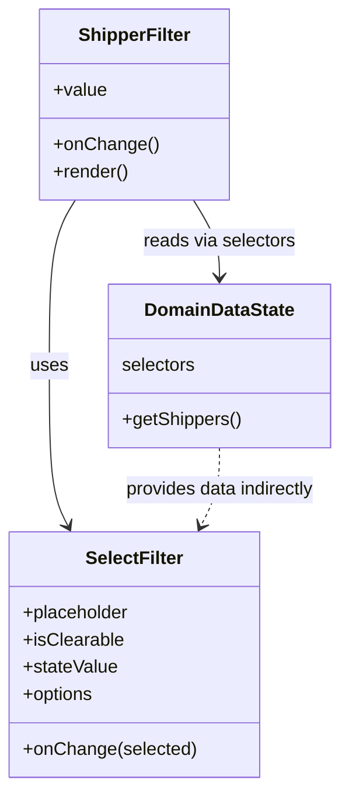

# Diagram: web/portal/src/pages/administration/location-management/search/ShipperFilter.js


> Auto-generated by Obscura crawlers

## Diagram 1

```mermaid
flowchart LR
  SF[ShipperFilter Component] -->|calls useSelector| DS[DomainDataState.selectors.getShippers]
  DS --> SH[shippers (array)]
  SH --> M[map -> options {value,label}]
  SF -->|props: value, onChange| SFProps((props))
  M --> SFOptions[options]
  SFOptions --> SFSelect[SelectFilter]
  SFProps --> SFSelect
  SFSelect -->|onChange(selected) -> onChange(selected?.value)| SF
```

> SVG rendering failed for this diagram.

## Diagram 2



### SVG

<svg id="container" width="294.634765625" xmlns="http://www.w3.org/2000/svg" class="classDiagram" height="692" viewBox="0 0 294.634765625 692" role="graphics-document document" aria-roledescription="class"><style>#container{font-family:"trebuchet ms",verdana,arial,sans-serif;font-size:16px;fill:#333;}@keyframes edge-animation-frame{from{stroke-dashoffset:0;}}@keyframes dash{to{stroke-dashoffset:0;}}#container .edge-animation-slow{stroke-dasharray:9,5!important;stroke-dashoffset:900;animation:dash 50s linear infinite;stroke-linecap:round;}#container .edge-animation-fast{stroke-dasharray:9,5!important;stroke-dashoffset:900;animation:dash 20s linear infinite;stroke-linecap:round;}#container .error-icon{fill:#552222;}#container .error-text{fill:#552222;stroke:#552222;}#container .edge-thickness-normal{stroke-width:1px;}#container .edge-thickness-thick{stroke-width:3.5px;}#container .edge-pattern-solid{stroke-dasharray:0;}#container .edge-thickness-invisible{stroke-width:0;fill:none;}#container .edge-pattern-dashed{stroke-dasharray:3;}#container .edge-pattern-dotted{stroke-dasharray:2;}#container .marker{fill:#333333;stroke:#333333;}#container .marker.cross{stroke:#333333;}#container svg{font-family:"trebuchet ms",verdana,arial,sans-serif;font-size:16px;}#container p{margin:0;}#container g.classGroup text{fill:#9370DB;stroke:none;font-family:"trebuchet ms",verdana,arial,sans-serif;font-size:10px;}#container g.classGroup text .title{font-weight:bolder;}#container .nodeLabel,#container .edgeLabel{color:#131300;}#container .edgeLabel .label rect{fill:#ECECFF;}#container .label text{fill:#131300;}#container .labelBkg{background:#ECECFF;}#container .edgeLabel .label span{background:#ECECFF;}#container .classTitle{font-weight:bolder;}#container .node rect,#container .node circle,#container .node ellipse,#container .node polygon,#container .node path{fill:#ECECFF;stroke:#9370DB;stroke-width:1px;}#container .divider{stroke:#9370DB;stroke-width:1;}#container g.clickable{cursor:pointer;}#container g.classGroup rect{fill:#ECECFF;stroke:#9370DB;}#container g.classGroup line{stroke:#9370DB;stroke-width:1;}#container .classLabel .box{stroke:none;stroke-width:0;fill:#ECECFF;opacity:0.5;}#container .classLabel .label{fill:#9370DB;font-size:10px;}#container .relation{stroke:#333333;stroke-width:1;fill:none;}#container .dashed-line{stroke-dasharray:3;}#container .dotted-line{stroke-dasharray:1 2;}#container #compositionStart,#container .composition{fill:#333333!important;stroke:#333333!important;stroke-width:1;}#container #compositionEnd,#container .composition{fill:#333333!important;stroke:#333333!important;stroke-width:1;}#container #dependencyStart,#container .dependency{fill:#333333!important;stroke:#333333!important;stroke-width:1;}#container #dependencyStart,#container .dependency{fill:#333333!important;stroke:#333333!important;stroke-width:1;}#container #extensionStart,#container .extension{fill:transparent!important;stroke:#333333!important;stroke-width:1;}#container #extensionEnd,#container .extension{fill:transparent!important;stroke:#333333!important;stroke-width:1;}#container #aggregationStart,#container .aggregation{fill:transparent!important;stroke:#333333!important;stroke-width:1;}#container #aggregationEnd,#container .aggregation{fill:transparent!important;stroke:#333333!important;stroke-width:1;}#container #lollipopStart,#container .lollipop{fill:#ECECFF!important;stroke:#333333!important;stroke-width:1;}#container #lollipopEnd,#container .lollipop{fill:#ECECFF!important;stroke:#333333!important;stroke-width:1;}#container .edgeTerminals{font-size:11px;line-height:initial;}#container .classTitleText{text-anchor:middle;font-size:18px;fill:#333;}#container .label-icon{display:inline-block;height:1em;overflow:visible;vertical-align:-0.125em;}#container .node .label-icon path{fill:currentColor;stroke:revert;stroke-width:revert;}#container :root{--mermaid-font-family:"trebuchet ms",verdana,arial,sans-serif;}</style><g><defs><marker id="container_class-aggregationStart" class="marker aggregation class" refX="18" refY="7" markerWidth="190" markerHeight="240" orient="auto"><path d="M 18,7 L9,13 L1,7 L9,1 Z"></path></marker></defs><defs><marker id="container_class-aggregationEnd" class="marker aggregation class" refX="1" refY="7" markerWidth="20" markerHeight="28" orient="auto"><path d="M 18,7 L9,13 L1,7 L9,1 Z"></path></marker></defs><defs><marker id="container_class-extensionStart" class="marker extension class" refX="18" refY="7" markerWidth="190" markerHeight="240" orient="auto"><path d="M 1,7 L18,13 V 1 Z"></path></marker></defs><defs><marker id="container_class-extensionEnd" class="marker extension class" refX="1" refY="7" markerWidth="20" markerHeight="28" orient="auto"><path d="M 1,1 V 13 L18,7 Z"></path></marker></defs><defs><marker id="container_class-compositionStart" class="marker composition class" refX="18" refY="7" markerWidth="190" markerHeight="240" orient="auto"><path d="M 18,7 L9,13 L1,7 L9,1 Z"></path></marker></defs><defs><marker id="container_class-compositionEnd" class="marker composition class" refX="1" refY="7" markerWidth="20" markerHeight="28" orient="auto"><path d="M 18,7 L9,13 L1,7 L9,1 Z"></path></marker></defs><defs><marker id="container_class-dependencyStart" class="marker dependency class" refX="6" refY="7" markerWidth="190" markerHeight="240" orient="auto"><path d="M 5,7 L9,13 L1,7 L9,1 Z"></path></marker></defs><defs><marker id="container_class-dependencyEnd" class="marker dependency class" refX="13" refY="7" markerWidth="20" markerHeight="28" orient="auto"><path d="M 18,7 L9,13 L14,7 L9,1 Z"></path></marker></defs><defs><marker id="container_class-lollipopStart" class="marker lollipop class" refX="13" refY="7" markerWidth="190" markerHeight="240" orient="auto"><circle stroke="black" fill="transparent" cx="7" cy="7" r="6"></circle></marker></defs><defs><marker id="container_class-lollipopEnd" class="marker lollipop class" refX="1" refY="7" markerWidth="190" markerHeight="240" orient="auto"><circle stroke="black" fill="transparent" cx="7" cy="7" r="6"></circle></marker></defs><g class="root"><g class="clusters"></g><g class="edgePaths"><path d="M64.993,176L61.225,182.167C57.457,188.333,49.921,200.667,46.153,225C42.385,249.333,42.385,285.667,42.385,322C42.385,358.333,42.385,394.667,45.075,418.109C47.765,441.552,53.145,452.103,55.835,457.379L58.526,462.655" id="id_ShipperFilter_SelectFilter_1" class="edge-thickness-normal edge-pattern-solid relation" style=";;;" data-edge="true" data-et="edge" data-id="id_ShipperFilter_SelectFilter_1" data-points="W3sieCI6NjQuOTkzMTU1OTkxNzM1NTMsInkiOjE3Nn0seyJ4Ijo0Mi4zODQ3NjU2MjUsInkiOjIxM30seyJ4Ijo0Mi4zODQ3NjU2MjUsInkiOjMyMn0seyJ4Ijo0Mi4zODQ3NjU2MjUsInkiOjQzMX0seyJ4Ijo2MS4yNTEwNzc1ODYyMDY5LCJ5Ijo0Njh9XQ==" marker-end="url(#container_class-dependencyEnd)"></path><path d="M167.647,176L171.416,182.167C175.184,188.333,182.72,200.667,186.488,212C190.256,223.333,190.256,233.667,190.256,238.833L190.256,244" id="id_ShipperFilter_DomainDataState_2" class="edge-thickness-normal edge-pattern-solid relation" style=";;;" data-edge="true" data-et="edge" data-id="id_ShipperFilter_DomainDataState_2" data-points="W3sieCI6MTY3LjY0NzQ2OTAwODI2NDQ3LCJ5IjoxNzZ9LHsieCI6MTkwLjI1NTg1OTM3NSwieSI6MjEzfSx7IngiOjE5MC4yNTU4NTkzNzUsInkiOjI1MH1d" marker-end="url(#container_class-dependencyEnd)"></path><path d="M190.256,394L190.256,400.167C190.256,406.333,190.256,418.667,187.566,430.109C184.876,441.552,179.495,452.103,176.805,457.379L174.115,462.655" id="id_DomainDataState_SelectFilter_3" class="edge-thickness-normal edge-pattern-dashed relation" style=";;;" data-edge="true" data-et="edge" data-id="id_DomainDataState_SelectFilter_3" data-points="W3sieCI6MTkwLjI1NTg1OTM3NSwieSI6Mzk0fSx7IngiOjE5MC4yNTU4NTkzNzUsInkiOjQzMX0seyJ4IjoxNzEuMzg5NTQ3NDEzNzkzMSwieSI6NDY4fV0=" marker-end="url(#container_class-dependencyEnd)"></path></g><g class="edgeLabels"><g class="edgeLabel" transform="translate(42.384765625, 322)"><g class="label" data-id="id_ShipperFilter_SelectFilter_1" transform="translate(-16.4921875, -12)"><foreignObject width="32.984375" height="24"><div xmlns="http://www.w3.org/1999/xhtml" class="labelBkg" style="display: table-cell; white-space: nowrap; line-height: 1.5; max-width: 200px; text-align: center;"><span class="edgeLabel"><p>uses</p></span></div></foreignObject></g></g><g class="edgeLabel" transform="translate(190.255859375, 213)"><g class="label" data-id="id_ShipperFilter_DomainDataState_2" transform="translate(-67.515625, -12)"><foreignObject width="135.03125" height="24"><div xmlns="http://www.w3.org/1999/xhtml" class="labelBkg" style="display: table-cell; white-space: nowrap; line-height: 1.5; max-width: 200px; text-align: center;"><span class="edgeLabel"><p>reads via selectors</p></span></div></foreignObject></g></g><g class="edgeLabel" transform="translate(190.255859375, 431)"><g class="label" data-id="id_DomainDataState_SelectFilter_3" transform="translate(-85.8984375, -12)"><foreignObject width="171.796875" height="24"><div xmlns="http://www.w3.org/1999/xhtml" class="labelBkg" style="display: table-cell; white-space: nowrap; line-height: 1.5; max-width: 200px; text-align: center;"><span class="edgeLabel"><p>provides data indirectly</p></span></div></foreignObject></g></g></g><g class="nodes"><g class="node default" id="classId-ShipperFilter-0" transform="translate(116.3203125, 92)"><g class="basic label-container"><path d="M-80.80859375 -84 L80.80859375 -84 L80.80859375 84 L-80.80859375 84" stroke="none" stroke-width="0" fill="#ECECFF" style=""></path><path d="M-80.80859375 -84 C-48.45912881865825 -84, -16.1096638873165 -84, 80.80859375 -84 M-80.80859375 -84 C-16.533328317471813 -84, 47.74193711505637 -84, 80.80859375 -84 M80.80859375 -84 C80.80859375 -49.15701909741262, 80.80859375 -14.314038194825244, 80.80859375 84 M80.80859375 -84 C80.80859375 -44.77657614716056, 80.80859375 -5.553152294321123, 80.80859375 84 M80.80859375 84 C42.43960964011031 84, 4.0706255302206245 84, -80.80859375 84 M80.80859375 84 C21.515225577751615 84, -37.77814259449677 84, -80.80859375 84 M-80.80859375 84 C-80.80859375 49.75470108278128, -80.80859375 15.509402165562562, -80.80859375 -84 M-80.80859375 84 C-80.80859375 30.96315969820381, -80.80859375 -22.07368060359238, -80.80859375 -84" stroke="#9370DB" stroke-width="1.3" fill="none" stroke-dasharray="0 0" style=""></path></g><g class="annotation-group text" transform="translate(0, -60)"></g><g class="label-group text" transform="translate(-47.4921875, -60)"><g class="label" style="font-weight: bolder" transform="translate(0,-12)"><foreignObject width="94.984375" height="24"><div xmlns="http://www.w3.org/1999/xhtml" style="display: table-cell; white-space: nowrap; line-height: 1.5; max-width: 144px; text-align: center;"><span class="nodeLabel markdown-node-label" style=""><p>ShipperFilter</p></span></div></foreignObject></g></g><g class="members-group text" transform="translate(-68.80859375, -12)"><g class="label" style="" transform="translate(0,-12)"><foreignObject width="46.71875" height="24"><div xmlns="http://www.w3.org/1999/xhtml" style="display: table-cell; white-space: nowrap; line-height: 1.5; max-width: 104px; text-align: center;"><span class="nodeLabel markdown-node-label" style=""><p>+value</p></span></div></foreignObject></g></g><g class="methods-group text" transform="translate(-68.80859375, 36)"><g class="label" style="" transform="translate(0,-12)"><foreignObject width="90.125" height="24"><div xmlns="http://www.w3.org/1999/xhtml" style="display: table-cell; white-space: nowrap; line-height: 1.5; max-width: 147px; text-align: center;"><span class="nodeLabel markdown-node-label" style=""><p>+onChange()</p></span></div></foreignObject></g><g class="label" style="" transform="translate(0,12)"><foreignObject width="66.609375" height="24"><div xmlns="http://www.w3.org/1999/xhtml" style="display: table-cell; white-space: nowrap; line-height: 1.5; max-width: 124px; text-align: center;"><span class="nodeLabel markdown-node-label" style=""><p>+render()</p></span></div></foreignObject></g></g><g class="divider" style=""><path d="M-80.80859375 -36 C-18.306429356991785 -36, 44.19573503601643 -36, 80.80859375 -36 M-80.80859375 -36 C-33.327822046437475 -36, 14.152949657125049 -36, 80.80859375 -36" stroke="#9370DB" stroke-width="1.3" fill="none" stroke-dasharray="0 0" style=""></path></g><g class="divider" style=""><path d="M-80.80859375 12 C-48.013773338259625 12, -15.21895292651925 12, 80.80859375 12 M-80.80859375 12 C-21.292851486466184 12, 38.22289077706763 12, 80.80859375 12" stroke="#9370DB" stroke-width="1.3" fill="none" stroke-dasharray="0 0" style=""></path></g></g><g class="node default" id="classId-SelectFilter-1" transform="translate(116.3203125, 576)"><g class="basic label-container"><path d="M-108.3203125 -108 L108.3203125 -108 L108.3203125 108 L-108.3203125 108" stroke="none" stroke-width="0" fill="#ECECFF" style=""></path><path d="M-108.3203125 -108 C-40.54349805922604 -108, 27.233316381547922 -108, 108.3203125 -108 M-108.3203125 -108 C-54.414273193923734 -108, -0.5082338878474673 -108, 108.3203125 -108 M108.3203125 -108 C108.3203125 -37.29814702434652, 108.3203125 33.40370595130696, 108.3203125 108 M108.3203125 -108 C108.3203125 -44.31266694355968, 108.3203125 19.374666112880647, 108.3203125 108 M108.3203125 108 C44.57199335905584 108, -19.176325781888323 108, -108.3203125 108 M108.3203125 108 C37.79047395833405 108, -32.739364583331906 108, -108.3203125 108 M-108.3203125 108 C-108.3203125 36.072065678739236, -108.3203125 -35.85586864252153, -108.3203125 -108 M-108.3203125 108 C-108.3203125 26.48834546952864, -108.3203125 -55.02330906094272, -108.3203125 -108" stroke="#9370DB" stroke-width="1.3" fill="none" stroke-dasharray="0 0" style=""></path></g><g class="annotation-group text" transform="translate(0, -84)"></g><g class="label-group text" transform="translate(-41.53125, -84)"><g class="label" style="font-weight: bolder" transform="translate(0,-12)"><foreignObject width="83.0625" height="24"><div xmlns="http://www.w3.org/1999/xhtml" style="display: table-cell; white-space: nowrap; line-height: 1.5; max-width: 132px; text-align: center;"><span class="nodeLabel markdown-node-label" style=""><p>SelectFilter</p></span></div></foreignObject></g></g><g class="members-group text" transform="translate(-96.3203125, -36)"><g class="label" style="" transform="translate(0,-12)"><foreignObject width="94.640625" height="24"><div xmlns="http://www.w3.org/1999/xhtml" style="display: table-cell; white-space: nowrap; line-height: 1.5; max-width: 153px; text-align: center;"><span class="nodeLabel markdown-node-label" style=""><p>+placeholder</p></span></div></foreignObject></g><g class="label" style="" transform="translate(0,12)"><foreignObject width="87.796875" height="24"><div xmlns="http://www.w3.org/1999/xhtml" style="display: table-cell; white-space: nowrap; line-height: 1.5; max-width: 145px; text-align: center;"><span class="nodeLabel markdown-node-label" style=""><p>+isClearable</p></span></div></foreignObject></g><g class="label" style="" transform="translate(0,36)"><foreignObject width="83.609375" height="24"><div xmlns="http://www.w3.org/1999/xhtml" style="display: table-cell; white-space: nowrap; line-height: 1.5; max-width: 141px; text-align: center;"><span class="nodeLabel markdown-node-label" style=""><p>+stateValue</p></span></div></foreignObject></g><g class="label" style="" transform="translate(0,60)"><foreignObject width="63.3125" height="24"><div xmlns="http://www.w3.org/1999/xhtml" style="display: table-cell; white-space: nowrap; line-height: 1.5; max-width: 121px; text-align: center;"><span class="nodeLabel markdown-node-label" style=""><p>+options</p></span></div></foreignObject></g></g><g class="methods-group text" transform="translate(-96.3203125, 84)"><g class="label" style="" transform="translate(0,-12)"><foreignObject width="151.109375" height="24"><div xmlns="http://www.w3.org/1999/xhtml" style="display: table-cell; white-space: nowrap; line-height: 1.5; max-width: 208px; text-align: center;"><span class="nodeLabel markdown-node-label" style=""><p>+onChange(selected)</p></span></div></foreignObject></g></g><g class="divider" style=""><path d="M-108.3203125 -60 C-43.9744784099566 -60, 20.371355680086793 -60, 108.3203125 -60 M-108.3203125 -60 C-54.94689467873875 -60, -1.5734768574775018 -60, 108.3203125 -60" stroke="#9370DB" stroke-width="1.3" fill="none" stroke-dasharray="0 0" style=""></path></g><g class="divider" style=""><path d="M-108.3203125 60 C-43.05684701497174 60, 22.206618470056526 60, 108.3203125 60 M-108.3203125 60 C-22.242486675190264 60, 63.83533914961947 60, 108.3203125 60" stroke="#9370DB" stroke-width="1.3" fill="none" stroke-dasharray="0 0" style=""></path></g></g><g class="node default" id="classId-DomainDataState-2" transform="translate(190.255859375, 322)"><g class="basic label-container"><path d="M-96.37890625 -72 L96.37890625 -72 L96.37890625 72 L-96.37890625 72" stroke="none" stroke-width="0" fill="#ECECFF" style=""></path><path d="M-96.37890625 -72 C-21.243403736709766 -72, 53.89209877658047 -72, 96.37890625 -72 M-96.37890625 -72 C-47.991685734856915 -72, 0.3955347802861695 -72, 96.37890625 -72 M96.37890625 -72 C96.37890625 -22.657536228707393, 96.37890625 26.684927542585214, 96.37890625 72 M96.37890625 -72 C96.37890625 -26.78563316668309, 96.37890625 18.428733666633818, 96.37890625 72 M96.37890625 72 C34.807551944537714 72, -26.763802360924572 72, -96.37890625 72 M96.37890625 72 C48.075222881115344 72, -0.22846048776931127 72, -96.37890625 72 M-96.37890625 72 C-96.37890625 15.215930401884158, -96.37890625 -41.568139196231684, -96.37890625 -72 M-96.37890625 72 C-96.37890625 29.941053325429557, -96.37890625 -12.117893349140886, -96.37890625 -72" stroke="#9370DB" stroke-width="1.3" fill="none" stroke-dasharray="0 0" style=""></path></g><g class="annotation-group text" transform="translate(0, -48)"></g><g class="label-group text" transform="translate(-64.1015625, -48)"><g class="label" style="font-weight: bolder" transform="translate(0,-12)"><foreignObject width="128.203125" height="24"><div xmlns="http://www.w3.org/1999/xhtml" style="display: table-cell; white-space: nowrap; line-height: 1.5; max-width: 177px; text-align: center;"><span class="nodeLabel markdown-node-label" style=""><p>DomainDataState</p></span></div></foreignObject></g></g><g class="members-group text" transform="translate(-84.37890625, 0)"><g class="label" style="" transform="translate(0,-12)"><foreignObject width="65.46875" height="24"><div xmlns="http://www.w3.org/1999/xhtml" style="display: table-cell; white-space: nowrap; line-height: 1.5; max-width: 115px; text-align: center;"><span class="nodeLabel markdown-node-label" style=""><p>selectors</p></span></div></foreignObject></g></g><g class="methods-group text" transform="translate(-84.37890625, 48)"><g class="label" style="" transform="translate(0,-12)"><foreignObject width="104.65625" height="24"><div xmlns="http://www.w3.org/1999/xhtml" style="display: table-cell; white-space: nowrap; line-height: 1.5; max-width: 162px; text-align: center;"><span class="nodeLabel markdown-node-label" style=""><p>+getShippers()</p></span></div></foreignObject></g></g><g class="divider" style=""><path d="M-96.37890625 -24 C-22.826026028410865 -24, 50.72685419317827 -24, 96.37890625 -24 M-96.37890625 -24 C-39.40065506462599 -24, 17.577596120748026 -24, 96.37890625 -24" stroke="#9370DB" stroke-width="1.3" fill="none" stroke-dasharray="0 0" style=""></path></g><g class="divider" style=""><path d="M-96.37890625 24 C-27.051595139942066 24, 42.27571597011587 24, 96.37890625 24 M-96.37890625 24 C-29.496803190630573 24, 37.385299868738855 24, 96.37890625 24" stroke="#9370DB" stroke-width="1.3" fill="none" stroke-dasharray="0 0" style=""></path></g></g></g></g></g></svg>
