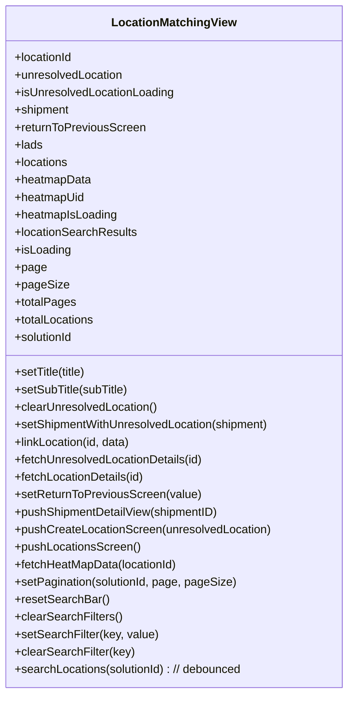

# Diagram: web/portal/src/pages/administration/location-management/unresolved-location-matching/LocationManager.UnresolvedLocationMatching.page.container.js


> Auto-generated by Obscura crawlers

## Diagram 1

```mermaid
flowchart LR
  subgraph State_Select[State selectors]
    LMSEL[LocationMatchingState.selectors]
    SBSEL[LocationMatchingViewSearchBarState.selectors]
    LADS[LadsState.selectors.getLadsList]
    ORG[getSolutionId]
  end
  subgraph Redux_State[state]
    STATE[state]
  end
  STATE -->|passed into| LMSEL
  STATE -->|passed into| SBSEL
  STATE -->|passed into| LADS
  STATE -->|passed into| ORG
  LMSEL -->|getUnresolvedLocationId, getUnresolvedLocation, getShipmentWithUnresolvedLocation, getReturnToPreviousScreen| mapStateToProps[mapStateToProps]
  SBSEL -->|getSearchResults, getIsLoading, getPage, getPageSize, getTotalPages, getTotalEntities| mapStateToProps
  LADS -->|getLadsList| mapStateToProps
  ORG -->|getSolutionId| mapStateToProps
  STATE -->|state.locations & state.locationMatching heatmap fields| mapStateToProps
  mapStateToProps -->|provides props| Props[Props object]
  subgraph Action_Creators[Action creators & dispatch]
    LMAC[LocationMatchingState.actionCreators]
    TITLE[TitleState.actionCreators]
    SBAC[LocationMatchingViewSearchBarState.actionCreators]
    FETCHS[fetchHeatMapData, fetchLocationDetails, matchLocation]
  end
  LMAC --> mapDispatchToProps[mapDispatchToProps]
  TITLE --> mapDispatchToProps
  SBAC --> mapDispatchToProps
  FETCHS --> mapDispatchToProps
  mapDispatchToProps -->|provides callbacks| Props
  connect[connect(mapStateToProps, mapDispatchToProps)] --> LocationMatchingView[LocationMatchingView]
  Props --> connect
```

> SVG rendering failed for this diagram.

## Diagram 2



### SVG

<svg id="container" width="477.1953125" xmlns="http://www.w3.org/2000/svg" class="classDiagram" height="952" viewBox="0 0 477.1953125 952" role="graphics-document document" aria-roledescription="class"><style>#container{font-family:"trebuchet ms",verdana,arial,sans-serif;font-size:16px;fill:#333;}@keyframes edge-animation-frame{from{stroke-dashoffset:0;}}@keyframes dash{to{stroke-dashoffset:0;}}#container .edge-animation-slow{stroke-dasharray:9,5!important;stroke-dashoffset:900;animation:dash 50s linear infinite;stroke-linecap:round;}#container .edge-animation-fast{stroke-dasharray:9,5!important;stroke-dashoffset:900;animation:dash 20s linear infinite;stroke-linecap:round;}#container .error-icon{fill:#552222;}#container .error-text{fill:#552222;stroke:#552222;}#container .edge-thickness-normal{stroke-width:1px;}#container .edge-thickness-thick{stroke-width:3.5px;}#container .edge-pattern-solid{stroke-dasharray:0;}#container .edge-thickness-invisible{stroke-width:0;fill:none;}#container .edge-pattern-dashed{stroke-dasharray:3;}#container .edge-pattern-dotted{stroke-dasharray:2;}#container .marker{fill:#333333;stroke:#333333;}#container .marker.cross{stroke:#333333;}#container svg{font-family:"trebuchet ms",verdana,arial,sans-serif;font-size:16px;}#container p{margin:0;}#container g.classGroup text{fill:#9370DB;stroke:none;font-family:"trebuchet ms",verdana,arial,sans-serif;font-size:10px;}#container g.classGroup text .title{font-weight:bolder;}#container .nodeLabel,#container .edgeLabel{color:#131300;}#container .edgeLabel .label rect{fill:#ECECFF;}#container .label text{fill:#131300;}#container .labelBkg{background:#ECECFF;}#container .edgeLabel .label span{background:#ECECFF;}#container .classTitle{font-weight:bolder;}#container .node rect,#container .node circle,#container .node ellipse,#container .node polygon,#container .node path{fill:#ECECFF;stroke:#9370DB;stroke-width:1px;}#container .divider{stroke:#9370DB;stroke-width:1;}#container g.clickable{cursor:pointer;}#container g.classGroup rect{fill:#ECECFF;stroke:#9370DB;}#container g.classGroup line{stroke:#9370DB;stroke-width:1;}#container .classLabel .box{stroke:none;stroke-width:0;fill:#ECECFF;opacity:0.5;}#container .classLabel .label{fill:#9370DB;font-size:10px;}#container .relation{stroke:#333333;stroke-width:1;fill:none;}#container .dashed-line{stroke-dasharray:3;}#container .dotted-line{stroke-dasharray:1 2;}#container #compositionStart,#container .composition{fill:#333333!important;stroke:#333333!important;stroke-width:1;}#container #compositionEnd,#container .composition{fill:#333333!important;stroke:#333333!important;stroke-width:1;}#container #dependencyStart,#container .dependency{fill:#333333!important;stroke:#333333!important;stroke-width:1;}#container #dependencyStart,#container .dependency{fill:#333333!important;stroke:#333333!important;stroke-width:1;}#container #extensionStart,#container .extension{fill:transparent!important;stroke:#333333!important;stroke-width:1;}#container #extensionEnd,#container .extension{fill:transparent!important;stroke:#333333!important;stroke-width:1;}#container #aggregationStart,#container .aggregation{fill:transparent!important;stroke:#333333!important;stroke-width:1;}#container #aggregationEnd,#container .aggregation{fill:transparent!important;stroke:#333333!important;stroke-width:1;}#container #lollipopStart,#container .lollipop{fill:#ECECFF!important;stroke:#333333!important;stroke-width:1;}#container #lollipopEnd,#container .lollipop{fill:#ECECFF!important;stroke:#333333!important;stroke-width:1;}#container .edgeTerminals{font-size:11px;line-height:initial;}#container .classTitleText{text-anchor:middle;font-size:18px;fill:#333;}#container .label-icon{display:inline-block;height:1em;overflow:visible;vertical-align:-0.125em;}#container .node .label-icon path{fill:currentColor;stroke:revert;stroke-width:revert;}#container :root{--mermaid-font-family:"trebuchet ms",verdana,arial,sans-serif;}</style><g><defs><marker id="container_class-aggregationStart" class="marker aggregation class" refX="18" refY="7" markerWidth="190" markerHeight="240" orient="auto"><path d="M 18,7 L9,13 L1,7 L9,1 Z"></path></marker></defs><defs><marker id="container_class-aggregationEnd" class="marker aggregation class" refX="1" refY="7" markerWidth="20" markerHeight="28" orient="auto"><path d="M 18,7 L9,13 L1,7 L9,1 Z"></path></marker></defs><defs><marker id="container_class-extensionStart" class="marker extension class" refX="18" refY="7" markerWidth="190" markerHeight="240" orient="auto"><path d="M 1,7 L18,13 V 1 Z"></path></marker></defs><defs><marker id="container_class-extensionEnd" class="marker extension class" refX="1" refY="7" markerWidth="20" markerHeight="28" orient="auto"><path d="M 1,1 V 13 L18,7 Z"></path></marker></defs><defs><marker id="container_class-compositionStart" class="marker composition class" refX="18" refY="7" markerWidth="190" markerHeight="240" orient="auto"><path d="M 18,7 L9,13 L1,7 L9,1 Z"></path></marker></defs><defs><marker id="container_class-compositionEnd" class="marker composition class" refX="1" refY="7" markerWidth="20" markerHeight="28" orient="auto"><path d="M 18,7 L9,13 L1,7 L9,1 Z"></path></marker></defs><defs><marker id="container_class-dependencyStart" class="marker dependency class" refX="6" refY="7" markerWidth="190" markerHeight="240" orient="auto"><path d="M 5,7 L9,13 L1,7 L9,1 Z"></path></marker></defs><defs><marker id="container_class-dependencyEnd" class="marker dependency class" refX="13" refY="7" markerWidth="20" markerHeight="28" orient="auto"><path d="M 18,7 L9,13 L14,7 L9,1 Z"></path></marker></defs><defs><marker id="container_class-lollipopStart" class="marker lollipop class" refX="13" refY="7" markerWidth="190" markerHeight="240" orient="auto"><circle stroke="black" fill="transparent" cx="7" cy="7" r="6"></circle></marker></defs><defs><marker id="container_class-lollipopEnd" class="marker lollipop class" refX="1" refY="7" markerWidth="190" markerHeight="240" orient="auto"><circle stroke="black" fill="transparent" cx="7" cy="7" r="6"></circle></marker></defs><g class="root"><g class="clusters"></g><g class="edgePaths"></g><g class="edgeLabels"></g><g class="nodes"><g class="node default" id="classId-LocationMatchingView-0" transform="translate(238.59765625, 476)"><g class="basic label-container"><path d="M-230.59765625 -468 L230.59765625 -468 L230.59765625 468 L-230.59765625 468" stroke="none" stroke-width="0" fill="#ECECFF" style=""></path><path d="M-230.59765625 -468 C-58.38491795970049 -468, 113.82782033059902 -468, 230.59765625 -468 M-230.59765625 -468 C-120.36544704063047 -468, -10.133237831260942 -468, 230.59765625 -468 M230.59765625 -468 C230.59765625 -230.1218472943234, 230.59765625 7.756305411353196, 230.59765625 468 M230.59765625 -468 C230.59765625 -274.7292452532811, 230.59765625 -81.45849050656216, 230.59765625 468 M230.59765625 468 C119.32805491725547 468, 8.058453584510943 468, -230.59765625 468 M230.59765625 468 C92.39626917750599 468, -45.80511789498803 468, -230.59765625 468 M-230.59765625 468 C-230.59765625 204.09306881414716, -230.59765625 -59.81386237170568, -230.59765625 -468 M-230.59765625 468 C-230.59765625 179.7373839622391, -230.59765625 -108.52523207552179, -230.59765625 -468" stroke="#9370DB" stroke-width="1.3" fill="none" stroke-dasharray="0 0" style=""></path></g><g class="annotation-group text" transform="translate(0, -444)"></g><g class="label-group text" transform="translate(-81.9140625, -444)"><g class="label" style="font-weight: bolder" transform="translate(0,-12)"><foreignObject width="163.828125" height="24"><div xmlns="http://www.w3.org/1999/xhtml" style="display: table-cell; white-space: nowrap; line-height: 1.5; max-width: 212px; text-align: center;"><span class="nodeLabel markdown-node-label" style=""><p>LocationMatchingView</p></span></div></foreignObject></g></g><g class="members-group text" transform="translate(-218.59765625, -396)"><g class="label" style="" transform="translate(0,-12)"><foreignObject width="81.4375" height="24"><div xmlns="http://www.w3.org/1999/xhtml" style="display: table-cell; white-space: nowrap; line-height: 1.5; max-width: 139px; text-align: center;"><span class="nodeLabel markdown-node-label" style=""><p>+locationId</p></span></div></foreignObject></g><g class="label" style="" transform="translate(0,12)"><foreignObject width="150.640625" height="24"><div xmlns="http://www.w3.org/1999/xhtml" style="display: table-cell; white-space: nowrap; line-height: 1.5; max-width: 208px; text-align: center;"><span class="nodeLabel markdown-node-label" style=""><p>+unresolvedLocation</p></span></div></foreignObject></g><g class="label" style="" transform="translate(0,36)"><foreignObject width="221.140625" height="24"><div xmlns="http://www.w3.org/1999/xhtml" style="display: table-cell; white-space: nowrap; line-height: 1.5; max-width: 279px; text-align: center;"><span class="nodeLabel markdown-node-label" style=""><p>+isUnresolvedLocationLoading</p></span></div></foreignObject></g><g class="label" style="" transform="translate(0,60)"><foreignObject width="76.4375" height="24"><div xmlns="http://www.w3.org/1999/xhtml" style="display: table-cell; white-space: nowrap; line-height: 1.5; max-width: 134px; text-align: center;"><span class="nodeLabel markdown-node-label" style=""><p>+shipment</p></span></div></foreignObject></g><g class="label" style="" transform="translate(0,84)"><foreignObject width="180.5" height="24"><div xmlns="http://www.w3.org/1999/xhtml" style="display: table-cell; white-space: nowrap; line-height: 1.5; max-width: 238px; text-align: center;"><span class="nodeLabel markdown-node-label" style=""><p>+returnToPreviousScreen</p></span></div></foreignObject></g><g class="label" style="" transform="translate(0,108)"><foreignObject width="38.34375" height="24"><div xmlns="http://www.w3.org/1999/xhtml" style="display: table-cell; white-space: nowrap; line-height: 1.5; max-width: 96px; text-align: center;"><span class="nodeLabel markdown-node-label" style=""><p>+lads</p></span></div></foreignObject></g><g class="label" style="" transform="translate(0,132)"><foreignObject width="74.609375" height="24"><div xmlns="http://www.w3.org/1999/xhtml" style="display: table-cell; white-space: nowrap; line-height: 1.5; max-width: 132px; text-align: center;"><span class="nodeLabel markdown-node-label" style=""><p>+locations</p></span></div></foreignObject></g><g class="label" style="" transform="translate(0,156)"><foreignObject width="105.546875" height="24"><div xmlns="http://www.w3.org/1999/xhtml" style="display: table-cell; white-space: nowrap; line-height: 1.5; max-width: 163px; text-align: center;"><span class="nodeLabel markdown-node-label" style=""><p>+heatmapData</p></span></div></foreignObject></g><g class="label" style="" transform="translate(0,180)"><foreignObject width="97" height="24"><div xmlns="http://www.w3.org/1999/xhtml" style="display: table-cell; white-space: nowrap; line-height: 1.5; max-width: 154px; text-align: center;"><span class="nodeLabel markdown-node-label" style=""><p>+heatmapUid</p></span></div></foreignObject></g><g class="label" style="" transform="translate(0,204)"><foreignObject width="141.75" height="24"><div xmlns="http://www.w3.org/1999/xhtml" style="display: table-cell; white-space: nowrap; line-height: 1.5; max-width: 200px; text-align: center;"><span class="nodeLabel markdown-node-label" style=""><p>+heatmapIsLoading</p></span></div></foreignObject></g><g class="label" style="" transform="translate(0,228)"><foreignObject width="168.734375" height="24"><div xmlns="http://www.w3.org/1999/xhtml" style="display: table-cell; white-space: nowrap; line-height: 1.5; max-width: 226px; text-align: center;"><span class="nodeLabel markdown-node-label" style=""><p>+locationSearchResults</p></span></div></foreignObject></g><g class="label" style="" transform="translate(0,252)"><foreignObject width="77.203125" height="24"><div xmlns="http://www.w3.org/1999/xhtml" style="display: table-cell; white-space: nowrap; line-height: 1.5; max-width: 135px; text-align: center;"><span class="nodeLabel markdown-node-label" style=""><p>+isLoading</p></span></div></foreignObject></g><g class="label" style="" transform="translate(0,276)"><foreignObject width="42.65625" height="24"><div xmlns="http://www.w3.org/1999/xhtml" style="display: table-cell; white-space: nowrap; line-height: 1.5; max-width: 100px; text-align: center;"><span class="nodeLabel markdown-node-label" style=""><p>+page</p></span></div></foreignObject></g><g class="label" style="" transform="translate(0,300)"><foreignObject width="71.5" height="24"><div xmlns="http://www.w3.org/1999/xhtml" style="display: table-cell; white-space: nowrap; line-height: 1.5; max-width: 129px; text-align: center;"><span class="nodeLabel markdown-node-label" style=""><p>+pageSize</p></span></div></foreignObject></g><g class="label" style="" transform="translate(0,324)"><foreignObject width="82.90625" height="24"><div xmlns="http://www.w3.org/1999/xhtml" style="display: table-cell; white-space: nowrap; line-height: 1.5; max-width: 140px; text-align: center;"><span class="nodeLabel markdown-node-label" style=""><p>+totalPages</p></span></div></foreignObject></g><g class="label" style="" transform="translate(0,348)"><foreignObject width="111.265625" height="24"><div xmlns="http://www.w3.org/1999/xhtml" style="display: table-cell; white-space: nowrap; line-height: 1.5; max-width: 169px; text-align: center;"><span class="nodeLabel markdown-node-label" style=""><p>+totalLocations</p></span></div></foreignObject></g><g class="label" style="" transform="translate(0,372)"><foreignObject width="82.109375" height="24"><div xmlns="http://www.w3.org/1999/xhtml" style="display: table-cell; white-space: nowrap; line-height: 1.5; max-width: 139px; text-align: center;"><span class="nodeLabel markdown-node-label" style=""><p>+solutionId</p></span></div></foreignObject></g></g><g class="methods-group text" transform="translate(-218.59765625, 36)"><g class="label" style="" transform="translate(0,-12)"><foreignObject width="101.28125" height="24"><div xmlns="http://www.w3.org/1999/xhtml" style="display: table-cell; white-space: nowrap; line-height: 1.5; max-width: 159px; text-align: center;"><span class="nodeLabel markdown-node-label" style=""><p>+setTitle(title)</p></span></div></foreignObject></g><g class="label" style="" transform="translate(0,12)"><foreignObject width="157.609375" height="24"><div xmlns="http://www.w3.org/1999/xhtml" style="display: table-cell; white-space: nowrap; line-height: 1.5; max-width: 215px; text-align: center;"><span class="nodeLabel markdown-node-label" style=""><p>+setSubTitle(subTitle)</p></span></div></foreignObject></g><g class="label" style="" transform="translate(0,36)"><foreignObject width="198" height="24"><div xmlns="http://www.w3.org/1999/xhtml" style="display: table-cell; white-space: nowrap; line-height: 1.5; max-width: 255px; text-align: center;"><span class="nodeLabel markdown-node-label" style=""><p>+clearUnresolvedLocation()</p></span></div></foreignObject></g><g class="label" style="" transform="translate(0,60)"><foreignObject width="355.28125" height="24"><div xmlns="http://www.w3.org/1999/xhtml" style="display: table-cell; white-space: nowrap; line-height: 1.5; max-width: 413px; text-align: center;"><span class="nodeLabel markdown-node-label" style=""><p>+setShipmentWithUnresolvedLocation(shipment)</p></span></div></foreignObject></g><g class="label" style="" transform="translate(0,84)"><foreignObject width="162.046875" height="24"><div xmlns="http://www.w3.org/1999/xhtml" style="display: table-cell; white-space: nowrap; line-height: 1.5; max-width: 219px; text-align: center;"><span class="nodeLabel markdown-node-label" style=""><p>+linkLocation(id, data)</p></span></div></foreignObject></g><g class="label" style="" transform="translate(0,108)"><foreignObject width="262.6875" height="24"><div xmlns="http://www.w3.org/1999/xhtml" style="display: table-cell; white-space: nowrap; line-height: 1.5; max-width: 320px; text-align: center;"><span class="nodeLabel markdown-node-label" style=""><p>+fetchUnresolvedLocationDetails(id)</p></span></div></foreignObject></g><g class="label" style="" transform="translate(0,132)"><foreignObject width="180.859375" height="24"><div xmlns="http://www.w3.org/1999/xhtml" style="display: table-cell; white-space: nowrap; line-height: 1.5; max-width: 238px; text-align: center;"><span class="nodeLabel markdown-node-label" style=""><p>+fetchLocationDetails(id)</p></span></div></foreignObject></g><g class="label" style="" transform="translate(0,156)"><foreignObject width="255.46875" height="24"><div xmlns="http://www.w3.org/1999/xhtml" style="display: table-cell; white-space: nowrap; line-height: 1.5; max-width: 313px; text-align: center;"><span class="nodeLabel markdown-node-label" style=""><p>+setReturnToPreviousScreen(value)</p></span></div></foreignObject></g><g class="label" style="" transform="translate(0,180)"><foreignObject width="283.390625" height="24"><div xmlns="http://www.w3.org/1999/xhtml" style="display: table-cell; white-space: nowrap; line-height: 1.5; max-width: 341px; text-align: center;"><span class="nodeLabel markdown-node-label" style=""><p>+pushShipmentDetailView(shipmentID)</p></span></div></foreignObject></g><g class="label" style="" transform="translate(0,204)"><foreignObject width="353.609375" height="24"><div xmlns="http://www.w3.org/1999/xhtml" style="display: table-cell; white-space: nowrap; line-height: 1.5; max-width: 411px; text-align: center;"><span class="nodeLabel markdown-node-label" style=""><p>+pushCreateLocationScreen(unresolvedLocation)</p></span></div></foreignObject></g><g class="label" style="" transform="translate(0,228)"><foreignObject width="172.484375" height="24"><div xmlns="http://www.w3.org/1999/xhtml" style="display: table-cell; white-space: nowrap; line-height: 1.5; max-width: 230px; text-align: center;"><span class="nodeLabel markdown-node-label" style=""><p>+pushLocationsScreen()</p></span></div></foreignObject></g><g class="label" style="" transform="translate(0,252)"><foreignObject width="225.828125" height="24"><div xmlns="http://www.w3.org/1999/xhtml" style="display: table-cell; white-space: nowrap; line-height: 1.5; max-width: 283px; text-align: center;"><span class="nodeLabel markdown-node-label" style=""><p>+fetchHeatMapData(locationId)</p></span></div></foreignObject></g><g class="label" style="" transform="translate(0,276)"><foreignObject width="305.5" height="24"><div xmlns="http://www.w3.org/1999/xhtml" style="display: table-cell; white-space: nowrap; line-height: 1.5; max-width: 363px; text-align: center;"><span class="nodeLabel markdown-node-label" style=""><p>+setPagination(solutionId, page, pageSize)</p></span></div></foreignObject></g><g class="label" style="" transform="translate(0,300)"><foreignObject width="128.0625" height="24"><div xmlns="http://www.w3.org/1999/xhtml" style="display: table-cell; white-space: nowrap; line-height: 1.5; max-width: 185px; text-align: center;"><span class="nodeLabel markdown-node-label" style=""><p>+resetSearchBar()</p></span></div></foreignObject></g><g class="label" style="" transform="translate(0,324)"><foreignObject width="146.921875" height="24"><div xmlns="http://www.w3.org/1999/xhtml" style="display: table-cell; white-space: nowrap; line-height: 1.5; max-width: 204px; text-align: center;"><span class="nodeLabel markdown-node-label" style=""><p>+clearSearchFilters()</p></span></div></foreignObject></g><g class="label" style="" transform="translate(0,348)"><foreignObject width="196.859375" height="24"><div xmlns="http://www.w3.org/1999/xhtml" style="display: table-cell; white-space: nowrap; line-height: 1.5; max-width: 254px; text-align: center;"><span class="nodeLabel markdown-node-label" style=""><p>+setSearchFilter(key, value)</p></span></div></foreignObject></g><g class="label" style="" transform="translate(0,372)"><foreignObject width="164.265625" height="24"><div xmlns="http://www.w3.org/1999/xhtml" style="display: table-cell; white-space: nowrap; line-height: 1.5; max-width: 222px; text-align: center;"><span class="nodeLabel markdown-node-label" style=""><p>+clearSearchFilter(key)</p></span></div></foreignObject></g><g class="label" style="" transform="translate(0,396)"><foreignObject width="322.234375" height="24"><div xmlns="http://www.w3.org/1999/xhtml" style="display: table-cell; white-space: nowrap; line-height: 1.5; max-width: 380px; text-align: center;"><span class="nodeLabel markdown-node-label" style=""><p>+searchLocations(solutionId) : // debounced</p></span></div></foreignObject></g></g><g class="divider" style=""><path d="M-230.59765625 -420 C-83.82929009065197 -420, 62.93907606869607 -420, 230.59765625 -420 M-230.59765625 -420 C-113.48730543032464 -420, 3.6230453893507217 -420, 230.59765625 -420" stroke="#9370DB" stroke-width="1.3" fill="none" stroke-dasharray="0 0" style=""></path></g><g class="divider" style=""><path d="M-230.59765625 12 C-55.36980050431569 12, 119.85805524136862 12, 230.59765625 12 M-230.59765625 12 C-92.12110236726488 12, 46.355451515470236 12, 230.59765625 12" stroke="#9370DB" stroke-width="1.3" fill="none" stroke-dasharray="0 0" style=""></path></g></g></g></g></g></svg>
