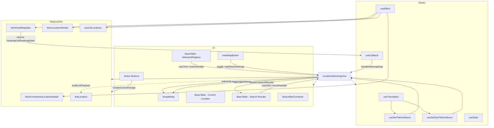

# Diagram: web/portal/src/pages/administration/location-management/unresolved-location-matching/LocationManager.UnresolvedLocationMatching.page.js


> Auto-generated by Obscura crawlers

## Diagram 1



### SVG

<svg id="container" width="3313.625" xmlns="http://www.w3.org/2000/svg" class="flowchart" height="859" viewBox="0 0 3313.625 859" role="graphics-document document" aria-roledescription="flowchart-v2"><style>#container{font-family:"trebuchet ms",verdana,arial,sans-serif;font-size:16px;fill:#333;}@keyframes edge-animation-frame{from{stroke-dashoffset:0;}}@keyframes dash{to{stroke-dashoffset:0;}}#container .edge-animation-slow{stroke-dasharray:9,5!important;stroke-dashoffset:900;animation:dash 50s linear infinite;stroke-linecap:round;}#container .edge-animation-fast{stroke-dasharray:9,5!important;stroke-dashoffset:900;animation:dash 20s linear infinite;stroke-linecap:round;}#container .error-icon{fill:#552222;}#container .error-text{fill:#552222;stroke:#552222;}#container .edge-thickness-normal{stroke-width:1px;}#container .edge-thickness-thick{stroke-width:3.5px;}#container .edge-pattern-solid{stroke-dasharray:0;}#container .edge-thickness-invisible{stroke-width:0;fill:none;}#container .edge-pattern-dashed{stroke-dasharray:3;}#container .edge-pattern-dotted{stroke-dasharray:2;}#container .marker{fill:#333333;stroke:#333333;}#container .marker.cross{stroke:#333333;}#container svg{font-family:"trebuchet ms",verdana,arial,sans-serif;font-size:16px;}#container p{margin:0;}#container .label{font-family:"trebuchet ms",verdana,arial,sans-serif;color:#333;}#container .cluster-label text{fill:#333;}#container .cluster-label span{color:#333;}#container .cluster-label span p{background-color:transparent;}#container .label text,#container span{fill:#333;color:#333;}#container .node rect,#container .node circle,#container .node ellipse,#container .node polygon,#container .node path{fill:#ECECFF;stroke:#9370DB;stroke-width:1px;}#container .rough-node .label text,#container .node .label text,#container .image-shape .label,#container .icon-shape .label{text-anchor:middle;}#container .node .katex path{fill:#000;stroke:#000;stroke-width:1px;}#container .rough-node .label,#container .node .label,#container .image-shape .label,#container .icon-shape .label{text-align:center;}#container .node.clickable{cursor:pointer;}#container .root .anchor path{fill:#333333!important;stroke-width:0;stroke:#333333;}#container .arrowheadPath{fill:#333333;}#container .edgePath .path{stroke:#333333;stroke-width:2.0px;}#container .flowchart-link{stroke:#333333;fill:none;}#container .edgeLabel{background-color:rgba(232,232,232, 0.8);text-align:center;}#container .edgeLabel p{background-color:rgba(232,232,232, 0.8);}#container .edgeLabel rect{opacity:0.5;background-color:rgba(232,232,232, 0.8);fill:rgba(232,232,232, 0.8);}#container .labelBkg{background-color:rgba(232, 232, 232, 0.5);}#container .cluster rect{fill:#ffffde;stroke:#aaaa33;stroke-width:1px;}#container .cluster text{fill:#333;}#container .cluster span{color:#333;}#container div.mermaidTooltip{position:absolute;text-align:center;max-width:200px;padding:2px;font-family:"trebuchet ms",verdana,arial,sans-serif;font-size:12px;background:hsl(80, 100%, 96.2745098039%);border:1px solid #aaaa33;border-radius:2px;pointer-events:none;z-index:100;}#container .flowchartTitleText{text-anchor:middle;font-size:18px;fill:#333;}#container rect.text{fill:none;stroke-width:0;}#container .icon-shape,#container .image-shape{background-color:rgba(232,232,232, 0.8);text-align:center;}#container .icon-shape p,#container .image-shape p{background-color:rgba(232,232,232, 0.8);padding:2px;}#container .icon-shape rect,#container .image-shape rect{opacity:0.5;background-color:rgba(232,232,232, 0.8);fill:rgba(232,232,232, 0.8);}#container .label-icon{display:inline-block;height:1em;overflow:visible;vertical-align:-0.125em;}#container .node .label-icon path{fill:currentColor;stroke:revert;stroke-width:revert;}#container :root{--mermaid-font-family:"trebuchet ms",verdana,arial,sans-serif;}</style><g><marker id="container_flowchart-v2-pointEnd" class="marker flowchart-v2" viewBox="0 0 10 10" refX="5" refY="5" markerUnits="userSpaceOnUse" markerWidth="8" markerHeight="8" orient="auto"><path d="M 0 0 L 10 5 L 0 10 z" class="arrowMarkerPath" style="stroke-width: 1; stroke-dasharray: 1, 0;"></path></marker><marker id="container_flowchart-v2-pointStart" class="marker flowchart-v2" viewBox="0 0 10 10" refX="4.5" refY="5" markerUnits="userSpaceOnUse" markerWidth="8" markerHeight="8" orient="auto"><path d="M 0 5 L 10 10 L 10 0 z" class="arrowMarkerPath" style="stroke-width: 1; stroke-dasharray: 1, 0;"></path></marker><marker id="container_flowchart-v2-circleEnd" class="marker flowchart-v2" viewBox="0 0 10 10" refX="11" refY="5" markerUnits="userSpaceOnUse" markerWidth="11" markerHeight="11" orient="auto"><circle cx="5" cy="5" r="5" class="arrowMarkerPath" style="stroke-width: 1; stroke-dasharray: 1, 0;"></circle></marker><marker id="container_flowchart-v2-circleStart" class="marker flowchart-v2" viewBox="0 0 10 10" refX="-1" refY="5" markerUnits="userSpaceOnUse" markerWidth="11" markerHeight="11" orient="auto"><circle cx="5" cy="5" r="5" class="arrowMarkerPath" style="stroke-width: 1; stroke-dasharray: 1, 0;"></circle></marker><marker id="container_flowchart-v2-crossEnd" class="marker cross flowchart-v2" viewBox="0 0 11 11" refX="12" refY="5.2" markerUnits="userSpaceOnUse" markerWidth="11" markerHeight="11" orient="auto"><path d="M 1,1 l 9,9 M 10,1 l -9,9" class="arrowMarkerPath" style="stroke-width: 2; stroke-dasharray: 1, 0;"></path></marker><marker id="container_flowchart-v2-crossStart" class="marker cross flowchart-v2" viewBox="0 0 11 11" refX="-1" refY="5.2" markerUnits="userSpaceOnUse" markerWidth="11" markerHeight="11" orient="auto"><path d="M 1,1 l 9,9 M 10,1 l -9,9" class="arrowMarkerPath" style="stroke-width: 2; stroke-dasharray: 1, 0;"></path></marker><g class="root"><g class="clusters"><g class="cluster" id="Redux/APIs" data-look="classic"><rect style="" x="8" y="137" width="750" height="585"></rect><g class="cluster-label" transform="translate(341.3515625, 137)"><foreignObject width="83.296875" height="24"><div xmlns="http://www.w3.org/1999/xhtml" style="display: table-cell; white-space: nowrap; line-height: 1.5; max-width: 200px; text-align: center;"><span class="nodeLabel"><p>Redux/APIs</p></span></div></foreignObject></g></g><g class="cluster" id="UI" data-look="classic"><rect style="" x="778" y="314" width="1344.51953125" height="408"></rect><g class="cluster-label" transform="translate(1442.603515625, 314)"><foreignObject width="15.3125" height="24"><div xmlns="http://www.w3.org/1999/xhtml" style="display: table-cell; white-space: nowrap; line-height: 1.5; max-width: 200px; text-align: center;"><span class="nodeLabel"><p>UI</p></span></div></foreignObject></g></g><g class="cluster" id="Hooks" data-look="classic"><rect style="" x="2414.16015625" y="8" width="891.46484375" height="843"></rect><g class="cluster-label" transform="translate(2837.314453125, 8)"><foreignObject width="45.15625" height="24"><div xmlns="http://www.w3.org/1999/xhtml" style="display: table-cell; white-space: nowrap; line-height: 1.5; max-width: 200px; text-align: center;"><span class="nodeLabel"><p>Hooks</p></span></div></foreignObject></g></g></g><g class="edgePaths"><path d="M2650.285,685L2650.285,691.167C2650.285,697.333,2650.285,709.667,2650.285,720C2650.285,730.333,2650.285,738.667,2654.528,746.56C2658.77,754.453,2667.256,761.907,2671.498,765.634L2675.741,769.36" id="L_UT_USO_0" class="edge-thickness-normal edge-pattern-solid edge-thickness-normal edge-pattern-solid flowchart-link" style=";" data-edge="true" data-et="edge" data-id="L_UT_USO_0" data-points="W3sieCI6MjY1MC4yODUxNTYyNSwieSI6Njg1fSx7IngiOjI2NTAuMjg1MTU2MjUsInkiOjcyMn0seyJ4IjoyNjUwLjI4NTE1NjI1LCJ5Ijo3NDd9LHsieCI6MjY3OC43NDYzMTkxMTA1NzcsInkiOjc3Mn1d" marker-end="url(#container_flowchart-v2-pointEnd)"></path><path d="M2733.684,684.079L2753.895,690.399C2774.105,696.72,2814.527,709.36,2834.738,719.847C2854.949,730.333,2854.949,738.667,2864.387,746.745C2873.824,754.823,2892.699,762.646,2902.136,766.557L2911.574,770.468" id="L_UT_USSO_0" class="edge-thickness-normal edge-pattern-solid edge-thickness-normal edge-pattern-solid flowchart-link" style=";" data-edge="true" data-et="edge" data-id="L_UT_USSO_0" data-points="W3sieCI6MjczMy42ODM1OTM3NSwieSI6Njg0LjA3OTMyMjA1OTc3Nzh9LHsieCI6Mjg1NC45NDkyMTg3NSwieSI6NzIyfSx7IngiOjI4NTQuOTQ5MjE4NzUsInkiOjc0N30seyJ4IjoyOTE1LjI2ODg1NTE2ODI2OSwieSI6NzcyfV0=" marker-end="url(#container_flowchart-v2-pointEnd)"></path><path d="M2774.63,772L2784.683,767.833C2794.736,763.667,2814.843,755.333,2824.896,747C2834.949,738.667,2834.949,730.333,2834.949,715.5C2834.949,700.667,2834.949,679.333,2834.949,656C2834.949,632.667,2834.949,607.333,2759.647,586.161C2684.344,564.989,2533.74,547.978,2458.437,539.472L2383.135,530.966" id="L_USO_LM_0" class="edge-thickness-normal edge-pattern-solid edge-thickness-normal edge-pattern-solid flowchart-link" style=";" data-edge="true" data-et="edge" data-id="L_USO_LM_0" data-points="W3sieCI6Mjc3NC42Mjk1ODIzMzE3MzEsInkiOjc3Mn0seyJ4IjoyODM0Ljk0OTIxODc1LCJ5Ijo3NDd9LHsieCI6MjgzNC45NDkyMTg3NSwieSI6NzIyfSx7IngiOjI4MzQuOTQ5MjE4NzUsInkiOjY1OH0seyJ4IjoyODM0Ljk0OTIxODc1LCJ5Ijo1ODJ9LHsieCI6MjM3OS4xNjAxNTYyNSwieSI6NTMwLjUxNzQ0MjAyMDc5MjV9XQ==" marker-end="url(#container_flowchart-v2-pointEnd)"></path><path d="M3059.652,772L3071.88,767.833C3084.108,763.667,3108.564,755.333,3120.792,747C3133.02,738.667,3133.02,730.333,3133.02,715.5C3133.02,700.667,3133.02,679.333,3133.02,656C3133.02,632.667,3133.02,607.333,3008.041,585.416C2883.063,563.499,2633.106,544.998,2508.128,535.748L2383.149,526.498" id="L_USSO_LM_0" class="edge-thickness-normal edge-pattern-solid edge-thickness-normal edge-pattern-solid flowchart-link" style=";" data-edge="true" data-et="edge" data-id="L_USSO_LM_0" data-points="W3sieCI6MzA1OS42NTE1MTc0Mjc4ODQ4LCJ5Ijo3NzJ9LHsieCI6MzEzMy4wMTk1MzEyNSwieSI6NzQ3fSx7IngiOjMxMzMuMDE5NTMxMjUsInkiOjcyMn0seyJ4IjozMTMzLjAxOTUzMTI1LCJ5Ijo2NTh9LHsieCI6MzEzMy4wMTk1MzEyNSwieSI6NTgyfSx7IngiOjIzNzkuMTYwMTU2MjUsInkiOjUyNi4yMDI0NTkzNjQ0Njg0fV0=" marker-end="url(#container_flowchart-v2-pointEnd)"></path><path d="M2620.67,87L2622.272,91.167C2623.875,95.333,2627.08,103.667,2628.683,112C2630.285,120.333,2630.285,128.667,2630.285,141.5C2630.285,154.333,2630.285,171.667,2630.285,193C2630.285,214.333,2630.285,239.667,2630.285,260.5C2630.285,281.333,2630.285,297.667,2630.285,316.5C2630.285,335.333,2630.285,356.667,2630.285,380C2630.285,403.333,2630.285,428.667,2630.285,452C2630.285,475.333,2630.285,496.667,2630.285,518C2630.285,539.333,2630.285,560.667,2264.037,583.194C1897.788,605.722,1165.292,629.445,799.043,641.306L432.795,653.167" id="L_UE_FetchUnresolved_0" class="edge-thickness-normal edge-pattern-solid edge-thickness-normal edge-pattern-solid flowchart-link" style=";" data-edge="true" data-et="edge" data-id="L_UE_FetchUnresolved_0" data-points="W3sieCI6MjYyMC42Njk3NzE2MzQ2MTUyLCJ5Ijo4N30seyJ4IjoyNjMwLjI4NTE1NjI1LCJ5IjoxMTJ9LHsieCI6MjYzMC4yODUxNTYyNSwieSI6MTM3fSx7IngiOjI2MzAuMjg1MTU2MjUsInkiOjE4OX0seyJ4IjoyNjMwLjI4NTE1NjI1LCJ5IjoyNjV9LHsieCI6MjYzMC4yODUxNTYyNSwieSI6MzE0fSx7IngiOjI2MzAuMjg1MTU2MjUsInkiOjM3OH0seyJ4IjoyNjMwLjI4NTE1NjI1LCJ5Ijo0NTR9LHsieCI6MjYzMC4yODUxNTYyNSwieSI6NTE4fSx7IngiOjI2MzAuMjg1MTU2MjUsInkiOjU4Mn0seyJ4Ijo0MjguNzk2ODc1LCJ5Ijo2NTMuMjk2MjYxNTg3MzQ4MX1d" marker-end="url(#container_flowchart-v2-pointEnd)"></path><path d="M2584.869,87L2580.947,91.167C2577.025,95.333,2569.18,103.667,2565.258,112C2561.336,120.333,2561.336,128.667,2255.613,141.084C1949.89,153.501,1338.444,170.002,1032.721,178.253L726.999,186.503" id="L_UE_SearchLocations_0" class="edge-thickness-normal edge-pattern-solid edge-thickness-normal edge-pattern-solid flowchart-link" style=";" data-edge="true" data-et="edge" data-id="L_UE_SearchLocations_0" data-points="W3sieCI6MjU4NC44NjkyMTU3NDUxOTI0LCJ5Ijo4N30seyJ4IjoyNTYxLjMzNTkzNzUsInkiOjExMn0seyJ4IjoyNTYxLjMzNTkzNzUsInkiOjEzN30seyJ4Ijo3MjMsInkiOjE4Ni42MTEwMjUwNjUwNzUxM31d" marker-end="url(#container_flowchart-v2-pointEnd)"></path><path d="M2554.176,87L2545.517,91.167C2536.858,95.333,2519.54,103.667,2510.882,112C2502.223,120.333,2502.223,128.667,2125.399,141.129C1748.575,153.591,994.928,170.182,618.104,178.478L241.28,186.773" id="L_UE_FetchHeat_0" class="edge-thickness-normal edge-pattern-solid edge-thickness-normal edge-pattern-solid flowchart-link" style=";" data-edge="true" data-et="edge" data-id="L_UE_FetchHeat_0" data-points="W3sieCI6MjU1NC4xNzU3ODEyNSwieSI6ODd9LHsieCI6MjUwMi4yMjI2NTYyNSwieSI6MTEyfSx7IngiOjI1MDIuMjIyNjU2MjUsInkiOjEzN30seyJ4IjoyMzcuMjgxMjUsInkiOjE4Ni44NjE0OTk5Njc3NTIyMn1d" marker-end="url(#container_flowchart-v2-pointEnd)"></path><path d="M2564.56,87L2557.504,91.167C2550.448,95.333,2536.335,103.667,2529.279,112C2522.223,120.333,2522.223,128.667,2185.178,141.059C1848.132,153.452,1174.042,169.904,836.997,178.13L499.952,186.356" id="L_UE_FetchLocation_0" class="edge-thickness-normal edge-pattern-solid edge-thickness-normal edge-pattern-solid flowchart-link" style=";" data-edge="true" data-et="edge" data-id="L_UE_FetchLocation_0" data-points="W3sieCI6MjU2NC41NjAzOTY2MzQ2MTUyLCJ5Ijo4N30seyJ4IjoyNTIyLjIyMjY1NjI1LCJ5IjoxMTJ9LHsieCI6MjUyMi4yMjI2NTYyNSwieSI6MTM3fSx7IngiOjQ5NS45NTMxMjUsInkiOjE4Ni40NTM1NTU0MTkwNjkxOH1d" marker-end="url(#container_flowchart-v2-pointEnd)"></path><path d="M2157.52,523.901L1975.687,533.585C1793.854,543.268,1430.189,562.634,1256.753,580.033C1083.318,597.431,1100.113,612.862,1108.51,620.578L1116.907,628.294" id="L_LM_Map_0" class="edge-thickness-normal edge-pattern-solid edge-thickness-normal edge-pattern-solid flowchart-link" style=";" data-edge="true" data-et="edge" data-id="L_LM_Map_0" data-points="W3sieCI6MjE1Ny41MTk1MzEyNSwieSI6NTIzLjkwMTQ4Mzc1NjY4MzR9LHsieCI6MTA2Ni41MjM0Mzc1LCJ5Ijo1ODJ9LHsieCI6MTExOS44NTI3NDQ2NTQ2MDUyLCJ5Ijo2MzF9XQ==" marker-end="url(#container_flowchart-v2-pointEnd)"></path><path d="M2157.52,524.843L2003.258,534.37C1848.997,543.896,1540.475,562.948,1377.817,580.19C1215.159,597.431,1198.364,612.862,1189.967,620.578L1181.569,628.294" id="L_LM_Map_2" class="edge-thickness-normal edge-pattern-solid edge-thickness-normal edge-pattern-solid flowchart-link" style=";" data-edge="true" data-et="edge" data-id="L_LM_Map_2" data-points="W3sieCI6MjE1Ny41MTk1MzEyNSwieSI6NTI0Ljg0MzQ4NzkyOTQ0MjR9LHsieCI6MTIzMS45NTMxMjUsInkiOjU4Mn0seyJ4IjoxMTc4LjYyMzgxNzg0NTM5NDgsInkiOjYzMX1d" marker-end="url(#container_flowchart-v2-pointEnd)"></path><path d="M2157.52,527.536L2052.031,536.613C1946.543,545.691,1735.566,563.845,1649.018,580.832C1562.47,597.82,1600.35,613.639,1619.291,621.549L1638.231,629.459" id="L_LM_Table3_0" class="edge-thickness-normal edge-pattern-solid edge-thickness-normal edge-pattern-solid flowchart-link" style=";" data-edge="true" data-et="edge" data-id="L_LM_Table3_0" data-points="W3sieCI6MjE1Ny41MTk1MzEyNSwieSI6NTI3LjUzNjEzNDQ1Mzc4MTV9LHsieCI6MTUyNC41ODk4NDM3NSwieSI6NTgyfSx7IngiOjE2NDEuOTIxODc1LCJ5Ijo2MzF9XQ==" marker-end="url(#container_flowchart-v2-pointEnd)"></path><path d="M1761.576,631L1778.213,622.833C1794.849,614.667,1828.122,598.333,1893.454,582.508C1958.786,566.683,2056.177,551.367,2104.873,543.708L2153.568,536.05" id="L_Table3_LM_0" class="edge-thickness-normal edge-pattern-solid edge-thickness-normal edge-pattern-solid flowchart-link" style=";" data-edge="true" data-et="edge" data-id="L_Table3_LM_0" data-points="W3sieCI6MTc2MS41NzYxNzE4NzUsInkiOjYzMX0seyJ4IjoxODYxLjM5NDUzMTI1LCJ5Ijo1ODJ9LHsieCI6MjE1Ny41MTk1MzEyNSwieSI6NTM1LjQyODYzMTc2NDg2NH1d" marker-end="url(#container_flowchart-v2-pointEnd)"></path><path d="M1297.074,417L1297.074,423.167C1297.074,429.333,1297.074,441.667,1439.817,457.239C1582.559,472.812,1868.044,491.623,2010.786,501.029L2153.528,510.435" id="L_Table2_LM_0" class="edge-thickness-normal edge-pattern-solid edge-thickness-normal edge-pattern-solid flowchart-link" style=";" data-edge="true" data-et="edge" data-id="L_Table2_LM_0" data-points="W3sieCI6MTI5Ny4wNzQyMTg3NSwieSI6NDE3fSx7IngiOjEyOTcuMDc0MjE4NzUsInkiOjQ1NH0seyJ4IjoyMTU3LjUxOTUzMTI1LCJ5Ijo1MTAuNjk3NjcyMTczODcxMDd9XQ==" marker-end="url(#container_flowchart-v2-pointEnd)"></path><path d="M1563.902,405L1563.902,413.167C1563.902,421.333,1563.902,437.667,1662.175,454.762C1760.447,471.857,1956.991,489.713,2055.264,498.641L2153.536,507.57" id="L_HeatBtn_LM_0" class="edge-thickness-normal edge-pattern-solid edge-thickness-normal edge-pattern-solid flowchart-link" style=";" data-edge="true" data-et="edge" data-id="L_HeatBtn_LM_0" data-points="W3sieCI6MTU2My45MDIzNDM3NSwieSI6NDA1fSx7IngiOjE1NjMuOTAyMzQzNzUsInkiOjQ1NH0seyJ4IjoyMTU3LjUxOTUzMTI1LCJ5Ijo1MDcuOTMxNjgzMDgwNDcyfV0=" marker-end="url(#container_flowchart-v2-pointEnd)"></path><path d="M2522.223,405L2522.223,413.167C2522.223,421.333,2522.223,437.667,2498.406,451.837C2474.59,466.007,2426.958,478.015,2403.142,484.019L2379.325,490.022" id="L_UCB_LM_0" class="edge-thickness-normal edge-pattern-solid edge-thickness-normal edge-pattern-solid flowchart-link" style=";" data-edge="true" data-et="edge" data-id="L_UCB_LM_0" data-points="W3sieCI6MjUyMi4yMjI2NTYyNSwieSI6NDA1fSx7IngiOjI1MjIuMjIyNjU2MjUsInkiOjQ1NH0seyJ4IjoyMzc1LjQ0NjY1NTI3MzQzNzUsInkiOjQ5MX1d" marker-end="url(#container_flowchart-v2-pointEnd)"></path><path d="M140.141,216L140.141,224.167C140.141,232.333,140.141,248.667,140.141,265C140.141,281.333,140.141,297.667,524.311,316.155C908.481,334.643,1676.821,355.286,2060.991,365.608L2445.162,375.93" id="L_FetchHeat_UCB_0" class="edge-thickness-normal edge-pattern-solid edge-thickness-normal edge-pattern-solid flowchart-link" style=";" data-edge="true" data-et="edge" data-id="L_FetchHeat_UCB_0" data-points="W3sieCI6MTQwLjE0MDYyNSwieSI6MjE2fSx7IngiOjE0MC4xNDA2MjUsInkiOjI2NX0seyJ4IjoxNDAuMTQwNjI1LCJ5IjozMTR9LHsieCI6MjQ0OS4xNjAxNTYyNSwieSI6Mzc2LjAzNzAxMTM0NjEwMTE3fV0=" marker-end="url(#container_flowchart-v2-pointEnd)"></path><path d="M2157.52,522.135L1890.14,532.113C1622.76,542.09,1088.001,562.045,820.622,579.523C553.242,597,553.242,612,553.242,619.5L553.242,627" id="L_LM_LinkLocation_0" class="edge-thickness-normal edge-pattern-dotted edge-thickness-normal edge-pattern-solid flowchart-link" style=";" data-edge="true" data-et="edge" data-id="L_LM_LinkLocation_0" data-points="W3sieCI6MjE1Ny41MTk1MzEyNSwieSI6NTIyLjEzNTMzMzAzNzI0OTd9LHsieCI6NTUzLjI0MjE4NzUsInkiOjU4Mn0seyJ4Ijo1NTMuMjQyMTg3NSwieSI6NjMxfV0=" marker-end="url(#container_flowchart-v2-pointEnd)"></path><path d="M2379.16,536.569L2411.51,573.139" id="L_LM_Hooks_0" class="edge-thickness-normal edge-pattern-solid edge-thickness-normal edge-pattern-solid flowchart-link" style=";" data-edge="true" data-et="edge" data-id="L_LM_Hooks_0" data-points="W3sieCI6MjM3OS4xNjAxNTYyNSwieSI6NTM2LjU2OTQxMjM0MjI0NDd9LHsieCI6MjY1MC4yODUxNTYyNSwieSI6NTgyfSx7IngiOjI2NTAuMjg1MTU2MjUsInkiOjYzMX1d" marker-end="url(#container_flowchart-v2-pointEnd)"></path><path d="M2157.52,526.402L2124.725,576.01" id="L_LM_UI_0" class="edge-thickness-normal edge-pattern-solid edge-thickness-normal edge-pattern-solid flowchart-link" style=";" data-edge="true" data-et="edge" data-id="L_LM_UI_0" data-points="W3sieCI6MjE1Ny41MTk1MzEyNSwieSI6NTI2LjQwMjE5MTYxODUzOTl9LHsieCI6MTQyNC4yMTQ4NDM3NSwieSI6NTgyfSx7IngiOjEyMTkuNDU3MDMxMjUsInkiOjYzOC41OTI0MzY4NTU0MTM4fV0=" marker-end="url(#container_flowchart-v2-pointEnd)"></path><path d="M2157.52,521.492L762,537.858" id="L_LM_Redux/APIs_0" class="edge-thickness-normal edge-pattern-solid edge-thickness-normal edge-pattern-solid flowchart-link" style=";" data-edge="true" data-et="edge" data-id="L_LM_Redux/APIs_0" data-points="W3sieCI6MjE1Ny41MTk1MzEyNSwieSI6NTIxLjQ5MTYzODU5MDE3NTV9LHsieCI6MjM3LjA1ODU5Mzc1LCJ5Ijo1ODJ9LHsieCI6MjY3LjAzNjMzODQwNDYwNTI2LCJ5Ijo2MzF9XQ==" marker-end="url(#container_flowchart-v2-pointEnd)"></path><path d="M896.305,545L896.305,551.167C896.305,557.333,896.305,569.667,873.893,582.45C851.482,595.233,806.659,608.466,784.248,615.082L761.836,621.699" id="L_Buttons_Redux/APIs_0" class="edge-thickness-normal edge-pattern-solid edge-thickness-normal edge-pattern-solid flowchart-link" style=";" data-edge="true" data-et="edge" data-id="L_Buttons_Redux/APIs_0" data-points="W3sieCI6ODk2LjMwNDY4NzUsInkiOjU0NX0seyJ4Ijo4OTYuMzA0Njg3NSwieSI6NTgyfSx7IngiOjQyOC43OTY4NzUsInkiOjYzOS45ODU0NjUxMTYyNzkxfV0=" marker-end="url(#container_flowchart-v2-pointEnd)"></path></g><g class="edgeLabels"><g class="edgeLabel"><g class="label" data-id="L_UT_USO_0" transform="translate(0, 0)"><foreignObject width="0" height="0"><div xmlns="http://www.w3.org/1999/xhtml" class="labelBkg" style="display: table-cell; white-space: nowrap; line-height: 1.5; max-width: 200px; text-align: center;"><span class="edgeLabel"></span></div></foreignObject></g></g><g class="edgeLabel"><g class="label" data-id="L_UT_USSO_0" transform="translate(0, 0)"><foreignObject width="0" height="0"><div xmlns="http://www.w3.org/1999/xhtml" class="labelBkg" style="display: table-cell; white-space: nowrap; line-height: 1.5; max-width: 200px; text-align: center;"><span class="edgeLabel"></span></div></foreignObject></g></g><g class="edgeLabel"><g class="label" data-id="L_USO_LM_0" transform="translate(0, 0)"><foreignObject width="0" height="0"><div xmlns="http://www.w3.org/1999/xhtml" class="labelBkg" style="display: table-cell; white-space: nowrap; line-height: 1.5; max-width: 200px; text-align: center;"><span class="edgeLabel"></span></div></foreignObject></g></g><g class="edgeLabel"><g class="label" data-id="L_USSO_LM_0" transform="translate(0, 0)"><foreignObject width="0" height="0"><div xmlns="http://www.w3.org/1999/xhtml" class="labelBkg" style="display: table-cell; white-space: nowrap; line-height: 1.5; max-width: 200px; text-align: center;"><span class="edgeLabel"></span></div></foreignObject></g></g><g class="edgeLabel"><g class="label" data-id="L_UE_FetchUnresolved_0" transform="translate(0, 0)"><foreignObject width="0" height="0"><div xmlns="http://www.w3.org/1999/xhtml" class="labelBkg" style="display: table-cell; white-space: nowrap; line-height: 1.5; max-width: 200px; text-align: center;"><span class="edgeLabel"></span></div></foreignObject></g></g><g class="edgeLabel"><g class="label" data-id="L_UE_SearchLocations_0" transform="translate(0, 0)"><foreignObject width="0" height="0"><div xmlns="http://www.w3.org/1999/xhtml" class="labelBkg" style="display: table-cell; white-space: nowrap; line-height: 1.5; max-width: 200px; text-align: center;"><span class="edgeLabel"></span></div></foreignObject></g></g><g class="edgeLabel"><g class="label" data-id="L_UE_FetchHeat_0" transform="translate(0, 0)"><foreignObject width="0" height="0"><div xmlns="http://www.w3.org/1999/xhtml" class="labelBkg" style="display: table-cell; white-space: nowrap; line-height: 1.5; max-width: 200px; text-align: center;"><span class="edgeLabel"></span></div></foreignObject></g></g><g class="edgeLabel"><g class="label" data-id="L_UE_FetchLocation_0" transform="translate(0, 0)"><foreignObject width="0" height="0"><div xmlns="http://www.w3.org/1999/xhtml" class="labelBkg" style="display: table-cell; white-space: nowrap; line-height: 1.5; max-width: 200px; text-align: center;"><span class="edgeLabel"></span></div></foreignObject></g></g><g class="edgeLabel" transform="translate(1575.86148, 554.87636)"><g class="label" data-id="L_LM_Map_0" transform="translate(-72.4375, -12)"><foreignObject width="144.875" height="24"><div xmlns="http://www.w3.org/1999/xhtml" class="labelBkg" style="display: table-cell; white-space: nowrap; line-height: 1.5; max-width: 200px; text-align: center;"><span class="edgeLabel"><p>selectedLocationIds</p></span></div></foreignObject></g></g><g class="edgeLabel" transform="translate(1658.59394, 555.65365)"><g class="label" data-id="L_LM_Map_2" transform="translate(-72.9921875, -12)"><foreignObject width="145.984375" height="24"><div xmlns="http://www.w3.org/1999/xhtml" class="labelBkg" style="display: table-cell; white-space: nowrap; line-height: 1.5; max-width: 200px; text-align: center;"><span class="edgeLabel"><p>aggregatedHeatmap</p></span></div></foreignObject></g></g><g class="edgeLabel" transform="translate(1777.71243, 560.2187)"><g class="label" data-id="L_LM_Table3_0" transform="translate(-80.375, -12)"><foreignObject width="160.75" height="24"><div xmlns="http://www.w3.org/1999/xhtml" class="labelBkg" style="display: table-cell; white-space: nowrap; line-height: 1.5; max-width: 200px; text-align: center;"><span class="edgeLabel"><p>locationSearchResults</p></span></div></foreignObject></g></g><g class="edgeLabel" transform="translate(1954.53376, 567.35206)"><g class="label" data-id="L_Table3_LM_0" transform="translate(-86.3046875, -12)"><foreignObject width="172.609375" height="24"><div xmlns="http://www.w3.org/1999/xhtml" class="labelBkg" style="display: table-cell; white-space: nowrap; line-height: 1.5; max-width: 200px; text-align: center;"><span class="edgeLabel"><p>rowClick-&gt;eventHandler</p></span></div></foreignObject></g></g><g class="edgeLabel" transform="translate(1297.07421875, 454)"><g class="label" data-id="L_Table2_LM_0" transform="translate(-86.3046875, -12)"><foreignObject width="172.609375" height="24"><div xmlns="http://www.w3.org/1999/xhtml" class="labelBkg" style="display: table-cell; white-space: nowrap; line-height: 1.5; max-width: 200px; text-align: center;"><span class="edgeLabel"><p>rowClick-&gt;eventHandler</p></span></div></foreignObject></g></g><g class="edgeLabel" transform="translate(1563.90234375, 454)"><g class="label" data-id="L_HeatBtn_LM_0" transform="translate(-93.015625, -12)"><foreignObject width="186.03125" height="24"><div xmlns="http://www.w3.org/1999/xhtml" class="labelBkg" style="display: table-cell; white-space: nowrap; line-height: 1.5; max-width: 200px; text-align: center;"><span class="edgeLabel"><p>toggle-&gt;setShowHeatmap</p></span></div></foreignObject></g></g><g class="edgeLabel" transform="translate(2522.22265625, 454)"><g class="label" data-id="L_UCB_LM_0" transform="translate(-74.7109375, -12)"><foreignObject width="149.421875" height="24"><div xmlns="http://www.w3.org/1999/xhtml" class="labelBkg" style="display: table-cell; white-space: nowrap; line-height: 1.5; max-width: 200px; text-align: center;"><span class="edgeLabel"><p>handleHeatmapData</p></span></div></foreignObject></g></g><g class="edgeLabel" transform="translate(140.140625, 265)"><g class="label" data-id="L_FetchHeat_UCB_0" transform="translate(-100, -24)"><foreignObject width="200" height="48"><div xmlns="http://www.w3.org/1999/xhtml" class="labelBkg" style="display: table; white-space: break-spaces; line-height: 1.5; max-width: 200px; text-align: center; width: 200px;"><span class="edgeLabel"><p>returns heatmapUid/heatmapData</p></span></div></foreignObject></g></g><g class="edgeLabel" transform="translate(553.2421875, 582)"><g class="label" data-id="L_LM_LinkLocation_0" transform="translate(-62.1875, -12)"><foreignObject width="124.375" height="24"><div xmlns="http://www.w3.org/1999/xhtml" class="labelBkg" style="display: table-cell; white-space: nowrap; line-height: 1.5; max-width: 200px; text-align: center;"><span class="edgeLabel"><p>buildLinkPayload</p></span></div></foreignObject></g></g><g class="edgeLabel"><g class="label" data-id="L_LM_Hooks_0" transform="translate(0, 0)"><foreignObject width="0" height="0"><div xmlns="http://www.w3.org/1999/xhtml" class="labelBkg" style="display: table-cell; white-space: nowrap; line-height: 1.5; max-width: 200px; text-align: center;"><span class="edgeLabel"></span></div></foreignObject></g></g><g class="edgeLabel"><g class="label" data-id="L_LM_UI_0" transform="translate(0, 0)"><foreignObject width="0" height="0"><div xmlns="http://www.w3.org/1999/xhtml" class="labelBkg" style="display: table-cell; white-space: nowrap; line-height: 1.5; max-width: 200px; text-align: center;"><span class="edgeLabel"></span></div></foreignObject></g></g><g class="edgeLabel"><g class="label" data-id="L_LM_Redux/APIs_0" transform="translate(0, 0)"><foreignObject width="0" height="0"><div xmlns="http://www.w3.org/1999/xhtml" class="labelBkg" style="display: table-cell; white-space: nowrap; line-height: 1.5; max-width: 200px; text-align: center;"><span class="edgeLabel"></span></div></foreignObject></g></g><g class="edgeLabel" transform="translate(844.89526, 597.17749)"><g class="label" data-id="L_Buttons_Redux/APIs_0" transform="translate(-77.78125, -12)"><foreignObject width="155.5625" height="24"><div xmlns="http://www.w3.org/1999/xhtml" class="labelBkg" style="display: table-cell; white-space: nowrap; line-height: 1.5; max-width: 200px; text-align: center;"><span class="edgeLabel"><p>Create/Cancel/Assign</p></span></div></foreignObject></g></g></g><g class="nodes"><g class="node default" id="flowchart-LM-0" transform="translate(2268.33984375, 518)"><rect class="basic label-container" style="" x="-110.8203125" y="-27" width="221.640625" height="54"></rect><g class="label" style="" transform="translate(-80.8203125, -12)"><rect></rect><foreignObject width="161.640625" height="24"><div xmlns="http://www.w3.org/1999/xhtml" style="display: table-cell; white-space: nowrap; line-height: 1.5; max-width: 200px; text-align: center;"><span class="nodeLabel"><p>LocationMatchingView</p></span></div></foreignObject></g></g><g class="node default" id="flowchart-UT-1" transform="translate(2650.28515625, 658)"><rect class="basic label-container" style="" x="-83.3984375" y="-27" width="166.796875" height="54"></rect><g class="label" style="" transform="translate(-53.3984375, -12)"><rect></rect><foreignObject width="106.796875" height="24"><div xmlns="http://www.w3.org/1999/xhtml" style="display: table-cell; white-space: nowrap; line-height: 1.5; max-width: 200px; text-align: center;"><span class="nodeLabel"><p>useTranslation</p></span></div></foreignObject></g></g><g class="node default" id="flowchart-USO-2" transform="translate(2709.484375, 799)"><rect class="basic label-container" style="" x="-103.578125" y="-27" width="207.15625" height="54"></rect><g class="label" style="" transform="translate(-73.578125, -12)"><rect></rect><foreignObject width="147.15625" height="24"><div xmlns="http://www.w3.org/1999/xhtml" style="display: table-cell; white-space: nowrap; line-height: 1.5; max-width: 200px; text-align: center;"><span class="nodeLabel"><p>useSetTitleOnMount</p></span></div></foreignObject></g></g><g class="node default" id="flowchart-USSO-3" transform="translate(2980.4140625, 799)"><rect class="basic label-container" style="" x="-117.3515625" y="-27" width="234.703125" height="54"></rect><g class="label" style="" transform="translate(-87.3515625, -12)"><rect></rect><foreignObject width="174.703125" height="24"><div xmlns="http://www.w3.org/1999/xhtml" style="display: table-cell; white-space: nowrap; line-height: 1.5; max-width: 200px; text-align: center;"><span class="nodeLabel"><p>useSetSubTitleOnMount</p></span></div></foreignObject></g></g><g class="node default" id="flowchart-US-4" transform="translate(3209.1953125, 799)"><rect class="basic label-container" style="" x="-61.4296875" y="-27" width="122.859375" height="54"></rect><g class="label" style="" transform="translate(-31.4296875, -12)"><rect></rect><foreignObject width="62.859375" height="24"><div xmlns="http://www.w3.org/1999/xhtml" style="display: table-cell; white-space: nowrap; line-height: 1.5; max-width: 200px; text-align: center;"><span class="nodeLabel"><p>useState</p></span></div></foreignObject></g></g><g class="node default" id="flowchart-UE-5" transform="translate(2610.28515625, 60)"><rect class="basic label-container" style="" x="-63.2265625" y="-27" width="126.453125" height="54"></rect><g class="label" style="" transform="translate(-33.2265625, -12)"><rect></rect><foreignObject width="66.453125" height="24"><div xmlns="http://www.w3.org/1999/xhtml" style="display: table-cell; white-space: nowrap; line-height: 1.5; max-width: 200px; text-align: center;"><span class="nodeLabel"><p>useEffect</p></span></div></foreignObject></g></g><g class="node default" id="flowchart-UCB-6" transform="translate(2522.22265625, 378)"><rect class="basic label-container" style="" x="-73.0625" y="-27" width="146.125" height="54"></rect><g class="label" style="" transform="translate(-43.0625, -12)"><rect></rect><foreignObject width="86.125" height="24"><div xmlns="http://www.w3.org/1999/xhtml" style="display: table-cell; white-space: nowrap; line-height: 1.5; max-width: 200px; text-align: center;"><span class="nodeLabel"><p>useCallback</p></span></div></foreignObject></g></g><g class="node default" id="flowchart-Map-7" transform="translate(1149.23828125, 658)"><rect class="basic label-container" style="" x="-70.21875" y="-27" width="140.4375" height="54"></rect><g class="label" style="" transform="translate(-40.21875, -12)"><rect></rect><foreignObject width="80.4375" height="24"><div xmlns="http://www.w3.org/1999/xhtml" style="display: table-cell; white-space: nowrap; line-height: 1.5; max-width: 200px; text-align: center;"><span class="nodeLabel"><p>SimpleMap</p></span></div></foreignObject></g></g><g class="node default" id="flowchart-Table1-8" transform="translate(1399.45703125, 658)"><rect class="basic label-container" style="" x="-130" y="-39" width="260" height="78"></rect><g class="label" style="" transform="translate(-100, -24)"><rect></rect><foreignObject width="200" height="48"><div xmlns="http://www.w3.org/1999/xhtml" style="display: table; white-space: break-spaces; line-height: 1.5; max-width: 200px; text-align: center; width: 200px;"><span class="nodeLabel"><p>BaseTable - Current Location</p></span></div></foreignObject></g></g><g class="node default" id="flowchart-Table2-9" transform="translate(1297.07421875, 378)"><rect class="basic label-container" style="" x="-130" y="-39" width="260" height="78"></rect><g class="label" style="" transform="translate(-100, -24)"><rect></rect><foreignObject width="200" height="48"><div xmlns="http://www.w3.org/1999/xhtml" style="display: table; white-space: break-spaces; line-height: 1.5; max-width: 200px; text-align: center; width: 200px;"><span class="nodeLabel"><p>BaseTable - Selected/Replace</p></span></div></foreignObject></g></g><g class="node default" id="flowchart-Table3-10" transform="translate(1706.57421875, 658)"><rect class="basic label-container" style="" x="-127.1171875" y="-27" width="254.234375" height="54"></rect><g class="label" style="" transform="translate(-97.1171875, -12)"><rect></rect><foreignObject width="194.234375" height="24"><div xmlns="http://www.w3.org/1999/xhtml" style="display: table-cell; white-space: nowrap; line-height: 1.5; max-width: 200px; text-align: center;"><span class="nodeLabel"><p>BaseTable - Search Results</p></span></div></foreignObject></g></g><g class="node default" id="flowchart-HeatBtn-11" transform="translate(1563.90234375, 378)"><rect class="basic label-container" style="" x="-86.828125" y="-27" width="173.65625" height="54"></rect><g class="label" style="" transform="translate(-56.828125, -12)"><rect></rect><foreignObject width="113.65625" height="24"><div xmlns="http://www.w3.org/1999/xhtml" style="display: table-cell; white-space: nowrap; line-height: 1.5; max-width: 200px; text-align: center;"><span class="nodeLabel"><p>HeatMapButton</p></span></div></foreignObject></g></g><g class="node default" id="flowchart-SearchBar-12" transform="translate(1985.60546875, 658)"><rect class="basic label-container" style="" x="-101.9140625" y="-27" width="203.828125" height="54"></rect><g class="label" style="" transform="translate(-71.9140625, -12)"><rect></rect><foreignObject width="143.828125" height="24"><div xmlns="http://www.w3.org/1999/xhtml" style="display: table-cell; white-space: nowrap; line-height: 1.5; max-width: 200px; text-align: center;"><span class="nodeLabel"><p>SearchBarContainer</p></span></div></foreignObject></g></g><g class="node default" id="flowchart-Buttons-13" transform="translate(896.3046875, 518)"><rect class="basic label-container" style="" x="-83.3046875" y="-27" width="166.609375" height="54"></rect><g class="label" style="" transform="translate(-53.3046875, -12)"><rect></rect><foreignObject width="106.609375" height="24"><div xmlns="http://www.w3.org/1999/xhtml" style="display: table-cell; white-space: nowrap; line-height: 1.5; max-width: 200px; text-align: center;"><span class="nodeLabel"><p>Action Buttons</p></span></div></foreignObject></g></g><g class="node default" id="flowchart-FetchUnresolved-14" transform="translate(283.5546875, 658)"><rect class="basic label-container" style="" x="-145.2421875" y="-27" width="290.484375" height="54"></rect><g class="label" style="" transform="translate(-115.2421875, -12)"><rect></rect><foreignObject width="230.484375" height="24"><div xmlns="http://www.w3.org/1999/xhtml" style="display: table; white-space: break-spaces; line-height: 1.5; max-width: 200px; text-align: center; width: 200px;"><span class="nodeLabel"><p>fetchUnresolvedLocationDetails</p></span></div></foreignObject></g></g><g class="node default" id="flowchart-FetchHeat-15" transform="translate(140.140625, 189)"><rect class="basic label-container" style="" x="-97.140625" y="-27" width="194.28125" height="54"></rect><g class="label" style="" transform="translate(-67.140625, -12)"><rect></rect><foreignObject width="134.28125" height="24"><div xmlns="http://www.w3.org/1999/xhtml" style="display: table-cell; white-space: nowrap; line-height: 1.5; max-width: 200px; text-align: center;"><span class="nodeLabel"><p>fetchHeatMapData</p></span></div></foreignObject></g></g><g class="node default" id="flowchart-FetchLocation-16" transform="translate(391.6171875, 189)"><rect class="basic label-container" style="" x="-104.3359375" y="-27" width="208.671875" height="54"></rect><g class="label" style="" transform="translate(-74.3359375, -12)"><rect></rect><foreignObject width="148.671875" height="24"><div xmlns="http://www.w3.org/1999/xhtml" style="display: table-cell; white-space: nowrap; line-height: 1.5; max-width: 200px; text-align: center;"><span class="nodeLabel"><p>fetchLocationDetails</p></span></div></foreignObject></g></g><g class="node default" id="flowchart-LinkLocation-17" transform="translate(553.2421875, 658)"><rect class="basic label-container" style="" x="-74.4453125" y="-27" width="148.890625" height="54"></rect><g class="label" style="" transform="translate(-44.4453125, -12)"><rect></rect><foreignObject width="88.890625" height="24"><div xmlns="http://www.w3.org/1999/xhtml" style="display: table-cell; white-space: nowrap; line-height: 1.5; max-width: 200px; text-align: center;"><span class="nodeLabel"><p>linkLocation</p></span></div></foreignObject></g></g><g class="node default" id="flowchart-SearchLocations-18" transform="translate(634.4765625, 189)"><rect class="basic label-container" style="" x="-88.5234375" y="-27" width="177.046875" height="54"></rect><g class="label" style="" transform="translate(-58.5234375, -12)"><rect></rect><foreignObject width="117.046875" height="24"><div xmlns="http://www.w3.org/1999/xhtml" style="display: table-cell; white-space: nowrap; line-height: 1.5; max-width: 200px; text-align: center;"><span class="nodeLabel"><p>searchLocations</p></span></div></foreignObject></g></g></g></g></g></svg>

## Diagram 2

```mermaid
classDiagram
  class LocationMatchingView {
    +props: locationId, fetchUnresolvedLocationDetails, setReturnToPreviousScreen
    +props: locationLinking, resetSearchBar, clearSearchFilters, searchLocations
    +props: solutionId, locationSearchResults, unresolvedLocation
    +props: setSearchFilter, shipment, pushShipmentDetailView, pushLocationsScreen
    +props: returnToPreviousScreen, heatmapUid, heatmapData, fetchHeatMapData
    +props: fetchLocationDetails, linkLocation, isUnresolvedLocationLoading
    +props: lads, heatmapIsLoading, isLoading, page, pageSize, totalPages
    +props: setPagination, pushCreateLocationScreen, clearUnresolvedLocation
    -state: selectedLocationIds[]
    -state: aggregatedHeatmap{ }
    -state: lastHeatmapProcessed
    -state: heatmapIdBeingFetched
    -state: showHeatmap
    -state: updateHeatmap
    -state: deselected
    +methods: handleHeatmapData()
    +methods: addLocationHeatMapData(locationId)
    +methods: addLocationIdToSelected(locationId)
    +methods: removeLocationIdFromSelected(locationId)
    +methods: assignLocationMatch(selectedLocationId)
    +methods: toggleSelectLocation(locationId)
    +methods: eventHandler(val,type)
    +methods: getSelectedLocations()
  }
```

> SVG rendering failed for this diagram.
