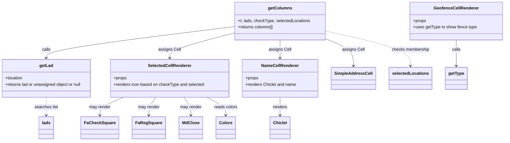

# Diagram: web/portal/src/pages/administration/location-management/unresolved-location-matching/search/UnresolvedLocationMatching.Search.columns.js

> Auto-generated by Obscura crawlers

## Mermaid

### SVG

<svg id="container" width="1890.3515625" xmlns="http://www.w3.org/2000/svg" class="classDiagram" height="536" viewBox="0 0 1890.3515625 536" role="graphics-document document" aria-roledescription="class"><g><defs><marker id="container_class-aggregationStart" class="marker aggregation class" refX="18" refY="7" markerWidth="190" markerHeight="240" orient="auto"><path d="M 18,7 L9,13 L1,7 L9,1 Z"></path></marker></defs><defs><marker id="container_class-aggregationEnd" class="marker aggregation class" refX="1" refY="7" markerWidth="20" markerHeight="28" orient="auto"><path d="M 18,7 L9,13 L1,7 L9,1 Z"></path></marker></defs><defs><marker id="container_class-extensionStart" class="marker extension class" refX="18" refY="7" markerWidth="190" markerHeight="240" orient="auto"><path d="M 1,7 L18,13 V 1 Z"></path></marker></defs><defs><marker id="container_class-extensionEnd" class="marker extension class" refX="1" refY="7" markerWidth="20" markerHeight="28" orient="auto"><path d="M 1,1 V 13 L18,7 Z"></path></marker></defs><defs><marker id="container_class-compositionStart" class="marker composition class" refX="18" refY="7" markerWidth="190" markerHeight="240" orient="auto"><path d="M 18,7 L9,13 L1,7 L9,1 Z"></path></marker></defs><defs><marker id="container_class-compositionEnd" class="marker composition class" refX="1" refY="7" markerWidth="20" markerHeight="28" orient="auto"><path d="M 18,7 L9,13 L1,7 L9,1 Z"></path></marker></defs><defs><marker id="container_class-dependencyStart" class="marker dependency class" refX="6" refY="7" markerWidth="190" markerHeight="240" orient="auto"><path d="M 5,7 L9,13 L1,7 L9,1 Z"></path></marker></defs><defs><marker id="container_class-dependencyEnd" class="marker dependency class" refX="13" refY="7" markerWidth="20" markerHeight="28" orient="auto"><path d="M 18,7 L9,13 L14,7 L9,1 Z"></path></marker></defs><defs><marker id="container_class-lollipopStart" class="marker lollipop class" refX="13" refY="7" markerWidth="190" markerHeight="240" orient="auto"><circle stroke="black" fill="transparent" cx="7" cy="7" r="6"></circle></marker></defs><defs><marker id="container_class-lollipopEnd" class="marker lollipop class" refX="1" refY="7" markerWidth="190" markerHeight="240" orient="auto"><circle stroke="black" fill="transparent" cx="7" cy="7" r="6"></circle></marker></defs><g class="root"><g class="clusters"></g><g class="edgePaths"><path d="M887.285,101.189L769.477,115.824C651.668,130.459,416.051,159.73,298.242,179.531C180.434,199.333,180.434,209.667,180.434,214.833L180.434,220" id="id_getColumns_getLad_1" class="edge-thickness-normal edge-pattern-solid relation" style=";;;" data-edge="true" data-et="edge" data-id="id_getColumns_getLad_1" data-points="W3sieCI6ODg3LjI4NTE1NjI1LCJ5IjoxMDEuMTg4NzU2MDIxMzM0fSx7IngiOjE4MC40MzM1OTM3NSwieSI6MTg5fSx7IngiOjE4MC40MzM1OTM3NSwieSI6MjI2fV0=" marker-end="url(#container_class-dependencyEnd)"></path><path d="M887.285,124.544L846.151,135.287C805.017,146.03,722.749,167.515,681.615,183.424C640.48,199.333,640.48,209.667,640.48,214.833L640.48,220" id="id_getColumns_SelectedCellRenderer_2" class="edge-thickness-normal edge-pattern-solid relation" style=";;;" data-edge="true" data-et="edge" data-id="id_getColumns_SelectedCellRenderer_2" data-points="W3sieCI6ODg3LjI4NTE1NjI1LCJ5IjoxMjQuNTQ0MjU5OTYyOTM3M30seyJ4Ijo2NDAuNDgwNDY4NzUsInkiOjE4OX0seyJ4Ijo2NDAuNDgwNDY4NzUsInkiOjIyNn1d" marker-end="url(#container_class-dependencyEnd)"></path><path d="M1057.848,152L1057.848,158.167C1057.848,164.333,1057.848,176.667,1057.848,188C1057.848,199.333,1057.848,209.667,1057.848,214.833L1057.848,220" id="id_getColumns_NameCellRenderer_3" class="edge-thickness-normal edge-pattern-solid relation" style=";;;" data-edge="true" data-et="edge" data-id="id_getColumns_NameCellRenderer_3" data-points="W3sieCI6MTA1Ny44NDc2NTYyNSwieSI6MTUyfSx7IngiOjEwNTcuODQ3NjU2MjUsInkiOjE4OX0seyJ4IjoxMDU3Ljg0NzY1NjI1LCJ5IjoyMjZ9XQ==" marker-end="url(#container_class-dependencyEnd)"></path><path d="M1228.41,148.082L1245.495,154.901C1262.581,161.721,1296.751,175.361,1313.837,192.347C1330.922,209.333,1330.922,229.667,1330.922,239.833L1330.922,250" id="id_getColumns_SimpleAddressCell_4" class="edge-thickness-normal edge-pattern-solid relation" style=";;;" data-edge="true" data-et="edge" data-id="id_getColumns_SimpleAddressCell_4" data-points="W3sieCI6MTIyOC40MTAxNTYyNSwieSI6MTQ4LjA4MTUzNjg5OTAyMjk4fSx7IngiOjEzMzAuOTIxODc1LCJ5IjoxODl9LHsieCI6MTMzMC45MjE4NzUsInkiOjI1Nn1d" marker-end="url(#container_class-dependencyEnd)"></path><path d="M473.681,370L459.395,376.167C445.109,382.333,416.537,394.667,402.251,406C387.965,417.333,387.965,427.667,387.965,432.833L387.965,438" id="id_SelectedCellRenderer_FaCheckSquare_5" class="edge-thickness-normal edge-pattern-solid relation" style=";;;" data-edge="true" data-et="edge" data-id="id_SelectedCellRenderer_FaCheckSquare_5" data-points="W3sieCI6NDczLjY4MTE1NjgyMzM5NDUzLCJ5IjozNzB9LHsieCI6Mzg3Ljk2NDg0Mzc1LCJ5Ijo0MDd9LHsieCI6Mzg3Ljk2NDg0Mzc1LCJ5Ijo0NDR9XQ==" marker-end="url(#container_class-dependencyEnd)"></path><path d="M590.258,370L585.957,376.167C581.655,382.333,573.052,394.667,568.751,406C564.449,417.333,564.449,427.667,564.449,432.833L564.449,438" id="id_SelectedCellRenderer_FaRegSquare_6" class="edge-thickness-normal edge-pattern-solid relation" style=";;;" data-edge="true" data-et="edge" data-id="id_SelectedCellRenderer_FaRegSquare_6" data-points="W3sieCI6NTkwLjI1Nzk5MTY4NTc3OTksInkiOjM3MH0seyJ4Ijo1NjQuNDQ5MjE4NzUsInkiOjQwN30seyJ4Ijo1NjQuNDQ5MjE4NzUsInkiOjQ0NH1d" marker-end="url(#container_class-dependencyEnd)"></path><path d="M695.701,370L700.43,376.167C705.16,382.333,714.619,394.667,719.349,406C724.078,417.333,724.078,427.667,724.078,432.833L724.078,438" id="id_SelectedCellRenderer_MdClose_7" class="edge-thickness-normal edge-pattern-solid relation" style=";;;" data-edge="true" data-et="edge" data-id="id_SelectedCellRenderer_MdClose_7" data-points="W3sieCI6Njk1LjcwMDkzODkzMzQ4NjIsInkiOjM3MH0seyJ4Ijo3MjQuMDc4MTI1LCJ5Ijo0MDd9LHsieCI6NzI0LjA3ODEyNSwieSI6NDQ0fV0=" marker-end="url(#container_class-dependencyEnd)"></path><path d="M780.251,370L792.223,376.167C804.194,382.333,828.136,394.667,840.107,406C852.078,417.333,852.078,427.667,852.078,432.833L852.078,438" id="id_SelectedCellRenderer_Colors_8" class="edge-thickness-normal edge-pattern-solid relation" style=";;;" data-edge="true" data-et="edge" data-id="id_SelectedCellRenderer_Colors_8" data-points="W3sieCI6NzgwLjI1MTM5NzY0OTA4MjYsInkiOjM3MH0seyJ4Ijo4NTIuMDc4MTI1LCJ5Ijo0MDd9LHsieCI6ODUyLjA3ODEyNSwieSI6NDQ0fV0=" marker-end="url(#container_class-dependencyEnd)"></path><path d="M1057.848,370L1057.848,376.167C1057.848,382.333,1057.848,394.667,1057.848,406C1057.848,417.333,1057.848,427.667,1057.848,432.833L1057.848,438" id="id_NameCellRenderer_Chiclet_9" class="edge-thickness-normal edge-pattern-solid relation" style=";;;" data-edge="true" data-et="edge" data-id="id_NameCellRenderer_Chiclet_9" data-points="W3sieCI6MTA1Ny44NDc2NTYyNSwieSI6MzcwfSx7IngiOjEwNTcuODQ3NjU2MjUsInkiOjQwN30seyJ4IjoxMDU3Ljg0NzY1NjI1LCJ5Ijo0NDR9XQ==" marker-end="url(#container_class-dependencyEnd)"></path><path d="M1708.578,152L1708.578,158.167C1708.578,164.333,1708.578,176.667,1708.578,193C1708.578,209.333,1708.578,229.667,1708.578,239.833L1708.578,250" id="id_GeofenceCellRenderer_getType_10" class="edge-thickness-normal edge-pattern-solid relation" style=";;;" data-edge="true" data-et="edge" data-id="id_GeofenceCellRenderer_getType_10" data-points="W3sieCI6MTcwOC41NzgxMjUsInkiOjE1Mn0seyJ4IjoxNzA4LjU3ODEyNSwieSI6MTg5fSx7IngiOjE3MDguNTc4MTI1LCJ5IjoyNTZ9XQ==" marker-end="url(#container_class-dependencyEnd)"></path><path d="M180.434,370L180.434,376.167C180.434,382.333,180.434,394.667,180.434,406C180.434,417.333,180.434,427.667,180.434,432.833L180.434,438" id="id_getLad_lads_11" class="edge-thickness-normal edge-pattern-dashed relation" style=";;;" data-edge="true" data-et="edge" data-id="id_getLad_lads_11" data-points="W3sieCI6MTgwLjQzMzU5Mzc1LCJ5IjozNzB9LHsieCI6MTgwLjQzMzU5Mzc1LCJ5Ijo0MDd9LHsieCI6MTgwLjQzMzU5Mzc1LCJ5Ijo0NDR9XQ==" marker-end="url(#container_class-dependencyEnd)"></path><path d="M1228.41,118.618L1280.219,130.348C1332.029,142.079,1435.647,165.539,1487.456,187.436C1539.266,209.333,1539.266,229.667,1539.266,239.833L1539.266,250" id="id_getColumns_selectedLocations_12" class="edge-thickness-normal edge-pattern-dashed relation" style=";;;" data-edge="true" data-et="edge" data-id="id_getColumns_selectedLocations_12" data-points="W3sieCI6MTIyOC40MTAxNTYyNSwieSI6MTE4LjYxNzgyMDA3OTAzMDg1fSx7IngiOjE1MzkuMjY1NjI1LCJ5IjoxODl9LHsieCI6MTUzOS4yNjU2MjUsInkiOjI1Nn1d" marker-end="url(#container_class-dependencyEnd)"></path></g><g class="edgeLabels"><g class="edgeLabel" transform="translate(180.43359375, 189)"><g class="label" data-id="id_getColumns_getLad_1" transform="translate(-16.4453125, -12)"><foreignObject width="32.890625" height="24">

calls

</foreignObject></g></g><g class="edgeLabel" transform="translate(640.48046875, 189)"><g class="label" data-id="id_getColumns_SelectedCellRenderer_2" transform="translate(-41.9921875, -12)"><foreignObject width="83.984375" height="24">

assigns Cell

</foreignObject></g></g><g class="edgeLabel" transform="translate(1057.84765625, 189)"><g class="label" data-id="id_getColumns_NameCellRenderer_3" transform="translate(-41.9921875, -12)"><foreignObject width="83.984375" height="24">

assigns Cell

</foreignObject></g></g><g class="edgeLabel" transform="translate(1330.921875, 189)"><g class="label" data-id="id_getColumns_SimpleAddressCell_4" transform="translate(-41.9921875, -12)"><foreignObject width="83.984375" height="24">

assigns Cell

</foreignObject></g></g><g class="edgeLabel" transform="translate(387.96484375, 407)"><g class="label" data-id="id_SelectedCellRenderer_FaCheckSquare_5" transform="translate(-41.2734375, -12)"><foreignObject width="82.546875" height="24">

may render

</foreignObject></g></g><g class="edgeLabel" transform="translate(564.44921875, 407)"><g class="label" data-id="id_SelectedCellRenderer_FaRegSquare_6" transform="translate(-41.2734375, -12)"><foreignObject width="82.546875" height="24">

may render

</foreignObject></g></g><g class="edgeLabel" transform="translate(724.078125, 407)"><g class="label" data-id="id_SelectedCellRenderer_MdClose_7" transform="translate(-41.2734375, -12)"><foreignObject width="82.546875" height="24">

may render

</foreignObject></g></g><g class="edgeLabel" transform="translate(852.078125, 407)"><g class="label" data-id="id_SelectedCellRenderer_Colors_8" transform="translate(-44.140625, -12)"><foreignObject width="88.28125" height="24">

reads colors

</foreignObject></g></g><g class="edgeLabel" transform="translate(1057.84765625, 407)"><g class="label" data-id="id_NameCellRenderer_Chiclet_9" transform="translate(-27.75, -12)"><foreignObject width="55.5" height="24">

renders

</foreignObject></g></g><g class="edgeLabel" transform="translate(1708.578125, 189)"><g class="label" data-id="id_GeofenceCellRenderer_getType_10" transform="translate(-16.4453125, -12)"><foreignObject width="32.890625" height="24">

calls

</foreignObject></g></g><g class="edgeLabel" transform="translate(180.43359375, 407)"><g class="label" data-id="id_getLad_lads_11" transform="translate(-45.171875, -12)"><foreignObject width="90.34375" height="24">

searches list

</foreignObject></g></g><g class="edgeLabel" transform="translate(1539.265625, 189)"><g class="label" data-id="id_getColumns_selectedLocations_12" transform="translate(-72.1953125, -12)"><foreignObject width="144.390625" height="24">

checks membership

</foreignObject></g></g></g><g class="nodes"><g class="node default" id="classId-SelectedCellRenderer-0" transform="translate(640.48046875, 298)"><g class="basic label-container"><path d="M-224.40234375 -72 L224.40234375 -72 L224.40234375 72 L-224.40234375 72" stroke="none" stroke-width="0" fill="#ECECFF" style=""></path><path d="M-224.40234375 -72 C-48.87322685296303 -72, 126.65589004407394 -72, 224.40234375 -72 M-224.40234375 -72 C-82.88156153573692 -72, 58.63922067852616 -72, 224.40234375 -72 M224.40234375 -72 C224.40234375 -26.608782343632797, 224.40234375 18.782435312734407, 224.40234375 72 M224.40234375 -72 C224.40234375 -32.47433119500616, 224.40234375 7.051337609987684, 224.40234375 72 M224.40234375 72 C127.21152534018812 72, 30.020706930376235 72, -224.40234375 72 M224.40234375 72 C93.09883823244652 72, -38.20466728510695 72, -224.40234375 72 M-224.40234375 72 C-224.40234375 18.143480588018235, -224.40234375 -35.71303882396353, -224.40234375 -72 M-224.40234375 72 C-224.40234375 15.36869947828751, -224.40234375 -41.26260104342498, -224.40234375 -72" stroke="#9370DB" stroke-width="1.3" fill="none" stroke-dasharray="0 0" style=""></path></g><g class="annotation-group text" transform="translate(0, -48)"></g><g class="label-group text" transform="translate(-79.0078125, -48)"><g class="label" style="font-weight: bolder" transform="translate(0,-12)"><foreignObject width="158.015625" height="24">

SelectedCellRenderer

</foreignObject></g></g><g class="members-group text" transform="translate(-212.40234375, 0)"><g class="label" style="" transform="translate(0,-12)"><foreignObject width="49.515625" height="24">

+props

</foreignObject></g><g class="label" style="" transform="translate(0,12)"><foreignObject width="345.796875" height="24">

+renders icon based on checkType and selected

</foreignObject></g></g><g class="methods-group text" transform="translate(-212.40234375, 72)"></g><g class="divider" style=""><path d="M-224.40234375 -24 C-63.01665882910922 -24, 98.36902609178156 -24, 224.40234375 -24 M-224.40234375 -24 C-126.18901213737561 -24, -27.975680524751226 -24, 224.40234375 -24" stroke="#9370DB" stroke-width="1.3" fill="none" stroke-dasharray="0 0" style=""></path></g><g class="divider" style=""><path d="M-224.40234375 48 C-101.73967191907478 48, 20.92299991185044 48, 224.40234375 48 M-224.40234375 48 C-131.8806267654642 48, -39.3589097809284 48, 224.40234375 48" stroke="#9370DB" stroke-width="1.3" fill="none" stroke-dasharray="0 0" style=""></path></g></g><g class="node default" id="classId-NameCellRenderer-1" transform="translate(1057.84765625, 298)"><g class="basic label-container"><path d="M-142.96484375 -72 L142.96484375 -72 L142.96484375 72 L-142.96484375 72" stroke="none" stroke-width="0" fill="#ECECFF" style=""></path><path d="M-142.96484375 -72 C-32.84331932650211 -72, 77.27820509699578 -72, 142.96484375 -72 M-142.96484375 -72 C-81.07958728366921 -72, -19.19433081733844 -72, 142.96484375 -72 M142.96484375 -72 C142.96484375 -29.763140960249586, 142.96484375 12.473718079500827, 142.96484375 72 M142.96484375 -72 C142.96484375 -21.489423870373194, 142.96484375 29.02115225925361, 142.96484375 72 M142.96484375 72 C46.32619457125472 72, -50.312454607490565 72, -142.96484375 72 M142.96484375 72 C44.079640372490076 72, -54.80556300501985 72, -142.96484375 72 M-142.96484375 72 C-142.96484375 20.192104135037013, -142.96484375 -31.615791729925974, -142.96484375 -72 M-142.96484375 72 C-142.96484375 23.49435004456054, -142.96484375 -25.01129991087892, -142.96484375 -72" stroke="#9370DB" stroke-width="1.3" fill="none" stroke-dasharray="0 0" style=""></path></g><g class="annotation-group text" transform="translate(0, -48)"></g><g class="label-group text" transform="translate(-68.1328125, -48)"><g class="label" style="font-weight: bolder" transform="translate(0,-12)"><foreignObject width="136.265625" height="24">

NameCellRenderer

</foreignObject></g></g><g class="members-group text" transform="translate(-130.96484375, 0)"><g class="label" style="" transform="translate(0,-12)"><foreignObject width="49.515625" height="24">

+props

</foreignObject></g><g class="label" style="" transform="translate(0,12)"><foreignObject width="193.796875" height="24">

+renders Chiclet and name

</foreignObject></g></g><g class="methods-group text" transform="translate(-130.96484375, 72)"></g><g class="divider" style=""><path d="M-142.96484375 -24 C-50.91582532943478 -24, 41.13319309113044 -24, 142.96484375 -24 M-142.96484375 -24 C-58.94853787302098 -24, 25.067768003958037 -24, 142.96484375 -24" stroke="#9370DB" stroke-width="1.3" fill="none" stroke-dasharray="0 0" style=""></path></g><g class="divider" style=""><path d="M-142.96484375 48 C-48.76941954276576 48, 45.42600466446848 48, 142.96484375 48 M-142.96484375 48 C-48.5140955783596 48, 45.9366525932808 48, 142.96484375 48" stroke="#9370DB" stroke-width="1.3" fill="none" stroke-dasharray="0 0" style=""></path></g></g><g class="node default" id="classId-GeofenceCellRenderer-2" transform="translate(1708.578125, 80)"><g class="basic label-container"><path d="M-173.7734375 -72 L173.7734375 -72 L173.7734375 72 L-173.7734375 72" stroke="none" stroke-width="0" fill="#ECECFF" style=""></path><path d="M-173.7734375 -72 C-67.69910854674772 -72, 38.37522040650455 -72, 173.7734375 -72 M-173.7734375 -72 C-70.02590539191141 -72, 33.721626716177184 -72, 173.7734375 -72 M173.7734375 -72 C173.7734375 -41.761099376669705, 173.7734375 -11.52219875333941, 173.7734375 72 M173.7734375 -72 C173.7734375 -35.593818086606866, 173.7734375 0.8123638267862674, 173.7734375 72 M173.7734375 72 C38.028553374831944 72, -97.71633075033611 72, -173.7734375 72 M173.7734375 72 C102.1229894212557 72, 30.47254134251139 72, -173.7734375 72 M-173.7734375 72 C-173.7734375 21.73693613584652, -173.7734375 -28.52612772830696, -173.7734375 -72 M-173.7734375 72 C-173.7734375 21.92814313493585, -173.7734375 -28.143713730128297, -173.7734375 -72" stroke="#9370DB" stroke-width="1.3" fill="none" stroke-dasharray="0 0" style=""></path></g><g class="annotation-group text" transform="translate(0, -48)"></g><g class="label-group text" transform="translate(-81.40625, -48)"><g class="label" style="font-weight: bolder" transform="translate(0,-12)"><foreignObject width="162.8125" height="24">

GeofenceCellRenderer

</foreignObject></g></g><g class="members-group text" transform="translate(-161.7734375, 0)"><g class="label" style="" transform="translate(0,-12)"><foreignObject width="49.515625" height="24">

+props

</foreignObject></g><g class="label" style="" transform="translate(0,12)"><foreignObject width="242.140625" height="24">

+uses getType to show fence type

</foreignObject></g></g><g class="methods-group text" transform="translate(-161.7734375, 72)"></g><g class="divider" style=""><path d="M-173.7734375 -24 C-99.86641109342263 -24, -25.959384686845254 -24, 173.7734375 -24 M-173.7734375 -24 C-71.83893156091362 -24, 30.095574378172756 -24, 173.7734375 -24" stroke="#9370DB" stroke-width="1.3" fill="none" stroke-dasharray="0 0" style=""></path></g><g class="divider" style=""><path d="M-173.7734375 48 C-64.5724393453574 48, 44.62855880928521 48, 173.7734375 48 M-173.7734375 48 C-100.04405639837444 48, -26.314675296748874 48, 173.7734375 48" stroke="#9370DB" stroke-width="1.3" fill="none" stroke-dasharray="0 0" style=""></path></g></g><g class="node default" id="classId-getColumns-3" transform="translate(1057.84765625, 80)"><g class="basic label-container"><path d="M-170.5625 -72 L170.5625 -72 L170.5625 72 L-170.5625 72" stroke="none" stroke-width="0" fill="#ECECFF" style=""></path><path d="M-170.5625 -72 C-84.7281460511747 -72, 1.1062078976505916 -72, 170.5625 -72 M-170.5625 -72 C-78.68363353002238 -72, 13.195232939955247 -72, 170.5625 -72 M170.5625 -72 C170.5625 -34.21846635542379, 170.5625 3.563067289152414, 170.5625 72 M170.5625 -72 C170.5625 -41.74874853794903, 170.5625 -11.497497075898053, 170.5625 72 M170.5625 72 C48.60891702752035 72, -73.3446659449593 72, -170.5625 72 M170.5625 72 C53.63017626360349 72, -63.302147472793024 72, -170.5625 72 M-170.5625 72 C-170.5625 15.619041542509166, -170.5625 -40.76191691498167, -170.5625 -72 M-170.5625 72 C-170.5625 28.345565682396497, -170.5625 -15.308868635207006, -170.5625 -72" stroke="#9370DB" stroke-width="1.3" fill="none" stroke-dasharray="0 0" style=""></path></g><g class="annotation-group text" transform="translate(0, -48)"></g><g class="label-group text" transform="translate(-43.046875, -48)"><g class="label" style="font-weight: bolder" transform="translate(0,-12)"><foreignObject width="86.09375" height="24">

getColumns

</foreignObject></g></g><g class="members-group text" transform="translate(-158.5625, 0)"><g class="label" style="" transform="translate(0,-12)"><foreignObject width="274.078125" height="24">

+t, lads, checkType, selectedLocations

</foreignObject></g><g class="label" style="" transform="translate(0,12)"><foreignObject width="136.296875" height="24">

+returns columns[]

</foreignObject></g></g><g class="methods-group text" transform="translate(-158.5625, 72)"></g><g class="divider" style=""><path d="M-170.5625 -24 C-40.805366106696965 -24, 88.95176778660607 -24, 170.5625 -24 M-170.5625 -24 C-67.93541773292567 -24, 34.69166453414866 -24, 170.5625 -24" stroke="#9370DB" stroke-width="1.3" fill="none" stroke-dasharray="0 0" style=""></path></g><g class="divider" style=""><path d="M-170.5625 48 C-76.01541545818618 48, 18.531669083627634 48, 170.5625 48 M-170.5625 48 C-71.32431514895329 48, 27.91386970209342 48, 170.5625 48" stroke="#9370DB" stroke-width="1.3" fill="none" stroke-dasharray="0 0" style=""></path></g></g><g class="node default" id="classId-getLad-4" transform="translate(180.43359375, 298)"><g class="basic label-container"><path d="M-172.43359375 -72 L172.43359375 -72 L172.43359375 72 L-172.43359375 72" stroke="none" stroke-width="0" fill="#ECECFF" style=""></path><path d="M-172.43359375 -72 C-41.328820564541985 -72, 89.77595262091603 -72, 172.43359375 -72 M-172.43359375 -72 C-42.30191096829202 -72, 87.82977181341596 -72, 172.43359375 -72 M172.43359375 -72 C172.43359375 -24.851951815345615, 172.43359375 22.29609636930877, 172.43359375 72 M172.43359375 -72 C172.43359375 -31.98914793695898, 172.43359375 8.021704126082042, 172.43359375 72 M172.43359375 72 C55.0666396444589 72, -62.300314461082195 72, -172.43359375 72 M172.43359375 72 C64.97105783269997 72, -42.49147808460006 72, -172.43359375 72 M-172.43359375 72 C-172.43359375 20.253850515643016, -172.43359375 -31.492298968713968, -172.43359375 -72 M-172.43359375 72 C-172.43359375 28.24274674124959, -172.43359375 -15.51450651750082, -172.43359375 -72" stroke="#9370DB" stroke-width="1.3" fill="none" stroke-dasharray="0 0" style=""></path></g><g class="annotation-group text" transform="translate(0, -48)"></g><g class="label-group text" transform="translate(-24.9453125, -48)"><g class="label" style="font-weight: bolder" transform="translate(0,-12)"><foreignObject width="49.890625" height="24">

getLad

</foreignObject></g></g><g class="members-group text" transform="translate(-160.43359375, 0)"><g class="label" style="" transform="translate(0,-12)"><foreignObject width="67.140625" height="24">

+location

</foreignObject></g><g class="label" style="" transform="translate(0,12)"><foreignObject width="295.921875" height="24">

+returns lad or unassigned object or null

</foreignObject></g></g><g class="methods-group text" transform="translate(-160.43359375, 72)"></g><g class="divider" style=""><path d="M-172.43359375 -24 C-42.0743684437754 -24, 88.2848568624492 -24, 172.43359375 -24 M-172.43359375 -24 C-100.04261822046637 -24, -27.651642690932732 -24, 172.43359375 -24" stroke="#9370DB" stroke-width="1.3" fill="none" stroke-dasharray="0 0" style=""></path></g><g class="divider" style=""><path d="M-172.43359375 48 C-47.81880301614396 48, 76.79598771771208 48, 172.43359375 48 M-172.43359375 48 C-48.897451383535284 48, 74.63869098292943 48, 172.43359375 48" stroke="#9370DB" stroke-width="1.3" fill="none" stroke-dasharray="0 0" style=""></path></g></g><g class="node default" id="classId-Chiclet-5" transform="translate(1057.84765625, 486)"><g class="basic label-container"><path d="M-37.0703125 -42 L37.0703125 -42 L37.0703125 42 L-37.0703125 42" stroke="none" stroke-width="0" fill="#ECECFF" style=""></path><path d="M-37.0703125 -42 C-20.486205753904734 -42, -3.9020990078094684 -42, 37.0703125 -42 M-37.0703125 -42 C-13.47507657241012 -42, 10.120159355179759 -42, 37.0703125 -42 M37.0703125 -42 C37.0703125 -20.58949825185342, 37.0703125 0.8210034962931587, 37.0703125 42 M37.0703125 -42 C37.0703125 -21.49845114199141, 37.0703125 -0.9969022839828199, 37.0703125 42 M37.0703125 42 C21.72929637148221 42, 6.38828024296442 42, -37.0703125 42 M37.0703125 42 C18.74274381406386 42, 0.4151751281277214 42, -37.0703125 42 M-37.0703125 42 C-37.0703125 12.749517432287263, -37.0703125 -16.500965135425474, -37.0703125 -42 M-37.0703125 42 C-37.0703125 24.59497804527317, -37.0703125 7.189956090546339, -37.0703125 -42" stroke="#9370DB" stroke-width="1.3" fill="none" stroke-dasharray="0 0" style=""></path></g><g class="annotation-group text" transform="translate(0, -18)"></g><g class="label-group text" transform="translate(-25.0703125, -18)"><g class="label" style="font-weight: bolder" transform="translate(0,-12)"><foreignObject width="50.140625" height="24">

Chiclet

</foreignObject></g></g><g class="members-group text" transform="translate(-25.0703125, 30)"></g><g class="methods-group text" transform="translate(-25.0703125, 60)"></g><g class="divider" style=""><path d="M-37.0703125 6 C-17.924238710312956 6, 1.2218350793740882 6, 37.0703125 6 M-37.0703125 6 C-13.76419666062166 6, 9.541919178756679 6, 37.0703125 6" stroke="#9370DB" stroke-width="1.3" fill="none" stroke-dasharray="0 0" style=""></path></g><g class="divider" style=""><path d="M-37.0703125 24 C-21.49642306479058 24, -5.92253362958116 24, 37.0703125 24 M-37.0703125 24 C-9.385290377975885 24, 18.29973174404823 24, 37.0703125 24" stroke="#9370DB" stroke-width="1.3" fill="none" stroke-dasharray="0 0" style=""></path></g></g><g class="node default" id="classId-SimpleAddressCell-6" transform="translate(1330.921875, 298)"><g class="basic label-container"><path d="M-80.109375 -42 L80.109375 -42 L80.109375 42 L-80.109375 42" stroke="none" stroke-width="0" fill="#ECECFF" style=""></path><path d="M-80.109375 -42 C-22.00163597024701 -42, 36.10610305950598 -42, 80.109375 -42 M-80.109375 -42 C-38.98421933122846 -42, 2.1409363375430814 -42, 80.109375 -42 M80.109375 -42 C80.109375 -15.81983664907197, 80.109375 10.36032670185606, 80.109375 42 M80.109375 -42 C80.109375 -16.276847782541495, 80.109375 9.44630443491701, 80.109375 42 M80.109375 42 C20.24442157333256 42, -39.62053185333488 42, -80.109375 42 M80.109375 42 C25.29395815661055 42, -29.5214586867789 42, -80.109375 42 M-80.109375 42 C-80.109375 20.954993960972573, -80.109375 -0.09001207805485478, -80.109375 -42 M-80.109375 42 C-80.109375 17.18264362141502, -80.109375 -7.634712757169957, -80.109375 -42" stroke="#9370DB" stroke-width="1.3" fill="none" stroke-dasharray="0 0" style=""></path></g><g class="annotation-group text" transform="translate(0, -18)"></g><g class="label-group text" transform="translate(-68.109375, -18)"><g class="label" style="font-weight: bolder" transform="translate(0,-12)"><foreignObject width="136.21875" height="24">

SimpleAddressCell

</foreignObject></g></g><g class="members-group text" transform="translate(-68.109375, 30)"></g><g class="methods-group text" transform="translate(-68.109375, 60)"></g><g class="divider" style=""><path d="M-80.109375 6 C-30.95808779823711 6, 18.19319940352578 6, 80.109375 6 M-80.109375 6 C-23.849730436004137 6, 32.409914127991726 6, 80.109375 6" stroke="#9370DB" stroke-width="1.3" fill="none" stroke-dasharray="0 0" style=""></path></g><g class="divider" style=""><path d="M-80.109375 24 C-32.29873695568897 24, 15.511901088622054 24, 80.109375 24 M-80.109375 24 C-40.55554943861402 24, -1.001723877228045 24, 80.109375 24" stroke="#9370DB" stroke-width="1.3" fill="none" stroke-dasharray="0 0" style=""></path></g></g><g class="node default" id="classId-Colors-7" transform="translate(852.078125, 486)"><g class="basic label-container"><path d="M-35.1015625 -42 L35.1015625 -42 L35.1015625 42 L-35.1015625 42" stroke="none" stroke-width="0" fill="#ECECFF" style=""></path><path d="M-35.1015625 -42 C-16.90785711055777 -42, 1.2858482788844583 -42, 35.1015625 -42 M-35.1015625 -42 C-18.248581064180776 -42, -1.395599628361552 -42, 35.1015625 -42 M35.1015625 -42 C35.1015625 -8.666393041244504, 35.1015625 24.667213917510992, 35.1015625 42 M35.1015625 -42 C35.1015625 -18.847733386448873, 35.1015625 4.3045332271022545, 35.1015625 42 M35.1015625 42 C16.00580602193128 42, -3.089950456137437 42, -35.1015625 42 M35.1015625 42 C12.653306114606178 42, -9.794950270787645 42, -35.1015625 42 M-35.1015625 42 C-35.1015625 14.921373927910683, -35.1015625 -12.157252144178635, -35.1015625 -42 M-35.1015625 42 C-35.1015625 10.571366412839286, -35.1015625 -20.85726717432143, -35.1015625 -42" stroke="#9370DB" stroke-width="1.3" fill="none" stroke-dasharray="0 0" style=""></path></g><g class="annotation-group text" transform="translate(0, -18)"></g><g class="label-group text" transform="translate(-23.1015625, -18)"><g class="label" style="font-weight: bolder" transform="translate(0,-12)"><foreignObject width="46.203125" height="24">

Colors

</foreignObject></g></g><g class="members-group text" transform="translate(-23.1015625, 30)"></g><g class="methods-group text" transform="translate(-23.1015625, 60)"></g><g class="divider" style=""><path d="M-35.1015625 6 C-20.539285959208605 6, -5.977009418417211 6, 35.1015625 6 M-35.1015625 6 C-8.658764709166363 6, 17.784033081667275 6, 35.1015625 6" stroke="#9370DB" stroke-width="1.3" fill="none" stroke-dasharray="0 0" style=""></path></g><g class="divider" style=""><path d="M-35.1015625 24 C-11.678793337237806 24, 11.743975825524387 24, 35.1015625 24 M-35.1015625 24 C-7.538235136590032 24, 20.025092226819936 24, 35.1015625 24" stroke="#9370DB" stroke-width="1.3" fill="none" stroke-dasharray="0 0" style=""></path></g></g><g class="node default" id="classId-getType-8" transform="translate(1708.578125, 298)"><g class="basic label-container"><path d="M-41.078125 -42 L41.078125 -42 L41.078125 42 L-41.078125 42" stroke="none" stroke-width="0" fill="#ECECFF" style=""></path><path d="M-41.078125 -42 C-8.568859497002983 -42, 23.940406005994035 -42, 41.078125 -42 M-41.078125 -42 C-8.812246101349857 -42, 23.453632797300287 -42, 41.078125 -42 M41.078125 -42 C41.078125 -12.643505800600039, 41.078125 16.712988398799922, 41.078125 42 M41.078125 -42 C41.078125 -18.167552116094253, 41.078125 5.664895767811494, 41.078125 42 M41.078125 42 C12.806080201798657 42, -15.465964596402685 42, -41.078125 42 M41.078125 42 C10.993817532011864 42, -19.090489935976272 42, -41.078125 42 M-41.078125 42 C-41.078125 23.188191981672404, -41.078125 4.376383963344807, -41.078125 -42 M-41.078125 42 C-41.078125 9.721245989756973, -41.078125 -22.557508020486054, -41.078125 -42" stroke="#9370DB" stroke-width="1.3" fill="none" stroke-dasharray="0 0" style=""></path></g><g class="annotation-group text" transform="translate(0, -18)"></g><g class="label-group text" transform="translate(-29.078125, -18)"><g class="label" style="font-weight: bolder" transform="translate(0,-12)"><foreignObject width="58.15625" height="24">

getType

</foreignObject></g></g><g class="members-group text" transform="translate(-29.078125, 30)"></g><g class="methods-group text" transform="translate(-29.078125, 60)"></g><g class="divider" style=""><path d="M-41.078125 6 C-16.03809242117982 6, 9.001940157640362 6, 41.078125 6 M-41.078125 6 C-15.886947620018738 6, 9.304229759962524 6, 41.078125 6" stroke="#9370DB" stroke-width="1.3" fill="none" stroke-dasharray="0 0" style=""></path></g><g class="divider" style=""><path d="M-41.078125 24 C-20.8043515670464 24, -0.5305781340927993 24, 41.078125 24 M-41.078125 24 C-18.47621740565004 24, 4.12569018869992 24, 41.078125 24" stroke="#9370DB" stroke-width="1.3" fill="none" stroke-dasharray="0 0" style=""></path></g></g><g class="node default" id="classId-FaCheckSquare-9" transform="translate(387.96484375, 486)"><g class="basic label-container"><path d="M-67.3203125 -42 L67.3203125 -42 L67.3203125 42 L-67.3203125 42" stroke="none" stroke-width="0" fill="#ECECFF" style=""></path><path d="M-67.3203125 -42 C-14.202997481002292 -42, 38.914317537995416 -42, 67.3203125 -42 M-67.3203125 -42 C-25.9592876231972 -42, 15.401737253605603 -42, 67.3203125 -42 M67.3203125 -42 C67.3203125 -22.403350121265866, 67.3203125 -2.8067002425317327, 67.3203125 42 M67.3203125 -42 C67.3203125 -18.73436141990575, 67.3203125 4.531277160188502, 67.3203125 42 M67.3203125 42 C14.563294189243003 42, -38.193724121513995 42, -67.3203125 42 M67.3203125 42 C39.834515501940665 42, 12.34871850388133 42, -67.3203125 42 M-67.3203125 42 C-67.3203125 17.35905664651733, -67.3203125 -7.281886706965338, -67.3203125 -42 M-67.3203125 42 C-67.3203125 10.057588558439353, -67.3203125 -21.884822883121295, -67.3203125 -42" stroke="#9370DB" stroke-width="1.3" fill="none" stroke-dasharray="0 0" style=""></path></g><g class="annotation-group text" transform="translate(0, -18)"></g><g class="label-group text" transform="translate(-55.3203125, -18)"><g class="label" style="font-weight: bolder" transform="translate(0,-12)"><foreignObject width="110.640625" height="24">

FaCheckSquare

</foreignObject></g></g><g class="members-group text" transform="translate(-55.3203125, 30)"></g><g class="methods-group text" transform="translate(-55.3203125, 60)"></g><g class="divider" style=""><path d="M-67.3203125 6 C-28.4416504005047 6, 10.437011698990602 6, 67.3203125 6 M-67.3203125 6 C-18.008351692235834 6, 31.30360911552833 6, 67.3203125 6" stroke="#9370DB" stroke-width="1.3" fill="none" stroke-dasharray="0 0" style=""></path></g><g class="divider" style=""><path d="M-67.3203125 24 C-16.464404655714183 24, 34.39150318857163 24, 67.3203125 24 M-67.3203125 24 C-16.41221716911314 24, 34.49587816177372 24, 67.3203125 24" stroke="#9370DB" stroke-width="1.3" fill="none" stroke-dasharray="0 0" style=""></path></g></g><g class="node default" id="classId-FaRegSquare-10" transform="translate(564.44921875, 486)"><g class="basic label-container"><path d="M-59.1640625 -42 L59.1640625 -42 L59.1640625 42 L-59.1640625 42" stroke="none" stroke-width="0" fill="#ECECFF" style=""></path><path d="M-59.1640625 -42 C-34.16007001450458 -42, -9.15607752900916 -42, 59.1640625 -42 M-59.1640625 -42 C-28.494807865145088 -42, 2.1744467697098244 -42, 59.1640625 -42 M59.1640625 -42 C59.1640625 -14.962251118048318, 59.1640625 12.075497763903364, 59.1640625 42 M59.1640625 -42 C59.1640625 -14.149968323987355, 59.1640625 13.700063352025289, 59.1640625 42 M59.1640625 42 C21.14010356048621 42, -16.88385537902758 42, -59.1640625 42 M59.1640625 42 C33.14225872398813 42, 7.120454947976256 42, -59.1640625 42 M-59.1640625 42 C-59.1640625 20.079196550222203, -59.1640625 -1.8416068995555932, -59.1640625 -42 M-59.1640625 42 C-59.1640625 16.264077393125998, -59.1640625 -9.471845213748004, -59.1640625 -42" stroke="#9370DB" stroke-width="1.3" fill="none" stroke-dasharray="0 0" style=""></path></g><g class="annotation-group text" transform="translate(0, -18)"></g><g class="label-group text" transform="translate(-47.1640625, -18)"><g class="label" style="font-weight: bolder" transform="translate(0,-12)"><foreignObject width="94.328125" height="24">

FaRegSquare

</foreignObject></g></g><g class="members-group text" transform="translate(-47.1640625, 30)"></g><g class="methods-group text" transform="translate(-47.1640625, 60)"></g><g class="divider" style=""><path d="M-59.1640625 6 C-30.043519251014505 6, -0.9229760020290101 6, 59.1640625 6 M-59.1640625 6 C-33.383907534179 6, -7.603752568358011 6, 59.1640625 6" stroke="#9370DB" stroke-width="1.3" fill="none" stroke-dasharray="0 0" style=""></path></g><g class="divider" style=""><path d="M-59.1640625 24 C-14.477471995353888 24, 30.209118509292225 24, 59.1640625 24 M-59.1640625 24 C-15.806647441975151 24, 27.550767616049697 24, 59.1640625 24" stroke="#9370DB" stroke-width="1.3" fill="none" stroke-dasharray="0 0" style=""></path></g></g><g class="node default" id="classId-MdClose-11" transform="translate(724.078125, 486)"><g class="basic label-container"><path d="M-42.8984375 -42 L42.8984375 -42 L42.8984375 42 L-42.8984375 42" stroke="none" stroke-width="0" fill="#ECECFF" style=""></path><path d="M-42.8984375 -42 C-11.913188070494659 -42, 19.072061359010682 -42, 42.8984375 -42 M-42.8984375 -42 C-11.504054164171936 -42, 19.890329171656127 -42, 42.8984375 -42 M42.8984375 -42 C42.8984375 -17.126206363640936, 42.8984375 7.747587272718128, 42.8984375 42 M42.8984375 -42 C42.8984375 -16.360477334159217, 42.8984375 9.279045331681566, 42.8984375 42 M42.8984375 42 C16.44005634050685 42, -10.0183248189863 42, -42.8984375 42 M42.8984375 42 C15.759452257923638 42, -11.379532984152725 42, -42.8984375 42 M-42.8984375 42 C-42.8984375 19.897159086860942, -42.8984375 -2.2056818262781164, -42.8984375 -42 M-42.8984375 42 C-42.8984375 8.898988528901953, -42.8984375 -24.202022942196095, -42.8984375 -42" stroke="#9370DB" stroke-width="1.3" fill="none" stroke-dasharray="0 0" style=""></path></g><g class="annotation-group text" transform="translate(0, -18)"></g><g class="label-group text" transform="translate(-30.8984375, -18)"><g class="label" style="font-weight: bolder" transform="translate(0,-12)"><foreignObject width="61.796875" height="24">

MdClose

</foreignObject></g></g><g class="members-group text" transform="translate(-30.8984375, 30)"></g><g class="methods-group text" transform="translate(-30.8984375, 60)"></g><g class="divider" style=""><path d="M-42.8984375 6 C-18.731305187303917 6, 5.435827125392166 6, 42.8984375 6 M-42.8984375 6 C-17.019685454555468 6, 8.859066590889064 6, 42.8984375 6" stroke="#9370DB" stroke-width="1.3" fill="none" stroke-dasharray="0 0" style=""></path></g><g class="divider" style=""><path d="M-42.8984375 24 C-12.027764452744702 24, 18.842908594510597 24, 42.8984375 24 M-42.8984375 24 C-12.303826562780504 24, 18.290784374438992 24, 42.8984375 24" stroke="#9370DB" stroke-width="1.3" fill="none" stroke-dasharray="0 0" style=""></path></g></g><g class="node default" id="classId-lads-12" transform="translate(180.43359375, 486)"><g class="basic label-container"><path d="M-27.390625 -42 L27.390625 -42 L27.390625 42 L-27.390625 42" stroke="none" stroke-width="0" fill="#ECECFF" style=""></path><path d="M-27.390625 -42 C-15.021180274183484 -42, -2.6517355483669682 -42, 27.390625 -42 M-27.390625 -42 C-6.77545295452185 -42, 13.8397190909563 -42, 27.390625 -42 M27.390625 -42 C27.390625 -22.33017683221559, 27.390625 -2.6603536644311774, 27.390625 42 M27.390625 -42 C27.390625 -18.635335245361627, 27.390625 4.729329509276745, 27.390625 42 M27.390625 42 C12.739568210422844 42, -1.9114885791543124 42, -27.390625 42 M27.390625 42 C8.699742429928357 42, -9.991140140143287 42, -27.390625 42 M-27.390625 42 C-27.390625 16.519059432278866, -27.390625 -8.961881135442269, -27.390625 -42 M-27.390625 42 C-27.390625 11.864811170749132, -27.390625 -18.270377658501737, -27.390625 -42" stroke="#9370DB" stroke-width="1.3" fill="none" stroke-dasharray="0 0" style=""></path></g><g class="annotation-group text" transform="translate(0, -18)"></g><g class="label-group text" transform="translate(-15.390625, -18)"><g class="label" style="font-weight: bolder" transform="translate(0,-12)"><foreignObject width="30.78125" height="24">

lads

</foreignObject></g></g><g class="members-group text" transform="translate(-15.390625, 30)"></g><g class="methods-group text" transform="translate(-15.390625, 60)"></g><g class="divider" style=""><path d="M-27.390625 6 C-6.810551951356249 6, 13.769521097287502 6, 27.390625 6 M-27.390625 6 C-15.252040469842788 6, -3.1134559396855757 6, 27.390625 6" stroke="#9370DB" stroke-width="1.3" fill="none" stroke-dasharray="0 0" style=""></path></g><g class="divider" style=""><path d="M-27.390625 24 C-11.437896373463154 24, 4.514832253073692 24, 27.390625 24 M-27.390625 24 C-6.135713992796294 24, 15.119197014407412 24, 27.390625 24" stroke="#9370DB" stroke-width="1.3" fill="none" stroke-dasharray="0 0" style=""></path></g></g><g class="node default" id="classId-selectedLocations-13" transform="translate(1539.265625, 298)"><g class="basic label-container"><path d="M-78.234375 -42 L78.234375 -42 L78.234375 42 L-78.234375 42" stroke="none" stroke-width="0" fill="#ECECFF" style=""></path><path d="M-78.234375 -42 C-36.67291685173505 -42, 4.888541296529894 -42, 78.234375 -42 M-78.234375 -42 C-46.6059184259096 -42, -14.9774618518192 -42, 78.234375 -42 M78.234375 -42 C78.234375 -19.34833926345357, 78.234375 3.3033214730928577, 78.234375 42 M78.234375 -42 C78.234375 -15.901960675163032, 78.234375 10.196078649673936, 78.234375 42 M78.234375 42 C36.27904729404894 42, -5.676280411902127 42, -78.234375 42 M78.234375 42 C29.7560837553117 42, -18.7222074893766 42, -78.234375 42 M-78.234375 42 C-78.234375 9.73359110122, -78.234375 -22.53281779756, -78.234375 -42 M-78.234375 42 C-78.234375 24.429797310354353, -78.234375 6.859594620708705, -78.234375 -42" stroke="#9370DB" stroke-width="1.3" fill="none" stroke-dasharray="0 0" style=""></path></g><g class="annotation-group text" transform="translate(0, -18)"></g><g class="label-group text" transform="translate(-66.234375, -18)"><g class="label" style="font-weight: bolder" transform="translate(0,-12)"><foreignObject width="132.46875" height="24">

selectedLocations

</foreignObject></g></g><g class="members-group text" transform="translate(-66.234375, 30)"></g><g class="methods-group text" transform="translate(-66.234375, 60)"></g><g class="divider" style=""><path d="M-78.234375 6 C-39.41600904441927 6, -0.597643088838538 6, 78.234375 6 M-78.234375 6 C-36.61137431271855 6, 5.011626374562894 6, 78.234375 6" stroke="#9370DB" stroke-width="1.3" fill="none" stroke-dasharray="0 0" style=""></path></g><g class="divider" style=""><path d="M-78.234375 24 C-26.992374700203506 24, 24.24962559959299 24, 78.234375 24 M-78.234375 24 C-20.09754440089121 24, 38.03928619821758 24, 78.234375 24" stroke="#9370DB" stroke-width="1.3" fill="none" stroke-dasharray="0 0" style=""></path></g></g></g></g></g></svg>
