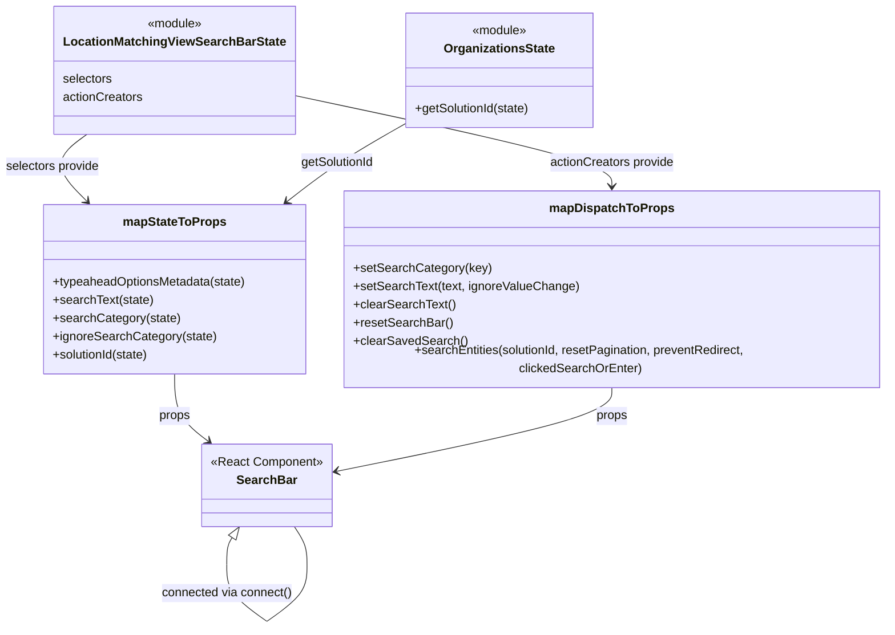

# Diagram: web/portal/src/pages/administration/location-management/unresolved-location-matching/search/UnresolvedLocationMatching.SearchBar.container.js


> Auto-generated by Obscura crawlers

## Diagram 1

```mermaid
flowchart LR
  LMVSearchBarState[LocationMatchingViewSearchBarState.selectors]
  LMVActions[LocationMatchingViewSearchBarState.actionCreators]
  Orgs[getSolutionId (modules/organizations)]
  ReduxState((state))
  MapState[mapStateToProps]
  MapDispatch[mapDispatchToProps]
  SearchBarComp[SearchBar Component]
  Dispatch((dispatch))

  ReduxState --> LMVSearchBarState
  ReduxState --> Orgs
  LMVSearchBarState -->|getTypeaheadOptionsMetadata| MapState
  LMVSearchBarState -->|getSearchText| MapState
  LMVSearchBarState -->|getSearchCategory| MapState
  LMVSearchBarState -->|getIgnoreSearchCategory| MapState
  Orgs -->|getSolutionId| MapState
  MapState --> SearchBarComp

  LMVActions --> MapDispatch
  Dispatch --> MapDispatch
  MapDispatch --> SearchBarComp

  subgraph SearchEntitiesFlow
    SearchBarComp -->|searchEntities(...)| MapDispatch
    MapDispatch -->|if clickedSearchOrEnter -> clearSearchFilter("near_location")| Dispatch
    MapDispatch -->|dispatch searchEntities(...)| Dispatch
  end
```

> SVG rendering failed for this diagram.

## Diagram 2



### SVG

<svg id="container" width="1163.6988525390625" xmlns="http://www.w3.org/2000/svg" class="classDiagram" height="810.25" viewBox="2.8109512329101562 0 1163.6988525390625 810.25" role="graphics-document document" aria-roledescription="class"><style>#container{font-family:"trebuchet ms",verdana,arial,sans-serif;font-size:16px;fill:#333;}@keyframes edge-animation-frame{from{stroke-dashoffset:0;}}@keyframes dash{to{stroke-dashoffset:0;}}#container .edge-animation-slow{stroke-dasharray:9,5!important;stroke-dashoffset:900;animation:dash 50s linear infinite;stroke-linecap:round;}#container .edge-animation-fast{stroke-dasharray:9,5!important;stroke-dashoffset:900;animation:dash 20s linear infinite;stroke-linecap:round;}#container .error-icon{fill:#552222;}#container .error-text{fill:#552222;stroke:#552222;}#container .edge-thickness-normal{stroke-width:1px;}#container .edge-thickness-thick{stroke-width:3.5px;}#container .edge-pattern-solid{stroke-dasharray:0;}#container .edge-thickness-invisible{stroke-width:0;fill:none;}#container .edge-pattern-dashed{stroke-dasharray:3;}#container .edge-pattern-dotted{stroke-dasharray:2;}#container .marker{fill:#333333;stroke:#333333;}#container .marker.cross{stroke:#333333;}#container svg{font-family:"trebuchet ms",verdana,arial,sans-serif;font-size:16px;}#container p{margin:0;}#container g.classGroup text{fill:#9370DB;stroke:none;font-family:"trebuchet ms",verdana,arial,sans-serif;font-size:10px;}#container g.classGroup text .title{font-weight:bolder;}#container .nodeLabel,#container .edgeLabel{color:#131300;}#container .edgeLabel .label rect{fill:#ECECFF;}#container .label text{fill:#131300;}#container .labelBkg{background:#ECECFF;}#container .edgeLabel .label span{background:#ECECFF;}#container .classTitle{font-weight:bolder;}#container .node rect,#container .node circle,#container .node ellipse,#container .node polygon,#container .node path{fill:#ECECFF;stroke:#9370DB;stroke-width:1px;}#container .divider{stroke:#9370DB;stroke-width:1;}#container g.clickable{cursor:pointer;}#container g.classGroup rect{fill:#ECECFF;stroke:#9370DB;}#container g.classGroup line{stroke:#9370DB;stroke-width:1;}#container .classLabel .box{stroke:none;stroke-width:0;fill:#ECECFF;opacity:0.5;}#container .classLabel .label{fill:#9370DB;font-size:10px;}#container .relation{stroke:#333333;stroke-width:1;fill:none;}#container .dashed-line{stroke-dasharray:3;}#container .dotted-line{stroke-dasharray:1 2;}#container #compositionStart,#container .composition{fill:#333333!important;stroke:#333333!important;stroke-width:1;}#container #compositionEnd,#container .composition{fill:#333333!important;stroke:#333333!important;stroke-width:1;}#container #dependencyStart,#container .dependency{fill:#333333!important;stroke:#333333!important;stroke-width:1;}#container #dependencyStart,#container .dependency{fill:#333333!important;stroke:#333333!important;stroke-width:1;}#container #extensionStart,#container .extension{fill:transparent!important;stroke:#333333!important;stroke-width:1;}#container #extensionEnd,#container .extension{fill:transparent!important;stroke:#333333!important;stroke-width:1;}#container #aggregationStart,#container .aggregation{fill:transparent!important;stroke:#333333!important;stroke-width:1;}#container #aggregationEnd,#container .aggregation{fill:transparent!important;stroke:#333333!important;stroke-width:1;}#container #lollipopStart,#container .lollipop{fill:#ECECFF!important;stroke:#333333!important;stroke-width:1;}#container #lollipopEnd,#container .lollipop{fill:#ECECFF!important;stroke:#333333!important;stroke-width:1;}#container .edgeTerminals{font-size:11px;line-height:initial;}#container .classTitleText{text-anchor:middle;font-size:18px;fill:#333;}#container .label-icon{display:inline-block;height:1em;overflow:visible;vertical-align:-0.125em;}#container .node .label-icon path{fill:currentColor;stroke:revert;stroke-width:revert;}#container :root{--mermaid-font-family:"trebuchet ms",verdana,arial,sans-serif;}</style><g><defs><marker id="container_class-aggregationStart" class="marker aggregation class" refX="18" refY="7" markerWidth="190" markerHeight="240" orient="auto"><path d="M 18,7 L9,13 L1,7 L9,1 Z"></path></marker></defs><defs><marker id="container_class-aggregationEnd" class="marker aggregation class" refX="1" refY="7" markerWidth="20" markerHeight="28" orient="auto"><path d="M 18,7 L9,13 L1,7 L9,1 Z"></path></marker></defs><defs><marker id="container_class-extensionStart" class="marker extension class" refX="18" refY="7" markerWidth="190" markerHeight="240" orient="auto"><path d="M 1,7 L18,13 V 1 Z"></path></marker></defs><defs><marker id="container_class-extensionEnd" class="marker extension class" refX="1" refY="7" markerWidth="20" markerHeight="28" orient="auto"><path d="M 1,1 V 13 L18,7 Z"></path></marker></defs><defs><marker id="container_class-compositionStart" class="marker composition class" refX="18" refY="7" markerWidth="190" markerHeight="240" orient="auto"><path d="M 18,7 L9,13 L1,7 L9,1 Z"></path></marker></defs><defs><marker id="container_class-compositionEnd" class="marker composition class" refX="1" refY="7" markerWidth="20" markerHeight="28" orient="auto"><path d="M 18,7 L9,13 L1,7 L9,1 Z"></path></marker></defs><defs><marker id="container_class-dependencyStart" class="marker dependency class" refX="6" refY="7" markerWidth="190" markerHeight="240" orient="auto"><path d="M 5,7 L9,13 L1,7 L9,1 Z"></path></marker></defs><defs><marker id="container_class-dependencyEnd" class="marker dependency class" refX="13" refY="7" markerWidth="20" markerHeight="28" orient="auto"><path d="M 18,7 L9,13 L14,7 L9,1 Z"></path></marker></defs><defs><marker id="container_class-lollipopStart" class="marker lollipop class" refX="13" refY="7" markerWidth="190" markerHeight="240" orient="auto"><circle stroke="black" fill="transparent" cx="7" cy="7" r="6"></circle></marker></defs><defs><marker id="container_class-lollipopEnd" class="marker lollipop class" refX="1" refY="7" markerWidth="190" markerHeight="240" orient="auto"><circle stroke="black" fill="transparent" cx="7" cy="7" r="6"></circle></marker></defs><g class="root"><g class="clusters"></g><g class="edgePaths"><path d="M119.904,176L111.658,182.167C103.413,188.333,86.921,200.667,86.223,214.297C85.524,227.927,100.619,242.854,108.166,250.318L115.713,257.781" id="id_LocationMatchingViewSearchBarState_mapStateToProps_1" class="edge-thickness-normal edge-pattern-solid relation" style=";;;" data-edge="true" data-et="edge" data-id="id_LocationMatchingViewSearchBarState_mapStateToProps_1" data-points="W3sieCI6MTE5LjkwNDE2Nzc0Mjc2ODU5LCJ5IjoxNzZ9LHsieCI6NzAuNDI5Njg3NSwieSI6MjEzfSx7IngiOjExOS45NzkzODIzMjQyMTg3NSwieSI6MjYyfV0=" marker-end="url(#container_class-dependencyEnd)"></path><path d="M382.693,123.699L453.342,138.583C523.99,153.466,665.287,183.233,735.936,203.283C806.584,223.333,806.584,233.667,806.584,238.833L806.584,244" id="id_LocationMatchingViewSearchBarState_mapDispatchToProps_2" class="edge-thickness-normal edge-pattern-solid relation" style=";;;" data-edge="true" data-et="edge" data-id="id_LocationMatchingViewSearchBarState_mapDispatchToProps_2" data-points="W3sieCI6MzgyLjY5MzM1OTM3NSwieSI6MTIzLjY5OTE3NTcxMjA3MDUxfSx7IngiOjgwNi41ODM5ODQzNzUsInkiOjIxM30seyJ4Ijo4MDYuNTgzOTg0Mzc1LCJ5IjoyNTB9XQ==" marker-end="url(#container_class-dependencyEnd)"></path><path d="M532.135,162.433L517.402,170.861C502.67,179.289,473.205,196.144,448.474,212.136C423.743,228.127,403.746,243.254,393.747,250.817L383.749,258.38" id="id_OrganizationsState_mapStateToProps_3" class="edge-thickness-normal edge-pattern-solid relation" style=";;;" data-edge="true" data-et="edge" data-id="id_OrganizationsState_mapStateToProps_3" data-points="W3sieCI6NTMyLjEzNDc2NTYyNSwieSI6MTYyLjQzMjg2OTE3MzM3NjY3fSx7IngiOjQ0My43NDAyMzQzNzUsInkiOjIxM30seyJ4IjozNzguOTYzNTc0MjE4NzUsInkiOjI2Mn1d" marker-end="url(#container_class-dependencyEnd)"></path><path d="M232.225,484L232.225,492.167C232.225,500.333,232.225,516.667,239.912,530.413C247.6,544.159,262.974,555.317,270.662,560.896L278.349,566.476" id="id_mapStateToProps_SearchBar_4" class="edge-thickness-normal edge-pattern-solid relation" style=";;;" data-edge="true" data-et="edge" data-id="id_mapStateToProps_SearchBar_4" data-points="W3sieCI6MjMyLjIyNDYwOTM3NSwieSI6NDg0fSx7IngiOjIzMi4yMjQ2MDkzNzUsInkiOjUzM30seyJ4IjoyODMuMjA1MjI4MzY1Mzg0NjQsInkiOjU3MH1d" marker-end="url(#container_class-dependencyEnd)"></path><path d="M806.584,496L806.584,502.167C806.584,508.333,806.584,520.667,746.937,538.923C687.29,557.179,567.995,581.358,508.348,593.448L448.701,605.537" id="id_mapDispatchToProps_SearchBar_5" class="edge-thickness-normal edge-pattern-solid relation" style=";;;" data-edge="true" data-et="edge" data-id="id_mapDispatchToProps_SearchBar_5" data-points="W3sieCI6ODA2LjU4Mzk4NDM3NSwieSI6NDk2fSx7IngiOjgwNi41ODM5ODQzNzUsInkiOjUzM30seyJ4Ijo0NDIuODIwMzEyNSwieSI6NjA2LjcyOTEwMDU5ODE1MTF9XQ==" marker-end="url(#container_class-dependencyEnd)"></path><path d="M311.544,692.301L310.341,694.084C309.139,695.868,306.733,699.434,305.531,705.384C304.328,711.333,304.328,719.667,304.328,723.833L304.328,728" id="SearchBar-cyclic-special-1" class="edge-thickness-normal edge-pattern-solid relation" style=";;;" data-edge="true" data-et="edge" data-id="SearchBar-cyclic-special-1" data-points="W3sieCI6MzIxLjE4OTI4MDA2MzI5MTEsInkiOjY3OH0seyJ4IjozMDQuMzI4MTI1LCJ5Ijo3MDN9LHsieCI6MzA0LjMyODEyNSwieSI6NzI4fV0=" marker-start="url(#container_class-extensionStart)"></path><path d="M304.328,728.1L304.328,734.267C304.328,740.433,304.328,752.767,313.2,765.103C322.072,777.438,339.816,789.777,348.687,795.946L357.559,802.115" id="SearchBar-cyclic-special-mid" class="edge-thickness-normal edge-pattern-solid relation" style=";;;" data-edge="true" data-et="edge" data-id="SearchBar-cyclic-special-mid" data-points="W3sieCI6MzA0LjMyODEyNSwieSI6NzI4LjEwMDAwMDAwMTQ5MDF9LHsieCI6MzA0LjMyODEyNSwieSI6NzY1LjEwMDAwMDAwMTQ5MDF9LHsieCI6MzU3LjU1OTM3NDk5OTI1NDk0LCJ5Ijo4MDIuMTE1MjMxNjczMjcwNn1d"></path><path d="M357.659,802.115L366.531,795.946C375.403,789.777,393.147,777.438,402.019,765.094C410.891,752.75,410.891,740.4,410.891,730.05C410.891,719.7,410.891,711.35,408.08,703.008C405.27,694.667,399.65,686.333,396.84,682.167L394.029,678" id="SearchBar-cyclic-special-2" class="edge-thickness-normal edge-pattern-solid relation" style=";;;" data-edge="true" data-et="edge" data-id="SearchBar-cyclic-special-2" data-points="W3sieCI6MzU3LjY1OTM3NTAwMDc0NTA2LCJ5Ijo4MDIuMTE1MjMxNjczMjcwNn0seyJ4Ijo0MTAuODkwNjI1LCJ5Ijo3NjUuMTAwMDAwMDAxNDkwMX0seyJ4Ijo0MTAuODkwNjI1LCJ5Ijo3MjguMDUwMDAwMDAwNzQ1MX0seyJ4Ijo0MTAuODkwNjI1LCJ5Ijo3MDN9LHsieCI6Mzk0LjAyOTQ2OTkzNjcwODksInkiOjY3OH1d"></path></g><g class="edgeLabels"><g class="edgeLabel" transform="translate(73.24064, 215.77977)"><g class="label" data-id="id_LocationMatchingViewSearchBarState_mapStateToProps_1" transform="translate(-62.4296875, -12)"><foreignObject width="124.859375" height="24"><div xmlns="http://www.w3.org/1999/xhtml" class="labelBkg" style="display: table-cell; white-space: nowrap; line-height: 1.5; max-width: 200px; text-align: center;"><span class="edgeLabel"><p>selectors provide</p></span></div></foreignObject></g></g><g class="edgeLabel" transform="translate(806.583984375, 213)"><g class="label" data-id="id_LocationMatchingViewSearchBarState_mapDispatchToProps_2" transform="translate(-82.3671875, -12)"><foreignObject width="164.734375" height="24"><div xmlns="http://www.w3.org/1999/xhtml" class="labelBkg" style="display: table-cell; white-space: nowrap; line-height: 1.5; max-width: 200px; text-align: center;"><span class="edgeLabel"><p>actionCreators provide</p></span></div></foreignObject></g></g><g class="edgeLabel" transform="translate(452.68689, 207.88196)"><g class="label" data-id="id_OrganizationsState_mapStateToProps_3" transform="translate(-48.9609375, -12)"><foreignObject width="97.921875" height="24"><div xmlns="http://www.w3.org/1999/xhtml" class="labelBkg" style="display: table-cell; white-space: nowrap; line-height: 1.5; max-width: 200px; text-align: center;"><span class="edgeLabel"><p>getSolutionId</p></span></div></foreignObject></g></g><g class="edgeLabel" transform="translate(232.224609375, 533)"><g class="label" data-id="id_mapStateToProps_SearchBar_4" transform="translate(-20.765625, -12)"><foreignObject width="41.53125" height="24"><div xmlns="http://www.w3.org/1999/xhtml" class="labelBkg" style="display: table-cell; white-space: nowrap; line-height: 1.5; max-width: 200px; text-align: center;"><span class="edgeLabel"><p>props</p></span></div></foreignObject></g></g><g class="edgeLabel" transform="translate(806.583984375, 533)"><g class="label" data-id="id_mapDispatchToProps_SearchBar_5" transform="translate(-20.765625, -12)"><foreignObject width="41.53125" height="24"><div xmlns="http://www.w3.org/1999/xhtml" class="labelBkg" style="display: table-cell; white-space: nowrap; line-height: 1.5; max-width: 200px; text-align: center;"><span class="edgeLabel"><p>props</p></span></div></foreignObject></g></g><g class="edgeLabel"><g class="label" data-id="SearchBar-cyclic-special-1" transform="translate(0, 0)"><foreignObject width="0" height="0"><div xmlns="http://www.w3.org/1999/xhtml" class="labelBkg" style="display: table-cell; white-space: nowrap; line-height: 1.5; max-width: 200px; text-align: center;"><span class="edgeLabel"></span></div></foreignObject></g></g><g class="edgeLabel" transform="translate(304.328125, 765.1000000014901)"><g class="label" data-id="SearchBar-cyclic-special-mid" transform="translate(-86.5625, -12)"><foreignObject width="173.125" height="24"><div xmlns="http://www.w3.org/1999/xhtml" class="labelBkg" style="display: table-cell; white-space: nowrap; line-height: 1.5; max-width: 200px; text-align: center;"><span class="edgeLabel"><p>connected via connect()</p></span></div></foreignObject></g></g><g class="edgeLabel"><g class="label" data-id="SearchBar-cyclic-special-2" transform="translate(0, 0)"><foreignObject width="0" height="0"><div xmlns="http://www.w3.org/1999/xhtml" class="labelBkg" style="display: table-cell; white-space: nowrap; line-height: 1.5; max-width: 200px; text-align: center;"><span class="edgeLabel"></span></div></foreignObject></g></g></g><g class="nodes"><g class="node default" id="classId-mapStateToProps-0" transform="translate(232.224609375, 373)"><g class="basic label-container"><path d="M-172.43359375 -111 L172.43359375 -111 L172.43359375 111 L-172.43359375 111" stroke="none" stroke-width="0" fill="#ECECFF" style=""></path><path d="M-172.43359375 -111 C-99.03117526213597 -111, -25.62875677427195 -111, 172.43359375 -111 M-172.43359375 -111 C-78.52522866181914 -111, 15.383136426361716 -111, 172.43359375 -111 M172.43359375 -111 C172.43359375 -30.727896824278304, 172.43359375 49.54420635144339, 172.43359375 111 M172.43359375 -111 C172.43359375 -59.76715110853574, 172.43359375 -8.534302217071485, 172.43359375 111 M172.43359375 111 C40.32562244870783 111, -91.78234885258433 111, -172.43359375 111 M172.43359375 111 C88.67371831508899 111, 4.913842880177981 111, -172.43359375 111 M-172.43359375 111 C-172.43359375 58.18323461267973, -172.43359375 5.366469225359467, -172.43359375 -111 M-172.43359375 111 C-172.43359375 28.190161897531482, -172.43359375 -54.619676204937036, -172.43359375 -111" stroke="#9370DB" stroke-width="1.3" fill="none" stroke-dasharray="0 0" style=""></path></g><g class="annotation-group text" transform="translate(0, -87)"></g><g class="label-group text" transform="translate(-64.7109375, -87)"><g class="label" style="font-weight: bolder" transform="translate(0,-12)"><foreignObject width="129.421875" height="24"><div xmlns="http://www.w3.org/1999/xhtml" style="display: table-cell; white-space: nowrap; line-height: 1.5; max-width: 177px; text-align: center;"><span class="nodeLabel markdown-node-label" style=""><p>mapStateToProps</p></span></div></foreignObject></g></g><g class="members-group text" transform="translate(-160.43359375, -39)"></g><g class="methods-group text" transform="translate(-160.43359375, -9)"><g class="label" style="" transform="translate(0,-12)"><foreignObject width="256.15625" height="24"><div xmlns="http://www.w3.org/1999/xhtml" style="display: table-cell; white-space: nowrap; line-height: 1.5; max-width: 314px; text-align: center;"><span class="nodeLabel markdown-node-label" style=""><p>+typeaheadOptionsMetadata(state)</p></span></div></foreignObject></g><g class="label" style="" transform="translate(0,12)"><foreignObject width="131.421875" height="24"><div xmlns="http://www.w3.org/1999/xhtml" style="display: table-cell; white-space: nowrap; line-height: 1.5; max-width: 189px; text-align: center;"><span class="nodeLabel markdown-node-label" style=""><p>+searchText(state)</p></span></div></foreignObject></g><g class="label" style="" transform="translate(0,36)"><foreignObject width="165.125" height="24"><div xmlns="http://www.w3.org/1999/xhtml" style="display: table-cell; white-space: nowrap; line-height: 1.5; max-width: 222px; text-align: center;"><span class="nodeLabel markdown-node-label" style=""><p>+searchCategory(state)</p></span></div></foreignObject></g><g class="label" style="" transform="translate(0,60)"><foreignObject width="212.34375" height="24"><div xmlns="http://www.w3.org/1999/xhtml" style="display: table-cell; white-space: nowrap; line-height: 1.5; max-width: 270px; text-align: center;"><span class="nodeLabel markdown-node-label" style=""><p>+ignoreSearchCategory(state)</p></span></div></foreignObject></g><g class="label" style="" transform="translate(0,84)"><foreignObject width="128.5625" height="24"><div xmlns="http://www.w3.org/1999/xhtml" style="display: table-cell; white-space: nowrap; line-height: 1.5; max-width: 186px; text-align: center;"><span class="nodeLabel markdown-node-label" style=""><p>+solutionId(state)</p></span></div></foreignObject></g></g><g class="divider" style=""><path d="M-172.43359375 -63 C-39.06264593986057 -63, 94.30830187027885 -63, 172.43359375 -63 M-172.43359375 -63 C-46.0443202233112 -63, 80.3449533033776 -63, 172.43359375 -63" stroke="#9370DB" stroke-width="1.3" fill="none" stroke-dasharray="0 0" style=""></path></g><g class="divider" style=""><path d="M-172.43359375 -39 C-52.125280882607925 -39, 68.18303198478415 -39, 172.43359375 -39 M-172.43359375 -39 C-79.99954241312176 -39, 12.434508923756482 -39, 172.43359375 -39" stroke="#9370DB" stroke-width="1.3" fill="none" stroke-dasharray="0 0" style=""></path></g></g><g class="node default" id="classId-mapDispatchToProps-1" transform="translate(806.583984375, 373)"><g class="basic label-container"><path d="M-351.92578125 -123 L351.92578125 -123 L351.92578125 123 L-351.92578125 123" stroke="none" stroke-width="0" fill="#ECECFF" style=""></path><path d="M-351.92578125 -123 C-142.0929902445191 -123, 67.73980076096183 -123, 351.92578125 -123 M-351.92578125 -123 C-200.12314157899124 -123, -48.320501907982475 -123, 351.92578125 -123 M351.92578125 -123 C351.92578125 -38.87556568906338, 351.92578125 45.24886862187324, 351.92578125 123 M351.92578125 -123 C351.92578125 -45.237762764850046, 351.92578125 32.52447447029991, 351.92578125 123 M351.92578125 123 C88.513191513636 123, -174.899398222728 123, -351.92578125 123 M351.92578125 123 C188.6488751443407 123, 25.371969038681414 123, -351.92578125 123 M-351.92578125 123 C-351.92578125 59.097607270335814, -351.92578125 -4.804785459328372, -351.92578125 -123 M-351.92578125 123 C-351.92578125 29.041349568280708, -351.92578125 -64.91730086343858, -351.92578125 -123" stroke="#9370DB" stroke-width="1.3" fill="none" stroke-dasharray="0 0" style=""></path></g><g class="annotation-group text" transform="translate(0, -99)"></g><g class="label-group text" transform="translate(-77.1953125, -99)"><g class="label" style="font-weight: bolder" transform="translate(0,-12)"><foreignObject width="154.390625" height="24"><div xmlns="http://www.w3.org/1999/xhtml" style="display: table-cell; white-space: nowrap; line-height: 1.5; max-width: 203px; text-align: center;"><span class="nodeLabel markdown-node-label" style=""><p>mapDispatchToProps</p></span></div></foreignObject></g></g><g class="members-group text" transform="translate(-339.92578125, -51)"></g><g class="methods-group text" transform="translate(-339.92578125, -21)"><g class="label" style="" transform="translate(0,-12)"><foreignObject width="176.828125" height="24"><div xmlns="http://www.w3.org/1999/xhtml" style="display: table-cell; white-space: nowrap; line-height: 1.5; max-width: 234px; text-align: center;"><span class="nodeLabel markdown-node-label" style=""><p>+setSearchCategory(key)</p></span></div></foreignObject></g><g class="label" style="" transform="translate(0,12)"><foreignObject width="292.859375" height="24"><div xmlns="http://www.w3.org/1999/xhtml" style="display: table-cell; white-space: nowrap; line-height: 1.5; max-width: 350px; text-align: center;"><span class="nodeLabel markdown-node-label" style=""><p>+setSearchText(text, ignoreValueChange)</p></span></div></foreignObject></g><g class="label" style="" transform="translate(0,36)"><foreignObject width="132.265625" height="24"><div xmlns="http://www.w3.org/1999/xhtml" style="display: table-cell; white-space: nowrap; line-height: 1.5; max-width: 190px; text-align: center;"><span class="nodeLabel markdown-node-label" style=""><p>+clearSearchText()</p></span></div></foreignObject></g><g class="label" style="" transform="translate(0,60)"><foreignObject width="128.0625" height="24"><div xmlns="http://www.w3.org/1999/xhtml" style="display: table-cell; white-space: nowrap; line-height: 1.5; max-width: 185px; text-align: center;"><span class="nodeLabel markdown-node-label" style=""><p>+resetSearchBar()</p></span></div></foreignObject></g><g class="label" style="" transform="translate(0,84)"><foreignObject width="146.046875" height="24"><div xmlns="http://www.w3.org/1999/xhtml" style="display: table-cell; white-space: nowrap; line-height: 1.5; max-width: 203px; text-align: center;"><span class="nodeLabel markdown-node-label" style=""><p>+clearSavedSearch()</p></span></div></foreignObject></g><g class="label" style="" transform="translate(0,108)"><foreignObject width="602.65625" height="24"><div xmlns="http://www.w3.org/1999/xhtml" style="display: table-cell; white-space: nowrap; line-height: 1.5; max-width: 660px; text-align: center;"><span class="nodeLabel markdown-node-label" style=""><p>+searchEntities(solutionId, resetPagination, preventRedirect, clickedSearchOrEnter)</p></span></div></foreignObject></g></g><g class="divider" style=""><path d="M-351.92578125 -75 C-172.8555048628315 -75, 6.214771524336982 -75, 351.92578125 -75 M-351.92578125 -75 C-161.15193480631817 -75, 29.621911637363667 -75, 351.92578125 -75" stroke="#9370DB" stroke-width="1.3" fill="none" stroke-dasharray="0 0" style=""></path></g><g class="divider" style=""><path d="M-351.92578125 -51 C-171.46452767246606 -51, 8.996725905067876 -51, 351.92578125 -51 M-351.92578125 -51 C-101.58540444763491 -51, 148.75497235473017 -51, 351.92578125 -51" stroke="#9370DB" stroke-width="1.3" fill="none" stroke-dasharray="0 0" style=""></path></g></g><g class="node default" id="classId-LocationMatchingViewSearchBarState-2" transform="translate(232.224609375, 92)"><g class="basic label-container"><path d="M-150.46875 -84 L150.46875 -84 L150.46875 84 L-150.46875 84" stroke="none" stroke-width="0" fill="#ECECFF" style=""></path><path d="M-150.46875 -84 C-62.10666041691404 -84, 26.255429166171922 -84, 150.46875 -84 M-150.46875 -84 C-43.36227194791786 -84, 63.74420610416428 -84, 150.46875 -84 M150.46875 -84 C150.46875 -29.265321014704476, 150.46875 25.469357970591048, 150.46875 84 M150.46875 -84 C150.46875 -49.04671574097156, 150.46875 -14.093431481943114, 150.46875 84 M150.46875 84 C55.472579861337465 84, -39.52359027732507 84, -150.46875 84 M150.46875 84 C70.17808939880001 84, -10.112571202399977 84, -150.46875 84 M-150.46875 84 C-150.46875 40.16144361016603, -150.46875 -3.6771127796679366, -150.46875 -84 M-150.46875 84 C-150.46875 27.07300816652924, -150.46875 -29.853983666941517, -150.46875 -84" stroke="#9370DB" stroke-width="1.3" fill="none" stroke-dasharray="0 0" style=""></path></g><g class="annotation-group text" transform="translate(-36.6015625, -60)"><g class="label" style="" transform="translate(0,-12)"><foreignObject width="73.203125" height="24"><div xmlns="http://www.w3.org/1999/xhtml" style="display: table-cell; white-space: nowrap; line-height: 1.5; max-width: 123px; text-align: center;"><span class="nodeLabel markdown-node-label" style=""><p>«module»</p></span></div></foreignObject></g></g><g class="label-group text" transform="translate(-138.46875, -36)"><g class="label" style="font-weight: bolder" transform="translate(0,-12)"><foreignObject width="276.9375" height="24"><div xmlns="http://www.w3.org/1999/xhtml" style="display: table-cell; white-space: nowrap; line-height: 1.5; max-width: 322px; text-align: center;"><span class="nodeLabel markdown-node-label" style=""><p>LocationMatchingViewSearchBarState</p></span></div></foreignObject></g></g><g class="members-group text" transform="translate(-138.46875, 12)"><g class="label" style="" transform="translate(0,-12)"><foreignObject width="65.46875" height="24"><div xmlns="http://www.w3.org/1999/xhtml" style="display: table-cell; white-space: nowrap; line-height: 1.5; max-width: 115px; text-align: center;"><span class="nodeLabel markdown-node-label" style=""><p>selectors</p></span></div></foreignObject></g><g class="label" style="" transform="translate(0,12)"><foreignObject width="105.34375" height="24"><div xmlns="http://www.w3.org/1999/xhtml" style="display: table-cell; white-space: nowrap; line-height: 1.5; max-width: 155px; text-align: center;"><span class="nodeLabel markdown-node-label" style=""><p>actionCreators</p></span></div></foreignObject></g></g><g class="methods-group text" transform="translate(-138.46875, 84)"></g><g class="divider" style=""><path d="M-150.46875 -12 C-62.949856260679056 -12, 24.56903747864189 -12, 150.46875 -12 M-150.46875 -12 C-51.5008465926189 -12, 47.4670568147622 -12, 150.46875 -12" stroke="#9370DB" stroke-width="1.3" fill="none" stroke-dasharray="0 0" style=""></path></g><g class="divider" style=""><path d="M-150.46875 60 C-40.07752566399205 60, 70.3136986720159 60, 150.46875 60 M-150.46875 60 C-49.144240338321936 60, 52.18026932335613 60, 150.46875 60" stroke="#9370DB" stroke-width="1.3" fill="none" stroke-dasharray="0 0" style=""></path></g></g><g class="node default" id="classId-OrganizationsState-3" transform="translate(655.255859375, 92)"><g class="basic label-container"><path d="M-123.12109375 -75 L123.12109375 -75 L123.12109375 75 L-123.12109375 75" stroke="none" stroke-width="0" fill="#ECECFF" style=""></path><path d="M-123.12109375 -75 C-27.542516213456096 -75, 68.03606132308781 -75, 123.12109375 -75 M-123.12109375 -75 C-64.98891224533747 -75, -6.856730740674962 -75, 123.12109375 -75 M123.12109375 -75 C123.12109375 -16.595192282199022, 123.12109375 41.809615435601955, 123.12109375 75 M123.12109375 -75 C123.12109375 -43.222182811396124, 123.12109375 -11.44436562279224, 123.12109375 75 M123.12109375 75 C36.39482113260152 75, -50.33145148479696 75, -123.12109375 75 M123.12109375 75 C60.124770095783326 75, -2.871553558433348 75, -123.12109375 75 M-123.12109375 75 C-123.12109375 26.71494061093923, -123.12109375 -21.57011877812154, -123.12109375 -75 M-123.12109375 75 C-123.12109375 38.90541116487706, -123.12109375 2.8108223297541173, -123.12109375 -75" stroke="#9370DB" stroke-width="1.3" fill="none" stroke-dasharray="0 0" style=""></path></g><g class="annotation-group text" transform="translate(-36.6015625, -51)"><g class="label" style="" transform="translate(0,-12)"><foreignObject width="73.203125" height="24"><div xmlns="http://www.w3.org/1999/xhtml" style="display: table-cell; white-space: nowrap; line-height: 1.5; max-width: 123px; text-align: center;"><span class="nodeLabel markdown-node-label" style=""><p>«module»</p></span></div></foreignObject></g></g><g class="label-group text" transform="translate(-69.8671875, -27)"><g class="label" style="font-weight: bolder" transform="translate(0,-12)"><foreignObject width="139.734375" height="24"><div xmlns="http://www.w3.org/1999/xhtml" style="display: table-cell; white-space: nowrap; line-height: 1.5; max-width: 187px; text-align: center;"><span class="nodeLabel markdown-node-label" style=""><p>OrganizationsState</p></span></div></foreignObject></g></g><g class="members-group text" transform="translate(-111.12109375, 21)"></g><g class="methods-group text" transform="translate(-111.12109375, 51)"><g class="label" style="" transform="translate(0,-12)"><foreignObject width="152.375" height="24"><div xmlns="http://www.w3.org/1999/xhtml" style="display: table-cell; white-space: nowrap; line-height: 1.5; max-width: 210px; text-align: center;"><span class="nodeLabel markdown-node-label" style=""><p>+getSolutionId(state)</p></span></div></foreignObject></g></g><g class="divider" style=""><path d="M-123.12109375 -3 C-34.486070947309685 -3, 54.14895185538063 -3, 123.12109375 -3 M-123.12109375 -3 C-38.55690015087265 -3, 46.0072934482547 -3, 123.12109375 -3" stroke="#9370DB" stroke-width="1.3" fill="none" stroke-dasharray="0 0" style=""></path></g><g class="divider" style=""><path d="M-123.12109375 21 C-46.785504846425724 21, 29.550084057148553 21, 123.12109375 21 M-123.12109375 21 C-33.566445372903914 21, 55.98820300419217 21, 123.12109375 21" stroke="#9370DB" stroke-width="1.3" fill="none" stroke-dasharray="0 0" style=""></path></g></g><g class="node default" id="classId-SearchBar-4" transform="translate(357.609375, 624)"><g class="basic label-container"><path d="M-85.2109375 -54 L85.2109375 -54 L85.2109375 54 L-85.2109375 54" stroke="none" stroke-width="0" fill="#ECECFF" style=""></path><path d="M-85.2109375 -54 C-23.592762508364274 -54, 38.02541248327145 -54, 85.2109375 -54 M-85.2109375 -54 C-42.23039375680766 -54, 0.7501499863846846 -54, 85.2109375 -54 M85.2109375 -54 C85.2109375 -29.19684321021737, 85.2109375 -4.39368642043474, 85.2109375 54 M85.2109375 -54 C85.2109375 -26.89638656531921, 85.2109375 0.20722686936157686, 85.2109375 54 M85.2109375 54 C43.276038620962616 54, 1.3411397419252324 54, -85.2109375 54 M85.2109375 54 C26.730608723952017 54, -31.749720052095967 54, -85.2109375 54 M-85.2109375 54 C-85.2109375 27.948936078905426, -85.2109375 1.897872157810852, -85.2109375 -54 M-85.2109375 54 C-85.2109375 19.609097267659223, -85.2109375 -14.781805464681554, -85.2109375 -54" stroke="#9370DB" stroke-width="1.3" fill="none" stroke-dasharray="0 0" style=""></path></g><g class="annotation-group text" transform="translate(-73.2109375, -30)"><g class="label" style="" transform="translate(0,-12)"><foreignObject width="146.421875" height="24"><div xmlns="http://www.w3.org/1999/xhtml" style="display: table-cell; white-space: nowrap; line-height: 1.5; max-width: 196px; text-align: center;"><span class="nodeLabel markdown-node-label" style=""><p>«React Component»</p></span></div></foreignObject></g></g><g class="label-group text" transform="translate(-37.2421875, -6)"><g class="label" style="font-weight: bolder" transform="translate(0,-12)"><foreignObject width="74.484375" height="24"><div xmlns="http://www.w3.org/1999/xhtml" style="display: table-cell; white-space: nowrap; line-height: 1.5; max-width: 124px; text-align: center;"><span class="nodeLabel markdown-node-label" style=""><p>SearchBar</p></span></div></foreignObject></g></g><g class="members-group text" transform="translate(-73.2109375, 42)"></g><g class="methods-group text" transform="translate(-73.2109375, 72)"></g><g class="divider" style=""><path d="M-85.2109375 18 C-38.99177712121411 18, 7.227383257571773 18, 85.2109375 18 M-85.2109375 18 C-19.38517900828866 18, 46.44057948342268 18, 85.2109375 18" stroke="#9370DB" stroke-width="1.3" fill="none" stroke-dasharray="0 0" style=""></path></g><g class="divider" style=""><path d="M-85.2109375 36 C-39.998048431666 36, 5.214840636668001 36, 85.2109375 36 M-85.2109375 36 C-36.96418016436708 36, 11.282577171265842 36, 85.2109375 36" stroke="#9370DB" stroke-width="1.3" fill="none" stroke-dasharray="0 0" style=""></path></g></g><g class="label edgeLabel" id="SearchBar---SearchBar---1" transform="translate(304.328125, 728.0500000007451)"><rect width="0.1" height="0.1"></rect><g class="label" style="" transform="translate(0, 0)"><rect></rect><foreignObject width="0" height="0"><div xmlns="http://www.w3.org/1999/xhtml" style="display: table-cell; white-space: nowrap; line-height: 1.5; max-width: 10px; text-align: center;"><span class="nodeLabel"></span></div></foreignObject></g></g><g class="label edgeLabel" id="SearchBar---SearchBar---2" transform="translate(357.609375, 802.1500000022352)"><rect width="0.1" height="0.1"></rect><g class="label" style="" transform="translate(0, 0)"><rect></rect><foreignObject width="0" height="0"><div xmlns="http://www.w3.org/1999/xhtml" style="display: table-cell; white-space: nowrap; line-height: 1.5; max-width: 10px; text-align: center;"><span class="nodeLabel"></span></div></foreignObject></g></g></g></g></g></svg>
