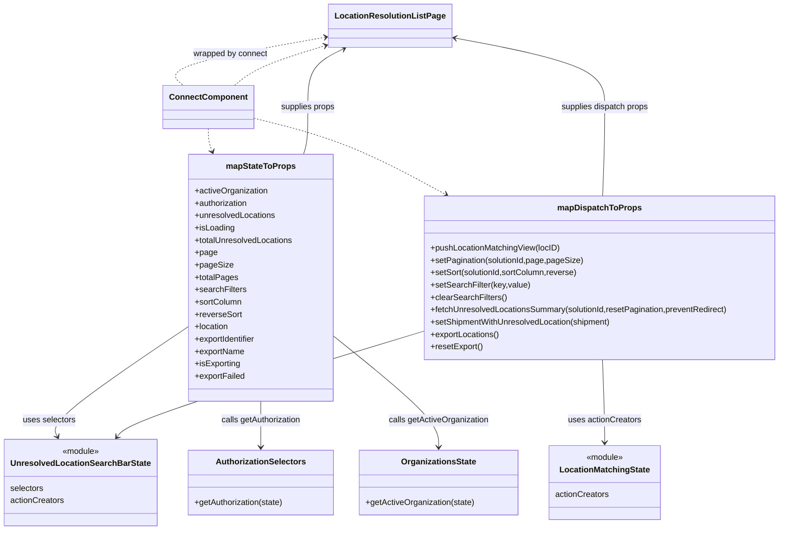

# Diagram: web/portal/src/pages/administration/location-management/unresolved-locations/LocationManagement.UnresolvedLocations.page.container.js

> Auto-generated by Obscura crawlers

## Mermaid

### SVG

<svg id="container" width="1497.7265625" xmlns="http://www.w3.org/2000/svg" class="classDiagram" height="1030" viewBox="0 0 1497.7265625 1030" role="graphics-document document" aria-roledescription="class"><g><defs><marker id="container_class-aggregationStart" class="marker aggregation class" refX="18" refY="7" markerWidth="190" markerHeight="240" orient="auto"><path d="M 18,7 L9,13 L1,7 L9,1 Z"></path></marker></defs><defs><marker id="container_class-aggregationEnd" class="marker aggregation class" refX="1" refY="7" markerWidth="20" markerHeight="28" orient="auto"><path d="M 18,7 L9,13 L1,7 L9,1 Z"></path></marker></defs><defs><marker id="container_class-extensionStart" class="marker extension class" refX="18" refY="7" markerWidth="190" markerHeight="240" orient="auto"><path d="M 1,7 L18,13 V 1 Z"></path></marker></defs><defs><marker id="container_class-extensionEnd" class="marker extension class" refX="1" refY="7" markerWidth="20" markerHeight="28" orient="auto"><path d="M 1,1 V 13 L18,7 Z"></path></marker></defs><defs><marker id="container_class-compositionStart" class="marker composition class" refX="18" refY="7" markerWidth="190" markerHeight="240" orient="auto"><path d="M 18,7 L9,13 L1,7 L9,1 Z"></path></marker></defs><defs><marker id="container_class-compositionEnd" class="marker composition class" refX="1" refY="7" markerWidth="20" markerHeight="28" orient="auto"><path d="M 18,7 L9,13 L1,7 L9,1 Z"></path></marker></defs><defs><marker id="container_class-dependencyStart" class="marker dependency class" refX="6" refY="7" markerWidth="190" markerHeight="240" orient="auto"><path d="M 5,7 L9,13 L1,7 L9,1 Z"></path></marker></defs><defs><marker id="container_class-dependencyEnd" class="marker dependency class" refX="13" refY="7" markerWidth="20" markerHeight="28" orient="auto"><path d="M 18,7 L9,13 L14,7 L9,1 Z"></path></marker></defs><defs><marker id="container_class-lollipopStart" class="marker lollipop class" refX="13" refY="7" markerWidth="190" markerHeight="240" orient="auto"><circle stroke="black" fill="transparent" cx="7" cy="7" r="6"></circle></marker></defs><defs><marker id="container_class-lollipopEnd" class="marker lollipop class" refX="1" refY="7" markerWidth="190" markerHeight="240" orient="auto"><circle stroke="black" fill="transparent" cx="7" cy="7" r="6"></circle></marker></defs><g class="root"><g class="clusters"></g><g class="edgePaths"><path d="M350.996,636.606L307.145,666.672C263.293,696.737,175.59,756.869,134.411,792.209C93.232,827.549,98.577,838.099,101.25,843.373L103.922,848.648" id="id_mapStateToProps_UnresolvedLocationSearchBarState_1" class="edge-thickness-normal edge-pattern-solid relation" style=";;;" data-edge="true" data-et="edge" data-id="id_mapStateToProps_UnresolvedLocationSearchBarState_1" data-points="W3sieCI6MzUwLjk5NjA5Mzc1LCJ5Ijo2MzYuNjA1OTgyOTYzODI5NX0seyJ4Ijo4Ny44ODY3MTg3NSwieSI6ODE3fSx7IngiOjEwNi42MzM5NzQ2OTAwODI2NSwieSI6ODU0fV0=" marker-end="url(#container_class-dependencyEnd)"></path><path d="M491.898,780L491.898,786.167C491.898,792.333,491.898,804.667,491.898,819.5C491.898,834.333,491.898,851.667,491.898,860.333L491.898,869" id="id_mapStateToProps_AuthorizationSelectors_2" class="edge-thickness-normal edge-pattern-solid relation" style=";;;" data-edge="true" data-et="edge" data-id="id_mapStateToProps_AuthorizationSelectors_2" data-points="W3sieCI6NDkxLjg5ODQzNzUsInkiOjc4MH0seyJ4Ijo0OTEuODk4NDM3NSwieSI6ODE3fSx7IngiOjQ5MS44OTg0Mzc1LCJ5Ijo4NzV9XQ==" marker-end="url(#container_class-dependencyEnd)"></path><path d="M632.801,653.193L666.785,680.494C700.77,707.795,768.738,762.398,802.723,798.366C836.707,834.333,836.707,851.667,836.707,860.333L836.707,869" id="id_mapStateToProps_OrganizationsState_3" class="edge-thickness-normal edge-pattern-solid relation" style=";;;" data-edge="true" data-et="edge" data-id="id_mapStateToProps_OrganizationsState_3" data-points="W3sieCI6NjMyLjgwMDc4MTI1LCJ5Ijo2NTMuMTkzMDg3MTk3MzgwOH0seyJ4Ijo4MzYuNzA3MDMxMjUsInkiOjgxN30seyJ4Ijo4MzYuNzA3MDMxMjUsInkiOjg3NX1d" marker-end="url(#container_class-dependencyEnd)"></path><path d="M574.28,300L575.71,295.833C577.14,291.667,580.001,283.333,581.431,268C582.861,252.667,582.861,230.333,582.861,206C582.861,181.667,582.861,155.333,594.173,136.451C605.486,117.569,628.11,106.137,639.422,100.422L650.734,94.706" id="id_mapStateToProps_LocationResolutionListPage_4" class="edge-thickness-normal edge-pattern-solid relation" style=";;;" data-edge="true" data-et="edge" data-id="id_mapStateToProps_LocationResolutionListPage_4" data-points="W3sieCI6NTc0LjI3OTkyMzM0OTA1NjYsInkiOjMwMH0seyJ4Ijo1ODIuODYxMzI4MTI1LCJ5IjoyNzV9LHsieCI6NTgyLjg2MTMyODEyNSwieSI6MjA4fSx7IngiOjU4Mi44NjEzMjgxMjUsInkiOjEyOX0seyJ4Ijo2NTYuMDg5Mjc1MTE4NjcwOSwieSI6OTJ9XQ==" marker-end="url(#container_class-dependencyEnd)"></path><path d="M803.641,644.856L709.777,673.546C615.913,702.237,428.185,759.619,330.272,793.678C232.359,827.737,224.261,838.473,220.212,843.841L216.164,849.21" id="id_mapDispatchToProps_UnresolvedLocationSearchBarState_5" class="edge-thickness-normal edge-pattern-solid relation" style=";;;" data-edge="true" data-et="edge" data-id="id_mapDispatchToProps_UnresolvedLocationSearchBarState_5" data-points="W3sieCI6ODAzLjY0MDYyNSwieSI6NjQ0Ljg1NTU2OTU0MDU5MTV9LHsieCI6MjQwLjQ1NzAzMTI1LCJ5Ijo4MTd9LHsieCI6MjEyLjU1MDU1NTI2ODU5NTA1LCJ5Ijo4NTR9XQ==" marker-end="url(#container_class-dependencyEnd)"></path><path d="M1152.424,699L1153.134,718.667C1153.844,738.333,1155.264,777.667,1155.974,804.5C1156.684,831.333,1156.684,845.667,1156.684,852.833L1156.684,860" id="id_mapDispatchToProps_LocationMatchingState_6" class="edge-thickness-normal edge-pattern-solid relation" style=";;;" data-edge="true" data-et="edge" data-id="id_mapDispatchToProps_LocationMatchingState_6" data-points="W3sieCI6MTE1Mi40MjM2NjU5NTIxNjYyLCJ5Ijo2OTl9LHsieCI6MTE1Ni42ODM1OTM3NSwieSI6ODE3fSx7IngiOjExNTYuNjgzNTkzNzUsInkiOjg2Nn1d" marker-end="url(#container_class-dependencyEnd)"></path><path d="M1152.684,381L1153.35,363.333C1154.017,345.667,1155.35,310.333,1156.017,281.5C1156.684,252.667,1156.684,230.333,1156.684,206C1156.684,181.667,1156.684,155.333,1106.98,132.761C1057.276,110.189,957.868,91.377,908.164,81.971L858.46,72.566" id="id_mapDispatchToProps_LocationResolutionListPage_7" class="edge-thickness-normal edge-pattern-solid relation" style=";;;" data-edge="true" data-et="edge" data-id="id_mapDispatchToProps_LocationResolutionListPage_7" data-points="W3sieCI6MTE1Mi42ODM1OTM3NSwieSI6MzgxfSx7IngiOjExNTYuNjgzNTkzNzUsInkiOjI3NX0seyJ4IjoxMTU2LjY4MzU5Mzc1LCJ5IjoyMDh9LHsieCI6MTE1Ni42ODM1OTM3NSwieSI6MTI5fSx7IngiOjg1Mi41NjQ0NTMxMjUsInkiOjcxLjQ1MDA2NDMyODk5MDE1fV0=" marker-end="url(#container_class-dependencyEnd)"></path><path d="M390.1,250L390.1,254.167C390.1,258.333,390.1,266.667,391.342,274.067C392.584,281.466,395.068,287.933,396.31,291.166L397.552,294.399" id="id_ConnectComponent_mapStateToProps_8" class="edge-thickness-normal edge-pattern-dashed relation" style=";;;" data-edge="true" data-et="edge" data-id="id_ConnectComponent_mapStateToProps_8" data-points="W3sieCI6MzkwLjA5OTYwOTM3NSwieSI6MjUwfSx7IngiOjM5MC4wOTk2MDkzNzUsInkiOjI3NX0seyJ4IjozOTkuNzAzMjcyNDA1NjYwMzYsInkiOjMwMH1d" marker-end="url(#container_class-dependencyEnd)"></path><path d="M473.842,228.564L505.358,236.303C536.874,244.043,599.907,259.521,662.796,284.447C725.685,309.372,788.43,343.745,819.802,360.931L851.175,378.117" id="id_ConnectComponent_mapDispatchToProps_9" class="edge-thickness-normal edge-pattern-dashed relation" style=";;;" data-edge="true" data-et="edge" data-id="id_ConnectComponent_mapDispatchToProps_9" data-points="W3sieCI6NDczLjg0MTc5Njg3NSwieSI6MjI4LjU2NDE3NTk4NDY1MjE3fSx7IngiOjY2Mi45Mzk0NTMxMjUsInkiOjI3NX0seyJ4Ijo4NTYuNDM3MTA5Mzc1LCJ5IjozODF9XQ==" marker-end="url(#container_class-dependencyEnd)"></path><path d="M441.484,166L449.029,159.833C456.574,153.667,471.663,141.333,501.438,128.21C531.213,115.087,575.674,101.175,597.905,94.218L620.135,87.262" id="id_ConnectComponent_LocationResolutionListPage_10" class="edge-thickness-normal edge-pattern-dashed relation" style=";;;" data-edge="true" data-et="edge" data-id="id_ConnectComponent_LocationResolutionListPage_10" data-points="W3sieCI6NDQxLjQ4NDM5OTcyMzEwMTI2LCJ5IjoxNjZ9LHsieCI6NDg2Ljc1MTk1MzEyNSwieSI6MTI5fSx7IngiOjYyNS44NjEzMjgxMjUsInkiOjg1LjQ2OTkzNjU2MTk2ODEzfV0=" marker-end="url(#container_class-dependencyEnd)"></path><path d="M619.955,71.299L566.108,80.916C512.261,90.533,404.567,109.766,357.997,125.55C311.427,141.333,325.982,153.667,333.259,159.833L340.536,166" id="id_LocationResolutionListPage_ConnectComponent_11" class="edge-thickness-normal edge-pattern-dashed relation" style=";;;" data-edge="true" data-et="edge" data-id="id_LocationResolutionListPage_ConnectComponent_11" data-points="W3sieCI6NjI1Ljg2MTMyODEyNSwieSI6NzAuMjQ0MTAzMTc5OTk5ODN9LHsieCI6Mjk2Ljg3MzA0Njg3NSwieSI6MTI5fSx7IngiOjM0MC41MzYxMjA0NTA5NDk0LCJ5IjoxNjZ9XQ==" marker-start="url(#container_class-dependencyStart)"></path></g><g class="edgeLabels"><g class="edgeLabel" transform="translate(202.33646, 738.53055)"><g class="label" data-id="id_mapStateToProps_UnresolvedLocationSearchBarState_1" transform="translate(-51.34375, -12)"><foreignObject width="102.6875" height="24">

uses selectors

</foreignObject></g></g><g class="edgeLabel" transform="translate(491.8984375, 817)"><g class="label" data-id="id_mapStateToProps_AuthorizationSelectors_2" transform="translate(-78.90625, -12)"><foreignObject width="157.8125" height="24">

calls getAuthorization

</foreignObject></g></g><g class="edgeLabel" transform="translate(836.70703125, 817)"><g class="label" data-id="id_mapStateToProps_OrganizationsState_3" transform="translate(-97.703125, -12)"><foreignObject width="195.40625" height="24">

calls getActiveOrganization

</foreignObject></g></g><g class="edgeLabel" transform="translate(582.861328125, 208)"><g class="label" data-id="id_mapStateToProps_LocationResolutionListPage_4" transform="translate(-53.4765625, -12)"><foreignObject width="106.953125" height="24">

supplies props

</foreignObject></g></g><g class="edgeLabel" transform="translate(499.88889, 737.70126)"><g class="label" data-id="id_mapDispatchToProps_UnresolvedLocationSearchBarState_5" transform="translate(-71.2734375, -12)"><foreignObject width="142.546875" height="24">

uses actionCreators

</foreignObject></g></g><g class="edgeLabel" transform="translate(1156.68359375, 817)"><g class="label" data-id="id_mapDispatchToProps_LocationMatchingState_6" transform="translate(-71.2734375, -12)"><foreignObject width="142.546875" height="24">

uses actionCreators

</foreignObject></g></g><g class="edgeLabel" transform="translate(1156.68359375, 208)"><g class="label" data-id="id_mapDispatchToProps_LocationResolutionListPage_7" transform="translate(-86.6796875, -12)"><foreignObject width="173.359375" height="24">

supplies dispatch props

</foreignObject></g></g><g class="edgeLabel"><g class="label" data-id="id_ConnectComponent_mapStateToProps_8" transform="translate(0, 0)"><foreignObject width="0" height="0">

</foreignObject></g></g><g class="edgeLabel"><g class="label" data-id="id_ConnectComponent_mapDispatchToProps_9" transform="translate(0, 0)"><foreignObject width="0" height="0">

</foreignObject></g></g><g class="edgeLabel"><g class="label" data-id="id_ConnectComponent_LocationResolutionListPage_10" transform="translate(0, 0)"><foreignObject width="0" height="0">

</foreignObject></g></g><g class="edgeLabel" transform="translate(433.19709, 104.65311)"><g class="label" data-id="id_LocationResolutionListPage_ConnectComponent_11" transform="translate(-73.2265625, -12)"><foreignObject width="146.453125" height="24">

wrapped by connect

</foreignObject></g></g></g><g class="nodes"><g class="node default" id="classId-LocationResolutionListPage-0" transform="translate(739.212890625, 50)"><g class="basic label-container"><path d="M-113.3515625 -42 L113.3515625 -42 L113.3515625 42 L-113.3515625 42" stroke="none" stroke-width="0" fill="#ECECFF" style=""></path><path d="M-113.3515625 -42 C-29.609427320473927 -42, 54.13270785905215 -42, 113.3515625 -42 M-113.3515625 -42 C-35.40176489515494 -42, 42.54803270969012 -42, 113.3515625 -42 M113.3515625 -42 C113.3515625 -17.660869572094526, 113.3515625 6.678260855810947, 113.3515625 42 M113.3515625 -42 C113.3515625 -21.211744171240476, 113.3515625 -0.423488342480951, 113.3515625 42 M113.3515625 42 C38.26251344638109 42, -36.826535607237815 42, -113.3515625 42 M113.3515625 42 C40.598148539911875 42, -32.15526542017625 42, -113.3515625 42 M-113.3515625 42 C-113.3515625 15.58968088030674, -113.3515625 -10.820638239386518, -113.3515625 -42 M-113.3515625 42 C-113.3515625 22.976609632684937, -113.3515625 3.9532192653698743, -113.3515625 -42" stroke="#9370DB" stroke-width="1.3" fill="none" stroke-dasharray="0 0" style=""></path></g><g class="annotation-group text" transform="translate(0, -18)"></g><g class="label-group text" transform="translate(-101.3515625, -18)"><g class="label" style="font-weight: bolder" transform="translate(0,-12)"><foreignObject width="202.703125" height="24">

LocationResolutionListPage

</foreignObject></g></g><g class="members-group text" transform="translate(-101.3515625, 30)"></g><g class="methods-group text" transform="translate(-101.3515625, 60)"></g><g class="divider" style=""><path d="M-113.3515625 6 C-61.6012013638219 6, -9.8508402276438 6, 113.3515625 6 M-113.3515625 6 C-27.185383440411883 6, 58.980795619176234 6, 113.3515625 6" stroke="#9370DB" stroke-width="1.3" fill="none" stroke-dasharray="0 0" style=""></path></g><g class="divider" style=""><path d="M-113.3515625 24 C-57.12262027140668 24, -0.893678042813363 24, 113.3515625 24 M-113.3515625 24 C-57.98427353073199 24, -2.6169845614639797 24, 113.3515625 24" stroke="#9370DB" stroke-width="1.3" fill="none" stroke-dasharray="0 0" style=""></path></g></g><g class="node default" id="classId-ConnectComponent-1" transform="translate(390.099609375, 208)"><g class="basic label-container"><path d="M-83.7421875 -42 L83.7421875 -42 L83.7421875 42 L-83.7421875 42" stroke="none" stroke-width="0" fill="#ECECFF" style=""></path><path d="M-83.7421875 -42 C-36.83498020861477 -42, 10.072227082770453 -42, 83.7421875 -42 M-83.7421875 -42 C-37.44636595140252 -42, 8.84945559719496 -42, 83.7421875 -42 M83.7421875 -42 C83.7421875 -24.94296490796725, 83.7421875 -7.885929815934503, 83.7421875 42 M83.7421875 -42 C83.7421875 -22.634085530660823, 83.7421875 -3.2681710613216453, 83.7421875 42 M83.7421875 42 C20.02533976272835 42, -43.6915079745433 42, -83.7421875 42 M83.7421875 42 C22.71031390900012 42, -38.32155968199976 42, -83.7421875 42 M-83.7421875 42 C-83.7421875 20.708052523661674, -83.7421875 -0.5838949526766513, -83.7421875 -42 M-83.7421875 42 C-83.7421875 17.302990174544124, -83.7421875 -7.394019650911751, -83.7421875 -42" stroke="#9370DB" stroke-width="1.3" fill="none" stroke-dasharray="0 0" style=""></path></g><g class="annotation-group text" transform="translate(0, -18)"></g><g class="label-group text" transform="translate(-71.7421875, -18)"><g class="label" style="font-weight: bolder" transform="translate(0,-12)"><foreignObject width="143.484375" height="24">

ConnectComponent

</foreignObject></g></g><g class="members-group text" transform="translate(-71.7421875, 30)"></g><g class="methods-group text" transform="translate(-71.7421875, 60)"></g><g class="divider" style=""><path d="M-83.7421875 6 C-17.206798072204435 6, 49.32859135559113 6, 83.7421875 6 M-83.7421875 6 C-45.402727973971956 6, -7.063268447943912 6, 83.7421875 6" stroke="#9370DB" stroke-width="1.3" fill="none" stroke-dasharray="0 0" style=""></path></g><g class="divider" style=""><path d="M-83.7421875 24 C-19.33503555646476 24, 45.07211638707048 24, 83.7421875 24 M-83.7421875 24 C-30.689774958374883 24, 22.362637583250233 24, 83.7421875 24" stroke="#9370DB" stroke-width="1.3" fill="none" stroke-dasharray="0 0" style=""></path></g></g><g class="node default" id="classId-mapStateToProps-2" transform="translate(491.8984375, 540)"><g class="basic label-container"><path d="M-140.90234375 -240 L140.90234375 -240 L140.90234375 240 L-140.90234375 240" stroke="none" stroke-width="0" fill="#ECECFF" style=""></path><path d="M-140.90234375 -240 C-49.83175263183385 -240, 41.2388384863323 -240, 140.90234375 -240 M-140.90234375 -240 C-72.97348172875718 -240, -5.044619707514357 -240, 140.90234375 -240 M140.90234375 -240 C140.90234375 -98.93230394201271, 140.90234375 42.13539211597458, 140.90234375 240 M140.90234375 -240 C140.90234375 -91.52998691108735, 140.90234375 56.9400261778253, 140.90234375 240 M140.90234375 240 C58.47832048640511 240, -23.94570277718978 240, -140.90234375 240 M140.90234375 240 C29.83789547148335 240, -81.2265528070333 240, -140.90234375 240 M-140.90234375 240 C-140.90234375 92.3260926230277, -140.90234375 -55.34781475394459, -140.90234375 -240 M-140.90234375 240 C-140.90234375 126.40140194276488, -140.90234375 12.802803885529755, -140.90234375 -240" stroke="#9370DB" stroke-width="1.3" fill="none" stroke-dasharray="0 0" style=""></path></g><g class="annotation-group text" transform="translate(0, -216)"></g><g class="label-group text" transform="translate(-64.7109375, -216)"><g class="label" style="font-weight: bolder" transform="translate(0,-12)"><foreignObject width="129.421875" height="24">

mapStateToProps

</foreignObject></g></g><g class="members-group text" transform="translate(-128.90234375, -168)"><g class="label" style="" transform="translate(0,-12)"><foreignObject width="143" height="24">

+activeOrganization

</foreignObject></g><g class="label" style="" transform="translate(0,12)"><foreignObject width="105.421875" height="24">

+authorization

</foreignObject></g><g class="label" style="" transform="translate(0,36)"><foreignObject width="158.125" height="24">

+unresolvedLocations

</foreignObject></g><g class="label" style="" transform="translate(0,60)"><foreignObject width="77.203125" height="24">

+isLoading

</foreignObject></g><g class="label" style="" transform="translate(0,84)"><foreignObject width="193.09375" height="24">

+totalUnresolvedLocations

</foreignObject></g><g class="label" style="" transform="translate(0,108)"><foreignObject width="42.65625" height="24">

+page

</foreignObject></g><g class="label" style="" transform="translate(0,132)"><foreignObject width="71.5" height="24">

+pageSize

</foreignObject></g><g class="label" style="" transform="translate(0,156)"><foreignObject width="82.90625" height="24">

+totalPages

</foreignObject></g><g class="label" style="" transform="translate(0,180)"><foreignObject width="99.609375" height="24">

+searchFilters

</foreignObject></g><g class="label" style="" transform="translate(0,204)"><foreignObject width="91.828125" height="24">

+sortColumn

</foreignObject></g><g class="label" style="" transform="translate(0,228)"><foreignObject width="91.015625" height="24">

+reverseSort

</foreignObject></g><g class="label" style="" transform="translate(0,252)"><foreignObject width="67.140625" height="24">

+location

</foreignObject></g><g class="label" style="" transform="translate(0,276)"><foreignObject width="121.890625" height="24">

+exportIdentifier

</foreignObject></g><g class="label" style="" transform="translate(0,300)"><foreignObject width="97.1875" height="24">

+exportName

</foreignObject></g><g class="label" style="" transform="translate(0,324)"><foreignObject width="89.296875" height="24">

+isExporting

</foreignObject></g><g class="label" style="" transform="translate(0,348)"><foreignObject width="98.140625" height="24">

+exportFailed

</foreignObject></g></g><g class="methods-group text" transform="translate(-128.90234375, 240)"></g><g class="divider" style=""><path d="M-140.90234375 -192 C-55.03786237123154 -192, 30.82661900753692 -192, 140.90234375 -192 M-140.90234375 -192 C-43.866400822684255 -192, 53.16954210463149 -192, 140.90234375 -192" stroke="#9370DB" stroke-width="1.3" fill="none" stroke-dasharray="0 0" style=""></path></g><g class="divider" style=""><path d="M-140.90234375 216 C-60.992740459882185 216, 18.91686283023563 216, 140.90234375 216 M-140.90234375 216 C-28.495517592720816 216, 83.91130856455837 216, 140.90234375 216" stroke="#9370DB" stroke-width="1.3" fill="none" stroke-dasharray="0 0" style=""></path></g></g><g class="node default" id="classId-mapDispatchToProps-3" transform="translate(1146.68359375, 540)"><g class="basic label-container"><path d="M-343.04296875 -159 L343.04296875 -159 L343.04296875 159 L-343.04296875 159" stroke="none" stroke-width="0" fill="#ECECFF" style=""></path><path d="M-343.04296875 -159 C-128.76215343204964 -159, 85.51866188590071 -159, 343.04296875 -159 M-343.04296875 -159 C-115.24474592636344 -159, 112.55347689727313 -159, 343.04296875 -159 M343.04296875 -159 C343.04296875 -81.21756182996522, 343.04296875 -3.43512365993044, 343.04296875 159 M343.04296875 -159 C343.04296875 -46.62166555387314, 343.04296875 65.75666889225371, 343.04296875 159 M343.04296875 159 C117.81479896329228 159, -107.41337082341545 159, -343.04296875 159 M343.04296875 159 C177.99884301719126 159, 12.954717284382525 159, -343.04296875 159 M-343.04296875 159 C-343.04296875 61.086289968495535, -343.04296875 -36.82742006300893, -343.04296875 -159 M-343.04296875 159 C-343.04296875 60.1286717962703, -343.04296875 -38.74265640745941, -343.04296875 -159" stroke="#9370DB" stroke-width="1.3" fill="none" stroke-dasharray="0 0" style=""></path></g><g class="annotation-group text" transform="translate(0, -135)"></g><g class="label-group text" transform="translate(-77.1953125, -135)"><g class="label" style="font-weight: bolder" transform="translate(0,-12)"><foreignObject width="154.390625" height="24">

mapDispatchToProps

</foreignObject></g></g><g class="members-group text" transform="translate(-331.04296875, -87)"></g><g class="methods-group text" transform="translate(-331.04296875, -57)"><g class="label" style="" transform="translate(0,-12)"><foreignObject width="252.28125" height="24">

+pushLocationMatchingView(locID)

</foreignObject></g><g class="label" style="" transform="translate(0,12)"><foreignObject width="297.015625" height="24">

+setPagination(solutionId,page,pageSize)

</foreignObject></g><g class="label" style="" transform="translate(0,36)"><foreignObject width="289.046875" height="24">

+setSort(solutionId,sortColumn,reverse)

</foreignObject></g><g class="label" style="" transform="translate(0,60)"><foreignObject width="191.96875" height="24">

+setSearchFilter(key,value)

</foreignObject></g><g class="label" style="" transform="translate(0,84)"><foreignObject width="146.921875" height="24">

+clearSearchFilters()

</foreignObject></g><g class="label" style="" transform="translate(0,108)"><foreignObject width="584.890625" height="24">

+fetchUnresolvedLocationsSummary(solutionId,resetPagination,preventRedirect)

</foreignObject></g><g class="label" style="" transform="translate(0,132)"><foreignObject width="355.28125" height="24">

+setShipmentWithUnresolvedLocation(shipment)

</foreignObject></g><g class="label" style="" transform="translate(0,156)"><foreignObject width="135.078125" height="24">

+exportLocations()

</foreignObject></g><g class="label" style="" transform="translate(0,180)"><foreignObject width="101.859375" height="24">

+resetExport()

</foreignObject></g></g><g class="divider" style=""><path d="M-343.04296875 -111 C-124.75893660754323 -111, 93.52509553491353 -111, 343.04296875 -111 M-343.04296875 -111 C-180.07095225572402 -111, -17.098935761448047 -111, 343.04296875 -111" stroke="#9370DB" stroke-width="1.3" fill="none" stroke-dasharray="0 0" style=""></path></g><g class="divider" style=""><path d="M-343.04296875 -87 C-94.59695861489811 -87, 153.84905152020377 -87, 343.04296875 -87 M-343.04296875 -87 C-81.49930042920892 -87, 180.04436789158217 -87, 343.04296875 -87" stroke="#9370DB" stroke-width="1.3" fill="none" stroke-dasharray="0 0" style=""></path></g></g><g class="node default" id="classId-UnresolvedLocationSearchBarState-4" transform="translate(149.1953125, 938)"><g class="basic label-container"><path d="M-141.1953125 -84 L141.1953125 -84 L141.1953125 84 L-141.1953125 84" stroke="none" stroke-width="0" fill="#ECECFF" style=""></path><path d="M-141.1953125 -84 C-72.03312565289289 -84, -2.8709388057857836 -84, 141.1953125 -84 M-141.1953125 -84 C-32.03874237212729 -84, 77.11782775574542 -84, 141.1953125 -84 M141.1953125 -84 C141.1953125 -35.83515990071089, 141.1953125 12.329680198578217, 141.1953125 84 M141.1953125 -84 C141.1953125 -30.33803147320409, 141.1953125 23.32393705359182, 141.1953125 84 M141.1953125 84 C55.04580267521993 84, -31.103707149560137 84, -141.1953125 84 M141.1953125 84 C76.88248373614665 84, 12.569654972293307 84, -141.1953125 84 M-141.1953125 84 C-141.1953125 18.420015905765496, -141.1953125 -47.15996818846901, -141.1953125 -84 M-141.1953125 84 C-141.1953125 42.49405688528667, -141.1953125 0.9881137705733352, -141.1953125 -84" stroke="#9370DB" stroke-width="1.3" fill="none" stroke-dasharray="0 0" style=""></path></g><g class="annotation-group text" transform="translate(-36.6015625, -60)"><g class="label" style="" transform="translate(0,-12)"><foreignObject width="73.203125" height="24">

«module»

</foreignObject></g></g><g class="label-group text" transform="translate(-129.1953125, -36)"><g class="label" style="font-weight: bolder" transform="translate(0,-12)"><foreignObject width="258.390625" height="24">

UnresolvedLocationSearchBarState

</foreignObject></g></g><g class="members-group text" transform="translate(-129.1953125, 12)"><g class="label" style="" transform="translate(0,-12)"><foreignObject width="65.46875" height="24">

selectors

</foreignObject></g><g class="label" style="" transform="translate(0,12)"><foreignObject width="105.34375" height="24">

actionCreators

</foreignObject></g></g><g class="methods-group text" transform="translate(-129.1953125, 84)"></g><g class="divider" style=""><path d="M-141.1953125 -12 C-80.24339151557237 -12, -19.29147053114474 -12, 141.1953125 -12 M-141.1953125 -12 C-62.725651477492775 -12, 15.74400954501445 -12, 141.1953125 -12" stroke="#9370DB" stroke-width="1.3" fill="none" stroke-dasharray="0 0" style=""></path></g><g class="divider" style=""><path d="M-141.1953125 60 C-30.333057843159466 60, 80.52919681368107 60, 141.1953125 60 M-141.1953125 60 C-48.42618391446371 60, 44.34294467107259 60, 141.1953125 60" stroke="#9370DB" stroke-width="1.3" fill="none" stroke-dasharray="0 0" style=""></path></g></g><g class="node default" id="classId-LocationMatchingState-5" transform="translate(1156.68359375, 938)"><g class="basic label-container"><path d="M-106.67578125 -72 L106.67578125 -72 L106.67578125 72 L-106.67578125 72" stroke="none" stroke-width="0" fill="#ECECFF" style=""></path><path d="M-106.67578125 -72 C-29.93572332263645 -72, 46.8043346047271 -72, 106.67578125 -72 M-106.67578125 -72 C-49.703019173731946 -72, 7.269742902536109 -72, 106.67578125 -72 M106.67578125 -72 C106.67578125 -25.00616024602413, 106.67578125 21.98767950795174, 106.67578125 72 M106.67578125 -72 C106.67578125 -20.996494919354376, 106.67578125 30.007010161291248, 106.67578125 72 M106.67578125 72 C35.99561257715942 72, -34.68455609568116 72, -106.67578125 72 M106.67578125 72 C25.3227542353614 72, -56.0302727792772 72, -106.67578125 72 M-106.67578125 72 C-106.67578125 38.63716778594369, -106.67578125 5.274335571887377, -106.67578125 -72 M-106.67578125 72 C-106.67578125 23.291278744907565, -106.67578125 -25.41744251018487, -106.67578125 -72" stroke="#9370DB" stroke-width="1.3" fill="none" stroke-dasharray="0 0" style=""></path></g><g class="annotation-group text" transform="translate(-36.6015625, -48)"><g class="label" style="" transform="translate(0,-12)"><foreignObject width="73.203125" height="24">

«module»

</foreignObject></g></g><g class="label-group text" transform="translate(-84.0078125, -24)"><g class="label" style="font-weight: bolder" transform="translate(0,-12)"><foreignObject width="168.015625" height="24">

LocationMatchingState

</foreignObject></g></g><g class="members-group text" transform="translate(-94.67578125, 24)"><g class="label" style="" transform="translate(0,-12)"><foreignObject width="105.34375" height="24">

actionCreators

</foreignObject></g></g><g class="methods-group text" transform="translate(-94.67578125, 72)"></g><g class="divider" style=""><path d="M-106.67578125 0 C-49.39989436945102 0, 7.875992511097962 0, 106.67578125 0 M-106.67578125 0 C-32.07965378239173 0, 42.51647368521654 0, 106.67578125 0" stroke="#9370DB" stroke-width="1.3" fill="none" stroke-dasharray="0 0" style=""></path></g><g class="divider" style=""><path d="M-106.67578125 48 C-61.23014131085956 48, -15.784501371719116 48, 106.67578125 48 M-106.67578125 48 C-60.516998828402926 48, -14.358216406805852 48, 106.67578125 48" stroke="#9370DB" stroke-width="1.3" fill="none" stroke-dasharray="0 0" style=""></path></g></g><g class="node default" id="classId-AuthorizationSelectors-6" transform="translate(491.8984375, 938)"><g class="basic label-container"><path d="M-141.5078125 -63 L141.5078125 -63 L141.5078125 63 L-141.5078125 63" stroke="none" stroke-width="0" fill="#ECECFF" style=""></path><path d="M-141.5078125 -63 C-40.44420119632848 -63, 60.61941010734304 -63, 141.5078125 -63 M-141.5078125 -63 C-37.45297378073661 -63, 66.60186493852677 -63, 141.5078125 -63 M141.5078125 -63 C141.5078125 -27.02785442582188, 141.5078125 8.944291148356243, 141.5078125 63 M141.5078125 -63 C141.5078125 -26.037733501540636, 141.5078125 10.924532996918728, 141.5078125 63 M141.5078125 63 C77.78266992638265 63, 14.05752735276532 63, -141.5078125 63 M141.5078125 63 C42.08071518636126 63, -57.34638212727748 63, -141.5078125 63 M-141.5078125 63 C-141.5078125 22.931233420849992, -141.5078125 -17.137533158300016, -141.5078125 -63 M-141.5078125 63 C-141.5078125 25.05522630051432, -141.5078125 -12.88954739897136, -141.5078125 -63" stroke="#9370DB" stroke-width="1.3" fill="none" stroke-dasharray="0 0" style=""></path></g><g class="annotation-group text" transform="translate(0, -39)"></g><g class="label-group text" transform="translate(-83.875, -39)"><g class="label" style="font-weight: bolder" transform="translate(0,-12)"><foreignObject width="167.75" height="24">

AuthorizationSelectors

</foreignObject></g></g><g class="members-group text" transform="translate(-129.5078125, 9)"></g><g class="methods-group text" transform="translate(-129.5078125, 39)"><g class="label" style="" transform="translate(0,-12)"><foreignObject width="175.140625" height="24">

+getAuthorization(state)

</foreignObject></g></g><g class="divider" style=""><path d="M-141.5078125 -15 C-76.57101185748539 -15, -11.634211214970776 -15, 141.5078125 -15 M-141.5078125 -15 C-45.43172916136733 -15, 50.64435417726534 -15, 141.5078125 -15" stroke="#9370DB" stroke-width="1.3" fill="none" stroke-dasharray="0 0" style=""></path></g><g class="divider" style=""><path d="M-141.5078125 9 C-83.45817660001723 9, -25.408540700034465 9, 141.5078125 9 M-141.5078125 9 C-51.37381942622903 9, 38.76017364754193 9, 141.5078125 9" stroke="#9370DB" stroke-width="1.3" fill="none" stroke-dasharray="0 0" style=""></path></g></g><g class="node default" id="classId-OrganizationsState-7" transform="translate(836.70703125, 938)"><g class="basic label-container"><path d="M-153.30078125 -63 L153.30078125 -63 L153.30078125 63 L-153.30078125 63" stroke="none" stroke-width="0" fill="#ECECFF" style=""></path><path d="M-153.30078125 -63 C-65.1559922320689 -63, 22.988796785862206 -63, 153.30078125 -63 M-153.30078125 -63 C-43.94025937509322 -63, 65.42026249981356 -63, 153.30078125 -63 M153.30078125 -63 C153.30078125 -33.88057809648325, 153.30078125 -4.761156192966496, 153.30078125 63 M153.30078125 -63 C153.30078125 -22.693727928847068, 153.30078125 17.612544142305865, 153.30078125 63 M153.30078125 63 C52.227058232006314 63, -48.84666478598737 63, -153.30078125 63 M153.30078125 63 C86.2996233040057 63, 19.298465358011413 63, -153.30078125 63 M-153.30078125 63 C-153.30078125 14.39317283914582, -153.30078125 -34.21365432170836, -153.30078125 -63 M-153.30078125 63 C-153.30078125 37.47389511218192, -153.30078125 11.947790224363843, -153.30078125 -63" stroke="#9370DB" stroke-width="1.3" fill="none" stroke-dasharray="0 0" style=""></path></g><g class="annotation-group text" transform="translate(0, -39)"></g><g class="label-group text" transform="translate(-69.8671875, -39)"><g class="label" style="font-weight: bolder" transform="translate(0,-12)"><foreignObject width="139.734375" height="24">

OrganizationsState

</foreignObject></g></g><g class="members-group text" transform="translate(-141.30078125, 9)"></g><g class="methods-group text" transform="translate(-141.30078125, 39)"><g class="label" style="" transform="translate(0,-12)"><foreignObject width="212.734375" height="24">

+getActiveOrganization(state)

</foreignObject></g></g><g class="divider" style=""><path d="M-153.30078125 -15 C-81.49139823254015 -15, -9.682015215080298 -15, 153.30078125 -15 M-153.30078125 -15 C-90.79877235747304 -15, -28.296763464946068 -15, 153.30078125 -15" stroke="#9370DB" stroke-width="1.3" fill="none" stroke-dasharray="0 0" style=""></path></g><g class="divider" style=""><path d="M-153.30078125 9 C-84.90835011146076 9, -16.515918972921526 9, 153.30078125 9 M-153.30078125 9 C-36.48102421125452 9, 80.33873282749096 9, 153.30078125 9" stroke="#9370DB" stroke-width="1.3" fill="none" stroke-dasharray="0 0" style=""></path></g></g></g></g></g></svg>
