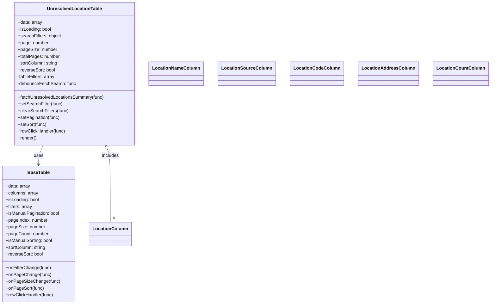

# Diagram: web/portal/src/pages/administration/location-management/unresolved-locations/components/UnresolvedLocationTable.js


> Auto-generated by Obscura crawlers

## Diagram 1



### SVG

<svg id="container" width="1664.3359375" xmlns="http://www.w3.org/2000/svg" class="classDiagram" height="1074" viewBox="0 0 1664.3359375 1074" role="graphics-document document" aria-roledescription="class"><style>#container{font-family:"trebuchet ms",verdana,arial,sans-serif;font-size:16px;fill:#333;}@keyframes edge-animation-frame{from{stroke-dashoffset:0;}}@keyframes dash{to{stroke-dashoffset:0;}}#container .edge-animation-slow{stroke-dasharray:9,5!important;stroke-dashoffset:900;animation:dash 50s linear infinite;stroke-linecap:round;}#container .edge-animation-fast{stroke-dasharray:9,5!important;stroke-dashoffset:900;animation:dash 20s linear infinite;stroke-linecap:round;}#container .error-icon{fill:#552222;}#container .error-text{fill:#552222;stroke:#552222;}#container .edge-thickness-normal{stroke-width:1px;}#container .edge-thickness-thick{stroke-width:3.5px;}#container .edge-pattern-solid{stroke-dasharray:0;}#container .edge-thickness-invisible{stroke-width:0;fill:none;}#container .edge-pattern-dashed{stroke-dasharray:3;}#container .edge-pattern-dotted{stroke-dasharray:2;}#container .marker{fill:#333333;stroke:#333333;}#container .marker.cross{stroke:#333333;}#container svg{font-family:"trebuchet ms",verdana,arial,sans-serif;font-size:16px;}#container p{margin:0;}#container g.classGroup text{fill:#9370DB;stroke:none;font-family:"trebuchet ms",verdana,arial,sans-serif;font-size:10px;}#container g.classGroup text .title{font-weight:bolder;}#container .nodeLabel,#container .edgeLabel{color:#131300;}#container .edgeLabel .label rect{fill:#ECECFF;}#container .label text{fill:#131300;}#container .labelBkg{background:#ECECFF;}#container .edgeLabel .label span{background:#ECECFF;}#container .classTitle{font-weight:bolder;}#container .node rect,#container .node circle,#container .node ellipse,#container .node polygon,#container .node path{fill:#ECECFF;stroke:#9370DB;stroke-width:1px;}#container .divider{stroke:#9370DB;stroke-width:1;}#container g.clickable{cursor:pointer;}#container g.classGroup rect{fill:#ECECFF;stroke:#9370DB;}#container g.classGroup line{stroke:#9370DB;stroke-width:1;}#container .classLabel .box{stroke:none;stroke-width:0;fill:#ECECFF;opacity:0.5;}#container .classLabel .label{fill:#9370DB;font-size:10px;}#container .relation{stroke:#333333;stroke-width:1;fill:none;}#container .dashed-line{stroke-dasharray:3;}#container .dotted-line{stroke-dasharray:1 2;}#container #compositionStart,#container .composition{fill:#333333!important;stroke:#333333!important;stroke-width:1;}#container #compositionEnd,#container .composition{fill:#333333!important;stroke:#333333!important;stroke-width:1;}#container #dependencyStart,#container .dependency{fill:#333333!important;stroke:#333333!important;stroke-width:1;}#container #dependencyStart,#container .dependency{fill:#333333!important;stroke:#333333!important;stroke-width:1;}#container #extensionStart,#container .extension{fill:transparent!important;stroke:#333333!important;stroke-width:1;}#container #extensionEnd,#container .extension{fill:transparent!important;stroke:#333333!important;stroke-width:1;}#container #aggregationStart,#container .aggregation{fill:transparent!important;stroke:#333333!important;stroke-width:1;}#container #aggregationEnd,#container .aggregation{fill:transparent!important;stroke:#333333!important;stroke-width:1;}#container #lollipopStart,#container .lollipop{fill:#ECECFF!important;stroke:#333333!important;stroke-width:1;}#container #lollipopEnd,#container .lollipop{fill:#ECECFF!important;stroke:#333333!important;stroke-width:1;}#container .edgeTerminals{font-size:11px;line-height:initial;}#container .classTitleText{text-anchor:middle;font-size:18px;fill:#333;}#container .label-icon{display:inline-block;height:1em;overflow:visible;vertical-align:-0.125em;}#container .node .label-icon path{fill:currentColor;stroke:revert;stroke-width:revert;}#container :root{--mermaid-font-family:"trebuchet ms",verdana,arial,sans-serif;}</style><g><defs><marker id="container_class-aggregationStart" class="marker aggregation class" refX="18" refY="7" markerWidth="190" markerHeight="240" orient="auto"><path d="M 18,7 L9,13 L1,7 L9,1 Z"></path></marker></defs><defs><marker id="container_class-aggregationEnd" class="marker aggregation class" refX="1" refY="7" markerWidth="20" markerHeight="28" orient="auto"><path d="M 18,7 L9,13 L1,7 L9,1 Z"></path></marker></defs><defs><marker id="container_class-extensionStart" class="marker extension class" refX="18" refY="7" markerWidth="190" markerHeight="240" orient="auto"><path d="M 1,7 L18,13 V 1 Z"></path></marker></defs><defs><marker id="container_class-extensionEnd" class="marker extension class" refX="1" refY="7" markerWidth="20" markerHeight="28" orient="auto"><path d="M 1,1 V 13 L18,7 Z"></path></marker></defs><defs><marker id="container_class-compositionStart" class="marker composition class" refX="18" refY="7" markerWidth="190" markerHeight="240" orient="auto"><path d="M 18,7 L9,13 L1,7 L9,1 Z"></path></marker></defs><defs><marker id="container_class-compositionEnd" class="marker composition class" refX="1" refY="7" markerWidth="20" markerHeight="28" orient="auto"><path d="M 18,7 L9,13 L1,7 L9,1 Z"></path></marker></defs><defs><marker id="container_class-dependencyStart" class="marker dependency class" refX="6" refY="7" markerWidth="190" markerHeight="240" orient="auto"><path d="M 5,7 L9,13 L1,7 L9,1 Z"></path></marker></defs><defs><marker id="container_class-dependencyEnd" class="marker dependency class" refX="13" refY="7" markerWidth="20" markerHeight="28" orient="auto"><path d="M 18,7 L9,13 L14,7 L9,1 Z"></path></marker></defs><defs><marker id="container_class-lollipopStart" class="marker lollipop class" refX="13" refY="7" markerWidth="190" markerHeight="240" orient="auto"><circle stroke="black" fill="transparent" cx="7" cy="7" r="6"></circle></marker></defs><defs><marker id="container_class-lollipopEnd" class="marker lollipop class" refX="1" refY="7" markerWidth="190" markerHeight="240" orient="auto"><circle stroke="black" fill="transparent" cx="7" cy="7" r="6"></circle></marker></defs><g class="root"><g class="clusters"></g><g class="edgePaths"><path d="M149.931,512L147.297,518.167C144.662,524.333,139.394,536.667,136.759,548C134.125,559.333,134.125,569.667,134.125,574.833L134.125,580" id="id_UnresolvedLocationTable_BaseTable_1" class="edge-thickness-normal edge-pattern-solid relation" style=";;;" data-edge="true" data-et="edge" data-id="id_UnresolvedLocationTable_BaseTable_1" data-points="W3sieCI6MTQ5LjkzMDkxNzQ5NTY3NDc1LCJ5Ijo1MTJ9LHsieCI6MTM0LjEyNSwieSI6NTQ5fSx7IngiOjEzNC4xMjUsInkiOjU4Nn1d" marker-end="url(#container_class-dependencyEnd)"></path><path d="M372.01,527.863L373.515,531.386C375.019,534.909,378.029,541.954,379.534,584.644C381.039,627.333,381.039,705.667,381.039,744.833L381.039,784" id="id_UnresolvedLocationTable_LocationColumn_2" class="edge-thickness-normal edge-pattern-solid relation" style=";;;" data-edge="true" data-et="edge" data-id="id_UnresolvedLocationTable_LocationColumn_2" data-points="W3sieCI6MzY1LjIzMzE0NTAwNDMyNTI1LCJ5Ijo1MTJ9LHsieCI6MzgxLjAzOTA2MjUsInkiOjU0OX0seyJ4IjozODEuMDM5MDYyNSwieSI6Nzg0fV0=" marker-start="url(#container_class-aggregationStart)"></path></g><g class="edgeLabels"><g class="edgeLabel" transform="translate(134.125, 549)"><g class="label" data-id="id_UnresolvedLocationTable_BaseTable_1" transform="translate(-16.4921875, -12)"><foreignObject width="32.984375" height="24"><div xmlns="http://www.w3.org/1999/xhtml" class="labelBkg" style="display: table-cell; white-space: nowrap; line-height: 1.5; max-width: 200px; text-align: center;"><span class="edgeLabel"><p>uses</p></span></div></foreignObject></g></g><g class="edgeLabel" transform="translate(381.0390625, 549)"><g class="label" data-id="id_UnresolvedLocationTable_LocationColumn_2" transform="translate(-30.6484375, -12)"><foreignObject width="61.296875" height="24"><div xmlns="http://www.w3.org/1999/xhtml" class="labelBkg" style="display: table-cell; white-space: nowrap; line-height: 1.5; max-width: 200px; text-align: center;"><span class="edgeLabel"><p>includes</p></span></div></foreignObject></g></g><g class="edgeTerminals" transform="translate(391.03906125, 761.4999989285715)"><g class="inner" transform="translate(0, 0)"></g><foreignObject style="width: 9px; height: 12px;"><div xmlns="http://www.w3.org/1999/xhtml" style="display: inline-block; padding-right: 1px; white-space: nowrap;"><span class="edgeLabel">5</span></div></foreignObject></g></g><g class="nodes"><g class="node default" id="classId-UnresolvedLocationTable-0" transform="translate(257.58203125, 260)"><g class="basic label-container"><path d="M-211.19140625 -252 L211.19140625 -252 L211.19140625 252 L-211.19140625 252" stroke="none" stroke-width="0" fill="#ECECFF" style=""></path><path d="M-211.19140625 -252 C-90.17817529714902 -252, 30.83505565570195 -252, 211.19140625 -252 M-211.19140625 -252 C-86.35415615316782 -252, 38.48309394366436 -252, 211.19140625 -252 M211.19140625 -252 C211.19140625 -149.26863434879567, 211.19140625 -46.537268697591344, 211.19140625 252 M211.19140625 -252 C211.19140625 -70.22649436866155, 211.19140625 111.5470112626769, 211.19140625 252 M211.19140625 252 C59.969997361752746 252, -91.25141152649451 252, -211.19140625 252 M211.19140625 252 C59.12173531948628 252, -92.94793561102745 252, -211.19140625 252 M-211.19140625 252 C-211.19140625 126.69715094740647, -211.19140625 1.3943018948129406, -211.19140625 -252 M-211.19140625 252 C-211.19140625 132.53369064159727, -211.19140625 13.067381283194521, -211.19140625 -252" stroke="#9370DB" stroke-width="1.3" fill="none" stroke-dasharray="0 0" style=""></path></g><g class="annotation-group text" transform="translate(0, -228)"></g><g class="label-group text" transform="translate(-92.4765625, -228)"><g class="label" style="font-weight: bolder" transform="translate(0,-12)"><foreignObject width="184.953125" height="24"><div xmlns="http://www.w3.org/1999/xhtml" style="display: table-cell; white-space: nowrap; line-height: 1.5; max-width: 233px; text-align: center;"><span class="nodeLabel markdown-node-label" style=""><p>UnresolvedLocationTable</p></span></div></foreignObject></g></g><g class="members-group text" transform="translate(-199.19140625, -180)"><g class="label" style="" transform="translate(0,-12)"><foreignObject width="85.546875" height="24"><div xmlns="http://www.w3.org/1999/xhtml" style="display: table-cell; white-space: nowrap; line-height: 1.5; max-width: 143px; text-align: center;"><span class="nodeLabel markdown-node-label" style=""><p>+data: array</p></span></div></foreignObject></g><g class="label" style="" transform="translate(0,12)"><foreignObject width="118.171875" height="24"><div xmlns="http://www.w3.org/1999/xhtml" style="display: table-cell; white-space: nowrap; line-height: 1.5; max-width: 176px; text-align: center;"><span class="nodeLabel markdown-node-label" style=""><p>+isLoading: bool</p></span></div></foreignObject></g><g class="label" style="" transform="translate(0,36)"><foreignObject width="153.15625" height="24"><div xmlns="http://www.w3.org/1999/xhtml" style="display: table-cell; white-space: nowrap; line-height: 1.5; max-width: 211px; text-align: center;"><span class="nodeLabel markdown-node-label" style=""><p>+searchFilters: object</p></span></div></foreignObject></g><g class="label" style="" transform="translate(0,60)"><foreignObject width="107.546875" height="24"><div xmlns="http://www.w3.org/1999/xhtml" style="display: table-cell; white-space: nowrap; line-height: 1.5; max-width: 166px; text-align: center;"><span class="nodeLabel markdown-node-label" style=""><p>+page: number</p></span></div></foreignObject></g><g class="label" style="" transform="translate(0,84)"><foreignObject width="136.375" height="24"><div xmlns="http://www.w3.org/1999/xhtml" style="display: table-cell; white-space: nowrap; line-height: 1.5; max-width: 195px; text-align: center;"><span class="nodeLabel markdown-node-label" style=""><p>+pageSize: number</p></span></div></foreignObject></g><g class="label" style="" transform="translate(0,108)"><foreignObject width="147.78125" height="24"><div xmlns="http://www.w3.org/1999/xhtml" style="display: table-cell; white-space: nowrap; line-height: 1.5; max-width: 206px; text-align: center;"><span class="nodeLabel markdown-node-label" style=""><p>+totalPages: number</p></span></div></foreignObject></g><g class="label" style="" transform="translate(0,132)"><foreignObject width="141.546875" height="24"><div xmlns="http://www.w3.org/1999/xhtml" style="display: table-cell; white-space: nowrap; line-height: 1.5; max-width: 200px; text-align: center;"><span class="nodeLabel markdown-node-label" style=""><p>+sortColumn: string</p></span></div></foreignObject></g><g class="label" style="" transform="translate(0,156)"><foreignObject width="132.046875" height="24"><div xmlns="http://www.w3.org/1999/xhtml" style="display: table-cell; white-space: nowrap; line-height: 1.5; max-width: 190px; text-align: center;"><span class="nodeLabel markdown-node-label" style=""><p>+reverseSort: bool</p></span></div></foreignObject></g><g class="label" style="" transform="translate(0,180)"><foreignObject width="132.640625" height="24"><div xmlns="http://www.w3.org/1999/xhtml" style="display: table-cell; white-space: nowrap; line-height: 1.5; max-width: 190px; text-align: center;"><span class="nodeLabel markdown-node-label" style=""><p>-tableFilters: array</p></span></div></foreignObject></g><g class="label" style="" transform="translate(0,204)"><foreignObject width="205.390625" height="24"><div xmlns="http://www.w3.org/1999/xhtml" style="display: table-cell; white-space: nowrap; line-height: 1.5; max-width: 263px; text-align: center;"><span class="nodeLabel markdown-node-label" style=""><p>-debounceFetchSearch: func</p></span></div></foreignObject></g></g><g class="methods-group text" transform="translate(-199.19140625, 84)"><g class="label" style="" transform="translate(0,-12)"><foreignObject width="305.90625" height="24"><div xmlns="http://www.w3.org/1999/xhtml" style="display: table-cell; white-space: nowrap; line-height: 1.5; max-width: 363px; text-align: center;"><span class="nodeLabel markdown-node-label" style=""><p>+fetchUnresolvedLocationsSummary(func)</p></span></div></foreignObject></g><g class="label" style="" transform="translate(0,12)"><foreignObject width="157.65625" height="24"><div xmlns="http://www.w3.org/1999/xhtml" style="display: table-cell; white-space: nowrap; line-height: 1.5; max-width: 215px; text-align: center;"><span class="nodeLabel markdown-node-label" style=""><p>+setSearchFilter(func)</p></span></div></foreignObject></g><g class="label" style="" transform="translate(0,36)"><foreignObject width="178.609375" height="24"><div xmlns="http://www.w3.org/1999/xhtml" style="display: table-cell; white-space: nowrap; line-height: 1.5; max-width: 236px; text-align: center;"><span class="nodeLabel markdown-node-label" style=""><p>+clearSearchFilters(func)</p></span></div></foreignObject></g><g class="label" style="" transform="translate(0,60)"><foreignObject width="148.90625" height="24"><div xmlns="http://www.w3.org/1999/xhtml" style="display: table-cell; white-space: nowrap; line-height: 1.5; max-width: 206px; text-align: center;"><span class="nodeLabel markdown-node-label" style=""><p>+setPagination(func)</p></span></div></foreignObject></g><g class="label" style="" transform="translate(0,84)"><foreignObject width="102.046875" height="24"><div xmlns="http://www.w3.org/1999/xhtml" style="display: table-cell; white-space: nowrap; line-height: 1.5; max-width: 159px; text-align: center;"><span class="nodeLabel markdown-node-label" style=""><p>+setSort(func)</p></span></div></foreignObject></g><g class="label" style="" transform="translate(0,108)"><foreignObject width="168.4375" height="24"><div xmlns="http://www.w3.org/1999/xhtml" style="display: table-cell; white-space: nowrap; line-height: 1.5; max-width: 226px; text-align: center;"><span class="nodeLabel markdown-node-label" style=""><p>+rowClickHandler(func)</p></span></div></foreignObject></g><g class="label" style="" transform="translate(0,132)"><foreignObject width="66.609375" height="24"><div xmlns="http://www.w3.org/1999/xhtml" style="display: table-cell; white-space: nowrap; line-height: 1.5; max-width: 124px; text-align: center;"><span class="nodeLabel markdown-node-label" style=""><p>+render()</p></span></div></foreignObject></g></g><g class="divider" style=""><path d="M-211.19140625 -204 C-99.28198158253977 -204, 12.627443084920458 -204, 211.19140625 -204 M-211.19140625 -204 C-86.8508098907186 -204, 37.48978646856281 -204, 211.19140625 -204" stroke="#9370DB" stroke-width="1.3" fill="none" stroke-dasharray="0 0" style=""></path></g><g class="divider" style=""><path d="M-211.19140625 60 C-96.36065967748178 60, 18.470086895036445 60, 211.19140625 60 M-211.19140625 60 C-123.96424189945651 60, -36.73707754891302 60, 211.19140625 60" stroke="#9370DB" stroke-width="1.3" fill="none" stroke-dasharray="0 0" style=""></path></g></g><g class="node default" id="classId-BaseTable-1" transform="translate(134.125, 826)"><g class="basic label-container"><path d="M-126.125 -240 L126.125 -240 L126.125 240 L-126.125 240" stroke="none" stroke-width="0" fill="#ECECFF" style=""></path><path d="M-126.125 -240 C-59.9322927373388 -240, 6.260414525322403 -240, 126.125 -240 M-126.125 -240 C-39.93696971968943 -240, 46.25106056062114 -240, 126.125 -240 M126.125 -240 C126.125 -69.53074423830887, 126.125 100.93851152338226, 126.125 240 M126.125 -240 C126.125 -92.49548648921296, 126.125 55.00902702157407, 126.125 240 M126.125 240 C59.322720807701984 240, -7.479558384596032 240, -126.125 240 M126.125 240 C53.99761031960625 240, -18.129779360787495 240, -126.125 240 M-126.125 240 C-126.125 142.10929741104627, -126.125 44.21859482209257, -126.125 -240 M-126.125 240 C-126.125 67.0173792176202, -126.125 -105.9652415647596, -126.125 -240" stroke="#9370DB" stroke-width="1.3" fill="none" stroke-dasharray="0 0" style=""></path></g><g class="annotation-group text" transform="translate(0, -216)"></g><g class="label-group text" transform="translate(-37.359375, -216)"><g class="label" style="font-weight: bolder" transform="translate(0,-12)"><foreignObject width="74.71875" height="24"><div xmlns="http://www.w3.org/1999/xhtml" style="display: table-cell; white-space: nowrap; line-height: 1.5; max-width: 123px; text-align: center;"><span class="nodeLabel markdown-node-label" style=""><p>BaseTable</p></span></div></foreignObject></g></g><g class="members-group text" transform="translate(-114.125, -168)"><g class="label" style="" transform="translate(0,-12)"><foreignObject width="85.546875" height="24"><div xmlns="http://www.w3.org/1999/xhtml" style="display: table-cell; white-space: nowrap; line-height: 1.5; max-width: 143px; text-align: center;"><span class="nodeLabel markdown-node-label" style=""><p>+data: array</p></span></div></foreignObject></g><g class="label" style="" transform="translate(0,12)"><foreignObject width="114.140625" height="24"><div xmlns="http://www.w3.org/1999/xhtml" style="display: table-cell; white-space: nowrap; line-height: 1.5; max-width: 172px; text-align: center;"><span class="nodeLabel markdown-node-label" style=""><p>+columns: array</p></span></div></foreignObject></g><g class="label" style="" transform="translate(0,36)"><foreignObject width="118.171875" height="24"><div xmlns="http://www.w3.org/1999/xhtml" style="display: table-cell; white-space: nowrap; line-height: 1.5; max-width: 176px; text-align: center;"><span class="nodeLabel markdown-node-label" style=""><p>+isLoading: bool</p></span></div></foreignObject></g><g class="label" style="" transform="translate(0,60)"><foreignObject width="94.21875" height="24"><div xmlns="http://www.w3.org/1999/xhtml" style="display: table-cell; white-space: nowrap; line-height: 1.5; max-width: 152px; text-align: center;"><span class="nodeLabel markdown-node-label" style=""><p>+filters: array</p></span></div></foreignObject></g><g class="label" style="" transform="translate(0,84)"><foreignObject width="190.890625" height="24"><div xmlns="http://www.w3.org/1999/xhtml" style="display: table-cell; white-space: nowrap; line-height: 1.5; max-width: 249px; text-align: center;"><span class="nodeLabel markdown-node-label" style=""><p>+isManualPagination: bool</p></span></div></foreignObject></g><g class="label" style="" transform="translate(0,108)"><foreignObject width="147.609375" height="24"><div xmlns="http://www.w3.org/1999/xhtml" style="display: table-cell; white-space: nowrap; line-height: 1.5; max-width: 206px; text-align: center;"><span class="nodeLabel markdown-node-label" style=""><p>+pageIndex: number</p></span></div></foreignObject></g><g class="label" style="" transform="translate(0,132)"><foreignObject width="136.375" height="24"><div xmlns="http://www.w3.org/1999/xhtml" style="display: table-cell; white-space: nowrap; line-height: 1.5; max-width: 195px; text-align: center;"><span class="nodeLabel markdown-node-label" style=""><p>+pageSize: number</p></span></div></foreignObject></g><g class="label" style="" transform="translate(0,156)"><foreignObject width="150.0625" height="24"><div xmlns="http://www.w3.org/1999/xhtml" style="display: table-cell; white-space: nowrap; line-height: 1.5; max-width: 208px; text-align: center;"><span class="nodeLabel markdown-node-label" style=""><p>+pageCount: number</p></span></div></foreignObject></g><g class="label" style="" transform="translate(0,180)"><foreignObject width="166.234375" height="24"><div xmlns="http://www.w3.org/1999/xhtml" style="display: table-cell; white-space: nowrap; line-height: 1.5; max-width: 224px; text-align: center;"><span class="nodeLabel markdown-node-label" style=""><p>+isManualSorting: bool</p></span></div></foreignObject></g><g class="label" style="" transform="translate(0,204)"><foreignObject width="141.546875" height="24"><div xmlns="http://www.w3.org/1999/xhtml" style="display: table-cell; white-space: nowrap; line-height: 1.5; max-width: 200px; text-align: center;"><span class="nodeLabel markdown-node-label" style=""><p>+sortColumn: string</p></span></div></foreignObject></g><g class="label" style="" transform="translate(0,228)"><foreignObject width="132.046875" height="24"><div xmlns="http://www.w3.org/1999/xhtml" style="display: table-cell; white-space: nowrap; line-height: 1.5; max-width: 190px; text-align: center;"><span class="nodeLabel markdown-node-label" style=""><p>+reverseSort: bool</p></span></div></foreignObject></g></g><g class="methods-group text" transform="translate(-114.125, 120)"><g class="label" style="" transform="translate(0,-12)"><foreignObject width="158.75" height="24"><div xmlns="http://www.w3.org/1999/xhtml" style="display: table-cell; white-space: nowrap; line-height: 1.5; max-width: 216px; text-align: center;"><span class="nodeLabel markdown-node-label" style=""><p>+onFilterChange(func)</p></span></div></foreignObject></g><g class="label" style="" transform="translate(0,12)"><foreignObject width="155.5625" height="24"><div xmlns="http://www.w3.org/1999/xhtml" style="display: table-cell; white-space: nowrap; line-height: 1.5; max-width: 213px; text-align: center;"><span class="nodeLabel markdown-node-label" style=""><p>+onPageChange(func)</p></span></div></foreignObject></g><g class="label" style="" transform="translate(0,36)"><foreignObject width="184.390625" height="24"><div xmlns="http://www.w3.org/1999/xhtml" style="display: table-cell; white-space: nowrap; line-height: 1.5; max-width: 242px; text-align: center;"><span class="nodeLabel markdown-node-label" style=""><p>+onPageSizeChange(func)</p></span></div></foreignObject></g><g class="label" style="" transform="translate(0,60)"><foreignObject width="132.53125" height="24"><div xmlns="http://www.w3.org/1999/xhtml" style="display: table-cell; white-space: nowrap; line-height: 1.5; max-width: 190px; text-align: center;"><span class="nodeLabel markdown-node-label" style=""><p>+onPageSort(func)</p></span></div></foreignObject></g><g class="label" style="" transform="translate(0,84)"><foreignObject width="168.4375" height="24"><div xmlns="http://www.w3.org/1999/xhtml" style="display: table-cell; white-space: nowrap; line-height: 1.5; max-width: 226px; text-align: center;"><span class="nodeLabel markdown-node-label" style=""><p>+rowClickHandler(func)</p></span></div></foreignObject></g></g><g class="divider" style=""><path d="M-126.125 -192 C-41.2624785983887 -192, 43.60004280322261 -192, 126.125 -192 M-126.125 -192 C-33.63810856313819 -192, 58.84878287372362 -192, 126.125 -192" stroke="#9370DB" stroke-width="1.3" fill="none" stroke-dasharray="0 0" style=""></path></g><g class="divider" style=""><path d="M-126.125 96 C-74.6220052594499 96, -23.119010518899813 96, 126.125 96 M-126.125 96 C-38.88258044292475 96, 48.3598391141505 96, 126.125 96" stroke="#9370DB" stroke-width="1.3" fill="none" stroke-dasharray="0 0" style=""></path></g></g><g class="node default" id="classId-LocationColumn-2" transform="translate(381.0390625, 826)"><g class="basic label-container"><path d="M-70.7890625 -42 L70.7890625 -42 L70.7890625 42 L-70.7890625 42" stroke="none" stroke-width="0" fill="#ECECFF" style=""></path><path d="M-70.7890625 -42 C-38.41430534980467 -42, -6.039548199609342 -42, 70.7890625 -42 M-70.7890625 -42 C-21.0724480424499 -42, 28.6441664151002 -42, 70.7890625 -42 M70.7890625 -42 C70.7890625 -15.797895478274274, 70.7890625 10.404209043451452, 70.7890625 42 M70.7890625 -42 C70.7890625 -20.498102586263983, 70.7890625 1.003794827472035, 70.7890625 42 M70.7890625 42 C21.464352882537348 42, -27.860356734925304 42, -70.7890625 42 M70.7890625 42 C19.02306136763353 42, -32.74293976473294 42, -70.7890625 42 M-70.7890625 42 C-70.7890625 11.72955906264647, -70.7890625 -18.54088187470706, -70.7890625 -42 M-70.7890625 42 C-70.7890625 18.07856328909635, -70.7890625 -5.8428734218072975, -70.7890625 -42" stroke="#9370DB" stroke-width="1.3" fill="none" stroke-dasharray="0 0" style=""></path></g><g class="annotation-group text" transform="translate(0, -18)"></g><g class="label-group text" transform="translate(-58.7890625, -18)"><g class="label" style="font-weight: bolder" transform="translate(0,-12)"><foreignObject width="117.578125" height="24"><div xmlns="http://www.w3.org/1999/xhtml" style="display: table-cell; white-space: nowrap; line-height: 1.5; max-width: 167px; text-align: center;"><span class="nodeLabel markdown-node-label" style=""><p>LocationColumn</p></span></div></foreignObject></g></g><g class="members-group text" transform="translate(-58.7890625, 30)"></g><g class="methods-group text" transform="translate(-58.7890625, 60)"></g><g class="divider" style=""><path d="M-70.7890625 6 C-15.221409665087066 6, 40.34624316982587 6, 70.7890625 6 M-70.7890625 6 C-33.81705409929003 6, 3.1549543014199344 6, 70.7890625 6" stroke="#9370DB" stroke-width="1.3" fill="none" stroke-dasharray="0 0" style=""></path></g><g class="divider" style=""><path d="M-70.7890625 24 C-27.132225150966256 24, 16.524612198067487 24, 70.7890625 24 M-70.7890625 24 C-21.133420956661986 24, 28.522220586676028 24, 70.7890625 24" stroke="#9370DB" stroke-width="1.3" fill="none" stroke-dasharray="0 0" style=""></path></g></g><g class="node default" id="classId-LocationNameColumn-3" transform="translate(610.421875, 260)"><g class="basic label-container"><path d="M-91.6484375 -42 L91.6484375 -42 L91.6484375 42 L-91.6484375 42" stroke="none" stroke-width="0" fill="#ECECFF" style=""></path><path d="M-91.6484375 -42 C-29.363887170520485 -42, 32.92066315895903 -42, 91.6484375 -42 M-91.6484375 -42 C-35.756145996537725 -42, 20.13614550692455 -42, 91.6484375 -42 M91.6484375 -42 C91.6484375 -13.344351955542766, 91.6484375 15.311296088914467, 91.6484375 42 M91.6484375 -42 C91.6484375 -19.869704115841294, 91.6484375 2.2605917683174113, 91.6484375 42 M91.6484375 42 C25.828619006076224 42, -39.99119948784755 42, -91.6484375 42 M91.6484375 42 C24.379126851613208 42, -42.890183796773584 42, -91.6484375 42 M-91.6484375 42 C-91.6484375 8.515085054038451, -91.6484375 -24.969829891923098, -91.6484375 -42 M-91.6484375 42 C-91.6484375 15.087915729323576, -91.6484375 -11.824168541352847, -91.6484375 -42" stroke="#9370DB" stroke-width="1.3" fill="none" stroke-dasharray="0 0" style=""></path></g><g class="annotation-group text" transform="translate(0, -18)"></g><g class="label-group text" transform="translate(-79.6484375, -18)"><g class="label" style="font-weight: bolder" transform="translate(0,-12)"><foreignObject width="159.296875" height="24"><div xmlns="http://www.w3.org/1999/xhtml" style="display: table-cell; white-space: nowrap; line-height: 1.5; max-width: 209px; text-align: center;"><span class="nodeLabel markdown-node-label" style=""><p>LocationNameColumn</p></span></div></foreignObject></g></g><g class="members-group text" transform="translate(-79.6484375, 30)"></g><g class="methods-group text" transform="translate(-79.6484375, 60)"></g><g class="divider" style=""><path d="M-91.6484375 6 C-27.439789973517463 6, 36.76885755296507 6, 91.6484375 6 M-91.6484375 6 C-32.79425341584117 6, 26.059930668317662 6, 91.6484375 6" stroke="#9370DB" stroke-width="1.3" fill="none" stroke-dasharray="0 0" style=""></path></g><g class="divider" style=""><path d="M-91.6484375 24 C-32.51493064477849 24, 26.618576210443024 24, 91.6484375 24 M-91.6484375 24 C-40.518972235610576 24, 10.610493028778848 24, 91.6484375 24" stroke="#9370DB" stroke-width="1.3" fill="none" stroke-dasharray="0 0" style=""></path></g></g><g class="node default" id="classId-LocationSourceColumn-4" transform="translate(847.7421875, 260)"><g class="basic label-container"><path d="M-95.671875 -42 L95.671875 -42 L95.671875 42 L-95.671875 42" stroke="none" stroke-width="0" fill="#ECECFF" style=""></path><path d="M-95.671875 -42 C-38.325754485643934 -42, 19.020366028712132 -42, 95.671875 -42 M-95.671875 -42 C-26.33644673799239 -42, 42.99898152401522 -42, 95.671875 -42 M95.671875 -42 C95.671875 -11.327207611171652, 95.671875 19.345584777656697, 95.671875 42 M95.671875 -42 C95.671875 -17.448675773674413, 95.671875 7.102648452651174, 95.671875 42 M95.671875 42 C44.98127940727748 42, -5.709316185445033 42, -95.671875 42 M95.671875 42 C44.18884213129945 42, -7.294190737401095 42, -95.671875 42 M-95.671875 42 C-95.671875 15.108394964208706, -95.671875 -11.783210071582587, -95.671875 -42 M-95.671875 42 C-95.671875 18.03167407044206, -95.671875 -5.936651859115877, -95.671875 -42" stroke="#9370DB" stroke-width="1.3" fill="none" stroke-dasharray="0 0" style=""></path></g><g class="annotation-group text" transform="translate(0, -18)"></g><g class="label-group text" transform="translate(-83.671875, -18)"><g class="label" style="font-weight: bolder" transform="translate(0,-12)"><foreignObject width="167.34375" height="24"><div xmlns="http://www.w3.org/1999/xhtml" style="display: table-cell; white-space: nowrap; line-height: 1.5; max-width: 216px; text-align: center;"><span class="nodeLabel markdown-node-label" style=""><p>LocationSourceColumn</p></span></div></foreignObject></g></g><g class="members-group text" transform="translate(-83.671875, 30)"></g><g class="methods-group text" transform="translate(-83.671875, 60)"></g><g class="divider" style=""><path d="M-95.671875 6 C-53.70622183257535 6, -11.740568665150704 6, 95.671875 6 M-95.671875 6 C-55.676388218129816 6, -15.680901436259632 6, 95.671875 6" stroke="#9370DB" stroke-width="1.3" fill="none" stroke-dasharray="0 0" style=""></path></g><g class="divider" style=""><path d="M-95.671875 24 C-46.71168144785143 24, 2.2485121042971343 24, 95.671875 24 M-95.671875 24 C-53.436502346522545 24, -11.20112969304509 24, 95.671875 24" stroke="#9370DB" stroke-width="1.3" fill="none" stroke-dasharray="0 0" style=""></path></g></g><g class="node default" id="classId-LocationCodeColumn-5" transform="translate(1082.53125, 260)"><g class="basic label-container"><path d="M-89.1171875 -42 L89.1171875 -42 L89.1171875 42 L-89.1171875 42" stroke="none" stroke-width="0" fill="#ECECFF" style=""></path><path d="M-89.1171875 -42 C-23.561980148664915 -42, 41.99322720267017 -42, 89.1171875 -42 M-89.1171875 -42 C-29.492579977040663 -42, 30.132027545918675 -42, 89.1171875 -42 M89.1171875 -42 C89.1171875 -15.000221742416059, 89.1171875 11.999556515167882, 89.1171875 42 M89.1171875 -42 C89.1171875 -16.67335466229698, 89.1171875 8.65329067540604, 89.1171875 42 M89.1171875 42 C29.42520966967028 42, -30.26676816065944 42, -89.1171875 42 M89.1171875 42 C38.67494144542427 42, -11.767304609151466 42, -89.1171875 42 M-89.1171875 42 C-89.1171875 12.713057364745481, -89.1171875 -16.573885270509038, -89.1171875 -42 M-89.1171875 42 C-89.1171875 16.978794321207094, -89.1171875 -8.042411357585813, -89.1171875 -42" stroke="#9370DB" stroke-width="1.3" fill="none" stroke-dasharray="0 0" style=""></path></g><g class="annotation-group text" transform="translate(0, -18)"></g><g class="label-group text" transform="translate(-77.1171875, -18)"><g class="label" style="font-weight: bolder" transform="translate(0,-12)"><foreignObject width="154.234375" height="24"><div xmlns="http://www.w3.org/1999/xhtml" style="display: table-cell; white-space: nowrap; line-height: 1.5; max-width: 203px; text-align: center;"><span class="nodeLabel markdown-node-label" style=""><p>LocationCodeColumn</p></span></div></foreignObject></g></g><g class="members-group text" transform="translate(-77.1171875, 30)"></g><g class="methods-group text" transform="translate(-77.1171875, 60)"></g><g class="divider" style=""><path d="M-89.1171875 6 C-26.318753114610693 6, 36.47968127077861 6, 89.1171875 6 M-89.1171875 6 C-46.46240723802492 6, -3.8076269760498462 6, 89.1171875 6" stroke="#9370DB" stroke-width="1.3" fill="none" stroke-dasharray="0 0" style=""></path></g><g class="divider" style=""><path d="M-89.1171875 24 C-37.46336631729017 24, 14.190454865419653 24, 89.1171875 24 M-89.1171875 24 C-22.66386864058488 24, 43.78945021883024 24, 89.1171875 24" stroke="#9370DB" stroke-width="1.3" fill="none" stroke-dasharray="0 0" style=""></path></g></g><g class="node default" id="classId-LocationAddressColumn-6" transform="translate(1321.8125, 260)"><g class="basic label-container"><path d="M-100.1640625 -42 L100.1640625 -42 L100.1640625 42 L-100.1640625 42" stroke="none" stroke-width="0" fill="#ECECFF" style=""></path><path d="M-100.1640625 -42 C-49.03309579438636 -42, 2.0978709112272753 -42, 100.1640625 -42 M-100.1640625 -42 C-56.28288202177609 -42, -12.401701543552178 -42, 100.1640625 -42 M100.1640625 -42 C100.1640625 -18.996351334463032, 100.1640625 4.007297331073936, 100.1640625 42 M100.1640625 -42 C100.1640625 -9.88366449055134, 100.1640625 22.23267101889732, 100.1640625 42 M100.1640625 42 C24.320891795352395 42, -51.52227890929521 42, -100.1640625 42 M100.1640625 42 C56.027146968053515 42, 11.89023143610703 42, -100.1640625 42 M-100.1640625 42 C-100.1640625 25.04898875478822, -100.1640625 8.097977509576438, -100.1640625 -42 M-100.1640625 42 C-100.1640625 13.67223889497733, -100.1640625 -14.65552221004534, -100.1640625 -42" stroke="#9370DB" stroke-width="1.3" fill="none" stroke-dasharray="0 0" style=""></path></g><g class="annotation-group text" transform="translate(0, -18)"></g><g class="label-group text" transform="translate(-88.1640625, -18)"><g class="label" style="font-weight: bolder" transform="translate(0,-12)"><foreignObject width="176.328125" height="24"><div xmlns="http://www.w3.org/1999/xhtml" style="display: table-cell; white-space: nowrap; line-height: 1.5; max-width: 225px; text-align: center;"><span class="nodeLabel markdown-node-label" style=""><p>LocationAddressColumn</p></span></div></foreignObject></g></g><g class="members-group text" transform="translate(-88.1640625, 30)"></g><g class="methods-group text" transform="translate(-88.1640625, 60)"></g><g class="divider" style=""><path d="M-100.1640625 6 C-50.4388787295692 6, -0.7136949591383939 6, 100.1640625 6 M-100.1640625 6 C-33.42778788986597 6, 33.308486720268064 6, 100.1640625 6" stroke="#9370DB" stroke-width="1.3" fill="none" stroke-dasharray="0 0" style=""></path></g><g class="divider" style=""><path d="M-100.1640625 24 C-23.8216173421948 24, 52.5208278156104 24, 100.1640625 24 M-100.1640625 24 C-30.680090658793375 24, 38.80388118241325 24, 100.1640625 24" stroke="#9370DB" stroke-width="1.3" fill="none" stroke-dasharray="0 0" style=""></path></g></g><g class="node default" id="classId-LocationCountColumn-7" transform="translate(1564.15625, 260)"><g class="basic label-container"><path d="M-92.1796875 -42 L92.1796875 -42 L92.1796875 42 L-92.1796875 42" stroke="none" stroke-width="0" fill="#ECECFF" style=""></path><path d="M-92.1796875 -42 C-37.168749581799574 -42, 17.842188336400852 -42, 92.1796875 -42 M-92.1796875 -42 C-33.228935142321134 -42, 25.72181721535773 -42, 92.1796875 -42 M92.1796875 -42 C92.1796875 -15.692617599499766, 92.1796875 10.614764801000469, 92.1796875 42 M92.1796875 -42 C92.1796875 -11.917491205045692, 92.1796875 18.165017589908615, 92.1796875 42 M92.1796875 42 C27.36377536413626 42, -37.45213677172748 42, -92.1796875 42 M92.1796875 42 C20.91208787393829 42, -50.35551175212342 42, -92.1796875 42 M-92.1796875 42 C-92.1796875 11.590578942113005, -92.1796875 -18.81884211577399, -92.1796875 -42 M-92.1796875 42 C-92.1796875 21.66957835155494, -92.1796875 1.3391567031098788, -92.1796875 -42" stroke="#9370DB" stroke-width="1.3" fill="none" stroke-dasharray="0 0" style=""></path></g><g class="annotation-group text" transform="translate(0, -18)"></g><g class="label-group text" transform="translate(-80.1796875, -18)"><g class="label" style="font-weight: bolder" transform="translate(0,-12)"><foreignObject width="160.359375" height="24"><div xmlns="http://www.w3.org/1999/xhtml" style="display: table-cell; white-space: nowrap; line-height: 1.5; max-width: 210px; text-align: center;"><span class="nodeLabel markdown-node-label" style=""><p>LocationCountColumn</p></span></div></foreignObject></g></g><g class="members-group text" transform="translate(-80.1796875, 30)"></g><g class="methods-group text" transform="translate(-80.1796875, 60)"></g><g class="divider" style=""><path d="M-92.1796875 6 C-43.61862165868129 6, 4.942444182637416 6, 92.1796875 6 M-92.1796875 6 C-44.53986005169097 6, 3.099967396618055 6, 92.1796875 6" stroke="#9370DB" stroke-width="1.3" fill="none" stroke-dasharray="0 0" style=""></path></g><g class="divider" style=""><path d="M-92.1796875 24 C-30.580590603437912 24, 31.018506293124176 24, 92.1796875 24 M-92.1796875 24 C-38.76095549884028 24, 14.657776502319436 24, 92.1796875 24" stroke="#9370DB" stroke-width="1.3" fill="none" stroke-dasharray="0 0" style=""></path></g></g></g></g></g></svg>

## Diagram 2

```mermaid
flowchart LR
  subgraph Input
    SF[searchFilters]
  end
  SF --> TF[format to tableFilters]
  TF -->|filter out validAddress| TF2[tableFilters (filtered)]
  TF2 --> Base[BaseTable(props)]
  Base --> OnFilter[onFilterChange(filters)]
  OnFilter --> Clear[clearSearchFilters()]
  OnFilter --> ForEach[for each filter -> setSearchFilter(id, value)]
  Clear --> ForEach
  ForEach --> Reapply[setSearchFilter("validAddress", searchFilters.validAddress)]
  Reapply --> Debounce[debounceFetchSearch()]
  Debounce --> Fetch[fetchUnresolvedLocationsSummary()]
```

> SVG rendering failed for this diagram.
